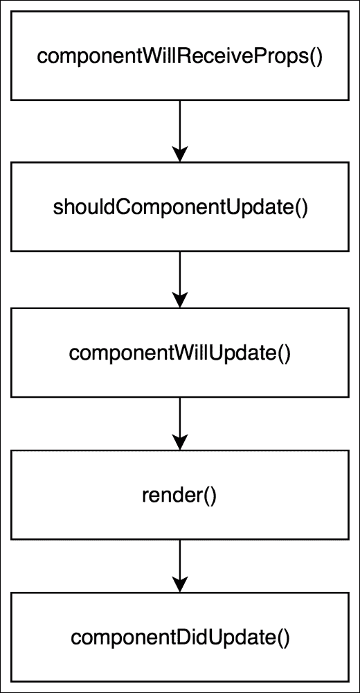

# 第七章：更新您的 React 组件

在上一章中，您已经了解到 React 组件可以经历三个阶段：

+   挂载

+   更新

+   卸载

我们已经讨论了挂载和卸载阶段。在本章中，我们将专注于更新阶段。在此阶段，React 组件已经插入到 DOM 中。这个 DOM 代表了组件的当前状态，当状态发生变化时，React 需要评估新状态将如何改变先前呈现的 DOM。

React 为我们提供了影响更新期间将要呈现的内容以及了解更新发生时的方法。这些方法允许我们控制从当前组件状态到下一个组件状态的过渡。让我们更多地了解 React 组件更新方法的强大性质。

# 理解组件生命周期更新方法

React 组件有五个生命周期方法属于组件的*更新*阶段：

+   `componentWillReceiveProps()`

+   `shouldComponentUpdate()`

+   `componentWillUpdate()`

+   `render()`

+   `componentDidUpdate()`

请参见以下图以获得更好的视图：



您已经熟悉了`render()`方法。现在让我们讨论其他四种方法。

## componentWillReceiveProps 方法

我们将从`StreamTweet`组件中的`componentWillReceiveProps()`方法开始。在`StreamTweet.js`文件的`componentDidMount()`方法之后添加以下代码：

```jsx
componentWillReceiveProps(nextProps) {
  console.log('[Snapterest] StreamTweet: 4\. Running componentWillReceiveProps()');

  const { tweet: currentTweet } = this.props;
  const { tweet: nextTweet } = nextProps;

  const currentTweetLength = currentTweet.text.length;
  const nextTweetLength = nextTweet.text.length;
  const isNumberOfCharactersIncreasing = (nextTweetLength > currentTweetLength);
  let headerText;

  this.setState({
    numberOfCharactersIsIncreasing: isNumberOfCharactersIncreasing
  });

  if (isNumberOfCharactersIncreasing) {
    headerText = 'Number of characters is increasing';
  } else {
    headerText = 'Latest public photo from Twitter';
  }

  this.setState({
    headerText
  });

  window.snapterest.numberOfReceivedTweets++;
}
```

这个方法首先在组件生命周期的更新阶段被调用。当组件从其父组件接收新属性时，它被调用。

这个方法是一个机会，让我们使用`this.props`对象比较当前组件的属性和使用`nextProps`对象比较下一个组件的属性。基于这个比较，我们可以选择使用`this.setState()`函数来更新组件的状态，在这种情况下不会触发额外的渲染。

让我们看看它的实际应用：

```jsx
const { tweet: currentTweet } = this.props;
const { tweet: nextTweet } = nextProps;

const currentTweetLength = currentTweet.text.length;
const nextTweetLength = nextTweet.text.length;
const isNumberOfCharactersIncreasing = (nextTweetLength > currentTweetLength);
let headerText;

this.setState({
  numberOfCharactersIsIncreasing: isNumberOfCharactersIncreasing
});
```

我们首先获取当前推文和下一条推文的长度。当前推文可以通过`this.props.tweet`获得，下一条推文可以通过`nextProps.tweet`获得。然后，我们通过检查下一条推文是否比当前推文更长来比较它们的长度。比较的结果存储在`isNumberOfCharactersIncreasing`变量中。最后，我们通过将`numberOfCharactersIsIncreasing`属性设置为`isNumberOfCharactersIncreasing`变量的值来更新组件的状态。

然后我们将我们的标题文本设置如下：

```jsx
if (isNumberOfCharactersIncreasing) {
  headerText = 'Number of characters is increasing';
} else {
  headerText = 'Latest public photo from Twitter';
}

this.setState({
  headerText
});
```

如果下一条推文更长，我们将把标题文本设置为`'字符数正在增加'`，否则，我们将把它设置为`'来自 Twitter 的最新公共照片'`。然后，我们通过将`headerText`属性设置为`headerText`变量的值来再次更新组件的状态。

请注意，在我们的`componentWillReceiveProps()`方法中调用了`this.setState()`函数两次。这是为了说明一个观点，即无论在`componentWillReceiveProps()`方法中调用`this.setState()`多少次，都不会触发该组件的额外渲染。React 进行了内部优化，将状态更新批处理在一起。

由于`componentWillReceiveProps()`方法将为`StreamTweet`组件接收到的每条新推文调用一次，因此它是一个很好的地方来计算接收到的推文总数：

```jsx
window.snapterest.numberOfReceivedTweets++;
```

现在我们知道如何检查下一条推文是否比我们当前显示的推文更长，但是我们如何选择根本不渲染下一条推文呢？

## shouldComponentUpdate 方法

`shouldComponentUpdate()`方法允许我们决定下一个组件状态是否应该触发组件的重新渲染。该方法返回一个布尔值，默认为`true`，但您可以返回`false`，那么以下组件方法将不会被调用：

+   `componentWillUpdate()`

+   `render()`

+   `componentDidUpdate()`

跳过对组件的`render()`方法的调用将阻止该组件重新渲染，从而提高应用程序的性能，因为不会进行额外的 DOM 变化。

这个方法在组件生命周期的更新阶段中第二次被调用。

这个方法非常适合我们防止显示下一条推文长度为一或更少字符。在`componentWillReceiveProps()`方法之后，将此代码添加到`StreamTweet`组件中：

```jsx
shouldComponentUpdate(nextProps, nextState) {
  console.log('[Snapterest] StreamTweet: 5\. Running shouldComponentUpdate()');

  return (nextProps.tweet.text.length > 1);
}
```

如果下一个 tweet 的长度大于 1，则 `shouldComponentUpdate()` 返回 `true`，并且 `StreamTweet` 组件渲染下一个 tweet。否则，它返回 `false`，并且 `StreamTweet` 组件不渲染下一个状态。

## `componentWillUpdate` 方法

`componentWillUpdate()` 方法在 React 更新 DOM *之前立即* 被调用。它接收以下两个参数：

+   `nextProps`: 下一个属性对象

+   `nextState`: 下一个状态对象

您可以使用这些参数来准备 DOM 更新。但是，您不能在 `componentWillUpdate()` 方法中使用 `this.setState()`。如果您想要在响应属性更改时更新组件的状态，则在 `componentWillReceiveProps()` 方法中执行此操作，React 在属性更改时会调用该方法。

为了演示 `componentWillUpdate()` 方法何时被调用，我们需要在 `StreamTweet` 组件中记录它。在 `shouldComponentUpdate()` 方法之后添加以下代码：

```jsx
componentWillUpdate(nextProps, nextState) {
  console.log('[Snapterest] StreamTweet: 6\. Running componentWillUpdate()');
}
```

在调用 `componentWillUpdate()` 方法后，React 调用执行 DOM 更新的 `render()` 方法。然后，调用 `componentDidUpdate()` 方法。

## `componentDidUpdate` 方法

`componentDidUpdate()` 方法在 React 更新 DOM *之后立即* 被调用。它接收这两个参数：

+   `prevProps`: 先前的属性对象

+   `prevState`: 先前的状态对象

我们将使用这个方法与更新后的 DOM 进行交互或执行任何后渲染操作。在我们的 `StreamTweet` 组件中，我们将使用 `componentDidUpdate()` 来增加全局对象中显示的推文数量。在 `componentWillUpdate()` 方法之后添加以下代码：

```jsx
componentDidUpdate(prevProps, prevState) {
  console.log('[Snapterest] StreamTweet: 7\. Running componentDidUpdate()');

  window.snapterest.numberOfDisplayedTweets++;
}
```

在调用 `componentDidUpdate()` 后，更新周期结束。当组件的状态更新或父组件传递新属性时，会启动新的周期。或者当您调用 `forceUpdate()` 方法时，它会触发新的更新周期，但会跳过触发更新的组件上的 `shouldComponentUpdate()` 方法。然而，`shouldComponentUpdate()` 会按照通常的更新阶段在所有子组件上调用。尽量避免使用 `forceUpdate()` 方法；这将提高应用程序的可维护性。

这结束了我们对 React 组件生命周期方法的讨论。

# 设置默认的 React 组件属性

正如您从上一章所知，我们的 `StreamTweet` 组件渲染了两个子组件：`Header` 和 `Tweet`。

让我们创建这些组件。要做到这一点，导航到`~/snapterest/source/components/`并创建`Header.js`文件：

```jsx
import React from 'react';

export const DEFAULT_HEADER_TEXT = 'Default header';

const headerStyle = {
  fontSize: '16px',
  fontWeight: '300',
  display: 'inline-block',
  margin: '20px 10px'
};

class Header extends React.Component {

  render() {
    const { text } = this.props;

    return (
      <h2 style={headerStyle}>{text}</h2>
    );
  }
}

Header.defaultProps = {
  text: DEFAULT_HEADER_TEXT
};

export default Header;
```

正如您所看到的，我们的`Header`组件是一个无状态组件，渲染`h2`元素。标题文本作为`this.props.text`属性从父组件传递，这使得该组件灵活，可以在需要标题的任何地方重用。我们稍后将在本书中再次重用此组件。

注意`h2`元素有一个`style`属性。

在 React 中，我们可以在 JavaScript 对象中定义 CSS 规则，然后将该对象作为值传递给 React 元素的`style`属性。例如，在这个组件中，我们定义了`headerStyle`变量，引用了一个对象，其中：

+   每个对象键都是一个 CSS 属性。

+   每个对象值都是一个 CSS 值。

包含连字符的 CSS 属性应转换为**驼峰式**风格；例如，`font-size`变成`fontSize`，`font-weight`变成`fontWeight`。

将 CSS 规则定义在 React 组件内部的优势如下：

+   **可移植性**：您可以轻松地共享一个组件以及其样式，全部在一个 JavaScript 文件中。

+   **封装性**：内联样式可以限制其影响范围。

+   **灵活性**：CSS 规则可以使用 JavaScript 的强大功能进行计算。

使用这种技术的一个显著缺点是**内容安全策略**（**CSP**）可能会阻止内联样式产生任何效果。您可以在[`developer.mozilla.org/en-US/docs/Web/HTTP/CSP`](https://developer.mozilla.org/en-US/docs/Web/HTTP/CSP)了解更多关于 CSP 的信息。

我们的`Header`组件有一个我们尚未讨论的属性，即`defaultProps`。如果忘记传递一个 React 组件依赖的属性会怎么样？在这种情况下，组件可以使用`defaultProps`属性设置默认属性；请考虑以下示例：

```jsx
Header.defaultProps = {
  text: DEFAULT_HEADER_TEXT
};
```

在这个例子中，我们将`text`属性的默认值设置为`'Default header'`。如果父组件传递了`this.props.text`属性，那么它将覆盖默认值。

接下来，让我们创建我们的`Tweet`组件。要做到这一点，导航到`~/snapterest/source/components/`并创建`Tweet.js`文件：

```jsx
import React from 'react';
import PropTypes from 'prop-types';

const tweetStyle = {
  position: 'relative',
  display: 'inline-block',
  width: '300px',
  height: '400px',
  margin: '10px'
};

const imageStyle = {
  maxHeight: '400px',
  maxWidth: '100%',
  boxShadow: '0px 1px 1px 0px #aaa',
  border: '1px solid #fff'
};

class Tweet extends React.Component {
  handleImageClick() {
    const { tweet, onImageClick } = this.props;

    if (onImageClick) {
      onImageClick(tweet);
    }
  }

  render() {
    const { tweet } = this.props;
    const tweetMediaUrl = tweet.media[0].url;

    return (
      <div style={tweetStyle}>
        
      </div>
    );
  }
}

Tweet.propTypes = {
  tweet: (properties, propertyName, componentName) => {
    const tweet = properties[propertyName];

    if (! tweet) {
      return new Error('Tweet must be set.');
    }

    if (! tweet.media) {
      return new Error('Tweet must have an image.');
    }
  },
  onImageClick: PropTypes.func
};

export default Tweet;
```

该组件渲染一个带有子``元素的`<div>`元素。这两个元素都有内联样式，而``元素有一个点击事件处理程序，即`this.handleImageClick`。

```jsx
handleImageClick() {
  const { tweet, onImageClick } = this.props;

  if (onImageClick) {
    onImageClick(tweet);
  }
}
```

当用户点击推文的图片时，`Tweet`组件会检查父组件是否将`this.props.onImageClick`回调函数作为属性传递，并调用该函数。`this.props.onImageClick`属性是一个可选的`Tweet`组件属性，因此我们需要检查它是否被传递才能使用它。另一方面，`tweet`是一个必需的属性。

我们如何确保组件接收到所有必需的属性？

# 验证 React 组件属性

在 React 中，有一种方法可以使用组件的`propTypes`对象来验证组件属性：

```jsx
Component.propTypes = {
  propertyName: validator
};
```

在此对象中，您需要指定属性名称和验证函数，该函数将确定属性是否有效。React 为您提供了一些预定义的验证器供您重用。它们都在`prop-types`包的`PropTypes`对象中可用：

+   `PropTypes.number`：这将验证属性是否是数字

+   `PropTypes.string`：这将验证属性是否是字符串

+   `PropTypes.bool`：这将验证属性是否是布尔值

+   `PropTypes.object`：这将验证属性是否是对象

+   `PropTypes.element`：这将验证属性是否是 React 元素

要获取`PropTypes`验证器的完整列表，您可以在[`facebook.github.io/react/docs/typechecking-with-proptypes.html`](https://facebook.github.io/react/docs/typechecking-with-proptypes.html)上查看文档。

默认情况下，您使用`PropTypes`验证器验证的所有属性都是可选的。您可以将它们中的任何一个与`isRequired`链接在一起，以确保在属性丢失时在 JavaScript 控制台上显示警告消息：

```jsx
Component.propTypes = {
  propertyName: PropTypes.number.isRequired
};
```

您还可以指定自己的自定义验证器函数，如果验证失败，应该返回一个`Error`对象：

```jsx
Component.propTypes = {
  propertyName(properties, propertyName, componentName) {
    // ... validation failed
    return new Error('A property is not valid.');
  }
};
```

让我们看看我们`Tweet`组件中的`propTypes`对象：

```jsx
Tweet.propTypes = {
  tweet(properties, propertyName, componentName) {
    const tweet = properties[propertyName];

    if (!tweet) {
      return new Error('Tweet must be set.');
    }

    if (!tweet.media) {
      return new Error('Tweet must have an image.');
    }
  },
  onImageClick: PropTypes.func
};
```

如您所见，我们正在验证两个`Tweet`组件属性：`tweet`和`onImageClick`。

我们使用自定义验证器函数来验证`tweet`属性。React 向此函数传递三个参数：

+   `properties`：这是组件属性对象

+   `propertyName`：这是我们正在验证的属性的名称

+   `componentName`：这是组件的名称

我们首先检查我们的`Tweet`组件是否收到了`tweet`属性：

```jsx
const tweet = properties[propertyName];

if (!tweet) {
  return new Error('Tweet must be set.');
}
```

然后，我们假设`tweet`属性是一个对象，并检查该对象是否没有`media`属性：

```jsx
if (!tweet.media) {
  return new Error('Tweet must have an image.');
}
```

这两个检查都返回一个`Error`对象，将在 JavaScript 控制台中记录。

我们将验证另一个`Tweet`组件的属性`onImageClick`：

```jsx
onImageClick: PropTypes.func
```

我们验证`onImageClick`属性的值是否为函数。在这种情况下，我们重用了`PropTypes`对象提供的验证函数。正如您所看到的，`onImageClick`是一个可选属性，因为我们没有添加`isRequired`。

最后，出于性能原因，`propTypes`仅在 React 的开发版本中进行检查。

# 创建一个 Collection 组件

您可能还记得我们的最顶层层次结构`Application`组件有两个子组件：`Stream`和`Collection`。

到目前为止，我们已经讨论并实现了我们的`Stream`组件及其子组件。接下来，我们将专注于我们的`Collection`组件。

创建`~/snapterest/source/components/Collection.js`文件：

```jsx
import React, { Component } from 'react';
import ReactDOMServer from 'react-dom/server';
import CollectionControls from './CollectionControls';
import TweetList from './TweetList';
import Header from './Header';

class Collection extends Component {
  createHtmlMarkupStringOfTweetList = () => {
    const { tweets } = this.props;

    const htmlString = ReactDOMServer.renderToStaticMarkup(
      <TweetList tweets={tweets} />
    );

    const htmlMarkup = {
      html: htmlString
    };

    return JSON.stringify(htmlMarkup);
  }

  getListOfTweetIds = () =>
    Object.keys(this.props.tweets)

  getNumberOfTweetsInCollection = () =>
    this.getListOfTweetIds().length

  render() {
    const numberOfTweetsInCollection = this.getNumberOfTweetsInCollection();

    if (numberOfTweetsInCollection > 0) {
      const {
        tweets,
        onRemoveAllTweetsFromCollection,
        onRemoveTweetFromCollection
      } = this.props;

      const htmlMarkup = this.createHtmlMarkupStringOfTweetList();

      return (
        <div>
          <CollectionControls
            numberOfTweetsInCollection={numberOfTweetsInCollection}
            htmlMarkup={htmlMarkup}
            onRemoveAllTweetsFromCollection={onRemoveAllTweetsFromCollection}
          />

          <TweetList
            tweets={tweets}
            onRemoveTweetFromCollection={onRemoveTweetFromCollection}
          />

        </div>
      );
    }

    return <Header text="Your collection is empty"/>;
  }
}

export default Collection;
```

我们的`Collection`组件负责渲染两件事：

+   用户收集的推文

+   用于操作该收藏的用户界面控制元素

让我们来看看组件的`render()`方法：

```jsx
render() {
  const numberOfTweetsInCollection = this.getNumberOfTweetsInCollection();

  if (numberOfTweetsInCollection > 0) {
    const {
      tweets,
      onRemoveAllTweetsFromCollection,
      onRemoveTweetFromCollection
    } = this.props;

    const htmlMarkup = this.createHtmlMarkupStringOfTweetList();

    return (
      <div>
        <CollectionControls
          numberOfTweetsInCollection={numberOfTweetsInCollection}
          htmlMarkup={htmlMarkup}
          onRemoveAllTweetsFromCollection={onRemoveAllTweetsFromCollection}
        />

        <TweetList
          tweets={tweets}
          onRemoveTweetFromCollection={onRemoveTweetFromCollection}
        />

      </div>
    );
  }

  return <Header text="Your collection is empty"/>;
}
```

我们首先使用`this.getNumberOfTweetsInCollection()`方法获取收藏中的推文数量：

```jsx
getNumberOfTweetsInCollection = () =>this.getListOfTweetIds().length
```

这种方法又使用另一种方法来获取推文 ID 列表：

```jsx
getListOfTweetIds = () => Object.keys(this.props.tweets);
```

`this.getListOfTweetIds()`函数调用返回一个推文 ID 数组，然后`this.getNumberOfTweetsInCollection()`返回该数组的长度。

在我们的`render()`方法中，一旦我们知道收藏中的推文数量，我们必须做出选择：

+   如果收藏*不*为空，则渲染`CollectionControls`和`TweetList`组件

+   否则，渲染`Header`组件

所有这些组件都渲染什么？

+   `CollectionControls`组件渲染一个带有收藏名称和一组按钮的标题，允许用户重命名、清空和导出收藏

+   `TweetList`组件渲染推文列表

+   `Header`组件只是渲染一个消息头，说明收藏是空的

想法是只有在收藏不为空时才显示收藏。在这种情况下，我们创建了四个变量：

```jsx
const {
  tweets,
  onRemoveAllTweetsFromCollection,
  onRemoveTweetFromCollection
} = this.props;

const htmlMarkup = this.createHtmlMarkupStringOfTweetList();
```

+   `tweets`变量引用了我们从父组件传递的`tweets`属性

+   `htmlMarkup`变量引用了组件的`this.createHtmlMarkupStringOfTweetList()`函数调用返回的字符串

+   `onRemoveAllTweetsFromCollection`和`onRemoveTweetFromCollection`变量引用了从父组件传递的函数

正如其名称所示，`this.createHtmlMarkupStringOfTweetList()`方法创建一个代表通过渲染`TweetList`组件创建的 HTML 标记的字符串：

```jsx
createHtmlMarkupStringOfTweetList = () => {
  const { tweets } = this.props;

  const htmlString = ReactDOMServer.renderToStaticMarkup(
    <TweetList tweets={tweets}/>
  );

  const htmlMarkup = {
    html: htmlString
  };

  return JSON.stringify(htmlMarkup);
}
```

`createHtmlMarkupStringOfTweetList()`方法使用了我们在第三章中讨论过的`ReactDOMServer.renderToStaticMarkup()`函数，*创建你的第一个 React 元素*。我们将`TweetList`组件作为其参数传递：

```jsx
const htmlString = ReactDOMServer.renderToStaticMarkup(
  <TweetList tweets={tweets} />
);
```

这个`TweetList`组件有一个`tweets`属性，引用了父组件传递的`tweets`属性。

`ReactDOMServer.renderToStaticMarkup()`函数产生的结果 HTML 字符串存储在`htmlString`变量中。然后，我们创建一个新的`htmlMarkup`对象，其`html`属性引用了我们的`htmlString`变量。最后，我们使用`JSON.stringify()`函数将我们的`htmlMarkup` JavaScript 对象转换为 JSON 字符串。`JSON.stringify(htmlMarkup)`函数调用的结果就是我们的`createHtmlMarkupStringOfTweetList()`方法返回的内容。

这个方法展示了 React 组件有多么灵活；你可以使用相同的 React 组件来渲染 DOM 元素，也可以生成一个 HTML 标记字符串，可以传递给第三方 API。

另一个有趣的观察是在`render()`方法之外使用 JSX 语法。事实上，你可以在源文件的任何地方使用 JSX，甚至在组件类声明之外。

让我们更仔细地看一下当我们的集合*不*为空时，`Collection`组件返回了什么：

```jsx
return (
  <div>
    <CollectionControls
      numberOfTweetsInCollection={numberOfTweetsInCollection}
      htmlMarkup={htmlMarkup}
      onRemoveAllTweetsFromCollection={onRemoveAllTweetsFromCollection}
    />

    <TweetList
      tweets={tweets}
      onRemoveTweetFromCollection={onRemoveTweetFromCollection}
    />

  </div>
);
```

我们将`CollectionControls`和`TweetList`组件包裹在`<div>`元素中，因为 React 只允许一个根元素。让我们看看每个组件并讨论它的属性。

我们将以下三个属性传递给`CollectionControls`组件：

+   `numberOfTweetsInCollection`属性引用了我们集合中当前的推文数量。

+   `htmlMarkup`属性引用了我们在这个组件中使用`createHtmlMarkupStringOfTweetList()`方法产生的 HTML 标记字符串。

+   `onRemoveAllTweetsFromCollection`属性引用了一个从我们的集合中移除所有推文的函数。这个函数是在`Application`组件中实现的，并在第五章中讨论，*使你的 React 组件响应式*。

我们将这两个属性传递给`TweetList`组件：

+   `tweets`属性引用了从父`Application`组件传递的 tweets。

+   `onRemoveTweetFromCollection`属性引用了一个函数，该函数从我们在`Application`组件的状态中存储的一组 tweets 中移除一个 tweet。我们已经在第五章中讨论过这个函数，*使您的 React 组件响应式*。

这就是我们的`Collection`组件。

# 总结

在本章中，您了解了组件生命周期的更新方法。我们还讨论了如何验证组件属性并设置默认属性值。我们还在我们的 Snapterest 应用程序中取得了良好的进展；我们创建并讨论了`Header`，`Tweet`和`Collection`组件。

在下一章中，我们将专注于构建更复杂的 React 组件，并完成构建我们的 Snapterest 应用程序！
