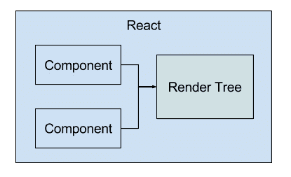
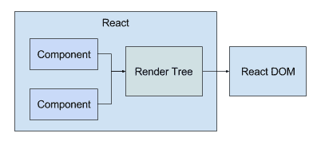
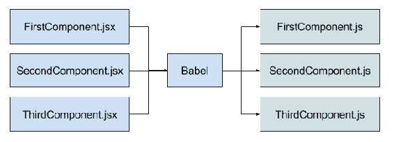
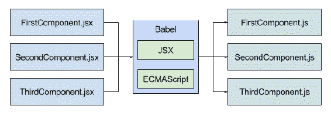
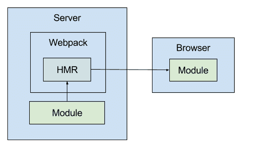
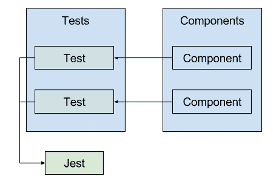
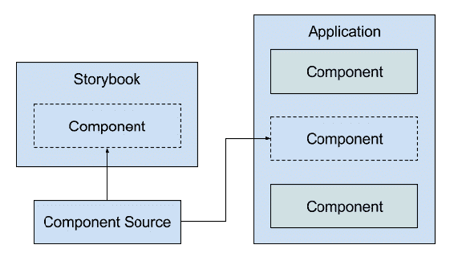
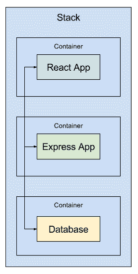

# 第一章：创建个性化的 React 开发生态系统

当人们听到 React 时，他们会想到一个专注于高效渲染用户界面的库。当人们听到框架时，他们会想到一个庞大的系统，其中可能有一些有用的工具，但其他方面都是臃肿的混乱。在大多数情况下，他们对框架是正确的，但说 React 不是框架有点误导人。

如果你拿出 React 并尝试进行任何有意义的开发，你很快就会遇到障碍。这是因为 React 不是作为一个单一的框架分发的，而是更好地描述为一个核心库，周围有一系列工具的生态系统。

框架的优势在于你可以一次性安装核心库以及支持的工具。缺点是每个项目都不同，你无法确定你需要哪些工具，哪些不需要。另一个优势是拥有一系列工具的生态系统可以独立演进；你不必等待整个框架的新版本来增强你的项目所使用的工具之一。

本书的目的是向你展示如何最好地利用围绕 React 的工具生态系统。在本章中，你将通过学习以下内容来介绍 React 工具的概念：

+   没有工具的 React

+   工具介绍

+   本书涵盖的工具

+   决定项目所需的工具

# React 包含了什么

在我们深入讨论工具之前，让我们确保我们对 React 是什么，以及在安装时实际包含了哪些内容有相同的理解。运行 React web 应用程序需要两个核心 React 包。我们现在来看一下这些，为你提供一些关于思考 React 工具的背景知识。

# 比较渲染树的组件

React 核心的第一部分是名为`react`的包。这个包是我们在编写 React 组件时直接接触的。它是一个小型 API——我们真正使用它的唯一时机是在创建带有状态并且需要扩展`Component`类的组件时。

`react`包的内部有很多工作。这就是渲染树所在的地方，负责高效地渲染 UI 元素。渲染树的另一个名称是虚拟 DOM。其思想是你只需要编写描述要渲染的 UI 元素的 JSX 标记，而渲染树会处理其他一切：

在这个图表中，你看到的是你的代码直接与之交互的组件，以及处理由改变状态的组件导致的呈现变化的渲染树。渲染树及其为你做的一切是 React 的关键价值主张。

# DOM 渲染目标

React 核心的第二部分是**文档对象模型**（**DOM**）本身。事实上，虚拟 DOM 的名称根植于 React 在实际与 DOM API 交互之前在 JavaScript 中创建 DOM 表示。然而，渲染树是一个更好的名称，因为 React 基于 React 组件及其状态创建了一个**AST**（抽象语法树）。这就是为什么相同的 React 库能够与 React Native 等项目一起工作。

`react-dom`包用于通过直接与浏览器 DOM API 通信，将渲染树实际转换为 DOM 元素。以下是包括`react-dom`的先前图表的样子：

这是一个很好的架构——这意味着你可以轻松地用另一个渲染目标替换`react-dom`。正如你所看到的，React 的核心层是最小的。难怪它如此受欢迎——我们可以使用声明性代码创建易于维护且高效的用户界面，而我们的工作量很少。有了这个想法，让我们把注意力转向使所有这些成为可能的工具。

# 介绍工具？

工具并不是 React 独有的。每个项目都有自己的一套工具，处理与核心技术相关的任务，这样你就不必自己去处理。对于框架，工具大部分都已经内置到项目中。对于像 React 这样的库，你可以选择你需要的工具，而不需要那些在你的项目中没有作用的工具。

现在你知道了 React 核心是什么，那么 React 生态系统的其余部分是什么呢？

# React 之外的辅助任务

框架膨胀是许多人的主要抵触因素。之所以感觉膨胀，是因为它们有许多你可能永远不会使用的功能。React 处理这一点很好，因为它清楚地区分了核心库和其他任何东西，包括对 React 开发至关重要的东西。

关于 React 及其在周围生态系统中的定位，我做出了两点观察：

+   依赖于简单库而不是包含所有功能的框架的应用程序更容易部署

+   当你有工具大部分时间都不会妨碍你的时候，就更容易思考应用程序开发了。

换句话说，你不必使用大部分 React 工具，但其中一些工具非常有帮助。

任何给定的工具都是外部的，与你正在使用的库是分开的；这一点很重要。工具的存在是为了自动化一些本来会占用我们更多开发时间的事情。生命太短暂，没有时间手动做可以由软件代替的事情。我重申一遍，生命太短暂，没有时间做软件可以比我们做得更好的任务。如果你是一个 React 开发者，可以放心，有工具可以帮你完成所有重要的事情，而你自己没有时间去做。

# 建筑工地的类比

也许，认真对待工具的最终动机是想象一下，如果没有我们作为专业人士所依赖的工具，生活会是什么样子。建筑行业比软件更成熟，并且是一个很好的例子。

想象一下，你是一个负责建造房屋的团队的一部分，这是一个非常复杂的任务，有许多组成部分。现在，想想你要使用的所有东西。让我们从材料本身开始。任何不必在现场组装的东西都不会在现场组装。当你建造房屋时，许多部件会部分组装好。例如，屋顶框架的部分或混凝土在需要时出现。

然后是建筑工人在组装房屋时使用的实际工具——简单的螺丝刀、锤子和卷尺被视为理所当然。如果没有能力在现场制造部件或使用日常建筑材料的工具，建筑生活会是什么样子呢？建造房屋会变得不可能吗？不会。建造过程会变得非常昂贵和缓慢，以至于很可能在完成之前就会被取消吗？会。

不幸的是，在软件世界中，我们才刚刚开始意识到工具的重要性。如果我们没有正确的工具，就算拥有建造未来之屋所需的所有材料和知识也没有用。

# JSX 需要被编译成 JavaScript

React 使用一种类似 HTML 的特殊语法来声明组件。这种标记语言叫做 JSX，它嵌入在组件的 JavaScript 中，在可被浏览器使用之前需要被编译成 JavaScript。

最常见的方法是使用 Babel——一个 JavaScript 编译器——以及一个 JSX 插件：

关键是找到一种使这个编译步骤尽可能无缝的方法。作为开发人员，你不应该需要关心 Babel 产生的 JavaScript 输出。

# 新的 JavaScript 语言特性需要被转译

与将 JSX 编译成 JavaScript 类似，新的 JavaScript 语言特性需要被编译成广泛支持的浏览器版本。事实上，一旦你弄清楚了如何将 JSX 编译成 JavaScript，同样的过程也可以用来在不同版本的 JavaScript 之间进行转译：

你不应该担心你的 JSX 或 JavaScript 编译的转换输出。这些活动更适合由工具来处理，这样你就可以专注于应用程序开发。

# 热模块加载以实现应用程序开发

Web 应用程序开发的独特之处在于，它主要是静态内容，加载到浏览器中。浏览器加载 HTML，然后加载任何脚本，然后运行完成。有一个长时间运行的过程，根据应用程序的状态不断刷新页面——一切都是通过网络进行的。

正如你所想象的那样，在开发过程中这是特别令人恼火的，当你想要看到代码更改的结果时。你不想每次做一些事情都要手动刷新页面。这就是热模块替换发挥作用的地方。基本上，HMR 是一个监听代码更改的工具，当它检测到更改时，它会向浏览器发送模块的新版本：

即使使用了像 Webpack 及其 HMR 组件这样的工具，为了使这个设置正确工作，即使对于简单的 React 项目也是耗时且容易出错的。幸运的是，今天有工具可以隐藏这些设置细节。

# 自动运行单元测试

你知道你需要为你的组件编写测试。并不是你不想编写实际的测试；而是设置它们能够运行可能会很麻烦。Jest 单元测试工具简化了这一点，因为它知道在哪里找到测试并且可以运行它们：

使用 Jest，我们有一个地方可以放置所有的单元测试，每个测试都依赖于它们所测试的组件。这个工具知道在哪里找到这些测试以及如何运行它们。结果是，当我们需要时，我们可以得到很好的单元测试和代码覆盖率输出。除了实际编写测试之外，没有额外的开销。

# 考虑类型安全性

JavaScript 不是一种类型安全的语言。类型安全性可以通过消除运行时错误的可能性大大提高应用程序的质量。我们可以再次使用工具来创建类型安全的 React 应用程序。Flow 工具可以检查你的代码，查找类型注释，并在发现错误时通知你。

# 代码质量检查

拥有一个能够工作的应用程序是一回事；拥有一个既能工作又具有可维护代码的应用程序是另一回事。实现可衡量的代码质量的最佳方法是采用标准，比如 Airbnb 的（[`github.com/airbnb/javascript`](https://github.com/airbnb/javascript)）。强制执行编码标准的最佳方法是使用一个代码检查工具。对于 React 应用程序，首选的代码检查工具是 ESLint（[`eslint.org/`](https://eslint.org/)）。

# 隔离组件开发环境

也许 React 开发者最容易忽视的工具是 Storybook，它用于隔离组件开发。在开发组件时，你可能意识不到，但应用程序可能会妨碍你。有时，你只想看看组件是什么样子，以及它是如何行为的。

使用类似 Storybook 这样的工具，为组件提供一个与其他组件无关的隔离环境是微不足道的。

# 提供基于浏览器的调试环境

有时，查看单元测试输出和源代码并不足以解决您正在经历的问题。相反，您需要查看与应用程序本身的交互情况。在浏览器中，您可以安装 React 工具，以便轻松检查与呈现的 HTML 内容相关的 React 组件。

React 还具有一些内置的性能监控功能，可以扩展浏览器开发人员工具的功能。您可以使用它们来检查和分析您的组件的低级别情况。

# 部署 React 应用程序

当您准备部署 React 应用程序时，它并不像简单地生成构建并分发那样简单。实际上，如果您正在构建托管服务，您甚至可能根本不会分发它。无论您的应用程序的最终用例是什么，除了 React 前端之外，可能还会有几个移动部分。越来越多地，将构成应用程序堆栈的主要进程容器化是首选方法：

为了创建和部署像这样的 React 应用程序堆栈，您将依赖于诸如 Docker 之类的工具，特别是在自动化项目的各种部署场景时。

# 选择正确的工具

如果上一节中的工具对于单个项目来说似乎有点过多，不要担心。试图同时利用每个可能的 React 工具总是一个错误。从基本工具开始，逐个解决问题。随着项目的推进，逐渐添加可选工具以扩展您的工具集。

# 基本工具

有一些 React 工具是您简直无法离开的。例如，浏览器无法理解 JSX 语法，因此需要将其编译为 JavaScript。在编写代码时，您会希望对其进行 lint 处理，以确保不会错过基本错误，并且您会希望运行单元测试。如果努力尝试，您可能可以在没有这些工具的情况下完成。但问题是，您将花费更多的精力来不使用给定的工具，而不是简单地接受它。

作为起点，找到一组最小的 React 工具，使您能够取得进展。一旦您的进展明显放缓，就是时候考虑引入其他工具了。

# 可选工具

可选工具是你可能不会从中获得任何真正价值的东西。例如，你可能不会在项目开始阶段就使用 Flow 来检查类型安全性或 Storybook 来隔离组件开发而获得巨大的好处。

要记住的关键是任何 React 工具都是可选的，没有永久的决定。你可以随时引入 Flow，如果隔离组件开发不是你的菜，你也可以随时放弃 Storybook。

# 总结

本章介绍了 React 生态系统中工具的概念。你了解到 React 本质上是一个简单的库，它依赖于使用多种工具才能在现实世界中产生任何价值。框架试图为你的项目提供所有你需要的工具。虽然方便，但框架用户的需求很难预测，可能会分散注意力，而不是专注于核心功能。

接下来，你了解到 React 中的工具可能是一个挑战，因为作为 React 开发者，你需要负责选择合适的工具并管理它们的配置。然后，你对本书剩余部分将更详细学习的工具进行了概述。最后，你了解到一些工具对于 React 开发是至关重要的，你需要立即设置它们。其他工具是可选的，你可能直到项目后期真正需要时才开始使用它们。

在下一章中，你将使用*Create React App*工具来启动一个 React 项目。
