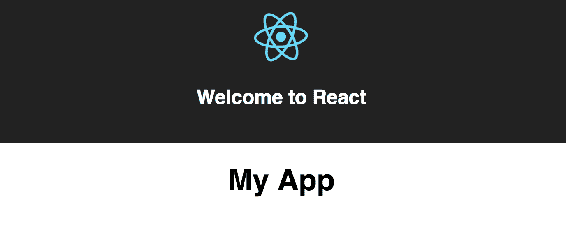
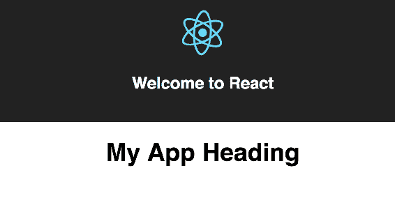

# 第三章：开发模式和精通热重载

在上一章中，你学会了如何使用`create-react-app`。这只是我们*React 工具链*旅程的开始。通过使用`create-react-app`来引导你的应用程序，你安装了许多其他用于开发的工具。这些工具是`react-scripts`包的一部分。本章的重点将是`react-scripts`附带的开发服务器，我们将涵盖：

+   启动开发服务器

+   自动 Webpack 配置

+   利用热组件重新加载

# 启动开发服务器

如果你在上一章中使用`create-react-app`工具创建了一个 React 应用程序，那么你已经拥有了启动开发服务器所需的一切。不需要进行任何配置！让我们立即启动它。首先确保你在项目目录中：

```jsx
cd my-react-app/ 
```

现在你可以启动开发服务器了：

```jsx
npm start 
```

这将使用`react-scripts`包中的`start`脚本启动开发服务器。你应该会看到类似于这样的控制台输出：

```jsx
Compiled successfully!

You can now view my-react-app in the browser.

  Local:            http://localhost:3000/
  On Your Network:  http://192.168.86.101:3000/

Note that the development build is not optimized.
To create a production build, use npm run build. 
```

你会注意到，除了在控制台中打印这个输出之外，这个脚本还会在浏览器中打开一个新的标签页，地址为`http://localhost:3000/`。显示的页面看起来像这样：


到目前为止，在仅仅几章中我们已经取得了很多成就。让我们暂停一下，回顾一下我们所做的事情：

1.  你使用`create-react-app`包创建了一个新的 React 应用程序。

1.  你已经有了基本的项目结构和一个占位符`App`组件来渲染。

1.  你启动了开发服务器，现在你准备构建 React 组件了。

在没有`create-react-app`和`react-scripts`的情况下，要达到这一点通常需要花费数小时。你可能没有数小时来处理元开发工作。很多工作已经为你自动化了！

# Webpack 配置

Webpack 是构建现代 Web 应用程序的首选工具。它强大到足以将从 JSX 语法到静态图像的所有内容编译成准备部署的捆绑包。它还带有一个开发服务器。它的主要缺点是复杂性。有很多需要配置的移动部分才能让 Webpack 起步，但你不需要触及其中任何部分。这是因为大多数为 React 应用程序设置的 Webpack 配置值对于大多数 React 应用程序都是相同的。

有两个独立的开发服务器配置。首先是 Webpack 开发服务器本身。然后是主要的 Webpack 配置，即使你没有使用 Webpack 开发服务器，你也需要它。那么这些配置文件在哪里？它们是`react-scripts`包的一部分，这意味着你不必去瞎折腾它们！

现在让我们浏览一些这些配置值，让你更好地了解你可以避免的不必要的头痛。

# 入口点

入口点用于告诉 Webpack 从哪里开始查找用于构建应用程序的模块。对于一个简单的应用程序，你不需要更多的东西，只需要一个文件作为入口点。例如，这可以是用于渲染你的根 React 组件的`index.js`文件。从其他编程语言借来的术语来看，这个入口点也可以被称为主程序。

当你运行`start`脚本时，`react-scripts`包会在你的源文件夹中寻找一个`index.js`文件。它还添加了一些其他入口点：

+   `Promise`、`fetch()`和`Object.assign()`的填充。只有在目标浏览器中不存在时才会使用它们。

+   一个用于热模块重载的客户端。

这最后两个入口点对于 React 开发非常有价值，但当你试图启动一个项目时，它们并不是你想要考虑的事情。

# 构建输出

Webpack 的工作是打包你的应用程序资源，以便它们可以轻松地从网络中提供。这意味着你必须配置与包输出相关的各种事物，从输出路径和文件开始。Webpack 开发服务器实际上并不会将捆绑文件写入磁盘，因为假定构建会频繁发生。生成的捆绑文件保存在内存中。即使有这个想法，你仍然需要配置主要输出路径，因为 Webpack 开发服务器仍然需要将其作为真实文件提供给浏览器。

除了主要的输出位置，你还可以配置块文件名和用于提供文件的公共路径。块是被分割成更小的片段以避免创建一个太大并可能导致性能问题的单个捆绑文件。等等，什么？在你甚至为你的应用程序实现一个组件之前就考虑性能和用于提供资源的路径？在项目的这一阶段完全是不必要的。别担心，`react-scripts`已经为你提供了配置，你可能永远不需要改变。

# 解析输入文件

Webpack 的一个关键优势是你不需要提供一个需要捆绑的模块列表。一旦在 Webpack 配置中提供了一个入口点，它就可以找出你的应用程序需要哪些模块，并相应地捆绑它们。不用说，这是 Webpack 为你执行的一个复杂的任务，它需要尽可能多的帮助。

例如，`resolve`配置的一部分是告诉 Webpack 要考虑哪些文件扩展名，例如`.js`或`.jsx`。你还想告诉 Webpack 在哪里查找包模块。这些是你没有编写的模块，也不是你应用程序的一部分。这些通常可以在项目的`node_modules`目录中找到的 npm 包。

还有更高级的选项，比如为模块创建别名并使用解析器插件。再次强调，在编写任何 React 代码之前，这些都与你无关，但你需要配置它们以便开发你的组件，除非你正在使用`react-scripts`来处理这个配置。

# 加载和编译文件

加载和编译文件对于你的捆绑来说可能是 Webpack 最重要的功能。有趣的是，Webpack 在加载文件后并不直接处理它们。相反，它通过 Webpack 加载器插件协调 I/O。例如，`react-scripts`使用以下加载器插件的 Webpack 配置：

+   **Babel**：Babel 加载器将你应用程序的源文件中的 JavaScript 转译成所有浏览器都能理解的 JavaScript。Babel 还会处理将你的 JSX 语法编译成普通的 JavaScript。

+   **CSS**：`react-scripts`使用了一些加载程序来生成 CSS 输出：

+   `style-loader`：使用`import`语法像导入 JavaScript 模块一样导入 CSS 模块。

+   `postcss-loader`：增强的 CSS 功能，如模块、函数和自定义属性。

+   **图片**：通过 JavaScript 或 CSS 导入的图片使用`url-loader`进行捆绑。

随着你的应用程序成熟，你可能会发现自己需要加载和捆绑不在默认`react-scripts`配置范围内的不同类型的资产。由于你在项目开始时不需要担心这一点，所以没有必要浪费时间配置 Webpack 加载器。

# 配置插件

似乎有一个无穷无尽的插件列表可以添加到你的 Webpack 配置中。其中一些对开发非常有用，所以你希望这些插件在前期就配置好。其他一些可能在项目成熟后才会有用。`react-scripts`默认使用的插件有助于无缝的 React 开发体验。

# 热重载

热模块重载机制需要在主 Webpack 捆绑配置文件和开发服务器配置中进行配置。这是另一个你在开始开发组件时想要的东西的例子，但不想花时间去做。`react-scripts`的`start`命令启动了一个已经配置好了热重载的 Webpack 开发服务器。

# 热组件重载正在进行中

在本章的前面，你学会了如何启动`react-scripts`开发服务器。这个开发服务器已经配置好了热模块重载，可以直接使用。你只需要开始编写组件代码。

让我们从实现以下标题组件开始：

```jsx
import React from 'react'; 

const Heading = ({ children }) => ( 
  <h1>{children}</h1> 
); 

export default Heading; 
```

这个组件将任何子文本呈现为`<h1>`标签。简单吗？现在，让我们改变`App`组件来使用`Heading`：

```jsx
import React, { Component } from 'react'; 
import './App.css'; 
import Heading from './Heading';

class App extends Component { 
  render() { 
    return ( 
      <div className="App"> 
        <Heading> 
          My App 
        </Heading> 
      </div> 
    ); 
  } 
} 

export default App; 
```

然后，你可以看到这是什么样子的：



`Heading`组件按预期渲染。现在你已经在浏览器中初始化加载了你的应用程序，是时候让热重载机制开始工作了。假设你决定改变这个标题的标题：

```jsx
<Heading> 
  My App Heading 
</Heading> 
```

当你在代码编辑器中保存时，Webpack 开发服务器会检测到发生了变化，新代码应该被编译、捆绑并发送到浏览器。由于`react-scripts`已经配置好了 Webpack，你可以直接进入浏览器，观察变化的发生：



这应该有助于加快开发速度！事实上，它已经做到了，你刚刚见证了。你修改了一个 React 元素的文本，并立即看到了结果。你本可以花几个小时来设置 Webpack 配置，但你不必这样做，因为你只需重用`react-scripts`提供的配置，因为几乎所有的 React 开发配置看起来都应该差不多。随着时间的推移，它们会分歧，但没有任何组件的项目看起来都非常相似。关键是要快速上手。

现在让我们尝试一些不同的东西。让我们添加一个带有`state`的组件，并看看当我们改变它时会发生什么。这是一个简单的按钮组件，它会跟踪自己的点击次数：

```jsx
import React, { Component } from 'react'; 

class Button extends Component { 
  style = {} 

  state = { 
    count: 0 
  } 

  onClick = () => this.setState(state => ({ 
    count: state.count + 1 
  })); 

  render() { 
    const { count } = this.state; 
    const { 
      onClick, 
      style 
    } = this; 

    return ( 
      <button {...{ onClick, style }}> 
        Clicks: {count} 
      </button> 
    ); 
  } 
} 

export default Button;
```

让我们分解一下这个组件的运行情况：

1.  它有一个`style`对象，但没有任何属性，所以这没有任何效果。

1.  它有一个`count`状态，每次点击按钮时都会增加。

1.  `onClick()`处理程序设置了新的`count`状态，将旧的`count`状态增加`1`。

1.  `render()`方法渲染了一个带有`onClick`处理程序和`style`属性的`<button>`元素。

一旦你点击这个按钮，它就会有一个新的状态。当我们使用热模块加载时会发生什么？让我们试一试。我们将在我们的`App`组件中渲染这个`Button`组件，如下所示：

```jsx
import React, { Component } from 'react'; 
import './App.css'; 
import Heading from './Heading'; 
import Button from './Button'; 

class App extends Component { 
  render() { 
    return ( 
      <div className="App"> 
        <Heading> 
          My App Heading 
        </Heading> 
        <Button/> 
      </div> 
    ); 
  } 
} 

export default App; 
```

当你加载 UI 时，你应该看到类似这样的东西：


点击按钮应该将`count`状态增加`1`。确实，点击几次会导致渲染的按钮标签发生变化，反映出新的状态：


现在，假设你想改变按钮的样式。我们将使文本加粗：

```jsx
class Button extends Component { 
  style = { fontWeight: 'bold' } 

  ... 

  render() { 
    const { count } = this.state; 
    const { 
      onClick, 
      style 
    } = this; 

    return ( 
      <button {...{ onClick, style }}> 
        Clicks: {count} 
      </button> 
    ); 
  } 
} 

export default Button; 
```

热模块机制的工作正常，但有一个重要的区别：`Button`组件的状态已经恢复到初始状态：


这是因为当`Button.js`模块被替换时，现有的组件实例在被新实例替换之前会被卸载。组件的状态和组件本身都会被清除。

解决这个问题的方法是使用*React Hot Loader*工具。这个工具将保持你的组件在其实现更新时挂载。这意味着状态会保持不变。在某些情况下，这可能非常有帮助。当你刚开始时是否需要这个？可能不需要——不保持状态的热模块重载已经足够让你开始。

# 从 Create React App 中弹出

`create-react-app`和`react-scripts`的目标是零配置的 React 开发。你花在配置开发样板的时间越少，你就能花更多时间开发组件。你应该尽可能地避免担心为你的应用程序进行配置。但是在某个时候，你将不得不放弃`create-react-app`并维护自己的配置。

提供零配置环境之所以可能，是因为`create-react-app`假定了许多默认值和许多限制。这是一种权衡。通过为大多数 React 开发人员必须做但不想做的事情提供合理的默认值，你正在为开发人员做出选择。这是一件好事——在应用程序开发的早期阶段能够推迟决策会让你更加高效。

React 组件热加载是`create-react-app`的一个限制的很好的例子。它不是`create-react-app`提供的配置的一部分，因为在项目初期你可能不需要它。但随着事情变得更加复杂，能够在不中断当前状态的情况下对组件进行故障排除是至关重要的。在项目的这一阶段，`create-react-app`已经完成了它的使命，现在是时候弹出了。

要从`create-react-app`中弹出，运行`eject`脚本：

```jsx
npm run eject
```

你将被要求确认此操作，因为没有回头的余地。在这一点上，值得强调的是，在`create-react-app`不再适用之前，你不应该弹出。记住，一旦你从`create-react-app`中弹出，你现在要承担维护所有曾经隐藏在视图之外的脚本和配置的责任。

好消息是，弹出过程的一部分涉及为项目设置脚本和配置值。基本上，这与`react-scripts`在内部使用的是相同的东西，只是现在这些脚本和配置文件被复制到你的项目目录中供你维护。例如，弹出后，你会看到一个包含以下文件的`scripts`目录：

+   `build.js`

+   `start.js`

+   `test.js`

现在，如果您查看`package.json`，您会发现您使用`npm`调用的脚本现在引用您的本地脚本，而不是引用`react-scripts`包。反过来，这些脚本使用在您运行弹出时为您创建的`config`目录中找到的文件。以下是在此处找到的相关 Webpack 配置文件：

+   `webpack.config.dev.js`

+   `webpack.config.prod.js`

+   `webpackDevServer.config.js`

请记住，这些文件是从`react-scripts`包中复制过来的。弹出只是意味着您现在控制了曾经隐藏的一切。它的设置方式仍然完全相同，并且在您更改它之前将保持不变。

例如，假设您已经决定需要 React 的热模块替换，以一种可以保持组件状态的方式。现在您已经从`create-react-app`中弹出，可以配置启用`react-hot-loader`工具所需的部分。让我们从安装依赖开始：

```jsx
npm install react-hot-loader --save-dev
```

接下来，让我们更新`webpack.config.dev.js`文件，以便它使用`react-hot-loader`。这是在我们弹出之前不可能配置的东西。有两个部分需要更新：

1.  首先，在`entry`部分找到以下行：

```jsx
      require.resolve('react-dev-utils/webpackHotDevClient'), 
```

1.  用以下两行替换它：

```jsx
      require.resolve('webpack-dev-server/client') + '?/', 
      require.resolve('webpack/hot/dev-server'), 
```

1.  接下来，您需要将`react-hot-loader`添加到 Webpack 配置的`module`部分。找到以下对象：

```jsx
      { 
        test: /\.(js|jsx|mjs)$/, 
        include: paths.appSrc, 
        loader: require.resolve('babel-loader'), 
        options: { 
          cacheDirectory: true, 
        }, 
      }
```

1.  将其替换为以下内容：

```jsx
      { 
        test: /\.(js|jsx|mjs)$/, 
        include: paths.appSrc, 
        use: [ 
          require.resolve('react-hot-loader/webpack'), 
          { 
            loader: require.resolve('babel-loader'), 
            options: { 
              cacheDirectory: true, 
            }, 
          } 
        ] 
      }, 
```

在这里所做的只是将`loader`选项更改为`use`选项，以便您可以传递一系列的加载器。您之前使用的`babel-loader`保持不变。但现在您还添加了`react-hot-loader/webpack`加载器。现在这个工具可以在源代码更改时检测何时需要热替换 React 组件。

这就是您需要更改开发 Webpack 配置的全部内容。接下来，您需要更改根 React 组件的渲染方式。以下是`index.js`以前的样子：

```jsx
import React from 'react'; 
import ReactDOM from 'react-dom'; 
import './index.css'; 
import App from './App'; 
import registerServiceWorker from './registerServiceWorker'; 

ReactDOM.render(<App />, document.getElementById('root')); 
registerServiceWorker(); 
```

为了启用热组件替换，您可以更改`index.js`，使其看起来像这样：

```jsx
import 'react-hot-loader/patch'; 
import React from 'react'; 
import ReactDOM from 'react-dom'; 
import { AppContainer } from 'react-hot-loader'; 

import './index.css'; 
import App from './App'; 
import registerServiceWorker from './registerServiceWorker'; 

const render = Component => { 
  ReactDOM.render( 
    <AppContainer> 
      <Component /> 
    </AppContainer>, 
    document.getElementById('root') 
  ) 
};
```

```jsx
render(App); 

if (module.hot) { 
  module.hot.accept('./App', () => { 
    render(App); 
  }); 
} 

registerServiceWorker(); 
```

让我们分解一下您刚刚添加的内容：

1.  `import 'react-hot-loader/patch'`语句是必要的，用于引导`react-hot-loader`机制。

1.  您创建了一个接受要渲染的组件的`render()`函数。该组件被`react-hot-loader`的`AppContainer`组件包装，该组件处理了一些与热加载相关的簿记工作。

1.  对`render(App)`的第一次调用渲染了应用程序。

1.  对 `module.hot.accept()` 的调用设置了一个回调函数，当组件的新版本到达时渲染 `App` 组件。

现在您的应用程序已准备好接收热更新的 React 组件。当您的源代码发生更改时，它总是能够接收更新，但正如本章前面讨论的那样，这些更新将在组件重新渲染之前清除组件中的任何状态。现在 `react-hot-loader` 已经就位，您可以保留组件中的任何状态。让我们试一试。

加载 UI 后，点击按钮几次以更改其状态。然后，更改 `style` 常量以使字体加粗：

```jsx
const style = { 
  fontWeight: 'bold' 
}; 
```

保存此文件后，您会注意到按钮组件已更新。更重要的是，状态没有改变！如果您点击按钮两次，现在应该是这样的：


这只涉及一个按钮的简单示例。但是，通过从 `create-react-app` 中弹出，调整开发 Webpack 配置，并改变 `App` 组件渲染方式所创建的设置可以支持未来创建的每个组件的热加载。

将 `react-hot-loader` 包添加到您的项目中只是需要从 `create-react-app` 中弹出以便您可以调整配置的一个例子。我建议不要更改绝对必要的内容。确保在更改 `create-react-app` 给您的配置时有一个具体的目标。换句话说，不要撤消 `create-react-app` 为您所做的所有工作。

# 总结

在本章中，您学会了如何为使用 `create-react-app` 创建的项目启动开发服务器。然后您了解到 `react-scripts` 包在为您启动开发服务器时使用自己的 Webpack 配置。我们讨论了在尝试编写应用程序时不一定需要考虑的配置的关键领域。

最后，您看到了热模块重新加载的实际操作。`react-scripts`默认情况下在您进行源代码更改时重新加载应用程序。这会导致页面刷新，这已经足够好用了。然后我们看了一下使用这种方法开发组件可能面临的挑战，因为它会清除组件在更新之前的任何状态。因此，您从`create-react-app`中退出，并自定义了项目的 Webpack 配置，以支持保留状态的热组件重新加载。

在接下来的章节中，您将使用工具来支持在您的 React 应用程序中进行单元测试。
