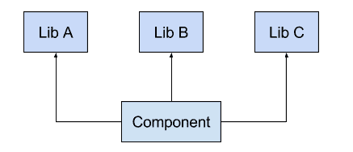
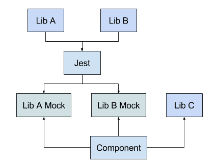
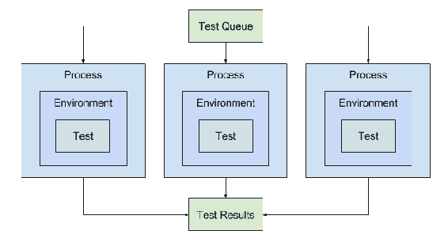

# 第四章：优化测试驱动的 React 开发

也许，React 生态系统中最重要的工具之一是 Jest——用于测试 React 组件的测试运行器和单元测试库。Jest 旨在克服其他测试框架（如 Jasmine）面临的挑战，并且是针对 React 开发而创建的。有了像 Jest 这样强大的测试工具，您更有能力让您的单元测试影响 React 组件的设计。在本章中，您将学到：

+   Jest 的总体设计理念及其对 React 开发者的意义

+   在`create-react-app`环境和独立的 React 环境中运行 Jest 单元测试

+   使用 Jest API 编写有效的单元测试和测试套件

+   在您的代码编辑器中运行 Jest 单元测试并将测试集成到您的开发服务器中

# Jest 的驱动理念

在上一章中，您了解到`create-react-app`工具是为了使开发 React 应用程序更容易而创建的。它通过消除前期配置来实现这一目的——您直接开始构建组件。Jest 也是出于同样的目的而创建的，它消除了您通常需要创建的前期样板，以便开始编写测试。除了消除初始单元测试配置因素之外，Jest 还有一些其他技巧。让我们来看看使用 Jest 进行测试的一些驱动原则。

# 模拟除应用程序代码之外的所有内容

你最不想花时间测试别人的代码。然而，有时你被迫这样做。例如，假设您想测试一个调用某个 HTTP API 的`fetch()`函数。另一个例子：您的 React 组件使用某个库来帮助设置和操作其状态。

在这两个例子中，有一些您没有实现的代码在运行您的单元测试时被执行。您绝对不希望通过 HTTP 与外部系统联系。您绝对不希望确保您的组件状态是根据另一个库的函数输出正确设置的。对于我们不想测试的代码，Jest 提供了一个强大的模拟系统。但是您需要在某个地方划清界限——您不能模拟每一个小事物。

这是一个组件及其依赖项的示例：



这个组件需要三个库才能正常运行。你可能不想按原样对这个组件进行单元测试，因为这样你也会测试其他三个库的功能。你不想在单元测试期间运行的库可以使用 Jest 进行模拟。你不必对每个库进行模拟，对一些库来说，模拟它们可能会带来更多麻烦。

举个例子，假设在这种情况下**Lib C**是一个日期库。你真的需要对它进行模拟吗，还是你实际上可以在组件测试中使用它产生的值？日期库是相当低级的，所以它可能是稳定的，对你的单元测试的功能可能造成非常小的风险。另一方面，库的级别越高，它所做的工作越多，对你的单元测试就越有问题。让我们看看如果你决定使用 Jest 来模拟**Lib A**和**Lib B**会是什么样子：



如果你告诉 Jest 你想要模拟**Lib A**和**Lib B**的实现，它可以使用实际的模块并自动创建一个对象供你的测试使用。因此，几乎不费吹灰之力，你就可以模拟那些对测试你的代码构成挑战的依赖关系。

# 隔离测试并并行运行

Jest 使得在一个沙盒环境中隔离你的单元测试变得容易。换句话说，运行一个测试的副作用不能影响其他测试的结果。每次测试运行完成后，全局环境会自动重置为下一个测试。由于测试是独立的，它们的执行顺序并不重要，Jest 会并行运行测试。这意味着即使你有数百个单元测试，你也可以频繁地运行它们，而不必担心等待的问题。

这是 Jest 如何在它们自己的隔离环境中并行运行测试的示例：



最好的部分是 Jest 会为你处理扩展进程的问题。例如，如果你刚刚开始，你的项目只有少数几个单元测试，Jest 不会生成八个并行进程。它只会在一个进程中运行它们。你需要记住的关键是，单元测试是它们自己的宇宙，不受其他宇宙的干扰。

# 测试应该感觉自然

Jest 让你很容易开始运行你的测试，但是写测试呢？Jest 提供的 API 使得编写没有太多复杂部分的测试变得容易。API 文档（[`facebook.github.io/jest/docs/en/api.html`](https://facebook.github.io/jest/docs/en/api.html)）被组织成易于查找所需内容的部分。例如，如果你正在编写一个测试并且需要验证一个期望值，你可以在 API 文档的*Expect*部分找到你需要的函数。或者，你可能需要帮助配置一个模拟函数——API 文档的*Mock Functions*部分包含了你在这个主题上需要的一切。

Jest 真正脱颖而出的另一个领域是当你需要测试异步代码时。这通常涉及使用 promise。Jest API 使得在不必写大量异步样板的情况下，轻松期望解析或拒绝的 promise 返回特定值变得容易。正是这些小细节使得为 Jest 编写单元测试感觉像是实际应用代码的自然延伸。

# 运行测试

Jest 命令行工具是运行单元测试所需的全部。工具有多种使用方式。首先，你将学习如何在`create-react-app`环境中调用测试运行器以及如何使用交互式观察模式选项。然后，你将学习如何在没有`create-react-app`帮助的情况下在独立环境中运行 Jest。

# 使用 react-scripts 运行测试

当你使用`create-react-app`创建你的 React 应用时，你可以立即运行测试。实际上，在为你创建的样板代码中，已经为`App`组件创建了一个单元测试。这个测试被添加以便 Jest 能够找到一个可以运行的测试。它实际上并没有测试你的应用中的任何有意义的东西，所以一旦添加更多测试，你可能会删除它。

另外，`create-react-app`会在你的`package.json`文件中添加适当的脚本来运行你的测试。你可以在终端中运行以下命令：

```jsx
npm test
```

这实际上会调用`react-scripts`中的`test`脚本。这将调用 Jest，运行它找到的任何测试。在这种情况下，因为你正在使用一个新项目，它只会找到`create-react-app`创建的一个测试。运行这个测试的输出如下：

```jsx
PASS  src/App.test.js
  renders without crashing (3ms)

Test Suites: 1 passed, 1 total
Tests:       1 passed, 1 total
Snapshots:   0 total
Time:        0.043s, estimated 1s
```

运行的测试位于`App.test.js`模块中——所有的 Jest 测试文件名中都应该包含`test`。一个好的约定是`ComponentName.test.js`。然后，你可以看到在这个模块中运行的测试列表，它们花费了多长时间，以及它们是否通过或失败。

在底部，Jest 打印出了运行的摘要信息。这通常是一个很好的起点，因为如果你的所有测试都通过了，你可能不会关心任何其他输出。另一方面，当一个测试失败时，信息越多越好。

`react-scripts`中的`test`脚本以观察模式调用 Jest。这意味着当文件发生更改时，你可以选择实际运行哪些测试。在命令行中，菜单看起来像这样：

```jsx
Watch Usage
 > Press a to run all tests.
 > Press p to filter by a filename regex pattern.
 > Press t to filter by a test name regex pattern.
 > Press q to quit watch mode.
 > Press Enter to trigger a test run. 
```

当 Jest 以观察模式运行时，进程不会在所有测试完成后立即退出。相反，它会监视你的测试和组件文件的更改，并在检测到更改时运行测试。这些选项允许你在发生更改时微调运行哪些测试。`p`和`t`选项只有在你有成千上万个测试并且其中许多测试失败时才有用。这些选项对于深入了解并找到正在开发的有问题的组件非常有用。

默认情况下，当 Jest 检测到更改时，只有相关的测试会被运行。例如，更改测试或组件将导致测试再次运行。在你的终端中运行`npm test`，让我们打开`App.test.js`并对测试进行小小的更改：

```jsx
it('renders without crashing', () => { 
  const div = document.createElement('div'); 
  ReactDOM.render(<App />, div); 
}); 
```

你可以只需更改测试的名称，使其看起来像下面这样，然后保存文件：

```jsx
it('renders the App component', () => { 
  const div = document.createElement('div'); 
  ReactDOM.render(<App />, div); 
}); 
```

现在，看一下你的终端，你在那里让 Jest 以观察模式运行：

```jsx
PASS  src/App.test.js
  renders the App component (4ms)
```

Jest 检测到了你的单元测试的更改，并运行它，生成了更新的控制台输出。现在让我们引入一个新的组件和一个新的测试，看看会发生什么。首先，你将实现一个`Repeat`组件，看起来像下面这样：

```jsx
export default ({ times, value }) => 
  new Array(parseInt(times, 10))
    .fill(value)
    .join(' ');
```

这个组件接受一个`times`属性，用于确定重复`value`属性的次数。下面是`Repeat`组件被`App`组件使用的方式：

```jsx
import React, { Component } from 'react'; 
import logo from './logo.svg'; 
import './App.css'; 
import Repeat from './Repeat'; 

class App extends Component { 
  render() { 
    return ( 
      <div className="App"> 
        <header className="App-header"> 
           
          <h1 className="App-title">Welcome to React</h1> 
        </header> 
        <p className="App-intro"> 
          <Repeat times="5" value="React!" /> 
        </p> 
      </div> 
    ); 
  } 
} 

export default App; 
```

如果你查看这个应用程序，你会在页面上看到字符串`React!`被渲染了五次。你的组件按预期工作，但在提交新组件之前，让我们确保添加一个单元测试。创建一个名为`Repeat.test.js`的文件，内容如下：

```jsx
import React from 'react'; 
import ReactDOM from 'react-dom'; 
import Repeat from './Repeat'; 

it('renders the Repeat component', () => { 
  const div = document.createElement('div'); 
  ReactDOM.render(<Repeat times="5" value="test" />, div); 
}); 
```

实际上，这是用于`App`组件的相同单元测试。它除了组件可以渲染而不触发某种错误之外，没有太多测试内容。现在 Jest 有两个组件测试要运行：一个是`App`，另一个是`Repeat`。如果你查看 Jest 的控制台输出，你会看到两个测试都被运行了：

```jsx
PASS  src/App.test.js
PASS  src/Repeat.test.js

Test Suites: 2 passed, 2 total
Tests:       2 passed, 2 total
Snapshots:   0 total
Time:        0.174s, estimated 1s
Ran all test suites related to changed files.
```

注意输出中的最后一行。Jest 的默认监视模式是查找尚未提交到源代码控制的文件，并已保存的文件。通过忽略已提交的组件和测试，你知道它们没有改变，因此运行这些测试是没有意义的。让我们尝试更改`Repeat`组件，看看会发生什么（实际上你不需要更改任何内容，只需保存文件就足以触发 Jest）：

```jsx
 PASS  src/App.test.js 
 PASS  src/Repeat.test.js 
```

为什么`App`测试会运行？它已经提交并且没有改变。问题在于，由于`App`依赖于`Repeat`，对`Repeat`组件的更改可能会导致`App`测试失败。

让我们引入另一个组件和测试，不过这次我们不会引入任何依赖导入新组件。创建一个`Text.js`文件，并保存以下组件实现：

```jsx
export default ({ children }) => children; 
```

这个`Text`组件只会渲染传递给它的任何子元素或文本。这是一个人为的组件，但这并不重要。现在让我们编写一个测试，验证组件返回预期的值：

```jsx
import Text from './text'; 

it('returns the correct text', () => {
  const children = 'test';
  expect(Text({ children })).toEqual(children);
});
```

`toEqual()`断言在`Text()`返回的值等于`children`值时通过。当你保存这个测试时，看一下 Jest 控制台输出：

```jsx
PASS  src/Text.test.js
  returns the correct text (1ms)

Test Suites: 1 passed, 1 total
Tests:       1 passed, 1 total
```

现在你有一个没有任何依赖的测试，Jest 会自行运行它。其他两个测试已经提交到 Git，所以它知道这些测试不需要运行。你永远不会提交不能通过单元测试的东西，对吧？

现在让我们让这个测试失败，看看会发生什么。将`Test`组件更改为以下内容：

```jsx
export default ({ children }) => 1;
```

这将导致测试失败，因为它期望组件函数返回传递给`children`属性的值。现在如果你回到 Jest 控制台，输出应该是这样的：

```jsx
FAIL  src/Text.test.js
 ● returns the correct text

   expect(received).toEqual(expected)

   Expected value to equal:
     "test"
   Received:
     1

   Difference:

    Comparing two different types of values. Expected string but 
     received number.
```

测试失败了，正如你所知道的。有趣的是，这又是唯一运行的测试，因为根据 Git，没有其他东西发生变化。对你有利的是，一旦你有了数百个测试，你就不需要等待所有测试都运行完毕，才能运行当前正在工作的组件的失败测试。

# 使用独立的 Jest 运行测试

在前一节中你刚刚了解到的`react-scripts`中的`test`脚本是一个很好的工具，可以在你构建应用程序时在后台运行。它在你实现组件和单元测试时给出了即时的反馈。

其他时候，你只想运行所有的测试，并在打印结果输出后立即退出进程。例如，如果你正在将 Jest 输出集成到持续集成流程中，或者如果你只想看一次测试结果，你可以直接运行 Jest。

让我们尝试单独运行 Jest。确保你仍然在项目目录中，并且已经停止了`npm test`脚本的运行。现在只需运行：

```jsx
jest
```

与在观察模式下运行 Jest 不同，这个命令只是尝试运行所有的测试，打印结果输出，然后退出。然而，这种方法似乎存在问题。像这样运行 Jest 会导致错误：

```jsx
FAIL  src/Repeat.test.js
 ● Test suite failed to run

   04/my-react-app/src/Repeat.test.js: Unexpected token (7:18)
        5 | it('renders the Repeat component', () => {
        6 |   const div = document.createElement('div');
      > 7 |   ReactDOM.render(<Repeat times="5" value="test"...
          |                   ^
        8 | });
```

这是因为`react-scripts`中的`test`脚本为我们设置了很多东西，包括解析和执行 JSX 所需的所有 Jest 配置。鉴于我们有这个工具可用，让我们使用它，而不是试图从头开始配置 Jest。记住，你的目标是只运行一次 Jest，而不是在观察模式下运行。

事实证明，`react-scripts`中的`test`脚本已经准备好处理持续集成环境。如果它发现`CI`环境变量，它就不会在观察模式下运行 Jest。让我们尝试通过导出这个变量来验证一下：

```jsx
export CI=1
```

现在当你运行`npm test`时，一切都按预期进行。当一切都完成时，进程退出：

```jsx
PASS  src/Text.test.js
PASS  src/App.test.js
PASS  src/Repeat.test.js

Test Suites: 3 passed, 3 total
Tests:       3 passed, 3 total
Snapshots:   0 total
Time:        1.089s
Ran all test suites.
```

当你完成后，可以取消这个环境变量：

```jsx
unset CI 
```

大多数情况下，你可能只会在观察模式下使用 Jest。但是，如果你需要在短暂的进程中快速运行测试，你可以暂时进入持续集成模式。

# 编写 Jest 测试

现在你知道如何运行 Jest 了，让我们写一些单元测试。我们将涵盖 Jest 可用于测试 React 应用的基础知识以及更高级的功能。我们将开始将你的测试组织成套件，并介绍 Jest 中的基本断言。然后，你将创建你的第一个模拟模块并处理异步代码。最后，我们将使用 Jest 的快照机制来帮助测试 React 组件的输出。

# 使用套件组织测试

套件是你的测试的主要组织单元。套件不是 Jest 的要求——`create-react-app`创建的测试不包括套件：

```jsx
it('renders without crashing', () => { 
  ... 
}); 
```

`it()`函数声明了一个通过或失败的单元测试。当你刚开始项目并且只有少数测试时，不需要套件。一旦你有了多个测试，就是时候开始考虑组织了。把套件看作是一个容器，你可以把你的测试放进去。你可以有几个这样的容器，以你认为合适的方式组织你的测试。通常，一个套件对应一个源模块。以下是如何声明套件：

```jsx
describe('BasicSuite', () => { 
  it('passes the first test', () => { 
    // Assertions... 
  }); 

  it('passes the second test', () => { 
    // Assertions... 
  }); 
}); 
```

这里使用`describe()`函数声明了一个名为`BasicSuite`的测试套件。在套件内部，我们声明了几个单元测试。使用`describe()`，你可以组织你的测试，使相关的测试在测试结果输出中被分组在一起。

然而，如果套件是唯一可用于组织测试的机制，你的测试将很快变得难以管理。原因是通常一个类、方法或函数位于一个模块中会有多个测试。因此，你需要一种方法来说明测试实际上属于代码的哪一部分。好消息是你可以嵌套调用`describe()`来为你的套件提供必要的组织：

```jsx
describe('NestedSuite', () => { 
  describe('state', () => { 
    it('handles the first state', () => { 

    }); 

    it('handles the second state', () => { 

    }); 
  }); 

  describe('props', () => { 
    it('handles the first prop', () => { 

    });
 it('handles the second prop', () => { 

    }); 
  });

 describe('render()', () => { 
    it('renders with state', () => { 

    }); 

    it('renders with props', () => { 

    }); 
  }); 
}); 
```

最外层的`describe()`调用声明了测试套件，对应于一些顶层的代码单元，比如一个模块。对`describe()`的内部调用对应于更小的代码单元，比如方法和函数。这样，你可以轻松地为给定的代码片段编写多个单元测试，同时避免对实际被测试的内容产生困惑。

让我们来看一下你刚刚创建的测试套件的详细输出。为此，请运行以下命令：

```jsx
npm test -- --verbose
```

第一组双破折号告诉`npm`将后面的任何参数传递给`test`脚本。以下是你将看到的内容：

```jsx
PASS  src/NestedSuite.test.js
 NestedSuite
   state
      handles the first state (1ms)
      handles the second state
   props
      handles the first prop
      handles the second prop
   render()
      renders with state
      renders with props (1ms)

PASS  src/BasicSuite.test.js
 BasicSuite
    passes the first test
    passes the second test
```

在`NestedSuite`下，你可以看到`state`是被测试的代码，并且有两个测试通过了。`props`和`render()`也是一样的情况。

# 基本断言

在单元测试中，使用 Jest 的期望 API 创建断言。当代码的期望未达到时，这些函数会触发单元测试失败。使用此 API 时，测试失败的输出会显示您期望发生的事情以及实际发生的事情。这严重减少了您追踪值所花费的时间。

# 基本相等

您可以使用 `toBe()` 期望方法来断言两个值相同：

```jsx
describe('basic equality', () => { 
  it('true is true', () => { 
    expect(true).toBe(true); 
    expect(true).not.toBe(false); 
  }); 

  it('false is false', () => { 
    expect(false).toBe(false); 
    expect(false).not.toBe(true); 
  }); 
}); 
```

在第一个测试中，您期望 `true` 等于 `true`。然后，在下一行使用 `.not` 属性否定这个期望。如果这是一个真正的单元测试，您不必像这样证明您刚刚做出的断言的相反情况——我这样做是为了说明您的一些选择。

在第二个测试中，我们执行相同的断言，但期望值为 `false`。`toBe()` 方法使用严格相等来比较其值。

# 近似相等

有时，在代码中检查某些东西的确切值并没有什么区别，而且可能比值得的工作更多。例如，您可能只需要确保某个值存在。您可能还需要执行相反的操作——确保没有值。在 JavaScript 术语中，某物与无物是“真值”与“假值”。

要在 Jest 单元测试中检查真值或假值，您将分别使用 `isTruthy()` 或 `isFalsy()` 方法：

```jsx
describe('approximate equality', () => { 
  it('1 is truthy', () => { 
    expect(1).toBeTruthy(); 
    expect(1).not.toBeFalsy(); 
  }); 

  it('\'\' is falsy', () => { 
    expect('').toBeFalsy(); 
    expect('').not.toBeTruthy(); 
  }); 
});
```

值 `1` 不是 true，但在布尔比较的上下文中使用时，它会计算为 `true`。同样，空字符串计算为 `false`，因此被视为假值。

# 值相等

在处理对象和数组时，检查相等可能很痛苦。通常您不能使用严格相等，因为您在比较引用，而引用总是不同的。如果您要比较的是值，您需要逐个迭代对象或集合并比较值、键和索引。

由于没有人在理智的头脑中想要做所有这些工作来执行简单的测试。Jest 提供了 `toEqual()` 方法，它可以为您比较对象属性和数组值：

```jsx
describe('value equality', () => { 
  it('objects are the same', () => { 
    expect({ 
      one: 1, 
      two: 2 
    }).toEqual({ 
      one: 1, 
      two: 2, 
    });

    expect({ 
      one: 1, 
      two: 2 
    }).not.toBe({ 
      one: 1, 
      two: 2
 }); 
  }); 

  it('arrays are the same', () => { 
    expect([1, 2]).toEqual([1, 2]); 
    expect([1, 2]).not.toBe([1, 2]); 
  }); 
}); 
```

这个例子中的每个对象和数组都是唯一的引用。然而，这两个对象和两个数组在其属性和值方面是相等的。`toEqual()` 方法检查值的相等性。之后，我要展示 `toBe()` 不是你想要的——这会返回 `false`，因为它在比较引用。

# 集合中的值

Jest 中有比我在这本书中介绍的断言方法更多。我鼓励你查看 Jest API 文档中的 *Expect* 部分：[`facebook.github.io/jest/docs/en/expect.html`](https://facebook.github.io/jest/docs/en/expect.html)。

我想要和你讨论的最后两个断言方法是 `toHaveProperty()` 和 `toContain()`。前者测试对象是否具有给定属性，而后者检查数组是否包含给定值：

```jsx
describe('object properties and array values', () => { 
  it('object has property value', () => { 
    expect({ 
      one: 1, 
      two: 2 
    }).toHaveProperty('two', 2); 

    expect({ 
      one: 1, 
      two: 2 
    }).not.toHaveProperty('two', 3); 
  });
  it('array contains value', () => { 
    expect([1, 2]).toContain(1); 
    expect([1, 2]).not.toContain(3); 
  }); 
}); 
```

当你需要检查对象是否具有特定属性值时，`toHaveProperty()` 方法非常有用。当你需要检查数组是否具有特定值时，`toContain()` 方法非常有用。

# 使用模拟

当你编写单元测试时，你是在测试自己的代码。至少这是理论上的想法。实际上，这比听起来更困难，因为你的代码不可避免地会使用某种库。这是你不想测试的代码。编写调用其他库的单元测试的问题在于它们通常需要访问网络或文件系统。你绝对不希望由于其他库的副作用而产生误报。

Jest 提供了一个强大的模拟机制，使用起来很容易。你给 Jest 提供要模拟的模块的路径，它会处理剩下的事情。在某些情况下，你不需要提供模拟实现。在其他情况下，你需要以与原始模块相同的方式处理参数和返回值。

假设你创建了一个如下所示的 `readFile()` 函数：

```jsx
import fs from 'fs'; 

const readFile = path => new Promise((resolve, reject) => { 
  fs.readFile(path, (err, data) => { 
    if (err) { 
      reject(err); 
    } else { 
      resolve(data); 
    } 
  }); 
}); 

export default readFile; 
```

这个函数需要来自 `fs` 模块的 `readFile()` 函数。它返回一个 promise，在传递给 `readFile()` 的回调函数被调用时解析，除非出现错误。

现在你想为这个函数编写一个单元测试。你想做出如下断言：

+   它是否调用了 `fs.readFile()`？

+   返回的 promise 是否以正确的值解析？

+   当传递给 `fs.readFile()` 的回调接收到错误时，返回的 promise 是否被拒绝？

您可以通过使用 Jest 对其进行模拟来执行所有这些断言，而不必依赖于`fs.readFile()`的实际实现。您不必对外部因素做任何假设；您只关心您的代码是否按照您的预期工作。

因此，让我们尝试为使用模拟的`fs.readFile()`实现的此函数实施一些测试：

```jsx
import fs from 'fs'; 
import readFile from './readFile'; 

jest.mock('fs'); 

describe('readFile', () => { 
  it('calls fs.readFile', (done) => { 
    fs.readFile.mockReset(); 
    fs.readFile.mockImplementation((path, cb) => { 
      cb(false); 
    }); 

    readFile('file.txt') 
      .then(() => { 
        expect(fs.readFile).toHaveBeenCalled(); 
        done(); 
      }); 
  }); 

  it('resolves a value', (done) => { 
    fs.readFile.mockReset(); 
    fs.readFile.mockImplementation((path, cb) => { 
      cb(false, 'test'); 
    }); 

    readFile('file.txt') 
      .then((data) => { 
        expect(data).toBe('test'); 
        done(); 
      }); 
  }); 

  it('rejects on error', (done) => { 
    fs.readFile.mockReset(); 
    fs.readFile.mockImplementation((path, cb) => { 
      cb('failed'); 
    }); 

    readFile() 
      .catch((err) => { 
        expect(err).toBe('failed'); 
        done(); 
      }); 
  }); 
}); 
```

通过调用`jest.mock('fs')`来创建`fs`模块的模拟版本。请注意，在模拟之前实际导入了真实的`fs`模块，并且在任何测试实际使用它之前就已经模拟了它。在每个测试中，我们都在创建`fs.readFile()`的自定义实现。默认情况下，Jest 模拟的函数实际上不会执行任何操作。这很少足以测试大多数事情。模拟的美妙之处在于您可以控制代码使用的库的结果，并且您的测试断言确保您的代码相应地处理一切。

通过将其作为函数传递给`mockImplementation()`方法来提供实现。但在这样做之前，一定要确保调用`mockReset()`来清除有关模拟的任何存储信息，比如它被调用的次数。例如，第一个测试有断言`expect(fs.readFile).toHaveBeenCalled()`。您可以将模拟函数传递给`expect()`，Jest 提供了知道如何与它们一起工作的方法。

对于类似的功能，可以遵循相同的模式。这是`readFile()`的对应函数：

```jsx
import fs from 'fs'; 

const writeFile = (path, data) => new Promise((resolve, reject) => { 
  fs.writeFile(path, data, (err) => { 
    if (err) { 
      reject(err); 
    } else { 
      resolve(); 
    } 
  }); 
}); 

export default writeFile; 
```

`readFile()`和`writeFile()`之间有两个重要的区别：

+   `writeFile()`函数接受第二个参数，用于写入文件的数据。这个参数也传递给`fs.writeFile()`。

+   `writeFile()`函数不会解析值，而`readFile()`会解析已读取的文件数据。

这两个差异对您创建的模拟实现有影响。现在让我们来看看它们：

```jsx
import fs from 'fs'; 
import writeFile from './writeFile'; 

jest.mock('fs'); 

describe('writeFile', () => { 
  it('calls fs.writeFile', (done) => { 
    fs.writeFile.mockReset(); 
    fs.writeFile.mockImplementation((path, data, cb) => { 
      cb(false); 
    }); 

    writeFile('file.txt') 
      .then(() => { 
        expect(fs.writeFile).toHaveBeenCalled(); 
        done(); 
      }); 
  }); 

  it('resolves without a value', (done) => { 
    fs.writeFile.mockReset(); 
    fs.writeFile.mockImplementation((path, data, cb) => { 
      cb(false, 'test'); 
    }); 

    writeFile('file.txt', test) 
      .then(() => { 
        done(); 
      }); 
  }); 

  it('rejects on error', (done) => { 
    fs.writeFile.mockReset(); 
    fs.writeFile.mockImplementation((path, data, cb) => { 
      cb('failed'); 
    });
 writeFile() 
      .catch((err) => { 
        expect(err).toBe('failed'); 
        done(); 
      }); 
  }); 
}); 
```

现在`data`参数需要成为模拟实现的一部分；否则，将无法访问`cb`参数并调用回调函数。

在`readFile()`和`writeFile()`测试中，您必须处理异步性。这就是为什么我们在`then()`回调中执行断言的原因。从`it()`传入的`done()`函数在测试完成时被调用。如果您忘记调用`done()`，测试将挂起并最终超时和失败。

# 单元测试覆盖率

Jest 自带对测试覆盖报告的支持。将这包含在测试框架中是很好的，因为并非所有测试框架都支持这一点。如果你想看看你的测试覆盖率是什么样子，只需在启动 Jest 时传递 `--coverage` 选项即可：

```jsx
npm test -- --coverage 
```

当你这样做时，测试会像平常一样运行。然后，Jest 内部的覆盖工具会计算你的测试覆盖源代码的程度，并生成一个报告，看起来像这样：

```jsx
----------|--------|----------|---------|---------|----------------|
File      |% Stmts | % Branch | % Funcs | % Lines |Uncovered Lines |
----------|--------|----------|---------|---------|----------------|
All files |   2.17 |        0 |    6.25 |    4.55 |                |
 App.js   |    100 |      100 |     100 |     100 |                |
 index.js |      0 |        0 |       0 |       0 |  1,2,3,4,5,7,8 |
----------|--------|----------|---------|---------|----------------|
```

如果你想提高你的覆盖率，看看报告中的 `Uncovered Lines` 列。其他列告诉你测试覆盖的代码类型：语句、分支和函数。

# 异步断言

Jest 预期你会有异步代码需要测试。这就是为什么它提供了 API 来使编写单元测试中的这一方面感觉自然。在前一节中，我们编写了在 `then()` 回调中执行断言并在所有异步测试完成时调用 `done()` 的测试。在本节中，我们将看另一种方法。

Jest 允许你从单元测试函数中返回 promise 期望，并会相应地处理它们。让我们重构一下你在前一节中编写的 `readFile()` 测试：

```jsx
import fs from 'fs'; 
import readFile from './readFile'; 

jest.mock('fs'); 

describe('readFile', () => { 
  it('calls fs.readFile', () => { 
    fs.readFile.mockReset(); 
    fs.readFile.mockImplementation((path, cb) => { 
      cb(false); 
    });
return readFile('file.txt') 
      .then(() => { 
        expect(fs.readFile).toHaveBeenCalled(); 
      }); 
  }); 

  it('resolves a value', () => { 
    fs.readFile.mockReset(); 
    fs.readFile.mockImplementation((path, cb) => { 
      cb(false, 'test'); 
    }); 

    return expect(readFile('file.txt')) 
      .resolves 
      .toBe('test'); 
  }); 

  it('rejects on error', () => { 
    fs.readFile.mockReset(); 
    fs.readFile.mockImplementation((path, cb) => { 
      cb('failed'); 
    }); 

    return expect(readFile()) 
      .rejects 
      .toBe('failed'); 
  }); 
}); 
```

现在测试返回的是 promises。当返回一个 promise 时，Jest 会等待它解析完成，然后才捕获测试结果。你也可以传递一个 promise 给 `expect()`，并使用 `resolves` 和 `rejects` 对象来执行断言。这样，你就不必依赖 `done()` 函数来指示测试的异步部分已经完成了。

`rejects` 对象在这里特别有价值。确保函数按预期拒绝是很重要的。但如果没有 `rejects`，这是不可能做到的。在这个测试的先前版本中，如果你的代码因某种原因解析了，而本应拒绝，那就无法检测到这一点。现在，如果发生这种情况，使用 `rejects` 会导致测试失败。

# React 组件快照

React 组件会渲染输出。自然地，你希望组件单元测试的一部分是确保正确的输出被创建。一种方法是将组件渲染到基于 JS 的 DOM 中，然后对渲染输出执行单独的断言。至少可以说，这将是一个痛苦的测试编写体验。

快照测试允许你生成渲染组件输出的*快照*。然后，每次运行测试时，输出会与快照进行比较。如果有什么看起来不同，测试就会失败。

让我们修改`create-react-app`为你添加的`App`组件的默认测试，使其使用快照测试。这是原始测试的样子：

```jsx
import React from 'react'; 
import ReactDOM from 'react-dom'; 
import App from './App'; 

it('renders without crashing', () => { 
  const div = document.createElement('div'); 
  ReactDOM.render(<App />, div); 
}); 
```

这个测试实际上并没有验证渲染的内容——只是没有抛出错误。如果你做出了导致意外结果的更改，你将永远不会知道。这是相同测试的快照版本：

```jsx
import React from 'react'; 
import renderer from 'react-test-renderer'; 
import App from './App'; 

it('renders without crashing', () => { 
  const tree = renderer 
    .create(<App />) 
    .toJSON(); 

  expect(tree).toMatchSnapshot(); 
}); 
```

在运行这个测试之前，我必须安装`react-test-renderer`包：

```jsx
npm install react-test-renderer --save-dev
```

也许有一天这将被添加到`create-react-app`中。与此同时，你需要记得安装它。然后，你的测试可以导入测试渲染器并使用它来创建一个 JSON 树。这是渲染组件内容的表示。接下来，你期望这个树与第一次运行此测试时创建的快照匹配，使用`toMatchSnapshot()`断言。

这意味着第一次运行测试时，它总是会通过，因为这是第一次创建快照。快照文件是应该提交到项目的源代码控制系统的工件，就像单元测试源代码本身一样。这样，项目中的其他人在运行你的测试时就会有一个快照文件可供使用。

关于快照测试的误解在于它给人的印象是你实际上不能改变组件以产生不同的输出。事实上，这是真的——改变组件产生的输出会导致快照测试失败。不过，这并不是一件坏事，因为它迫使你在每次更改时查看你的组件渲染的内容。

让我们修改`App`组件，使其对单词`started`添加强调。

```jsx
<p className="App-intro"> 
  To get <em>started</em>, edit <code>src/App.js</code> and save to  
  reload. 
</p> 
```

现在如果你运行你的测试，你会得到一个类似这样的失败：

```jsx
Received value does not match stored snapshot 1\. 

- Snapshot 
+ Received 

 @@ -16,11 +16,15 @@ 
    </h1> 
    </header> 
    <p 
       className="App-intro" 
    > 
-    To get started, edit  
+    To get  
+    <em> 
+      started 
+    </em> 
+    , edit  
```

哇！这很有用。统一的差异显示了组件输出的确切变化。你可以查看这个输出，并决定这正是你期望看到的变化，或者你犯了一个错误，需要去修复它。一旦你对新的输出满意，你可以通过向`test`脚本传递参数来更新存储的快照：

```jsx
npm test -- --updateSnapshot
```

这将在运行测试之前更新存储的快照，任何失败的快照测试现在都将通过，因为它们符合其输出期望：

```jsx
PASS  src/App.test.js
  renders without crashing (12ms)

Snapshot Summary
 > 1 snapshot updated in 1 test suite.

 Test Suites: 1 passed, 1 total
 Tests:       1 passed, 1 total
 Snapshots:   1 updated, 1 total
 Time:        0.631s, estimated 1s 
```

Jest 告诉您在运行任何测试之前快照已更新，通过传递`--updateSnapshot`参数来实现。

# 总结

在本章中，您了解了 Jest。您了解到 Jest 的关键驱动原则是创建有效的模拟、测试隔离和并行执行，以及易用性。然后，您了解到`react-scripts`通过提供一些基本配置使运行单元测试变得更加容易。

在运行 Jest 时，您会发现通过`react-scripts`运行 Jest 时，观察模式是默认模式。观察模式在有许多不需要在每次源代码更改时运行的测试时特别有用，只有相关的测试会被执行。

接下来，您在单元测试中执行了一些基本断言。然后，您为`fs`模块创建了一个模拟，并对模拟函数进行断言，以确保它们被预期使用。然后，您进一步发展了这些测试，以利用 Jest 的固有异步能力。单元测试覆盖报告内置在 Jest 中，您学会了如何通过传递额外的参数来查看此报告。

在下一章中，您将学习如何使用 Flow 创建类型安全的组件。
