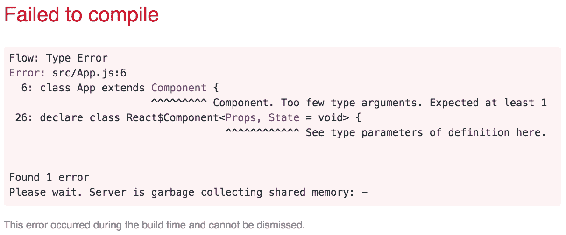
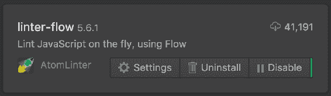
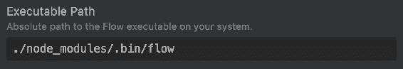
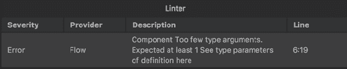
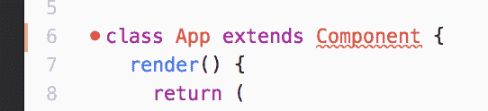

# 第五章：使用类型安全简化开发和重构 React 组件

本章重点介绍的工具是 Flow，它是 JavaScript 应用程序的静态类型检查器。Flow 的范围和你可以用它做的事情是巨大的，所以我将在引入 Flow 的上下文中介绍它，这是一个用于改进 React 组件的工具。在本章中，你将学到以下内容：

+   通过引入类型安全解决的问题

+   在你的 React 项目中启用 Flow

+   使用 Flow 验证你的 React 组件

+   使用类型安全增强 React 开发的其他方法

# 类型安全解决了什么问题？

类型安全并非万能药。例如，我完全有能力编写一个充满错误的类型安全应用程序。有趣的是，只是在引入类型检查器后，那种停止发生的错误。那么在引入 Flow 这样的工具后，你可以期待什么类型的事情？我将分享我在学习 Flow 时经历的三个因素。Flow 文档中的*类型系统*部分对这个主题进行了更详细的介绍，可在[`flow.org/en/docs/lang/`](https://flow.org/en/docs/lang/)上找到。

# 用保证替换猜测

JavaScript 这样的动态类型语言的一个很好的特性是，你可以编写代码而不必考虑类型。类型是好的，它们确实解决了很多问题——你可能不相信，但有时你需要能够只是编写代码而不必正式验证正确性。换句话说，有时候猜测恰恰是你需要的。

如果我正在编写一个我知道接受一个对象作为参数的函数，我可以假设传递给我的函数的任何对象都将具有预期的属性。这使我能够实现我需要的东西，而不必确保正确的类型作为参数传递。然而，这种方法只能持续那么长时间。因为不可避免地，你的代码将会得到一些意外的输入。一旦你有了一个由许多组成部分组成的复杂应用程序，类型安全可以消除猜测。

Flow 采取了一种有趣的方法。它不是基于类型编译新的 JavaScript 代码，而是简单地根据类型注释检查源代码是否正确。然后将这些注释从源代码中移除，以便可以运行。通过使用 Flow 这样的类型检查器，你可以明确地指定每个组件愿意接受的输入，并通过使用类型注释来说明它与应用程序的其他部分是如何交互的。

# 移除运行时检查

在诸如 JavaScript 之类的动态语言中处理未知类型的数据的解决方案是在运行时检查值。根据值的类型，你可能需要执行一些替代操作来获取你的代码所期望的值。例如，在 JavaScript 中的一个常见习惯是确保一个值既不是 undefined 也不是 null。如果是，那么我们要么抛出一个错误，要么提供一个默认值。

当你执行运行时检查时，它会改变你对代码的思考方式。一旦你开始执行这些检查，它们不可避免地会演变成更复杂的检查和更多的检查。这种思维方式实际上意味着不相信自己或他人能够使用正确的数据调用代码。你会认为，由于很可能你的函数会被用垃圾参数调用，你需要准备好处理任何被传递给你的函数的东西。

另一方面，拥抱类型安全意味着你不必依赖于实现自定义解决方案来防御错误数据。让类型系统来代替你处理这个问题。你只需要考虑你的代码需要处理什么类型的数据，然后从那里开始。思考我的代码需要什么，而不是如何获得我的代码需要的东西。

# 明显的低严重性错误

如果你可以使用诸如 Flow 之类的类型检查器来消除由于错误类型而产生的隐匿错误，那么你将只剩下高级别的应用程序错误。当这些错误发生时，它们是显而易见的，因为应用程序是错误的。它产生了错误的输出，计算出了错误的数字，其中一个屏幕无法加载，等等。你可以更容易地看到并与这些类型的错误进行交互。这使它们变得显而易见，而当错误显而易见时，它们更容易被追踪和修复。

另一方面，您可能会遇到微妙错误的错误。这些可能是由于错误的类型。这些类型的错误特别可怕的原因是您甚至不知道出了什么问题。您的应用程序可能有些微妙的问题。或者它可能完全崩溃，因为您的代码的一部分期望一个数组，但它在某些地方可以工作，因为它得到了另一种可迭代的东西，但在其他地方却不行。

如果您只是使用类型注释并使用 Flow 检查了您的源代码，它会告诉您正在传递的不是数组。当类型静态检查时，这些类型的错误就没有了容身之地。原来，这些通常是更难解决的错误。

# 安装和初始化 Flow

在您开始实现类型安全的 React 组件之前，您需要安装和初始化 Flow。我将向您展示如何在`create-react-app`环境中完成此操作，但几乎可以为几乎任何 React 环境遵循相同的步骤。

您可以全局安装 Flow，但我建议将其与项目依赖的所有其他软件包一起本地安装。除非有充分的理由全局安装某些东西，否则请将其本地安装。这样，安装您的应用程序的任何人都可以通过运行`npm install`来获取每个依赖项。

在本地安装 Flow，请运行以下命令：

```jsx
npm install flow-bin --save-dev
```

这将在本地安装 Flow 可执行文件到您的项目，并将更新您的`package.json`，以便 Flow 作为项目的依赖项安装。现在让我们向`package.json`添加一个新的命令，以便您可以针对您的源代码运行 Flow 类型检查器。使`scripts`部分看起来像这样：

```jsx
"scripts": { 
  "start": "react-scripts start",
```

```jsx
  "build": "react-scripts build", 
  "test": "react-scripts test --env=jsdom", 
  "eject": "react-scripts eject", 
  "flow": "flow" 
}, 
```

现在，您可以通过在终端中执行以下命令来运行 Flow：

```jsx
npm run flow
```

这将按预期运行`flow`脚本，但 Flow 将抱怨找不到 Flow 配置文件：

```jsx
Could not find a .flowconfig in . or any of its parent directories. 
```

解决此问题的最简单方法是使用`flow init`命令：

```jsx
npm run flow init 
```

这将在您的项目目录中创建一个`.flowconfig`文件。您现在不需要担心更改此文件中的任何内容；只是 Flow 希望它存在。现在当您运行`npm run flow`时，您应该会收到一条指示没有错误的消息：

```jsx
Launching Flow server for 05/installing-and-initializing-flow
Spawned flow server (pid=46516)
No errors!  
```

原来，实际上没有检查您的任何源文件。这是因为默认情况下，Flow 只检查具有`// @flow`指令作为其第一行的文件。让我们继续在`App.js`的顶部添加这一行：

```jsx
// @flow 
import React, { Component } from 'react'; 
import logo from './logo.svg'; 
import './App.css'; 

class App extends Component { 
  render() { 
    return ( 
      <div className="App"> 
        <header className="App-header"> 
           
          <h1 className="App-title">Welcome to React</h1> 
        </header> 
        <p className="App-intro"> 
          To get started... 
```

```jsx
        </p> 
      </div> 
    ); 
  } 
} 

export default App; 
```

现在 Flow 正在检查这个模块，我们得到了一个错误：

```jsx
      6: class App extends Component {
                           ^^^^^^^^^ Component. Too few type arguments. Expected at least 1
```

这是什么意思？Flow 试图在错误输出的下一行提供解释：

```jsx
Component<Props, State = void> { 
          ^^^^^^^^^^^^ See type parameters of definition here. 
```

Flow 抱怨你正在用`App`扩展的`Component`类。这意味着你需要为`Component`提供至少一个`type`参数来表示 props。由于`App`实际上并没有使用任何 props，现在可以暂时使用一个空类型：

```jsx
// @flow 
import React, { Component } from 'react'; 
import logo from './logo.svg'; 
import './App.css'; 

type Props = {}; 

class App extends Component<Props> { 
  render() { 
    return ( 
      <div className="App"> 
        <header className="App-header"> 
           
          <h1 className="App-title">Welcome to React</h1> 
        </header> 
        <p className="App-intro"> 
          To get started... 
        </p> 
      </div> 
    ); 
  } 
}
export default App; 
```

现在当你再次运行 Flow 时，在`App.js`中就没有任何错误了！这意味着你已经成功地用类型信息注释了你的模块，Flow 用它来静态分析你的源代码，确保一切都是正确的。

那么 Flow 是如何知道 React 的`Component`类在泛型方面期望什么的呢？事实证明，React 本身是 Flow 类型注释的，这就是当 Flow 检测到问题时你会得到具体错误消息的原因。

接下来，让我们在`index.js`的顶部添加`// @flow`指令：

```jsx
// @flow 
import React from 'react'; 
import ReactDOM from 'react-dom'; 
import './index.css'; 
import App from './App'; 
import registerServiceWorker from './registerServiceWorker'; 

const root = document.getElementById('root'); 

ReactDOM.render( 
  <App />, 
  root 
); 

registerServiceWorker(); 
```

如果你再次运行`npm run flow`，你会看到以下错误：

```jsx
    Error: src/index.js:12
     12:   root
    ^^^^ null. This type is incompatible with the expected param 
                type of Element  
```

这是因为`root`的值来自`document.getElementById('root')`。由于这个方法没有返回元素的 DOM，Flow 检测到一个`null`值并抱怨。由于这是一个合理的担忧（`root`元素可能不存在），我们需要在没有元素时为 Flow 提供路径，你可以添加一些逻辑来处理这种情况：

```jsx
// @flow 
import React from 'react'; 
import ReactDOM from 'react-dom'; 
import './index.css'; 
import App from './App';
import registerServiceWorker from './registerServiceWorker'; 

const root = document.getElementById('root'); 

if (!(root instanceof Element)) { 
  throw 'Invalid root'; 
} 

ReactDOM.render( 
  <App />, 
  root 
); 

registerServiceWorker(); 
```

在调用`ReactDOM.render()`之前，你可以手动检查`root`的类型，以确保它是 Flow 期望看到的类型。现在当你运行`npm run flow`时，就不会有错误了。

你已经准备好了！你已经在本地安装和配置了 Flow，并且`create-react-app`的初始源已经通过了类型检查。现在你可以继续开发类型安全的 React 组件了。

# 验证组件属性和状态

React 设计时考虑了 Flow 静态类型检查。在 React 应用程序中，Flow 最常见的用途是验证组件属性和状态是否被正确使用。你还可以强制执行作为另一个组件子元素的组件的类型。

在 Flow 之前，React 依赖于 prop-types 机制来验证传递给组件的值。现在这是 React 的一个单独包，你仍然可以使用它。Flow 比 prop-types 更优秀，因为它执行静态检查，而 prop-types 执行运行时验证。这意味着你的应用程序在运行时不需要运行多余的代码。

# 原始属性值

通过 props 传递给组件的最常见的值类型是原始值——例如字符串、数字和布尔值。使用 Flow，您可以声明自己的类型，指定给定属性允许哪些原始值。

让我们看一个例子：

```jsx
// @flow 
import React from 'react'; 

type Props = { 
  name: string, 
  version: number 
}; 

const Intro = ({ name, version }: Props) => ( 
  <p className="App-intro"> 
    <strong>{name}:</strong>{version} 
  </p> 
); 

export default Intro; 
```

这个组件渲染了一些应用程序的名称和版本。这些值是通过属性值传递的。对于这个组件，让我们说您只想要`name`属性的字符串值和`version`属性的数字值。这个模块使用`type`关键字声明了一个新的`Props`类型：

```jsx
type Props = { 
  name: string, 
  version: number 
}; 
```

这个 Flow 语法允许您创建新类型，然后可以用来对函数参数进行类型化。在这种情况下，您有一个功能性的 React 组件，其中 props 作为第一个参数传递。这是告诉 Flow，props 对象应该具有特定类型的地方：

```jsx
({ name, version }: Props) => (...) 
```

有了这个，Flow 可以找出我们传递无效的属性类型到这个组件的任何地方！更好的是，这是在静态地完成的，在浏览器中运行任何东西之前。在 Flow 之前，您必须使用`prop-types`包在运行时验证组件属性。

让我们使用这个组件，然后我们将运行 Flow。这是`App.js`使用`Intro`组件：

```jsx
// @flow 
import React, { Component } from 'react'; 
import logo from './logo.svg'; 
import './App.css'; 
import Intro from './Intro';

type Props = {}; 

class App extends Component<Props> { 
  render() { 
    return ( 
      <div className="App"> 
        <header className="App-header"> 
           
          <h1 className="App-title">Welcome to React</h1> 
        </header> 
        <Intro name="React" version={16} /> 
      </div> 
    ); 
  } 
} 

export default App; 
```

传递给`Intro`的属性值符合`Props`类型的期望：

```jsx
<Intro name="React" version={16} /> 
```

您可以通过运行`npm run flow`来验证这一点。您应该会看到`没有错误！`作为输出。让我们看看如果我们改变这些属性的类型会发生什么：

```jsx
<Intro version="React" name={16} /> 
```

现在我们正在传递一个字符串，而期望的是一个数字，以及一个数字，而期望的是一个字符串。如果您再次运行`npm run flow`，您应该会看到以下错误：

```jsx
    Error: src/App.js:17
     17:         <Intro version="React" name={16} />
                 ^^^^^^^^^^^^^^^^^^^^^^^^^^^^^^^^^^^ props of React element `Intro`. This type is incompatible with
      9: const Intro = ({ name, version }: Props) => (
                                           ^^^^^ object type. See: src/Intro.js:9
      Property `name` is incompatible:
         17:         <Intro version="React" name={16} />
                                                  ^^ number. This type is incompatible with
          5:   name: string,
                     ^^^^^^ string. See: src/Intro.js:5

    Error: src/App.js:17
```

```jsx
     17:         <Intro version="React" name={16} />
                 ^^^^^^^^^^^^^^^^^^^^^^^^^^^^^^^^^^^ props of React element `Intro`. This type is incompatible with
```

```jsx
      9: const Intro = ({ name, version }: Props) => (
                                           ^^^^^ object type. See: src/Intro.js:9
      Property `version` is incompatible:
         17:         <Intro version="React" name={16} />
                                    ^^^^^^^ string. This type is incompatible with
          6:   version: number
                        ^^^^^^ number. See: src/Intro.js:6

```

这两个错误都非常详细地向您展示了问题所在。它首先向您展示了组件属性值被传递的地方：

```jsx
    <Intro version="React" name={16} />
    ^^^^^^^^^^^^^^^^^^^^^^^^^^^^^^^^^^^ props of React element `Intro`. 

```

然后，它向您展示了`Props`类型被用来声明属性参数的类型：

```jsx
    This type is incompatible with
      9: const Intro = ({ name, version }: Props) => (
                                           ^^^^^ object type. See: src/Intro.js:9

```

最后，它向您展示了类型的确切问题是什么：

```jsx
    Property `name` is incompatible:
         17:         <Intro version="React" name={16} />
                                                  ^^ number. This type is incompatible with
          5:   name: string,
                     ^^^^^^ string. See: src/Intro.js:5

```

流错误消息试图为您提供尽可能多的信息，这意味着您花费的时间更少，寻找文件。

# 对象属性值

在前面的部分，您学会了如何检查原始属性类型。React 组件也可以接受具有原始值和其他对象的对象。如果您的组件期望一个对象作为属性值，您可以使用与原始值相同的方法。不同之处在于您如何构造`Props`类型声明：

```jsx
// @flow 
import React from 'react'; 

type Props = { 
  person: { 
    name: string, 
    age: number 
  } 
}; 

const Person = ({ person }: Props) => ( 
  <section> 
    <h3>Person</h3> 
    <p><strong>Name: </strong>{person.name}</p> 
    <p><strong>Age: </strong>{person.age}</p> 
  </section> 
); 

export default Person; 
```

此组件期望一个`person`属性，它是一个对象。此外，它期望此对象具有一个`name`字符串属性和一个数字`age`属性。实际上，如果您有其他需要`person`属性的组件，您可以将此类型分解为可重用的部分：

```jsx
type Person = { 
  name: string, 
  age: number 
}; 

type Props = { 
  person: Person 
}; 
```

现在让我们看看作为属性传递给此组件的值：

```jsx
// @flow 
import React, { Component } from 'react'; 
import logo from './logo.svg'; 
import './App.css'; 
import Person from './Person'; 

class App extends Component<{}> { 
  render() { 
    return ( 
      <div className="App"> 
        <header className="App-header"> 
           
          <h1 className="App-title">Welcome to React</h1> 
        </header> 
        <Person person={{ name: 'Roger', age: 20 }} /> 
      </div> 
    ); 
  } 
} 

export default App; 
```

而不是将`Person`组件传递给几个属性值，它被传递了一个单一的属性值，一个符合`Props`类型期望的对象。如果不符合，Flow 会抱怨。让我们试着从这个对象中删除一个属性：

```jsx
<Person person={{ name: 'Roger' }} /> 
```

现在当您运行`npm run flow`时，它会抱怨传递给`person`的对象的缺少属性：

```jsx
    15:         <Person person={{ name: 'Roger' }} />
                 ^^^^^^^^^^^^^^^^^^^^^^^^^^^^^^^^^^^^^ props of React element `Person`. This type is incompatible with
     11: const Person = ({ person }: Props) => (
                                     ^^^^^ object type. See: src/Person.js:11
      Property `person` is incompatible:
         15:         <Person person={{ name: 'Roger' }} />
                                     ^^^^^^^^^^^^^^^^^ object literal. This type is incompatible with
                       v
          5:   person: {
          6:     name: string,
          7:     age: number
```

```jsx
          8:   }
               ^ object type. See: src/Person.js:5
          Property `age` is incompatible:
                           v
              5:   person: {
              6:     name: string,
              7:     age: number
              8:   }
                   ^ property `age`. Property not found in. See: src/Person.js:5
             15:         <Person person={{ name: 'Roger' }} />
                                         ^^^^^^^^^^^^^^^^^ object literal

```

无论您如何奇特地使用属性值，Flow 都可以弄清楚您是否在错误使用它们。尝试在运行时使用诸如`prop-types`之类的东西来实现相同的功能最多是麻烦的。

# 验证组件状态

您可以通过对传递给组件的 props 参数进行类型化来验证功能性 React 组件的属性。您的一些组件将具有状态，您可以验证组件的状态与属性的方式大致相同。您可以创建一个表示组件状态的类型，并将其作为类型参数传递给`Component`。

让我们看一个包含由子组件使用和操作的状态的容器组件：

```jsx
// @flow 
import React, { Component } from 'react'; 
import Child from './Child'; 

type State = { 
  on: boolean 
}; 

class Container extends Component<{}, State> { 
  state = { 
    on: false 
  } 

  toggle = () => { 
    this.setState(state => ({ 
      on: !state.on 
    }));
```

```jsx
  } 

  render() { 
    return ( 
      <Child 
        on={this.state.on} 
        toggle={this.toggle} 
      />); 
  } 
} 

export default Container; 
```

由`Container`渲染的`Child`组件需要一个`on`布尔属性和一个`toggle`函数。`Child`传递给的“toggle（）”方法将改变`Container`的状态。这意味着`Child`可以调用此函数以改变其父级的状态。在模块顶部，在组件类的上方，有一个`State`类型，用于指定允许设置为状态的值。在这种情况下，状态只是一个简单的`on`布尔值：

```jsx
type State = { 
  on: boolean 
}; 
```

然后在扩展时将此类型作为类型参数传递给`Component`：

```jsx
class Container extends Component<{}, State> { 
  ... 
} 
```

通过将此类型参数传递给`Component`，您可以随意设置组件状态。例如，`Child`组件调用“toggle（）”方法来改变`Container`组件的状态。如果此调用设置状态不正确，Flow 将检测到并抱怨。让我们更改“toggle（）”实现，使其通过将状态设置为与 Flow 不一致的内容而失败：

```jsx
toggle = () => { 
  this.setState(state => ({ 
    on: !state.on + 1 
  })); 
} 
```

您将收到以下错误：

```jsx
    Error: src/Container.js:16
     16:       on: !state.on + 1
                   ^^^^^^^^^^^^^ number. This type is incompatible with
      6:   on: boolean
               ^^^^^^^ boolean
```

在开发过程中错误地设置组件状态是很容易的，因此让 Flow 告诉您您做错了什么是真正的时间节省器。

# 函数属性值

将函数从一个组件传递到另一个组件作为属性是完全正常的。您可以使用 Flow 来确保不仅将函数传递给组件，而且还传递了正确类型的函数。

让我们通过查看 React 应用程序中的常见模式来检验这个想法。假设您有以下渲染`Article`组件的`Articles`组件：

```jsx
// @flow 
import React, { Component } from 'react'; 
import Article from './Article'; 

type Props = {}; 
type State = { 
  summary: string, 
  selected: number | null, 
  articles: Array<{ title: string, summary: string}> 
}; 

class Articles extends Component<Props, State> { 
  state = { 
    summary: '', 
    selected: null, 
    articles: [ 
      { title: 'First Title', summary: 'First article summary' }, 
      { title: 'Second Title', summary: 'Second article summary' }, 
      { title: 'Third Title', summary: 'Third article summary' } 
    ] 
  }
```

```jsx
  onClick = (selected: number) => () => { 
    this.setState(prevState => ({ 
      selected, 
      summary: prevState.articles[selected].summary 
    })); 
  } 

  render() { 
    const { 
      summary, 
      selected, 
      articles 
    } = this.state; 

    return ( 
      <div> 
        <strong>{summary}</strong> 
        <ul> 
          {articles.map((article, index) => ( 
            <li key={index}> 
              <Article 
                index={index} 
                title={article.title} 
                selected={selected === index} 
                onClick={this.onClick} 
              /> 
            </li> 
          ))} 
        </ul> 
      </div> 
    ); 
  } 
} 

export default Articles; 
```

`Articles`组件是一个容器组件，因为它具有状态，并且使用此状态来渲染子`Article`组件。它还定义了一个`onClick()`方法，用于更改`summary`状态和`selected`状态。其想法是`Article`组件需要访问此方法，以便触发状态更改。如果您仔细观察`onClick()`方法，您会注意到它实际上返回了一个新的事件处理程序函数。这样，当单击事件实际调用返回的函数时，它将具有对选定参数的作用域访问权限。

现在让我们看看`Article`组件，看看 Flow 如何帮助您确保您得到了您期望传递给组件的函数：

```jsx
// @flow 
import React from 'react'; 

type Props = { 
  title: string, 
  index: number, 
  selected: boolean, 
  onClick: (index: number) => Function 
}; 

const Article = ({ 
  title, 
  index, 
  selected, 
  onClick 
}: Props) => ( 
  <a href="#" 
    onClick={onClick(index)} 
    style={{ fontWeight: selected ? 'bold' : 'normal' }} 
  > 
    {title} 
  </a> 
); 

export default Article; 
```

此组件渲染的`<a>`元素的`onClick`处理程序调用了作为属性传递的`onClick()`函数，并期望返回一个新函数。如果您查看`Props`类型声明，您会发现`onClick`属性期望特定类型的函数：

```jsx
type Props = { 
  onClick: (index: number) => Function, 
  ... 
}; 
```

这告诉 Flow，这个属性必须是一个接受数字参数并返回一个新函数的函数。将此组件传递给一个事件处理程序函数，而不是返回事件处理程序函数的函数是一个容易犯的错误。Flow 可以轻松发现这一点，并让您轻松进行更正。

# 强制子组件类型

除了验证状态和属性值的类型之外，Flow 还可以验证您的组件是否获得了正确的子组件。接下来的部分将向您展示 Flow 可以在哪些常见情况下告诉您，当您通过传递错误的子组件来误用组件时。

# 具有特定子类型的父级

您可以告诉 Flow 组件只能与特定类型的子组件一起使用。假设您有一个`Child`组件，并且这是唯一允许作为正在处理的组件的子组件的类型。以下是如何告诉 Flow 这个约束的方法：

```jsx
// @flow 
import * as React from 'react'; 
import Child from './Child'; 

type Props = { 
  children: React.ChildrenArray<React.Element<Child>>, 
}; 

const Parent = ({ children }: Props) => ( 
  <section> 
    <h2>Parent</h2> 
    {children} 
  </section> 
); 

export default Parent; 
```

让我们从第一个`import`语句开始：

```jsx
 import * as React from 'react'; 
```

您希望将星号导入为`React`的原因是因为这将引入 React 中可用的所有 Flow 类型声明。在此示例中，您使用`ChildrenArray`类型来指定该值实际上是组件的子组件，并使用`Element`来指定您需要一个 React 元素。在此示例中使用的类型参数告诉 Flow，`Child`组件是此处可接受的唯一组件类型。

给定子组件约束，此 JSX 将通过 flow 验证：

```jsx
<Parent> 
  <Child /> 
  <Child /> 
</Parent> 
```

对于作为`Parent`子组件渲染的`Child`组件的数量没有限制，只要至少有一个即可。

# 只有一个子组件的父组件

对于某些组件，拥有多个子组件是没有意义的。对于这些情况，您将使用`React.Element`类型而不是`React.ChildrenArray`类型：

```jsx
// @flow
import * as React from 'react';
import Child from './Child';

type Props = {
  children: React.Element<Child>,
};

const ParentWithOneChild = ({ children }: Props) => (
  <section>
    <h2>Parent With One Child</h2>
    {children}
  </section>
);

export default ParentWithOneChild; 
```

与之前的示例一样，您仍然可以指定允许的子组件类型。在这种情况下，子组件称为`Child`，从`'./Child'`导入。以下是如何将此组件传递给子组件的方法：

```jsx
<ParentWithOneChild> 
  <Child /> 
</ParentWithOneChild> 
```

如果您传递多个`Child`组件，Flow 会抱怨：

```jsx
    Property `children` is incompatible:
         24:         <ParentWithOneChild>
                     ^^^^^^^^^^^^^^^^^^^^ React children array. Inexact type is incompatible with exact type
          6:   children: React.Element<Child>,
                         ^^^^^^^^^^^^^^^^^^^^ object type. See: src/ParentWithOneChild.js:6

```

再次，Flow 错误消息会准确显示代码的问题所在。

# 具有可选子组件的父组件

始终需要一个子组件并不是必要的，实际上可能会引起麻烦。例如，如果没有要渲染的内容，因为 API 没有返回任何内容怎么办？以下是如何使用 Flow 语法指定子组件是可选的示例：

```jsx
// @flow
import * as React from 'react';
import Child from './Child';

type Props = {
  children?: React.Element<Child>,
};

const ParentWithOptionalChild = ({ children }: Props) => (
  <section>
    <h2>Parent With Optional Child</h2>
    {children}
  </section>
);

export default ParentWithOptionalChild;
```

这看起来很像需要特定类型元素的 React 组件。不同之处在于有一个问号：`children?`。这意味着可以传递`Child`类型的子组件，也可以不传递任何子组件。

# 具有原始子值的父组件

渲染接受原始值作为子组件的 React 组件是很常见的。在某些情况下，您可能希望接受字符串或布尔类型。以下是您可以这样做的方法：

```jsx
// @flow
import * as React from 'react';

type Props = {
  children?: React.ChildrenArray<string|boolean>,
};

const ParentWithStringOrNumberChild = ({ children }: Props) => (
  <section>
    <h2>Parent With String or Number Child</h2>
    {children}
  </section>
);

export default ParentWithStringOrNumberChild;
```

再次，您可以使用`React.ChildrenArray`类型来指定允许多个子元素。要指定特定的子类型，您将其传递给`React.ChildrenArray`作为类型参数—在这种情况下是字符串和布尔联合。现在您可以使用字符串渲染此组件：

```jsx
<ParentWithStringOrNumberChild>
  Child String
</ParentWithStringOrNumberChild>
```

或者使用布尔值：

```jsx
<ParentWithStringOrNumberChild> 
  {true} 
</ParentWithStringOrNumberChild> 
```

或者两者都使用：

```jsx
<ParentWithStringOrNumberChild> 
  Child String 
  {false} 
</ParentWithStringOrNumberChild> 
```

# 验证事件处理程序函数

React 组件使用函数来响应事件。这些被称为**事件处理程序函数**，当 React 事件系统调用它们时，它们会被传递一个事件对象作为参数。使用 Flow 明确地为这些事件参数类型化可能是有用的，以确保您的事件处理程序获得它所期望的元素类型。

例如，假设您正在开发一个组件，该组件响应来自`<a>`元素的点击。您的事件处理程序函数还需要与被点击的元素交互，以获取`href`属性。使用 React 公开的 Flow 类型，您可以确保正确的元素类型确实触发了导致函数运行的事件：

```jsx
// @flow
import * as React from 'react';
import { Component } from 'react';

class EventHandler extends Component<{}> {
  clickHandler = (e: SyntheticEvent<HTMLAnchorElement>): void => {
    e.preventDefault();
    console.log('clicked', e.currentTarget.href);
  }

  render() {
    return (
      <section>
        <a href="#page1" onClick={this.clickHandler}>
          First Link
        </a>
      </section>
    );
  }
}

export default EventHandler;
```

在这个例子中，`clickHandler()`函数被分配为`<a>`元素的`onClick`处理程序。注意事件参数的类型：`SyntheticEvent<HTMLAnchorElement>`。Flow 将使用此来确保您的代码只访问事件的适当属性和事件的`currentTarget`。

`currentTarget`是触发事件的元素，在这个例子中，您已指定它应该是`HTMLAnchorElement`。如果您使用了其他类型，Flow 会抱怨您引用`href`属性，因为其他 HTML 元素中不存在该属性。

# 将 Flow 引入开发服务器

如果您希望在项目中为此功能，您需要从`create-react-app`中退出。

这种方法的目标是在检测到更改时让开发服务器为您运行 Flow。然后，您可以在开发服务器控制台输出和浏览器控制台中看到 Flow 输出。

一旦您通过运行`npm eject`从`create-react-app`中退出，您需要安装以下 Webpack 插件：

```jsx
npm install flow-babel-webpack-plugin --save-dev
```

然后，您需要通过编辑`config/webpack.config.dev.js`来启用插件。首先，您需要包含插件：

```jsx
const FlowBabelWebpackPlugin = require('flow-babel-webpack-plugin');
```

然后，你需要将插件添加到`plugins`选项中的数组中。之后，这个数组应该看起来像这样：

```jsx
plugins: [ 
  new InterpolateHtmlPlugin(env.raw), 
  new HtmlWebpackPlugin({ 
    inject: true, 
    template: paths.appHtml, 
  }), 
  new webpack.NamedModulesPlugin(), 
  new webpack.DefinePlugin(env.stringified), 
  new webpack.HotModuleReplacementPlugin(), 
  new CaseSensitivePathsPlugin(), 
  new WatchMissingNodeModulesPlugin(paths.appNodeModules), 
  new webpack.IgnorePlugin(/^./locale$/, /moment$/), 
  new FlowBabelWebpackPlugin() 
], 
```

就是这样。现在当你启动开发服务器时，Flow 将自动运行并在 Webpack 构建过程中对你的代码进行类型检查。让我们在`App.js`的顶部添加`@flow`指令，然后运行`npm start`。由于`App`组件不会作为`Component`的子类进行验证，你应该会在开发服务器控制台输出中得到一个错误：

```jsx
    Failed to compile.

    Flow: Type Error
    Error: src/App.js:6
      6: class App extends Component {
                           ^^^^^^^^^ Component. Too few type arguments. Expected at least 1
     26: declare class React$Component<Props, State = void> {
                                       ^^^^^^^^^^^^ See type parameters of definition here.

    Found 1 error

```

我真的很喜欢这种方法，即使有 Flow 错误，开发服务器仍然会启动。如果你在浏览器中查看应用程序，你会看到以下内容：



这意味着在开发过程中，你甚至不需要查看开发服务器控制台来捕捉类型错误！而且由于它是开发服务器的一部分，每次你进行更改时，Flow 都会重新检查你的代码。所以让我们通过传递一个属性类型参数(`<{}>`)来修复`App.js`中的当前错误。

```jsx
class App extends Component<{}> { 
  ... 
} 
```

一旦进行了这个改变，保存文件。就像这样，错误就消失了，你又可以继续工作了。

# 将 Flow 整合到你的编辑器中

我们将看一下最后一个选项，用于使用 Flow 验证你的 React 代码，那就是将这个过程整合到你的代码编辑器中。我正在使用流行的 Atom 编辑器，所以我会以此为例，但很可能也有其他编辑器可以与 Flow 整合。

要在 Atom 编辑器中启用 Flow 功能，你需要安装`linter-flow`包：



安装完成后，你需要改变`linter-flow`的可执行路径设置。默认情况下，插件假设你已经全局安装了 Flow，但实际上你可能没有。你需要告诉插件在本地的`node_modules`目录中查找 Flow 可执行文件：



你已经准备好了。为了验证这是否按预期工作，请打开一个新的`create-react-app`安装中的`App.js`，并在文件顶部添加`@flow`指令。这应该会触发 Flow 的错误，并应该在 Atom 中显示出来：



Linter 还会突出显示导致 Flow 抱怨的有问题的代码：



通过在编辑器中使用 Flow 的方法，您甚至不需要保存，更不用说切换窗口来进行代码类型检查——您只需要编写代码。

# 总结

在本章中，您了解了为什么对 React 代码进行类型检查很重要。您还了解了 Flow——用于对 React 代码进行类型检查的工具。对于 React 应用程序来说，类型检查很重要，因为它消除了在大多数情况下执行值的运行时检查的需要。这是因为 Flow 能够静态地跟踪代码路径，并确定是否一切都被按照预期使用。

然后，您在本地安装了 Flow 到一个 React 应用程序，并学会了如何运行它。接下来，您学会了验证 React 组件的属性和状态值的基础知识。然后，您学会了验证函数类型以及如何强制执行子 React 组件类型。

Flow 可以在`create-react-app`开发服务器中使用，但您必须先进行弹出。在未来的`create-react-app`版本中，可能会有更好的集成支持，可以作为开发服务器的一部分运行 Flow。另一个选择是在诸如 Atom 之类的代码编辑器中安装 Flow 插件，并在编写代码时直接在眼前显示错误。

在接下来的章节中，您将学习如何借助工具来强制执行 React 代码的高质量水平。
