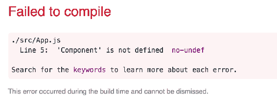
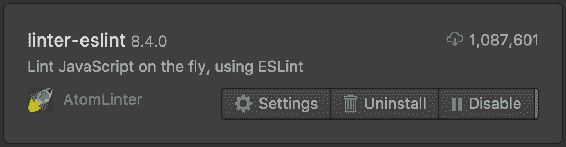
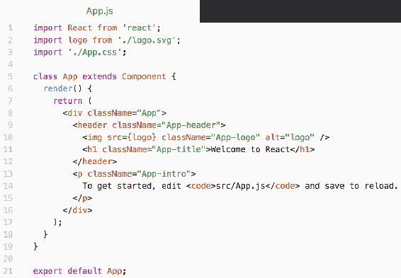
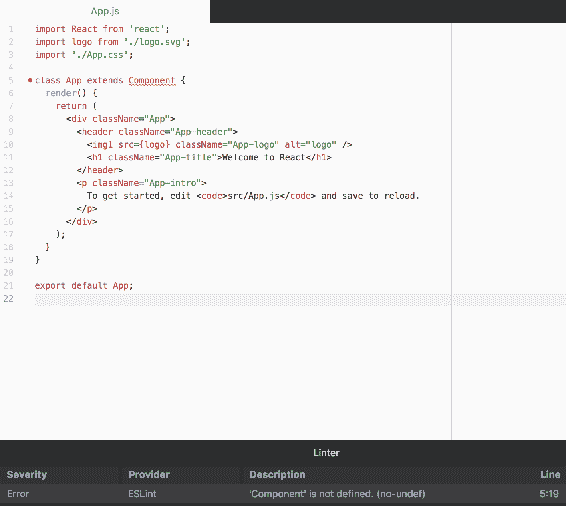
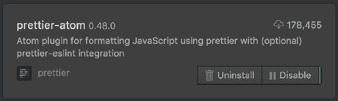
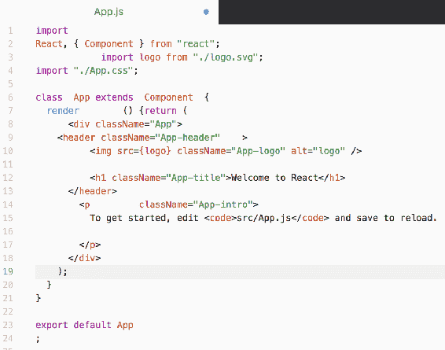
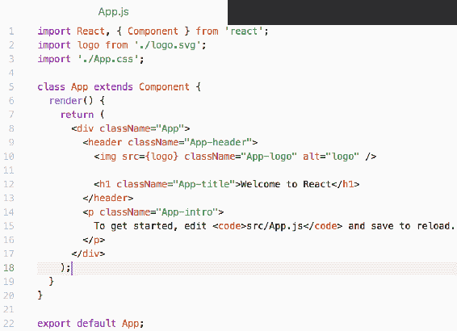

# 第六章：强制执行代码质量以提高可维护性

如果一个项目的代码是一致的且易于阅读，那不是很好吗？之所以通常情况下不是这样，是因为强制执行这种程度的代码质量是繁重的。当手动完成某事是一种负担时，您就引入了一个工具。

本章的重点是使用工具来确保您的 React 代码质量达到标准。以下是本章的学习内容：

+   安装和配置 ESLint

+   在 React 源代码上运行 ESLint

+   从 Airbnb 获取配置帮助

+   对 JSX 和 React 组件进行 Linting

+   将 ESLint 与您的代码编辑器集成

+   自定义 ESLint 错误和警告

+   使用 Prettier 自动格式化代码

# 安装和配置 ESLint

自动化 React 源代码质量的第一步是安装和配置用于自动化的工具—ESLint。当安装了 ESLint 时，它会在您的系统上安装一个`eslint`命令。与安装全局命令的其他软件包一样，最好将它们作为项目的一部分安装在本地，这样您就不必依赖系统上全局可用的命令。

要在项目中安装 ESLint，请运行以下`npm`命令：

```jsx
npm install eslint --save-dev
```

现在您已经安装了 ESLint，您可以创建一个新的 npm 脚本来运行 ESLint。将以下内容添加到您的`package.json`文件的`scripts`部分：

```jsx
"scripts": { 
  ... 
  "lint": "eslint" 
}, 
```

现在您有了一个可以在项目中运行的`eslint`命令。试一试吧：

```jsx
npm run lint
```

而不是对任何源文件进行 Linting，您应该在控制台中看到一个使用消息：

```jsx
eslint [options] file.js [file.js] [dir]

Basic configuration:
  -c, --config path::String      Use configuration from this file or shareable config
  --no-eslintrc                  Disable use of configuration from .eslintrc
  --env [String]                 Specify environments
  --ext [String]                 Specify JavaScript file extensions - default: .js
  --global [String]              Define global variables
  --parser String                Specify the parser to be used
  --parser-options Object        Specify parser options 
...
```

如您所见，您必须告诉`eslint`命令您想要进行 Lint 的文件或目录。为了保持简单，让我们假设我们所有的代码都在与`package.json`相同的目录中。您可以修改您的`package.json`文件如下，以便 ESLint 知道在哪里查找文件：

```jsx
"scripts": { 
  ... 
  "lint": "eslint ." 
}, 
```

您注意到在`eslint`后面添加了点(`.`)吗？这意味着在大多数系统上是当前目录。继续运行`npm run lint`。这一次，您将看到不同的输出，因为 ESLint 实际上正在尝试查找要进行 Lint 的源文件：

```jsx
Oops! Something went wrong! :(ESLint: 4.15.0.
ESLint couldn't find a configuration file. To set up a configuration file for this project, please run:
 eslint --init
```

好的，让我们按照它告诉我们的去做。我们将运行`npm run lint -- --init`来创建一个配置文件。当您这样做时，您将看到一系列选项供您选择：

```jsx
? How would you like to configure ESLint? 
› Answer questions about your style 
 Use a popular style guide 
 Inspect your JavaScript file(s) 
```

现在让我们选择第一个选项，并回答一些关于您计划编写的代码的基本问题。选择选项后，按下*Enter*键将带您到第一个问题：

```jsx
? Are you using ECMAScript 6 features? (y/N)  
```

是的，你是。

```jsx
? Are you using ES6 modules? (y/N)
```

是的，你是。

```jsx
? Where will your code run? (Press <space> to select, <a> to toggle all, <i> to inverse selection)
›(*) Browser
 ( ) Node
```

选择 `Browser`。

```jsx
? Do you use CommonJS? (y/N)  
```

不。

```jsx
? Do you use JSX? (y/N)  
```

不。我们稍后会介绍 JSX。

```jsx
? What style of indentation do you use? (Use arrow keys)
› Tabs 
  Spaces
```

在这里使用任何你喜欢的，因为我最终肯定会错。

```jsx
? What quotes do you use for strings? (Use arrow keys)
› Double 
  Single 
```

单个。你是什么，一个动物吗？

```jsx
? What line endings do you use? (Use arrow keys)
› Unix
  Windows
```

Unix 在这里是一个安全的选择。

```jsx
? Do you require semicolons? (Y/n)  
```

这是一个棘手的问题。在 JavaScript 源代码中分号不是必需的。有时它们可以帮助，而其他时候它们只是为了一些 JavaScript 解释器已经理解的东西而添加的语法。如果你不确定，要求使用分号；你总是可以稍后更改你的 ESLint 配置：

```jsx
? What format do you want your config file to be in? (Use arrow keys)
› JavaScript 
  YAML 
  JSON 
```

使用你最舒适阅读和编辑的任何东西。我将坚持使用 JavaScript 的默认选项：

```jsx
Successfully created .eslintrc.js file
```

万岁！让我们再试一次运行这个：

```jsx
npm run lint
```

这次没有输出。这意味着 ESLint 没有发现任何错误。部分原因是项目中还没有代码，但是现在你有了一个已知的工作起点。让我们快速看一下为你创建的 `.eslintrc.js` 文件：

```jsx
module.exports = { 
    "env": { 
        "browser": true, 
        "es6": true 
    }, 
    "extends": "eslint:recommended", 
    "parserOptions": { 
        "sourceType": "module"
```

```jsx
    }, 
    "rules": { 
        "indent": [ 
            "error", 
           4 
        ], 
        "linebreak-style": [ 
            "error", 
            "unix" 
        ], 
        "quotes": [ 
            "error", 
            "single" 
        ], 
        "semi": [ 
            "error", 
            "always" 
        ] 
    } 
}; 
```

既然你已经回答了创建这个文件所需的问题，你现在不需要改变任何东西。当你需要时，这就是要编辑的文件。当你只是学习 ESLint 时，像这样打出一个配置文件可能会让人望而却步。但是，当你决定你的代码质量标准需要调整时，ESLint 规则参考（[`eslint.org/docs/rules/`](https://eslint.org/docs/rules/)）是一个很好的资源。

作为为项目设置和配置 ESLint 的最后一步，让我们引入一些源代码进行 lint。如果还没有，创建一个 `index.js` 文件，并添加以下函数：

```jsx
export const myFunc = () => 'myFunc';
```

不要担心运行这个函数，linting 不像测试或类型检查那样。相反，linting 为开发人员提供了关于他们从代码质量角度做错了什么的易于忽视的提示。正确性与代码质量是不同的。这意味着你有许多可调整的选项与 ESLint，告诉它如何评估你的代码。

现在，回到你刚刚添加的函数。你可以通过再次运行 `npm run lint` 来验证这个函数是否正确。果然，根据你在 `.eslintrc.js` 中配置的规则，这个函数是好的。现在，尝试从函数中删除分号，使其看起来像这样：

```jsx
export const myFunc = () => 'myFunc' 
```

这次，你会从 ESLint 得到一个错误：

```jsx
index.js 
  1:37  error  Missing semicolon  semi 
Χ 1 problem (1 error, 0 warnings)
```

这是您需要的确切输出类型。它为您提供了源文件的名称，文件中错误/警告的位置，并描述了找到的实际问题。

让我们再试一次。请恢复您删除的分号。现在，删除 `export` 语句，使您的函数定义如下：

```jsx
const myFunc = () => 'myFunc'; 
```

当对此代码进行检查时，您会得到不同的错误：

```jsx
index.js 
  1:7  error  'myFunc' is assigned a value but never used  no-unused-vars Χ 1 problem (1 error, 0 warnings)
```

因为您删除了 `export` 关键字，所以模块只是一个分配给 `myFunc` 的函数。它从未被使用，ESLint 能够告诉您这一点。

# 建立在 Airbnb 标准的基础上

拥有大型 JavaScript 代码库的组织已经在代码质量工具上进行了大量投资。这包括在配置诸如 ESLint 之类的工具方面的投资。使用一组标准的配置值来强制执行代码质量的伟大之处在于，由于轻微的配置差异，开发人员之间不会有任何差异。

ESLint 允许您安装和使用 npm 包作为配置设置来使用和扩展。一个受欢迎的选择是 Airbnb 标准。让我们再次使用 ESLint `init` 工具来开始使用 Airbnb JavaScript 代码质量标准。首先，再次运行 `init` 工具：

```jsx
npm run lint -- --init
```

第一个问题问您如何配置 ESLint。您可以选择一个指南而不是回答问题：

```jsx
? How would you like to configure ESLint? 
  Answer questions about your style 
› Use a popular style guide 
  Inspect your JavaScript file(s) 
```

下一个问题让您选择要遵循的指南。您想要遵循 Airbnb 的指南：

```jsx
? Which style guide do you want to follow? 
  Google  
›  Airbnb 
  Standard 
```

现在，ESLint 将安装必要的 npm 包以使用 Airbnb 的 ESLint 配置设置：

```jsx
Checking peerDependencies of eslint-config-airbnb-base@latest 
Installing eslint-config-airbnb-base@latest, eslint-plugin-import@².7.0 

+ eslint-plugin-import@2.8.0 
+ eslint-config-airbnb-base@12.1.0 
```

让我们看看 ESLint 创建的 `.eslintrc.js` 文件是什么样子的：

```jsx
module.exports = { 
  "extends": "airbnb-base" 
}; 
```

正如您所看到的，现在这个文件非常简单，因为一切都由 `airbnb-base` npm 包处理。您的 `.eslintrc.js` 只是在扩展它。让我们看看这些 Airbnb 规则是如何起作用的。将以下代码添加到 `index.js` 中：

```jsx
const maybe = v => v ? v : 'default';

console.log(maybe('yes'));
// -> yes
console.log(maybe());
// -> default
```

`maybe()` 函数如果参数为真，则返回该参数；否则返回字符串 `default`。然后，使用字符串值和没有值来调用 `maybe()`。注释指示了这两个函数调用的输出。随时运行此代码以确保它按照广告中的方式工作。

在您这样做之后，让我们看看 Airbnb 对您的代码有何看法：

```jsx
npm run lint
```

这是输出：

```jsx
index.js 
  1:15  error    Arrow function used ambiguously with a conditional expression     no-confusing-arrow
```

```jsx
 1:24  error    Unnecessary use of conditional expression for default assignment  no-unneeded-ternary 
  3:1   warning  Unexpected console statement                                      no-console 
  5:1   warning  Unexpected console statement                                      no-console 
Χ 4 problems (2 errors, 2 warnings)
```

四个问题！哎呀。让我们逐个解决每个问题，看看能做些什么。第一个错误是`no-confusing-arrow`，它表示箭头函数与比较运算符模糊地使用了。您可以查看每个错误的具体内容（[`eslint.org/docs/rules/`](https://eslint.org/docs/rules/)），在那里您将找到详细的解释和示例。

接下来的错误`no-unneeded-ternary`与第一个错误密切相关。它指出我们可以使用比三元表达式更简单的表达式，这应该有助于提高代码的可读性。所以让我们试一试。`maybe()`函数应该返回参数或者如果参数为假的话返回一些默认值。除了三元运算符，让我们尝试使用逻辑或(||)：

```jsx
const maybe = (v = 'default') => v; 
```

这里的可读性稍有改善，明显减少了语法。关于这个微小改进本身更重要的是，每个在这个代码库上工作的开发人员都会做出相同的微小改进。让我们看看现在`npm run lint`会说些什么：

```jsx
index.js 
  6:1  warning  Unexpected console statement  no-console 
  8:1  warning  Unexpected console statement  no-console 
Χ 2 problems (0 errors, 2 warnings)
```

太棒了！您只剩下两个警告。但这些警告只是在抱怨您的`console.log()`调用。显然，Airbnb 的 ESLint 规则不喜欢这样做，但您喜欢。由于您只是通过扩展它们来使用 Airbnb 规则设置作为起点，您也可以关闭它们。在您的情况下，`no-console`规则没有任何作用，因为您显然依赖它。为此，编辑您的`.eslintrc.js`文件，使其如下所示：

```jsx
module.exports = { 
  "extends": "airbnb-base", 
  "rules": { 
    "no-console": 0 
  } 
}; 
```

在 ESLint 配置的`extends`部分之后，您可以添加一个`rules`部分，您可以在其中关闭由`airbnb-base`定义的特定规则。在这个例子中，将`no-console`设置为`0`告诉 ESLint 不应报告这些警告。让我们再次运行`npm run lint`，看看是否已经修复了所有问题。

果然，没有更多的错误要报告了！

# 向 ESLint 添加 React 插件

假设您想在尝试并喜欢了之后使用 Airbnb 的 ESLint 规则集。假设您还想对 React 组件代码进行 lint。在 ESLint `init`过程中，您已经回答了一个问题，该问题询问您的项目是否使用 React。这次，让我们回答“是”。所以，再次运行 ESLint `init`过程：

```jsx
npm run lint -- --init
```

再次，您想使用 Airbnb 的 lint 规则：

```jsx
? Which style guide do you want to follow? 
  Google 
›  Airbnb 
  Standard 
```

当它询问您是否使用 React 时，回答“是”：

```jsx
? Do you use React? (y/N) y
```

您会注意到安装了一些额外的包：

```jsx
+ eslint-plugin-react@7.5.1
+ eslint-plugin-jsx-a11y@6.0.3  
```

现在让我们编写一些 React 代码，以便我们可以对其进行 lint。将以下组件添加到`MyComponent.js`中：

```jsx
import React, { Component } from 'react'; 

class MyComponent extends Component { 
  render() { 
    return ( 
      <section> 
        <h1>My Component</h1> 
      </section> 
    );
```

```jsx
  } 
} 

export default MyComponent; 
```

这是组件的渲染方式：

```jsx
import React from 'react'; 
import ReactDOM from 'react-dom'; 
import MyComponent from './MyComponent'; 

const root = document.getElementById('root'); 

ReactDOM.render( 
  <MyComponent />, 
  root 
); 
```

您不需要担心在浏览器中运行此 React 应用程序；这只是为了确保 ESLint 能够解析 JSX 并对其进行 lint。现在让我们尝试运行 ESLint：

```jsx
npm run lint
```

在对源代码进行 lint 时，这里是生成的错误：

```jsx
index.js 
  5:14  error  'document' is not defined                      no-undef 
  8:3   error  JSX not allowed in files with extension '.js'  react/jsx-filename-extension 
  9:7   error  Missing trailing comma                         comma-dangle 

MyComponent.js 
  3:1  error  Component should be written as a pure function  react/prefer-stateless-function 
  6:7  error  JSX not allowed in files with extension '.js'   react/jsx-filename-extension 
```

您需要处理两个源文件中的错误。现在让我们逐个讨论这些错误。

来自`index.js`的第一个错误是`no-undef`，它指的是一个不存在的`document`标识符。问题是，您知道`document`是在浏览器环境中全局存在的标识符。ESLint 不知道这个全局标识符被定义了，所以我们必须在`.eslintrc.js`中告诉它这个值：

```jsx
module.exports = { 
  "extends": "airbnb",
```

```jsx
  "globals": {
    "document": true 
  } 
}; 
```

在 ESLint 配置的`globals`部分，您可以列出 ESLint 应该识别的全局标识符的名称。如果标识符实际上在引用它的源代码中是全局可用的，则值应为`true`。这样，ESLint 就知道不会抱怨在浏览器环境中识别为全局标识符的东西。

为特定环境中存在的标识符（如 Web 浏览器）添加全局标识符的问题在于它们有很多。您不希望维护这样一个列表，以便 ESLint 通过您的源代码。幸运的是，ESLint 对此有解决方案。您可以指定代码将在的环境，而不是指定`globals`：

```jsx
module.exports = { 
  "extends": "airbnb", 
  "env": { 
    "browser": true 
  } 
}; 
```

通过将`browser`环境指定为`true`，ESLint 知道所有浏览器全局变量，并且在代码中找到它们时不会抱怨。此外，您可以指定多个环境，因为通常会有在浏览器和 Node.js 中运行的代码。或者即使您不在不同环境之间共享代码，也可能希望对同时具有客户端和服务器代码的项目进行 lint。在任何一种情况下，这是多个 ESLint 环境的示例：

```jsx
module.exports = { 
  "extends": "airbnb", 
  "env": { 
    "browser": true, 
    "node": true 
  } 
}; 
```

要修复的下一个错误是`react/jsx-filename-extension`。这个规则来自于你初始化 ESLint 配置时安装的`eslint-plugin-react`包。该规则希望你使用不同的扩展名来命名包含 JSX 语法的文件。假设你不想麻烦这个（我不会责怪你，为几乎相同类型的文件内容维护两个文件扩展名太费劲了）。让我们暂时禁用这个规则。

这是更新后的 ESLint 配置：

```jsx
module.exports = {
  "extends": "airbnb", 
  "env": { 
    "browser": true, 
    "node": true 
  }, 
  "rules": { 
    "react/jsx-filename-extension": 0 
  } 
}; 
```

`react/jsx-filename-extension`规则被设置为`0`，在配置的`rules`部分中被忽略。继续运行`npm run lint`。现在只剩下两个错误了。

`comma-dangle`规则确实有自己的见解，但这是一个有趣的想法。让我们聚焦于触发这个错误的有问题的代码：

```jsx
ReactDOM.render( 
  <MyComponent />, 
  root 
); 
```

ESLint 抱怨在`root`参数后没有尾随逗号。添加尾随逗号的想法是：

+   后面添加项目更容易，因为逗号已经在那里

+   当你提交代码时，它会导致更清晰的差异，因为添加或删除项目只需要更改一行而不是两行

假设这是有道理的，你决定保留这个规则（我喜欢它），这是修复后的代码：

```jsx
ReactDOM.render( 
  <MyComponent />, 
  root, 
); 
```

现在让我们再次运行`npm run lint`。只剩下一个错误！这是另一个 React 特定的错误：`react/prefer-stateless-function`。让我们再看看触发这个错误的 React 组件：

```jsx
import React, { Component } from 'react'; 

class MyComponent extends Component {

  render() { 
    return (
      <section> 
        <h1>My Component</h1> 
      </section> 
    ); 
  } 
} 

export default MyComponent; 
```

ESLint 通过`eslint-plugin-react`的帮助，告诉你这个组件应该被实现为一个函数而不是一个类。它这么说是因为它能够检测到`MyComponent`没有任何状态，也没有任何生命周期方法。所以如果它被实现为一个函数，它：

+   不再依赖`Component`类

+   将是一个简单的函数，比类的语法要少得多

+   将明显地表明这个组件没有副作用

考虑到这些好处，让我们按照 ESLint 的建议，将`MyComponent`重构为一个纯函数：

```jsx
import React, { Component } from 'react';

const MyComponent = () => (
  <section>
    <h1>My Component</h1>
  </section>
);

export default MyComponent;
```

当你运行`npm run lint`时，你会得到：

```jsx
MyComponent.js 
  1:17  error  'Component' is defined but never used  no-unused-vars 
```

哎呀，在修复另一个错误的过程中，你引入了一个新的错误。没关系，这就是为什么要对代码进行检查，以找出容易忽略的问题。在这种情况下，是因为我们忘记了去掉`Component`导入，所以出现了`no-unused-vars`错误。这是修复后的版本：

```jsx
import React from 'react';
const MyComponent = () => ( 
  <section>
    <h1>My Component</h1> 
  </section> 
); 

export default MyComponent; 
```

然后你就完成了，不再有错误！借助`eslint-config-airbnb`和`eslint-plugin-react`的帮助，你能够生成任何其他 React 开发人员都能轻松阅读的代码，因为很可能他们正在使用完全相同的代码质量标准。

# 使用 ESLint 与 create-react-app

到目前为止，在本章中你所看到的一切，你都必须自己设置和配置。并不是说让 ESLint 运行起来特别困难，但`create-react-app`完全抽象了这一点。记住，`create-react-app`的理念是尽快开始编写组件代码，而不必考虑配置诸如 linters 之类的东西。

为了看到这一点的实际效果，让我们使用`create-react-app`创建一个新的应用程序：

```jsx
create-react-app my-new-app
```

然后，一旦创建，立即启动应用程序：

```jsx
npm start
```

现在让我们让 ESLint 抱怨一些事情。在你的编辑器中打开`App.js`，它应该看起来像这样：

```jsx
import React, { Component } from 'react'; 
import logo from './logo.svg'; 
import './App.css'; 

class App extends Component { 
  render() { 
    return ( 
      <div className="App"> 
        <header className="App-header"> 
           
          <h1 className="App-title">Welcome to React</h1> 
        </header>
        <p className="App-intro"> 
          To get started, edit <code>src/App.js</code> and save to reload. 
        </p> 
      </div>
    ); 
  } 
} 

export default App; 
```

ESLint 认为这是可以的，所以让我们删除`Component`导入，这样`App.js`现在看起来像这样：

```jsx
import React from 'react'; 
import logo from './logo.svg'; 
import './App.css'; 

class App extends Component { 
  render() { 
    return ( 
      <div className="App"> 
        <header className="App-header"> 
           
          <h1 className="App-title">Welcome to React</h1> 
        </header> 
        <p className="App-intro"> 
          To get started, edit <code>src/App.js</code> and save to reload. 
        </p> 
      </div> 
    ); 
  } 
} 

export default App; 
```

你的`App`类现在试图扩展`Component`，但`Component`并不存在。一旦你保存文件，ESLint 将被调用，因为它作为 Webpack 插件集成到开发服务器中。在开发服务器控制台中，你应该看到以下内容：

```jsx
Failed to compile.

./src/App.js
Line 5:  'Component' is not defined  no-undef  
```

正如预期的那样，ESLint 会为你检测到问题。将 ESLint 集成到开发服务器中的好处是你不必记得调用`npm run lint`命令。如果 ESLint 不通过，整个构建将失败。

你不仅会在开发服务器控制台中收到构建失败的通知，而且还会直接在浏览器中收到通知：



这意味着即使你忘记查看服务器控制台，也很难错过替换整个 UI 的通知。如果你撤消了故意破坏 ESLint 的更改（重新添加`Component`导入），一旦你保存`App.js`，你的 UI 会再次显示出来。

# 在代码编辑器中使用 ESLint

如果你想要进一步对`create-react-app`的代码进行 linting，你可以这样做。如果你正在编写组件代码，你最不想做的事情就是不得不切换到控制台或浏览器窗口，只是为了查看你写的东西是否足够好。对于一些人来说，更好的开发体验是在他们的编辑器中看到 lint 错误发生。

让我们看看如何在 Atom 中实现这一点。首先，你需要安装`linter-eslint`插件：



现在当你在 Atom 中打开 JavaScript 源文件时，这个插件会为你进行 lint，并在行内显示错误和警告。唯一的挑战是`create-react-app`实际上并没有为你创建一个`.eslintrc.js`文件。这是因为`create-react-app`的性质是默认情况下隐藏所有配置。

然而，ESLint 仍然由`create-react-app`配置。这就是在启动开发服务器时对你的源代码进行 lint 的方式。问题在于你可能希望在编辑器 linter 中使用这个配置。`create-react-app`安装了一个名为`eslint-config-react-app`的包，其中包含开发服务器使用的 ESLint 配置。你可以在自己的项目中使用这个配置，这样你的编辑器 linter 就配置与浏览器或控制台中输出的内容相同。这非常重要，你最不希望的就是编辑器告诉你代码的一些问题，而你在浏览器中却看不到任何问题。

如果你在 Atom 中打开`App.js`，你不应该看到任何 lint 错误，因为：

+   没有任何

+   `linter-eslint` Atom 插件没有运行，因为它没有找到任何配置

当没有错误时，文件看起来像这样：



你所要做的就是添加扩展`eslint-config-react-app`配置的 ESLint 配置。在你的项目根目录中，创建以下`.eslintrc.js`文件：

```jsx
module.exports = { 
  "extends": "eslint-config-react-app" 
}; 
```

现在 Atom 的`linter-eslint`插件将尝试实时对你的开源文件进行 lint。此外，它将使用与你的`create-react-app`开发服务器完全相同的配置。让我们再试着删除`Component`导入。现在你的编辑器看起来有点不同：



正如你所看到的，`Component`标识符被用红色下划线标出，以便突出显示代码的这一部分。在你的源代码下面，有一个窗格显示了找到的每个 linter 错误的列表，以及有关每个错误的更多细节。如果你运行`npm start`，你会在开发服务器控制台和浏览器中看到完全相同的错误，因为 Atom 使用与`create-react-app`相同的 ESLint 配置。

现在让我们消除这个错误。转到以下代码行：

```jsx
import React from 'react';
```

将其改回：

```jsx
import React, { Component } from 'react'; 
```

在你的编辑器中不应该再显示任何 linter 错误。

# 使用 Prettier 自动化代码格式化

ESLint 可以用来改进代码的任何方面，包括格式。使用 ESLint 的问题在于它只告诉你它发现的格式问题。你仍然需要去修复它们。

这就是为什么 `create-react-app` 的 ESLint 配置没有指定任何代码格式规则。这就是 Prettier 这样的工具发挥作用的地方。它是一个针对你的 JavaScript 代码的有主见的代码格式化工具。它可以直接理解 JSX，因此非常适合格式化你的 React 组件。

`create-react-app` 用户指南中有一个完整的部分介绍了如何设置 Git 提交钩子，以在提交之前触发 Prettier 格式化任何代码：[`github.com/facebookincubator/create-react-app#user-guide`](https://github.com/facebookincubator/create-react-app#user-guide)。

我不会在这里重复这个指南，但基本思想是，设置好 Git 钩子，以便在提交任何 JavaScript 源代码时调用 Prettier 来确保一切都格式化得很好。只依赖 Git 提交钩子的缺点是，作为开发人员，你不一定在编写代码时看到格式化后的代码。

除了设置 Prettier 在每次提交时格式化 JavaScript 源代码之外，添加代码编辑器插件可以大大改善开发体验。再次，你可以安装适当的 Atom 包（或类似的东西；Atom 很受欢迎，所以我在这里使用它作为示例编辑器）：



安装了 `prettier-atom` 包后，你可以使用 Atom 来格式化你的 React 代码。默认情况下，这个包使用快捷键 *Ctrl* + *Alt* + *F* 来调用 Prettier 格式化当前的源文件。另一个选项是在保存时启用格式化。


现在，每次保存 JavaScript 源代码时，Prettier 都会对其进行格式化。让我们来测试一下。首先，打开 `App.js`，完全破坏格式，让它看起来像这样：



恶心！让我们保存文件，看看会发生什么：



这样好多了。想象一下，如果你不得不手动修复那个混乱的代码。Prettier 可以让你的代码清晰，几乎不需要你费心思。

# 总结

本章重点介绍了使用工具来强制执行 React 项目的代码质量水平。您学习了第一个工具是 ESLint。您学会了如何安装和配置它。您很少需要手动配置 ESLint。您学会了如何使用 ESLint 初始化工具，该工具会引导您完成配置 ESLint 规则的各种选项。

接下来，您了解了不同的标准 ESLint 配置，可以在您的 React 应用程序中使用。Airbnb 是一个流行的标准，您可以在 ESLint 中使用，并且可以逐条自定义规则以适应您团队的特定风格。您还可以告诉 ESLint 初始化工具，您打算使用 React，并让它为您安装适当的软件包。

最后，您了解了`create-react-app`如何使用 ESLint。它使用一个 Webpack 插件在运行开发服务器时对您的代码进行 lint。您学会了`create-react-app`如何为此配置 ESLint，以及如何在代码编辑器中使用此配置。Prettier 是一个工具，它将自动格式化您的代码，这样您就不必花时间手动处理大量的 ESLint 样式警告。

在下一章中，您将学习如何使用 Storybook 在它们自己的环境中隔离 React 组件开发。
