# 第七章：使用 Storybook 隔离组件

React 组件是较大用户界面的较小部分。自然而然，您希望与应用程序的其余部分一起开发 UI 组件。另一方面，如果您唯一的环境是在较大的 UI 内部，那么尝试组件更改可能会变得棘手。本章的重点是向您展示如何利用 Storybook 工具提供一个隔离的沙盒来开发 React 组件。您将学到：

+   隔离组件开发的重要性

+   安装 Storybook 并进行设置

+   使用故事开发组件

+   将组件引入应用程序

# 隔离组件开发的需求

在开发过程中隔离 React 组件可能会很困难。开发人员和他们正在制作的 React 组件所拥有的唯一上下文通常只有应用程序本身。在组件开发过程中很少会按计划进行。调试 React 组件的一部分是，嗯，与之互动。

我经常发现自己在应用程序代码中做一些奇怪的事情，以适应我们对组件进行临时更改时出现的问题。例如，我会更改容器元素的类型，看看这是否导致了我看到的布局问题；或者，我会更改组件内部的标记；或者，我会完全捏造一些组件使用的状态或属性。

重点是，在开发组件的过程中，您将想要进行一些随机实验。在您构建的应用程序中尝试这样做可能会很麻烦。这主要是因为您被迫接受组件周围的一切，当您只关心看看您的组件做了什么时，这可能会分散注意力。

有时，我最终会创建一个全新的页面，或者一个全新的应用程序，只是为了看看我的组件单独做了什么。这是一个痛苦的过程，其他人也有同样的感受，这就是为什么**Storybook**存在的原因。React 工具存在是为了为 React 开发人员自动化某些事情。使用 Storybook，您正在自动化一个沙盒环境供您使用。它还为您处理所有构建步骤，因此您只需为组件编写一个故事并查看结果。

最好的方式是将 Storybook 视为类似 JSFiddle（[`jsfiddle.net/`](https://jsfiddle.net/)）或 JSBin（[`jsbin.com/`](https://jsbin.com/)）这样的网站。它们让你可以在不设置和维护环境的情况下尝试小段代码。Storybook 就像 React 的 JSFiddle，作为你项目的一个组成部分存在。

# 安装和配置 Storybook

使用 Storybook 的第一步是安装全局命令行工具。它被安装为全局工具，因为它可以同时用于许多项目，并且可以用来引导新项目。让我们从这第一步开始：

```jsx
npm install @storybook/cli -g
```

安装完成后，你将拥有用于修改`package.json`依赖项和生成样板 Storybook 文件的命令行工具。假设你已经使用`create-react-app`创建了一个新应用程序。进入你的应用程序目录，并使用 Storybook 命令行工具将 Storybook 添加到你当前的项目中：

```jsx
getstorybook
```

当你运行`getstorybook`命令时，它会为你做很多事情。当你运行这个命令时，以下是你应该看到的输出：

```jsx
getstorybook - the simplest way to add a storybook to your project. 
 Detecting project type. 
 Adding storybook support to your "Create React App" based project.  Preparing to install dependencies. 
```

它会在添加任何内容之前尝试弄清楚你的项目类型，因为不同类型的项目会有不同的组织要求。`getstorybook`会考虑到这一点。然后，它会安装依赖项，样板文件，并向你的`package.json`添加脚本：

```jsx
  Installing dependencies.
To run your storybook, type:
 npm run storybook 
```

输出告诉你如何在项目中运行 Storybook 服务器。此时，你的`package.json`的`scripts`部分应该如下所示：

```jsx
"scripts": { 
  "start": "react-scripts start", 
  "build": "react-scripts build", 
  "test": "react-scripts test --env=jsdom", 
  "eject": "react-scripts eject", 
  "storybook": "start-storybook -p 9009 -s public", 
  "build-storybook": "build-storybook -s public" 
} 
```

我们将在本章后面看一下`build-storybook`脚本；你会更经常使用`storybook`脚本。

接下来，让我们来看看`getstorybook`为你创建的样板文件。首先，你会注意到在项目的顶层目录中有一个新的`.storybook`目录：

```jsx
.storybook/
├── addons.js
└── config.js
```

添加的两个文件如下：

+   `addons.js`：这个文件导入了 Storybook 的插件模块。默认情况下，会使用 actions 和 links 插件，但如果不需要可以移除。

+   `config.js`：这个文件导入了这个项目的故事，并配置 Storybook 来使用它们。

你还会在你的`src`目录中找到一个名为`stories`的新目录：

```jsx
src/
├── App.css
├── App.js
├── App.test.js
├── index.css
├── index.js
├── logo.svg
├── registerServiceWorker.js
└── stories
    └── index.js
```

记得`getstorybook`是如何发现你正在使用`create-react-app`来开发你的项目的吗？这就是它知道要把`stories`目录放在`src`下的方式。这里有两个演示故事，可以帮助你入门：

```jsx
import React from 'react'; 

import { storiesOf } from '@storybook/react'; 
import { action } from '@storybook/addon-actions'; 
import { linkTo } from '@storybook/addon-links'; 

import { Button, Welcome } from '@storybook/react/demo'; 

storiesOf('Welcome', module).add('to Storybook', () => ( 
  <Welcome showApp={linkTo('Button')} /> 
)); 

storiesOf('Button', module) 
  .add('with text', () => ( 
    <Button onClick={action('clicked')}>Hello Button</Button> 
  )) 
  .add('with some emoji', () => ( 
    <Button onClick={action('clicked')}></Button> 
  )); 
```

现在先不要担心这个文件里发生了什么，我们会搞清楚的。这些默认故事将被你为组件想出的故事所替代。将这些默认故事放在那里也很有帮助，这样当你第一次启动 Storybook 服务器时，你就有东西可以看。现在让我们来做吧：

```jsx
npm run storybook
```

几秒钟后，你应该会看到控制台输出，告诉你服务器运行的位置，这样你就可以在浏览器中打开它：

```jsx
Storybook started on => http://localhost:9009/
```

当你在浏览器中查看 Storybook 应用程序时，你应该看到的是：

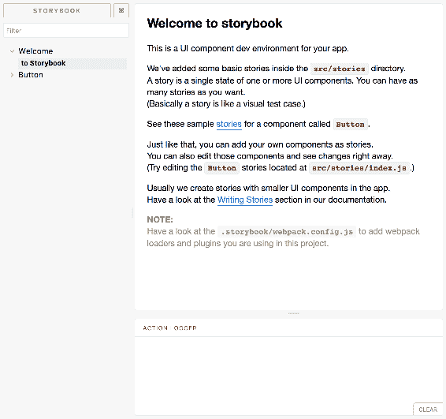

以下是你所看到的大致情况：

+   左窗格是你找到所有故事的地方。这是显示两个默认 Storybook 故事的地方。

+   主窗格是你将看到所选故事的渲染内容的地方。

+   底部操作窗格是你将看到触发的操作被记录的地方。

让我们尝试在左窗格中选择一个不同的故事：

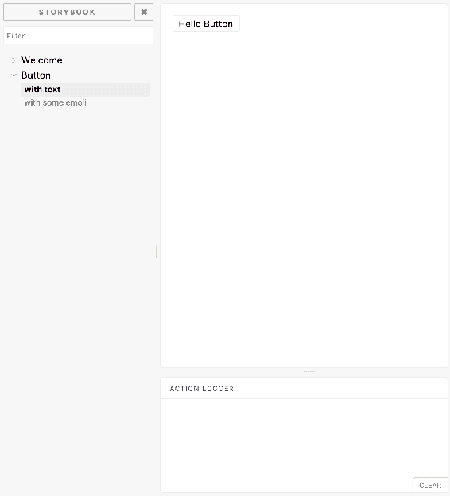

一旦你在左窗格中更改故事选择，你就会在主窗格中看到渲染的组件输出。在这种情况下，它是一个基本的按钮。

# 使用故事开发组件

Storybook 的价值在于，你不必设置应用程序就可以开始开发组件。或者，如果你已经在开发中有一个应用程序，你也不必想办法将正在进行中的组件集成到你的应用程序中。Storybook 是一个可以进行实验的工具。通过使用插件，你可以在担心将其集成到应用程序之前测试组件的几乎任何方面。

# 尝试使用 props 进行实验

也许，开始在 Storybook 中开发组件最直接的方法是开始尝试不同的属性值。为此，你只需要创建组件的不同故事，每个故事都有不同的属性值。

首先，让我们来看看你正在开发的组件：

```jsx
import React from 'react'; 

const MyComponent = ({ title, content, titleStyle, contentStyle }) => ( 
  <section> 
    <heading> 
      <h2 style={titleStyle}>{title}</h2> 
    </heading> 
    <article style={contentStyle}>{content}</article> 
  </section> 
); 

export default MyComponent; 
```

这个组件并不复杂。它接受四个属性并呈现一些 HTML 标记。`title`和`content`属性的值都是简单的字符串。`titleStyle`和`contentStyle`属性是分配给相应 HTML 元素的`style`属性的对象。

让我们开始为这个组件编写故事。假设使用了与前一节相同的方法：

1.  `create-react-app`用于创建 React 应用程序结构并安装依赖项

1.  `getstorybook`用于检查当前项目并添加适当的样板和依赖项

您可以打开`src/stories/index.js`并开始使用`storiesOf()`函数：

```jsx
storiesOf('MyComponent Properties', module) 
```

这是启动 Storybook UI 时将出现在左窗格中的顶级主题。在此函数下方是您添加单独故事的位置。由于您目前对测试不同的属性值感兴趣，您添加的故事将用于反映不同的属性值：

```jsx
.add('No Props', () => <MyComponent />) 
```

这将在 Storybook 的左窗格中添加一个名为`No Props`的故事。当您点击它时，您将看到在没有任何属性的情况下`MyComponent`在主窗格中的外观：

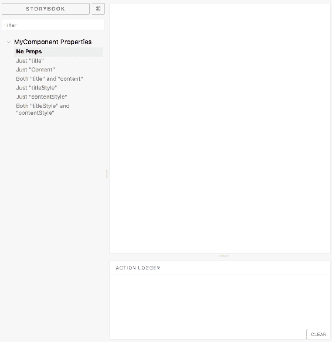

这里没有什么可看的，因为`title`和`content`属性都缺失。由于这两个值是唯一可见的呈现内容，所以没有内容可显示。让我们切换到下一个故事：

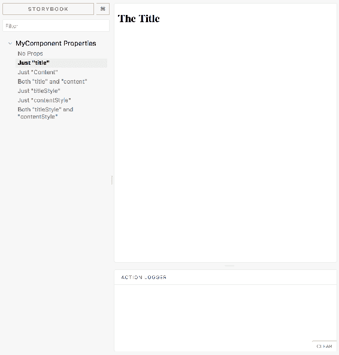

这次，选择了"Just "title" story"，您可以看到不同的 React 组件输出呈现。正如故事标题所示，只有`title`属性被传递给了`MyComponent`。以下是此故事的代码：

```jsx
.add('Just "title"', () => <MyComponent title="The Title" />) 
```

下一个故事只传递了`content`属性。以下是结果：

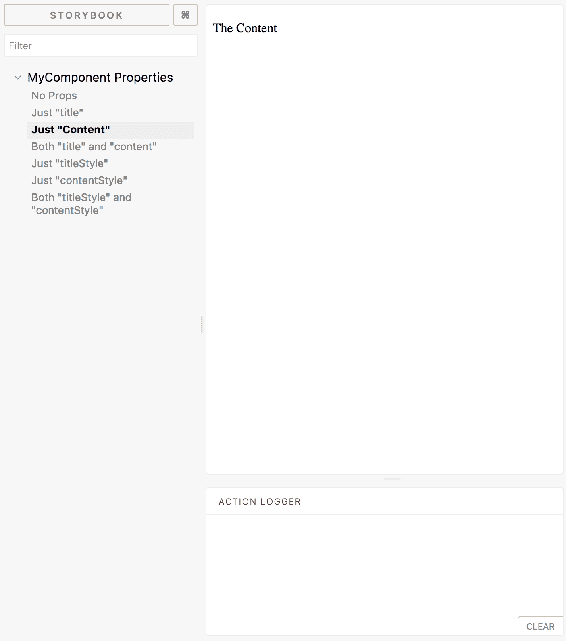

以下是仅传递`content`属性的代码：

```jsx
.add('Just "Content"', () => <MyComponent content="The Content" />) 
```

下一个故事将`title`和`content`属性都传递给`MyComponent`：

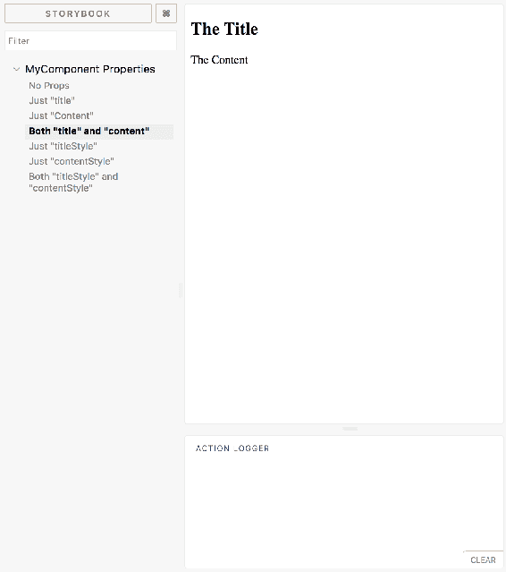

以下是在故事中呈现这两个属性的代码：

```jsx
.add('Both "title" and "content"', () => ( 
  <MyComponent title="The Title" content="The Content" /> 
)) 
```

此时，您的组件有三个故事，并且它们已经被证明是有用的。例如，您已经看到了`MyComponent`在没有内容或没有标题时的外观。根据结果，您可能决定将这两个属性都设为必填，或者提供默认值。

接下来让我们移动到样式属性。首先，您将只传递`titleStyle`属性，就像这样：

```jsx
.add('Just "titleStyle"', () => ( 
  <MyComponent 
    title="The Title" 
    content="The Content" 
    titleStyle={{ fontWeight: 'normal' }} 
  /> 
)) 
```

请注意，您还传递了`title`和`content`属性。这样，您就可以看到样式实际上如何影响`MyComponent`渲染的内容。这是结果：

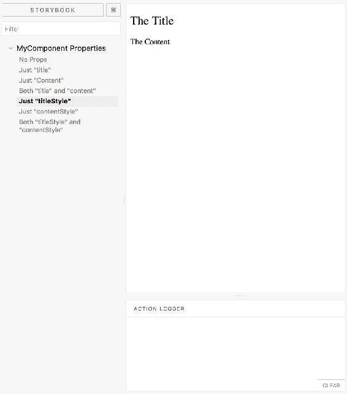

接下来，您将只传递`contentStyle`属性：

```jsx
.add('Just "contentStyle"', () => (
  <MyComponent 
    title="The Title" 
    content="The Content" 
    contentStyle={{ fontFamily: 'arial', fontSize: '1.2em' }} 
  /> 
)) 
```

这是它的样子：

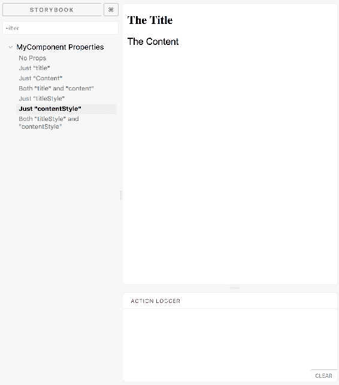

最后，让我们将每个可能的属性传递给`MyComponent`：

```jsx
.add('Both "titleStyle" and "contentStyle"', () => ( 
  <MyComponent 
    title="The Title" 
    content="The Content"
```

```jsx
    titleStyle={{ fontWeight: 'normal' }} 
    contentStyle={{ fontFamily: 'arial', fontSize: '1.2em' }} 
  /> 
)); 
```

这是`MyComponent`传递给它的每个属性的样子：

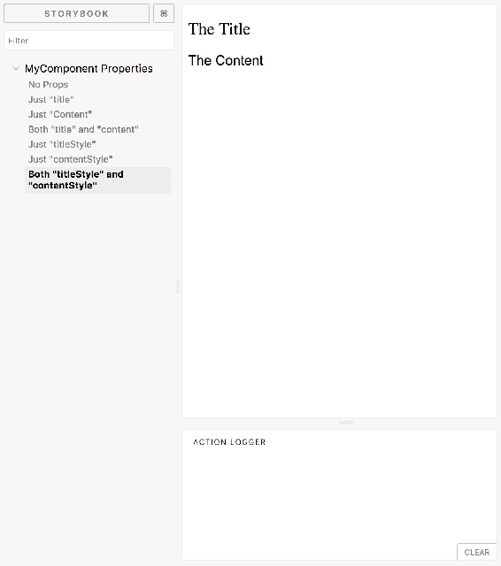

您刚刚为一个简单的组件创建了七个故事。使用 Storybook 开发服务器和 Storybook 用户界面，很容易在您为组件创建的不同故事之间切换，以便您可以轻松地看到它们之间的差异。这对于只处理属性的功能组件特别有效，就像您刚刚看到的那样。

这是您刚刚实现的所有故事，这样您就可以看到它们一起是什么样子的：

```jsx
import React from 'react'; 
import { storiesOf } from '@storybook/react'; 
import MyComponent from '../MyComponent'; 

storiesOf('MyComponent Properties', module) 
  .add('No Props', () => <MyComponent />) 
  .add('Just "title"', () => <MyComponent title="The Title" />) 
  .add('Just "Content"', () => <MyComponent content="The Content" />) 
  .add('Both "title" and "content"', () => ( 
    <MyComponent title="The Title" content="The Content" /> 
  )) 
  .add('Just "titleStyle"', () => ( 
    <MyComponent 
      title="The Title" 
      content="The Content" 
      titleStyle={{ fontWeight: 'normal' }} 
    /> 
  )) 
  .add('Just "contentStyle"', () => ( 
    <MyComponent 
      title="The Title" 
      content="The Content" 
      contentStyle={{ fontFamily: 'arial', fontSize: '1.2em' }} 
    /> 
  )) 
  .add('Both "titleStyle" and "contentStyle"', () => ( 
    <MyComponent 
      title="The Title" 
      content="The Content" 
      titleStyle={{ fontWeight: 'normal' }} 
      contentStyle={{ fontFamily: 'arial', fontSize: '1.2em' }} 
    /> 
  )); 
```

为您的组件添加每个故事都有不同的属性配置的好处是，这就像为您的组件拍摄静态快照。然后，一旦您为组件有了几个故事，您可以在这些快照之间切换。另一方面，您可能还没有准备好以这种方式开始实现几个故事。如果您只是想玩弄属性值，有一个名为**Knobs**的 Storybook 插件。

旋钮插件允许您通过 Storybook UI 中的表单控件玩转 React 组件属性值。现在让我们试用一下这个插件。第一步是在您的项目中安装它：

```jsx
npm install @storybook/addon-knobs --save-dev
```

然后，您必须告诉您的 Storybook 配置，您想要使用这个插件。将以下行添加到`.storybook/addons.js`：

```jsx
import '@storybook/addon-knobs/register'; 
```

现在，您可以将`withKnobs`装饰器导入到您的`stories/index.js`文件中，该装饰器用于告诉 Storybook 接下来的故事将使用控件来玩转属性值。您还需要导入各种类型的旋钮控件。这些都是简单的函数，当 Storybook UI 中的值发生变化时，它们将值传递给您的组件。

作为示例，让我们复制刚刚为`MyComponent`实现的相同故事情节。这一次，不再构建一堆静态故事，每个故事都设置特定的属性值，而是只添加一个使用 Knobs 附加组件来控制属性值的故事。以下是需要添加的导入内容：

```jsx
import { withKnobs, text, object } from '@storybook/addon-knobs/react';
```

以下是故事的新上下文，以及一个使用旋钮控件来设置和更改 React 组件属性值的默认故事：

```jsx
storiesOf('MyComponent Prop Knobs', module) 
  .addDecorator(withKnobs) 
  .add('default', () => ( 
    <MyComponent 
      title={text('Title', 'The Title')} 
      content={text('Content', 'The Content')} 
      titleStyle={object('Title Style', { fontWeight: 'normal' })} 
      contentStyle={object('Content Style', { 
        fontFamily: 'arial', 
        fontSize: '1.2em' 
      })} 
    />
  )); 
```

从 Knobs 附加组件中导入的两个函数`text()`和`object()`用于设置旋钮控件的标签和默认值。例如，`title`使用`text()`函数并带有默认字符串值，而`contentStyle`使用`object()`函数并带有默认样式对象。

在 Storybook 用户界面中的效果如下：

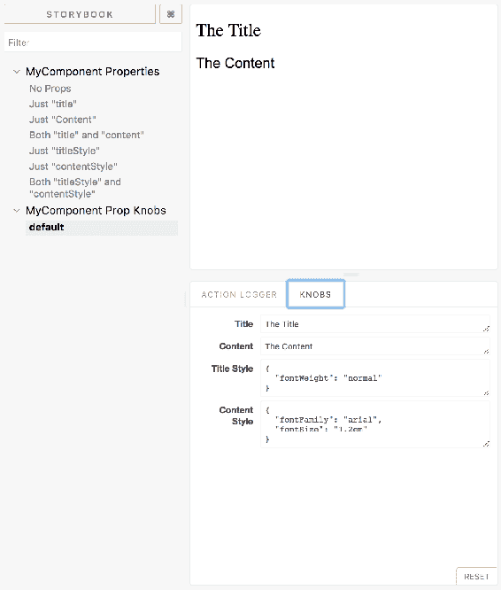

如果你看底部窗格，你会看到一个 KNOBS 标签，旁边是一个 ACTION LOGGER 标签。根据你用来声明故事的 Knobs 附加组件中的函数，这些表单控件被创建。现在你可以继续玩弄组件属性值，并观察呈现的内容实时变化：

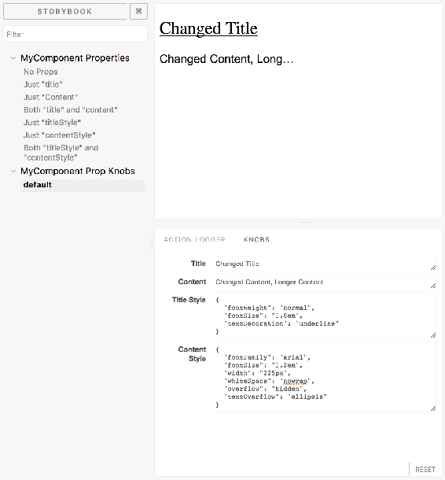

如果你在尝试旋钮字段时找到了喜欢的属性值，你可以将这些值硬编码到一个故事中。这就像是将一个组件配置标记为有效，以便以后可以返回到它。

# 尝试使用 actions

让我们将注意力转移到另一个附加组件——Actions。这个附加组件在你的 Storybook 中默认启用。Actions 的理念是，一旦你选择了一个故事，你就可以与主窗格中呈现的页面元素进行交互。Actions 为你提供了一种记录用户在 Storybook UI 中交互的机制。此外，Actions 还可以作为一个通用工具，帮助你监视数据在组件中的流动。

让我们从一个简单的按钮组件开始：

```jsx
import React from 'react'; 

const MyButton = ({ onClick }) => ( 
  <button onClick={onClick}>My Button</button> 
); 

export default MyButton; 
```

`MyButton`组件

渲染一个`<button>`元素并为其分配一个`onClick`事件处理程序。实际上，处理程序是由`MyComponent`定义的；它作为一个 prop 传递进来。因此，让我们为这个组件创建一个故事，并传递一个`onClick`处理程序函数：

```jsx
import React from 'react'; 
import { storiesOf } from '@storybook/react'; 
import { action } from '@storybook/addon-actions'; 
import MyButton from '../MyButton'; 

storiesOf('MyButton', module).add('clicks', () => ( 
  <MyButton onClick={action('my component clicked')} /> 
)); 
```

你看到了从`@storybook/addon-actions`导入的`action()`函数吗？这是一个高阶函数——一个返回另一个函数的函数。当你调用`action('my component clicked')`时，你会得到一个新的函数作为返回。这个新函数的行为有点像`console.log()`，你可以给它分配一个标签并记录任意值。不同之处在于，Storybook `action()` 插件函数创建的函数的输出会直接在 Storybook UI 的动作面板中呈现：

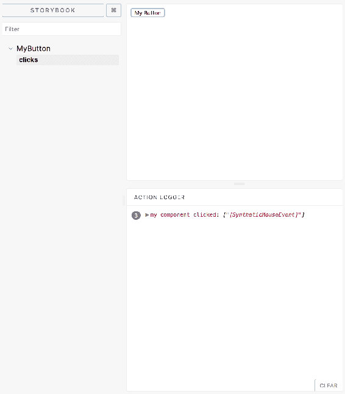

像往常一样，`<button>`元素被渲染在主面板中。你在动作面板中看到的内容是点击按钮三次的结果。每次点击的输出都是完全相同的，所以输出都被分组在你分配给处理函数的`my component clicked`标签下。

在上面的例子中，`action()`创建的事件处理函数对于作为你传递给组件的实际事件处理函数的替代是有用的。其他时候，你实际上需要事件处理行为来运行。例如，你有一个维护自己状态的受控表单字段，并且你想看看状态改变时会发生什么。

对于这样的情况，我发现最简单和最有效的方法是添加事件处理程序属性，即使你没有用它们做其他事情。让我们来看一个例子：

```jsx
import React, { Component } from 'react'; 

class MyRangeInput extends Component { 
  static defaultProps = { 
    onChange() {}, 
    onRender() {} 
  }; 

  state = { value: 25 }; 

  onChange = ({ target: { value } }) => { 
    this.setState({ value }); 
    this.props.onChange(value); 
  }; 

  render() { 
    const { value } = this.state; 
    this.props.onRender(value); 
    return ( 
      <input 
        type="range" 
        min="1" 
        max="100" 
        value={value} 
        onChange={this.onChange} 
      /> 
    ); 
  } 
}
export default MyRangeInput; 
```

让我们首先看一下这个组件的`defaultProps`。默认情况下，这个组件有两个`onChange`和`onRender`的默认处理函数，它们什么也不做，所以如果它们没有设置，仍然可以被调用而不会发生任何事情。正如你可能已经猜到的，现在我们可以将`action()`处理程序传递给`MyRangeInput`组件。让我们试一试。现在你的`stories/index.js`看起来是这样的：

```jsx
import React from 'react'; 
import { storiesOf } from '@storybook/react'; 
import { action } from '@storybook/addon-actions'; 
import MyButton from '../MyButton'; 
import MyRangeInput from '../MyRangeInput'; 

storiesOf('MyButton', module).add('clicks', () => ( 
  <MyButton onClick={action('my component clicked')} /> 
)); 

storiesOf('MyRangeInput', module).add('slides', () => ( 
  <MyRangeInput 
    onChange={action('range input changed')} 
    onRender={action('range input rendered')} 
  /> 
)); 
```

现在当你在 Storybook UI 中查看这个故事时，你应该会看到在滑动范围输入滑块时记录了很多动作。

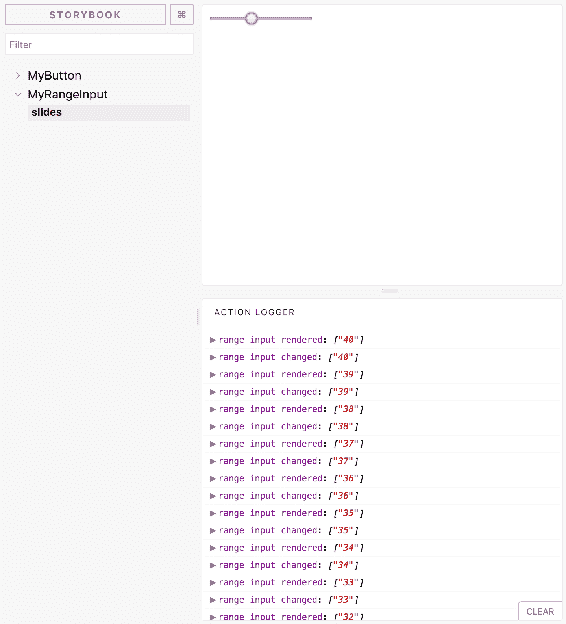

当滑块移动时，你可以看到传递给组件的两个事件处理函数在组件渲染生命周期的不同阶段记录了值。最近的操作被记录在面板顶部，不像浏览器开发工具会在底部记录最近的值。

让我们再次回顾一下`MyRangeInput`代码。滑块移动时调用的第一个函数是更改处理程序：

```jsx
onChange = ({ target: { value } }) => { 
  this.setState({ value }); 
  this.props.onChange(value); 
}; 
```

这个`onChange()`方法是`MyRangeInput`内部的。它是必需的，因为它渲染的`<input>`元素使用组件状态作为唯一的真相来源。在 React 术语中，这些被称为受控组件。首先，它使用事件参数的`target.value`属性设置值的状态。然后，它调用`this.props.onChange()`，将相同的值传递给它。这就是您可以在 Storybook UI 中看到事件值的方式。

请注意，这不是记录组件的更新状态的正确位置。当您调用`setState()`时，您必须假设您在函数中已经处理完状态，因为它并不总是同步更新。调用`setState()`只安排了状态更新和随后的重新渲染组件。

这里有一个可能会引起问题的例子。假设您不是记录事件参数中的值，而是在设置后记录值状态：

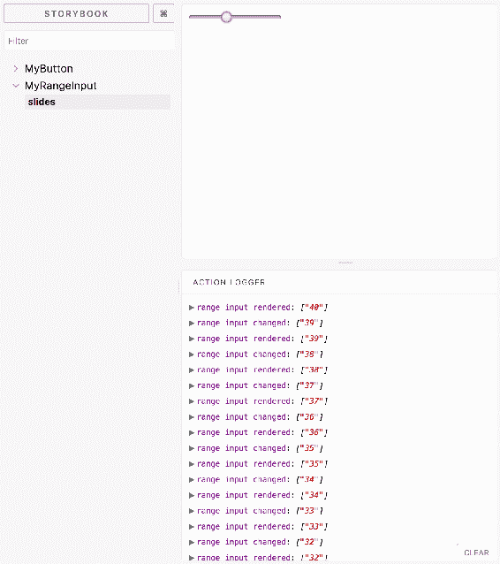

现在出现了一点问题。`onChange`处理程序记录了旧状态，而`onRender`处理程序记录了更新后的状态。如果您试图追踪事件值到呈现的输出，这种记录输出会非常令人困惑-事情不会对齐！永远不要在调用`setState()`后记录状态值。

如果调用空操作函数的想法让您感到不舒服，那么在 Storybook 中显示操作的这种方法可能不适合您。另一方面，您可能会发现，无需在组件内部编写大量调试代码，就可以在组件的生命周期的任何时刻记录基本上任何内容的实用程序。对于这种情况，操作是一种方法。

# 链接故事在一起

链接故事书附加组件允许您以与链接常规网页相同的方式将故事链接在一起。故事书有一个导航窗格，允许您从一个故事切换到另一个故事。这就像一个目录一样有用。但是当您在网上阅读内容时，通常会在一个段落中找到几个链接。想象一下，如果在网上移动的唯一方法是查看每个文档中的目录中的链接，那将是痛苦的。

在网页内容中嵌入链接有价值的原因，同样在 Storybook 输出中嵌入链接也是有价值的：它们提供了上下文。让我们看一个链接实际应用的例子。与 Actions 一样，当您在项目中运行`getstorybook`命令时，链接插件默认启用。这是您将为其编写故事的组件：

```jsx
import React from 'react'; 

const MyComponent = ({ headingText, children }) => ( 
  <section> 
    <header> 
      <h1>{headingText}</h1> 
    </header> 
    <article>{children}</article> 
  </section> 
); 

MyComponent.defaultProps = { 
  headingText: 'Heading Text' 
}; 

export default MyComponent;
```

这个组件接受`headingText`和`children`属性。现在让我们编写一些相互关联的 Storybook 故事。以下是三个故事，它们在输出窗格中都相互关联：

```jsx
import React from 'react'; 
import { storiesOf } from '@storybook/react'; 
import { linkTo } from '@storybook/addon-links'; 
import LinkTo from '@storybook/addon-links/react'; 
import MyComponent from '../MyComponent'; 

storiesOf('MyComponent', module) 
  .add('default', () => ( 
    <section> 
      <MyComponent /> 
      <p> 
        This is the default. You can also change the{' '} 
        <LinkTo story="heading text">heading text</LinkTo>. 
      </p> 
    </section> 
  )) 
  .add('heading text', () => ( 
    <section> 
      <MyComponent headingText="Changed Heading!" /> 
      <p> 
        This time, a custom <code>headingText</code> prop 
        changes the heading text. You can also pass{' '} 
        <LinkTo story="children">child elements</LinkTo> to{' '} 
        <code>MyComponent</code>. 
      </p> 
      <button onClick={linkTo('default')}>Default</button> 
    </section> 
  )) 
  .add('children', () => ( 
    <section> 
      <MyComponent> 
        <strong>Child Element</strong> 
      </MyComponent> 
      <p> 
        Passing a child component. You can also change the{' '} 
        <LinkTo story="headingText">heading text</LinkTo> of{' '} 
        <code>MyComponent</code>. 
      </p> 
      <button onClick={linkTo('default')}>Default</button> 
    </section> 
  )); 
```

让我们逐个讲解这些故事，这样您就可以看到它们是如何相互关联的。首先是默认故事：

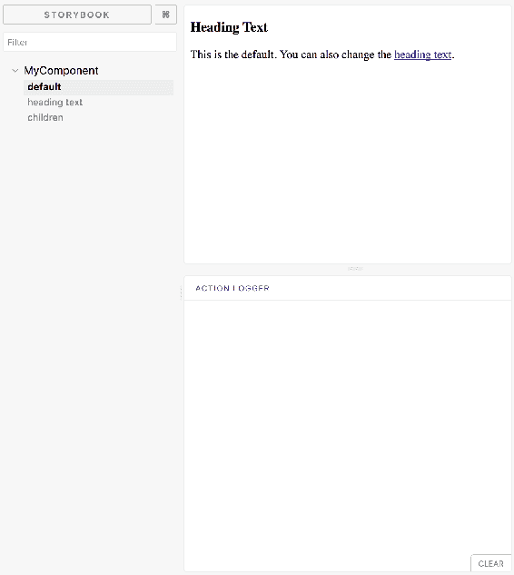

您可以看到`MyComponent`的渲染内容，其中只包含标题文本，因为您没有传递任何子元素。此外，这只是默认的标题文本，因为在组件下方呈现的内容解释了这一点。这个内容方便地链接到一个呈现不同标题文本的故事：

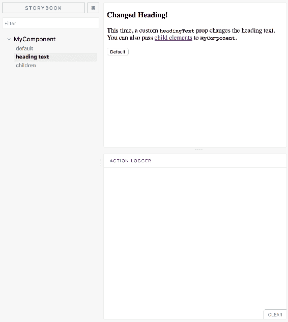

再次，您可以看到使用自定义`headingText` prop 值呈现的组件，并在组件下方有一个链接到另一个故事的注释。在这种情况下，链接将用户带到一个将子元素传递给`MyComponent`的故事：

```jsx
<LinkTo story="children">child elements</LinkTo>
```

还有一个按钮，它使用`linkTo()`函数构建一个回调函数，该函数将用户带到链接的故事，而不是渲染链接的`<LinkTo>`组件：

```jsx
<button onClick={linkTo('default')}>Default</button>
```

这两种方法都需要一个 kind 参数，但在这里被省略了，因为我们是从`MyComponent` kind 内部进行链接。像这样链接故事的能力使您更接近将 Storybook 作为记录 React 组件的工具。

# 故事作为文档

Storybook 不仅仅是一个方便的地方，可以在开发过程中隔离您的组件。通过插件，它也是一个有效的记录组件的工具。随着应用程序的增长，拥有类似 Storybook 这样的工具变得更加具有吸引力。其他开发人员可能需要使用您创建的组件。如果他们可以查看 Storybook 故事来了解组件的各种用法，那不是很好吗？

这一章我们将看一下的最后一个插件叫做 Info。它以一个漂亮的格式提供关于组件的使用信息，除了标准的渲染组件输出之外。

让我们创建一些我们想要记录的组件。与其像本章节一直以来那样在`stories/index.js`中编写每个故事，不如把你的故事分开成更易消化的内容：

+   `stories/MyButton.story.js`

+   `stories/MyList.story.js`

你即将要实现的两个组件的故事将分别在它们自己的模块中，这样以后维护起来会更容易一些。为了支持这种新的文件布局，你还需要在`.storybook/config.js`中做一些改变。在这里，你需要分别引入你的两个故事模块：

```jsx
import { configure } from '@storybook/react'; 

function loadStories() { 
  require('../src/stories/MyButton.story'); 
  require('../src/stories/MyList.story'); 
}
configure(loadStories, module); 
```

现在让我们来看看这些组件。首先是`MyButton`：

```jsx
import React from 'react'; 
import PropTypes from 'prop-types'; 

const MyButton = ({ onClick }) => ( 
  <button onClick={onClick}>My Button</button> 
); 

MyButton.propATypes = { 
  onClick: PropTypes.func 
}; 

export default MyButton; 
```

你可以看到`MyButton`定义了一个`propTypes`属性；很快你就会明白为什么这对于 Info Storybook 插件很重要。接下来，让我们看看`MyList`组件：

```jsx
import React from 'react'; 
import PropTypes from 'prop-types'; 

const Empty = ({ items, children }) => 
  items.length === 0 ? children : null; 

const MyList = ({ items }) => ( 
  <section> 
    <Empty items={items}>No items found</Empty> 
    <ul>{items.map((v, i) => <li key={i}>{v}</li>)}</ul> 
  </section> 
); 

MyList.propTypes = { 
  items: PropTypes.array 
}; 

MyList.defaultProps = { 
  items: [] 
}; 
export default MyList; 
```

这个组件还定义了一个`propTypes`属性。它也定义了一个`defaultProps`属性，这样当`items`属性没有提供时，默认情况下它是一个空数组，这样调用`map()`仍然有效。

现在你已经准备好为这两个组件编写故事了。记住你还希望这些故事作为组件的主要文档来源，你将使用 Storybook 的 Info 插件为任何给定的故事提供更多的使用信息。让我们从`MyButton.story.js`开始：

```jsx
import React from 'react'; 
import { storiesOf } from '@storybook/react'; 
import { withInfo } from '@storybook/addon-info'; 
import { action } from '@storybook/addon-actions'; 
import MyButton from '../MyButton'; 

storiesOf('MyButton', module) 
  .add( 
    'basic usage', 
    withInfo(' 
      Without passing any properties 
    ')(() => <MyButton />) 
  ) 
  .add( 
    'click handler', 
    withInfo(' 
      Passing an event handler function that's called when 
      the button is clicked 
    ')(() => <MyButton onClick={action('button clicked')} />) 
  ); 
```

在这里，你使用两个故事来记录`MyButton`，每个故事展示了组件的不同使用方式。第一个故事展示了基本用法，第二个故事展示了如何传递一个点击处理程序属性。这些故事的新添加是调用`withInfo()`。这个函数来自 Info Storybook 插件，你可以传递一些文本（支持 markdown），更详细地说明故事。换句话说，这是你记录组件特定用法的地方。

现在让我们先看看`MyList.story.js`，然后再看看 Info 插件在 Storybook UI 中的输出是什么样子的：

```jsx
import React from 'react'; 
import { storiesOf } from '@storybook/react'; 
import { withInfo } from '@storybook/addon-info'; 
import MyList from '../MyList'; 

storiesOf('MyList', module) 
  .add( 
    'basic usage', 
    withInfo(' 
      Without passing any properties
    ')(() => <MyList />) 
  ) 
  .add( 
    'passing an array of items', 
    withInfo(' 
      Passing an array to the items property 
    ')(() => <MyList items={['first', 'second', 'third']} />) 
  ); 
```

这看起来很像为`MyButton`定义的故事——不同的文档和组件，相同的整体结构和方法。

让我们来看看`MyButton`的默认使用故事：

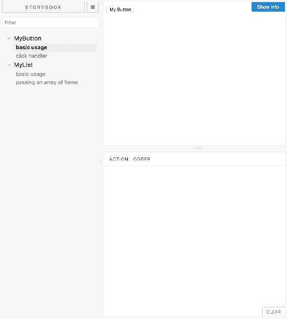

如预期的那样，按钮会在输出窗格中呈现，以便用户可以看到他们正在使用的内容。在输出窗格的右上角，有一个信息按钮。当您点击它时，您会看到通过在故事中调用`withInfo()`提供的所有额外信息：

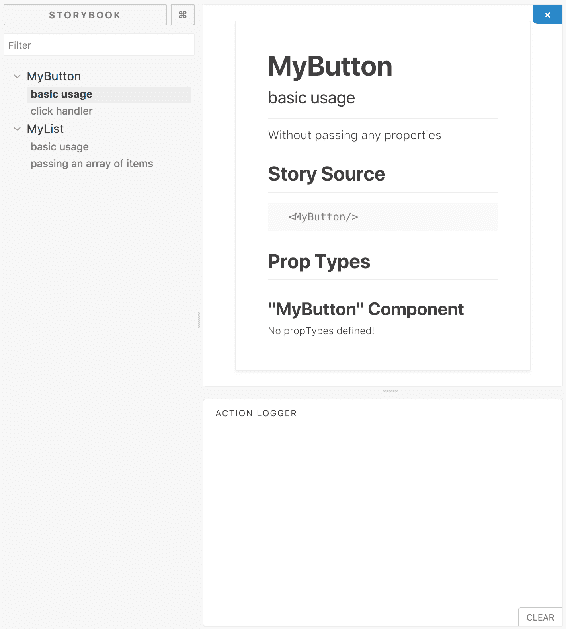

这会显示有关故事和您正在记录的组件的各种信息。从上到下，这是它显示的内容：

+   组件名称

+   故事名称

+   用法文档（作为`withInfo()`的参数提供）

+   用于呈现组件的源

+   组件可用的属性（从`propTypes`中读取）

Info 插件的好处在于它显示了用于呈现用户正在查看的输出的源，并且如果您将其提供为属性类型，则显示可用属性。这意味着试图理解和使用您的组件的人可以在您作为组件作者不费吹灰之力的情况下获得他们所需的信息。

让我们看看当`MyList`组件传递一个项目数组时的情况：

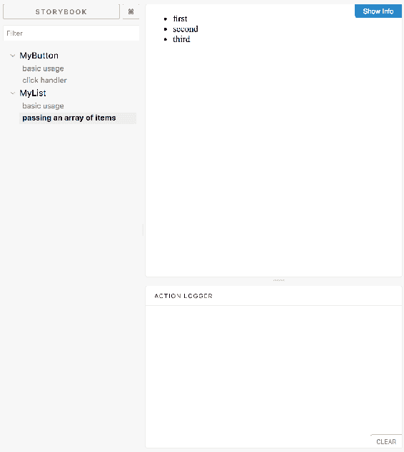

它呈现了通过属性获取的项目列表。现在让我们看看这个故事的信息：

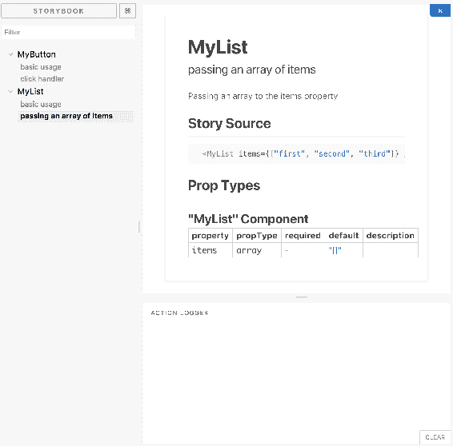

通过查看有关此故事的信息，您可以一目了然地看到此组件接受的属性、它们的默认值以及用于生成示例的代码，所有这些都在一个地方。我还喜欢信息窗格默认情况下是隐藏的这一事实，这意味着您可以浏览故事并寻找所需的最终结果，然后再担心细节。

# 构建静态 Storybook 应用程序

如果您正在构建组件库，并希望将其作为开源项目或与组织内的各个团队共享的内容，您可以使用 Storybook 作为记录如何使用您的组件的工具。也就是说，您可能不希望运行 Storybook 服务器，或者只想托管 Storybook 文档。

在任何一种情况下，您都需要组件库的故事的静态构建。当您运行`getstorybook`命令时，Storybook 会为您提供此实用程序。

让我们继续使用前一节的示例，您在其中使用 Storybook 来记录两个组件的使用场景。要构建您的静态 Storybook 文档，您只需在项目目录中运行以下命令：

```jsx
npm run build-storybook
```

你应该看到类似以下的输出：

```jsx
info @storybook/react v3.3.13
info 
info => Loading custom addons config.
info => Using default webpack setup based on "Create React App".
info => Copying static files from: public
info Building storybook ...  
```

构建完成后，您将在项目文件夹中看到一个新的`storybook-static`目录。在其中，您将看到几个文件，包括由 Webpack 创建的静态 JavaScript 捆绑包和一个`index.html`文件，您可以从任何 Web 服务器提供，或者直接在 Web 浏览器中打开。

# 总结

本章是一个名为 Storybook 的工具的重点。Storybook 为 React 开发人员提供了一个沙盒环境，使他们可以轻松地独立开发 React 组件。当您唯一的环境是您正在工作的应用程序时，这可能会很困难。Storybook 提供了一定程度的开发隔离。

首先，您学会了如何安装全局 Storybook 命令行实用程序，以及如何使用此实用程序在您的`create-react-app`项目中设置 Storybook。接下来，您学会了如何编写展示组件不同视角的故事。

然后，您了解到 Storybook 功能的很大一部分来自于插件。您了解到 Actions 可以帮助记录日志，链接提供了超出默认范围的导航机制。您还学会了如何使用 Storybook 为 React 组件编写文档。我们在本章结束时看了一下构建静态 Storybook 内容。

在下一章中，您将探索 Web 浏览器中可用的 React 工具。
