# 第八章：在浏览器中调试组件

如果您正在开发 React Web 应用程序，您需要基于浏览器的工具来帮助您从 React 开发人员的角度查看页面上发生了什么。当今的 Web 浏览器默认安装了令人惊叹的开发人员工具。如果您进行任何类型的 Web 开发，这些工具是必不可少的，因为它们公开了 DOM、样式、性能、网络请求等方面的真实情况。

使用 React，您仍然需要所有这些工具，但您需要的不仅仅是这些。React 的核心原则是在 JavaScript 组件中使用声明性标记。如果这种抽象在开发人员为其他所有事情依赖的 Web 浏览器工具中不存在，生活会比必要的更加困难。

在本章中，您将学到：

+   安装 React Developer Tools 浏览器插件

+   定位和选择 React 组件

+   操作组件的 props 和 state

+   分析组件性能

# 安装 React Developer Tools 插件

开始使用 React 工具的第一步是安装 React Developer Tools 浏览器扩展。在本章的示例中，我将使用 Chrome，因为这是一个流行的选择。React Developer Tools 也可以作为 Firefox 的扩展使用（[`addons.mozilla.org/en-US/firefox/addon/react-devtools/`](https://addons.mozilla.org/en-US/firefox/addon/react-devtools/)）。

要在 Chrome 中安装扩展，请访问[`chrome.google.com/webstore/category/extensions`](https://chrome.google.com/webstore/category/extensions)并搜索`react developer tools`： 

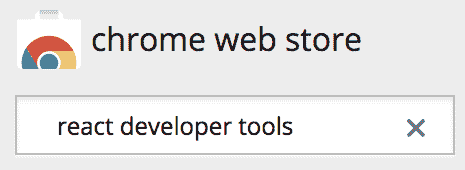

第一个结果应该是您想要的扩展。点击“添加到 Chrome”按钮进行安装：

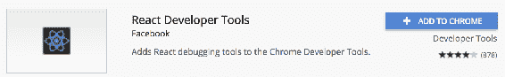

Chrome 可能会警告您，它可以更改您访问的网站上的数据。别担心，该扩展仅在您访问 React 应用程序时才会激活：

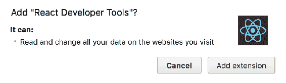

点击“添加扩展”按钮后，扩展将被标记为已安装：

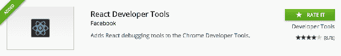

您已经准备好了！安装并启用 React Developer Tools Chrome 扩展后，您就可以开始检查页面上的 React 组件，就像您检查常规 DOM 元素一样。

# 在 React Developer Tools 中使用 React 元素

安装了 Chrome 中的 React 开发者工具后，你会在浏览器地址栏右侧看到一个按钮。我的按钮是这样的：


我这里有几个浏览器扩展的按钮。你可以看到最右边的是 React 开发者工具按钮，上面有 React 的标志。当按钮变灰时，意味着当前页面没有运行 React 应用。试着在其他页面点击一下这个按钮：

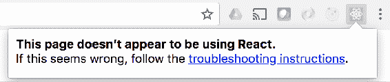

现在让我们使用`create-react-app`来创建一个新的应用程序，就像你在整本书中一直在做的那样：

```jsx
create-react-app finding-and-selecting-components
```

现在启动开发服务器：

```jsx
npm start
```

这应该会直接将你带到浏览器页面，你的 React 应用程序已经加载到一个新的标签页中。现在 React 开发者工具按钮应该看起来不一样了：

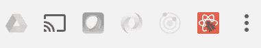

就是这样。因为你在运行 React 应用的页面上，React 开发者工具按钮会变亮，告诉你它已经可用。现在试着点击一下它：

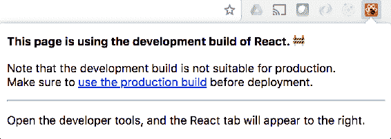

太棒了！React 开发者工具可以检测到这是 React 库的开发版本。如果你不小心将 React 的开发版本部署到生产环境中，这可能会派上用场。诚然，如今使用诸如`create-react-app`之类的工具构建生产版本是更加困难的，因为你已经具备了构建生产版本的工具。

好的，现在你已经安装了 React 浏览器工具，除了检测应用程序使用的 React 构建类型，它还能为你做些什么呢？让我们在 Chrome 中打开开发者工具面板看看：

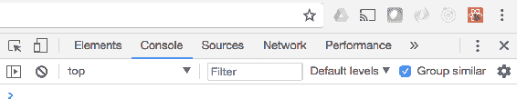

你可以看到开发者工具面板中通常的部分：元素、控制台等等。但是没有关于 React 的内容？我把开发者工具面板停靠在了浏览器窗口的右侧，所以你看不到每个部分。如果你看到的也是一样的情况，你只需要点击性能旁边的箭头按钮：

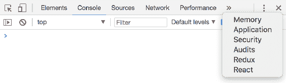

从菜单中选择 React，你将进入开发者工具面板的 React 部分。加载完成后，你应该会看到根 React 组件显示出来：

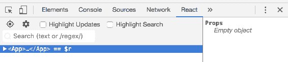

如果你在任何浏览器中使用过 DOM 检查工具，这个界面应该会让你感到熟悉。在左侧的主要部分，你有你的 React 元素树。这应该与你的 JSX 源代码非常相似。在这个树的右侧，你有当前选中元素的详细信息，在这种情况下是`App`，它没有定义任何属性。

如果你展开`App`，你会看到它的子 HTML 标记和其他 React 元素：

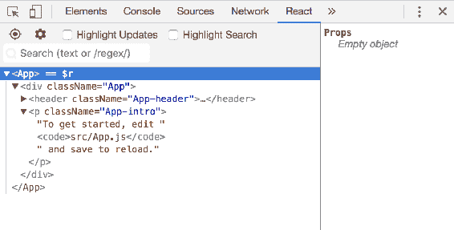

这是运行`create-react-app`后的默认源代码，因此在`App`元素下没有太多有趣的内容。要进一步探索 React 开发者工具，你需要引入一些更多的组件并在页面上渲染更多的 React 元素。

# 选择 React 元素

实际上有两种方法可以使用 React 开发者工具选择 React 元素。当你打开开发者工具窗格的 React 部分时，React 应用的根元素会自动被选中在元素树中。然而，你可以展开此元素以显示子元素并选择它们。

让我们组合一个简单的应用程序，帮助你使用 React 开发者工具探索页面上渲染的 React 元素。从顶层开始，这是`App`组件：

```jsx
import React from 'react'; 
import MyContainer from './MyContainer'; 
import MyChild from './MyChild'; 

const App = () => ( 
  <MyContainer>
```

```jsx
    <MyChild>child text</MyChild> 
  </MyContainer> 
); 

export default App; 
```

通过查看这个源代码，你可以一览在页面上渲染 React 元素的整体结构。接下来，让我们看看`MyContainer`组件：

```jsx
import React from 'react'; 
import './MyContainer.css'; 

const MyContainer = ({ children }) => ( 
  <section className="MyContainer"> 
    <header> 
      <h1>Container</h1> 
    </header> 
    <article>{children}</article> 
  </section> 
); 

export default MyContainer; 
```

该组件渲染一些标题文本和传递给它的任何子元素。在这个应用程序中，你传递给它一个`MyChild`元素，所以让我们接下来看看这个组件：

```jsx
import React from 'react'; 

const MyChild = ({ children }) => <p>{children}</p>; 

export default MyChild; 
```

现在当你运行`npm start`时，你应该会看到以下内容被渲染出来：

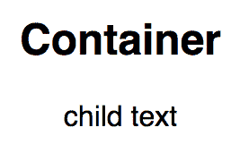

看起来不起眼，但你知道一切都按预期工作。该应用程序足够小，以至于你可以在 React 开发者工具窗格的树视图中看到每个 JSX 元素：

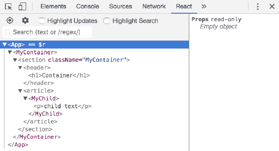

React 元素和其他元素类型之间有视觉区别，因此它们在树视图中更容易识别。例如，`<MyContainer>`元素是一种颜色，而`<section>`元素是另一种颜色。让我们选择`<MyContainer>`元素，看看会发生什么：

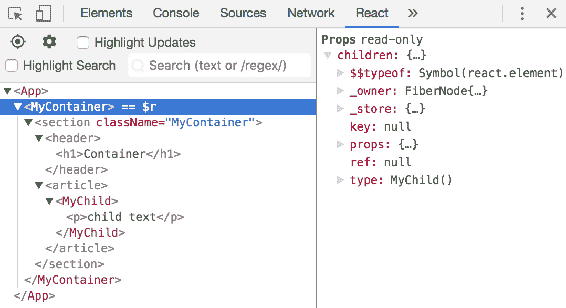

直到这一点，你只选择了`<App>`元素，所以关于这个元素没有什么可显示的——它没有 props 或状态。另一方面，`<MyContainer>`元素确实有要显示的属性。在这种情况下，它有一个`children`属性，因为`<MyChild>`元素被呈现为`<MyContainer>`的子元素。暂时不要担心所选元素右侧显示的具体内容——我们将在下一节详细介绍。

接下来，让我们激活选择工具。它是元素树上方的按钮，上面有一个目标图标。当你点击图标时，它会变成蓝色，让你知道它是激活的：

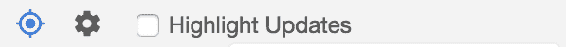

这个工具的想法是允许你点击页面上的元素，并在开发者工具窗格中选择相应的 React 组件。当工具激活时，当你移动到元素上时，元素会被突出显示，让你知道它们是什么：

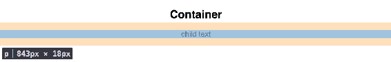

在这里，鼠标指针位于页面上的`<p>`元素上，如小框所示。如果你点击元素，选择工具将在开发者工具窗格中选择适当的元素，然后停用自身。当选择时，`<p>`元素的样子如下：

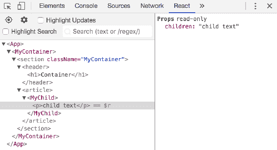

即使这里选择了`<p>`元素，你看到的是由 React 元素渲染的 props——`<MyChild>`。如果你正在处理页面元素，而不确定哪个 React 元素呈现了它们，使用 React 开发者工具中的选择工具是快速找出的方法。

# 搜索 React 元素

当你的应用程序变得更大时，在 React 开发者工具面板中遍历页面或元素树上的元素效果不佳。你需要一种搜索 React 元素的方法。幸运的是，元素树上方有一个搜索框：

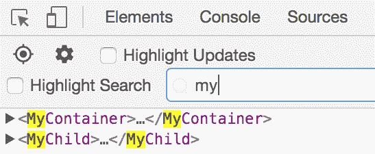

当你在搜索框中输入时，元素在下面的元素树中被过滤。正如你所看到的，匹配的文本也被高亮显示。搜索只匹配元素的名称，这意味着如果你需要从 100 个相同类型的元素中进行过滤，搜索将无法帮助你。然而，即使在这些情况下，搜索也可以删除应用中的其他所有内容，这样你就可以手动浏览一个较小的列表。

如果你选择了高亮搜索复选框，搜索将在主浏览器窗口中高亮显示 React 元素：

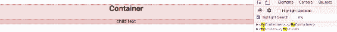

此页面上的两个 React 元素（`<MyContainer>`和`<MyChild>`）都被高亮显示，因为它们都符合搜索条件`my`。让我们看看当你搜索`child`时会发生什么：

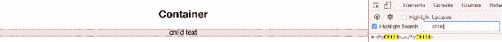

这一次，你可以看到唯一匹配你搜索的 React 元素。它在主浏览器窗口和元素树中都被高亮显示。通过这样搜索，你可以确切地知道在屏幕上选择的元素是什么，当你在元素树中选择它时。

# 检查组件属性和状态

React 遵循声明式范式，因此有助于在浏览器中使用 React 开发者工具等工具，让你看到你的 JSX 标记。这只是你的 React 应用的静态方面——你声明 UI 的元素，让数据控制其余部分。使用相同的工具，你可以观察 props 和 state 在你的应用中流动。为了演示这一点，让我们创建一个简单的列表，一旦挂载就填满自己：

```jsx
import React, { Component } from 'react'; 
import MyItem from './MyItem'; 

class MyList extends Component { 
  timer = null; 
  state = { items: [] };
  componentDidMount() { 
    this.timer = setInterval(() => { 
      if (this.state.items.length === 10) { 
        clearInterval(this.timer); 
        return; 
      } 

      this.setState(state => ({ 
        ...state, 
        items: [ 
          ...state.items, 
          { 
            label: 'Item ${state.items.length + 1}', 
            strikethrough: false 
          } 
        ] 
      })); 
    }, 3000); 
  } 

  componentWillUnmount() { 
    clearInterval(this.timer); 
  } 

  onItemClick = index => () => { 
    this.setState(state => ({ 
      ...state, 
      items: state.items.map( 
        (v, i) => 
          index === i 
            ? { 
                ...v, 
                strikethrough: !v.strikethrough 
              } 
            : v 
      ) 
    })); 
  }; 

  render() { 
    return ( 
      <ul> 
        {this.state.items.map((v, i) => ( 
          <MyItem 
            key={i} 
            label={v.label} 
            strikethrough={v.strikethrough} 
            onClick={this.onItemClick(i)}

          /> 
        ))} 
      </ul> 
    ); 
  } 
} 

export default MyList; 
```

以下是这个组件所做的一切的大致分解：

+   `timer`和`state`: 这些属性被初始化。这个组件的主要状态是一个`items`数组。

+   `componentDidMount()`: 设置一个间隔计时器，每三秒向`items`数组添加一个新值。一旦有十个项目，间隔就会被清除。

+   `componentWillUnmount()`: 确保`timer`属性被强制清除。

+   `onItemClick()`: 接受一个`index`参数，并返回一个索引的事件处理程序。当调用处理程序时，`strikethrough`状态将被切换。

+   `render()`: 渲染一个`<ul>`列表，包含`<MyItem>`元素，传递相关的 props。

这里的想法是慢慢地建立列表，这样你就可以在浏览器工具中观察状态变化发生。然后，通过`MyList`元素，你可以观察传递给它的 props。这个组件看起来是这样的：

```jsx
import React from 'react'; 

const MyItem = ({ label, strikethrough, onClick }) => ( 
  <li 
    style={{ 
      cursor: 'pointer', 
      textDecoration: strikethrough ? 'line-through' : 'none' 
    }} 
    onClick={onClick} 
  > 
    {label} 
  </li> 
); 

export default MyItem; 
```

这是一个简单的列表项。`textDecoration`样式根据`strikethrough` prop 的值而改变。当这个值为 true 时，文本将显示为被划掉的样子。

让我们在浏览器中加载这个应用程序，并观察`MyList`的状态随着间隔处理程序的调用而改变。应用程序加载后，请确保您已经打开并准备好使用 React Developer Tools 窗格。然后，展开`<App>`元素并选择`<MyList>`。您将在右侧看到元素的状态：

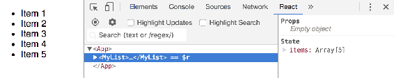

左侧呈现的内容与所选`<MyList>`元素的右侧显示的状态相匹配。有一个包含 5 个项目的数组，并且页面上呈现了 5 个项目的列表。这个例子使用间隔计时器随着时间更新状态（直到达到 10 个项目）。如果您仔细观察，您会发现右侧的状态值随着新的列表项的添加而与呈现的内容同步变化。您还可以展开状态中的单个项目以查看它们的值：

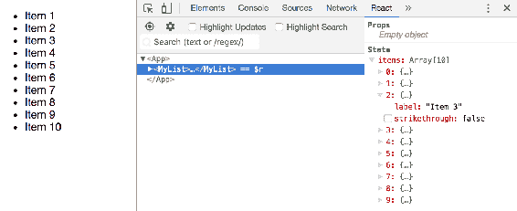

如果您展开`<MyList>`元素，您将看到所有`<MyItem>`元素作为`items`数组状态添加到结果中呈现的结果。从那里，您可以选择`<MyItem>`元素来查看其 props 和状态。在这个例子中，`<MyItem>`元素只有 props，没有状态：

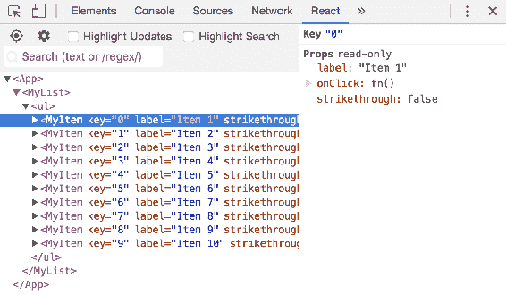

您可以在左侧的树视图中看到传递给给定元素的 props。与您可以在右侧看到的值相比，这有点难以阅读，右侧显示了所选元素的 prop 值。以下 props 被传递给`<MyItem>`：

+   `label`：要呈现的文本

+   `onClick`：当点击项目时调用的函数

+   `strikethrough`：如果为`true`，则文本将以`strikethrough`样式呈现

您可以观察属性值随着元素重新呈现而改变。在这个应用程序的情况下，当您点击列表项时，处理函数将更改`<MyList>`元素中项目列表的状态。具体来说，被点击的项目的索引将切换其`strikethrough`值。这将导致`<MyItem>`元素重新呈现自身以新的 prop 值。如果您在开发者工具窗格中选择要点击的元素，您可以随时关注 prop 的变化：

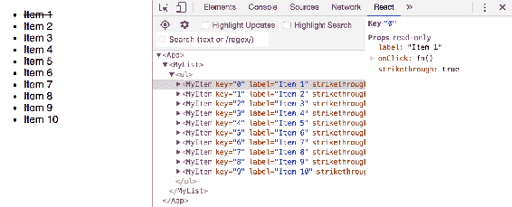

第一项的文本以`strikethrough`样式呈现。这是因为`strikethrough`属性为`true`。如果你仔细看开发者工具窗格中元素树右侧的属性值，你会看到当它们改变时会闪烁黄色，这是一个方便调试组件的视觉提示。

# 操作元素状态值

React 开发者工具允许你检查所选元素的当前状态。你也可以监视状态的变化，就像前面演示的那样，你可以设置一个间隔定时器来随时间改变元素的状态。元素的状态也可以以有限的方式进行操作。

对于下一个示例，让我们修改`MyList`组件，移除间隔定时器并在构造时简单地填充状态：

```jsx
import React, { Component } from 'react'; 
import MyItem from './MyItem';
class MyList extends Component { 
  timer = null; 
  state = { 
    items: new Array(10).fill(null).map((v, i) => ({ 
      label: 'Item ${i + 1}', 
      strikethrough: false
    })) 
  }; 

  onItemClick = index => () => { 
    this.setState(state => ({ 
      ...state, 
      items: state.items.map( 
        (v, i) => 
          index === i 
            ? { 
                ...v, 
                strikethrough: !v.strikethrough 
              } 
            : v 
      ) 
    })); 
  }; 

  render() { 
    return ( 
      <ul> 
        {this.state.items.map((v, i) => ( 
          <MyItem 
            key={i} 
            label={v.label} 
            strikethrough={v.strikethrough} 
            onClick={this.onItemClick(i)} 
          /> 
        ))} 
      </ul> 
    ); 
  } 
} 

export default MyList; 
```

现在当你运行这个应用时，你会立即看到 10 个项目被渲染出来。除此之外，没有其他改变。你仍然可以点击单个项目来切换它们的`strikethrough`状态。一旦你运行了这个应用，请确保 React 开发者工具浏览器窗格是打开的，这样你就可以选择`<MyList>`元素：

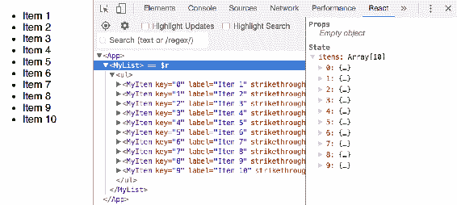

在右侧，你可以看到所选元素的状态。你实际上可以展开`items`数组中的一个对象并改变它的属性值：

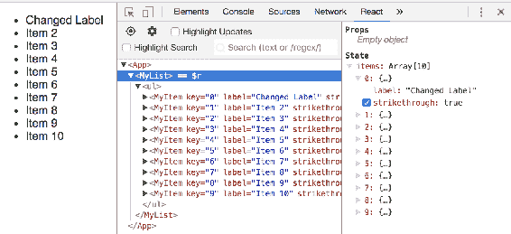

`items`数组状态中第一个对象的`label`和`strikethrough`属性被改变。这导致了`<MyList>`和第一个`<MyItem>`元素被重新渲染。如预期的那样，改变的状态在左侧的渲染输出中反映出来。当你需要排除组件没有按照预期更新渲染内容时，这是很方便的。你不需要在组件内部编写测试代码，只需直接进入浏览器中渲染元素的状态并在其中进行操作。

使用 React 开发者工具编辑状态的一个注意事项是，你不能向集合中添加或删除项目。例如，我不能向`items`数组中添加新项目，也不能向数组中的对象添加新属性。对此，你需要在代码中编排你的状态，就像在之前的示例中所做的那样。

# 组件性能分析

通过 React 开发者工具，更容易地对 React 组件的性能进行分析。它更容易发现导致元素重新渲染的更新，当实际上不需要重新渲染时。它还更容易收集给定组件在其生命周期内花费的 CPU 时间以及花费在哪里。

尽管 React 开发者工具不包括任何内存分析工具，但我们将看看如何使用现有的内存开发者工具来专门为 React 元素进行分析。

# 删除协调工作

当渲染 React 元素时，会发生协调。它首先计算将呈现元素的当前状态和 props 的虚拟 DOM 树。然后，将该树与元素的现有树进行比较，假设该树已经至少渲染过一次。React 这样做的原因是因为在与 DOM 交互之前，在 JavaScript 中协调这样的更改更具性能。与简单的 JavaScript 代码相比，DOM 交互相对昂贵。此外，React 协调器还有一些常见情况的启发式方法。

React 为您处理所有这些-您只需要考虑编写声明性的 React 组件。这并不意味着您永远不会遇到性能问题。仅仅因为 JavaScript 中的协调通常比直接操作 DOM 表现更好，并不意味着它是廉价的。因此，让我们组合一个应用程序，突出显示协调的一些潜在问题，然后让我们借助 React 开发者工具来解决这些问题。

我们将创建一个应用程序，用于呈现每个组的组和成员。它将具有更改组数和每个组成员数的控件。最后，每个呈现的组将有一个添加新组的按钮。让我们从`index.js`开始：

```jsx
import React from 'react'; 
import ReactDOM from 'react-dom'; 
import './index.css'; 
import App from './App'; 
import registerServiceWorker from './registerServiceWorker'; 

const update = () => { 
  ReactDOM.render(<App />, document.getElementById('root')); 
}; 

setInterval(update, 5000); 
update(); 

registerServiceWorker(); 
```

这几乎就像你从`create-react-app`看到的任何`index.js`。不同之处在于有一个使用`setInterval()`调用的`update()`函数。你不会随机地在你的应用程序中抛出一个每五秒重新渲染一次应用程序的间隔计时器。我在这里添加这个只是为了简单地说明重复重新渲染以及这样做的协调后果。在真实的应用程序中，你可能会发现类似的行为，其中你更新组件以保持它们的状态新鲜-这是这种行为的近似。

接下来是主要的`App`组件。这是应用程序状态的所在地，也是大部分功能所在地。让我们先看一下整个文件，然后我会为你解释：

```jsx
import React, { Component } from 'react'; 
import './App.css'; 
import Group from './Group';

class App extends Component { 
  state = { 
    groupCount: 10, 
    memberCount: 20, 
    groups: [] 
  }; 

  refreshGroups = (groups, members) => { 
    this.setState(state => { 
      const groupCount = 
        groups === undefined ? state.groupCount : groups; 
      const memberCount = 
        members === undefined ? state.memberCount : members; 
      return { 
        ...state, 
        groupCount, 
        memberCount, 
        groups: new Array(groupCount).fill(null).map((g, gi) => ({ 
          name: 'Group ${gi + 1}', 
          members: new Array(memberCount) 
            .fill(null) 
            .map((m, mi) => ({ name: 'Member ${mi + 1}' })) 
        })) 
      }; 
    }); 
  }; 

  onGroupCountChange = ({ target: { value } }) => { 
    // The + makes value a number. 
    this.refreshGroups(+value); 
  }; 

  onMemberCountChange = ({ target: { value } }) => { 
    this.refreshGroups(undefined, +value); 
  }; 

  onAddMemberClick = i => () => { 
    this.setState(state => ({ 
      ...state, 
      groups: state.groups.map( 
        (v, gi) => 
          i === gi 
            ? { 
                ...v, 
                members: v.members.concat({ 
                  name: 'Member ${v.members.length + 1}' 
                }) 
              }
            : v 
      ) 
    })); 
  }; 

  componentWillMount() { 
    this.refreshGroups(); 
  } 

  render() { 
    return ( 
      <section className="App"> 
        <div className="Field"> 
          <label htmlFor="groups">Groups</label> 
          <input 
            id="groups" 
            type="range" 
            value={this.state.groupCount} 
            min="1" 
            max="20" 
            onChange={this.onGroupCountChange} 
          /> 
        </div> 
        <div className="Field"> 
          <label htmlFor="members">Members</label> 
          <input 
            id="members" 
            type="range" 
            value={this.state.memberCount} 
            min="1" 
            max="20" 
            onChange={this.onMemberCountChange} 
          /> 
        </div> 
        {this.state.groups.map((g, i) => ( 
          <Group 
            key={i} 
            name={g.name} 
            members={g.members} 
            onAddMemberClick={this.onAddMemberClick(i)} 
          /> 
        ))} 
      </section> 
    ); 
  } 
} 

export default App; 
```

让我们从初始状态开始：

```jsx
state = { 
  groupCount: 10, 
  memberCount: 20, 
  groups: [] 
}; 
```

这个组件管理的状态如下：

+   `groupCount`: 要渲染的组数

+   `memberCount`: 每个组中要渲染的成员数量

+   `groups`: 一个组对象数组

这些值都存储为状态，因为它们可以被改变。接下来，让我们看一下`refreshGroups()`函数：

```jsx
refreshGroups = (groups, members) => { 
  this.setState(state => { 
    const groupCount = 
      groups === undefined ? state.groupCount : groups; 
    const memberCount = 
      members === undefined ? state.memberCount : members; 
    return { 
      ...state, 
      groupCount, 
      memberCount, 
      groups: new Array(groupCount).fill(null).map((g, gi) => ({ 
        name: 'Group ${gi + 1}', 
        members: new Array(memberCount) 
          .fill(null) 
          .map((m, mi) => ({ name: 'Member ${mi + 1}' })) 
      })) 
    }; 
  }); 
}; 
```

在这里不要太担心具体的实现细节。这个函数的目的是在组数和组成员数改变时填充状态。例如，一旦调用，你会有类似以下的状态：

```jsx
{ 
  groupCount: 10, 
  memberCount: 20, 
  groups: [ 
    {
      Name: 'Group 1', 
      Members: [ { name: 'Member 1' }, { name: 'Member 2' } ] 
    }, 
    { 
      Name: 'Group 2', 
      Members: [ { name: 'Member 1' }, { name: 'Member 2' } ] 
    } 
  ] 
} 
```

之所以将这个定义为自己的函数，是因为你将在几个地方调用它。例如，在`componentWillMount()`中调用它，以便组件在首次渲染之前具有初始状态。接下来，让我们看一下事件处理程序函数：

```jsx
onGroupCountChange = ({ target: { value } }) => { 
  this.refreshGroups(+value); 
}; 

onMemberCountChange = ({ target: { value } }) => { 
  this.refreshGroups(undefined, +value); 
}; 

onAddMemberClick = i => () => { 
  this.setState(state => ({ 
    ...state, 
    groups: state.groups.map( 
      (v, gi) => 
        i === gi 
          ? { 
              ...v, 
              members: v.members.concat({ 
                name: 'Member ${v.members.length + 1}' 
              }) 
            } 
          : v 
    ) 
  })); 
}; 
```

这些做以下事情：

+   `onGroupCountChange()`: 通过使用新的组数调用`refreshGroups()`来更新组状态

+   `onMemberCountChange()`: 使用新的成员数量更新组状态中的每个成员对象。

+   `onAddMemberClick()`: 通过在给定索引处添加新成员对象来更新组状态

最后，让我们看一下这个组件渲染的 JSX：

```jsx
render() { 
  return ( 
    <section className="App"> 
      <div className="Field"> 
        <label htmlFor="groups">Groups</label> 
        <input 
          id="groups" 
          type="range" 
          value={this.state.groupCount} 
          min="1" 
          max="20" 
          onChange={this.onGroupCountChange} 
        /> 
      </div> 
      <div className="Field"> 
        <label htmlFor="members">Members</label> 
        <input 
          id="members" 
          type="range" 
          value={this.state.memberCount} 
          min="1" 
          max="20" 
          onChange={this.onMemberCountChange} 
        /> 
      </div> 
      {this.state.groups.map((g, i) => ( 
        <Group 
          key={i} 
          name={g.name} 
          members={g.members} 
          onAddMemberClick={this.onAddMemberClick(i)} 
        /> 
      ))} 
    </section> 
  ); 
} 
```

这个组件渲染两个滑块控件：一个控制组数，一个控制每个组中的成员数。接下来，渲染组列表。为此，有一个`Group`组件，看起来像这样：

```jsx
import React from 'react';
const Group = ({ name, members, onAddMemberClick }) => ( 
  <section> 
    <h4>{name}</h4> 
    <button onClick={onAddMemberClick}>Add Member</button> 
    <ul>{members.map((m, i) => <li key={i}>{m.name}</li>)}</ul> 
  </section> 
); 

export default Group; 
```

这将渲染组的名称，然后是一个添加新成员的按钮，然后是成员列表。当你首次加载页面时，你会看到以下输出：

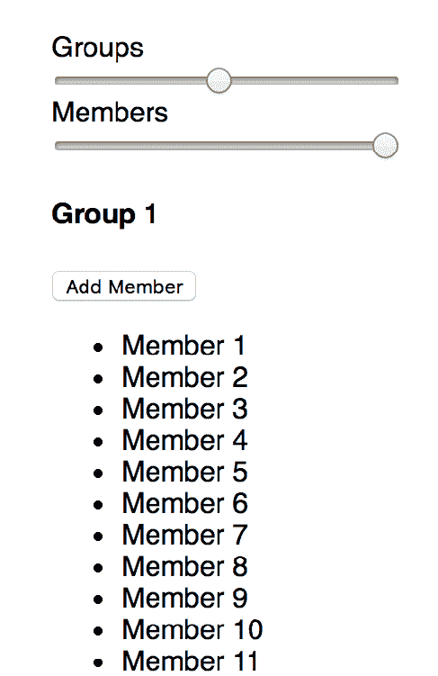

这里只显示了部分输出——在第 1 组中有更多成员，后面还有更多组，使用相同的模式渲染。在使用页面上的任何控件之前，打开 React 开发者工具。然后，查找“高亮更新”复选框：

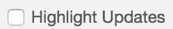

一旦您勾选了这个框，当它们的状态更新时，您渲染的元素将在视觉上得到增强。请记住，您设置了`App`组件每五秒重新渲染一次。每次调用`setState()`时，输出看起来像这样：

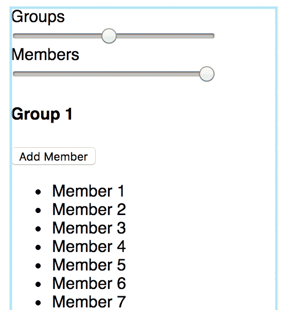

蓝色边框会在刚刚更新的元素周围闪烁一下。虽然您在这个截图中看不到`<App>`渲染的所有内容，但蓝色边框围绕所有`<Group>`元素，因为它表示`<App>`组件刚刚更新。如果您观察一会儿屏幕，您会注意到蓝色边框每 5 秒出现一次。这表明即使您的元素状态没有改变，它仍在执行协调。它正在遍历可能有数百或数千个树节点，查找任何差异并进行适当的 DOM 更新。

虽然您在这个应用程序中看不到差异，但更复杂的 React 应用程序的累积效果可能会成为问题。在这种特定情况下，由于更新频率，这是一个潜在的问题。

让我们对`App`进行一个补充，看看是否有一种快捷方式可以执行完全的协调：

```jsx
shouldComponentUpdate(props, state) { 
  return ( 
    this.state.groupCount !== state.groupCount || 
    this.state.memberCount !== state.memberCount 
  ); 
} 
```

如果一个 React 组件类有`shouldComponentUpdate()`方法并且返回 false，就会完全避免协调，不会进行重新渲染。通过确保勾选了高亮更新复选框，您可以立即在浏览器中看到变化。如果您坐下来观察一会儿，您会发现没有更多的蓝色边框出现。

更新边框有不同的颜色。您看到的蓝色代表不经常的更新。这取决于更新的频率，可以一直到红色。例如，如果您来回快速滑动组或成员滑块，您应该能够产生红色边框。

然而，请注意，您并不总是能够避免协调。重要的是要对此进行宏观优化。例如，您刚刚添加到`App`组件的解决方案解决了在明显不必要的情况下重新渲染具有大量子元素的巨大组件。与微观优化`Group`组件相比，这是有价值的——它足够小，以至于在这里避免协调并不能节省太多。

你的目标应该是保持高水平，并保持`shouldComponentUpdate()`简单。这是 bug 进入组件的入口点。事实上，您已经引入了一个 bug。尝试点击一个组的“添加成员”按钮，它们不再起作用。这是因为您在`shouldComponentUpdate()`中使用的标准只考虑了`groupCount`和`memberCount`状态。它没有考虑将新成员添加到组中。

要解决这个问题，您必须使用与`shouldComponentUpdate()`中的`groupCount`和`memberState`状态相同的方法。如果所有组的成员总数发生变化，那么您就知道您的应用程序需要重新渲染。让我们在`shouldComponentUpdate()`中进行这个更改：

```jsx
shouldComponentUpdate(props, state) { 
  const totalMembers = ({ groups }) => 
    groups 
      .map(group => group.members.length) 
      .reduce((result, m) => result + m); 

  return ( 
    this.state.groupCount !== state.groupCount || 
    this.state.memberCount !== state.memberCount || 
    totalMembers(this.state) !== totalMembers(state) 
  ); 
} 
```

`totalMembers()`函数以组件状态作为参数，并返回组成员的总数。使用这个函数，你可以添加另一个条件，使用这个函数来比较当前状态中的成员数量和新状态中的成员数量：

```jsx
totalMembers(this.state) !== totalMembers(state) 
```

现在，如果您再次尝试点击“添加成员”按钮，它将如预期般添加成员，因为组件可以检测到状态变化。再次，您需要权衡计算成员数组长度并比较两者的成本，以及在 React DOM 树中执行协调的成本。

# 查找 CPU 密集型组件

`shouldComponentUpdate()`生命周期方法可以实现组件性能的宏观优化。如果明显不需要重新渲染元素，那么让我们完全绕过协调过程。其他时候，协调是无法避免的——元素状态经常发生变化，这些变化需要在 DOM 中反映出来供用户看到。

React 16 的开发版本内置了一些方便的性能工具。它调用相关的浏览器开发工具 API，以记录相关指标，同时记录性能概要。请注意，这与您之前安装的 React 开发者工具浏览器扩展无关；这只是 React 在开发模式下与浏览器交互。

目标是生成 React 特定的时间数据，这样您就不必将其他 20 个浏览器性能指标心算一遍，然后弄清楚它们的含义。一切都为您准备好了。

为了演示这个功能，您可以使用上一节中的相同代码，只需进行一些小的调整。首先，让我们在每个组中提供更多成员：

```jsx
state = { 
  groupCount: 1, 
  memberCount: 200, 
  groups: [] 
}; 
```

我们增加这个数字的原因是，当您操作控件时，应用的性能会下降——您希望使用性能开发工具来捕获这种性能下降。接下来，让我们增加成员字段的最大滑块值：

```jsx
<div className="Field"> 
  <label htmlFor="members">Members</label> 
  <input 
    id="members" 
    type="range" 
    value={this.state.memberCount}
    min="1" 
    max="200" 
    onChange={this.onMemberCountChange} 
  /> 
</div> 
```

就是这样。现在当您在浏览器中查看此应用时，它应该是这样的：

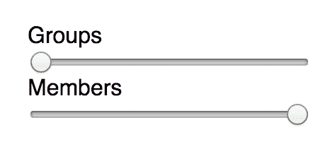

在更改任何这些滑块数值之前，请确保您的开发者工具窗格已打开，并且已选择“性能”选项卡：

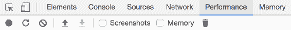

接下来，点击左侧的圆圈图标开始记录性能概要。按钮将变为红色，您会看到一个状态对话框出现，表示已开始分析：

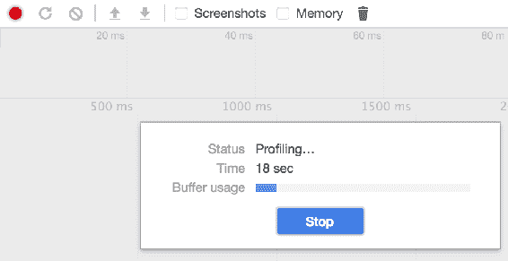

现在您正在记录，将“组”滑块滑动到最右边。当您接近右边时，您可能会注意到 UI 有些延迟，这是件好事，因为这正是您想要设计的。一旦滑块滑到最右边，点击开始录制时点击的红色圆圈来停止录制。您应该会看到类似以下的内容：

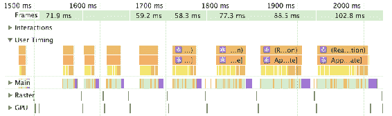

我扩大了左侧的用户定时标签，因为这里显示了所有 React 特定的时间。在这个图表中，时间从左到右流动。某件事情越宽，它花费的时间就越长。您可能会注意到，当您接近滑块的右侧时，性能会变差（这也可能与您在滑块控制中注意到的延迟相吻合）。

因此，让我们探索一下这些数据的含义。我们将查看最右边的数据，因为这里性能真的下降了：

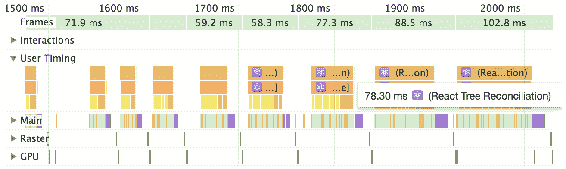

这个标签告诉您，React 树协调需要 78 毫秒来执行。并不是非常慢，但足够慢以至于对用户体验产生了实质性影响。当您逐个查看这些标签时，您应该能更好地了解为什么协调过程需要这么长时间。让我们看下一个：

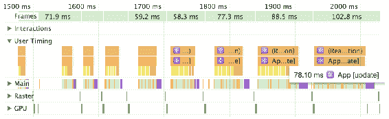

这很有趣：`App [update]` 标签告诉你，在 `App` 组件中的状态更新花费了 78 毫秒。在这一点上，你知道 `App` 中的状态更新导致了 React 协调过程花费了 78 毫秒。让我们跳到下一个级别。在这个级别，有两种颜色。让我们看看黄色代表什么：

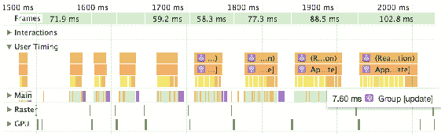

通过悬停在黄色的片段上，你可以看到 `Group [update]` 花费了 7.7 毫秒来更新一个 `Group` 组件。这可能是一个微不足道的时间，可能无法以任何有意义的方式改进。然而，看一下代表 `Group` 更新的黄色片段的数量。所有这些单位数时间片段加起来占据了整体协调时间的相当大一部分。最后，让我们看看棕色：

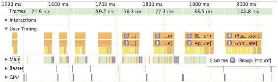

这个标签，`Group [mount]`，表示安装一个新的 `Group` 组件花费了 6.5 毫秒。再一次，这是一个小数字，但有几个片段。

在这一点上，你已经一直深入到组件层次结构的底部，以检查是什么导致了你的性能问题。这里的要点是什么？你确定了 React 执行协调所花费的大部分时间发生在 `Group` 组件中。每次渲染 `Group` 组件时，只需要几毫秒的时间来完成，但有很多组。

感谢浏览器开发者工具中的性能图表，现在你知道改变你的代码并不会有所收获——你不会以任何有意义的方式改善单位数毫秒的时间。在这个应用程序中，解决你在将滑块向右移动时感到的延迟的唯一方法是以某种方式减少在页面上呈现的元素数量。另一方面，你可能会注意到一些 React 性能指标有 50 毫秒，或在某些情况下有数百毫秒。你可以轻松修复你的代码以提供更好的用户体验。关键是，如果没有像你在本节中使用过的性能开发工具，你将永远不知道实际上有什么会产生差异。

当您作为用户与应用程序交互时，通常会感觉到性能问题。但验证组件是否存在性能问题的另一种方法是查看显示在 React 指标上方的帧速率，呈绿色。它显示了在相应的 React 代码下渲染帧所花费的时间。您刚刚构建的示例在滑块位于左侧时以每秒 40 帧开始，但当滑块移至最右侧时以每秒 10 帧结束。

# 摘要

在本章中，您了解了可以直接通过 Web 浏览器使用的 React 工具。这里的首选工具是一个名为 React Developer Tools 的 Chrome/Firefox 扩展程序。该扩展程序为浏览器的原生开发者工具添加了特定于 React 的功能。安装了该扩展程序后，您学会了如何选择 React 元素以及如何按标签名称搜索 React 元素。

接下来，您查看了 React Developer Tools 中所选 React 组件的属性和状态值。这些值会自动更新，因为它们被应用程序更改。然后，您学会了如何在浏览器中直接操作元素状态。这里的限制是您无法向集合中添加或删除值。

最后，您学会了如何在浏览器中对 React 组件的性能进行分析。这不是 React Developer Tools 的功能，而是 React 16 的开发版本自动执行的。使用这样的分析可以确保在遇到性能问题时您正在解决正确的问题。本章中您查看的示例表明，代码实际上并没有问题，问题在于一次在屏幕上渲染了太多的元素。

在下一章中，您将构建一个基于 Redux 的 React 应用程序，并使用 Redux DevTools 来监视应用程序的状态。
