# 第九章：使用 Redux 对应用程序状态进行仪器化

Redux 是在 React 应用程序中管理状态的事实标准库。单独使用 React 应用程序可以使用`setState()`来管理其组件的状态。这种方法的挑战在于没有控制状态更改的顺序（考虑异步调用，如 HTTP 请求）。

本章的目的不是向您介绍 Redux——有很多资源可以做到这一点，包括 Packt 图书和官方 Redux 文档。因此，如果您对 Redux 还不熟悉，您可能希望在继续之前花 30 分钟熟悉 Redux 的基础知识。本章的重点是您可以在 Web 浏览器中启用的工具。我认为 Redux 的重要价值之一来自 Redux DevTools 浏览器扩展。

在本章中，您将学到：

+   如何构建一个基本的 Redux 应用程序（而不深入研究 Redux 概念）

+   安装 Redux DevTools Chrome 扩展

+   选择 Redux 操作并检查其内容

+   如何使用时光旅行调试技术

+   手动触发操作以更改状态

+   导出应用程序状态并稍后导入

# 构建 Redux 应用程序

本章中您将使用的示例应用程序是一个基本的图书管理器。目标是拥有足够的功能来演示不同的 Redux 操作，但又足够简单，以便您可以学习 Redux DevTools 而不感到不知所措。

此应用程序的高级功能如下：

+   呈现您想要跟踪的书籍列表。每本书显示书籍的标题、作者和封面图片。

+   允许用户通过在文本输入中键入来筛选列表。

+   用户可以创建新书籍。

+   用户可以选择一本书查看更多详情。

+   书籍可以被删除。

在您深入研究 Redux DevTools 扩展之前，让我们花几分钟来了解这个应用程序的实现方式。

# App 组件和状态

`App`组件是图书管理应用程序的外壳。您可以将`App`视为呈现的每个其他组件的容器。它负责呈现左侧导航，并定义应用程序的路由，以便在用户移动时挂载和卸载适当的组件。以下是`App`的实现方式：

```jsx
import React, { Component } from 'react';
import { connect } from 'react-redux';
import {
  BrowserRouter as Router,
  Route,
  NavLink
} from 'react-router-dom';
import logo from './logo.svg';
import './App.css';
import Home from './Home';
import NewBook from './NewBook';
import BookDetails from './BookDetails';

class App extends Component {
  render() {
    const { title } = this.props;

    return (
      <Router>
        <div className="App">
          <header className="App-header">
            
            <h1 className="App-title">{title}</h1>
          </header>
          <section className="Layout">
            <nav>
              <NavLink
                exact
                to="/"
                activeStyle={{ fontWeight: 'bold' }}
              >
                Home
              </NavLink>
              <NavLink to="/new" activeStyle={{ fontWeight: 'bold' }}>
                New Book
              </NavLink>
            </nav>
            <section>
              <Route exact path="/" component={Home} />
              <Route exact path="/new" component={NewBook} />
              <Route
                exact
                path="/book/:title"
                component={BookDetails}
              />
            </section>
          </section>
        </div>
      </Router>
    );
  }
}

const mapState = state => state.app;
const mapDispatch = dispatch => ({});
export default connect(mapState, mapDispatch)(App);
```

`react-redux`包中的`connect()`函数用于将`App`组件连接到 Redux 存储（应用程序状态所在的地方）。`mapState()`和`mapDispatch()`函数分别向`App`组件添加 props——状态值和动作分发函数。到目前为止，`App`组件只有一个状态值和没有动作分发函数。

要深入了解如何将 React 组件连接到 Redux 存储，请查看此页面：[`redux.js.org/basics/usage-with-react`](https://redux.js.org/basics/usage-with-react)。

接下来让我们来看一下`app()`reducer 函数：

```jsx
const initialState = {
  title: 'Book Manager'
};

const app = (state = initialState, action) => {
  switch (action.type) {
    default:
      return state;
  }
};

export default app;
```

`App`使用的状态并不多，只有一个`title`。实际上，这个`title`永远不会改变。reducer 函数只是简单地返回传递给它的状态。在这里实际上不需要`switch`语句，因为没有需要处理的动作。然而，`title`状态很可能会根据动作而改变——只是您还不知道。设置这样的 reducer 函数从来不是坏主意，这样您就可以将组件连接到 Redux 存储，一旦确定应该引起状态改变的动作，就有一个准备好处理它的 reducer 函数。

# 主页组件和状态

`Home`组件是作为`App`的子组件首先呈现的组件。`Home`的路由是`/`，这是过滤文本输入和书籍列表呈现的地方。当用户首次加载应用程序时，用户将看到以下内容：

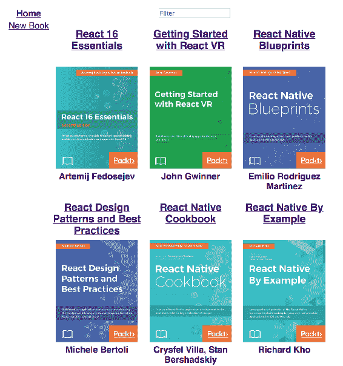

在左边，您有由`App`组件呈现的两个导航链接。在这些链接的右侧，您有过滤文本输入，然后是书籍列表——React 书籍。现在，让我们来看一下`Home`组件的实现：

```jsx
import React, { Component } from 'react';
import { connect } from 'react-redux';

import { fetchBooks } from '../api';
import Book from './Book';
import Loading from './Loading';
import './Home.css';

class Home extends Component {
  componentWillMount() {
    this.props.fetchBooks();
  }

  render() {
    const {
      loading,
      books,
      filterValue,
      onFilterChange
    } = this.props;
    return (
      <Loading loading={loading}>
        <section>
          <input
            placeholder="Filter"
            onChange={onFilterChange}
            value={filterValue}
          />
        </section>
        <section className="Books">
          {books
            .filter(
              book =>
                filterValue.length === 0 ||
                new RegExp(filterValue, 'gi').test(book.title)
            )
            .map(book => (
              <Book
                key={book.title}
                title={book.title}
                author={book.author}
                imgURL={book.imgURL}
              />
            ))}
        </section>
      </Loading>
    );
  }
}

const mapState = state => state.home;
const mapDispatch = dispatch => ({
  fetchBooks() {
    dispatch({ type: 'FETCHING_BOOKS' });
    fetchBooks().then(books => {
      dispatch({
        type: 'FETCHED_BOOKS',
        books
      });
    });
  },

  onFilterChange({ target: { value } }) {
    dispatch({ type: 'SET_FILTER_VALUE', filterValue: value });
  }
});

export default connect(mapState, mapDispatch)(Home);
```

这里需要注意的关键事项：

+   `componentWillMount()`调用`fetchBooks()`从 API 加载书籍数据

+   `Loading`组件用于在获取书籍时显示加载文本

+   `Home`组件定义了分发动作的函数，这是您希望使用 Redux DevTools 查看的内容

+   书籍和过滤数据来自 Redux 存储

这是处理动作并维护与该组件相关状态的 reducer 函数：

```jsx
const initialState = {
  loading: false,
  books: [],
  filterValue: ''
};

const home = (state = initialState, action) => {
  switch (action.type) {
    case 'FETCHING_BOOKS':
      return {
        ...state,
        loading: true
      };
    case 'FETCHED_BOOKS':
      return {
        ...state,
        loading: false,
        books: action.books
      };

    case 'SET_FILTER_VALUE':
      return {
        ...state,
        filterValue: action.filterValue
      };

    default:
      return state;
  }
};

export default home;
```

如果你看`initialState`对象，你会看到`Home`依赖于一个`books`数组，一个`filterValue`字符串和一个`loading`布尔值。`switch`语句中的每个动作情况都会改变这个状态的一部分。虽然通过查看这个 reducer 代码可能有点棘手，但结合 Redux 浏览器工具，情况变得清晰起来，因为你可以将在应用程序中看到的内容映射回这段代码。

# NewBook 组件和状态

在左侧导航栏的主页链接下面，有一个 NewBook 链接。点击这个链接将带你到一个允许你创建新书的表单。现在让我们来看一下`NewBook`组件的源码：

```jsx
import React, { Component } from 'react';
import { connect } from 'react-redux';

import { createBook } from '../api';
import './NewBook.css';

class NewBook extends Component {
  render() {
    const {
      title,
      author,
      imgURL,
      controlsDisabled,
      onTitleChange,
      onAuthorChange,
      onImageURLChange,
      onCreateBook
    } = this.props;

    return (
      <section className="NewBook">
        <label>
          Title:
          <input
            autoFocus
            onChange={onTitleChange}
            value={title}
            disabled={controlsDisabled}
          />
        </label>
        <label>
          Author:
          <input
            onChange={onAuthorChange}
            value={author}
            disabled={controlsDisabled}
          />
        </label>
        <label>
          Image URL:
          <input
            onChange={onImageURLChange}
            value={imgURL}
            disabled={controlsDisabled}
          />
        </label>
        <button
          onClick={() => {
            onCreateBook(title, author, imgURL);
          }}
          disabled={controlsDisabled}
        >
          Create
        </button>
      </section>
    );
  }
}
const mapState = state => state.newBook;
const mapDispatch = dispatch => ({
  onTitleChange({ target: { value } }) {
    dispatch({ type: 'SET_NEW_BOOK_TITLE', title: value });
  },

  onAuthorChange({ target: { value } }) {
    dispatch({ type: 'SET_NEW_BOOK_AUTHOR', author: value });
  },

  onImageURLChange({ target: { value } }) {
    dispatch({ type: 'SET_NEW_BOOK_IMAGE_URL', imgURL: value });
  },

  onCreateBook(title, author, imgURL) {
    dispatch({ type: 'CREATING_BOOK' });
    createBook(title, author, imgURL).then(() => {
      dispatch({ type: 'CREATED_BOOK' });
    });
  }
});

export default connect(mapState, mapDispatch)(NewBook);
```

如果你看一下用于渲染这个组件的标记，你会看到有三个输入字段。这些字段的值作为 props 传递。与 Redux 存储的连接实际上就是这些 props 的来源。随着它们的状态改变，`NewBook`组件会重新渲染。

映射到这个组件的调度函数负责调度维护这个组件状态的动作。它们的责任如下：

+   `onTitleChange()`: 调度`SET_NEW_BOOK_TITLE`动作以及新的`title`状态

+   `onAuthorChange()`: 调度`SET_NEW_BOOK_AUTHOR`动作以及新的`author`状态

+   `onImageURLChange()`: 调度`SET_NEW_BOOK_IMAGE_URL`动作以及新的`imgURL`状态

+   `onCreateBook()`: 调度`CREATING_BOOK`动作，然后在`createBook()` API 调用返回时调度`CREATED_BOOK`动作

如果你不清楚所有这些动作是如何导致高级应用程序行为的，不要担心。这就是为什么你马上要安装 Redux DevTools，这样你就可以理解应用程序状态的变化情况。

这是处理这些动作的 reducer 函数：

```jsx
const initialState = {
  title: '',
  author: '',
  imgURL: '',
  controlsDisabled: false
};

const newBook = (state = initialState, action) => {
  switch (action.type) {
    case 'SET_NEW_BOOK_TITLE':
      return {
        ...state,
        title: action.title
      };
    case 'SET_NEW_BOOK_AUTHOR':
      return {
        ...state,
        author: action.author
      };
    case 'SET_NEW_BOOK_IMAGE_URL':
      return {
        ...state,
        imgURL: action.imgURL
      };
    case 'CREATING_BOOK':
      return {
        ...state,
        controlsDisabled: true
      };
    case 'CREATED_BOOK':
      return initialState;
    default:
      return state;
  }
};

export default newBook;
```

最后，这就是渲染时新书表单的样子：

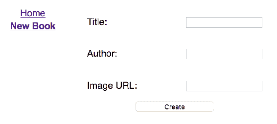

当你填写这些字段并点击创建按钮时，新书将由模拟 API 创建，并且你将被带回到主页，新书应该会被列出。

# API 抽象

对于这个应用程序，我正在使用一个简单的 API 抽象。在 Redux 应用程序中，您应该能够将您的异步功能（API 或其他）封装在自己的模块或包中。以下是`api.js`模块的样子，其中一些模拟数据已被省略以保持简洁：

```jsx
const LATENCY = 1000;

const BOOKS = [
  {
    title: 'React 16 Essentials',
    author: 'Artemij Fedosejev',
    imgURL: 'big long url...'
  },
  ...
];

export const fetchBooks = () =>
  new Promise(resolve => {
    setTimeout(() => {
      resolve(BOOKS);
    }, LATENCY);
  });

export const createBook = (title, author, imgURL) =>
  new Promise(resolve => {
    setTimeout(() => {
      BOOKS.push({ title, author, imgURL });
      resolve();
    }, LATENCY);
  });

export const fetchBook = title =>
  new Promise(resolve => {
    setTimeout(() => {
      resolve(BOOKS.find(book => book.title === title));
    }, LATENCY);
  });

export const deleteBook = title =>
  new Promise(resolve => {
    setTimeout(() => {
      BOOKS.splice(BOOKS.findIndex(b => b.title === title), 1);
      resolve();
    }, LATENCY);
  });
```

要开始构建您的 Redux 应用程序，这就是您所需要的。这里需要注意的重要一点是，这些 API 函数中的每一个都返回一个`Promise`对象。为了更贴近真实 API，我添加了一些模拟的延迟。您不希望 API 抽象返回常规值，比如对象或数组。如果它们在与真实 API 交互时会是异步的，请确保初始模拟也是异步的。否则，这将非常难以纠正。

# 把所有东西放在一起

让我们快速看一下将所有内容整合在一起的源文件，以便让您感受到完整性。让我们从`index.js`开始：

```jsx
import React from 'react';
import ReactDOM from 'react-dom';
import './index.css';
import Root from './components/Root';
import registerServiceWorker from './registerServiceWorker';

ReactDOM.render(<Root />, document.getElementById('root'));
registerServiceWorker();
```

这看起来就像这本书中到目前为止您所使用的`create-react-app`中的大多数`index.js`文件。它不是渲染一个`App`组件，而是渲染一个`Root`组件。让我们接着看：

```jsx
import React from 'react';
import { Provider } from 'react-redux';
import App from './App';
import store from '../store';

const Root = () => (
  <Provider store={store}>
    <App />
  </Provider>
);

export default Root;
```

`Root`的工作是用`react-redux`中的`Provider`组件包装`App`组件。这个组件接受一个`store`属性，这样您就能确保连接的组件可以访问 Redux store 数据。

接下来让我们看一下`store`属性：

```jsx
import { createStore } from 'redux';
import reducers from './reducers';

export default createStore(
  reducers,
  window.__REDUX_DEVTOOLS_EXTENSION__ &&
    window.__REDUX_DEVTOOLS_EXTENSION__()
);
```

Redux 有一个`createStore()`函数，用于为您的 React 应用程序构建一个 store。第一个参数是处理操作并返回 store 新状态的 reducer 函数。第二个参数是一个增强器函数，可以响应 store 状态的变化。在这种情况下，您需要检查 Redux DevTools 浏览器扩展是否安装，如果安装了，就将其连接到您的 store。如果没有这一步，您将无法使用浏览器工具与您的 Redux 应用程序一起使用。

我们快要完成了。让我们看一下`reducers/index.js`文件，它将您的 reducer 函数组合成一个函数：

```jsx
import { combineReducers } from 'redux';
import app from './app';
import home from './home';
import newBook from './newBook';
import bookDetails from './bookDetails';

const reducers = combineReducers({
  app,
  home,
  newBook,
  bookDetails
});

export default reducers;
```

Redux 只有一个 store。为了将您的 store 细分为映射到应用程序概念的状态片段，您需要命名处理各种状态片段的个体 reducer 函数，并将它们传递给`combineReducers()`。对于这个应用程序，您的 store 有以下状态片段，可以映射到组件：

+   `app`

+   `home`

+   `newBook`

+   `bookDetails`

现在您已经看到了这个应用程序是如何组合和工作的，现在是时候开始使用 Redux DevTools 浏览器扩展对其进行调试了。

# 安装 Redux DevTools

安装 Redux DevTools 浏览器扩展的过程与安装 React Developer Tools 扩展的过程类似。第一步是打开 Chrome Web Store 并搜索`redux`：

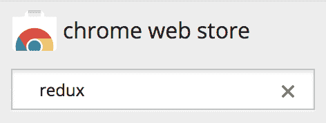

您要寻找的扩展很可能是第一个结果：

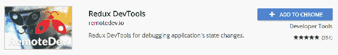

点击“添加到 Chrome”按钮。然后，您将看到一个对话框，询问您是否同意安装该扩展，并在向您展示它可以更改的内容后安装该扩展：

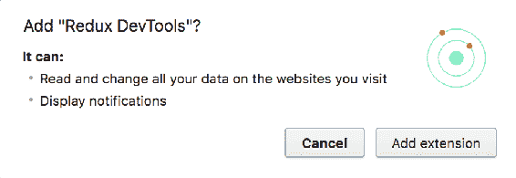

单击“添加扩展”按钮后，您将看到一个通知，指出已安装了该扩展：

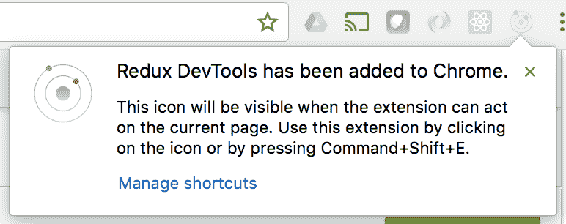

就像 React Developer Tools 扩展一样，Redux DevTools 图标在打开运行 Redux 并添加了对该工具的支持的页面之前都会保持禁用状态。请记住，您在图书管理应用程序中明确添加了对该工具的支持，使用了以下代码：

```jsx
export default createStore(
  reducers,
  window.__REDUX_DEVTOOLS_EXTENSION__ &&
    window.__REDUX_DEVTOOLS_EXTENSION__()
);
```

现在让我们启动图书管理应用程序，并确保您可以使用该扩展。运行`npm start`并等待 UI 在浏览器选项卡中打开和加载后，React 和 Redux 开发人员工具图标应该都是启用状态：

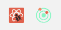

接下来，打开开发人员工具浏览器窗格。您可以以与访问 React Developer Tools 相同的方式访问 Redux DevTools：

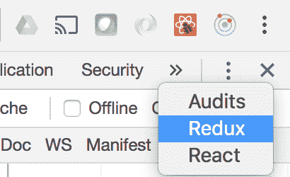

当您选择 Redux 工具时，您应该看到类似于这样的东西：

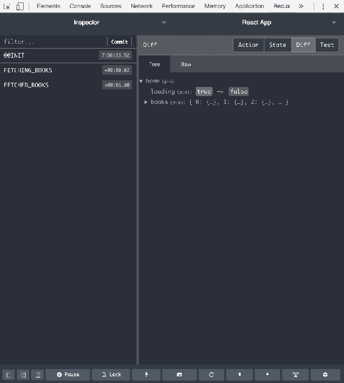

Redux DevTools 中的左侧窗格包含最重要的数据——应用程序中的操作。正如在这里反映的，您的图书管理应用程序已经分派了三个操作，因此您知道一切都在运作！

# 选择和检查操作

Redux DevTools 左侧窗格上显示的操作是按时间顺序列出的，根据它们的分派时间。可以选择任何操作，并通过这样做，您可以使用右侧窗格来检查应用程序状态和操作本身的不同方面。在本节中，您将学习如何深入了解 Redux 操作如何驱动您的应用程序。

# 操作数据

通过选择一个动作，你可以查看作为动作一部分分发的数据。但首先，让我们生成一些动作。一旦应用程序加载，就会分发`FETCHING_BOOKS`和`FETCHED_BOOKS`动作。点击 React Native Blueprints 链接，加载书籍数据并转到书籍详情页面。这将导致分发两个新动作：`FETCHING_BOOK`和`FETCHED_BOOK`。渲染的 React 内容应该是这样的：

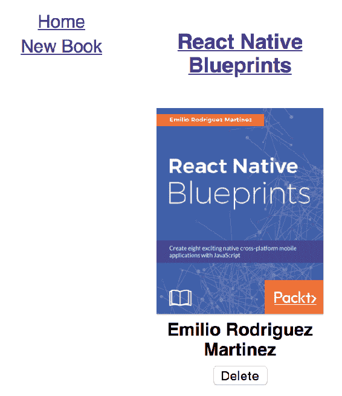

Redux DevTools 中的动作列表应该是这样的：

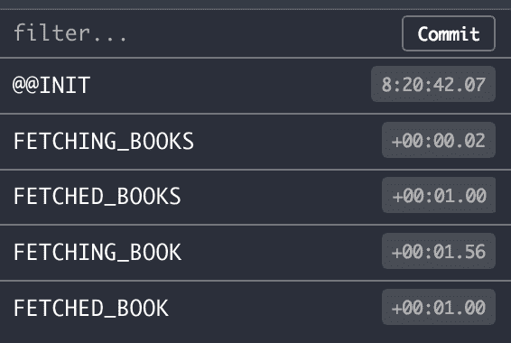

`@@INIT`动作是由 Redux 自动分发的，并且始终是第一个动作。通常情况下，你不需要担心这个动作，除非你需要知道在分发动作之前应用程序的状态是什么样子的——我们将在接下来的部分中介绍这个。

现在，让我们选择`FETCHING_BOOKS`动作。然后，在右侧窗格中，选择动作切换按钮以查看动作数据。你应该看到类似这样的东西：

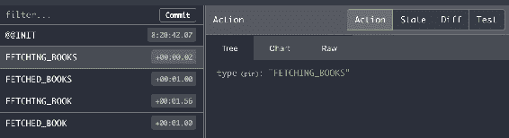

默认情况下选择了动作的树视图。你可以在这里看到动作数据有一个名为`type`的属性，其值是动作的名称。这告诉你 reducer 应该知道如何处理这个动作，而且它不需要任何额外的数据。

现在让我们选择`FETCHED_BOOKS`动作，看看动作数据是什么样子的：

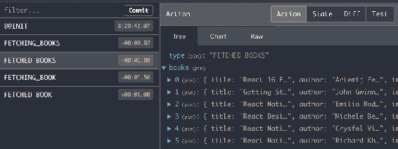

再次，你有一个带有动作名称的`type`属性。这次，你还有一个带有书籍数组的`books`属性。这个动作是作为对 API 数据解析的响应而分发的，以及书籍数据如何进入存储——它是通过动作携带进来的。

通过查看动作数据，你可以比较实际分发的内容与应用程序状态中所看到的内容。改变应用程序状态的唯一方法是通过分发具有新状态的动作。接下来，让我们看看单个动作如何改变应用程序的状态。

# 动作状态树和图表

在前面的部分中，你看到了如何使用 Redux DevTools 来选择特定的动作以查看它们的数据。动作及其携带的数据导致应用程序状态的变化。当你选择一个动作时，你可以查看该动作对整个应用程序状态的影响。

让我们选择`FETCHING_BOOK`操作，然后选择右侧窗格中的状态切换按钮：

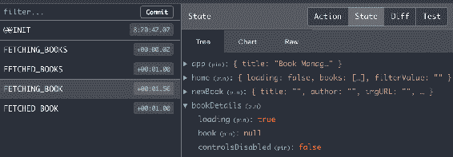

此树视图显示了在分派`FETCHING_BOOK`操作后应用程序的整个状态。在这里，`bookDetails`状态被展开，以便您可以看到该操作对状态的影响。在这种情况下，它是`loading`的值——现在是`true`。

现在让我们选择此操作的图表视图：

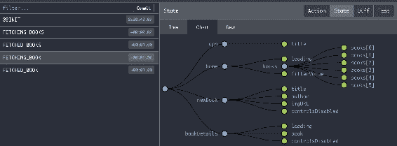

我偏好图表视图而不是树视图，用于可视化应用程序的整个状态。在图表的最左边，您有根状态。在其右侧，您有应用程序状态的主要部分——`app`、`home`、`newBook`和`bookDetails`。随着您向右移动，您会深入到应用程序中组件的具体状态。正如您在这里看到的，最深层次是`home`状态中`books`数组中的个别书籍。

`FETCHING_BOOK`操作仍然被选中，这意味着该图表反映了 reducers 响应该操作后的应用程序状态。此操作改变了`bookDetails`中的`loading`状态。如果您将鼠标指针移动到状态标签上，您将看到它的值：

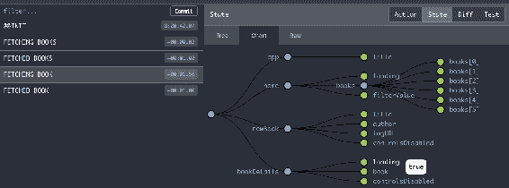

现在让我们选择`FETCHED_BOOK`操作。当书籍详细数据从调用 API 获取解析时，将分派此操作：

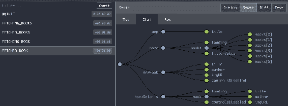

如果您在切换到不同的操作时保持图表视图处于激活状态，您会注意到图表实际上会动画显示状态的变化。这看起来很酷，毫无疑问，但它也会吸引您注意实际发生变化的值，以便更容易看到。在这个例子中，如果您查看`bookDetails`下的`book`对象，您会发现它现在有了新的属性。您可以将鼠标指针移动到每个属性上以显示其值。您还可以检查`loading`的值——它应该恢复为`false`。

# 操作状态差异

在 Redux DevTools 中查看操作数据的另一种方法是查看从分派操作中产生的状态差异。这个视图不是试图通过查看整个状态树来推断状态的变化，而是只向您展示了发生了什么变化。

让我们尝试添加一本新书来生成一些动作。我要添加你现在正在阅读的这本书。首先，我会粘贴生成输入元素上的更改事件的书名，然后触发`SET_NEW_BOOK_TITLE`动作。如果你选择该动作，你应该会看到以下内容：

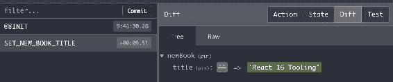

`newBook`状态的`title`值从空字符串变为了粘贴到标题文本输入框中的值。您无需寻找此更改，它已清晰标记，所有不相关的状态数据都被隐藏起来。

接下来，让我们粘贴作者并选择`SET_NEW_BOOK_AUTHOR`动作：

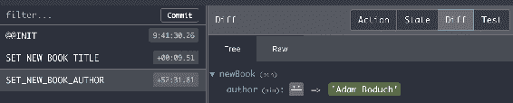

再次，这里只显示了`author`值，因为它是由于分派`SET_NEW_BOOK_AUTHOR`而发生变化的唯一值。这是最终的表单字段-图像 URL：

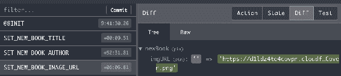

通过使用动作的差异视图，您只会看到由于动作而发生变化的数据。如果这不能给您足够的视角，您可以随时跳转到状态视图，以便查看整个应用程序的状态。

让我们通过点击“创建”按钮来创建新书。这将分派两个动作：`CREATING_BOOK`和`CREATED_BOOK`。首先，让我们看看`CREATING_BOOK`：

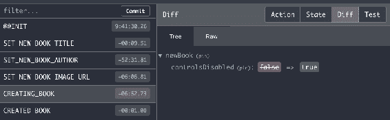

此动作在进行 API 调用*创建书籍*之前分派。这使得您的 React 组件有机会处理用户交互的异步性质。在这种情况下，您不希望用户在请求挂起时能够与任何表单控件进行交互。通过查看此差异，您可以看到`controlsDisabled`值现在为`false`，React 组件可以使用它来禁用任何表单控件。

最后，让我们看一下`CREATED_BOOK`动作：

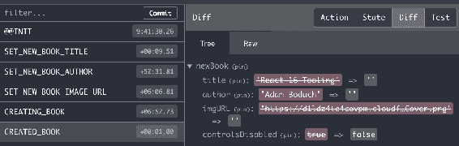

`title`、`author`和`imgURL`的值都被设置为空字符串，这将重置表单字段的值。通过将`controlsDisabled`设置为`false`，表单字段也被重新启用。

# 时间旅行调试

Redux 中 reducer 函数的一个要求是它们必须是纯函数；也就是说，它们只返回新数据，而不是改变现有数据。这样做的一个结果是它可以实现时间旅行调试。因为没有任何改变，你可以将应用程序的状态向前、向后或者到任意时间点。Redux DevTools 使这变得很容易。

为了看到时间旅行调试的效果，让我们在过滤输入框中输入一些过滤文本：

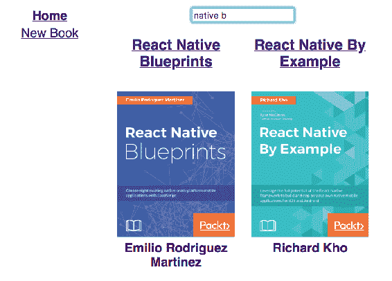

在 Redux DevTools 中查看动作，你应该看到类似以下的内容：

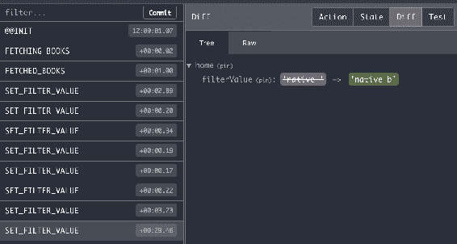

我选择了最后一个被分发的`SET_FILTER_VALUE`动作。`filterValue`的值应该是`native b`，这反映了当前显示的标题。现在，让我们回到两个动作之前。为了做到这一点，将鼠标指针移动到当前选定动作的两个位置之前的动作上。点击 Jump 按钮，应用程序的状态将被更改为分发`SET_FILTER_VALUE`时的状态：

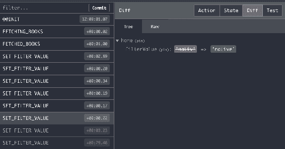

你可以看到`filterValue`已经从`native b`变成了`native`。你已经成功地撤销了最后两次按键，相应地更新了状态和 UI：

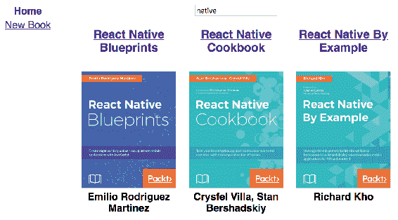

要将应用程序状态恢复到当前时间，按照相同的过程但是反向操作。点击最近状态上的 Jump。

# 手动触发动作

在开发 Redux 应用程序时手动触发动作的能力是很有帮助的。例如，你可能已经准备好了组件，但是不确定用户交互会如何工作，或者你只是需要排除一些本应该工作但是却没有的问题。你可以使用 Redux DevTools 通过点击面板底部附近带有键盘图标的按钮来手动触发动作：

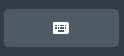

这将显示一个文本输入框，你可以在其中输入动作的载荷。例如，我已经导航到了《React Native By Example》的书籍详情页面：

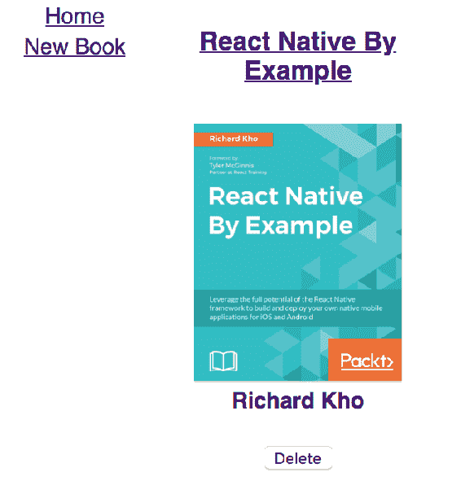

我不想点击删除按钮，我只想看看应用程序的状态会发生什么变化，而不触发 DOM 事件或 API 调用。为了做到这一点，我可以点击 Redux DevTools 中的键盘按钮，这样我就可以手动输入一个动作并分派它。例如，这是我如何分派`DELETING_BOOK`动作的方式：

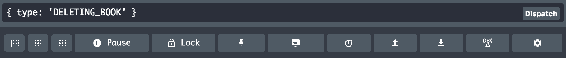

这导致动作被分派，因此 UI 被更新。这是`DELETING_BOOK`动作：

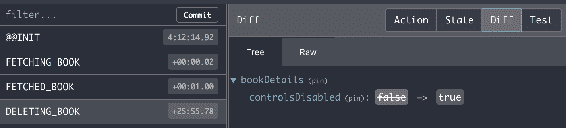

要将`controlsDisabled`设置回`false`，您可以分派`DELETED_BOOK`动作：

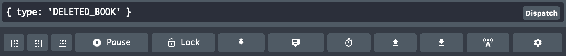

# 导出和导入状态

随着 Redux 应用程序的规模和复杂性的增长，状态树的大小和复杂性也会同步增长。因此，有时玩弄单个动作并使应用程序进入特定状态可能会太繁琐，无法手动一遍又一遍地执行。

使用 Redux DevTools，您可以导出应用程序的当前状态。然后，当您以后进行故障排除并需要特定状态作为起点时，您可以直接加载它，而不是手动重新创建它。

让我们尝试导出应用程序状态。首先，导航到 React 16 Essentials 的详细信息页面：

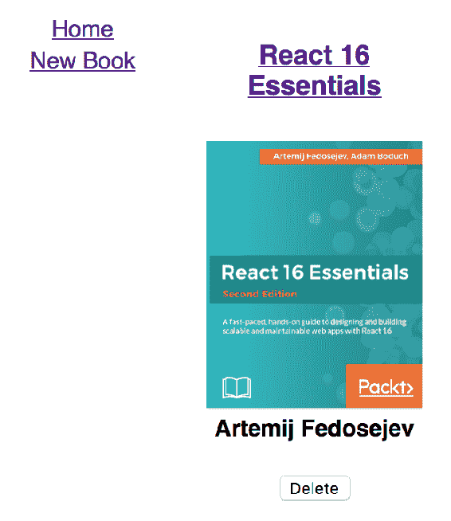

要使用 Redux DevTools 导出当前状态，请单击带有向下箭头的按钮：

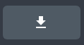

然后，您可以使用向上箭头导入状态。但在这之前，导航到不同的书名，比如《使用 React VR 入门》：

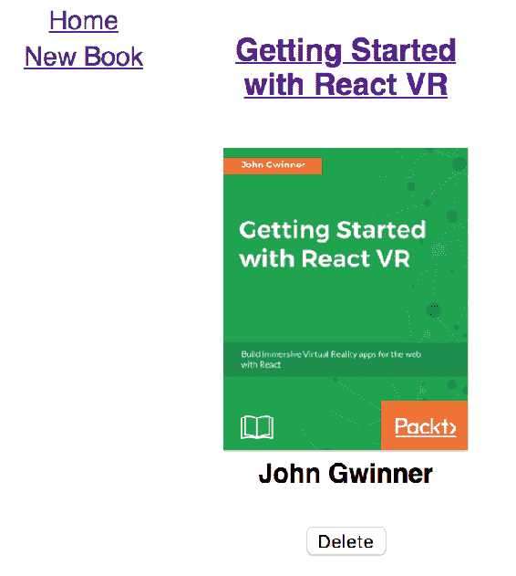

现在，您可以在 Redux DevTools 窗格中使用上传按钮：

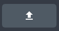

由于您已经在书籍详细信息页面上，加载此状态将替换由此页面上的组件呈现的状态值：

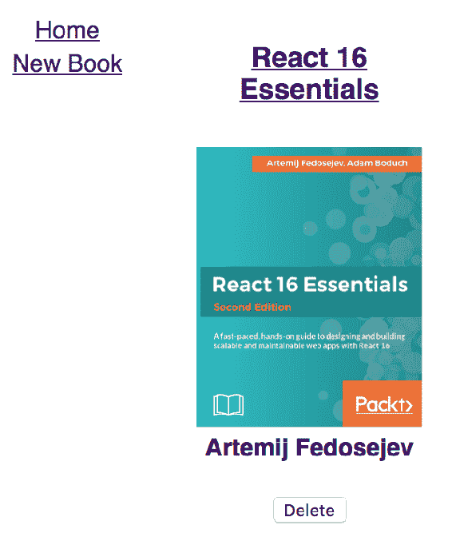

现在您知道如何将 Redux 存储的状态恢复到您导出并本地保存的任何给定点。这样做的想法是避免记住并按照正确的顺序执行校正操作以达到特定状态。这是容易出错的，导出所需的确切状态可以避免整个过程。

# 摘要

在本章中，你组合了一个简单的图书管理 Redux 应用程序。有了这个应用程序，然后你学会了如何在 Chrome 中安装 Redux DevTools 浏览器扩展。然后，你学会了如何查看和选择动作。

一旦选择了一个动作，就有许多方法可以查看有关应用程序的信息。你可以查看动作的载荷数据。你可以查看整个应用程序状态。你可以查看应用程序状态和上次分发的动作之间的差异。这些都是你可以用来调试 Redux 应用程序的不同方法。

然后，你学会了如何在 Redux DevTools 中进行时间旅行调试。因为在 Redux 中状态变化是不可变的，你可以使用 Redux DevTools 从一个动作跳转到另一个动作。这可以极大地简化调试周期。最后，你学会了如何手动分发动作以及导入/导出应用程序的状态。

在下一章中，你将学习如何使用 Gatsby 从 React 组件生成静态内容。
