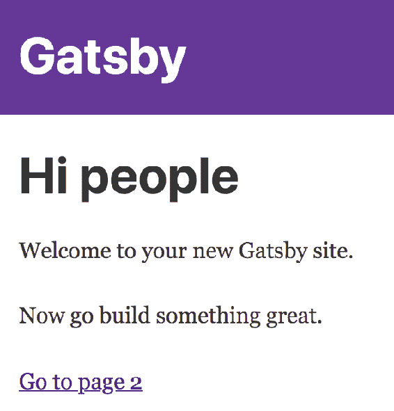
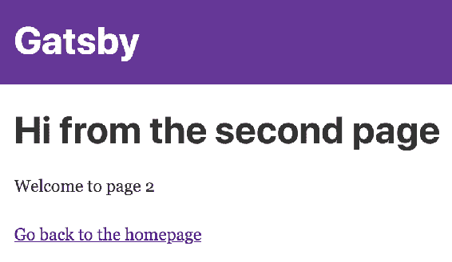
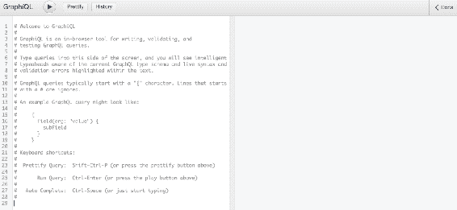
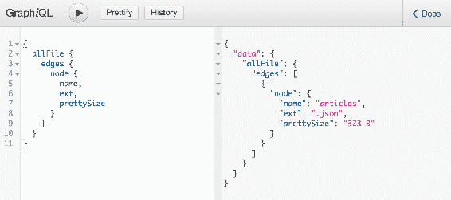
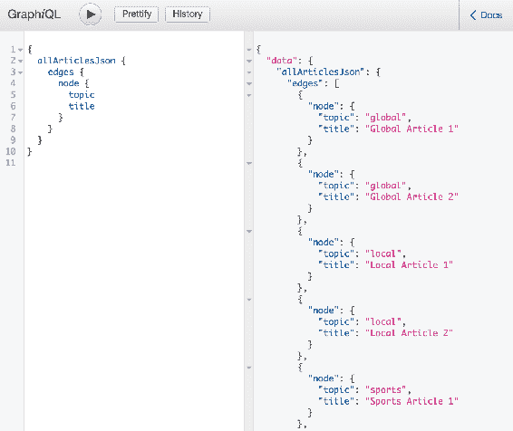
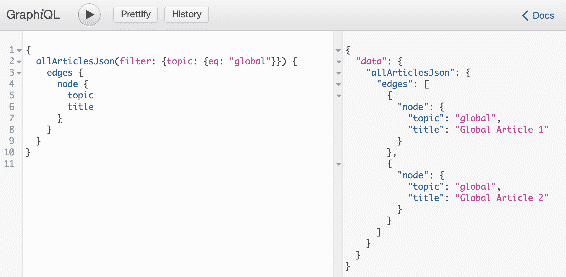
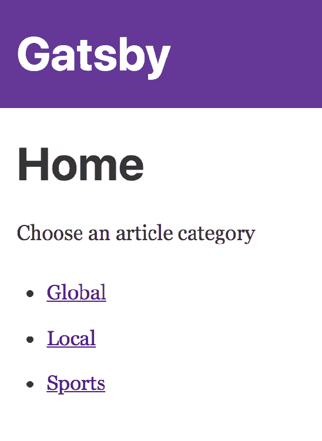
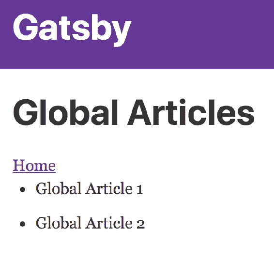
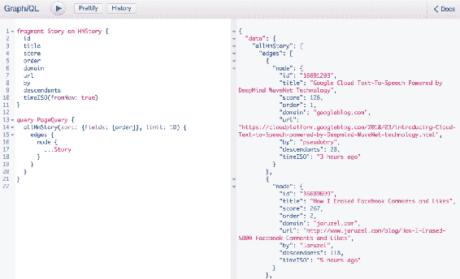

# 第十章：使用 Gatsby 构建和部署静态 React 站点

Gatsby 是 React 开发人员的静态网站生成工具。本质上，这个工具让你构建 React 组件并捕获它们的渲染输出，以用作静态站点内容。然而，Gatsby 将静态站点生成提升到了一个新的水平。特别是，它提供了将网站数据作为 GraphQL 源并将其转换为更容易被 React 组件消耗的机制。Gatsby 可以处理从单页宣传册站点到跨越数百页的站点的任何内容。

在本章中，您将学到以下内容：

+   为什么要使用 React 组件构建静态站点？

+   使用入门者构建简单的 Gatsby 站点

+   使用来自本地文件系统的数据

+   使用来自 Hacker News 的远程数据

# 为什么要静态 React 站点？

在使用 Gatsby 构建静态网站之前，让我们通过简要讨论为什么要这样做来设定背景。这里有三个关键因素——我们现在将逐个讨论每一个。

# React 应用程序的类型

React 与非常互动和生动变化的数据相关联。这可能对一些应用程序是真实的，甚至可能对大多数应用程序是真实的，但仍然存在用户查看静态数据的情况——即不会改变或很少改变的信息。

考虑一个博客。典型的流程是作者发布一些内容，然后该内容被提供给访问网站的任何人，然后他们可以查看内容。通常情况是，一旦内容发布，它就保持不变，或者保持静态。不寻常的情况是作者更新他们的帖子，但即使是这样，这也是一个不经常的行为。现在，想想你典型的博客发布平台。每当读者访问博客上的页面时，都会执行数据库查询，必须组装内容等。问问自己，如果结果每次都一样，那么发出所有这些查询真的有意义吗？

让我们看另一个例子。您有一个企业级应用程序，一个大型应用程序，有大量数据和大量功能。应用程序的一部分专注于用户交互——添加/更改数据和与几乎实时数据交互。应用程序的另一部分生成报告——基于数据库查询的报告和基于历史数据快照的图表。这个企业应用程序的后半部分似乎不与频繁更改的数据交互，或者根本不交互。也许，将应用程序拆分为两个应用程序会有所好处：一个处理用户与活跃数据的交互，另一个生成几乎不频繁更改或根本不更改的静态内容。

您可能正在构建一个应用程序或较大应用程序的一部分，其中大部分数据都是静态的。如果是这样，您可能可以使用类似 Gatsby 的工具来生成静态渲染的内容。但是为什么要这样做？有什么好处呢？

# 更好的用户体验

构建 React 组件的静态版本最具说服力的原因是为用户提供更好的体验。关键指标在于整体性能的改进。不必触及各种 API 端点并处理提供数据给 React 组件的所有异步方面，而是一切都是预先加载的。

使用静态构建的 React 内容还有一个不太明显的用户体验改进是，由于移动部件较少，网站出现故障的可能性较小，从而减少了用户的挫败感。例如，如果您的 React 组件不必通过网络获取数据，那么这种故障可能性就完全从您的网站中消除了。

# 高效的资源使用

由 Gatsby 静态编译的组件知道如何有效地使用它们消耗的 GraphQL 资源。GraphQL 的一个很棒的地方是，工具在编译时可以轻松解析和生成高效的代码。如果您在继续使用 Gatsby 之前想要更深入地了解 GraphQL，可以在这里找到一个很好的介绍：[`graphql.org/learn/`](http://graphql.org/learn/)。

静态 Gatsby React 应用程序帮助减少资源消耗的另一个地方是后端。这些应用程序不会不断地命中返回相同响应的 API 端点。这段时间可以用来为实际需要动态数据或正在生成新数据的请求提供服务。

# 构建您的第一个 Gatsby 网站

使用 Gatsby 的第一步是全局安装命令行工具：

```jsx
npm install gatsby-cli -g  
```

现在，您可以运行命令行工具来生成您的 Gatsby 项目，就像`create-react-app`的工作方式一样。`gatsby`命令接受两个参数：

+   新项目的名称

+   Gatsby starter 存储库的 URL

项目名称基本上是创建以保存所有项目文件的文件夹的名称。Gatsby starter 有点像模板，使您更容易上手，特别是如果您正在学习。如果您不传递一个 starter，将使用默认的 starter：

```jsx
gatsby new your-first-gatsby-site
```

运行上述命令将与运行以下命令相同：

```jsx
gatsby new your-first-gatsby-site https://github.com/gatsbyjs/gatsby-starter-default
```

在这两种情况下，starter 存储库都会克隆到`your-first-gatsby-site`目录中，然后为您安装依赖项。如果一切顺利，您应该看到类似于这样的控制台输出：

```jsx
info Creating new site from git: https://github.com/gatsbyjs/gatsby-starter-default.git
Cloning into 'your-first-gatsby-site'...
```

```jsx
success Created starter directory layout
info Installing packages...
added 1540 packages from 888 contributors in 29.528s  
```

现在，您可以切换到`your-first-gatsby-site`目录并启动开发服务器：

```jsx
cd your-first-gatsby-site
gatsby develop
```

这将在您的项目中启动 Gatsby 开发服务器。再次强调，这与`create-react-app`的工作方式类似——没有任何配置要处理，Webpack 已经设置好了。启动开发服务器后，您应该在控制台上看到类似于这样的输出：

```jsx
success delete html and css files from previous builds - 0.007 s
success open and validate gatsby-config.js - 0.004 s
success copy gatsby files - 0.014 s
success onPreBootstrap - 0.011 s
success source and transform nodes - 0.022 s
success building schema - 0.070 s
success createLayouts - 0.020 s
success createPages - 0.000 s
success createPagesStatefully - 0.014 s
success onPreExtractQueries - 0.000 s
success update schema - 0.044 s
success extract queries from components - 0.042 s
success run graphql queries - 0.024 s
success write out page data - 0.003 s
success write out redirect data - 0.001 s
success onPostBootstrap - 0.001 s

info bootstrap finished - 1.901 s

DONE  Compiled successfully in 3307ms                                          
```

您现在可以通过导航到`http://localhost:8000/`在浏览器中查看`gatsby-starter-default`。

查看 GraphiQL，一个在浏览器中探索站点数据和模式的 IDE

`http://localhost:8000/___graphql`。

请注意，开发构建未经优化。要创建生产构建，请使用`gatsby build`：

```jsx
WAIT  Compiling... 

DONE  Compiled successfully in 94ms 
```

如果您在 Web 浏览器中访问`http://localhost:8000/`，您应该看到默认内容：



默认的 starter 创建了多个页面，这样您就可以看到如何将页面链接在一起。如果您点击“转到第 2 页”链接，您将被带到站点的下一页，看起来像这样：



这是您的默认 Gatsby starter 项目的结构：

```jsx
├── LICENSE
├── README.md
├── gatsby-browser.js
├── gatsby-config.js
├── gatsby-node.js
├── gatsby-ssr.js
├── package-lock.json
├── package.json
├── public
│   ├── index.html
│   ├── render-page.js.map
│   └── static
└── src
 ├── components
 │   └── Header
```

```jsx
 │       └── index.js
 ├── layouts
 │   ├── index.css
 │   └── index.js
 └── pages
 ├── 404.js
 ├── index.js
 └── page-2.js  
```

对于基本的站点设计和编辑，您主要关注`src`目录下的文件和目录。让我们看看您要处理的内容，从`Header`组件开始：

```jsx
import React from 'react' 
import Link from 'gatsby-link' 

const Header = () => ( 
  <div 
    style={{ 
      background: 'rebeccapurple', 
      marginBottom: '1.45rem', 
    }} 
  > 
    <div 
      style={{ 
        margin: '0 auto', 
        maxWidth: 960, 
        padding: '1.45rem 1.0875rem', 
      }} 
    > 
      <h1 style={{ margin: 0 }}> 
        <Link 
          to="/" 
          style={{ 
            color: 'white', 
            textDecoration: 'none', 
          }} 
        > 
          Gatsby 
        </Link> 
      </h1> 
    </div> 
  </div> 
) 

export default Header 
```

该组件定义了紫色的页眉部分。标题目前是静态的，它链接到主页，并定义了一些内联样式。接下来，让我们看一下`layouts/index.js`文件：

```jsx
import React from 'react' 
import PropTypes from 'prop-types' 
import Helmet from 'react-helmet' 

import Header from '../components/Header' 
import './index.css' 

const TemplateWrapper = ({ children }) => ( 
  <div> 
    <Helmet 
      title="Gatsby Default Starter" 
      meta={[ 
        { name: 'description', content: 'Sample' }, 
        { name: 'keywords', content: 'sample, something' }, 
      ]} 
    /> 
    <Header /> 
    <div 
      style={{ 
        margin: '0 auto', 
        maxWidth: 960, 
        padding: '0px 1.0875rem 1.45rem', 
        paddingTop: 0, 
      }} 
    > 
      {children()} 
    </div> 
  </div> 
) 

TemplateWrapper.propTypes = { 
  children: PropTypes.func, 
} 

export default TemplateWrapper 
```

这个模块导出了一个`TemplateWrapper`组件。这个组件的作用是定义网站的布局。就像你可能已经实现的其他容器组件一样，这个组件在网站的每个页面上都会被渲染。这类似于你在`react-router`中所做的事情，只不过在 Gatsby 中，路由已经为你处理好了。例如，处理指向`page-2`的链接的路由是由 Gatsby 自动创建的。同样地，Gatsby 通过确保它在网站的每个页面上都被渲染来自动处理这个布局模块。你所需要做的就是确保它看起来符合你的要求，并且`children()`函数被渲染。现在，你可以将它保持原样。

你也会注意到，布局模块还导入了一个包含与网站布局相关的样式的样式表。

让我们现在来看一下页面组件，从`index.js`开始：

```jsx
import React from 'react' 
import Link from 'gatsby-link' 

const IndexPage = () => ( 
  <div> 
    <h1>Hi people</h1> 
    <p>Welcome to your new Gatsby site.</p> 
    <p>Now go build something great.</p> 
    <Link to="/page-2/">Go to page 2</Link> 
  </div> 
) 

export default IndexPage 
```

就像普通的 HTML 网站有一个`index.html`文件一样，静态的 Gatsby 网站也有一个`index.js`页面，它将内容导出到主页上进行渲染。在这里定义的`IndexPage`组件渲染了一些基本的 HTML，包括指向`page-2`的链接。接下来让我们来看一下`page-2.js`：

```jsx
import React from 'react' 
import Link from 'gatsby-link' 

const SecondPage = () => ( 
  <div> 
    <h1>Hi from the second page</h1> 
    <p>Welcome to page 2</p> 
    <Link to="/">Go back to the homepage</Link> 
  </div> 
)
export default SecondPage 
```

这个页面看起来与主页非常相似。在这里渲染的链接将用户带回到主页。

这只是一个基本的介绍，让你开始使用 Gatsby。你没有使用任何数据源来生成内容；你将在接下来的部分中做到这一点。

# 添加本地文件系统数据

在前面的部分中，你看到了如何启动并运行一个基本的 Gatsby 网站。这个网站并不是很有趣，因为没有数据来驱动它。例如，驱动博客的数据是存储在数据库中的博客条目内容，博客框架使用这些数据来渲染文章列表和文章本身的标记。

你可以用 Gatsby 做同样的事情，但以一种更复杂的方式。首先，标记（或在这种情况下，React 组件）是静态构建和捆绑一次的。然后，这些构建被提供给用户，而无需查询数据库或 API。其次，Gatsby 使用的插件架构意味着你不仅限于一个数据源，不同的数据源经常被结合在一起。最后，GraphQL 是一个查询抽象层，位于所有这些东西的顶部，并将数据传递给你的 React 组件。

要开始，你需要一个数据源来驱动你网站的内容。现在我们将保持简单，使用本地 JSON 文件作为数据源。为此，你需要安装`gatsby-source-filesystem`插件：

```jsx
npm install --save gatsby-source-filesystem
```

安装了这个包之后，你可以通过编辑`gatsby-config.js`文件将其添加到你的项目中：

```jsx
plugins: [ 
  // Other plugins... 
  { 
    resolve: 'gatsby-source-filesystem', 
    options: { 
      name: 'data', 
      path: '${__dirname}/src/data/', 
    }, 
  }, 
] 
```

`name`选项告诉 GraphQL 后端如何组织查询结果。在这种情况下，所有内容都将在`data`属性下。路径选项限制了可读取的文件。在这个例子中使用的路径是`src/data`—随意将文件放入该目录，以便进行查询。

此时，你可以启动 Gatsby 开发服务器。GraphiQL 实用程序可在`http://localhost:8000/___graphql`访问。在开发 Gatsby 网站时，你会经常使用这个工具，因为它允许你创建临时的 GraphQL 查询并立即执行它们。当你首次加载这个界面时，你会看到类似这样的东西：



左侧面板是你编写 GraphQL 查询的地方，点击上面的播放按钮执行查询，右侧面板显示查询结果。右上角的文档链接是一个探索 Gatsby 为你创建的可用 GraphQL 类型的有用方式。此外，右侧的查询编辑器窗格将在你输入时自动完成，以帮助更轻松地构建查询。

让我们执行你的第一个查询，列出文件系统中关于文件的信息。请记住，你需要至少在`src/data`中有一个文件，才能使你的查询返回任何结果。以下是如何查询数据目录中文件的名称、扩展名和大小：



如你所见，查询中指定了特定的节点字段。右侧面板中的结果显示你得到了你要求的确切字段。GraphQL 的吸引力之一在于你可以创建任意嵌套和复杂的查询，涵盖多个后端数据源。然而，深入研究 GraphQL 的细节远远超出了本书的范围。Gatsby 首页（[`www.gatsbyjs.org/`](https://www.gatsbyjs.org/)）上有一些关于 GraphQL 的很好的资源，包括其他 GraphQL 教程和文档的链接。

这里的要点是，`gatsby-source-filesystem`数据源插件为您完成了所有繁重的 GraphQL 工作。它为您生成了整个模式，这意味着一旦您安装了插件，您就可以启动开发服务器并立即开始使用自动完成和文档。

继续使用这个例子，您可能不需要在 UI 中呈现本地文件数据。所以让我们创建一个带有一些 JSON 内容的`articles.json`文件：

```jsx
[ 
  { "topic": "global", "title": "Global Article 1" }, 
  { "topic": "global", "title": "Global Article 2" }, 
  { "topic": "local", "title": "Local Article 1" }, 
  { "topic": "local", "title": "Local Article 2" }, 
  { "topic": "sports", "title": "Sports Article 1" }, 
  { "topic": "sports", "title": "Sports Article 2" } 
]
```

这个 JSON 结构是一组带有`topic`和`title`属性的文章对象。这是您想要用 GraphQL 查询的数据。为了做到这一点，您需要安装另一个 Gatsby 插件：

```jsx
npm install --save gatsby-transformer-json
```

`gatsby-transformer-json`插件来自 Gatsby 插件的另一类别——转换器。源插件负责向 Gatsby 提供数据，而转换器负责使数据可通过 GraphQL 查询。就像您想要使用的任何插件一样，您需要将它添加到您的项目配置中：

```jsx
plugins: [ 
  // Other plugins... 
  'gatsby-transformer-json', 
], 
```

现在，您在数据目录中有一个带有 JSON 内容的文件，并且安装并启用了`gatsby-transformer-json`插件，您可以回到 GraphiQL 并查询 JSON 内容：



`gatsby-transformer-json`插件使`allArticlesJson`查询成为可能，因为它根据数据源中的 JSON 数据为您定义了 GraphQL 模式。在`node`下，您可以请求特定属性，就像您对任何其他 GraphQL 查询一样。在结果中，您会得到您查询的所有 JSON 数据。

在这个例子中，假设您想要为按主题组织的文章列出三个单独的页面。您需要一种方法来过滤查询返回的节点。您可以直接将过滤器添加到您的 GraphQL 语法中。例如，要仅查找全球文章，您可以执行以下查询：



这次，一个过滤参数被传递给`allArticlesJson`查询。在这里，查询是要求具有全局主题值的节点。果然，具有全局主题的文章在结果中返回。

GraphiQL 实用程序允许您设计一个 GraphQL 查询，然后可以被您的 React 组件使用。一旦您有一个返回正确结果的查询，您可以简单地将其复制到您的组件中。这个最后的查询返回全球文章，所以您可以将它与用于`pages/global.js`页面的组件一起使用：

```jsx
import React from 'react' 
import Link from 'gatsby-link' 

export default ({ data: { allArticlesJson: { edges } } }) => ( 
  <div>
    <h1>Global Articles</h1> 
    <Link to="/">Home</Link> 
    <ul> 
      {edges.map(({ node: { title } }) => ( 
        <li key={title}>{title}</li> 
      ))} 
    </ul> 
  </div> 
) 

export const query = graphql' 
  query GlobalArticles { 
    allArticlesJson(filter: { topic: { eq: "global" } }) { 
      edges { 
        node { 
          topic 
          title 
        } 
      } 
    } 
  } 
'
```

在这个模块中有两件事需要注意。首先，看一下传递给组件的参数，并注意它是如何与您在 GraphiQL 中看到的结果数据匹配的。然后，注意`query`导出字符串。在构建时，Gatsby 将找到此字符串并执行适当的 GraphQL 查询，以便您的组件具有结果的静态快照。

鉴于您现在知道如何筛选全局文章，您现在可以更新`pages/local.js`页面的筛选器：

```jsx
import React from 'react' 
import Link from 'gatsby-link' 

export default ({ data: { allArticlesJson: { edges } } }) => ( 
  <div> 
    <h1>Local Articles</h1> 
    <Link to="/">Home</Link> 
    <ul> 
      {edges.map(({ node: { title } }) => ( 
        <li key={title}>{title}</li> 
      ))} 
    </ul> 
  </div> 
)
export const query = graphql' 
  query LocalArticles { 
    allArticlesJson(filter: { topic: { eq: "local" } }) { 
      edges { 
        node { 
          topic 
          title 
        } 
      } 
    } 
  } 
' 
```

这是`pages/sports.js`页面的样子：

```jsx
import React from 'react' 
import Link from 'gatsby-link' 

export default ({ data: { allArticlesJson: { edges } } }) => ( 
  <div> 
    <h1>Sports Articles</h1> 
    <Link to="/">Home</Link> 
    <ul> 
      {edges.map(({ node: { title } }) => ( 
        <li key={title}>{title}</li> 
      ))} 
    </ul> 
  </div> 
) 

export const query = graphql' 
  query SportsArticles { 
    allArticlesJson(filter: { topic: { eq: "sports" } }) { 
      edges { 
        node { 
          topic 
          title 
        } 
      } 
    } 
  } 
' 
```

您可能已经注意到这三个组件看起来非常相似。这是因为它们都使用相同的数据。它们唯一的不同之处在于它们的标题。为了减少一些冗余，您可以创建一个接受`name`参数并返回在每个页面上使用的相同基础组件的高阶组件：

```jsx
import React from 'react' 
import Link from 'gatsby-link' 

export default title => ({ data: { allArticlesJson: { edges } } }) => ( 
  <div> 
    <h1>{title}</h1> 
    <Link to="/">Home</Link> 
    <ul> 
      {edges.map(({ node: { title } }) => ( 
        <li key={title}>{title}</li> 
      ))} 
    </ul> 
  </div> 
) 
```

然后，您可以像这样使用它：

```jsx
import React from 'react' 
Import ArticleList from '../components/ArticleList' 

export default ArticleList('Global Articles') 

export const query = graphql' 
  query GlobalArticles { 
    allArticlesJson(filter: { topic: { eq: "global" } }) { 
      edges { 
        node { 
          topic 
          title 
        } 
      } 
    } 
  } 
'
```

为了查看所有这些页面，您需要一个链接到每个页面的索引页面：

```jsx
import React from 'react' 
import Link from 'gatsby-link' 

const IndexPage = () => ( 
  <div> 
    <h1>Home</h1> 
    <p>Choose an article category</p> 
    <ul> 
      <li> 
        <Link to="/global/">Global</Link> 
      </li>
      <li> 
        <Link to="/local/">Local</Link> 
      </li>

      <li> 
        <Link to="/sports/">Sports</Link> 
      </li> 
    </ul> 
  </div> 
) 

export default IndexPage 
```

这是主页的样子：



如果您点击其中一个主题链接，比如全局，您将进入文章列表页面：



# 获取远程数据

Gatsby 拥有丰富的数据源插件生态系统 - 我们没有时间去了解它们所有。Gatsby 源插件通常会在构建时从另一个系统获取数据并通过网络获取数据。`gatsby-source-hacker-news`插件是一个很好的插件，可以让您了解 Gatsby 如何处理这个获取过程。

与其使用 Gatsby 构建自己的 Hacker News 网站，我们将使用[`github.com/ajayns`](https://github.com/ajayns)创建的演示。要开始，您可以克隆他的存储库，如下所示：

```jsx
git clone https://github.com/ajayns/gatsby-hacker-news.git
cd gatsby-hacker-news
```

然后，您可以安装依赖项，包括`gatsby-source-hacker-news`插件：

```jsx
npm install
```

不需要编辑项目配置来启用任何功能，因为这已经是一个 Gatsby 项目。只需像在本章中一样启动开发服务器：

```jsx
gatsby develop
```

与本章中您所工作的其他网站相比，这次构建需要更长的时间才能完成。这是因为 Gatsby 必须通过网络获取数据。还有更多资源需要获取。如果您查看开发服务器的控制台输出，您应该会看到以下内容：

```jsx
success onPreBootstrap - 0.011 s
 starting to fetch data from the Hacker News GraphQL API. Warning, this can take a long time e.g. 10-20 seconds
 source and transform nodesfetch HN data: 10138.119ms
```

这表明由于需要加载 Hacker News 数据而导致构建时间较长。一旦此过程完成，您可以在浏览器中加载站点。您应该看到类似以下内容：


让我们来看一下加载用于呈现此内容的数据的 GraphQL 查询。在`index.js`页面中，您会找到以下查询：

```jsx
query PageQuery { 
  allHnStory(sort: { fields: [order] }, limit: 10) { 
    edges { 
      node { 
        ...Story 
      } 
    } 
  } 
} 
```

不是指定单个节点字段，而是`...Story`。这被称为**片段**，它在`StoryItem`组件中定义：

```jsx
fragment Story on HNStory { 
  id 
  title 
  score 
  order 
  domain 
  url 
  by 
  descendants 
  timeISO(fromNow: true) 
} 
```

`StoryItem`组件定义了这个 GraphQL 片段，因为它使用了这些数据。现在，让我们转到 GraphiQL，组合并执行这个查询：



这就是站点首页如何加载从 Hack News API 获取的数据。以下是首页组件的外观：

```jsx
import React from 'react' 

import StoryItem from '../components/story-item' 

const IndexPage = ({ data, active }) => ( 
  <div> 
    <div> 
      {data.allHnStory.edges.map(({ node }) => ( 
        <StoryItem key={node.id} story={node} active={false} /> 
      ))} 
    </div> 
  </div> 
) 

export default IndexPage 
```

返回的数据的边缘被映射到`StoryItem`组件，传入数据节点。以下是`StoryItem`组件的外观：

```jsx
import React, { Component } from 'react'; 
import Link from 'gatsby-link'; 

import './story-item.css'; 

const StoryItem = ({ story, active }) => ( 
  <div 
    className="story" 
    style={active ? { borderLeft: '6px solid #ff6600' } : {}} 
  > 
    <div className="header"> 
      <a href={story.url}> 
        <h4>{story.title}</h4> 
      </a> 
      <span className="story-domain"> 
        {' '}({story.domain}) 
      </span> 
    </div> 
    <div className="info"> 
      <h4 className="score">▴ {story.score}</h4> 
      {' '} 
      by <span className="author">{story.by}</span> 
      {' '} 
      <span className="time">{story.timeISO}</span> 
      {' '} 
      {active ? ( 
        '' 
      ) : ( 
        <Link to={'/item/${story.id}'} className="comments"> 
          {story.descendants} comments 
        </Link> 
      )} 
    </div> 
  </div> 
); 

export default StoryItem; 
```

在这里，您可以看到这个组件如何使用由传递给更大查询的 GraphQL 片段定义的数据。

现在让我们点击一个故事的评论链接，这将带您到故事的详细页面。新的 URL 应该看起来像`http://localhost:8000/item/16691203`，页面应该看起来像这样：


你可能想知道这个页面是从哪里来的，因为它有一个 URL 参数（故事的 ID）。当使用 Gatsby 构建具有动态 URL 组件的静态页面时，您必须编写一些代码，其工作是告诉 Gatsby 如何根据 GraphQL 查询结果创建页面。这段代码放在`gatsby-node.js`模块中。这是 Hacker News 网站中页面创建的方式：

```jsx
const path = require('path') 

exports.createPages = ({ graphql, boundActionCreators }) => { 
  const { createPage } = boundActionCreators 
  return new Promise((resolve, reject) => { 
    graphql(' 
      { 
        allHnStory(sort: { fields: [order] }, limit: 10) { 
          edges { 
            node { 
              id 
            } 
          } 
        } 
      } 
    ').then(result => { 
      if (result.errors) {
```

```jsx
        reject(result.errors) 
      } 

      const template = path.resolve('./src/templates/story.js') 

      result.data.allHnStory.edges.forEach(({ node }) => { 
        createPage({ 
          path: '/item/${node.id}', 
          component: template, 
          context: { 
            id: node.id, 
          }, 
        }) 
      }) 

      resolve() 
    })
  }) 
} 
```

这个模块导出了一个`createPages()`函数，Gatsby 将在构建时使用它来创建静态的 Hacker News 文章页面。它首先使用`grapghql()`函数执行查询，以找到您需要为其创建页面的所有文章节点：

```jsx
graphql(' 
  { 
    allHnStory(sort: { fields: [order] }, limit: 10) { 
      edges { 
        node { 
          id 
        } 
      } 
    } 
  } 
') 
```

接下来，对每个节点调用`createPage()`函数：

```jsx
const template = path.resolve('./src/templates/story.js') 

result.data.allHnStory.edges.forEach(({ node }) => { 
  createPage({ 
    path: '/item/${node.id}', 
    component: template, 
    context: { 
      id: node.id, 
    },
```

```jsx
  }) 
}) 
```

传递给`createPage()`的属性是：

+   `path`：这是访问时将呈现页面的 URL。

+   `component`：这是呈现页面内容的 React 组件的文件系统路径。

+   `context`：这是传递给 React 组件的数据。在这种情况下，组件知道文章 ID 非常重要。

这是您在使用 Gatsby 时可能会采取的一般方法，每当您有大量基于动态数据生成页面时，但是相同的 React 组件可以用于呈现内容。换句话说，您可能更愿意在 React 组件中编写此代码，而不是为每篇文章单独编写组件。

让我们来看一下用于呈现文章详细信息页面的组件：

```jsx
import React from 'react' 

import StoryItem from '../components/story-item' 
import Comment from '../components/comment' 

const Story = ({ data }) => ( 
  <div> 
    <StoryItem story={data.hnStory} active={true} /> 
    <ul> 
      {data.hnStory.children.map(comment => ( 
        <Comment key={comment.id} data={comment} /> 
      ))} 
    </ul> 
  </div> 
) 

export default Story 

export const pageQuery = graphql' 
  query StoryQuery($id: String!) { 
    hnStory(id: { eq: $id }) { 
      ...Story 
      children { 
        ...Comment 
      } 
    } 
  } 
' 
```

再次，该组件依赖于 Gatsby 执行`pageQuery`常量中的 GraphQL 查询。上下文被传递给`gatsby-node.js`中的`createPage()`。这就是您能够将`$id`参数传递到查询中，以便您可以查询特定的故事数据的方式。

# 总结

在本章中，您了解了 Gatsby，这是一个基于 React 组件生成静态网站的工具。我们在本章开始时讨论了为什么您可能希望考虑构建静态站点，以及为什么 React 非常适合这项工作。静态站点会带来更好的用户体验，因为它们不像常规的 React 应用程序那样利用相同类型的资源。

接下来，您构建了自己的第一个 Gatsby 网站。您了解了 Gatsby 起始模板创建的基本文件布局以及如何将页面链接在一起。然后，您了解到 Gatsby 数据是由插件架构驱动的。Gatsby 能够通过插件支持各种数据源。您开始使用本地文件系统数据。接下来，您了解了转换器插件。这些类型的 Gatsby 插件使特定类型的数据源能够通过 GraphQL 进行查询。

最后，您看了一个使用 Gatsby 构建的 Hacker News 示例。这使您能够获取远程 API 数据作为数据源，并根据 GraphQL 查询结果动态生成页面。

在下一章，也是最后一章中，您将了解有关工具的内容，以便将您的 React 应用程序与其消耗的服务一起进行容器化和部署。
