# 第十一章：使用 Docker 容器构建和部署 React 应用程序

在本书的这一部分，你一直在使用各种工具以开发模式运行你的 React 应用程序。在本章中，我们将把重点转向生产环境工具。总体目标是能够将你的 React 应用程序部署到生产环境中。幸运的是，有很多工具可以帮助你完成这项工作，在本章中你将熟悉这些工具。本章的目标是：

+   构建一个基本的消息 React 应用，利用 API

+   使用 Node 容器来运行你的 React 应用

+   将您的应用程序拆分为可部署的容器中运行的服务

+   在生产环境中使用静态 React 构建

# 构建一个消息应用

在没有任何上下文的情况下讨论用于部署 React 应用程序的工具是困难的。为此，你将组合一个基本的消息应用。在本节中，你将看到应用程序的工作原理和构建方式。然后，你将准备好进行剩余章节的学习，学习如何将你的应用程序部署为一组容器。

这个应用的基本思想是能够登录并向你的联系人发送消息，同时也能接收消息。我们会保持它非常简单。在功能上，它几乎可以匹配短信的功能。事实上，这可以是应用的标题——*Barely SMS*。这个想法是有一个 React 应用程序，有足够多的活动部分可以在生产环境中测试，以及一个稍后可以部署在容器中的服务器。

为了视觉效果，我们将使用 Material-UI（[`material-ui-next.com/`](https://material-ui-next.com/)）组件库。然而，UI 组件的选择不应影响本章的教训。

# 启动 Barely SMS

为了熟悉*Barely SMS*，让我们在终端中以与本书中一直以来一样的方式启动它。一旦你切换到本书附带的源代码包中的`building-a-messaging-app`目录中，你可以像任何其他`create-react-app`项目一样启动开发服务器：

```jsx
npm start
```

在另一个终端窗口或选项卡中，你可以通过在同一目录中运行以下命令来启动*Barely SMS*的 API 服务器：

```jsx
npm run api
```

这将启动一个基本的 Express（[`expressjs.com/`](http://expressjs.com/)）应用。一旦服务器启动并监听请求，你应该看到以下输出：

```jsx
API server listening on port 3001!  
```

现在你已经准备好登录了。

# 登录

当您首次加载 UI 时，您应该看到这样的登录屏幕：

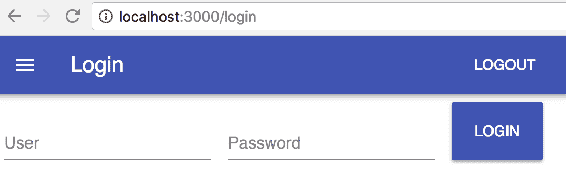

以下模拟用户作为 API 的一部分存在：

+   `user1`

+   `user2`

+   `user3`

+   `user4`

+   `user5`

实际上，密码并没有被验证，所以留空或输入胡言乱语都应该验证之前的任何用户。让我们来看一下呈现此页面的“登录”组件：

```jsx
import React, { Component } from 'react';

import { withStyles } from 'material-ui/styles';
import TextField from 'material-ui/TextField';
import Button from 'material-ui/Button';

import { login } from './api';

const styles = theme => ({
  container: {
    display: 'flex',
    flexWrap: 'wrap'
  },
  textField: {
    marginLeft: theme.spacing.unit,
    marginRight: theme.spacing.unit,
    width: 200
  },
  button: {
    margin: theme.spacing.unit
  }
});

class Login extends Component {
  state = {
    user: '',
    password: ''
  };

  onInputChange = name => event => {
    this.setState({
      [name]: event.target.value
    });
  };

  onLoginClick = () => {
    login(this.state).then(resp => {
      if (resp.status === 200) {
        this.props.history.push('/');
      }
    });
  };

  componentWillMount() {
    this.props.setTitle('Login');
  }

  render() {
    const { classes } = this.props;
    return (
      <div className={classes.container}>
        <TextField
          id="user"
          label="User"
          className={classes.textField}
          value={this.state.user}
          onChange={this.onInputChange('user')}
          margin="normal"
        />
        <TextField
          id="password"
          label="Password"
          className={classes.textField}
          value={this.state.password}
          onChange={this.onInputChange('password')}
          type="password"
          autoComplete="current-password"
          margin="normal"
        />
        <Button
          variant="raised"
          color="primary"
          className={classes.button}
          onClick={this.onLoginClick}
        >
          Login
        </Button>
      </div>
    );
  }
}
export default withStyles(styles)(Login);
```

这里有很多 Material-UI，但可以忽略大部分。重要的是从`api`模块导入的`login()`函数。这用于调用`/api/login`端点。从生产 React 部署的角度来看，这是相关的，因为这是与可能部署为自己的容器的服务进行交互。

# 主页

如果您能成功登录，您将被带到应用程序的主页。您应该看到一个看起来像这样的页面：

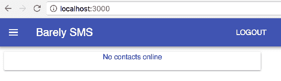

*Barely SMS*的主页显示了当前在线的用户联系人。在这种情况下，显然还没有其他用户在线。现在让我们来看一下“主页”组件的源代码：

```jsx
import React, { Component } from 'react';

import { withStyles } from 'material-ui/styles';
import Paper from 'material-ui/Paper';
import Avatar from 'material-ui/Avatar';
import IconButton from 'material-ui/IconButton';

import ContactMail from 'material-ui-icons/ContactMail';
import Message from 'material-ui-icons/Message';

import List, {
  ListItem,
  ListItemAvatar,
  ListItemText,
  ListItemSecondaryAction
} from 'material-ui/List';

import EmptyMessage from './EmptyMessage';
import { getContacts } from './api';

const styles = theme => ({
  root: {
    margin: '10px',
    width: '100%',
    maxWidth: 500,
    backgroundColor: theme.palette.background.paper
  }
});

class Home extends Component {
  state = {
    contacts: []
  };

  onMessageClick = id => () => {
    this.props.history.push(`/newmessage/${id}`);
  };

  componentWillMount() {
    const { setTitle, history } = this.props;

    setTitle('Barely SMS');

    const refresh = () =>
      getContacts().then(resp => {
        if (resp.status === 403) {
          history.push('/login');
        } else {
          resp.json().then(contacts => {
            this.setState({
              contacts: contacts.filter(contact => contact.online)
            });
          });
        }
      });

    this.refreshInterval = setInterval(refresh, 5000);
    refresh();
  }

  componentWillUnmount() {
    clearInterval(this.refreshInterval);
  }

  render() {
    const { classes } = this.props;
    const { contacts } = this.state;
    const { onMessageClick } = this;

    return (
      <Paper className={classes.root}>
        <EmptyMessage coll={contacts}>
          No contacts online
        </EmptyMessage>
        <List component="nav">
          {contacts.map(contact => (
            <ListItem key={contact.id}>
              <ListItemAvatar>
                <Avatar>
                  <ContactMail />
                </Avatar>
              </ListItemAvatar>
              <ListItemText primary={contact.name} />
              <ListItemSecondaryAction>
                <IconButton onClick={onMessageClick(contact.id)}>
                  <Message />
                </IconButton>
              </ListItemSecondaryAction>
            </ListItem>
          ))}
        </List>
      </Paper>
    );
  }
}

export default withStyles(styles)(Home);
```

在`componentWillMount()`生命周期方法中，使用`getContacts()`函数获取联系人 API 端点。然后使用间隔重复此操作，以便当您的联系人登录时，它们会显示在这里。当组件被卸载时，间隔被清除。

为了测试这一点，我将打开 Firefox（实际上使用哪个浏览器并不重要，只要它与您登录为`user1`的地方不同）。从这里，我可以登录为`user2`，这是`user1`的联系人，反之亦然：

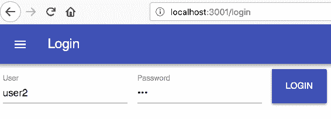

当我在这里第一次登录时，我看到用户 1 在另一个浏览器上线了：

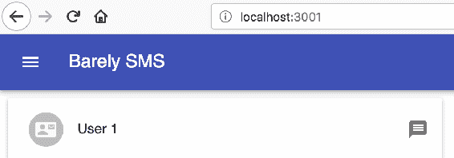

现在，如果我回到在 Chrome 中登录为用户 1 的地方，我应该看到我的用户 2 联系人已经登录：

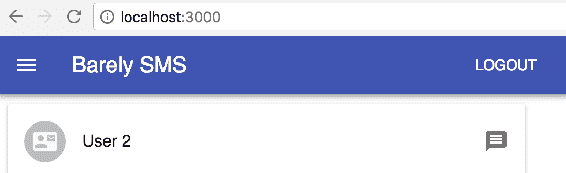

这个应用程序将在其他页面上遵循类似的刷新模式——使用间隔从 API 服务端点获取数据。

# 联系人页面

如果您想查看所有联系人，而不仅仅是当前在线的联系人，您必须转到联系人页面。要到达那里，您必须通过单击标题左侧的汉堡按钮展开导航菜单：

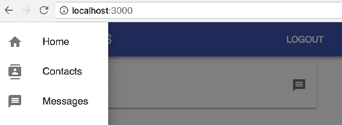

当您点击联系人链接时，您将进入看起来像这样的联系人页面：

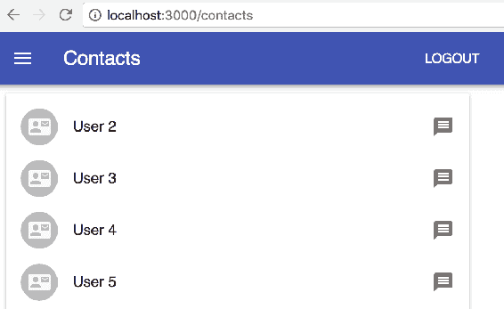

这个页面与主页非常相似，只是显示了所有联系人。您可以向任何用户发送消息，而不仅仅是当前在线的用户。让我们来看看`Contacts`组件：

```jsx
import React, { Component } from 'react';

import { withStyles } from 'material-ui/styles';
import Paper from 'material-ui/Paper';
import Avatar from 'material-ui/Avatar';
import IconButton from 'material-ui/IconButton';

import ContactMail from 'material-ui-icons/ContactMail';
import Message from 'material-ui-icons/Message';

import List, {
  ListItem,
  ListItemAvatar,
  ListItemText,
  ListItemSecondaryAction
} from 'material-ui/List';

import EmptyMessage from './EmptyMessage';
import { getContacts } from './api';

const styles = theme => ({
  root: {
    margin: '10px',
    width: '100%',
    maxWidth: 500,
    backgroundColor: theme.palette.background.paper
  }
});

class Contacts extends Component {
  state = {
    contacts: []
  };

  onMessageClick = id => () => {
    this.props.history.push(`/newmessage/${id}`);
  };

  componentWillMount() {
    const { setTitle, history } = this.props;

    setTitle('Contacts');

    const refresh = () =>
      getContacts().then(resp => {
        if (resp.status === 403) {
          history.push('/login');
        } else {
          resp.json().then(contacts => {
            this.setState({ contacts });
          });
        }
      });

    this.refreshInterval = setInterval(refresh, 5000);
    refresh();
  }

  componentWillUnmount() {
    clearInterval(this.refreshInterval);
  }

  render() {
    const { classes } = this.props;
    const { contacts } = this.state;
    const { onMessageClick } = this;

    return (
      <Paper className={classes.root}>
        <EmptyMessage coll={contacts}>No contacts</EmptyMessage>
        <List component="nav">
          {contacts.map(contact => (
            <ListItem key={contact.id}>
              <ListItemAvatar>
                <Avatar>
                  <ContactMail />
                </Avatar>
              </ListItemAvatar>
              <ListItemText primary={contact.name} />
              <ListItemSecondaryAction>
                <IconButton onClick={onMessageClick(contact.id)}>
                  <Message />
                </IconButton>
              </ListItemSecondaryAction>
            </ListItem>
          ))}
        </List>
      </Paper>
    );
  }
}

export default withStyles(styles)(Contacts);
```

像“主页”组件一样，“联系人”使用间隔模式来刷新联系人。例如，将来如果您想要在此页面上添加一个增强功能，以直观地指示哪些用户在线，您将需要从服务中获取最新数据。

# 消息页面

如果您展开导航菜单并访问消息页面，您会看到类似于这样的内容：

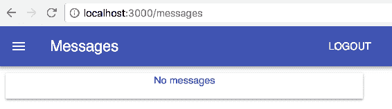

还没有消息。在发送消息之前，让我们看看`Messages`组件：

```jsx
import React, { Component } from 'react';
import moment from 'moment';
import { Link } from 'react-router-dom';

import { withStyles } from 'material-ui/styles';
import Paper from 'material-ui/Paper';
import Avatar from 'material-ui/Avatar';
import List, {
  ListItem,
  ListItemAvatar,
  ListItemText
} from 'material-ui/List';

import Message from 'material-ui-icons/Message';

import EmptyMessage from './EmptyMessage';
import { getMessages } from './api';

const styles = theme => ({
  root: {
    margin: '10px',
    width: '100%',
    maxWidth: 500,
    backgroundColor: theme.palette.background.paper
  }
});

class Messages extends Component {
  state = {
    messages: []
  };

  componentWillMount() {
    const { setTitle, history } = this.props;

    setTitle('Messages');

    const refresh = () =>
      getMessages().then(resp => {
        if (resp.status === 403) {
          history.push('/login');
        } else {
          resp.json().then(messages => {
            this.setState({
              messages: messages.map(message => ({
                ...message,
                duration: moment
                  .duration(new Date() - new Date(message.timestamp))
                  .humanize()
              }))
            });
          });
        }
      });

    this.refreshInterval = setInterval(refresh, 5000);
    refresh();
  }

  componentWillUnmount() {
    clearInterval(this.refreshInterval);
  }

  render() {
    const { classes } = this.props;
    const { messages } = this.state;

    return (
      <Paper className={classes.root}>
        <EmptyMessage coll={messages}>No messages</EmptyMessage>
        <List component="nav">
          {messages.map(message => (
            <ListItem
              key={message.id}
              component={Link}
              to={`/messages/${message.id}`}
            >
              <ListItemAvatar>
                <Avatar>
                  <Message />
                </Avatar>
              </ListItemAvatar>
              <ListItemText
                primary={message.fromName}
                secondary={`${message.duration} ago`}
              />
            </ListItem>
          ))}
        </List>
      </Paper>
    );
  }
}

export default withStyles(styles)(Messages);
```

同样，这里也使用了刷新数据的间隔模式。当用户点击其中一条消息时，他们将被带到消息详情页面，可以阅读消息内容。

# 发送消息

让我们回到另一个浏览器（在我这里是 Firefox），您以 User 2 身份登录。点击 User 1 旁边的小消息图标：


这将带您到新消息页面：

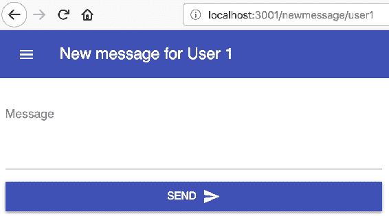

继续输入消息，然后点击发送。然后，回到 Chrome，您以 User 1 身份登录。您应该会在消息页面上看到来自 User 2 的新消息：

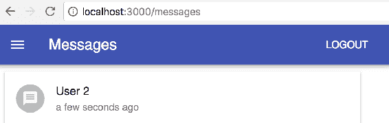

如果您点击消息，您应该能够阅读消息内容：

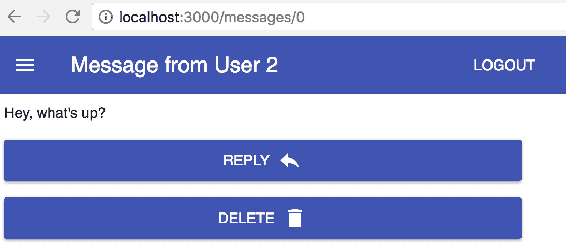

在这里，您可以点击“回复”按钮，带您到新消息页面，该页面将发送给 User 2，或者您可以删除消息。在我们查看 API 代码之前，让我们看看`NewMessage`组件：

```jsx
import React, { Component } from 'react';

import { withStyles } from 'material-ui/styles';
import Paper from 'material-ui/Paper';
import TextField from 'material-ui/TextField';
import Button from 'material-ui/Button';

import Send from 'material-ui-icons/Send';

import { getUser, postMessage } from './api';

const styles = theme => ({
  root: {
    display: 'flex',
    flexWrap: 'wrap',
    flexDirection: 'column'
  },
  textField: {
    marginLeft: theme.spacing.unit,
    marginRight: theme.spacing.unit,
    width: 500
  },
  button: {
    width: 500,
    margin: theme.spacing.unit
  },
  rightIcon: {
    marginLeft: theme.spacing.unit
  }
});

class NewMessage extends Component {
  state = {
    message: ''
  };

  onMessageChange = event => {
    this.setState({
      message: event.target.value
    });
  };

  onSendClick = () => {
    const { match: { params: { id } }, history } = this.props;
    const { message } = this.state;

    postMessage({ to: id, message }).then(() => {
      this.setState({ message: '' });
      history.push('/');
    });
  };

  componentWillMount() {
    const {
      match: { params: { id } },
      setTitle,
      history
    } = this.props;

    getUser(id).then(resp => {
      if (resp.status === 403) {
        history.push('/login');
      } else {
        resp.json().then(user => {
          setTitle(`New message for ${user.name}`);
        });
      }
    });
  }

  render() {
    const { classes } = this.props;
    const { message } = this.state;
    const { onMessageChange, onSendClick } = this;

    return (
      <Paper className={classes.root}>
        <TextField
          id="multiline-static"
          label="Message"
          multiline
          rows="4"
          className={classes.textField}
          margin="normal"
          value={message}
          onChange={onMessageChange}
        />
        <Button
          variant="raised"
          color="primary"
          className={classes.button}
          onClick={onSendClick}
        >
          Send
          <Send className={classes.rightIcon} />
        </Button>
      </Paper>
    );
  }
}

export default withStyles(styles)(NewMessage);
```

在这里，使用`postMessage()` API 函数来使用 API 服务发送消息。现在让我们看看`MessageDetails`组件：

```jsx
import React, { Component } from 'react'; 
import { Link } from 'react-router-dom'; 

import { withStyles } from 'material-ui/styles'; 
import Paper from 'material-ui/Paper'; 
import Button from 'material-ui/Button'; 
import Typography from 'material-ui/Typography'; 

import Delete from 'material-ui-icons/Delete'; 
import Reply from 'material-ui-icons/Reply'; 

import { getMessage, deleteMessage } from './api'; 

const styles = theme => ({ 
  root: { 
    display: 'flex', 
    flexWrap: 'wrap', 
    flexDirection: 'column' 
  }, 
  message: { 
    width: 500, 
    margin: theme.spacing.unit 
  }, 
  button: { 
    width: 500, 
    margin: theme.spacing.unit 
  }, 
  rightIcon: { 
    marginLeft: theme.spacing.unit 
  } 
}); 

class NewMessage extends Component { 
  state = { 
    message: {} 
  }; 

  onDeleteClick = () => { 
    const { history, match: { params: { id } } } = this.props; 

    deleteMessage(id).then(() => { 
      history.push('/messages'); 
    }); 
  }; 

  componentWillMount() { 
    const { 
      match: { params: { id } }, 
      setTitle, 
      history 
    } = this.props; 

    getMessage(id).then(resp => { 
      if (resp.status === 403) { 
        history.push('/login'); 
      } else { 
        resp.json().then(message => { 
          setTitle(`Message from ${message.fromName}`); 
          this.setState({ message }); 
        }); 
      } 
    }); 
  } 

  render() { 
    const { classes } = this.props; 
    const { message } = this.state; 
    const { onDeleteClick } = this; 

    return ( 
      <Paper className={classes.root}> 
        <Typography className={classes.message}> 
          {message.message} 
        </Typography> 
        <Button 
          variant="raised" 
          color="primary" 
          className={classes.button} 
          component={Link} 
          to={`/newmessage/${message.from}`} 
        > 
          Reply 
          <Reply className={classes.rightIcon} /> 
        </Button> 
        <Button 
          variant="raised" 
          color="primary" 
          className={classes.button} 
          onClick={onDeleteClick} 
        > 
          Delete 
          <Delete className={classes.rightIcon} /> 
        </Button> 
      </Paper> 
    ); 
  } 
} 

export default withStyles(styles)(NewMessage); 
```

在这里，使用`getMessage()` API 函数来加载消息内容。请注意，这两个组件都没有使用其他组件一直在使用的刷新模式，因为信息从不改变。

# API

API 是您的 React 应用与之交互以检索和操作数据的服务。在考虑部署生产 React 应用程序时，重要的是使用 API 作为抽象，它不仅代表一个服务，还可能代表应用程序与之交互的多个微服务。

说到这里，让我们来看看您的 React 组件使用的 API 函数，这些组件组成了*Barely SMS*：

```jsx
export const login = body => 
  fetch('/api/login', { 
    method: 'post', 
    headers: { 'Content-Type': 'application/json' }, 
    body: JSON.stringify(body), 
    credentials: 'same-origin' 
  }); 

export const logout = user => 
  fetch('/api/logout', { 
    method: 'post', 
    credentials: 'same-origin' 
  }); 

export const getUser = id => 
  fetch(`/api/user/${id}`, { credentials: 'same-origin' }); 

export const getContacts = () => 
  fetch('/api/contacts', { credentials: 'same-origin' }); 

export const getMessages = () => 
  fetch('/api/messages', { credentials: 'same-origin' }); 

export const getMessage = id => 
  fetch(`/api/message/${id}`, { credentials: 'same-origin' }); 

export const postMessage = body => 
  fetch('/api/messages', { 
    method: 'post', 
    headers: { 'Content-Type': 'application/json' }, 
    body: JSON.stringify(body), 
    credentials: 'same-origin' 
  });

export const deleteMessage = id => 
  fetch(`/api/message/${id}`, { 
    method: 'delete', 
    credentials: 'same-origin' 
  }); 
```

这些简单的抽象使用`fetch()`来向 API 服务发出 HTTP 请求。目前，只有一个 API 服务作为单个进程运行，其中包含模拟用户数据，并且所有更改仅在内存中发生，不会持久保存：

```jsx
const express = require('express'); 
const bodyParser = require('body-parser'); 
const cookieParser = require('cookie-parser'); 

const sessions = []; 
const messages = []; 
const users = { 
  user1: { 
    name: 'User 1', 
    contacts: ['user2', 'user3', 'user4', 'user5'], 
    online: false 
  }, 
  user2: { 
    name: 'User 2', 
    contacts: ['user1', 'user3', 'user4', 'user5'], 
    online: false 
  }, 
  user3: { 
    name: 'User 3', 
    contacts: ['user1', 'user2', 'user4', 'user5'], 
    online: false 
  }, 
  user4: { 
    name: 'User 4', 
    contacts: ['user1', 'user2', 'user3', 'user5'], 
    online: false 
  }, 
  user5: { 
    name: 'User 5', 
    contacts: ['user1', 'user2', 'user3', 'user4'] 
  } 
}; 

const authenticate = (req, res, next) => { 
  if (!sessions.includes(req.cookies.session)) { 
    res.status(403).end(); 
  } else { 
    next(); 
  } 
}; 

const app = express(); 
app.use(cookieParser()); 
app.use(bodyParser.json()); 
app.use(bodyParser.urlencoded({ extended: true })); 

app.post('/api/login', (req, res) => { 
  const { user } = req.body; 

  if (users.hasOwnProperty(user)) { 
    sessions.push(user); 
    users[user].online = true; 
    res.cookie('session', user); 
    res.end(); 
  } else { 
    res.status(403).end(); 
  } 
}); 

app.post('/api/logout', (req, res) => { 
  const { session } = req.cookies; 
  const index = sessions.indexOf(session); 

  sessions.splice(index, 1); 
  users[session].online = false; 

  res.clearCookie('session'); 
  res.status(200).end(); 
}); 

app.get('/api/user/:id', authenticate, (req, res) => { 
  res.json(users[req.params.id]); 
}); 

app.get('/api/contacts', authenticate, (req, res) => { 
  res.json( 
    users[req.cookies.session].contacts.map(id => ({ 
      id, 
      name: users[id].name, 
      online: users[id].online 
    })) 
  ); 
}); 

app.post('/api/messages', authenticate, (req, res) => { 
  messages.push({ 
    from: req.cookies.session, 
    fromName: users[req.cookies.session].name, 
    to: req.body.to, 
    message: req.body.message, 
    timestamp: new Date() 
  }); 

  res.status(201).end(); 
}); 

app.get('/api/messages', authenticate, (req, res) => { 
  res.json( 
    messages 
      .map((message, id) => ({ ...message, id })) 
      .filter(message => message.to === req.cookies.session) 
  ); 
}); 

app.get('/api/message/:id', authenticate, (req, res) => { 
  const { params: { id } } = req; 
  res.json({ ...messages[id], id }); 
}); 

app.delete('/api/message/:id', authenticate, (req, res) => { 
  messages.splice(req.params.id, 1); 
  res.status(200).end(); 
}); 

app.listen(3001, () => 
  console.log('API server listening on port 3001!') 
);
```

这是一个 Express 应用程序，它将应用程序数据保存在简单的 JavaScript 对象和数组中。虽然现在所有事情都发生在这一个服务中，但情况可能并非总是如此。其中一些 API 调用可能存在于不同的服务中。这就是将部署到容器如此强大的原因——您可以在高级别上抽象复杂的部署。

# 开始使用 Node 容器

让我们首先通过在 Node.js Docker 镜像中运行*Barely SMS* React 开发服务器来开始。请注意，这不是生产部署的一部分。这只是一个起点，让您熟悉部署 Docker 容器。随着本章剩余部分的进行，您将逐渐向生产级部署迈进。

将 React 应用程序放入容器的第一步是创建一个`Dockerfile`。如果您的系统尚未安装 Docker，请在此处找到安装说明：[`www.docker.com/community-edition`](https://www.docker.com/community-edition)。如果您打开终端并切换到`getting-started-with-containers`目录，您将看到一个名为`Dockerfile`的文件。它看起来是这样的：

```jsx
FROM node:alpine
WORKDIR /usr/src/app
COPY package*.json ./
RUN npm install
COPY . .
EXPOSE 3000
CMD [ "npm", "start" ]
```

这是用于构建镜像的文件。镜像就像是运行 React 应用程序的容器进程的模板。基本上，这些行执行以下操作：

+   `FROM node:alpine`：这个镜像使用的基础镜像是什么。这是一个带有 Node.js 的小型 Linux 版本。

+   `WORKDIR /usr/src/app`：更改容器上的工作目录。

+   `COPY package*.json ./`：将`package.json`和`package-lock.json`复制到容器中。

+   `RUN npm install`：在容器上安装 npm 包依赖项。

+   `COPY . .`：将您的应用程序的源代码复制到容器中。

+   `EXPOSE 3000`：在容器运行时暴露端口`3000`。

+   `CMD [ "npm", "start" ]`：容器启动时运行`npm start`。

接下来要添加的文件是`.dockerignore`文件。此文件列出了您不希望通过`COPY`命令包含在镜像中的所有内容。它看起来像这样：

```jsx
node_modules
npm-debug.log
```

重要的是，您不要复制您在系统上安装的`npm_modules`，因为`npm install`命令将再次安装它们，您将拥有两份库的副本。

在构建可以部署的 Docker 镜像之前，有一些小的更改需要进行。首先，您需要弄清楚您的 IP 地址，以便您可以用它与 API 服务器进行通信。您可以通过在终端中运行`ifconfig`来找到它。一旦您找到了它，您可以更新`package.json`中的`proxy`值。以前是这样的：

```jsx
http://localhost:3001
```

现在它应该有一个 IP 地址，以便您的 Docker 容器在运行时可以访问它。这是我的现在的样子：

```jsx
http://192.168.86.237:3001
```

接下来，您需要将您的 IP 作为参数传递给`server.js`中的`listen()`方法。以前是这样的：

```jsx
app.listen(3001, () => 
  console.log('API server listening on port 3001!') 
); 
```

这是我的现在的样子：

```jsx
app.listen(3001, '192.168.86.237', () => 
  console.log('API server listening on port 3001!') 
); 
```

现在您可以通过运行以下命令来构建 Docker 镜像：

```jsx
docker build -t barely-sms-ui . 
```

这将使用当前目录中找到的`Dockerfile`构建一个 ID 为`barely-sms-ui`的镜像。构建完成后，您可以通过运行`docker images`来查看镜像。输出应该类似于这样：

```jsx
REPOSITORY       TAG      IMAGE ID       CREATED       SIZE
barely-sms-ui    latest   b1526915598d   7 hours ago   267MB
```

现在您可以使用以下命令部署容器：

```jsx
docker run -p 3000:3000 barely-sms-ui
```

要清理旧的未使用的容器，您可以运行以下命令：

```jsx
docker system prune
```

`-p 3000:3000`参数确保容器上的暴露端口`3000`映射到您系统上的端口`3000`。您可以通过打开`http://localhost:3000/`来测试这一点。但是，您可能会看到类似于这样的错误：

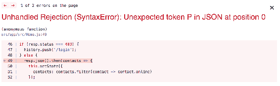

如果您查看容器控制台输出，您将看到类似以下的内容：

```jsx
    Proxy error: Could not proxy request /api/contacts from localhost:3000 to http://192.168.86.237:3001.
    See https://nodejs.org/api/errors.html#errors_common_system_errors for more information (ECONNREFUSED).
```

这是因为您还没有启动 API 服务器。如果您将无效的 IP 地址作为代理地址，您实际上会看到类似的错误。如果您需要更改代理值，您将需要重新构建镜像，然后重新启动容器。如果您在另一个终端中运行`npm run api`来启动 API，然后重新加载 UI，一切应该按预期工作。

# 使用服务构建 React 应用

前一部分的主要挑战是，你有一个作为运行容器的用户界面服务。另一方面，API 服务正在做自己的事情。你将学习如何使用的下一个工具是`docker-compose`。顾名思义，`docker-compose`是用来将较小的服务组合成较大应用程序的工具。*Barely SMS*的下一个自然步骤是使用这个 Docker 工具来制作 API 服务，并将两个服务作为一个应用程序进行控制。

这一次，我们需要两个`Dockerfile`文件。你可以重用前面部分的`Dockerfile`，只需将其重命名为`Dockerfile.ui`。然后，创建另一个几乎相同的`Dockerfile`，将其命名为`Dockerfile.api`并给它以下内容：

```jsx
FROM node:alpine
WORKDIR /usr/src/app
COPY package*.json ./
RUN npm install
COPY . .
EXPOSE 3001
CMD [ "npm", "run", "api" ]
```

两个不同之处是`EXPOSE`端口值和运行的`CMD`。这个命令启动 API 服务器而不是 React 开发服务器。

在构建镜像之前，`server.js`和`package.js`文件需要进行轻微调整。在`package.json`中，代理可以简单地指向`http://api:3001`。在`server.js`中，确保你不再向`listen()`传递特定的 IP 地址。

```jsx
app.listen(3001, () => 
  console.log('API server listening on port 3001!') 
); 
```

构建这两个镜像也需要进行轻微修改，因为你不再使用标准的`Dockerfile`名称。以下是构建 UI 镜像的方法：

```jsx
docker build -f Dockerfile.ui -t barely-sms-ui . 
```

然后，构建 API 镜像：

```jsx
docker build -f Dockerfile.api -t barely-sms-api .
```

在这一点上，你已经准备好创建一个`docker-compose.yml`。这是你在调用时声明`docker-compose`工具应该做什么的方式。它看起来像这样：

```jsx
api:
  image: barely-sms-api
  expose:
    - 3001
  ports:
    - "3001:3001"

ui:
  image: barely-sms-ui
  expose:
    - 3000
  links:
    - api
  ports:
    - "3000:3000"
```

正如你所看到的，这个 YAML 标记分为两个服务。首先是`api`服务，它指向`barely-sms-api`镜像并相应地映射端口。然后是`ui`服务，它做同样的事情，只是它指向`barely-sms-ui`镜像并映射到不同的端口。它还链接到 API 服务，因为你希望在任何浏览器中加载 UI 之前确保 API 服务可用。

要启动服务，你可以运行以下命令：

```jsx
docker-compose up
```

然后，您应该在控制台中看到来自两个服务的日志。然后，如果您访问`http://localhost:3000/`，您应该能够像往常一样使用*Barely SMS*，只是这一次，一切都是自包含的。从这一点开始，您将更有可能根据需求发展您的应用程序。必要时，您可以添加新的服务，并让您的 React 组件与它们通信，就像它们都在与同一个应用程序交谈一样，同时保持服务的模块化和自包含性。

# 生产环境的静态 React 构建

使*Barely SMS*准备好进行生产部署的最后一步是从 UI 服务中删除 React 开发服务器。开发服务器从未被用于生产环境，因为它有许多部分可以帮助开发人员，但最终会减慢整体用户体验，并且在生产环境中没有位置。

您可以使用一个简单的 NGINX HTTP 服务器来代替基于 Node.js 的镜像，该服务器提供静态内容。由于这是一个生产环境，您不需要一个能够即时构建 UI 资产的开发服务器，您可以只使用`create-react-app`构建脚本来构建 NGINX 要提供的静态构件：

```jsx
npm run build
```

然后，您可以更改`Dockerfile.ui`文件，使其看起来像这样：

```jsx
FROM nginx:alpine 
EXPOSE 3000 
COPY nginx.conf /etc/nginx/nginx.conf 
COPY build /data/www 
CMD ["nginx", "-g", "daemon off;"] 
```

这次，镜像是基于一个提供静态内容的 NGINX 服务器，并且我们传递了一个`nginx.conf`文件。这是它的样子：

```jsx
worker_processes 2; 

events { 
  worker_connections 2048; 
} 

http { 
  upstream service_api { 
    server api:3001; 
  } 

  server { 
    location / { 
      root /data/www; 
      try_files $uri /index.html; 
    } 

    location /api { 
      proxy_pass http://service_api; 
    } 
  } 
} 
```

在这里，您可以对 HTTP 请求发送的位置进行精细级别的控制。例如，如果`/api/login`和`/api/logout`端点被移动到它们自己的服务中，您可以在这里控制这个变化，而不必重新构建 UI 图像。

需要做的最后一个变化是`docker-compose.yml`：

```jsx
api: 
  image: barely-sms-api 
  expose: 
    - 3001 
  ports: 
    - "3001:3001" 

ui: 
  image: barely-sms-ui 
  expose: 
    - 80 
  links: 
    - api 
  ports: 
    - "3000:80" 
```

您是否注意到端口`3000`现在映射到`ui`服务中的端口`80`？这是因为 NGINX 在端口`80`上提供服务。如果您运行`docker-compose up`，您应该能够访问`http://localhost:3000/`并与您的静态构建进行交互。

恭喜！没有了 React 开发服务器，您几乎可以从构建工具的角度准备好进行生产。

# 总结

在这一章中，您构建了一个名为“Barely SMS”的简单消息应用程序。然后，您学习了如何将此应用程序部署为 Docker 容器。接着，您学习了如何将服务打包在一起，包括 UI 服务，这样在部署具有许多移动部分的应用程序时，您就有了更高级的抽象层来处理。最后，您学习了如何构建生产就绪的静态资产，并使用工业级的 HTTP 服务器 NGINX 来提供它们。

我希望这是一次启发性的阅读。写作既是挑战，也是快乐。在过去的十年里，Web 开发中的工具应该不应该像它一样困难。像 React 这样的项目和 Chrome 等浏览器供应商开始改变这一趋势。我相信任何技术都取决于其工具。现在您对 React 生态系统中可用的工具有了牢固的掌握，将其充分利用，并让它为您做艰苦的工作。
