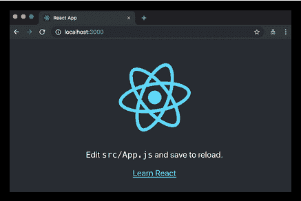
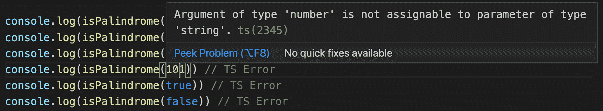
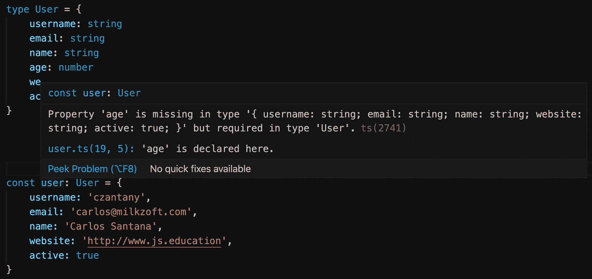
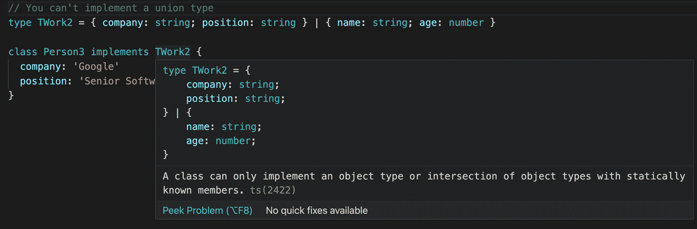

# 第一章：用 React 迈出第一步

你好，读者们！

本书假定您已经知道 React 是什么以及它可以为您解决什么问题。您可能已经用 React 编写了一个小/中型应用程序，并且希望提高自己的技能并回答所有未解决的问题。您应该知道 React 由 Facebook 的开发人员和 JavaScript 社区内的数百名贡献者维护。React 是创建 UI 的最受欢迎的库之一，由于其与**文档对象模型**（**DOM**）的智能工作方式而闻名。它带有 JSX，这是一种在 JavaScript 中编写标记的新语法，这需要您改变有关关注点分离的思维。它具有许多很酷的功能，例如服务器端渲染，这使您有能力编写通用应用程序。

在本章中，我们将介绍一些基本概念，这些概念对于有效使用 React 至关重要，但对于初学者来说也足够简单易懂：

+   命令式编程和声明式编程之间的区别

+   React 组件及其实例，以及 React 如何使用元素来控制 UI 流程

+   React 如何改变了我们构建 Web 应用程序的方式，强制执行了一种不同的关注点分离的新概念，以及其不受欢迎设计选择背后的原因

+   为什么人们感到 JavaScript 疲劳，以及在接近 React 生态系统时开发人员常犯的最常见错误，您可以做些什么来避免这些错误

+   TypeScript 如何改变了游戏

# 技术要求

为了遵循本书，您需要具有一些使用终端运行几个 Unix 命令的最小经验。此外，您需要安装 Node.js。您有两个选项。第一个是直接从官方网站[`nodejs.org`](https://nodejs.org)下载 Node.js，第二个选项（推荐）是从[`github.com/nvm-sh/nvm`](https://github.com/nvm-sh/nvm)安装**Node Version Manager**（**NVM**）。

如果您决定使用 NVM，您可以安装任何您想要的 Node.js 版本，并使用`nvm install`命令切换版本：

```jsx
# "node" is an alias for the latest version:
nvm install node

# You can also install a global version of node (will install the latest from that version):
nvm install 10
nvm install 9
nvm install 8
nvm install 7
nvm install 6

# Or you can install a very specific version:
nvm install 6.14.3
```

安装了不同版本后，您可以使用`nvm use`命令切换它们：

```jsx
nvm use node # for latest version
nvm use 10
nvm use 6.14.3
```

最后，您可以通过运行以下命令指定默认的`node`版本：

```jsx
nvm alias default node
nvm alias default 10
nvm alias default 6.14.3
```

简而言之，以下是完成本章所需的要求列表：

+   **Node.js (12+)**: [`nodejs.org`](https://nodejs.org)

+   **NVM**：[`github.com/nvm-sh/nvm`](https://github.com/nvm-sh/nvm)

+   **VS Code**：[`code.visualstudio.com`](https://code.visualstudio.com)

+   **TypeScript**：[`www.npmjs.com/package/typescript`](https://www.npmjs.com/package/typescript)

您可以在本书的 GitHub 存储库中找到本章的代码：[`github.com/PacktPublishing/React-17-Design-Patterns-and-Best-Practices-Third-Edition`](https://github.com/PacktPublishing/React-17-Design-Patterns-and-Best-Practices-Third-Edition)。

# 区分声明性和命令式编程

当阅读 React 文档或关于 React 的博文时，你肯定会遇到“**声明性**”这个术语。React 之所以如此强大的原因之一是它强制执行声明性编程范式。

因此，要精通 React，了解声明性编程的含义以及命令式和声明式编程之间的主要区别是至关重要的。最简单的方法是将命令式编程视为描述事物如何工作的方式，将声明式编程视为描述你想要实现的方式。

进入酒吧喝啤酒是命令式世界中的一个现实例子，通常你会给酒吧员以下指示：

1.  找一个玻璃杯并从架子上拿下来。

1.  把玻璃杯放在龙头下面。

1.  拉下把手直到玻璃杯满了。

1.  递给我玻璃杯。

在声明性世界中，你只需要说“我可以要一杯啤酒吗？”

声明性方法假设酒吧员已经知道如何倒啤酒，这是声明性编程工作方式的一个重要方面。

让我们来看一个 JavaScript 的例子。在这里，我们将编写一个简单的函数，给定一个小写字符串数组，返回一个相同字符串的大写数组：

```jsx
toUpperCase(['foo', 'bar']) // ['FOO', 'BAR']
```

解决问题的命令式函数将实现如下：

```jsx
const toUpperCase = input => { 
  const output = []

  for (let i = 0; i < input.length; i++) { 
    output.push(input[i].toUpperCase())
  } 

  return output
}
```

首先，创建一个空数组来包含结果。然后，函数循环遍历输入数组的所有元素，并将大写值推入空数组中。最后，返回输出数组。

声明性解决方案如下：

```jsx
const toUpperCase = input => input.map(value => value.toUpperCase())
```

输入数组的项目被传递给一个`map`函数，该函数返回一个包含大写值的新数组。有一些重要的区别需要注意：前面的例子不够优雅，需要更多的努力才能理解。后者更简洁，更易读，在大型代码库中会产生巨大的差异，可维护性至关重要。

另一个值得一提的方面是，在声明式的例子中，无需使用变量，也无需在执行过程中更新它们的值。声明式编程倾向于避免创建和改变状态。

最后一个例子，让我们看看 React 作为声明式的含义。我们将尝试解决的问题是 Web 开发中的常见任务：创建一个切换按钮。

想象一个简单的 UI 组件，比如一个切换按钮。当您点击它时，如果之前是灰色（关闭），它会变成绿色（打开），如果之前是绿色（打开），它会变成灰色（关闭）。

这样做的命令式方式如下：

```jsx
const toggleButton = document.querySelector('#toggle')

toogleButton.addEventListener('click', () => {
  if (toggleButton.classList.contains('on')) {
    toggleButton.classList.remove('on')
    toggleButton.classList.add('off')
  } else {
    toggleButton.classList.remove('off')
    toggleButton.classList.add('on')
  }
})
```

由于需要改变类的所有指令，这是命令式的。相比之下，使用 React 的声明式方法如下：

```jsx
// To turn on the Toggle
<Toggle on />

// To turn off the toggle
<Toggle />
```

在声明式编程中，开发人员只描述他们想要实现的内容，无需列出所有步骤来使其工作。React 提供声明式方法使其易于使用，因此生成的代码简单，通常会导致更少的错误和更易维护性。

在下一节中，您将了解 React 元素的工作原理，并且将更多地了解`props`如何在 React 组件中传递。

# React 元素的工作原理

本书假设您熟悉组件及其实例，但如果您想有效地使用 React，还有另一个对象您应该了解——元素。

每当您调用`createClass`，扩展`Component`或声明一个无状态函数时，您都在创建一个组件。React 在运行时管理所有组件的实例，并且在给定时间点内可以存在同一组件的多个实例。

如前所述，React 遵循声明式范式，无需告诉它如何与 DOM 交互；您声明要在屏幕上看到什么，React 会为您完成这项工作。

正如你可能已经经历过的那样，大多数其他 UI 库的工作方式正好相反：它们将保持界面更新的责任留给开发人员，开发人员必须手动管理 DOM 元素的创建和销毁。

为了控制 UI 流程，React 使用一种特殊类型的对象，称为**元素**，它描述了在屏幕上显示什么。这些不可变的对象与组件及其实例相比要简单得多，并且只包含严格需要表示界面的信息。

以下是一个元素的示例：

```jsx
  { 
    type: Title, 
    props: { 
      color: 'red', 
      children: 'Hello, Title!' 
    } 
  }
```

元素有`type`，这是最重要的属性，还有一些属性。还有一个特殊的属性，称为`children`，它是可选的，代表元素的直接后代。

`type`很重要，因为它告诉 React 如何处理元素本身。如果`type`是一个字符串，那么该元素代表一个 DOM 节点，而如果`type`是一个函数，那么该元素是一个组件。

DOM 元素和组件可以相互嵌套，以表示渲染树：

```jsx
  { 
    type: Title, 
    props: { 
      color: 'red', 
      children: { 
        type: 'h1', 
        props: { 
          children: 'Hello, H1!' 
        } 
      } 
    } 
  }
```

当元素的类型是一个函数时，React 调用该函数，传递`props`以获取底层元素。它继续对结果进行相同的递归操作，直到获得一个 DOM 节点树，React 可以在屏幕上渲染。这个过程称为**协调**，它被 React DOM 和 React Native 用来创建各自平台的 UI。

React 是一个改变游戏规则的技术，所以一开始，React 的语法可能对你来说很奇怪，但一旦你理解了它的工作原理，你会喜欢它，为此，你需要忘掉你到目前为止所知道的一切。

# 忘掉一切

第一次使用 React 通常需要开放的思维，因为这是一种设计 Web 和移动应用程序的新方式。React 试图创新我们构建 UI 的方式，打破了大多数众所周知的最佳实践。

在过去的二十年里，我们学到了关注点的分离是重要的，并且我们曾经认为这是将逻辑与模板分离。我们的目标一直是将 JavaScript 和 HTML 写在不同的文件中。已经创建了各种模板解决方案来帮助开发人员实现这一目标。

问题是，大多数时候，这种分离只是一种幻觉，事实上 JavaScript 和 HTML 是紧密耦合的，无论它们在哪里。

让我们看一个模板的例子：

```jsx
{{#items}} 
  {{#first}} 
    <li><strong>{{name}}</strong></li> 
  {{/first}} 
 {{#link}} 
    <li><a href="{{url}}">{{name}}</a></li> 
  {{/link}} 
{{/items}}
```

前面的片段摘自 Mustache 网站，这是最流行的模板系统之一。

第一行告诉 Mustache 循环遍历一组项目。在循环内部，有一些条件逻辑来检查`＃first`和`＃link`属性是否存在，并根据它们的值呈现不同的 HTML 片段。变量用花括号括起来。

如果您的应用程序只需要显示一些变量，模板库可能是一个很好的解决方案，但当涉及开始处理复杂的数据结构时，情况就会改变。模板系统及其**特定领域语言**（**DSL**）提供了一组功能，并试图提供一个真正编程语言的功能，但没有达到相同的完整性水平。正如示例所示，模板高度依赖于它们从逻辑层接收的模型来显示信息。

另一方面，JavaScript 与模板呈现的 DOM 元素进行交互，以更新 UI，即使它们是从不同的文件加载的。同样的问题也适用于样式 - 它们在不同的文件中定义，但在模板中引用，并且 CSS 选择器遵循标记的结构，因此几乎不可能更改一个而不破坏另一个，这就是**耦合**的定义。这就是为什么经典的关注点分离最终更多地成为技术分离，这当然不是一件坏事，但它并没有解决任何真正的问题。

React 试图向前迈进一步，将模板放在它们应该在的地方 - 靠近逻辑。它这样做的原因是，React 建议您通过组合称为组件的小模块来组织应用程序。框架不应告诉您如何分离关注点，因为每个应用程序都有自己的关注点，只有开发人员应该决定如何限制其应用程序的边界。

基于组件的方法彻底改变了我们编写 Web 应用程序的方式，这就是为什么传统的关注点分离概念逐渐被更现代的结构所取代的原因。React 强制执行的范式并不新鲜，也不是由其创作者发明的，但 React 已经促使这个概念变得更加流行，并且最重要的是，使其更容易被不同水平的开发人员理解。

渲染 React 组件看起来像这样：

```jsx
return ( 
  <button style={{ color: 'red' }} onClick={this.handleClick}> 
    Click me! 
  </button> 
)
```

我们都同意，开始时似乎有点奇怪，但那只是因为我们不习惯那种语法。一旦我们学会了它，意识到它有多么强大，我们就能理解它的潜力。在逻辑和模板中使用 JavaScript 不仅有助于更好地分离我们的关注点，而且还赋予我们更多的权力和更多的表现力，这正是我们构建复杂 UI 所需要的。

这就是为什么即使在开始时混合 JavaScript 和 HTML 的想法听起来很奇怪，但至关重要的是给 React 5 分钟。开始使用新技术的最佳方法是在一个小的副项目上尝试并看看效果如何。总的来说，正确的方法始终是准备好忘掉一切，如果长期利益值得的话，改变你的思维方式。

还有一个概念是相当有争议的，也很难接受，那就是 React 背后的工程师们试图向社区推动的：也将样式逻辑移至组件内部。最终目标是封装用于创建我们组件的每个单一技术，并根据其领域和功能分离关注点。

这是一个从 React 文档中提取的样式对象的示例：

```jsx
const divStyle = { 
  color: 'white', 
  backgroundImage: `url(${imgUrl})`, 
  WebkitTransition: 'all', // note the capital 'W' here 
  msTransition: 'all' // 'ms' is the only lowercase vendor prefix 
}

ReactDOM.render(<div style={divStyle}>Hello World!</div>, mountNode)
```

这套解决方案中，开发人员使用 JavaScript 来编写他们的样式，被称为`#CSSinJS`，我们将在*第八章《让您的组件看起来美丽》*中对此进行广泛讨论。

在接下来的部分中，我们将看到如何避免 JavaScript 疲劳，这是由运行 React 应用程序所需的大量配置（主要是 webpack）引起的。

# 理解 JavaScript 疲劳

有一种普遍的观点认为，React 由大量的技术和工具组成，如果你想使用它，就不得不处理包管理器、转译器、模块捆绑器和无限的不同库列表。这个想法是如此普遍并且在人们中间共享，以至于它已经被明确定义，并被命名为**JavaScript 疲劳**。

理解这背后的原因并不难。React 生态系统中的所有存储库和库都是使用全新的技术、最新版本的 JavaScript 和最先进的技术和范例制作的。

此外，在 GitHub 上有大量的 React 样板，每个样板都有数十个依赖项，以解决任何问题。很容易认为启动使用 React 需要所有这些工具，但事实远非如此。尽管有这种常见的思维方式，React 是一个非常小的库，可以像以前使用 jQuery 或 Backbone 一样在任何页面（甚至在 JSFiddle 中）使用，只需在页面中包含脚本即可。

有两个脚本是因为 React 被分成了两个包：

+   `react`：实现了库的核心功能

+   `react-dom`：包含所有与浏览器相关的功能

这背后的原因是核心包用于支持不同的目标，比如浏览器中的 React DOM 和移动设备上的 React Native。在单个 HTML 页面中运行 React 应用程序不需要任何包管理器或复杂的操作。您只需下载分发包并自行托管（或使用[`unpkg.com/`](https://unpkg.com/)），就可以在几分钟内开始使用 React 及其功能。

以下是在 HTML 中包含的 URL，以开始使用 React：

+   [`unpkg.com/react@17.0.1/umd/react.production.min.js`](https://unpkg.com/react@17.0.1/umd/react.production.min.js)

+   [`unpkg.com/react-dom@17.0.1/umd/react-dom.production.min.js`](https://unpkg.com/react-dom@17.0.1/umd/react-dom.production.min.js)

如果我们只添加核心 React 库，我们无法使用 JSX，因为它不是浏览器支持的标准语言；但整个重点是从最少的功能集开始，并在需要时添加更多功能。对于简单的 UI，我们可以只使用`createElement`（在 React 17 中为`_jsx`），只有当我们开始构建更复杂的东西时，才能包含转译器以启用 JSX 并将其转换为 JavaScript。一旦应用程序稍微增长，我们可能需要一个路由器来处理不同的页面和视图，我们也可以包含它。

在某些时候，我们可能想要从一些 API 端点加载数据，如果应用程序不断增长，我们将达到需要一些外部依赖来抽象复杂操作的地步。只有在那个时刻，我们才应该引入一个包管理器。然后，到了分离我们的应用程序为单独模块并以正确方式组织我们的文件的时候。在那时，我们应该开始考虑使用模块捆绑器。

遵循这种简单的方法，就不会感到疲劳。从具有 100 个依赖项和数十个我们一无所知的`npm`包的样板开始是迷失的最佳方式。重要的是要注意，每个与编程相关的工作（特别是前端工程）都需要不断学习。网络以惊人的速度发展并根据用户和开发人员的需求进行变化，这是我们的环境自始至终的工作方式，也是使其非常令人兴奋的原因。

随着我们在网络上工作的经验增加，我们学会了不能掌握一切，我们应该找到保持自己更新的正确方法以避免疲劳。我们能够跟上所有新趋势，而不是为了新库而跳进去，除非我们有时间做一个副业项目。

令人惊讶的是，在 JavaScript 世界中，一旦规范被宣布或起草，社区中就会有人将其实现为转译器插件或填充物，让其他人可以在浏览器供应商同意并开始支持之前使用它。

这是使 JavaScript 和浏览器与任何其他语言或平台完全不同的东西。它的缺点是事物变化很快，但只是要找到押注新技术与保持安全之间的正确平衡。

无论如何，Facebook 的开发人员非常关心**开发者体验**（**DX**），他们仔细倾听社区的意见。因此，即使使用 React 并不需要学习数百种不同的工具，他们意识到人们感到疲劳，于是发布了一个 CLI 工具，使创建和运行真正的 React 应用程序变得非常容易。

唯一的要求是使用`node.js/npm`环境，并全局安装 CLI 工具，如下所示：

```jsx
npm install -g create-react-app
```

当可执行文件安装后，我们可以使用它来创建我们的应用程序，传递一个文件夹名称：

```jsx
create-react-app hello-world --template typescript
```

最后，我们进入我们应用程序的文件夹`cd hello-world`，然后运行以下命令：

```jsx
npm start
```

神奇的是，我们的应用程序只依赖一个依赖项，但具有构建完整 React 应用程序所需的所有功能。以下截图显示了使用`create-react-app`创建的应用程序的默认页面：



这基本上就是您的第一个 React 应用程序。

# 介绍 TypeScript

**TypeScript**是 JavaScript 的一个有类型的超集，它被编译成 JavaScript，这意味着**TypeScript**是带有一些额外功能的**JavaScript**。TypeScript 是由微软的 Anders Hejlsberg（C#的设计者）设计的，并且是开源的。

让我们看看 TypeScript 的特性以及如何将 JavaScript 转换为 TypeScript。

## TypeScript 特性

本节将尝试总结您应该利用的最重要的特性：

+   **TypeScript 就是 JavaScript**：您编写的任何 JavaScript 代码都将与 TypeScript 一起工作，这意味着如果您已经知道如何基本使用 JavaScript，您基本上已经具备了使用 TypeScript 所需的一切；您只需要学习如何向代码添加类型。最终，所有 TypeScript 代码都会转换为 JavaScript。

+   **JavaScript 就是 TypeScript**：这意味着您可以将任何有效的`.js`文件重命名为`.ts`扩展名，它将可以工作。

+   **错误检查**：TypeScript 编译代码并检查错误，这有助于在运行代码之前突出显示错误。

+   **强类型**：默认情况下，JavaScript 不是强类型的。使用 TypeScript，您可以为所有变量和函数添加类型，甚至可以指定返回值类型。

+   **支持面向对象编程**：它支持诸如类、接口、继承等概念。

## 将 JavaScript 代码转换为 TypeScript

在这一部分，我们将看到如何将一些 JavaScript 代码转换为 TypeScript。

假设我们需要检查一个单词是否是回文。这个算法的 JavaScript 代码如下：

```jsx
function isPalindrome(word) {
  const lowerCaseWord = word.toLowerCase()
  const reversedWord = lowerCaseWord.split('').reverse().join('')

  return lowerCaseWord === reversedWord
}
```

您可以将此文件命名为`palindrome.ts`。

正如您所看到的，我们接收一个`string`变量（`word`），并返回一个`boolean`值，那么这将如何转换为 TypeScript 呢？

```jsx
function isPalindrome(word: string): boolean {
  const lowerCaseWord = word.toLowerCase()
  const reversedWord = lowerCaseWord.split('').reverse().join('')

  return lowerCaseWord === reversedWord
}
```

您可能会想到，我刚刚指定了`string`类型作为`word`，并且将`boolean`类型指定为函数返回值，但现在呢？

如果您尝试使用与字符串不同的某个值运行函数，您将收到 TypeScript 错误：

```jsx
console.log(isPalindrome('Level')) // true
console.log(isPalindrome('Anna')) // true console.log(isPalindrome('Carlos')) // false
console.log(isPalindrome(101)) // TS Error
console.log(isPalindrome(true)) // TS Error
console.log(isPalindrome(false)) // TS Error
```

因此，如果您尝试将数字传递给函数，您将收到以下错误：



这就是为什么 TypeScript 非常有用，因为它将强制您对代码更加严格和明确。

## 类型

在最后一个示例中，我们看到了如何为函数参数和返回值指定一些原始类型，但您可能想知道如何以更详细的方式描述对象或数组。**类型**可以帮助我们以更好的方式描述我们的对象或数组。例如，假设您想描述一个`User`类型以将信息保存到数据库中：

```jsx
type User = {
  username: string
  email: string
  name: string
  age: number
  website: string
  active: boolean
}

const user: User = {
  username: 'czantany',
  email: 'carlos@milkzoft.com',
  name: 'Carlos Santana',
  age: 33,
  website: 'http://www.js.education',
  active: true
}

// Let's suppose you will insert this data using Sequelize...
models.User.create({ ...user }}
```

如果您忘记添加其中一个节点或在其中一个节点中放入无效值，您将收到以下错误：



如果您需要可选节点，您可以在节点名称旁边始终放置`?`，如以下代码块所示：

```jsx
type User = {
  username: string
  email: string
  name: string
  age?: number
  website: string
  active: boolean
}
```

您可以根据需要命名`type`，但遵循的一个良好实践是添加`T`的前缀，因此，例如，`User`类型将变为`TUser`。这样，您可以快速识别它是`type`，并且不会混淆认为它是类或 React 组件。

## 接口

**接口**与类型非常相似，有时开发人员不知道它们之间的区别。接口可用于描述对象或函数签名的形状，就像类型一样，但语法不同：

```jsx
interface User {
  username: string
  email: string
  name: string
  age?: number
  website: string
  active: boolean
}
```

您可以根据需要命名接口，但遵循的一个良好实践是添加`I`的前缀，因此，例如，`User`接口将变为`IUser`。这样，您可以快速识别它是接口，而不会混淆认为它是类或 React 组件。

接口也可以扩展、实现和合并。

### 扩展

接口或类型也可以扩展，但语法将有所不同，如以下代码块所示：

```jsx
// Extending an interface
interface IWork {
  company: string
  position: string
}

interface IPerson extends IWork {
  name: string
  age: number
}

// Extending a type
type TWork = {
  company: string
  position: string
}

type TPerson = TWork & {
  name: string
  age: number
}

// Extending an interface into a type
interface IWork {
  company: string
  position: string
}

type TPerson = IWork & {
  name: string
  age: number
}
```

如您所见，通过使用`&`字符，您可以扩展类型，而使用`extends`关键字扩展接口。

### 实现

类可以以完全相同的方式实现接口或类型别名。但它不能实现（或扩展）命名为联合类型的类型别名，例如：

```jsx
// Implementing an interface
interface IWork {
  company: string
  position: string
}

class Person implements IWork {
  name: 'Carlos'
  age: 33
}

// Implementing a type
type TWork = {
  company: string
  position: string
}

class Person2 implements TWork {
  name: 'Cristina'
  age: 32
}

// You can't implement a union type
type TWork2 = { company: string; position: string } | { name: string; age: number } class Person3 implements TWork2 {
  company: 'Google'
  position: 'Senior Software Engineer'
}
```

如果您编写该代码，您将在编辑器中收到以下错误：



如您所见，您无法实现联合类型。

### 声明合并

与类型不同，接口可以被多次定义，并且将被视为单个接口（所有声明将被合并），如下面的代码块所示：

```jsx
interface IUser {
  username: string
  email: string
  name: string
  age?: number
  website: string
  active: boolean
}

interface IUser {
  country: string
}

const user: IUser = {
  username: 'czantany',
  email: 'carlos@milkzoft.com',
  name: 'Carlos Santana',
  country: 'Mexico',
  age: 33,
  website: 'http://www.js.education',
  active: true
}
```

当您需要通过重新定义相同的接口在不同场景下扩展接口时，这非常有用。

# 总结

在本章中，我们学习了一些对于接下来的书非常重要的基本概念，这些概念对于每天使用 React 非常关键。我们现在知道如何编写声明式代码，并且清楚地理解了我们创建的组件与 React 用来在屏幕上显示它们的实例之间的区别。

我们了解了将逻辑和模板放在一起的选择背后的原因，以及为什么这个不受欢迎的决定对 React 来说是一个巨大的胜利。我们通过了解在 JavaScript 生态系统中感到疲劳是很常见的原因，但我们也看到了如何通过迭代方法来避免这些问题。

我们学会了如何使用 TypeScript 来创建一些基本类型和接口。最后，我们看到了新的 `create-react-app` CLI 是什么，现在我们准备开始编写一些真正的代码。

在下一章中，您将学习如何使用 JSX/TSX 代码，并应用非常有用的配置来改进您的代码风格。
