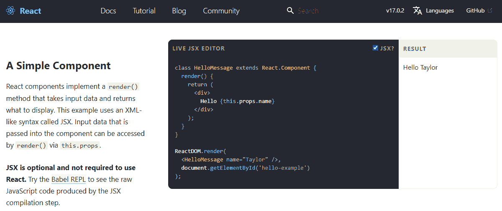
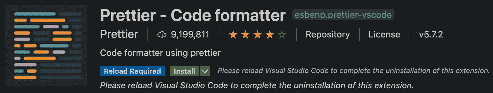
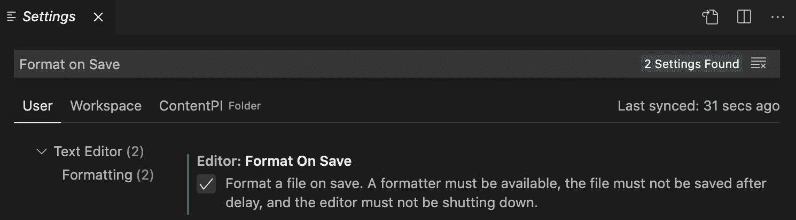

# 第二章：清理您的代码

本章假设您已经有了 JSX 的经验，并且希望提高使用它的技能。要想毫无问题地使用 JSX/TSX，理解其内部工作原理以及构建 UI 的有用工具的原因是至关重要的。

我们的目标是编写干净的 JSX/TSX 代码，维护它，并了解它的来源，它是如何被转换为 JavaScript 的，以及它提供了哪些特性。

在本章中，我们将涵盖以下主题：

+   什么是 JSX，为什么我们应该使用它？

+   Babel 是什么，我们如何使用它来编写现代 JavaScript 代码？

+   JSX 的主要特性以及 HTML 和 JSX 之间的区别

+   以优雅和可维护的方式编写 JSX 的最佳实践

+   linting 以及特别是 ESLint 如何使我们的 JavaScript 代码在应用程序和团队之间保持一致。

+   函数式编程的基础以及为什么遵循函数式范式会让我们编写更好的 React 组件

# 技术要求

要完成本章，您将需要以下内容：

+   Node.js 12+

+   Visual Studio Code

# 使用 JSX

在上一章中，我们看到了 React 如何改变关注点分离的概念，将边界移到组件内部。我们还学习了 React 如何使用组件返回的元素来在屏幕上显示 UI。

现在让我们看看如何在组件内部声明我们的元素。

React 提供了两种定义元素的方式。第一种是使用 JavaScript 函数，第二种是使用 JSX，一种可选的类似 XML 的语法。以下是官方 React.js 网站示例部分的截图（[`reactjs.org/#examples`](https://reactjs.org/#examples)）：



首先，JSX 是人们失败接触 React 的主要原因之一，因为第一次看到主页上的示例并且看到 JavaScript 与 HTML 混合在一起可能对我们大多数人来说都会感到奇怪。

一旦我们习惯了它，我们就会意识到它非常方便，因为它类似于 HTML，并且对于已经在 Web 上创建过 UI 的人来说非常熟悉。开放和闭合标签使得表示嵌套的元素树变得更容易，使用纯 JavaScript 将会变得难以阅读和难以维护。

让我们在以下子章节中更详细地了解 JSX。

## Babel 7

要在我们的代码中使用 JSX（和一些 ES6 的特性），我们必须安装新的 Babel 7。Babel 是一个流行的 JavaScript 编译器，在 React 社区广泛使用。

首先，重要的是清楚地了解它可以为我们解决的问题，以及为什么我们需要在我们的流程中添加一步。原因是我们想要使用语言的特性，这些特性尚未添加到浏览器，我们的目标环境。这些高级特性使我们的代码对开发人员更清晰，但浏览器无法理解和执行它。

解决方案是在 JSX 和 ES6 中编写我们的脚本，当我们准备好发布时，我们将源代码编译成 ES5，这是今天主要浏览器中实现的标准规范。

Babel 可以将 ES6 代码编译成 ES5 JavaScript，还可以将 JSX 编译成 JavaScript 函数。这个过程被称为**转译**，因为它将源代码编译成新的源代码，而不是可执行文件。

在较旧的 Babel 6.x 版本中，您安装了`babel-cli`包，并获得了`babel-node`和`babel-core`，现在一切都分开了：`@babel/core`，`@babel/cli`，`@babel/node`等等。

要安装 Babel，我们需要安装`@babel/core`和`@babel/node`如下：

```jsx
npm install -g @babel/core @babel/node
```

如果您不想全局安装它（开发人员通常倾向于避免这样做），您可以将 Babel 安装到项目中并通过`npm`脚本运行它，但在本章中，全局实例就可以了。

安装完成后，我们可以运行以下命令来编译任何 JavaScript 文件：

```jsx
babel source.js -o output.js
```

Babel 之所以如此强大的原因之一是因为它是高度可配置的。Babel 只是一个将源文件转译为输出文件的工具，但要应用一些转换，我们需要对其进行配置。

幸运的是，有一些非常有用的预设配置，我们可以轻松安装和使用：

```jsx
npm install -g @babel/preset-env @babel/preset-react
```

安装完成后，我们在`root`文件夹中创建一个名为`.babelrc`的配置文件，并将以下行放入其中，告诉 Babel 使用这些预设：

```jsx
{
  "presets": [
    "@babel/preset-env",
    "@babel/preset-react"
  ]
}
```

从这一点开始，我们可以在我们的源文件中编写 ES6 和 JSX，并在浏览器中执行输出文件。

## 创建我们的第一个元素

现在我们的环境已经设置好支持 JSX，我们可以深入最基本的例子：生成一个`div`元素。这是您使用`_jsx`函数创建`div`元素的方式：

```jsx
_jsx('div', {})
```

这是用于创建`div`元素的 JSX：

```jsx
<div />
```

它看起来类似于常规 HTML。

最大的区别在于我们在`.js`文件中编写标记，但重要的是要注意 JSX 只是语法糖，在在浏览器中执行之前会被转译成 JavaScript。

实际上，当我们运行 Babel 时，我们的`<div />`元素被翻译成`_jsx('div', {})`，这是我们在编写模板时应该牢记的事情。

在 React 17 中，`React.createElement('div')`已被弃用，现在内部使用`react/jsx-runtime`来渲染 JSX，这意味着我们将得到类似`_jsx('div', {})`的东西。基本上，这意味着您不再需要导入 React 对象来编写 JSX 代码。

## DOM 元素和 React 组件

使用 JSX，我们可以创建 HTML 元素和 React 组件；唯一的区别是它们是否以大写字母开头。

例如，要渲染一个 HTML 按钮，我们使用`<button />`，而要渲染`Button`组件，我们使用`<Button />`。第一个按钮被转译成如下：

```jsx
_jsx('button', {})
```

第二个被转译成如下：

```jsx
_jsx(Button, {})
```

这里的区别在于，在第一个调用中，我们将 DOM 元素的类型作为字符串传递，而在第二个调用中，我们传递的是组件本身，这意味着它应该存在于作用域中才能工作。

正如您可能已经注意到的，JSX 支持自闭合标签，这对保持代码简洁非常有用，并且不需要我们重复不必要的标签。

## 属性

当您的 DOM 元素或 React 组件具有 props 时，JSX 非常方便。使用 XML 很容易在元素上设置属性：

```jsx

```

在 JavaScript 中的等价物如下：

```jsx
_jsx("img", { 
  src: "https://www.js.education/images/logo.png", 
  alt: "JS Education" 
})
```

这样的代码可读性差得多，即使只有几个属性，没有一点推理就很难阅读。

## 子元素

JSX 允许您定义子元素以描述元素树并组合复杂的 UI。一个基本的例子是带有文本的链接，如下所示：

```jsx
<a href="https://js.education">Click me!</a>
```

这将被转译成如下：

```jsx
_jsx( 
  "a", 
  { href: "https://www.js.education" }, 
  "Click me!" 
)
```

我们的链接可以被包含在`div`元素中以满足一些布局要求，实现这一目的的 JSX 片段如下：

```jsx
<div> 
  <a href="https://www.js.education">Click me!</a> 
</div>
```

JavaScript 等价物如下：

```jsx
_jsx( 
  "div", 
  null, 
  _jsx( 
    "a", 
    { href: "https://www.js.education" }, 
    "Click me!" 
  ) 
)
```

现在应该清楚了 JSX 的*类似 XML*的语法如何使一切更易读和易维护，但重要的是要知道我们的 JSX 的 JavaScript 并行对元素的创建有控制。好处是我们不仅限于将元素作为元素的子元素，而是可以使用 JavaScript 表达式，比如函数或变量。

为了做到这一点，我们必须用花括号括起表达式：

```jsx
<div> 
  Hello, {variable}. 
  I'm a {() => console.log('Function')}. 
</div> 
```

同样适用于非字符串属性，如下所示：

```jsx
<a href={this.createLink()}>Click me!</a>
```

如你所见，任何变量或函数都应该用花括号括起来。

## 与 HTML 的不同

到目前为止，我们已经看到了 JSX 和 HTML 之间的相似之处。现在让我们看看它们之间的小差异以及存在的原因。

### 属性

我们必须始终记住 JSX 不是一种标准语言，它被转译成 JavaScript。因此，某些属性无法使用。

例如，我们必须使用`className`代替`class`，并且必须使用`htmlFor`代替`for`，如下所示：

```jsx
<label className="awesome-label" htmlFor="name" />
```

这是因为`class`和`for`在 JavaScript 中是保留字。

### 样式

一个相当重要的区别是`style`属性的工作方式。我们将在*第八章，使您的组件看起来漂亮*中更详细地讨论如何使用它，但现在我们将专注于它的工作方式。

`style`属性不接受 CSS 字符串，而是期望一个 JavaScript 对象，其中样式名称是*驼峰式*的：

```jsx
<div style={{ backgroundColor: 'red' }} />
```

正如你所看到的，你可以将一个对象传递给`style`属性，这意味着你甚至可以将你的样式放在一个单独的变量中。

```jsx
const styles = {
  backgroundColor: 'red'
} 

<div style={styles} /> 
```

这是控制内联样式的最佳方式。

### 根

与 HTML 的一个重要区别是，由于 JSX 元素被转换为 JavaScript 函数，并且在 JavaScript 中不能返回两个函数，所以每当您在同一级别有多个元素时，您被迫将它们包装在一个父元素中。

让我们看一个简单的例子：

```jsx
<div />
<div />
```

这给了我们以下错误：

```jsx
Adjacent JSX elements must be wrapped in an enclosing tag.
```

另一方面，以下内容有效：

```jsx
<div> 
  <div /> 
  <div /> 
</div>
```

以前，React 强制你返回一个包裹在`<div>`元素或任何其他标签中的元素；自 React 16.2.0 以来，可以直接返回一个数组，如下所示：

```jsx
return [
  <li key="1">First item</li>, 
  <li key="2">Second item</li>, 
  <li key="3">Third item</li>
]
```

或者你甚至可以直接返回一个字符串，就像下面的代码块所示：

```jsx
return 'Hello World!'
```

此外，React 现在有一个名为`Fragment`的新功能，它也可以作为元素的特殊包装器。它可以用`React.Fragment`来指定：

```jsx
import { Fragment } from 'react'

return ( 
  <Fragment>
    <h1>An h1 heading</h1> 
    Some text here. 
    <h2>An h2 heading</h2> 
    More text here.
    Even more text here.
  </Fragment>
)
```

或者您可以使用空标签（`<></>`）：

```jsx
return ( 
  <>
    <ComponentA />
    <ComponentB />
    <ComponentC />
  </>
)
```

`Fragment`不会在 DOM 上呈现任何可见的内容；它只是一个辅助标签，用于包装您的 React 元素或组件。

### 空格

有一件事情可能在开始时会有点棘手，再次强调的是，我们应该始终记住 JSX 不是 HTML，即使它具有类似 XML 的语法。JSX 处理文本和元素之间的空格与 HTML 不同，这种方式是违反直觉的。

考虑以下片段：

```jsx
<div> 
  <span>My</span> 
  name is 
  <span>Carlos</span> 
</div>
```

在解释 HTML 的浏览器中，这段代码会给你`My name is Carlos`，这正是我们所期望的。

在 JSX 中，相同的代码将被呈现为`MynameisCarlos`，这是因为三个嵌套的行被转译为`div`元素的单独子元素，而不考虑空格。获得相同输出的常见解决方案是在元素之间明确放置一个空格，如下所示：

```jsx
<div> 
  <span>My</span> 
  {' '}
  name is
  {' '} 
  <span>Carlos</span> 
</div>
```

正如您可能已经注意到的，我们正在使用一个空字符串包裹在 JavaScript 表达式中，以强制编译器在元素之间应用空格。

### 布尔属性

在真正开始之前，还有一些事情值得一提，关于在 JSX 中定义布尔属性的方式。如果您设置一个没有值的属性，JSX 会假定它的值是`true`，遵循与 HTML `disabled`属性相同的行为，例如。

这意味着如果我们想将属性设置为`false`，我们必须明确声明它为 false：

```jsx
<button disabled /> 
React.createElement("button", { disabled: true })
```

以下是另一个布尔属性的例子：

```jsx
<button disabled={false} /> 
React.createElement("button", { disabled: false })
```

这可能在开始时会让人困惑，因为我们可能会认为省略属性意味着`false`，但事实并非如此。在 React 中，我们应该始终明确以避免混淆。

## 扩展属性

一个重要的特性是**扩展属性**运算符（`...`），它来自于 ECMAScript 提案的 rest/spread 属性，非常方便，每当我们想要将 JavaScript 对象的所有属性传递给一个元素时。

减少错误的一种常见做法是不通过引用将整个 JavaScript 对象传递给子级，而是使用它们的原始值，这样可以轻松验证，使组件更健壮和防错。

让我们看看它是如何工作的：

```jsx
const attrs = { 
  id: 'myId',
  className: 'myClass'
}

return <div {...attrs} />
```

前面的代码被转译成了以下内容：

```jsx
var attrs = { 
  id: 'myId',
  className: 'myClass'
} 

return _jsx('div', attrs)
```

## 模板文字

**模板文字**是允许嵌入表达式的字符串文字。您可以使用多行字符串和字符串插值功能。

模板文字由反引号（`` ``）字符而不是双引号或单引号括起来。此外，模板文字可以包含占位符。您可以使用美元符号和大括号（`${expression}`）添加它们：

```jsx
const name = `Carlos`
const multilineHtml = `<p>
 This is a multiline string
 </p>`
console.log(`Hi, my name is ${name}`)
```

## 常见模式

现在我们知道了 JSX 的工作原理并且可以掌握它，我们准备好看看如何按照一些有用的约定和技巧正确使用它。

### 多行

让我们从一个非常简单的开始。如前所述，我们应该更喜欢 JSX 而不是 React 的 `_jsx` 函数的一个主要原因是它的类似 XML 的语法，以及平衡的开放和闭合标签非常适合表示节点树。

因此，我们应该尝试以正确的方式使用它并充分利用它。一个例子如下；每当我们有嵌套元素时，我们应该总是多行： 

```jsx
<div> 
 <Header /> 
 <div> 
 <Main content={...} /> 
  </div> 
</div>
```

这比以下方式更可取：

```jsx
<div><Header /><div><Main content={...} /></div></div>
```

例外情况是如果子元素不是文本或变量等元素。在这种情况下，保持在同一行并避免向标记添加噪音是有意义的，如下所示：

```jsx
<div> 
 <Alert>{message}</Alert> 
  <Button>Close</Button> 
</div>
```

当您在多行上编写元素时，请记住始终将它们包装在括号中。JSX 总是被函数替换，而在新行上编写的函数可能会因为自动分号插入而给您带来意外的结果。例如，假设您从 render 方法中返回 JSX，这就是您在 React 中创建 UI 的方式。

以下示例工作正常，因为 `div` 元素与 `return` 在同一行上：

```jsx
return <div />
```

然而，以下是不正确的：

```jsx
return 
  <div />
```

原因是您将会得到以下结果：

```jsx
return
_jsx("div", null)
```

这就是为什么您必须将语句包装在括号中，如下所示：

```jsx
return ( 
  <div /> 
)
```

### 多属性

在编写 JSX 时常见的问题是元素具有多个属性。一种解决方法是将所有属性写在同一行上，但这会导致我们的代码中出现非常长的行（请参阅下一节了解如何强制执行编码样式指南）。

一种常见的解决方案是将每个属性写在新行上，缩进一级，然后将闭合括号与开放标签对齐：

```jsx
<button 
  foo="bar" 
  veryLongPropertyName="baz" 
  onSomething={this.handleSomething} 
/>
```

### 条件语句

当我们开始使用**条件语句**时，事情变得更有趣，例如，如果我们只想在某些条件匹配时渲染一些组件。我们可以在条件中使用 JavaScript 是一个很大的优势，但在 JSX 中表达条件的方式有很多不同，了解每一种方式的好处和问题对于编写既可读又易于维护的代码是很重要的。

假设我们只想在用户当前登录到我们的应用程序时显示一个注销按钮。

一个简单的起步代码如下：

```jsx
let button

if (isLoggedIn) { 
  button = <LogoutButton />
} 

return <div>{button}</div>
```

这样做是可以的，但不够易读，特别是如果有多个组件和多个条件。

在 JSX 中，我们可以使用内联条件：

```jsx
<div> 
  {isLoggedIn && <LoginButton />} 
</div>
```

这是因为如果条件是`false`，则不会渲染任何内容，但如果条件是`true`，则会调用`LoginButton`的`createElement`函数，并将元素返回以组成最终的树。

如果条件有一个备选项（经典的`if...else`语句），并且我们想要，例如，如果用户已登录则显示一个注销按钮，否则显示一个登录按钮，我们可以使用 JavaScript 的`if...else`语句如下：

```jsx
let button

if (isLoggedIn) { 
  button = <LogoutButton />
} else { 
  button = <LoginButton />
} 

return <div>{button}</div>
```

或者，更好的方法是使用一个使代码更加紧凑的三元条件：

```jsx
<div> 
  {isLoggedIn ? <LogoutButton /> : <LoginButton />} 
</div>
```

你可以在一些流行的代码库中找到三元条件的使用，比如 Redux 的真实世界示例（[`github.com/reactjs/redux/blob/master/examples/real-world/src/components/List.js#L28`](https://github.com/reactjs/redux/blob/master/examples/real-world/src/components/List.js#L28)），在这里，三元条件用于在组件获取数据时显示一个“加载中”标签，或者根据`isFetching`变量的值在按钮内显示“加载更多”：

```jsx
<button [...]> 
  {isFetching ? 'Loading...' : 'Load More'} 
</button>
```

现在让我们看看当事情变得更加复杂时的最佳解决方案，例如，当我们需要检查多个变量以确定是否渲染一个组件时：

```jsx
<div>
  {dataIsReady && (isAdmin || userHasPermissions) && 
    <SecretData />
  }
</div>
```

在这种情况下，使用内联条件是一个好的解决方案，但可读性受到了严重影响。相反，我们可以在组件内创建一个辅助函数，并在 JSX 中使用它来验证条件：

```jsx
const canShowSecretData = () => { 
  const { dataIsReady, isAdmin, userHasPermissions } = props
  return dataIsReady && (isAdmin || userHasPermissions)
} 

return (
  <div> 
    {this.canShowSecretData() && <SecretData />} 
  </div> )
```

正如你所看到的，这种改变使得代码更易读，条件更加明确。如果你在 6 个月后看这段代码，仅仅通过函数名就能清楚地理解。

计算属性也是一样。假设你有两个单一属性用于货币和价值。你可以创建一个函数来创建价格字符串，而不是在 `render` 中创建它：

```jsx
const getPrice = () => { 
  return `${props.currency}${props.value}`
}

return <div>{getPrice()}</div>
```

这样做更好，因为它是隔离的，如果包含逻辑，你可以很容易地测试它。

回到条件语句，其他解决方案需要使用外部依赖。一个很好的做法是尽可能避免外部依赖，以使我们的捆绑包更小，但在这种特殊情况下可能是值得的，因为提高我们模板的可读性是一个很大的胜利。

第一个解决方案是 `render-if`，我们可以通过以下方式安装它：

```jsx
npm install --save render-if
```

然后我们可以在我们的项目中轻松使用它，如下所示：

```jsx
const { dataIsReady, isAdmin, userHasPermissions } = props

const canShowSecretData = renderIf( 
  dataIsReady && (isAdmin || userHasPermissions) 
);

return (
  <div> 
    {canShowSecretData(<SecretData />)} 
  </div> 
);
```

在这里，我们将我们的条件包装在 `renderIf` 函数中。

返回的实用函数可以作为一个接收 JSX 标记的函数来使用，当条件为 `true` 时显示。

一个目标是永远不要在我们的组件中添加太多逻辑。其中一些组件将需要一点逻辑，但我们应该尽量保持它们尽可能简单，这样我们就可以很容易地发现和修复错误。

我们至少应该尽量保持 `renderIf` 方法尽可能干净，为了做到这一点，我们可以使用另一个实用程序库，称为 `react-only-if`，它让我们编写我们的组件，就好像条件总是为 `true` 一样，通过使用**高阶组件**（**HOC**）设置条件函数。

我们将在 *第四章* *探索流行的组合模式* 中广泛讨论 HOCs，但现在，你只需要知道它们是接收一个组件并通过添加一些属性或修改其行为来返回一个增强的组件的函数。

要使用该库，我们需要按照以下方式安装它：

```jsx
npm install --save react-only-if
```

安装完成后，我们可以在我们的应用程序中以以下方式使用它：

```jsx
import onlyIf from 'react-only-if'

const SecretDataOnlyIf = onlyIf(
  ({ dataIsReady, isAdmin, userHasPermissions }) => dataIsReady && 
  (isAdmin || userHasPermissions)
)(SecretData)

const MyComponent = () => (
  <div>
    <SecretDataOnlyIf 
      dataIsReady={...}
      isAdmin={...}
      userHasPermissions={...}
    />
 </div>
)

export default MyComponent
```

正如你在这里看到的，组件本身没有任何逻辑。

我们将条件作为 `onlyIf` 函数的第一个参数传递，当条件匹配时，组件被渲染。

用于验证条件的函数接收组件的 props、state 和 context。

这样，我们就避免了用条件语句污染我们的组件，这样更容易理解和推理。

### 循环

UI 开发中一个非常常见的操作是显示项目列表。在显示列表时，使用 JavaScript 作为模板语言是一个非常好的主意。

如果我们在 JSX 模板中编写一个返回数组的函数，数组的每个元素都会被编译成一个元素。

正如我们之前所看到的，我们可以在花括号中使用任何 JavaScript 表达式，给定一个对象数组，生成一个元素数组的最常见方法是使用`map`。

让我们深入一个真实的例子。假设你有一个用户列表，每个用户都有一个附加的名字属性。

要创建一个无序列表来显示用户，你可以这样做：

```jsx
<ul> 
  {users.map(user => <li>{user.name}</li>)} 
</ul>
```

这段代码非常简单，同时也非常强大，HTML 和 JavaScript 的力量在这里汇聚。

### 控制语句

条件和循环在 UI 模板中是非常常见的操作，你可能觉得使用 JavaScript 的三元运算符或`map`函数来执行它们是错误的。JSX 被构建成只抽象了元素的创建，将逻辑部分留给了真正的 JavaScript，这很好，除了有时候，代码变得不够清晰。

总的来说，我们的目标是从组件中移除所有的逻辑，特别是从渲染方法中移除，但有时我们必须根据应用程序的状态显示和隐藏元素，而且我们经常必须循环遍历集合和数组。

如果你觉得使用 JSX 进行这种操作会使你的代码更易读，那么有一个可用的 Babel 插件可以做到：`jsx-control-statements`。

它遵循与 JSX 相同的哲学，不会向语言添加任何真正的功能；它只是一种被编译成 JavaScript 的语法糖。

让我们看看它是如何工作的。

首先，我们必须安装它：

```jsx
npm install --save jsx-control-statements
```

安装完成后，我们必须将它添加到我们的`.babelrc`文件中的 Babel 插件列表中：

```jsx
"plugins": ["jsx-control-statements"]
```

从现在开始，我们可以使用插件提供的语法，Babel 将把它与常见的 JSX 语法一起转译。

使用该插件编写的条件语句如下所示：

```jsx
<If condition={this.canShowSecretData}> 
  <SecretData /> 
</If>
```

这被转译成了一个三元表达式，如下所示：

```jsx
{canShowSecretData ? <SecretData /> : null}
```

`If`组件很棒，但是如果由于某种原因，你在渲染方法中有嵌套的条件，它很容易变得混乱和难以理解。这就是`Choose`组件派上用场的地方：

```jsx
<Choose> 
  <When condition={...}> 
    <span>if</span> 
  </When> 
 <When condition={...}> 
    <span>else if</span> 
  </When> 
 <Otherwise> 
 <span>else</span> 
 </Otherwise> 
</Choose>
```

请注意，前面的代码被转译成了多个三元运算符。

最后，还有一个组件（永远记住我们不是在谈论真正的组件，而只是语法糖）来管理循环，也非常方便：

```jsx
<ul> 
 <For each="user" of={this.props.users}> 
    <li>{user.name}</li> 
  </For> 
</ul>
```

前面的代码被转译成了一个`map`函数 - 没有什么魔术。

如果你习惯使用**linters**，你可能会想知道为什么 linter 没有对那段代码进行投诉。在转译之前，`user`变量并不存在，也没有被包裹在一个函数中。为了避免这些 linting 错误，还有另一个要安装的插件：`eslint-plugin-jsx-control-statements`。

如果您不理解上一句话，不用担心；我们将在接下来的部分讨论 linting。

### 子渲染

值得强调的是，我们始终希望保持我们的组件非常小，我们的渲染方法非常干净和简单。

然而，这并不是一个容易的目标，特别是当您迭代地创建一个应用程序时，在第一次迭代中，您并不确定如何将组件拆分成更小的组件。那么，当`render`方法变得太大而无法维护时，我们应该做些什么呢？一个解决方案是将其拆分成更小的函数，以便让我们将所有逻辑保留在同一个组件中。

让我们看一个例子：

```jsx
const renderUserMenu = () => { 
  // JSX for user menu 
} 

const renderAdminMenu = () => { 
  // JSX for admin menu 
} 

return ( 
  <div> 
 <h1>Welcome back!</h1> 
    {userExists && renderUserMenu()} 
    {userIsAdmin && renderAdminMenu()} 
  </div> 
)
```

这并不总是被认为是最佳实践，因为将组件拆分成更小的组件似乎更明显。然而，有时候这有助于保持渲染方法的清晰。例如，在 Redux 的真实示例中，使用子渲染方法来渲染*load more*按钮。

既然我们是 JSX 的高级用户，现在是时候继续前进，看看如何在我们的代码中遵循样式指南，使其保持一致。

# 代码样式

在本节中，您将学习如何实现 EditorConfig 和 ESLint，通过验证您的代码风格来提高代码质量。在团队中拥有标准的代码风格并避免使用不同的代码风格是很重要的。

## EditorConfig

**EditorConfig**帮助开发人员在不同的 IDE 之间保持一致的编码风格。

EditorConfig 受许多编辑器支持。您可以在官方网站[`www.editorconfig.org`](https://www.editorconfig.org)上检查您的编辑器是否受支持。

您需要在您的`root`目录中创建一个名为`.editorconfig`的文件 - 我使用的配置是这样的：

```jsx
root = true

[*]
indent_style = space 
indent_size = 2
end_of_line = lf
charset = utf-8 
trim_trailing_whitespace = true 
insert_final_newline = true

[*.html] 
indent_size = 4

[*.css] 
indent_size = 4

[*.md]
trim_trailing_whitespace = false
```

您可以影响所有文件`[*]`，以及特定文件`[.extension]`。

## Prettier

**Prettier**是一种主观的代码格式化工具，支持许多语言，并可以集成到大多数编辑器中。这个插件非常有用，因为您可以在保存代码时格式化代码，而无需在代码审查中讨论代码风格，这将节省您大量的时间和精力。

如果您使用 Visual Studio Code，首先必须安装 Prettier 扩展：



然后，如果您想配置选项以在保存文件时进行格式化，您需要转到设置，搜索`Format on Save`，并检查该选项：



这将影响您所有的项目，因为这是一个全局设置。如果您只想在特定项目中应用此选项，您需要在项目内创建一个`.vscode`文件夹和一个带有以下代码的`settings.json`文件：

```jsx
{
  "editor.defaultFormatter": "esbenp.prettier-vscode",
  "editor.formatOnSave": true
}
```

然后，您可以在`.prettierrc`文件中配置您想要的选项-这是我通常使用的配置：

```jsx
{
 "**arrowParens**": "avoid",
 "**bracketSpacing**": true,
 "**jsxSingleQuote**": false,
 "**printWidth**": 100,
 "**quoteProps**": "as-needed",
 "**semi**": false,
 "**singleQuote**": true,
 "**tabWidth**": 2,
 "**trailingComma**": "none",
 "**useTabs**": false
}
```

这将帮助您或您的团队标准化代码风格。

## ESLint

我们总是尽量写出最好的代码，但有时会出现错误，花几个小时捕捉由于拼写错误而导致的错误非常令人沮丧。幸运的是，一些工具可以帮助我们在输入代码时检查代码的正确性。这些工具无法告诉我们我们的代码是否会按预期运行，但它们可以帮助我们避免语法错误。

如果您来自静态语言，比如 C#，您习惯于在 IDE 中获得这种警告。几年前，Douglas Crockford 在 JavaScript 中使用 JSLint（最初于 2002 年发布）使 linting 变得流行；然后我们有了 JSHint，最后，现在在 React 世界中的事实标准是 ESLint。

**ESLint**是一个于 2013 年发布的开源项目，因为它高度可配置和可扩展而变得流行。

在 JavaScript 生态系统中，库和技术变化非常快，拥有一个可以轻松通过插件进行扩展的工具以及可以在需要时启用和禁用规则是至关重要的。最重要的是，现在我们使用转译器，比如 Babel，以及不属于 JavaScript 标准版本的实验性功能，因此我们需要能够告诉我们的代码检查工具我们在源文件中遵循哪些规则。代码检查工具不仅帮助我们减少错误，或者至少更早地发现这些错误，而且强制执行一些常见的编码风格指南，这在拥有许多开发人员的大团队中尤为重要，每个开发人员都有自己喜欢的编码风格。

在使用不一致的风格编写不同文件甚至不同函数的代码库中，很难阅读代码。因此，让我们更详细地了解一下 ESLint。

### 安装

首先，我们必须安装 ESLint 和一些插件，如下所示：

```jsx
npm install -g eslint eslint-config-airbnb eslint-config-prettier eslint-plugin-import eslint-plugin-jsx-a11y eslint-plugin-prettier eslint-plugin-react
```

一旦可执行文件安装完成，我们可以使用以下命令运行它：

```jsx
eslint source.ts
```

输出会告诉我们文件中是否有错误。

当我们第一次安装和运行它时，我们不会看到任何错误，因为它是完全可配置的，不带有任何默认规则。

### 配置

让我们开始配置 ESLint。可以使用项目根目录中的`.eslintrc`文件进行配置。要添加一些规则，让我们创建一个为 TypeScript 配置的`.eslintrc`文件并添加一个基本规则：

```jsx
{
  "parser": "@typescript-eslint/parser",
  "plugins": ["@typescript-eslint", "prettier"],
  "extends": [
    "airbnb",
    "eslint:recommended",
    "plugin:@typescript-eslint/eslint-recommended",
    "plugin:@typescript-eslint/recommended",
    "plugin:prettier/recommended"
  ],
  "settings": {
    "import/extensions": [".js", ".jsx", ".ts", ".tsx"],
    "import/parsers": {
      "@typescript-eslint/parser": [".ts", ".tsx"]
    },
    "import/resolver": {
      "node": {
        "extensions": [".js", ".jsx", ".ts", ".tsx"]
      }
    }
  },
  "rules": {
    "semi": [2, "never"]
  }
}
```

这个配置文件需要一点解释：`"semi"`是规则的名称，“[2，“never”]”是值。第一次看到它时并不是很直观。

ESLint 规则有三个级别，确定问题的严重程度：

+   关闭（或 0）：规则被禁用。

+   警告（或 1）：规则是一个警告。

+   错误（或 2）：规则会抛出错误。

我们使用值为 2 是因为我们希望 ESLint 在我们的代码不遵循规则时抛出错误。第二个参数告诉 ESLint 我们不希望使用分号（相反的是*always*）。ESLint 及其插件都有非常好的文档，对于任何单个规则，您都可以找到规则的描述以及一些示例，说明何时通过何时失败。

现在创建一个名为`index.ts`的文件，内容如下：

```jsx
const foo = 'bar';
```

如果我们运行`eslint index.js`，我们会得到以下结果：

```jsx
Extra semicolon (semi) 
```

这很棒；我们设置了代码检查工具，它帮助我们遵循第一个规则。

以下是我喜欢关闭或更改的其他规则：

```jsx
"rules": {
    "semi": [2, "never"],
    "@typescript-eslint/class-name-casing": "off",
    "@typescript-eslint/interface-name-prefix": "off",
    "@typescript-eslint/member-delimiter-style": "off",
    "@typescript-eslint/no-var-requires": "off",
    "@typescript-eslint/ban-ts-ignore": "off",
    "@typescript-eslint/no-use-before-define": "off",
    "@typescript-eslint/ban-ts-comment": "off",
    "@typescript-eslint/explicit-module-boundary-types": "off",
    "no-restricted-syntax": "off",
    "no-use-before-define": "off",
    "import/extensions": "off",
    "import/prefer-default-export": "off",
    "max-len": [
      "error",
      {
        "code": 100,
        "tabWidth": 2
      }
    ],
    "no-param-reassign": "off",
    "no-underscore-dangle": "off",
    "react/jsx-filename-extension": [
      1,
      {
        "extensions": [".tsx"]
      }
    ],
    "import/no-unresolved": "off",
    "consistent-return": "off",
    "jsx-a11y/anchor-is-valid": "off",
    "sx-a11y/click-events-have-key-events": "off",
    "jsx-a11y/no-noninteractive-element-interactions": "off",
    "jsx-a11y/click-events-have-key-events": "off",
    "jsx-a11y/no-static-element-interactions": "off",
    "react/jsx-props-no-spreading": "off",
    "jsx-a11y/label-has-associated-control": "off",
    "react/jsx-one-expression-per-line": "off",
    "no-prototype-builtins": "off",
    "no-nested-ternary": "off",
    "prettier/prettier": [
      "error",
      {
        "endOfLine": "auto"
      }
    ]
  }
```

### Git 钩子

为了避免在我们的存储库中有未经过 lint 处理的代码，我们可以在我们的过程的某个时候使用 Git 钩子添加 ESLint。例如，我们可以使用`husky`在名为`pre-commit`的 Git 钩子中运行我们的 linter，还可以在名为`pre-push`的钩子上运行我们的单元测试。

要安装`husky`，您需要运行以下命令：

```jsx
npm install --save-dev husky
```

然后，在我们的`package.json`文件中，我们可以添加这个节点来配置我们想要在 Git 钩子中运行的任务：

```jsx
{
  "scripts": {
    "lint": "eslint --ext .tsx,.ts src",
    "lint:fix": "eslint --ext .tsx,.ts --fix src",
    "test": "jest src"
  },
  "husky": {
    "hooks": {
      "pre-commit": "npm lint",
      "pre-push": "npm test"
    }
  }
}
```

ESlint 命令有一个特殊的选项（标志）叫做`--fix` - 使用这个选项，ESlint 将尝试自动修复所有我们的 linter 错误（不是所有）。请注意这个选项，因为有时它可能会影响我们的代码风格。另一个有用的标志是`--ext`，用于指定我们想要验证的文件的扩展名，在这种情况下只有`.tsx`和`.ts`文件。

在下一节中，您将了解**函数式编程**（**FP**）的工作原理以及一级对象、纯度、不可变性、柯里化和组合等主题。

# 函数式编程

除了在编写 JSX 时遵循最佳实践并使用 linter 来强制一致性并更早地发现错误之外，我们还可以做一件事来清理我们的代码：遵循 FP 风格。

如*第一章*中所讨论的，React 采用了一种声明式的编程方法，使我们的代码更易读。FP 是一种声明式的范式，其中避免副作用，并且数据被视为不可变，以使代码更易于维护和理解。

不要将以下子部分视为 FP 的详尽指南；这只是一个介绍，让您了解 React 中常用的一些概念。

## **一级函数**

JavaScript 具有一级函数，因为它们被视为任何其他变量，这意味着您可以将函数作为参数传递给其他函数，或者它可以被另一个函数返回并分配为变量的值。

这使我们能够介绍**高阶函数**（**HoFs**）的概念。 HoFs 是接受函数作为参数的函数，并且可能还有一些其他参数，并返回一个函数。返回的函数通常具有一些特殊的行为。

让我们看一个例子：

```jsx
const add = (x, y) => x + y

const log = fn => (...args) => { 
 return fn(...args)
}

const logAdd = log(add)
```

在这里，一个函数正在添加两个数字，增强一个记录所有参数然后执行原始函数的函数。

理解这个概念非常重要，因为在 React 世界中，一个常见的模式是使用 HOCs 将我们的组件视为函数，并用常见的行为增强它们。我们将在*第四章*，*探索流行的组合模式*中看到 HOCs 和其他模式。

## 纯度

FP 的一个重要方面是编写纯函数。在 React 生态系统中，您会经常遇到这个概念，特别是如果您研究 Redux 等库。

一个函数纯是什么意思？

当函数没有副作用时，函数就是纯的，这意味着函数不会改变任何不属于函数本身的东西。

例如，一个改变应用程序状态的函数，或者修改在上层作用域中定义的变量的函数，或者触及外部实体，比如**文档对象模型**（**DOM**）的函数被认为是不纯的。不纯的函数更难调试，大多数情况下不可能多次应用它们并期望得到相同的结果。

例如，以下函数是纯的：

```jsx
const add = (x, y) => x + y
```

它可以多次运行，始终得到相同的结果，因为没有任何东西被存储，也没有任何东西被修改。

以下函数不是纯的：

```jsx
let x = 0
const add = y => (x = x + y)
```

运行`add(1)`两次，我们得到两个不同的结果。第一次得到`1`，但第二次得到`2`，即使我们用相同的参数调用相同的函数。我们得到这种行为的原因是全局状态在每次执行后都被修改。

## 不可变性

我们已经看到如何编写不改变状态的纯函数，但是如果我们需要改变变量的值怎么办？在 FP 中，一个函数不是改变变量的值，而是创建一个新的带有新值的变量并返回它。这种处理数据的方式被称为**不可变性**。

不可变值是一个不能被改变的值。

让我们看一个例子：

```jsx
const add3 = arr => arr.push(3)
const myArr = [1, 2]

add3(myArr); // [1, 2, 3]
add3(myArr); // [1, 2, 3, 3]
```

前面的函数不遵循不可变性，因为它改变了给定数组的值。同样，如果我们两次调用相同的函数，我们会得到不同的结果。

我们可以改变前面的函数，使用`concat`使其不可变，返回一个新的数组而不修改给定的数组：

```jsx
const add3 = arr => arr.concat(3)
const myArr = [1, 2]
const result1 = add3(myArr) // [1, 2, 3]
const result2 = add3(myArr) // [1, 2, 3]
```

当我们运行函数两次后，`myArr`仍然保持其原始值。

## 柯里化

FP 中的一个常见技术是柯里化。**柯里化**是将接受多个参数的函数转换为一次接受一个参数并返回另一个函数的过程。让我们看一个例子来澄清这个概念。

让我们从之前看到的 `add` 函数开始，并将其转换为柯里化函数。

假设我们有以下代码：

```jsx
const add = (x, y) => x + y
```

我们可以改为以下方式定义函数：

```jsx
const add = x => y => x + y
```

我们以以下方式使用它：

```jsx
const add1 = add(1)
add1(2); // 3
add1(3); // 4
```

这是编写函数的一种非常方便的方式，因为在应用第一个参数后，第一个值被存储，我们可以多次重复使用第二个函数。

## 组合

最后，FP 中一个重要的概念可以应用到 React 中，那就是**组合**。函数（和组件）可以组合在一起，产生具有更高级功能和属性的新函数。

考虑以下函数：

```jsx
const add = (x, y) => x + y
const square = x => x * x
```

这些函数可以组合在一起创建一个新的函数，该函数将两个数字相加，然后将结果加倍：

```jsx
const addAndSquare = (x, y) => square(add(x, y))
```

遵循这个范式，我们最终得到了小型、简单、可测试的纯函数，可以组合在一起。

## FP 和 UI

最后一步是学习如何使用 FP 来构建 UI，这正是我们使用 React 的目的。

我们可以将 UI 视为一个函数，将应用程序的状态应用如下：

```jsx
UI = f(state)
```

我们期望这个函数是幂等的，这样它在应用程序的相同状态下返回相同的 UI。

使用 React，我们使用组件来创建我们的 UI，我们可以将其视为函数，正如我们将在接下来的章节中看到的。

组件可以组合在一起形成最终的 UI，这是 FP 的一个特性。

在使用 React 构建 UI 的方式和 FP 的原则中有很多相似之处，我们越了解，我们的代码就会越好。

# 总结

在本章中，我们学到了关于 JSX 的工作原理以及如何在组件中正确使用它的很多知识。我们从语法的基础开始，创建了一个坚实的知识基础，使我们能够掌握 JSX 及其特性。

在第二部分，我们看了如何配置 Prettier 以及 ESLint 及其插件如何帮助我们更快地发现问题，并强制执行一致的代码风格指南。

最后，我们通过 FP 的基础知识来理解在编写 React 应用程序时使用的重要概念。

现在我们的代码已经整洁，我们准备在下一章深入学习 React，并学习如何编写真正可重用的组件。
