# 第三章：React Hooks

React 发展非常迅速，自 React 16.8 以来，引入了新的 React Hooks，这是 React 开发的一个改变者，因为它们将提高编码速度并改善应用程序的性能。React 使我们能够仅使用功能组件编写 React 应用程序，这意味着不再需要使用类组件。

在这一章中，我们将涵盖以下主题：

+   新的 React Hooks 以及如何使用它们

+   Hooks 的规则

+   如何将类组件迁移到 React Hooks

+   使用 Hooks 和效果理解组件生命周期

+   如何使用 Hooks 获取数据

+   如何使用`memo`、`useMemo`和`useCallback`来记忆组件、值和函数

+   如何实现`useReducer`

# 技术要求

要完成本章，您将需要以下内容：

+   Node.js 12+

+   Visual Studio Code

您可以在书的 GitHub 存储库中找到本章的代码[`github.com/PacktPublishing/React-17-Design-Patterns-and-Best-Practices-Third-Edition/tree/main/Chapter03`](https://github.com/PacktPublishing/React-17-Design-Patterns-and-Best-Practices-Third-Edition/tree/main/Chapter03)。

# 介绍 React Hooks

React Hooks 是 React 16.8 中的新添加。它们让您在不编写 React 类组件的情况下使用状态和其他 React 功能。React Hooks 也是向后兼容的，这意味着它不包含任何破坏性更改，也不会取代您对 React 概念的了解。在本章的过程中，我们将看到有关经验丰富的 React 用户的 Hooks 概述，并且我们还将学习一些最常见的 React Hooks，如`useState`、`useEffect`、`useMemo`、`useCallback`和`memo`。

## 没有破坏性更改

许多人认为，使用新的 React Hooks，类组件在 React 中已经过时，但这种说法是不正确的。没有计划从 React 中删除类。Hooks 不会取代您对 React 概念的了解。相反，Hooks 为 React 概念提供了更直接的 API，如 props、state、context、refs 和生命周期，这些您已经了解。

## 使用 State Hook

您可能知道如何在类中使用`this.setState`来使用组件状态。现在您可以使用新的 React `useState` Hook 来使用组件状态。

首先，您需要从 React 中提取`useState` Hook：

```jsx
import { useState } from 'react'
```

自 React 17 以来，不再需要 React 对象来渲染 JSX 代码。

然后，您需要通过定义状态和特定状态的 setter 来声明要使用的状态：

```jsx
const Counter = () => {
  const [counter, setCounter] = useState<number>(0)
}
```

正如您所看到的，我们使用`setCounter` setter 声明了计数器状态，并且我们指定只接受数字，最后，我们将初始值设置为零。

为了测试我们的状态，我们需要创建一个将由`onClick`事件触发的方法：

```jsx
const Counter = () => {
  const [counter, setCounter] = useState<number>(0)

  const handleCounter = (operation) => {
    if (operation === 'add') {
      return setCounter(counter + 1)
    }

    return setCounter(counter - 1)
  }
}
```

最后，我们可以渲染`counter`状态和一些按钮来增加或减少`counter`状态：

```jsx
return (
  <p>
    Counter: {counter} <br />
    <button onClick={() => handleCounter('add')}>+ Add</button>
    <button onClick={() => handleCounter('subtract')}>- Subtract</button>
  </p>
)
```

如果您点击+添加按钮一次，您应该在计数器中看到 1：

！[](assets/266d444a-ec32-44c6-bff3-29f4d5ab4d4b.png)

如果您连续点击减号按钮两次，那么您应该在计数器中看到-1：

！[](assets/56a2e476-d287-46d0-80b9-7956e95c8c4c.png)

正如您所看到的，`useState` Hook 在 React 中是一个改变游戏规则的东西，并且使得在功能组件中处理状态变得非常容易。

## Hooks 的规则

React Hooks 基本上是 JavaScript 函数，但是您需要遵循两条规则才能使用它们。React 提供了一个 lint 插件来强制执行这些规则，您可以通过运行以下命令来安装它：

```jsx
npm install --save-dev eslint-plugin-react-hooks 
```

让我们看看这两条规则。

### 规则 1：只在顶层调用 Hooks

来自官方 React 文档（[`reactjs.org/docs/hooks-rules.html`](https://reactjs.org/docs/hooks-rules.html)）：

“**不要在循环、条件或嵌套函数中调用 Hooks**。相反，始终在 React 函数的顶层使用 Hooks。遵循此规则，您确保每次组件渲染时以相同的顺序调用 Hooks。这就是允许 React 在多次 useState 和 useEffect 调用之间正确保存 Hooks 状态的原因。”

### 规则 2：只从 React 函数调用 Hooks

来自官方 React 文档（[`reactjs.org/docs/hooks-rules.html`](https://reactjs.org/docs/hooks-rules.html)）：

“不要从常规 JavaScript 函数调用 Hooks。相反，您可以：

+   从 React 函数组件调用 Hooks。

+   从自定义 Hooks 调用 Hooks（我们将在下一页学习它们）。

遵循此规则，您确保组件中的所有有状态逻辑在其源代码中清晰可见。”

在下一节中，我们将学习如何将类组件迁移到使用新的 React Hooks。

# 将类组件迁移到 React Hooks

让我们转换一个当前正在使用类组件和一些生命周期方法的代码。在这个例子中，我们正在从 GitHub 仓库中获取问题并列出它们。

对于这个例子，您需要安装`axios`来执行获取操作：

```jsx
npm install axios
```

这是类组件版本：

```jsx
// Dependencies
import { Component } from 'react'
import axios from 'axios'

// Types
type Issue = {
  number: number
  title: string
  state: string
}
type Props = {}
type State = { issues: Issue[] };

class Issues extends Component<Props, State> {
  constructor(props: Props) {
    super(props)

    this.state = {
      issues: []
    }
  }

  componentDidMount() {
    axios
    .get('https://api.github.com/repos/ContentPI/ContentPI/issues')
     .then((response: any) => {
        this.setState({
          issues: response.data
        })
      })
  }

  render() {
    const { issues = [] } = this.state

    return (
      <>
        <h1>ContentPI Issues</h1>

        {issues.map((issue: Issue) => (
          <p key={issue.title}>
            <strong>#{issue.number}</strong> {' '}
            <a href=    {`https://github.com/ContentPI/ContentPI/issues/${issue.number}`}
                target="_blank">{issue.title}</a> {' '}
            {issue.state}
          </p>
        ))}
      </>
    )
  }
}

export default Issues
```

如果您渲染此组件，应该会看到类似于这样的东西：

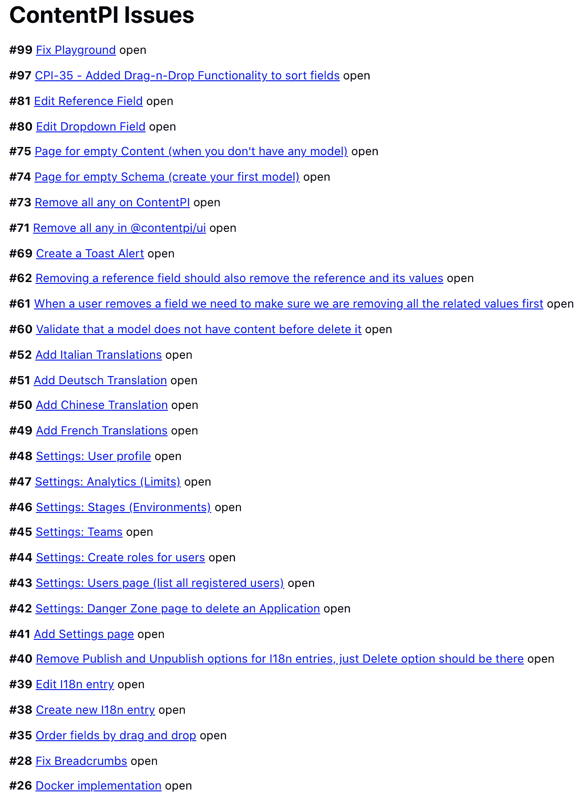

现在，让我们将我们的代码转换为使用 React Hooks 的函数组件。我们需要做的第一件事是导入一些 React 函数和类型：

```jsx
// Dependencies
import { FC, useState, useEffect } from 'react'
import axios from 'axios'
```

现在我们可以删除之前创建的`Props`和`State`类型，只留下`Issue`类型：

```jsx
// Types
type Issue = {
  number: number
  title: string
  state: string
}
```

之后，您可以更改类定义以使用函数组件：

```jsx
const Issues: FC = () => {...}
```

`FC`类型用于在 React 中定义**函数组件**。如果您需要将一些 props 传递给组件，可以这样传递：

```jsx
type Props = { propX: string propY: number propZ: boolean  
}

const Issues: FC<Props> = () => {...}
```

接下来，我们需要做的是使用`useState` Hook 来替换我们的构造函数和状态定义：

```jsx
// The useState hook replace the this.setState method
const [issues, setIssues] = useState<Issue[]>([])
```

我们以前使用了名为`componentDidMount`的生命周期方法，它在组件挂载时执行，并且只会运行一次。新的 React Hook，称为`useEffect`，现在将使用不同的语法处理所有生命周期方法，但现在，让我们看看如何在我们的新函数组件中获得与`componentDidMount`相同的*效果*：

```jsx
// When we use the useEffect hook with an empty array [] on the 
// dependencies (second parameter) 
// this represents the componentDidMount method (will be executed when the 
// component is mounted).
useEffect(() => {
  axios
    .get('https://api.github.com/repos/ContentPI/ContentPI/issues')
    .then((response: any) => {
      // Here we update directly our issue state
      setIssues(response.data)
    })
}, [])
```

最后，我们只需渲染我们的 JSX 代码：

```jsx
return (
  <>
    <h1>ContentPI Issues</h1>

    {issues.map((issue: Issue) => (
      <p key={issue.title}>
        <strong>#{issue.number}</strong> {' '}
        <a href=
          {`https://github.com/ContentPI/ContentPI/issues/${issue.number}`} 
            target="_blank">{issue.title}</a> {' '}
        {issue.state}
      </p>
    ))}
  </>
)
```

正如您所看到的，新的 Hooks 帮助我们大大简化了我们的代码，并且更有意义。此外，我们通过 10 行减少了我们的代码（类组件代码有 53 行，函数组件有 43 行）。

# 理解 React 效果

在本节中，我们将学习在类组件上使用的组件生命周期方法和新的 React 效果之间的区别。即使您在其他地方读到它们是相同的，只是语法不同，这是不正确的。

## 理解 useEffect

当您使用`useEffect`时，您需要*思考效果*。如果您想使用`useEffect`执行`componentDidMount`的等效方法，可以这样做：

```jsx
useEffect(() => {
  // Here you perform your side effect
}, [])
```

第一个参数是您想要执行的效果的回调函数，第二个参数是依赖项数组。如果在依赖项中传递一个空数组(`[]`)，状态和 props 将具有它们的原始初始值。

然而，重要的是要提到，即使这是`componentDidMount`的最接近等价物，它并不具有相同的行为。与`componentDidMount`和`componentDidUpdate`不同，我们传递给`useEffect`的函数在布局和绘制之后，在延迟事件期间触发。这通常适用于许多常见的副作用，比如设置订阅和事件处理程序，因为大多数类型的工作不应该阻止浏览器更新屏幕。

然而，并非所有的效果都可以延迟。例如，如果你需要改变**文档对象模型**（**DOM**），你会看到一个闪烁。这就是为什么你必须在下一次绘制之前同步触发事件的原因。React 提供了一个叫做`useLayoutEffect`的 Hook，它的工作方式与`useEffect`完全相同。

## 有条件地触发效果

如果你需要有条件地触发一个效果，那么你应该向依赖数组中添加一个依赖项，否则，你将多次执行效果，这可能会导致无限循环。如果你传递一个依赖项数组，`useEffect` Hook 将只在其中一个依赖项发生变化时运行：

```jsx
useEffect(() => {
  // When you pass an array of dependencies the useEffect hook will only 
  // run 
  // if one of the dependencies changes.
}, [dependencyA, dependencyB])
```

如果你了解 React 类生命周期方法的工作原理，基本上，`useEffect`的行为与`componentDidMount`，`componentDidUpdate`和`componentWillUnmount`的行为相同。

效果非常重要，但让我们也探索一些其他重要的新 Hook，包括`useCallback`，`useMemo`和`memo`。

# 理解 useCallback，useMemo 和 memo

为了理解`useCallback`，`useMemo`和`memo`之间的区别，我们将做一个待办事项清单的例子。你可以使用`create-react-app`和 typescript 作为模板创建一个基本的应用程序：

```jsx
create-react-app todo --template typescript
```

在那之后，你可以移除所有额外的文件（`App.css`，`App.test.ts`，`index.css`，`logo.svg`，`reportWebVitals.ts`和`setupTests.ts`）。你只需要保留`App.tsx`文件，其中包含以下代码：

```jsx
// Dependencies
import { useState, useEffect, useMemo, useCallback } from 'react'

// Components
import List, { Todo } from './List'

const initialTodos = [
  { id: 1, task: 'Go shopping' },
  { id: 2, task: 'Pay the electricity bill'}
]

function App() {
  const [todoList, setTodoList] = useState(initialTodos)
  const [task, setTask] = useState('')

  useEffect(() => {
    console.log('Rendering <App />')
  })

  const handleCreate = () => {
    const newTodo = {
      id: Date.now(), 
      task
    }

    // Pushing the new todo to the list
    setTodoList([...todoList, newTodo])

    // Resetting input value
    setTask('')
  }

  return (
    <>
      <input 
        type="text" 
        value={task} 
        onChange={(e) => setTask(e.target.value)} 
      />

      <button onClick={handleCreate}>Create</button>

      <List todoList={todoList} />
    </>
  )
}

export default App
```

基本上，我们正在定义一些初始任务并创建`todoList`状态，我们将把它传递给列表组件。然后你需要创建`List.tsx`文件，其中包含以下代码：

```jsx
// Dependencies
import { FC, useEffect } from 'react'

// Components
import Task from './Task'

// Types
export type Todo = {
  id: number
  task: string
}

interface Props {
  todoList: Todo[]
}

const List: FC<Props> = ({ todoList }) => {
  useEffect(() => {
    // This effect is executed every new render
    console.log('Rendering <List />')
  })

  return (
    <ul>
      {todoList.map((todo: Todo) => (
        <Task key={todo.id} id={todo.id} task={todo.task} />
      ))}
    </ul>
  )
}

export default List
```

正如你所看到的，我们通过使用`Task`组件渲染`todoList`数组的每个任务，并将`task`作为 prop 传递。我还添加了一个`useEffect` Hook 来查看我们执行了多少次渲染。

最后，我们创建我们的`Task.tsx`文件，其中包含以下代码：

```jsx
import { FC, useEffect } from 'react'

interface Props {
  id: number
  task: string
}

const Task: FC<Props> = ({ task }) => {
  useEffect(() => {
    console.log('Rendering <Task />', task)
  })

  return (
    <li>{task}</li>
  )
}

export default Task
```

这就是我们应该看待待办事项清单的方式：

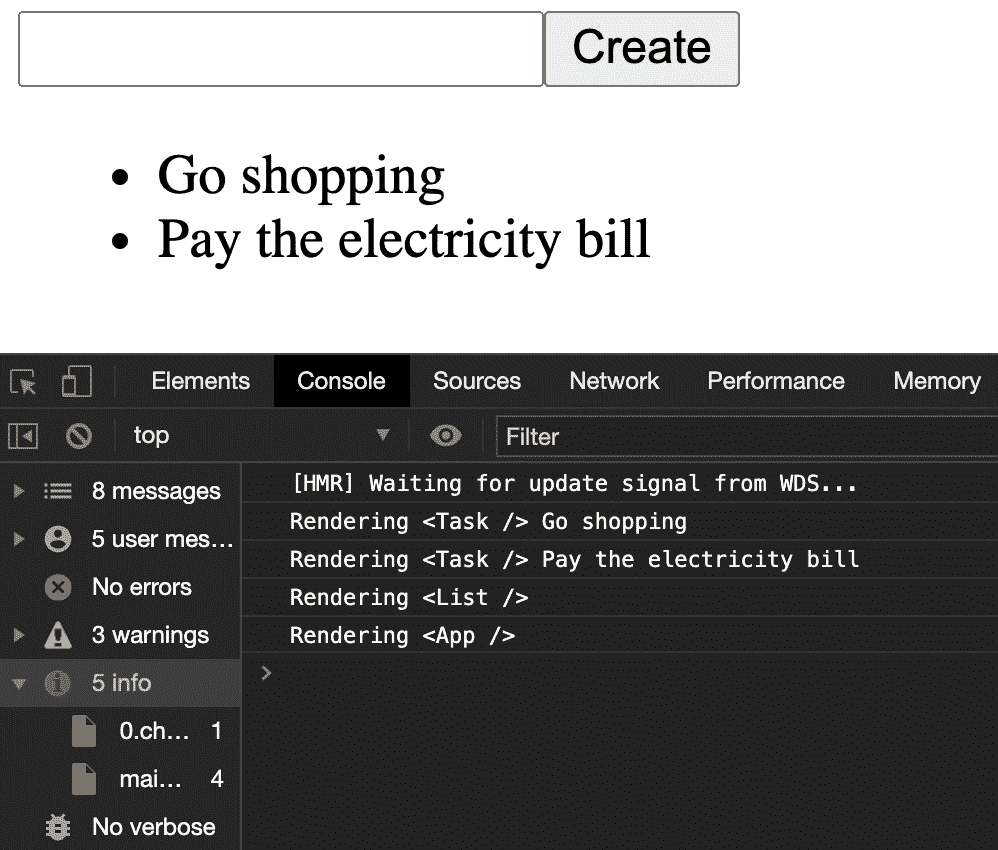

正如你所看到的，当我们渲染我们的待办事项列表时，默认情况下，我们会对`Task`组件执行两次渲染，对`List`执行一次渲染，对`App`组件执行一次渲染。

现在，如果我们尝试在输入框中写一个新的任务，我们会发现，每写一个字母，我们都会再次看到所有这些渲染：

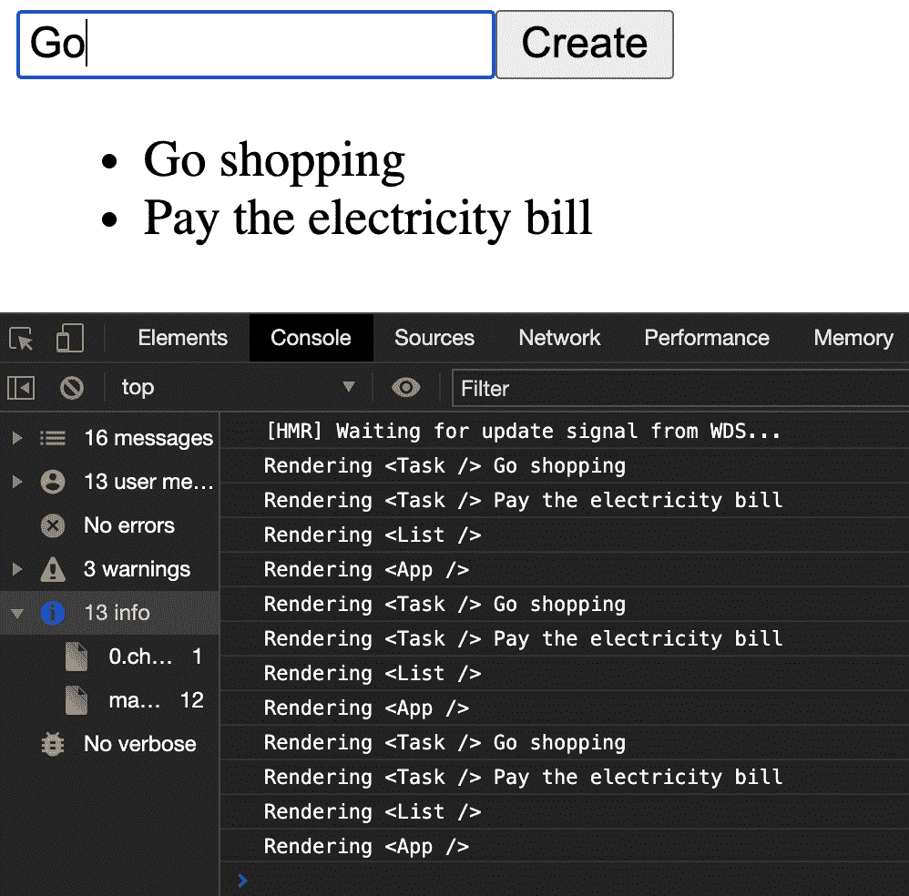

正如你所看到的，只需写`Go`，我们就有了两批新的渲染，所以我们可以确定这个组件的性能不好，这就是`memo`可以帮助我们提高性能的地方。在接下来的部分，我们将学习如何实现`memo`，`useMemo`和`useCallback`来对组件，值和函数进行记忆化。

## 使用 memo 对组件进行记忆化

`memo` **高阶组件（HOC）**类似于 React 类的`PureComponent`，因为它对 props 进行浅比较（意思是表面检查），所以如果我们一直尝试使用相同的 props 渲染组件，组件将只渲染一次并进行记忆。唯一重新渲染组件的方法是当一个 prop 改变其值时。

为了修复我们的组件，避免在输入时多次渲染，我们需要将我们的组件包装在`memo` HOC 中。

我们将要修复的第一个组件是我们的`List`组件，你只需要引入`memo`并将组件包装在`export default`中：

```jsx
import { FC, useEffect, memo } from 'react'

...

export default memo(List)
```

然后你需要对`Task`组件做同样的操作：

```jsx
import { FC, useEffect, memo } from 'react'

...

export default memo(Task)
```

现在，当我们再次尝试在输入框中写`Go`时，让我们看看这一次我们得到了多少次渲染：

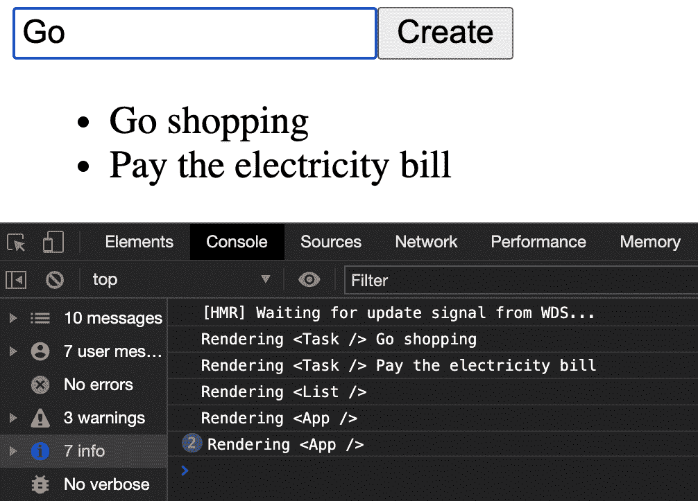

现在，我们只在第一次得到第一批渲染，然后，当我们写`Go`时，我们只得到`App`组件的另外两个渲染，这是完全可以接受的，因为我们正在改变的任务状态（输入值）实际上是`App`组件的一部分。

此外，我们可以看到当我们点击“创建”按钮创建一个新任务时，我们执行了多少次渲染：

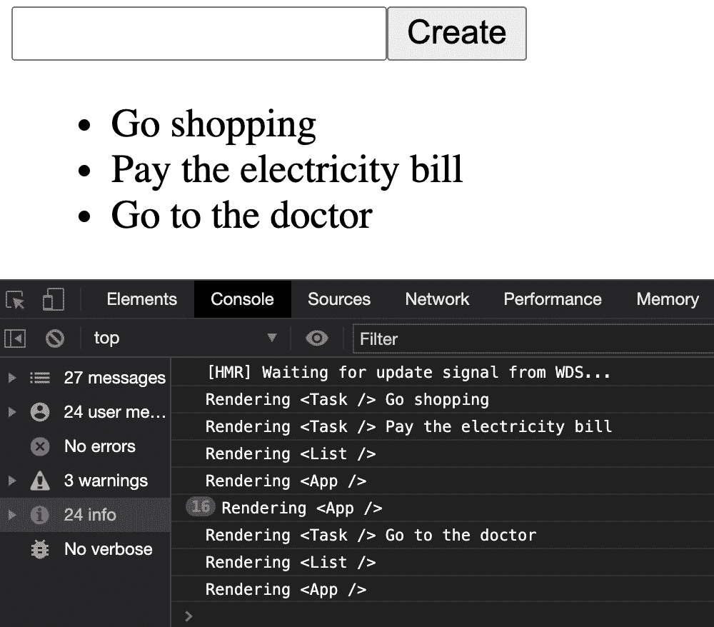

如果你看到，前 16 次渲染是对“去看医生”字符串的字数统计，然后，当你点击“创建”按钮时，你应该看到`Task`组件的一次渲染，`List`的一次渲染，以及`App`组件的一次渲染。正如你所看到的，我们大大提高了性能，并且我们只执行了确实需要渲染的内容。

此时，你可能在想正确的方法是始终向我们的组件添加备忘录，或者你在想为什么 React 不会默认为我们这样做呢？

原因是**性能**，这意味着**除非完全必要，否则不要向所有组件添加`memo`**，否则，浅比较和记忆的过程将比不使用它的性能差。

当涉及确定是否使用`memo`时，我有一个规则，这个规则很简单：**就是不要使用它。**通常，当我们有小组件或基本逻辑时，除非你正在处理**来自某个 API 的大量数据或者你的组件需要执行大量渲染（通常是巨大的列表），或者当你注意到你的应用程序运行缓慢**，我们不需要这个。只有在这种情况下，我才建议使用`memo`。

## 使用`useMemo`进行值的备忘录

假设我们现在想在待办事项列表中实现搜索功能。我们需要做的第一件事是向`App`组件添加一个名为`term`的新状态：

```jsx
const [term, setTerm] = useState('')
```

然后我们需要创建一个名为`handleSearch`的函数：

```jsx
const handleSearch = () => {
 setTerm(task)
}
```

在返回之前，我们将创建`filterTodoList`，它将根据任务筛选待办事项，并在那里添加一个控制台，以查看它被渲染了多少次：

```jsx
const filteredTodoList = todoList.filter((todo: Todo) => {
  console.log('Filtering...')
 return todo.task.toLowerCase().includes(term.toLocaleLowerCase())
})
```

最后，我们需要在已经存在的创建按钮旁边添加一个新按钮：

```jsx
<button onClick={handleSearch}>Search</button>
```

此时，我建议你删除或注释`List`和`Task`组件中的`console.log`，这样我们可以专注于过滤的性能：

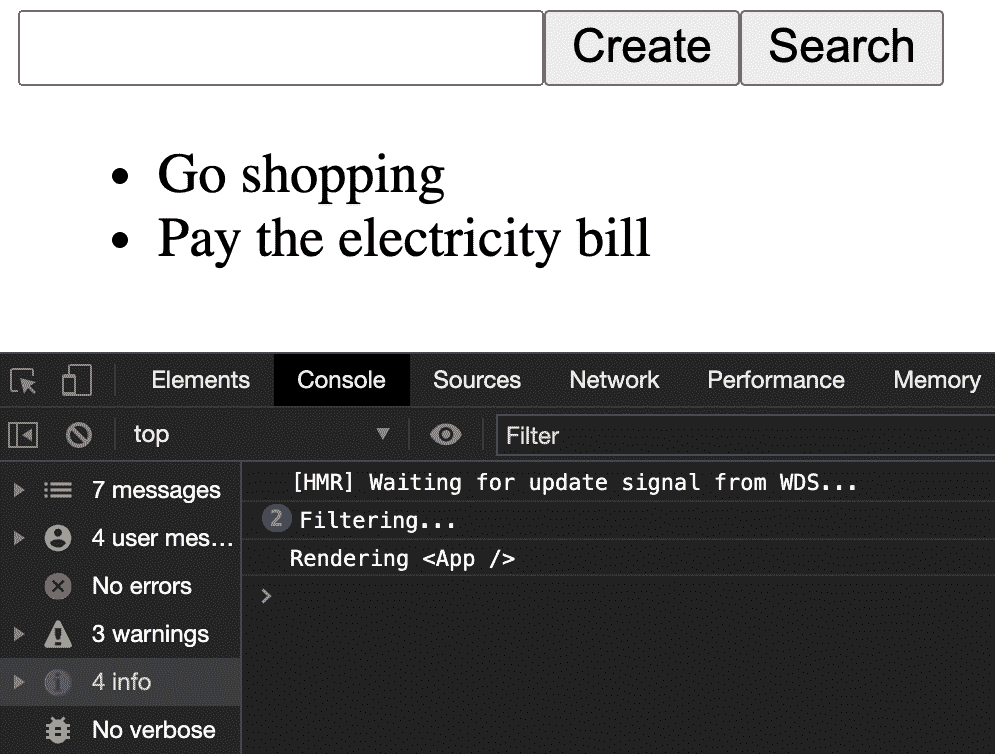

当你再次运行应用程序时，你会看到过滤被执行了两次，然后`App`组件也是，一切看起来都很好，但是这有什么问题吗？尝试在输入框中再次输入“去看医生”，让我们看看你会得到多少次渲染和过滤：

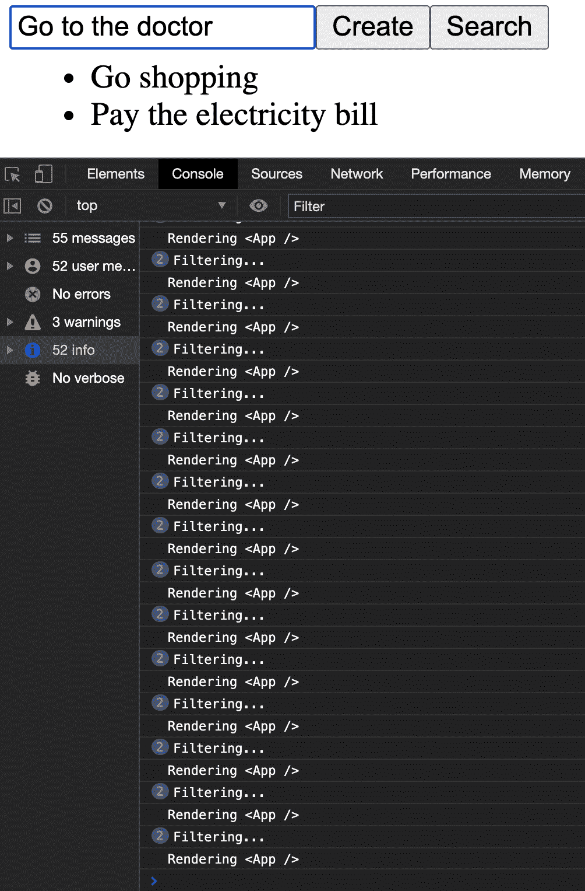

如你所见，每输入一个字母，你会得到两次过滤调用和一次`App`渲染，你不需要是天才就能看出这是糟糕的性能；更不用说如果你正在处理一个大数据数组，情况会更糟，那么我们该如何解决这个问题呢？

`useMemo` Hook 在这种情况下是我们的英雄，基本上，我们需要将我们的过滤器放在`useMemo`中，但首先让我们看一下语法：

```jsx
const filteredTodoList = useMemo(() => SomeProcessHere, [])
```

`useMemo` Hook 将记忆函数的结果（值），并且将有一些依赖项来监听。让我们看看如何实现它：

```jsx
const filteredTodoList = useMemo(() => todoList.filter((todo: Todo) => {
  console.log('Filtering...')
 return todo.task.toLowerCase().includes(term.toLowerCase())
}), [])
```

现在，如果您再次在输入框中输入内容，您会发现过滤不会一直执行，就像以前的情况一样：

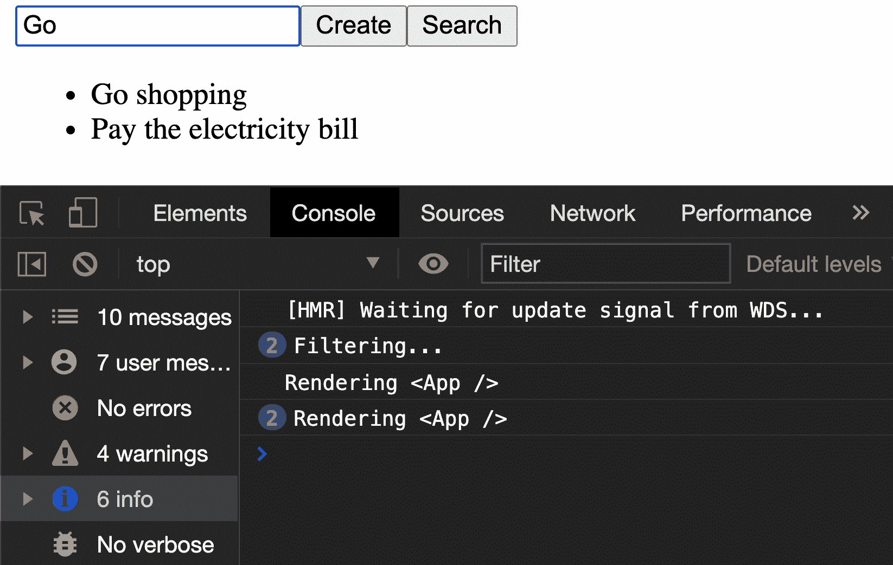

这很好，但仍然有一个小问题。如果您尝试单击搜索按钮，它不会进行过滤，这是因为我们错过了依赖项。实际上，如果您查看控制台警告，您将看到此警告：

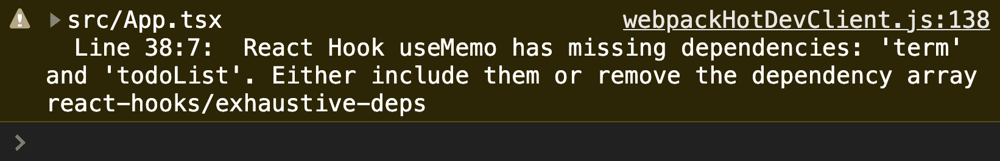

需要将`term`和`todoList`依赖项添加到数组中：

```jsx
const filteredTodoList = useMemo(() => todoList.filter((todo: Todo) => {
  console.log('Filtering...')
 return todo.task.toLowerCase().includes(term.toLocaleLowerCase())
}), [term, todoList])
```

如果您现在写`Go`并单击搜索按钮，它应该可以工作：

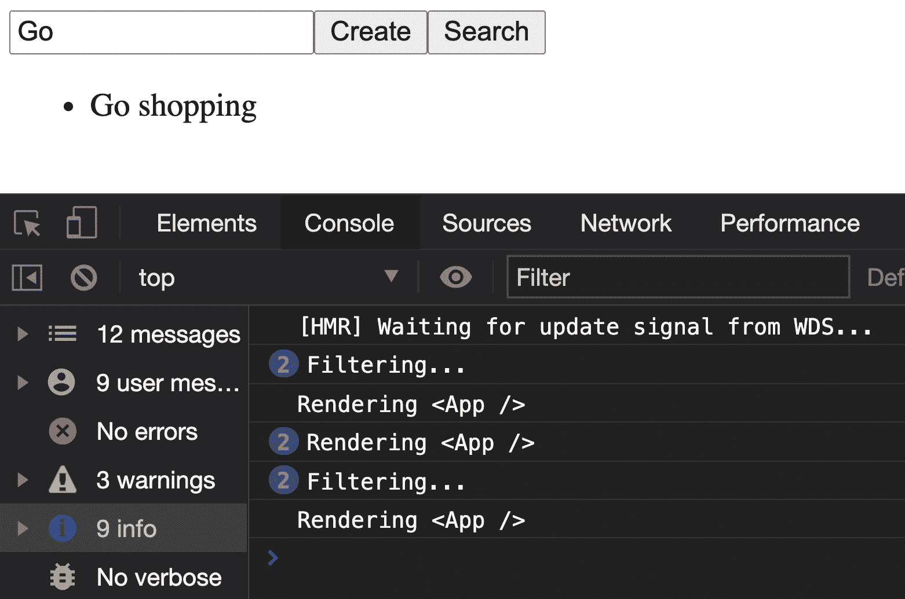在这里，我们必须使用与记忆相同的规则；**直到绝对必要时才使用它。**

## 使用`useCallback`来记忆函数定义

现在我们将添加一个删除任务的功能，以了解`useCallback`的工作原理。我们需要做的第一件事是在我们的`App`组件中创建一个名为`handleDelete`的新函数：

```jsx
const handleDelete = (taskId: number) => {
  const newTodoList = todoList.filter((todo: Todo) => todo.id !== taskId)
  setTodoList(newTodoList)
}
```

然后，您需要将此函数作为属性传递给`List`组件：

```jsx
<List todoList={filteredTodoList} handleDelete={handleDelete} />
```

然后，在我们的`List`组件中，您需要将该属性添加到`Props`接口中：

```jsx
interface Props {
  todoList: Todo[]
  handleDelete: any
}
```

接下来，您需要从属性中提取它并将其传递给`Task`组件：

```jsx
const List: FC<Props> = ({ todoList, handleDelete }) => {
  useEffect(() => {
    // This effect is executed every new render
    console.log('Rendering <List />')
  })

  return (
    <ul>
      {todoList.map((todo: Todo) => (
        <Task 
          key={todo.id} 
          id={todo.id}
          task={todo.task} 
          handleDelete={handleDelete}
        />
      ))}
    </ul>
  )
}
```

在`Task`组件中，您需要创建一个按钮，该按钮将执行`handleDelete onClick`：

```jsx
interface Props {
  id: number
  task: string
  handleDelete: any
}

const Task: FC<Props> = ({ id, task, handleDelete }) => {
  useEffect(() => {
    console.log('Rendering <Task />', task)
  })

  return (
    <li>{task} <button onClick={() => handleDelete(id)}>X</button></li>
  )
}
```

在这一点上，我建议您删除或注释`List`和`Task`组件中的`console.log`，这样我们就可以专注于过滤的性能。现在您应该看到任务旁边的 X 按钮：

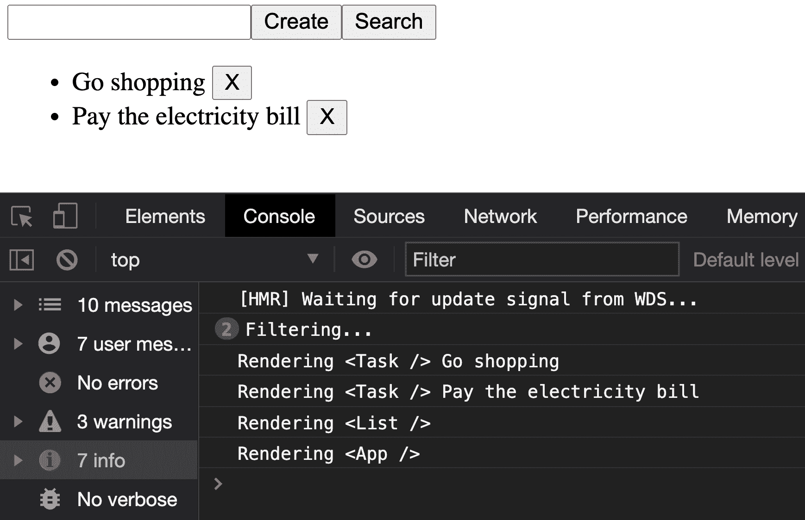

如果您单击`去购物`的 X，应该可以将其删除：

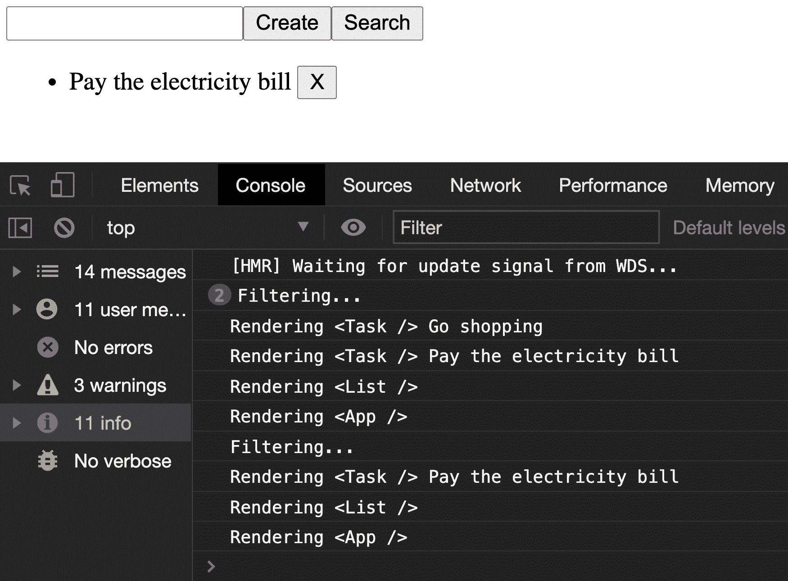

到目前为止，还好，对吧？但是我们在这个实现中又遇到了一个小问题。如果您现在尝试在输入框中写一些内容，比如`去看医生`，让我们看看会发生什么：

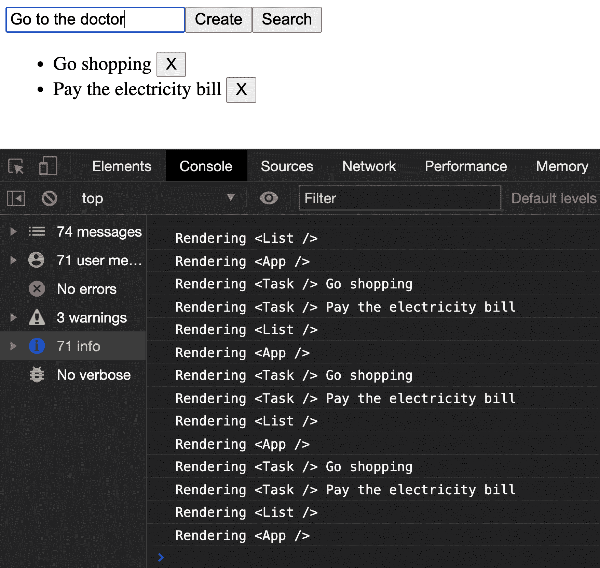

如果您看到，我们再次执行了所有组件的**71**次渲染。此时，您可能会想，*如果我们已经实现了 memo HOC 来记住组件，那么现在发生了什么*？但现在的问题是，我们的`handleDelete`函数被传递给了两个组件，从`App`到`List`，再到`Task`，问题在于每次重新渲染时，这个函数都会被重新生成，也就是说，每次我们写东西时都会重新生成。那么我们如何解决这个问题呢？

`useCallback` Hook 在这种情况下是英雄，并且在语法上与`useMemo`非常相似，但主要区别在于，它不是像`useMemo`那样记住函数的结果值，而是记住**函数定义**：

```jsx
const handleDelete = useCallback(() => SomeFunctionDefinition, [])
```

我们的`handleDelete`函数应该像这样：

```jsx
const handleDelete = useCallback((taskId: number) => {
  const newTodoList = todoList.filter((todo: Todo) => todo.id !== taskId)
  setTodoList(newTodoList)
}, [todoList])
```

现在，如果我们再次写`去看医生`，它应该可以正常工作：

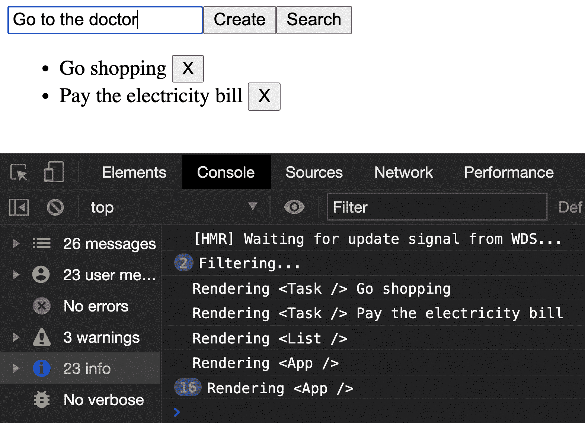

现在，我们只有 23 个渲染，而不是 71 个，这是正常的，我们也能够删除任务：

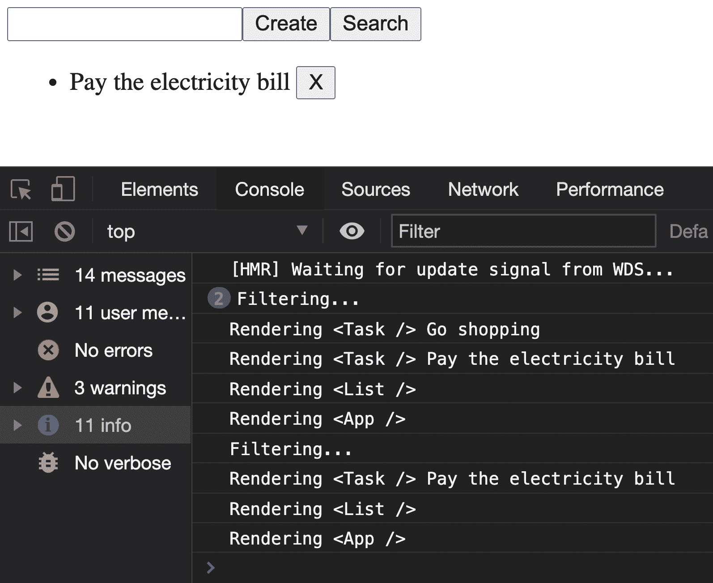

正如您所看到的，`useCallback` Hook 帮助我们显着提高了性能。在下一节中，您将学习如何在`useEffect` Hook 中记忆作为参数传递的函数。

## 作为参数传递给 effect 的记忆函数

有一种特殊情况，我们需要使用`useCallback` Hook，这是当我们将一个函数作为参数传递给`useEffect` Hook 时，例如，在我们的`App`组件中。让我们创建一个新的`useEffect`块：

```jsx
const printTodoList = () => {
  console.log('Changing todoList')
}

useEffect(() => {
  printTodoList()
}, [todoList])
```

在这种情况下，我们正在监听`todoList`状态的变化。如果您运行此代码并创建或删除任务，它将正常工作（请记得首先删除所有其他控制台）：

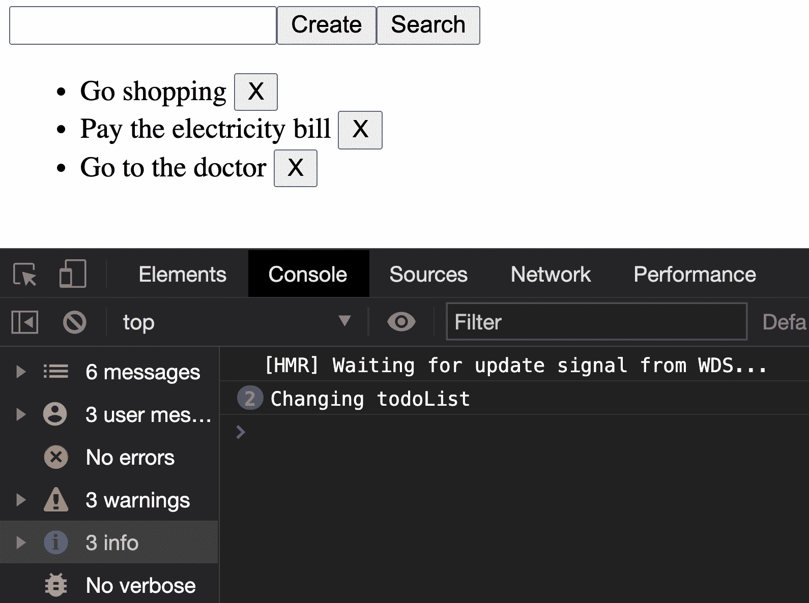

一切都运行正常，但让我们将`todoList`添加到控制台中：

```jsx
const printTodoList = () => {
  console.log('Changing todoList', todoList)
}
```

如果您使用的是 Visual Studio Code，您将收到以下警告：

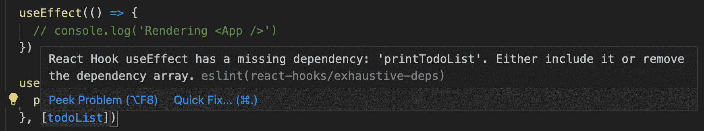

基本上，它要求我们将`printTodoList`函数添加到依赖项中：

```jsx
useEffect(() => {
  printTodoList()
}, [todoList, printTodoList])
```

但现在，在我们这样做之后，我们收到了另一个警告：

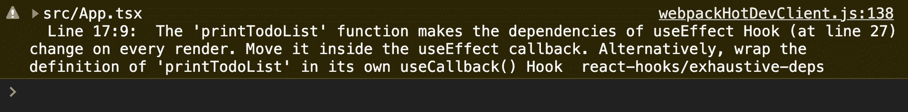

我们收到此警告的原因是我们现在正在操作一个状态（控制状态），这就是为什么我们需要在这个函数中添加`useCallback` Hook 来解决这个问题：

```jsx
const printTodoList = useCallback(() => {
  console.log('Changing todoList', todoList)
}, [todoList])
```

现在，当我们删除一个任务时，我们可以看到`todoList`已经正确更新了：

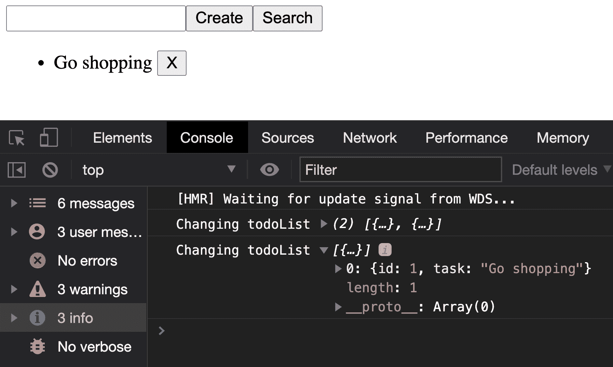

在这一点上，这可能对您来说是信息过载，所以让我们快速回顾一下：

`memo`：

+   记忆**组件**

+   当道具改变时重新记忆

+   避免重新渲染

`useMemo`：

+   记忆**计算值**

+   对于计算属性

+   对于繁重的过程

`useCallback`：

+   记忆**函数定义**以避免在每次渲染时重新定义它。

+   每当将函数作为效果参数传递时使用它。

+   每当将函数作为道具传递给记忆组件时使用它。

最后，不要忘记黄金法则：**除非绝对必要，否则不要使用它们。**

在下一节中，我们将学习如何使用新的`useReducer` Hook。

# 理解 useReducer Hook

您可能有一些使用 Redux（`react-redux`）与类组件的经验，如果是这样，那么您将了解`useReducer`的工作原理。基本概念基本相同：动作、减速器、分发、存储和状态。即使在一般情况下，它似乎与`react-redux`非常相似，它们也有一些不同之处。主要区别在于`react-redux`提供了中间件和包装器，如 thunk、sagas 等等，而`useReducer`只是提供了一个您可以使用来分发纯对象作为动作的`dispatch`方法。此外，`useReducer`默认没有存储；相反，您可以使用`useContext`创建一个，但这只是重复造轮子。

让我们创建一个基本的应用程序来理解`useReducer`的工作原理。您可以通过创建一个新的 React 应用程序开始：

```jsx
create-react-app reducer --template typescript
```

然后，像往常一样，您可以删除`src`文件夹中的所有文件，除了`App.tsx`和`index.tsx`，以启动全新的应用程序。

我们将创建一个基本的`Notes`应用程序，我们可以使用`useReducer`列出、删除、创建或更新我们的笔记。您需要做的第一件事是将我们稍后将创建的`Notes`组件导入到您的`App`组件中：

```jsx
import Notes from './Notes'

function App() {
  return (
    <Notes />
  )
}

export default App
```

现在，在我们的`Notes`组件中，您首先需要导入`useReducer`和`useState`：

```jsx
import { useReducer, useState, ChangeEvent } from 'react'
```

然后，我们需要定义一些我们需要用于`Note`对象、Redux 动作和动作类型的 TypeScript 类型：

```jsx
type Note = {
  id: number
  note: string
}

type Action = {
  type: string
  payload?: any
}

type ActionTypes = {
  ADD: 'ADD'
  UPDATE: 'UPDATE'
  DELETE: 'DELETE'
}

const actionType: ActionTypes = {
  ADD: 'ADD',
  DELETE: 'DELETE',
  UPDATE: 'UPDATE'
}
```

之后，我们需要创建`initialNotes`（也称为`initialState`）并添加一些虚拟笔记：

```jsx
const initialNotes: Note[] = [
  {
    id: 1,
    note: 'Note 1'
  },
  {
    id: 2,
    note: 'Note 2'
  }
]
```

如果您记得减速器的工作原理，那么这将与我们使用`switch`语句处理减速器的方式非常相似，以执行`ADD`、`DELETE`和`UPDATE`等基本操作：

```jsx
const reducer = (state: Note[], action: Action) => {
  switch (action.type) {
    case actionType.ADD:
      return [...state, action.payload]

    case actionType.DELETE: 
      return state.filter(note => note.id !== action.payload)

    case actionType.UPDATE:
      const updatedNote = action.payload
      return state.map((n: Note) => n.id === updatedNote.id ? 
        updatedNote : n)

    default:
      return state
  }
}
```

最后，这个组件非常简单。基本上，你从`useReducer` Hook 中获取笔记和`dispatch`方法（类似于`useState`），你需要传递`reducer`函数和`initialNotes`（`initialState`）：

```jsx
const Notes = () => {
  const [notes, dispatch] = useReducer(reducer, initialNotes)
  const [note, setNote] = useState('')
  ...
}
```

然后，我们有一个`handleSubmit`函数，当我们在输入框中写东西时，可以创建一个新的笔记。然后，我们按下*Enter*键：

```jsx
const handleSubmit = (e: ChangeEvent<HTMLInputElement>) => {
  e.preventDefault()

  const newNote = {
    id: Date.now(),
    note
  }

  dispatch({ type: actionType.ADD, payload: newNote })
}
```

最后，我们使用`map`渲染我们的`Notes`列表，并创建两个按钮，一个用于删除，一个用于更新，然后输入框应该包装在`<form>`标签中：

```jsx
return (
  <div>
    <h2>Notes</h2>

    <ul>
      {notes.map((n: Note) => (
        <li key={n.id}>
          {n.note} {' '}
          <button 
            onClick={() => dispatch({ 
              type: actionType.DELETE,
              payload: n.id
            })}
          >
            X
          </button>

          <button 
            onClick={() => dispatch({ 
              type: actionType.UPDATE,
              payload: {...n, note}
            })}
          >
            Update
          </button>
        </li>
      ))}
    </ul>

    <form onSubmit={handleSubmit}>
      <input 
        placeholder="New note" 
        value={note} 
        onChange={e => setNote(e.target.value)} 
      />
    </form>
  </div>
)

export default Notes
```

如果你运行应用程序，你应该看到以下输出：

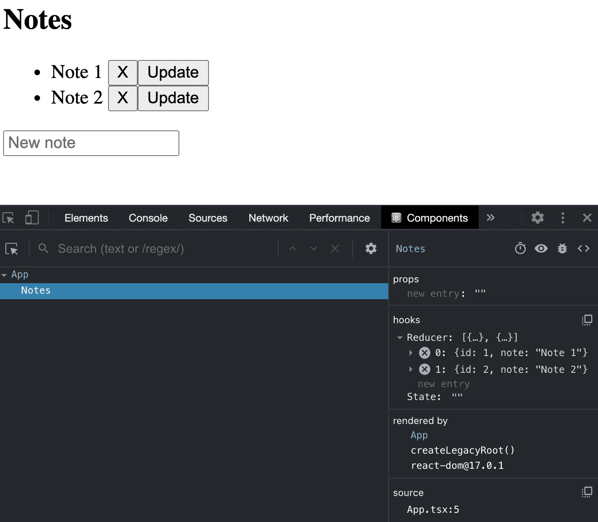

正如你在 React DevTools 中所看到的，`Reducer`对象包含了我们定义的两个笔记作为初始状态。现在，如果你在输入框中写点东西，然后按下*Enter*，你应该能够创建一个新的笔记：

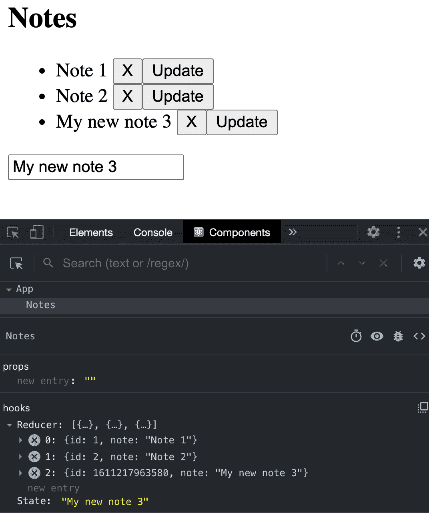

然后，如果你想删除一个笔记，你只需要点击 X 按钮。让我们删除笔记 2：

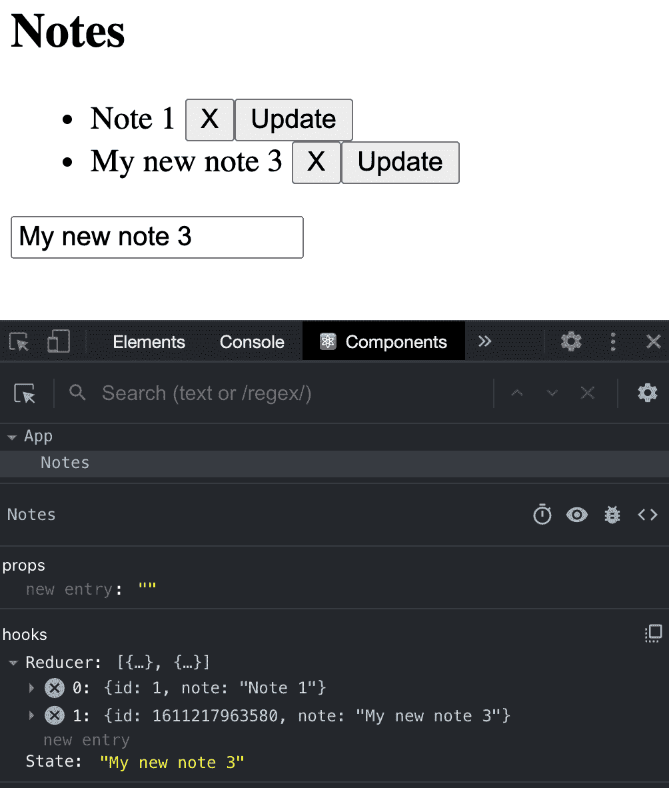

最后，你可以在输入框中写任何你想要的东西，如果你点击更新按钮，你将改变笔记的值：

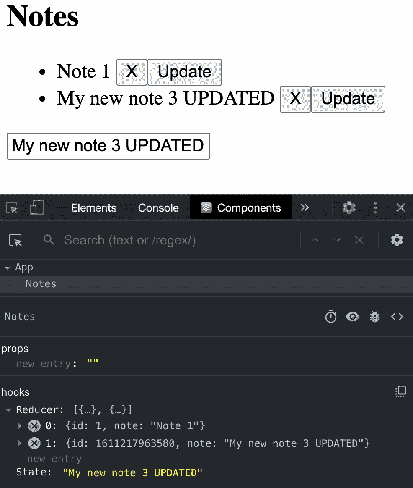

不错，对吧？正如你所看到的，`useReducer` Hook 在`dispatch`方法、动作和 reducers 方面与 redux 基本相同，但主要区别在于这仅限于你的组件及其子组件的上下文，因此，如果你需要一个全局存储来自你整个应用程序，那么你应该使用`react-redux`。

# 总结

希望你喜欢阅读这一章，其中包含了有关新的 React Hooks 的非常好的信息。到目前为止，你已经学会了新的 React Hooks 是如何工作的，如何使用 Hooks 获取数据，如何将类组件迁移到 React Hooks，效果是如何工作的，`memo`、`useMemo`和`useCallback`之间的区别，最后，你学会了`useReducer` Hook 的工作原理，以及与`react-redux`相比的主要区别。这将帮助你提高 React 组件的性能。

在下一章中，我们将介绍一些最流行的组合模式和工具。
