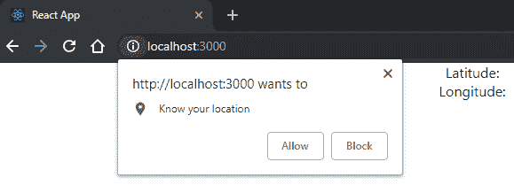
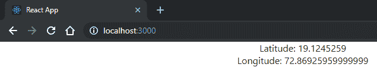

# 第四章：探索流行的组合模式

现在，是时候学习如何使组件有效地相互通信了。React 之所以强大，是因为它让您构建由小型、可测试和可维护组件组成的复杂应用程序成为可能。应用这种范式，您可以控制应用程序的每个部分。

在本章中，我们将介绍一些最流行的组合模式和工具。

我们将涵盖以下主题：

+   组件如何使用 props 和 children 相互通信

+   容器和表示模式以及它们如何使我们的代码更易于维护

+   **高阶组件**（HOCs）是什么，以及如何借助它们更好地构建我们的应用程序

+   子组件模式的功能及其好处

# 技术要求

要完成本章，您将需要以下内容：

+   Node.js 12+

+   Visual Studio Code

您可以在书籍的 GitHub 存储库中找到本章的代码[`github.com/PacktPublishing/React-17-Design-Patterns-and-Best-Practices-Third-Edition/tree/main/Chapter04`](https://github.com/PacktPublishing/React-17-Design-Patterns-and-Best-Practices-Third-Edition/tree/main/Chapter04)。

# 通信组件

重用函数是我们作为开发人员的目标之一，在上一章中，我们看到了 React 如何轻松创建可重用组件。可重用组件可以在应用程序的多个领域之间共享，以避免重复。

具有清晰接口的小组件可以组合在一起，以创建同时强大又易于维护的复杂应用程序。

编写 React 组件非常简单；您只需在渲染中包含它们：

```jsx
const Profile = ({ user }) => ( 
  <> 
 <Picture profileImageUrl={user.profileImageUrl} /> 
    <UserName name={user.name} screenName={user.screenName} /> 
  </> 
)
```

例如，您可以通过简单地将`Picture`组件组合到`Profile`组件中来显示配置文件图像，并将`UserName`组件组合到其中以显示用户的名称和屏幕名称。

通过这种方式，您可以非常快速地生成用户界面的新部分，只需编写几行代码。每当您组合组件时，就像前面的例子一样，您可以使用 props 在它们之间共享数据。Props 是父组件将其数据传递到树中每个需要它（或部分需要它）的组件的方式。

当一个组件将一些属性传递给另一个组件时，不管它们之间的父子关系如何，都称为**所有者**。例如，在前面的片段中，`Profile`不是`Picture`的直接父级（`div`标签是），但`Profile`拥有`Picture`，因为它将属性传递给它。

在下一节中，您将学习有关`children`属性以及如何正确使用它的知识。

## 使用 children 属性

有一个特殊的属性可以从所有者传递给其渲染内定义的组件——`children`。

在 React 文档中，它被描述为**不透明**，因为它是一个不告诉您包含的值的属性。通常在父组件的渲染内定义的子组件会接收作为 JSX 组件本身的属性传递的属性，或者作为`_jsx`函数的第二个参数。组件也可以在其中定义嵌套组件，并且它们可以使用`children`属性访问这些子组件。

假设我们有一个`Button`组件，它有一个`text`属性表示按钮的文本：

```jsx
const Button = ({ text }) => ( 
  <button className="btn">{text}</button> 
)
```

该组件可以以以下方式使用：

```jsx
<Button text="Click me!" />
```

这将呈现以下代码：

```jsx
<button class="btn">Click me!</button>
```

现在，假设我们想在应用程序的多个部分中使用相同的按钮和相同的类名，并且我们还想能够显示不止一个简单的字符串。我们的 UI 由带有文本的按钮，带有文本和图标的按钮以及带有文本和标签的按钮组成。

在大多数情况下，一个好的解决方案是向`Button`添加多个参数，或者创建不同版本的`Button`，每个版本都有自己的专业化，例如`IconButton`。

然而，我们应该意识到`Button`可能只是一个包装器，我们可以在其中呈现任何元素并使用`children`属性：

```jsx
const Button = ({ children }) => ( 
  <button className="btn">{children}</button> 
)
```

通过传递`children`属性，我们不仅限于一个简单的单文本属性，而是可以将任何元素传递给`Button`，并且它将呈现在`children`属性的位置。

在这种情况下，我们在`Button`组件内部包装的任何元素都将作为`button`元素的子元素呈现，其中`btn`是类名。

例如，如果我们想在按钮内部呈现一张图片，并将一些文本包裹在`span`标签中，我们可以这样做：

```jsx
<Button> 
   
  <span>Click me!</span> 
</Button>
```

前面的片段在浏览器中呈现如下：

```jsx
<button class="btn"> 
   
  <span>Click me!</span> 
</button>
```

这是一种非常方便的方式，允许组件接受任何`children`元素，并将这些元素包装在预定义的父元素中。

现在，我们可以将图像、标签甚至其他 React 组件传递到`Button`组件中，并且它们将作为其子元素呈现。正如您在前面的示例中所看到的，我们将`children`属性定义为数组，这意味着我们可以将任意数量的元素作为组件的子元素传递。

我们可以传递单个子元素，如下面的代码所示：

```jsx
<Button> 
 <span>Click me!</span> 
</Button> 
```

让我们在下一节中探索容器和展示模式。

# 探索容器和展示模式

在上一章中，我们看到了如何逐步使耦合的组件可重用。现在我们将看到如何将类似的模式应用到我们的组件中，使它们更清晰和更易维护。

React 组件通常包含*逻辑*和*呈现*的混合。逻辑指的是与 UI 无关的任何内容，例如 API 调用、数据处理和事件处理程序。呈现是指在`render`中创建要显示在 UI 上的元素的部分。

在 React 中，有一些简单而强大的模式，称为**容器**和**展示**，我们在创建组件时可以应用这些模式，帮助我们分离这两个关注点。

在逻辑和呈现之间创建明确定义的边界不仅使组件更具重用性，还提供了许多其他好处，您将在本节中了解到。再次强调，学习新概念的最佳方式之一是通过看到实际示例，所以让我们深入一些代码。

假设我们有一个组件，它使用地理位置 API 来获取用户的位置，并在浏览器中显示纬度和经度。

首先，在我们的`components`文件夹中创建一个`Geolocation.tsx`文件，并使用函数组件定义`Geolocation`组件：

```jsx
import { useState, useEffect } from 'react'
 const Geolocation = () => {}

export default Geolocation
```

然后我们定义我们的状态：

```jsx
const [latitude, setLatitude] = useState<number | null>(null)
const [longitude, setLongitude] = useState<number | null>(null)
```

现在，我们可以使用`useEffect` Hook 来向 API 发送请求：

```jsx
useEffect(() => { 
  if (navigator.geolocation) { 
    navigator.geolocation.getCurrentPosition(handleSuccess)
  } 
}, [])
```

当浏览器返回数据时，我们使用以下函数将结果存储到状态中（将此函数放在`useEffect` Hook 之前）：

```jsx
const handleSuccess = ({ 
 coords: { 
    latitude, 
    longitude 
  } 
}: { coords: { latitude: number; longitude: number }}) => { 
  setLatitude(latitude) 
  setLongitude(longitude)
}
```

最后，我们显示`latitude`和`longitude`的值：

```jsx
return ( 
  <div>
    <h1>Geolocation:</h1>
    <div>Latitude: {latitude}</div> 
    <div>Longitude: {longitude}</div> 
  </div> 
)
```

需要注意的是，在第一次`render`期间，`latitude`和`longitude`是`null`，因为我们在组件挂载时要求浏览器返回坐标。在真实世界的组件中，您可能希望显示一个加载动画，直到数据返回。为此，您可以使用我们在*第二章，清理您的代码*中看到的条件技术之一。

现在，这个组件没有任何问题，并且按预期工作。将它与请求和加载位置的部分分开以便更快地迭代，这不是件好事吗？

我们将使用容器和呈现模式来隔离呈现部分。在这种模式中，每个组件都分成两个较小的组件，每个组件都有其明确的责任。容器了解组件的所有逻辑，并且是调用 API 的地方。它还处理数据操作和事件处理。

呈现组件是定义 UI 的地方，并且以 props 的形式从容器接收数据。由于呈现组件通常是无逻辑的，因此我们可以将其创建为功能性的无状态组件。

没有规定呈现组件不能有状态的规则（例如，它可以在内部保留 UI 状态）。在这种情况下，我们需要一个组件来显示纬度和经度，因此我们将使用一个简单的函数。

首先，我们应该将我们的`Geolocation`组件重命名为`GeolocationContainer`：

```jsx
const GeolocationContainer = () => {...}
```

我们还将把文件名从`Geolocation.tsx`改为`GeolocationContainer.tsx`。

这个规则并不严格，但它是 React 社区中广泛使用的最佳实践，即在`Container`组件名称的末尾添加`Container`并给原始名称呈现。

我们还必须更改`render`的实现并删除其中的所有 UI 部分，如下所示：

```jsx
return ( 
  <Geolocation latitude={latitude} longitude={longitude} />
)
```

正如您在上面的片段中所看到的，我们不是在容器的`return`中创建 HTML 元素，而是只使用呈现元素（接下来我们将创建），并将状态传递给它。状态是`latitude`和`longitude`，默认情况下为`null`，它们包含用户的真实位置，当浏览器触发回调时。

让我们创建一个新文件，名为`Geolocation.tsx`，在其中定义如下的功能组件：

```jsx
import { FC } from 'react'

type Props = {
  latitude: number
  longitude: number
}

const Geolocation: FC<Props> = ({ latitude, longitude }) => (
  <div>
    <h1>Geolocation:</h1>
    <div>Latitude: {latitude}</div>
    <div>Longitude: {longitude}</div>
  </div>
)

export default Geolocation
```

功能组件是定义用户界面的一种非常优雅的方式。它们是纯函数，给定一个 `state`，返回其中的元素。在这种情况下，我们的函数从所有者那里接收 `latitude` 和 `longitude`，然后返回标记结构以显示它。

如果您第一次在浏览器中运行组件，浏览器将要求您允许其了解您的位置：



在您允许浏览器了解您的位置之后，您将看到类似于这样的东西：



遵循容器和展示模式，我们创建了一个愚蠢的可重用组件，我们可以将其放入我们的样式指南中，以便我们可以向其传递虚假坐标。如果在应用程序的其他部分中我们需要显示相同的数据结构，我们不需要创建一个新的组件；我们只需将这个组件包装到一个新的容器中，例如可以从不同的端点加载纬度和经度。

与此同时，我们团队中的其他开发人员可以通过添加一些错误处理逻辑来改进使用地理位置的容器，而不会影响其展示。他们甚至可以构建一个临时的展示组件来显示和调试数据，然后在准备就绪时用真正的展示组件替换它。

能够并行在同一个组件上工作对团队来说是一个巨大的胜利，特别是对于那些构建界面是一个迭代过程的公司。

这种模式简单但非常强大，当应用于大型应用程序时，它可以在开发速度和项目可维护性方面产生巨大差异。另一方面，没有真正的原因应用这种模式可能会给我们带来相反的问题，并使 **代码库** 变得不太有用，因为它涉及创建更多的文件和组件。

因此，当我们决定一个组件必须按照容器和展示模式进行重构时，我们应该仔细考虑。一般来说，正确的做法是从一个单一的组件开始，只有当逻辑和展示过于耦合时才进行拆分，而它们本不应该耦合在一起。

在我们的例子中，我们从一个单一的组件开始，然后意识到我们可以将 API 调用与标记分开。决定将什么放在容器中，什么放在展示中并不总是直截了当的；以下几点应该帮助您做出决定：

以下是容器组件的特点：

+   它们更关注于行为。

+   它们渲染它们的展示组件。

+   它们进行 API 调用和数据操作。

+   它们定义事件处理程序。

以下是展示组件的特点：

+   它们更关注于视觉表现。

+   它们渲染 HTML 标记（或其他组件）。

+   它们以 props 的形式从父组件接收数据。

+   它们通常被写成无状态的功能组件。

正如您所看到的，这些模式形成了一个非常强大的工具，将帮助您更快地开发您的 Web 应用程序。让我们在下一节中看看 HOCs 是什么。

# 理解 HOCs

在《第二章，清理你的代码》的*函数式编程*部分，我们提到了**高阶函数**（**HOFs**）的概念，它们是这样的函数，给定一个函数，用一些额外的行为增强它，返回一个新的函数。当我们将 HOFs 的概念应用到组件上时，我们称之为**高阶组件**（或简称**HOCs**）。

首先，让我们看看`HoC`是什么样子的：

```jsx
const HoC = Component => EnhancedComponent
```

HOCs 是以一个组件作为输入，并返回一个增强的组件作为输出的函数。

让我们从一个非常简单的例子开始，以了解增强组件是什么样子的。

假设出于某种原因，您需要将相同的`className`属性附加到每个组件上。您可以去改变所有的`render`方法，通过为每个方法添加`className`属性，或者您可以编写一个 HOC，比如下面这样：

```jsx
const withClassName = Component => props => ( 
  <Component {...props} className="my-class" /> 
)
```

在 React 社区中，对于 HOCs 来说，使用`with`前缀是非常常见的。

最初，上面的代码可能有点难以理解；让我们一起来看一下。

我们声明一个`withClassName`函数，它接受一个`Component`并返回另一个函数。返回的函数是一个功能组件，它接收一些 props 并渲染原始组件。收集到的 props 被展开，并且一个带有`"my-class"`值的`className`属性被传递给功能组件。

HOC 通常会将它们接收到的 props 展开到组件上，因为它们倾向于是透明的，只添加新的行为。

这很简单，也不是很有用，但它应该让您更好地理解 HOCs 是什么样子的。现在让我们看看如何在我们的组件中使用`withClassName` HOC。

首先，我们创建一个无状态的函数组件，它接收类名并将其应用于`div`标签：

```jsx
const MyComponent = ({ className }) => ( 
  <div className={className} /> 
)
```

而不是直接使用组件，我们将其传递给 HOC，如下所示：

```jsx
const MyComponentWithClassName = withClassName(MyComponent)
```

将我们的组件包装到`withClassName`函数中，确保它接收`className`属性。

现在，让我们继续做一些更令人兴奋的事情，让我们创建一个 HOC 来检测`InnerWidth`。首先，我们必须创建一个接收`Component`的函数：

```jsx
import { useEffect, useState } from 'react' const withInnerWidth = Component => props => {
  return <Component {...props} />
}
```

您可能已经注意到 HOC 的命名模式。习惯上，使用`with`模式为增强组件提供一些信息的 HOC 添加前缀。

现在您需要定义`innerWidth`状态和`handleResize`函数：

```jsx
const withInnerWidth = Component => props => {
  const [innerWidth, setInnerWidth] = useState(window.innerWidth)

  const handleResize = () => {
    setInnerWidth(window.innerWidth)
  }

  return <Component {...props} />
}
```

然后我们添加效果：

```jsx
useEffect(() => {
  window.addEventListener('resize', handleResize)

  return () => { // <<< This emulates the componentWillUnmount
    window.removeEventListener('resize', handleResize)
  }
}, []) // <<< This emulates the componentDidMount
```

最后，原始组件以以下方式呈现：

```jsx
return <Component {...props} innerWidth={innerWidth} />
```

正如您在这里所注意到的，我们正在传播 props，就像我们之前看到的那样，但我们也传递了`innerWidth`状态。

我们将`innerWidth`值存储为状态以实现原始行为，但我们不会污染组件的状态；我们使用 props 代替。

使用 props 始终是强制可重用性的好解决方案。

现在，使用 HOC 并获取`innerWidth`值非常简单。

新的 React Hooks 可以轻松地通过创建自定义 Hooks 来替代 HOC。

我们创建一个期望`innerWidth`作为属性的函数组件：

```jsx
const MyComponent = ({ innerWidth }) => { 
  console.log('window.innerWidth', innerWidth)
  ... 
}
```

我们将其改进如下：

```jsx
const MyComponentWithInnerWidth = withInnerWidth(MyComponent)
```

首先，我们不会污染任何状态，也不需要组件实现任何函数。这意味着组件和 HOC 没有耦合，它们都可以在应用程序中重复使用。

再次，使用 props 而不是 state 让我们的组件变得简单，这样我们就可以在我们的样式指南中使用它，忽略任何复杂的逻辑，只需传递 props。

在这种特殊情况下，我们可以为我们支持的不同`innerWidth`大小创建一个组件。

考虑以下示例：

```jsx
<MyComponent innerWidth={320} /> 
```

或考虑以下情况：

```jsx
<MyComponent innerWidth={960} /> 
```

正如您所看到的，通过使用 HOC，我们可以传递一个组件，然后返回一个具有额外功能的新组件。一些最常见的 HOC 是 Redux 中的`connect`和 Relay 中的`createFragmentContainer`。

# 理解 FunctionAsChild

React 社区中有一种模式正在获得共识，被称为`FunctionAsChild`。它被广泛应用于流行的`react-motion`库中，我们将在*第七章，为浏览器编写代码*中看到。

主要概念是，我们不是以组件的形式传递子组件，而是定义一个可以从父组件接收参数的函数。让我们看看它是什么样子的：

```jsx
const FunctionAsChild = ({ children }) => children()
```

正如你所看到的，`FunctionAsChild`是一个具有函数作为`children`属性定义的组件，而不是作为 JSX 表达式使用，它被调用。

前面的组件可以这样使用：

```jsx
<FunctionAsChild> 
  {() => <div>Hello, World!</div>} 
</FunctionAsChild>
```

就像它看起来那样简单：`render`方法中触发`children`函数，并返回包裹在`div`标签中的`Hello, World!`文本，这将显示在屏幕上。

让我们深入一个更有意义的例子，父组件向`children`函数传递一些参数。

创建一个`Name`组件，它期望一个函数作为`children`并将`World`字符串传递给它：

```jsx
const Name = ({ children }) => children('World')
```

前面的组件可以这样使用：

```jsx
<Name> 
  {name => <div>Hello, {name}!</div>} 
</Name>
```

代码片段再次呈现`Hello, World!`，但这次名称是由父组件传递的。应该清楚这种模式是如何工作的，所以让我们看看这种方法的优势。

第一个好处是，我们可以在运行时包装组件，而不是使用 HOCs 时传递固定属性。

一个很好的例子是`Fetch`组件，它从 API 端点加载一些数据并将其返回给`children`函数：

```jsx
<Fetch url="..."> 
  {data => <List data={data} />} 
</Fetch> 
```

其次，使用这种方法组合组件不会强制`children`使用一些预定义的属性名称。由于函数接收变量，它们的名称可以由使用组件的开发人员决定。这使得`FunctionAsChild`解决方案更加灵活。

最后但并非最不重要的是，包装器非常可重用，因为它不对接收到的`children`做任何假设——它只是期望一个函数。因此，相同的`FunctionAsChild`组件可以在应用程序的不同部分使用，为各种`children`组件提供服务。

# 总结

在本章中，我们学习了如何组合我们的可重用组件并使它们有效地进行通信。Props 是一种将组件解耦并创建清晰和明确定义接口的方法。

然后，我们学习了 React 中一些最有趣的组合模式。第一个是所谓的容器，另一个是表示模式。这些模式帮助我们将逻辑与呈现分离，并创建具有单一责任的更专业化的组件。

我们学会了如何处理上下文，而无需将我们的组件与其耦合，这要归功于 HOCs。最后，我们看到了如何通过遵循`FunctionAsChild`模式来动态组合组件。

在下一章中，我们将学习 GraphQL 以及如何创建 JWT 令牌，执行登录操作，并使用 Sequelize 创建模型。
