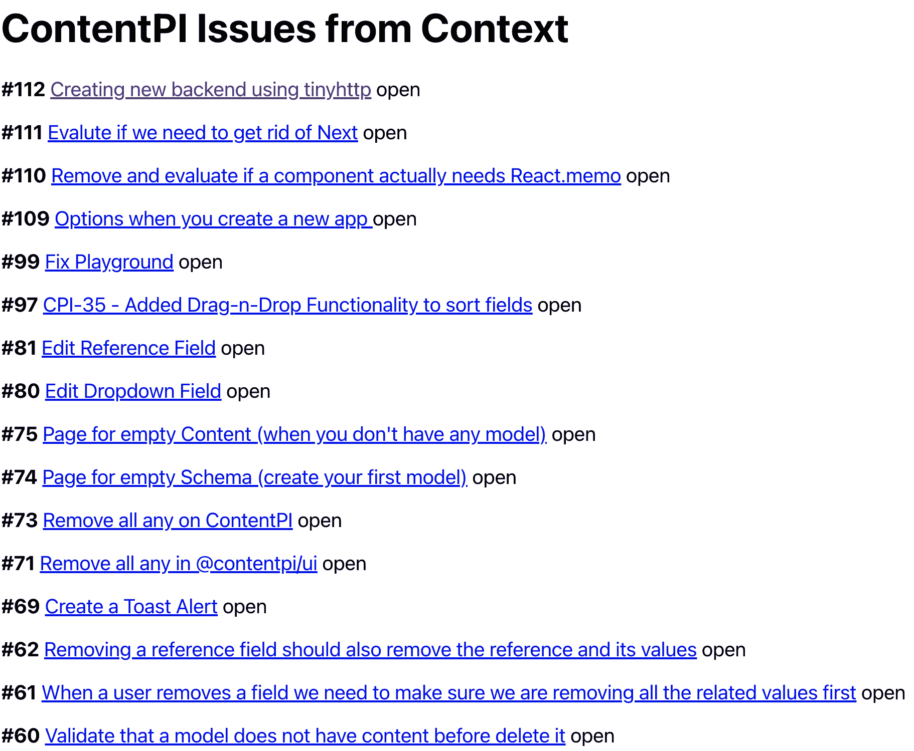
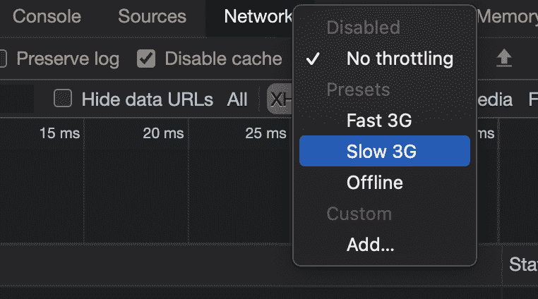
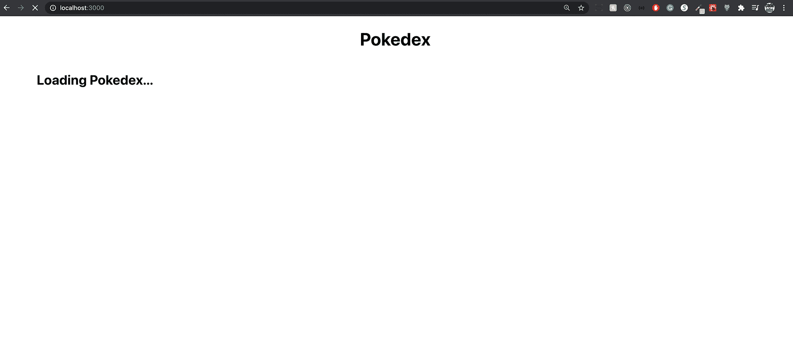
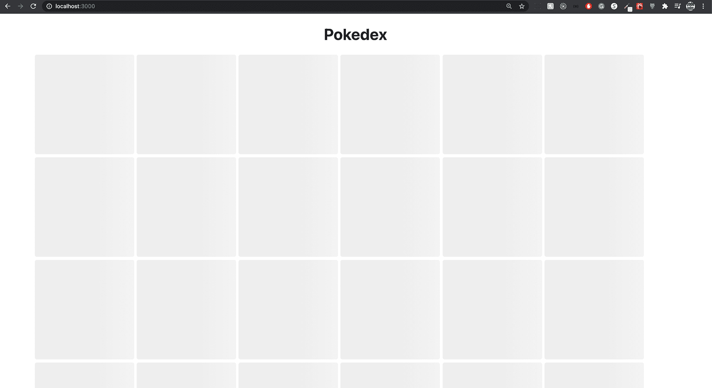
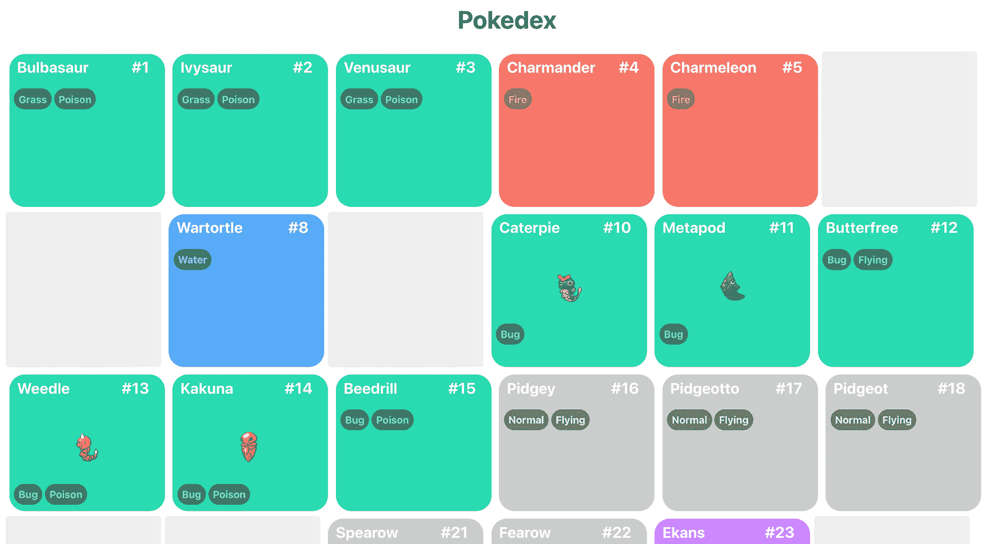
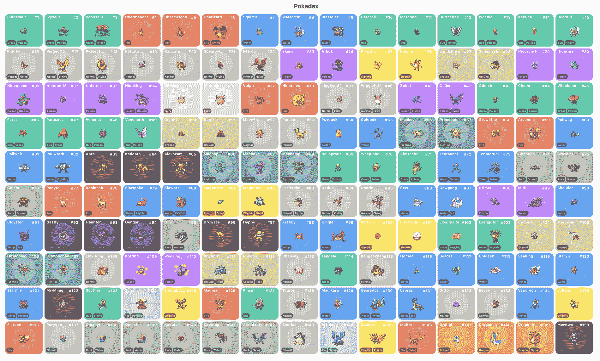
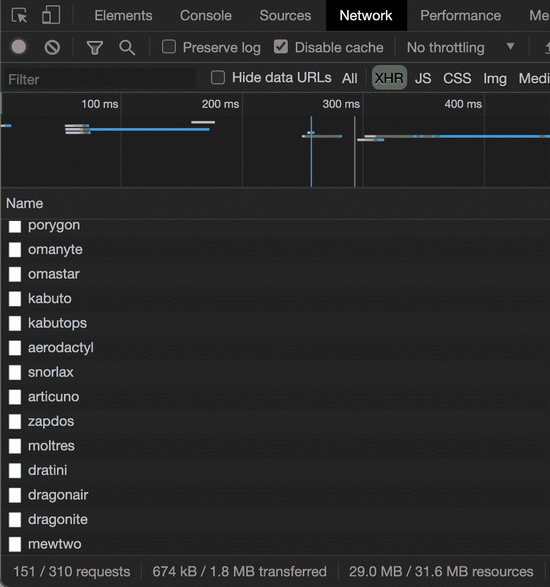
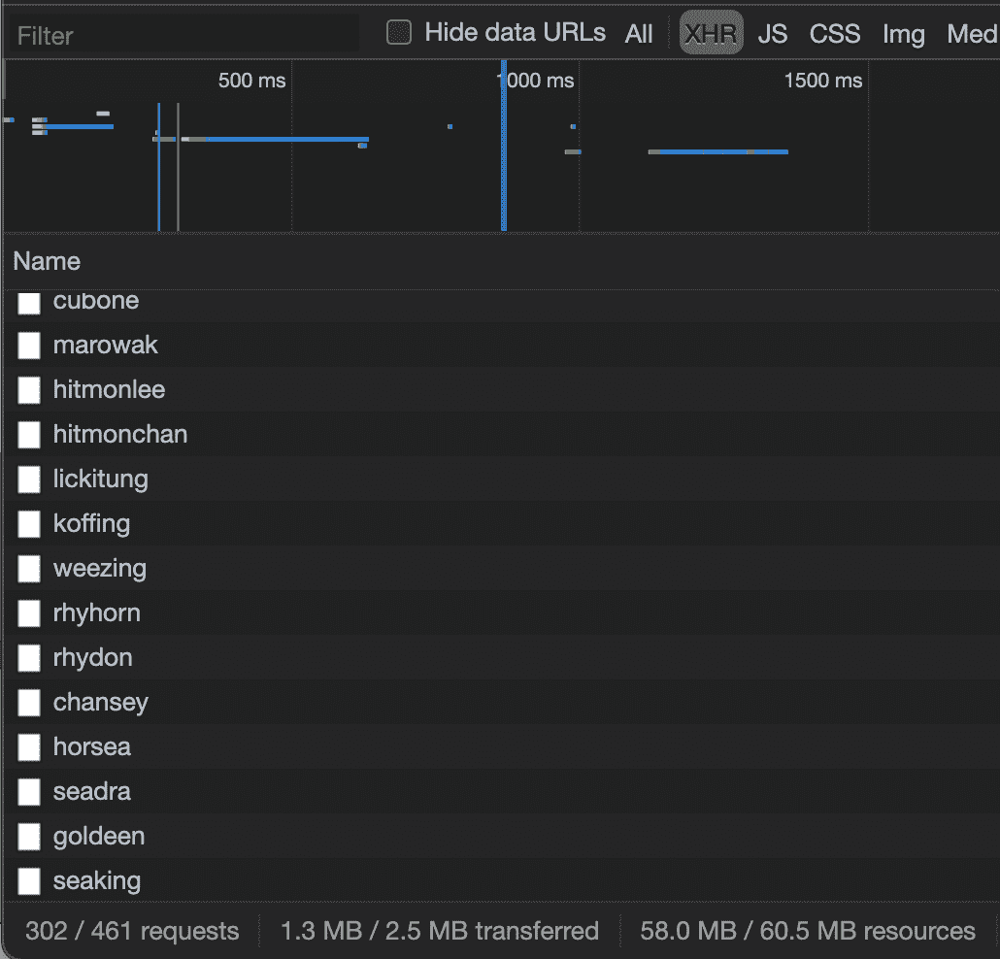

# 第六章：管理数据

**适当的数据获取**经历了一些最常见的模式，以使子代和父代使用回调进行通信。我们将学习如何使用一个共同的父代来在不直接连接的组件之间共享数据。然后我们将开始学习新的 React 上下文 API 和 React Suspense。

在本章中，我们将涵盖以下主题：

+   React 上下文 API

+   如何使用 useContext 消耗上下文

+   如何使用 React Suspense 与 SWR

# 技术要求

要完成本章，您将需要以下内容：

+   Node.js 12+

+   Visual Studio Code

您可以在书的 GitHub 存储库中找到本章的代码：[`github.com/PacktPublishing/React-17-Design-Patterns-and-Best-Practices-Third-Edition/tree/main/Chapter06`](https://github.com/PacktPublishing/React-17-Design-Patterns-and-Best-Practices-Third-Edition/tree/main/Chapter06)。

# 介绍 React 上下文 API

自版本 16.3.0 以来，React 上下文 API 已正式添加；在此之前，它只是实验性的。新的上下文 API 是一个改变游戏规则的东西。许多人正在摆脱 Redux，以使用新的上下文 API。上下文提供了一种在组件之间共享数据的方法，而无需将 prop 传递给所有子组件。

让我们看一个基本示例，我们可以在其中使用新的上下文 API。我们将在*第三章 React Hooks*中做相同的示例，我们在那里获取了一些 GitHub 问题，但现在使用上下文 API。

## 创建我们的第一个上下文

您需要做的第一件事是创建问题上下文。为此，您可以在`src`文件夹内创建一个名为`contexts`的文件夹，然后在其中添加`Issue.tsx`文件。

然后，您需要从 React 和`axios`导入一些函数：

```jsx
import { FC, createContext, useState, useEffect, ReactElement, useCallback } from 'react'
import axios from 'axios'
```

在这一点上，很明显您应该安装`axios`。如果您还没有，请执行以下操作：

```jsx
npm install axios 
npm install --save-dev @types/axios
```

然后我们需要声明我们的接口：

```jsx
export type Issue = {
  number: number
  title: string
  url: string
  state: string
}

interface Issue_Context {
  issues: Issue[]
  url: string
}

interface Props {  url: string
}
```

在此之后，我们需要做的第一件事是使用`createContext`函数创建我们的上下文，并定义我们要导出的值：

```jsx
export const IssueContext = createContext<Issue_Context>({
  issues: [],
  url: ''
})
```

一旦我们有了`IssueContext`，我们需要创建一个组件，我们可以在其中接收 props，设置一些状态，并使用`useEffect`执行获取，然后我们渲染`IssueContext.Provider`，在那里我们指定上下文（值）我们将导出：

```jsx
const IssueProvider: FC<Props> = ({ children, url })  => {
  // State
  const [issues, setIssues] = useState<Issue[]>([])

  const fetchIssues = useCallback(async () => {
    const response = await axios(url)

    if (response) {
      setIssues(response.data)
    }
  }, [url])

  // Effects
  useEffect(() => {
    fetchIssues()
  }, [fetchIssues])

  const context = {
    issues,
    url
  }

  return <IssueContext.Provider value={context}>{children}</IssueContext.Provider>
}

export default IssueProvider
```

正如您所知，每当您想在`useEffect` Hook 中使用函数时，您需要使用`useCallback` Hook 包装您的函数。如果您想使用`async/await`，一个好的做法是将其放在一个单独的函数中，而不是直接放在`useEffect`中。

一旦我们执行获取并将数据放入我们的`issues`状态中，然后我们将所有要导出为上下文的值添加到`IssueContext.Provider`中，然后当我们渲染`IssueContext.Provider`时，我们将上下文传递给`value`属性，最后，我们渲染组件的子组件。

## 用提供者包装我们的组件

您消费上下文的方式分为两部分。第一部分是您用上下文提供者包装您的应用程序，因此这段代码可以添加到`App.tsx`（通常所有提供者都在父组件中定义）。

请注意，这里我们正在导入`IssueProvider`组件：

```jsx
// Providers
import IssueProvider from '../contexts/Issue'

// Components
import Issues from './Issues'

const App = () => {
  return (
    <IssueProvider url=
      "https://api.github.com/repos/ContentPI/ContentPI/issues">
      <Issues />
    </IssueProvider>
  )
}

export default App;
```

正如您所看到的，我们正在用`IssueProvider`包装`Issues`组件，这意味着在`Issues`组件内部，我们可以使用我们的上下文并获取问题的值。

有时候很多人会感到困惑。如果您忘记用提供者包装您的组件，那么您就无法在组件内部使用您的上下文，而困难的部分是您可能不会得到任何错误；您只会得到一些未定义的数据，这使得很难识别。

## 使用 useContext 消费上下文

如果您已经在`App.tsx`中放置了`IssueProvider`，现在您可以通过使用`useContext` Hook 在`Issues`组件中消费您的上下文。

请注意，这里我们正在导入`IssueContext`上下文（在`{}`之间）：

```jsx
// Dependencies
import { FC, useContext } from 'react'

// Contexts
import { IssueContext, Issue } from '../contexts/Issue'

const Issues: FC = () => {
  // Here you consume your Context, and you can grab the issues value.
  const { issues, url } = useContext(IssueContext)

  return (
    <>
      <h1>ContentPI Issues from Context</h1>

      {issues.map((issue: Issue) => (
        <p key={`issue-${issue.number}`}>
          <strong>#{issue.number}</strong> {' '}
          <a href={`${url}/${issue.number}`}>{issue.title}</a> {' '}
          {issue.state}
        </p>
      ))}
    </>
  )
}

export default Issues
```

如果你做得正确，你应该能够看到问题列表：



当您想要将应用程序与数据分离并在其中执行所有获取操作时，上下文 API 非常有用。当然，上下文 API 有多种用途，也可以用于主题设置或传递函数；这完全取决于您的应用程序。

在下一节中，我们将学习如何使用 SWR 库实现 React Suspense。

# 介绍 React Suspense 与 SWR

React Suspense 是在 React 16.6 中引入的。现在（2021 年 4 月）这个功能仍然是实验性的，你不应该在生产应用程序中使用它。Suspense 允许您暂停组件渲染直到满足条件。您可以渲染一个加载组件或任何您想要的作为 Suspense 的回退。目前只有两种用例：

+   代码拆分：当您拆分应用程序并等待在用户要访问时下载应用程序的一部分时

+   **数据获取**：当您获取数据时

在这两种情况下，您可以呈现一个回退，通常可以是加载旋转器、一些加载文本，甚至更好的是占位符骨架。

**警告**：新的 React Suspense 功能仍处于实验阶段，因此我建议您不要在生产环境中使用它，因为它尚未在稳定版本中可用。

## 介绍 SWR

**过时-同时重新验证**（**SWR**）是用于数据获取的 React Hook；它是一种 HTTP 缓存失效策略。SWR 是一种策略，首先从缓存中返回数据（过时），然后发送获取请求（重新验证），最后返回最新的数据，并由创建 Next.js 的公司 Vercel 开发。

## 构建宝可梦图鉴！

我找不到一个更好的例子来解释 React Suspense 和 SWR，比构建宝可梦图鉴更好的例子。我们将使用一个公共的宝可梦 API（[`pokeapi.co`](https://pokeapi.co)）；* gotta catch 'em all *！

您需要做的第一件事是安装一些软件包：

```jsx
npm install swr react-loading-skeleton styled-components
```

对于这个例子，您需要在`src/components/Pokemon`目录下创建 Pokemon 目录。我们需要做的第一件事是创建一个 fetcher 文件，我们将在其中执行我们的请求，以便使用 SWR。

此文件应创建在`src/components/Pokemon/fetcher.ts`：

```jsx
const fetcher = (url: string) => {
  return fetch(url).then((response) => {
    if (response.ok) {
      return response.json()
    }

    return {
      error: true
    }
  })
}

export default fetcher
```

如果您注意到，如果响应不成功，我们将返回一个带有错误的对象。这是因为有时我们可以从 API 获取 404 错误，这可能导致应用程序崩溃。

创建了 fetcher 文件后，让我们修改`App.tsx`以配置`SWRConfig`并启用 Suspense：

```jsx
// Dependencies
import { SWRConfig } from 'swr'

// Components
import PokeContainer from './Pokemon/PokeContainer'
import fetcher from './Pokemon/fetcher'

// Styles
import { StyledPokedex, StyledTitle } from './Pokemon/Pokemon.styled'

const App = () => {
  return (
    <> 
      <StyledTitle>Pokedex</StyledTitle> 

      <SWRConfig
        value={{
          fetcher,
          suspense: true,
        }}
      >
        <StyledPokedex>
          <PokeContainer />
        </StyledPokedex>
 </SWRConfig>
    </>
  )
}

export default App
```

正如您所看到的，我们需要将我们的`PokeContainer`组件包装在`SWRConfig`内，以便能够获取数据。`PokeContainer`组件将是我们的父组件，在那里我们将添加我们的第一个 Suspense。此文件位于`src/components/Pokemon/PokeContainer.tsx`：

```jsx
import { FC, Suspense } from 'react'

import Pokedex from './Pokedex'

const PokeContainer: FC = () => {
  return (
    <Suspense fallback={<h2>Loading Pokedex...</h2>}>
      <Pokedex />
    </Suspense>
  )
}

export default PokeContainer
```

正如您所看到的，我们为我们的第一个 Suspense 定义了一个回退，即`加载宝可梦图鉴...`文本。您可以在其中呈现任何您想要的东西，React 组件或纯文本。然后，我们在 Suspense 中有我们的`Pokedex`组件。

现在让我们看看我们的`Pokedex`组件，我们将首次使用`useSWR` Hook 来获取数据：

```jsx
// Dependencies
import { FC, Suspense } from 'react'
import useSWR from 'swr'

// Components
import LoadingSkeleton from './LoadingSkeleton'
import Pokemon from './Pokemon'

import { StyledGrid } from './Pokemon.styled'

const Pokedex: FC = () => {
  const { data: { results } } = 
 useSWR('https://pokeapi.co/api/v2/pokemon?limit=150')

  return (
    <>
      {results.map((pokemon: { name: string }) => (
        <Suspense fallback={<StyledGrid><LoadingSkeleton /></StyledGrid>}>
          <Pokemon key={pokemon.name} pokemonName={pokemon.name} />
        </Suspense>
      ))}
    </>
  )
}

export default Pokedex
```

正如你所看到的，我们正在获取前 150 只宝可梦，因为我是老派的，那些是第一代。现在我不知道有多少只宝可梦存在。另外，如果你注意到，我们正在获取来自数据的`results`变量（这是 API 的实际响应）。然后我们将我们的结果映射到每个宝可梦上，但我们为每个宝可梦添加了一个悬念组件，带有`<LoadingSkeleton />`回退（`<StyledGrid />`有一些 CSS 样式，使其看起来更漂亮），最后，我们将`pokemonName`传递给我们的`<Pokemon>`组件，这是因为第一次获取只带来了宝可梦的名字，但我们需要再次获取实际的宝可梦数据（名字、类型、力量等）。

然后，最后，我们的宝可梦组件将通过宝可梦的名字执行特定的获取并渲染数据：

```jsx
// Dependencies
import { FC } from 'react'
import useSWR from 'swr'

// Styles
import { StyledCard, StyledTypes, StyledType, StyledHeader } from './Pokemon.styled'

type Props = {
  pokemonName: string
}

const Pokemon: FC<Props> = ({ pokemonName }) => {
  const { data, error } = 
 useSWR(`https://pokeapi.co/api/v2/pokemon/${pokemonName}`)

  // Do you remember the error we set on the fetcher?
  if (error || data.error) {
    return <div />
  }

  if (!data) {
    return <div>Loading...</div>
  }

  const { id, name, sprites, types } = data
  const pokemonTypes = types.map((pokemonType: any) => 
    pokemonType.type.name)

  return (
    <StyledCard pokemonType={pokemonTypes[0]}>
      <StyledHeader>
        <h2>{name}</h2>
        <div>#{id}</div>
      </StyledHeader>

      

      <StyledTypes>
        {pokemonTypes.map((pokemonType: string) => (
 <StyledType key={pokemonType}>{pokemonType}</StyledType>
        ))}
      </StyledTypes>
    </StyledCard>
  )
} 

export default Pokemon
```

基本上，在这个组件中，我们汇总了所有的宝可梦数据（`id`、`name`、`sprites`和`types`），然后渲染信息。正如你所看到的，我正在使用`styled`组件，这太棒了，所以如果你想知道我为`Pokedex`使用的样式，这里是`Pokemon.styled.ts`文件：

```jsx
import styled from 'styled-components'

// Type colors
const type: any = {
  bug: '#2ADAB1',
  dark: '#636363',
  dragon: '#E9B057',
  electric: '#ffeb5b',
  fairy: '#ffdbdb',
  fighting: '#90a4b5',
  fire: '#F7786B',
  flying: '#E8DCB3',
  ghost: '#755097',
  grass: '#2ADAB1',
  ground: '#dbd3a2',
  ice: '#C8DDEA',
  normal: '#ccc',
  poison: '#cc89ff',
  psychic: '#705548',
  rock: '#b7b7b7',
  steel: '#999',
  water: '#58ABF6'
}

export const StyledPokedex = styled.div`
  display: flex;
  flex-wrap: wrap;
  flex-flow: row wrap;
  margin: 0 auto;
  width: 90%;

  &::after {
    content: '';
    flex: auto;
  }
`

type Props = {
  pokemonType: string
} 

export const StyledCard = styled.div<Props>`
  position: relative;
  ${({ pokemonType }) => `
    background: ${type[pokemonType]} url(./pokeball.png) no-repeat;
    background-size: 65%;
    background-position: center;
  `}
  color: #000;
  font-size: 13px;
  border-radius: 20px;
  margin: 5px;
  width: 200px;

  img {
    margin-left: auto;
    margin-right: auto;
    display: block;
  }
`

export const StyledTypes = styled.div`
  display: flex;
  margin-left: 6px;
  margin-bottom: 8px;
`

export const StyledType = styled.span`
  display: inline-block;
  background-color: black;
  border-radius: 20px;
  font-weight: bold;
  padding: 6px;
  color: white;
  margin-right: 3px;
  opacity: 0.4;
  text-transform: capitalize;
`

export const StyledHeader = styled.div`
  display: flex;
  justify-content: space-between;
  width: 90%;

  h2 {
    margin-left: 10px;
    margin-top: 5px;
    color: white;
    text-transform: capitalize;
  }

  div {
    color: white;
    font-size: 20px;
    font-weight: bold;
    margin-top: 5px;
  }
`

export const StyledTitle = styled.h1`
  text-align: center;
`

export const StyledGrid = styled.div`
  display: flex;
  flex-wrap: wrap;
  flex-flow: row wrap;
  div {
    margin-right: 5px;
    margin-bottom: 5px;
  }
`
```

最后，我们的`LoadingSkeleton`组件应该是这样的：

```jsx
import { FC } from 'react'
import Skeleton from 'react-loading-skeleton'

const LoadingSkeleton: FC = () => (
  <div>
    <Skeleton height={200} width={200} />
  </div>
)

export default LoadingSkeleton
```

这个库太棒了。它让你创建骨架占位符来等待数据。当然，你可以建立任意多的形式。你可能在 LinkedIn 或 YouTube 等网站上看到过这种效果。

## 测试我们的 React 悬念

一旦你的代码所有部分都运行正常，有一个技巧可以让你看到所有的悬念回退。通常，如果你有高速连接，很难看到它，但你可以减慢你的连接速度，看看所有东西是如何被渲染的。你可以在 Chrome 检查器的网络选项卡中选择慢速 3G 连接来做到这一点。



一旦你设置了慢速 3G 预设，并运行你的项目，你将看到的第一个回退是 Loading Pokedex...：



然后，你将看到正在渲染的宝可梦回退，为每个正在加载的宝可梦渲染`SkeletonLoading`：



通常这些加载器有动画，但在这本书中你当然看不到！然后你将开始看到数据是如何渲染的，一些图片开始出现：



如果你等到所有数据都正确下载了，你现在应该可以看到有所有宝可梦的宝可梦图鉴了：



挺不错的，对吧？但还有一件事要提一下；就像我之前提到的，SWR 会首先从缓存中获取数据，然后会一直重新验证数据，看看是否有新的更新。这意味着每当数据发生变化时，SWR 都会执行另一个获取操作，以重新验证旧数据是否仍然有效，或者需要被新数据替换。即使你从宝可梦图鉴标签移出去然后再回来，你也会看到效果。你会发现你的网络终端第一次应该是这样的：



正如你所看到的，我们执行了 151 个初始请求（1 个用于宝可梦列表，另外 150 个，每个宝可梦一个），但如果你切换标签然后再回来，你会看到 SWR 再次获取数据：



现在你可以看到它正在执行 302 个请求（另外 151 个）。当你有实时数据想要每秒或每分钟获取时，这非常有用。

目前，React Suspense 还没有一个明确定义的使用模式，这意味着你可以找到不同的使用方式，目前还没有一些良好的实践方法。我发现 SWR 是使用 React Suspense 最简单和最容易理解的方式，我认为它是一个非常强大的库，甚至可以在没有 Suspense 的情况下使用。

# 总结

我真的希望你喜欢阅读这一章，其中包含了关于 React Context API 以及如何使用 SWR 实现 React Suspense 的大量信息。

在下一章中，我们将学习如何处理表单和动画。
