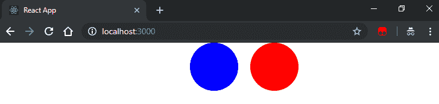

# 第七章：为浏览器编写代码

在使用 React 和浏览器时，我们可以进行一些特定的操作。例如，我们可以要求用户使用表单输入一些信息，在本章中，我们将看看如何应用不同的技术来处理表单。我们可以实现**不受控制的组件**，让字段保持其内部状态，或者我们可以使用**受控组件**，在这种情况下，我们完全控制字段的状态。

在本章中，我们还将看看 React 中的事件是如何工作的，以及该库如何实现一些高级技术，为我们提供一个在不同浏览器中具有一致接口的解决方案。我们将看看 React 团队实现的一些有趣的解决方案，使事件系统非常高效。

在事件之后，我们将跳转到 refs，看看我们如何在 React 组件中访问底层 DOM 节点。这代表了一个强大的功能，但应该谨慎使用，因为它会破坏一些使 React 易于使用的约定。

在 refs 之后，我们将看看如何使用 React 附加组件和第三方库（如`react-motion`）轻松实现动画。最后，我们将学习在 React 中使用**可伸缩矢量图形**（**SVG**）有多么容易，以及如何为我们的应用程序创建动态可配置的图标。

在本章中，我们将介绍以下主题：

+   使用不同的技术在 React 中创建表单

+   监听 DOM 事件并实现自定义处理程序

+   使用 refs 在 DOM 节点上执行命令式操作的一种方式

+   创建在不同浏览器中都有效的简单动画

+   生成 SVG 的 React 方式

# 技术要求

要完成本章，您将需要以下内容：

+   Node.js 12+

+   Visual Studio Code

您可以在书的 GitHub 存储库中找到本章的代码：[`github.com/PacktPublishing/React-17-Design-Patterns-and-Best-Practices-Third-Edition/tree/main/Chapter07`](https://github.com/PacktPublishing/React-17-Design-Patterns-and-Best-Practices-Third-Edition/tree/main/Chapter07)。

# 理解并实现表单

在本章中，我们将学习如何使用 React 实现表单。一旦我们开始用 React 构建一个真正的应用程序，我们就需要与用户进行交互。如果我们想在浏览器中向用户询问信息，表单是最常见的解决方案。由于库的工作方式和其声明性的特性，使用 React 处理输入字段和其他表单元素是非常复杂的，但一旦我们理解了它的逻辑，就会变得清晰。在接下来的章节中，我们将学习如何使用不受控制和受控组件。

## 不受控制的组件

不受控制的组件就像常规的 HTML 表单输入，你将无法自己管理值，而是 DOM 会处理值，并且你可以使用 React ref 来获取这个值。让我们从一个基本的例子开始——显示一个带有输入字段和提交按钮的表单。

代码非常简单：

```jsx
import { useState, ChangeEvent, MouseEvent } from 'react' const Uncontrolled = () => {
  const [value, setValue] = useState('')

  return (
    <form> 
<input type="text" /> 
      <button>Submit</button> 
 </form>  ) 
}

export default Uncontrolled
```

如果我们在浏览器中运行前面的片段，我们将看到完全符合预期的结果——一个输入字段，我们可以在其中输入一些内容，以及一个可点击的按钮。这是一个不受控制的组件的例子，我们不设置输入字段的值，而是让组件管理自己的内部状态。

很可能，我们希望在单击提交按钮时对元素的值做一些操作。例如，我们可能希望将数据发送到 API 端点。

我们可以通过添加一个`onChange`监听器来轻松实现这一点（我们将在本章后面更多地讨论事件监听器）。让我们看看添加监听器意味着什么。

我们需要创建`handleChange`函数：

```jsx
const handleChange = (e: ChangeEvent<HTMLInputElement>) => {
  console.log(e.target.value)
}
```

事件监听器接收到一个事件对象，其中`target`表示生成事件的字段，我们对其值感兴趣。我们首先只是记录它，因为逐步进行很重要，但很快我们将把值存储到状态中。

最后，我们渲染表单：

```jsx
return (
  <form> 
 <input type="text" onChange={handleChange} /> 
    <button>Submit</button> 
 </form> 
)
```

如果我们在浏览器中渲染组件并在表单字段中输入`React`这个词，我们将在控制台中看到类似以下的内容：

```jsx
R
Re
Rea
Reac
React
```

`handleChange`监听器在输入值改变时被触发。因此，我们的函数每输入一个字符就会被调用一次。下一步是存储用户输入的值，并在用户单击提交按钮时使其可用。

我们只需要改变处理程序的实现方式，将其存储在状态中而不是记录下来，如下所示：

```jsx
const handleChange = (e: ChangeEvent<HTMLInputElement>) => { 
  setValue(e.target.value)
}
```

得知表单何时提交与监听输入字段的更改事件非常相似；它们都是在发生某些事件时由浏览器调用的。

让我们定义`handleSubmit`函数，我们只是记录这个值。在现实世界的场景中，你可以将数据发送到 API 端点或将其传递给另一个组件：

```jsx
const handleSubmit = (e: MouseEvent<HTMLButtonElement>) => { 
  e.preventDefault()

  console.log(value)
}
```

这个处理程序非常简单；我们只是记录当前存储在状态中的值。我们还希望克服浏览器在提交表单时的默认行为，以执行自定义操作。这似乎是合理的，并且对于单个字段来说效果很好。现在的问题是，如果我们有多个字段怎么办？假设我们有数十个不同的字段？

让我们从一个基本的例子开始，手动创建每个字段和处理程序，并看看如何通过应用不同级别的优化来改进它。

让我们创建一个新的表单，包括名字和姓氏字段。我们可以重用`Uncontrolled`组件并添加一些新的状态：

```jsx
const [firstName, setFirstName] = useState('')
const [lastName, setLastName] = useState('')
```

我们在状态中初始化了两个字段，并为每个字段定义了一个事件处理程序。正如你可能已经注意到的，当有很多字段时，这种方法并不很好扩展，但在转向更灵活的解决方案之前，清楚地理解问题是很重要的。

现在，我们实现新的处理程序：

```jsx
const handleChangeFirstName = ({ target: { value } }) => {
  setFirstName(value) 
} 

const handleChangeLastName = ({ target: { value } }) => {
  setLastName(value) 
}
```

我们还必须稍微改变提交处理程序，以便在点击时显示名字和姓氏：

```jsx
const handleSubmit = (e: MouseEvent<HTMLButtonElement>) => { 
  e.preventDefault()

  console.log(`${firstName} ${lastName}`)
}
```

最后，我们渲染表单：

```jsx
return ( 
  <form onSubmit={handleSubmit}> 
    <input type="text" onChange={handleChangeFirstName} /> 
    <input type="text" onChange={handleChangeLastName} /> 
    <button>Submit</button> 
  </form> 
)
```

我们已经准备好了：如果我们在浏览器中运行前面的组件，我们将看到两个字段，如果我们在第一个字段中输入`Carlos`，在第二个字段中输入`Santana`，当表单提交时，我们将在浏览器控制台中看到全名显示出来。

同样，这样做是可以的，我们可以以这种方式做一些有趣的事情，但它不能处理复杂的场景，而不需要我们编写大量的样板代码。

让我们看看如何优化一下。我们的目标是使用一个单一的 change 处理程序，这样我们就可以添加任意数量的字段而不需要创建新的监听器。

让我们回到组件，让我们改变我们的状态：

```jsx
const [values, setValues] = useState({ firstName: '', lastName: '' })
```

我们可能仍然希望初始化这些值，在本节的后面，我们将看看如何为表单提供预填充的值。

现在，有趣的部分是我们如何修改`onChange`处理程序的实现方式，使其在不同字段中工作：

```jsx
const handleChange = ({ target: { name, value } }) => {    
  setValues({ 
    ...values,
    [name]: value
  })
}
```

正如我们之前所见，我们接收到的事件的`target`属性代表了触发事件的输入字段，因此我们可以使用字段的名称和其值作为变量。

然后我们必须为每个字段设置名称：

```jsx
return ( 
  <form onSubmit={handleSubmit}> 
    <input 
 type="text" 
      name="firstName" 
      onChange={handleChange} 
    /> 
    <input 
 type="text" 
      name="lastName" 
      onChange={handleChange} 
    /> 
 <button>Submit</button> 
 </form> 
)
```

就是这样！现在我们可以添加任意多个字段而不需要创建额外的处理程序。

## 受控组件

受控组件是一个通过使用组件状态来控制表单中输入元素的值的 React 组件。

在这里，我们将看看如何使用一些值预填充表单字段，这些值可以来自服务器或作为父级传递的 props。为了充分理解这个概念，我们将从一个非常简单的无状态函数组件开始，然后逐步改进它。

第一个例子显示了输入字段中的预定义值：

```jsx
const Controlled = () => ( 
  <form> 
 <input type="text" value="Hello React" /> 
 <button>Submit</button> 
 </form> 
)
```

如果我们在浏览器中运行此组件，我们会意识到它按预期显示默认值，但不允许我们更改值或在其中输入其他任何内容。

它这样做的原因是，在 React 中，我们声明了我们想要在屏幕上看到的内容，并且设置一个固定值属性总是导致渲染该值，无论采取了什么其他操作。这不太可能是我们在现实世界应用程序中想要的行为。

如果我们打开控制台，会得到以下错误消息。React 本身告诉我们我们在做一些错误的事情：

```jsx
You provided a `value` prop to a form field without an `onChange` handler. This will render a read-only field.
```

现在，如果我们只想让输入字段具有默认值，并且希望能够通过输入更改它，我们可以使用`defaultValue`属性：

```jsx
import { useState } from 'react'

const Controlled = () => {
  return (
    <form> 
 <input type="text" defaultValue="Hello React" /> 
      <button>Submit</button> 
 </form> 
  )
}

export default Controlled
```

这样，当渲染时，该字段将显示`Hello React`，但用户可以在其中输入任何内容并更改其值。现在让我们添加一些状态：

```jsx
const [values, setValues] = useState({ firstName: 'Carlos', lastName: 'Santana' })
```

处理程序与之前的相同：

```jsx
const handleChange = ({ target: { name, value } }) => { 
  setValues({ 
    [name]: value 
  })
} 

const handleSubmit = (e) => { 
  e.preventDefault()

  console.log(`${values.firstName} ${values.lastName}`)
}
```

实际上，我们将使用输入字段的`value`属性来设置它们的初始值，以及更新后的值：

```jsx
return ( 
  <form onSubmit={handleSubmit}> 
    <input 
 type="text" 
      name="firstName" 
      value={values.firstName} 
      onChange={handleChange} 
    /> 
 <input 
 type="text" 
      name="lastName" 
      value={values.lastName} 
      onChange={handleChange} 
    /> 
 <button>Submit</button> 
 </form> 
)
```

第一次渲染表单时，React 使用状态中的初始值作为输入字段的值。当用户在字段中输入内容时，将调用`handleChange`函数，并将字段的新值存储在状态中。

当状态改变时，React 会重新渲染组件并再次使用它来反映输入字段的当前值。现在我们完全控制字段的值，并且我们称这种模式为**受控组件**。

在下一节中，我们将处理事件，这是 React 处理来自表单的数据的基本部分。

# 处理事件

**事件**在不同的浏览器中有稍微不同的工作方式。React 试图抽象事件的工作方式，并为开发人员提供一致的接口来处理。这是 React 的一个很棒的特性，因为我们可以忘记我们要针对的浏览器，编写与供应商无关的事件处理程序和函数。

为了提供这个功能，React 引入了**合成事件**的概念。合成事件是一个包装了浏览器提供的原始事件对象的对象，它具有相同的属性，无论在何处创建。

要将事件监听器附加到节点并在事件触发时获取事件对象，我们可以使用一个简单的约定，回忆起事件附加到 DOM 节点的方式。事实上，我们可以使用单词 `on` 加上驼峰命名的事件名称（例如 `onKeyDown`）来定义在事件发生时要触发的回调。一个常用的约定是将事件处理程序函数命名为事件名称，并使用 `handle` 作为前缀（例如 `handleKeyDown`）。

我们已经在之前的例子中看到了这种模式的运作，我们在那里监听了表单字段的 `onChange` 事件。让我们重申一个基本的事件监听器示例，看看我们如何以更好的方式在同一个组件中组织多个事件。我们将实现一个简单的按钮，并且像往常一样，首先创建一个组件：

```jsx
const Button = () => {

}

export default Button
```

然后我们定义事件处理程序：

```jsx
const handleClick = (syntheticEvent) => { 
  console.log(syntheticEvent instanceof MouseEvent)
  console.log(syntheticEvent.nativeEvent instanceof MouseEvent)
}
```

正如你在这里看到的，我们只是做了一件非常简单的事情：我们只是检查我们从 React 接收到的事件对象的类型和附加到它的原生事件的类型。我们期望第一个返回 `false`，第二个返回 `true`。

你永远不应该需要访问原始的原生事件，但知道如果需要的话你可以这样做是很好的。最后，我们使用 `onClick` 属性定义按钮，并附加我们的事件监听器：

```jsx
return ( 
  <button onClick={handleClick}>Click me!</button> 
)
```

现在，假设我们想要将第二个处理程序附加到按钮，监听双击事件。一个解决方案是创建一个新的独立处理程序，并使用 `onDoubleClick` 属性将其附加到按钮，如下所示：

```jsx
<button 
 onClick={handleClick} 
  onDoubleClick={handleDoubleClick} 
> 
  Click me! 
</button>
```

记住，我们总是希望写更少的样板代码并避免重复代码。因此，一个常见的做法是为每个组件编写一个**单个事件处理程序**，根据事件类型触发不同的操作。

这种技术在 Michael Chan 的一本模式集合中有所描述：

[`reactpatterns.com/#event-switch`](http://reactpatterns.com/#event-switch)。

让我们实现通用事件处理程序：

```jsx
const handleEvent = (event) => { 
  switch (event.type) { 
    case 'click': 
      console.log('clicked')
      break

    case 'dblclick': 
      console.log('double clicked')
      break

    default: 
      console.log('unhandled', event.type)
  } 
}
```

通用事件处理程序接收事件对象并根据事件类型触发正确的操作。如果我们想在每个事件上调用一个函数（例如，分析），或者如果一些事件共享相同的逻辑，这将特别有用。

最后，我们将新的事件监听器附加到`onClick`和`onDoubleClick`属性上：

```jsx
return ( 
  <button 
    onClick={handleEvent} 
    onDoubleClick={handleEvent} 
  > 
    Click me! 
  </button> 
) 
```

从这一点开始，每当我们需要为同一组件创建一个新的事件处理程序时，我们可以只需添加一个新的情况到 switch，而不是创建一个新的方法并绑定它。

关于 React 中事件的另外一些有趣的事情是，合成事件是可重用的，并且存在**单个全局处理程序**。第一个概念意味着我们不能存储合成事件并在以后重用它，因为它在操作后立即变为 null。这种技术在性能方面非常好，但如果我们想出于某种原因将事件存储在组件状态中，可能会有问题。为了解决这个问题，React 在合成事件上给了我们一个`persist`方法，我们可以调用它使事件持久化，这样我们就可以存储并在以后检索它。

第二个非常有趣的实现细节再次涉及性能，它与 React 将事件处理程序附加到 DOM 的方式有关。

每当我们使用`on`属性时，我们正在描述我们想要实现的行为，但是库并没有将实际的事件处理程序附加到底层 DOM 节点上。

它所做的是将单个事件处理程序附加到根元素，通过**事件冒泡**监听所有事件。当我们感兴趣的事件被浏览器触发时，React 代表其调用特定组件上的处理程序。这种技术称为**事件委托**，用于内存和速度优化。

在我们的下一节中，我们将探索 React 引用并看看我们如何利用它们。

# 探索引用

人们喜欢 React 的一个原因是它是声明式的。声明式意味着你只需描述你想在屏幕上显示的内容，React 就会处理与浏览器的通信。这个特性使得 React 非常容易理解，同时也非常强大。

然而，可能会有一些情况需要访问底层的 DOM 节点来执行一些命令式操作。这应该被避免，因为在大多数情况下，有更符合 React 的解决方案来实现相同的结果，但重要的是要知道我们有这个选项，并知道它是如何工作的，以便我们能做出正确的决定。

假设我们想创建一个简单的表单，其中包含一个输入元素和一个按钮，当点击按钮时，输入字段获得焦点。我们想要做的是在浏览器窗口内调用输入节点的 `focus` 方法，即输入的实际 DOM 实例。

让我们创建一个名为 `Focus` 的组件；你需要导入 `useRef` 并创建一个 `inputRef` 常量：

```jsx
import { useRef } from 'react'
 const Focus = () => {
  const inputRef = useRef(null)
}

export default Focus
```

然后，我们实现 `handleClick` 方法：

```jsx
const handleClick = () => { 
  inputRef.current.focus()
} 
```

正如你所看到的，我们正在引用 `inputRef` 的 `current` 属性，并调用它的 `focus` 方法。

要理解它来自哪里，你只需检查 `render` 的实现。

```jsx
return ( 
  <> 
    <input 
      type="text" 
      ref={inputRef} 
    /> 
    <button onClick={handleClick}>Set Focus</button> 
  </> 
)
```

这里是逻辑的核心。我们创建了一个带有输入元素的表单，并在其 `ref` 属性上定义了一个函数。

我们定义的回调函数在组件挂载时被调用，元素参数表示输入的 DOM 实例。重要的是要知道，当组件被卸载时，相同的回调会以 `null` 参数被调用以释放内存。

在回调中我们所做的是存储元素的引用，以便将来使用（例如，当触发 `handleClick` 方法时）。然后，我们有一个带有事件处理程序的按钮。在浏览器中运行上述代码将显示带有字段和按钮的表单，并且点击按钮将聚焦输入字段，如预期的那样。

正如我们之前提到的，一般来说，我们应该尽量避免使用 refs，因为它们会使代码更加命令式，变得更难阅读和维护。

# 实现动画

当我们考虑 UI 和浏览器时，我们一定也要考虑动画。动画化的 UI 对用户更加愉悦，它们是向用户展示发生了或即将发生的事情的非常重要的工具。

本节不旨在成为创建动画和美观 UI 的详尽指南；这里的目标是为您提供一些关于我们可以采用的常见解决方案的基本信息，以便为我们的 React 组件添加动画。

对于 React 这样的 UI 库，提供一种简单的方式让开发人员创建和管理动画是至关重要的。React 自带一个名为 `react-addons-css-transition-group` 的附加组件，它是一个帮助我们以声明方式构建动画的组件。再次，能够以声明方式执行操作是非常强大的，它使代码更容易理解并与团队共享。

让我们看看如何使用 React 附加组件对文本应用简单的淡入效果，然后我们将使用 `react-motion` 执行相同的操作，这是一个使创建复杂动画更容易的第三方库。

要开始构建一个动画组件，我们需要做的第一件事是安装这个附加组件：

```jsx
npm install --save react-addons-css-transition-group @types/react-addons-css-transition-group
```

一旦我们完成了这个操作，我们就可以导入该组件：

```jsx
import CSSTransitionGroup from 'react-addons-css-transition-group'
```

然后，我们只需包装我们想要应用动画的组件：

```jsx
const Transition = () => ( 
  <CSSTransitionGroup 
    transitionName="fade" 
    transitionAppear 
    transitionAppearTimeout={500} 
  > 
    <h1>Hello React</h1> 
  </CSSTransitionGroup> 
)
```

正如你所看到的，有一些需要解释的属性。

首先，我们声明了 `transitionName` 属性。`ReactCSSTransitionGroup` 将该属性的名称应用到子元素的类中，以便我们可以使用 CSS 过渡来创建我们的动画。

使用单个类，我们无法轻松创建适当的动画，这就是为什么过渡组件根据动画状态应用多个类。在这种情况下，使用 `transitionAppear` 属性，我们告诉组件我们希望在屏幕上出现时对子元素进行动画处理。

因此，图书馆所做的是在组件被渲染时立即应用 `fade-appear` 类（其中 `fade` 是 `transitionName` 属性的值）。在下一个时刻，`fade-appear-active` 类被应用，以便我们可以从初始状态到新状态触发我们的动画，使用 CSS。

我们还必须设置 `transitionAppearTimeout` 属性，告诉 React 动画的长度，以便在动画完成之前不要从 DOM 中移除元素。

使元素淡入的 CSS 如下。

首先，我们定义元素在初始状态下的不透明度：

```jsx
.fade-appear { 
  opacity: 0.01; 
}
```

然后，我们使用第二个类来定义我们的过渡，一旦它被应用到元素上就会开始：

```jsx
.fade-appear.fade-appear-active { 
  opacity: 1; 
  transition: opacity .5s ease-in; 
}
```

我们正在使用`ease-in`函数在`500ms`内将不透明度从`0.01`过渡到`1`。这很容易，但我们可以创建更复杂的动画，我们也可以动画化组件的不同状态。例如，当新元素作为过渡组的子元素添加时，`*-enter`和`*-enter-active`类会被应用。类似的情况也适用于删除元素。

在我们的下一节中，我们将查看在 React 中创建动画最流行的库：`react-motion`，这个库由 Cheng Lou 维护。它提供了一个非常干净和易于使用的 API，为我们提供了一个非常强大的工具来创建任何动画。

## React Motion

**React Motion**是一个用于 React 应用程序的动画库，它使得创建和实现逼真动画变得容易。一旦动画的复杂性增加，或者当我们需要依赖其他动画的动画，或者当我们需要将一些基于物理的行为应用到我们的组件上（这是一个更高级的技术），我们会意识到过渡组并不能帮助我们足够，所以我们可能会考虑使用第三方库。

要使用它，我们首先必须安装它：

```jsx
npm install --save react-motion @types/react-motion
```

安装成功后，我们需要导入`Motion`组件和`spring`函数。`Motion`是我们将用来包装我们想要动画的元素的组件，而函数是一个实用工具，可以将一个值从其初始状态插值到最终状态：

```jsx
import { Motion, spring } from 'react-motion'
```

让我们看看代码：

```jsx
const Transition = () => ( 
  <Motion 
    defaultStyle={{ opacity: 0.01 }} 
    style={{ opacity: spring(1) }} 
  > 
    {interpolatingStyle => ( 
      <h1 style={interpolatingStyle}>Hello React</h1> 
    )} 
  </Motion> 
)
```

这里有很多有趣的东西。首先，您可能已经注意到这个组件使用了函数作为子模式（参见*第四章，探索流行的组合模式*），这是一种非常强大的技术，用于定义在运行时接收值的子元素。

然后，我们可以看到`Motion`组件有两个属性：第一个是`defaultStyle`，它表示初始的`style`属性。同样，我们将不透明度设置为`0.01`来隐藏元素并开始淡入。

`style`属性代表最终的样式，但我们不直接设置值；相反，我们使用`spring`函数，使得值从初始状态插值到最终状态。

在`spring`函数的每次迭代中，子函数接收给定时间点的插值样式，只需将接收到的对象应用到组件的`style`属性，我们就可以看到不透明度的过渡。

这个库可以做一些更酷的事情，但首先要了解的是基本概念，这个例子应该能澄清它们。

比较过渡组和`react-motion`的两种不同方法也很有趣，以便能够选择适合你正在工作的项目的正确方法。

最后，在下一节中，我们将看到如何在 React 中使用 SVG。

# 探索 SVG

最后但同样重要的是，我们可以在浏览器中应用一种最有趣的技术来绘制图标和图形，那就是**可缩放矢量图形**（**SVG**）。

SVG 很棒，因为它是一种描述矢量的声明性方式，它与 React 的目的完全契合。我们过去常常使用图标字体来创建图标，但它们有众所周知的问题，首先是它们不可访问。用 CSS 定位图标字体也相当困难，它们在所有浏览器中并不总是看起来美观。这就是我们应该为我们的 Web 应用程序更喜欢 SVG 的原因。

从 React 的角度来看，无论我们从`render`方法中输出`div`还是 SVG 元素，都没有任何区别，这就是它如此强大的原因。我们也倾向于选择 SVG，因为我们可以很容易地使用 CSS 和 JavaScript 在运行时修改它们，这使它们成为 React 功能方法的绝佳选择。

因此，如果我们将组件视为其 props 的函数，我们可以很容易地想象如何创建可以通过传递不同 props 来操作的自包含 SVG 图标。在 React 中创建 SVG 的常见方法是将我们的矢量图包装到一个 React 组件中，并使用 props 来定义它们的动态值。

让我们看一个简单的例子，我们画一个蓝色的圆，从而创建一个包装 SVG 元素的 React 组件：

```jsx
const Circle = ({ x, y, radius, fill }) => ( 
  <svg> 
 <circle cx={x} cy={y} r={radius} fill={fill} /> 
  </svg> 
)
```

正如你所看到的，我们可以很容易地使用一个无状态的函数组件来包装 SVG 标记，它接受与 SVG 相同的 props。

一个示例用法如下：

```jsx
<Circle x={20} y={20} radius={20} fill="blue" /> 
```

显然，我们可以充分利用 React 的功能，并设置一些默认参数，以便如果圆形图标在没有 props 的情况下呈现，我们仍然可以显示一些东西。

例如，我们可以定义默认颜色：

```jsx
const Circle = ({ x, y, radius, fill = 'red' }) => (...)
```

当我们构建 UI 时，这非常强大，特别是在一个团队中，我们共享我们的图标集，并且希望在其中有一些默认值，但我们也希望让其他团队决定他们的设置，而不必重新创建相同的 SVG 形状。

然而，在某些情况下，我们更倾向于更严格地固定一些值以保持一致性。使用 React，这是一个非常简单的任务。

例如，我们可以将基本圆形组件包装成`RedCircle`，如下所示：

```jsx
const RedCircle = ({ x, y, radius }) => ( 
  <Circle x={x} y={y} radius={radius} fill="red" /> 
)
```

在这里，颜色是默认设置的，不能更改，而其他 props 会透明地传递给原始圆。

以下截图显示了由 React 使用 SVG 生成的两个圆，蓝色和红色：



我们可以应用这种技术，并创建圆的不同变体，比如`SmallCircle`和`RightCircle`，以及构建 UI 所需的其他一切。

# 总结

在本章中，我们看了一下当我们用 React 来针对浏览器时可以做的不同事情，从表单创建到事件，从动画到 SVG。此外，我们学会了如何使用新的`useRef` Hook。React 为我们提供了一种声明性的方式来管理我们在创建 Web 应用程序时需要处理的所有方面。

如果需要，React 会以一种方式为我们提供对实际 DOM 节点的访问，这意味着我们可以对它们执行命令式操作，这在我们需要将 React 与现有的命令式库集成时非常有用。

下一章将讨论 CSS 和内联样式，它将阐明在 JavaScript 中编写 CSS 意味着什么。
