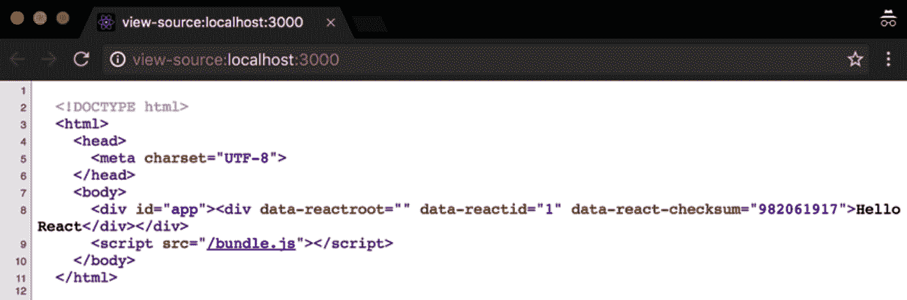

# 第九章：为了乐趣和利润进行服务器端渲染

构建 React 应用程序的下一步是学习服务器端渲染的工作原理以及它可以给我们带来的好处。**通用应用程序**对于 SEO 更好，并且它们可以在前端和后端之间实现知识共享。它们还可以提高 Web 应用程序的感知速度，通常会导致转化率的提高。然而，将服务器端渲染应用于 React 应用程序是有成本的，我们应该仔细考虑是否需要它。

在本章中，您将看到如何设置服务器端渲染应用程序，并在相关部分结束时，您将能够构建一个通用应用程序，并了解该技术的利弊。

在本章中，我们将涵盖以下主题：

+   理解通用应用程序是什么

+   弄清楚为什么我们可能希望启用服务器端渲染

+   使用 React 创建一个简单的静态服务器端渲染应用程序

+   将数据获取添加到服务器端渲染，并理解脱水/水合等概念

+   使用 Zeith 的**Next.js**轻松创建在服务器端和客户端上运行的 React 应用程序

# 技术要求

完成本章，您将需要以下内容：

+   Node.js 12+

+   Visual Studio Code

您可以在书籍的 GitHub 存储库中找到本章的代码，网址为[`github.com/PacktPublishing/React-17-Design-Patterns-and-Best-Practices-Third-Edition/tree/main/Chapter09`](https://github.com/PacktPublishing/React-17-Design-Patterns-and-Best-Practices-Third-Edition/tree/main/Chapter09)。

# 理解通用应用程序

通用应用程序是一种可以在服务器端和客户端上运行相同代码的应用程序。在本节中，我们将看看为什么要考虑使我们的应用程序通用，并学习如何在服务器端轻松渲染 React 组件。

当我们谈论 JavaScript Web 应用程序时，通常会想到存在于浏览器中的客户端代码。它们通常的工作方式是，服务器返回一个空的 HTML 页面，其中包含一个`script`标签来加载应用程序。当应用程序准备就绪时，它会在浏览器内部操作 DOM 以显示 UI 并与用户交互。这已经是过去几年的情况了，对于大量应用程序来说，这仍然是一种行之有效的方式。

在本书中，我们已经看到使用 React 组件创建应用程序是多么容易，以及它们在浏览器中的工作原理。我们还没有看到的是 React 如何在服务器上渲染相同的组件，为我们提供了一个称为**服务器端渲染**（**SSR**）的强大功能。

在深入细节之前，让我们试着理解在服务器和客户端上都渲染应用程序意味着什么。多年来，我们习惯于为服务器和客户端拥有完全不同的应用程序：例如，使用 Django 应用程序在服务器上渲染视图，以及一些 JavaScript 框架，如 Backbone 或 jQuery，在客户端上。这些独立的应用程序通常需要由具有不同技能的两个开发团队进行维护。如果需要在服务器端渲染的页面和客户端应用程序之间共享数据，可以在脚本标签中注入一些变量。使用两种不同的语言和平台，没有办法在应用程序的不同方面共享通用信息，如模型或视图。

自从 Node.js 在 2009 年发布以来，JavaScript 在服务器端也因为诸如**Express**等 Web 应用程序框架而受到了很多关注和流行。在两端使用相同的语言不仅使开发人员可以轻松重用他们的知识，还可以在服务器和客户端之间实现不同的代码共享方式。

特别是在 React 中，同构 Web 应用程序的概念在 JavaScript 社区内非常流行。编写一个**同构应用程序**意味着构建一个在服务器和客户端上看起来相同的应用程序。使用相同的语言编写两个应用程序意味着可以共享大部分逻辑，这开启了许多可能性。这使得代码库更容易理解，并避免不必要的重复。

React 将这个概念推进了一步，为我们提供了一个简单的 API，在服务器上渲染我们的组件，并透明地应用所有必要的逻辑，使页面在浏览器上变得交互（例如，事件处理程序）。

术语*同构*在这种情况下并不适用，因为在 React 的情况下，应用程序是相同的，这就是为什么 React Router 的创始人之一 Michael Jackson 提出了这种模式更有意义的名称：**Universal**。

# 实施 SSR 的原因

SSR 是一个很棒的功能，但我们不应该只是为了它而盲目使用。我们应该有一个真正坚实的理由开始使用它。在本节中，我们将看看 SSR 如何帮助我们的应用程序以及它可以为我们解决什么问题。在接下来的部分中，我们将学习关于 SEO 以及如何提高我们应用程序的性能。

## 实施搜索引擎优化

我们可能希望在服务器端渲染我们的应用程序的一个主要原因是搜索引擎优化（SEO）。

如果我们向主要搜索引擎的网络爬虫提供一个空的 HTML 骨架，它们将无法从中提取任何有意义的信息。如今，Google 似乎能够运行 JavaScript，但存在一些限制，而 SEO 通常是我们业务的关键方面。

多年来，我们习惯于编写两个应用程序：一个用于网络爬虫的 SSR 应用程序，另一个供用户在客户端使用。我们过去这样做是因为 SSR 应用程序无法给我们提供用户期望的交互水平，而客户端应用程序无法被搜索引擎索引。

维护和支持两个应用程序是困难的，使代码库不够灵活，也不够容易更改。幸运的是，有了 React，我们可以在服务器端渲染我们的组件，并以一种易于理解和索引内容的方式为网络爬虫提供我们应用程序的内容。

这不仅对 SEO 有好处，也对社交分享服务有好处。Facebook 或 Twitter 等平台为我们提供了一种定义在页面被分享时显示的片段内容的方式。

例如，使用 Open Graph，我们可以告诉 Facebook，对于特定页面，我们希望显示特定的图片，并使用特定的标题作为帖子的标题。使用仅客户端的应用程序几乎不可能做到这一点，因为从页面中提取信息的引擎使用服务器返回的标记。

如果我们的服务器对所有 URL 返回一个空的 HTML 结构，那么当页面在社交网络上分享时，我们的 Web 应用程序的片段也会是空的，这会影响它们的传播。

## 共同的代码库

我们在客户端没有太多选择；我们的应用程序必须用 JavaScript 编写。有一些语言可以在构建时转换为 JavaScript，但概念并未改变。在服务器端使用相同的语言的能力在维护性和公司内部知识共享方面具有重大优势。

能够在客户端和服务器之间共享逻辑使得在两侧应用任何更改变得容易，而不必做两次工作，这在大多数情况下会导致更少的错误和问题。

维护单一代码库的工作量要少于保持两个不同应用程序最新所需的工作量。你可能考虑在团队中引入服务器端 JavaScript 的另一个原因是前端和后端开发人员之间的知识共享。

在两侧重用代码的能力使得协作更容易，团队使用共同的语言，这有助于更快地做出决策和更改。

## 更好的性能

最后但并非最不重要的是，我们都喜欢客户端应用程序，因为它们快速且响应迅速，但存在一个问题——必须在用户可以在应用程序上采取任何操作之前加载和运行捆绑包。

在现代笔记本电脑或桌面计算机上使用快速互联网连接可能不是问题。然而，如果我们在使用 3G 连接的移动设备上加载一个巨大的 JavaScript 捆绑包，用户必须等待一小段时间才能与应用程序进行交互。这不仅对用户体验不利，而且还会影响转化率。大型电子商务网站已经证明，页面加载时间增加几毫秒可能会对收入产生巨大影响。

例如，如果我们在服务器上用一个空的 HTML 页面和一个`script`标签提供我们的应用程序，并在用户点击任何内容之前向他们显示一个旋转器，那么网站速度的感知性会受到显着影响。

如果我们在服务器端呈现我们的网站，用户在点击页面后立即开始看到一些内容，即使他们在真正做任何事情之前必须等待同样长的时间，他们也更有可能留下来，因为无论如何都必须加载客户端捆绑包。

这种感知性能是我们可以通过使用 SSR 大大改善的，因为我们可以在服务器上输出我们的组件并立即向用户返回一些信息。

## 不要低估复杂性

即使 React 提供了一个简单的 API 来在服务器上渲染组件，创建一个通用应用程序是有成本的。因此，我们应该在启用之前仔细考虑上述原因之一，并检查我们的团队是否准备好支持和维护通用应用程序。

正如我们将在接下来的章节中看到的，渲染组件并不是创建服务器端渲染应用程序所需完成的唯一任务。我们必须设置和维护一个带有其路由和逻辑的服务器，管理服务器数据流等等。潜在地，我们希望缓存内容以更快地提供页面，并执行许多其他任务，这些任务是维护一个完全功能的通用应用程序所必需的。

因此，我的建议是首先构建客户端版本，只有在 Web 应用程序在服务器上完全工作时，您才应该考虑通过启用 SSR 来改善体验。只有在严格必要时才应启用 SSR。例如，如果您需要 SEO 或者需要自定义社交分享信息，您应该开始考虑它。

如果您意识到您的应用程序需要很长时间才能完全加载，并且您已经进行了所有的优化（有关此主题的更多信息，请参阅*第十章*，*改进您的应用程序的性能*），您可以考虑使用 SSR 来为用户提供更好的体验并提高感知速度。现在我们已经了解了什么是 SSR 以及通用应用程序的好处，让我们在下一节中跳入一些 SSR 的基本示例。

# 创建 SSR 的基本示例

现在，我们将创建一个非常简单的服务器端应用程序，以查看构建基本通用设置所需的步骤。这是一个故意简化的设置，因为这里的目标是展示 SSR 的工作原理，而不是提供全面的解决方案或样板，尽管您可以将示例应用程序用作真实应用程序的起点。

本节假设所有关于 JavaScript 构建工具（如 webpack 及其加载程序）的概念都是清楚的，并且需要一点 Node.js 的知识。作为 JavaScript 开发人员，即使您以前从未见过 Node.js 应用程序，也应该很容易跟上本节。

该应用程序将由两部分组成：

+   在服务器端，我们将使用**Express**创建一个基本的 Web 服务器，并为服务器端渲染的 React 应用程序提供一个 HTML 页面

+   在客户端，我们将像往常一样使用`react-dom`渲染应用程序。

在运行之前，应用程序的两侧都将使用 Babel 进行转译，并在运行之前使用 webpack 进行捆绑，这将让我们在 Node.js 和浏览器上都可以使用 ES6 和模块的全部功能。

让我们从创建一个新的项目文件夹开始（您可以称之为`ssr-project`），并运行以下命令来创建一个新的包：

```jsx
npm init
```

创建`package.json`后，是时候安装依赖项了。我们可以从`webpack`开始：

```jsx
npm install webpack
```

完成后，是时候安装`ts-loader`和我们需要使用 React 和 TSX 编写 ES6 应用程序的预设了：

```jsx
npm install --save-dev @babel/core @babel/preset-env @babel/preset-react ts-loader typescript
```

我们还必须安装一个依赖项，这样我们才能创建服务器捆绑包。`webpack`让我们定义一组外部依赖项，这些依赖项我们不想添加到捆绑包中。实际上，在为服务器创建构建时，我们不想将我们使用的所有节点包添加到捆绑包中；我们只想捆绑我们的服务器代码。有一个包可以帮助我们做到这一点，我们可以简单地将其应用到我们的`webpack`配置中的外部条目，以排除所有模块：

```jsx
npm install --save-dev webpack-node-externals
```

太好了。现在是时候在`package.json`的 npm`scripts`部分创建一个条目，这样我们就可以轻松地从终端运行`build`命令了：

```jsx
"scripts": {
  "build": "webpack"
}
```

接下来，您需要在根路径下创建一个`.babelrc`文件：

```jsx
{
  "presets": ["@babel/preset-env", "@babel/preset-react"]
}
```

我们现在必须创建配置文件，名为`webpack.config.js`，以告诉`webpack`我们希望如何捆绑我们的文件。

让我们开始导入我们将用来设置我们的节点外部的库。我们还将为`ts-loader`定义配置，我们将在客户端和服务器端都使用它：

```jsx
const nodeExternals = require('webpack-node-externals')
const path = require('path')

const rules = [{
  test: /\.(tsx|ts)$/,
  use: 'ts-loader',
  exclude: /node_modules/
}]
```

在*第八章*，*使您的组件看起来漂亮*中，我们看到我们必须从配置文件中导出一个配置对象。`webpack`中有一个很酷的功能，它让我们也可以导出一个配置数组，这样我们就可以在同一个地方定义客户端和服务器配置，并同时使用两者。

下面显示的客户端配置应该非常熟悉：

```jsx
const client = {
  entry: './src/client.tsx',
  output: {
    path: path.resolve(__dirname, './dist/public'),
    filename: 'bundle.js',
    publicPath: '/'
  },
  module: {
    rules
  }
}
```

我们告诉`webpack`客户端应用程序的源代码位于`src`文件夹中，并且我们希望生成的输出捆绑包位于`dist`文件夹中。

我们还使用之前使用`ts-loader`创建的对象设置模块加载程序。服务器配置略有不同；我们需要定义不同的`entry`，`output`，并添加一些新的节点，例如`target`，`externals`和`resolve`：

```jsx
const server = {
  entry: './src/server.ts',
  output: {
    path: path.resolve(__dirname, './dist'),
    filename: 'server.js',
    publicPath: '/'
  },
  module: {
    rules
  },
  target: 'node',
  externals: [nodeExternals()],
  resolve: {
    extensions: [".ts", ".tsx", ".js", ".json"],
  },
}
```

正如您所看到的，`entry`，`output`和`module`是相同的，只是文件名不同。

新的参数是`target`，在其中我们指定`node`以告诉`webpack`忽略 Node.js 的所有内置系统包，例如`fs`和`externals`，在其中我们使用我们之前导入的库告诉 webpack 忽略依赖项。

最后，但并非最不重要的，我们必须将配置导出为数组：

```jsx
module.exports = [client, server]
```

配置已经完成。我们现在准备写一些代码，我们将从我们更熟悉的 React 应用程序开始。

让我们创建一个`src`文件夹，并在其中创建一个`app.ts`文件。

`app.ts`文件应该有以下内容：

```jsx
const App = () => <div>Hello React</div>

export default App
```

这里没有什么复杂的；我们导入 React，创建一个`App`组件，它呈现`Hello React`消息，并导出它。

现在让我们创建`client.tsx`，它负责在 DOM 中渲染`App`组件：

```jsx
import { render } from 'react-dom'
import App from './app'

render(<App />, document.getElementById('root'))
```

同样，这应该听起来很熟悉，因为我们导入了 React，ReactDOM 和我们之前创建的`App`组件，并且我们使用`ReactDOM`将其呈现在具有`app`ID 的 DOM 元素中。

让我们现在转移到服务器。

首先要做的是创建一个`template.ts`文件，它导出一个我们将用来返回服务器将返回给浏览器的页面标记的函数：

```jsx
export default body => `
  <!DOCTYPE html>
  <html>
 <head>
 <meta charset="UTF-8">
    </head>
 <body>
 <div id="root">${body}</div>
      <script src="/bundle.js"></script>
 </body>
 </html>`
```

这应该很简单。该函数接受`body`，我们稍后将看到它包含 React 应用程序，并返回页面的骨架。

值得注意的是，即使应用程序在服务器端呈现，我们也会在客户端加载捆绑包。 SSR 只是 React 用来呈现我们应用程序的工作的一半。我们仍然希望我们的应用程序是一个客户端应用程序，具有在浏览器中可以使用的所有功能，例如事件处理程序。

之后，您需要安装`express`，`react`和`react-dom`：

```jsx
npm install express react react-dom @types/express @types/react @types/react-dom
```

现在是时候创建`server.tsx`了，它有更多的依赖项，值得详细探讨：

```jsx
import React from 'react' import express, { Request, Response } from 'express'
import { renderToString } from 'react-dom/server'
import path from 'path'
import App from './App'
import template from './template'
```

我们导入的第一件事是`express`，这个库允许我们轻松创建具有一些路由的 Web 服务器，并且还能够提供静态文件。

其次，我们导入 `React` 和 `ReactDOM` 来渲染 `App`，我们也导入了。请注意 `import` 语句中的 `/server` 路径。我们导入的最后一件事是我们之前定义的模板。

现在我们创建一个 Express 应用程序：

```jsx
const app = express()
```

我们告诉应用程序我们的静态资产存储在哪里：

```jsx
app.use(express.static(path.resolve(__dirname, './dist/public')))
```

您可能已经注意到，路径与我们在 webpack 的客户端配置中用作客户端捆绑输出目的地的路径相同。

然后，这里是使用 React 进行 SSR 的逻辑：

```jsx
app.get('/', (req: Request, res: Response) => {
  const body = renderToString(<App />)
  const html = template(body)
  res.send(html)
})
```

我们告诉 Express 我们想要监听 `/` 路由，当客户端命中时，我们使用 `ReactDOM` 库将 `App` 渲染为字符串。这就是 React 的 SSR 的魔力和简单之处。

`renderToString` 的作用是返回由我们的 `App` 组件生成的 DOM 元素的字符串表示形式；如果我们使用 `ReactDOM` 渲染方法，它将在 DOM 中呈现相同的树。

body 变量的值类似于以下内容：

```jsx
<div data-reactroot="" data-reactid="1" data-react-checksum="982061917">Hello React</div>
```

正如您所看到的，它代表了我们在 `App` 的 `render` 方法中定义的内容，除了一些数据属性，React 在客户端使用这些属性将客户端应用程序附加到服务器端呈现的字符串上。

现在我们有了我们应用程序的 SSR 表示，我们可以使用 `template` 函数将其应用到 HTML 模板中，并在 Express 响应中将其发送回浏览器。

最后，但同样重要的是，我们必须启动 Express 应用程序：

```jsx
app.listen(3000, () => {
  console.log('Listening on port 3000')
})
```

我们现在已经准备好了；只剩下几个操作。第一个是定义 `npm` 的 `start` 脚本并将其设置为运行节点服务器：

```jsx
"scripts": {
  "build": "webpack",
  "start": "node ./dist/server"
}
```

脚本已经准备好了，所以我们可以首先使用以下命令构建应用程序：

```jsx
npm run build 
```

当捆绑包创建完成后，我们可以运行以下命令：

```jsx
npm start
```

将浏览器指向 `http://localhost:3000` 并查看结果。

这里有两件重要的事情需要注意。首先，当我们使用浏览器的查看页面源代码功能时，我们可以看到从服务器返回的应用程序的源代码，如果没有启用 SSR，我们是看不到的。

其次，如果我们打开 DevTools 并安装了 React 扩展，我们可以看到 `App` 组件也在客户端上启动了。

以下截图显示了页面的源代码：



太棒了！现在您已经使用 SSR 创建了您的第一个 React 应用程序，让我们在下一节中学习如何获取数据。

# **实现数据获取**

前一节的示例应该清楚地解释了如何在 React 中设置通用应用程序。这很简单，主要集中在完成任务上。

然而，在现实世界的应用程序中，我们可能希望加载一些数据，而不是一个静态的 React 组件，例如示例中的`App`。假设我们想在服务器上加载 Dan Abramov 的`gists`并从我们刚刚创建的 Express 应用程序返回项目列表。

在*第六章*的数据获取示例中，我们看到了如何使用`useEffect`来触发数据加载。这在服务器上不起作用，因为组件不会挂载在 DOM 上，生命周期钩子也不会被触发。

之前执行的 Hooks 也不起作用，因为数据获取操作是`async`的，而`renderToString`不是。因此，我们必须找到一种方法在之前加载数据并将其作为 props 传递给组件。

让我们看看如何将上一节的应用程序稍作修改，以便在 SSR 阶段加载`gists`。

首先要做的是更改`App.tsx`以接受`gists`的列表作为`prop`，并在渲染方法中循环遍历它们以显示它们的描述：

```jsx
import { FC } from 'react'

type Gist = {
  id: string
  description: string
}

type Props = {
  gists: Gist[]
}

const App: FC<Props> = ({ gists }) => ( 
  <ul> 
    {gists.map(gist => ( 
      <li key={gist.id}>{gist.description}</li> 
    ))} 
  </ul> 
)

export default App
```

应用我们在上一章学到的概念，我们定义了一个无状态的函数组件，它接收`gists`作为 prop 并循环遍历元素以渲染项目列表。现在，我们必须更改服务器以检索`gists`并将它们传递给组件。

要在服务器端使用**fetch** API，我们必须安装一个名为`isomorphic-fetch`的库，它实现了 fetch 标准。它可以在 Node.js 和浏览器中使用：

```jsx
npm install isomorphic-fetch @types/isomorphic-fetch
```

我们首先将库导入到`server.tsx`中：

```jsx
import fetch from 'isomorphic-fetch'
```

我们想要进行的 API 调用如下：

```jsx
fetch('https://api.github.com/users/gaearon/gists') 
  .then(response => response.json()) 
  .then(gists => {})
```

在这里，`gists`可以在最后的`then`函数中使用。在我们的情况下，我们希望将它们传递给`App`。

因此，我们可以将`/`路由更改如下：

```jsx
app.get('/', (req, res) => { 
  fetch('https://api.github.com/users/gaearon/gists') 
    .then(response => response.json()) 
    .then(gists => { 
      const body = renderToString(<App gists={gists} />)
      const html = template(body)

      res.send(html)
    })
})
```

在这里，我们首先获取`gists`，然后将`App`渲染为字符串，传递属性。

一旦`App`被渲染，并且我们有了它的标记，我们就使用了上一节中使用的模板，并将其返回给浏览器。

在控制台中运行以下命令，并将浏览器指向`http://localhost:3000`。您应该能够看到一个服务器端渲染的`gists`列表：

```jsx
npm run build && npm start
```

确保列表是从 Express 应用程序呈现的，您可以导航到`view-source:http://localhost:3000`，您将看到`gists`的标记和描述。

这很好，看起来很容易，但如果我们检查 DevTools 控制台，我们会看到 Cannot read property 'map' of undefined 错误。我们看到错误的原因是，在客户端，我们再次渲染`App`，但没有将`gists`传递给它。

这一开始可能听起来有些反直觉，因为我们可能认为 React 足够聪明，可以在客户端使用服务器端字符串中呈现的`gists`。但事实并非如此，因此我们必须找到一种方法在客户端也使`gists`可用。

您可以考虑在客户端再次执行 fetch。这样可以工作，但并不是最佳的，因为您最终会触发两个 HTTP 调用，一个在 Express 服务器上，一个在浏览器上。如果我们考虑一下，我们已经在服务器上进行了调用，并且我们拥有所有所需的数据。在服务器和客户端之间共享数据的典型解决方案是在 HTML 标记中脱水数据，并在浏览器中重新水化数据。

这似乎是一个复杂的概念，但实际上并不是。我们现在将看看实现起来有多容易。我们必须做的第一件事是在客户端获取`gists`后将其注入模板中。

为此，我们必须稍微更改模板，如下所示：

```jsx
export default (body, gists) => ` 
  <!DOCTYPE html> 
  <html> 
 <head> 
 <meta charset="UTF-8"> 
    </head> 
 <body> 
 <div id="root">${body}</div> 
      <script>window.gists = ${JSON.stringify(gists)}</script> 
      <script src="/bundle.js"></script> 
    </body> 
 </html> 
`
```

`template`函数现在接受两个参数——应用程序的`body`和`gists`的集合。第一个插入到应用程序元素中，而第二个用于定义一个附加到`window`对象的全局`gists`变量，以便我们可以在客户端中使用它。

在`Express`路由（`server.js`）中，我们只需要更改生成模板的行，传递 body，如下所示：

```jsx
const html = template(body, gists)
```

最后，但同样重要的是，我们必须在`client.tsx`中使用附加到窗口的`gists`，这非常容易：

```jsx
ReactDOM.hydrate( 
  <App gists={window.gists} />, 
  document.getElementById('app') 
)
```

**水化**是在 React 16 中引入的，它在客户端的渲染上类似于渲染，无论 HTML 是否具有服务器呈现的标记。如果以前没有使用 SSR 的标记，那么`hydrate`方法将触发一个警告，您可以使用新的`suppressHydrationWarning`属性来消除它。

我们直接读取`gists`，并将它们传递给在客户端呈现的`App`组件。

现在，再次运行以下命令：

```jsx
npm run build && npm start
```

如果我们将浏览器窗口指向`http://localhost:3000`，错误就消失了，如果我们使用 React DevTools 检查`App`组件，我们可以看到客户端的`App`组件是如何接收`gists`集合的。

由于我们已经创建了我们的第一个 SSR 应用程序，现在让我们在下一节中看看如何通过使用名为 Next.js 的 SSR 框架更轻松地完成这项工作。

# **使用 Next.js 创建 React 应用**

您已经了解了使用 React 进行 SSR 的基础知识，并且可以将我们创建的项目作为真实应用程序的起点。但是，您可能认为有太多样板代码，并且需要了解太多不同的工具才能运行一个简单的通用应用程序。这是一种常见的感觉，称为**JavaScript 疲劳**，正如本书介绍中所述。

幸运的是，Facebook 开发人员和 React 社区中的其他公司正在努力改进 DX，并使开发人员的生活更轻松。到目前为止，您可能已经使用`create-react-app`来尝试前几章的示例，并且应该了解它是如何简化创建 React 应用程序的，而不需要开发人员学习许多技术和工具。

现在，`create-react-app`还不支持 SSR，但有一家名为**Vercel**的公司创建了一个名为**Next.js**的工具，它使得生成通用应用变得非常简单，而不用担心配置文件。它还大大减少了样板代码。

使用抽象化构建应用程序总是非常好的。然而，在添加太多层之前，了解内部工作原理是至关重要的，这就是为什么我们在学习 Next.js 之前先从手动过程开始的原因。我们已经看过了 SSR 的工作原理以及如何将状态从服务器传递到客户端。现在基本概念清楚了，我们可以转向一个隐藏了一些复杂性并使我们编写更少代码来实现相同结果的工具。

我们将创建相同的应用程序，加载 Dan Abramov 的所有`gists`，您将看到由于 Next.js 的原因，代码是多么干净和简单。

首先，创建一个新的项目文件夹（您可以称之为`next-project`）并运行以下命令：

```jsx
npm init
```

完成后，我们可以安装 Next.js 库和 React：

```jsx
npm install next react react-dom typescript @types/react @types/node
```

现在项目已创建，我们必须添加一个`npm`脚本来运行二进制文件：

```jsx
"scripts": { 
  "dev": "next" 
}
```

完美！现在是时候生成我们的`App`组件了。

Next.js 基于约定，其中最重要的约定之一是您可以创建与浏览器 URL 匹配的页面。默认页面是`index`，所以我们可以创建一个名为`pages`的文件夹，并在其中放置一个`index.js`文件。

我们开始导入依赖项：

```jsx
import fetch from 'isomorphic-fetch'
```

再次导入`isomorphic-fetch`，因为我们希望能够在服务器端使用`fetch`函数。

然后我们定义一个名为`App`的组件：

```jsx
const App = () => {

}

export default App
```

然后，我们定义一个名为`getInitialProps`的`static async`函数，这是我们告诉 Next.js 我们想要在服务器端和客户端加载哪些数据的地方。该库将使函数返回的对象在组件内部作为 props 可用。

应用于类方法的`static`和`async`关键字意味着该函数可以在类的实例外部访问，并且该函数会在其主体内部执行`wait`指令。

这些概念非常先进，不属于本章的范围，但如果您对它们感兴趣，可以查看 ECMAScript 提案（[`github.com/tc39/proposals`](https://github.com/tc39/proposals)）。

我们刚刚描述的方法的实现如下：

```jsx
App.getInitialProps = async () => { 
  const url = 'https://api.github.com/users/gaearon/gists'
  const response = await fetch(url)
  const gists = await response.json()

  return { 
    gists 
  }
}
```

我们告诉函数触发 fetch 并等待响应；然后我们将响应转换为 JSON，这将返回一个 promise。当 promise 解析时，我们可以返回带有`gists`的`props`对象。

组件的`render`看起来与前面的非常相似：

```jsx
return ( 
  <ul> 
    {props.gists.map(gist => ( 
       <li key={gist.id}>{gist.description}</li> 
     ))} 
   </ul> 
)
```

在运行项目之前，您需要配置`tsconfig.json`：

```jsx
{
  "compilerOptions": {
    "baseUrl": "src",
    "esModuleInterop": true,
    "module": "esnext",
    "noImplicitAny": true,
    "outDir": "dist",
    "resolveJsonModule": true,
    "sourceMap": false,
    "target": "es6",
    "lib": ["dom", "dom.iterable", "esnext"],
    "allowJs": true,
    "skipLibCheck": true,
    "strict": true,
    "forceConsistentCasingInFileNames": true,
    "noEmit": true,
    "moduleResolution": "node",
    "isolatedModules": true,
    "jsx": "preserve"
  },
  "include": ["src/**/*.ts", "src/**/*.tsx"],
  "exclude": ["node_modules"]
}
```

现在，打开控制台并运行以下命令：

```jsx
npm run dev
```

我们将看到以下输出：

```jsx
> Ready on http://localhost:3000
```

如果我们将浏览器指向该 URL，我们可以看到通用应用程序正在运行。通过 Next.js，设置通用应用程序非常容易，只需几行代码和零配置。

您可能还注意到，如果您在编辑器中编辑应用程序，您将能够立即在浏览器中看到结果，而无需刷新页面。这是 Next.js 的另一个功能，它实现了热模块替换。在开发模式下非常有用。

如果您喜欢本章，请在 GitHub 上给一个星星：[`github.com/zeit/next.js`](https://github.com/zeit/next.js)。

# **摘要**

SSR 之旅已经结束。您现在可以使用 React 创建一个服务器端渲染的应用程序，而且您应该清楚为什么它对您有用。SEO 显然是主要原因之一，但社交分享和性能也是重要因素。您学会了如何在服务器上加载数据并在 HTML 模板中去除水分，以便在浏览器上启动客户端应用程序时使其可用。

最后，您已经了解到像 Next.js 这样的工具如何帮助您减少样板代码，并隐藏一些通常会给代码库带来的服务器端渲染 React 应用程序设置复杂性。

在下一章中，我们将讨论如何提高 React 应用程序的性能。
