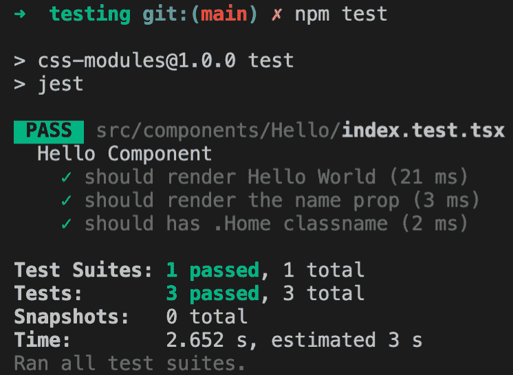
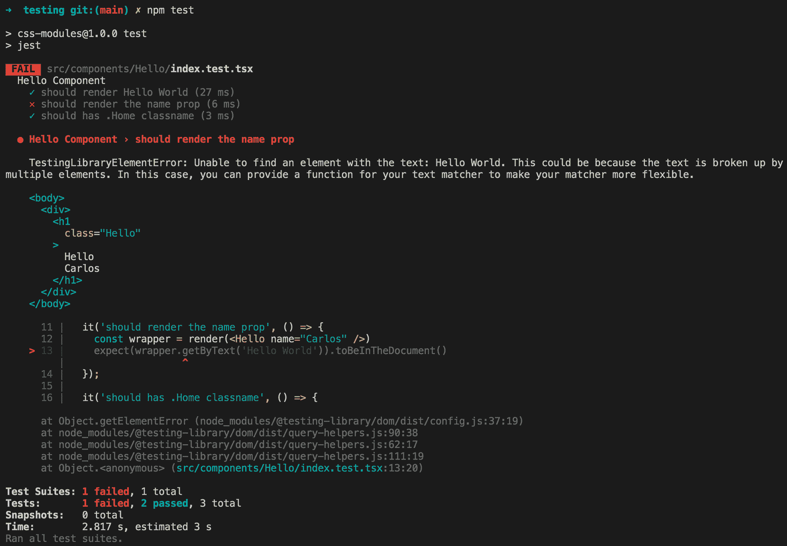
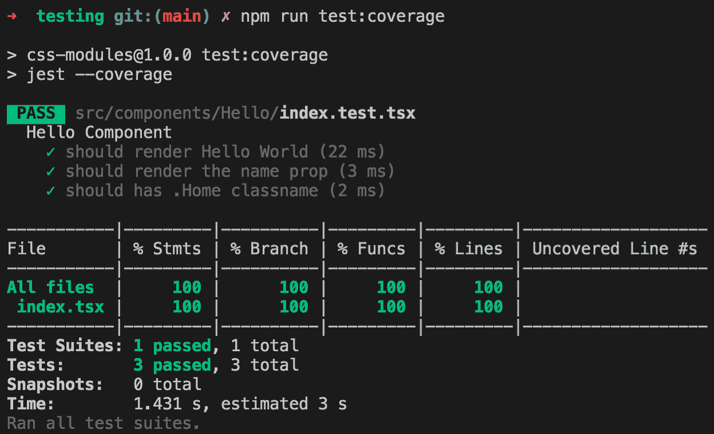
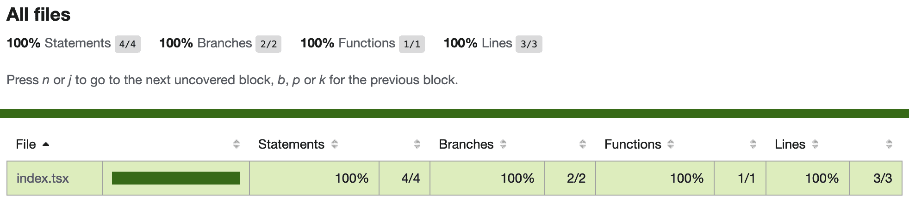
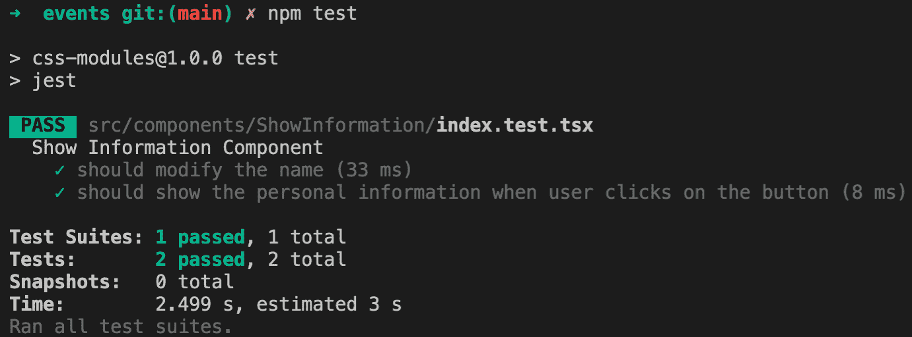

# 第十一章：测试和调试

由于 React 具有组件，因此很容易测试我们的应用程序。有许多不同的工具可以用来创建 React 测试，我们将在这里介绍最流行的工具，以了解它们提供的好处。

**Jest** 是一个由 Facebook 的 Christopher Pojer 和社区内的贡献者维护的*一站式*测试框架解决方案，旨在为您提供最佳的开发者体验。

通过本章结束时，您将能够从头开始创建测试环境，并为应用程序的组件编写测试。

在本章中，我们将讨论以下主题：

+   为什么测试我们的应用程序很重要，以及它们如何帮助开发人员更快地移动

+   如何设置 Jest 环境以使用 Enzyme 测试组件

+   React Testing Library 是什么，以及为什么它对于测试 React 应用程序是*必不可少*的

+   如何测试事件

+   React DevTools 和一些错误处理技术

# 技术要求

为了完成本章，您将需要以下内容：

+   Node.js 12+

+   Visual Studio Code

您可以在书的 GitHub 存储库中找到本章的代码：[`github.com/PacktPublishing/React-17-Design-Patterns-and-Best-Practices-Third-Edition/tree/main/Chapter11`](https://github.com/PacktPublishing/React-17-Design-Patterns-and-Best-Practices-Third-Edition/tree/main/Chapter11)。

# 了解测试的好处

测试 Web 用户界面一直是一项困难的工作。从单元测试到端到端测试，界面依赖于浏览器、用户交互和许多其他变量，这使得实施有效的测试策略变得困难。

如果您曾经尝试为 Web 编写端到端测试，您将知道获得一致的结果有多么复杂，结果往往受到不同因素（如网络）的影响而产生假阴性。除此之外，用户界面经常更新以改善体验，最大化转化率，或者仅仅添加新功能。

如果测试很难编写和维护，开发人员就不太可能覆盖他们的应用程序。另一方面，测试非常重要，因为它们使开发人员对他们的代码更有信心，这反映在速度和质量上。如果一段代码经过了良好的测试（并且测试编写得很好），开发人员可以确信它可以正常工作并且已经准备好发布。同样，由于测试的存在，重构代码变得更容易，因为测试保证了功能在重写过程中不会改变。

开发人员往往会专注于他们当前正在实现的功能，有时很难知道应用程序的其他部分是否受到这些更改的影响。测试有助于避免回归，因为它们可以告诉我们新代码是否破坏了旧测试。对于编写新功能的更大信心会导致更快的发布。

测试应用程序的主要功能使代码基础更加稳固，每当发现新的 bug 时，都可以重现、修复并通过测试覆盖，以便将来不再发生。

幸运的是，React（以及组件时代）使得测试用户界面变得更加简单和高效。测试组件或组件树是一项较少费力的工作，因为应用程序的每个部分都有其责任和边界。如果组件以正确的方式构建，如果它们是纯净的，并且旨在可组合和可重用，它们可以被测试为简单的函数。

现代工具带给我们的另一个巨大优势是能够使用 Node.js 和控制台运行测试。为每个测试启动浏览器会使测试变慢且不太可预测，降低开发人员的体验；相反，使用控制台运行测试会更快。

在控制台中仅测试组件有时会在实际浏览器中呈现时产生意外行为，但根据我的经验，这种情况很少见。当我们测试 React 组件时，我们希望确保它们能正常工作，并且在给定不同的 props 集合时，它们的输出始终是正确的。

我们可能还希望覆盖组件可能具有的所有各种状态。状态可能会通过单击按钮而改变，因此我们编写测试来检查所有事件处理程序是否按预期进行。

当组件的所有功能都被覆盖时，但我们想要做更多时，我们可以编写测试来验证组件在**边缘情况**下的行为。边缘情况是组件在例如所有 props 都为`null`或出现错误时可能出现的状态。一旦测试编写完成，我们就可以相当有信心地认为组件的行为符合预期。

测试单个组件很好，但这并不能保证一旦它们放在一起，多个经过单独测试的组件仍然能够正常工作。正如我们将在后面看到的，使用 React，我们可以挂载一组组件并测试它们之间的集成。

我们可以使用不同的技术来编写测试，其中最流行的之一是**测试驱动开发**（**TDD**）。应用 TDD 意味着首先编写测试，然后编写代码来通过测试。

遵循这种模式有助于我们编写更好的代码，因为我们被迫在实现功能之前更多地考虑设计，这通常会导致更高的质量。

# 使用 Jest 轻松进行 JavaScript 测试

学习如何以正确的方式测试 React 组件最重要的方法是通过编写一些代码，这就是我们将在本节中要做的事情。

React 文档表示，在 Facebook 他们使用 Jest 来测试他们的组件。然而，React 并不强制您使用特定的测试框架，您可以使用自己喜欢的任何一个而不会有任何问题。为了看到 Jest 的实际效果，我们将从头开始创建一个项目，安装所有依赖项并编写一个带有一些测试的组件。这将很有趣！

首先要做的是进入一个新文件夹并运行以下命令：

```jsx
npm init
```

一旦创建了`package.json`，我们就可以开始安装依赖项，第一个依赖项就是`jest`包本身：

```jsx
npm install --save-dev jest
```

要告诉`npm`我们想要使用`jest`命令来运行测试，我们必须在`package.json`中添加以下脚本：

```jsx
"scripts": { 
  "build": "webpack",
  "start": "node ./dist/server",
  "test": "jest",
  "test:coverage": "jest --coverage"
}
```

要使用 ES6 和 JSX 编写组件和测试，我们必须安装所有与 Babel 相关的包，以便 Jest 可以使用它们来转译和理解代码。

第二组依赖项的安装如下：

```jsx
npm install --save-dev @babel/core @babel/preset-env @babel/preset-react ts-jest
```

如您所知，我们现在必须创建一个`.babelrc`文件，Babel 将使用它来了解我们想要在项目中使用的预设和插件。

`.babelrc`文件如下所示：

```jsx
{ 
  "presets": ["@babel/preset-env", "@babel/preset-react"] 
}
```

现在，是时候安装 React 和`ReactDOM`了，我们需要它们来创建和渲染组件：

```jsx
npm install --save react react-dom
```

设置已经准备好，我们可以针对 ES6 代码运行 Jest 并将我们的组件渲染到 DOM 中，但还有一件事要做。

我们需要安装`@testing-library/jest-dom`和`@testing-library/react`：

```jsx
npm install @testing-library/jest-dom @testing-library/react
```

安装了这些软件包之后，您必须创建`jest.config.js`文件：

```jsx
 module.exports = {
  preset: 'ts-jest',
  setupFilesAfterEnv: ['<rootDir>/setUpTests.ts']
}
```

然后，让我们创建`setUpTests.ts`文件：

```jsx
import '@testing-library/jest-dom/extend-expect'
```

现在，让我们假设我们有一个`Hello`组件：

```jsx
import React, { FC } from 'react'

type Props = {
  name: string
}

const Hello: FC<Props> = ({ name }) => <h1 className="Hello">Hello {name || 'World'}</h1>

export default Hello
```

为了测试这个组件，我们需要创建一个同名文件，但是在新文件中添加`.test`（或`.spec`）后缀。这将是我们的测试文件：

```jsx
import React from 'react' import { render, cleanup } from '@testing-library/react'

import Hello from './index'

describe('Hello Component', () => {
  it('should render Hello World', () => {
    const wrapper = render(<Hello />)
    expect(wrapper.getByText('Hello World')).toBeInTheDocument()
  })

  it('should render the name prop', () => {
    const wrapper = render(<Hello name="Carlos" />)
    expect(wrapper.getByText('Hello Carlos')).toBeInTheDocument()
  });

  it('should has .Home classname', () => {
    const wrapper = render(<Hello />)
    expect(wrapper.container.firstChild).toHaveClass('Hello')
  });

  afterAll(cleanup)
})
```

然后，为了运行`test`，您需要执行以下命令：

```jsx
npm test
```

您应该看到这个结果：



`PASS`标签表示所有测试都已成功通过；如果您至少有一个测试失败，您将看到`FAIL`标签。让我们更改其中一个测试以使其失败：

```jsx
it('should render the name prop', () => {
  const wrapper = render(<Hello name="Carlos" />)
  expect(wrapper.getByText('Hello World')).toBeInTheDocument()
});
```

这是结果：



正如您所看到的，`FAIL`标签用`X`指定。此外，期望和接收值提供了有用的信息，您可以看到期望的值和接收的值。

如果您想查看所有单元测试的覆盖百分比，您可以执行以下命令：

```jsx
npm run test:coverage
```

结果如下：



覆盖还生成了结果的 HTML 版本；它创建了一个名为`coverage`的目录，里面又创建了一个名为`Icov-report`的目录。如果您在浏览器中打开`index.html`文件，您将看到以下 HTML 版本：



现在您已经进行了第一次测试，并且知道如何收集覆盖数据，让我们在下一节中看看如何测试事件。

# 测试事件

事件在任何 Web 应用程序中都很常见，我们也需要测试它们，因此让我们学习如何测试事件。为此，让我们创建一个新的`ShowInformation`组件：

```jsx
import { FC, useState, ChangeEvent } from 'react'

const ShowInformation: FC = () => {
  const [state, setState] = useState({ name: '', age: 0, show: false })

  const handleOnChange = (e: ChangeEvent<HTMLInputElement>) => {
    const { name, value } = e.target

    setState({
      ...state,
      [name]: value
    })
  }

  const handleShowInformation = () => {
    setState({
      ...state,
      show: true
    })
  }

 if (state.show) {
    return (
      <div className="ShowInformation">
        <h1>Personal Information</h1>

        <div className="personalInformation">
          <p>
            <strong>Name:</strong> {state.name}
          </p>
          <p>
            <strong>Age:</strong> {state.age}
          </p>
        </div>
      </div>
    )
  }

  return (
    <div className="ShowInformation">
      <h1>Personal Information</h1>

      <p>
        <strong>Name:</strong>
      </p>

      <p>
        <input name="name" type="text" value={state.name} onChange={handleOnChange} />
      </p>

      <p>
        <input name="age" type="number" value={state.age} onChange={handleOnChange} />
      </p>

      <p>
        <button onClick={handleShowInformation}>Show Information</button>
      </p>
    </div>
  )
}

export default ShowInformation
```

现在，让我们在`src/components/ShowInformation/index.test.tsx`中创建测试文件：

```jsx
import { render, cleanup, fireEvent } from '@testing-library/react'

import ShowInformation from './index'

describe('Show Information Component', () => {
  let wrapper

  beforeEach(() => {
    wrapper = render(<ShowInformation />)
  })

  it('should modify the name', () => {
    const nameInput = wrapper.container.querySelector('input[name="name"]') as HTMLInputElement
    const ageInput = wrapper.container.querySelector('input[name="age"]') as HTMLInputElement

    fireEvent.change(nameInput, { target: { value: 'Carlos' } })
    fireEvent.change(ageInput, { target: { value: 33 } })

    expect(nameInput.value).toBe('Carlos')
    expect(ageInput.value).toBe('33')
  })

  it('should show the personal information when user clicks on the button', () => {
    const button = wrapper.container.querySelector('button')

    fireEvent.click(button)

    const showInformation = wrapper.container.querySelector('.personalInformation')

    expect(showInformation).toBeInTheDocument()
  })

  afterAll(cleanup)
})
```

如果您运行测试并且工作正常，您应该会看到这个：



# 使用 React DevTools

当在控制台中进行测试不够时，我们希望在应用程序在浏览器中运行时检查它，我们可以使用 React DevTools。

您可以在以下网址安装此 Chrome 扩展程序：[`chrome.google.com/webstore/detail/react-developer-tools/fmkadmapgofadopljbjfkapdkoienihi?hl=en`](https://chrome.google.com/webstore/detail/react-developer-tools/fmkadmapgofadopljbjfkapdkoienihi?hl=en)。

安装后会在 Chrome DevTools 中添加一个名为**React**的选项卡，您可以检查组件的渲染树，以及它们在特定时间点接收到的属性和状态。

Props 和 states 可以被读取，并且可以实时更改以触发 UI 中的更新并立即查看结果。这是一个必不可少的工具，在最新版本中，它有一个新功能，可以通过选中“Trace React Updates”复选框来启用。

启用此功能后，我们可以使用我们的应用程序并直观地看到在执行特定操作时更新了哪些组件。更新的组件会用彩色矩形突出显示，这样就很容易发现可能的优化。

# 使用 Redux DevTools

如果您在应用程序中使用 Redux，您可能希望使用 Redux DevTools 来调试 Redux 流程。您可以在以下网址安装它：[`chrome.google.com/webstore/detail/redux-devtools/lmhkpmbekcpmknklioeibfkpmmfibljd?hl=es`](https://chrome.google.com/webstore/detail/redux-devtools/lmhkpmbekcpmknklioeibfkpmmfibljd?hl=es)。

此外，您需要安装`redux-devtools-extension`包：

```jsx
npm install --save-dev redux-devtools-extension
```

安装了 React DevTools 和 Redux DevTools 后，您需要对它们进行配置。

如果您尝试直接使用 Redux DevTools，它将无法工作；这是因为我们需要将`composeWithDevTools`方法传递到 Redux 存储中；这应该是`configureStore.ts`文件：

```jsx
// Dependencies
import { createStore, applyMiddleware } from 'redux';
import thunk from 'redux-thunk';
import { composeWithDevTools } from 'redux-devtools-extension';

// Root Reducer
import rootReducer from '@reducers';

export default function configureStore({ 
  initialState, 
  reducer 
}) {
  const middleware = [
    thunk
  ];

  return createStore(
    rootReducer,
    initialState,
    composeWithDevTools(applyMiddleware(...middleware))
  );
}
```

这是测试我们的 Redux 应用程序的最佳工具。

# 总结

在本章中，您了解了测试的好处，以及可以用来覆盖 React 组件的框架。

您学会了如何使用 React Testing Library 实现和测试组件和事件，如何使用 Jest 覆盖率，以及如何使用 React DevTools 和 Redux DevTools。在测试复杂组件时，例如高阶组件或具有多个嵌套字段的表单时，牢记常见的解决方案是很重要的。

在下一章中，您将学习如何使用 React Router 在应用程序中实现路由。
