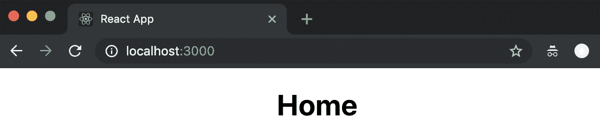
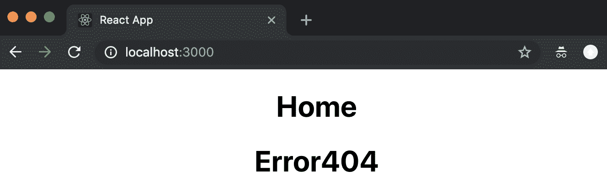
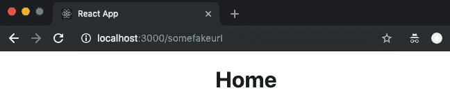
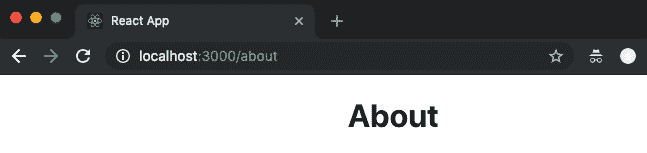
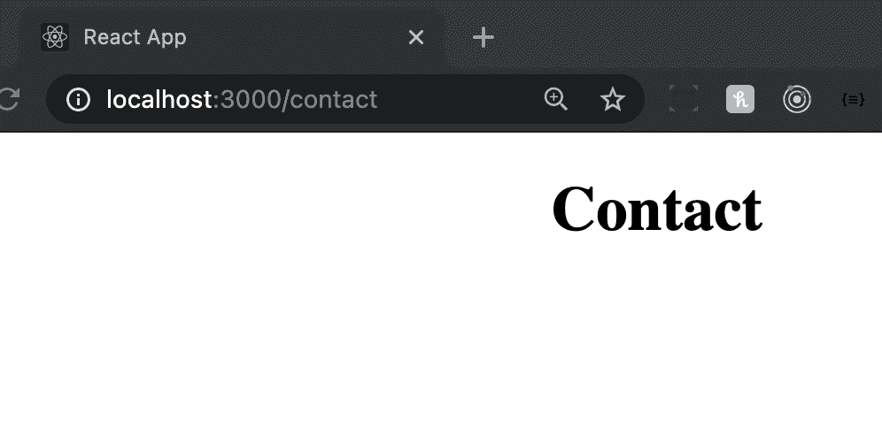
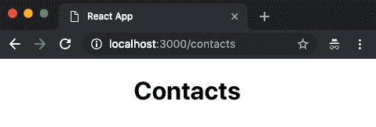
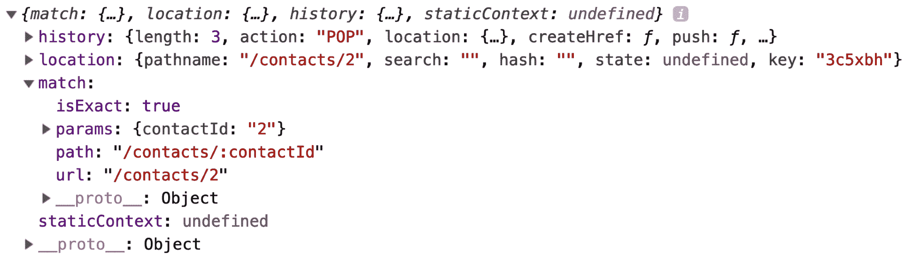
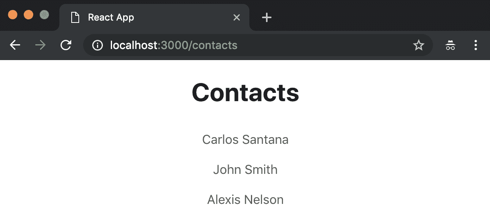
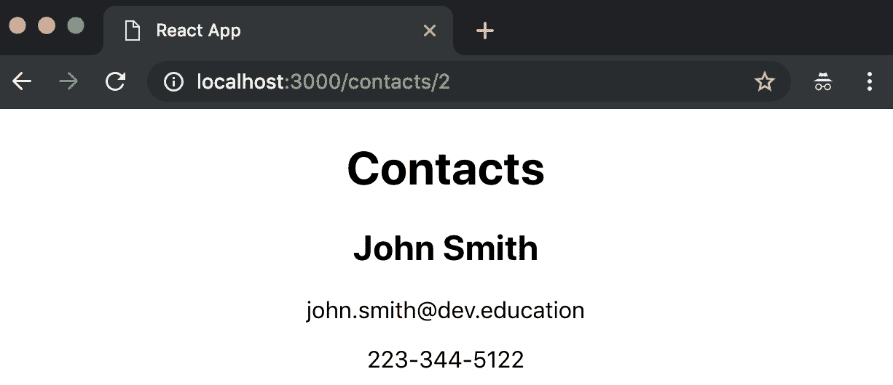
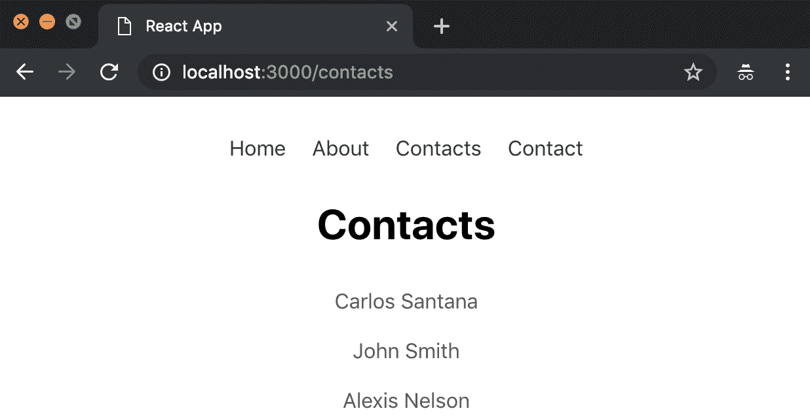

# 第十二章：React 路由器

与 Angular 不同，React 是一个库而不是一个框架，这意味着特定功能（例如路由或 PropTypes）不是 React 核心的一部分。相反，路由由一个名为**React Router**的第三方库处理。

在本章中，您将看到如何在应用程序中实现 React 路由器，并在相关部分结束时，您将能够添加动态路由并了解 React 路由器的工作原理。

在本章中，我们将涵盖以下主题：

+   了解`react-router`，`react-router-dom`和`react-router-native`包之间的区别

+   如何安装和配置 React 路由器

+   添加`<Switch>`组件

+   添加`exact`属性

+   向路由添加参数

# 技术要求

要完成本章，您将需要以下内容：

+   Node.js 12+

+   Visual Studio Code

您可以在书的 GitHub 存储库中找到本章的代码[`github.com/PacktPublishing/React-17-Design-Patterns-and-Best-Practices-Third-Edition/tree/main/Chapter12`](https://github.com/PacktPublishing/React-17-Design-Patterns-and-Best-Practices-Third-Edition/tree/main/Chapter12)。

# 安装和配置 React 路由器

使用`create-react-app`创建新的 React 应用程序后，您需要做的第一件事是安装 React Router v5.x，使用以下命令：

```jsx
npm install react-router-dom @types/react-router-dom
```

您可能会困惑为什么我们要安装`react-router-dom`而不是`react-router`。React Router 包含`react-router-dom`和`react-router-native`的所有常见组件。这意味着如果您在 Web 上使用 React，您应该使用`react-router-dom`，如果您在使用 React Native，则需要使用`react-router-native`。

`react-router-dom`包最初是为了包含版本 4 而创建的，而`react-router`使用版本 3。`react-router-dom`包在`react-router`上有一些改进。它们在这里列出：

+   改进的`<Link>`组件（渲染`<a>`）。

+   包括`<BrowserRouter>`，它与浏览器`window.history`交互。

+   包括`<NavLink>`，它是一个知道自己是否活动的`<Link>`包装器。

+   包括`<HashRouter>`，它使用 URL 中的哈希来渲染组件。如果您有一个静态页面，您应该使用这个组件而不是`<BrowserRouter>`。

# 创建我们的章节

让我们创建一些部分来测试一些基本路由。我们需要创建四个无状态组件（`About`、`Contact`、`Home`和`Error404`），并将它们命名为它们各自目录中的`index.tsx`。

您可以将以下内容添加到`src/components/Home.tsx`组件中：

```jsx
const Home = () => ( 
  <div className="Home">
    <h1>Home</h1>
 </div>
)

export default Home
```

`src/components/About.tsx`组件可以使用以下内容创建：

```jsx
const About = () => ( 
  <div className="About">
 <h1>About</h1>
 </div>
)

export default About
```

以下是创建`src/components/Contact.tsx`组件的步骤：

```jsx
const Contact = () => ( 
  <div className="Contact">
 <h1>Contact</h1>
 </div>
)

export default Contact
```

最后，`src/components/Error404.tsx`组件创建如下：

```jsx
const Error404 = () => ( 
  <div className="Error404">
 <h1>Error404</h1>
 </div>
)

export default Error404
```

创建所有功能组件后，我们需要修改`index.tsx`文件，以导入我们将在下一步中创建的路由文件：

```jsx
// Dependencies
import { render } from 'react-dom'
import { BrowserRouter as Router } from 'react-router-dom'

// Routes
import AppRoutes from './routes'

render( 
  <Router>
 <AppRoutes />
 </Router>, 
  document.getElementById('root')
)
```

现在，我们需要创建`routes.tsx`文件，在用户访问根路径(`/`)时渲染我们的`Home`组件：

```jsx
// Dependencies
import { Route } from 'react-router-dom'

// Components
import App from './App'
import Home from './components/Home'

const AppRoutes = () => ( 
  <App>
 <Route path="/" component={Home} /> 
 </App>
)

export default AppRoutes
```

之后，我们需要修改`App.tsx`文件，将路由组件渲染为子组件：

```jsx
import { FC, ReactNode } from 'react' 
import './App.css'

type Props = {
  children: ReactNode
}

const App: FC<Props> = ({ children }) => ( 
  <div className="App">
    {children}
  </div> 
)

export default App
```

如果运行应用程序，您将在根目录(`/`)中看到`Home`组件：



现在，当用户尝试访问任何其他路由时，让我们添加`Error404`：

```jsx
// Dependencies
import { Route } from 'react-router-dom'

// Components
import App from './App'
import Home from './components/Home'
import Error404 from './components/Error404'

const AppRoutes = () => (
  <App>
 <Route path="/" component={Home} />
    <Route component={Error404} />
 </App>
)

export default AppRoutes
```

让我们再次运行应用程序。您将看到`Home`和`Error404`组件都被渲染：



您可能想知道为什么会发生这种情况。这是因为我们需要使用`<Switch>`组件，只有当它匹配路径时才执行一个组件。为此，我们需要导入`Switch`组件，并将其添加为我们路由的包装器：

```jsx
// Dependencies
import { Route, Switch } from 'react-router-dom'

// Components
import App from './App'
import Home from './components/Home'
import Error404 from './components/Error404'

const AppRoutes = () => (
  <App>
    <Switch>
      <Route path="/" component={Home} />
      <Route component={Error404} />
    </Switch>
  </App>
)

export default AppRoutes
```

现在，如果您转到根目录(`/`)，您将看到`Home`组件和`Error404`不会同时执行，但是如果我们转到`/somefakeurl`，我们将看到`Home`组件也被执行，这是一个问题：



为了解决问题，我们需要在要匹配的路由中添加`exact`属性。问题在于`/somefakeurl`将匹配我们的根路径(`/`)，但是如果我们想非常具体地匹配路径，我们需要在`Home`路由中添加`exact`属性：

```jsx
const AppRoutes = () => (
  <App>
    <Switch>
      <Route path="/" component={Home} exact />
      <Route component={Error404} />
    </Switch>
  </App>
)
```

现在，如果您再次访问`/somefakeurl`，您将能够看到 Error404 组件：


现在，我们可以添加其他组件（`About`和`Contact`）：

```jsx
// Dependencies
import { Route, Switch } from 'react-router-dom'

// Components
import App from './App'
import About from './components/About'
import Contact from './components/Contact'
import Home from './components/Home'
import Error404 from './components/Error404'

const AppRoutes = () => (
 <App>
 <Switch>
      <Route path="/" component={Home} exact />
      <Route path="/about" component={About} exact />
      <Route path="/contact" component={Contact} exact />
      <Route component={Error404} />
 </Switch>
 </App>
)

export default AppRoutes
```

现在，您可以访问`/about`：



或者，您现在可以访问`/contact`：



现在你已经实现了你的第一个路由，现在让我们在下一节中向路由添加一些参数。

# 向路由添加参数

到目前为止，你已经学会了如何使用 React Router 来进行基本路由（单层路由）。现在，我将向你展示如何向路由添加一些参数并将它们传递到我们的组件中。

在这个例子中，我们将创建一个`Contacts`组件，当我们访问`/contacts`路由时，它将显示联系人列表，但当用户访问`/contacts/:contactId`时，它将显示联系人信息（`name`，`phone`和`email`）。

我们需要做的第一件事是创建我们的`Contacts`组件。让我们使用以下骨架。

让我们使用这些 CSS 样式：

```jsx
.Contacts ul {
  list-style: none;
  margin: 0;
  margin-bottom: 20px;
  padding: 0;
}

.Contacts ul li {
  padding: 10px;
}

.Contacts a {
  color: #555;
  text-decoration: none;
}

.Contacts a:hover {
  color: #ccc;
  text-decoration: none;
}
```

一旦你创建了`Contacts`组件，你需要将它导入到我们的路由文件中：

```jsx
// Dependencies
import { Route, Switch } from 'react-router-dom'

// Components
import App from './components/App'
import About from './components/About'
import Contact from './components/Contact'
import Home from './components/Home'
import Error404 from './components/Error404'
import Contacts from './components/Contacts'

const AppRoutes = () => (
  <App>
    <Switch>
      <Route path="/" component={Home} exact />
      <Route path="/about" component={About} exact />
      <Route path="/contact" component={Contact} exact />
      <Route path="/contacts" component={Contacts} exact />
      <Route component={Error404} />
    </Switch>
  </App>
)

export default AppRoutes
```

现在，如果你去到`/contacts`的 URL，你就能看到`Contacts`组件了：



现在`Contacts`组件已经连接到 React Router，让我们将我们的联系人渲染为列表：

```jsx
import { FC, useState } from 'react'
import { Link } from 'react-router-dom'
import './Contacts.css'

type Contact = {
  id: number
  name: string
  email: string
  phone: string
}

const data: Contact[] = [
  {
    id: 1,
    name: 'Carlos Santana',
    email: 'carlos.santana@dev.education',
    phone: '415-307-3112'
  },
  {
    id: 2,
    name: 'John Smith',
    email: 'john.smith@dev.education',
    phone: '223-344-5122'
  },
  {
    id: 3,
    name: 'Alexis Nelson',
    email: 'alexis.nelson@dev.education',
    phone: '664-291-4477'
  }
]

const Contacts: FC = (props) => {
 // For now we are going to add our contacts to our
 // local state, but normally this should come
 // from some service.
  const [contacts, setContacts] = useState<Contact[]>(data)

  const renderContacts = () => (
    <ul>
      {contacts.map((contact: Contact, key) => (
        <li key={contact.id}>
          <Link to={`/contacts/${contact.id}`}>{contact.name}</Link>
        </li>
      ))}
    </ul>
  )

  return (
    <div className="Contacts">
      <h1>Contacts</h1>

      {renderContacts()}
    </div>
  )
}

export default Contacts
```

正如你所看到的，我们正在使用`<Link>`组件，它将生成一个指向`/contacts/contact.id`的`<a>`标签，这是因为我们将在我们的路由文件中添加一个新的嵌套路由来匹配联系人的 ID：

```jsx
const AppRoutes = () => (
  <App>
 <Switch>
      <Route path="/" component={Home} exact />
      <Route path="/about" component={About} exact />
      <Route path="/contact" component={Contact} exact />
      <Route path="/contacts" component={Contacts} exact />
      <Route path="/contacts/:contactId" component={Contacts} exact />
      <Route component={Error404} />
 </Switch>
 </App>
)
```

React Router 有一个特殊的属性叫做`match`，它是一个包含与路由相关的所有数据的对象，如果我们有参数，我们将能够在`match`对象中看到它们：

```jsx
import { FC, useState } from 'react'
import { Link } from 'react-router-dom'
import './Contacts.css'

const data = [
  {
    id: 1,
    name: 'Carlos Santana',
    email: 'carlos.santana@js.education',
    phone: '415-307-3112'
  },
  {
    id: 2,
    name: 'John Smith',
    email: 'john.smith@js.education',
    phone: '223-344-5122'
  },
  {
    id: 3,
    name: 'Alexis Nelson',
    email: 'alexis.nelson@js.education',
    phone: '664-291-4477'
  }
]

type Contact = {
  id: number
  name: string
  email: string
  phone: string
}

type Props = {
  match: any
}

const Contacts: FC<Props> = (props) => {
  // For now we are going to add our contacts to our
 // local state, but normally this should come
 // from some service.
  const [contacts, setContacts] = useState<Contact[]>(data)

 // Let's see what contains the match object.
  console.log(props)

  const { match: { params: { contactId } } } = props

  // By default our selectedNote is false
  let selectedContact: any = false

  if (contactId > 0) {
 // If the contact id is higher than 0 then we filter it from our
 // contacts array.
    selectedContact = contacts.filter(
      contact => contact.id === Number(contactId)
    )[0];
  }

  const renderSingleContact = ({ name, email, phone }: Contact) => (
    <>
      <h2>{name}</h2>
      <p>{email}</p>
      <p>{phone}</p>
    </>
  )

  const renderContacts = () => (
    <ul>
      {contacts.map((contact: Contact, key) => (
        <li key={key}>
          <Link to={`/contacts/${contact.id}`}>{contact.name}</Link>
        </li>
      ))}
    </ul>
  )

  return (
    <div className="Contacts">
      <h1>Contacts</h1>
      {/* We render our selectedContact or all the contacts */}
      {selectedContact
        ? renderSingleContact(selectedContact)
        : renderContacts()}
    </div>
  )
}

export default Contacts
```

`match`属性看起来像这样：



正如你所看到的，`match`属性包含了很多有用的信息。React Router 还包括了对象的历史和位置。此外，我们可以获取我们在路由中传递的所有参数；在这种情况下，我们接收到了`contactId`参数。

如果你再次运行应用程序，你应该能够看到你的联系人就像这样：



如果你点击约翰·史密斯（他的`contactId`是`2`），你会看到联系人的信息：



在此之后，你可以在`App`组件中添加一个导航栏来访问所有的路由：

```jsx
import { Link } from 'react-router-dom'
import './App.css'

const App = ({ children }) => (
  <div className="App">
    <ul className="menu">
      <li><Link to="/">Home</Link></li>
      <li><Link to="/about">About</Link></li>
      <li><Link to="/contacts">Contacts</Link></li>
      <li><Link to="/contact">Contact</Link></li>
    </ul>

    {children}
  </div>
)

export default App
```

现在，让我们修改我们的`App`样式：

```jsx
.App {
  text-align: center;
}

.App ul.menu {
  margin: 50px;
  padding: 0;
  list-style: none;
}

.App ul.menu li {
  display: inline-block;
  padding: 0 10px;
}

.App ul.menu li a {
  color: #333;
  text-decoration: none;
}

.App ul.menu li a:hover {
  color: #ccc;
}
```

最后，你会看到类似这样的东西：



现在你知道如何向你的应用程序添加带有参数的路由了 - 这太棒了，对吧？

# 总结

我们的 React Router 之旅已经结束，现在你知道如何安装和配置 React Router，如何创建基本路由，以及如何向嵌套路由添加参数。

在下一章中，我们将看到如何避免 React 中一些最常见的反模式。
