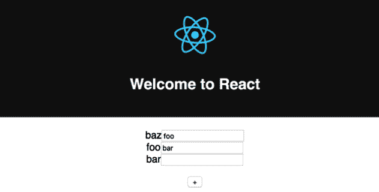

# 第十三章：要避免的反模式

在本书中，您已经学会了在编写 React 应用程序时应用最佳实践。在最初的几章中，我们重新审视了基本概念以建立扎实的理解，然后在接下来的章节中，我们深入了解了更高级的技术。

现在，您应该能够构建可重用的组件，使组件彼此通信，并优化应用程序树以获得最佳性能。然而，开发人员会犯错误，本章就是关于在使用 React 时应避免的常见反模式。

查看常见错误将帮助您避免它们，并有助于您了解 React 的工作原理以及如何以 React 方式构建应用程序。对于每个问题，我们将看到一个示例，展示如何重现和解决它。

在本章中，我们将涵盖以下主题：

+   使用属性初始化状态

+   使用索引作为键

+   在 DOM 元素上扩展属性

# 技术要求

完成本章，您将需要以下内容：

+   Node.js 12+

+   Visual Studio Code

您可以在书的 GitHub 存储库中找到本章的代码：[`github.com/PacktPublishing/React-17-Design-Patterns-and-Best-Practices-Third-Edition/tree/main/Chapter13`](https://github.com/PacktPublishing/React-17-Design-Patterns-and-Best-Practices-Third-Edition/tree/main/Chapter13)。

# 使用属性初始化状态

在本节中，我们将看到如何使用从父级接收的属性初始化状态通常是一种反模式。我使用“通常”这个词，因为正如我们将看到的，一旦我们清楚了这种方法的问题是什么，我们可能仍然决定使用它。

学习某事的最佳方法之一是查看代码，因此我们将从创建一个简单的组件开始，其中包含一个`+`按钮来增加计数器。

该组件是使用类实现的，如下面的代码片段所示：

```jsx
import { FC, useState } from 'react'

type Props = {
  count: number
}

const Counter: FC<Props> = (props) => {}

export default Counter
```

现在，让我们设置我们的`count`状态：

```jsx
const [state, setState] = useState<any>(props.count)
```

单击处理程序的实现非常简单直接-我们只需将`1`添加到当前的`count`值中，并将结果值存储回`state`中：

```jsx
const handleClick = () => {
  setState({ count: state.count + 1 })
}
```

最后，我们渲染并描述输出，其中包括`count`状态的当前值和增加它的按钮：

```jsx
return (
  <div>
    {state.count}
    <button onClick={handleClick}>+</button>
  </div>
)
```

现在，让我们渲染此组件，将`1`作为`count`属性传递：

```jsx
<Counter count={1} />
```

它的工作正常-每次单击`+`按钮时，当前值都会增加。那么问题是什么呢？

有两个主要错误，如下所述：

+   我们有一个重复的真相来源。

+   如果传递给组件的`count`属性发生更改，则状态不会得到更新。

如果我们使用 React DevTools 检查`Counter`元素，我们会注意到`Props`和`State`具有相似的值：

```jsx
<Counter>
Props
  count: 1
State
  count: 1
```

这使得在组件内部和向用户显示时不清楚当前和可信的值是哪个。

更糟糕的是，点击*+*一次会使值发散。此发散的示例如下代码所示：

```jsx
<Counter>
Props
  count: 1
State
  count: 2
```

在这一点上，我们可以假设第二个值代表当前计数，但这并不明确，可能会导致意外行为，或者在树下面出现错误的值。

第二个问题集中在 React 如何创建和实例化类上。组件的`useState`函数只在创建组件时调用一次。

在我们的`Counter`组件中，我们读取`count`属性的值并将其存储在状态中。如果该属性的值在应用程序的生命周期中发生更改（假设它变为`10`），则`Counter`组件永远不会使用新值，因为它已经被初始化。这会使组件处于不一致的状态，这不是最佳的，并且很难调试。

如果我们真的想要使用 prop 的值来初始化组件，并且我们确信该值将来不会改变呢？

在这种情况下，最佳做法是明确表示并给属性命名，以明确您的意图，例如`initialCount`。例如，让我们以以下方式更改`Counter`组件的 prop 声明：

```jsx
type Props = {
  initialCount: number
}

const Counter: FC<Props> = (props) => {
  const [count, setState] = useState<any>(props.initialCount)
  ...
}
```

如果我们这样使用，很明显父级只有一种方法来初始化计数器，但是`initialCount`属性的任何将来的值都将被忽略：

```jsx
<Counter initialCount={1} />
```

在下一节中，我们将学习有关键的知识。

# 使用索引作为键

在*第十章*，*改进应用程序的性能*中，我们看到了如何通过使用`key`属性来帮助 React 找出更新 DOM 的最短路径。

key 属性在 DOM 中唯一标识元素，并且 React 使用它来检查元素是新的还是在组件属性或状态更改时必须更新。

始终使用键是一个好主意，如果不这样做，React 会在控制台（开发模式下）中发出警告。但是，这不仅仅是使用键的问题；有时，我们决定用作键的值可能会有所不同。实际上，使用错误的键可能会在某些情况下导致意外行为。在本节中，我们将看到其中一个实例。

让我们再次创建一个`List`组件，如下所示：

```jsx
import { FC, useState } from 'react'

const List: FC = () => {

}

export default List
```

然后我们定义我们的状态：

```jsx
const [items, setItems] = useState(['foo', 'bar'])
```

单击处理程序的实现与上一个实现略有不同，因为在这种情况下，我们需要在列表顶部插入一个新项目：

```jsx
const handleClick = () => { 
  const newItems = items.slice()
  newItems.unshift('baz')

  setItems(newItems)
}
```

最后，在`render`中，我们显示列表和`+`按钮，以在列表顶部添加`baz`项目：

```jsx
return ( 
  <div> 
    <ul> 
      {items.map((item, index) => ( 
        <li key={index}>{item}</li> 
      ))} 
    </ul> 

    <button onClick={handleClick}>+</button> 
  </div> 
) 
```

如果您在浏览器中运行组件，将不会看到任何问题；单击`+`按钮会在列表顶部插入一个新项目。但让我们做一个实验。

让我们以以下方式更改`render`，在每个项目旁边添加一个输入字段。然后我们使用输入字段，因为我们可以编辑它的内容，这样更容易找出问题：

```jsx
return ( 
  <div> 
    <ul> 
      {items.map((item, index) => ( 
        <li key={index}> 
          {item} 
          <input type="text" /> 
        </li> 
      ))} 
    </ul> 
    <button onClick={handleClick}>+</button> 
  </div> 
)
```

如果我们在浏览器中再次运行此组件，复制输入字段中项目的值，然后单击*+*，我们将得到意外的行为。

如下截图所示，项目向下移动，而输入元素保持在原位，这样它们的值不再与项目的值匹配：



运行组件，单击+，并检查控制台应该给我们所有需要的答案。

我们可以看到的是，React 不是在顶部插入新元素，而是交换了两个现有元素的文本，并将最后一个项目插入到底部，就好像它是新的一样。它这样做的原因是我们将`map`函数的索引用作键。

实际上，即使我们将一个新项目推送到列表顶部，索引始终从`0`开始，因此 React 认为我们更改了现有两个的值，并在索引`2`处添加了一个新元素。行为与根本不使用键属性时相同。

这是一个非常常见的模式，因为我们可能认为提供任何键都是最佳解决方案，但实际情况并非如此。键必须是唯一且稳定的，只能标识一个项目。

为了解决这个问题，我们可以，例如，使用项目的值，如果我们期望它在列表中不重复，或者创建一个唯一标识符。

# 在 DOM 元素上扩展属性

最近，有一种常见的做法被丹·阿布拉莫夫描述为反模式；当您在 React 应用程序中这样做时，它还会触发控制台中的警告。

这是社区中广泛使用的一种技术，我个人在现实项目中多次看到过。我们通常将属性扩展到元素上，以避免手动编写每个属性，如下所示：

```jsx
<Component {...props} />
```

这非常有效，并且通过 Babel 转译为以下代码：

```jsx
_jsx(Component, props)
```

然而，当我们将属性扩展到 DOM 元素时，我们有可能添加未知的 HTML 属性，这是不好的实践。

问题不仅与扩展运算符有关；逐个传递非标准属性也会导致相同的问题和警告。由于扩展运算符隐藏了我们正在传递的单个属性，因此更难以弄清楚我们正在传递给元素的内容。

要在控制台中看到警告，我们可以执行以下基本操作：渲染以下组件：

```jsx
const Spread = () => <div foo="bar" />
```

我们得到的消息看起来像下面这样，因为`foo`属性对于`div`元素是无效的：

```jsx
Unknown prop `foo` on <div> tag. Remove this prop from the element
```

在这种情况下，正如我们所说的，很容易弄清楚我们正在传递哪个属性并将其删除，但是如果我们使用扩展运算符，就像以下示例中一样，我们无法控制从父级传递的属性：

```jsx
const Spread = props => <div {...props} />;
```

如果我们以以下方式使用组件，就不会出现问题：

```jsx
<Spread className="foo" />
```

然而，如果我们做类似以下的事情，情况就不同了。React 会抱怨，因为我们正在向 DOM 元素应用非标准属性：

```jsx
<Spread foo="bar" className="baz" />
```

我们可以使用的一个解决方案来解决这个问题是创建一个名为`domProps`的属性，我们可以安全地将其扩展到组件上，因为我们明确表示它包含有效的 DOM 属性。

例如，我们可以按照以下方式更改`Spread`组件：

```jsx
const Spread = props => <div {...props.domProps} />
```

然后我们可以这样使用它：

```jsx
<Spread foo="bar" domProps={{ className: 'baz' }} />
```

正如我们在 React 中多次看到的那样，明确是一个好的实践。

# 总结

了解所有最佳实践总是一件好事，但有时了解反模式可以帮助我们避免走错路。最重要的是，了解为什么某些技术被认为是不良实践的原因，可以帮助我们理解 React 的工作原理，以及如何有效地使用它。

在本章中，我们介绍了四种不同的使用组件的方式，这些方式可能会影响我们的 Web 应用程序的性能和行为。

针对每一个问题，我们都使用了一个示例来重现问题，并提供了需要应用的更改来解决问题。

我们了解到为什么使用属性来初始化状态可能会导致状态和属性之间的不一致。我们还看到了如何使用错误的键属性可能会对协调算法产生不良影响。最后，我们了解到为什么将非标准属性扩展到 DOM 元素被视为一种反模式。

在下一章中，我们将探讨如何将我们的 React 应用部署到生产环境中。
