# 第十四章：部署到生产环境

现在您已经完成了您的第一个 React 应用程序，是时候学习如何将其部署到世界上了。为此，我们将使用名为**DigitalOcean**的云服务。

在本章中，您将学习如何在 DigitalOcean 的 Ubuntu 服务器上使用 Node.js 和 nginx 部署您的 React 应用程序。

在本章中，我们将涵盖以下主题：

+   创建一个 DigitalOcean Droplet 并对其进行配置

+   配置 nginx、PM2 和域名

+   实施 CircleCI 进行持续集成

# 技术要求

要完成本章，您将需要以下内容：

+   Node.js 12+

+   Visual Studio Code

# 创建我们的第一个 DigitalOcean Droplet

我已经使用 DigitalOcean 六年了，我可以说这是我尝试过的最好的云服务之一，不仅因为价格实惠，而且配置起来非常简单快捷，社区也有很多更新的文档来解决与服务器配置相关的常见问题。

在这一点上，您需要投入一些资金来获得这项服务。我将向您展示最便宜的方法来做到这一点，如果将来您想增加 Droplets 的性能，您将能够在不重新配置的情况下增加容量。最基本的 Droplet 的最低价格是每月 5.00 美元（每小时 0.007 美元）。

我们将使用 Ubuntu 20.04（但也可以使用最新版本 21.04）；您将需要了解一些基本的 Linux 命令来配置您的 Droplet。如果您是 Linux 的初学者，不用担心，我会尽量以非常简单的方式向您展示每一步。

## 注册 DigitalOcean

如果您还没有 DigitalOcean 账户，可以在[`cloud.digitalocean.com/registrations/new`](https://cloud.digitalocean.com/registrations/new)注册。

您可以使用 Google 账户注册，也可以手动注册。一旦您使用 Google 注册，您将看到如下的账单信息视图：

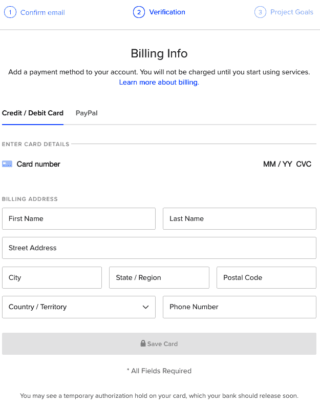

您可以使用信用卡支付，也可以使用 PayPal 支付。一旦您配置了付款信息，DigitalOcean 将要求您提供一些关于您的项目的信息，以便更快地配置您的 Droplet：

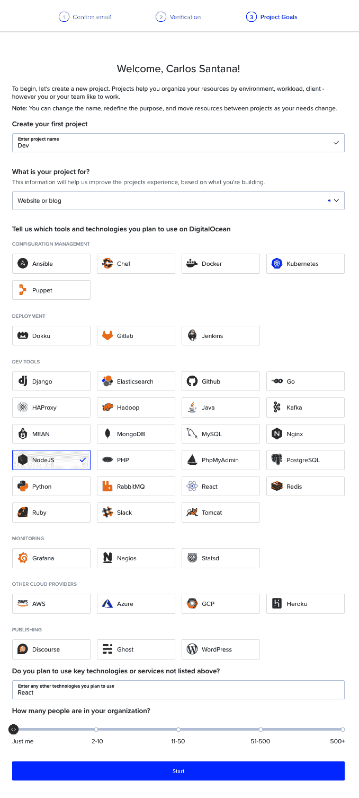

在接下来的部分，我们将创建我们的第一个 Droplet。

## 创建我们的第一个 Droplet

我们将从头开始创建一个新的 Droplet。按照以下步骤操作：

1.  选择“New Droplet”选项，如下截图所示：

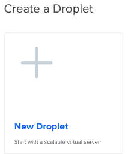

1.  选择 Ubuntu 20.04（LTS）x64，如下所示：

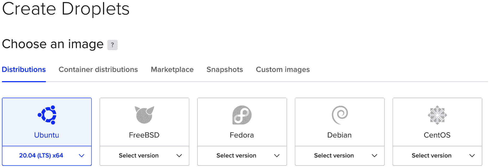

1.  然后，选择基本计划，如下所示：

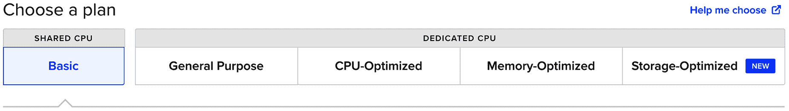

1.  然后，您可以在付款计划选项中选择$5/月：

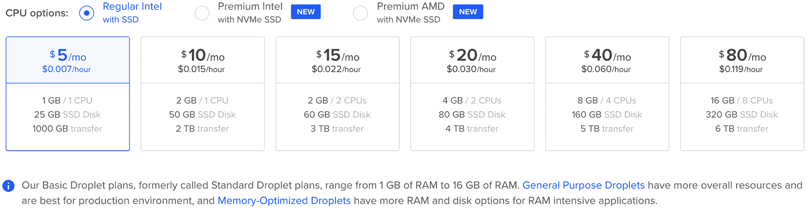

1.  选择一个地区。在这种情况下，我们将选择旧金山地区：

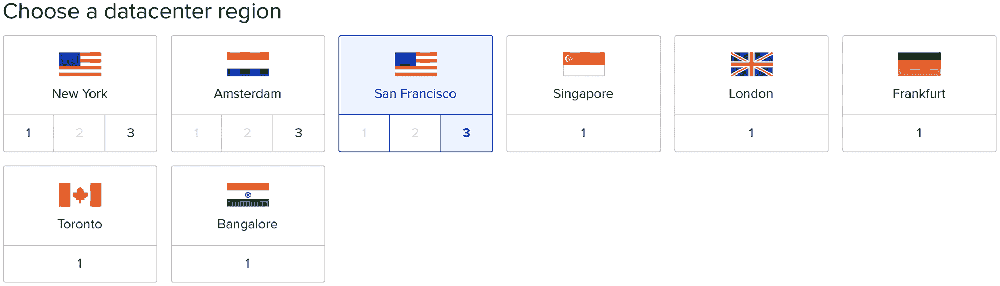

1.  创建一个根密码，添加 Droplet 的名称，然后点击“Create Droplet”按钮，如下所示：

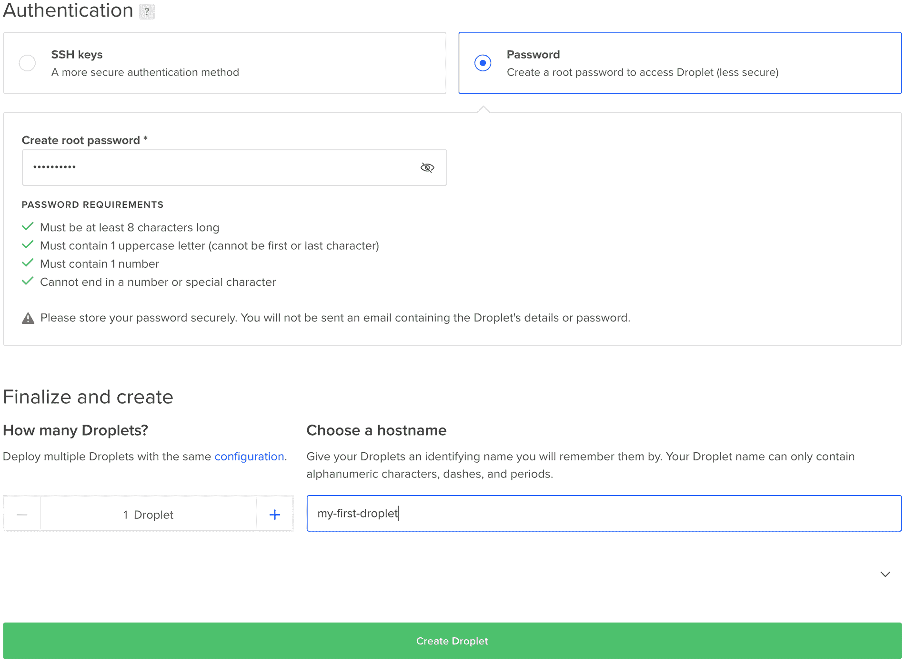

1.  创建 Droplet 大约需要 30 秒。创建完成后，您将能够看到它：

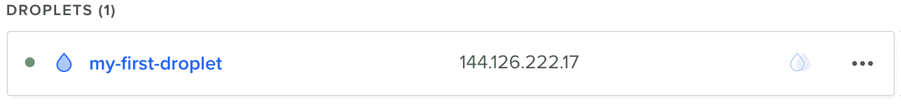

1.  现在，在您的终端中，您可以使用以下命令访问 Droplet：

```jsx
ssh root@THE_DROPLET_IP
```

1.  第一次访问时会要求输入指纹，只需输入 Yes，然后需要输入密码（创建 Droplet 时定义的密码）。

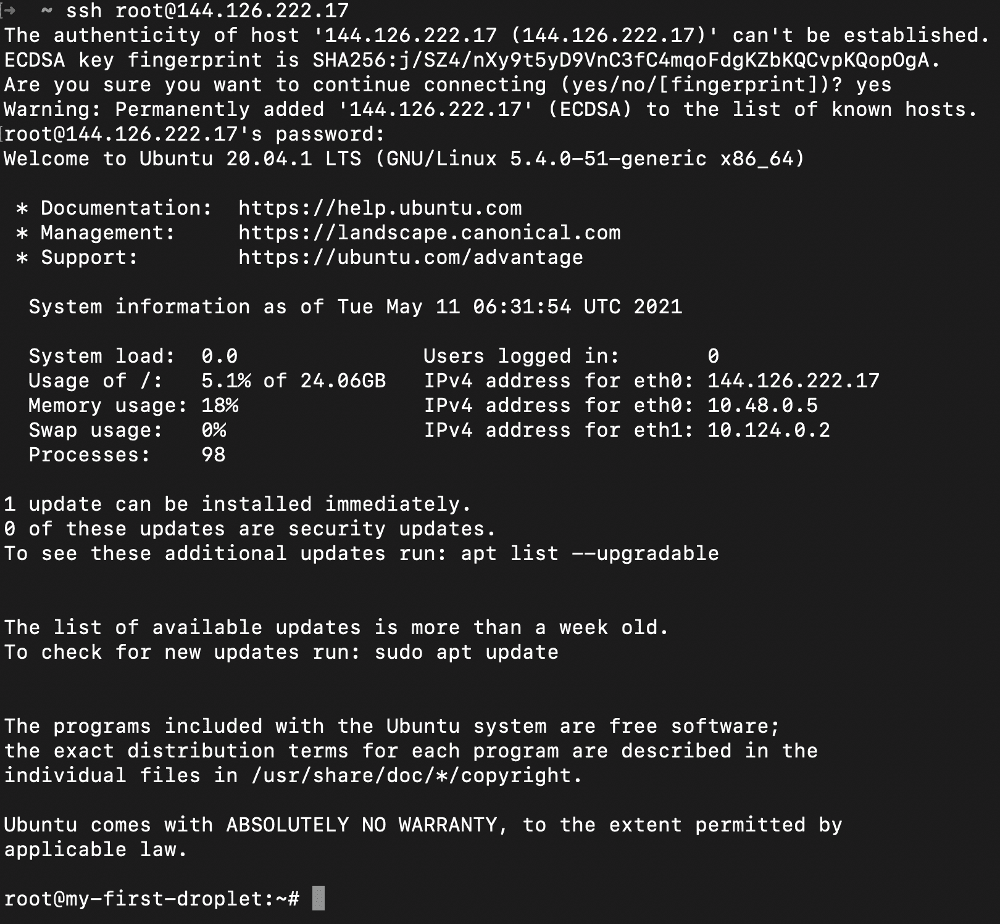

现在我们已经准备好安装 Node.js 了，我们将在下一节中进行介绍。

## 安装 Node.js

现在您已连接到 Droplet，让我们对其进行配置。首先，我们需要使用个人软件包存档安装最新版本的 Node.js。撰写本书时的当前 Node 版本为 14.16.x。按照以下步骤安装 Node.js：

1.  如果在阅读本段时，Node 有新版本，请在`setup_14.x`命令中更改版本：

```jsx
cd ~
curl -sL https://deb.nodesource.com/setup_14.x -o nodesource_setup.sh
```

1.  一旦获得`nodesource_setup.sh`文件，运行以下命令：

```jsx
sudo bash nodesource_setup.sh 
```

1.  然后，通过运行以下命令安装 Node：

```jsx
sudo apt install nodejs -y
```

1.  如果一切正常，可以使用以下命令验证已安装的 Node 和`npm`的版本：

```jsx
node -v
v14.16.1
npm -v
6.14.12
```

如果您需要更新版本的 Node.js，您可以随时升级。

## 配置 Git 和 GitHub

我创建了一个特殊的存储库，以帮助您将第一个 React 应用程序部署到生产环境（[`github.com/D3vEducation/production`](https://github.com/D3vEducation/production)）。

在您的 Droplet 中，您需要克隆这个 Git 仓库（或者如果您的 React 应用程序已准备好部署，则使用您自己的仓库）。生产仓库是公开的，但通常您会使用私有仓库；在这种情况下，您需要将 Droplet 的 SSH 密钥添加到您的 GitHub 帐户中。要创建此密钥，请按照以下步骤操作：

1.  运行`ssh-keygen`命令，然后按*Enter*三次，不写任何密码：

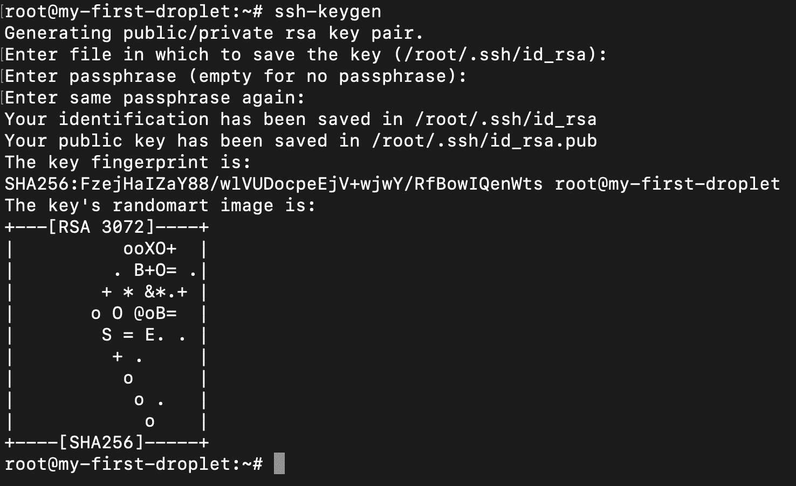如果您的终端闲置超过五分钟，您的 Droplet 连接可能会被关闭，您需要重新连接。

1.  创建 Droplet SSH 密钥后，您可以通过运行以下命令查看它：

```jsx
 vi /root/.ssh/id_rsa.pub
```

您会看到类似这样的东西：

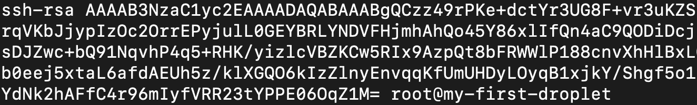

1.  复制您的 SSH 密钥，然后访问您的 GitHub 帐户。转到设置| SSH 和 GPG 密钥（[`github.com/settings/ssh/new`](https://github.com/settings/ssh/new)）。然后，在文本区域中粘贴您的密钥并为密钥添加标题：

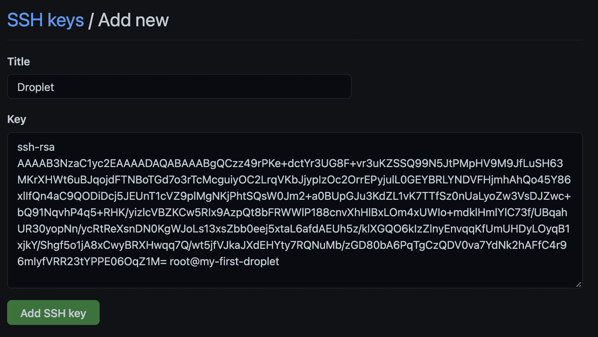

1.  点击“添加 SSH 密钥”按钮后，您将看到您的 SSH 密钥，如下所示：

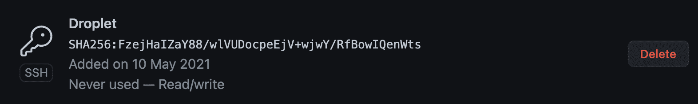

1.  现在您可以使用以下命令克隆我们的仓库（或您的仓库）：

```jsx
git clone git@github.com:FoggDev/production.git
```

1.  当您第一次克隆它时，您将收到一条消息，询问您是否允许 RSA 密钥指纹：

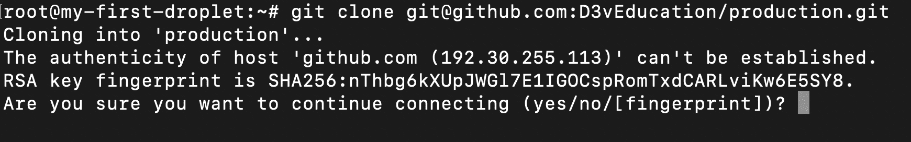

1.  你必须输入 yes 然后按*Enter*来克隆它：

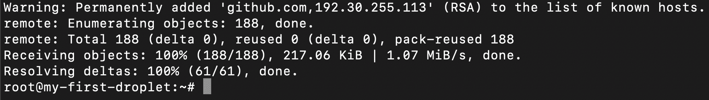

1.  然后，您需要转到`production`目录并安装`npm`包：

```jsx
cd production
npm install
```

1.  如果要测试应用程序，只需运行`start`脚本：

```jsx
npm start
```

1.  然后打开浏览器，转到您的 Droplet IP 并添加端口号。在我的情况下，它是`http://144.126.222.17:3000`：

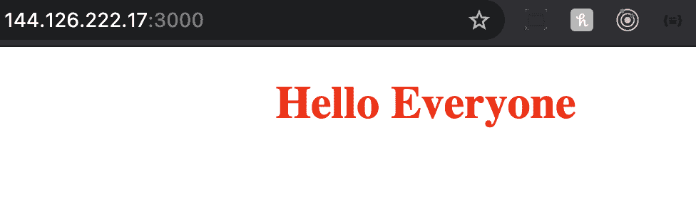

1.  这将以开发模式运行项目。如果要以生产模式运行，则使用以下命令：

```jsx
npm run start:production
```

你应该看到 PM2 正在运行，如下截图所示：

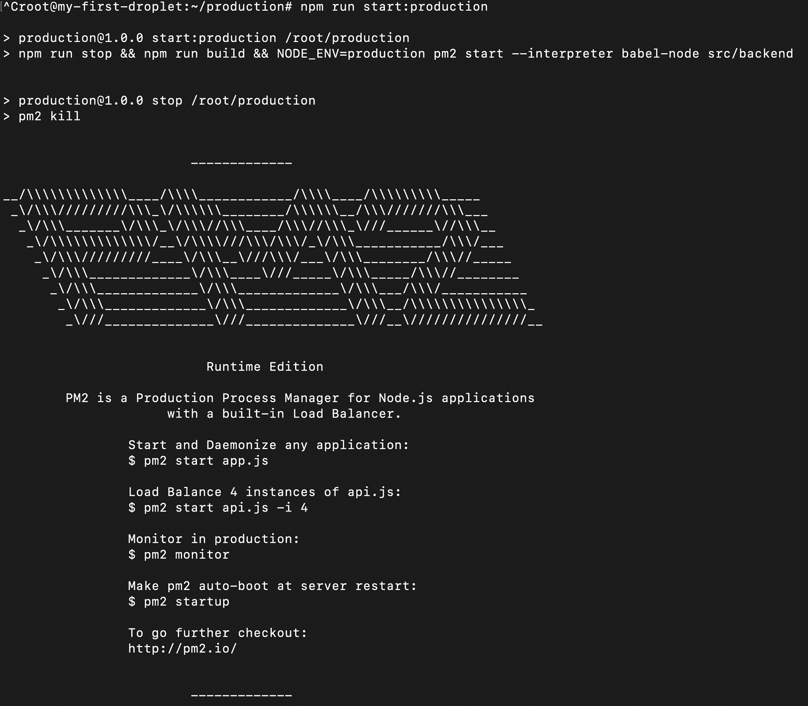

1.  如果运行它并在 Chrome DevTools 的网络选项卡中查看，您将看到加载的捆绑包：

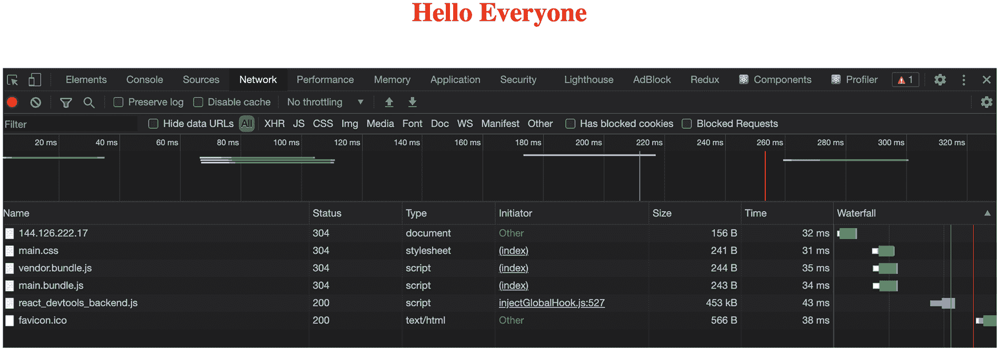

我们现在的 React 应用程序在生产中运行，但让我们在下一节中看看我们可以用 DigitalOcean 做些什么。

## 关闭我们的 Droplet

要关闭 Droplet，请按照以下步骤操作：

1.  如果要关闭 Droplet，可以转到电源部分，或者可以使用开/关开关：

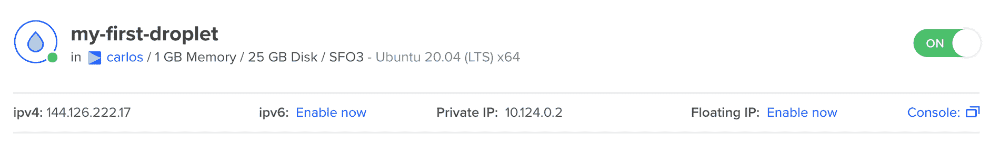

1.  DigitalOcean 只有在您的 Droplet 处于开启状态时才会向您收费。如果单击开关以关闭它，那么您将收到以下确认消息：

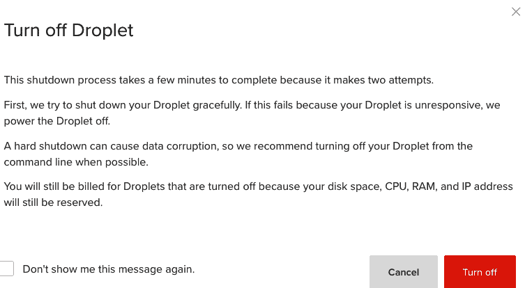

通过这种方式，您可以控制您的 Droplet，并在不使用 Droplet 时避免不必要的支付。

# 配置 nginx，PM2 和域名

我们的 Droplet 已经准备好用于生产，但是正如你所看到的，我们仍然在使用端口`3000`。我们需要配置 nginx 并实现代理，将流量从端口`80`重定向到`3000`；这意味着我们将不再需要直接指定端口。**Node 生产进程管理器**（**PM2**）将帮助我们在生产环境中安全运行 Node 服务器。通常，如果我们直接使用`node`或`babel-node`命令运行 Node，并且应用程序出现错误，那么它将崩溃并停止工作。PM2 会在发生错误时重新启动节点服务器。

首先，在您的 Droplet 中，您需要全局安装 PM2：

```jsx
npm install -g pm2 
```

PM2 将帮助我们以非常简单的方式运行 React 应用程序。

## 安装和配置 nginx

要安装 nginx，您需要执行以下命令：

```jsx
sudo apt-get update
sudo apt-get install nginx
```

安装 nginx 后，您可以开始配置：

1.  我们需要调整防火墙以允许端口`80`的流量。要列出可用的应用程序配置，您需要运行以下命令：

```jsx
sudo ufw app list
Available applications:
 Nginx Full
 Nginx HTTP
 Nginx HTTPS
 OpenSSH
```

1.  `Nginx Full`表示它将允许从端口`80`（HTTP）和端口`443`（HTTPS）的流量。我们还没有配置任何带 SSL 的域名，所以现在我们应该限制流量只能通过端口`80`（HTTP）发送：

```jsx
sudo ufw allow 'Nginx HTTP'
Rules updated
Rules updated (v6) 
```

如果尝试访问 Droplet IP，您应该看到 nginx 正在工作：

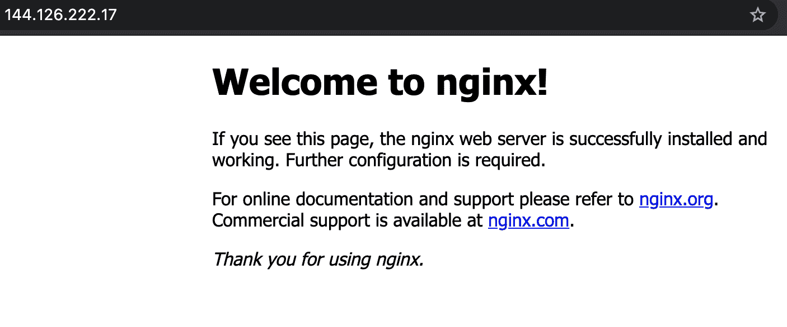

1.  您可以使用以下命令管理 nginx 进程：

```jsx
Start server: sudo systemctl start nginx
Stop server: sudo systemctl stop nginx 
Restart server: sudo systemctl restart nginx
```

Nginx 是一个非常流行的出色的 Web 服务器。

## 设置反向代理服务器

如我之前提到的，我们需要设置一个反向代理服务器，将流量从端口`80`（HTTP）发送到端口`3000`（React 应用程序）。为此，您需要打开以下文件：

```jsx
sudo vi /etc/nginx/sites-available/default 
```

步骤如下：

1.  在`location /`块中，您需要用以下内容替换文件中的代码：

```jsx
location / {
  proxy_pass http://localhost:3000; 
  proxy_http_version 1.1; 
  proxy_set_header Upgrade $http_upgrade; 
  proxy_set_header Connection 'upgrade'; 
  proxy_set_header Host $host; 
  proxy_cache_bypass $http_upgrade;
}
```

1.  保存文件后，您可以使用以下命令验证 nginx 配置中是否存在语法错误：

```jsx
sudo nginx -t
```

1.  如果一切正常，那么您应该看到这个：

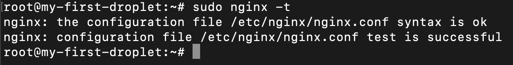

1.  最后，您需要重新启动 nginx 服务器：

```jsx
sudo systemctl restart nginx
```

现在，您应该能够访问 React 应用程序而不需要端口，如下面的屏幕截图所示：

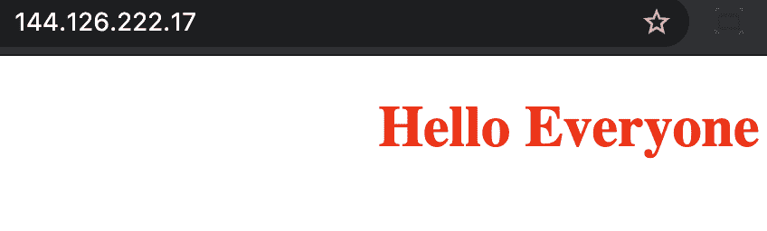

我们快要完成了！在下一节中，我们将向我们的 Droplet 添加一个域名。

## 将域名添加到我们的 Droplet

使用 IP 访问网站并不好；我们总是需要使用域名来帮助用户更容易地找到我们的网站。如果您想在 Droplet 上使用域名，您需要将您的域名的域名服务器更改为指向 DigitalOcean DNS。我通常使用 GoDaddy 来注册我的域名。要使用 GoDaddy 这样做，请按照以下步骤：

1.  转到[`dcc.godaddy.com/manage/YOURDOMAIN.COM/dns`](https://dcc.godaddy.com/manage/YOURDOMAIN.COM/dns)，然后转到 Nameservers 部分：

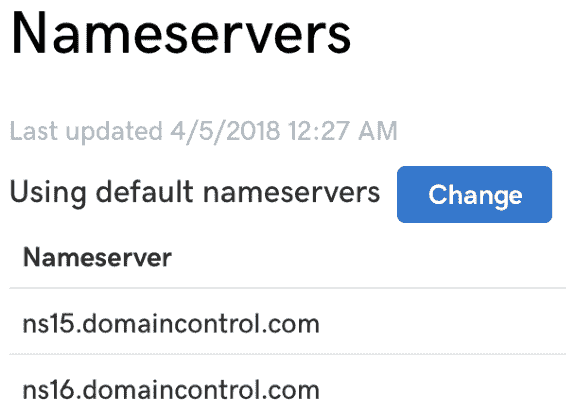

1.  单击“更改”按钮，选择“自定义”，然后指定 DigitalOcean DNS：

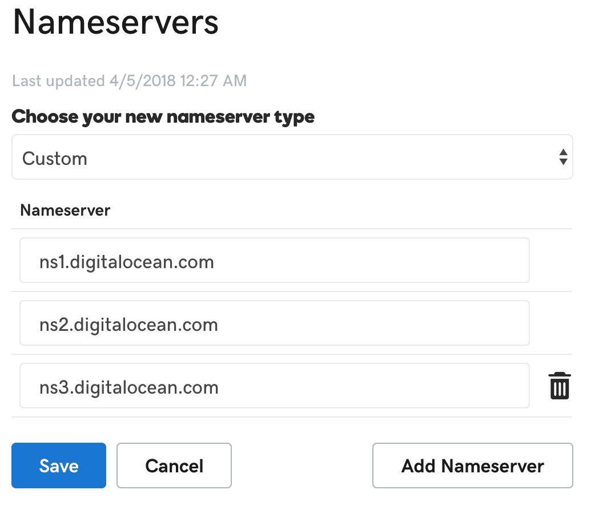

1.  通常，DNS 更改需要 15 到 30 分钟才能反映出来；现在，在更新了您的 Nameservers 之后，转到您的 Droplet 仪表板，然后选择添加域选项：

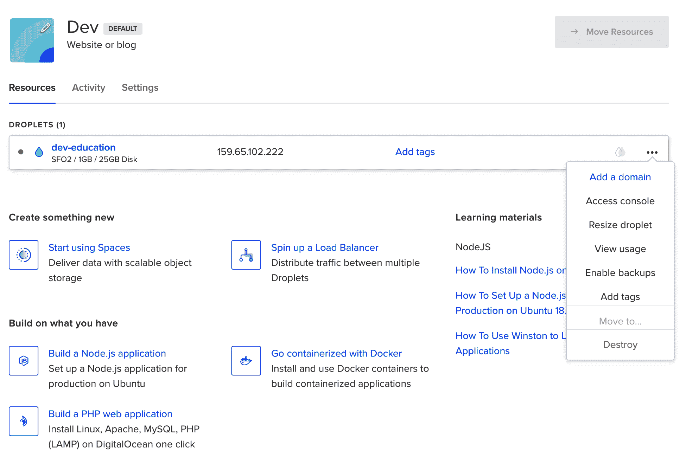

1.  然后，输入您的域名，选择您的 Droplet，然后单击“添加域”按钮：

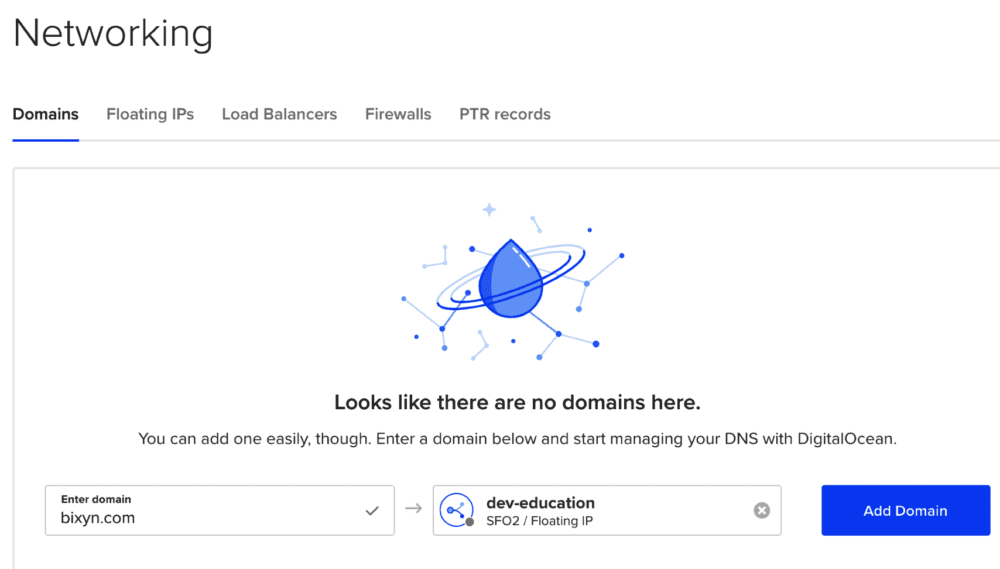

1.  现在，您需要为 CNAME 创建一个新记录。选择 CNAME 选项卡，在 HOSTNAME 中写入`www`；在别名字段中写入`@`；默认情况下，TTL 为`43200`。所有这些都是为了使用`www`前缀访问您的域名：

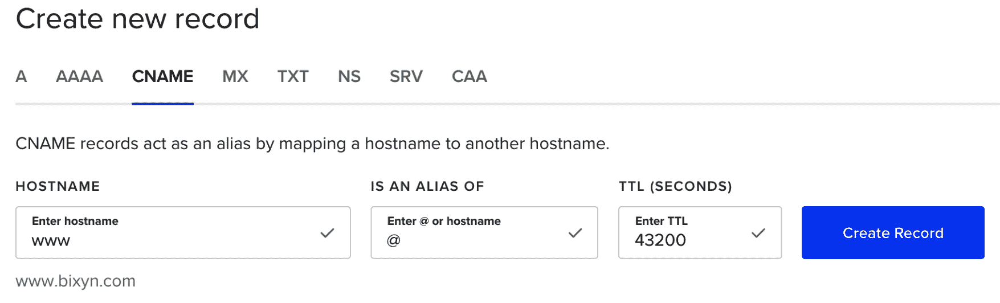

如果你做的一切正确，你应该能够访问你的域名并看到 React 应用程序在运行。正如我之前所说，这个过程可能需要长达 30 分钟，但在某些情况下，可能需要长达 24 小时，这取决于 DNS 传播速度：

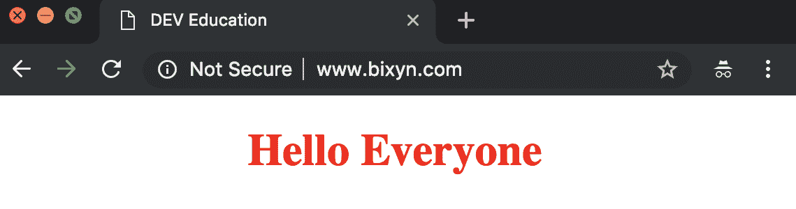

太棒了，现在您已经正式将您的第一个 React 应用程序部署到生产环境！

# 实施 CircleCI 进行持续集成

我已经使用 CircleCI 有一段时间了，我可以告诉你，这是最好的 CI 解决方案之一：个人使用免费，无限的仓库和用户；每月有 1,000 分钟的构建时间，一个容器和一个并发作业；如果你需要更多，你可以升级计划，初始价格为每月 50 美元。

你需要做的第一件事是使用你的 GitHub 账户（或者如果你喜欢的话，Bitbucket）在网站上注册。如果你选择使用 GitHub，你需要在你的账户中授权 CircleCI，如下截图所示：

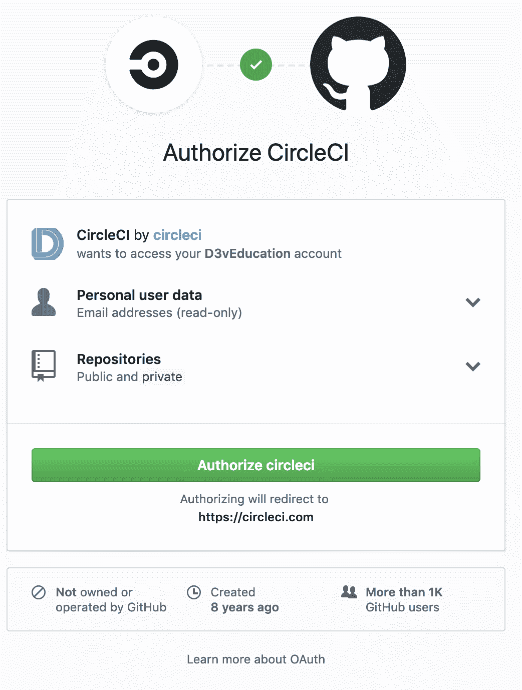

在下一节中，我们将向 CircleCI 添加我们的 SSH 密钥。

## 向 CircleCI 添加 SSH 密钥

现在你已经创建了你的账户，CircleCI 需要一种方式来登录到你的 DigitalOcean Droplet 来运行部署脚本。按照以下步骤完成这个任务：

1.  使用以下命令在 Droplet 内创建一个新的 SSH 密钥：

```jsx
ssh-keygen -t rsa
# Then save the key as /root/.ssh/id_rsa_droplet with no password.
# After go to .ssh directory
cd /root/.ssh
```

1.  之后，让我们将密钥添加到我们的`authorized_keys`中：

```jsx
cat id_rsa_droplet.pub >> authorized_keys
```

1.  现在，你需要下载私钥。为了验证你是否可以使用新密钥登录，你需要将其复制到你的本地机器，如下所示：

```jsx
# In your local machine do:
scp root@YOUR_DROPLET_IP:/root/.ssh/id_rsa_droplet ~/.ssh/
cd .ssh
ssh-add id_rsa_droplet
ssh -v root@YOUR_DROPLET_IP
```

如果你做的一切正确，你应该能够无需密码登录到你的 Droplet，这意味着 CircleCI 也可以访问我们的 Droplet：

1.  复制你的`id_rsa_droplet.pub`密钥的内容，然后转到你的仓库设置（[`app.circleci.com/settings/project/github/YOUR_GITHUB_USER/YOUR_REPOSITORY`](https://app.circleci.com/settings/project/github/YOUR_GITHUB_USER/YOUR_REPOSITORY)）：

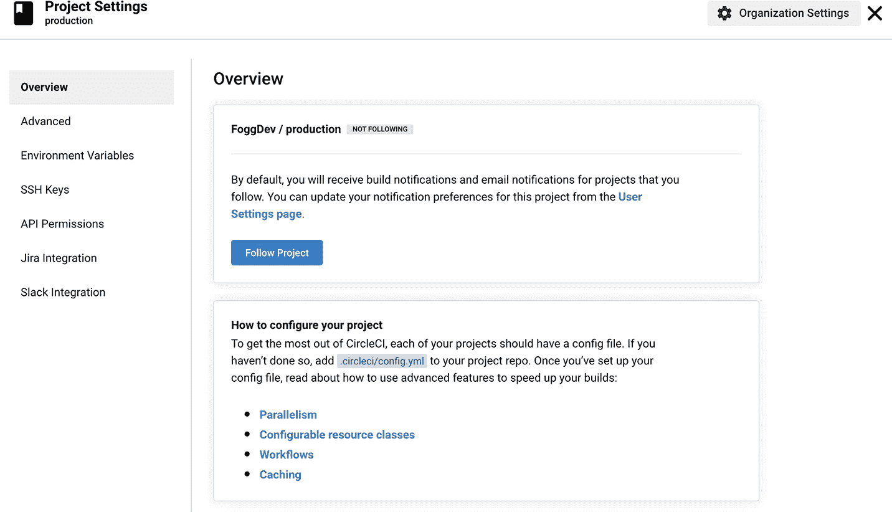

1.  前往 SSH 密钥，如下所示：

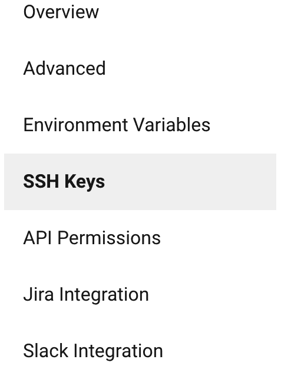

1.  你也可以访问 URL [`app.circleci.com/settings/project/github/YOUR_GITHUB_USER/YOUR_REPOSITORY/shh`](https://app.circleci.com/settings/project/github/YOUR_GITHUB_USER/YOUR_REPOSITORY/shh)，然后在底部点击添加 SSH 密钥按钮：

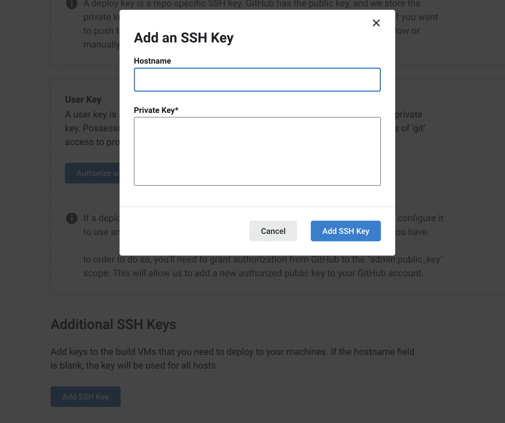

1.  粘贴你的私钥，然后为主机名字段提供一个名称；我们将其命名为`DigitalOcean`。

现在让我们在下一节中配置我们的 CircleCI 实例。

## 配置 CircleCI

现在你已经为 CircleCI 配置了对 Droplet 的访问权限，你需要向你的项目添加一个`config`文件，以指定你想要执行的部署过程中的作业。这个过程如下所示：

1.  为此，您需要创建`.circleci`目录，并在`config.yml`文件中添加以下内容：

```jsx
version: 2.1
jobs:
  build:
    working_directory: ~/tmp
    docker:
      - image: cimg/node:14.16.1
    steps:
      - checkout
      - run: npm install
      - run: npm run lint
      - run: npm test
      - run: ssh -o StrictHostKeyChecking=no $DROPLET_USER@$DROPLET_IP 'cd production; git checkout master; git pull; npm install; npm run start:production;'
workflows:
  build-deploy:
    jobs:
      - build:
        filters:
          branches:
            only: master
```

1.  当您有一个`.yml`文件时，您需要小心缩进；它类似于 Python，如果您没有正确使用缩进，将会出现错误。让我们看看这个文件的结构。

1.  指定我们将使用的 CircleCI 版本。在这种情况下，您正在使用版本`2.1`（在撰写本书时的最新版本）：

```jsx
version: 2.1
```

1.  在`jobs`内部，我们将指定它需要配置容器；我们将使用 Docker 创建它，并概述部署过程的步骤。

1.  `working_directory`将是我们用来安装 npm 包和运行部署脚本的临时目录。在这种情况下，我决定使用`tmp`目录，如下所示：

```jsx
jobs:
  build:
    working_directory: ~/tmp
```

1.  如我之前所说，我们将创建一个 Docker 容器，在这种情况下，我选择了一个包含`node: 14.16.1`的现有镜像。如果您想了解所有可用的镜像，您可以访问[`circleci.com/docs/2.0/circleci-images`](https://circleci.com/docs/2.0/circleci-images)：

```jsx
docker:
  - image: cimg/node:14.16.1
```

1.  对于代码情况，首先执行`git checkout`到`master`，然后在每个运行句子中，您需要指定要运行的脚本：

```jsx
steps:
  - checkout
  - run: npm install
  - run: npm run lint
  - run: npm test
  - run: ssh -o StrictHostKeyChecking=no $DROPLET_USER@$DROPLET_IP 'cd production; git checkout master; git pull; npm install; npm run start:production;'
```

按照以下步骤进行：

1.  首先，您需要使用`npm install`安装 npm 包，以便执行下一个任务。

1.  使用`npm run lint`执行 ESLint 验证。如果失败，它将中断部署过程，否则将继续下一次运行。

1.  使用`npm run test`执行 Jest 验证；如果失败，它将中断部署过程，否则将继续下一次运行。

1.  在最后一步中，我们连接到我们的 DigitalOcean Droplet，传递`StrictHostKeyChecking=no`标志以禁用严格的主机密钥检查。然后，我们使用`$DROPLET_USER`和`$DROPLET_IP` ENV 变量连接到它（我们将在下一步中创建它们），最后，我们将使用单引号指定我们将在 Droplet 内执行的所有命令。这些命令如下所示：

`cd production`：授予对生产环境（或您的 Git 存储库名称）的访问权限。

`git checkout master`：这将检出主分支。

`git pull`：从我们的存储库拉取最新更改。

`npm run start:production`：这是最后一步，它以生产模式运行我们的项目。

最后，让我们向 CircleCI 添加一些环境变量。

## 在 CircleCI 中创建 ENV 变量

如您之前所见，我们正在使用`$DROPLET_USER`和`$DROPLET_IP`变量，但是我们如何定义这些变量呢？请按照以下步骤进行：

1.  您需要再次转到项目设置，并选择环境变量选项。然后，您需要创建`DROPLET_USER`变量：

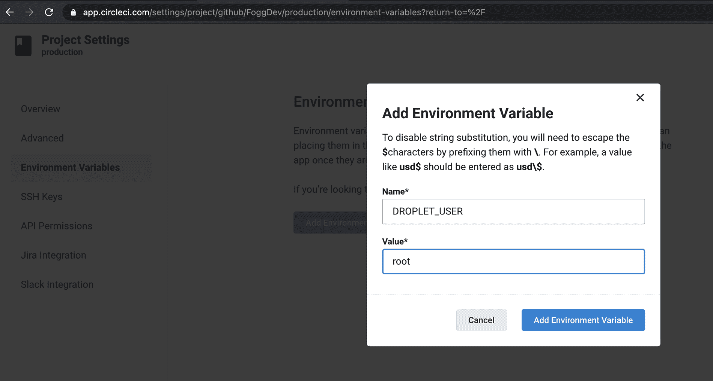

1.  然后，您需要使用您的 Droplet IP 创建`DROPLET_IP`变量：

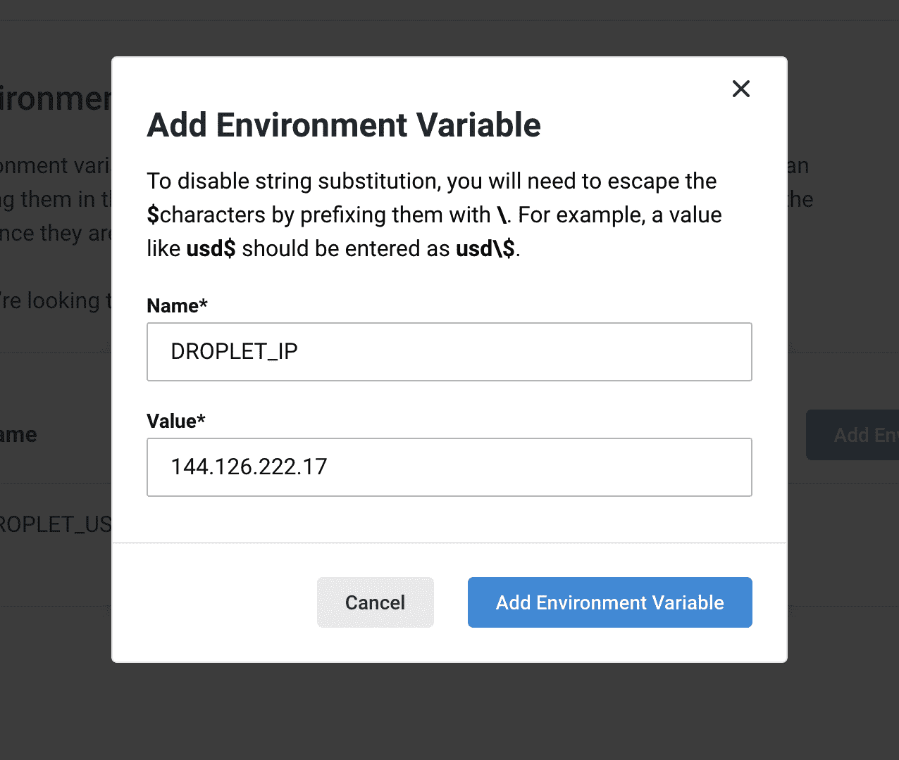

1.  现在，您需要将`config`文件推送到您的存储库，然后您就可以开始使用了。现在 CircleCI 已连接到您的存储库，每当您将更改推送到主分支时，它都会触发一个构建。

通常，前两个或三个构建可能会因为语法错误、配置中的缩进错误，或者因为我们有 linter 错误或单元测试错误而失败。如果失败，您将看到类似于这样的内容：

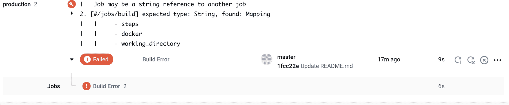

1.  如您从上述截图中所见，第一个构建在底部失败，显示构建错误，第二个构建显示工作流构建-部署。这基本上意味着在第一个构建中，`config.yml`文件中有语法错误。

1.  在您修复`config.yml`文件中的所有语法错误和 linter 或单元测试的所有问题后，您应该看到一个成功的构建，就像这样：

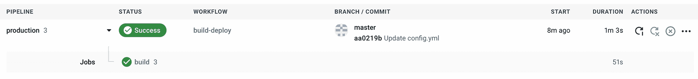

1.  如果您点击构建编号，您可以看到 CircleCI 在发布 Droplet 的新更改之前执行的所有步骤：

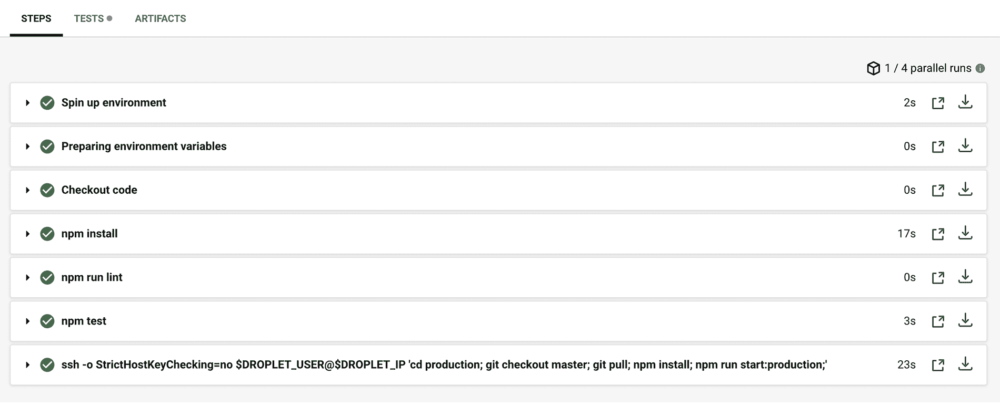

1.  如您所见，步骤的顺序与我们在`config.yml`文件中指定的顺序相同；您甚至可以通过点击每个步骤来查看每个步骤的输出：

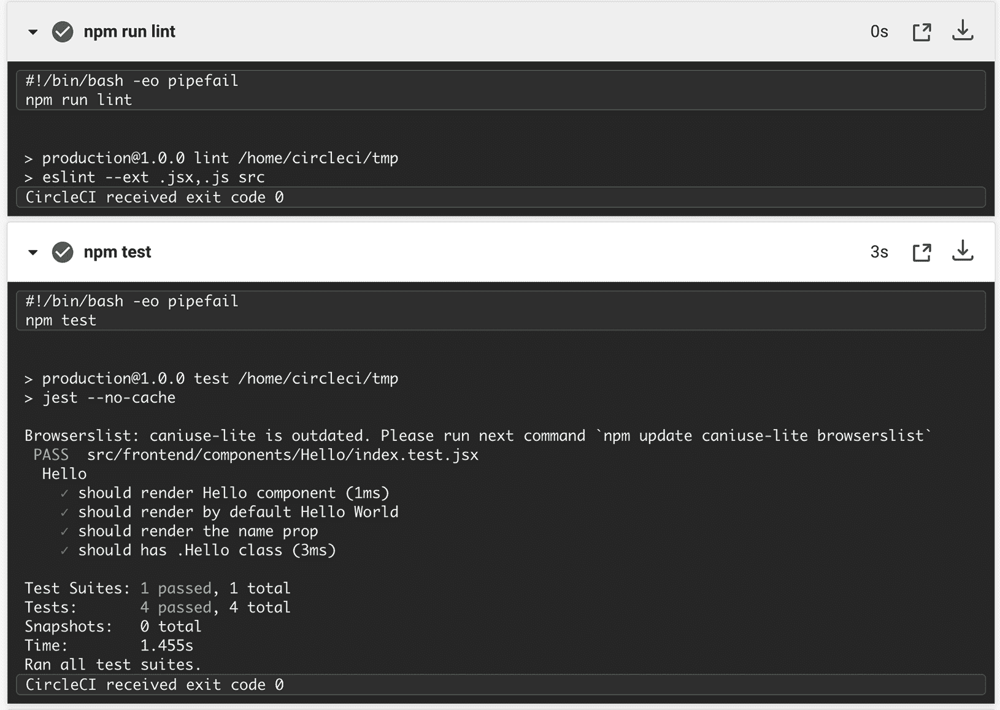

1.  现在，假设您的 linter 验证或某些单元测试出现错误。在这种情况下，让我们看看会发生什么，如下所示：

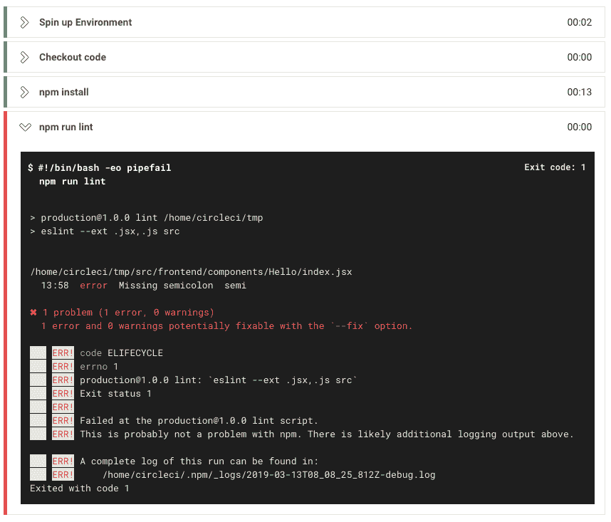

如您所见，一旦检测到错误，它将以代码`1`退出。这意味着它将中止部署并将其标记为失败，如您所见，在`npm run lint`之后的步骤都没有执行。

另一个很酷的事情是，如果您现在转到 GitHub 存储库并检查您的提交，您将看到所有成功构建的提交和所有失败构建的提交。

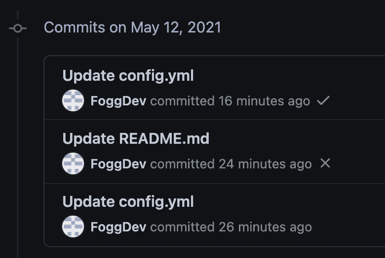

这太棒了-现在你的项目已经配置好自动部署，并且连接到你的 GitHub 仓库。

# 总结

我们的部署过程之旅已经结束，现在你知道如何将你的 React 应用部署到世界（生产环境），以及如何实现 CircleCI 进行持续集成。

在下一章中，我们将学习如何发布`npm`包。
