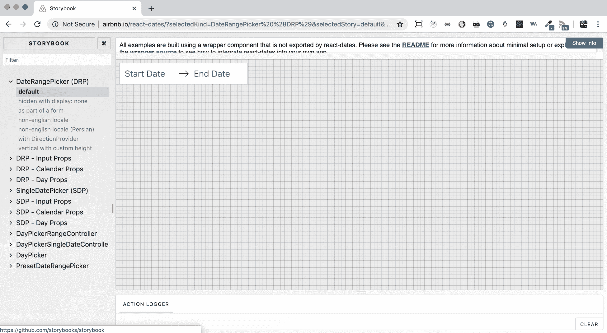

# 第十五章：下一步

React 是过去几年中发布的最令人惊奇的库之一，不仅因为库本身及其出色的功能，更重要的是由于围绕它构建的生态系统。

跟随 React 社区是非常令人兴奋和鼓舞的；每一天都有新的项目和工具可以学习和玩耍。不仅如此，还有会议和聚会，您可以在现实生活中与人交谈并建立新的关系，可以阅读博客文章来提高技能和学习更多知识，以及许多其他方法来成为更好的开发人员。

React 生态系统鼓励最佳实践和对开源开发者的热爱，这对我们职业生涯的未来非常棒。

在本章中，我们将涵盖以下主题：

+   如何通过提出问题和拉取请求来为 React 库做出贡献

+   为什么重要回馈社区并分享您的代码

+   如何发布一个`npm`包以及如何使用语义版本控制

# 技术要求

要完成本章，您将需要以下内容：

+   Node.js 12+

+   Visual Studio Code

# 为 React 做出贡献

人们在使用 React 一段时间后经常想做的一件事情是为库做出贡献。React 是开源的，这意味着它的源代码是公开的，任何签署了**贡献者许可协议**（CLA）的人都可以帮助修复错误，编写文档，甚至添加新功能。

您可以在以下网址阅读完整的 CLA 条款：[`code.facebook.com/cla`](https://code.facebook.com/cla)。

您需要确保您在 React 的 GitHub 存储库中发布的任何错误是 100%可复制的。一旦您验证了这一点，并且如果您想在 GitHub 上提交问题，您可以转到[https](https://github.com/facebook/react/issues/new)[://github.com/facebook/react/issues/new](https://github.com/facebook/react/issues/new)。正如您将看到的，该问题附带了一些预填的说明，其中之一是设置最小演示。其他问题帮助您解释问题并描述当前和预期行为。

在参与或贡献到存储库之前，你需要阅读*Facebook 行为准则*，网址为[`code.facebook.com/codeofconduct`](https://code.facebook.com/codeofconduct)。该文件列出了所有社区成员期望的良好行为，每个人都应该遵循。问题提交后，你需要等待核心贡献者之一来检查并告诉你他们决定如何处理这个 bug。根据 bug 的严重程度，他们可能会修复它，或者要求你修复它。

在第二种情况下，你可以 fork 存储库并编写代码来解决问题。重要的是要遵循编码风格指南，并为修复编写所有测试。同样重要的是，所有旧测试都通过，以确保新代码不会在代码库中引入退化。当修复准备就绪并且所有测试都通过时，你可以提交一个拉取请求，并等待核心团队成员审查。他们可能决定合并它，或者要求你做一些更改。

如果你没有找到 bug，但仍然想为项目做贡献，你可以查看 GitHub 上标记为 good first issue 的问题：[`github.com/facebook/react/labels/good%20first%20issue`](https://github.com/facebook/react/labels/good%20first%20issue)。这是开始贡献的好方法，很棒的是 React 团队给了每个人，特别是新贡献者，成为项目的一部分的可能性。

如果你找到一个好的第一个 bug 问题，而且还没有被其他人占用，你可以在问题上添加评论，表示你有兴趣去解决它。核心成员之一会与你联系。在开始编码之前，一定要与他们讨论你的方法和路径，这样你就不必多次重写代码了。

改进 React 的另一种方式是添加新功能。重要的是要说 React 团队有一个计划要遵循，主要功能是由核心成员设计和决定的。

如果你对库接下来的步骤感兴趣，你可以在 GitHub 上的 Type: Big Picture 标签下找到其中一些：[`github.com/facebook/react/labels/Type%3A%20Big%20Picture`](https://github.com/facebook/react/labels/Type%3A%20Big%20Picture)。

也就是说，如果你有一些关于应该添加到库中的功能的好主意，首先要做的是提出一个问题并开始与 React 团队交谈。在向他们提问之前，你应该避免花时间编写代码并提交拉取请求，因为你心中的功能可能不符合他们的计划，或者可能与他们正在开发的其他功能产生冲突。

# 分发你的代码

为 React 生态系统做出贡献不仅意味着将代码推送到 React 存储库中。为了回馈社区并帮助开发人员，你可以创建软件包，撰写博客文章，回答 Stack Overflow 上的问题，以及执行许多其他活动。

例如，假设你创建了一个解决复杂问题的 React 组件，并且你认为其他开发人员使用它会比花时间构建他们自己的解决方案更有益。最好的做法是将其发布到 GitHub，并使其可供所有人阅读和使用。然而，将代码推送到 GitHub 只是一个大过程中的一个小动作，并且伴随着一些责任。因此，你应该对你的选择背后的原因有一个清晰的想法。

你想要分享你的代码的动机有助于提高你作为开发人员的技能。一方面，分享你的代码迫使你遵循最佳实践并编写更好的代码。另一方面，它使你的代码暴露于其他开发人员的反馈和评论之中。这是一个很好的机会，让你接收建议并改进你的代码，使其更好。

除了与代码本身相关的建议之外，将代码推送到 GitHub，你可以从其他人的想法中受益。事实上，你可能已经考虑过你的组件可以解决一个问题，但另一个开发人员可能会以稍微不同的方式使用它，为其找到新的解决方案。此外，他们可能需要新功能，他们可以帮助你实现这些功能，以便每个人，包括你自己，都能从中受益。共同构建软件是提高自己技能和软件包的一个很好的方式，这就是为什么我坚信开源的原因。

开源还能给你带来的另一个重要机会是让你与来自世界各地的聪明和热情的开发人员联系在一起。与具有不同背景和技能的新人密切合作是保持开放思维和提高自身能力的最佳途径之一。

共享代码也会给您带来一些责任，并且可能会耗费时间。事实上，一旦代码是公开的，人们可以使用它，您就必须对其进行维护。

维护存储库需要承诺，因为它变得越来越受欢迎，越来越多的人使用，问题和疑问的数量就会越来越多。例如，开发人员可能会遇到错误并提出问题，因此您必须浏览所有这些并尝试重现问题。如果问题存在，那么您必须编写修复程序并发布库的新版本。您可能会收到其他开发人员的拉取请求，这可能会很长，很复杂，需要进行审核。

如果您决定邀请其他人共同维护项目，并帮助您处理问题和拉取请求，您必须与他们协调，分享您的愿景并共同做出决策。

## 在推送开源代码时了解最佳实践

我们可以介绍一些好的实践，可以帮助您创建更好的存储库，并避免一些常见的陷阱。

首先，如果您想发布您的 React 组件，您必须编写一套全面的测试。对于公共代码和许多人的贡献，测试在许多方面都非常有帮助：

+   他们使得代码更加健壮。

+   他们帮助其他开发人员理解代码的功能。

+   他们使得在添加新代码时更容易找到回归。

+   他们使其他贡献者更有信心编写代码。

第二件重要的事情是添加一个带有组件描述、使用示例和可用的 API 和 props 文档的`README`。这有助于包的用户，但也避免了人们提出关于库如何工作以及如何使用它的问题。

还必须向存储库添加一个`LICENSE`文件，以使人们了解他们可以做什么，以及不能做什么。GitHub 有很多现成的模板可供选择。在您能做到的情况下，您应该保持包的体积小，并尽量减少依赖。当开发人员必须决定是否使用库时，他们往往会仔细考虑大小。请记住，庞大的包对性能有不良影响。

不仅如此，过多地依赖第三方库可能会在其中任何一个未得到维护或存在错误时造成问题。

在共享 React 组件时，一个棘手的部分是决定样式。共享 JavaScript 代码非常简单，而附加 CSS 并不像您想象的那么容易。事实上，您可以采取许多不同的路径来提供它：从向包中添加 CSS 文件到使用内联样式。要牢记的重要一点是 CSS 是全局的，通用的类名可能会与导入组件的项目中已经存在的类名发生冲突。

最好的选择是包含尽可能少的样式，并使组件对最终用户高度可配置。这样，开发人员更有可能使用它，因为它可以适应其自定义解决方案。

为了展示您的组件是高度可定制的，您可以向存储库添加一个或多个示例，以便让每个人都能轻松理解它的工作原理和接受哪些属性。示例也很有用，这样您就可以测试组件的新版本，并查看是否存在意外的破坏性更改。

正如我们在*第三章*，*React Hooks*中看到的，诸如**React Storybook**之类的工具可以帮助您创建生动的样式指南，这样您就更容易维护，包的使用者也更容易导航和使用。

一个非常好的例子是使用 Storybook 展示所有这些变化的高度可定制库是来自 Airbnb 的`react-dates`。您应该将该存储库视为如何将 React 组件发布到 GitHub 的完美示例。

正如您所看到的，他们使用 Storybook 来展示组件的不同选项：



最后但同样重要的是，您可能不仅想分享您的代码 - 您可能还想分发您的包。JavaScript 最流行的包管理器是`npm`，我们在本书中一直使用它来安装包和依赖项。

在下一节中，我们将看到使用`npm`发布新包是多么容易。

除了`npm`之外，一些开发人员可能需要将您的组件作为全局依赖项添加并在没有包管理器的情况下使用它。

正如我们在*第一章*，*开始使用 React*中看到的，您可以通过添加一个指向[`unpkg.com/`](https://unpkg.com/)的脚本标签来轻松使用 React。给您的库的用户提供相同的选择是很重要的。

因此，为了提供包的全局版本，您还应该构建**通用模块定义**（**UMD**）版本。使用 webpack，这非常简单；您只需在配置文件的输出部分设置`libraryTarget`。

# 发布 npm 包

将包发布给开发者最流行的方式是通过将其发布到`npm`，这是 Node.js 的包管理器。

我们在本书的所有示例中都使用了它，您已经看到安装包有多么容易；只需运行`npm install`包，就可以了。您可能不知道的是发布包也同样容易。

首先，假设您进入一个空目录，并在终端中输入以下内容：

```jsx
npm init
```

将创建一个新的`package.json`文件，并显示一些问题。第一个是包名称，默认为文件夹名称，然后是版本号。这些是最重要的，因为第一个是您的包的用户在安装和使用时将引用的名称；第二个帮助您安全地发布新版本的包，而不会破坏其他人的代码。

版本号由三个由点分隔的数字组成，它们都有意义。右侧包的最后一个数字代表补丁，当推送修复 bug 的新版本库时，应该增加这个数字。

中间的数字表示发布的次要版本，并且当向库添加新功能时应该更改。这些新功能不应该破坏现有的 API。最后，左侧的第一个数字代表主要版本，当发布包含破坏性更改的版本时，它必须增加。

遵循这种称为**语义化版本控制**（**SemVer**）的方法是一个良好的实践，它会让您的用户更加自信，因为他们需要更新您的包时会更加放心。

包的第一个版本通常是`0.1.0`。

要发布一个`npm`包，您必须拥有一个`npm`账户，您可以通过在控制台中运行以下命令轻松创建，其中`$username`是您选择的名称：

```jsx
npm adduser $username
```

用户创建后，您可以运行以下命令：

```jsx
npm publish
```

新条目将被添加到注册表中，其中包含您在`package.json`中指定的包名称和版本。

每当您在库中更改内容并且想要推送新版本时，您只需运行`$type`，其中一个补丁是次要的或主要的：

```jsx
npm version $type
```

该命令将自动在您的`package.json`文件中提升版本，并且如果您的文件夹处于版本控制下，它还将创建一个提交和一个标签。

一旦版本号增加，您只需再次运行`npm publish`，新版本将可供用户使用。

# 摘要

在这次环绕 React 世界的旅程的最后一站，我们看到了使 React 变得伟大的一些方面 - 其社区和生态系统 - 以及如何为它们做出贡献。

您学会了如何在发现 React 中的错误时提出问题，以及采取的步骤使其核心开发人员更容易修复它。您现在知道在开源代码时的最佳实践，以及随之而来的好处和责任。

最后，您看到了在`npm`注册表上发布软件包有多么容易，以及如何选择正确的版本号以避免破坏其他人的代码。
