# 第三章：处理事件，绑定和有用的 React 包

在本章中，将涵盖以下示例：

+   使用构造函数绑定方法与使用箭头函数

+   创建带有事件的表单元素

+   使用 react-popup 在模态框中显示信息

+   实施 Airbnb React/JSX 样式指南

+   使用 React Helmet 更新我们的标题和 meta 标签

# 介绍

本章包含与处理事件、在 React 中绑定方法相关的示例，并且我们将实现一些最有用的 React 包。

# 使用构造函数绑定方法与使用箭头函数

在这个示例中，我们将学习在 React 中绑定方法的两种方式：使用构造函数和使用箭头函数。

# 如何做...

这个示例很简单，目标是使用类构造函数和箭头函数绑定方法：

1.  让我们创建一个名为`Calculator`的新组件。我们将创建一个带有两个输入和一个按钮的基本计算器。我们组件的框架如下：

```jsx
  import React, { Component } from 'react';
  import './Calculator.css';

  class Calculator extends Component {
    constructor() {
      super();

      this.state = {
        number1: 0,
        number2: 0,
        result: 0
      };
    }

    render() {
      return (
        <div className="Calculator">
          <input 
            name="number1" 
            type="text" 
            value={this.state.number1} 
          />
          {' + '}
          <input 
            name="number2" 
            type="text" 
            value={this.state.number2} 
          />

          <p><button>=</button></p>
          <p className="result">{this.state.result}</p>
        </div>
      );
    }
  }

  export default Calculator;
```

文件：src/components/Calculator/Calculator.js

1.  现在我们将添加两种新方法，一种用于处理输入（`onChange`事件），一种用于管理结果按钮（`onClick`）。我们可以使用相同的`handleOnChange`方法来处理两个输入。由于我们有字段的名称（与状态相同），我们可以动态更新每个状态，在`handleResult`方法中，我们只需对两个数字求和。

```jsx
    handleOnChange(e) {
      const { target: { value, name } } = e;

      this.setState({
        [name]: Number(value)
      });
    }

    handleResult(e) {
      this.setState({
        result: this.state.number1 + this.state.number2
      });
    }
```

1.  现在在我们的`render`方法中，我们需要为输入和按钮添加事件：

```jsx
    render() {
      return (
        <div className="Calculator">
          <input 
 onChange={this.handleOnChange} 
            name="number1" 
            type="text" 
            value={this.state.number1} 
          />
          {' + '}
          <input 
 onChange={this.handleOnChange} 
            name="number2" 
            type="text" 
            value={this.state.number2}
          />
          <p>
            <button onClick={this.handleResult}>=</button>
          </p>
          <p className="result">{this.state.result}</p>
        </div>
      );
    }
```

1.  我们的 CSS 代码如下：

```jsx
  .Calculator {
    margin: 0 auto;
    padding: 50px;
  }

  .Calculator input {
    border: 1px solid #eee;
    font-size: 16px;
    text-align: center;
    height: 50px;
    width: 100px;
  }

  .Calculator button {
    background: #0072ff;
    border: none;
    color: #fff;
    font-size: 16px;
    height: 54px;
    width: 150px;
  }

  .Calculator .result {
    border: 10px solid red;
    background: #eee;
    margin: 0 auto;
    font-size: 24px;
    line-height: 100px;
    height: 100px;
    width: 100px;
  }
```

文件：src/components/Calculator/Calculator.css

1.  如果您现在运行应用程序，您会发现如果尝试在输入框中输入内容或单击按钮，您将收到如下错误：

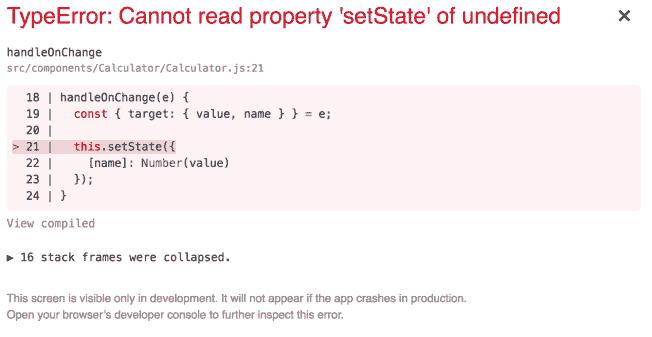

1.  原因是我们需要将这些方法绑定到类上才能访问它。让我们首先使用构造函数绑定我们的方法：

```jsx
    constructor() {
      super();

      this.state = {
        number1: 0,
        number2: 0,
        result: 0
      };

      // Binding methods
      this.handleOnChange = this.handleOnChange.bind(this);
      this.handleResult = this.handleResult.bind(this);
    }
```

1.  如果您想要在组件顶部列出所有方法，使用构造函数绑定方法是一个不错的选择。如果您查看`Calculator`组件，它应该是这样的：

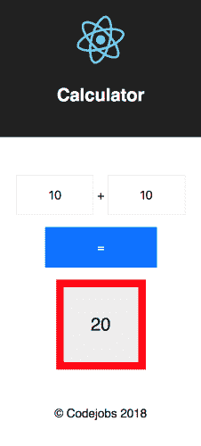

1.  现在让我们使用箭头函数来自动绑定我们的方法，而不是在构造函数中进行绑定。为此，您需要在构造函数中删除绑定方法，并将`handleOnChange`和`handleResult`方法更改为箭头函数：

```jsx
    constructor() {
      super();

      this.state = {
        number1: 0,
        number2: 0,
        result: 0
      };
    }

    // Changing this method to be an arrow function
    handleOnChange = e => {
      const { target: { value, name } } = e;

      this.setState({
        [name]: Number(value)
      });
    }

    // Changing this method to be an arrow function
    handleResult = e => {
      this.setState({
        result: this.state.number1 + this.state.number2
      });
    }
```

1.  你会得到相同的结果。我更喜欢使用箭头函数来绑定方法，因为你使用的代码更少，而且你不需要手动将方法添加到构造函数中。

# 它是如何工作的...

如你所见，你有两种选项来绑定你的 React 组件中的方法。目前最常用的是构造函数选项，但箭头函数变得越来越受欢迎。你可以决定哪种绑定选项你最喜欢。

# 使用事件创建表单元素

你可能已经注意到在上一章中，我们使用了一些简单的带有事件的表单，但在这个示例中，我们将更深入地了解这个主题。在第六章中，*使用 Redux Form 创建表单*，我们将学习如何处理带有 Redux Form 的表单。

# 如何做到...

让我们创建一个名为`Person`的新组件：

1.  我们将在此组件中使用的骨架如下：

```jsx
 import React, { Component } from 'react';
  import './Person.css';

  class Person extends Component {
    constructor() {
      super();

      this.state = {
        firstName: '',
        lastName: '',
        email: '',
        phone: ''
      };
    }

    render() {
      return (
        <div className="Person">

        </div>
      );
    }
  }

  export default Person;
```

文件：src/components/Person/Person.js

1.  让我们向我们的表单添加`firstName`，`lastName`，`email`和`phone`字段。`render`方法应该如下所示：

```jsx
  render() {
    return (
      <div className="Person">
        <form>
          <div>
            <p><strong>First Name:</strong></p>
            <p><input name="firstName" type="text" /></p>
          </div>

          <div>
            <p><strong>Last Name:</strong></p>
            <p><input name="lastName" type="text" /></p>
          </div>

          <div>
            <p><strong>Email:</strong></p>
            <p><input name="email" type="email" /></p>
          </div>

          <div>
            <p><strong>Phone:</strong></p>
            <p><input name="phone" type="tel" /></p>
          </div>

          <p>
            <button>Save Information</button>
          </p>
        </form>
      </div>
    );
  }
```

1.  让我们为我们的表单使用这些 CSS 样式：

```jsx
  .Person {
    margin: 0 auto;
  }

  .Person form input {
    font-size: 16px;
    height: 50px;
    width: 300px;
  }

  .Person form button {
    background: #0072ff;
    border: none;
    color: #fff;
    font-size: 16px;
    height: 50px;
    width: 300px;
  }
```

文件：src/components/Person/Person.css

1.  如果你运行你的应用程序，你应该看到这个视图：

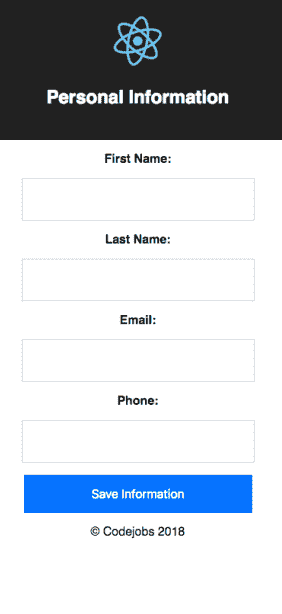

1.  让我们在输入中使用我们的本地状态。在 React 中，我们从输入中检索值的唯一方法是将每个字段的值连接到特定的本地状态，就像这样：

```jsx
  render() {
    return (
      <div className="Person">
        <form>
          <div>
            <p><strong>First Name:</strong></p>
            <p>
              <input 
                name="firstName" 
                type="text" 
 value={this.state.firstName} 
              />
            </p>
          </div>

          <div>
            <p><strong>Last Name:</strong></p>
            <p>
              <input 
                name="lastName" 
                type="text" 
 value={this.state.lastName} 
              />
            </p>
          </div>

          <div>
            <p><strong>Email:</strong></p>
            <p>
              <input 
                name="email" 
                type="email" 
 value={this.state.email} 
              />
            </p>
          </div>

          <div>
            <p><strong>Phone:</strong></p>
            <p>
              <input 
                name="phone" 
                type="tel" 
 value={this.state.phone} 
              />
            </p>
          </div>

          <p>
            <button>Save Information</button>
          </p>
        </form>
      </div>
    );
  }
```

如果你尝试输入一些内容，你会注意到你无法写任何东西，这是因为所有的输入都连接到本地状态，我们更新本地状态的唯一方法是重新渲染已输入的文本。

1.  正如你所想象的，我们更新本地状态的唯一方法是检测输入的变化，这将在用户输入时发生。让我们为`onChange`事件添加一个方法：

```jsx
  handleOnChange = e => {
    const { target: { value } } = e;

    this.setState({
      firstName: value
    });
  }
```

就像我在上一个示例中提到的，当我们在方法中使用箭头函数时，我们会自动将类绑定到方法。否则，你需要在构造函数中绑定方法。在我们的`firstName`输入中，我们需要在`onChange`方法中调用这个方法：

```jsx
    <input 
      name="firstName" 
      type="text" 
      value={this.state.firstName} 
 onChange={this.handleOnChange} 
    />
```

1.  但是这里有一个问题。如果我们有四个字段，那么您可能会认为您需要创建四种不同的方法（每个状态一个），但是有一种更好的解决方法：在`e (e.target.name)`对象中获取输入名称的值。这样，我们可以使用相同的方法更新所有状态。我们的`handleOnChange`方法现在应该是这样的：

```jsx
    handleOnChange = e => {
      const { target: { value, name } } = e;

      this.setState({
        [name]: value
      });
    }
```

1.  通过对象中的`([name])`语法，我们可以动态更新表单中的所有状态。现在我们需要将这个方法添加到所有输入的`onChange`中。完成后，您将能够在输入框中输入内容：

```jsx
    render() {
      return (
        <div className="Person">
          <form>
            <div>
              <p><strong>First Name:</strong></p>
              <p>
                <input 
                  name="firstName" 
                  type="text" 
                  value={this.state.firstName} 
 onChange={this.handleOnChange} 
                />
              </p>
            </div>

            <div>
              <p><strong>Last Name:</strong></p>
              <p>
                <input 
                  name="lastName" 
                  type="text" 
                  value={this.state.lastName} 
 onChange={this.handleOnChange} 
                />
              </p>
            </div>

            <div>
              <p><strong>Email:</strong></p>
              <p>
                <input 
                  name="email" 
                  type="email" 
                  value={this.state.email} 
 onChange={this.handleOnChange} 
                />
              </p>
            </div>

            <div>
              <p><strong>Phone:</strong></p>
              <p>
                <input 
                  name="phone" 
                  type="tel" 
                  value={this.state.phone} 
 onChange={this.handleOnChange} 
                />
              </p>
            </div>

            <p>
              <button>Save Information</button>
            </p>
          </form>
        </div>
      );
    }
```

1.  所有表单都需要提交它们从用户那里收集到的信息。我们需要使用表单的`onSubmit`事件，并调用`handleOnSubmit`方法通过本地状态检索所有输入值：

```jsx
  handleOnSubmit = e => {
    // The e.preventDefault() method cancels the event if it is                            
    // cancelable, meaning that the default action that belongs to  
    // the event won't occur.
    e.preventDefault();

    const { firstName, lastName, email, phone } = this.state;
    const data = {
      firstName,
      lastName,
      email,
      phone
    };

    // Once we have the data collected we can call a Redux Action  
    // or process the data as we need it.
    console.log('Data:', data);
  }
```

1.  创建完这个方法后，我们需要在`form`标签的`onSubmit`事件上调用它：

```jsx
  <form onSubmit={this.handleOnSubmit}>
```

1.  现在您可以测试这个。打开您的浏览器控制台，当您在输入框中输入一些值时，您将能够看到数据：

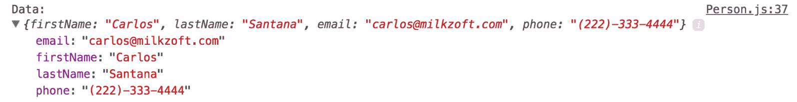

1.  我们需要验证必填字段。假设`firstName`和`lastName`字段是必填的。如果用户没有在字段中填写值，我们希望添加一个错误类来显示输入框周围的红色边框。您需要做的第一件事是为错误添加一个新的本地状态：

```jsx
      this.state = {
        firstName: '',
        lastName: '',
        email: '',
        phone: '',
        errors: {
          firstName: false,
          lastName: false
        }
      };
```

1.  您可以在这里添加任何您想要验证的字段，并且值是布尔值（`true`表示有错误，`false`表示没有错误）。然后，在`handleOnSubmit`方法中，如果有错误，我们需要更新状态：

```jsx
    handleOnSubmit = e => {
     // The e.preventDefault() method cancels the event if it is   
     // cancelable, meaning that the default action that belongs to  
     // event won't occur.
    e.preventDefault();

      const { firstName, lastName, email, phone } = this.state;

      // If firstName or lastName is missing then we update the   
      // local state with true
      this.setState({
 errors: {
 firstName: firstName === '',
 lastName: lastName === ''
 }
 });

      const data = {
        firstName,
        lastName,
        email,
        phone
      };

      // Once we have the data collected we can call a Redux Action  
      // or process the data as we need it.
      console.log('Data:', data);
    }
```

1.  现在，在您的`render`方法中，您需要在`firstName`和`lastName`字段的`className`属性中添加一个三元验证，如果您想要更花哨，您还可以在输入框下方添加一个错误消息：

```jsx
    render() {
      return (
        <div className="Person">
          <form onSubmit={this.handleOnSubmit}>
            <div>
              <p><strong>First Name:</strong></p>
              <p>
                <input
                  name="firstName"
                  type="text"
                  value={this.state.firstName}
                  onChange={this.handleOnChange}
                  className={
                    this.state.errors.firstName ? 'error' : ''
                  }                
                />
                {this.state.errors.firstName 
                  && (<div className="errorMessage">Required 
                field</div>)}
              </p>
            </div>

            <div>
              <p><strong>Last Name:</strong></p>
              <p>
                <input
                  name="lastName"
                  type="text"
                  value={this.state.lastName}
                  onChange={this.handleOnChange}
                  className={
                    this.state.errors.lastName ? 'error' : ''
                  }
                />
                {this.state.errors.lastName 
                  && <div className="errorMessage">Required 
                field</div>}
              </p>
            </div>

            <div>
              <p><strong>Email:</strong></p>
              <p>
                <input 
                  name="email" 
                  type="email" 
                  value={this.state.email} 
                  onChange={this.handleOnChange} 
                />
              </p>
            </div>

            <div>
              <p><strong>Phone:</strong></p>
              <p>
                <input name="phone" type="tel" value=
                {this.state.phone} 
                 onChange={this.handleOnChange} />
              </p>
            </div>

            <p>
              <button>Save Information</button>
            </p>
          </form>
        </div>
      );
    }
```

1.  最后一步是添加错误类，`.error`和`.errorMessage`：

```jsx
    .Person .error {
      border: 1px solid red;
    }

    .Person .errorMessage {
      color: red;
      font-size: 10px;
    }
```

1.  如果您现在提交表单而没有填写`firstName`或`lastName`，您将会得到这个视图：

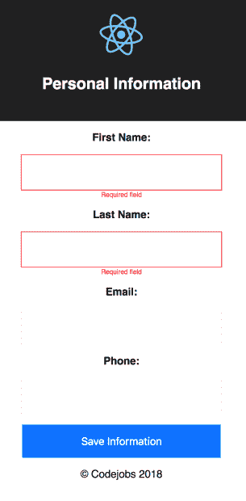

1.  完整的`Person`组件应该是这样的：

```jsx
  import React, { Component } from 'react';
  import './Person.css';

  class Person extends Component {
    constructor() {
      super();

      this.state = {
        firstName: '',
        lastName: '',
        email: '',
        phone: '',
        errors: {
          firstName: false,
          lastName: false
        }
      };
    }

    handleOnChange = e => {
      const { target: { value, name } } = e;

      this.setState({
        [name]: value
      });
    }

    handleOnSubmit = e => {
 // The e.preventDefault() method cancels the event if it is 
      // cancelable, meaning that the default action that belongs 
      // to the event won't occur.
      e.preventDefault();

      const { firstName, lastName, email, phone } = this.state;

      // If firstName or lastName is missing we add an error class
      this.setState({
        errors: {
          firstName: firstName === '',
          lastName: lastName === ''
        }
      });

      const data = {
        firstName,
        lastName,
        email,
        phone
      };

      // Once we have the data collected we can call a Redux Action     
      // or process the data as we need it.
      console.log('Data:', data);
    }

    render() {
      return (
        <div className="Person">
          <form onSubmit={this.handleOnSubmit}>
            <div>
              <p><strong>First Name:</strong></p>
              <p>
                <input
                  name="firstName"
                  type="text"
                  value={this.state.firstName}
                  onChange={this.handleOnChange}
                  className={
                    this.state.errors.firstName ? 'error' : ''
                  }
                />
                {this.state.errors.firstName 
 && <div className="errorMessage">Required 
                field</div>}
              </p>
            </div>

            <div>
              <p><strong>Last Name:</strong></p>
              <p>
                <input
                  name="lastName"
                  type="text"
                  value={this.state.lastName}
                  onChange={this.handleOnChange}
                  className={
                    this.state.errors.lastName ? 'error' : ''
                  }
                />
                {this.state.errors.lastName 
 && <div className="errorMessage">Required 
                field</div>}
              </p>
            </div>

            <div>
              <p><strong>Email:</strong></p>
              <p>
                <input 
                  name="email" 
                  type="email" 
 value={this.state.email} 
 onChange={this.handleOnChange} 
                />
              </p>
            </div>

            <div>
              <p><strong>Phone:</strong></p>
              <p>
                <input 
                  name="phone" 
                  type="tel" 
 value={this.state.phone} 
 onChange={this.handleOnChange} 
                />
              </p>
            </div>

            <p>
              <button>Save Information</button>
            </p>
          </form>
        </div>
      );
    }
  }

  export default Person;
```

文件：src/components/Person/Person.js

# 它是如何工作的...

表单对于任何 web 应用程序都是必不可少的，使用 React 处理它们很容易，可以使用本地状态，但这不是管理它们的唯一方式。如果您的表单很复杂，有多个步骤（通常用于用户注册），您可能需要在整个过程中保留值。在这种情况下，使用 Redux Form 轻松处理表单，我们将在第六章中学习，创建 Redux Form 表单。

# 还有更多...

在 React 中还有更多事件可以使用：

**键盘事件**：

+   `onKeyDown` 当按键被按下时执行

+   `onKeyPress` 在释放按键后执行，但在触发 `onKeyUp` 之前

+   `onKeyUp` 在按键按下后执行

**焦点事件**：

+   **`onFocus`** 当控件获得焦点时执行

+   `onBlur` 当控件失去焦点时执行

**表单事件**：

+   `onChange` 当用户更改表单控件中的值时执行

+   `onSubmit` 是 `<form>` 的一个特定属性，当按下按钮或用户在字段内按下 `return` 键时调用

**鼠标事件**：

+   `onClick` 当鼠标按钮被按下并释放时

+   `onContextMenu` 当按下右键时

+   `onDoubleClick` 当用户执行双击时

+   `onMouseDown` 当鼠标按钮被按下时

+   `onMouseEnter` 当鼠标移动到元素或其子元素上时

+   `onMouseLeave` 当鼠标离开元素时

+   `onMouseMove` 当鼠标移动时

+   `onMouseOut` 当鼠标移出元素或移动到其子元素上时

+   `onMouseOver` 当鼠标移动到元素上时

+   `onMouseUp` 当鼠标按钮释放时

**拖放事件**：

+   `onDrag`

+   `onDragEnd`

+   `onDragEnter`

+   `onDragExit`

+   `onDragLeave`

+   `onDragOver`

+   `onDragStart`

+   `onDrop`

对于拖放事件，我建议使用 `react-dnd` ([`github.com/react-dnd/react-dnd`](https://github.com/react-dnd/react-dnd)) 库。

# 使用 react-popup 在模态框中显示信息

模态框是显示在当前窗口上的对话框/弹出窗口，几乎适用于所有项目。在这个示例中，我们将学习如何使用 `react-popup` 包实现一个基本的模态框。

# 准备就绪

对于这个示例，您需要安装 `react-popup`。让我们用这个命令来做：

```jsx
npm install react-popup
```

# 如何做...

使用上一个示例的代码，我们将添加一个基本的弹出窗口，以显示我们在表单中注册的人的信息：

1.  打开你的`App.jsx`文件，并从`react-popup`中导入`Popup`对象。现在，我们将导入`Popup.css`（代码太大，无法放在这里，但你可以从该项目的代码库中复制和粘贴 CSS 演示代码：`Chapter03/Recipe3/popup/src/components/Popup.css`）。然后，在`<Footer />`之后添加`<Popup />`组件：

```jsx
  import React from 'react';
  import Popup from 'react-popup';
  import Person from './Person/Person';
  import Header from '../shared/components/layout/Header';
  import Content from '../shared/components/layout/Content';
  import Footer from '../shared/components/layout/Footer';
  import './App.css';
  import './Popup.css';

  const App = () => (
    <div className="App">
      <Header title="Personal Information" />

      <Content>
        <Person />
      </Content>

      <Footer />

      <Popup />
    </div>
  );

 export default App;
```

文件：src/components/App.js

1.  现在，在我们的`Person.js`文件中，我们也需要包含弹出窗口：

```jsx
import React, { Component } from 'react';
import Popup from 'react-popup';
import './Person.css';
```

1.  让我们修改我们的`handleOnSubmit`方法来实现弹出窗口。首先，我们需要验证我们至少收到了`firstName`、`lastName`和`email`（电话是可选的）。如果我们得到了所有必要的信息，那么我们将创建一个弹出窗口并显示用户的信息。我喜欢`react-popup`的一点是它允许我们在其内容中使用 JSX 代码：

```jsx
  handleOnSubmit = e => {
    e.preventDefault();

    const {
      firstName,
      lastName,
      email,
      phone
    } = this.state;

    // If firstName or lastName is missing we add an error class
    this.setState({
      errors: {
        firstName: firstName === '',
        lastName: lastName === ''
      }
    });

    // We will display the popup just if the data is received...
    if (firstName !== '' && lastName !== '' && email !== '') {
      Popup.create({
        title: 'Person Information',
        content: (
          <div>
            <p><strong>Name:</strong> {firstName} {lastName}</p>
            <p><strong>Email:</strong> {email}</p>
            {phone && <p><strong>Phone:</strong> {phone}</p>}
          </div>
        ),
        buttons: {
          right: [{
            text: 'Close',
             action: popup => popup.close() // Closes the popup                                                                                                       
          }],
        },
      });
    }
  }
```

# 它是如何工作的...

如果你做的一切正确，你应该能够看到这样的弹出窗口：

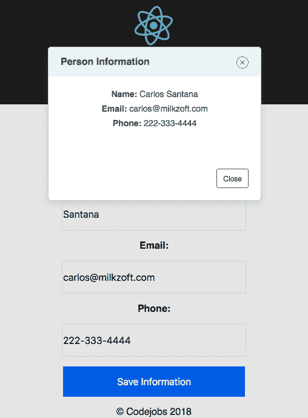

如你在代码中所见，电话是可选的，所以如果我们不包括它，我们就不会渲染它：

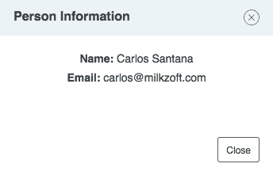

# 还有更多...

`react-popup`提供配置来执行一个动作。在我们的例子中，我们使用该动作来在用户按下`Close`按钮时关闭弹出窗口，但我们可以传递 Redux 动作来做其他事情，比如发送一些信息，甚至在我们的弹出窗口内添加表单。

# 实施 Airbnb React/JSX 风格指南

Airbnb React/JSX 风格指南是 React 编码中最受欢迎的风格指南。在这个教程中，我们将实现带有 Airbnb React/JSX 风格指南规则的 ESLint。

# 准备工作

要实施 Airbnb React/JSX 风格指南，我们需要安装一些包，比如`eslint`、`eslint-config-airbnb`、`eslint-plugin-babel`和`eslint-plugin-react`。

我不喜欢强迫任何人使用特定的 IDE，但我想推荐一些最好的编辑器来与 React 一起工作。

+   **Atom** - [`atom.io`](https://atom.io)

+   在我个人看来，Atom 是与 React 一起工作的最佳 IDE。在这个教程中，我们将使用 Atom。

+   **优点**：

+   MIT 许可证（开源）

+   易于安装和配置

+   有很多插件和主题

+   与 React 完美配合

+   支持 Mac、Linux 和 Windows

+   您可以使用 Nuclide 来进行 React Native 开发（https://nuclide.io）

+   **缺点**：

+   与其他 IDE 相比速度较慢（如果你有 8GB 的 RAM，应该没问题）

+   **Visual Studio Code**（VSC）- [`code.visualstudio.com`](https://code.visualstudio.com)

+   VSC 是另一个用于 React 的好的 IDE。

+   **优点**：

+   MIT 许可证（开源）

+   易于安装

+   它有很多插件和主题。

+   与 React 完美配合

+   支持 Mac、Linux 和 Windows

+   **缺点**：

+   微软（我不是微软的大粉丝）

+   在开始时配置可能会令人困惑

+   **Sublime Text -**[`www.sublimetext.com`](https://www.sublimetext.com)

+   Sublime Text 是我的初恋，但我不得不承认 Atom 已经取代了它。

+   **优点**：

+   易于安装

+   有很多插件和主题

+   支持 Mac、Linux 和 Windows

+   **缺点**：

+   不是免费的（每个许可证 80 美元）。

+   仍然不够成熟来用于 React。

+   有些插件很难配置。

安装所有必要的包：

```jsx
npm install eslint eslint-config-airbnb eslint-plugin-react eslint-plugin-jsx-a11y
```

有一些 Airbnb React/JSX Style Guide 的规则我宁愿不使用或者稍微改变默认值，但这取决于你是否保留它们或者移除它们。

你可以在官方网站([`eslint.org/docs/rules`](https://eslint.org/docs/rules))上检查所有的 ESLint 规则，以及在[`github.com/yannickcr/eslint-plugin-react/tree/master/docs/rules`](https://github.com/yannickcr/eslint-plugin-react/tree/master/docs/rules)上检查所有特殊的 React ESLint 规则。

我宁愿不使用的规则或者我宁愿改变默认值的规则如下：

+   `comma-dangle`: 关闭

+   `arrow-parens`: 关闭

+   `max-len`: 120

+   `no-param-reassign`: 关闭

+   `function-paren-newline`: 关闭

+   `react/require-default-props`: 关闭

# 如何做...

为了启用我们的 ESLint，我们需要创建一个`.eslintrc`文件，并添加我们想要关闭的规则：

1.  创建`.eslintrc`文件。你需要在根目录下创建一个名为`.eslintrc`的新文件：

```jsx
  {
    "parser": "babel-eslint",
    "extends": "airbnb",
    "rules": {
      "arrow-parens": "off",
      "comma-dangle": "off",
      "function-paren-newline": "off",
      "max-len": [1, 120],
      "no-param-reassign": "off",
      "react/require-default-props": "off"
    }
  }
```

1.  添加一个脚本来运行代码检查工具。在你的`package.json`文件中，你需要添加一个新的脚本来运行代码检查工具：

```jsx
  {
    "name": "airbnb",
    "version": "0.1.0",
    "private": true,
    "engines": { 
      "node": ">= 10.8"  
    },
    "dependencies": {
      "eslint": "⁴.18.2",
      "eslint-config-airbnb": "¹⁶.1.0",
      "eslint-plugin-babel": "⁴.1.2",
      "eslint-plugin-react": "⁷.7.0",
      "prop-types": "¹⁵.6.1",
      "react": "¹⁶.2.0",
      "react-dom": "¹⁶.2.0",
      "react-scripts": "1.1.0"
    },
    "scripts": {
      "start": "react-scripts start",
      "build": "react-scripts build",
      "test": "react-scripts test --env=jsdom",
      "eject": "react-scripts eject",
      "lint": "eslint --ext .jsx,.js src"
    }
  }
```

1.  一旦你添加了`lint`脚本，你可以用这个命令运行代码检查工具验证：

```jsx
 npm run lint
```

1.  现在你可以看到你项目中的代码检查工具错误：

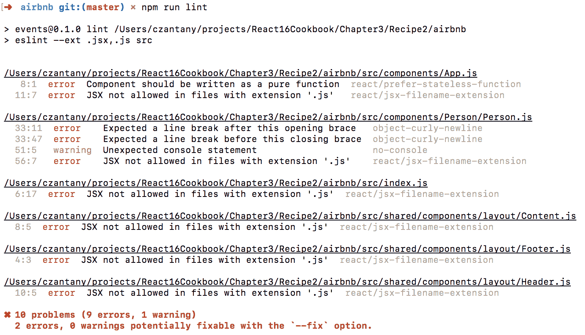

1.  现在我们需要修复代码检查工具的错误。第一个错误是 Component 应该被写成一个纯函数`react/prefer-stateless-function`。这意味着我们的`App`组件可以被写成一个函数组件，因为我们不使用任何本地状态：

```jsx
  import React from 'react';
  import Person from './Person/Person';
  import Header from '../shared/components/layout/Header';
  import Content from '../shared/components/layout/Content';
  import Footer from '../shared/components/layout/Footer';
  import './App.css';

  const App = () => (
    <div className="App">
      <Header title="Personal Information" />

      <Content>
        <Person />
      </Content>

      <Footer />
    </div>
  );

  export default App;
```

文件：src/components/App.js

1.  接下来，我们有这个错误：不允许在扩展名为'`.js`'的文件中使用 JSX `/react/jsx-filename-extension`。这个错误意味着在我们使用 JSX 代码的文件中，我们需要使用`.jsx`扩展名，而不是`.js`。我们有六个文件出现了这个问题（`App.js`，`Person.js`，`index.js`，`Content.js`，`Footer.js`和`Header.js`）。我们只需要重命名这些文件并将扩展名改为`.jsx`（`App.jsx`，`Person.jsx`，`Content.jsx`，`Footer.jsx`和`Header.jsx`）。由于`react-scripts`，我们暂时不会将我们的`index.js`改为`index.jsx`。否则，我们会得到这样的错误：

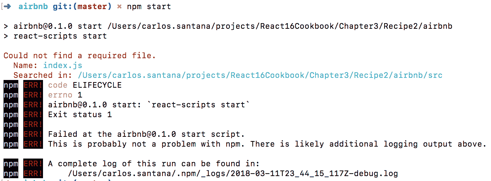在第十章*，精通 Webpack 4.x*中，我们将能够将所有的 JSX 文件重命名为`.jsx`扩展名。

1.  我们需要抑制 linter 错误。我们必须在我们的`index.js`文件顶部写下这个注释：

```jsx
/* eslint react/jsx-filename-extension: "off" */
import React from 'react';
...
```

1.  让我们来看看这个错误：*在这个开括号后面期望有一个换行符*/`object-curly-newline`，以及这个错误：*在这个闭括号前面期望有一个换行符*/`object-curly-newline`。在我们的`Person.jsx`文件中，在`handleOnChange`方法中有这个对象：

```jsx
  const { firstName, lastName, email, phone } = this.state;
```

1.  规则说我们需要在对象之前和之后添加一个换行符：

```jsx
    const {
      firstName,
      lastName,
      email,
      phone
    } = this.state;
```

1.  现在让我们看看警告：*意外的控制台语句*/no-console。console.log 在我们的 linter 中生成了一个警告，这不会影响我们，但如果你需要有一个控制台并且想要避免警告，你可以通过 ESLint 注释添加一个异常，就像这样：

```jsx
console.log('Data:', data); // eslint-disable-line no-console 
```

1.  更多的 ESLint 注释可以做同样的事情：

```jsx
 // eslint-disable-next-line no-console
    console.log('Data:', data);
```

1.  如果你想在整个文件中禁用控制台，那么在文件开头你可以这样做：

```jsx
/* eslint no-console: "off" */
import React, { Component } from 'react';
...
```

1.  *错误：'document'未定义*/no-undef。在我们的`index.jsx`中使用全局对象 document 时，有两种方法可以修复这个错误。第一种方法是添加一个特殊的注释来指定 document 对象是一个全局变量：

```jsx
/* global document */
import React from 'react';
import ReactDOM from 'react-dom';
...
```

1.  我不喜欢这种方式。我更喜欢在我们的`.eslintrc`文件中添加一个`globals`节点：

```jsx
{
  "parser": "babel-eslint",
  "extends": "airbnb",
 "globals": {
 "document": "true"
 },
  "rules": {
    "arrow-parens": "off",
    "comma-dangle": "off",
    "function-paren-newline": "off",
    "max-len": [1, 120],
    "no-param-reassign": "off",
    "react/require-default-props": "off"
  }
}
```

# 它是如何工作的...

linter 验证对于任何项目都是必不可少的。有时，这是一个讨论的话题，因为大多数开发人员不喜欢遵循标准，但一旦每个人都熟悉了这个样式指南，一切都会更加舒适，你将会交付更高质量的代码。

到目前为止，我们知道如何在终端中运行 linter 验证，但你也可以将 ESLint 验证器添加到你的 IDE（Atom 和 VSC）。在这个例子中，我们将使用 Atom。

**安装 Atom 插件**

在 Atom（Mac 上）中，你可以转到首选项|+安装，然后你可以找到 Atom 插件。我会给你一个我用来改进我的 IDE 并提高我的生产力的插件列表：

+   `linter-eslint`：使用 ESLint 实时 lint JS

+   `editorconfig`：帮助开发人员在不同的编辑器之间保持一致的编码风格

+   `language-babel`：支持 React 语法

+   `minimap`：全源代码的预览

+   `pigments`：在项目和文件中显示颜色的包

+   `sort-lines`：对你的行进行排序

+   `teletype`：与团队成员共享你的工作区，并允许他们实时协作编码

安装了这些包之后，如果你打开一个有 lint 错误的文件，你将能够看到它们：

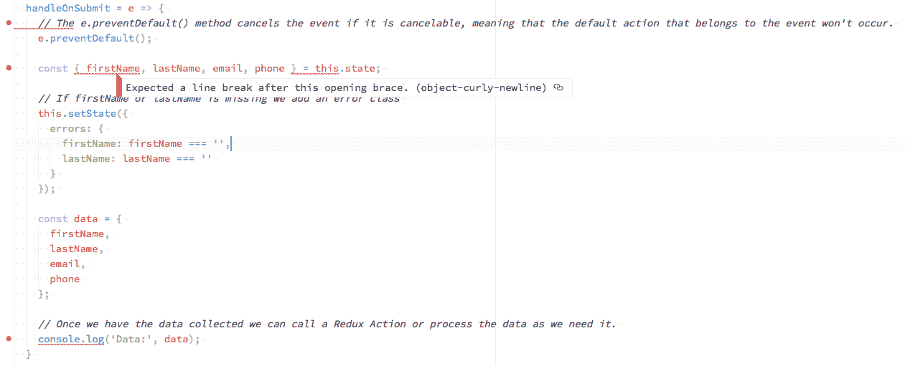

**配置 EditorConfig**

当我们团队中的人使用不同的编辑器时，EditorConfig 也非常有用，可以帮助维护一致的编码风格。EditorConfig 得到了许多编辑器的支持。你可以在官方网站[`editorconfig.org`](http://editorconfig.org)上检查你的编辑器是否得到支持。

我使用的配置是这样的；你需要在你的`根`目录下创建一个名为`.editorconfig`的文件：

```jsx
 root = true

 [*]
 indent_style = space
 indent_size = 2
 end_of_line = lf
 charset = utf-8
 trim_trailing_whitespace = true
 insert_final_newline = true

 [*.html]
 indent_size = 4

 [*.css]
 indent_size = 4

 [*.md]
 trim_trailing_whitespace = false
```

你可以影响所有的文件[*]，也可以使用[*.extension]来影响特定的文件**.**

# 还有更多...

在我们的 IDE 中运行 linter 验证或者通过终端运行是不够的，不能确保我们将 100%验证我们的代码，并且不会向我们的 Git 存储库中注入任何 linter 错误。确保我们将经过验证的代码发送到我们的 Git 存储库的最有效方法是使用 Git hooks。这意味着你在执行提交之前（pre-commit）或推送之前（pre-push）运行 linter 验证器。我更喜欢在 pre-commit 上运行 linter，而在 pre-push 上运行单元测试（我们将在第十二章中介绍单元测试）*.*

Husky 是我们将用来修改 Git hooks 的包；你可以使用以下命令安装它：

```jsx
 npm install husky
```

一旦我们添加了这个包，我们需要修改我们的`package.json`并添加新的脚本：

```jsx
{
  "name": "airbnb",
  "version": "0.1.0",
  "private": true,
  "dependencies": {
    "eslint": "⁴.18.2",
    "eslint-config-airbnb": "¹⁶.1.0",
    "eslint-plugin-babel": "⁴.1.2",
    "eslint-plugin-jsx-a11y": "⁶.0.3",
    "eslint-plugin-react": "⁷.7.0",
    "husky": "⁰.14.3",
    "prop-types": "¹⁵.6.1",
    "react": "¹⁶.2.0",
    "react-dom": "¹⁶.2.0",
    "react-scripts": "1.1.0"
  },
  "scripts": {
    "start": "react-scripts start",
    "build": "react-scripts build",
    "test": "react-scripts test --env=jsdom",
    "eject": "react-scripts eject",
    "lint": "eslint --ext .jsx,.js src",
    "precommit": "npm run lint",
    "postmerge": "npm install", 
    "postrewrite": "npm install",
  }
}
```

我们使用四个脚本：

+   `precommit`：在执行提交之前运行。

+   `postmerge`：在执行合并后运行。

+   `postrewrite`：这个 hook 是由重写提交的命令调用的（git commit `--amend`，`git-rebase`；目前，`git-filter-branch`不会调用它！）。

+   `*prepush`：我目前没有添加这个 Git 钩子，但这对于运行我们的单元测试（`"prepush": "npm test"`）非常有用，我们将在第十二章中添加这个 Git 钩子，*测试和调试*，当我们涵盖单元测试主题时。

在这种情况下，在我们的`precommit`中，我们将运行我们的 linter 验证器，如果验证器失败，提交将不会执行，直到您修复所有 linter 错误。postmerge 和 postrewrite 钩子帮助我们同步我们的 npm 包，因此，例如，如果用户 A 添加了新的 npm 包，然后用户 B 拉取新代码，将自动运行`npm install`命令在用户 B 的本地机器上安装新包。

# 使用 React Helmet 更新我们的标题和元标记

在所有项目中，能够更改我们的站点标题和每个特定页面上的元标记以使其对 SEO 友好非常重要。

# 准备工作

对于这个示例，我们需要安装一个名为`react-helmet`的包：

```jsx
npm install react-helmet
```

# 如何做...

React Helmet 是处理标题和元标记以改善我们网站 SEO 的最佳方式：

1.  一旦我们使用`App.jsx`的相同组件安装了`react-helmet`包，我们需要导入 React Helmet：

```jsx
 import Helmet from 'react-helmet';
```

1.  我们可以通过将标题属性添加到`Helmet`组件来更改页面的标题，就像这样：

```jsx
      <Helmet title="Person Information" />
```

1.  如果您启动您的应用程序，您将在浏览器中看到标题：

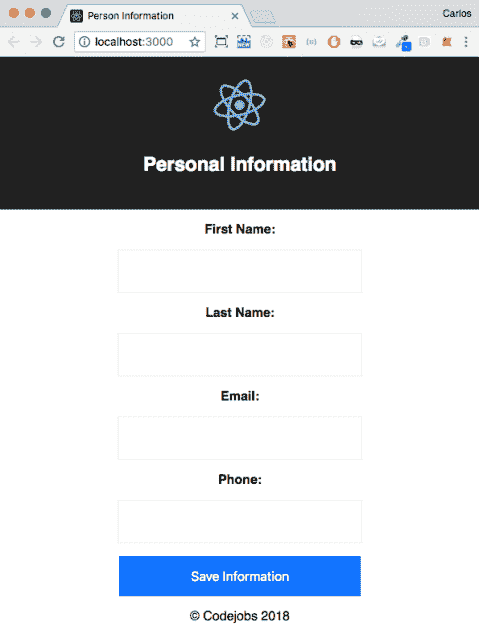

1.  如果您想更改您的元标记，您可以这样做：

```jsx
    <Helmet
      title="Person Information"
      meta={[
        { name: 'title', content: 'Person Information' },
        { name: 'description', content: 'This recipe talks about React 
 Helmet' }
      ]}
    />
```

# 它是如何工作的...

有了那段代码，我们将得到这个输出：

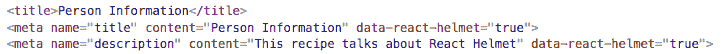

如果您想直接将 HTML 代码添加到`Helmet`组件中，也可以这样做：

```jsx
    <Helmet>
      <title>Person Information</title>
      <meta name="title" content="Person Information" />
      <meta name="description" content="This recipe talks about React Helmet" />
    </Helmet>
```

您可能已经注意到在页面第一次加载时标题会闪烁变化，这是因为在我们的`index.html`文件中，默认情况下有标题*React App*。您可以通过编辑此文件来更改它：

```jsx
  <head>
    <meta charset="utf-8">
    <meta name="viewport" content="width=device-width, initial-scale=1, 
    shrink-to-fit=no">
    <meta name="theme-color" content="#000000">
    <link rel="manifest" href="%PUBLIC_URL%/manifest.json">
    <link rel="shortcut icon" href="%PUBLIC_URL%/favicon.ico">
    <title>Personal Information</title>
  </head>
```

文件：public/index.html

# 还有更多...

到目前为止，我们只在主组件（`<App />`）中更改了我们的标题，但在第四章*，使用 React Router V4 为我们的应用程序添加路由*，我们将能够根据路由在不同组件中更改我们的标题和元标记。

此外，在第十一章中，*实现服务器端渲染*，我们将学习如何在应用程序中实现服务器端渲染。您也可以在服务器端渲染中使用 React Helmet，但需要进行一些更改。

首先，在您的`index.html`文件中（注意：此文件将在第十一章*，实现服务器端渲染*中更改为 JavaScript 文件；请不要尝试将此内容添加到您当前的`index.html`文件中），您需要添加类似以下内容：

```jsx
  return  `
    <head>
      <meta charset="utf-8">
      <title>Personal Information</title>
      ${helmet.title.toString()}
      ${helmet.meta.toString()}
      <link rel="shortcut icon" href="images/favicon.png" 
      type="image/x-icon">
    </head>
  `;
```

有了这个，我们就能够使用服务器端渲染来更新我们的标题和元标签。
