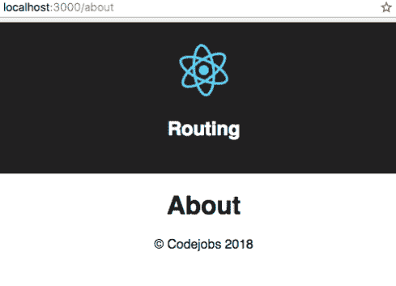
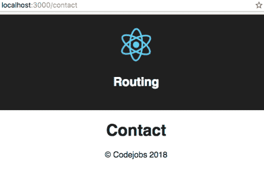

# 第四章：使用 React Router 在我们的应用程序中添加路由

在本章中，将涵盖以下示例：

+   实现 React Router v4

+   创建嵌套路由并向我们的路径添加参数

# 介绍

在本章中，我们将学习如何使用 React Router v4 在我们的项目中添加动态路由。

# 实现 React Router v4

与 Angular 不同，React 是一个库而不是一个框架，这意味着特定功能，例如路由或`propTypes`，不是 React 核心的一部分。相反，路由由一个名为 React Router 的第三方库处理。

# 准备工作

我们将使用我们在*实施 Airbnb React/JSX 样式指南*（`Repository：` `Chapter03/Recipe4/airbnb`）中的代码来启用 linter 验证。

我们需要做的第一件事是安装 React Router v4，我们可以使用以下命令来完成：

```jsx
 npm install react-router-dom
```

您可能会对我们为什么安装`react-router-dom`而不是`react-router`感到困惑。React Router 包含了`react-router-dom`和`react-router-native`的所有常见组件。这意味着如果您在 Web 上使用 React，应该使用`react-router-dom`，如果您在使用 React Native，则需要使用`react-router-native`。`react-router-dom`包最初是为了包含版本 4，而`react-router`使用的是版本 3。`react-router-dom`比`react-router`有一些改进。它们在这里列出：

+   改进的`<Link>`组件（渲染为`<a>`）。

+   包括`<BrowserRouter>`，它与浏览器的`window.history`交互。

+   包括`<NavLink>`，它是一个`<Link>`包装器，知道它是否处于活动状态。

+   包括`<HashRouter>`，它使用 URL 中的哈希来渲染组件。如果您有一个静态页面，应该使用这个组件而不是`<BrowserRouter>`。

# 如何做...

在这个示例中，我们将根据路由显示一些组件：

1.  我们需要创建四个功能组件（`About`，`Contact`，`Home`和`Error 404`）并将它们命名为它们目录中的`index.jsx`。

1.  创建`Home`组件：

```jsx
import React from 'react';

const Home = () => (
  <div className="Home">
    <h1>Home</h1>
  </div>
);

export default Home;
```

文件：src/components/Home/index.jsx

1.  创建`About`组件：

```jsx
import React from 'react';

const About = () => (
  <div className="About">
    <h1>About</h1>
  </div>
);

export default About;
```

文件：src/components/About/index.jsx

1.  创建`Contact`组件：

```jsx
      import React from 'react';

      const Contact = () => (
        <div className="Contact">
          <h1>Contact</h1>
        </div>
      );

      export default Contact;
```

文件：src/components/Contact/index.jsx

1.  创建`Error 404`组件：

```jsx
      import React from 'react';

      const Error404 = () => (
        <div className="Error404">
          <h1>Error404</h1>
        </div>
      );

 export default Error404;
```

文件：src/components/Error/404.jsx

1.  在我们的`src/index.js`文件中，我们需要包含我们将在下一步创建的路由。我们需要从`react-router-dom`中导入`BrowserRouter`对象，并将其重命名为 Router：

```jsx
import React from 'react';
import { render } from 'react-dom';
import { BrowserRouter as Router } from 'react-router-dom';
import './index.css';

// Routes
import AppRoutes from './routes';

render(
  <Router>
    <AppRoutes />
  </Router>,
  document.getElementById('root')
);
```

文件：src/index.js

1.  现在我们需要创建`src/routes.jsx`文件，我们将在其中导入我们的`App`和`Home`组件，并使用`Route`组件为用户访问根路径（/）时添加一个路由来执行我们的`Home`组件：

```jsx
// Dependencies
import React from 'react';
import { Route } from 'react-router-dom';

// Components
import App from './components/App';
import Home from './components/Home';

const AppRoutes = () => (
  <App>
    <Route path="/" component={Home} />
  </App>
);

export default AppRoutes;
```

文件：src/routes.jsx

1.  之后，我们需要修改我们的`App.jsx`文件，将路由组件渲染为子组件：

```jsx
      import React from 'react';
      import { element } from 'prop-types';
      import Header from '../shared/components/layout/Header';
      import Content from '../shared/components/layout/Content';
      import Footer from '../shared/components/layout/Footer';
      import './App.css';

      const App = props => (
        <div className="App">
          <Header title="Routing" />

          <Content>
            {props.children}
          </Content>

          <Footer />
        </div>
      );

      App.propTypes = {
        children: element
      };

 export default App;
```

文件：src/components/App.jsx

1.  如果你运行你的应用程序，你会在根路径（/）看到`Home`组件：


1.  现在，让我们在用户尝试访问任何其他路由时添加我们的`Error 404`：

```jsx
// Dependencies
import React from 'react';
import { Route } from 'react-router-dom';

// Components
import App from './components/App';
import Home from './components/Home';
import Error404 from './components/Error/404';

const AppRoutes = () => (
  <App>
    <Route path="/" component={Home} />
    <Route component={Error404} />
  </App>
);

export default AppRoutes;
```

文件：src/routes.jsx

1.  如果你运行应用程序，你会看到它同时渲染了两个组件（`Home`和`Error 404`）。你可能想知道为什么：


1.  这是因为我们需要使用`<Switch>`组件来执行路径匹配时的一个组件。为此，我们需要导入`Switch`组件，并将其作为路由的包装器添加进去：

```jsx
// Dependencies
import React from 'react';
import { Route, Switch } from 'react-router-dom';

// Components
import App from './components/App';
import Home from './components/Home';
import Error404 from './components/Error/404';

const AppRoutes = () => (
  <App>
    <Switch>
      <Route path="/" component={Home} />
      <Route component={Error404} />
    </Switch>
  </App>
);

export default AppRoutes;
```

文件：src/routes.jsx

1.  现在，如果我们去到根路径（/），我们会看到我们的`Home`组件，而`Error404`不会同时执行（只会执行`Home`组件），但如果我们去到`/somefakeurl`，我们会看到`Home`组件也被执行了，这是一个问题：


1.  为了解决这个问题，我们需要在我们想要精确匹配的路由中添加 exact 属性。问题在于`/somefakeurl`会匹配我们的根路径（/），但如果我们想要非常具体地匹配路径，我们需要在`Home`路由中添加 exact 属性：

```jsx
// Dependencies
import React from 'react';
import { Route, Switch } from 'react-router-dom';

// Components
import App from './components/App';
import Home from './components/Home';
import Error404 from './components/Error/404';

const AppRoutes = () => (
  <App>
    <Switch>
      <Route path="/" component={Home} exact />
      <Route component={Error404} />
    </Switch>
  </App>
);

export default AppRoutes;
```

1.  现在如果你去到`/somefakeurl`，你将能够看到`Error404`组件：


# 它是如何工作的...

正如你所看到的，实现 React Router 库非常容易。现在我们可以为我们的`About`（`/about`）和`Contact`（`/contact`）组件添加更多的路由：

```jsx
// Dependencies
import React from 'react';
import { Route, Switch } from 'react-router-dom';

// Components
import App from './components/App';
import About from './components/About';
import Contact from './components/Contact';
import Home from './components/Home';
import Error404 from './components/Error/404';

const AppRoutes = () => (
  <App>
    <Switch>
      <Route path="/" component={Home} exact />
      <Route path="/about" component={About} exact />
 <Route path="/contact" component={Contact} exact />
      <Route component={Error404} />
    </Switch>
  </App>
);

export default AppRoutes;
```

如果你去到`/about`，你会看到这个视图：



如果你去到`/contact`，你会看到这个视图：



# 还有更多...

到目前为止，我们已经学会了如何在我们的项目中创建简单的路由，但在下一个教程中，我们将学习如何在我们的路由中包含参数，如何添加嵌套路由，以及如何使用`<Link>`组件在我们的网站中导航。

# 向我们的路由添加参数

对于这个教程，我们将使用与上一个教程相同的代码，并添加一些参数，展示如何将它们传递到我们的组件中。

# 如何做...

在这个教程中，我们将创建一个简单的`Notes`组件，以在访问`/notes`路由时显示所有的笔记，但当用户访问`/notes/:noteId`时，我们将显示一个笔记（我们将使用`noteId`来过滤笔记）：

1.  我们需要创建一个名为 Notes 的新组件（`src/components/Notes/index.jsx`），这是我们的`Notes`组件的骨架：

```jsx
    import React, { Component } from 'react';
    import './Notes.css';
    class Notes extends Component {
      constructor() {
        super();

        // For now we are going to add our notes to our 
        // local state, but normally this should come
        // from some service.
        this.state = {
          notes: [
            {
              id: 1,
              title: 'My note 1'
            },
            {
              id: 2,
              title: 'My note 2'
            },
            {
              id: 3,
              title: 'My note 3'
            },
          ]
        };
      }
      render() {
        return (
          <div className="Notes">
            <h1>Notes</h1>
          </div>
        );
      }
    }
    export default Notes;
```

文件：src/components/Notes/index.jsx

1.  CSS 文件如下：

```jsx
    .Notes ul {
      list-style: none;
      margin: 0;
      margin-bottom: 20px;
      padding: 0;
    }

 .Notes ul li {
      padding: 10px;
    }

    .Notes a {
      color: #555;
      text-decoration: none;
    }

    .Notes a:hover {
      color: #ccc;
      text-decoration: none;
    }
```

文件：src/components/Notes/Notes.css

1.  一旦我们创建了我们的`Notes`组件，我们需要将它导入到我们的`src/routes.jsx`文件中：

```jsx
// Dependencies
import React from 'react';
import { Route, Switch } from 'react-router-dom';

// Components
import App from './components/App';
import About from './components/About';
import Contact from './components/Contact';
import Home from './components/Home';
import Notes from './components/Notes';
import Error404 from './components/Error/404';

const AppRoutes = () => (
  <App>
    <Switch>
      <Route path="/" component={Home} exact />
      <Route path="/about" component={About} exact />
      <Route path="/contact" component={Contact} exact />
      <Route path="/notes" component={Notes} exact />
      <Route component={Error404} />
    </Switch>
  </App>
);

export default AppRoutes;
```

文件：src/routes.jsx

1.  现在我们可以在`/notes`URL 下看到我们的 Notes 组件：

！[](assets/28ddd133-d99f-48a0-8552-563e0edf56e1.png)

1.  现在我们的`Notes`组件已经连接到 React Router，让我们将我们的笔记渲染为列表：

```jsx
import React, { Component } from 'react';
import { Link } from 'react-router-dom';
import './Notes.css';

class Notes extends Component {
  constructor() {
    super();

    this.state = {
      notes: [
        {
          id: 1,
          title: 'My note 1'
        },
        {
          id: 2,
          title: 'My note 2'
        },
        {
          id: 3,
          title: 'My note 3'
        },
      ]
    };
  }

  renderNotes = notes => (
    <ul>
      {notes.map((note, key) => (
        <li key={key}>
          <Link to={`/notes/${note.id}`}>{note.title}</Link>
        </li>
      ))}
    </ul>
  );

  render() {
    const { notes } = this.state;

    return (
      <div className="Notes">
        <h1>Notes</h1>

        {this.renderNotes(notes)}
      </div>
    );
  }
}

export default Notes;
```

文件：src/components/Notes/index.jsx

1.  你可能已经注意到我们正在使用`<Link>`（这将生成一个`<a>`标签）组件，指向`/notes/notes.id`，这是因为我们将在我们的`src/routes.jsx`文件中添加一个新的嵌套路由来匹配笔记的`id`：

```jsx
// Dependencies
import React from 'react';
import { Route, Switch } from 'react-router-dom';

// Components
import App from './components/App';
import About from './components/About';
import Contact from './components/Contact';
import Home from './components/Home';
import Notes from './components/Notes';
import Error404 from './components/Error/404';

const AppRoutes = () => (
  <App>
    <Switch>
      <Route path="/" component={Home} exact />
      <Route path="/about" component={About} exact />
      <Route path="/contact" component={Contact} exact />
      <Route path="/notes" component={Notes} exact />
      <Route path="/notes/:noteId" component={Notes} exact />
      <Route component={Error404} />
    </Switch>
  </App>
);

export default AppRoutes;
```

文件：src/routes.jsx

1.  React Router 有一个特殊的属性叫做`match`，它是一个包含有关我们执行的路由的所有信息的对象，如果我们有参数，我们将能够在`match`对象中看到它们，就像这样：

```jsx
render() {
  // Let's see what contains our props object.
  console.log(this.props); 

  // We got the noteId param from match object.
  const { match: { params: { noteId } } } = this.props;
  const { notes } = this.state;

  // By default our selectedNote is false
  let selectedNote = false;

  if (noteId > 0) {
    // If the note id is higher than 0 then we filter it from our 
    // notes array.
    selectedNote = notes.filter(
      note => note.id === Number(noteId)
    );
  }

  return (
    <div className="Notes">
      <h1>Notes</h1>

      {/* We render our selectedNote or all notes */}
      {this.renderNotes(selectedNote || notes)}
    </div>
  );
}
```

文件：src/components/Notes/index.jsx

1.  `match`属性看起来像这样。

！[](assets/d677a7d5-47e2-450a-bd95-d7b7b6ed1b66.png)

# 它是如何工作的...

`match`对象包含了许多有用的信息。React Router 还包括了对象的历史和位置。正如你所看到的，我们可以在`match`对象中获取我们在路由中传递的所有参数。

如果你运行应用程序并转到`/notes`URL，你会看到这个视图：

！[](assets/1d4d34cf-550e-4e4f-87ca-81941c259710.png)

如果你点击任何链接（我点击了我的笔记 2），你会看到这个视图：

！[](assets/a3ba6075-4521-435a-a40b-a10f5e5f6dd7.png)

之后，我们可以在我们的`Header`组件中添加一个菜单来访问所有我们的路由：

```jsx
import React from 'react';
import PropTypes from 'prop-types';
import { Link } from 'react-router-dom';
import logo from '../../images/logo.svg';

// We created a component with a simple arrow function.
const Header = props => {
  const {
    title = 'Welcome to React',
    url = 'http://localhost:3000'
  } = props;

  return (
    <header className="App-header">
      <a href={url}>
        
      </a>
      <h1 className="App-title">{title}</h1>

 <ul>
 <li><Link to="/">Home</Link></li>
 <li><Link to="/about">About</Link></li>
 <li><Link to="/notes">Notes</Link></li>
 <li><Link to="/contact">Contact</Link></li>
 </ul>
    </header>
  );
};

// Even with Functional Components we are able to validate our PropTypes.
Header.propTypes = {
  title: PropTypes.string.isRequired,
  url: PropTypes.string
};

export default Header;
```

文件：src/shared/components/layout/Header.jsx

之后，我们需要修改我们的`src/components/App.css`文件来为我们的菜单添加样式。只需在 CSS 文件的末尾添加以下代码：

```jsx
.App-header ul {
  margin: 0;
  padding: 0;
  list-style: none;
}

.App-header ul li {
  display: inline-block;
  padding: 0 10px;
}

.App-header ul li a {
  color: #fff;
  text-decoration: none;
}

.App-header ul li a:hover {
  color: #ccc;
}
```

文件：src/components/App.css

现在你可以看到菜单像这样：
