# 第八章：使用 Node.js 和 MongoDB、MySQL 创建 API

在本章中，将涵盖以下配方：

+   使用 Express 创建一个基本的 API

+   用 MongoDB 构建数据库

+   用 MySQL 构建数据库

+   添加访问令牌以保护我们的 API

# 介绍

从 Node.js 官方网站([`nodejs.org`](https://nodejs.org))：

*Node.js 是建立在 Chrome 的 V8 JavaScript 引擎上的 JavaScript 运行时。Node.js 使用事件驱动的、非阻塞的 I/O 模型，使其轻量高效。Node.js 的包生态系统 npm 是世界上最大的开源库生态系统。*

Node.js 广泛用作 Web 应用程序的后端，因为它很容易创建 API，并且其性能优于 Java、PHP 或 Ruby 等技术。通常，使用 Node.js 最流行的方式是使用一个叫做 Express 的框架。

来自 Express 官方网站([`expressjs.com`](https://expressjs.com))：

*Express 是一个最小化和灵活的 Node.js Web 应用程序框架，为 Web 和移动应用程序提供了强大的功能集。*

# 使用 Express 创建一个基本的 API

Express 是最流行的 Node.js 框架，安装和使用都很容易。在这个配方中，我们将使用 Express 创建、配置和安装一个基本的 API。

# 准备工作

首先，我们需要安装 Node。你需要去官方网站[www.nodejs.org](http://www.nodejs.org)，然后下载 Node.js。有两个版本：**LTS**（长期支持）版本和当前版本，具有最新功能。在我看来，选择 LTS 版本总是更好，但这取决于你。

一旦你安装了 Node，你可以在终端中运行这个命令来检查你的版本：

```jsx
node -v
v10.8.0
```

此外，Node 默认包含 Node Package Manager (npm)。你可以用这个命令检查你的版本：

```jsx
npm -v
6.3.0
```

现在我们需要安装 Express。为了做到这一点，有一个叫做`express-generator`的包，它将允许我们用一个简单的命令创建一个 Express 应用程序。我们需要全局安装它：

```jsx
npm install -g express-generator
```

在我们安装了`express-generator`之后，我们可以创建一个 Express 应用程序。我通常喜欢在我的 Mac 的主文件夹内创建一个名为`projects`的目录，或者如果你使用 Windows，你可以在`C:\projects`下创建它：

```jsx
express my-first-express-app
```

一旦你运行了这个命令，你会看到类似这样的东西：

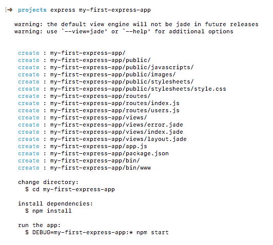

如果你按照运行应用程序的说明，你会看到 Express 应用程序在`http://localhost:3000`上运行：

```jsx
 cd my-first-express-app
 npm install
npm start 
```

你会看到这个视图：

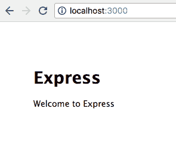

# 如何做到这一点...

默认情况下由`express-generator`生成的代码是 ES5 代码，使用`var`，`require`，`module.exports`等：

1.  我们需要做的第一件事是将这段代码转换为 ES6。为了做到这一点，让我们首先修改我们的`app.js`文件。这是该文件的原始代码：

```jsx
  var createError = require('http-errors');
  var express = require('express');
  var path = require('path');
  var cookieParser = require('cookie-parser');
  var logger = require('morgan');

  var indexRouter = require('./routes/index');
  var usersRouter = require('./routes/users');

  var app = express();

  // view engine setup
  app.set('views', path.join(__dirname, 'views'));
  app.set('view engine', 'jade');

  app.use(logger('dev'));
  app.use(express.json());
  app.use(express.urlencoded({ extended: false }));
  app.use(cookieParser());
  app.use(express.static(path.join(__dirname, 'public')));

  app.use('/', indexRouter);
  app.use('/users', usersRouter);

  // catch 404 and forward to error handler
  app.use(function(req, res, next) {
    next(createError(404));
  });

  // error handler
  app.use(function(err, req, res, next) {
    // set locals, only providing error in development
    res.locals.message = err.message;
    res.locals.error = req.app.get('env') === 'development' ? err : {};

    // render the error page
    res.status(err.status || 500);
    res.render('error');
  });

 module.exports = app;
```

文件：app.js

1.  迁移到 ES6，我们应该有这段代码：

```jsx
  import createError from 'http-errors';
  import express from 'express';
  import path from 'path';
  import cookieParser from 'cookie-parser';
  import logger from 'morgan';

  import indexRouter from './routes/index';
  import usersRouter from './routes/users';

  const app = express();

  // view engine setup
  app.set('views', path.join(__dirname, 'views'));
  app.set('view engine', 'jade');

  app.use(logger('dev'));
  app.use(express.json());
  app.use(express.urlencoded({ extended: false }));
  app.use(cookieParser());
  app.use(express.static(path.join(__dirname, 'public')));

  app.use('/', indexRouter);
  app.use('/users', usersRouter);

  // catch 404 and forward to error handler
  app.use((req, res, next) => {
    next(createError(404));
  });

  // error handler
  app.use((err, req, res, next) => {
    // set locals, only providing error in development
    res.locals.message = err.message;
    res.locals.error = req.app.get('env') === 'development' ? err : {};

    // render the error page
    res.status(err.status || 500);
    res.render('error');
  });

  // Listening port
  app.listen(3000);
```

文件：app.js

1.  现在让我们删除我们的`bin/www`目录，因为我们在文件末尾添加了`app.listen(3000);`，然后你需要修改`package.json`中的`start`脚本：

```jsx
  "scripts": {
    "start": "node app.js"
  }
```

文件：package.json

1.  如果你尝试用`npm start`运行你的应用程序，你会得到这个错误：

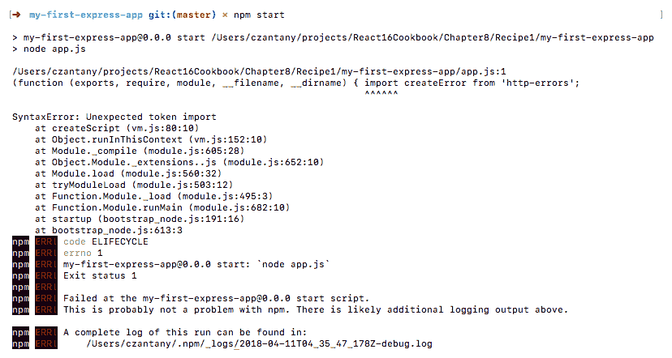

1.  这个错误是因为我们的 ES6 代码不能直接与 Node 一起工作。我们需要使用 Babel 来编译我们的文件，以便能够编写 ES6 代码。为此，我们需要全局安装`babel-cli`，还需要安装`babel-preset-es2015`包：

```jsx
    npm install -g babel-cli
 npm install babel-preset-es2015
```

1.  为了使它工作，我们需要创建一个名为`.babelrc`的新文件，并添加我们的`es2015`预设：

```jsx
    {
      "presets": ["es2015"]
    }
```

文件：.babelrc

1.  现在你需要再次修改你的`start`脚本，并将`node`切换为`babel-node`：

```jsx
  "scripts": {
    "start": "babel-node app.js"
  }
```

文件：package.json

1.  如果你在终端中运行`npm start`，你现在应该能够运行应用程序了。

1.  当我们将代码更改为 ES6 后，我们遇到了另一个问题。如果你修改一个文件并在应用程序中保存它，它不会刷新。而且，如果由于某种原因我们的应用程序崩溃，那么我们的服务器将停止工作。解决这个问题的方法是使用一个 Node 监视器。最流行的是`nodemon`：

```jsx
    npm install nodemon
```

1.  你需要修改你的`start`脚本：

```jsx
  "scripts": {
    "start": "nodemon app.js --exec babel-node"
  }
```

文件：package.json

1.  现在，如果你对应用程序进行任何更改（例如，在`routes/index.js`文件中，你可以更改第 6 行的`Express`文本为任何其他内容），你会看到服务器如何重新启动并刷新网站：

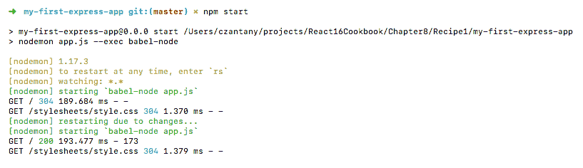

1.  正如你所看到的，绿色的第一条消息说`starting babel-node app.js`，然后当它检测到变化时，它会说`restarting due to changes...`现在我们可以看到我们网站上的变化：


1.  因为我们的 Express 应用程序是为了成为 API 而不是常规网站而创建的，所以我们需要删除许多多余的东西，比如`views`文件夹和模板引擎，我们需要进行一些结构上的改变，以便更容易处理。让我们看看我们的`app.js`文件现在是什么样子的：

```jsx
  // Dependencies
  import express from 'express';
  import path from 'path';

  // Controllers
  import apiController from './controllers/api';

  // Express Application
  const app = express();

  // Middlewares
  app.use(express.json());
  app.use(express.urlencoded({ extended: false }));

  // Routes
  app.use('/api', apiController);

  // Listening port
  app.listen(3000);
```

文件：app.js

1.  如您所见，我将`routes`目录重命名为`controllers`，并且我还删除了该目录中的`users.js`文件，并将`index.js`重命名为`api.js`。让我们创建一个处理博客的 API：

```jsx
  import express from 'express';

  const router = express.Router();

  // Mock data, this should come from a database....
  const posts = [
    {
      id: 1,
      title: 'My blog post 1',
      content: '<p>Content</p>',
      author: 'Carlos Santana'
    },
    {
      id: 2,
      title: 'My blog post 2',
      content: '<p>Content</p>',
      author: 'Cristina Rojas'
    },
    {
      id: 3,
      title: 'My blog post 3',
      content: '<p>Content</p>',
      author: 'Carlos Santana'
    }
  ];

  router.get('/', (req, res, next) => {
    res.send(`
      <p>API Endpoints:</p>
      <ul>
        <li>/api/posts</li>
        <li>/api/post/:id</li>
      </ul>
    `);
  });

  router.get('/posts', (req, res, next) => {
    res.json({
      response: posts
    });
  });

  router.get('/post/:id', (req, res, next) => {
    const { params: { id } } = req;

    const singlePost = posts.find(post => post.id === Number(id));

    if (!singlePost) {
      res.send({
        error: true,
        message: 'Post not found'
      });
    }

    res.json({
      response: [singlePost]
    });
  });

 export default router;
```

文件：controllers/api.js

# 它是如何工作的...

现在让我们测试我们的新 API：

1.  如果我们转到`http://localhost:3000/api`，我们将显示一个端点列表。这是可选的，但对开发人员来说是一个有用的参考：

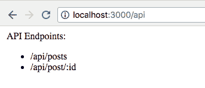

1.  如果您转到`http://localhost:3000/api/posts`，您将看到所有的帖子：

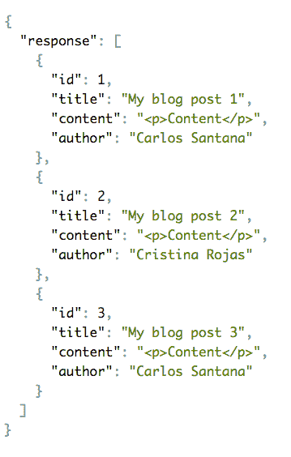

1.  另外，如果您访问`http://localhost:3000/api/post/1`，您将得到列表中的第一篇帖子：

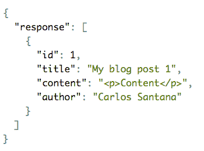

1.  最后，如果您尝试获取我们数据中不存在的帖子（`http://localhost:3000/api/post/99`），那么我们将返回一个错误：

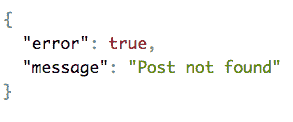

# 使用 MongoDB 构建数据库

MongoDB 是最流行的 NoSQL 数据库。它是免费的（开源）和面向文档的。在这个教程中，我们将安装 MongoDB，创建一个数据库，创建一个文档，并插入一些数据，以便使用 Node.js 和 Mongoose 库显示信息。

# 准备就绪

首先，我们需要安装 MongoDB。在这个教程中，我将向您展示使用 Mac 安装它的最简单的方法，并且我会给您一些链接，以便在 Linux 或 Windows 上安装它。

**来自 MongoDB 官方文档**（[`docs.mongodb.com/manual/tutorial/install-mongodb-on-os-x`](https://docs.mongodb.com/manual/tutorial/install-mongodb-on-os-x)）**：**“从 3.0 版本开始，MongoDB 只支持 MacOS 版本 10.7（狮子）及更高版本的 Intel x86-64。”

# 手动安装 MongoDB 社区版（困难的方法）

这个安装适用于 Mac 和 Linux：

1.  从[`www.mongodb.com/download-center#community`](https://www.mongodb.com/download-center#community)下载您想要的 MongoDB 版本的二进制文件。

1.  从下载的文件中提取文件；您可以使用终端并使用以下命令：

```jsx
    tar -zxvf mongodb-osx-ssl-x86_64-3.6.3.tgz
```

1.  将提取的文件夹复制到 MongoDB 将运行的位置：

```jsx
    mkdir -p mongodb
 cp -R -n mongodb-osx-ssl-x86_64-3.6.3/ mongodb
```

1.  确保二进制文件的位置在`PATH`变量中。您可以在您的 shell 的`rc`文件中添加以下行，比如`~/.bashrc`或`~/.bash_profile`：

```jsx
    export PATH=<your-mongodb-install-directory>/bin:$PATH 
```

# 使用 Homebrew 安装 MongoDB 社区版（简单方法）

Homebrew 是 Mac 的软件包管理器（*也被称为 macOS 的缺失软件包管理器*），并且很容易安装。前往官方网站（https://brew.sh），在那里您会找到一个您应该运行以安装它的命令，如下所示：

```jsx
 /usr/bin/ruby -e "$(curl -fsSL https://raw.githubusercontent.com/Homebrew/install/master/install)"
```

1.  如果您已经安装了 Homebrew，或者刚刚安装了它，那么您需要做的第一件事就是使用以下命令更新软件包数据库：

```jsx
    brew update
```

1.  现在我们需要使用以下命令安装 MongoDB：

```jsx
 brew install mongodb
```

1.  如果您想要安装 MongoDB 的最新开发版本，那么您应该运行此命令（我不建议这样做，因为它可能有一些尚未修复的错误，但这取决于您）：

```jsx
    brew install mongodb --devel
```

# 运行 MongoDB

在我们第一次启动 MongoDB 之前，我们需要创建一个目录，*mongod*进程将在其中写入数据：

1.  默认情况下，mongod 进程使用`/data/db`目录。要创建此文件夹，您可以使用以下命令：

```jsx
    mkdir -p /data/db
```

1.  现在我们需要为数据目录设置权限：

```jsx
    chmod -R 777 /data
```

1.  在一个新的终端（或选项卡）中，您需要运行以下命令：

```jsx
    mongod
```

1.  如果您没有遇到错误，您可以在与*mongod*相同的主机机器上启动 Mongo shell（在新的终端或选项卡中）：

```jsx
    mongo --host 127.0.0.1:127017
```

如果您遇到这样的错误：*Error: Port number 127017 out of range parsing HostAndPort from "127.0.0.1:127017"*，那么只需运行`mongo`而不带`--host`标志。

1.  最后，如果您想要停止 MongoDB，在运行`mongod`的终端中按下*Ctrl* + *C*。

1.  如果一切正常，您应该在终端中看到这个： 

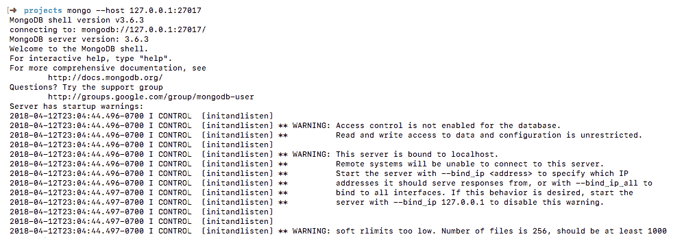

# 如何做...

首先，我们需要创建一个新的数据库：

1.  要创建一个新的数据库或切换到现有的数据库，您需要运行：`use <name of the database>`。让我们创建一个博客数据库：

```jsx
    use blog
```

1.  现在我们需要创建一个名为*posts*的集合，并且您需要直接以 JSON 格式保存数据，使用`db.<your-collection-name>.save({})`命令：

```jsx
   db.posts.save({ title: 'Post 1', slug: 'post-1', content: '<p>Content</p>' })
```

1.  如您所见，我没有添加任何`id`值，这是因为 MongoDB 会自动为每一行创建一个名为`_id`的唯一 ID，这是一个随机哈希。如果您想要查看刚刚保存的数据，您需要使用不带任何参数的`find()`方法：

```jsx
   db.posts.find()
```

1.  您应该看到您的数据如下所示：

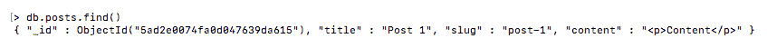

1.  现在假设您添加了一个新的帖子 2 行，并且您想通过指定 slug（post-2）找到该特定行。您可以这样做：

```jsx
   db.posts.find({ slug: 'post-2' })
```

1.  您应该看到这个：

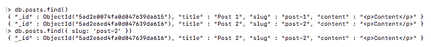

1.  现在让我们将帖子 2 的标题更改为 My Updated Post 2。为此，我们需要按照以下方式更新我们的行：

```jsx
   db.posts.update({ slug: "post-2" }, { $set: { title: "My Updated Post 2" }})
```

1.  第一个参数是查询要更新的行，第二个参数使用`$set`修改字段。

1.  最后，如果我们想要删除特定的行，可以按照以下步骤进行：

```jsx
   db.posts.remove({ "_id": ObjectId("5ad2e6ed4fa0d047639da616") })
```

1.  删除行的推荐方法是直接指定`_id`以避免错误删除其他行，但也可以通过任何其他字段删除行。例如，假设您想使用 slug 删除帖子 1。您可以这样做：

```jsx
   db.posts.remove({ "slug": "post-1" })
```

1.  现在您已经学会了如何使用 MongoDB 进行基本操作，让我们使用 Mongoose 库将 MongoDB 实现到 Node.js 中，这是一个**对象文档映射器**（**ODM**）。我们需要为此示例安装一些额外的包：

```jsx
 npm install mongoose body-parser slug
```

1.  使用与上一个示例相同的代码（`Repository: Chapter08/Recipe1/my-first-express-app`），我们将连接 Mongoose 到 Node.js。我们需要做的第一件事是修改`app.js`：

```jsx
  // Dependencies
  import express from 'express';
  import path from 'path';
  import mongoose from 'mongoose';
  import bodyParser from 'body-parser';

  // Controllers
  import apiController from './controllers/api';

  // Express Application
  const app = express();

  // Middlewares
  app.use(bodyParser.json());
  app.use(bodyParser.urlencoded({ extended: false }));

  // Mongoose Connection (blog is our database)
  mongoose.connect('mongodb://localhost/blog');

  // Routes
  app.use('/api', apiController);

  // Listening port
  app.listen(3000);
```

文件：app.js

1.  现在我们已经将 Mongoose 连接到我们的数据库，我们需要创建一个模型来处理我们的博客帖子。为此，您需要创建一个`src/models/blog.js`文件：

```jsx
// Dependencies
import mongoose, { Schema } from 'mongoose';
import slug from 'slug';

// Defining the post schema...
const postSchema = new Schema({
  title: String,
  slug: { type: String, unique: true },
  content: { type: String, required: true },
  author: String,
  createdAt: Date
});

// Adding a custom method...
postSchema.methods.addAuthor = function(author) {
 /**
 * NOTE: Probably you are thinking, why I'm using function 
   * and not an arrow function?
 * Is because arrow functions does not bind their own context
 * that means this actually refers to the originating context
 */
  this.author = author;

  return this.author;
};
//Before save we create the slug and we add the current date...
postSchema.pre('save', function(next) {
  this.slug = slug(this.title, { lower: 'on' });
  this.createdAt = Date.now();

  next();
});

// Creating our Model...
const Post = mongoose.model('Post', postSchema);

export default Post;
```

文件：src/models/blog.js

1.  现在，为了处理我们的模型，我们需要创建一个新的控制器（`src/controllers/blog.js`），在那里我们将添加保存、更新、删除、查找所有帖子或查找单个帖子的方法：

```jsx
  // Dependencies
  import slugFn from 'slug';
  import Post from '../models/blog';

 export function createPost(title, content, callback) {
    // Creating a new post...
    const newPost = new Post({
      title,
      content
    });

    // Adding the post author...
    newPost.addAuthor('Carlos Santana');

    // Saving the post into the database...
    newPost.save(error => {
      if (error) {
        console.log(error);
        callback(error, true);
      }

      console.log('Post saved correctly!');
      callback(newPost);
    });
  }

  // Updating a post...
  export function updatePost(slug, title, content, callback) {
    const updatedPost = {
      title,
      content,
      slug: slugFn(title, { lower: 'on' })
    };
```

```jsx

    Post.update({ slug }, updatedPost, (error, affected) => {
      if (error) {
        console.log(error);
        callback(error, true);
      }

      console.log('Post updated correctly!');
      callback(affected);
    });
  }

  // Removing a post by slug...
  export function removePost(slug, callback) {
    Post.remove({ slug }, error => {
      if (error) {
        console.log(error);
        callback(error, true);
      }

      console.log('Post removed correctly!');
      callback(true);
    });
  }

  // Find all posts...
  export function findAllPosts(callback) {
    Post.find({}, (error, posts) => {
      if (error) {
        console.log(error);

        return false;
      }

      console.log(posts);
      callback(posts);
    });
  }

  // Find a single post by slug...
  export function findBySlug(slug, callback) {
    Post.find({ slug }, (error, post) => {
      if (error) {
        console.log(error);

        return false;
      }

      console.log(post);
      callback(post);
    });
  }
```

文件：src/controllers/blog.js

1.  最后，我们将修改我们的 API 控制器（`src/controllers/api.js`）以删除我们在上一个示例中创建的虚假数据，并从实际的 MongoDB 数据库获取数据：

```jsx
  import express from 'express';
  import {
    createPost,
    findAllPosts,
    findBySlug,
    removePost,
    updatePost
  } from './blog';

  const router = express.Router();

  // GET Endpoints
  router.get('/', (req, res, next) => {
    res.send(`
      <p>API Endpoints:</p>
      <ul>
        <li><a href="/api/posts">/api/posts</a></li>
        <li><a href="/api/post/1">/api/post/:id</a></li>
      </ul>
    `);
  });

  router.get('/posts', (req, res, next) => {
    findAllPosts(posts => {
      res.json({
        response: posts
      });
    });
  });

  router.get('/post/:slug', (req, res, next) => {
    const { params: { slug } } = req;

    findBySlug(slug, singlePost => {
      console.log('single', singlePost);
      if (!singlePost || singlePost.length === 0) {
        res.send({
          error: true,
          message: 'Post not found'
        });
      } else {
        res.json({
          response: [singlePost]
        });
      }
    });
  });

  // POST Endpoints
  router.post('/post', (req, res, next) => {
    const { title, content } = req.body;

    createPost(title, content, (data, error = false) => {
      if (error) {
        res.json({
          error: true,
          message: data
        });
      } else {
        res.json({
          response: {
            saved: true,
            post: data
          }
        });
      }
    });
  });

  // DELETE Endpoints
  router.delete('/post/:slug', (req, res, next) => {
    const { params: { slug } } = req;

    removePost(slug, (removed, error) => {
      if (error) {
        res.json({
          error: true,
          message: 'There was an error trying to remove this 
          post...'
        });
      } else {
        res.json({
          response: {
            removed: true
          }
        })
      }
    });
  });

  // PUT Endpoints
  router.put('/post/:slug', (req, res, next) => {
    const { params: { slug }, body: { title, content } } = req;

    updatePost(slug, title, content, (affected, error) => {
      if (error) {
        res.json({
          error: true,
          message: 'There was an error trying to update the post'
        });
      } else {
        res.json({
          response: {
            updated: true,
            affected
          }
        })
      }
    });
  });

  export default router;
```

文件：src/controllers/api.js

# 它是如何工作的...

您需要安装 Postman（[`www.getpostman.com`](https://www.getpostman.com)）或任何其他 REST 客户端来测试 API。主要用于`POST`、`PUT`和`DELETE`方法，`GET`方法可以在任何浏览器上轻松验证。

# GET 方法端点

**GET /posts**。此端点可以在浏览器中测试。转到`http://localhost:3000/api/posts`。我手动插入了三行：

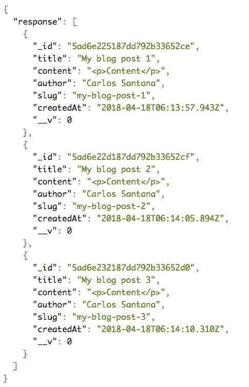

如果您想在 Postman 上进行测试，那么请写入相同的 URL（`http://localhost:3000/api/posts`），选择`GET`方法，并点击发送按钮：


**GET /post/:slug**。此端点也是`GET`，您需要在 URL 上传递 slug（友好的 URL）。例如，第一行的 slug，My blog post 1，是 my-blog-post-1。slug 是一个友好的 URL，其值与标题相同，但是小写，没有特殊字符，并且空格用破折号（-）替换。在我们的模型中，我们将 slug 定义为唯一字段。这意味着不能有多个具有相同 slug 的帖子。

让我们在浏览器中转到`http://localhost:3000/api/post/my-blog-post-1`。如果数据库中存在 slug，您将看到信息：

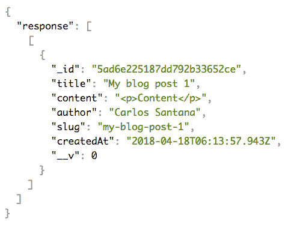

但是，如果您尝试查找数据库中不存在的 slug，您将收到此错误：


# POST 方法端点

`POST`方法通常用于在数据库中插入新数据。

**POST /post**。对于此端点，我们需要使用 Postman 能够通过 body 发送数据。为此，您需要在 Postman 中选择 POST 方法。使用 URL `http://localhost:3000/api/post`，然后点击 Headers，并且您需要添加带有值`application/x-www-form-urlencoded`的标头`Content-Type`：

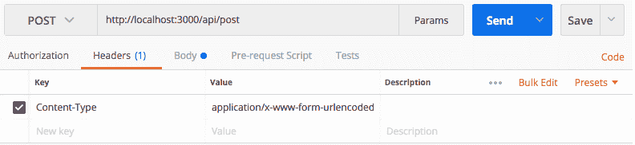

设置标头后，转到 Body 选项卡并选择原始选项，然后可以发送以下信息：

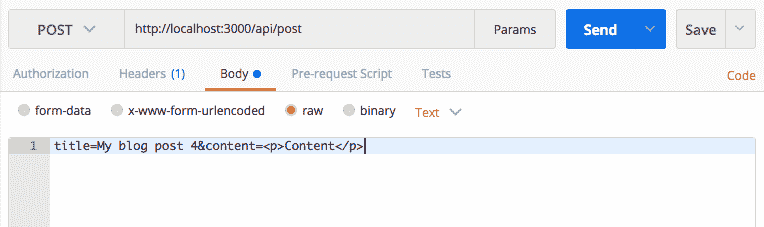

现在，您可以点击发送按钮并查看服务返回的响应：

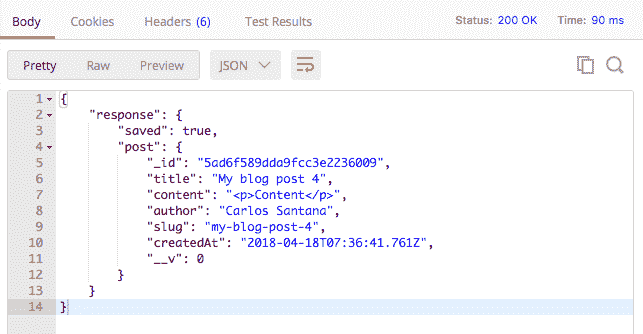

如果您做的一切正确，您应该收到一个响应，其中保存的节点设置为 true，*post*节点包含有关保存的帖子的信息。现在，如果您尝试再次使用相同的数据（相同的标题）点击*发送*按钮，它将导致错误，因为您记得，我们的 slug 必须是唯一的：

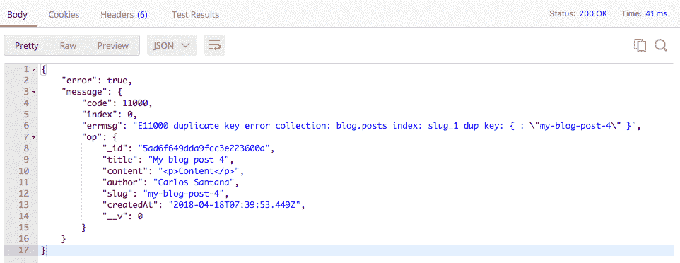

您可能想知道`__v`是什么，如果我们没有直接添加该节点。那就是`versionKey`，它是 Mongoose 在每个文档第一次创建时设置的属性。该键的值包含文档的内部修订版本。您可以更改或删除此文档属性的名称。默认值为`__v`。

如果要更改它，可以在定义新模式时执行以下操作：

```jsx
    // If you want to change the name of the versionKey
    new Schema({...}, { versionKey: '_myVersion' });
```

或者，如果您想要删除它，可以将`versionKey`传递为`false`，但我不建议这样做，因为每次更新文档时，您都无法控制版本更改：

```jsx
    // If you want to remove it you can do:
    new Schema({...}, { versionKey: false });
```

# DELETE 方法端点

`DELETE`方法，顾名思义，是用于删除数据库中的行。

**DELETE /post/:slug**。在 Postman 中，我们需要选择`DELETE`方法，并在 URL 中传递要删除的帖子的 slug。例如，让我们删除帖子 my-blog-post-2。如果您正确删除它，您应该会收到一个将删除的节点设置为 true 的响应：

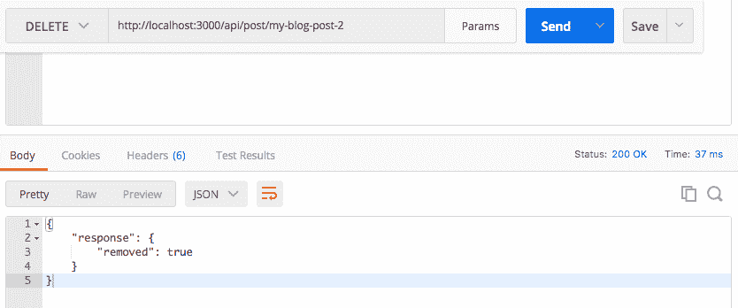

如果您想要验证帖子是否已删除，可以再次转到`/posts`端点，您将看到它不再在 JSON 中：

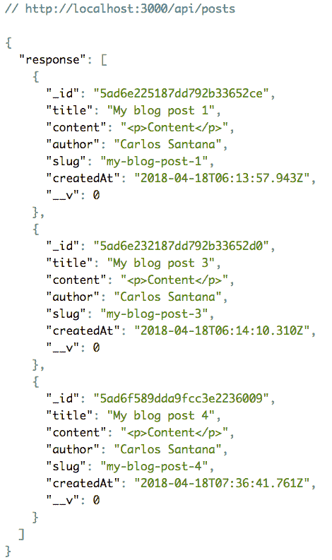

# PUT 方法端点

最后一个方法是`PUT`，通常用于更新数据库中的行。

**PUT /post/:slug**。在 Postman 中，您需要选择 PUT 方法，然后选择要编辑的帖子的 URL。让我们编辑 my-blog-post-3；URL 将是`http://localhost:3000/api/post/my-blog-post-3`。在标题选项卡中，就像在`POST`方法中一样，您需要添加一个值为 application/x-www-form-urlencoded 的`Content-Type`标题。在 Body 选项卡中，您发送要替换的新数据，例如新标题和新内容：

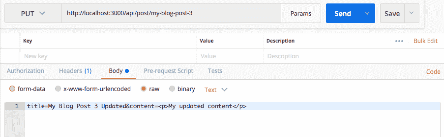

如果一切正常，您应该会收到这个响应：

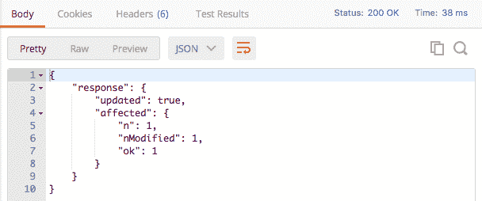

同样，如果您想要验证帖子是否已正确更新，请转到浏览器中的`/posts`端点：

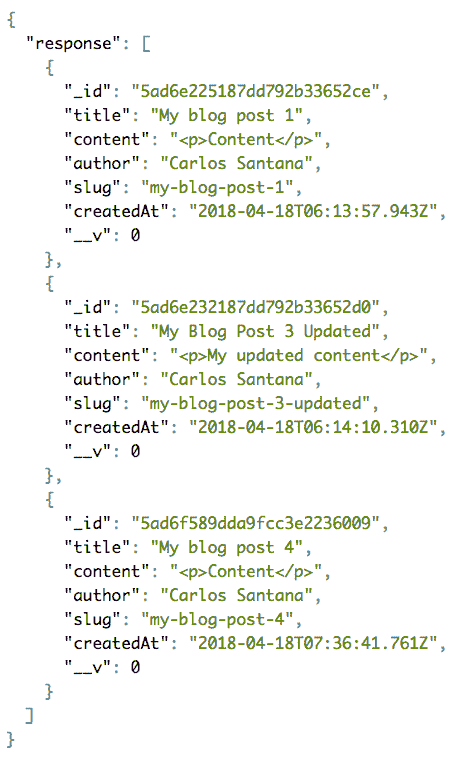

如您所见，帖子标题、内容和 slug 已正确更新。

# 使用 MySQL 构建数据库

MySQL 是最受欢迎的数据库。它是一个开源的关系数据库管理系统（RDBMS）。MySQL 通常是 LAMP（Linux，Apache，MySQL，PHP/Python/Perl）堆栈的核心组件；许多捆绑包都包括 MySQL：

+   AMPPS（Max，Linux 和 Windows） - [`www.ampps.com`](https://www.ampps.com)

+   XAMPP（Mac，Linux 和 Windows） - [`www.apachefriends.org`](https://www.apachefriends.org)

+   WAMP Server（Windows） - [`www.wampserver.com`](http://www.wampserver.com)

+   MAMP（Mac） - [`www.mamp.info`](https://www.mamp.info)

其他开发人员更喜欢单独安装。如果你想这样做，你可以直接从官方网站下载 MySQL：[`dev.mysql.com/downloads/mysql/`](https://dev.mysql.com/downloads/mysql/)。

在这个教程中，我将使用 MySQL Workbench 来执行 SQL 查询。你可以从[`www.mysql.com/products/workbench/`](https://www.mysql.com/products/workbench/)下载它。随意使用任何其他 MySQL 管理员，或者如果你喜欢终端，你可以直接使用 MySQL 命令。

这里有更多的 MySQL GUI 工具：

+   phpMyAdmin - [`www.phpmyadmin.net`](https://www.phpmyadmin.net)

+   Sequel Pro - [`www.sequelpro.com`](https://www.sequelpro.com)

+   Navicat - [`www.navicat.com`](https://www.navicat.com)

# 准备工作

要在 Node 上使用 MySQL，我们需要安装 sequelize 和 mysql2 包：

```jsx
    npm install sequelize **mysql2 slug**
```

# 如何做到...

1.  我们需要做的第一件事是创建一个名为 blog 的数据库，并使用它：

```jsx
CREATE DATABASE blog;
 USE blog;
```

1.  既然我们的数据库准备好了，让我们来使用 Node.js 进行 MySQL 实现。有许多使用 MySQL 与 Node 的方法，但在这个教程中，我们将使用一个名为*Sequelize*的包，它是一个强大的 MySQL 和其他数据库（如 SQLite，Postgres 和 MsSQL）的 ORM。

1.  我们需要做的第一件事是创建一个配置文件来添加我们的数据库配置（主机，数据库，用户，密码等）。为此，你需要创建一个名为`config/index.js`的文件：

```jsx
  export default {
    db: {
      dialect: 'mysql', // 'mysql'|'sqlite'|'postgres'|'mssql'
      host: 'localhost', // Your host, by default is localhost
      database: 'blog', // Your database name
      user: 'root', // Your MySQL user, by default is root
      password: '123456' // Your Db password, sometimes by default                  
                         //is empty.
    }
  };
```

文件：config/index.js

1.  我们可以重复使用在 MongoDB 教程中使用的相同 API 控制器：

```jsx
  import express from 'express';
  import {
    createPost,
    findAllPosts,
    findBySlug,
    removePost,
    updatePost
  } from './blog';

  const router = express.Router();

 // GET Methods
  router.get('/', (req, res, next) => {
    res.send(`
      <p>API Endpoints:</p>
      <ul>
        <li><a href="/api/posts">/api/posts</a></li>
        <li><a href="/api/post/1">/api/post/:id</a></li>
      </ul>
    `);
  });

  router.get('/posts', (req, res, next) => {
    findAllPosts(posts => {
      res.json({
        response: posts
      });
    });
  });

  router.get('/post/:slug', (req, res, next) => {
    const { params: { slug } } = req;

    findBySlug(slug, singlePost => {
      console.log('single', singlePost);
      if (!singlePost || singlePost.length === 0) {
        res.send({
          error: true,
          message: 'Post not found'
        });
      } else {
        res.json({
          response: [singlePost]
        });
      }
    });
  });

  // POST Methods
  router.post('/post', (req, res, next) => {
    const { title, content } = req.body;

    createPost(title, content, (data, error = false) => {
      if (error) {
        res.json({
          error: true,
          details: error
        });
      } else {
        res.json({
          response: {
            saved: true,
            post: data
          }
        });
      }
    });
  });

  // DELETE Methods
  router.delete('/post/:slug', (req, res, next) => {
    const { params: { slug } } = req;

    removePost(slug, (removed, error) => {
      if (error) {
        res.json({
          error: true,
          message: 'There was an error trying to remove this post...'
        });
      } else {
        res.json({
          response: {
            removed: true
          }
        })
      }
    });
  });

  // PUT Methods
  router.put('/post/:slug', (req, res, next) => {
    const { params: { slug }, body: { title, content } } = req;

    updatePost(slug, title, content, (affected, error) => {
      if (error) {
        res.json({
          error: true,
          message: 'There was an error trying to update the post'
        });
      } else {
        res.json({
          response: {
            updated: true,
            affected
          }
        })
      }
    });
  });

  export default router;
```

文件：controllers/api.js

1.  现在我们需要创建我们的 blog 模型（`models/blog.js`）。让我们分部分构建它；首先是连接到我们的数据库：

```jsx
  // Dependencies
  import Sequelize from 'sequelize';
  import slug from 'slug';

  // Configuration
  import config from '../config';

  // Connecting to the database
  const db = new Sequelize(config.db.database, config.db.user, 
  config.db.password, {
    host: config.db.host,
    dialect: config.db.dialect,
    operatorsAliases: false
  });
```

文件：models/blog.js

1.  在我们创建了数据库连接之后，让我们创建我们的 Post 模型。我们将创建一个名为 posts 的表，其中包含以下字段：`id`，`title`，`slug`，`content`，`author`和`createdAt`，但是 Sequelize 默认情况下会在添加`DATE`字段时自动创建一个名为`updatedAt`的额外字段，每次更新行时都会更改：

```jsx
  // This will remove the extra response
  const queryType = {
    type: Sequelize.QueryTypes.SELECT
  };

  // Defining our Post model...
  const Post = db.define('posts', {
    id: {
      type: Sequelize.INTEGER,
      autoIncrement: true,
      primaryKey: true
    },
    title: {
      type: Sequelize.STRING,
      allowNull: false,
      validate: {
        notEmpty: {
          msg: 'The title is empty',
        }
      }
    },
    slug: {
      type: Sequelize.STRING,
      allowNull: false,
      unique: true,
      validate: {
        notEmpty: {
          msg: 'The slug is empty',
        }
      }
    },
    content: {
      type: Sequelize.TEXT,
      allowNull: false,
      validate: {
        notEmpty: {
          msg: 'The content is empty'
        }
      }
    },
    author: {
      type: Sequelize.STRING,
      allowNull: false,
      validate: {
        notEmpty: {
          msg: 'Who is the author?',
        }
      }
    },
    createdAt: {
      type: Sequelize.DATE,
      defaultValue: Sequelize.NOW
    },
  });
```

文件：models/blog.js

1.  Sequelize 最酷的事情之一是，我们可以在字段为空时添加一个自定义消息的验证（`notEmpty`）。现在我们将添加一个方法来创建一个新的 post：

```jsx
  // Creating new post...
 export function createPost(title, content, callback) {
    // .sync({ force: true }), if you pass force this will     
    // drop the table every time.
 db
      .sync()
      .then(() => {
        Post.create({
          title,
          slug: title ? slug(title, { lower: 'on' }) : '',
          content,
          author: 'Carlos Santana'
        }).then(insertedPost => {
          console.log(insertedPost);
          callback(insertedPost.dataValues);
        }).catch(error => {
          console.log(error);
          callback(false, error);
        });
      });
  }
```

文件：models/blog.js

1.  现在我们需要一个方法来更新一个 post：

```jsx
  // Updating a post...
  export function updatePost(slg, title, content, callback) {
    Post.update(
      {
        title,
        slug: slug(title, { lower: 'on' }),
        content
      },
      {
        where: { slug: slg }
      }
    ).then(rowsUpdated => {
      console.log('UPDATED', rowsUpdated);
      callback(rowsUpdated);
    }).catch(error => {
      console.log(error);
      callback(false, error);
    });
  }
```

文件：models/blog.js

1.  此外，我们需要一种方法来通过其 slug 删除一个 post：

```jsx
  // Removing a post by slug...
  export function removePost(slug, callback) {
    Post.destroy({
      where: {
        slug
      }
    }).then(rowDeleted => {
      console.log('DELETED', rowDeleted);
      callback(rowDeleted);
    }).catch(error => {
      console.log(error);
      callback(false, error);
    });
  }
```

文件：models/blog.js

1.  Sequelize 还支持直接的 SQL 查询。让我们创建两种方法，一种是通过 SQL 查询找到所有帖子，另一种是通过 slug 找到帖子：

```jsx
 // Find all posts...
  export function findAllPosts(callback) {
    db.query('SELECT * FROM posts', queryType).then(data => {
      callback(data);
    });
  }

  // Find a single post by slug...
  export function findBySlug(slug, callback) {
    db.query(`SELECT * FROM posts WHERE slug = '${slug}'`, queryType).then(data => {
      callback(data);
    });
  }
```

文件：models/blog.js

1.  我们在文件开头定义的`queryType`变量是为了避免从 Sequelize 获得第二个响应。默认情况下，如果您不传递此`queryType`，Sequelize 将以多维数组的形式返回结果（第一个对象是结果，第二个对象是元数据对象）。让我们把所有的部分放在一起：

```jsx
  // Dependencies
  import Sequelize from 'sequelize';
  import slug from 'slug';

  // Configuration
  import config from '../config';

  // Connecting to the database
  const db = new Sequelize(config.db.database, config.db.user, 
  config.db.password, {
    host: config.db.host,
    dialect: config.db.dialect,
    operatorsAliases: false // This is to avoid the warning:       
   //sequelize 
   //deprecated String based operators are now deprecated.
  });

  // This will remove the extra metadata object
  const queryType = {
    type: Sequelize.QueryTypes.SELECT
  };

  // Defining our Post model...
  const Post = db.define('posts', {
    id: {
      type: Sequelize.INTEGER,
      autoIncrement: true,
      primaryKey: true
    },
    title: {
      type: Sequelize.STRING,
      allowNull: false,
      validate: {
        notEmpty: {
          msg: 'The title is empty',
        }
      }
    },
    slug: {
      type: Sequelize.STRING,
      allowNull: false,
      unique: true,
      validate: {
        notEmpty: {
          msg: 'The slug is empty',
        }
      }
    },
    content: {
      type: Sequelize.TEXT,
      allowNull: false,
      validate: {
        notEmpty: {
          msg: 'The content is empty'
        }
      }
    },
    author: {
      type: Sequelize.STRING,
      allowNull: false,
      validate: {
        notEmpty: {
          msg: 'Who is the author?',
        }
      }
    },
    createdAt: {
      type: Sequelize.DATE,
      defaultValue: Sequelize.NOW
    },
  });

  // Creating new post...
  export function createPost(title, content, callback) {
    db
      .sync()
      .then(() => {
        Post.create({
          title,
          slug: title ? slug(title, { lower: 'on' }) : '',
          content,
          author: 'Carlos Santana'
        }).then(insertedPost => {
          console.log(insertedPost);
          callback(insertedPost.dataValues);
        }).catch((error) => {
          console.log(error);
          callback(false, error);
        });
      });
  }

  // Updating a post...
 export function updatePost(slg, title, content, callback) {
    Post.update(
      {
        title,
        slug: slug(title, { lower: 'on' }),
        content
      },
      {
        where: { slug: slg }
      }
    ).then(rowsUpdated => {
      console.log('UPDATED', rowsUpdated);
      callback(rowsUpdated);
    }).catch(error => {
      console.log(error);
      callback(false, error);
    });
  }

  // Removing a post by slug...
  export function removePost(slug, callback) {
    Post.destroy({
      where: {
        slug
      }
    }).then(rowDeleted => {
      console.log('DELETED', rowDeleted);
      callback(rowDeleted);
    }).catch(error => {
      console.log(error);
      callback(false, error);
    });
  }

  // Find all posts...
  export function findAllPosts(callback) {
    db.query('SELECT * FROM posts', queryType).then(data => {
      callback(data);
    });
  }

  // Find a single post by slug...
  export function findBySlug(slug, callback) {
    db.query(`SELECT * FROM posts WHERE slug = '${slug}'`, queryType).then(data => {
      callback(data);
    });
  }
```

文件：models/blog.js

# 工作原理...

它将以与 MongoDB 配方相同的方式工作，只是结果中存在细微差异。要测试 API，您需要安装 Postman（[`www.getpostman.com`](https://www.getpostman.com)）。

# POST 方法端点

POST 方法通常用于在数据库中插入新数据。

**POST /post.** 对于此端点，我们需要使用 Postman 通过请求正文发送数据。为此，您需要在 Postman 中选择 POST 方法。输入 URL `http://localhost:3000/api/post`，然后点击 Headers，您需要添加一个值为`application/x-www-form-urlencoded`的`Content-Type`头：

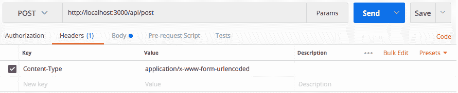

设置头之后，转到`Body`选项卡并选择`raw`选项，您可以像这样发送信息：

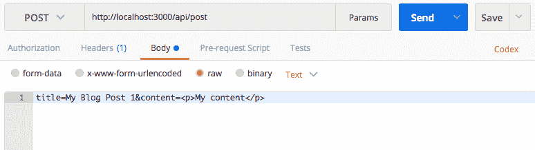

现在您可以点击发送按钮并查看服务返回的响应：

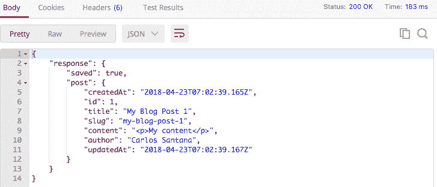

如果您做的一切正确，您应该会收到一个响应，其中保存的`node`设置为`true`，并且帖子的`node`中包含有关保存的帖子的信息。如果您尝试再次点击*发送*按钮并使用相同的数据（相同的标题），它将会导致错误，因为您记得，我们的 slug 必须是唯一的：

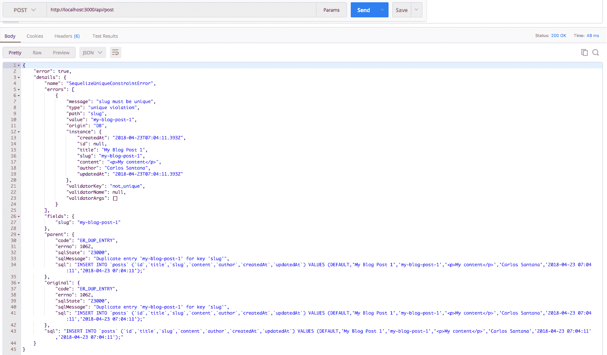此图像中的文本与本文无关。图像的目的是让您一睹错误的样子。在您的 Postman 中尝试，您将看到与图像相同的错误。

# GET 方法端点

**GET /posts**。此端点可以在浏览器中进行测试。转到`http://localhost:3000/api/posts`。我已经手动使用`createPost`方法插入了三行：

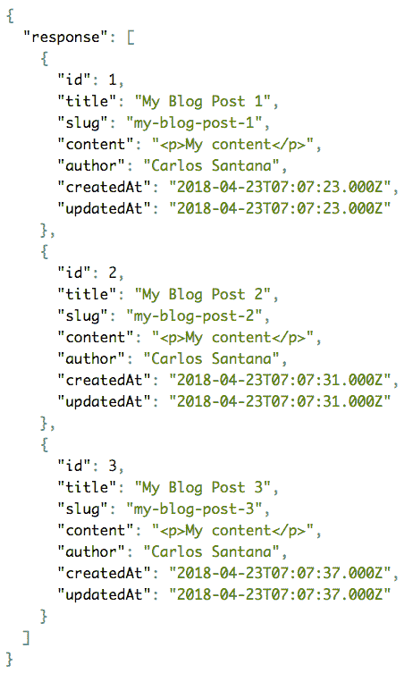

如果您想在 Postman 上进行测试，请写入相同的 URL（`http://localhost:3000/api/posts`），选择`GET`方法，然后点击发送按钮：

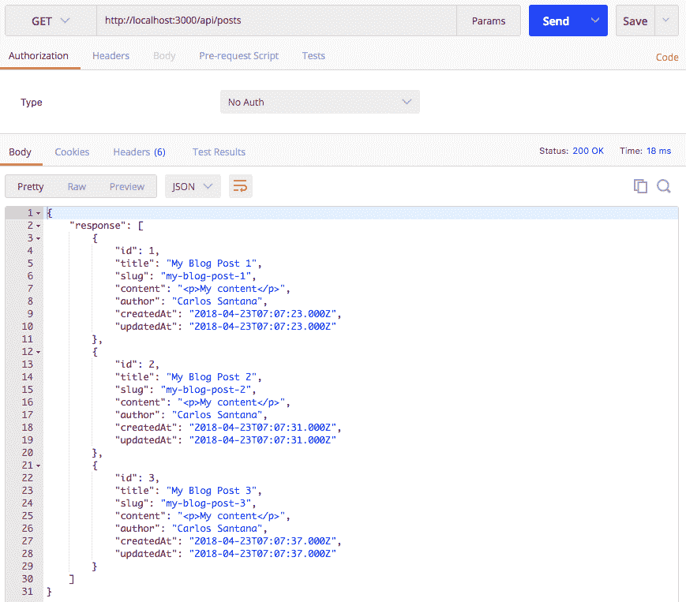

**GET /post/:slug**

此端点也是一个 GET，您需要在 URL 中传递 slug（友好的 URL）。例如，第一行的 slug，我的博客文章 1，是 my-blog-post-1。slug 是一个友好的 URL，其值与标题相同，但是小写，没有特殊字符，并且空格用破折号（`-`）替换。在我们的模型中，我们将 slug 定义为唯一字段，这意味着不能有多个具有相同 slug 的帖子。

让我们在浏览器中转到`http://localhost:3000/api/post/my-blog-post-1`。如果数据库中存在 slug，您将看到以下信息：

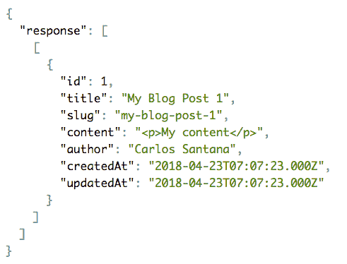

但是，如果尝试查看数据库中不存在的 slug，您将收到此错误：

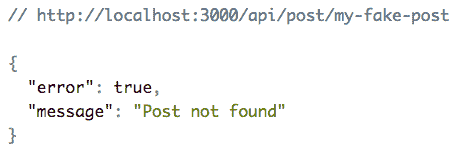

# DELETE 方法端点

`DELETE`方法，顾名思义，用于删除数据库中的行。

**DELETE /post/:slug**。在 Postman 中，我们需要选择`DELETE`方法，并在 URL 中传递要删除的帖子的 slug。例如，让我们删除 my-blog-post-2。如果删除成功删除，您应该收到一个带有已删除节点值为 true 的响应：

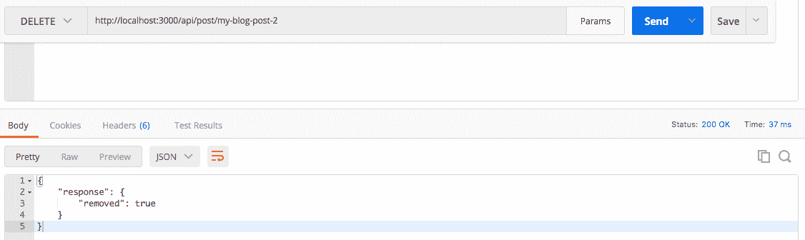

如果要验证帖子是否已删除，可以再次转到`/posts`端点，您将看到它不再在 JSON 中：

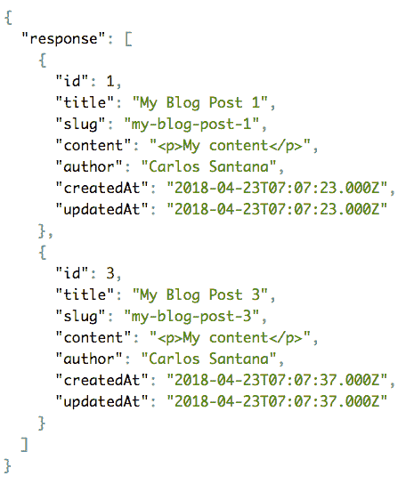

# PUT 方法端点

最后一种方法是`PUT`，通常用于更新数据库中的一行。

`PUT /post/:slug`

在 Postman 中，您首先需要选择 PUT 方法，然后选择要编辑的帖子的 URL。让我们编辑 my-blog-post-3；因此 URL 将是`http://localhost:3000/api/post/my-blog-post-3`。在标题选项卡中，您需要添加与 POST 方法相同的`Content-Type`标题，值为`application/x-www-form-urlencoded`。最后一部分是 Body 选项卡，您可以在其中发送要替换的新数据，例如新标题和新内容：

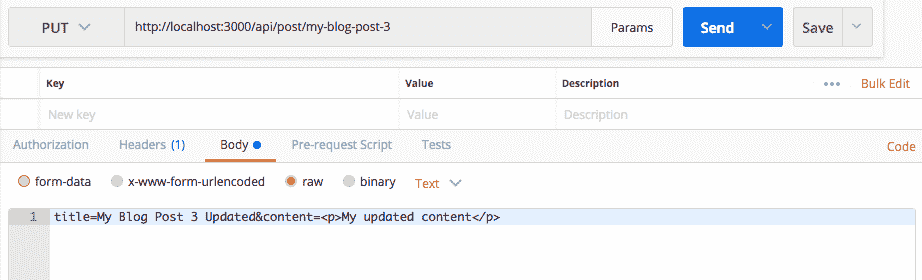

如果一切正常，您应该收到此响应：

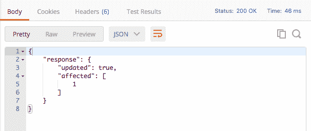

同样，如果要验证帖子是否已正确更新，请在浏览器中转到`/posts`端点：

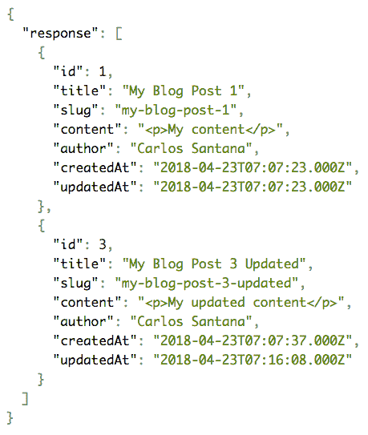

如您所见，帖子标题、内容和 slug 已正确更新。

# 添加访问令牌以保护我们的 API

我们在最后两个示例中创建的 API 是公开的。这意味着每个人都可以访问并从我们的服务器获取信息，但如果您想在 API 上添加安全层并获取平台上注册用户的信息，该怎么办？我们需要添加访问令牌验证来保护我们的 API，为此，我们必须使用**JSON Web Tokens**（**JWT**）。

# 准备工作

对于这个示例，您需要为 Node.js 安装 JWT：

```jsx
    npm install jsonwebtoken
```

# 操作步骤...

我们将主要使用我们为 MySQL 示例创建的相同代码，并添加一个安全层来验证我们的访问令牌：

1.  我们需要做的第一件事是修改我们的配置文件（`config/index.js`），添加一个安全节点，其中包含我们将用来创建令牌的`secretKey`，并添加令牌的过期时间：

```jsx
 export default {
    db: {
      dialect: 'mysql', // The database engine you want to use
      host: 'localhost', // Your host, by default is localhost
      database: 'blog', // Your database name
      user: 'root', // Your MySQL user, by default is root
      password: '123456' // Your MySQL password
    },
    security: {
      secretKey: 'C0d3j0bs', // Secret key
      expiresIn: '1h' // Expiration can be: 30s, 30m, 1h, 7d, etc.
    }
  };
```

文件：config/index.js

1.  下一步是在我们模型文件夹中创建一个`db.js`文件，以分离我们的数据库连接并在我们的模型之间共享它。以前，我们只有博客模型，但现在我们也要创建一个用户模型文件：

```jsx
  // Configuration
  import config from '../config';
  import Sequelize from 'sequelize';

  export const db = new Sequelize(
    config.db.database, 
    config.db.user,
    config.db.password, 
    {
      host: config.db.host,
      dialect: config.db.dialect,
      operatorsAliases: false
    }
  );
```

文件：models/db.js

1.  现在我们需要为用户创建一个表，并保存用户的记录：

```jsx
    CREATE TABLE users (
      id int(11) UNSIGNED NOT NULL AUTO_INCREMENT,
      username varchar(255) NOT NULL,
      password varchar(255) NOT NULL,
      email varchar(255) NOT NULL,
      fullName varchar(255) NOT NULL,
      PRIMARY KEY (`id`)
    );
```

1.  我们可以使用这个命令插入一个用户，更改用户名和密码。在这个示例中，我们将使用 SHA1 算法来加密我们的密码：

```jsx
 INSERT INTO users (id, username, password, email, fullName) 
    VALUES (
      NULL, 
      'czantany', 
 SHA1('123456'), 
      'carlos@milkzoft.com', 
      'Carlos Santana'
    );

    // The SHA1 hash generated for the 123456 password is      
 // 7c4a8d09ca3762af61e59520943dc26494f8941b
```

1.  在我们创建了用户表并有了注册用户之后，让我们创建我们的用户模型，其中包含一个`login`方法：

```jsx
  // Dependencies
  import Sequelize from 'sequelize';

  // Db Connection
  import { db } from './db';

  // This will remove the extra response
  const queryType = {
    type: Sequelize.QueryTypes.SELECT
  };

  // Login
  export function login(username, password, callback) {
    db.query(`
      SELECT id, username, email, fullName
      FROM users
      WHERE username = '${username}' AND password = '${password}'
    `, queryType).then(data => callback(data));
  }
```

文件：models/user.js

1.  下一步是修改我们的 API 控制器，添加一个`login`端点来生成我们的令牌，并添加一个验证令牌的函数。然后我们将保护我们的一个端点（`/api/posts`）：

```jsx
  // Dependencies
  import express from 'express';
  import jwt from 'jsonwebtoken';

  // Models
  import {
    createPost,
    findAllPosts,
    findBySlug,
    removePost,
    updatePost
  } from '../models/blog';
  import { login } from '../models/user';

  // Configuration
  import config from '../config';

  // Extracting the secretKey and the expiresIn
  const { security: { secretKey, expiresIn } } = config;

  const router = express.Router();

  // Token Validation
  const validateToken = (req, res, next) => {
    if (req.headers['access-token']) {
      // The token should come as 'Bearer <access-token>'
      req.accessToken = req.headers['access-token'].split(' ')[1];

 // We just need the token that's why we split the string by       
     //space 
      // and we got the token in the position 1 of the array 
      //generated 
      // by the split method.
      return next();
    } else {
      res.status(403).send({ 
 error: 'You must send an access-token header...'
      });
    }
  }

  // POST login - This will generate a new token
  router.post('/login', (req, res) => {
    const { username, password } = req.body;

    login(username, password, data => {
      if (Object.keys(data).length === 0) {
        res.status(403).send({ error: 'Invalid login' });
      }

      // Creating the token with the 
      // user data + secretKey + expiration time
      jwt.sign({ data }, secretKey, { expiresIn }, (error, 
 accessToken) => {
        res.json({
          accessToken
        });
      });
    });
  });

  // We pass validateToken as middleware and then we verify with   
  //  req.accessToken
    router.get('/posts', validateToken, (req, res, next) => {
      jwt.verify(req.accessToken, secretKey, (error, userData) => {
        if (error) {
          console.log(error);
          res.status(403).send({ error: 'Invalid token' });
        } else {
          findAllPosts(posts => {
            res.json({
              response: posts,
              user: userData
            });
          });
        }
      });
    });

    // From here all the others endpoints are public...
    router.get('/post/:slug', (req, res, next) => {
      const { params: { slug } } = req;

      findBySlug(slug, singlePost => {
        console.log('single', singlePost);
        if (!singlePost || singlePost.length === 0) {
          res.send({
            error: true,
            message: 'Post not found'
          });
        } else {
          res.json({
            response: [singlePost]
          });
        }
      });
    });

 // POST Methods
    router.post('/post', (req, res, next) => {
      const { title, content } = req.body;

      createPost(title, content, (data, error = false) => {
        if (error) {
          res.json({
            error: true,
            details: error
          });
        } else {
          res.json({
            response: {
              saved: true,
              post: data
            }
          });
        }
      });
    });

    // DELETE Methods
    router.delete('/post/:slug', (req, res, next) => {
      const { params: { slug } } = req;

      removePost(slug, (removed, error) => {
        if (error) {
          res.json({
            error: true,
            message: 'There was an error trying to remove this 
            post...'
          });
        } else {
          res.json({
            response: {
              removed: true
            }
          });
        }
      });
    });

    // PUT Methods
    router.put('/post/:slug', (req, res, next) => {
      const { params: { slug }, body: { title, content } } = req;

      updatePost(slug, title, content, (affected, error) => {
        if (error) {
          res.json({
            error: true,
            message: 'There was an error trying to update the post'
          });
        } else {
          res.json({
            response: {
              updated: true,
              affected
            }
          });
        }
      });
    });

 export default router;
```

文件：controllers/api.js

# 工作原理...

如果你想测试 API 的安全性，首先需要执行*POST* `/api/login`方法来获取一个新的令牌。和以前一样，我们可以使用 Postman 来做这个。

您需要选择 POST 方法，然后编写 URL `http://localhost:3000/api/login`，并添加一个`Content-Type`头，值为`application/x-www-form-urlencoded`，以便通过请求体发送数据：

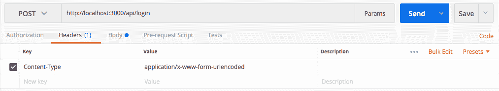

然后，在*Body*选项卡上，我们需要发送我们的数据（用户名和密码），以及我们在数据库中拥有的用户信息。在这里，我们手动进行这个过程，但最终，这些信息应该来自您网站上的登录表单：

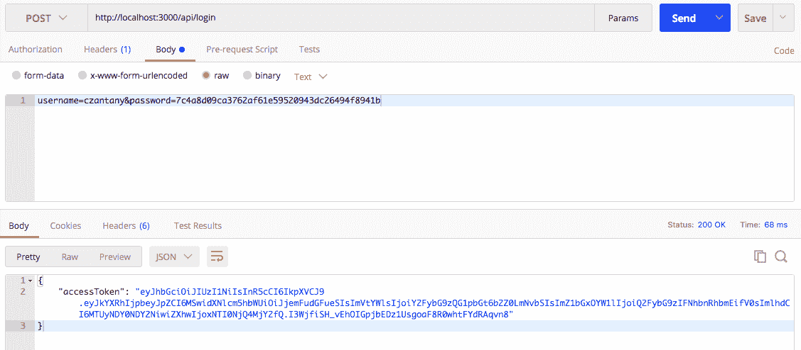

如果您为用户传递了正确的信息，您应该会得到`accessToken`，但如果由于某种原因登录失败或用户或密码不正确，您将收到类似于此的错误：

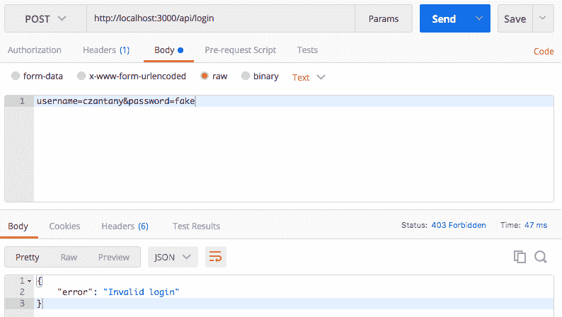

一旦您获得新的`accessToken`（请记住，此令牌仅在 1 小时内有效；在过期时间后，您将需要创建一个新的），您需要复制该令牌，然后将其作为标头（作为访问令牌的格式`Bearer <access-token>`）发送到我们的受保护端点(`/api/posts`)。

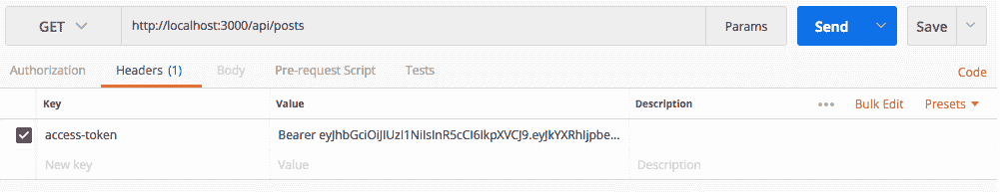

非常重要的是，您发送正确的格式，Bearer[空格]<access-token>。请记住，我们使用空格来获取令牌。如果您一切都做对了，您应该会收到来自服务的响应，其中包含博客的帖子和用户信息（这可能在不同的端点，但在此示例中，我只是在此处添加了用户数据）。

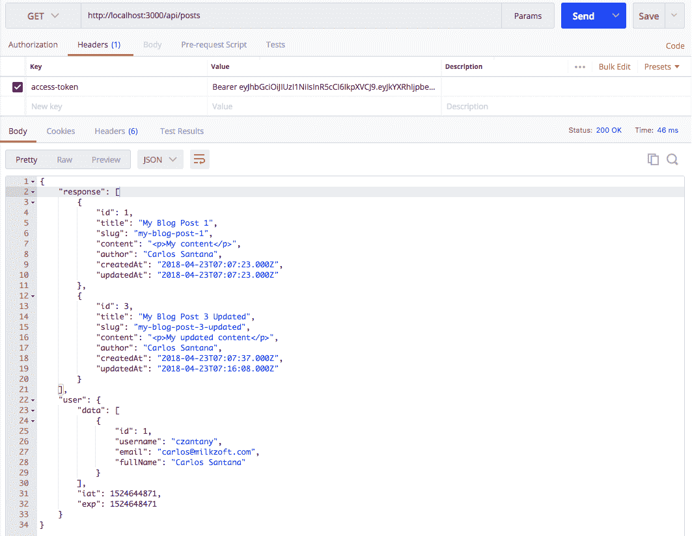

如您所见，在用户数据中，我们从数据库获取信息，还有两个新字段：`iat`（发行时间）和`exp`（令牌过期）。但如果我们的令牌过期或用户发送了不正确的访问令牌会发生什么呢？在这些情况下，我们将返回一个错误：

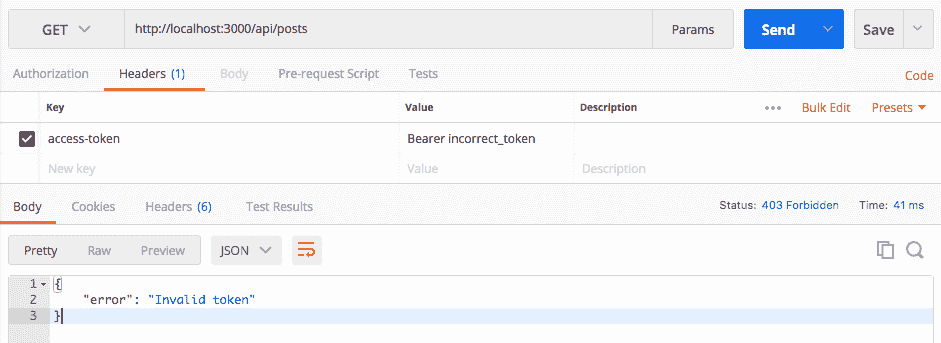

# 还有更多...

如您所见，令牌验证易于实现，并在处理私人数据时为我们的 API 增加了安全层。您可能会问最佳保存生成的访问令牌的位置在哪里。有些人将访问令牌保存在 cookie 或会话中，但我不建议这样做，因为存在一些相关的安全问题。我的建议是只在用户连接到网站时使用本地存储来保存它，然后在用户关闭浏览器后将其删除，但这将取决于您想要为平台添加的安全类型。
