# 第十章：Webpack 4.x 的掌握

在本章中，将涵盖以下配方：

+   Webpack 4 零配置

+   将 React 添加到 Webpack 4

+   添加 Webpack Dev Server 和 Sass、Stylus 或 LessCSS 与 React

+   Webpack 4 优化 - 拆分捆绑包

+   使用 React/Redux 和 Webpack 4 实现 Node.js

# 介绍

来自 Webpack 4 官方网站([`webpack.js.org`](https://webpack.js.org))：

"Webpack 是现代 JavaScript 应用程序的*静态模块打包工具*。当 webpack 处理你的应用程序时，它在内部构建一个依赖图，映射了你的项目需要的每个模块，并生成一个或多个捆绑包。自从 4 版本以来，webpack 不需要配置文件来捆绑你的项目。尽管如此，它可以非常灵活地配置以更好地满足你的需求。"

# Webpack 4 零配置

Webpack 4 默认情况下不需要配置文件。在旧版本中，你必须有一个配置文件。如果你需要根据项目的需要自定义 Webpack 4，你仍然可以创建一个配置文件，这将更容易配置。

# 准备就绪

为此，你需要创建一个新的文件夹并安装以下包：

```jsx
mkdir webpack-zero-configuration
cd webpack-zero-configuration
npm install --save-dev webpack webpack-cli
```

在你的 Webpack 文件夹中，你需要创建一个`package.json`文件，为此，你可以使用以下命令：

```jsx
npm init -y
```

# 如何做...

现在让我们开始配置：

1.  打开`package.json`，并添加一个新的`build`脚本：

```jsx
  {
    "name": "webpack-zero-configuration",
    "version": "1.0.0",
    "description": "Webpack 4 Zero Configuration",
    "main": "index.js",
    "scripts": {
      "build": "webpack"
    },
    "author": "Carlos Santana",
    "license": "MIT",
    "devDependencies": {
      "webpack": "⁴.6.0",
      "webpack-cli": "².0.15"
    }
  }
```

文件：package.json

1.  在你的终端中运行构建脚本：

```jsx
    npm run build
```

1.  你会看到这个错误：

！[](assets/721d0b30-cbc6-4a67-9104-b072e2f2ec3e.png)*终端中出现的错误看起来像这样***:** *ERROR in Entry module not found: Error: Can't resolver'./src' in '/Users/czantany/projects/React16Cookbook/Chapter9/Recipe1/webpack-zero-configuration'*

1.  因为我们现在使用的是 Webpack 4，默认情况下，主入口点是`src/index.js`。让我们创建这个文件，以便能够构建我们的第一个捆绑包：

```jsx
    console.log('Index file...');
```

文件：src/index.js

1.  如果你重新运行构建脚本，你会看到 Webpack 创建了一个名为`main.js`的新捆绑文件，放在`dist`文件夹中（同样，默认情况下）：

！[](assets/48a422a9-37fd-4fca-9fa9-800767e1dff8.png)警告让我们知道我们可以在生产或开发模式之间进行选择

1.  终端中有一个警告消息：未设置`mode`选项，webpack 将回退到生产模式。将`mode`设置为`development`或`production`以启用每个环境的默认值。您还可以将其设置为`none`以禁用任何默认行为。您可以在 https://webpack.js.org/concepts/mode/了解更多信息。默认情况下，生产模式已启用，这就是为什么我们的捆绑包（`dist/main.js`）被缩小和混淆的原因，类似于以下内容：

```jsx
    !function(e){var n={};function r(t){if(n[t])return n[t].exports;var o=n[t]={i:t,l:!1,exports:{}};return e[t].call(o.exports,o,o.exports,r),o.l=!0,o.exports}r.m=e,r.c=n,r.d=function(e,n,t){r.o(e,n)||Object.defineProperty(e,n,{configurable:!1,enumerable:!0,get:t})},r.r=function(e){Object.defineProperty(e,"__esModule",{value:!0})},r.n=function(e){var n=e&&e.__esModule?function(){return e.default}:function(){return e};return r.d(n,"a",n),n},r.o=function(e,n){return Object.prototype.hasOwnProperty.call(e,n)},r.p="",r(r.s=0)}([function(e,n){console.log("Index file...")}]);
```

文件：dist/main.js

# 它是如何工作的...

Webpack 4 有两种模式：生产模式和开发模式。在 Webpack 3 中，您需要为每种模式创建一个配置文件；现在您只需一行代码就可以得到相同的结果。让我们添加一个脚本，以便使用开发模式启动我们的应用程序：

```jsx
  {
    "name": "webpack-zero-configuration",
    "version": "1.0.0",
    "description": "Webpack 4 Zero Configuration",
    "main": "index.js",
    "scripts": {
      "build-development": "webpack --mode development",
      "build": "webpack --mode production"
    },
    "author": "Carlos Santana",
    "license": "MIT",
    "devDependencies": {
      "webpack": "⁴.6.0",
      "webpack-cli": "².0.15"
    }
  }
```

文件：package.json

如果运行`npm run build-development`命令，现在您会发现捆绑包根本没有被压缩：

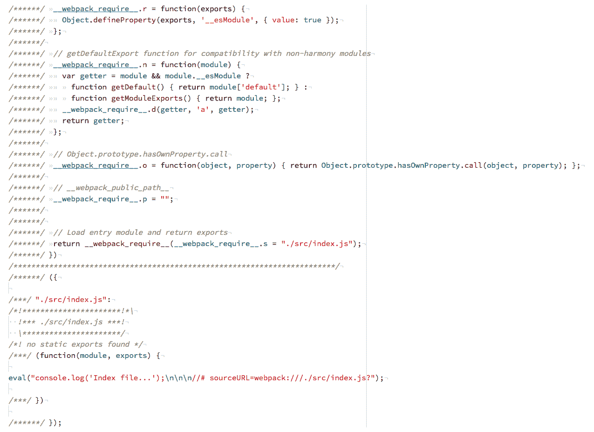文件：dist/main.js

正如您所看到的，默认情况下，Webpack 4 在生产模式下会对代码进行缩小，并对该环境进行一些优化，在 Webpack 3 中，这个配置必须在配置文件中手动完成。

# 还有更多...

如果您想要在 Webpack 4 中使用 Babel 来转译 ES6 代码，您需要使用`babel-loader`，并且可能需要安装以下软件包：

```jsx
npm install --save-dev babel-loader babel-core babel-preset-env
```

1.  在项目的根目录创建一个.babelrc 文件，然后添加以下代码：

```jsx
    {
      "presets": ["env"]
    }
```

文件：.babelrc

1.  使用`webpack.config.js`文件添加我们的`babel-loader`：

```jsx
  const webpackConfig = {
    module: {
      rules: [
        {
          test: /\.js$/,
          exclude: /node_modules/,
          use: 'babel-loader'
        }
      ]
    }
  };

  module.exports = webpackConfig;
```

文件：webpack.config.js

1.  创建一个名为`src/numbers.js`的文件，并将其导入到我们的`src/index.js`中以测试我们的`babel-loader`：

```jsx
    export const numbers = ['one', 'two', 'three'];
```

文件：src/numbers.js

1.  在我们的`index.js`文件中，做以下操作：

```jsx
  import { numbers } from './numbers';
  numbers.forEach(number => console.log(number));
```

文件：src/index.js

1.  运行`npm run build`脚本，如果一切正常，您应该会得到这个结果：

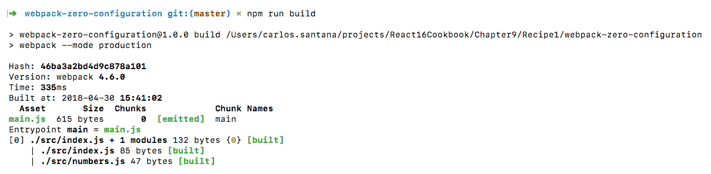

1.  还可以直接在终端中使用`babel-loader`，而无需配置文件，为此，我们需要使用`--module-bind`标志将扩展名绑定到加载器：

```jsx
  {
    "name": "webpack-zero-configuration",
    "version": "1.0.0",
    "description": "Webpack 4 Zero Configuration",
    "main": "index.js",
    "scripts": {
      "build-development": "webpack --mode development --module-bind 
     js=babel-loader",
      "build": "webpack --mode production --module-bind js=babel-
       loader"
    },
    "author": "Carlos Santana",
    "license": "MIT",
    "devDependencies": {
      "babel-core": "⁶.26.3",
      "babel-loader": "⁷.1.4",
      "babel-preset-env": "¹.6.1",
      "webpack": "⁴.6.0",
      "webpack-cli": "².0.15"
    }
  }
```

1.  还有更多绑定模块的标志（如果您想了解更多关于 Webpack CLI 的信息，可以访问官方网站[`webpack.js.org/api/cli/`](https://webpack.js.org/api/cli/)）：

+   `--module-bind-post`：将扩展名绑定到后置加载器

+   `--module-bind-pre`：将扩展名绑定到前置加载器

# 向 Webpack 4 添加 React

在这个配方中，我们将实现 React 与 Webpack 4，但我们将使用一个名为`html-webpack-plugin`的插件来生成我们的`index.html`文件以渲染我们的 React 应用程序。在下一个配方中，我们将集成 Node.js，以在渲染 HTML 代码之前在服务器端具有更多的灵活性。

# 准备工作

对于这个配方，你需要安装以下包：

```jsx
    npm install react react-dom babel-preset-react
```

# 如何做...

以下是将 React 添加到 Webpack 4 的步骤：

1.  使用上一个配方的相同代码，创建一个`.babelrc`文件并添加一些预设：

```jsx
  {
    "presets": [
      "env",
      "react"
    ]
  }
```

文件：.babelrc

1.  在我们的`webpack.config.js`文件中，我们需要在我们的`babel-loader`中添加`.jsx`扩展名，以便能够将`babel-loader`应用到我们的 React 组件：

```jsx
  const webpackConfig = {
    module: {
      rules: [
        {
          test: /\.(js|jsx)$/,
          exclude: /node_modules/,
          use: 'babel-loader'
        }
      ]
    }
  };

  module.exports = webpackConfig;
```

文件：webpack.config.js

1.  在我们将`.jsx`扩展名添加到我们的`babel-loader`之后，我们需要创建`src/components/App.jsx`文件：

```jsx
  // Dependencies
  import React from 'react';

  // Components
  import Home from './Home';

  const App = props => (
    <div>
      <Home />
    </div>
  );

  export default App;
```

文件：src/components/App.jsx

1.  创建`Home`组件：

```jsx
  import React from 'react';

  const Home = () => <h1>Home</h1>;

  export default Home;
```

文件：src/components/Home/index.jsx

1.  在我们的主`index.js`文件中，我们需要包括`react`，从`react-dom`中的`render`方法和我们的`App`组件，并渲染应用程序：

```jsx
  // Dependencies
  import React from 'react';
  import { render } from 'react-dom';

  // Components
  import App from './components/App';

  render(<App />, document.querySelector('#root'));
```

文件：src/index.jsx

1.  你可能会想知道`#root` div 在哪里，因为我们还没有创建`index.html`。在这个特定的配方中，我们将使用`html-webpack-plugin`插件来处理我们的 HTML：

```jsx
    npm install --save-dev html-webpack-plugin
```

1.  打开你的`webpack.config.js`文件。我们需要添加我们的`html-webpack-plugin`并在配置文件中创建一个插件节点：

```jsx
  const HtmlWebPackPlugin = require('html-webpack-plugin');

  const webpackConfig = {
    module: {
      rules: [
        {
          test: /\.(js|jsx)$/,
          exclude: /node_modules/,
          use: 'babel-loader'
        }
      ]
    },
    plugins: [
      new HtmlWebPackPlugin({
        title: 'Codejobs',
        template: './src/index.html',
        filename: './index.html'
      })
    ]
  };

  module.exports = webpackConfig;
```

文件：webpack.config.js

1.  在你的`src`目录级别创建`index.html`模板：

```jsx
  <!DOCTYPE html>
  <html>
    <head>
      <meta charset="UTF-8">
      <title><%= htmlWebpackPlugin.options.title %></title>
    </head>
    <body>
      <div id="root"></div>
    </body>
  </html>
```

文件：src/index.html

# 它是如何工作的...

正如你所看到的，我们可以使用`htmlWebpackPlugin.options`对象从插件中注入变量，在`<%=`和`%>`分隔符之间。现在是测试我们应用程序的时候了，尝试运行`npm run build`命令：

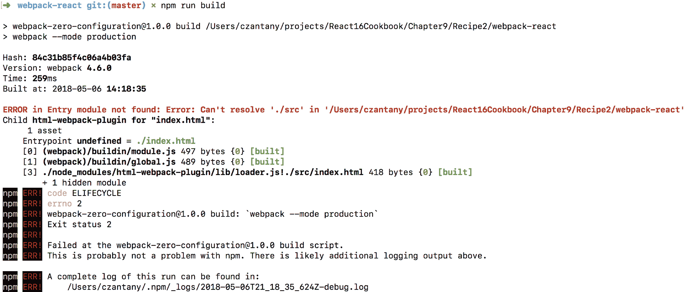

**大红色错误：** 无法解析`./src`目录，但这是什么意思？你还记得我们如何在文件中使用`.jsx`扩展名吗？即使我们将该扩展名添加到了我们的`babel-loader`规则中，为什么它还是不起作用呢？这是因为我们必须在配置中添加一个解析节点，并指定我们想要支持的文件扩展名。否则，我们只能使用`.js`扩展名：

```jsx
  const HtmlWebPackPlugin = require('html-webpack-plugin');

  const webpackConfig = {
    module: {
      rules: [
        {
          test: /\.(js|jsx)$/,
          exclude: /node_modules/,
          use: 'babel-loader'
        }
      ]
    },
    plugins: [
      new HtmlWebPackPlugin({
        title: 'Codejobs',
        template: './src/index.html',
        filename: './index.html'
      })
    ],
    resolve: {
      extensions: ['.js', '.jsx']
    }
  };

 module.exports = webpackConfig;
```

文件：webpack.config.js

如果你再次运行`npm run build`，现在应该可以工作了：

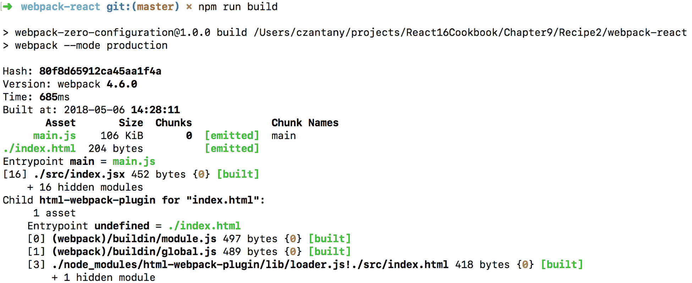

运行该命令后，您会看到在 dist 目录中有两个文件：`index.html`和`main.js`。如果您用 Chrome 打开您的`index.html`文件，您应该会看到以下结果：

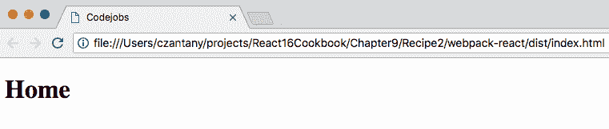

我们可以构建我们的捆绑包，但它是 100%静态的。在下一个教程中，我们将添加 Webpack Dev Server 来在实际服务器上运行我们的 React 应用程序，并在每次更改时刷新服务器。

# 还有更多...

我更喜欢在所有项目中使用 ES6 代码，甚至在配置中，我喜欢将我的 Webpack 配置分成单独的文件，以便更好地组织和更容易理解配置。如果你以前使用过 Webpack，你就知道`webpack.config.js`文件可能会很大，很难维护，所以让我解释一下如何做到这一点：

1.  将`webpack.config.js`文件重命名为`webpack.config.babel.js`。当在`.js`文件上添加`.babel`后缀时，这将由 Babel 自动处理。

1.  让我们将当前的 ES5 代码迁移到 ES6：

```jsx
  import HtmlWebPackPlugin from 'html-webpack-plugin';

  export default {
    module: {
      rules: [
        {
          test: /\.(js|jsx)$/,
          exclude: /node_modules/,
          use: 'babel-loader'
        }
      ]
    },
    plugins: [
      new HtmlWebPackPlugin({
        title: 'Codejobs',
        template: './src/index.html',
        filename: './index.html'
      })
    ],
    resolve: {
      extensions: ['.js', '.jsx']
    }
  };
```

文件：webpack.config.babel.js

1.  创建一个名为`webpack`的文件夹，里面再创建一个名为`configuration`的文件夹。

1.  为我们 Webpack 配置的每个节点创建一个单独的文件并导出它。例如，让我们从为我们的节点模块创建一个文件开始，所以你应该叫`module.js`：

```jsx
  export default {
    rules: [
      {
        test: /\.(js|jsx)$/,
        exclude: /node_modules/,
        use: 'babel-loader'
      }
    ]
  };
```

文件：webpack/configuration/module.js

1.  让我们为我们的插件创建一个文件（`plugins.js`）：

```jsx
  import HtmlWebPackPlugin from 'html-webpack-plugin';

 const plugins = [
    new HtmlWebPackPlugin({
      title: 'Codejobs',
      template: './src/index.html',
      filename: './index.html'
    })
  ];

  export default plugins;
```

文件：webpack/configuration/plugins.js

1.  将我们的插件数组添加到一个常量中非常有用，因为这样我们可以根据环境（开发或生产）添加更多的插件，所以现在你可以以条件方式添加插件（使用 push）。

1.  最后一个节点是 resolve：

```jsx
  export default {
    extensions: ['.js', '.jsx']
  }
```

文件：webpack/configuration/resolve.js

1.  我们可以直接导入我们的文件，但我更喜欢使用一个`index.js`文件并导出所有文件。这样，我们只需要在我们的`webpack.config.babel.js`文件中导入我们需要的对象：

```jsx
 // Configuration
  import module from './module';
  import plugins from './plugins';
  import resolve from './resolve';

  export {
    module,
    plugins,
    resolve
  };
```

文件：webpack/configuration/index.js

1.  我们的`webpack.config.babel.js`将非常干净：

```jsx
  import {
    module,
    plugins,
    resolve
  } from './webpack/configuration';

  export default {
    module,
    plugins,
    resolve
  };
```

文件：webpack.config.babel.js

# 使用 Webpack Dev Server 和 React 添加 Sass、Stylus 或 LessCSS

在上一个教程中，我们将 React 添加到了 Webpack 4 中，并且拆分了我们的 Webpack 配置，但最终，我们只能构建我们的捆绑包并将应用程序作为静态页面运行。在这个教程中，我们将添加 Webpack Dev Server 来在实际服务器上运行我们的 React 应用程序，并在每次更改时重新启动服务器。此外，我们将实现诸如 Sass、Stylus 和 LessCSS 之类的 CSS 预处理器。

# 准备工作

对于这个教程，您需要安装以下软件包：

```jsx
    npm install webpack-dev-server **css-loader extract-text-webpack-plugin@v4.0.0-beta.0 style-loader**
```

如果要在项目中使用 Sass，必须安装：

```jsx
    npm install sass-loader **node-sass** 
```

如果您更喜欢 Stylus，您将需要以下内容：

```jsx
    npm install stylus-loader stylus
```

或者，如果您喜欢 LessCSS，请安装：

```jsx
    npm install less-loader less
```

# 如何做...

我们将首先添加 Webpack Dev Server：

1.  安装了`webpack-dev-server`依赖项后，我们需要在`package.json`中添加一个新的脚本来启动应用程序：

```jsx
    "scripts": {
      "start": "webpack-dev-server --mode development --open",
      "build-development": "webpack --mode development",
      "build": "webpack --mode production"
    }
```

文件：package.json

1.  如您所知，`--mode`标志指定我们想要的模式（默认为生产模式），`--open`标志在启动应用程序时打开浏览器。现在您可以使用`npm start`命令运行应用程序：

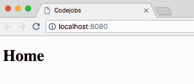

1.  您的应用程序是使用端口 8080 打开的，这是`webpack-dev-server`的默认端口。如果要更改它，可以使用`--port`标志指定要使用的端口：

```jsx
"start": "webpack-dev-server --mode development --open --port 9999"
```

1.  `webpack-dev-server`的很酷的一点是，如果更新任何组件，您将立即看到更改的反映。例如，让我们修改我们的`Home`组件：

```jsx
  import React from 'react';

  const Home = () => <h1>Updated Home</h1>;

  export default Home;
```

文件：src/components/Home/index.jsx

1.  您可以在同一页上看到反映的更改，而无需手动刷新页面：

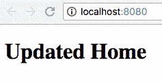

1.  让我们向我们的项目添加 Sass、Stylus 或 LessCSS，以在应用程序中添加一些样式。您必须编辑位于`webpack/configuration/module.js`的文件，并添加`style-loader`、`css-loader`以及我们想要的 sass（`sass-loader`）、stylus（`stylus-loader`）或 less（`less-loader`）加载器：

```jsx
  export default {
    rules: [
      {
        test: /\.(js|jsx)$/,
        exclude: /node_modules/,
        use: 'babel-loader'
      },
      {
        test: /\.scss$/, // Can be: .scss or .styl or .less
        use: [
          {
            loader: 'style-loader'
          },
          {
            loader: 'css-loader',
            options: {
              // Enables CSS Modules
              modules: true, 
              // Number of loaders applied before CSS loader
              importLoaders: 1, 
              // Formatting CSS Class name
              localIdentName: '[name]_[local]_[hash:base64]', // Enable/disable sourcemaps
              sourceMap: true, 
              // Enable/disable minification
              minimize: true 
            }
          },
          {
            loader: 'sass-loader' // sass-loader or stylus-loader
                                  // or less-loader
          }
        ]
      }
    ]
  };
```

文件：webpack/configuration/module.js

1.  使用 Sass，我们可以创建 Home.scss 文件来添加一些样式：

```jsx
  $color: red;
  .Home {
    color: $color;
  }
```

文件：src/components/Home/Home.scss

1.  在 Home 组件中，您可以像这样导入 Sass 文件：

```jsx
  import React from 'react';
  import styles from './Home.scss'; // For Sass
  // import styles from './Home.styl'; // For Stylus
  // import styles from './Home.less'; // For Less

  const Home = () => <h1 className={styles.Home}>Updated Home</h1>;

 export default Home;
```

文件：src/component/Home/index.jsx

1.  每个导入行都是为不同的预处理器。使用您想要的行并删除其他行。Sass 生成这种样式：


1.  如果你想使用 Stylus，在`Home.styl`文件中创建并在 Webpack 配置的`module.js`文件中更改配置：

```jsx
  $color = green

  .Home
    color: $color
```

文件：src/components/Home/Home.styl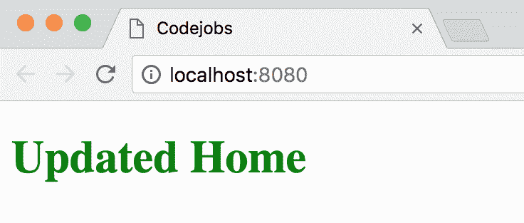

1.  如果你想使用 Less CSS，在 Webpack 配置中做必要的更改，然后使用这个文件：

```jsx
 @color: blue;

 .Home {
    color: @color;
  }
```

文件：src/components/Home/Home.less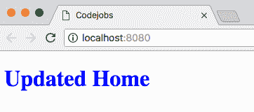

# 它是如何工作的...

如果你好奇的话，你可能已经尝试过查看样式表是如何渲染的，以及我们的 HTML 中的类名是什么。如果你检查网站，你会看到类似这样的东西：

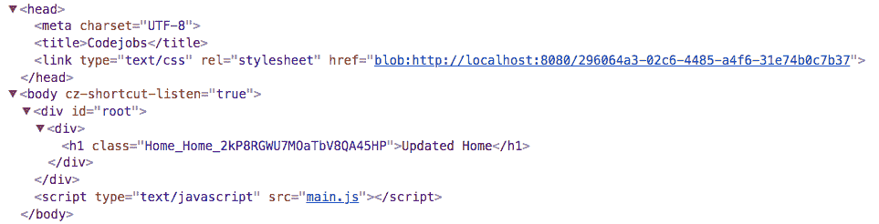

动态地注入了一个包含我们编译后的 css 的临时 URL 的`<link>`标签，然后我们的类名是"Home_Home_2kP..."，这是因为我们的配置：`localIdentName: '[name]_[local]_[hash:base64]'`。通过这样做，我们创建了隔离的样式，这意味着如果我们使用相同的名称，我们永远不会影响任何其他类。

# 还有更多...

让我们实现 CSS 预处理器，比如 Sass、Stylus 和 LessCSS：

1.  如果你想将你的 CSS 代码提取到一个`style.css`文件中，并在生产模式下压缩代码，你可以使用`extract-text-webpack-plugin`包：

```jsx
   npm install extract-text-webpack-plugin@v4.0.0-beta.0
```

1.  我们需要将这个添加到我们的 Webpack 插件中：

```jsx
  import HtmlWebPackPlugin from 'html-webpack-plugin';
  import ExtractTextPlugin from 'extract-text-webpack-plugin';

  const isProduction = process.env.NODE_ENV === 'production';

  const plugins = [
    new HtmlWebPackPlugin({
      title: 'Codejobs',
      template: './src/index.html',
      filename: './index.html'
    })
  ];

  if (isProduction) {
    plugins.push(
      new ExtractTextPlugin({
        allChunks: true,
        filename: './css/[name].css'
      })
    );
  }

 export default plugins;
```

文件：webpack/configuration/plugins.js

1.  正如你所看到的，我只有在生产模式下才会向插件数组中添加内容。这意味着我们需要在 package.json 中创建一个新的脚本来指定何时使用生产模式：

```jsx
    "scripts": {
      "start": "webpack-dev-server --mode development --open",
      "start-production": "NODE_ENV=production webpack-dev-server --
      mode production",
      "build-development": "webpack --mode development",
      "build": "webpack --mode production"
    }
```

1.  在你的终端中运行`npm run start-production`，你就可以以生产模式启动了。

1.  你可能会遇到一些错误，因为我们还需要向我们的模块节点添加一个 Extract Text 插件的规则：

```jsx
  import ExtractTextPlugin from 'extract-text-webpack-plugin';

  const isProduction = process.env.NODE_ENV === 'production';

  const rules = [
    {
      test: /\.(js|jsx)$/,
      exclude: /node_modules/,
      use: 'babel-loader'
    }
  ];

  if (isProduction) {
    rules.push({
      test: /\.scss/,
      use: ExtractTextPlugin.extract({
        fallback: 'style-loader',
        use: [
          'css-loader?minimize=true&modules=true&localIdentName=
          [name]_[local]_[hash:base64]',
          'sass-loader'
        ]
      })
    });
  } else {
    rules.push({
      test: /\.scss$/, // .scss - .styl - .less
      use: [
        {
          loader: 'style-loader'
        },
        {
          loader: 'css-loader',
          options: {
            modules: true,
            importLoaders: 1,
            localIdentName: '[name]_[local]_[hash:base64]',
            sourceMap: true,
            minimize: true
          }
        },
        {
          loader: 'sass-loader' // sass-loader, stylus-loader or 
                                //less-loader
        }
      ]
    });
  }

  export default {
    rules
  };
```

1.  我们只在生产环境中使用 Extract Text 插件。对于任何其他环境，我们像以前一样直接使用`style-loader`、`css-loader`和`sass-loader`。这就是为什么我喜欢将 Webpack 配置拆分成更小的文件，正如你所看到的，有些文件可能会很大，所以这有助于我们更有条理。如果你用`npm run start-production`启动生产模式，你会看到这个 CSS：

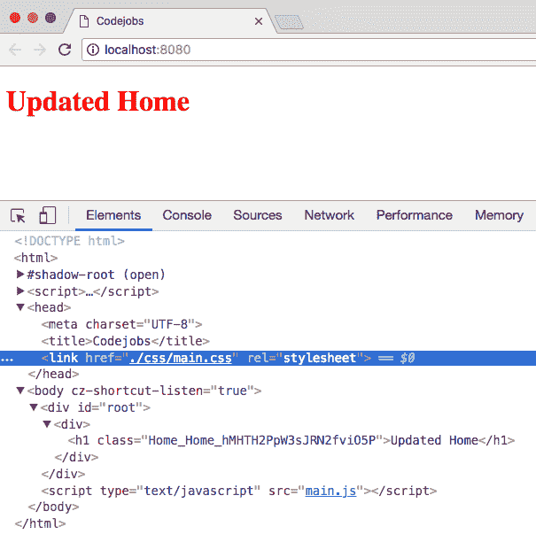

# Webpack 4 优化 - 拆分捆绑包

Webpack 4 已经为生产模式提供了一些优化预设，比如代码最小化（之前是使用 UglifyJS 实现的），但是我们还可以使用更多的东西来提高我们应用的性能。在这个教程中，我们将学习如何拆分捆绑包（供应商和应用程序捆绑包），添加源映射，并实现*BundleAnalyzerPlugin*。

# 准备就绪

对于这个教程，我们需要安装以下包：

```jsx
npm install webpack-bundle-analyzer webpack-notifier
```

# 如何做...

让我们给我们的 Webpack 添加一个源映射：

1.  创建`webpack/configuration/devtool.js`文件：

```jsx
  const isProduction = process.env.NODE_ENV === 'production';

  export default !isProduction ? 'cheap-module-source-map' : 'eval';
```

文件：webpack/configuration/devtool.js

1.  拆分捆绑包（使用新的“优化”Webpack 节点）：一个用于我们的`/node_modules/`，它将是最大的，一个用于我们的 React 应用程序。你需要创建`optimization.js`文件并添加这段代码：

```jsx
 export default {
    splitChunks: {
      cacheGroups: {
        default: false,
        commons: {
          test: /node_modules/,
          name: 'vendor',
          chunks: 'all'
        }
      }
    }
  }
```

文件：webpack/configuration/optimization.js

1.  请记住，你需要把这些新文件添加到`index.js`中：

```jsx
  // Configuration
  import devtool from './devtool';
  import module from './module';
  import optimization from './optimization';
  import plugins from './plugins';
  import resolve from './resolve';

  export {
    devtool,
    module,
    optimization,
    plugins,
    resolve
  };
```

文件：webpack/configuration/index.js

1.  将节点添加到`webpack.config.babel.js`中：

```jsx
  import {
    devtool,
    module,
    optimization,
    plugins,
    resolve
  } from './webpack/configuration';

  export default {
    devtool,
    module,
    plugins,
    optimization,
    resolve
  };
```

文件：webpack.config.babel.js

# 它是如何工作的...

让我们测试一下：

1.  只需用`npm start`运行应用程序。如果你查看 HTML，你会发现它自动注入到`vendor.js`和`main.js`捆绑包中： 

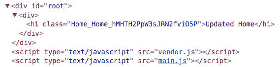

1.  如果你查看网络选项卡，你可以看到文件的大小：


1.  如果你以生产模式运行应用程序，你会注意到捆绑包更小。运行`npm run start-production`命令：

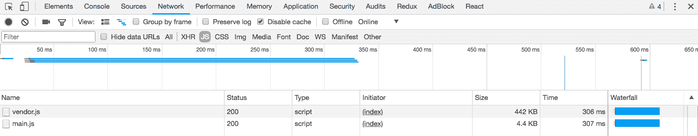

1.  通过这种优化，我们将捆绑包的大小减少了 40%。在下一个教程中，我们将实现 Node.js 与 Webpack 和 React，并且我们将能够应用 GZip 压缩，这将帮助我们进一步减少捆绑包的大小。

1.  `BundleAnalyzer`插件可以帮助我们查看所有包（`node_modules`）和我们组件的大小；这将给我们一个按大小组织的捆绑包的图像（大方块表示大尺寸，小方块表示小尺寸）。我们还可以实现`WebpackNotifierPlugin`插件，这只是一个通知，每当我们的 Webpack 构建时就会显示：

```jsx
  import HtmlWebPackPlugin from 'html-webpack-plugin';
  import ExtractTextPlugin from 'extract-text-webpack-plugin';
  import WebpackNotifierPlugin from 'webpack-notifier';
 import { BundleAnalyzerPlugin } from 'webpack-bundle-analyzer';

  const isProduction = process.env.NODE_ENV === 'production';

  const plugins = [
    new HtmlWebPackPlugin({
      title: 'Codejobs',
      template: './src/index.html',
      filename: './index.html'
    })
  ];

  if (isProduction) {
    plugins.push(
      new ExtractTextPlugin({
        allChunks: true,
        filename: './css/[name].css'
      })
    );
  } else {
    plugins.push(
      new BundleAnalyzerPlugin(),
 new WebpackNotifierPlugin({
 title: 'CodeJobs'
 })
    );
  }

 export default plugins;
```

文件：webpack/configuration/plugins.js

1.  `BundleAnalyzerPlugin`只会在开发模式下执行；如果你启动应用程序（`npm start`），你会看到一个新页面打开，并显示所有安装的包，指定每个包的大小：

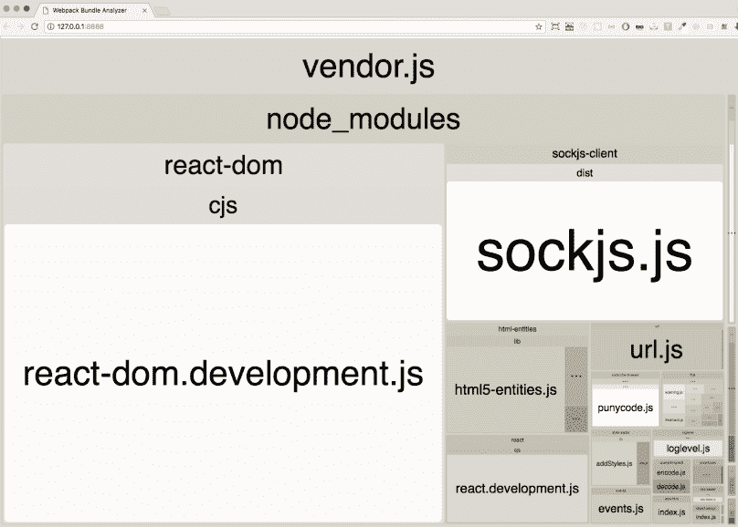这张图片的目的是展示安装包的大小

1.  最大的文件当然是 vendor.js 文件，但我们也可以看到我们的 main.js 组件：

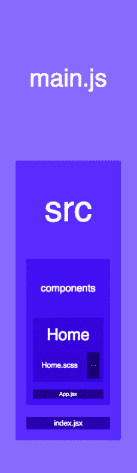

1.  当你启动应用程序时，你可以看到漂亮的通知：

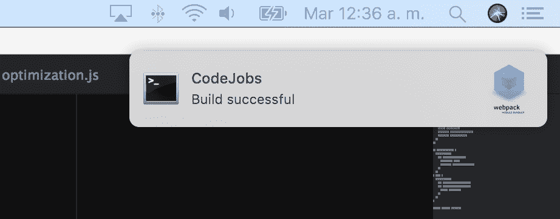

# 使用 Node.js 与 React/Redux 和 Webpack 4

到目前为止，在所有的教程中，我们直接使用了`create-react-app`或 Webpack 4 来使用 React。在这个教程中，我们将使用 Node.js 和 Webpack 4 来实现 React 和 Redux；这将帮助我们拥有更强大的应用程序。

# 准备工作

使用上一个教程的相同代码，你需要安装所有这些包：

```jsx
npm install babel-cli express nodemon react-hot-loader react-router-dom webpack-hot-middleware compression-webpack-plugin react-redux redux
```

# 如何做…

让我们开始实施吧：

1.  在我们的`.babelrc`文件中包含`react-hot-loader`插件，只用于开发环境：

```jsx
  {
    "presets": ["env", "react"],
    "env": {
      "development": {
        "plugins": [
          "react-hot-loader/babel"
        ]
      }
    }
  }
```

文件：.babelrc

1.  创建一个 Express 服务器；你需要在`src/server/index.js`中创建一个文件：

```jsx
  // Dependencies
  import express from 'express';
  import path from 'path';
  import webpackDevMiddleware from 'webpack-dev-middleware';
  import webpackHotMiddleware from 'webpack-hot-middleware';
  import webpack from 'webpack';

  // Webpack Configuration
  import webpackConfig from '../../webpack.config.babel';

  // Client Render
  import clientRender from './render/clientRender';

 // Utils
  import { isMobile } from '../shared/utils/device';

  // Environment
  const isProduction = process.env.NODE_ENV === 'production';

  // Express Application
  const app = express();

  // Webpack Compiler
  const compiler = webpack(webpackConfig);

  // Webpack Middleware
  if (!isProduction) {
    // Hot Module Replacement
    app.use(webpackDevMiddleware(compiler));
    app.use(webpackHotMiddleware(compiler));
  } else {
    // Public directory
    app.use(express.static(path.join(__dirname, '../../public')));

    // GZip Compression just for Production
    app.get('*.js', (req, res, next) => {
      req.url = `${req.url}.gz`;
      res.set('Content-Encoding', 'gzip');
      next();
    });
  }

  // Device Detection
  app.use((req, res, next) => {
    req.isMobile = isMobile(req.headers['user-agent']);
    next();
  });

  // Client Side Rendering
  app.use(clientRender());

  // Disabling x-powered-by
  app.disable('x-powered-by');

  // Listen Port 3000...
  app.listen(3000);
```

文件：src/server/index.js

1.  我们在 Node.js 中包含了设备检测，用于 Redux 的`initialState`。我们可以为此目的创建这个工具文件：

```jsx
  export function getCurrentDevice(ua) {
    return /mobile/i.test(ua) ? 'mobile' : 'desktop';
  }
  export function isDesktop(ua) {
    return !/mobile/i.test(ua);
  }
  export function isMobile(ua) {
    return /mobile/i.test(ua);
  }
```

文件：src/shared/utils/device.js

1.  你还需要设备 reducer：

```jsx
  export default function deviceReducer(state = {}) {
    return state;
  }
```

文件：src/shared/reducers/deviceReducer.js

1.  我们需要在 reducers 文件夹中创建`index.js`，在这个地方我们将合并我们的 reducers：

```jsx
  // Dependencies
  import { combineReducers } from 'redux';

  // Shared Reducers
  import device from './deviceReducer';

  const rootReducer = combineReducers({
    device
  });

 export default rootReducer;
```

文件：src/shared/reducers/index.js

1.  让我们创建我们的初始状态文件。这是我们将从`req`对象中获取设备信息的地方：

```jsx
  export default req => ({
    device: {
      isMobile: req.isMobile
    }
  });
```

1.  Redux 需要一个存储来保存所有的 reducers 和我们的`initialState`；这将是我们的`configureStore`：

```jsx
 // Dependencies
  import { createStore } from 'redux';

  // Root Reducer
  import rootReducer from '../reducers';

 export default function configureStore(initialState) {
    return createStore(
      rootReducer,
      initialState
    );
  }
```

文件：src/shared/redux/configureStore.js

1.  在上一个教程中，我们使用了`html-webpack-plugin`包来渲染初始 HTML 模板；现在我们需要在 Node 中做到这一点。为此，你需要创建`src/server/render/html.js`文件：

```jsx
 // Dependencies
  import serialize from 'serialize-javascript';

  // Environment
  const isProduction = process.env.NODE_ENV === 'production';

  export default function html(options) {
    const { title, initialState } = options;
    let path = '/';
    let link = '';

    if (isProduction) {
      path = '/app/';
      link = `<link rel="stylesheet" href="${path}css/main.css" />`;
    }

    return `
      <!DOCTYPE html>
      <html>
        <head>
          <meta charset="utf-8">
          <title>${title}</title>
          ${link}
        </head>
        <body>
          <div id="root"></div>

          <script>
            window.initialState = ${serialize(initialState)};
          </script>
          <script src="${path}vendor.js"></script>
          <script src="${path}main.js"></script>
        </body>
      </html>
    `;
  }
```

文件：src/server/render/html.js

1.  创建一个函数来渲染 HTML；我把这个文件叫做`clientRender.js`：

```jsx
 // HTML
  import html from './html';

 // Initial State
  import initialState from './initialState';

  export default function clientRender() {
    return (req, res) => res.send(html({
      title: 'Codejobs',
      initialState: initialState(req)
    }));
  }
```

文件：src/server/render/clientRender.js

1.  在创建了服务器文件之后，我们需要为客户端添加主入口文件。在这个文件中，我们将把我们的主`App`组件包裹在 React 热加载器应用容器中：

```jsx
  // Dependencies
  import React from 'react';
  import { render } from 'react-dom';
  import { Provider } from 'react-redux';
  import { AppContainer } from 'react-hot-loader';

 // Redux Store
  import configureStore from './shared/redux/configureStore';

  // Components
  import App from './client/App';

  // Configuring Redux Store
  const store = configureStore(window.initialState);

  // Root element
  const rootElement = document.querySelector('#root');

  // App Wrapper
  const renderApp = Component => {
    render(
      <AppContainer>
        <Provider store={store}>
          <Component />
        </Provider>
      </AppContainer>,
      rootElement
    );
  };

  // Rendering app
  renderApp(App);

  // Hot Module Replacement
  if (module.hot) {
    module.hot.accept('./client/App', () => {
      renderApp(require('./client/App').default);
    });
  }
```

文件：src/index.jsx

1.  让我们为我们的客户端文件创建一个目录。我们需要创建的第一个文件是`App.jsx`，在这里我们将包含我们组件的路由：

```jsx
  // Dependencies
  import React from 'react';
  import { BrowserRouter, Switch, Route } from 'react-router-dom';

  // Components
  import About from './components/About';
  import Home from './components/Home';

  const App = () => (
    <BrowserRouter>
      <Switch>
        <Route exact path="/" component={Home} />
        <Route exact path="/about" component={About} />
      </Switch>
    </BrowserRouter>
  );

  export default App;
```

文件：src/client/App.jsx

1.  为了测试我们的路由和 Redux 状态（`isMobile`），让我们创建`About`组件：

```jsx
  import React from 'react';
  import { bool } from 'prop-types';
  import { connect } from 'react-redux';
  import styles from './About.scss';

  const About = ({ isMobile }) => (
    <h1 className={styles.About}>About - {isMobile ? 'mobile' : 'desktop'}</h1>
  );

  About.propTypes = {
    isMobile: bool
  };

 export default connect(({ device }) => ({
    isMobile: device.isMobile
  }))(About);
```

文件：src/client/components/About/index.jsx

1.  为此组件添加基本样式：

```jsx
  $color: green;

  .About {
    color: $color;
  }
```

文件：src/client/components/About/About.scss

1.  当我们想要使用 React Hot Loader 在每次更改时刷新页面时，我们需要为我们的`webpack-hot-middleware`添加一个条目，并为`react-hot-loader`添加一个条目来连接到**HMR**（**热模块替换**）：

```jsx
  const isProduction = process.env.NODE_ENV === 'production';
  const entry = [];

  if (!isProduction) {
    entry.push(
      'webpack-hot-middleware/client?
       path=http://localhost:3000/__webpack_hmr&reload=true',
      'react-hot-loader/patch',
      './src/index.jsx'
    );
  } else {
    entry.push('./src/index.jsx');
  }

  export default entry;
```

文件：webpack/configuration/entry.js

1.  创建`output.js`文件以指定我们的 Webpack 应该保存文件的位置：

```jsx
 // Dependencies
  import path from 'path';

  export default {
    filename: '[name].js',
    path: path.resolve(__dirname, '../../public/app'),
    publicPath: '/'
  };
```

1.  您需要将这些文件导入到我们的`index.js`中：

```jsx
  // Configuration
  import devtool from './devtool';
  import entry from './entry';
 import mode from './mode';
  import module from './module';
  import optimization from './optimization';
  import output from './output';
  import plugins from './plugins';
  import resolve from './resolve';

  export {
    devtool,
 entry,
 mode,
    module,
    optimization,
    output,
    plugins,
    resolve
  };
```

文件：webpack/configuration/index.js

1.  我们还需要创建一个`mode.js`文件，并从我们的 JS 文件中处理环境模式，因为我们将要更改我们的启动脚本，不再直接指定模式：

```jsx
  const isProduction = process.env.NODE_ENV === 'production';

  export default !isProduction ? 'development' : 'production';
```

文件：webpack/configuration/mode.js

1.  为开发添加`HotModuleReplacementPlugin`到我们的插件文件，为生产添加`CompressionPlugin`：

```jsx
  import ExtractTextPlugin from 'extract-text-webpack-plugin';
  import WebpackNotifierPlugin from 'webpack-notifier';
  import { BundleAnalyzerPlugin } from 'webpack-bundle-analyzer';
  import CompressionPlugin from 'compression-webpack-plugin';
  import webpack from 'webpack';
  const isProduction = process.env.NODE_ENV === 'production';
  const plugins = [];
  if (isProduction) {
    plugins.push(
      new ExtractTextPlugin({
        allChunks: true,
        filename: './css/[name].css'
      }),
      new CompressionPlugin({
        asset: '[path].gz[query]',
        algorithm: 'gzip',
        test: /\.js$/,
        threshold: 10240,
        minRatio: 0.8
      })
    );
  } else {
    plugins.push(
      new webpack.HotModuleReplacementPlugin(),
      new BundleAnalyzerPlugin(),
      new WebpackNotifierPlugin({
        title: 'CodeJobs'
      })
    );
  }
 export default plugins;
```

文件：webpack/configuration/plugins.js

1.  在`package.json`中，新的启动脚本应该如下所示：

```jsx
    "scripts": {
      "build": "NODE_ENV=production webpack",
      "**clean**": "**rm** -rf public/app",
      "start": "**npm run** clean && NODE_ENV=development nodemon src/server --watch src/server --exec babel-node --presets es2015",
      "start-production": "npm run clean && npm run build && NODE_ENV=production babel-node src/server --presets es2015"
    }
```

文件：package.json 如果您使用 Windows，您必须使用`SET`关键字来指定`NODE_ENV`。例如，`*SET NODE_ENV=development*`或*`SET NODE_ENV=production`*否则将无法在您的机器上工作。

# 它是如何工作的...

我们现在将看到它是如何工作的：

1.  使用`npm start`启动应用程序。

1.  您应该看到这个页面：

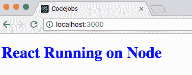

1.  如果您打开浏览器的控制台，您将看到 HMR 现在已连接：

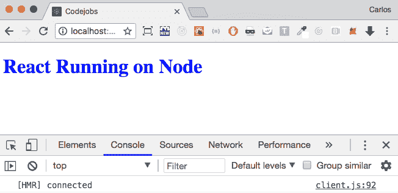

1.  您可以对`Home`组件进行更改，以查看内容如何在不刷新的情况下更新：

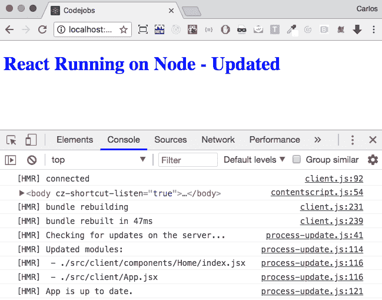

1.  如您在控制台中所见，HMR 指定每个事件的发生并为您提供更新的模块。如果您打开网络选项卡，您将看到我们捆绑包的巨大大小（*vendor.js = 1MB*和*main.js = 46.3KB*）：

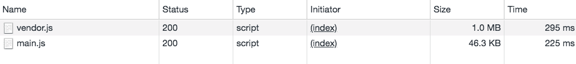

1.  如果您访问`http://localhost:3000/about`网址，您将看到连接了 Redux 状态（`isMobile`）的`About`组件：

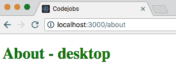

1.  如果您想以生产模式运行应用程序，请执行`npm run start-production`。如果一切正常，您应该看到相同的网站，但捆绑包更小（vendor.js：262KB - 减少 74%和 main.js：5.2KB - 减少 88%）：

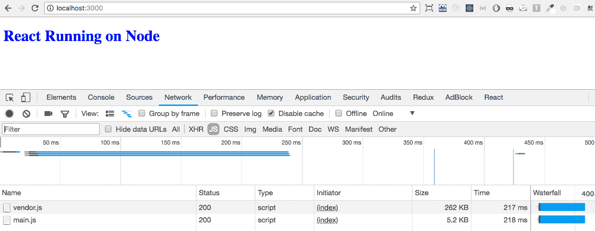

# 还有更多...

我不喜欢在导入中使用相对路径，有时很难计算某些文件的深度。`babel-plugin-module-resolver`包可以帮助我们为我们的目录添加自定义别名。例如：

```jsx
    // Instead of importing like this 
 import { isMobile } from  '../../../shared/utils/device';

    **// Using module resolver you can use an alias like:**
    **import** { isMobile } **from** '**@utils**/device';
```

正如你所看到的，使用别名更加一致，而且无论你从哪个路径导入 util，始终都会使用相同的路径别名，这很酷，不是吗？

首先，我们需要安装这个包：

```jsx
    npm install babel-plugin-module-resolver
```

然后在我们的`.babelrc`中，我们可以为每个路径添加我们的别名：

```jsx
  {
    "presets": ["env", "react"],
    "env": {
      "development": {
        "plugins": [
          "react-hot-loader/babel"
        ]
      }
    },
    "plugins": [
     ["module-resolver", {
       "root": ["./"],
       "alias": {
         "@App": "./src/client/App.jsx",
         "@client": "./src/client/",
         "@components": "./src/client/components",
         "@configureStore": "./src/shared/redux/configureStore.js",
         "@reducers": "./src/shared/reducers",
         "@server": "./src/server/",
         "@utils": "./src/shared/utils",
         "@webpack": "./webpack.config.babel.js"
       }
     }]
   ],
  }
```

`*@*`字符并不是必需的，但我喜欢使用它来快速识别我是否在使用别名。现在你可以修改我们在这个教程中制作的一些文件，并用新的别名替换路径：

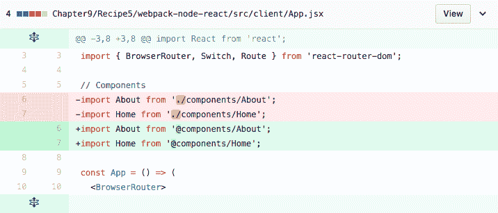文件：src/client/App.jsx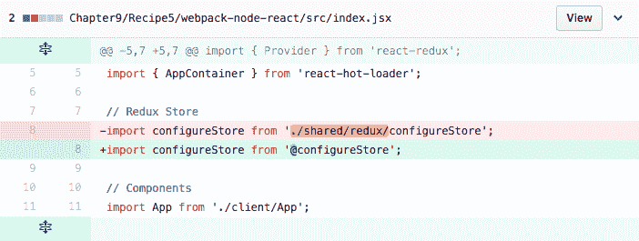文件：src/index.jsx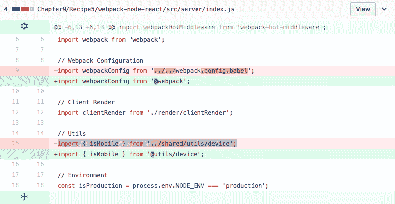文件：src/server/index.js

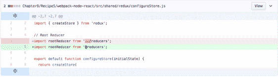

文件：src/shared/redux/configureStore.js
