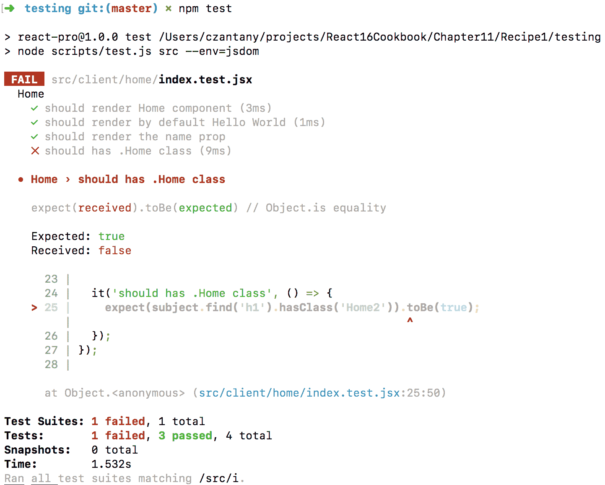
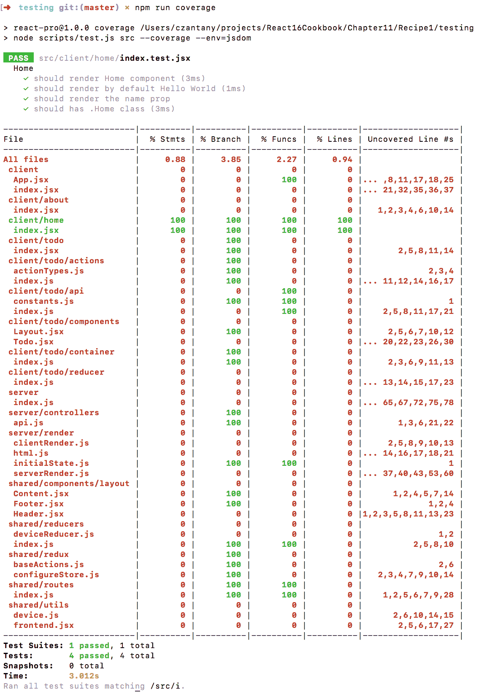
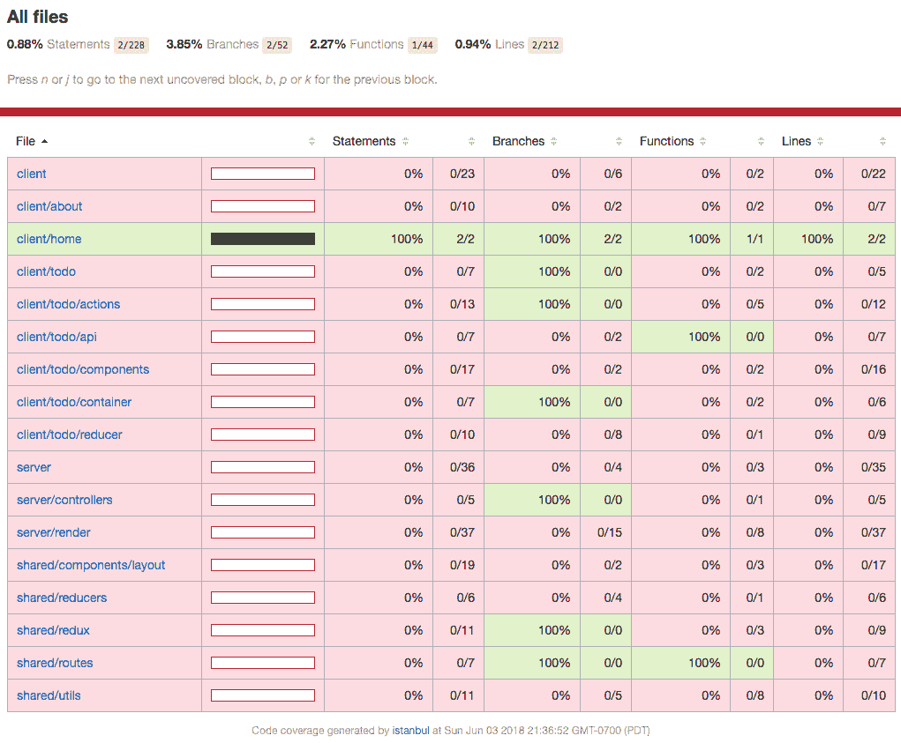
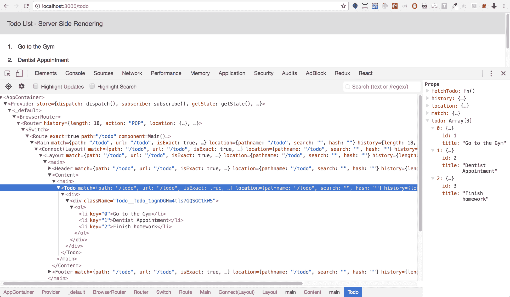
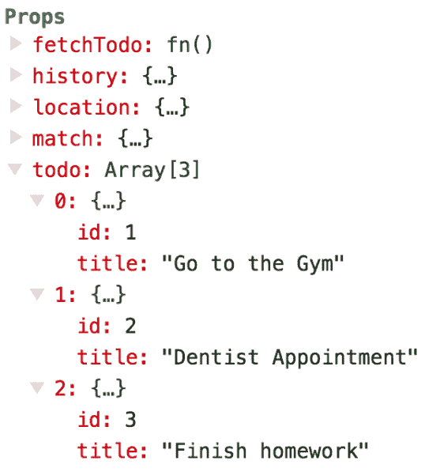
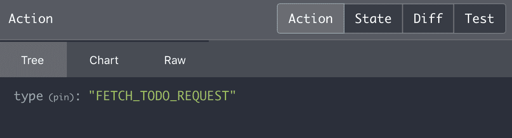
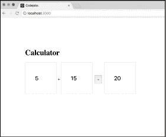

# 第十二章：测试和调试

在本章中，将涵盖以下教程：

+   使用 Jest 和 Enzyme 测试我们的第一个组件

+   测试 Redux 容器、操作和减速器

+   使用 React 和 Redux Dev Tools 调试 React 应用程序

+   模拟事件

# 介绍

测试和调试对于任何希望具有高质量的项目来说都非常重要。不幸的是，许多开发人员不关心测试（单元测试），因为他们认为这会减慢开发速度，有些人把它留到项目结束时再做。根据我的个人经验，我可以说，从项目开始就进行测试会节省您的时间，因为最后您将有更少的错误需要修复。React 使用 Jest 来测试其组件、容器、操作和减速器。

在接下来的教程中，我们还将学习如何调试我们的 React/Redux 应用程序。

# 使用 Jest 和 Enzyme 测试我们的第一个组件

在这个教程中，我们将学习如何在项目中安装和配置 Jest。

# 准备工作

在这个教程中，我们需要安装一些包来测试我们的 React 应用程序：

```jsx
npm install --save-dev jest jsdom enzyme enzyme-adapter-react-16 identity-obj-proxy
```

# 如何做…

安装了 Jest 之后，我们需要对其进行配置：

1.  将`tests`脚本和 Jest 配置添加到我们的`package.json`中：

```jsx
  {
    "name": "react-pro",
    "version": "1.0.0",
    "scripts": {
      "clean": "rm -rf dist/ && rm -rf public/app",
      "start": "npm run clean & NODE_ENV=development 
      BABEL_ENV=development nodemon src/server --watch src/server --
      watch src/shared --exec babel-node --presets es2015",
      "start-analyzer": "npm run clean && NODE_ENV=development 
      BABEL_ENV=development ANALYZER=true babel-node src/server",
      "test": "node scripts/test.js src --env=jsdom",
      "coverage": "node scripts/test.js src --coverage --env=jsdom"
    },
    "jest": {
      "setupTestFrameworkScriptFile": "
 <rootDir>/config/jest/setupTestFramework.js",
      "collectCoverageFrom": [
        "src/**/*.{js,jsx}"
      ],
      "setupFiles": [
        "<rootDir>/config/jest/browserMocks.js"
      ],
      "moduleNameMapper": {
        "^.+\\.(scss)$": "identity-obj-proxy"
      }
    },
    "author": "Carlos Santana",
    "license": "MIT",
    "dependencies": {
      "axios": "⁰.18.0",
      "babel-preset-stage-0": "⁶.24.1",
      "express": "⁴.15.4",
      "react": "¹⁶.3.2",
      "react-dom": "¹⁶.3.2",
      "react-redux": "⁵.0.6",
      "react-router-dom": "⁴.2.2",
      "redux": "⁴.0.0",
      "redux-devtools-extension": "².13.2",
      "redux-thunk": "².2.0"
    },
    "devDependencies": {
      "babel-cli": "⁶.26.0",
      "babel-core": "⁶.26.0",
      "babel-eslint": "⁸.2.3",
      "babel-loader": "⁷.1.2",
      "babel-plugin-module-resolver": "³.1.1",
      "babel-preset-env": "¹.6.0",
      "babel-preset-es2015": "⁶.24.1",
      "babel-preset-react": "⁶.24.1",
      "compression-webpack-plugin": "¹.0.0",
      "css-loader": "⁰.28.5",
      "enzyme": "³.3.0",
      "enzyme-adapter-react-16": "¹.1.1",
      "eslint": "⁴.5.0",
      "eslint-plugin-babel": "⁵.1.0",
      "eslint-plugin-import": "².7.0",
      "eslint-plugin-jsx-a11y": "⁶.0.2",
      "eslint-plugin-react": "⁷.8.2",
      "eslint-plugin-standard": "³.0.1",
      "extract-text-webpack-plugin": "4.0.0-beta.0",
      "husky": "⁰.14.3",
      "identity-obj-proxy": "³.0.0",
      "jest": "²³.1.0",
      "jsdom": "¹¹.11.0",
      "node-sass": "⁴.5.3",
      "nodemon": "¹.17.4",
      "react-hot-loader": "⁴.2.0",
      "redux-mock-store": "¹.5.1",
      "sass-loader": "⁷.0.1",
      "style-loader": "⁰.21.0",
      "webpack": "⁴.8.3",
      "webpack-bundle-analyzer": "².9.0",
      "webpack-dev-middleware": "³.1.3",
      "webpack-hot-middleware": "².18.2",
      "webpack-hot-server-middleware": "⁰.5.0",
      "webpack-merge": "⁴.1.0",
      "webpack-node-externals": "¹.6.0",
      "webpack-notifier": "¹.6.0"
    }
  }
```

文件：package.json

1.  正如您在我们的 Jest 配置中所看到的，我们需要添加`setupTestFramework.js`文件，我们将在其中配置我们的 enzyme 以便与 Jest 一起使用：

```jsx
  import { configure } from 'enzyme';
  import Adapter from 'enzyme-adapter-react-16';

  configure({ adapter: new Adapter() });
```

文件：config/jest/setupTestFramework.js

1.  在`setupFiles`节点中，我们可以指定我们的`browserMocks.js`文件，这是我们可以模拟在我们的应用程序中使用的任何浏览器方法的地方。例如，如果您想在应用程序中测试`localStorage`，这个文件就是模拟它的合适位置：

```jsx
  // Browser Mocks
  const requestAnimationFrameMock = callback => {
    setTimeout(callback, 0);
  };

  Object.defineProperty(window, 'requestAnimationFrame', {
    value: requestAnimationFrameMock
  });

  const localStorageMock = (() => {
    let store = {}

    return {
      getItem: key => store[key] || null,
      setItem: (key, value) => store[key] = value.toString(),
      removeItem: key => delete store[key],
      clear: () => store = {}
    };
  })();

  Object.defineProperty(window, 'localStorage', {
    value: localStorageMock
  });
```

文件：config/jest/browserMocks.js

1.  如果您在组件中使用 Sass、Stylus 或 Less，您需要使用正则表达式指定`moduleNameMapper`模式，以匹配项目中的所有`.scss`文件（或`.styl`/`.less`），并使用`identity-obj-proxy`处理这些文件，这是一个模拟 Webpack 导入的包，比如 CSS 模块。

1.  您可能已经注意到我们添加了两个新的 NPM 脚本：一个用于测试我们的应用程序，另一个用于获取覆盖率（覆盖的单元测试百分比）。对于这些，我们使用了一个特殊的脚本，就在`scripts/test.js`，让我们创建这个文件：

```jsx
  // Set the NODE_ENV to test
  process.env.NODE_ENV = 'test';

  // Requiring jest
  const jest = require('jest');

  // Getting the arguments from the terminal
  const argv = process.argv.slice(2);

  // Runing Jest passing the arguments
  jest.run(argv);
```

文件：scripts/test.js

1.  让我们想象我们有这个`Home`组件：

```jsx
  import React from 'react';
  import styles from './Home.scss';

  const Home = props => (
    <h1 className={styles.Home}>Hello {props.name || 'World'}</h1>
  );

 export default Home;
```

文件：src/client/home/index.jsx

1.  如果您想测试这个组件，您需要创建一个同名的文件，但在文件名后面加上`.test`后缀。在这种情况下，我们的测试文件将被命名为`index.test.jsx`：

```jsx
  // Dependencies
  import React from 'react';
  import { shallow } from 'enzyme';

  // Component to test...
  import Home from './index';

  describe('Home', () => {
    const subject = shallow(<Home />);
    const subjectWithProps = shallow(<Home name="Carlos" />);

    it('should render Home component', () => {
      expect(subject.length).toBe(1);
    });

    it('should render by default Hello World', () => {
      expect(subject.text()).toBe('Hello World');
    });

    it('should render the name prop', () => {
      expect(subjectWithProps.text()).toBe('Hello Carlos');
    });

    it('should has .Home class', () => {
      expect(subject.find('h1').hasClass('Home')).toBe(true);
    });
  });
```

文件：src/client/home/index.test.jsx

# 它是如何工作的...

如果您想测试您的应用程序，您需要运行以下命令：

```jsx
    npm test
```

如果您的测试正确，您应该会看到这个结果：


`PASS`标签表示该文件中的所有测试都已成功通过；如果您至少有一个测试失败，您将看到`FAIL`标签。让我们修改我们的`"should has .Home class`测试。我将把值改为`"Home2"`以强制失败：



正如您所见，现在我们得到了`FAIL`标签，并用 X 指定了失败的测试。此外，`Expected`和`Received`值提供了有用的信息，通过这些信息，我们可以看到期望的值和接收到的值。

# 还有更多...

现在，如果您想查看所有单元测试的覆盖百分比，您可以使用以下命令：

```jsx
 npm run coverage
```

现在我们只有 1 个`Home`组件的单元测试，如您所见是绿色的并且达到了 100%，所有其他文件都是红色的并且为 0%，因为它们还没有被测试：



此外，覆盖命令会生成结果的 HTML 版本。有一个名为`"coverage"`的目录，里面有一个名为`"Icov-report"`的目录。如果您在浏览器中打开`index.html`，您将看到类似于这样的内容：



# 测试 Redux 容器、操作和减速器

在这个示例中，我们将测试 Redux 容器、操作和减速器。在这个例子中，我们将测试我们在第十一章中创建的待办事项列表，实现服务器端渲染。

请记住，如果您使用现有的示例，您必须先运行 npm install 命令来恢复所有项目依赖项，否则您将收到依赖错误。

# 准备就绪

我们需要安装`redux-mock-store`，`moxios`和`redux-thunk`包来测试我们的 Redux 容器。您需要先运行`npm install`来安装所有依赖项：

```jsx
    npm install // This is to install the previous packages
    npm install redux-mock-store moxios redux-thunk
```

# 如何做...

让我们测试我们的 Redux 容器：

1.  Redux 容器不应该有任何 JSX 代码；最佳实践是在我们的`connect`方法中使用`mapStateToProps`和`mapDispatchToProps`，在导出时传递另一个组件（比如`Layout`组件），例如，让我们看看我们的 Todo List 容器：

```jsx
  // Dependencies
  import { connect } from 'react-redux';
  import { bindActionCreators } from 'redux';

 // Components
  import Layout from '../components/Layout';

  // Actions
  import { fetchTodo } from '../actions';

  export default connect(({ todo }) => ({
    todo: todo.list
  }), dispatch => bindActionCreators(
    {
      fetchTodo
    },
    dispatch
  ))(Layout);
```

文件：src/client/todo/container/index.js

1.  您可能想知道我们需要在这里测试什么。嗯，在容器中最重要的事情是测试动作分发（`fetchTodo`动作）并从 Redux 中获取我们的`todo`状态和数据。也就是说，这是我们的容器单元测试文件：

```jsx
  // Dependencies
  import React from 'react';
  import { shallow } from 'enzyme';
  import configureStore from 'redux-mock-store';

  // Actions
  import { fetchTodo } from '../actions';

  // Testable Container
  import Container from './index';

  // Mocking Initial State
  const mockInitialState = {
    todo: {
      list: [
        {
          id: 1,
          title: 'Go to the Gym'
        },
        {
          id: 2,
          title: 'Dentist Appointment'
        },
        {
          id: 3,
          title: 'Finish homework'
        }
      ]
    }
  };

  // Configuring Mock Store
  const mockStore = configureStore()(mockInitialState);

  // Mocking the Actions
  jest.mock('../actions', () => ({
    fetchTodo: jest.fn().mockReturnValue({ type: 'mock-FETCH_TODO_SUCCESS' })
  }));

  describe('Todo Container', () => {
    let mockParams;
    let container;

    beforeEach(() => {
      fetchTodo.mockClear();
      mockParams = {};
      mockStore.clearActions();
      container = shallow(<Container {...mockParams} store={mockStore} />);
    });

    it('should dispatch fetchTodo', () => {
      const { fetchTodo } = container.props();

      fetchTodo();

      const actions = mockStore.getActions();

      expect(actions).toEqual([{ type: 'mock-FETCH_TODO_SUCCESS' }]);
    });

    it('should map todo and get the todo list from Initial State', () => {
      const { todo } = container.props();
      const { todo: { list }} = mockInitialState;

      expect(todo).toEqual(list);
    });
  });
```

文件：src/client/todo/container/index.test.js

1.  测试`fetchTodo`动作。这是我们的动作文件的代码：

```jsx
  // Base Actions
  import { request, received } from '@baseActions';

 // Api
  import api from '../api';

  // Action Types
  import { FETCH_TODO } from './actionTypes';

  export const fetchTodo = () => dispatch => {
    const action = FETCH_TODO;
    const { fetchTodo } = api;

    dispatch(request(action));

    return fetchTodo()
      .then(response => dispatch(received(action, response.data)));
  };
```

文件：src/client/todo/actions/index.js

1.  这是我们的`actionTypes.js`文件：

```jsx
  // Actions
 export const FETCH_TODO = {
    request: () => 'FETCH_TODO_REQUEST',
    success: () => 'FETCH_TODO_SUCCESS'
  };
```

文件：src/client/todo/actions/actionTypes.js

1.  要测试异步 Redux 动作，我们需要使用`redux-thunk`和`moxios`来测试使用`axios`从服务器检索数据的动作。我们的测试文件应该是这样的：

```jsx
  // Dependencies
  import configureMockStore from 'redux-mock-store';
  import thunk from 'redux-thunk';
  import moxios from 'moxios';

  // Action
  import { fetchTodo } from './index';

  // Action Types
  import { FETCH_TODO } from './actionTypes';

  // Configuring Store with Thunk middleware
  const mockStore = configureMockStore([thunk]);

  // Response Mock
  const todoResponseMock = [
    {
      id: 1,
      title: 'Go to the Gym'
    },
    {
      id: 2,
      title: 'Dentist Appointment'
    },
    {
      id: 3,
      title: 'Finish homework'
    }
  ];

  describe('fetchTodo action', () => {
    beforeEach(() => {
      moxios.install();
    });

    afterEach(() => {
      moxios.uninstall();
    });

    it('should fetch the Todo List', () => {
      moxios.wait(() => {
        const req = moxios.requests.mostRecent();

        req.respondWith({
          status: 200,
          response: todoResponseMock
        });
      });

      const expectedActions = [
        {
          type: FETCH_TODO.request()
        },
        {
          type: FETCH_TODO.success(),
          payload: todoResponseMock
        }
      ];

      const store = mockStore({ todo: [] })

      return store.dispatch(fetchTodo()).then(() => {
        expect(store.getActions()).toEqual(expectedActions);
      });
    });
  });
```

文件：src/client/todo/actions/index.test.js

1.  让我们测试我们的 reducer。这是 Todo reducer 文件：

```jsx
  // Utils
  import { getNewState } from '@utils/frontend';

 // Action Types
  import { FETCH_TODO } from '../actions/actionTypes';

  // Initial State
  const initialState = {
    list: []
  };

  export default function todoReducer(state = initialState, action) {
    switch (action.type) {
      case FETCH_TODO.success(): {
        const { payload: { response = [] } } = action;

        return getNewState(state, {
          list: response
        });
      }

      default:
        return state;
    }
  }
```

文件：src/client/todo/reducer/index.js

1.  我们需要在我们的 reducer 中测试两件事：初始状态和`FETCH_TODO`动作成功时的状态。

```jsx
  // Reducer
  import todo from './index';

  // Action Types
  import { FETCH_TODO } from '../actions/actionTypes';

 // Initial State
  const initialState = {
    list: []
  };

  describe('Todo List Reducer', () => {
    it('should return the initial state', () => {
      const expectedInitialState = todo(undefined, {});

      expect(expectedInitialState).toEqual(initialState);
    });

    it('should handle FETCH_TODO when is success', () => {
      const action = {
        type: FETCH_TODO.success(),
        payload: {
          response: [
            {
              id: 1,
              title: 'Go to the Gym'
            },
            {
              id: 2,
              title: 'Dentist Appointment'
            },
            {
              id: 3,
              title: 'Finish homework'
            }
          ]
        }
      };

      const expectedState = {
        list: action.payload.response
      };

      const state = todo(initialState, action);

      expect(state).toEqual(expectedState);
    });
  });
```

文件：src/client/todo/reducer/index.test.js

# 使用 React 和 Redux Dev Tools 调试 React 应用程序

调试对于任何应用程序都是必不可少的，它帮助我们识别和修复错误。Chrome 有两个强大的工具来调试 React/Redux 应用程序，并将其集成到其开发者工具中。React Dev Tool 和 Redux Dev Tool。

# 准备就绪

使用 Google Chrome，您需要安装这两个扩展程序：

+   **React Developer Tools**：[`chrome.google.com/webstore/detail/react-developer-tools/fmkadmapgofadopljbjfkapdkoienihi`](https://chrome.google.com/webstore/detail/react-developer-tools/fmkadmapgofadopljbjfkapdkoienihi)

+   **Redux DevTools**：[`chrome.google.com/webstore/detail/redux-devtools/lmhkpmbekcpmknklioeibfkpmmfibljd?hl=es`](https://chrome.google.com/webstore/detail/redux-devtools/lmhkpmbekcpmknklioeibfkpmmfibljd?hl=es)

此外，您需要安装`redux-devtools-extension`包：

```jsx
npm install --save-dev redux-devtools-extension 
```

安装了 React Developer Tools 和 Redux DevTools 之后，您需要对其进行配置。

如果您尝试直接使用 Redux DevTools，它不会起作用；这是因为我们需要将`composeWithDevTools`方法传递到我们的 Redux 存储中，这应该是我们的`configureStore.js`文件：

```jsx
  // Dependencies
  import { createStore, applyMiddleware } from 'redux';
  import thunk from 'redux-thunk';
  import { composeWithDevTools } from 'redux-devtools-extension';

  // Root Reducer
  import rootReducer from '@reducers';

 export default function configureStore({ initialState, appName, 
  reducer }) {
    const middleware = [
      thunk
    ];

    return createStore(
      rootReducer,
      initialState,
      composeWithDevTools(applyMiddleware(...middleware))
    );
  }
```

文件：src/shared/redux/configureStore.js

# 如何做...

让我们调试我们的应用程序：

1.  如果您想要调试您的 React 应用程序，请使用 Google Chrome 打开您的应用程序（`http://localhost:3000/todo`），打开 Google Dev Tools（右键单击>检查），选择 React 选项卡，您将看到您的 React 组件：



1.  您可以选择要调试的组件，其中最酷的一件事是您可以在组件的右侧看到组件的 props：



1.  如果您想要调试 Redux 并查看应用程序中正在分发的动作，您需要在 Chrome Dev Tools 中选择 Redux 选项卡：


1.  在我们的 Todo 应用程序中，我们正在分发两个动作：`FETCH_TODO_REQUEST`和`FETCH_TODO_SUCCESS`。`@@INIT`动作在 Redux 中默认被分发，这在任何应用程序中都会发生。

1.  如果您选择`FETCH_TODO_REQUEST`动作，您会看到在 Diff 选项卡上显示“(states are equal)”。这意味着在该动作中没有任何更改，但您有四个选项卡：Action、State、Diff 和 Test。

1.  如果您选择 Action 选项卡，您可以看到特定的动作：



1.  如果您选择`FETCH_TODO_SUCCESS`，您将看到 todo reducer 的数据：


# 模拟事件

在这个示例中，我们将学习如何模拟简单计算器组件上的`onClick`和`onChange`事件。

# 如何做到...

我们将重用上一个示例的代码（`Repository: Chapter12/Recipe3/debugging`）：

1.  我们将创建一个简单的`Calculator`组件来对两个值（输入）进行求和，然后当用户点击等号（`=`）按钮时，我们将得到结果：

```jsx
  import React, { Component } from 'react';
  import styles from './Calculator.scss';

  class Calculator extends Component {
    state = {
      number1: 0,
      number2: 0,
      result: 0
    };

    handleOnChange = e => {
      const { target: { value, name } } = e;

      this.setState({
        [name]: value
      });
    }

    handleResult = () => {
      this.setState({
        result: Number(this.state.number1) + Number(this.state.number2)
      });
    }

    render() {
      return (
        <div className={styles.Calculator}>
          <h1>Calculator</h1>

          <input
            name="number1"
            value={this.state.number1}
            onChange={this.handleOnChange}
          />

          {' + '}

          <input
            name="number2"
            value={this.state.number2}
            onChange={this.handleOnChange}
          />

          <button onClick={this.handleResult}>
            =
          </button>

          <input
            name="result"
            value={this.state.result}
          />
        </div>
      );
    }
  }

  export default Calculator;
```

文件：src/client/calculator/index.jsx

1.  如果您想要在浏览器中查看此组件（它是为测试目的而创建的），您需要在路由文件中包含它：

```jsx
 **import** React **from** 'react';
  **import** { Switch, Route } **from** 'react-router-dom';

 **// Components**
  **import** Calculator **from** '../../client/calculator';

  **const** paths = [
    {
      **component**: Calculator,
      **exact**: true,
      **path**: '/'
    }
  ];

  **const** all = (
 **   <Switch>**
     ** <Route** **exact** **path**={paths[0].**path**} **component**={paths[0].**component**} />
    **</Switch>**
  );

 **export default** {
    paths,
    all
  }; 
```

文件：src/shared/routes/index.jsx

1.  如果您想要查看一些基本样式，我们可以使用这些：

```jsx
  .Calculator {
    padding: 100px;

    input {
        width: 50px;
        height: 50px;
        padding: 40px;
        font-size: 24px;
    }

    button {
        padding: 10px;
        margin: 10px;
    }
  }
```

文件：src/client/calculator/Calculator.scss

1.  在我们的测试文件中，我们需要模拟`onChange`事件来改变输入的值，然后模拟点击等号（`=`）按钮：

```jsx
 ** // Dependencies**
  **import** React **from** 'react';
  **import** { shallow } **from** 'enzyme';

  **// Component to test...**
  **import** Calculator **from** './index';

  **describe**('Calculator', () => {
    **const** subject = **shallow**(<Calculator />);

   ** it**('should render Calculator component', () => {
      **expect**(subject.**length**).**toBe**(1);
    });

   ** it**('should modify the state onChange', () => {
      subject.**find**('input[name="number1"]').**simulate**('change', {
        **target**: {
          **name**: 'number1',
          **value**: 5
        }
      });

      subject.**find**('input[name="number2"]').**simulate**('change', {
        **target**: {
          **name**: 'number2',
          **value**: 15
        }
      });

      **// Getting the values of the number1 and number2 states**
      **expect**(subject.**state**('number1')).**toBe**(5);
      **expect**(subject.**state**('number2')).**toBe**(15);
    });

   ** it**('should perform the sum when the user clicks the = button', 
    () => {
      **// Simulating the click event**
      subject.**find**('button').**simulate**('click');

      **// Getting the result value**
      **expect**(subject.**state**('result')).**toBe**(20);
    });
  }); 
```

# 它是如何工作的...

如果您想要在浏览器中查看组件，请使用`npm start`运行应用程序，您将看到类似于这样的东西：



现在让我们使用`npm test`命令来测试我们的计算器：

抱歉，我无法识别图片中的文本。
