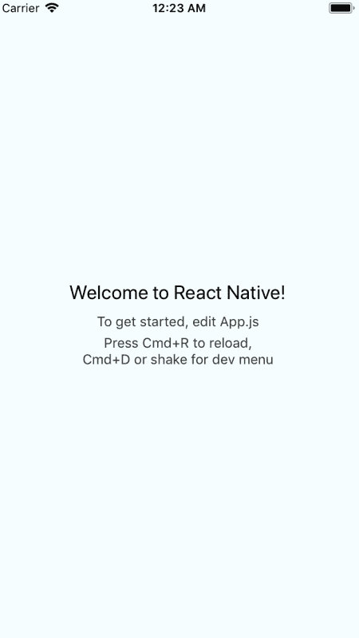
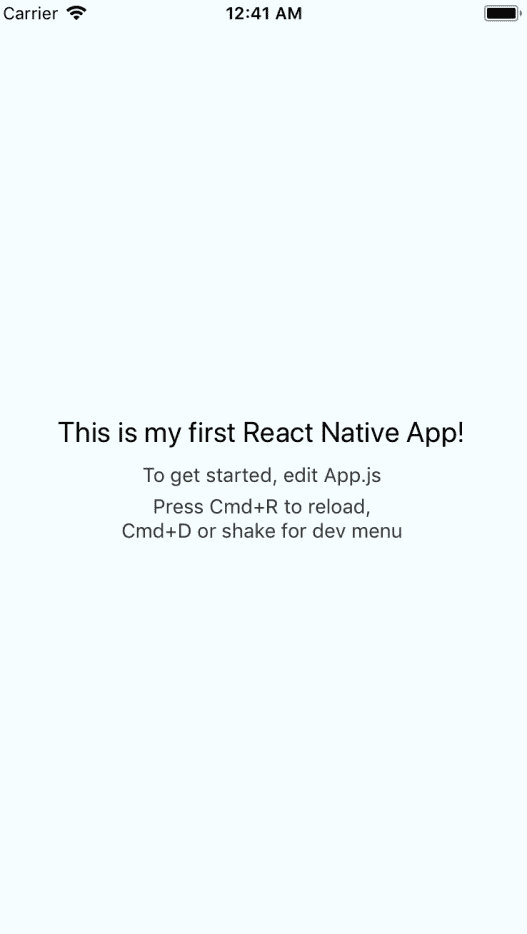
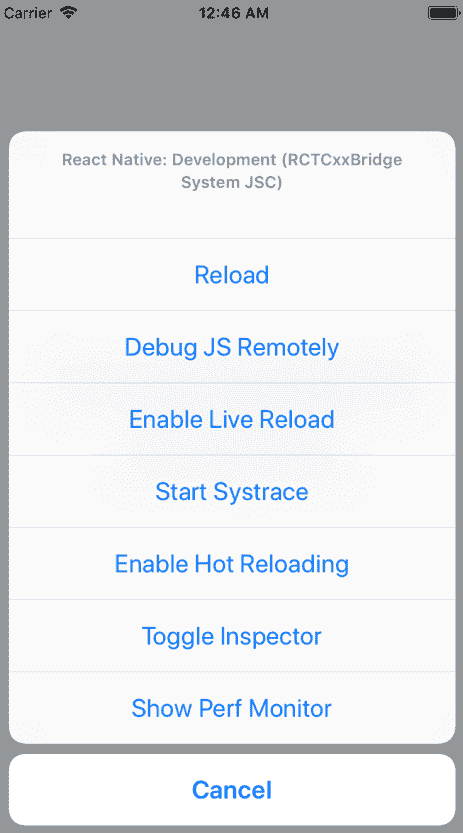
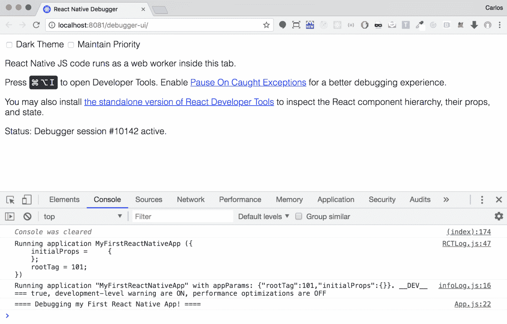
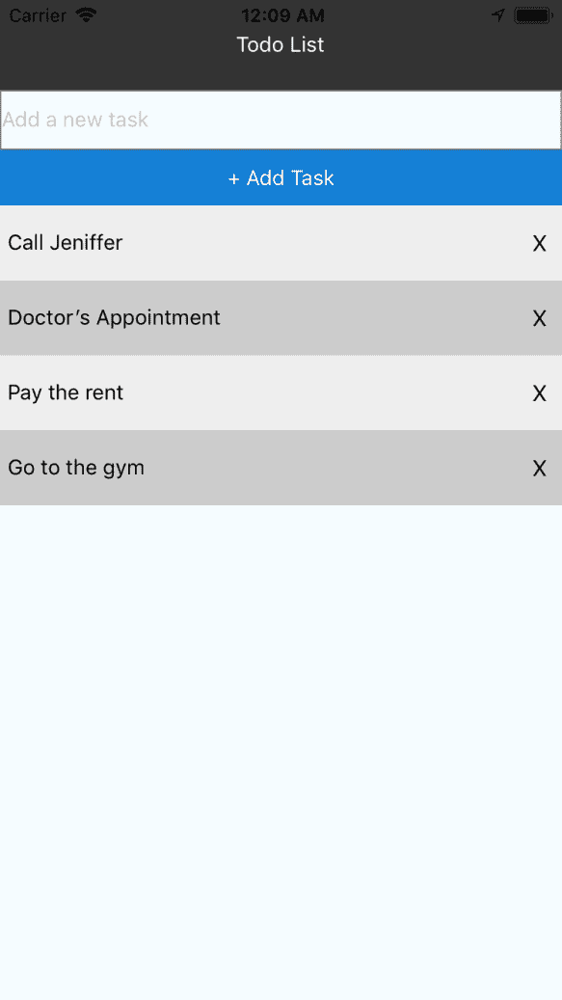
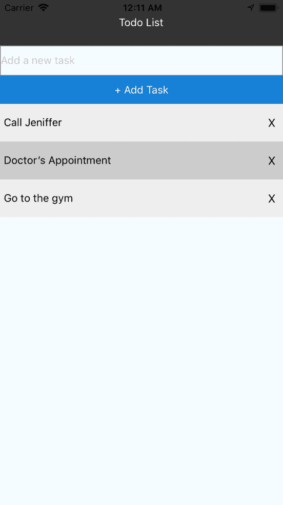
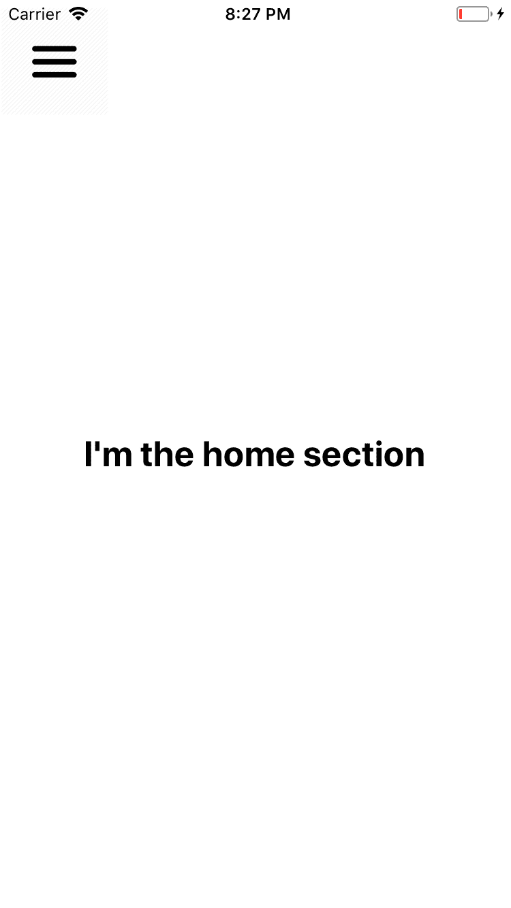
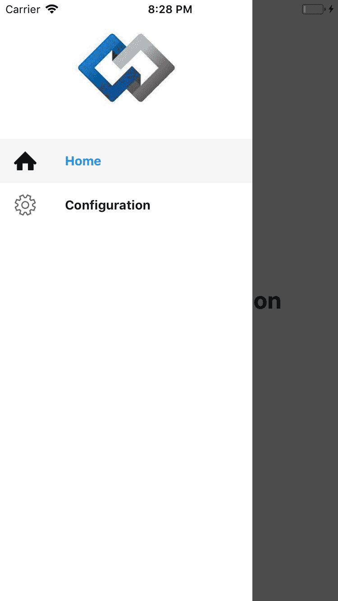
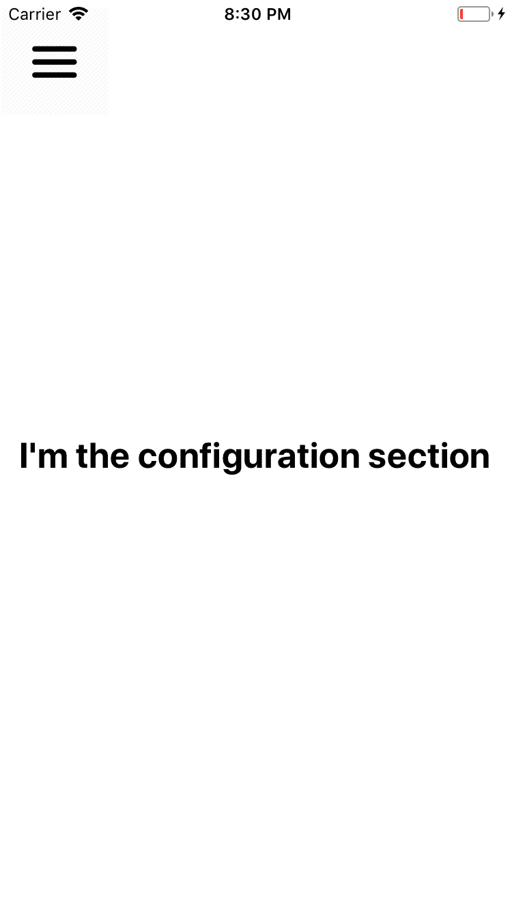
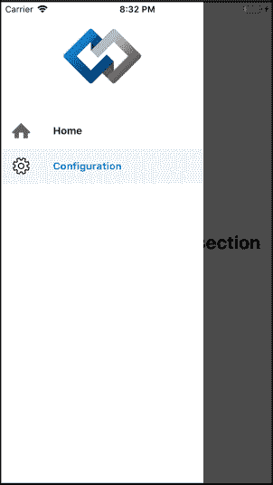

# 第十四章：使用 React Native

在本章中，将涵盖以下内容：

+   创建我们的第一个 React Native 应用程序

+   用 React Native 创建一个待办事项列表

+   实现 React Navigation V2

# 介绍

React Native 是使用 JavaScript 和 React 构建移动应用程序的框架。许多人认为使用 React Native 可以制作一些"移动 Web 应用程序"或"混合应用程序"（如 Ionic、PhoneGap 或 Sencha），但实际上你构建的是原生应用程序，因为 React Native 将你的 React 代码转换为 Android 的 Java 代码或 iOS 应用程序的 Objective-C 代码。React Native 使用了大部分 React 的概念，如组件、属性、状态和生命周期方法。

**React Native 的优势**：

+   你只需编写一次代码，就可以得到两个原生应用程序（Android 和 iOS）

+   你不需要有 Java、Objective-C 或 Swift 的经验

+   更快的开发

+   MIT 许可证（开源）

**Windows 的要求**：

+   Android Studio

+   Android SDK（>= 7.0 Nougat）

+   Android AVD

**Mac 的要求**：

+   XCode（>= 9）

+   模拟器

# 创建我们的第一个 React Native 应用程序

在这个教程中，我们将构建一个 React Native 应用程序，并了解 React 和 React Native 之间的主要区别。

# 准备工作

要创建我们的新的 React Native 应用程序，我们需要安装`react-native-cli`包：

```jsx
 npm install -g react-native-cli
```

# 如何做...

现在，要创建我们的第一个应用程序：

1.  让我们用这个命令来做：

```jsx
    react-native init MyFirstReactNativeApp
```

1.  在我们构建了 React Native 应用程序之后，我们需要安装 Watchman，这是 React Native 所需的文件监视服务。要安装它，去[`facebook.github.io/watchman/docs/install.html`](https://facebook.github.io/watchman/docs/install.html)下载最新版本适合你的操作系统（Windows、Mac 或 Linux）。

1.  在这种情况下，我们将使用 Homebrew 在 Mac 上安装它。如果你没有 Homebrew，你可以用这个命令安装它：

```jsx
    /usr/bin/ruby -e "$(curl -fsSL 
  https://raw.githubusercontent.com/Homebrew/install/master/install)"
```

1.  要安装 Watchman，你需要运行：

```jsx
    brew update 
    brew install watchman
```

1.  要启动 React Native 项目，我们需要使用：

```jsx
    react-native start
```

1.  如果一切正常，你应该看到这个：


有时你可能会从 Watchman 得到错误，例如，

Watchman 错误：太多待处理的缓存作业。确保 watchman 正在为此项目运行。

如果你遇到了这个错误或其他错误，你需要通过以下方式卸载 Watchman：

`brew unlink watchman`

然后重新安装：

`brew update && brew upgrade`

`brew install watchman`

1.  打开一个新的终端（*Cmd* + *T*）并运行这个命令（取决于你想要使用的设备）：

```jsx
    react-native run-ios 
    or
    react-native run-android
```

1.  如果没有错误，您应该看到模拟器运行默认应用程序：



现在我们的应用程序正在运行，让我们打开我们的代码并稍微修改一下：

1.  更改`App.js`文件：

```jsx
  ...
  export default class App extends Component<Props> {
    render() {
      return (
        <View style={styles.container}>
          <Text style={styles.welcome}>
 This is my first React Native App!          </Text>
          <Text style={styles.instructions}>
            To get started, edit App.js
          </Text>
          <Text style={styles.instructions}>{instructions}</Text>
        </View>
      );
    }
  }
  ...
```

文件：App.js

1.  如果您再次进入模拟器，您需要按下*Cmd* + *R*重新加载应用程序以查看新更改的反映：



1.  你可能想知道是否有一种自动重新加载的方法，而不是手动进行这个过程，当然，有一种方法可以启用实时重新加载选项；您需要按下*Cmd* + *D*打开开发菜单，然后选择启用实时重新加载选项：



1.  另一个令人兴奋的选项是远程调试 JS。如果您点击它，它将自动打开一个 Chrome 标签，我们可以在那里看到我们使用`console.log`添加到我们的应用程序的日志。例如，如果我在我的渲染方法中添加`console.log('====调试我的第一个 React Native 应用！====');`，我应该看到它像这样：



1.  让我们回到代码。也许您对在`App.js`中看到的代码有点困惑，因为您没有看到`<div>`标签，甚至更糟糕的是样式的创建方式像是一个对象，而不是像我们在 React 中使用 CSS 文件。我有一些好消息和一些坏消息；坏消息是 React Native 不支持 CSS 和 JSX/HTML 代码，就像 React 一样。好消息是，一旦您理解了`<View>`组件相当于使用`<div>`，`<Text>`相当于使用`<p>`，样式就像 CSS 模块（对象），其他一切都与 React 相同（props，state，生命周期方法）。

1.  创建一个新的组件（`Home`）。为此，我们必须创建一个名为 components 的目录，然后将此文件保存为`Home.js`：

```jsx
  // Dependencies
  import React, { Component } from 'react';
  import { StyleSheet, Text, View } from 'react-native';

  class Home extends Component {
    render() {
      return (
        <View style={styles.container}>
          <Text style={styles.home}>Home Component</Text>
        </View>
      );
    }
  }

  const styles = StyleSheet.create({
    container: {
      flex: 1,
      justifyContent: 'center',
      alignItems: 'center',
      backgroundColor: '#F5FCFF',
    },
    home: {
      fontSize: 20,
      textAlign: 'center',
      margin: 10,
    }
  });

 export default Home;
```

文件：components/Home.js

1.  在`App.js`中，我们导入`Home`组件，并将其渲染出来：

```jsx
  // Dependencies
  import React, { Component } from 'react';
  import { StyleSheet, Text, View } from 'react-native';

  // Components
  import Home from './components/Home';

  class App extends Component {
    render() {
      return (
        <Home />
      );
    }
  }

  export default App;
```

文件：App.js

# 它是如何工作的...

正如您所看到的，创建一个新的 React Native 应用程序非常容易，但是 React（使用 JSX）和 React Native 之间存在一些关键差异，使用特殊的标记和对象样式，甚至样式也有一些限制，例如，让我们创建一个 flex 布局：

```jsx
    // Dependencies
    import React, { Component } from 'react';
    import { StyleSheet, Text, View } from 'react-native';

    class Home extends Component {
      render() {
        return (
          <View style={styles.container}>
            <View style={styles.header}>
              <Text style={styles.headerText}>Header</Text>
            </View>

            <View style={styles.columns}>
              <View style={styles.column1}>
                <Text style={styles.column1Text}>Column 1</Text>
              </View>

              <View style={styles.column2}>
                <Text style={styles.column2Text}>Column 2</Text>
              </View>

              <View style={styles.column3}>
                <Text style={styles.column3Text}>Column 3</Text>
              </View>
            </View>
          </View>
        );
      }
    }

    const styles = StyleSheet.create({
      container: {
        flex: 1,
        height: 100
      },
      header: {
        flex: 1,
        backgroundColor: 'green',
        justifyContent: 'center',
        alignItems: 'center'
      },
      headerText: {
        color: 'white'
      },
      columns: {
        flex: 1
      },
      column1: {
        flex: 1,
        alignItems: 'center',
        justifyContent: 'center',
        backgroundColor: 'red'
      },
      column1Text: {
        color: 'white'
      },
      column2: {
        flex: 1,
        alignItems: 'center',
        justifyContent: 'center',
        backgroundColor: 'blue'
      },
      column2Text: {
        color: 'white'
      },
      column3: {
        flex: 1,
        alignItems: 'center',
        justifyContent: 'center',
        backgroundColor: 'orange'
      },
      column3Text: {
        color: 'white'
      },
    });

    export default Home;
```

文件：components/Home.js

您可能不喜欢看一个庞大的文件（我也不喜欢），所以让我们将我们的组件和样式分开：

```jsx
  import { StyleSheet } from 'react-native';

  export default StyleSheet.create({
    container: {
      flex: 1,
      height: 100
    },
    header: {
      flex: 1,
      backgroundColor: 'green',
      justifyContent: 'center',
      alignItems: 'center'
    },
    headerText: {
      color: 'white'
    },
    columns: {
      flex: 1
    },
    column1: {
      flex: 1,
      alignItems: 'center',
     justifyContent: 'center',
      backgroundColor: 'red'
    },
    column1Text: {
      color: 'white'
    },
    column2: {
      flex: 1,
      alignItems: 'center',
      justifyContent: 'center',
      backgroundColor: 'blue'
    },
    column2Text: {
      color: 'white'
    },
    column3: {
      flex: 1,
      alignItems: 'center',
      justifyContent: 'center',
      backgroundColor: 'orange'
    },
    column3Text: {
      color: 'white'
    },
  });
```

文件：components/HomeStyles.js

然后在我们的`Home`组件中，我们可以导入样式并以与以前相同的方式使用它们：

```jsx
  // Dependencies
  import React, { Component } from 'react';
  import { StyleSheet, Text, View } from 'react-native';

  // Styles
  import styles from './HomeStyles';
  ...
```

文件：components/Home.js

这是代码的结果：

！[](assets/143ec48a-2ad7-448b-976e-385f6f5c2ec1.png)

但有一些不寻常的地方。

正如您所看到的，我为`<Text>`组件（headerText，column1Text 等）创建了样式，这是因为某些样式不允许在 View 组件中使用。例如，如果您尝试将`color: 'white'`属性添加到`<View>`组件中，您会发现该属性不起作用，标题将具有黑色文本：

！[](assets/1ddeecf5-b761-499f-87d7-3232e4eff05f.png)

# 使用 React Native 创建待办事项列表

在这个示例中，我们将学习如何在 React Native 中处理事件以及如何通过创建一个简单的待办事项列表来处理状态。

# 如何做...

对于这个示例，我创建了一个名为“MySecondReactNativeApp”的新 React 应用程序：

1.  创建一个`src`文件夹并将`App.js`文件移动到其中。还要修改此文件以包含我们的待办事项列表：

```jsx
  import React, { Component } from 'react';

  import Todo from './components/Todo';

  export default class App extends Component {
    render() {
      return (
        <Todo />
      );
    }
  }
```

文件：src/App.js

1.  我们的`Todo`组件将是：

```jsx
  import React, { Component } from 'react';
  import { 
    Text, 
    View, 
    TextInput, 
    TouchableOpacity, 
    ScrollView 
  } from 'react-native';

  import styles from './TodoStyles';

  class Todo extends Component {
    state = {
      task: '',
      list: []
    };

    onPressAddTask = () => {
      if (this.state.task) {
        const newTask = this.state.task;
        const lastTask = this.state.list[0] || { id: 0 };
        const newId = Number(lastTask.id + 1);

        this.setState({
          list: [{ id: newId, task: newTask }, ...this.state.list],
          task: ''
        });
      }
    }

    onPressDeleteTask = id => {
      this.setState({
        list: this.state.list.filter(task => task.id !== id)
      });
    }

    render() {
      const { list } = this.state;
      let zebraIndex = 1;

      return (
        <View style={styles.container}>
          <ScrollView
            contentContainerStyle={{
              flexGrow: 1,
            }}
          >
            <View style={styles.list}>
              <View style={styles.header}>
                <Text style={styles.headerText}>Todo List</Text>
              </View>

              <View style={styles.add}>
                <TextInput
                  style={styles.inputText}
                  placeholder="Add a new task"
                  onChangeText={(value) => this.setState({ task: 
 value })}
                  value={this.state.task}
                />

                <TouchableOpacity
                  style={styles.button}
                  onPress={this.onPressAddTask}
                >
                  <Text style={styles.submitText}>+ Add Task</Text>
                </TouchableOpacity>
              </View>

              {list.length === 0 && (
                <View style={styles.noTasks}>
                  <Text style={styles.noTasksText}>
                    There are no tasks yet, create a new one!
 </Text>
                </View>
              )}

              {list.map((item, i) => {
                zebraIndex = zebraIndex === 2 ? 1 : 2;

                return (
                  <View key={`task${i}`} style=
                   {styles[`task${zebraIndex}`]}>
                    <Text>{item.task}</Text>
                    <TouchableOpacity onPress={() => { 
                     this.onPressDeleteTask(item.id) }}>
                      <Text style={styles.delete}>
                        X
                      </Text>
                    </TouchableOpacity>
                  </View>
                );
              })}
            </View>
 </ScrollView>
 </View>
      );
    }
  }

 export default Todo;
```

文件：src/components/Todo.js

1.  这是样式：

```jsx
  import { StyleSheet } from 'react-native';

 export default StyleSheet.create({
    container: {
      flex: 1,
      backgroundColor: '#F5FCFF',
      height: 50
    },
    list: {
      flex: 1
    },
    header: {
      backgroundColor: '#333',
      alignItems: 'center',
      justifyContent: 'center',
      height: 60
    },
    headerText: {
      color: 'white'
    },
    inputText: {
      color: '#666',
      height: 40,
      borderColor: 'gray',
      borderWidth: 1
    },
    button: {
      paddingTop: 10,
      paddingBottom: 10,
      backgroundColor: '#1480D6'
    },
    submitText: {
      color:'#fff',
      textAlign:'center',
      paddingLeft : 10,
      paddingRight : 10
    },
    task1: {
      flexDirection: 'row',
      height: 50,
      backgroundColor: '#ccc',
      alignItems: 'center',
      justifyContent: 'space-between',
      paddingLeft: 5
    },
    task2: {
      flexDirection: 'row',
      height: 50,
      backgroundColor: '#eee',
      alignItems: 'center',
      justifyContent: 'space-between',
      paddingLeft: 5
    },
    delete: {
      margin: 10,
      fontSize: 15
    },
    noTasks: {
      flex: 1,
      alignItems: 'center',
      justifyContent: 'center'
    },
    noTasksText: {
      color: '#888'
    }
  });
```

文件：src/components/TodoStyles.js

# 它是如何工作的...

在我们的组件中做的第一件事是设置我们的状态。`task`状态是为了创建新项目的输入，`list`状态是为了保存所有任务项目：

```jsx
 state = {
      task: '',
      list: []
    };
```

`TextInput`组件创建一个输入元素，与 React 中的输入的主要区别在于，它使用`onChangeText`而不是`onChange`方法，并且默认获取值，我们可以直接更新我们的状态：

```jsx
 <TextInput
    style={styles.inputText}
    placeholder="Add a new task"
    onChangeText={(value) => this.setState({ task: value })}
    value={this.state.task}
  />
```

`TouchableOpacity`组件用于处理点击事件（在 React Native 中为`onPress`），可以用作按钮。也许您想知道为什么我没有直接使用`Button`组件；这是因为在 iOS 上无法向按钮添加背景颜色，它只能在 Android 上使用背景。使用`TouchableOpacity`（或`TouchableHighlight`），您可以个性化样式，并且它完全可以作为按钮使用：

```jsx
  <TouchableOpacity
    style={styles.button}
    onPress={this.onPressAddTask}
  >
    <Text style={styles.submitText}>+ Add Task</Text>
  </TouchableOpacity>
```

在任务的渲染中，我为任务实现了斑马样式（混合颜色）。此外，我们正在处理`onPressDeleteTask`以通过单击 X 按钮删除每个项目：

```jsx
    {list.map((item, i) => {
      zebraIndex = zebraIndex === 2 ? 1 : 2;

      return (
        <View key={`task${i}`} style={styles[`task${zebraIndex}`]}>
          <Text>{item.task}</Text>
          <TouchableOpacity onPress={() => { 
           this.onPressDeleteTask(item.id) }}>
            <Text style={styles.delete}>
              X
            </Text>
          </TouchableOpacity>
 </View>
      );
    })}
```

如果我们运行应用程序，我们将首先看到这个视图：

！[](assets/2d2f0dae-68e1-4133-8a46-c2c045dc9934.png)

如果我们没有任何任务，我们将看到“目前没有任务，创建一个新任务！”的消息。

如您所见，顶部有一个输入框，其中有“添加新任务”的占位符。让我们添加一些任务：



最后，我们可以通过点击 X 来删除任务；我将删除支付房租任务：



如您所见，通过这个基本的待办事项列表，我们学会了如何在 React Native 中使用本地状态以及如何处理点击和更改事件。

# 还有更多...

如果您想要防止用户意外删除任务，可以添加一个警报，询问用户是否确定要删除所选任务。为此，我们需要从 react-native 导入 Alert 组件并修改我们的 onPressDeleteTask 方法：

```jsx
  import { 
    Text, 
    View, 
    TextInput, 
    TouchableOpacity, 
    ScrollView, 
 Alert 
  } from 'react-native';

  ...

  onPressDeleteTask = id => {
    Alert.alert('Delete', 'Do you really want to delete this task?', [
      {
        text: 'Yes, delete it.',
        onPress: () => {
          this.setState({
            list: this.state.list.filter(task => task.id !== id)
          });
        }
      }, {
        text: 'No, keep it.'
      }
    ]);
  }

  ...
```

如果您运行应用程序并尝试删除任务，您现在将看到这个本机警报：


# 实现 React Navigation V2

在这个教程中，我们将学习如何在 React Native 应用程序中实现 React Navigation V2。我们将在部分之间创建一个简单的导航。

# 准备工作

我们需要安装`react-navigation`依赖项：

```jsx
 npm install react-navigation
```

# 如何做到...

让我们实现 React Navigation v2：

1.  从 react-navigation 中包括`createDrawerNavigation`和`DrawerItems`以及我们想要作为部分渲染的组件（主页和配置）：

```jsx
  // Dependencies
  import React, { Component } from 'react';
  import { StyleSheet, View, ScrollView, Image } from 'react-
  native';

  // React Navigation
  import { createDrawerNavigator, DrawerItems } from 'react-
  navigation';

  // Components
  import Home from './sections/Home';
  import Configuration from './sections/Configuration';
```

文件：App.js

1.  在 CustomDrawerComponent 中，我们将渲染 Codejobs 标志和菜单（您可以根据需要进行修改）：

```jsx
 // Custom Drawer Component
 // Here we are displaying the menu options 
  // and customizing our drawer
  const CustomDrawerComponent = props => (
    <View style={styles.area}>
      <View style={styles.drawer}>
        <Image
          source={require('./assets/codejobs.jpeg')}
          style={styles.logo}>
        </Image>
      </View>

 <ScrollView>
        <DrawerItems {...props} />
 </ScrollView>
 </View>
  );
```

文件：App.js

1.  创建`AppDrawerNavigator`，指定我们要在菜单中显示的组件作为部分（主页和配置）。此外，我们需要传递`contentComponent`与之前创建的`CustomDrawerComponent`：

```jsx
 // The left Drawer navigation
 // The first object are the components that we want to display
 // in the Drawer Navigation.
  const AppDrawerNavigator = createDrawerNavigator({
    Home,
    Configuration
  },
  {
    contentComponent: CustomDrawerComponent
  });
```

文件：App.js

1.  创建 App 类并渲染`AppDrawerNavigator`组件：

```jsx
  class App extends Component {
    render() {
      return (
        <AppDrawerNavigator />
      );
    }
  }

  // Styles for left Drawer
  const styles = StyleSheet.create({
    area: {
      flex: 1
    },
    drawer: {
      height: 150,
      backgroundColor: 'white',
      alignItems: 'center',
      justifyContent:'center'
    },
    logo: {
      height: 120,
      width: 120,
      borderRadius: 60
    }
  });

  export default App;
```

文件：App.js

1.  创建部分组件；第一个是主页组件：

```jsx
  // Dependencies
  import React, { Component } from 'react';
  import { View, Text, Image, TouchableOpacity } from 'react-native';
  // Styles
  import styles from './SectionStyles';
  class Home extends Component {
    // Here we specify the icon we want to render
 // in the menu for this option
    static navigationOptions = {
      drawerIcon: () => (
        <Image
          style={styles.iconsItem}
          source={require('../assets/home.png')}
        />
      )
    }
    render() {
      return(
        <View style={styles.container}>
          {/* Hamburger menu */}
          <TouchableOpacity 
            onPress={() => this.props.navigation.openDrawer()} 
            style={styles.iconMenu}
          >
            <Image
              style={styles.menu}
              source={require('../assets/menu.png')}
            />
          </TouchableOpacity>

          {/* Here is the content of the component */}
          <Text style={styles.titleText}>I'm the home section</Text>
        </View>
      );
    }
  }
  export default Home;
```

文件：sections/Home.js

1.  这是配置部分组件：

```jsx
  // Dependencies
  import React, { Component } from 'react';
  import { View, Text, Image, TouchableOpacity } from 'react-native';

  // Styles
  import styles from './SectionStyles';

  class Configuration extends Component {
 // Here we specify the icon we want to render
 // in the menu for this option
    static navigationOptions = {
      drawerIcon: () => (
        <Image
          style={styles.iconsItem}
          source={require('../assets/config.png')}
        />
      )
    };

    render() {
      return(
        <View style={styles.container}>
          {/* Hamburger menu */}
          <TouchableOpacity 
            onPress={() => this.props.navigation.openDrawer()} 
            style={styles.iconMenu}
          >
            <Image
              style={styles.menu}
              source={require('../assets/menu.png')}
            />
          </TouchableOpacity>

          {/* Here is the content of the component */}
          <Text style={styles.titleText}>I'm the configuration 
          section</Text>
        </View>
      );
    }
  }

 export default Configuration;
```

文件：sections/Configuration.js

1.  您可能已经注意到我们在两个组件上使用了相同的样式，这就是为什么我为样式创建了一个单独的文件：

```jsx
  import { StyleSheet } from 'react-native';

 export default StyleSheet.create({
    container: {
      flex: 1,
      backgroundColor: '#fff',
      alignItems: 'center',
      justifyContent: 'center',
    },
    iconMenu: {
      position: 'absolute',
      left: 0,
      top: 5
    },
    titleText: {
      fontSize: 26,
      fontWeight: 'bold',
    },
    menu: {
      width: 80,
      height: 80,
    },
    iconsItem: {
      width: 25,
      height: 25
    }
  });
```

文件：sections/sectionStyles.js

1.  您可以在存储库（`Chapter14/Recipe3/ReactNavigation/assets`）中找到我们正在使用的资产。

# 它是如何工作的...

如果您一切都做对了，您应该会看到这个：



正在呈现的第一个组件是`Home`组件。如果您点击汉堡菜单，您会看到抽屉中有两个部分（`Home`和`Configuration`），它们各自的图标以及顶部的 Codejobs 标志：



最后，如果您点击配置，您也会看到该组件：



如果您再次看到抽屉，您会注意到当前打开的部分也在菜单中处于活动状态（在这种情况下是配置）。


