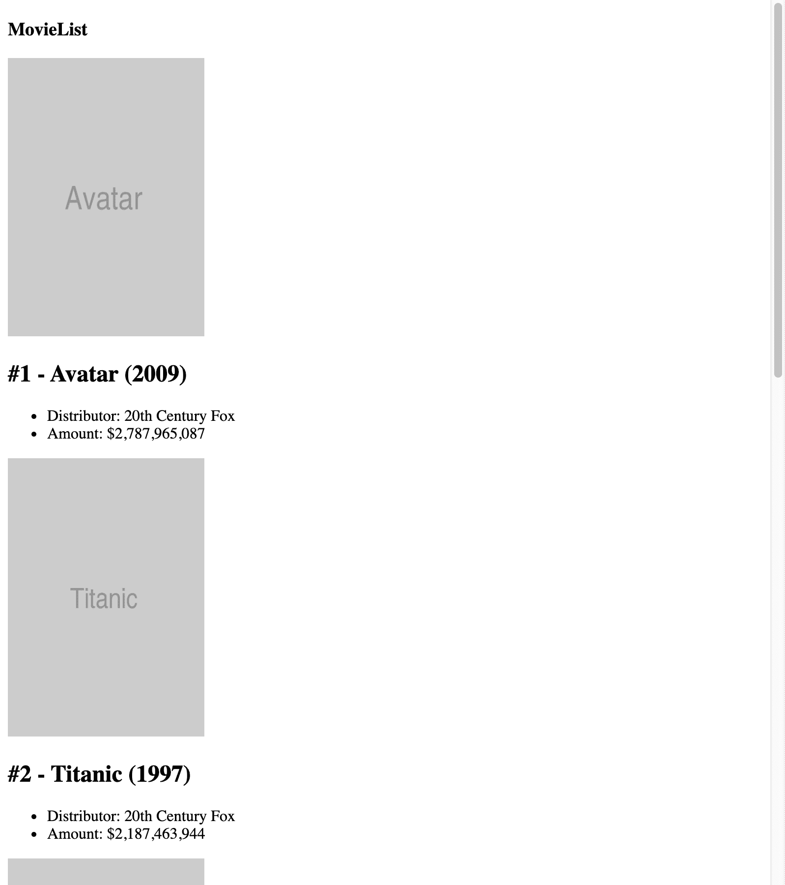
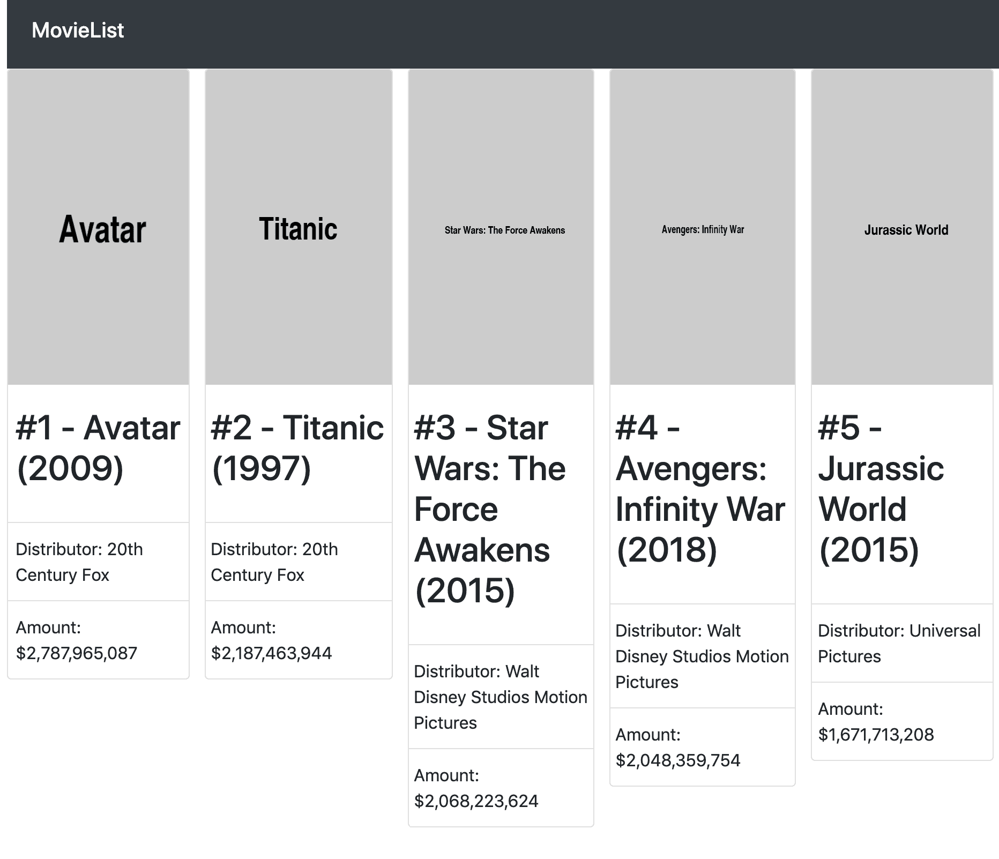

# 第一章：在 React 中创建电影列表应用程序

当您购买这本书时，您可能之前已经听说过 React，甚至可能尝试过一些在线找到的代码示例。这本书的构建方式是，每一章的代码示例逐渐增加复杂性，因此即使您对 React 的经验有限，每一章也应该是可以理解的，如果您已经阅读了前一章。当您阅读完本书时，您将了解如何使用 React 及其稳定功能，直到 16.11 版本，并且您还将有使用 React Native 和 React 360 的经验。

本章首先学习如何构建一个简单的电影列表应用程序，并为您提供我们将从外部来源获取的热门电影的概述。入门 React 的核心概念将应用于这个项目，如果您之前有一些使用 React 构建应用程序的经验，这应该是可以理解的。如果您之前没有使用过 React，也没有问题；本书将沿途描述代码示例中使用的 React 功能。

在本章中，我们将涵盖以下主题：

+   使用 webpack 和 React 设置新项目

+   构建 React 项目结构

让我们开始吧！

# 项目概述

在本章中，我们将在 React 中创建一个电影列表应用程序，该应用程序从本地 JSON 文件中检索数据，并在浏览器中使用 webpack 和 Babel 运行。样式将使用 Bootstrap 完成。您将构建的应用程序将返回截至 2019 年的最卖座电影列表，以及一些更多的细节和每部电影的海报。

构建时间为 1 小时。

# 入门

本章的应用程序将从头开始构建，并使用可以在 GitHub 上找到的资产：[`github.com/PacktPublishing/React-Projects/tree/ch1-assets`](https://github.com/PacktPublishing/React-Projects/tree/ch1-assets)。这些资产应下载到您的计算机上，以便您稍后在本章中使用。本章的完整代码也可以在 GitHub 上找到：[`github.com/PacktPublishing/React-Projects/tree/ch1`](https://github.com/PacktPublishing/React-Projects/tree/ch1)。

对于本书中创建的应用程序，您需要在计算机上安装至少 Node.js v10.16.3，以便可以运行`npm`命令。如果您尚未在计算机上安装 Node.js，请转到[`nodejs.org/en/download/`](https://nodejs.org/en/download/)，在那里您可以找到 macOS、Windows 和 Linux 的下载说明。

安装 Node.js 后，在命令行中运行以下命令以检查已安装的版本：

+   对于 Node.js（应为 v10.16.3 或更高版本）：

```jsx
node -v
```

+   对于`npm`（应为 v6.9.0 或更高版本）：

```jsx
npm -v
```

此外，您应该已安装了**React Developer Tools**插件（适用于 Chrome 和 Firefox），并将其添加到浏览器中。可以从**Chrome Web Store**（[`chrome.google.com/webstore`](https://chrome.google.com/webstore)）或 Firefox Addons（[`addons.mozilla.org`](https://addons.mozilla.org)）安装此插件。

# 创建电影列表应用程序

在本节中，我们将从头开始创建一个新的 React 应用程序，首先设置一个带有 webpack 和 Babel 的新项目。从头开始设置一个 React 项目将帮助您了解项目的基本需求，这对您创建的任何项目都是至关重要的。

# 设置项目

每次创建新的 React 项目时，第一步是在本地计算机上创建一个新目录。由于您将在本章中构建一个电影列表应用程序，因此将此目录命名为`movieList`。

在这个新目录中，从命令行执行以下操作：

```jsx
npm init -y
```

运行此命令将创建一个`package.json`文件，其中包含`npm`对该项目的基本信息的最低要求。通过在命令中添加`-y`标志，我们可以自动跳过设置`name`、`version`和`description`等信息的步骤。运行此命令后，将创建以下`package.json`文件：

```jsx
{
    "name": "movieList",
    "version": "1.0.0",
    "description": "",
    "main": "index.js",
    "scripts": {
        "test": "echo \"Error: no test specified\" && exit 1"
    },
    "keywords": [],
    "author": "",
    "license": "ISC"
}
```

如您所见，由于我们尚未安装任何依赖项，因此`npm`包没有依赖项。我们将在本节的下一部分中安装和配置的第一个包是 webpack。

# 设置 webpack

要运行 React 应用程序，我们需要安装 webpack 4（在撰写本书时，webpack 的当前稳定版本为版本 4）和 webpack CLI 作为**devDependencies**。让我们开始吧：

1.  使用以下命令从`npm`安装这些包：

```jsx
npm install --save-dev webpack webpack-cli
```

1.  下一步是在`package.json`文件中包含这些包，并在我们的启动和构建脚本中运行它们。为此，将`start`和`build`脚本添加到我们的`package.json`文件中：

```jsx
{
    "name": "movieList",
    "version": "1.0.0",
    "description": "",
    "main": "index.js",
    "scripts": {
_       "start": "webpack --mode development",
+       "build": "webpack --mode production",
        "test": "echo \"Error: no test specified\" && exit 1"
    },
    "keywords": [],
    "author": "",
    "license": "ISC"
}
```

"+"符号用于添加的行，"-"符号用于删除的行在代码中。

上述配置将使用 webpack 为我们的应用程序添加`start`和`build`脚本。正如您所看到的，`npm start`将在开发模式下运行 webpack，而`npm build`将在生产模式下运行 webpack。最大的区别在于，在生产模式下运行 webpack 将最小化我们的代码，以减小项目捆绑的大小。

1.  在我们的项目内创建一个名为`src`的新目录，并在这个目录内创建一个名为`index.js`的新文件。稍后，我们将配置 webpack，使这个文件成为我们应用程序的起点。将以下代码放入这个新创建的文件中：

```jsx
console.log("movieList")
```

如果我们现在在命令行中运行`npm start`或`npm build`命令，webpack 将启动并创建一个名为`dist`的新目录。在这个目录里，将会有一个名为`main.js`的文件，其中包含我们的项目代码。根据我们是在开发模式还是生产模式下运行 webpack，这个文件中的代码将被最小化。您可以通过运行以下命令来检查您的代码是否工作：

```jsx
node dist/main.js
```

这个命令运行我们应用程序的捆绑版本，并应该在命令行中返回`movieList`字符串作为输出。现在，我们可以从命令行运行 JavaScript 代码。在本节的下一部分中，我们将学习如何配置 webpack，使其与 React 一起工作。

# 配置 webpack 以与 React 一起工作

现在我们已经为 JavaScript 应用程序设置了一个基本的开发环境，可以开始安装我们运行任何 React 应用程序所需的包。这些包括`react`和`react-dom`，前者是 React 的通用核心包，后者提供了浏览器 DOM 的入口点，并渲染 React。让我们开始吧：

1.  通过在命令行中执行以下命令来安装这些包：

```jsx
npm install react react-dom
```

仅仅安装 React 的依赖是不足以运行它的，因为默认情况下，并非每个浏览器都能读取您的 JavaScript 代码所写的格式（如 ES2015+或 React）。因此，我们需要将 JavaScript 代码编译成每个浏览器都能读取的格式。

1.  为此，我们将使用 Babel 及其相关包，可以通过运行以下命令将其安装为`devDependencies`：

```jsx
npm install --save-dev @babel/core @babel/preset-env @babel/preset-react babel-loader
```

除了 Babel 核心之外，我们还将安装`babel-loader`，这是一个辅助工具，使得 Babel 可以与 webpack 一起运行，并安装两个预设包。这些预设包有助于确定将用于将我们的 JavaScript 代码编译为浏览器可读格式的插件（`@babel/preset-env`）以及编译 React 特定代码（`@babel/preset-react`）。

安装了 React 和正确的编译器包后，下一步是使它们与 webpack 配合工作，以便在运行应用程序时使用它们。

1.  要做到这一点，在项目的根目录中创建一个名为`webpack.config.js`的文件。在这个文件中，添加以下代码：

```jsx
module.exports = {
    module: {
        rules: [
            {
                test: /\.js$/,
                exclude: /node_modules/,
                use: {
                    loader:'"babel-loader',
                },
            },
        ],
    },
}
```

这个文件中的配置告诉 webpack 对具有`.js`扩展名的每个文件使用`babel-loader`，并排除 Babel 编译器中`node_modules`目录中的`.js`文件。`babel-loader`的实际设置放在一个名为`.babelrc`的单独文件中。

1.  我们还可以在项目的根目录中创建`.babelrc`文件，并在其中放置以下代码，该代码配置`babel-loader`在编译我们的代码时使用`@babel/preset-env`和`@babel/preset-react`预设：

```jsx
{
    "presets": [
        [
            "@babel/preset-env", 
            {
                "targets": {
                    "node": "current"
                }
            }
        ],
        "@babel/react"
    ]
}
```

我们还可以直接在`webpack.config.js`文件中声明`babel-loader`的配置，但为了更好的可读性，我们应该将其放在一个单独的`.babelrc`文件中。此外，Babel 的配置现在可以被与 webpack 无关的其他工具使用。

`@babel/preset-env`预设中定义了选项，确保编译器使用最新版本的 Node.js，因此诸如`async/await`等功能的 polyfill 仍然可用。现在我们已经设置了 webpack 和 Babel，我们可以从命令行运行 JavaScript 和 React。在本节的下一部分中，我们将创建我们的第一个 React 代码，并使其在浏览器中运行。

# 渲染 React 项目

现在我们已经设置了 React，使其可以与 Babel 和 webpack 一起工作，我们需要创建一个实际的 React 组件，以便进行编译和运行。创建一个新的 React 项目涉及向项目添加一些新文件，并对 webpack 的设置进行更改。让我们开始吧：

1.  让我们编辑`src`目录中已经存在的`index.js`文件，以便我们可以使用`react`和`react-dom`：

```jsx
import React from 'react';
import ReactDOM from 'react-dom';

const App = () => {
    return <h1>movieList</h1>;
};

ReactDOM.render(<App />, document.getElementById('root'));
```

正如你所看到的，这个文件导入了`react`和`react-dom`包，定义了一个简单的组件，返回一个包含你的应用程序名称的`h1`元素，并使用`react-dom`渲染了这个组件。代码的最后一行将`App`组件挂载到文档中`root`ID 的元素上，这是应用程序的入口点。

1.  我们可以通过在`src`目录中添加一个名为`index.html`的新文件并在其中添加以下代码来创建此文件：

```jsx
<!DOCTYPE html>
<html lang="en">
<head>
    <meta charset="UTF-8">
    <meta name="viewport" content="width=device-width, initial-scale=1.0">
    <meta http-equiv="X-UA-Compatible" content="ie=edge">
    <title>movieList</title>
</head>
<body>
    <section id="root"></section>
</body>
</html>
```

这将添加一个 HTML 标题和主体。在`head`标签中是我们应用程序的标题，在`body`标签中是一个带有`id`属性`root`的部分。这与我们在`src/index.js`文件中将`App`组件挂载到的元素相匹配。

1.  渲染我们的 React 组件的最后一步是扩展 webpack，以便在运行时将压缩的捆绑代码添加到`body`标签作为`scripts`。因此，我们应该将`html-webpack-plugin`包安装为 devDependency：

```jsx
npm install --save-dev html-webpack-plugin
```

将这个新包添加到`webpack.config.js`文件中的 webpack 配置中：

```jsx
const HtmlWebPackPlugin = require('html-webpack-plugin');

const htmlPlugin = new HtmlWebPackPlugin({
 template: './src/index.html',
 filename: './index.html',
});

module.exports = {
    module: {
        rules: [
            {
                test: /\.js$/,
                exclude: /node_modules/,
                use: {
                    loader: 'babel-loader',
                },
            },
        ],
    },
    plugins: [htmlPlugin],
};
```

在`html-webpack-plugin`的配置中，我们将应用程序的入口点设置为`index.html`文件。这样，webpack 就知道在`body`标签中添加捆绑包的位置。

我们还可以通过在导出的 webpack 配置中直接添加插件的配置来将这个新包添加到 webpack 配置中，以替换导出配置中的`htmlPlugin`常量。随着我们的应用程序规模的增长，这可能会使 webpack 配置变得不太可读，这取决于我们的偏好。

现在，如果我们再次运行`npm start`，webpack 将以开发模式启动，并将`index.html`文件添加到`dist`目录中。在这个文件中，我们会看到，在你的`body`标签中，一个新的`scripts`标签已经被插入，指向我们的应用程序捆绑包，也就是`dist/main.js`文件。如果我们在浏览器中打开这个文件，或者从命令行运行`open dist/index.html`，它将直接在浏览器中返回`movieList`的结果。当运行`npm build`命令以启动生产模式下的 Webpack 时，我们也可以做同样的操作；唯一的区别是我们的代码将被压缩。

通过使用 webpack 设置开发服务器，可以加快这个过程。我们将在本节的最后部分进行这个操作。

# 创建开发服务器

在开发模式下工作时，每次对应用程序中的文件进行更改时，我们需要重新运行`npm start`命令。由于这有点繁琐，我们将安装另一个名为`webpack-dev-server`的包。该包添加了选项，强制 webpack 在我们对项目文件进行更改时重新启动，并将我们的应用程序文件管理在内存中，而不是构建`dist`目录。`webpack-dev-server`包也可以使用`npm`安装：

```jsx
npm install --save-dev webpack-dev-server
```

此外，我们需要编辑`package.json`文件中的`start`脚本，以便在运行`start`脚本时直接使用`webpack-dev-server`而不是 webpack：

```jsx
{
    "name": "movieList",
    "version": "1.0.0",
    "description": "",
    "main": "index.js",
    "scripts": {
-       "start": "webpack --mode development",
+       "start": "webpack-dev-server --mode development --open",        
        "build": "webpack --mode production"
    },
    "keywords": [],
    "author": "",
    "license": "ISC"

    ...
}
```

上述配置将在启动脚本中用`webpack-dev-server`替换 webpack，以开发模式运行 webpack。这将创建一个本地服务器，使用`--open`标志运行应用程序，确保每次更新项目文件时 webpack 都会重新启动。

要启用热重载，将`--open`标志替换为`--hot`标志。这将仅重新加载已更改的文件，而不是整个项目。

现在，我们已经为 React 应用程序创建了基本的开发环境，在本章的下一部分中，您将进一步开发和构建它。

# 项目结构

设置开发环境后，是时候开始创建电影列表应用程序了。首先让我们看一下项目的当前结构，在项目根目录中有两个重要的目录：

+   第一个目录称为`dist`，其中包含 webpack 打包版本的应用程序输出

+   第二个称为`src`，包括我们应用程序的源代码：

```jsx
movieList
|-- dist
    |-- index.html
    |-- main.js
|-- node_modules
|-- src
    |-- index.js
    |-- index.html
.babelrc
package.json
webpack.config.js
```

在我们项目的根目录中还可以找到另一个目录，名为`node_modules`。这是我们使用`npm`安装的每个包的源文件所在的地方。建议您不要手动更改此目录中的文件。

在接下来的小节中，我们将学习如何构建 React 项目。这种结构将在本书的其余章节中使用。

# 创建新组件

React 的官方文档并未说明如何构建 React 项目的首选方法。尽管社区中有两种常见的方法：按功能或路由结构化文件，或按文件类型结构化文件。

电影列表应用程序将采用混合方法，首先按文件类型结构化，其次按功能结构化。实际上，这意味着将有两种类型的组件：顶层组件，称为容器，和与这些顶层组件相关的低级组件。创建这些组件需要添加以下文件和代码更改：

1.  实现这种结构的第一步是在`src`目录下创建一个名为`containers`的新子目录。在此目录中，创建一个名为`List.js`的文件。这将是包含电影列表的容器，其中包含以下内容：

```jsx
import React, { Component } from 'react';

class List extends Component {
    render() {
        return <h1>movieList</h1>;
    }
};

export default List;
```

1.  应该在应用程序的入口点中包含此容器，以便它可见。因此，我们需要在`src`目录内的`index.js`文件中包含它，并引用它：

```jsx
import React from 'react';
import ReactDOM from 'react-dom';
+ import List from './containers/List';

const App = () => {
-   return <h1>movieList</h1>;
+   return <List />;
};

ReactDOM.render(<App />, document.getElementById('root'));
```

1.  如果我们仍在运行开发服务器（如果没有，请再次执行`npm start`命令），我们将看到我们的应用程序仍然返回相同的结果。我们的应用程序应该具有以下文件结构：

```jsx
movieList
|-- dist
    |-- index.html
    |-- main.js
|-- src
 |-- containers
 |-- List.js
    |-- index.js
    |-- index.html
.babelrc
package.json
webpack.config.js
```

1.  下一步是向`List`容器添加一个组件，稍后我们将使用它来显示有关电影的信息。此组件将被称为`Card`，应位于名为`components`的新`src`子目录中，该子目录将放置在与组件相同名称的目录中。我们需要在`src`目录内创建一个名为`components`的新目录，然后在其中创建一个名为`Card`的新目录。在此目录中，创建一个名为`Card.js`的文件，并将以下代码块添加到空的`Card`组件中：

```jsx
import React from 'react';

const Card = () => {
    return <h2>movie #1</h2>;
};

export default Card;
```

1.  现在，将`Card`组件导入`List`容器中，并用以下代码替换`return`函数，返回此组件而不是`h1`元素：

```jsx
import React, { Component } from 'react';
+ import Card from '../components/Card/Card';

class List extends Component {
    render() {
-       return <h1>movieList</h1>;
+       return <Card />;
    }
};

export default List;
```

现在我们已经添加了这些目录和`Card.js`文件，我们的应用程序文件结构将如下所示：

```jsx
movieList
|-- dist
    |-- index.html
    |-- main.js
|-- src
 |-- components
 |-- Card
 |-- Card.js
    |-- containers
        |-- List.js
    |-- index.js
    |-- index.html
.babelrc
package.json
webpack.config.js
```

如果我们再次在浏览器中访问我们的应用程序，将不会有可见的变化，因为我们的应用程序仍然返回相同的结果。但是，如果我们在浏览器中打开 React Developer Tools 插件，我们会注意到应用程序当前由多个堆叠的组件组成：

```jsx
<App>
    <List>
        <Card>
            <h1>movieList</h1>
        </Card>
    </List>
</App>
```

在本节的下一部分，您将利用对 React 项目进行结构化的知识，并创建新组件来获取有关我们想要在此应用程序中显示的电影的数据。

# 检索数据

随着开发服务器和项目结构的设置完成，现在是时候最终向其中添加一些数据了。如果您还没有从*入门*部分的 GitHub 存储库中下载资产，现在应该这样做。这些资产是此应用程序所需的，包含有关五部票房最高的电影及其相关图像文件的 JSON 文件。

`data.json`文件由一个包含有关电影信息的对象数组组成。该对象具有`title`、`distributor`、`year`、`amount`、`img`和`ranking`字段，其中`img`字段是一个具有`src`和`alt`字段的对象。`src`字段指的是也包含在内的图像文件。

我们需要将下载的文件添加到此项目的根目录中的不同子目录中，`data.json`文件应放在名为`assets`的子目录中，图像文件应放在名为`media`的子目录中。添加了这些新目录和文件后，我们的应用程序结构将如下所示：

```jsx
movieList
|-- dist
    |-- index.html
    |-- main.js
|-- src
 |-- assets
 |-- data.json
    |-- components
        |-- Card
            |-- Card.js
    |-- containers
        |-- List.js
 |-- media
 |-- avatar.jpg
 |-- avengers_infinity_war.jpg
 |-- jurassic_world.jpg
 |-- star_wars_the_force_awakens.jpg
 |-- titanic.jpg
    |-- index.js
    |-- index.html
.babelrc
package.json
webpack.config.js
```

此数据将仅在顶层组件中检索，这意味着我们应该在`List`容器中添加一个`fetch`函数，该函数更新此容器的状态并将其作为 props 传递给低级组件。`state`对象可以存储变量；每当这些变量发生变化时，我们的组件将重新渲染。让我们开始吧：

1.  在检索电影数据之前，`Card`组件需要准备好接收这些信息。为了显示有关电影的信息，我们需要用以下代码替换`Card`组件的内容：

```jsx
import React from 'react';

const Card = ({ movie }) => {
     return (
        <div>
            <h2>{`#${movie.ranking} - ${movie.title} (${movie.year})`}</h2>
            
            <p>{`Distributor: ${movie.distributor}`}</p>
            <p>{`Amount: ${movie.amount}`}</p>
        </div>
    );
};

export default Card;
```

1.  现在，可以通过向`List`组件添加一个`constructor`函数来实现检索数据的逻辑，该函数将包含一个空数组作为电影的占位符以及一个指示数据是否仍在加载的变量：

```jsx
...

class List extends Component {+
+   constructor() {
+       super()
+       this.state = {
+           data: [],
+           loading: true,
+       };
+   }

    return (
      ...

```

1.  在设置`constructor`函数之后，我们应该设置一个`componentDidMount`函数，在此函数中，我们将在`List`组件挂载后获取数据。在这里，我们应该使用`async/await`函数，因为`fetch` API 返回一个 promise。获取数据后，应通过用电影信息替换空数组来更新`state`，并将`loading`变量设置为`false`：

```jsx
...

class List extends Component {

    ...

 +    async componentDidMount() {
 +        const movies = await fetch('../../assets/data.json');
 +        const moviesJSON = await movies.json();

 +        if (moviesJSON) {
 +            this.setState({
 +                data: moviesJSON,
 +                loading: false,
 +            });
 +        }
 +    }

    return (
      ...
```

我们以前使用的从 JSON 文件中使用`fetch`检索信息的方法并没有考虑到对该文件的请求可能会失败。如果请求失败，`loading`状态将保持为`true`，这意味着用户将继续看到加载指示器。如果您希望在请求失败时显示错误消息，您需要将`fetch`方法包装在`try...catch`块中，这将在本书的后面部分中介绍。

1.  将此状态传递给`Card`组件，最终可以在第一步中更改的`Card`组件中显示。此组件还将获得一个`key`属性，这是在迭代中呈现的每个组件都需要的。由于这个值需要是唯一的，所以使用电影的`id`，如下所示：

```jsx
class List extends Component {

    ...

    render() {
 _     return <Card />
 +     const { data, loading } = this.state;

+      if (loading) {
+         return <div>Loading...</div>
+      }

+      return data.map(movie => <Card key={ movie.id } movie={ movie } />);
    }
}

export default List;
```

如果我们再次在浏览器中访问我们的应用程序，我们会看到它现在显示了一系列电影，包括一些基本信息和一张图片。此时，我们的应用程序将看起来类似于以下的屏幕截图：



如您所见，应用程序已经应用了有限的样式，并且只呈现了从 JSON 文件中获取的信息。在本节的下一部分中，将使用一个名为**Bootstrap**的包来添加样式。

# 添加样式

仅显示电影信息是不够的。我们还需要对项目应用一些基本样式。使用 Bootstrap 包可以为我们的组件添加样式，这些样式是基于类名的。Bootstrap 可以从`npm`中安装，并需要进行以下更改才能使用：

1.  要使用 Bootstrap，我们需要从`npm`中安装它并将其放在这个项目中：

```jsx
npm install --save-dev bootstrap
```

1.  还要将此文件导入到我们的 React 应用程序的入口点`index.js`中，以便我们可以在整个应用程序中使用样式：

```jsx
import React, { Component } from 'react';
import ReactDOM from 'react-dom';
import List from './containers/List';
+ import 'bootstrap/dist/css/bootstrap.min.css';

const App = () => {
    return <List />;
}

ReactDOM.render(<App />, document.getElementById('root'));
```

如果我们再次尝试运行开发服务器，我们将收到一个错误，显示“您可能需要一个适当的加载程序来处理此文件类型。”。因为 Webpack 无法编译 CSS 文件，我们需要添加适当的加载程序来实现这一点。我们可以通过运行以下命令来安装这些加载程序：

```jsx
npm install --save-dev css-loader style-loader
```

1.  我们需要将这些包添加为 webpack 配置的规则：

```jsx
const HtmlWebPackPlugin = require('html-webpack-plugin');

const htmlPlugin = new HtmlWebPackPlugin({
    template: './src/index.html',
    filename: './index.html',
});

module.exports = {
    module: {
        rules: [
            {
                test: /\.js$/,
                exclude: /node_modules/,
                use: {
                    loader: "babel-loader"
                }
            },
+           {
+               test: /\.css$/,
+               use: ['style-loader', 'css-loader']
+           }
        ]
    },
    plugins: [htmlPlugin]
};
```

加载程序的添加顺序很重要，因为`css-loader`处理 CSS 文件的编译，而`style-loader`将编译后的 CSS 文件添加到 React DOM 中。Webpack 从右到左读取这些设置，CSS 需要在附加到 DOM 之前进行编译。

1.  应用程序现在应该在浏览器中正确运行，并且应该已经从默认的 Bootstrap 样式表中接收到一些小的样式更改。让我们首先对`index.js`文件进行一些更改，并将其样式化为整个应用程序的容器。我们需要更改渲染到 DOM 的`App`组件，并用`div`容器包装`List`组件：

```jsx
...

const App = () => {
    return (
+        <div className='container-fluid'>
            <List />
 </div>
    );
};

ReactDOM.render(<App />, document.getElementById('root'));
```

1.  在`List`组件内部，我们需要设置网格以显示显示电影信息的`Card`组件。使用以下代码包装`map`函数和`Card`组件：

```jsx
...

class List extends Component {

    ...

    render() {
        const { data, loading } = this.state;

        if (loading) {
            return <div>Loading...</div>;
        }

         return (
 +         <div class='row'>
                {data.map(movie =>
 +                 <div class='col-sm-2'>
                        <Card key={ movie.id } movie={ movie } />
 +                 </div>
                )}
 +          </div>
        );
    }
}

export default List;
```

1.  `Card`组件的代码如下。这将使用 Bootstrap 为`Card`组件添加样式：

```jsx
import React from 'react';

const Card = ({ movie }) => {
    return (
        <div className='card'>
            
            <div className='card-body'>
                <h2 className='card-title'>{`#${movie.ranking} - ${movie.title} (${movie.year})` }</h2>
            </div>
            <ul className='list-group list-group-flush'>
                <li className='list-group-item'>{`Distributor: ${movie.distributor}`}</li>
                <li className='list-group-item'>{`Amount: ${movie.amount}`}</li>
            </ul>
        </div>
    );
};

export default Card;
```

1.  为了添加最后的修饰，打开`index.js`文件并插入以下代码，以添加一个标题，将放置在应用程序中电影列表的上方：

```jsx
...

const App = () => {
    return (
        <div className='container-fluid'>
_            <h1>movieList</h1>
+            <nav className='navbar sticky-top navbar-light bg-dark'>
+               <h1 className='navbar-brand text-light'>movieList</h1>
+           </nav>

            <List />
        </div>
    );
};

ReactDOM.render(<App />, document.getElementById('root'));
```

如果我们再次访问浏览器，我们会看到应用程序已经通过 Bootstrap 应用了样式，使其看起来如下：



Bootstrap 的样式规则已应用到我们的应用程序中，使其看起来比以前更完整。在本节的最后部分，我们将向项目添加 ESLint 包，这将通过在整个项目中同步模式来使维护我们的代码更容易。

# 添加 ESLint

最后，我们将添加 ESLint 到项目中，以确保我们的代码符合某些标准，例如，我们的代码遵循正确的 JavaScript 模式。添加 ESLint 需要以下更改：

1.  通过运行以下命令从`npm`安装 ESLint：

```jsx
npm install --save-dev eslint eslint-loader eslint-plugin-react
```

第一个包叫做`eslint`，是核心包，帮助我们识别 JavaScript 代码中的潜在问题模式。`eslint-loader`是一个由 Webpack 使用的包，每次更新代码时都会运行 ESLint。最后，`eslint-plugin-react`为 React 应用程序向 ESLint 添加特定规则。

1.  要配置 ESLint，我们需要在项目的根目录中创建一个名为`.eslintrc.js`的文件，并将以下代码添加到其中：

```jsx
module.exports = {
    "env": {
        "browser": true,
        "es6": true
    },
    "parserOptions": {
        "ecmaFeatures": {
            "jsx": true
        },
        "ecmaVersion": 2018,
        "sourceType": "module"
    },
    "plugins": [
        "react"
    ],
    "extends": ["eslint:recommended", "plugin:react/recommended"]
};       
```

`env`字段设置了我们的代码将运行的实际环境，并将在其中使用`es6`函数，而`parserOptions`字段为使用`jsx`和现代 JavaScript 添加了额外的配置。然而，有趣的地方在于`plugins`字段，这是我们指定我们的代码使用`react`作为框架的地方。`extends`字段是使用`eslint`的`recommended`设置以及 React 的特定设置的地方。

我们可以运行`eslint --init`命令来创建自定义设置，但建议使用前面的设置，以确保我们的 React 代码的稳定性。

1.  如果我们查看命令行或浏览器，我们将看不到错误。但是，我们必须将`eslint-loader`包添加到 webpack 配置中。在`webpack.config.js`文件中，将`eslint-loader`添加到`babel-loader`旁边：

```jsx
...

module.exports = {
    module: {
        rules: [
            {
                test: /\.js$/,
                exclude: /node_modules/,
+               use: ['babel-loader', 'eslint-loader'] 
            },
            {
                test: /\.css$/,
                use: ['style-loader', 'css-loader']
            }
        ]
    },
    plugins: [htmlPlugin]
};
```

通过重新启动开发服务器，webpack 现在将使用 ESLint 来检查我们的 JavaScript 代码是否符合 ESLint 的配置。在我们的命令行（或浏览器中的控制台选项卡）中，应该可以看到以下错误：

```jsx
movieList/src/components/Card/Card.js
 3:17  error 'movie' is missing in props validation  react/prop-types
```

在使用 React 时，建议我们验证发送到组件的任何 props，因为 JavaScript 的动态类型系统可能会导致变量未定义或类型不正确的情况。我们的代码将在不验证 props 的情况下工作，但为了修复此错误，我们必须安装`prop-types`包，这曾经是 React 的一个功能，但后来被弃用了。让我们开始吧：

1.  我们用于检查 prop 类型的包可以从`npm`安装：

```jsx
npm install --save prop-types
```

1.  现在，我们可以通过将该包导入`Card`组件并将验证添加到该文件的底部来验证组件中的`propTypes`。

```jsx
import React from 'react';
+ import PropTypes from 'prop-types';

const Card = ({ movie }) => {
    ...
};

+ Card.propTypes = {
+    movie: PropTypes.shape({}),
+ };

export default Card;
```

1.  如果我们再次查看命令行，我们会发现缺少的`propTypes`验证错误已经消失了。但是，我们的 props 的验证仍然不是很具体。我们可以通过还指定`movie` prop 的所有字段的`propTypes`来使其更具体：

```jsx
...

Card.propTypes = {
_   movie: PropTypes.shape({}),
+    movie: PropTypes.shape({
+    title: PropTypes.string,
+    distributor: PropTypes.string,
+     year: PropTypes.number,
+     amount: PropTypes.string,
+     img: PropTypes.shape({
+       src: PropTypes.string,
+       alt: PropTypes.string
+     }),
+     ranking: PropTypes.number
+   }).isRequired  
};  
```

我们还可以通过将`isRequired`添加到`propTypes`验证中来指示`React`渲染组件所需的 props。

恭喜！您已经使用 React、ReactDom、webpack、Babel 和 ESLint 从头开始创建了一个基本的 React 应用程序。

# 总结

在本章中，您从头开始为 React 创建了一个电影列表应用程序，并了解了核心 React 概念。本章以您使用 webpack 和 Babel 创建一个新项目开始。这些库可以帮助您以最小的设置编译和在浏览器中运行 JavaScript 和 React 代码。然后，我们描述了如何构建 React 应用程序的结构。这种结构将贯穿本书始终。应用的原则为您提供了从零开始创建 React 应用程序并以可扩展的方式构建它们的基础。

如果您之前已经使用过 React，那么这些概念可能不难理解。如果没有，那么如果某些概念对您来说感觉奇怪，也不用担心。接下来的章节将建立在本章中使用的功能之上，让您有足够的时间充分理解它们。

下一章中您将构建的项目将专注于使用更高级的样式创建可重用的 React 组件。由于它将被设置为**渐进式 Web 应用程序**（**PWA**），因此将可以离线使用。

# 进一步阅读

+   在 React 中思考 [`reactjs.org/docs/thinking-in-react.html`](https://reactjs.org/docs/thinking-in-react.html)

+   Bootstrap [`getbootstrap.com/docs/4.3/getting-started/introduction/`](https://getbootstrap.com/docs/4.3/getting-started/introduction/)

+   ESLint [`eslint.org/docs/user-guide/getting-started`](https://eslint.org/docs/user-guide/getting-started)
