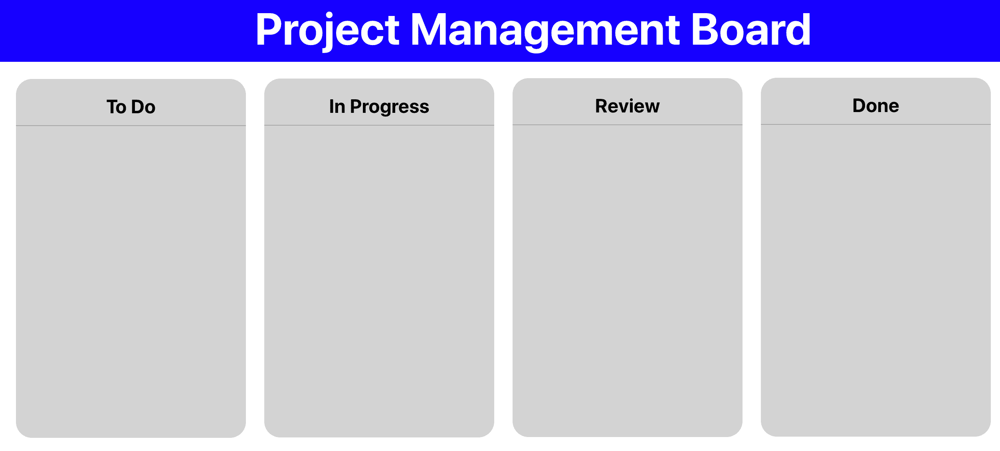
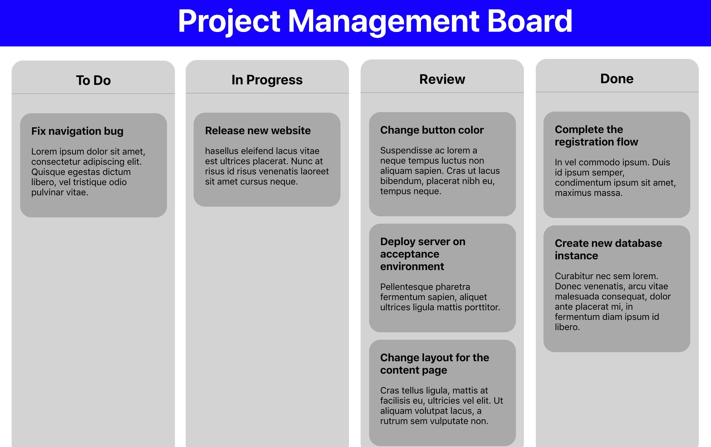
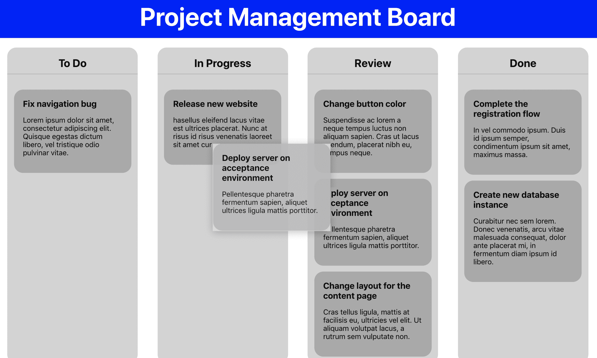

# 第三章：使用 React 和 Suspense 构建动态项目管理面板

在这本书的前两章中，你已经自己创建了两个 React 项目，现在你应该对 React 的核心概念有了扎实的理解。到目前为止，你已经使用的概念也将在本章中用于创建你的第三个 React 项目，其中包括一些新的和更高级的概念，这将展示出使用 React 的强大之处。如果你觉得自己可能缺乏完成本章内容所需的一些知识，你可以随时重复你到目前为止所建立的内容。

本章将再次使用 Create React App，这是你在上一章中使用过的。在开发本章的项目管理面板应用程序时，你将使用使用`styled-components`创建的可重用组件。之后，你将使用更高级的 React 技术来控制组件中的数据流。此外，将使用 HTML5 Web API 来动态拖放作为**高阶组件**（**HOC**）的组件。

本章将涵盖以下主题：

+   React Suspense 和代码拆分

+   使用 HOC

+   动态数据流

# 项目概述

在本章中，我们将使用 Create React App 和`styled-components`创建一个可重用的 React 组件和样式的**渐进式 Web 应用程序**（**PWA**）。该应用程序将具有使用 HTML5 拖放 API 的动态拖放界面。

构建时间为 1.5-2 小时。

# 入门

在本章中，我们将创建一个基于 GitHub 上初始版本的项目：[`github.com/PacktPublishing/React-Projects/tree/ch3-initial`](https://github.com/PacktPublishing/React-Projects/tree/ch3-initial)。完整的源代码也可以在 GitHub 上找到：[`github.com/PacktPublishing/React-Projects/tree/ch3`](https://github.com/PacktPublishing/React-Projects/tree/ch3)。

从 GitHub 下载初始应用程序后，我们可以进入其根目录并运行`npm install`命令。这将安装来自 Create React App 的核心包（`react`、`react-dom`和`react-scripts`），以及我们在上一章中使用的`styled-components`包。安装完成后，我们可以通过执行`npm start`命令启动应用程序，并通过访问`http://localhost:3000`在浏览器中访问项目。

我们还可以通过执行`npm run build`，然后`serve -s build`来构建应用程序。现在可以访问应用程序的缩小版本`http://localhost:5000`。由于它被设置为 PWA，即使没有任何互联网连接，它也可以工作。

如果您之前构建并提供了 Create React App PWA，可能会看到与在本地运行项目时不同的应用程序。这是由于 PWA 的 service worker 在浏览器中存储了该应用程序的缓存版本。您可以通过打开`devTools`并打开`Application`选项卡，在`Clear storage`部分中单击`Clear site data`按钮来从浏览器缓存中删除任何先前的应用程序。

如下截图所示，该应用程序具有一个基本的标题和分为四列。这些列是**项目管理看板**的车道，一旦我们将项目连接到数据文件，它们将包含各个票证：



正如我们在第二章中提到的，*使用可重用的 React 组件创建渐进式 Web 应用程序*，我们可以通过访问`Application`选项卡的`Service Workers`部分来检查当没有互联网连接时我们的应用程序是否正在运行。在此页面上，我们可以选中`Offline`复选框，然后尝试刷新浏览器。

如果我们查看项目的结构，我们会发现它的结构与前几章的项目相同。应用程序的入口点是`src/index.js`文件，它渲染了一个名为`App`的组件，该组件包含两个其他组件，分别是`Header`和`Board`。第一个是应用程序的实际标题，而`Board`组件包含我们在应用程序中看到的四个列。这些列由`Lane`组件表示。

此外，在`assets`目录中，我们会看到一个名为`data.json`的文件，其中包含我们可以在项目管理看板上显示的数据：

```jsx
project-management-board
|-- assets
    |-- data.json
|-- node_modules
|-- public
    |-- favicon.ico
    |-- index.html
    |-- manifest.json
|-- src
    |-- components
        |-- Header
            |-- Header.js
        |-- Lane
            |-- Lane.js
    |-- containers
        |-- App.js
        |-- Board.js
    |-- index.js
    |-- serviceWorker.js
.gitignore
package.json
```

# 创建项目管理看板应用

在本节中，我们将创建一个使用 React API（如 Suspense 和 HTML5 拖放 API）的项目管理看板 PWA。我们将使用 Create React App，可以在本章的 GitHub 存储库中找到。

# 处理数据流

在放置初始版本的应用程序之后，下一步是从数据文件中获取数据并通过组件处理其流程。为此，我们将使用 React Suspense 和 memo。使用 Suspense，我们可以访问 React 懒加载 API 来动态加载组件，并且使用 memo，我们可以控制哪些组件在其 props 更改时应该重新渲染。

本节的第一部分将向我们展示如何使用 React 生命周期方法从数据源加载数据并在 React 组件中显示。

# 加载和显示数据

加载和显示从数据源检索的数据是我们在上一章中做过的事情。本节将进一步探讨这一点。按照以下步骤开始：

1.  我们将从数据文件中获取项目数据开始。为此，我们需要向`Board`组件添加必要的函数。我们需要这些函数来访问 React 生命周期。这些是`constructor`，在其中设置初始状态，以及`componentDidMount`，在其中将获取数据：

```jsx
...
class Board extends Component {
+ constructor() {
+   super();
+   this.state = {
+     data: [],
+     loading: true,
+     error: '',
+   }
+ }

+ async componentDidMount() {
+   try {
+     const tickets = await fetch('../../assets/data.json');
+     const ticketsJSON = await tickets.json();

+     if (ticketsJSON) {
+       this.setState({
+         data: ticketsJSON,
+         loading: false,
+       });
+     }
+   } catch(error) {
+     this.setState({
+      loading: false,
+      error: error.message,
+    });
+   }
+ }

  render() {
    ...
  }
}

export default Board;
```

在`componentDidMount`生命周期函数中，在`try..catch`语句内获取数据。此语句捕获从数据获取过程返回的任何错误，并用此消息替换错误状态。

1.  现在，我们可以将票务分发到相应的车道上：

```jsx
...
class Board extends Component {
  ...
  render() {
+   const { data, loading, error } = this.state;

    const lanes = [
      { id: 1, title: 'To Do' },
      { id: 2, title: 'In Progress' },
      { id: 3, title: 'Review' },
      { id: 4, title: 'Done' },
    ];

    return (
      <BoardWrapper>
        {lanes.map(lane =>
          <Lane
            key={lane.id}
            title={lane.title}
+           loading={loading}
+           error={error}
+           tickets={data.filter(ticket => ticket.lane === 
            lane.id)}
          />
        )}
      </BoardWrapper>
    );
  }
}

export default Board;
```

在上述代码中，我们可以看到，在`render`内部，`data`，`loading`和`error`常量已经从状态对象中解构出来。在迭代`lanes`常量的函数内部，这些值应该作为 props 传递给`Lane`组件。对于数据状态，有一些特殊的情况，因为`filter`函数被用来仅返回与车道 ID 匹配的`data`状态的票。

3. 接下来，我们需要对`Lane`组件进行一些更改：

```jsx
import React from 'react';
import styled from 'styled-components';
+ import Ticket from '../Ticket/Ticket';

...

+ const TicketsWrapper = styled.div`
+  padding: 5%;
+ `;

+ const Alert = styled.div`
+  text-align: center;
+ `;

- const Lane = ({ title }) => (
+ const Lane = ({ tickets, loading, error, title }) => (
    <LaneWrapper>
      <Title>{title}</Title>
+     {(loading || error) && <Alert>{loading ? 'Loading...' : 
       error}</Alert>}
+     <TicketsWrapper>
+       {tickets.map(ticket => <Ticket key={ticket.id} 
         ticket={ticket} />)}
+     </TicketsWrapper>
    </LaneWrapper>
);

export default Lane;
```

1.  `Lane`组件现在需要三个其他 props，即`tickets`，`loading`和`error`，其中`tickets`包含来自`data`状态的票数组，`loading`表示是否应显示加载消息，`error`包含错误消息（如果有的话）。我们可以看到已经创建了一个包装器，并且在`map`函数内部，将呈现显示票务信息的`Ticket`组件。这个`Ticket`组件也是我们需要在`src/components`目录中创建的：

```jsx
import React from 'react';
import styled from 'styled-components';

const TicketWrapper = styled.div`
  background: darkGray;
  padding: 20px;
  border-radius: 20px;

  &:not(:last-child) {
    margin-bottom: 5%;
  }
`;

const Title = styled.h3`
  width: 100%;
  margin: 0px;
`;

const Body = styled.p`
  width: 100%;
`;

const Ticket = ({ ticket }) => (
  <TicketWrapper>
    <Title>{ticket.title}</Title>
    <Body>{ticket.body}</Body>
  </TicketWrapper>
);

export default Ticket;
```

如果我们在网页浏览器中访问`http://localhost:3000`，我们会看到以下内容：


由于此应用程序已设置为 PWA，我们可以重新构建项目并重新启动服务工作程序。在离线模式下，项目应该仍然显示标题和四列，并在这些列内显示一个消息，显示“无法获取*”。

要构建和提供 PWA，我们需要在构建过程完成后运行`npm run`和`serve -s build`。现在，我们可以访问项目`http://localhost:5000`。我们可能需要重新启动服务工作程序，在`devTools`中的“应用程序”选项卡上可以执行此操作，并选择“服务工作程序”部分。在此部分的右侧，紧挨服务工作程序，按“更新”。要在离线模式下查看应用程序，我们需要选中“离线”复选框。

从数据源获取数据是可以在整个应用程序中重复使用的逻辑。在下一节中，我们将探讨如何使用 HOC 在多个组件之间重用此逻辑。

# 开始使用 HOC

HOC 是 React 中的高级功能，专注于组件的可重用性。它们不是官方的 React API 的一部分，但引入了一种在核心团队和许多库中流行的模式。

在本节的第一部分中，我们将创建我们的第一个 HOC，该 HOC 使用逻辑从我们在上一节中创建的数据源中检索数据。

# 创建 HOC

正如我们之前提到的，HOC 专注于重用组件。因此，它可以最好地描述如下：

“HOC 是一个接受组件并返回一个新组件的函数。”

为了解释这在实践中意味着什么，让我们创建一个示例。我们的项目有一个`Board`组件，它获取并呈现所有的车道。在这个组件中有逻辑，以`constructor`、`componentDidMount`的形式，以及关于如何呈现每个`Lane`组件的信息。我们如何处理只想显示一个没有车道，只有票的情况？我们只是向`Board`组件发送不同的 props 吗？当然，这是可能的，但在 React 中，这就是 HOC 的用途。

一个没有`lanes`的`Board`组件将不会映射所有的`lanes`并将相应的`lane`作为 props 渲染。相反，它将映射所有的`tickets`并直接渲染它们。尽管渲染的组件不同，但设置初始状态、获取数据和渲染组件的逻辑可以被重用。HOC 应该能够通过将这个组件发送给它以及一些额外的 props，为`Board`组件添加生命周期。

要创建 HOC，将一个名为`withDataFetching.js`的新文件放在`src`目录中。现在，按照以下步骤进行操作：

1.  首先，我们需要导入 React 并创建一个新的 HOC 函数，它成为默认导出。由于这个 HOC 将为数据获取添加生命周期，让我们称这个 HOC 为`withDataFetching`，并让它以组件作为参数。这个函数应该返回另一个组件。

```jsx
+ import React from 'react';

+ export default function withDataFetching(WrappedComponent) {
+   return class extends React.Component {

+ }
```

1.  在返回的组件内部，添加`constructor`组件，它的结构几乎与`Board`组件相同。

```jsx
...

export default function withDataFetching(WrappedComponent) {
  return class extends React.Component {
+   constructor(props) {
+     super(props);
+     this.state = {
+       data: [],
+       loading: true,
+       error: '',
+     };
+   }
...
```

1.  接下来，我们需要创建`componentDidMount`函数，这是数据获取的地方。`dataSource`属性被用作获取数据的位置。另外，请注意，常量名称现在更加通用，不再指定单一用途。

```jsx
export default function withDataFetching(WrappedComponent) {
  return class extends React.Component {

  ...

+ async componentDidMount() {
+   try {
+     const data = await fetch(this.props.dataSource);
+     const dataJSON = await data.json();

+     if (dataJSON) {
+       this.setState({
+         data: dataJSON,
+         loading: false,
+       });
+     }
+   } catch(error) {
+     this.setState({
+       loading: false,
+       error: error.message,
+     });
+   }
+ }

 ...
```

1.  在`render`函数中，我们可以返回插入到函数中的`WrappedComponent`，并将`data`、`loading`和`error`状态作为 props 传递。重要的是要理解，它还接受任何通过`{...this.props}`扩展的额外 props。

```jsx
export default function withDataFetching(WrappedComponent) {
  return class extends React.Component {

    ...

+   render() {
+     const { data, loading, error } = this.state;

+     return (
+       <WrappedComponent 
+         data={data} 
+         loading={loading} 
+         error={error}
+         {...this.props} 
+       />
+     );
+   }
  };
}
```

恭喜！你已经创建了你的第一个 HOC！但是，它需要一个组件来返回一个支持数据获取的组件。因此，我们需要将我们的`Board`组件重构为一个函数组件。让我们开始吧：

1.  从`src/withDataFetching.js`文件中导入 HOC：

```jsx
import React, { Component } from 'react';
import styled from 'styled-components';
+ import withDataFetching from '../withDataFetching';
import Lane from '../components/Lane/Lane';

const BoardWrapper = styled.div`
  display: flex;
  justify-content: space-between;
  flex-direction: row;
  margin: 5%;

  @media (max-width: 768px) {
    flex-direction: column;
  }
`;

...
```

1.  随后，我们可以从这个文件中删除整个类组件`Board`，并创建一个新的函数组件，返回我们在重构后的类组件的`return`函数中声明的 JSX。这个函数组件将以`lanes`、`loading`、`error`和`data`作为 props。

```jsx
import React, { Component } from 'react';
import styled from 'styled-components';
import withDataFetching from '../withDataFetching';
import Lane from '../components/Lane/Lane';

const BoardWrapper = ...;

+ const Board = ({ lanes, loading, error, data }) => (
+  <BoardWrapper>
+    {lanes.map(lane =>
+      <Lane
+        key={lane.id}
+        title={lane.title}
+        loading={loading}
+        error={error}
+        tickets={data.filter(ticket => ticket.lane === lane.id)}
+      />
+    )}
+  </BoardWrapper>
+ ); export default Board;
```

3. 最后，导出函数组件以及 HOC 函数：

```jsx
...
const Board = ({ lanes, loading, error, data }) => (
  <BoardWrapper>
    {boards.map(lane =>
      <Lane
        key={lane.id}
        title={lane.title}
        loading={loading}
        error={error}
        tickets={data.filter(ticket => ticket.lane === lane.id)}
      />
    )}
  </BoardWrapper>
);

- export default Board;
+ export default withDataFetching(Board);
```

但这些 props 是从哪里来的呢？如果我们打开应用程序并打开浏览器，我们会看到以下错误：

```jsx
TypeError: Cannot read property 'map' of undefined
```

这是因为我们的`Board`组件尝试对`lanes`prop 进行映射，但是在 HOC 中，`WrappedComponent`接收到`data`、`loading`和`error` prop。幸运的是，我们还添加了通过组件发送的任何其他 props 的扩展选项。如果我们打开`App`组件，在那里`Board`组件被打开，我们可以使用之前在`Board`组件中声明的`lane`常量传递`lanes`prop：

```jsx
...

class App extends Component {
  render() {
+   const lanes = [
+     { id: 1, title: 'To Do' },
+     { id: 2, title: 'In Progress' },
+     { id: 3, title: 'Review' },
+     { id: 4, title: 'Done' },
+   ]

    return (
        <>
          <GlobalStyle />
            <AppWrapper>
            <Header />
-           <Board />
+           <Board lanes={lanes} />
          </AppWrapper>
        </>
    );
  }
}

export default App;
```

现在，如果我们在浏览器中查看我们的项目，我们会看到应用程序再次被渲染。然而，它显示了 HOC 中`try...catch`语句的错误消息。这个 HOC 需要`dataSource0` prop，我们也需要将其传递给`Board`组件：

```jsx
...
class App extends Component {
  render() {

    ...

    return (
        <>
          <GlobalStyle />
            <AppWrapper>
            <Header />
-           <Board lanes={lanes} />
+           <Board lanes={lanes} dataSource={'../../assets/data.json'} />
          </AppWrapper>
        </>
    );
  }
}

export default App;
```

最后，我们可以看到`Board`组件在浏览器中由 HOC 渲染。然而，正如我们之前提到的，HOC 应该重用逻辑。在下一节中，我们将学习如何通过将 HOC 添加到不同的组件来实现这一点。

# 使用 HOC

在第一个 HOC 就位的情况下，现在是时候考虑使用这个 HOC 创建其他组件，比如只显示票的组件。创建这个组件的过程包括两个步骤：创建实际的组件并导入组件并向其传递所需的 props。让我们开始吧：

1.  在 containers 目录中，我们需要创建一个名为`Tickets.js`的新文件，并将以下代码放入其中。在我们导入 HOC 的地方，使用`styled-components`设置一些基本样式，并创建一个可以导出的函数组件：

```jsx
import React from 'react';
import styled from 'styled-components';
import withDataFetching from '../withDataFetching';
import Ticket from '../components/Ticket/Ticket';

const TicketsWrapper = styled.div`
  display: flex;
  justify-content: space-between;
  flex-direction: row;
  margin: 5%;

  @media (max-width: 768px) {
    flex-direction: column;
  }
`;

const Alert = styled.div`
    text-align: center;
`;

const Tickets = ({ loading, data, error }) => (
  <TicketsWrapper>
    {(loading || error) && <Alert>{loading ? 'Loading... : 
     error}</Alert>}
    {data.map(ticket => <Ticket key={ticket.id} ticket={ticket} />)}
  </TicketsWrapper>
);

export default withDataFetching(Tickets);
```

1.  在`App`组件中，我们可以导入这个组件并向其传递一个`dataSource` prop：

```jsx
import React, { Component } from 'react';
import styled, { createGlobalStyle } from 'styled-components';
import Board from './Board';
+ import Tickets from './Tickets';
import Header from '../components/Header/Header';

...

class App extends Component {
  render() {
    ...
    return (
        <>
          <GlobalStyle />
            <AppWrapper>
            <Header />
            <Board boards={boards} 
             dataSource={'../../assets/data.json'} />
+           <Tickets dataSource={'../../assets/data.json'} />                    
            </AppWrapper>
       </>
    );
  }
}

export default App;
```

有点不对劲的是，票据显示在一起而没有任何边距。我们可以在实际的`Ticket`组件中更改这一点，但这也会改变在车道中显示的票据的边距。为了解决这个问题，我们可以传递一个被`styled-components`用于这个组件的 prop。为了做到这一点，我们需要对渲染票据的`Tickets`组件和定义样式的`Ticket`组件进行更改。让我们开始吧：

1.  在`map`函数内部向`Ticket`组件传递一个名为`marginRight`的新 prop。这个 prop 只是一个布尔值，不需要值：

```jsx
...

const Tickets = ({ loading, data, error }) => (
  <TicketsWrapper>
    {(loading || error) && <Alert>{loading ? 'Loading...' : 
      error}</Alert>}
-   {data.map(ticket => <Ticket key={ticket.id} ticket={ticket} />)}
+   {data.map(ticket => <Ticket key={ticket.id} marginRight ticket={ticket} />)}
  </TicketsWrapper>
);

export default withDataFetching(Tickets);
```

1.  在`Ticket`组件中，我们需要解构这个 prop 并将它传递给我们用`styled-components`创建的`TicketWrapper`：

```jsx
import React from 'react';
import styled from 'styled-components';

const TicketWrapper = styled.div`
  background: darkGray;
  padding: 20px;
  border-radius: 20px;

  &:not(:last-child) {
    margin-bottom: 5%;
+   margin-right: ${props => !!props.marginRight ? '1%' : '0'};
  }
`;

...

- const Ticket = ({ ticket }) => (
+ const Ticket = ({ marginRight, ticket }) => (
-   <TicketWrapper>
+   <TicketWrapper marginRight={marginRight}>
      <Title>{ticket.title}</Title>
      <Body>{ticket.body}</Body>
    </TicketWrapper>
);

export default Ticket;
```

现在，我们可以通过向`Ticket`组件发送 props 来控制`TicketWrapper`的`margin-right`属性。如果我们在浏览器中查看我们的应用程序，我们会看到，在具有四个车道的`Board`组件正下方，另一个组件正在呈现一个`Ticket`组件。



我们可以自定义的另一件事是，HOC 返回的组件在 React 开发者工具中的命名方式。在浏览器中打开应用程序并查看组件树。在这里，我们可以看到我们创建的没有 HOC 的组件具有可读的命名约定，如`App`或`Header`。由 HOC 创建的组件被命名为`<_class />`。为了使这个组件树更清晰，我们可以让我们的 HOC 轻松地将这种命名约定添加到它创建的组件中。通常，我们会使用 HOC 创建的组件的名称。然而，在我们的情况下，HOC 被称为`withDataFetching`，当我们插入一个名为`Board`的组件时，在 React 开发者工具中显示的名称将是`withDataFetching(Board)`。为了设置这一点，我们需要对`withDataFetching.js`文件进行一些更改。让我们开始吧：

1.  在声明类组件之前删除`return`，并给类组件命名。为此，使用 HOC 的名称，并将第一个字符改为大写字母。这将得到`WithDataFetching`：

```jsx
import React from 'react';

export default function withDataFetching(WrappedComponent) {
- return class extends React.Component {
+ class WithDataFetching extends React.Component {
  ...
```

1.  在文件的最后几行，我们可以获取已插入 HOC 的`WrappedComponent`的名称，并将其用于通过设置返回组件的`displayName`来命名 HOC。不要忘记在文件末尾返回`WithDataFetching`类组件：

```jsx
import React from 'react';

export default function withDataFetching(WrappedComponent) {
  class WithDataFetching extends React.Component {

    ...

    render() {
      const { data, loading, error } = this.state;

      return (
        <WrappedComponent 
          data={data} 
          loading={loading} 
          error={error} 
          {...this.props} 
        />
      );
    }
  };

+ WithDataFetching.displayName = `WithDataFetching(${WrappedComponent.name})`;

+ return WithDataFetching;
}
```

再次查看 React 开发者工具，我们可以看到这些更改导致了 HOC 创建的组件具有更可读的命名约定。

在我们的应用程序中，显示在车道中的所有票据只在一个部分，因为我们希望能够将这些票据拖放到不同的车道中。我们将在下一节中学习如何做到这一点，我们将为板块添加动态功能。

# 让板块变得动态起来

通常给项目管理板提供良好用户交互的一件事是能够将票务从一个车道拖放到另一个车道。这是可以很容易地通过 HTML5 拖放 API 来实现的，该 API 在包括 IE11 在内的每个现代浏览器中都可用。

HTML5 拖放 API 使我们能够在项目管理板中拖放元素。为了实现这一点，它使用拖动事件。`onDragStart`、`onDragOver`和`onDrop`将用于此应用程序。这些事件应放置在`Lane`和`Ticket`组件上。让我们开始吧：

1.  首先，我们需要将`Board`组件从函数组件更改为类组件。我们这样做是因为票务数据需要添加到状态中，而`Board`组件是最合适的地方，因为我们可能希望`Lane`组件在其他地方被重用。我们可以通过更改`Board`常量的定义来实现这一点，如下所示：

```jsx
...
 - const Board = ({ lanes, loading, data, error }) => (
+ class Board extends React.Component {
+   render() {
+     const { lanes, loading, data, error } = this.props;

+     return (
        <BoardWrapper>
          {lanes.map(lane =>
            <Lane
              key={lane.id}
              title={lane.title}
              loading={loading}
              error={error}
              tickets={data.filter(ticket => ticket.lane ===  
              lane.id)}
            />
          )}
        </BoardWrapper>
      );
+   }
+ }

export default withDataFetching(Board);
```

1.  现在，我们可以将票务的初始值添加到状态中。我们这样做是因为我们希望更改应该放置在的车道的键。通过将这些数据添加到状态中，我们可以使用`setState`函数动态地改变它。

```jsx
...
class Board extends React.Component {
+ constructor() {
+   super();
+   this.state = {
+     tickets: [],
+   };
+ } 
  render() {
  ...
```

1.  由于数据需要从源加载，并且在应用程序首次挂载时不可用，我们需要检查这些组件的 props 是否已更改。如果是，我们需要将票务数据添加到状态中。为此，使用`componentDidUpdate`生命周期方法，该方法可以将先前的 props 作为参数：

```jsx
...

class Board extends React.Component {
  constructor() {
    super()
    this.state = {
      tickets: [],
    };
  }

+ componentDidUpdate(prevProps) {
+   if (prevProps.data !== this.props.data) {
+     this.setState({ tickets: this.props.data });
+   }
+ } 
  render() {
  ...
```

1.  最后，显示来自状态的票务：

```jsx
...  
render() {
-   const { lanes, data, loading, error } = this.props; 
+   const { lanes, loading, error } = this.props;

    return (
      <BoardWrapper>
        {lanes.map(lane =>
          <Lane
            key={lane.id}
            title={lane.title}
            loading={loading}
            error={error}
-           tickets={data.filter(ticket => ticket.lane === 
            lane.id)}
+           tickets={this.state.tickets.filter(ticket => 
            ticket.lane === lane.id)}
          />
        )}
      </BoardWrapper>
    );
  }
}

export default withDataFetching(Board);
```

如果我们现在在浏览器中查看项目，应该没有可见的变化。唯一的区别是票务的数据现在是从状态中加载，而不是从 props 中加载。

在同一个文件中，让我们添加响应拖放事件的函数，这些函数需要发送到`Lane`和`Ticket`组件：

1.  首先，添加`onDragStart`事件的事件处理程序函数，该函数在开始拖动操作时触发，添加到`Board`组件。这个函数需要传递给`Lane`组件，然后可以传递给`Ticket`组件。这个函数为被拖动的票务设置一个 ID，该 ID 被用于浏览器识别拖动元素的`dataTransfer`对象：

```jsx
...
class Board extends React.Component {
  constructor() {
    super();
    this.state = {
      tickets: [],
    };
  }

  componentDidUpdate(prevProps) {
    if (prevProps.data !== this.props.data) {
        this.setState({ tickets: this.props.data });
    }
  }

+ onDragStart = (e, id) => {
+   e.dataTransfer.setData('id', id);
+ }; 
  render() {
    const { lanes, loading, error } = this.props;

    return (
      <BoardWrapper>
        {lanes.map(lane =>
          <Lane
            key={lane.id}
            title={lane.title}
            loading={loading}
            error={error}
+           onDragStart={this.onDragStart}
            tickets={this.state.tickets.filter(ticket => 
            ticket.lane === lane.id)}
          />
        )}
      </BoardWrapper>
    );
  }
}

export default withDataFetching(Board);
```

1.  在`Lane`组件中，我们需要将此事件处理程序函数传递给`Ticket`组件：

```jsx
...
- const Lane = ({ tickets, loading, error, title }) => (
+ const Lane = ({ tickets, loading, error, onDragStart, title }) => (
  <LaneWrapper>
    <Title>{title}</Title>
    {(loading || error) && <Alert>{loading ? 'Loading...' : 
     error}</Alert>}
    <TicketsWrapper>
-     {tickets.map(ticket => <Ticket key={ticket.id} 
       ticket={ticket} />)}
+     {tickets.map(ticket => <Ticket key={ticket.id} 
       onDragStart={onDragStart} ticket={ticket} />)}
    </TicketsWrapper>
  </LaneWrapper>
);

export default Lane;
```

1.  现在，我们可以在`Ticket`组件中调用这个函数，我们还需要在`TicketWrapper`中添加`draggable`属性。在这里，我们将元素和票据 ID 作为参数发送到事件处理程序：

```jsx
...
- const Ticket = ({ marginRight, ticket }) => (
+ const Ticket = ({ marginRight, onDragStart, ticket }) => (
  <TicketWrapper
+   draggable
+   onDragStart={e => onDragStart(e, ticket.id)}
    marginRight={marginRight}
  >
    <Title>{ticket.title}</Title>
    <Body>{ticket.body}</Body>
  </TicketWrapper>
);

export default Ticket;
```

做出这些更改后，我们应该能够看到每个票据都可以被拖动。但是现在不要把它们放在任何地方——其他放置事件和更新状态的事件处理程序也应该被添加。可以通过点击票据而不释放鼠标并将其拖动到另一个车道来将票据从一个车道拖动到另一个车道，如下面的截图所示：



实现了`onDragStart`事件后，`onDragOver`和`onDrop`事件也可以实现。让我们开始吧：

1.  默认情况下，不可能将元素放入另一个元素中；例如，将`Ticket`组件放入`Lane`组件中。这可以通过在`onDragOver`事件中调用`preventDefault`方法来防止：

```jsx
...
 +  onDragOver = e => {
+   e.preventDefault();
+ };

 render() {
    const { lanes, loading, error } = this.props;

    return (
      <BoardWrapper>
        {lanes.map(lane =>
          <Lane
            key={lane.id}
            title={lane.title}
            loading={loading}
            error={error}
            onDragStart={this.onDragStart}
+           onDragOver={this.onDragOver}
            tickets={this.state.tickets.filter(ticket => 
            ticket.lane === lane.id)}
          />
        )}
      </BoardWrapper>
    );
  }
}
```

2. 这个事件处理程序需要放在`Lane`组件上：

```jsx
...
- const Lane = ({ tickets, loading, error, title }) => (
+ const Lane = ({ tickets, loading, error, onDragOver, title }) => (
-   <LaneWrapper>
+   <LaneWrapper
+     onDragOver={onDragOver}
+   >
      <Title>{title}</Title>
      {(loading || error) && <Alert>{loading ? 'Loading...' : 
       error}</Alert>}
      <TicketsWrapper>
        {tickets.map(ticket => <Ticket onDragStart={onDragStart}   
         ticket={ticket} />)}
      </TicketsWrapper>
    </LaneWrapper>
);

export default Lane;
```

`onDrop`事件是让事情变得有趣的地方，因为这个事件使我们能够在完成拖动操作后改变状态。

这个事件处理程序的函数应该放在`Ticket`组件上，但在`Board`组件中定义，因为`setState`函数只能在与状态的初始值相同的文件中调用。

```jsx
...  
+  onDrop = (e, laneId) => {
+   const id = e.dataTransfer.getData('id');
+
+   const tickets = this.state.tickets.filter(ticket => {
+     if (ticket.id === id) {
+       ticket.board = boardId;
+     }
+     return ticket;
+   });
+
+   this.setState({
+     ...this.state,
+     tickets,
+   });
+ }; 
  render() {
    const { lanes, loading, error } = this.props;

    return (
      <BoardWrapper>
        {lanes.map(lane =>
          <Lane
            key={lane.id}
+           laneId={lane.id}
            title={lane.title}
            loading={loading}
            error={error}
            onDragStart={this.onDragStart}
            onDragOver={this.onDragOver}
+           onDrop={this.onDrop}
            tickets={this.state.tickets.filter(ticket => ticket.lane === 
            lane.id)}
          />
        )}
      </BoardWrapper>
    );
  }
}

export default withDataFetching(Board);
```

这个`onDrop`事件处理函数接受一个元素和车道的 ID 作为参数，因为它需要被拖动元素的 ID 和它应该放置在的新车道的 ID。有了这些信息，函数使用`filter`函数来找到需要移动的票，并改变车道的 ID。这些新信息将用`setState`函数替换状态中票的当前对象。由于`onDrop`事件是从`Lane`组件触发的，它作为一个 prop 传递给这个组件。此外，车道的 ID 也作为一个 prop 添加，因为这需要从`Lane`组件传递给`onDrop`事件处理函数：

```jsx
...
- const Lane = ({ tickets, loading, error, onDragStart, onDragOver, title }) => (
+ const Lane = ({ laneId, tickets, loading, error, onDragStart, onDragOver, onDrop, title }) => (
  <LaneWrapper
    onDragOver={onDragOver}
+   onDrop={e => onDrop(e, laneId)}
  >
    <Title>{title}</Title>
    {(loading || error) && <Alert>{loading ? 'Loading...' : error}</Alert>}
    <TicketsWrapper>
      { tickets.map(ticket => <Ticket onDragStart={onDragStart} 
        ticket={ticket} />)}
    </TicketsWrapper>
  </LaneWrapper>
);

export default Lane;
```

有了这个，我们就能在我们的看板上将票据拖放到其他车道上了。

# 总结

在本章中，您创建了一个项目管理面板，可以使用 React Suspense 和 HTML5 拖放 API 将票据从一个车道移动到另一个车道。该应用程序的数据流使用本地状态和生命周期来处理，并确定在不同车道中显示哪些票据。本章还介绍了**高阶组件**（HOCs）的高级 React 模式。使用 HOCs，您可以在应用程序中跨类组件重用状态逻辑。

这种高级模式还将在下一章中使用，该章将处理 React 应用程序中的路由和**服务器端渲染**（SSR）。您有没有尝试过使用 Stack Overflow 来找到您曾经遇到的编程问题的解决方案？我有！

在下一章中，我们将构建一个使用 Stack Overflow 作为数据源并使用 React 来渲染应用程序的社区动态。

# 进一步阅读

+   拖放 API：[`developer.mozilla.org/en-US/docs/Web/API/HTML_Drag_and_Drop_API`](https://developer.mozilla.org/en-US/docs/Web/API/HTML_Drag_and_Drop_API)。

+   HOC：[`medium.com/@dan_abramov/mixins-are-dead-long-live-higher-order-components-94a0d2f9e750`](https://medium.com/@dan_abramov/mixins-are-dead-long-live-higher-order-components-94a0d2f9e750)。

+   DataTransfer：[`developer.mozilla.org/en-US/docs/Web/API/DataTransfer`](https://developer.mozilla.org/en-US/docs/Web/API/DataTransfer)。

+   React DnD：[`github.com/react-dnd/react-dnd`](https://github.com/react-dnd/react-dnd)。
