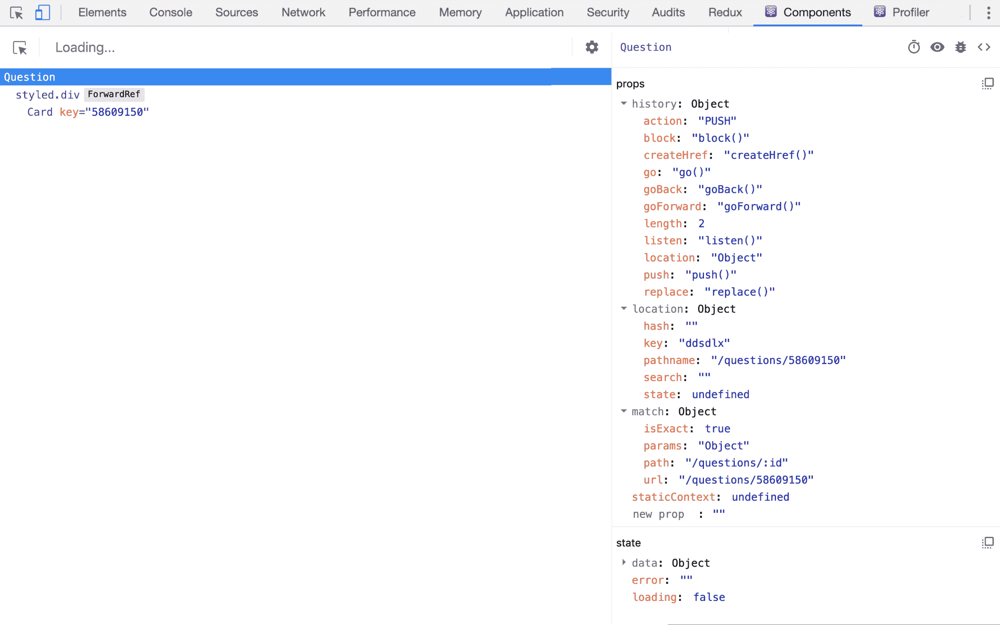
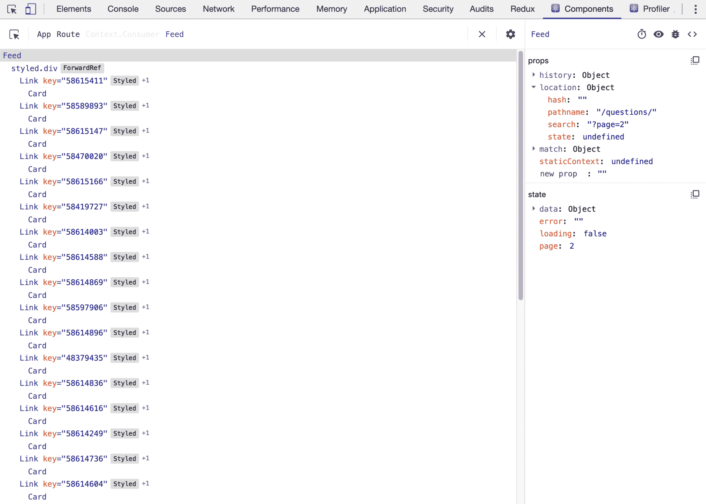

# 第四章：使用 React Router 构建基于 SSR 的社区动态

到目前为止，您已经了解到 React 应用程序通常是**单页应用程序**（**SPA**），可以用作**渐进式 Web 应用程序**（**PWA**）。这意味着应用程序是在客户端渲染的，当用户访问您的应用程序时，它会在浏览器中加载。但您是否知道 React 还支持**服务器端渲染**（**SSR**），就像您可能还记得从以前代码只能从服务器渲染的时代一样？

在这一章中，您将使用`react-router`为 Create React App 添加声明式路由，并使组件动态加载到服务器而不是浏览器。为了启用 SSR，将使用 React 特性 Suspense 与`ReactDOMServer`。如果您对**搜索引擎优化**（**SEO**）感兴趣，本章将使用 React Helmet 为页面添加元数据，以便您的应用程序可以更好地被搜索引擎索引。

本章将涵盖以下主题：

+   声明式路由

+   服务器端渲染

+   React 中的 SEO

# 项目概述

在本章中，我们将使用`react-router`创建一个支持 SSR 的 PWA，因此从服务器而不是浏览器加载。此外，该应用程序使用 React Helmet 进行搜索引擎优化。

构建时间为 2 小时。

# 入门

在本章中，我们将创建的项目是在初始版本的基础上构建的，您可以在 GitHub 上找到：[`github.com/PacktPublishing/React-Projects/tree/ch4-initial`](https://github.com/PacktPublishing/React-Projects/tree/ch4-initial)。完整的源代码也可以在 GitHub 上找到：[`github.com/PacktPublishing/React-Projects/tree/ch4`](https://github.com/PacktPublishing/React-Projects/tree/ch4)。此外，该项目使用公开可用的 Stack Overflow API 来填充应用程序的数据。这是通过获取发布到 Stack Overflow 的问题来完成的。有关此 API 的更多信息，请访问：[`api.stackexchange.com/docs/questions#order=desc&sort=hot&tagged=reactjs&filter=default&site=stackoverflow&run=true`](https://api.stackexchange.com/docs/questions#order=desc&sort=hot&tagged=reactjs&filter=default&site=stackoverflow&run=true)。

从 GitHub 下载初始项目后，您需要进入该项目的根目录并运行`npm install`。由于该项目是基于 Create React App 构建的，运行此命令将安装`react`、`react-dom`和`react-scripts`。此外，`styled-components`用于处理应用程序中所有组件的样式。安装过程完成后，您可以执行`npm`命令`start`，以便在浏览器中访问项目，网址为`http://localhost:3000`。

由于该项目设置为 PWA，服务工作者已注册，使得即使没有互联网连接也可以访问该应用。您可以通过首先运行`npm run build`，然后在构建过程完成后运行`serve -s build`来检查这一点。现在可以访问该应用的构建版本，网址为`http://localhost:5000`。如前一章所述，您可以通过访问浏览器的开发者工具中的“应用程序”选项卡来检查在没有互联网连接时应用程序是否仍然可用。在该选项卡中，您可以在左侧菜单中找到“服务工作者”；点击此链接后，您可以在出现的页面上选择“离线”复选框。

如果您之前构建并提供过 Create React App PWA，则可能看到与在本地运行项目时不同的应用程序。您可以通过打开浏览器的开发者工具并打开“应用程序”选项卡，在其中可以点击“清除站点数据”按钮来删除浏览器缓存中的任何先前应用程序。

初始应用程序位于`http://localhost:3000`，包括一个简单的标题和一系列卡片，如下面的屏幕截图所示。这些卡片有标题和元信息，如查看次数、回答次数以及提出此问题的用户的信息：


如果您查看项目的结构，它使用与之前创建的项目相同的结构。该应用程序的入口点是一个名为`src/index.js`的文件，它渲染一个名为`App`的容器组件，其中包含`Header`和`Feed`组件。`Header`组件仅显示项目的标题，而`Feed`是一个具有生命周期方法的类组件，调用 Stack Overflow API，并渲染包含 Stack Overflow 问题的`Card`组件：

```jsx
community-feed
|-- node_modules
|-- public
    |-- favicon.ico
    |-- index.html
    |-- manifest.json
|-- src
    |-- components
        |-- Header
            |-- Header.js
        |-- Card
            |-- Card.js
        |-- Owner
            |-- Owner.js
    |-- containers
        |-- App.js
        |-- Feed.js
    |-- index.js
    |-- serviceWorker.js
.gitignore
package.json
```

# 社区动态应用

在本节中，您将使用启用了 SSR 的声明式路由构建一个社区动态应用程序。为了 SEO，将使用一个名为 React Helmet 的软件包。在这个社区动态中，您可以看到 Stack Overflow 上具有`reactjs`标签的最新问题的概述，并单击它们以查看更多信息和答案。起点将是使用 Create React App 创建的项目。

# 声明式路由

使用`react-router`软件包，您可以通过添加组件来为 React 应用程序添加声明式路由。这些组件可以分为三种类型：路由器组件、路由匹配组件和导航组件。

使用`react-router`设置路由包括多个步骤：

1.  要使用这些组件，您需要通过执行以下命令来安装`react-router`的 web 软件包，称为`react-router-dom`：

```jsx
npm install react-router-dom
```

1.  安装完`react-router-dom`后，下一步是在您的应用程序入口点组件中从该软件包中导入路由和路由匹配组件。在这种情况下，这是`App`组件，它位于`src/containers`目录中：

```jsx
import React, { Component } from 'react';
import styled, { createGlobalStyle } from 'styled-components';
+ import { BrowserRouter as Router, Route } from 'react-router-dom';
import Header from '../components/Header/Header';
import Feed from './Feed';

const GlobalStyle = createGlobalStyle`...`;

const AppWrapper = styled.div`...`;

class App extends Component {
    ...
```

1.  实际的路由必须添加到该组件的`return`函数中，在那里所有的路由匹配组件(`Route`)必须包裹在一个路由组件`Router`中。当您的 URL 与`Route`的任何迭代中定义的路由匹配时，该组件将呈现添加为`component`属性的 JSX 组件：

```jsx
...
class App extends Component {
  render() {
    return (
        <>
          <GlobalStyle />
          <AppWrapper>
            <Header />
+           <Router>
+             <Route path='/' component={Feed} />
+           </Router>
          </AppWrapper>
        </>
    );
  }
}

export default App;
```

1.  如果您现在在浏览器中再次访问项目，地址为`http://localhost:3000`，将呈现显示所有问题的`Feed`组件。此外，如果您在浏览器中输入`http://localhost:3000/feed`，`Feed`组件仍将被呈现。这是因为`/`路由匹配每个可能的 URL，因为您没有定义应该进行精确匹配。因此，添加`exact`属性到`Route`：

```jsx
...
class App extends Component {
  render() {
    return (
        <>
          <GlobalStyle />
          <AppWrapper>
            <Header />
            <Router>
-             <Route path='/' component={Feed} />
+             <Route exact path='/' component={Feed} />
            </Router>
          </AppWrapper>
        </>
    );
  }
}

export default App;
```

现在，如果您访问除`/`之外的任何路由，不应该看到`Feed`组件被呈现。

如果您希望显示这些路由，例如，显示特定的问题，您需要向路由发送参数。如何做到这一点将在本节的下一部分中展示。

# 带参数的路由

有了第一个路由之后，其他路由可以添加到路由器组件中。一个合理的路由是为单独的问题添加一个路由，该路由具有指定要显示的问题的额外参数。因此，必须创建一个名为`Question`的新容器组件，其中包含从 Stack Overflow API 获取问题的逻辑。当路径匹配`/question/:id`时，将呈现此组件，其中`id`代表从 feed 中点击的问题的 ID：

1.  在`src/containers`目录中创建一个名为`Question`的新类组件，并向该文件添加一个`constructor`和一个`render`方法：

```jsx
import React, { Component } from 'react';
import styled from 'styled-components';

const QuestionWrapper = styled.div`
  display: flex;
  justify-content: space-between;
  flex-direction: column;
  margin: 5%;
`;

const Alert = styled.div`
  text-align: center;
`;

class Question extends Component {
  constructor() {
    super();
    this.state = {
      data: [],
      loading: true,
      error: '',
    };
  }

  render() {
    const { data, loading, error } = this.state;

    if (loading || error) {
      return <Alert>{loading ? 'Loading...' : error}</Alert>;
    }

    return (
      <QuestionWrapper></QuestionWrapper>
    );
  }
}

export default Question;
```

1.  要使此路由可用，您需要在`App`组件内导入此组件并为其定义一个路由：

```jsx
import React, { Component } from 'react';
import styled, { createGlobalStyle } from 'styled-components';
import { BrowserRouter as Router, Route } from 'react-router-dom';
import Header from '../components/Header/Header';
import Feed from './Feed';
+ import Question from './Question';
...
class App extends Component {
  render() {
    return (
        <>
          <GlobalStyle />
          <AppWrapper>
            <Header />
            <Router>
              <Route exact path='/' component={Feed} />
+             <Route path='/questions/:id' component={Question} />
            </Router>
          </AppWrapper>
        </>
    );
  }
}

export default App;
```

如果您现在访问`http://localhost:3000/questions/55366474`，由于尚未实现数据获取，将显示`Loading...`消息。`Route`组件将 props 传递给它渲染的组件，在本例中是`Question`；这些 props 是`match`，`location`和`history`。您可以通过打开 React 开发者工具并搜索`Question`组件来查看这一点，将返回以下结果：



`match`属性是最有趣的，因为它包含了`id`参数的值。`location`和`history`属性包含了有关应用程序当前位置和过去位置的信息。

您还可以通过使用`withRouter`**Higher-Order Component** (**HOC**)访问`react-router` props，该组件在每次渲染时将`match`，`location`和`history` props 传递给包装组件。这样，您可以在应用程序的任何位置使用`history.goBack`或`history.push`等方法。在第三章中，*使用 React 和 Suspense 构建动态项目管理面板*，您已经看到了使用 HOC 的示例；`withRouter` HOC 以相同的方式实现。

在`Question`组件上实现数据获取，您需要检查`id`参数并从 Stack Overflow API 中获取相应的问题：

1.  因此，应向`Question`添加一个`componentDidMount`方法，该方法使用此参数获取 API：

```jsx
...

+ const ROOT_API = 'https://api.stackexchange.com/2.2/';

class Question extends Component {
  constructor(props) { ... }

+ async componentDidMount() {
+   const { match } = this.props;
+   try {
+     const data = await fetch(
+       `${ROOT_API}questions/${match.params.id}?site=stackoverflow`,
+     );
+     const dataJSON = await data.json();

+     if (dataJSON) {
+       this.setState({
+         data: dataJSON,
+         loading: false,
+       });
+     }
+   } catch(error) {
+     this.setState({
+       loading: true,
+       error: error.message,
+     });
+   }
+ }

  render() {
    ...
```

1.  然后，获取的数据可以显示在`Card`组件内。请记住，当进行此请求时，Stack Overflow API 返回的是一个数组而不是单个对象：

```jsx
import React, { Component } from 'react';
import styled from 'styled-components';
+ import Card from '../components/Card/Card';

...

class Question extends Component {
  ...
  render() {
    const { data, loading, error } = this.state;

    if (loading || error) {
      return <Alert>{loading ? 'Loading...' : error}</Alert>;
    }

    return (
      <QuestionWrapper>
+       <Card key={data.items[0].question_id} data={data.items[0]} />
      </QuestionWrapper>
    );
  }
}

export default Question;
```

1.  如果你现在刷新`http://localhost:3000/questions/55366474`，将显示一个显示有关这个特定问题信息的`Card`组件。为了能够从`Feed`组件导航到这个页面，应该添加一个`Link`导航来包裹`Card`：

```jsx
import React, { Component } from 'react';
import styled from 'styled-components';
+ import { Link } from 'react-router-dom';
import Card from '../components/Card/Card';

...

class Feed extends Component {
  ...
  render() {
    const { data, loading, error } = this.state;

    if (loading || error) {
      return <Alert>{loading ? 'Loading...' : error}</Alert>;
    }

    return (
      <FeedWrapper>   
        {data.items.map(item =>
+         <Link key={item.question_id} to={`/questions/${item.question_id}`}>
-            <Card key={item.question_id} data={item} />
+            <Card data={item} />
+          </Link>
+ )}
       </FeedWrapper>
     );
   }
}

export default Feed;
```

1.  当你访问`http://localhost:3000/`时，你可能会注意到`Card`组件现在是可点击的，并链接到一个新页面，显示你刚刚点击的问题。`Card`组件的样式也发生了变化，因为`Link`导航组件是一个`a`元素；它会添加下划线并改变填充。你需要做以下更改来修复这些样式变化：

```jsx
...
+ const CardLink = styled(Link)`
+  text-decoration: none;
+  color: inherit;
+ `; 
const  ROOT_API  =  'https://api.stackexchange.com/2.2/'; 
class Feed extends Component {
  ...
  render() {
    const { data, loading, error } = this.state;

    if (loading || error) {
      return <Alert>{loading ? 'Loading...' : error}</Alert>;
    }

    return (
      <FeedWrapper>
        {data.items.map(item => (
-         <Link key={item.question_id} to={`/questions/${item.question_id}`}>
+         <CardLink key={item.question_id} to={`/questions/${item.question_id}`}>
            <Card data={item} />
-         </Link>
+         </CardLink>
        ))}
      </FeedWrapper>
    );
  }
}

export default Feed;
```

现在，样式应该恢复了，你可以导航到问题路由以查看单个问题。但除了参数之外，还有其他方法可以使用路由进行过滤或向其传递数据，即查询字符串。这些将在本章的下一部分中进行探讨。

# 处理查询字符串

当你想要为项目添加路由时，能够导航到单个问题只是其中的一部分，分页可能是另一个部分。为此，将所有问题的概述移动到另一个名为`/questions`的路由可能是一个好主意。为此，你需要在`App`组件中的`Router`中添加另一个引用`Feed`组件的`Route`：

```jsx
...
class App extends Component {
  render() {
    return (
       <>
         <GlobalStyle />
         <AppWrapper>
           <Header />
           <Router>
             <Route exact path='/' component={Feed} />
+            <Route path='/questions' component={Feed} />
             <Route path='/questions/:id' component={Question} />
           </Router>
          </AppWrapper>
        </>
     );
   }
 }

 export default App;
```

然而，如果你现在访问该项目并尝试点击任何一个问题，你会发现渲染的组件和 URL 都没有改变。由于`react-router`的设置方式，它会导航到与当前 URL 匹配的任何路由。为了解决这个问题，你需要添加一个`Switch`路由匹配组件，它的工作原理类似于 switch 语句，并且会渲染与当前位置匹配的第一个`Route`。

1.  你可以在`scr/containers/App.js`文件中从`react-router-dom`包中导入`Switch`：

```jsx
import React, { Component } from 'react';
import styled, { createGlobalStyle } from 'styled-components';
- import { BrowserRouter as Router, Route } from 'react-router-dom';
+ import { BrowserRouter as Router, Route, Switch } from 'react-router-dom'; 
...
```

1.  并将这个`Switch`放在`Router`中，路由的顺序必须改变，以确保每当有一个`id`参数时，这个路由将首先被渲染。

```jsx
...
class App extends Component {
  render() {
    return (
      <>
        <GlobalStyle />
        <AppWrapper>
          <Header />
          <Router>
+         <Switch>
            <Route exact path='/' component={Feed} />
-           <Route path='/questions' component={Feed} />
            <Route path='/questions/:id' component={Question} />
+           <Route path='/questions' component={Feed} />
+         </Switch>
          </Router>
        </AppWrapper>
       </>
     );
   }
 }

 export default App;
```

现在`/questions`和`/questions/:id`路由将返回正确的组件，即`Feed`或`Question`组件。有了这个设置，下一步是添加分页。如果你查看 API 响应，返回的对象有一个叫做`has_more`的字段。如果这个字段的值是`true`，就意味着你可以通过在 API 请求中添加`page`查询字符串来请求更多问题。

你可以尝试将这个查询字符串添加到浏览器中的 URL 中，访问`http://localhost:3000/questions?page=2`。这个查询字符串现在作为`Feed`组件的一个 prop 出现在`location`对象的`search`字段下，你可以在 React Developer Tools 的输出中看到它：



不幸的是，`react-router`没有一个标准的解决方案来轻松地获取`location.search`的值。因此，你需要使用`npm`安装`query-string`包：

```jsx
npm install query-string
```

这个包被创建用来解析查询字符串，比如`location.search`，将其转换为你可以在应用程序中使用的对象：

1.  你可以通过在`Feed`组件中导入包来实现这一点：

```jsx
import React, { Component } from 'react';
import styled from 'styled-components';
+ import queryString from 'query-string';

...
```

1.  现在，你可以在`constructor`方法中解析`page`查询字符串的值，并将这个解析后的值添加到`state`中。确保使用 JavaScript 的`parseInt`函数，这样页面将成为一个整数而不是一个字符串。如果没有可用的页面查询字符串，就假定你正在访问第一页：

```jsx
...
class Feed extends Component {
- constructor() {
-   super();
+ constructor(props) {
+   super(props);
+   const query = queryString.parse(props.location.search);
    this.state = {
      data: [],
+     page: (query.page) ? parseInt(query.page) : 1,
      loading: true,
      error: '',
    };
}
...
```

1.  如果`state`中有`page`查询字符串的值，你可以将其发送到 API，以获取你指定的页面号的问题：

```jsx
...
async componentDidMount() {
+ const { page } = this.state;
  try {
-   const data = await fetch(
-     `${ROOT_API}questions/${match.params.id}?site=stackoverflow`,
-   );
+   const data = await fetch(
+     `${ROOT_API}questions?order=desc&sort=activity&tagged=reactjs&site=stackoverflow${(page) ? `&page=${page}` : ''}`,
+   );
    const dataJSON = await data.json();

    if (dataJSON) {
      this.setState({
        data: dataJSON,
        loading: false,
      });
    }
  } catch(error) {
    this.setState({
      loading: false,
      error: error.message,
    });
  }
}
...
```

你可以通过更改`page`的查询字符串来测试它是否有效，比如`http://localhost:3000/questions?page=1`或`http://localhost:3000/questions?page=3`。为了使应用程序更加用户友好，让我们在页面底部添加分页按钮。

1.  创建`PaginationBar`组件，其中包含两个`Button`组件，它们是来自`react-router`的样式化的`Link`组件：

```jsx
...
 + const PaginationBar = styled.div`
+  width: 100%;
+  display: flex;
+  justify-content: space-between;
+ `;

+ const PaginationLink = styled(Link)`
+  padding: 1%;
+  background: lightBlue;
+  color: white;
+  text-decoration: none
+  border-radius: 5px;
+ `;

const  ROOT_API  =  'https://api.stackexchange.com/2.2/'; class Feed extends Component {
  ...
```

1.  现在你可以将这些添加到`FeedWrapper`的底部。

```jsx
...
render() {
  const { data, loading, error } = this.state;

    if (loading || error) {
      return <Alert>{loading ? 'Loading...' : error}</Alert>;
    }

    return (
      <FeedWrapper>
        {data.items.map(item => (
          <CardLink key={item.question_id} to={`/questions/${item.question_id}`}>
            <Card data={item} />
          </CardLink>
        ))} +       <PaginationBar>
+         <PaginationLink>Previous</PaginationLink>
+         <PaginationLink>Next</PaginationLink>
+       </PaginationBar>
      </FeedWrapper>
    );
  }
}

export default Feed;
```

1.  这些`PaginationLink`组件应该链接到某个地方，以便用户能够导航到不同的页面。为此，可以从`match`属性中获取当前 URL，并且当前页码在`state`中可用。请注意，只有当页码大于 1 时，才应显示上一页按钮，而只有当 API 响应表明返回的结果比返回的结果更多时，才应显示下一页按钮：

```jsx
...

render() {
- const { data, loading } = this.state; 
+ const { data, page, loading } = this.state;
+ const { match } = this.props;

  if (loading || error) {
    return <Alert>{loading ? 'Loading...' : error}</Alert>;
  }

  return (
    <FeedWrapper>
      {data.items.map(item => (
        <CardLink key={item.question_id} to={`/questions/${item.question_id}`}>
          <Card data={item} />
        </CardLink>
      ))}
      <PaginationBar>
-       <PaginationLink>Previous</PaginationLink>
-       <PaginationLink>Next</PaginationLink>
+       {page > 1 && <PaginationLink to={`${match.url}?page=${page - 1}`}>Previous</PaginationLink>}
+       {data.has_more && <PaginationLink to={`${match.url}?page=${page + 1}`}>Next</PaginationLink>}
      </PaginationBar>
     </FeedWrapper>
    );
  }
}

export default Feed;
```

然而，如果您现在尝试单击下一个（或上一个）按钮，URL 将更改，显示的问题不会更改。通过使用`componentDidMount`方法，API 将仅在应用程序首次挂载后调用。要在应用程序已经挂载时监视`props`或`state`的任何更改，您需要使用另一个称为`componentDidUpdate`的生命周期方法。该方法可以监视`props`或`state`的更改，因为它可以访问更新之前的`props`和`state`的值。它们在`componendDidUpdate`方法中作用域内，作为`prevProps`和`prevState`参数，您可以比较它们以检查在任何`props`或`state`更改时是否需要再次获取 API。

1.  实现这一点的第一步是创建一个获取 API 的函数，该函数还可以在`componentDidMount`方法之外使用。此函数应将`page`号作为参数，以便可以获取正确的页面：

```jsx
...
+ async fetchAPI(page) {
+   try {
+     const data = await fetch(`${ROOT_API}questions?order=desc&sort=activity&tagged=reactjs&site=stackoverflow${(page) ? `&page=${page}` : ''}`);
+     const dataJSON = await data.json();
+
+     if (dataJSON) {
+       this.setState({
+         data: dataJSON,
+         loading: false,
+       });
+     }
+   } catch(error) {
+     this.setState({
+      loading: false,
+      error: error.message,
+    });
+  }
+ }

async componentDidMount() {
  ...
```

1.  创建此函数后，可以在`componentDidMount`方法中调用它，因为这不再需要是一个异步函数，因为这已经由新的`fetchAPI`函数处理。因此，该方法可以被删除并替换为以下内容：

```jsx
...
 - async componentDidMount() { ... }

+ componentDidMount() {
+  const { page } = this.state;
+  this.fetchAPI(page);
+ } render() {
  ...
```

1.  在`componentDidMount`方法之后，您需要添加新的`componentDidUpdate`生命周期方法。如前所述，这可以将`prevProps`和`prevState`作为参数，但是由于导航到新 URL 只会更改`props`，因此只使用前者。在这里，您需要检查查询字符串是否已更改。如果它们已更改，则需要使用`page`查询字符串的新解析值更新`state`，并调用`fetchAPI`函数以获取此页面的结果：

```jsx
...  
componentDidMount() {
  const { page } = this.state;
  this.fetchAPI(page);
}

+ componentDidUpdate(prevProps) {
+  if (prevProps.location.search !== this.props.location.search) {
+    const query = queryString.parse(this.props.location.search);
+    this.setState({ page: parseInt(query.page) }, () => 
+      this.fetchAPI(this.state.page),
+    );
+  }
+ }

render() {
...
```

在使用`componentDidUpdate`生命周期方法时，您应始终确保将`prevProps`或`prevState`与当前的`props`或`state`进行比较。`componentDidUpdate`方法会不断调用，当您不比较任何值时，可能会导致应用程序崩溃的无限循环。

您现在已经实现了解析查询字符串以动态更改应用程序路由的功能。在下一节中，您将探索 React 的另一项功能，即 SRR，它使您能够从服务器上提供应用程序，而不是在运行时进行渲染。

# 启用 SSR

使用 SSR 可以帮助您构建需要快速渲染的应用程序，或者当您希望在网页可见之前加载某些信息时。尽管大多数搜索引擎现在能够渲染 SPA，但如果您希望用户在社交媒体上分享您的页面，这仍然可以是一个改进。

# 使用 react-router 创建 express 服务器

没有标准模式可以为您的 React 应用程序启用 SSR，但起点是创建一个 Node.js 服务器，该服务器为应用程序的构建版本提供服务。为此，您将使用一个名为`express`的 Node.js 的最小 API 框架。此外，您已经使用的包，如`react-router`和`styled-components`，也可以与 SSR 一起使用：

1.  您可以通过运行以下命令来安装`express`：

```jsx
npm install express
```

1.  现在，您必须在项目的根目录中创建一个名为`server`的新目录，并在其中放置一个名为`server.js`的新文件。在此文件中，您可以放置以下代码块来导入您需要运行 Node.js 服务器、`react`和`react-dom/server`的软件包，后者用于从服务器渲染您的应用程序：

```jsx
import path from 'path';
import fs from 'fs';
import express from 'express';
import React from 'react';
import ReactDOMServer from 'react-dom/server';
```

1.  在这些导入的正下方，您需要导入应用程序的入口点，该入口点应该由服务器进行渲染：

```jsx
import path from 'path';
import fs from 'fs';
import express from 'express';
import React from 'react';
import ReactDOMServer from 'react-dom/server';

+ import App from '../src/containers/App';
```

1.  在定义了入口点之后，可以添加用`express`设置 Node.js 服务器并使其监听服务器上的所有端点的代码。首先，您需要设置`express`将运行的端口，之后，您定义所有与`/*`通配符匹配的路由应返回由`ReactDOMServer`呈现为字符串的应用程序的静态版本。这是通过获取`index.html`构建文件的内容并用包含`App`组件的服务器渲染版本的新标记替换`<div id="root"></div>`标记来完成的：

```jsx
...
const PORT = 8080;
const app = express();

app.get('/*', (req, res) => {
  const context = {};
  const app = ReactDOMServer.renderToString(<App />);

  const indexFile = path.resolve('./build/index.html');
  fs.readFile(indexFile, 'utf8', (err, data) => {
    if (err) {
      console.error('Something went wrong:', err);
      return res.status(500).send('Oops, better luck next time!');
    }

    data = data.replace('<div id="root"></div>', `<div id="root">${app}</div>`);

    return res.send(data);
  });
});
```

1.  并且通过将以下代码块添加到此文件的底部，使此`express`服务器监听您定义的`8080`端口：

```jsx
...
app.listen(PORT, () => {
  console.log(`Server-Side Rendered application running on port ${PORT}`);
});
```

1.  最后，您需要更改`src/index.js`中应用程序的入口点的方式。在这个文件中，`ReactDOM.render`需要被`ReactDOM.hydrate`替换，因为 Node.js 服务器试图通过注入服务器渲染版本来更改`index.html`构建文件的标记：

```jsx
import React from 'react';
import ReactDOM from 'react-dom';
import App from './containers/App';
import * as serviceWorker from './serviceWorker';

+ ReactDOM.hydrate(<App />, document.getElementById('root'));

...
```

然而，这个 Node.js 服务器无法使用 React 应用程序使用的任何 webpack 配置，因为其代码不在`src`目录中。为了能够运行这个 Node.js 服务器，您需要为`server`目录配置 Babel 并安装一些 Babel 包。这是您在第一章中做过的事情：

1.  应该安装的 Babel 包是`@babel/polyfill`，它编译诸如`async`/`await`之类的函数；`@babel/register`告诉 Babel 它应该转换扩展名为`.js`的文件；`@babel/preset-env`和`@babel/preset-react`用于配置 Babel 以与 React 一起工作：

```jsx
npm install @babel/polyfill @babel/register @babel/preset-env @babel/preset-react
```

1.  在`server`目录内的一个名为`index.js`的新文件中，您现在可以要求这些包，并使此文件作为`server.js`文件的入口点：

```jsx
require('@babel/polyfill');

require('@babel/register')({
 presets: ['@babel/preset-env', '@babel/preset-react'],
});

require('./server');
```

1.  您应该能够通过执行`node server/index.js`命令来运行`server/index.js`文件。因此，在`package.json`中的 scripts 字段中为此命令创建一个快捷方式：

```jsx
...  
"scripts": {
  "start": "react-scripts start",
  "build": "react-scripts build",
  "test": "react-scripts test",
  "eject": "react-scripts eject",
+  "ssr": "node server/index.js"
},
```

在运行`npm run ssr`命令之前，您应该始终在 Node.js 服务器使用构建版本之前执行`npm run build`。如果您现在运行`npm run ssr`命令，您将收到一个错误，提示“BrowserRouter 需要 DOM 来渲染”。由于`react-router`的设置方式，您需要在使用 SSR 时使用`StaticRouter`组件，而不是`BrowserRouter`：

1.  当应用程序在客户端运行时（使用`npm start`），它仍然需要使用`BrowserRouter`，因此`Route`组件的包装应该从`App`移到`src/index.js`文件中：

```jsx
import React from 'react';
import ReactDOM from 'react-dom';
+ import { BrowserRouter as Router } from 'react-router-dom';
import App from './containers/App';
import * as serviceWorker from './serviceWorker';

ReactDOM.hydrate(
+  <Router>
     <App />
+  </Router>,
  document.getElementById('root'),
);
```

1.  当然，它从`App`组件中删除：

```jsx
import React, { Component } from 'react';
import styled, { createGlobalStyle } from 'styled-components';
- import { BrowserRouter as Router, Route, Switch } from 'react-router-dom';
+ import { Route, Switch } from 'react-router-dom';
import Header from '../components/Header/Header';
import Feed from './Feed';
import Question from './Question';

...

class App extends Component {
  render() {
    return (
       <>
        <GlobalStyle />
        <AppWrapper>
          <Header />
-         <Router>
          <Switch>
            <Route exact path='/' component={Feed} />
            <Route path='/questions/:id' component={Question} />
            <Route path='/questions' component={Feed} />
          </Switch>
-         </Router>
        </AppWrapper>
      </>
    );
  }
}

export default App;
```

1.  要使 Node.js 服务器现在使用`react-router`中的`StaticRouter`组件，您需要在`server/index.js`中添加此内容，并使用`StaticRouter`包装由`ReactDOMServer`呈现的`App`组件。对于`react-router`来知道加载哪个路由，您必须将当前 URL 作为`location`属性传递，并且（在本例中）将空的`context`属性作为`StaticRouter`应该始终具有此属性以处理重定向：

```jsx
import path from 'path';
import fs from 'fs';
import express from 'express';
import React from 'react';
import ReactDOMServer from 'react-dom/server';
+ import { StaticRouter } from 'react-router-dom';

import App from '../src/containers/App';

const PORT = 8080;
const app = express();

app.get('/*', (req, res) => {
  const context = {};
  const app = ReactDOMServer.renderToString(
-   <Router>
+   <Router location={req.url} context={context}>
      <App />
    </Router>,
  );

  ...
```

完成了最后一步，您可以再次执行`npm run build`。构建完成后，您可以通过运行`npm run ssr`启动 Node.js 服务器，以在`http://localhost:8080`上查看您的服务器渲染的 React 应用程序。这个应用程序看起来一样，因为 SSR 不会改变应用程序的外观。

SSR 的另一个优点是，您的应用程序可以更有效地被搜索引擎发现。在本节的下一部分，您将添加标记，使您的应用程序可以被这些引擎发现。

# 使用 React Helmet 添加头标签

假设您希望您的应用程序被搜索引擎索引，您需要为爬虫设置头标签，以识别页面上的内容。对于每个路由，您都希望动态执行此操作，因为每个路由都将具有不同的内容。在 React 应用程序中设置这些头标签的流行包是 React Helmet，它支持 SSR。您可以使用`npm`安装 React Helmet：

```jsx
npm install react-helmet
```

React Helmet 可以在应用程序中呈现的任何组件中定义头标签，并且如果嵌套，则组件树中`Helmet`组件的最低定义将被使用。这就是为什么您可以在`Header`组件中为所有路由创建一个`Helmet`组件，并且在每个在路由上呈现的组件中，您可以覆盖这些标签：

1.  在`src/components/App/Header.js`文件中导入`react-helmet`包，并创建一个`Helmet`组件，设置`title`和 meta`description`：

```jsx
import React from 'react';
import styled from 'styled-components';
+ import Helmet from 'react-helmet';

...

const Header = () => (
+  <>
+    <Helmet>
+      <title>Q&A Feed</title>
+      <meta name='description' content='This is a Community Feed project build with React' />
+    </Helmet>
    <HeaderWrapper>
      <Title>Q&A Feed</Title>
    </HeaderWrapper>
+  </>
);

export default Header;
```

1.  此外，在 `src/containers/Feed.js` 中创建一个 `Helmet` 组件，该组件仅为此路由设置标题，因此它将使用 `Header` 的 `description` 元标签。此组件放置在 `Alert` 组件之前的 Fragment 中，因为这在应用程序首次渲染时可用。

```jsx
import React, { Component } from 'react';
import styled from 'styled-components';
import queryString from 'query-string'
import { Link } from 'react-router-dom';
+ import Helmet from 'react-helmet';
import Card from '../components/Card/Card';

  ...

  render() {
    const { data, page, loading, error } = this.state;
    const { match } = this.props;

    if (loading || error) {
      return 
+       <>
+         <Helmet>
+           <title>Q&A Feed - Questions</title>
+         </Helmet>
          <Alert>{loading ? 'Loading...' : error}</Alert>
+       </>
    }
    ...
```

1.  对于 `src/containers/Question.js` 文件也要做同样的操作，您还可以从 `match` props 中获取问题的 ID，使页面标题更加动态：

```jsx
import React, { Component } from 'react';
import styled from 'styled-components';
+ import Helmet from 'react-helmet';
import Card from '../components/Card/Card';

  ...

  render() {
+   const { match } = this.props;
    const { data, loading, error } = this.state;

    if (loading || error) {
      return 
+       <>
+         <Helmet>
+           <title>{`Q&A Feed - Question #${match.params.id}`}</title>
+         </Helmet>
          <Alert>{loading ? 'Loading...' : error}</Alert>
+       </>
    }

    ...
```

1.  当您执行 `npm start` 命令在客户端运行应用程序时，这些头标签将被使用。但是为了支持 SSR，React Helmet 也应该在 Node.js 服务器上进行配置。为此，您可以使用 `Helmet.renderStatic` 方法，该方法会将您代码中的 `Helmet` 组件转换为其他组件的 `ReactDOMserver.renderToString` 所做的方式一样。打开 `server/server.js` 文件并添加以下代码：

```jsx
import path from 'path';
import fs from 'fs';
import express from 'express';
import React from 'react';
import ReactDOMServer from 'react-dom/server';
import { StaticRouter as Router } from 'react-router-dom';
+ import Helmet from 'react-helmet';

...

app.get('/*', (req, res) => {
  const context = {};
  const app = ReactDOMServer.renderToString(
    <Router location={req.url} context={context}>
      <App />
    </Router>,
  );
+  const helmet = Helmet.renderStatic();

  const indexFile = path.resolve('./build/index.html');
  fs.readFile(indexFile, 'utf8', (err, data) => {
    if (err) {
      console.error('Something went wrong:', err);
      return res.status(500).send('Oops, better luck next time!');
    }

    data = data.replace('<div id="root"></div>', `<div id="root">${app}</div>`);
+   data = data.replace('<meta name="helmet"/>', `${helmet.title.toString()}${helmet.meta.toString()}`);

    return res.send(data);
  });
});

...
```

1.  在此文件的最后一行中，您现在已经定义了 `<meta name="helmet" />` 元素应该被 React Helmet 创建的 `title` 和 `meta` 标签替换。为了能够用这些标签替换这个元素，将此元素添加到 `public` 目录中的 `index.html` 中。此外，您还必须删除 React Helmet 现在已经创建的 `title` 元素：

```jsx
<!DOCTYPE html>
<html lang="en">
  <head>
    <meta charset="utf-8" />
    <link rel="shortcut icon" href="%PUBLIC_URL%/favicon.ico" />
    <meta
      name="viewport"
      content="width=device-width, initial-scale=1, shrink-to-fit=no"
    />
    <meta name="theme-color" content="#000000" />
    <link rel="manifest" href="%PUBLIC_URL%/manifest.json" />
+   <meta name="helmet" />
-   <title>React App</title>
  </head>
...
```

完成了这些最后的更改后，您现在可以再次运行 `npm run build` 来创建应用程序的新构建版本。完成此过程后，执行 `npm run ssr` 命令来启动 Node.js 服务器，并在浏览器上访问您的 React SSR 应用程序，网址为 `http://localhost:8080`。

# 摘要

在本章中，您使用 `react-router` 为 Create React App 添加了动态路由，使用户可以在特定页面上打开您的应用程序。通过使用 React 的 Suspense 特性，组件在客户端动态加载。这样，您可以减少用户首次接触应用程序之前的时间。在本章中创建的项目还支持 SSR，并且使用 React Helmet 为应用程序添加动态头标签以用于 SEO 目的。

完成本章后，您应该已经感觉像是 React 的专家了！下一章肯定会将您的技能提升到更高的水平，因为您将学习如何使用上下文 API 处理状态管理。使用上下文 API，您可以在应用程序中的多个组件之间共享状态和数据，无论它们是父组件的直接子组件还是其他组件。

# 进一步阅读

+   React Helmet: [`github.com/nfl/react-helmet`](https://github.com/nfl/react-helmet)

+   ReactDOMServer: [`reactjs.org/docs/react-dom-server.html`](https://reactjs.org/docs/react-dom-server.html)
