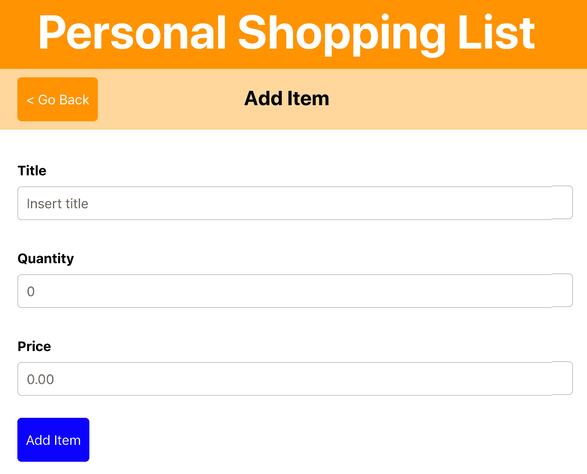
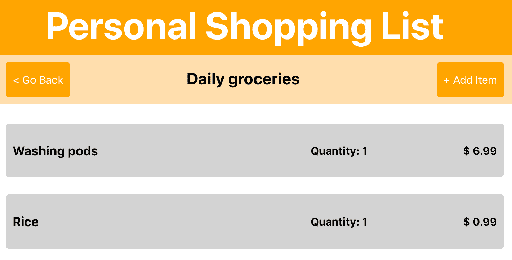

# 第五章：使用上下文 API 和 Hooks 构建个人购物清单应用程序

状态管理是现代 Web 和移动应用程序的一个非常重要的部分，也是 React 擅长的领域。在 React 应用程序中处理状态管理可能会相当令人困惑，因为有多种方式可以处理应用程序的当前状态。本书前四章创建的项目并没有过多关注状态管理，这一点将在本章中更加深入地探讨。

本章将展示如何在 React 中处理状态管理，通过为应用程序创建一个全局状态，可以从每个组件中访问。在 React v16.3 之前，您需要第三方包来处理 React 中的全局状态，但是随着上下文 API 的更新版本，这不再是必需的。此外，随着 React Hooks 的发布，引入了更多改变此上下文的方法。使用一个示例应用程序，演示了处理应用程序全局状态管理的方法。

本章将涵盖以下主题：

+   使用上下文 API 进行状态管理

+   **高阶组件**（**HOC**）和上下文

+   使用 Hooks 改变上下文

# 项目概述

在本章中，我们将使用`react-router`创建一个**渐进式 Web 应用程序**（**PWA**），它使用上下文和 React Hooks 进行全局状态管理。此外，HOC 用于在整个应用程序中访问数据。

构建时间为 2.5 小时。

# 入门

本章将创建的项目是在 GitHub 上找到的初始版本的基础上构建的：[`github.com/PacktPublishing/React-Projects/tree/ch5-initial`](https://github.com/PacktPublishing/React-Projects/tree/ch5-initial)。完整的源代码也可以在 GitHub 上找到：[`github.com/PacktPublishing/React-Projects/tree/ch5`](https://github.com/PacktPublishing/React-Projects/tree/ch5)。

下载初始应用程序后，请确保从项目的根目录运行`npm install`。该项目是使用 Create React App 创建的，并安装了`react`、`react-dom`、`react-scripts`、`styled-components`和`react-router`等包，这些包在前几章中已经见过。安装完成后，您可以在终端的同一个标签页中运行`npm start`，并在浏览器中查看项目（`http://localhost:3000`）。

由于项目是使用 Create React App 创建的，因此已注册服务工作者以使应用程序作为 PWA 运行。您可以通过首先运行`npm run build`，然后在构建过程完成后运行`serve -s build`来检查此功能。现在可以访问应用程序的构建版本`http://localhost:5000`。如果您访问此 URL 上的应用程序并看到不同的 URL，可能是您在任何先前章节中创建的应用程序的构建版本仍在提供。这可能是由服务工作者创建的浏览器缓存造成的。您可以通过在浏览器上打开开发者工具并打开“应用程序”选项卡，在那里您可以单击“清除站点数据”部分上的“清除存储”按钮来清除浏览器缓存中的任何先前的应用程序。

检查应用程序在没有互联网连接时是否仍然可用，您可以让浏览器模拟离线情况。启用此选项可以在浏览器的开发者工具中的“应用程序”选项卡中找到。在此选项卡中，您可以在左侧菜单中找到“服务工作者”，单击此链接后，可以在出现的页面上选择“离线”复选框。

本节的初始应用程序位于`http://localhost:3000`，比以往任何一章都要先进一些。打开应用程序时，将呈现显示标题、副标题和两个列表的屏幕。例如，如果您单击此处显示的第一个列表，将打开一个新页面，显示此列表的项目。在此页面上，您可以单击右上角的“添加列表”按钮打开一个新页面，该页面具有添加新列表的表单，并且看起来像这样：



此表单由`Form`组件呈现，但尚无功能，因为稍后将添加此功能。当您单击左侧按钮时，它将使用`react-router`中的`history.goBack`方法将您重定向到先前访问的页面。

当您尝试提交表单以添加新列表或向列表中添加新项目时，什么也不会发生。这些表单的功能将稍后在本节中添加，您将使用上下文 API 和 React Hooks。

该项目的结构与您之前创建的应用程序的结构相同。在`components`目录中区分了可重用的函数组件和`containers`目录中的类组件。类组件被包装在一个名为`withDataFetching`的 HOC 中，该 HOC 为这些组件添加了数据获取和生命周期（`componentDidMount`）。

`withDataFetching` HOC 是在第二章中创建的 HOC 的略微修改版本，即*使用可重用的 React 组件创建渐进式 Web 应用程序*，该版本也被称为`withDataFetching.js`。这个修改后的版本是一个柯里化组件，意味着它一次接受多个参数。在 HOC 的情况下，这意味着您不仅可以将组件用作参数，还需要将此组件的 props 用作参数。

以下是项目的完整结构概述：

```jsx
shopping-list
|-- node_modules
|-- public
    |-- favicon.ico
    |-- index.html
    |-- manifest.json
|-- src
    |-- components
        |-- Button
            |-- Button.js
        |-- FormItem
            |-- FormItem.js
        |-- Header
            |-- Header.js
            |-- Subheader.js
         |-- ListItem
             |-- ListItem.js
 |-- containers
    |-- App.js
    |-- Form.js
    |-- List.js
    |-- Lists.js
 |-- index.js
 |-- serviceWorker.js
.gitignore
db.json
package.json
```

这个应用程序的入口点是`src/index.js`文件，它在`react-router`的`Router`组件中渲染`App`类组件。`App`组件包含一个`Header`组件和一个`Switch`路由组件，定义了四个路由。这些路由如下：

+   `/`：渲染`Lists`，显示所有列表的概述

+   `/list/:id`：渲染`List`，显示特定列表中所有项目的概述

+   `/list/:id/new`：渲染`Form`，显示向特定列表添加新项目的表单

数据是从一个使用免费服务创建的模拟服务器中获取的，该服务是 My JSON Server，它从 GitHub 项目的根目录中的`db.json`文件创建服务器。该文件包含一个具有两个字段`items`和`lists`的 JSON 对象，它在模拟服务器上创建了多个端点。在本章中，您将使用的端点如下：

+   `https://my-json-server.typicode.com/<your-username>/<your-repo>/items`

+   `https://my-json-server.typicode.com/<your-username>/<your-repo>/lists`

`db.json`文件必须存在于您的 GitHub 存储库的主分支（或默认分支）中，以使 My JSON Server 正常工作。否则，在尝试请求 API 端点时，您将收到 404 Not Found 的消息。

# 个人购物清单

在本节中，您将构建一个个人购物清单应用程序，该应用程序使用 Context 和 React Hooks 进行全局状态管理。通过这个应用程序，您可以创建购物清单，并添加商品、数量和价格。本节的起点是一个已启用路由和本地状态管理的初始应用程序。

# 使用上下文 API 进行状态管理

状态管理非常重要，因为应用程序的当前状态包含对用户有价值的数据。在之前的章节中，您已经通过在`constructor`中设置初始状态并使用`this.setState`方法进行更新来使用本地状态管理。当状态中的数据只对设置状态的组件重要时，这种模式非常有用。由于通过多个组件传递状态作为 props 可能会变得混乱，您需要一种方法来在整个应用程序中访问 props，即使您没有专门将它们作为 props 传递。为此，您可以使用 React 的上下文 API，这也是您在之前章节中已经使用的包（如`styled-components`和`react-router`）所使用的。

在多个组件之间共享状态，将探讨一个名为 Context 的 React 功能，从本节的第一部分开始。

# 创建 Context

当您想要将 Context 添加到 React 应用程序中时，可以通过使用 React 的`createContext`方法创建一个新的 Context 来实现。这将创建一个由两个 React 组件组成的 Context 对象，称为**Provider**和**Consumer**。Provider 是 Context 的初始（以及随后的当前）值所在的地方，可以被存在于 Consumer 中的组件访问。

这是在`src/containers/App.js`中的`App`组件中完成的，因为您希望列表的上下文在由`Route`渲染的每个组件中都可用。

1.  让我们首先为列表创建一个 Context，并将其导出，以便列表数据可以在任何地方使用。为此，您可以在一个新目录`src/Context`中创建一个名为`ListsContextProvider.js`的新文件。在这个文件中，您可以添加以下代码：

```jsx
import React from 'react';
import withDataFetching from '../withDataFetching';

export const ListsContext = React.createContext();
const ListsContextProvider = ({ children, data }) => (
  <ListsContext.Provider value={{ lists: data }}>
    {children}
  </ListsContext.Provider>
);

export default withDataFetching({
  dataSource: 'https://my-json-server.typicode.com/PacktPublishing/React-Projects/lists',
})(ListsContextProvider);
```

先前的代码基于传递为 prop 的 Context 组件创建了一个 Provider，并根据从获取所有列表的`withDataFetching` HOC 的返回设置了一个值。使用`children` prop，所有将包装在`ListsContextProvider`组件内的组件都可以从 Consumer 中检索值的数据。

1.  这个`ListsContextProvider`组件和上下文可以在`src/containers/App.js`中的`App`组件中导入，随后应该放在`Switch`组件周围。`ListsContext`对象也被导入，因为之后无法创建 Consumer：

```jsx
import React from 'react';
import styled, { createGlobalStyle } from 'styled-components';
import { Route, Switch } from 'react-router-dom';
+ import ListsContextProvider, { ListsContext } from '../Context/ListsContextProvider';

...

const App = () => (
 <>
   <GlobalStyle />
   <AppWrapper>
     <Header />
+    <ListsContextProvider>
       <Switch>
         <Route exact path='/' component={Lists} />
         <Route path='/list/:id/new' component={Form} />
         <Route path='/list/:id' component={List} />
       </Switch>
+    </ListsContextProvider>
 </AppWrapper>
 </>
);

export default App;
```

1.  这样，您现在可以为`ListsContext`添加一个 Consumer，它嵌套在包含`ListsContext`的 Provider 的`ListsContextProvider`组件中。这个 Consumer 返回 Provider 中包含的值，其中包含之前获取的列表数据：

```jsx
...

const App = () => (
  <>
    <GlobalStyle />
      <AppWrapper>
      <Header />
        <ListsContextProvider>
+         <ListsContext.Consumer>
+           {({ lists }) => (
              <Switch>
                <Route exact path='/' component={Lists} />
                <Route path='/list/:id/new' component={Form} />
                <Route path='/list/:id' component={List} />
              </Switch>
+           )}
+         </ListsContext.Consumer>
        </ListsContextProvider>
    </AppWrapper>
  </>
);

export default App;
```

1.  要将此列表数据实际传递给`Route`渲染的任何组件，您应该更改将组件传递给`Route`组件的方式。您可以使用 React 的`RenderProps`模式，而不是告诉`Route`要渲染哪个组件。这种模式是指一种在 React 组件之间共享代码的技术，使用一个值为返回组件的函数的 prop。在这种情况下，您希望`Route`组件渲染一个组件，不仅将`react-router`的 props 添加到其中，还要添加来自`ListsContext`的列表数据：

```jsx
...
<ListsContextProvider>                       
  <ListsContext.Consumer>
    {({ lists }) => (
      <Switch>
-       <Route exact path='/' component={Lists} />
+       <Route exact path='/' render={props => lists && <Lists lists={lists} {...props} /> } />
        <Route path='/list/:id/new' component={Form} />
        <Route path='/list/:id' component={List} />
      </Switch>
    )}
  </ListsContext.Consumer>
</ListsContextProvider>
...
```

1.  如果您现在查看浏览器的开发者工具中的网络选项卡，您会看到 API 被获取了两次。由于现在`ListsContextProvider`也在获取列表，因此`Lists`组件本身不再需要获取 API，因为它现在作为 prop 发送。因此，您可以对`src/containers/Lists.js`进行以下更改：

```jsx
import React from 'react';
import styled from 'styled-components';
import { Link } from 'react-router-dom';
- import withDataFetching from '../withDataFetching';
import SubHeader from '../components/SubHeader/SubHeader';

...

- const Lists = ({ data, loading, error, match, history }) => (
+ const Lists = ({ lists, loading = false, error = false, match, history }) => (
  <>
    {history && <SubHeader title='Your Lists' openForm={() => history.push('/new')} /> }
    <ListWrapper>
      {(loading || error) && <Alert>{loading ? 'Loading...' : error}</Alert>}
-     {data.lists && data.lists.map(list => (
+     {lists && lists.map(list => (
        <ListLink key={list.id} to={`list/${list.id}`}>
          <Title>{ list.title }</Title>
        </ListLink>
      ))}
    </ListWrapper>
  </>
);

- export default withDataFetching({
-   dataSource: 'https://github.com/PacktPublishing/React-Projects/lists',
})(Lists); + export default Lists;
```

现在您已经从`Lists`中删除了`withDataFetching` HOC，不再发送重复的 API 请求。列表的数据是从`ListsContextProvider`中获取的，并由`ListsContext.Consumer`传递给`Lists`。如果通过转到`http://localhost:3000/`在浏览器中打开应用程序，您会看到列表像以前一样被渲染。

您还可以将列表数据发送到`List`组件中，这样，例如，当您从主页点击列表时，可以显示所选列表的名称：

1.  为此，您再次使用`RenderProps`模式，这次是为`Route`渲染`List`。这确保了`lists`是可用的，并在之后渲染`List`组件，该组件还接受所有的`react-router` props：

```jsx
...
<ListsContextProvider>                       
  <ListsContext.Consumer>
    {({ lists }) => (
      <Switch>
        <Route exact path='/' render={props => lists && <Lists lists={lists} {...props} /> } />
        <Route path='/list/:id/new' component={Form} />
-       <Route path='/list/:id' component={List} />
+       <Route path='/list/:id' render={props => lists && <List lists={lists} {...props} />} />
      </Switch>
    )}
  </ListsContext.Consumer>
</ListsContextProvider>
...
```

1.  在`src/containers/List.js`文件中的`List`组件中，您可以从 props 中检索列表。这个数组需要被过滤以获取正确的`list`，找到的对象包含`title`，可以添加到`SubHeader`组件中，这样它就会显示在页面上：

```jsx
- const List = ({ data, loading, error, match, history }) => {
+ const List = ({ data, loading, error, lists, match, history }) => {
    const items = data && data.filter(item => item.listId === parseInt(match.params.id))
+   const list = lists && lists.find(list => list.id === parseInt(match.params.id));

  return (
    <>
-     {history && <SubHeader goBack={() => history.goBack()} openForm={() => history.push(`${match.url}/new`)} />}
+     {history && list && <SubHeader goBack={() => history.goBack()} title={list.title} openForm={() => history.push(`${match.url}/new`)} />}
      <ListItemWrapper>
        {items && items.map(item => <ListItem key={item.id} data={item} />)}
      </ListItemWrapper>
    </>
  )
};

export default withDataFetching({
  dataSource: 'https://my-json-server.typicode.com/PacktPublishing/React-Projects/items',
})(List);
```

通过这些添加，如果您访问`http://localhost:3000/list/1`，当前列表的`title`现在将显示。在`SubHeader`组件中，标题"Daily groceries"现在可见，看起来类似于以下截图：



在下一节中，您还将为项目添加一个 Context 对象，这样项目也可以在`react-router`的`Switch`组件内的所有组件中使用。

# 嵌套上下文

就像对于列表数据一样，项目数据也可以存储在 Context 中，并传递给需要这些数据的组件。这样，数据不再从任何渲染的组件中获取，而是从`src/Providers`目录中的`ContextProvider`组件中获取：

1.  再次，首先创建一个新的组件，其中创建了一个 Context 和 Provider。这次，它被称为`ItemsContextProvider`，也可以添加到`src/Context`目录中，文件名为`ItemsContextProvider.js`：

```jsx
import React from 'react';
import withDataFetching from '../withDataFetching';

export const ItemsContext = React.createContext();

const ItemsContextProvider = ({ children, data }) => (
  <ItemsContext.Provider value={{ items: data }}>
    { children }
  </ItemsContext.Provider>
);

export default withDataFetching({
  dataSource: 'https://my-json-server.typicode.com/PacktPublishing/React-Projects/items', 
})(ItemsContextProvider);
```

1.  接下来，在`src/containers/App.js`中导入这个新的 Context 和`ContextProvider`，您可以将其嵌套在`ListsContextProvider`组件内：

```jsx
import React from 'react';
import styled, { createGlobalStyle } from 'styled-components';
import { Route, Switch } from 'react-router-dom';
import ListsContextProvider, { ListsContext } from '../Context/ListsContextProvider';
+ import ItemsContextProvider, { ItemsContext } from '../Context/ItemsContextProvider';

...

const App = () => (
  <>
    <GlobalStyle />
    <AppWrapper>
     <Header />
     <ListsContextProvider>
+    <ItemsContextProvider>
     <ListsContext.Consumer>
        ...
```

1.  `ItemsContextProvider`现在嵌套在`ListsContextProvider`下面，这意味着`ItemsContext`的`Consumer`也可以嵌套在`ListsContext`的`Consumer`下面。这使得来自`ItemsContextProvider`的值可以被使用`RenderProps`模式的`List`组件使用：

```jsx
<ListsContextProvider>
  <ItemsContextProvider>
    <ListsContext.Consumer>
      {({ lists }) => (
+       <ItemsContext.Consumer>
+         {({ items }) => (
            <Switch>
              <Route exact path='/' render={props => lists && <Lists lists={lists} {...props} />} />
              <Route path='/new' component={Form} />
              <Route path='/list/:id/new' component={Form} />
-             <Route path='/list/:id' render={props => lists && <List lists={lists} {...props} />
+             <Route path='/list/:id' render={props => lists && items && <List lists={lists} listItems={items} {...props} />}/>
             </Switch>
+          )}
+        </ItemsContext.Consumer>
       )}
     </ListsContext.Consumer>
   </ItemsContextProvider>
 </ListsContextProvider>
```

1.  在将项目数据作为 prop 传递给`List`之后，现在可以使用`withDataFetching` HOC 替换已经存在的数据获取。为了实现这一点，您需要对`src/containers/List.js`进行以下更改：

```jsx
import React from 'react';
import styled from 'styled-components';
- import withDataFetching from '../withDataFetching';
import SubHeader from '../components/SubHeader/SubHeader';
import ListItem from '../components/ListItem/ListItem';

...

- const List = ({ data, lists, loading, error, match, history }) => {
+ const List = ({ lists, listItems, loading = false, error = false, match, history }) => {
-   const items = data && data.filter(item => item.listId === parseInt(match.params.id))
+   const items = listItems && listItems.filter(item => item.listId === parseInt(match.params.id))

    const list = lists && lists.find(list => list.id === parseInt(match.params.id));
    return (
      <>
        {history && <SubHeader goBack={() => history.goBack()} title={list.title} openForm={() => history.push(`${match.url}/new`)} />}
        <ListItemWrapper>
          {items && items.map(item => <ListItem key={item.id} data={ item } />) }
        </ListItemWrapper>
      </>
    )
};

- export default withDataFetching({
    dataSource: 'https://my-json-server.typicode.com/PacktPublishing/React-Projects/items',
  })(List);
+ export default List;
```

现在所有的数据获取都不再由`List`和`Lists`组件进行。通过嵌套这些 Context Providers，返回值可以被多个组件消耗。但这仍然不是理想的，因为现在在启动应用程序时加载了所有的列表和所有的项目。

在下一节中，您将看到如何通过将上下文与 Hooks 结合来获取所需的数据。

# 使用 Hooks 改变上下文

有多种方式可以有条件地从上下文中获取数据；其中一种是将上下文中的数据放入本地状态。这可能是一个较小应用的解决方案，但对于较大的应用来说效率不高，因为您仍然需要将这个状态传递到组件树中。另一个解决方案是使用 React Hooks 创建一个函数，将其添加到上下文的值中，并可以从嵌套在此上下文中的任何组件中调用。此外，这种获取数据的方法可以防止您有效地加载只需要的数据。

如何将其与 React 生命周期和使用 Hooks 进行状态管理结合使用的示例在本节的第一部分中进行了演示。

# 在函数组件中使用生命周期

Hooks 带来的许多伟大的增强之一是在函数组件中使用生命周期。在 Hooks 之前，只有类组件支持生命周期，使用容器组件模式和到目前为止您使用的`withDataFetching` HOC。按照以下步骤：

1.  实现这一点的第一步是将数据获取功能从`withDataFetching` HOC 移动到列表的 Provider 中，在`src/Context/ListsContextProvider.js`文件中。这个函数将接受`dataSource`（可以是文件或 API）并使用`fetch`从这个源中检索数据：

```jsx
import React from 'react';

export const ListsContext = React.createContext();

async function fetchData(dataSource) {
 try {
 const data = await fetch(dataSource);
 const dataJSON = await data.json();

 if (dataJSON) {
 return await ({ data: dataJSON, error: false });
 }
 } catch(error) {
 return ({ data: false, error: error.message });
 }
};

....
```

1.  有了这个函数，下一步将是使用`dataSource`调用它并将数据添加到 Provider 中。但是，您应该将`dataSource`返回的数据存储在哪里？以前，您使用`componentDidMount`生命周期方法来实现这一点，并将来自源的结果添加到本地状态中。使用 Hooks，您可以在函数组件中使用`useState` Hook 进行本地状态管理。您可以将状态的初始值作为参数传递给这个 Hook，这个初始值是您之前在`constructor`中设置的。返回的值将是一个数组，包含此状态的当前值和一个更新此状态的函数。此外，Hooks 应该始终在使用它的组件内部创建——在这种情况下，应该在`ListsContextProvider`内部创建。

```jsx
...
async function fetchData(dataSource) {
  try {
    const data = await fetch(dataSource);
    const dataJSON = await data.json();

    if (dataJSON) {
      return await ({ data: dataJSON, error: false });
    }
  } catch(error) {
      return ({ data: false, error: error.message });
  }
};

- const ListsContextProvider = ({ children, data }) => ( + const ListsContextProvider = ({ children }) => {
+    const [lists, setLists] = React.useState([]);
+    return (
-       <ListsContext.Provider value={{ lists: data }}>
+       <ListsContext.Provider value={{ lists }}>
          {children}
        </ListsContext.Provider>
      ) + };

- export default withDataFetching({
    dataSource: 'https://my-json-server.typicode.com/PacktPublishing/React-Projects/items', 
  })(ListsContextProvider);
+ export default ListsContextProvider; 
```

1.  在前面的代码块中，您可以看到状态的初始值是一个空数组，它被传递给`ListsContext`的 Provider。要用来自`dataSource`的数据填充此状态，您需要实际调用`fetchData`函数。通常情况下，这将在`componentDidMount`或`componentDidUpdate`生命周期方法内完成，但由于组件是一个函数组件，您将使用一个 Hook。这个 Hook 被称为`useEffect`，用于处理副作用，无论是应用程序挂载时还是状态或 prop 更新时。这个 Hook 接受两个参数，第一个是回调函数，第二个是包含此 Hook 依赖的所有变量的数组。当其中任何一个发生变化时，将调用此 Hook 的回调函数。当此数组中没有值时，Hook 将仅在第一次挂载时调用。从源中获取数据后，状态将被更新为结果：

```jsx
...
const ListsContextProvider = ({ children }) => {
const [lists, setLists] = React.useState([]); React.useEffect(() => {
    const asyncFetchData = async dataSource => {
      const result = await fetchData(dataSource);

      setLists([...result.data]);
    };

    asyncFetchData('https://my-json-server.typicode.com/PacktPublishing/React-Projects/lists');

  }, [fetchData, setLists]);  return (    <ListsContext.Provider value={{ lists }}>
      {children}
    </ListsContext.Provider>
  )
};

export default ListsContextProvider;
```

您可以看到`fetchData`函数并不是直接调用的，而是包裹在一个名为`asyncFetchData`的函数中。由于`fetchData`函数中的`async/await`将返回`Promise`，您需要另一个`async/await`来检索值并解决`Promise`。但是，您不能直接在`useEffect` Hook 中使用`async/await`。在`useEffect` Hook 的回调之后的数组块被称为依赖数组，在这里定义了在 Hook 中使用的值。`fetchData`和`setLists`函数是在此组件的第一次挂载时创建的，这意味着`useEffect` Hook 模拟了一个类似于`componentDidMount`的生命周期。如果要将此 Hook 用作`componentDidUpdate`生命周期方法，数组将包含应该被监视更新的所有状态变量和 props。

通过使用其他 Hooks，您还可以直接将数据传递给 Provider，而无需使用本地状态管理。这将在本节的下一部分中进行演示。

# 使用 Flux 模式更新 Provider

另一种使用动作将数据添加到 Provider 的方法是使用类似 Flux 的模式，这是由 Facebook 引入的。Flux 模式描述了一个数据流，其中派发动作从存储中检索数据并将其返回给视图。这意味着动作需要在某个地方描述；应该有一个全局的地方存储数据，视图可以读取这些数据。为了使用上下文 API 实现这种模式，可以使用另一个名为`useReducer`的 Hook。这个 Hook 可以用来从任何数据变量中返回数据，而不是从本地状态中返回数据。

1.  与`useState` Hook 一样，使用`useReducer` Hook 的组件也需要添加到其中。`useReducer`将接受一个初始值和一个确定应返回哪些数据的函数。这个初始值需要在`src/Context/ListsContextProvider.js`文件中添加，然后再添加 Hook。

```jsx
import React from 'react';

export const ListsContext = React.createContext();

const initialValue = {
 lists: [],
 loading: true,
  error: '',
},

... 
```

1.  `initialValue`旁边，`useReducer` Hook 还接受一个名为`reducer`的函数。这个`reducer`函数也应该被创建，它是一个更新`initialValue`的函数，根据发送给它的动作返回当前值。如果派发的动作不匹配`reducer`中定义的任何动作，`reducer`将只是返回当前值而没有任何改变。

```jsx
import React from 'react';

export const ListsContext = React.createContext();

const initialValue = {
  lists: [],
  loading: true,
  error: '',
};

const reducer = (value, action) => {
 switch (action.type) {
 case 'GET_LISTS_SUCCESS':
 return {
 ...value,
 lists: action.payload,
 loading: false,
 };
 case 'GET_LISTS_ERROR':
 return {
        ...value,
 lists: [],
        loading: false,
 error: action.payload,
 };
 default:
 return value;
 }
};

...
```

1.  现在将`useReducer` Hook 的两个参数添加到文件中，因此需要添加实际的 Hook 并将`initialValue`和`reducer`传递给它。

```jsx
...

const ListsContextProvider = ({ children }) => { 
-    const [lists, setLists] = React.useState([]);
+    const [value, dispatch] = React.useReducer(reducer, initialValue);

...
```

1.  正如你所看到的，当`GET_LISTS_SUCCESS`或`GET_LISTS_ERROR`动作发送到`reducer`时，`reducer`会改变它返回的值。在之前提到过，可以使用`useReducer` Hook 返回的`dispatch`函数来调用这个`reducer`。然而，由于你还需要处理数据的异步获取，所以不能直接调用这个函数。相反，你需要创建一个`async/await`函数，调用`fetchData`函数，然后派发正确的动作。

```jsx
...
const ListsContextProvider = ({ children }) => {
  const [value, dispatch] = React.useReducer(reducer, initialValue);

 const getListsRequest = async () => {
    const result = await fetchData('https://my-json-server.typicode.com/PacktPublishing/React-Projects/lists');

    if (result.data && result.data.length) {
      dispatch({ type: 'GET_LISTS_SUCCESS', payload: result.data });
    } else {
      dispatch({ type: 'GET_LISTS_ERROR', payload: result.error });
    }
  } ...
```

使用前面的`getListsRequest`函数时，当调用这个函数时，会对`fetchData`函数进行`async/await`调用。如果`dataSource`返回的数据不是空数组，将使用`useReducer` Hook 中的`dispatch`函数向 reducer 派发`GET_LISTS_SUCCESS`动作。如果不是，将派发`GET_LISTS_ERROR`动作，返回错误消息。

1.  当您的应用程序挂载时，现在可以从`useEffect` Hook 中调用`getListsRequest`函数，以便应用程序将填充列表数据。这应该是从视图中完成的，因此您需要创建一个操作，可以将其添加到`Provider`中，以便从`Consumer`中获取此值的任何组件都可以使用它：

```jsx
...  

-  React.useEffect(() => {
-    const asyncFetchData = async (dataSource) => {
-      const result = await fetchData(dataSource);
-
-      setLists([...result.data]);
-    }
-
-    asyncFetchData('https://my-json-server.typicode.com/PacktPublishing/React-Projects/lists');
-  }, [setLists]);

  return (
-   <ListsContext.Provider value={{ lists: state }}>               
+   <ListsContext.Provider value={{ ...value, getListsRequest }}>
      {children}
    </ListsContext.Provider>
  );
};

export default ListsContextProvider;
```

1.  在显示列表的组件`Lists`中，您可以使用`getListsRequest`函数检索列表的数据。因此，您需要从`src/containers/App.js`文件中的`RenderProps`中将其传递给此组件。此外，当尚未检索到列表数据或发生错误时，您可以添加一个加载指示器或错误消息：

```jsx
...
const App = () => (
  <>
    <GlobalStyle />
      <AppWrapper>
      <Header />
        <ListsContextProvider>
          <ItemsContextProvider>
            <ListsContext.Consumer>
-             {({ lists }) => (
+             {({ lists, loading: listsLoading, error: listsError, getListsRequest }) => (
                <ItemsContext.Consumer>
                  {({ items }) => (
                    <Switch>
-                     <Route exact path='/' render={props => lists && <Lists lists={lists} {...props} />} />
+                     <Route exact path='/' render={props => lists && <Lists lists={lists} loading={listsLoading} error={listsError} getListsRequest={getListsRequest} {...props} />} />
...
```

1.  最后，在`Lists`组件中挂载时，从`Lists`组件调用`getListsRequest`函数，并添加加载指示器或错误消息。只有在尚无可用列表时才应检索列表：

```jsx
- const Lists = ({lists, loading = false, error = '', match, history}) => !loading && !error ? (
+ const Lists = ({lists, loading, error, getListsRequest, match, history}) => {
+  React.useEffect(() => {
+    if (!lists.length) {
+      getListsRequest();
+    }
+  }, [lists, getListsRequest]);

+ return !loading && !error ? (
  <>
    {history && <SubHeader title='Your Lists' openForm={() => history.push('/new')} /> }
    <ListWrapper>
      {lists && lists.map(list => (
        <ListLink key={list.id} to={`list/${list.id}`}>
          <Title>{list.title}</Title>
        </ListLink>
      ))}
    </ListWrapper>
  </>
- );
+  ) : <Alert>{loading ? 'Loading...' : error}</Alert>;
+ } export default Lists;
```

如果您现在再次在浏览器中访问项目，您会发现列表中的数据与以前一样加载。最大的区别是数据是使用 Flux 模式获取的，这意味着这可以扩展到在其他情况下获取数据。同样，也可以在`src/Context/ItemsContextProvider.js`文件中对`ItemsContextProvider`执行相同操作：

1.  首先添加项目的初始值，这将与`useReducer` Hook 一起使用：

```jsx
import React from 'react';
- import withDataFetching from '../withDataFetching';

+ const initialValue = {
+  items: [],
+  loading: true,
+  error: '',
+ }

export const ItemsContext = React.createContext();

- const ItemsContextProvider = ({ children, data }) => (
+ const ItemsContextProvider = ({ children }) => {
    + const [value, dispatch] = React.useReducer(reducer, initialValue);

+ return (
  <ItemsContext.Provider value={{ items: data }}>
    {children}
  </ItemsContext.Provider>
);
+ };

...
```

1.  之后，您可以添加 reducer，它有两个操作，与列表 reducer 的操作非常相似。唯一的区别是它们将向 Provider 添加有关项目的信息。还要添加与您添加到`ListsContextProvider`的`fetchData`函数相同的函数：

```jsx
import React from 'react';
import withDataFetching from '../withDataFetching';

export const ItemsContext = React.createContext();

const initialValue = {
  items: [],
  loading: true,
  error: '',
}

+ const reducer = (value, action) => {
+  switch (action.type) {
+    case 'GET_ITEMS_SUCCESS':
+      return {
+        ...value,
+        items: action.payload,
+        loading: false,
+      };
+    case 'GET_ITEMS_ERROR':
+      return {
+        ...value,
+        items: [],
+        loading: false,
+        error: action.payload,
+      };
+    default:
+      return value;
+  }
+ };

+ async function fetchData(dataSource) {
+  try {
+    const data = await fetch(dataSource);
+    const dataJSON = await data.json();
+
+    if (dataJSON) {
+      return await ({ data: dataJSON, error: false })
+    }
+  } catch(error) {
+      return ({ data: false, error: error.message })
+  }
+ };

const ItemsContextProvider = ({ children }) => {
    ...
```

1.  现在，您可以创建`async/await`函数，用于获取项目的`dataSource`。此函数还将获取所选列表的`id`变量，以避免数据的过度获取。`withDataFetching` HOC 可以被移除，因为不再需要检索数据：

```jsx
...
const ItemsContextProvider = ({ children }) => {
  const [value, dispatch] = React.useReducer(reducer, initialValue);

+  const getItemsRequest = async (id) => {
+    const result = await fetchData(`
+      https://my-json-server.typicode.com/PacktPublishing/React-Projects/items/${id}/items
+    `);

+    if (result.data && result.data.length) {
+      dispatch({ type: 'GET_ITEMS_SUCCESS', payload: result.data });
+    } else {
+      dispatch({ type: 'GET_ITEMS_ERROR', payload: result.error });
+    }
+  }

  return (
-    <ItemsContext.Provider value={{ items: data }}>            
+    <ItemsContext.Provider value={{ ...value, getItemsRequest }}>
      {children}
    </ItemsContext.Provider>
  );
}

- export default withDataFetching({
    dataSource: 'https://my-json-server.typicode.com/PacktPublishing/React-Projects/items', 
  })(ItemsContextProvider);
+ export default ItemsContextProvider;
```

1.  由于现在已将检索项目的函数添加到项目的 Provider 中，因此 Consumer 是`src/containers/App.js`，可以将此函数传递给显示项目的`List`组件：

```jsx
...
const App = () => (
  <>
    <GlobalStyle />
      <AppWrapper>
      <Header />
        <ListsContextProvider>
          <ItemsContextProvider>
            <ListsContext.Consumer>
              {({ lists, loading: listsLoading, error: listsError, getListsRequest }) => (
                <ItemsContext.Consumer>
-                 {({ items }) => (
+                 ({ items, loading: itemsLoading, error: itemsError, getItemsRequest }) => (
                    <Switch>
                      <Route exact path='/' render={props => lists && <Lists lists={lists} loading={listsLoading} error={listsError} getListsRequest={getListsRequest} {...props} />} />
                      <Route path='/list/:id/new' component={Form} />
-                     <Route path='list/:id' render={props => lists && items && <List lists={lists} listItems={items} {...props} /> 
+                     <Route path='/list/:id' render={props => lists && items && <List lists={lists} items={items} loading={itemsLoading} error={itemsError} getItemsRequest={getItemsRequest} {...props} /> } />
                    </Switch>
                  )}
                </ItemsContext.Consumer>
              )}
           </ListsContext.Consumer>
         </ItemsContextProvider>
       </ListsContextProvider>
    </AppWrapper>
  </>
);

export default App;
```

1.  最后，在`src/containers/List.js`中的`List`组件中调用`getItemsRequest`函数。此函数将使用`match`属性从当前路由中获取您正在显示的列表的`id`变量。重要的是要提到，只有在`items`的值为空时才应调用此函数，以防止不必要的数据获取。

```jsx
...
- const List = ({ listItems, loading = false, error = '', lists, match, history }) => {
+ const List = ({ items, loading, error, lists, getItemsRequest, match, history }) => {
-  const items = listItems && listItems.filter(item => item.listId === parseInt(match.params.id));
  const list = lists && lists.find(list => list.id === parseInt(match.params.id));

+  React.useEffect(() => {
+   if (!items.length > 0) {
+     getItemsRequest(match.params.id);
+   };
+ }, [items, match.params.id, getItemsRequest]);

  return !loading && !error ? (
    <>
      {(history && list) && <SubHeader goBack={() => history.goBack()} title={list.title} openForm={() => history.push(`${match.url}/new`)} />}
      <ListItemWrapper>
        {items && items.map(item => <ListItem key={item.id} data={ item } />)}
      </ListItemWrapper>
    </>
) : <Alert>{loading ? 'Loading... : error}</Alert>
};

export default List;
```

您可能会注意到，当您刷新页面时，列表的标题将不再显示。只有在`Lists`组件挂载时才会获取列表的信息，因此您需要创建一个新函数，始终获取`List`组件中当前显示的列表的信息：

1.  在`src/Context/ListsContextProvider.js`文件中，您需要扩展`initialValue`，还要添加一个名为`list`的字段：

```jsx
import React from 'react';

export const ListsContext = React.createContext();

const initialValue = {
  lists: [],
+ list: {},
  loading: true,
  erorr: '',
}

const reducer = (value, action) => {
...
```

1.  在`reducer`中，现在还必须检查两个新操作，其中一个是将列表数据添加到上下文中，另一个是添加错误消息：

```jsx
...

const reducer = (value, action) => {
  switch (action.type) {
    case 'GET_LISTS_SUCCESS':
      return {
        ...value,
        lists: action.payload,
        loading: false,
      };
    case 'GET_LISTS_ERROR':
      return {
        ...value,
        lists: [],
        loading: false,
        error: action.payload,
      };
+   case 'GET_LIST_SUCCESS':
+     return {
+       ...value,
+       list: action.payload,
+       loading: false,
+     };
+   case 'GET_LIST_ERROR':
+     return {
+       ...value,
+       list: {},
+       loading: false,
+       error: action.payload,
+     };
    default:
      return value;
  }
};

async function fetchData(dataSource) {
...
```

1.  这些操作将从一个使用特定`id`调用`dataSource`的`async/await`函数中分派。如果成功，将分派`GET_LIST_SUCCESS`操作；否则，将分派`GET_LIST_ERROR`操作。还要将该函数传递给 Provider，以便可以从`List`组件中使用：

```jsx
...
const ListsContextProvider = ({ children }) => {
  const [value, dispatch] = React.useReducer(reducer, initialValue);

  const getListsRequest = async () => {
    const result = await fetchData('https://my-json-server.typicode.com/PacktPublishing/React-Projects/lists');

    if (result.data && result.data.length) {
      dispatch({ type: 'GET_LISTS_SUCCESS', payload: result.data });
    } else {
      dispatch({ type: 'GET_LISTS_ERROR', payload: result.error });
    }
  }

+  const getListRequest = async id => {
+    const result = await fetchData(`https://my-json-server.typicode.com/PacktPublishing/React-Projects/lists/${id}`);

+    if (result.data && result.data.hasOwnProperty('id')) {
+      dispatch({ type: 'GET_LIST_SUCCESS', payload: result.data });
+    } else {
+      dispatch({ type: 'GET_LIST_ERROR', payload: result.error });
+    }
+  }

  return (
-   <ListsContext.Provider value={{ ...value, getListsRequest }}>
+   <ListsContext.Provider value={{ ...value, getListsRequest, getListRequest }}>
        ...
```

1.  并将其传递给`List`组件，通过从`ListsContext` Consumer 中解构它。还要从此 Consumer 中获取列表数据，并将其传递给`List`组件。`lists`属性现在可以从此组件中删除，因为现在列表数据的过滤是由`ListsContextProvider`完成的：

```jsx
<ListsContext.Consumer>
-  {({ lists, loading: listsLoading, error: listsError, getListsRequest }) => (
+  {({ list, lists, loading: listsLoading, error: listsError, getListsRequest, getListRequest }) => (
     <ItemsContext.Consumer>
       {({ items, loading: itemsLoading, error: itemsError, getItemsRequest }) => (
         <Switch>
           <Route exact path='/' render={props => lists && <Lists lists={lists} loading={listsLoading} error={listsError} getListsRequest={getListsRequest} {...props} />} />
           <Route path='/list/:id/new' component={Form} />
-          <Route path='/list/:id' render={props => lists && items && <List lists={lists} items={items} loading={itemsLoading} error={itemsError} getItemsRequest={getItemsRequest} {...props} /> } />
+          <Route path='/list/:id' render={props => list && items && <List list={list} items={items} loading={itemsLoading} error={itemsError} getListRequest={getListRequest} getItemsRequest={getItemsRequest} {...props} /> } />
         </Switch>
       )}
     </ItemsContext.Consumer>
   )}
</ListsContext.Consumer>

...
```

1.  最后，您可以调用`getListRequest`函数，从`List`组件中获取列表数据。只有在此数据尚不可用时，您才希望检索列表信息；因此不再需要对`lists`属性进行过滤：

```jsx
...
- const List = ({ items, loading, error, lists, getItemsRequest, match, history }) => {
+ const List = ({ items, loading, error, list, getListRequest, getItemsRequest, match, history }) => {
-   const list = lists && lists.find(list => list.id === parseInt(match.params.id));

  React.useEffect(() => {
+   if (!list.id) {
+     getListRequest(match.params.id);
+   }

    if (!items.length > 0) {
      getItemsRequest(match.params.id);
    }
- }, [items, match.params.id, getItemsRequest]);
+ }, [items, list, match.params.id, getItemsRequest, getListRequest]);

  return !loading && !error ? (
    ...
```

现在，您的应用程序中的所有数据都是使用 Providers 加载的，这意味着它现在与视图分离。此外，`withDataFetching` HOC 已完全删除，使您的应用程序结构更易读。

不仅可以使用此模式的上下文 API 使数据可用于许多组件，还可以改变数据。如何改变这些数据将在下一节中展示。

# 在 Provider 中改变数据

不仅可以使用这种 Flux 模式来检索数据，还可以用它来更新数据。模式仍然是一样的：您派发一个动作，触发对服务器的请求，根据结果，reducer 将使用这个结果改变数据。根据是否成功，您可以显示成功消息或错误消息。

该代码已经有一个用于向列表添加新项目的表单，但目前还没有工作。让我们通过更新`items`的 Provider 来创建添加项目的机制：

1.  第一步是创建一个新的函数，可以处理`POST`请求，因为这个函数在处理`fetch`请求时还应该设置方法和主体。您可以在`src/Context/ItemsContextProvider.js`文件中创建这个函数：

```jsx
...
async function fetchData(dataSource) {
  try {
    const data = await fetch(dataSource);
    const dataJSON = await data.json();

    if (dataJSON) {
      return await ({ data: dataJSON, error: false });
    }
  } catch(error) {
      return ({ data: false, error: error.message });
  }
};

async function postData(dataSource, content) {
 try {
 const data = await fetch(dataSource, {
 method: 'POST',
 body: JSON.stringify(content),
 });
 const dataJSON = await data.json();

 if (dataJSON) {
 return await ({ data: dataJSON, error: false });
 }
 } catch(error) {
 return ({ data: false, error: error.message });
 }
};

const ItemsContextProvider = ({ children }) => {
    ...
```

1.  这个函数不仅需要`dataSource`，还需要将要发布到这个源的信息。就像检索项目一样，在`reducer`的`switch`语句中可以添加一个情况。这一次，它将寻找一个名为`ADD_ITEM_REQUEST`的动作，它的载荷由`dataSource`和应该添加到值中的`content`组成。这些动作会改变`loading`和/或`error`的值，并在返回时也会传播实际的当前值。如果不这样做，所有关于列表的已有信息都将被清除：

```jsx
...
const reducer = (value, action) => {
  switch (action.type) {
    case 'GET_ITEMS_SUCCESS':
      return {
        ...value,
        items: action.payload,
        loading: false,
      };
    case 'GET_ITEMS_ERROR':
      return {
        ...value,
        items: [],
        loading: action.payload,
      };
+   case 'ADD_ITEM_SUCCESS':
+     return {
+       ...value,
+       items: [
+         ...value.items,
+         action.payload,
+       ],
+       loading: false,
+     };
+   case 'ADD_ITEM_ERROR':
+     return {
+       ...value,
+       loading: false,
+       error: 'Something went wrong...',
+     };
    default:
      return value;
  }
};

async function fetchData(dataSource) {
...

```

来自 My JSON Server 的模拟 API 一旦添加、更新或删除请求，数据就不会持久保存。但是，您可以通过在浏览器的开发者工具的 Network 选项卡中检查请求来查看请求是否成功。这就是为什么输入内容分布在`items`的值上，所以这些数据可以从 Consumer 中获取。

1.  还要创建一个处理`POST`请求的`async/await`函数。如果这个请求成功，返回的数据将有一个名为`id`的字段。因此，在这种情况下，可以派发`ADD_ITEM_SUCCESS`动作。否则，会派发一个`ADD_ITEM_ERROR`动作。这些动作将从`reducer`改变这个 Provider 的值：

```jsx
...
const ItemsContextProvider = ({ children }) => {
  const [value, dispatch] = React.useReducer(reducer, initialValue);

  const getItemsRequest = async (id) => {
    const result = await fetchData(`
      https://my-json-server.typicode.com/PacktPublishing/React-Projects/items/${id}/items
    `);

    if (result.data && result.data.length) {
      dispatch({ type: 'GET_ITEMS_SUCCESS', payload: result.data });
    } else {
      dispatch({ type: 'GET_ITEMS_ERROR', payload: result.error });
    }
  }

+  const addItemRequest = async (content) => {
+    const result = await postData('https://my-json-server.typicode.com/PacktPublishing/React-Projects/items', content);

+    if (result.data && result.data.hasOwnProperty('id')) {
+      dispatch({ type: 'ADD_ITEM_SUCCESS', payload: content });
+    } else {
+      dispatch({ type: 'ADD_ITEM_ERROR' });
+    }
+  }

  return (
-   <ItemsContext.Provider value={{ ...value, getItemsRequest }}>
+   <ItemsContext.Provider value={{ ...value, getItemsRequest, addItemRequest }}>
    ...
```

1.  就像检索列表一样，用于添加列表的`actionDispatch`函数可以包装在一个辅助函数中。这个函数将在稍后从表单返回的内容。还要将这个函数传递给 Provider，以便它可以在任何使用这个 Provider 的组件中使用：

```jsx
...
  const getListsRequest = () => {
    actionDispatch({ 
      type: 'GET_LISTS_REQUEST', 
      payload: 'https://my-json-server.typicode.com/PacktPublishing/React-Projects/items',
    });
  };

+  const addListRequest = (content) => {
+    actionDispatch({
+      type: 'ADD_LIST_REQUEST',
+      payload: { 
+        dataSource: 'https://my-json-server.typicode.com/PacktPublishing/React-Projects/items', 
+        content, 
+       } 
+     });
+  };

  return (
-    <ListsContext.Provider value={{ ...value, getListsRequest }}>
+    <ListsContext.Provider value={{ ...value, getListsRequest, addListRequest }}>
      {children}
    </ListsContext.Provider>
  )
};

export default ListsContextProvider;
```

1.  由于现在可以从提供者中使用添加列表的函数，你可以通过使用`Route`的`RenderProps`将其传递给`Form`组件。这可以在`src/containers/App.js`文件中完成。确保不要忘记发送`match`和`history`属性，因为这些被`Form`组件使用：

```jsx
...
<ListsContext.Consumer>
  {({ list, lists, loading: listsLoading, error: listsError, getListsRequest, getListRequest }) => (
    <ItemsContext.Consumer>
-     {({ items, loading: itemsLoading, error: itemsError, getItemsRequest }) => (
+     {({ items, loading: itemsLoading, error: itemsError, getItemsRequest, addItemRequest }) => (
        <Switch>
          <Route exact path='/' render={props => lists && <Lists lists={lists} loading={listsLoading} error={listsError} getListsRequest={getListsRequest} {...props} />} />
-         <Route path='/list/:id/new' component={Form} />
+         <Route path='/list/:id/new' render={props => <Form addItemRequest={addItemRequest} {...props} />} />
          <Route path='/list/:id' render={props => list && items && <List list={list} items={items} loading={itemsLoading} error={itemsError} getListRequest={getListRequest} getItemsRequest={getItemsRequest} {...props} /> } />
        </Switch>
      )}
    </ItemsContext.Consumer>
  )}
</ListsContext.Consumer>

...
```

`Form`组件现在可以使用`addListRequest`函数，该函数将触发`POST`请求的动作，将项目添加到`dataSource`中。当用户提交表单时，需要触发这个函数。

然而，表单中输入字段的值需要首先确定。因此，输入字段需要成为受控组件，这意味着它们的值由封装值的本地状态控制：

1.  为此，你可以使用`useState` Hook，并为你想要创建的每个`state`值调用它。这个 Hook 将返回这个`state`值的当前值和一个更新这个值的函数，必须添加在`src/containers/Form.js`中：

```jsx
...
- const Form = ({ match, history }) => (
+ const Form = ({ addItemRequest, match, history }) => {  
+  const [title, setTitle] = React.useState('');
+  const [quantity, setQuantity] = React.useState('');
+  const [price, setPrice] = React.useState('');

+  return (
  <>
    {history && <SubHeader goBack={() => history.goBack()} title='Add Item' />}
    <FormWrapper>
      <form>
        <FormItem id='title' label='Title' placeholder='Insert title' />
        <FormItem id='quantity' label='Quantity' type='number' placeholder='0' />
        <FormItem id='price' label='Price' type='number' placeholder='0.00' />
        <SubmitButton>Add Item</SubmitButton>
      </form>
    </FormWrapper>
  </>
);
+ }

export default Form;
```

1.  本地状态值和触发本地`state`值更新的函数必须作为`FormItem`组件的属性进行设置：

```jsx
...

  return (
    <>
      {history && <SubHeader goBack={() => history.goBack()} title='Add item' /> }
      <FormWrapper>
        <form>
-         <FormItem id='title' label='Title' placeholder='Insert title' />
+         <FormItem id='title' label='Title' placeholder='Insert title' value={title} handleOnChange={setTitle} />
-         <FormItem id='quantity' label='Quantity' type='number' placeholder='0' />
+         <FormItem id='quantity' label='Quantity' type='number' placeholder='0' value={quantity} handleOnChange={setQuantity} />
-         <FormItem id='price' label='Price' type='number' placeholder='0.00' />
+         <FormItem id='price' label='Price' type='number' placeholder='0.00' value={price} handleOnChange={setPrice} />
          <SubmitButton>Add Item</SubmitButton>
        </form>
      </FormWrapper>
    </>
  )
};

export default Form;

```

1.  `FormItem`组件在`src/components/FormItem.js`文件中可以接受这些属性，并使输入字段调用`handleOnChange`函数。元素的当前`target`值必须作为此函数的参数使用：

```jsx
...
- const FormItem = ({ id, label, type = 'text', placeholder = '' }) => (
+ const FormItem = ({ id, label, type = 'text', placeholder = '', value, handleOnChange }) => (
  <FormItemWrapper>
    <Label htmlFor={id}>{label}</Label>
-    <Input type={type} name={id} id={id} placeholder={placeholder} />
+    <Input type={type} name={id} id={id} placeholder={placeholder} value={value} onChange={e => handleOnChange(e.target.value)} />
  </FormItemWrapper>
);

export default FormItem;
```

1.  现在你需要做的最后一件事是添加一个函数，当点击提交按钮时将被调度。这个函数接受本地状态的`value`，添加关于列表的信息和一个随机生成的`id`，然后使用这些来调用`addItemRequest`函数。在调用了这个函数之后，将调用`history`属性中的`goBack`函数：

```jsx
...
const Form = ({ addItemRequest, match, history }) => {
  ...

+ const handleOnSubmit = e => {
+    e.preventDefault();
+    addItemRequest({
+      title, 
+      quantity,
+      price,
+      id: Math.floor(Math.random() * 100), 
+      listId: parseInt(match.params.id) 
+    });
+    history.goBack();
+  };

  return (
    <>
      {history && <SubHeader goBack={() => history.goBack()} title={title} />}
      <FormWrapper>
-        <form>
+        <form onSubmit={handleOnSubmit}>

...
```

现在当你提交表单时，将发送一个`POST`请求到模拟服务器。你将被发送回到之前的页面，你可以在那里看到结果。如果成功，将会触发`GET_LIST_SUCCESS`动作，并且你插入的项目将被添加到列表中。

到目前为止，上下文中的信息仅通过使用提供者分开使用，但这也可以合并为一个全局上下文，如下一节所示。

# 创建全局上下文

如果你看一下你的`App`组件中路由的当前结构，你可以想象如果你在应用程序中添加更多的 Providers 和 Consumers，这将变得混乱。状态管理包如 Redux 倾向于有一个全局状态，其中存储了应用程序的所有数据。当使用 Context 时，可以创建一个全局 Context，可以使用`useContext` Hook 访问。这个 Hook 充当 Consumer，可以从传递给它的 Context 的 Provider 中检索值。让我们重构当前的应用程序以拥有一个全局 Context：

1.  首先，在`src/Context`目录中创建一个名为`GlobalContext.js`的文件。这个文件将导入`ListsContextProvider`和`ItemsContextProvider`，将它们嵌套，并让它们包装任何作为`children`属性传递给它的组件：

```jsx
import React from 'react';
import ListsContextProvider from './ListsContextProvider';
import ItemsContextProvider from './ItemsContextProvider';

const GlobalContext = ({ children }) => {
  return (
    <ListsContextProvider>
      <ItemsContextProvider>
        {children}
      </ItemsContextProvider>
    </ListsContextProvider>
  );
};

export default GlobalContext;
```

1.  在`src/containers/App.js`文件中，你现在可以导入`GlobalContext`文件，而不是导入列表和项目的 Providers：

```jsx
import React from 'react';
import styled, { createGlobalStyle } from 'styled-components';
import { Route, Switch } from 'react-router-dom';
- import ListsContextProvider, { ListsContext } from '../Context/ListsContextProvider';
- import ItemsContextProvider, { ItemsContext } from '../Context/ItemsContextProvider';
+ import GlobalContext from '../Context/GlobalContext';
...
```

1.  你可以用`GlobalContext`替换`ListsContextProvider`和`ItemsContextProvider`。如果你仍然导入它们，Consumer 仍然可以从`ListsContext`和`ItemsContext`中检索数据：

```jsx
const App = () => (
  <>
    <GlobalStyle />
      <AppWrapper>
      <Header />
+      <GlobalContext>
-      <ListsContextProvider>
-        <ItemsContextProvider>
          <ListsContext.Consumer>
            {({ list, lists, loading: listsLoading, error: listsErorr, getListsRequest, getListRequest }) => (
              <ItemsContext.Consumer>
                {({ items, loading: itemsLoading, error: itemsError, getItemsRequest, addItemRequest }) => (
                  <Switch>
                    <Route exact path='/' render={props => lists && <Lists lists={lists} loading={listsLoading} error={listsError} getListsRequest={getListsRequest} {...props} />} />
                    <Route path='/list/:id/new' render={props => <Form addItemRequest={addItemRequest} {...props} />} />
                    <Route path='/list/:id' render={props => list && items && <List list={list} items={items} loading={itemsLoading} error={itemsError} getListRequest={getListRequest} getItemsRequest={getItemsRequest} {...props} /> } />
                  </Switch>
                )}
              </ItemsContext.Consumer>
            )}
          </ListsContext.Consumer>
-       </ItemsContextProvider>
-     </ListsContextProvider>
+     </GlobalContext>
    </AppWrapper>
  </>
);

export default App;
```

1.  接下来，你可以删除路由中的 Consumers 和`RenderProps`模式。上下文中的值将不再从两个 Consumers 中传递，而是将使用`useContext` Hook 在每个路由中检索：

```jsx
...
        <GlobalContext>
-         <ListsContext.Consumer>
-           {({ list, lists, loading: listsLoading, error: listsError, getListsRequest, getListRequest }) => (
-             <ItemsContext.Consumer>
-               {({ items, loading: itemsLoading, error: itemsError, getItemsRequest, addItemRequest }) => (
                  <Switch>
-                   <Route exact path='/' render={props => lists && <Lists lists={lists} loading={listsLoading} error={listsError} getListsRequest={getListsRequest} {...props} />} />
+                   <Route exact path='/' component={Lists} />
-                   <Route path='/list/:id/new' render={props => <Form addItemRequest={addItemRequest} {...props} />} />
+                   <Route path='/list/:id/new' component={Form} />
-                   <Route path='/list/:id' render={props => list && items && <List list={list} items={items} loading={itemsLoading} error={itemsError} getListRequest={getListRequest} getItemsRequest={getItemsRequest} {...props} /> } />
+                   <Route path='/list/:id' component={List} />
                  </Switch>
-               )}
-             </ItemsContext.Consumer>
-           )}
-        </ListsContext.Consumer>
       </GlobalContext>
...
```

1.  在每个由`Route`渲染的组件中，你想要使用的上下文都应该被导入。然后，`useContext` Hook 可以从这个上下文中检索值。你可以从`src/containers/Lists.js`组件开始添加这个 Hook：

```jsx
import React from 'react';
import styled from 'styled-components';
import { Link } from 'react-router-dom';
+ import { ListsContext } from '../Context/ListsContextProvider';
import SubHeader from '../components/Header/SubHeader';

...

- const Lists = ({lists, loading, error, getListsRequest, match, history}) => {
+ const Lists = ({ match, history }) => {
+  const { lists, loading, error, getListsRequest } =    React.useContext(ListsContext);
  React.useEffect(() => {
    if (!lists.length) {
      getListsRequest();
    }
  }, [lists, getListsRequest]);

  return !loading && !error ? (
    <>
      {history && <SubHeader title='Your Lists' />}
      <ListWrapper>
        {lists && lists.map((list) => (
          <ListLink key={list.id} to={`list/${list.id}`}>
            <Title>{list.title}</Title>
          </ListLink>
        ))}
      </ListWrapper>
    </>
  ) : <Alert>{loading ? 'Loading...' : error}</Alert>;
}
export default Lists;
```

1.  正如你所看到的，`useContext`只需要将要使用的上下文作为参数。要在`List`组件中实现这一点，你需要在`src/containers/List.js`文件中导入`ListsContext`和`ItemsContext`：

```jsx
import React from 'react';
import styled from 'styled-components';
import { ListsContext } from '../Context/ListsContextProvider';
import { ItemsContext } from '../Context/ItemsContextProvider';
import SubHeader from '../components/Header/SubHeader';
import ListItem from '../components/ListItem/ListItem';

...

- const List = ({ items, loading, error, list, getListRequest, getItemsRequest, match, history }) => {
+ const List = ({ match, history }) => {
+  const { list, getListRequest } = React.useContext(ListsContext);
+  const { loading, error, items, getItemsRequest } = React.useContext(ItemsContext);

  React.useEffect(() => {    ...
```

1.  对于`Form`组件在`src/containers/Form.js`文件中也是一样，你只使用`ItemsContext`：

```jsx
import React from 'react';
import styled from 'styled-components';
+ import { ItemsContext } from '../Context/ItemsContextProvider';
import SubHeader from '../components/Header/SubHeader';
import FormItem from '../components/FormItem/FormItem';
import Button from '../components/Button/Button';

...

- const Form = ({ addItemRequest, match, history }) => {
+ const Form = ({ match, history }) => {
+  const { addItemRequest } = React.useContext(ItemsContext);

...
```

现在你可以看到你的应用程序有一个更清晰的结构，同时数据仍然是通过 Providers 检索的。

# 总结

在这一章中，您已经创建了一个购物清单应用程序，该应用程序使用上下文 API 和 Hooks 来传递和检索数据，而不是使用 HOC。上下文用于存储数据，Hooks 用于检索和改变数据。使用上下文 API，您可以使用`useReducer` Hook 创建更高级的状态管理场景。此外，您已经重新创建了一个情况，其中所有数据都存储在全局，并且可以通过创建共享上下文从任何组件访问。

在下一章中，上下文 API 也将被使用，该章节将向您展示如何使用诸如 Jest 和 Enzyme 等库构建具有自动化测试的酒店评论应用程序。它将向您介绍使用 React 创建 UI 组件的多种测试方法，并向您展示如何使用上下文 API 测试应用程序中的状态管理。

# 进一步阅读

消耗多个上下文对象：[`reactjs.org/docs/Context.html#consuming-multiple-Contexts`](https://reactjs.org/docs/Context.html#consuming-multiple-Contexts)
