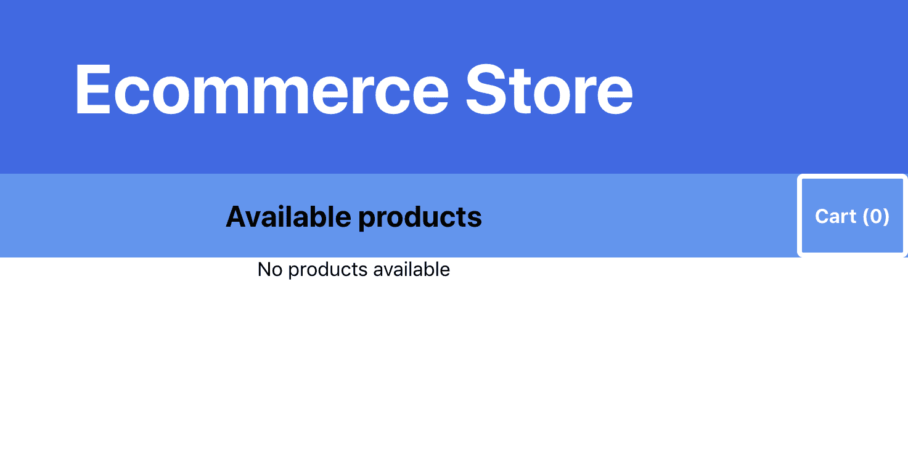
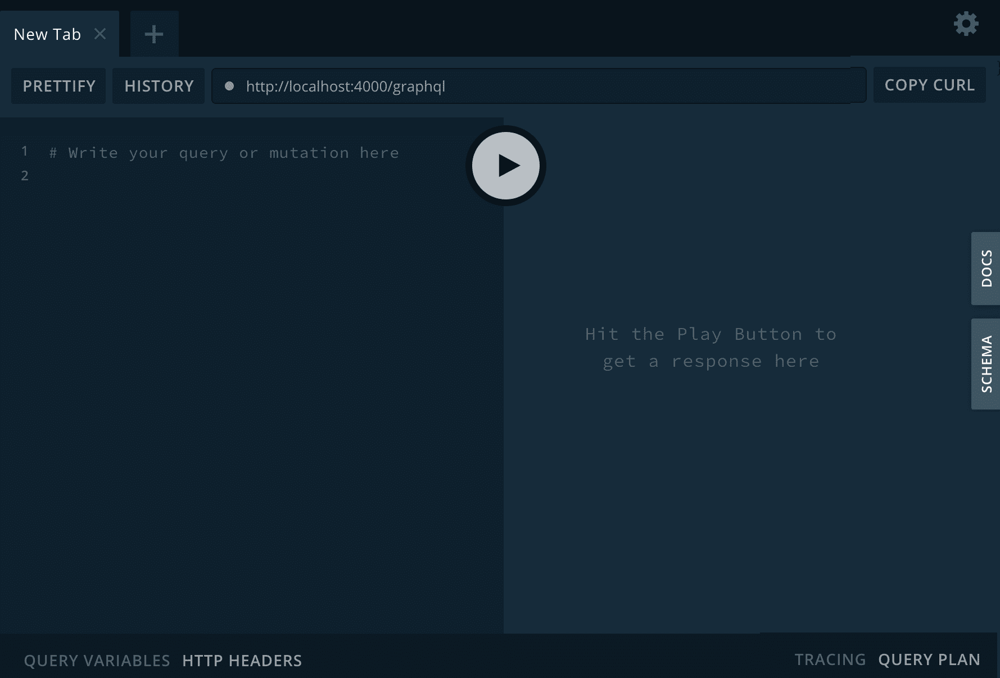
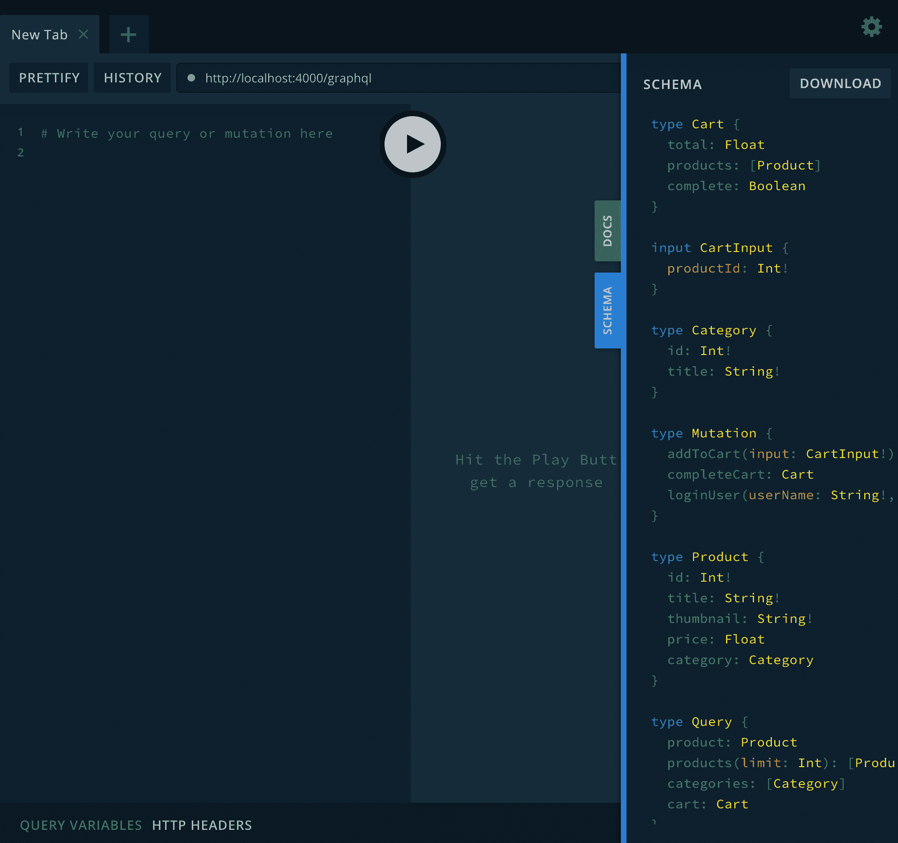
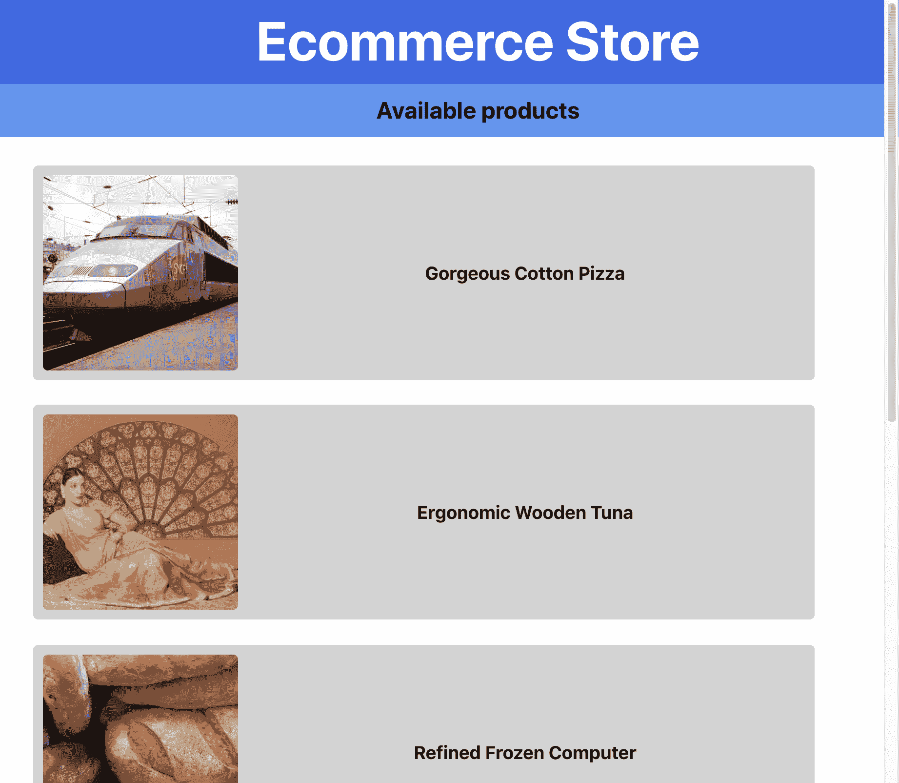
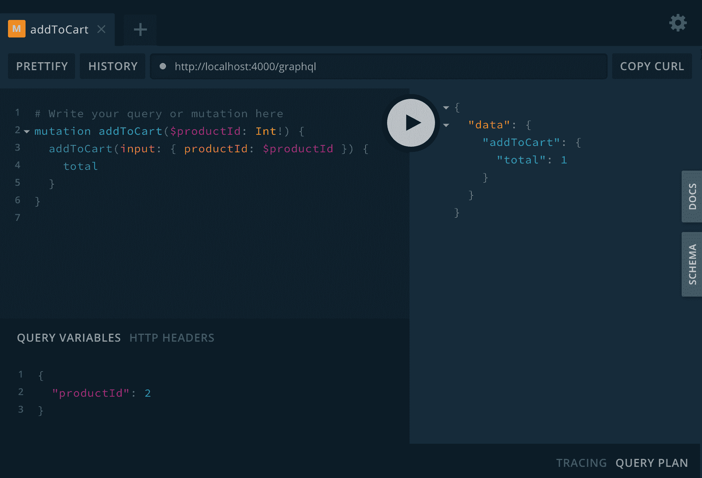
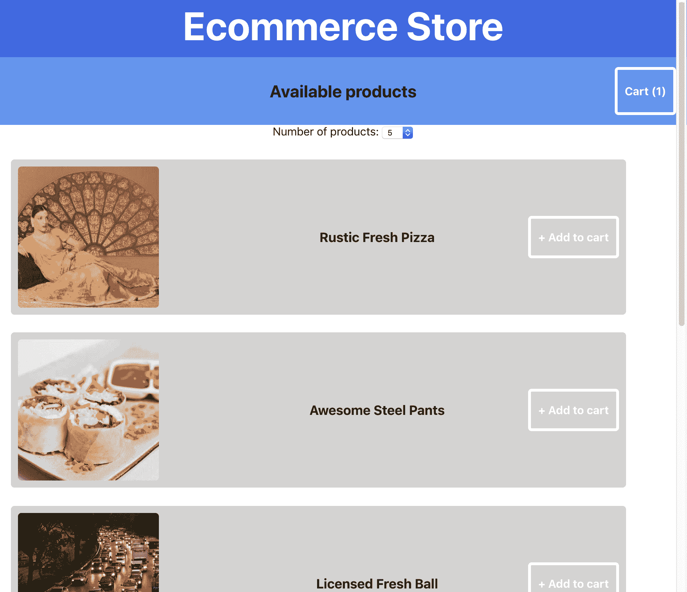
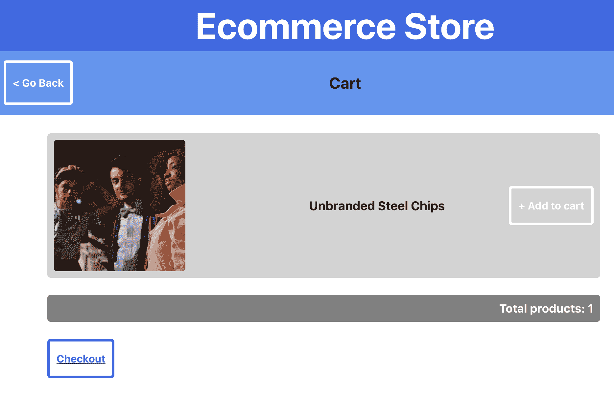

# 第七章：使用 React Native 和 GraphQL 构建全栈电子商务应用程序

如果您正在阅读本文，这意味着您已经到达了本书的最后部分，该部分使用 React 构建 Web 应用程序。在前面的章节中，您已经使用了 React 的核心功能，如渲染组件、使用 Context 进行状态管理和 Hooks。您已经学会了如何创建 PWA 和 SSR 应用程序，以及如何将路由添加到您的 React 应用程序中。此外，您还知道如何使用 Jest 和 Enzyme 向 React 应用程序添加测试。让我们将 GraphQL 添加到您迄今为止学到的东西列表中。

在本章中，您不仅将构建应用程序的前端，还将构建后端。为此，将使用 GraphQL，它最好被定义为 API 的查询语言。使用模拟数据和 Apollo Server，您将扩展一个 GraphQL 服务器，为您的 React 应用程序公开一个单一的端点。在前端方面，将使用 Apollo Client 来消耗此端点，它将帮助您处理向服务器发送请求以及此数据的状态管理。

本章将涵盖以下主题：

+   使用 GraphQL 查询和变异数据

+   使用 Apollo Client 消耗 GraphQL

+   使用 GraphQL 处理状态管理

# 项目概述

在本章中，我们将创建一个全栈电子商务应用程序，后端使用 GraphQL 服务器，并在 React 中使用 Apollo Client 消耗此服务器。对于后端和前端，都有一个初始应用程序可供您快速开始。

构建时间为 3 小时。

# 入门

在本章中，我们将创建的项目是基于 GitHub 上可以找到的初始版本构建的：[`github.com/PacktPublishing/React-Projects/tree/ch7-initial`](https://github.com/PacktPublishing/React-Projects/tree/ch7-initial)。完整的源代码也可以在 GitHub 上找到：[`github.com/PacktPublishing/React-Projects/tree/ch7`](https://github.com/PacktPublishing/React-Projects/tree/ch7)。

初始项目包括一个基于 Create React App 的样板应用程序，可以让您快速开始，并且一个 GraphQL 服务器，您可以在本地运行。您可以在`client`目录中找到应用程序，`server`目录中可以找到 GraphQL 服务器。初始应用程序和 GraphQL 服务器都需要安装依赖项，并且在开发过程中需要始终运行，您可以通过在`client`和`server`目录中运行以下命令来实现：

```jsx
npm install && npm start
```

该命令将安装运行 React 应用程序和 GraphQL 服务器所需的所有依赖项，包括`react`，`react-scripts`，`graphql`和`apollo-server`。如果您想了解安装的所有依赖项，请查看`client`和`server`目录中的`package.json`文件。

安装过程完成后，将启动 GraphQL 服务器和 React 应用程序。

# 开始使用初始 React 应用程序

由于 React 应用程序是由 Create React App 创建的，它将自动在浏览器中启动，网址是`http://localhost:3000/`。这个初始应用程序不显示任何数据，因为它仍然需要连接到 GraphQL 服务器，这将在本章后面进行。因此，此时应用程序将仅呈现一个标题为 Ecommerce Store 的标题和一个子标题，看起来像这样：



这个初始 React 应用程序的结构如下：

```jsx
ecommerce-store
|-- client
    |-- node_modules
    |-- public
        |-- favicon.ico
        |-- index.html
        |-- manifest.json
    |-- src
        |-- components
            |-- Button
                |-- Button.js
            |-- Cart
                |-- Cart.js
                |-- CartButton.js
                |-- Totals.js
            |-- Header
                |-- Header.js
                |-- SubHeader.js
            |-- Products
                |-- ProductItem.js
                |-- Products.js
            |-- App.js
        |-- index.js
        |-- serviceWorker.js
    |-- package.json
```

在`client/src`目录中，您将找到应用程序的入口点，即`index.js`。该文件将引用`App.js`中的`App`组件。`App`组件具有一个`Router`组件，根据用户访问的 URL，它将呈现`Products`或`Cart`组件。当未指定特定路由时，将呈现`Products`组件，其中包括`SubHeader`组件，带有指向`Cart`组件的`Button`，以及返回显示产品信息的`ProductItem`组件列表的`map`函数。`/cart`路由将呈现`Cart`组件，该组件还具有`SubHeader`，这次带有返回到上一页的`Button`。同样，将返回产品列表，并且`Totals`组件将显示购物车中产品的总数。

# 开始使用 GraphQL 服务器

虽然您不会对 GraphQL 服务器进行任何代码更改，但了解服务器的运行方式和 GraphQL 的基本概念是很重要的。

GraphQL 最好被描述为 API 的查询语言，并被定义为从 API 检索数据的约定。通常，GraphQL API 被比作 RESTful API，后者是发送 HTTP 请求的众所周知的约定，这些请求依赖于多个端点，这些端点将返回单独的数据集。与众所周知的 RESTful API 相反，GraphQL API 将提供一个单一的端点，让您查询和/或改变数据源，比如数据库。您可以通过向 GraphQL 服务器发送包含查询或变异操作的文档来查询或改变数据。无论可用的数据是什么，都可以在 GraphQL 服务器的模式中找到，该模式由定义可以查询或改变的数据的类型组成。

GraphQL 服务器可以在 `server` 目录中找到，并为您在本章中构建的前端 React 应用程序提供后端支持。该服务器使用 Express 和 Apollo Server 创建，其中 Express 是一个使用 JavaScript 创建 API 的框架，而 Apollo Server 是一个开源包，可以帮助您使用有限的代码创建 GraphQL 服务器。确保您已在 `server` 目录中运行了 `npm install` 和 `npm start` 命令后，GraphQL API 就可以在 `http://localhost:4000/graphql` 上使用。Apollo Server 默认会在端口 `4000` 上运行您的 GraphQL 服务器。在浏览器的这个页面上，将显示 GraphQL Playground，您可以在其中使用和探索 GraphQL 服务器。以下是该 Playground 的示例截图：



通过这个 Playground，您可以向 GraphQL 服务器发送查询和变异，您可以在本页面的左侧输入。您可以在此 GraphQL 服务器的 SCHEMA 中找到可以发送的查询和变异，点击标有 SCHEMA 的绿色按钮即可找到。该按钮将打开 SCHEMA 的概述，显示 GraphQL 服务器的所有可能返回值：



每当您在此页面的左侧描述查询或突变时，服务器返回的输出将显示在播放器的右侧。构造 GraphQL 查询的方式将决定返回数据的结构，因为 GraphQL 遵循“请求所需内容，获得确切内容”的原则。由于 GraphQL 查询始终返回可预测的结果，这意味着我们可以有这样的查询：

```jsx
query {
  products {
    id
    title
    thumbnail
  }
}
```

这将返回一个输出，其结构将遵循您发送到 GraphQL 服务器的文档中定义的查询的相同结构，并具有以下格式：

```jsx
{
  "data": {
    "products": [
      {
        "id": 16608,
        "title": "Awesome Rubber Shoes",
        "thumbnail": "http://lorempixel.com/400/400/technics"
      },
      {
        "id": 20684,
        "title": "Refined Soft Table",
        "thumbnail": "http://lorempixel.com/400/400/fashion"
      }
    ]
  }
}
```

使用 GraphQL 的应用程序通常快速且稳定，因为它们控制获取的数据，而不是服务器。

在下一节中，您将使用 Apollo 将 GraphQL 服务器连接到 React Web 应用程序，并从应用程序向服务器发送文档。

# 使用 React、Apollo 和 GraphQL 构建全栈电子商务应用程序

在本节中，您将连接 React Web 应用程序到 GraphQL 服务器。Apollo Server 用于创建一个使用动态模拟数据作为源的单个 GraphQL 端点。React 使用 Apollo Client 来消耗此端点并处理应用程序的状态管理。

# 将 GraphQL 添加到 React 应用程序

GraphQL 服务器已经就位，让我们继续进行从 React 应用程序向该服务器发出请求的部分。为此，您将使用 Apollo 软件包，该软件包可帮助您在应用程序和服务器之间添加一个抽象层。这样，您就不必担心自己通过例如`fetch`发送文档到 GraphQL 端点，而是可以直接从组件发送文档。

如前所述，您可以使用 Apollo 连接到 GraphQL 服务器；为此，将使用 Apollo Client。使用 Apollo Client，您可以建立与服务器的连接，处理查询和突变，并为从 GraphQL 服务器检索的数据启用缓存，等等。通过以下步骤将 Apollo Client 添加到您的应用程序：

1.  要安装 Apollo Client 及其相关软件包，您需要在初始化 React 应用程序的`client`目录中运行以下命令：

```jsx
npm install apollo-client apollo-link-http react-apollo graphql graphql-tag
```

这将安装不仅 Apollo Client，还将安装您在 React 应用程序中使用 Apollo Client 和 GraphQL 所需的其他依赖项：

+   `apollo-link-http`将与 GraphQL 服务器连接

+   `react-apollo`将提供您发送查询和突变以及处理数据流所需的组件。

+   `graphql`和`graphql-tag`将处理 GraphQL 并编写查询语言

1.  这些包应该被导入到您想要创建 Apollo Client 的文件中，在这种情况下，将是`client/src/App.js`：

```jsx
import React from 'react';
import styled, { createGlobalStyle } from 'styled-components';
import { Route, Switch } from 'react-router-dom';
import Header from './Header/Header';
import Products from './Products/Products';
import Cart from './Cart/Cart';

import ApolloClient from 'apollo-client';
import { HttpLink } from 'apollo-link-http';
import { ApolloProvider } from 'react-apollo';

const GlobalStyle = createGlobalStyle`
    ...
```

1.  现在，您可以使用`ApolloClient`类定义`client`常量，并使用`HttpLink`与 GraphQL 服务器建立连接；因此，可以创建如下的`client`常量：

```jsx
import React from 'react';
import styled, { createGlobalStyle } from 'styled-components';
import { Route, Switch } from 'react-router-dom';
import Header from './Header/Header';
import Products from './Products/Products';
import Cart from './Cart/Cart';

import ApolloClient from 'apollo-client';
import { InMemoryCache } from 'apollo-cache-inmemory';
import { HttpLink } from 'apollo-link-http';
import { ApolloProvider } from 'react-apollo';

const client = () => new ApolloClient({
 link: new HttpLink({
 uri: 'http://localhost:6000',
 }),
});

const GlobalStyle = createGlobalStyle`
    ...
```

1.  在`App`组件的`return`函数中，您需要添加`ApolloProvider`并将刚刚创建的`client`作为属性传递：

```jsx
...
const App = () => (
-  <>
+  <ApolloProvider client={client}>
     <GlobalStyle />
       <AppWrapper>
       <Header />
       <Switch>
         <Route exact path='/' component={Products} />
         <Route path='/cart' component={Cart} />
       </Switch>
     </AppWrapper>
-  </>
+  </ApolloProvider>
);

export default App;
```

经过这些步骤，所有嵌套在`ApolloProvider`中的组件都可以访问此`client`并发送带有查询和/或突变的文档到 GraphQL 服务器。从`ApolloProvider`获取数据的方法类似于上下文 API 与上下文值的交互，并将在本节的下一部分中进行演示。

# 使用 React 发送 GraphQL 查询

`react-apollo`包不仅导出 Provider，还导出了从此 Provider 中消耗值的方法。这样，您可以使用添加到 Provider 的客户端轻松获取任何值。其中之一是`Query`，它可以帮助您发送包含查询的文档到 GraphQL 服务器，而无需使用`fetch`函数，例如。

由于`Query`组件应始终嵌套在`ApolloProvider`组件内，它们可以放置在已在`App`中呈现的任何组件中。其中之一是`client/src/components/Product/Products.js`中的`Products`组件。该组件被呈现为`/`路由，并应显示电子商务商店中可用的产品。

要从`Products`组件发送文档，请按照以下步骤进行操作，这些步骤将指导您使用`react-apollo`发送文档的过程：

1.  可以使用播放器中的内省方法或`server/typeDefs.js`文件找到从 GraphQL 服务器获取产品的查询，并且如下所示：

```jsx
query {
  products {
    id
    title
    thumbnail
  }
}
```

使用查询将此文档发送到 GraphQL 服务器将返回一个由产品信息对象组成的数组，默认情况下每次返回 10 个产品。结果将以 JSON 格式返回，并且每次发送请求时都会包含不同的产品，因为数据是由 GraphQL 服务器模拟的。

1.  在`Products`组件中，您可以从`react-apollo`导入`Query`组件并为命名为`getProducts`的查询定义一个常量。此外，您需要从`graphql-tag`导入`gql`，以在 React 文件中使用 GraphQL 查询语言，如下所示：

```jsx
import React from 'react';
import styled from 'styled-components';
import { Query } from 'react-apollo';
import gql from 'graphql-tag';
import SubHeader from '../Header/SubHeader';
import ProductItem from './ProductItem';

const GET_PRODUCTS = gql`
 query getProducts {
 products {
 id
 title
 thumbnail
 }
 }
`;

export const ProductItemsWrapper = styled.div`
    ...
```

1.  导入的`Query`组件可以从`Products`返回，并根据您作为 prop 传递给它的查询处理数据获取过程。与上下文 API 一样，`Query`可以通过返回`data`变量来消耗 Provider 中的数据。您可以遍历此对象中的`products`字段，并通过添加`Query`组件返回`ProductItem`组件的列表：

```jsx
...
const Products = ({ match, history, loading, error, products }) => {
-  const isEmpty = products.length === 0 ? 'No products available' : false;

  return (
    <>
      {history && (
        <SubHeader title='Available products' goToCart={() => history.push('/cart')} />
      )} -      {!loading && !error && !isEmpty ? (
+      <Query query={GET_PRODUCTS}>
+        {({ data }) => {
+          return (             <ProductItemsWrapper>
               {data.products && data.products.map(product => (
                 <ProductItem key={product.id} data={product} />
               ))}
             </ProductItemsWrapper> +          );
+        }}
+      </Query>
-      ) : (
-        <Alert>{loading ? 'Loading...' : error || isEmpty}</Alert>
-      )}
    </>
  );
};
...
```

1.  `Query`组件不仅会返回一个`data`对象，还会返回`loading`和`error`变量。因此，您可以使用这个值而不是为`loading` prop 设置默认值，并在其值为`true`时返回加载消息。对于`error`变量，您也可以采用相同的方法。此外，`Products` prop 的默认值不再使用，可以删除：

```jsx
- const Products = ({ match, history, loading, error, products }) => {
-   return (
+ const Products = ({ match, history }) => (
  <>
    {history && (
      <SubHeader title='Available products' goToCart={() => history.push('/cart')} />
    )}
    <Query query={GET_PRODUCTS}>
-       {({ data }) => {
+       {({ loading, error, data }) => {
+         if (loading || error) {
+           return <Alert>{loading ? 'Loading...' : error}</Alert>;
+         }
          return (
            <ProductItemsWrapper>
              {data.products && data.products.map(product => (
                <ProductItem key={product.id} data={product} />
              ))}
            </ProductItemsWrapper>
          );
        }}
      </Query>
  </>
);
- };

- Products.defaultProps = {
-   loading: false,
-   error: '',
-   products: [],
- }
```

当您的应用程序挂载并随后在`ProductItem`组件的列表中显示产品信息时，将向 GraphQL 服务器发送带有`GET_PRODUCTS`查询的文档。在添加逻辑以从 GraphQL 服务器检索产品信息之后，您的应用程序将类似于以下内容：



由于`/cart`路由上的`Cart`组件还需要从 GraphQL 服务器查询数据，因此还应该对`src/components/Cart/Cart.js`文件进行更改。就像我们为`Products`所做的那样，应该添加一个`Query`组件来从服务器检索数据，并且可以通过以下步骤完成：

1.  首先导入发送查询到 GraphQL 服务器所需的依赖项，即`react-apollo`以获取`Query`组件和`graphql-tag`以使用 GraphQL 查询语言来定义要发送到 GraphQL 的查询。

```jsx
import React from 'react';
import styled from 'styled-components';
+ import { Query } from 'react-apollo';
+ import gql from 'graphql-tag';
import SubHeader from '../Header/SubHeader';
import ProductItem from '../Products/ProductItem';
import Totals from './Totals';

const CartWrapper = styled.div`
    ...
```

1.  完成后，您可以定义`query`，应该在文档中发送。这将检索`cart`的信息，包括可能在`cart`中的任何`products`：

```jsx
import React from 'react';
import styled from 'styled-components';
import { Query } from 'react-apollo';
import gql from 'graphql-tag';
import SubHeader from '../Header/SubHeader';
import ProductItem from '../Products/ProductItem';
import Totals from './Totals';

+ const GET_CART = gql`
+  query getCart {
+    cart {
+      total
+      products {
+        id
+        title
+        thumbnail
+      }
+    }
+  } + `; const CartWrapper = styled.div`
    ...
```

1.  用以下内容替换`Cart`组件的现有代码，其中实现了`Query`组件，而`Cart`组件仅接收`match`和`history` props。因此，您需要用以下内容替换此组件的代码：

```jsx
...

- const Cart = ...

+ const Cart = ({ match, history }) => (
+  <>
+    {history && (
+      <SubHeader goBack={() => history.goBack()} title='Cart' />
+    )}
+    <Query query={GET_CART}>
+      {({ loading, error, data }) => {
+        if (loading || error) {
+          return <Alert>{loading ? 'Loading...' : error}</Alert>;
+        }
+        return (
+          <CartWrapper>
+            <CartItemsWrapper>
+              {data.cart && data.cart.products.map(product => (
+                <ProductItem key={product.id} data={product} />
+              ))}
+            </CartItemsWrapper>
+            <Totals count={data.cart.total} />
+          </CartWrapper>
+        );
+      }}
+    </Query>
+  </>
+ );

export default Cart;

...
```

1.  由于购物车是空的，所以现在不会显示任何产品；购物车将在下一节中填满产品。然而，让我们继续在`SubHeader`的`/`路由中为购物车的按钮添加一个`Query`组件，以及一个占位符计数。因此，在`client/src/components/Cart`目录中可以创建一个名为`CartButton.js`的新文件。在这个文件中，一个`Query`组件将从一个查询中返回购物车中产品的总数。此外，我们可以通过在这个文件中添加以下代码来为`Button`组件添加一个值：

```jsx
import React from 'react'
import { Query } from 'react-apollo';
import gql from 'graphql-tag';
import Button from '../Button/Button';

const GET_CART_TOTAL = gql`
  query getCartTotal {
    cart {
      total
    }
  }
`;

const CartButton = ({ onClick }) => (
  <Query query={GET_CART_TOTAL}>
    {({ data, loading, error }) => (
      <Button onClick={onClick}>
        {`Cart (${(loading || error) ? 0 : data && data.cart.total})`}
      </Button>
    )}
  </Query>
);

export default CartButton
```

1.  这个`CartButton`组件替换了`Button`，现在在`client/src/components/Header/SubHeader.js`文件中显示为购物车中产品数量的占位符计数：

```jsx
import React from 'react';
import styled from 'styled-components';
import Button from '../Button/Button';
+ import CartButton from '../Cart/CartButton'; ...

const SubHeader = ({ goBack, title, goToCart = false }) => (
  <SubHeaderWrapper>
    {goBack && <SubHeaderButton onClick={goBack}>{`< Go Back`}</SubHeaderButton>}
    <Title>{ title }</Title>
-    {goToCart && <SubHeaderButton onClick={goToCart}>{`Cart (0)`}</SubHeaderButton>}
+    {goToCart && <CartButton onClick={goToCart} />}
  </SubHeaderWrapper>
);

export default SubHeader;
```

所有显示产品或购物车信息的组件都连接到 GraphQL Client，你可以继续添加将产品添加到购物车的变异。如何将变异添加到应用程序并将文档容器变异发送到 GraphQL 服务器将在本节的最后部分中展示。

# 使用 Apollo Client 处理变异

数据的变异使得使用 GraphQL 更加有趣，因为当数据发生变异时，一些副作用应该被执行。例如，当用户将产品添加到购物车时，购物车的数据也应该在整个组件中更新。当你使用 Apollo Client 时，这是相当容易的，因为 Provider 以与上下文 API 相同的方式处理这个问题。

在编写第一个变异之前，应该将购物车的可执行查询的定义移动到一个常量文件中。这样，你就可以轻松地将它们导入到其他组件中以便重用，并将它们作为副作用执行。创建新的常量文件并将所有的 GraphQL 查询和变异移动到其中需要我们做出以下更改：

1.  在`client/src`目录中，你应该创建一个名为`constants.js`的新文件，并将两个已经定义的查询放在这里，这些查询可以在`Cart`和`CartButton`组件中找到。此外，你需要导入`graphql-tag`，以便在新创建的文件中添加以下代码块来使用 GraphQL 查询语言：

```jsx
import gql from 'graphql-tag';

export const GET_CART_TOTAL = gql`
  query getCartTotal {
    cart {
      total
    }
  }
`;

const GET_CART = gql`
  query getCart {
    cart {
      total
      products {
        id
        title
        thumbnail
      }
    }
  }
`;

export default GET_CART
```

1.  在`Cart`组件中，你可以删除对`GET_CART`的定义，并在`client/src/components/Cart/Cart.js`文件中从`client/src/constants.js`导入该定义：

```jsx
import React from 'react';
import styled from 'styled-components';
import { Query } from 'react-apollo';
- import gql from 'graphql-tag';
import SubHeader from '../Header/SubHeader';
import ProductItem from '../Products/ProductItem';
import Totals from './Totals';
+ import { GET_CART } from '../../constants';

- const GET_CART = gql`
-  query getCart {
-    cart {
-      total
-      products {
-        id
-        title
-        thumbnail
-      }
-    }
-  }
- `;

const CartWrapper = styled.div`
  ...
```

1.  对于`CartButton.js`中的`CartButton`组件，您应该应用相同的更改，但这次是针对`GET_CART_TOTAL`查询，它也可以从`constants`文件中导入，并从`CartButton.js`文件中删除：

```jsx
import React from 'react'
import { Query } from 'react-apollo';
- import gql from 'graphql-tag';
import Button from '../Button/Button';
+ import { GET_CART_TOTAL } from '../../constants';

- const GET_CART_TOTAL = gql`
-   query getCartTotal {
-    cart {
-      total
-    }
-  }
- `;

const CartButton = ({ onClick }) => (
  ...
```

任何与目录中的组件相关的查询或变异的新定义都应从现在开始放在这个文件中。

由于您希望用户能够将产品添加到购物车，因此可以在此文件中添加一个变异的定义。添加产品到购物车的变异如下，它需要`productId`参数来将产品添加到购物车。以下变异可以返回购物车的字段，就像查询一样：

```jsx
mutation addToCart($productId: Int!) {
    addToCart(input: { productId: $productId }) {
        total
    }
  }
```

您可以通过在`http://localhost:4000/graphql`上可用的 GraphQL Playground 上尝试此变异来测试此变异。在这里，您需要在此页面的左上角框中添加变异。您想要包含在此变异中的`productId`变量必须放在此页面的左下角框中，称为查询变量。这将导致以下输出：



为了能够从您的 React 应用程序中使用此变异，您需要对一些文件进行以下更改：

1.  在`client/src/constants.js`文件中创建一个新的导出常量，并将变异添加到其中：

```jsx
import gql from 'graphql-tag';

+ export const ADD_TO_CART = gql`
+  mutation addToCart($productId: Int!) {
+    addToCart(input: { productId: $productId }) {
+        total
+    }
+  }
+ `;

export const GET_CART_TOTAL = gql`
    ...
```

1.  目前，还没有按钮可以将产品添加到购物车，因此您可以在`Cart`目录中创建一个新文件，并将其命名为`AddToCartButton.js`。在这个文件中，您可以添加以下代码：

```jsx
import React from 'react'
import { Mutation } from 'react-apollo';
import Button from '../Button/Button';
import { ADD_TO_CART } from '../../constants';

const AddToCartButton = ({ productId }) => (
  <Mutation mutation={ADD_TO_CART}>
    {addToCart => (
      <Button onClick={() => addToCart({ variables: { productId }})}>
        {`+ Add to cart`}
      </Button>
    )}
  </Mutation>
);

export default AddToCartButton;
```

这个新的`AddToCartButton`将`productId`作为 prop，并且具有来自`react-apollo`的`Mutation`组件，该组件使用您在`client/src/constants.js`中创建的`Mutation`。`Mutation`的输出是调用此变异的实际函数，它以包含输入的对象作为参数。单击`Button`组件将执行变异。

1.  此按钮应显示在`Products`组件中列表中的产品旁边，其中每个产品都显示在`ProductItem`组件中。这意味着，您需要在`'src/components/Products/ProductItem.js'`中导入`AddCartButton`并通过以下代码传递`productId` prop 给它：

```jsx
import React from 'react';
import styled from 'styled-components';
+ import AddToCartButton from '../Cart/AddToCartButton';

...

const ProductItem = ({ data }) => (
  <ProductItemWrapper>
    <Thumbnail src={data.thumbnail} width={200} />
    <Title>{data.title}</Title>
+   <AddToCartButton productId={data.id} />
  </ProductItemWrapper>
);

export default ProductItem;
```

现在，当您在浏览器中打开 React 应用程序时，将会在产品标题旁边显示一个按钮。如果您点击此按钮，变更将被发送到 GraphQL 服务器，并且产品将被添加到购物车中。但是，您不会看到显示购物车（0）的按钮在`SubHeader`组件中的任何变化。

1.  要更新`CartButton`，您需要指定当购物车发生变更时，其他查询也应该再次执行。这可以通过在`client/src/components/Cart/AddToCartButton.js`中的`Mutation`组件上设置`refetchQueries`属性来完成。该属性接受一个包含有关应该请求的查询信息的对象数组。这些查询是由`CartButton`执行的`GET_CART_TOTAL`查询，以及`Cart`组件中的`GET_CART`查询。要做到这一点，请进行以下更改：

```jsx
import React from 'react'
import { Mutation } from 'react-apollo';
import Button from '../Button/Button';
- import { ADD_TO_CART, GET_CART_TOTAL } from '../../constants';
+ import { GET_CART, ADD_TO_CART, GET_CART_TOTAL } from '../../constants';

const AddToCartButton = ({ productId }) => (
-  <Mutation mutation={ADD_TO_CART}>
+  <Mutation mutation={ADD_TO_CART} refetchQueries={[{ query: GET_CART }, { query: GET_CART_TOTAL }]}>
    {addToCart => (
      <Button onClick={() => addToCart({ variables: { productId }})}>
        {`+ Add to cart`}
      </Button>
    )}
  </Mutation>
);

export default AddToCartButton;
```

现在，每当您从此组件向 GraphQL 服务器发送文档中的变更时，`GET_CART`和`GET_CART_TOTAL`查询也将被发送。如果结果发生了变化，`CartButton`和`Cart`组件将以新的输出进行渲染。

在这一部分，您已经添加了一些逻辑，通过使用 Apollo 的 GraphQL 客户端向 GraphQL 服务器发送查询和变更。这个客户端还有其他功能，比如本地状态管理，您将在下一部分学习到。

# 管理本地状态

您不仅可以使用 Apollo Client 来管理从 GraphQL 服务器获取的数据，还可以用它来管理本地状态。使用 Apollo，很容易将本地状态与从 GraphQL 服务器获取的数据结合起来，因为您还可以使用查询和变更来处理本地状态。

您可能希望将信息放入本地状态以便在这个电子商务商店中使用，比如应该从 GraphQL 服务器请求多少产品的数量。在本章的第一部分，您已经创建了一个带有名为`limit`的参数的查询，该参数定义了将返回多少产品。

要向应用程序添加本地状态，需要对 Apollo Client 的设置进行一些更改，之后还需要进行以下更改：

1.  在`client/src/App.js`文件中，您需要分离`cache`常量；这样，您就可以使用`writeData`方法向`cache`添加新值。此外，您还需要向`client`添加本地`resolvers`和`typeDefs`，这将在下一个`resolvers`和`typeDefs`之后使用 GraphQL 服务器。要做到这一点，更改以下代码：

```jsx
+ const cache = new InMemoryCache();

const client = new ApolloClient({
   link: new HttpLink({
     uri: 'http://localhost:4000/',
   }),
-  cache,
+  resolvers: {},
+  typeDefs: `
+    extend type Query {
+        limit: Int!
+    }
+  `,
});

+ cache.writeData({
+  data: {
+      limit: 5,
+  },
+ });
```

在上述代码块中，模式通过具有`limit`字段的`Query`类型进行了扩展，这意味着您可以查询`client`获取此值。此外，`limit`的初始值被写入了`cache`。这意味着当应用程序首次挂载时，`limit`的值将始终为`5`。

1.  让我们还将与产品相关的所有查询添加到`client/src/constants.js`文件中。这可以通过将以下代码添加到`client/src/components/Products`目录中的文件中来实现：

```jsx
import gql from 'graphql-tag';

...

+ export const GET_LIMIT = gql`
+  query getLimit {
+    limit @client
+  }
+ `;

+ export const GET_PRODUCTS = gql`
+  query getProducts {
+    products {
+      id
+      title
+      thumbnail
+    }
+  }
+ `;
```

1.  为了让`products`查询使用本地状态中的`limit`，必须对`GET_PRODUCTS`查询进行一些小改动：

```jsx
...

const GET_PRODUCTS = gql`
- query getProducts { + query getProducts($limit: Int) { -   products {
+   products(limit: $limit) {
      id
      title
      thumbnail
    }
  }
`;

export default GET_PRODUCTS;
```

这个`查询`现在将使用`limit`变量来请求产品的数量，而不是在 GraphQL 服务器中预定义的`10`值。通过添加`@client`，Apollo Client 将知道从`cache`获取这个值，意味着本地状态。

1.  在`Products`组件中，这些查询应该从`constants.js`文件中导入，并且应该使用`react-apollo`中的`Query`组件请求`limit`的值。此外，通过`Query`返回的`limit`值应在请求`GET_PRODUCTS`查询时发送到`variables`属性。因此，进行以下更改以使用更新后的查询并将变量传递给它：

```jsx
import React from 'react';
import styled from 'styled-components';
import {Query} from 'react-apollo';
- import gql from 'graphql-tag';
import SubHeader from '../Header/SubHeader';
import ProductItem from './ProductItem';
+ import { GET_PRODUCTS, GET_LIMIT } from '../../constants';

- const GET_PRODUCTS = gql`
- query getProducts {
-    products {
- id
- title
-       thumbnail
-    }
- }
- `;

...

const Products = ({ match, history }) => (
  <>
    {history && (
      <SubHeader title='Available products' goToCart={() => history.push('/cart')} />
    )}
    <Query query={GET_LIMIT}>
      {({ loading, error, data }) => (
-       <Query query={GET_PRODUCTS}>
+       <Query query={GET_PRODUCTS} variables={{ limit: parseInt(data.limit) }}>
          {({ loading, error, data }) => {
            if (loading || error) {
              return <Alert>{loading ? 'Loading...' : error}</Alert>;
            }
            return (
              <ProductItemsWrapper>
                {data.products && data.products.map(product => (
                  <ProductItem key={product.id} data={product} />
                ))}
              </ProductItemsWrapper>
            );
          }}
        </Query>
      )}
    </Query>
  </>
);

export default Products;
```

通过之前的更改，从`GET_LIMIT`查询返回的值将作为变量发送到`GET_PRODUCTS`查询，您需要确保使用`parseInt`将该值转换为整数。如果您现在在浏览器中查看应用程序，将显示 5 个产品。

1.  接下来，为了给`limit`设置一个初始值，这个值也可以动态设置。因此，您可以再次使用`writeData`方法来更新缓存。这应该从可以访问客户端的不同组件中完成。为了实现这一点，您需要在`client/src/components/Products`目录中的新的`Filter.js`文件中创建一个组件。在这个文件中，您可以放置以下代码：

```jsx
import React from 'react';
import { ApolloConsumer } from 'react-apollo';

const Filters = ({ limit }) => (
  <ApolloConsumer>
      {client => (
        <>
        <label for='limit'>Number of products: </label>
        <select id='limit' value={limit} onChange={e => client.writeData({ data: { limit: e.target.value } })}>
          <option value={5}>5</option>
          <option value={10}>10</option>
          <option value={20}>20</option>
        </select>
        </>
      )}
    </ApolloConsumer>
);

export default Filters;
```

这个`Filter`组件使用`ApolloConsumer`从`ApolloProvider`获取客户端的值，这类似于 React 上下文 API 的工作原理。从任何嵌套在`ApolloProvider`中的组件中，您都可以使用`react-apollo`中的 Consumer 来获取客户端值。客户端将用于向缓存写入数据，并且这些数据是从选择下拉菜单的值中检索出来的。

1.  `Filter`组件还应该添加到`Products`组件中，以便实际上可以用它来更改`limit`的值：

```jsx
import React from 'react';
import styled from 'styled-components';
import { Query } from 'react-apollo';
import SubHeader from '../Header/SubHeader';
import ProductItem from './ProductItem';
+ import Filters from './Filters';
import { GET_PRODUCTS, GET_LIMIT } from '../../constants';

...

const Products = ({ match, history }) => (
  <>
    {history && (
      <SubHeader title='Available products' goToCart={() => history.push('/cart')} />
    )}
    <Query query={GET_LIMIT}>
      {({ loading, error, data }) => (
+       <>
+         <Filters limit={parseInt(data.limit)} />
          <Query query={GET_PRODUCTS} variables={{ limit: parseInt(data.limit) }}>
            {({ loading, error, data }) => {
              if (loading || error) {
                return <Alert>{loading ? 'Loading...' : error}</Alert>;
              }
              return (
                <ProductItemsWrapper>
                  {data.products && data.products.map(product => (
                    <ProductItem key={product.id} data={product} />
                  ))}
                </ProductItemsWrapper>
              );
            }}
          </Query>
+       </>
      )}
    </Query>
  </>
);

export default Products;
```

由于`GET_PRODUCTS`的`Query`组件嵌套在`GET_LIMIT`的`Query`组件中，每当发送`GET_LIMIT`查询时，此查询也将被发送。因此，当您使用选择下拉菜单更改`limit`时，将发送`GET_PRODUCTS`查询，并且显示的产品数量将发生变化。

随着这些变化，您的应用程序将使用 Apollo Client 从 GraphQL 服务器获取数据并处理本地状态管理。此外，用户现在可以过滤在您的应用程序中看到的产品数量，这将使您的应用程序看起来类似于以下内容：



在上一节中添加了将产品添加到购物车的按钮，而购物车的功能将在下一节中处理，当您向项目添加身份验证时。

# 使用 React 和 GraphQL 进行身份验证

当用户将产品添加到购物车时，您希望他们能够结账，但在此之前，用户应该经过身份验证，因为您想知道谁在购买产品。在 React 中处理身份验证还需要与后端进行交互，因为您需要将用户信息存储在某个地方或检查用户是否存在。

在前端应用程序中进行身份验证时，大多数情况下会使用**JSON Web Tokens**（**JWTs**），这是加密令牌，可以轻松地用于与后端共享用户信息。当用户成功经过身份验证时，后端将返回 JWT，并且通常，此令牌将具有到期日期。用户应经过身份验证的每个请求都应发送令牌，以便后端服务器可以确定用户是否经过身份验证并且被允许执行此操作。尽管 JWT 可以用于身份验证，因为它们是加密的，但不应向其中添加私人信息，因为令牌只应用于对用户进行身份验证。只有在发送具有正确 JWT 的文档时，才可以从服务器发送私人信息。

# React Router 和身份验证

此项目的 GraphQL 服务器已经设置好处理身份验证，并且将在向其发送正确的用户信息时返回 JWT 令牌。当用户想要查看购物车时，应用程序将在本地或会话存储中查找 JWT 令牌，并将用户重定向到结账页面或登录页面。为此，应该在`react-router`中添加私人路由，只有在用户经过身份验证时才可用。

添加私人路由需要我们进行以下更改：

1.  在`client/src/components/App.js`文件的`Router`组件中必须添加新的结账和登录页面路由，用户可以在其中进行结账或登录。为此，您必须从`react-router-dom`中导入已经创建的`Checkout`和`Login`组件以及`Redirect`组件：

```jsx
import  React  from 'react'; import  styled, { createGlobalStyle } from 'styled-components'; - import { Route, Switch } from 'react-router-dom'**;**
**+ import { Route, Switch, Redirect } from 'react-router-dom';** import  Header  from './Header/Header'; import  Products  from './Products/Products'; import  Cart  from './Cart/Cart'; + import  Login  from './Checkout/Login'; + import  Checkout  from '**./Checkout/Checkout';**

...
```

1.  导入这些后，必须将路由添加到`Router`中的`Switch`，使其对用户可用：

```jsx
const  App  = () => (  <ApolloProvider  client={client}>
 <GlobalStyle  />
 <AppWrapper>
 <Header  />
 <Switch>
 <Route  exact  path='/'  component={Products}  /> <Route  path='/cart'  component={Cart}  /> +       <Route  path='/checkout'  component={Checkout}  /> +       <Route  path='/login/  component={Login} **/>** </Switch> </AppWrapper>
 </ApolloProvider> ); export  default  App;
```

1.  在当前情况下，用户可以在未经身份验证的情况下导航到`login`和`checkout`页面。要检查用户是否经过身份验证，可以使用`Route`组件的渲染属性方法。在这种方法中，您必须检查该用户的会话存储中是否存储了 JWT。目前，会话存储中没有存储令牌，因为这将在以后添加。但是您仍然可以通过添加以下函数来创建检查它的功能：

```jsx
...

**+ const** isAuthenticated  =  sessionStorage.getItem('token'**);** const  cache  =  new  InMemoryCache(); const  client  =  new  ApolloClient({

  ...
```

有许多存储 JWT 的方法，例如使用本地存储、会话存储、cookies 或者 `apollo-link-state` 包中的本地状态。只要遵循 JWT 的协议，在令牌中不加密私人信息，并为其添加到期日期，所有这些地方都可以被视为存储令牌的安全位置。

1.  之后，使用渲染 props 方法来检查结帐路由中用户是否经过身份验证。如果没有经过身份验证，用户将使用 `Redirect` 组件被重定向到登录页面。否则，用户将看到 `Checkout` 组件，该组件将接收由渲染 props 方法返回的路由 props。要实现这一点，请进行以下更改：

```jsx
const  App  = () => (  <ApolloProvider  client={client}>
 <GlobalStyle  />
 <AppWrapper>
 <Header  />
 <Switch>
 <Route  exact  path='/'  component={Products}  /> <Route  path='/cart'  component={Cart}  /> -       <Route  path='/checkout'  component={Checkout}  />
+       <Route 
+         path='/checkout' 
+         render={props => 
+           isAuthenticated() 
+             ? <Checkout /> 
+             : <Redirect to='/login' />
+         } 
+       />  <Route  path='/login'  component={Login}  /> </Switch>
    <AppWrapper>
 </ApolloProvider> ); export  default  App;
```

当您尝试访问浏览器中的 `http://localhost:3000/checkout` 路由时，您将始终被重定向到 `/login` 路由，因为会话存储中尚未存储 JWT。在本节的下一部分中，您将添加逻辑，通过发送带有登录信息的 mutation 来从 GraphQL 服务器检索 JWT。

# 从 GraphQL 服务器接收 JWT

GraphQL 服务器已经设置好处理身份验证，因为我们向其发送了包含带有我们的登录信息的 mutation 的文档。当您发送正确的用户名和密码时，服务器将返回一个包含您的用户名和到期日期的 JWT。可以通过使用 `react-apollo` 中的 `Mutation` 组件或使用提供更多灵活性的 React Apollo Hooks 来向 GraphQL 服务器发送查询。登录可以从 `Login` 组件中完成，您可以在 `client/src/components/Checkout/Login.js` 文件中找到该组件，在那里需要进行以下更改以对用户进行身份验证：

1.  用于 mutation 的 React Apollo Hook 需要一个将发送到 GraphQL 服务器的文档。这个 mutation 也可以在 `client/src/constants.js` 文件中定义，那里您也定义了所有其他查询和 mutation：

```jsx
import gql from 'graphql-tag';

... + export  const  LOGIN_USER  =  gql`
+   mutation loginUser($userName: String!, $password: String!) {
+     loginUser(userName: $userName, password: $password) {
+       userName
+       token
+     }
+   }
+ `;
```

1.  `client/src/components/Checkout/Login.js`中的`Login`组件已经在使用`useState` Hooks 来控制`userName`和`password`的输入字段的值。可以从`react-apollo`中导入`useMutation` Hook，并可以使用此 Hook 来替换`Mutation`组件并仍具有相同的功能。此 Hook 还可以从`ApolloProvider`中的任何位置使用，并返回一个登录函数，该函数将文档发送到 GraphQL 服务器。通过导入 Hook 并将`client/src/constants.js`中的`LOGIN_USER` mutation 传递给它来添加此操作：

```jsx
import  React  from 'react'; import  styled  from 'styled-components'; + import { useMutation } from 'react-apollo'; import  Button  from '../Button/Button'; + import { LOGIN_USER } from **'../../constants';**

... const  Login  = () => { + const [loginUser] =  useMutation(LOGIN_USER);   const [userName, setUserName] =  React.useState('');
  const [password, setPassword] =  React.useState('');

  return (

    ...
```

可以从`react-apollo`包中使用 React Apollo Hooks，但如果只想使用 Hooks，可以通过执行`npm install @apollo/react-hooks`安装`@apollo/react-hooks`来代替。GraphQL 组件，如`Query`或`Mutation`，在`react-apollo`和`@apollo/react-components`包中都可用。使用这些包将减少捆绑包的大小，因为您只导入所需的功能。

1.  创建`loginUser`函数后，可以将其添加到`Button`的`onClick`事件中，并将`userName`和`password`的值作为变量传递给此函数：

```jsx
return ( <LoginWrapper>
 <TextInput
 onChange={e  =>  setUserName(e.target.value)} value={userName} placeholder='Your username' /> <TextInput onChange={e  =>  setPassword(e.target.value)} value={password} placeholder='Your password' />
**-   <Button color='royalBlue'>**
**+** <Button
+ color='royalBlue'
+ onClick={() =>  loginUser({ variables: { userName, password } })}
+ **>**
 Login </Button>
 </LoginWrapper> );
```

1.  单击`Button`将发送包含`userName`和`password`值的文档到 GraphQL 服务器，如果成功，它将返回此用户的 JWT。但是，此令牌还应存储在会话存储中，并且由于`loginUser`函数返回一个 promise，`onClick`事件应该成为一个异步函数。这样，您可以等待`loginUser`函数解析并在之后存储令牌，或者如果没有返回令牌，则发送错误消息：

```jsx
...  <Button
 color='royalBlue'
**-** onClick={() =>  loginUser({ variables: { userName, password } })} + onClick={async () => { +   const { data } = await  loginUser({ +     variables: { userName, password } +   });
+ +   if (data.loginUser && data.loginUser.token) { +     sessionStorage.setItem('token', data.loginUser.token); +   } else { +     alert('Please provide (valid) authentication details'); +   } + }**}** >
 Login </Button> ...
```

1.  最后，如果身份验证成功，用户应该被重定向到“结账”页面。由于“登录”组件是通过渲染 props 方法由结账路由渲染的，它从`react-router`接收了 props。要将用户重定向回去，可以使用来自`react-router`的`history`props 将用户推到“结账”页面：

```jsx
...

- const Login = () => {
**+ const Login = ({ history }) => {**

  ...

  return (

    ...
 <Button
 color='royalBlue'
 onClick={async () => { ...        if (data.loginUser && data.loginUser.token) {
 sessionStorage.setItem('token', data.loginUser.token); +         return history.push('/checkout');        } else {
          alert('Please provide (valid) authentication details');
        }         
     ...

```

现在，只要会话存储中存储有令牌的用户就能访问“结账”页面。您可以通过转到浏览器的开发者工具中的应用程序选项卡，在那里，您会找到另一个名为会话存储的选项卡来从会话存储中删除令牌。

由于您希望用户能够从`cart`页面导航到`checkout`页面，您应该在`Cart`组件中添加一个`Button`，让用户可以使用`react-router-dom`中的`Link`组件进行导航。如果用户尚未经过身份验证，这将重定向用户到登录页面；否则，它将重定向他们到结账页面。此外，只有在购物车中有产品时才应显示该按钮。要添加此`Button`，需要在`client/src/components/Cart/Cart.js`中进行以下更改：

```jsx
import  React  from 'react'; import  styled  from 'styled-components'; import { Query } from 'react-apollo'; + import { Link } from 'react-router-dom'; import  SubHeader  from '../Header/SubHeader'; import  ProductItem  from '../Products/ProductItem'; + import  Button  from '../Button/Button'; import  Totals  from './Totals'; import { GET_CART } from '../../constants';

... const  Cart  = ({ history }) => (

  ... return (    <CartWrapper>
      <CartItemsWrapper>
        {data.cart && data.cart.products.map(product  => (          <ProductItem  key={product.id}  data={product}  />
        ))}
      </CartItemsWrapper>
      <Totals  count={data.cart.total}  />
**+** {data.cart && data.cart.products.length > 0 && (  +       <Link  to='/checkout'> +         <Button  color='royalBlue'>Checkout</Button> +       </Link**>
+     )}**
    </CartWrapper>
  );

  ...
```

您现在已经添加了继续应用程序的最终结账页面的功能，这使得在向其添加产品后，您的应用程序中的`/cart`路由如下所示：



在本节的最后部分，您将向发送到 GraphQL 服务器的文档中添加这个令牌，该令牌将被验证以确保用户对某个操作进行了身份验证。

# 将 JWT 传递给 GraphQL 服务器

用户的身份验证细节以 JWT 的形式现在存储在会话存储中，结账页面的路由现在是私有的。但是为了让用户结账，这个令牌也应该被发送到 GraphQL 服务器，以及每个发送到服务器的文档，以验证用户是否真的被认证，或者令牌是否已经过期。因此，您需要扩展 Apollo Client 的设置，以便在向服务器发出请求时也发送令牌，并在前面加上`Bearer`，因为这是 JWT 的识别方式。

按照以下步骤将 JWT 传递给 GraphQL 服务器：

1.  您需要安装一个 Apollo 包来处理向上下文添加值，因为您需要`setContext`方法来做到这一点。这个方法可以从`apollo-link-Context`包中获得，您可以从`npm`安装：

```jsx
npm install apollo-link-Context
```

1.  Apollo Client 是在`client/src/components/App.js`文件中创建的，您可以从`apollo-link-Context`中导入`setContext`方法。此外，与 GraphQL 服务器的链接的创建必须解耦，因为这也应该带有身份验证细节，即`token`：

```jsx
...

import { ApolloClient } from 'apollo-client'; import { InMemoryCache } from 'apollo-cache-inmemory'; import { HttpLink } from 'apollo-link-http'; import { ApolloProvider } from 'react-apollo';
**+ import { setContext } from 'apollo-link-Context';** const  isAuthenticated  =  sessionStorage.getItem('token');

**+ const httpLink = new HttpLink({**
**+   uri: 'http://localhost:4000/graphql',**
**+ });** const  cache  =  new  InMemoryCache(); const  client  =  new  ApolloClient({
 link:  new  HttpLink({
 uri: 'http://localhost:4000/graphql',
 }), cache,
 resolvers: {

    ... 
```

1.  现在，您可以使用`setContext`方法来扩展发送到 GraphQL 服务器的请求头，以便它也包括可以从会话存储中检索到的令牌。您从会话存储中检索到的令牌必须以`Bearer`为前缀，因为 GraphQL 服务器期望以这种格式接收 JWT 令牌：

```jsx
... const  httpLink  =  new  HttpLink({
 uri: 'http://localhost:4000/graphql', }) + const  authLink  =  setContext((_, { headers }) => { +   const  token  =  isAuthenticated; +
+   return { +     headers: { +       ...headers, +       authorization:  token  ?  `Bearer ${token}`  : '',  +     }, +   }; **+ });** const  cache  =  new  InMemoryCache(); const  client  =  new  ApolloClient({

  ...
```

1.  与`HttpLink`方法一起，必须在设置 Apollo Client 时使用`authLink`常量；这将确保从`authLink`添加到由`httpLink`发送的标头的上下文值：

```jsx
...

const  client  =  new  ApolloClient({ - link:  new  HttpLink({ -   uri: 'http://localhost:4000/graphql', - }),
**+ l**ink:  authLink.concat(httpLink),  cache,
 resolvers: {

    ...
```

如果您再次在浏览器中访问应用程序，并确保已登录，方法是转到`checkout`或`login`页面，您会看到请求仍然发送到 GraphQL 服务器。当您打开浏览器的开发者工具并转到网络选项卡时，可以看到请求到服务器的标头信息不同。因为还发送了一个名为`authorization`的字段，其值看起来像 Bearer eyAABBB....

当用户转到结账页面时，应该有一个按钮来完成订单。此按钮将调用一个完成购物车的函数。由于用户必须经过身份验证才能创建订单，因此必须将令牌与发送`completeCart`变异的请求一起发送。此变异完成购物车并清除其内容，之后结账页面的内容会发生变化。

将此功能添加到`checkout`页面需要进行以下更改：

1.  `completeCart`变异具有以下形状，并且可以在`client/constants.js`中找到：

```jsx
export  const  COMPLETE_CART  =  gql`
 mutation completeCart { completeCart { complete } } `;
```

必须导入到`client/src/components/Checkout/Checkout.js`文件中：

```jsx
import  React  from 'react'; import  styled  from 'styled-components'; import  Button  from '../Button/Button'; + import { COMPLETE_CART } from '**../../constants';** 
... const  Checkout  = () => {
  ...
```

1.  可以使用从`react-apollo`导入的`useMutation` Hook 将变异发送到 GraphQL 服务器。在`Checkout`组件的开头，可以使用`COMPLETE_CART`变异作为参数添加 Hook。 Hook 返回发送变异的函数和从变异返回的数据：

```jsx
import  React  from 'react'; import  styled  from 'styled-components';
**+ import { useMutation } from 'react-apollo';** import  Button  from '../Button/Button'; import { COMPLETE_CART } from '../../constants';

... const  Checkout  = () => {
**+ [completeCart, { data }] = useMutation(COMPLETE_CART);**

  ...
```

1.  必须将`completeCart`函数添加到`Button`组件作为`onClick`属性，以便单击按钮时将调用该函数。此外，您必须检查`COMPLETE_CART`变异是否返回`complete`字段的值，该字段指示购物车是否已完成。如果是，则结账已完成，并且可以向用户显示不同的消息：

```jsx
...

const  Checkout  = () => {  const [completeCart, { data }] =  useMutation(COMPLETE_CART);
 return ( <CheckoutWrapper> +     {data && data.completeCart.complete ? ( +       <p>Completed checkout!</p> +     ) : ( **+       <>**
 <p>This is the checkout, press the button below to complete:</p> -         <Button  color='royalBlue'**>**
**+         <Button color='royalBlue' onClick={completeCart}>**
 Complete checkout </Button> +       </> +     )**}**
 </CheckoutWrapper>
 ); };

...
```

这结束了用户的结账流程和本章，您已经使用 React 和 GraphQL 创建了一个电子商务应用程序。

# 总结

在本章中，您已经创建了一个使用 GraphQL 作为后端的全栈 React 应用程序。使用 Apollo 服务器和模拟数据，创建了 GraphQL 服务器，该服务器接受查询和变异以提供数据。这个 GraphQL 服务器被一个使用 Apollo Client 的 React 应用程序使用，用于向服务器发送和接收数据以及处理本地状态管理。身份验证由 GraphQL 服务器使用 JWT 处理，在前端由 React 和`react-router`处理。

就是这样！您已经完成了本书的第七章，并且已经使用 React 创建了七个 Web 应用程序。到目前为止，您应该对 React 及其功能感到满意，并准备学习更多。在下一章中，您将介绍 React Native，并学习如何使用 React 技能来创建一个移动应用程序，通过使用 React Native 和 Expo 创建一个房源列表应用程序。

# 进一步阅读

+   从头开始创建 Apollo 服务器：[`www.apollographql.com/docs/apollo-server/essentials/server`](https://www.apollographql.com/docs/apollo-server/essentials/server)

+   GraphQL：[`graphql.org/learn/`](https://graphql.org/learn/)

+   JWT 令牌：[`jwt.io/introduction/`](https://jwt.io/introduction/)
