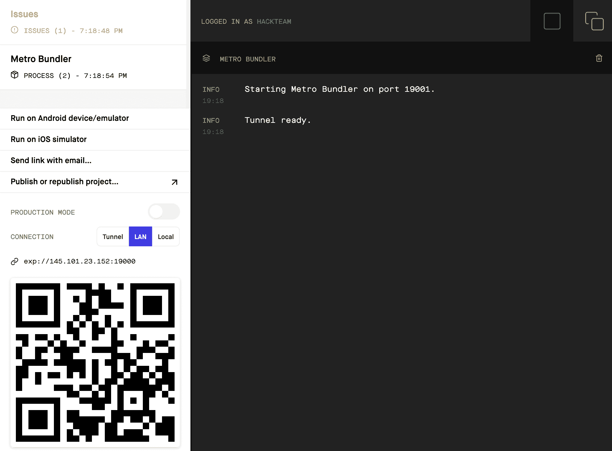
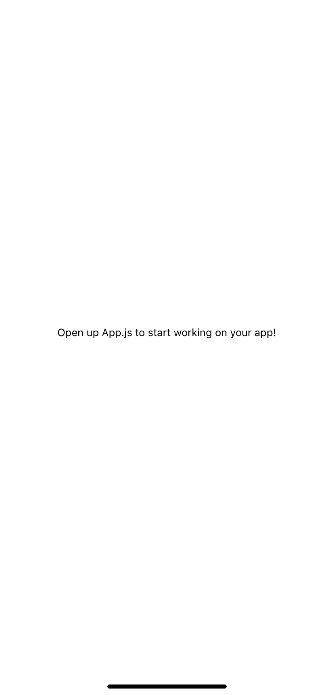
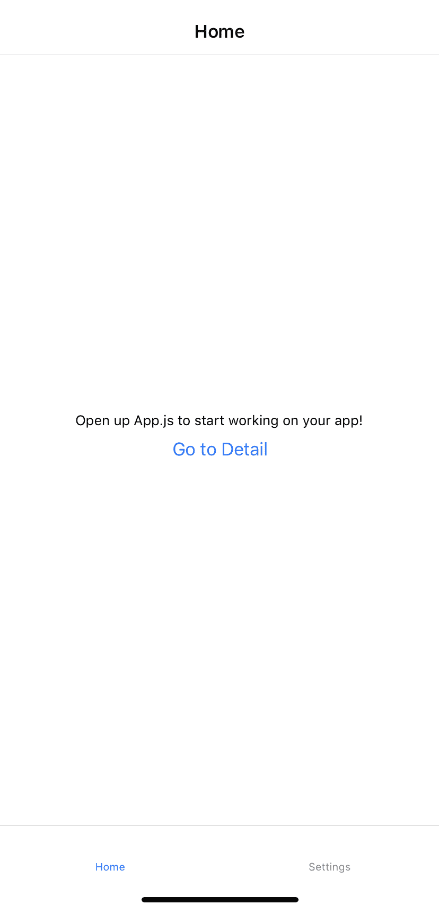
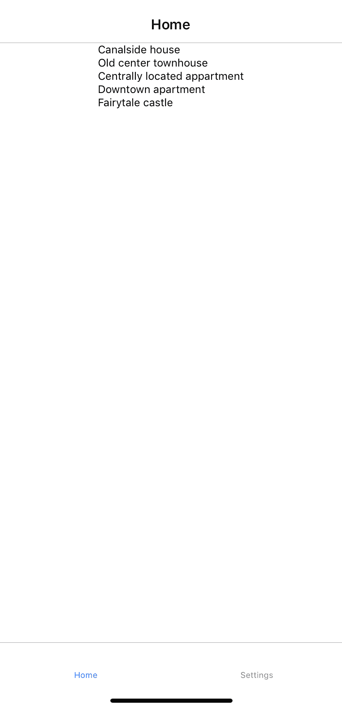
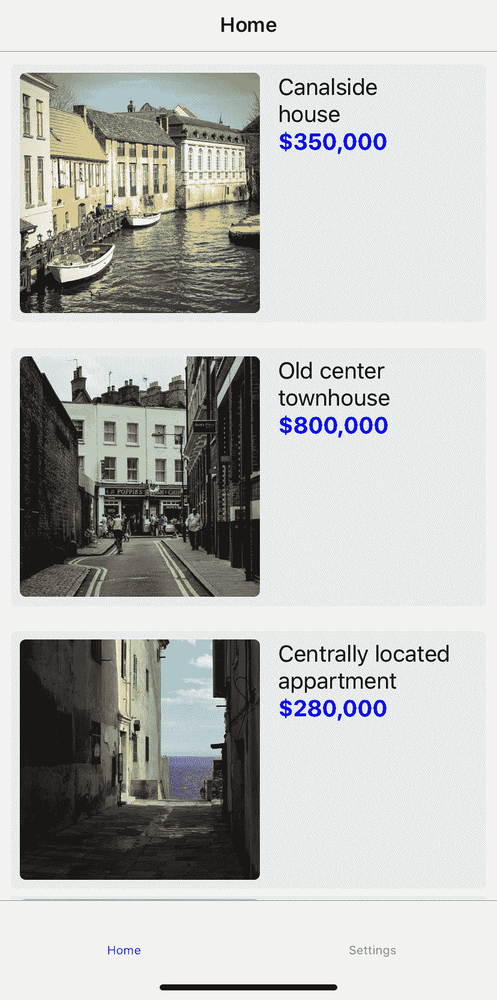
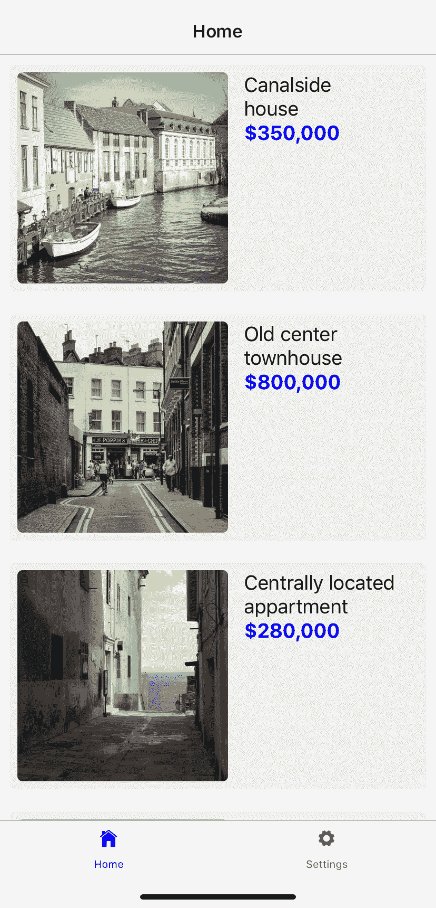
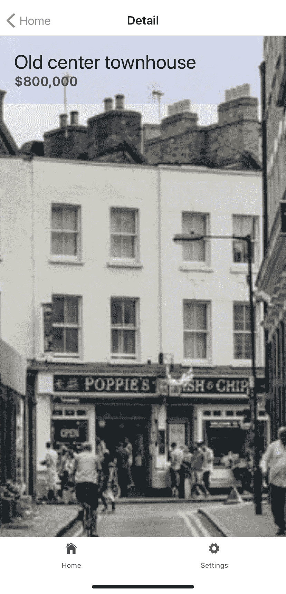

# 第八章：使用 React Native 和 Expo 构建房屋列表应用程序

React 开发的一个标语是*学一次，随处编写*，这是由于 React Native 的存在。使用 React Native，您可以使用 JavaScript 和 React 编写原生移动应用程序，同时使用 React 的相同功能，例如状态管理。在本书中已经获取的 React 知识的基础上，您将从本章开始探索 React Native。由于 React 和 React Native 有很多相似之处，建议您在对 React 知识感到不安时再次查看一些以前的章节。

在本章中，您将使用 React Native 创建一个移动应用程序，该应用程序使用了您在之前章节中看到的相同语法和模式。您将设置基本路由，探索 iOS 和 Android 开发之间的差异，并学习如何使用`styled-components`对 React Native 组件进行样式设置。此外，将使用名为**Expo**的工具链来运行和部署您的 React Native 应用程序。

本章将涵盖以下主题：

+   创建 React Native 项目

+   移动应用程序的路由

+   React Native 中的生命周期

+   在 React Native 中设置组件样式

# 项目概述

在本章中，我们将创建一个房屋列表应用程序，显示可用房屋的概述，并使用`styled-components`进行样式设置和**React Navigation**进行路由。数据是从模拟 API 中获取的。

构建时间为 1.5 小时。

# 入门

确保您已在 iOS 或 Android 设备上安装了 Expo 客户端应用程序，以便能够运行您在本章中创建的应用程序。Expo 客户端可在 Apple 应用商店和 Google Play 商店中下载。

一旦您下载了应用程序，您需要创建一个 Expo 账户，以使开发过程更加顺利。确保将您的账户详细信息存储在安全的地方，因为您稍后在本章中会需要这些信息。**不要忘记通过点击您收到的电子邮件中的链接来验证您的电子邮件地址。**

本章的完整代码可以在 GitHub 上找到：[`github.com/PacktPublishing/React-Projects/tree/ch8`](https://github.com/PacktPublishing/React-Projects/tree/ch8)[.](https://github.com/PacktPublishing/React-Projects/tree/ch7)

此应用程序是使用 Expo SDK 版本 33.0.0 创建的，因此您需要确保您在本地计算机上使用的 Expo 版本相似。由于 React Native 和 Expo 经常更新，请确保您使用此版本，以确保本章描述的模式表现如预期。如果您的应用程序无法启动或收到错误消息，请务必查看 Expo 文档，以了解有关更新 Expo SDK 的更多信息。

# 使用 React Native 和 Expo 构建房源列表应用程序

在本节中，您将使用 React Native 和 Expo 构建一个房源列表应用程序，这使您可以使用与 React 相同的语法和模式，因为它使用了 React 库。此外，Expo 使得无需安装和配置 Xcode（用于 iOS）或 Android Studio 即可开始在您的计算机上创建原生应用程序成为可能。因此，您可以从任何计算机上为 iOS 和 Android 平台编写应用程序。

您还可以使用 Expo web 在浏览器中运行 React Native 应用程序，以创建渐进式 Web 应用程序（PWA）。但是，同时为 iOS、Android 和 Web 开发仍处于实验阶段，可能需要大量性能和架构修复。此外，并非所有在移动设备上的 React Native 中工作的包也会在 Expo web 上工作。

Expo 将 React API 和 JavaScript API 与 React Native 开发流程结合在一起，以便允许诸如 JSX 组件、Hooks 和原生功能（如相机访问）等功能。大致上，Expo 工具链由多个工具组成，这些工具可以帮助您进行 React Native 开发，例如 Expo CLI，它允许您从终端创建 React Native 项目，并提供运行 React Native 所需的所有依赖项。使用 Expo 客户端，您可以从连接到本地网络的 iOS 和 Android 移动设备上打开这些项目。Expo SDK 是一个包，其中包含了使您的应用能够在多个设备和平台上运行的所有库。

# 创建 React Native 项目

在本书中，每个新的 React 项目的起点都是使用 Create React App 为您的应用程序创建一个样板。对于 React Native，有一个类似的样板可用，它是 Expo CLI 的一部分，并且可以像这样轻松设置：

您需要使用以下命令使用`npm`全局安装 Expo CLI：

```jsx
npm install -g expo-cli
```

这将启动安装过程，这可能需要一些时间，因为它将安装帮助您开发移动应用程序的所有依赖项的 Expo CLI。之后，您可以使用 Expo CLI 的`init`命令创建新项目：

```jsx
expo init house-listing
```

Expo 现在将为您创建项目，但首先会要求您回答以下问题：

1.  它会询问您是否要创建一个空白模板，带有 TypeScript 配置的空白模板，或者带有一些示例屏幕设置的示例模板。在本章中，您需要选择第一个选项：空白（`expo-template-blank`）。

1.  选择模板后，您需要输入应用程序的名称，在这种情况下是房源列表。此名称将添加到`app.json`文件中，其中包含有关您的应用程序的配置信息。

1.  Expo 会自动检测您的计算机上是否安装了 Yarn。如果安装了 Yarn，它将要求您使用 Yarn 安装其他必要的依赖项来设置您的计算机。如果安装了 Yarn，请选择“是”；否则，默认情况下将使用 npm。在本章中，建议使用 npm 而不是 Yarn，以便与之前的章节保持一致。

现在，您的应用程序将使用您选择的设置创建。可以通过以下命令进入 Expo 刚刚创建的目录来启动此应用程序：

```jsx
cd house-listing
npm start
```

这将启动 Expo，并使您能够从终端或浏览器启动项目，从而可以在移动设备上运行应用程序，或者使用 iOS 或 Android 模拟器。在终端中，有多种方法可以打开应用程序：

+   使用 Android 或 iOS 上 Expo Client 的用户名登录。您的项目将自动显示在移动设备的“项目”选项卡中。

+   使用运行在 Android 或 iOS 上的移动设备扫描显示的 QR 码。如果您使用的是 Android 设备，可以直接从 Expo Client 应用程序扫描 QR 码。在 iOS 上，您需要使用相机扫描该代码，然后会要求您打开 Expo Client。

+   按下`a`键打开 Android 模拟器，或按下`i`键打开 iOS 模拟器。请记住，您需要安装 Xcode 和/或 Android Studio 才能使用其中一个模拟器。

+   通过按下`e`键将链接发送到您的电子邮件，这个链接可以从安装有 Expo Client 应用程序的移动设备上打开。

另外，运行`npm start`命令会在`http://localhost:19002/`URL 上打开你的浏览器，显示 Expo 开发者工具。这个页面看起来会像这样，假设你安装了在*入门*部分提到的 Expo SDK 的版本：



在这个页面上，你可以看到左边有一个侧边栏，右边是你的 React Native 应用的日志。这个侧边栏包含按钮，让你可以启动 iOS 或 Android 模拟器，你需要安装 Xcode 或 Android Studio。另外，你也可以找到一个按钮，通过邮件发送一个链接或者使用之前安装的 Expo 应用在你的移动设备上生成一个 QR 码来打开应用。

在这一点上，你的应用应该看起来如下。这个截图是从一个 iOS 设备上拍摄的。无论你是使用 iOS 或 Android 模拟器打开应用，还是从 iOS 或 Android 设备上打开应用，都不应该有影响：



这个应用是使用**Expo SDK 版本 33.0.0**创建的，所以你需要确保你本地机器上使用的 Expo 版本是相似的。由于 React Native 和 Expo 经常更新，确保你使用这个版本来确保本章描述的模式表现如预期。如果你的应用无法启动或者收到错误，确保查看 Expo 文档以了解更多关于更新 Expo SDK 的信息。

这个 React Native 应用的项目结构与我们之前在前几章创建的 React 项目非常相似，我们是用 Expo 创建的。它看起来如下：

```jsx
house-listing
|-- .expo
|-- assets
    |-- icon.png
    |-- splash.png
|-- node_modules
.gitignore
App.js
app.json
babel.config.js
package.json
```

在`assets`目录中，你可以找到用于应用主屏幕图标的图片，一旦你在移动设备上安装了这个应用，以及用作启动画面的图片，当你启动应用时会显示。`App.js`文件是你应用的实际入口点，在这里你会返回当应用挂载时将被渲染的组件。应用的配置，例如 App Store 的配置，被放置在`app.json`中，而`babel.config.js`包含特定的 Babel 配置。

# 在 React Native 中设置路由

正如我们之前提到的，`App.js`文件是您的应用程序的入口点，由 Expo 定义。如果您打开这个文件，您会看到它由组件组成，并且`StyleSheet`直接从`react-native`导入。在 React Native 中编写样式的语法与在浏览器中使用的 React 不同，因此您将不得不在本章后面安装`styled-components`。

# 使用 React Navigation 创建路由

让我们继续安装 React Navigation。在 React Native 中有许多可用的包来帮助您处理路由，但这是 Expo 推荐使用的最受欢迎的包之一。除了 React Navigation，您还必须安装相关的包，称为`react-navigation-stack`和`react-navigation-tabs`，这些包需要为您的应用程序创建导航器。可以通过运行以下命令来安装 React Navigation 及其依赖项：

```jsx
npm install react-navigation react-navigation-stack react-navigation-tabs
```

要向您的 React Native 应用程序添加路由，您需要了解在浏览器和移动应用程序中的路由之间的区别。在 React Native 中，历史记录的行为方式与在浏览器中不同，在浏览器中，用户可以通过更改浏览器中的 URL 导航到不同的页面，并且先前访问的 URL 将被添加到浏览器历史记录中。相反，您需要自己跟踪页面之间的转换并在应用程序中存储本地历史记录。

使用 React Navigation，您可以使用多个不同的导航器来帮助您实现这一点，包括堆栈导航器和选项卡导航器。堆栈导航器的行为方式与浏览器非常相似，因为它在页面之间进行转换后堆叠页面，并允许您使用 iOS 和 Android 的本机手势和动画进行导航：

1.  您可以通过将包含路由配置的对象传递给`createStackNavigator`方法来设置堆栈导航器，该方法可以从`react-navigation-stack`在`App.js`文件中导入。此外，您还需要从`react-navigation`导入`createAppContainer`，它可以帮助您返回一个包装所有路由的组件：

```jsx
import React from 'react';
import { StyleSheet, Text, View } from 'react-native';
+ import { createAppContainer } from 'react-navigation';
+ import { createStackNavigator } from 'react-navigation-stack';

export default function App() {
    ...
```

1.  您需要返回使用`createStackNavigator`创建的组件，而不是返回一个名为`App`的组件，该组件保存了应用程序的所有路由。这个`StackNavigator`组件需要使用`createAppContainer`导出，如下所示：

```jsx
import React from 'react';
import { StyleSheet, Text, View } from 'react-native';
import { createAppContainer } from 'react-navigation';
import { createStackNavigator } from 'react-navigation-stack';

- export default function App() {
- return (
+ const Home = () => (
    <View style={styles.container}>
        <Text>Open up App.js to start working on your app!</Text>
    </View>
  );
- } const styles = StyleSheet.create({
  container: {
    flex: 1,
    backgroundColor: '#fff',
    alignItems: 'center',
    justifyContent: 'center',
  },
}); + const StackNavigator = createStackNavigator({
+  Home: {
+    screen: Home,
+  },
+ });

+ export default createAppContainer(StackNavigator);
```

1.  您的应用程序现在有一个名为`Home`的路由，并呈现`Home`组件。您还可以通过在传递给`createStackNavigator`的对象中设置`navigationOptions`字段来为此屏幕添加`title`，如下所示：

```jsx
...

const AppNavigator = createStackNavigator({
  Home: {
    screen: Home,
+   navigationOptions: { title: 'Home' },
  },
});

export default createAppContainer(AppNavigator);
```

1.  要创建另一个路由，您可以通过添加`Detail`组件并添加呈现此组件的路由来复制此过程：

```jsx
import React from 'react';
import { StyleSheet, Text, View } from 'react-native';
import { createAppContainer } from 'react-navigation';
import { createStackNavigator } from 'react-navigation-stack';

const Home = () => (
  <View style={styles.container}>
    <Text>Open up App.js to start working on your app!</Text>
  </View>
);

+ const Detail = () => (
+  <View style={styles.container}>
+    <Text>Open up App.js to start working on your app!</Text>
+  </View>
+ );

...

const AppNavigator = createStackNavigator({
  Home: {
    screen: Home,
    navigationOptions: { title: 'Home' },
  },
+ Detail: {
+   screen: Detail,
+   navigationOptions: { title: 'Detail' },
+ },
});

export default createAppContainer(AppNavigator);
```

1.  现在您的应用程序中有两个屏幕，您还需要设置一个默认路由，该路由在应用程序首次挂载时将呈现。您可以通过使用以下代码扩展传递给`createStackNavigator`的路由配置对象来执行此操作：

```jsx
...

const AppNavigator = createStackNavigator({
  Home: {
    screen: Home,
    navigationOptions: { title: 'Home' },
  },
  Detail: {
    screen: Detail,
    navigationOptions: { title: 'Detail' },
  },
+ }, { initialRouteName: 'Home' });
- });

export default createAppContainer(AppNavigator);
```

您可以通过将`initialRouteName`的值更改为`Detail`，并检查应用程序中呈现的屏幕是否具有标题`Detail`，来看到`Detail`路由也正在呈现。

在本节的下一部分中，您将学习如何在此导航器创建的不同屏幕之间进行过渡。

# 在屏幕之间过渡

在 React Native 中，在屏幕之间过渡也与在浏览器中有些不同，因为再次，没有 URL。相反，您需要使用`navigation`属性，该属性可从堆栈导航器呈现的组件中获取。`navigation`属性可用于通过进行以下更改来处理路由：

1.  您可以从`Home`和`Detail`组件中访问此示例中的`navigation`属性：

```jsx
import React from 'react';
import { StyleSheet, Text, View } from 'react-native';
import { createAppContainer } from 'react-navigation';
import { createStackNavigator } from 'react-navigation-stack';

- const Home = () => (
+ const Home = ({ navigation }) => (
  <View style={styles.container}>
    <Text>Open up App.js to start working on your app!</Text>
  </View>
);

...
```

1.  `navigation`属性包含多个值，包括`navigate`函数，该函数以路由名称作为参数。您可以将此函数用作事件，例如，您可以从`react-native`导入的`Button`组件上调用`onPress`事件处理程序来单击按钮。与您在 React 中习惯的方式相比，您可以通过调用`onPress`事件处理程序而不是`onClick`来单击按钮。此外，`Button`组件不接受子元素作为属性，而是接受`title`属性。要做到这一点，请更改以下代码：

```jsx
import React from 'react';
- import { StyleSheet, Text, View } from 'react-native';
+ import { Button, StyleSheet, Text, View } from 'react-native';
import { createAppContainer } from 'react-navigation';
import { createStackNavigator } from 'react-navigation-stack';

const Home = ({ navigation }) => (
  <View style={styles.container}>
    <Text>Open up App.js to start working on your app!</Text>
+   <Button onPress={() => navigation.navigate('Detail')} title='Go to Detail' />
  </View>
);

...
```

1.  当您按下标题为`转到详细信息`的按钮时，您将转到`Detail`屏幕。此屏幕的标题栏还将呈现一个`返回`按钮，当您按下它时，将返回到`Home`屏幕。您还可以使用`navigation`属性中的`goBack`函数创建自定义返回按钮，如下所示：

```jsx
...

- const Detail = () => (
+ const Detail = ({ navigation }) => (
  <View style={styles.container}>
    <Text>Open up App.js to start working on your app!</Text>
+    <Button onPress={() => navigation.goBack()} title='Go to back to Home' />
  </View>
);

...
```

通常，将这些组件存储在不同的目录中，并且只使用`App.js`文件可以使您的应用程序更易读。为了实现这一点，您需要在应用程序的根目录中创建一个名为`Screens`的新目录，在其中需要为您刚刚创建的两个屏幕中的每一个添加一个文件。让我们学习如何做到这一点：

1.  在`Screens`目录中创建一个名为`Home.js`的文件，并将`Home`组件添加到该文件中，包括所使用模块的导入。`Home`组件的代码如下：

```jsx
import React from 'react';
import { Button, StyleSheet, Text, View } from 'react-native';

const Home = ({ navigation }) => (
  <View style={styles.container}>
    <Text>Open up App.js to start working on your app!</Text>
    <Button onPress={() => navigation.navigate('Detail')} title='Go to Detail' />
  </View>
);

const styles = StyleSheet.create({
  container: {
    flex: 1,
    backgroundColor: '#fff',
    alignItems: 'center',
    justifyContent: 'center',
  },
});

export default Home;
```

1.  您需要为`Detail`屏幕做同样的事情，方法是创建`Screens/Detail.js`文件，并将`Detail`组件和所使用的模块的代码添加到该文件中。您可以通过向该新文件添加以下代码块来实现这一点：

```jsx
import React from 'react';
import { Button, StyleSheet, Text, View } from 'react-native';

const Detail = ({ navigation }) => (
  <View style={styles.container}>
    <Text>Open up App.js to start working on your app!</Text>
    <Button onPress={() => navigation.goBack()} title='Go to back to Home' />
  </View>
);

const styles = StyleSheet.create({
  container: {
    flex: 1,
    backgroundColor: '#fff',
    alignItems: 'center',
    justifyContent: 'center',
  },
});

export default Detail;
```

1.  在`App.js`文件中，您需要导入`Home`和`Detail`组件，并删除先前创建这两个组件的代码块，如下所示：

```jsx
import React from 'react';
- import { Button, StyleSheet, Text, View } from 'react-native';
import { createAppContainer } from 'react-navigation';
import { createStackNavigator } from 'react-navigation-stack'; + import Home from './Screens/Home';
+ import Detail from './Screens/Detail';

- const Home = ({ navigation }) => (
-   <View style={styles.container}>
-     <Text>Open up App.js to start working on your app!</Text>
-     <Button onPress={() => navigation.navigate('Detail')} title='Go to Detail' />
-   </View>
- );

- const Detail = ({ navigation }) => (
-   <View style={styles.container}>
-     <Text>Open up App.js to start working on your app!</Text>
-     <Button onPress={() => navigation.goBack()} title='Go to back to Home' />
-   </View>
- );

- const styles = StyleSheet.create({
-  container: {
-   flex: 1,
-   backgroundColor: '#fff',
-   alignItems: 'center',
-   justifyContent: 'center',
-  },
- });

const AppNavigator = createStackNavigator({
  Home: {
    screen: Home,
    navigationOptions: { title: 'Home' },
  },
  Detail: {
    screen: Detail,
    navigationOptions: { title: 'Detail' },
  },
}, { initialRouteName: 'Home' });

export default createAppContainer(AppNavigator);
```

您的应用程序只使用`App.js`文件来创建路由并设置堆栈导航器。许多应用程序在彼此旁边使用多种类型的导航器，这将在本节的下一部分中展示。

# 将多个导航器一起使用

对于更复杂的应用程序，您不希望所有的路由都堆叠在一起；您只希望为彼此相关的路由创建这些堆栈。幸运的是，您可以在 React Navigation 中同时使用不同类型的导航器。可以通过以下方式使用多个导航器来完成应用程序：

1.  在移动应用程序中导航的最常见方式之一是使用选项卡；React Navigation 也可以为您创建选项卡导航器。因此，您需要将一个路由对象传递给`createBottomTabNavigator`方法，您可以使用以下代码从`react-navigation-tabs`导入它：

```jsx
import React from 'react';
import { Button, StyleSheet, Text, View } from 'react-native';
import { createAppContainer } from 'react-navigation';
import { createStackNavigator } from 'react-navigation-stack';
+ import { createBottomTabNavigator } from 'react-navigation-tabs'; 
import Home from './Screens/Home';
import Detail from './Screens/Detail';

...
```

1.  假设您希望“主页”屏幕和相邻的“详细”屏幕在同一个选项卡上可用-您需要为这些屏幕重命名堆栈导航器。这个堆栈导航器应该被添加到传递给`createBottomTabNavigator`的路由对象中，该对象创建了选项卡导航器。加载的初始路由声明现在也与选项卡导航器相关联：

```jsx
import React from 'react';
import { Button, StyleSheet, Text, View } from 'react-native';
import { createAppContainer } from 'react-navigation'; 
import { createStackNavigator } from 'react-navigation-stack';
import { createBottomTabNavigator } from 'react-navigation-tabs';
import Home from './Screens/Home';
import Detail from './Screens/Detail';

- const AppNavigator = createStackNavigator({
+ const HomeStack = createStackNavigator({
    Home: {
      screen: Home,
      navigationOptions: { title: 'Home' },
    },
    Detail: {
      screen: Detail,
      navigationOptions: { title: 'Detail' },
    },
-  }, { initialRouteName: 'Home' });
+ });

+ const AppNavigator = createBottomTabNavigator({
+  Home: HomeStack
+ }, { initialRouteName: 'Home' });

export default createAppContainer(AppNavigator);
```

您应用程序的主要导航现在是选项卡导航器，只有一个名为`Home`的选项卡。此选项卡将呈现包含`Home`和`Detail`路由的堆栈导航器，这意味着您仍然可以在不离开`Home`选项卡的情况下导航到`Detail`屏幕。

1.  您可以轻松地向选项卡导航器添加另一个选项卡，该选项卡将呈现组件或另一个堆栈导航器。让我们创建一个名为`Settings`的新屏幕，首先需要在`Screens/Settings.js`文件中创建一个新组件：

```jsx
import React from 'react';
import { StyleSheet, Text, View } from 'react-native';

const Settings = ({ navigation }) => (
  <View style={styles.container}>
    <Text>Open up App.js to start working on your app!</Text>
  </View>
);

const styles = StyleSheet.create({
  container: {
    flex: 1,
    backgroundColor: '#fff',
    alignItems: 'center',
    justifyContent: 'center',
  },
});

export default Settings;
```

1.  在`App.js`中导入此组件，以将新的`Screens`路由添加到选项卡导航器。在您进行这些更改后，此屏幕将呈现`Settings`组件：

```jsx
import React from 'react';
import { Button, StyleSheet, Text, View } from 'react-native';
import { createAppContainer } from 'react-navigation';
import { createStackNavigator } from 'react-navigation-stack';
import { createBottomTabNavigator } from 'react-navigation-tabs';
import Home from './Screens/Home';
import Detail from './Screens/Detail';
+ import Settings from './Screens/Settings';

...

const AppNavigator = createBottomTabNavigator({
   Home: HomeStack,
+  Settings,
}, { initialRouteName: 'Home' });

export default createAppContainer(AppNavigator);
```

1.  您的应用程序现在有一个名为`Settings`的选项卡，它将呈现`Settings`组件。但是，例如此屏幕的`title`是不可能自定义的。因此，您需要使用以下代码创建另一个只有`Settings`路由的堆栈导航器：

```jsx
...

+ const SettingsStack = createStackNavigator({
+  Settings: {
+    screen: Settings,
+    navigationOptions: { title: 'Settings' },
+  },
+ });

const AppNavigator = createBottomTabNavigator({
   Home: HomeStack,
-  Settings,
+  Settings: SettingsStack,
}, { initialRouteName: 'Home' });

export default createAppContainer(AppNavigator);
```

您现在已经在应用程序中添加了堆栈导航器和选项卡导航器，这使您可以同时在屏幕和选项卡之间导航。如果您正在使用 iOS 模拟器或运行 iOS 的设备上运行应用程序，它将看起来完全像以下屏幕截图。对于 Android，在这一点上，应用程序应该看起来非常相似：



在下一节中，您将从模拟 API 加载数据，并使用 React 生命周期在不同的屏幕中加载这些数据。

# 在 React Native 中使用生命周期

在开始为 React Native 组件添加样式之前，您需要在应用程序中获取一些数据，这些数据将由这些组件显示。因此，您需要使用生命周期来检索这些数据并将其添加到应用程序的本地状态中。

要获取数据，您将再次使用`fetch` API，并结合`useState`和`useEffect` Hooks 在生命周期内检索这些数据。一旦从模拟 API 中获取了数据，它可以在 React Native 的`FlatList`组件中显示。可以通过以下方式使用 Hooks 向 React Native 应用程序添加生命周期方法：

1.  您将使用`useState` Hook 来设置加载指示器、错误消息和显示数据的常量，其中`loading`常量应最初为 true，`error`常量应为空，`data`常量应为空数组：

```jsx
...

- const Home = ({ navigation }) => (
+ const Home = ({ navigation }) => {
+  const [loading, setLoading] = React.useState(true);
+  const [error, setError] = React.useState('');
+  const [data, setData] = React.useState([]);

+  return (
    <View style={styles.container}>
      <Text>Open up App.js to start working on your app!</Text>
      <Button onPress={() => navigation.navigate('Detail')} title='Go to Detail' />
    </View>
   )
+ };
```

1.  接下来，您需要创建一个异步函数，从模拟 API 中检索数据，并从应用程序挂载时调用`useEffect` Hook。当 API 请求成功时，`fetchAPI`函数将更改`loading`、`error`和`data`的两个常量。如果不成功，错误消息将被添加到`error`常量中。

```jsx
...
const Home = ({ navigation }) => {
  const [loading, setLoading] = React.useState(true);
  const [error, setError] = React.useState('');
  const [data, setData] = React.useState([]);

+  const fetchAPI = async () => {
+    try {
+      const data = await fetch('https://my-json-server.typicode.com/PacktPublishing/React-Projects/listings');
+      const dataJSON = await data.json();

+      if (dataJSON) {
+        setData(dataJSON);
+        setLoading(false);
+      }
+    } catch(error) {
+      setLoading(false);
+      setError(error.message);
+    }
+  };

+  React.useEffect(() => {
+    fetchAPI();
+  }, []);

  return (
    ...
```

1.  现在，这个数据常量可以作为`FlatList`组件的一个 prop 添加，它会遍历数据并渲染显示这些数据的组件。`FlatList`返回一个包含名为`item`的字段的对象，其中包含每次迭代的数据，如下所示：

```jsx
import React from 'react';
- import { Button, StyleSheet, Text, View } from 'react-native';
+ import { FlatList, StyleSheet, Text, View } from 'react-native';

const Home = ({ navigation }) => {

  ...

  return (
    <View style={styles.container}>
-     <Text>Open up App.js to start working on your app!</Text>
-     <Button onPress={() => navigation.navigate('Detail')} title='Go to Detail' />
+     {!loading && !error && <FlatList
+       data={data}
+       renderItem={({item}) => <Text>{item.title}</Text>}
+     />}
    </View>
  )
};

...
```

1.  就像我们在 React 中可以做的那样，当使用`map`或`forEach`函数时，您需要在每个迭代的组件上指定一个`key`属性。`FlatList`会自动查找`data`对象中的`key`字段，但如果您没有特定的`key`字段，您需要使用`keyExtractor`属性来设置它。重要的是要知道，用于键的值应该是一个字符串，因此您需要将模拟 API 返回的`id`字段转换为字符串：

```jsx
  ...

  return (
    <View style={styles.container}>
     {!loading && !error && <FlatList
       data={data}
+      keyExtractor={item => String(item.id)}
       renderItem={({item}) => <Text>{item.title}</Text>}
     />}
    </View>
  );
};

...
```

现在，您的应用程序将显示来自模拟 API 的房源标题列表，而无需路由到特定的列表或样式。这将使您的应用程序看起来如下，Android 和 iOS 之间的差异应该是有限的，因为我们尚未向应用程序添加任何重要的样式：



要再次将导航添加到`Detail`路由，您需要从`FlatList`返回一个支持`onPress`事件的组件。例如，您之前使用的`Button`组件和`TouchableOpacity`组件。这个最后一个组件可以用作`View`组件的替代品，它不支持`onPress`事件。在这里创建导航是通过进行以下更改完成的：

1.  您需要从`react-native`中导入`TouchableOpacity`组件，并用这个组件包装`FlatList`返回的`Text`组件。`onPress`事件将从`navigation`属性调用`navigate`函数，并导航到`Detail`路由，如果我们更改以下代码：

```jsx
import React from 'react';
- import { FlatList, View, Text } from 'react-native';
+ import { FlatList, View, Text, TouchableOpacity } from 'react-native';

const Home = ({ navigation }) => {
  ...

  return (
    <View style={styles.container>
      {!loading && !error && <FlatList
        data={data}
        keyExtractor={item => String(item.id)}
-       renderItem={({item}) => <Text>{item.text}</Text>}
+       renderItem={({item}) => (
+         <TouchableOpacity onPress={() => navigation.navigate('Detail')}>
+           <Text>{item.title}</Text>
+         </TouchableOpacity>
+       )}
      />}
    </View>
  );
};

...
```

1.  当您单击应用程序中显示的任何标题时，您将导航到“详细”路由。但是，您希望此屏幕显示您刚刚按下的项目。因此，一旦按下`TouchableOpacity`组件，您将需要向此路由传递参数。为此，您需要将这些参数作为对象传递给`navigate`函数：

```jsx
  ...

  return (
    <View style={styles.container>
      {!loading && !error && <FlatList
        data={data}
        keyExtractor={item => String(item.id)}
        renderItem={({item}) => (
-         <TouchableOpacity onPress={() => navigation.navigate('Detail')}>
+         <TouchableOpacity onPress={() => navigation.navigate('Detail', { item })}>
           <Text>{item.title}</Text>
         </TouchableOpacity>
       )}
      />}
    </View>
  );
};

...
```

1.  从由“详细”路由呈现的组件中，您可以从`navigation`属性中获取此参数对象，并使用它来显示该项目。要从`navigation`属性获取参数，您可以使用`getParam`函数，其中您需要指定要获取的参数的名称和此参数的回退值。就像我们为“主页”路由所做的那样，您可以显示列表的`title`，在这种情况下应该是来自`item`参数的`title`：

```jsx
import React from 'react';
- import { Button, StyleSheet, Text, View } from 'react-native';
+ import { StyleSheet, Text, View } from 'react-native';

- const Detail = ({ navigation }) => (
+ const Detail = ({ navigation }) => {
+   const item = navigation.getParam('item', {})

+   return (
      <View style={styles.container}>
-       <Text>Open up - App.js to start working on your app!</Text>
-       <Button onPress={() => navigation.goBack()} title='Go to back to Home' />
+       <Text>{item.title}</Text>
      </View>
    );
+ };

...

export default Detail;
```

不要传递包含所点击项目数据的整个对象，而是只需发送项目的 ID。这样，您可以获取模拟 API 以获取此列表的数据，并在“详细”路由上显示它。要获取单个列表，您需要发送请求到`'listings/:id'`路由。

您现在可以查看来自模拟 API 的所有列表和来自此 API 的特定列表。下一节将使用`styled-components`添加样式。

# 样式化 React Native 应用程序

到目前为止，在此应用程序中用于样式化 React Native 组件的语法看起来与您已经使用的有些不同。因此，您可以安装`styled-components`以使用您已经熟悉的样式编写语法。要安装此内容，您需要运行以下命令：

```jsx
npm install styled-components
```

这将安装`styled-components`包，之后您可以继续为应用程序中已经存在的组件创建样式：

1.  让我们从将`Screens/Home.js`文件中的`View`和`FlatList`组件转换为`styled-components`开始。为此，您需要从`styled-components/native`中导入`styled`，因为您只想导入包的特定本机部分：

```jsx
import React from 'react';
- import { FlatList, StyleSheet, Text, View, TouchableOpacity } from 'react-native';
+ import { FlatList, Text, View, TouchableOpacity } from 'react-native';
+ import styled from 'styled-components/native'; 
const Home = ({ navigation }) => {
  ...
```

1.  文件底部的`StyleSheet`创建了`View`组件的样式，应该将其转换为使用`styled-components`样式的组件。正如我们在前几章中看到的那样，您也可以扩展现有组件的样式。大多数样式规则可以复制并更改为`styled-components`的语法，如下代码块所示：

```jsx
... + const ListingsWrapper = styled(View)`
+  flex: 1;
+  background-color: #fff;
+  align-items: center;
+  justify-content: center;
+ `

- const styles = StyleSheet.create({
-   container: {
-     flex: 1,
-     backgroundColor: '#fff',
-     alignItems: 'center',
-     justifyContent: 'center',
-   },
- }); 
const Home = ({ navigation }) => {
  ...
  return (
-    <View style={styles.container}>
+    <ListingsWrapper>
      {!loading && !error && <FlatList
        data={data}
        keyExtractor={item => String(item.id)}
        renderItem={({item}) => (
          <TouchableOpacity onPress={() => navigation.navigate('Detail', { item })}>
            <Text>{item.title}</Text>
          </TouchableOpacity>
        )}
      />}
+    </ListingsWrapper>
-    </View>
  );
};

export default Home;
```

1.  `FlatList`组件也可以做同样的事情，即通过使用`styled-components`中的`styled`来扩展此组件的样式，并设置自定义样式规则，如下所示：

```jsx
...

const ListingsWrapper = styled(View)`
  flex: 1;
  background-color: #fff;
  align-items: center;
  justify-content: center;
`

+ const Listings = styled(FlatList)`
+  width: 100%;
+  padding: 5%;
+ `; 
const Home = ({ navigation }) => {
  ...
  return (
    <ListingsWrapper>
-     {!loading && !error && <FlatList
+     {!loading && !error && <Listings
        data={data}
        keyExtractor={item => String(item.id)}
        renderItem={({item}) => (
          <TouchableOpacity onPress={() => navigation.navigate('Detail', { item })}>
            <Text>{item.title}</Text>
          </TouchableOpacity>
        )}
      />}
    </ListingsWrapper>
  );
};

export default Home;
```

1.  `FlatList`目前只返回一个带有`title`的`Text`组件，而可以显示更多数据。为了做到这一点，您需要创建一个新的组件，该组件返回包含来自模拟 API 的列表数据的多个组件。您可以在一个名为`Components`的新目录中完成这个操作，该目录包含另一个名为`Listing`的目录。在这个目录中，您需要创建`ListingItem.js`文件，并将以下代码块放入其中：

```jsx
import React from 'react';
import styled from 'styled-components/native';
import { Image, Text, View, TouchableOpacity } from 'react-native';

const ListingItemWrapper = styled(TouchableOpacity)`
 display: flex;
 flex-direction: row;
 padding: 2%;
 background-color: #eee;
 border-radius: 5px;
 margin-bottom: 5%;
`;

export const Title = styled(Text)`
 flex-wrap: wrap;
 width: 99%;
 font-size: 20px;
`

export const Price = styled(Text)`
 font-weight: bold;
 font-size: 20px;
 color: blue;
`

const Thumbnail = styled(Image)`
 border-radius: 5px;
 margin-right: 4%;
 height: 200px;
 width: 200px;
`

const ListingItem = ({ item, navigation }) => (
 <ListingItemWrapper onPress={() => navigation.navigate('Detail', { item })}>
   <Thumbnail
     source={{uri: item.thumbnail}}
   />
   <View>
     <Title>{item.title}</Title>
     <Price>{item.price}</Price>
   </View>
 </ListingItemWrapper>
);

export default ListingItem;
```

在这个代码块中，您从`styled-components/native`中导入`styled`和您想要样式化的 React Native 组件。文件底部导出的`ListingItem`组件接受一个`item`和一个`navigation`属性，以在创建的组件中显示这些数据并处理导航。就像我们在样式化的`Image`组件中看到的那样，`source`属性被赋予一个对象，以显示来自模拟 API 的缩略图。

1.  现在，应该将这个`ListingItem`组件导入到`Screens/Home.js`中，`FlatList`将使用它来显示列表。这个组件接受`item`和`navigation`作为属性，如下所示：

```jsx
import React from 'react';
- import { FlatList, View, Text, TouchableOpacity } from 'react-native';
+ import { FlatList, View } from 'react-native';
import styled from 'styled-components/native';
+ import ListingItem from '../Components/Listing/ListingItem'

...
const Home = ({ navigation }) => {
  ...

  return (
    <ListingsWrapper>
      {!loading && !error && <Listings
        data={data}
        keyExtractor={item => String(item.id)}
-       renderItem={({item}) => (
-         <TouchableOpacity onPress={() => navigation.navigate('Detail', { item })}>
-           <Text>{item.title}</Text>
-         </TouchableOpacity>
-       )}
+       renderItem={({item}) => <ListingItem item={item} />}
      />}
    </ListingsWrapper>
  );
};

export default Home;
```

在 React Native 中，样式规则是针对组件的，这意味着`Text`组件只能接受由 React Native 为该组件指定的样式规则。当您尝试添加不受支持的样式规则时，您将收到一个错误和该组件的所有可能的样式规则的列表。请注意，`styled-components`会自动为您重命名样式规则，以匹配 React Native 中的样式语法。

经过这些更改，您将向应用程序添加了第一个`styled-components`。当您使用 iOS 模拟器或运行 iOS 的设备时，您的应用程序应该如下所示：



到目前为止，由于我们尚未向应用程序添加任何特定于平台的样式，因此 iOS 和 Android 上的样式应该看起来相似。这将在本节的下一部分中完成，在该部分中，您将探索根据应用程序运行的平台而不同的多种添加样式的方法。

# iOS 和 Android 的样式差异

在设计应用程序时，您可能希望为 iOS 和 Android 设置不同的样式规则，例如，以更好地匹配 Android 操作系统的样式。有多种方法可以将不同的样式规则应用于不同的平台；其中一种方法是使用`Platform`模块，该模块可以从 React Native 中导入。

让我们尝试通过向`navigator`选项卡中的选项卡添加图标，并为 iOS 和 Android 设置不同的图标。

1.  首先，从 Expo 中将图标导入到`App.js`文件中。Expo 提供了许多图标集。对于此应用程序，您将导入`Ionicons`图标集：

```jsx
import React from 'react';
+ import { Ionicons } from '@expo/vector-icons';
import { createAppContainer } from 'react-navigation';
import { createStackNavigator } from 'react-navigation-stack';
import { createBottomTabNavigator } from 'react-navigation-tabs';
import Home from './Screens/Home';
import Detail from './Screens/Detail';
import Settings from './Screens/Settings';

const HomeStack = createStackNavigator({
  ...
```

1.  创建选项卡导航器时，您可以定义应该添加到每个路由选项卡的图标。因此，您需要在路由对象中创建一个`defaultNavigationOptions`字段，该字段应包含一个`tabBarIcon`字段。在此字段中，您需要从`navigation`属性中获取当前路由，并返回此路由的图标：

```jsx
...

const AppNavigator = createBottomTabNavigator({
  Home: HomeStack,
  Settings: SettingsStack,
- }, { initialRouteName: 'Home' });
+ }, {
+  initialRouteName: 'Home',
+  defaultNavigationOptions: ({ navigation }) => ({
+    tabBarIcon: () => {
+      const { routeName } = navigation.state;

+      let iconName;
+      if (routeName === 'Home') {
+        iconName = `ios-home`;
+      } else if (routeName === 'Settings') {
+        iconName = `ios-settings`;
+      }

+      return <Ionicons name={iconName} size={20} />;
+    }
+  })
});

export default createAppContainer(AppNavigator);
```

3. 要区分 iOS 和 Android，您需要从`react-native`中导入`Platform`模块。使用此模块，您可以通过检查`Platform.OS`的值是否为`ios`或`android`来检查您的移动设备是运行 iOS 还是 Android。必须将该模块导入以下代码块中：

```jsx
import React from 'react';
+ import { Platform } from 'react-native';
import { Ionicons } from '@expo/vector-icons';
import { createAppContainer } from 'react-navigation';
import { createStackNavigator } from 'react-navigation-stack';
import { createBottomTabNavigator } from 'react-navigation-tabs';
import Home from './Screens/Home';
import Detail from './Screens/Detail';
import Settings from './Screens/Settings';

const HomeStack = createStackNavigator({
  ...
```

1.  使用`Platform`模块，您可以更改导航器中每个选项卡呈现的图标。除了为 iOS 设计的图标外，`Ionicons`还具有基于 Material Design 的 Android 设计图标，可以像这样使用：

```jsx
...

const AppNavigator = createBottomTabNavigator({
  Home: HomeStack,
  Settings: SettingsStack,
}, {
  initialRouteName: 'Home',
  defaultNavigationOptions: ({ navigation }) => ({
    tabBarIcon: () => {
      const { routeName } = navigation.state;

      let iconName;
      if (routeName === 'Home') {
-       iconName = `ios-home`;
+       iconName = `${Platform.OS === 'ios' ? 'ios' : 'md'}-home`;
      } else if (routeName === 'Settings') {
-       iconName = `ios-settings`;
+       iconName = `${Platform.OS === 'ios' ? 'ios' : 'md'}-settings`;
      }

      return <Ionicons name={iconName} size={20} />;
    }
  }),
});

export default createAppContainer(AppNavigator);
```

当您在 Android 移动设备上运行应用程序时，`navigator`选项卡将显示基于 Material Design 的图标。如果您使用的是苹果设备，它将显示不同的图标；您可以将`Platform.OS === 'ios'`条件更改为`Platform.OS === 'android'`，以将 Material Design 图标添加到 iOS 中。

1.  显示的图标是黑色的，而活动和非活动标签的标签具有不同的颜色。您可以通过更改配置对象来指定图标和标签在活动和非活动状态下的颜色。在`tabBarIcon`字段之后，您可以创建一个名为`tabBarOptions`的新字段，并将`activeTintColor`和`inActiveTintColor`字段添加到其中，如下所示：

```jsx
...
const AppNavigator = createBottomTabNavigator({
  Home: HomeStack,
  Settings: SettingsStack,
}, {
  initialRouteName: 'Home',
  defaultNavigationOptions: ({ navigation }) => ({
    tabBarIcon: () => {
      const { routeName } = navigation.state;

      let iconName;
      if (routeName === 'Home') {
        iconName = `${Platform.OS === 'ios' ? 'ios' : 'md'}-home`;
      } else if (routeName === 'Settings') {
        iconName = `${Platform.OS === 'ios' ? 'ios' : 'md'}-settings`;
      }

      return <Ionicons name={iconName} size={20} />;
    },
+   tabBarOptions: {
+      activeTintColor: 'blue',
+      inactiveTintColor: '#556',
+   },
  })
});

export default createAppContainer(AppNavigator);
```

1.  这只改变了标签的值，但活动和非活动的色调颜色值也可以在`tabBarIcon`字段上使用`tintColor`属性。这个值可以传递给`Ionicons`来改变图标的颜色：

```jsx
...

const AppNavigator = createBottomTabNavigator({
  Home: HomeStack,
  Settings: SettingsStack,
}, {
  initialRouteName: 'Home',
  defaultNavigationOptions: ({ navigation }) => ({
-   tabBarIcon: () => {
+   tabBarIcon: ({ tintColor }) => {
      const { routeName } = navigation.state;

      let iconName;
      if (routeName === 'Home') {
        iconName = `${Platform.OS === 'ios' ? 'ios' : 'md'}-home`;
      } else if (routeName === 'Settings') {
        iconName = `${Platform.OS === 'ios' ? 'ios' : 'md'}-settings`;
      }

-     return <Ionicons name={iconName} size={20} />;
+     return <Ionicons name={iconName} size={20} color={tintColor} />;
    },
    tabBarOptions: {
      activeTintColor: 'blue',
      inactiveTintColor: '#556',
    },
  }),
});

export default createAppContainer(AppNavigator);
```

现在，当您查看主屏幕时，选项卡图标和标签都会呈蓝色，而设置选项卡将呈灰色。此外，无论您是在模拟器上还是在移动设备上运行应用程序，显示的图标都会有所不同。如果您使用 iOS，应用程序应该如下所示：



另一个可以进行样式设置的页面是“详情”屏幕。对于这个屏幕，您也可以选择在 iOS 和 Android 之间进行样式上的差异。如前所述，有多种方法可以做到这一点；除了使用`Platform`模块之外，您还可以使用特定于平台的文件扩展名。任何具有`*.ios.js`或`*.android.js`扩展名的文件都只会在扩展名指定的平台上呈现。您不仅可以应用不同的样式规则，还可以在不同平台上进行功能上的变化：

1.  为了在运行 Android 的移动设备上创建一个特定的“详情”屏幕，您需要创建一个名为`Components/Listing/ListingDetail.android.js`的新文件。这个文件里面将包含以下代码：

```jsx
import React from 'react';
import styled from 'styled-components/native';
import { Image, Text, View, Dimensions } from 'react-native';

const ListingDetailWrapper = styled(View)`
  display: flex;
`;

const Details = styled(View)`
  padding: 5%;
`

export const Title = styled(Text)`
  flex-wrap: wrap;
  width: 99%;
  font-size: 30px;
`

export const Price = styled(Text)`
  font-weight: bold;
  font-size: 20px;
  color: blue;
`

const Thumbnail = styled(Image)`
  width: 100%;
  height: ${Dimensions.get('window').width};
`

const ListingDetail = ({ item }) => (
  <ListingDetailWrapper>
    <Thumbnail
      source={{uri: item.thumbnail}}
    />
    <Details>
      <Title>{item.title}</Title>
      <Price>{item.price}</Price>
    </Details>
  </ListingDetailWrapper>
);

export default ListingDetail;
```

正如您所看到的，一些组件将由`ListingDetail`组件呈现。还从`react-native`中导入了`Dimensions`模块。这个模块可以帮助您获取应用程序正在运行的设备的屏幕尺寸。通过获取宽度，您可以在用户屏幕的整个宽度上显示图像。

1.  对于运行 iOS 的设备，您也可以做同样的事情，但这次您需要创建一个名为`Components/Listing/ListingDetail.ios.js`的新文件。这个文件将包含在 Android 上运行的代码的变体，其中图像将使用`Dimensions`模块在整个屏幕高度上显示。iOS 的`ListingDetail`组件可以通过将以下代码块粘贴到该文件中来创建：

```jsx
import React from 'react';
import styled from 'styled-components/native';
import { Image, Text, View, Dimensions } from 'react-native';

const ListingDetailWrapper = styled(View)`
  display: flex;
`;

const Details = styled(View)`
  position: absolute;
  top: 0;
  padding: 5%;
  width: 100%;
  background: rgba(0, 0, 255, 0.1);
`

export const Title = styled(Text)`
  flex-wrap: wrap;
  width: 99%;
  font-size: 30px;
`

export const Price = styled(Text)`
  font-weight: bold;
  font-size: 20px;
  color: blue;
`

const Thumbnail = styled(Image)`
  width: 100%;
  height: ${Dimensions.get('window').height};
`

const ListingDetail = ({ item }) => (
  <ListingDetailWrapper>
    <Thumbnail
      source={{uri: item.thumbnail}}
    />
    <Details>
      <Title>{item.title}</Title>
      <Price>{item.price}</Price>
    </Details>
  </ListingDetailWrapper>
);

export default ListingDetail;
```

1.  要在应用程序中显示这些组件中的一个，需要对`Screens/Detail.js`文件进行一些更改。`ListingDetail`组件应该被导入到这个文件中，并使用`item`属性返回：

```jsx
import React from 'react';
import { StyleSheet, Text, View } from 'react-native';
+ import ListingDetail from '../Components/Listing/ListingDetail';

const Detail = ({ navigation }) => {
  const item = navigation.getParam('item', {});

  return (
-  <View style={styles.container}>
+  <ListingDetail item={item} />
-  </View>
  )
};

- const styles = StyleSheet.create({
-  container: {
-    flex: 1,
-    backgroundColor: '#fff',
-    alignItems: 'center',
-    justifyContent: 'center',
-  },
- });

export default Detail;
```

您的应用程序现在在 iOS 和 Android 上有两个不同版本的详细屏幕，React Native 将确保具有正确扩展名的文件在该操作系统上运行。您可以通过比较在 Android 模拟器或移动设备上运行的应用程序与以下截图来检查这一点，该截图是从 iOS 设备上获取的：



通过这些最后的更改，您已经创建了您的第一个 React Native 应用程序，该应用程序将在 Android 和 iOS 设备上运行，并实现了基本的路由和样式。

# 摘要

在本章中，您使用 React Native 为 iOS 和 Android 移动设备创建了一个房源应用程序。Expo 用于创建应用程序的第一个版本，并提供了许多功能以平滑开发人员的体验。`react-navigation`包用于处理移动应用程序的不同类型的路由，而`styled-components`用于处理这个 React Native 应用程序的样式。

由于这可能是您对 React Native 的第一次介绍，如果一开始并不清楚一切，您不必感到难过。本章中学到的基础知识应该提供了一个合适的基线，以便我们可以继续您的移动应用开发之旅。在下一章中，您将创建的项目将进一步建立在这些原则之上，并处理诸如动画之类的功能，同时我们将创建一个*井字棋*游戏。

# 进一步阅读

+   要了解有关 React Navigation 中自定义标题的更多信息，请查看此链接：[`reactnavigation.org/docs/en/headers.html`](https://reactnavigation.org/docs/en/headers.html)。

+   您可以在这里找到 Expo 图标的列表：[`expo.github.io/vector-icons/`](https://expo.github.io/vector-icons/)。
