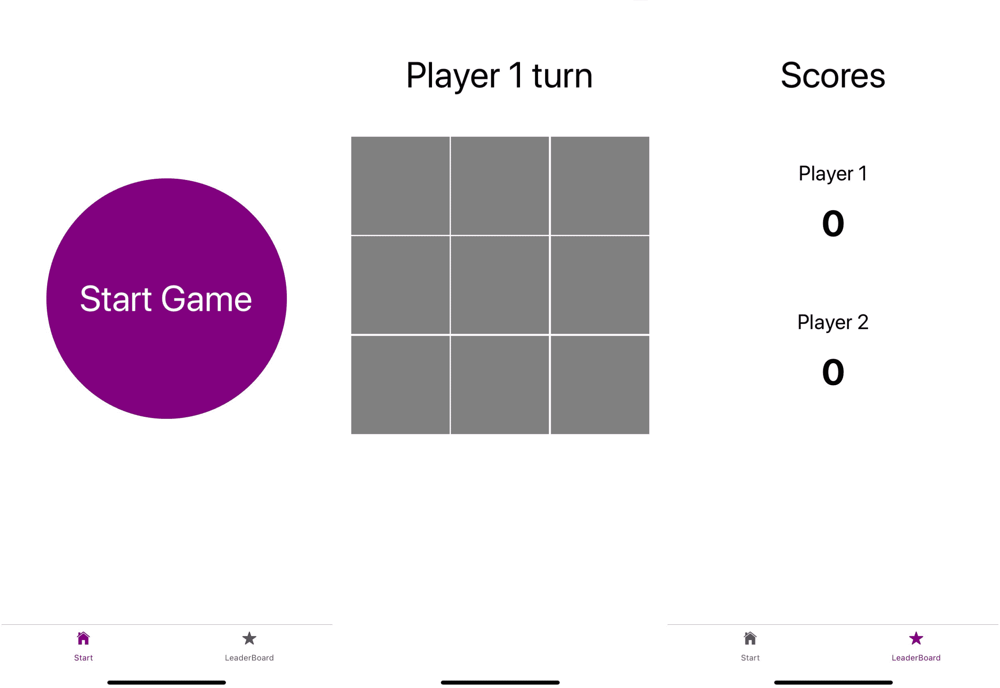
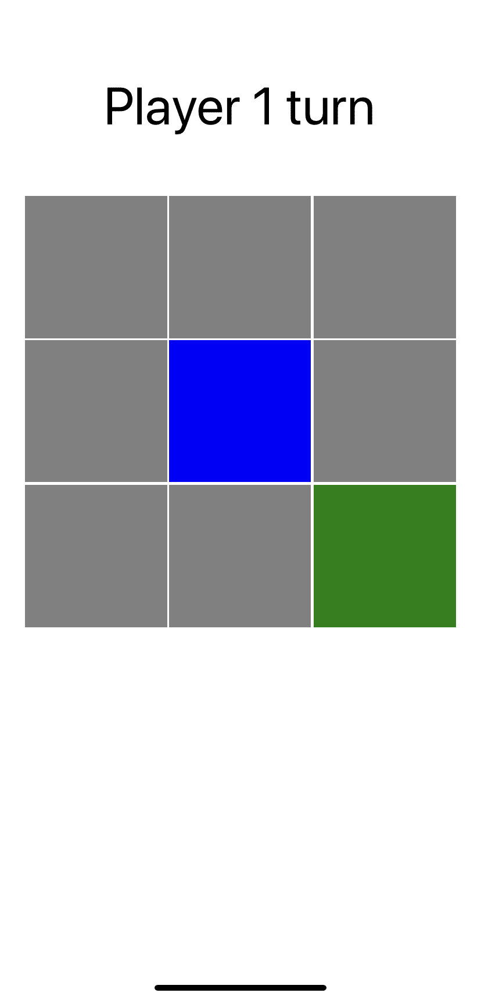

# 第九章：使用 React Native 和 Expo 构建动画游戏

在本书中创建的大多数项目都侧重于显示数据并使其可以在页面之间进行导航。在上一章中，您探索了创建 Web 和移动应用程序之间的一些差异。构建移动应用程序时的另一个区别是，用户期望动画和手势，因为它们使应用程序的使用变得简单和熟悉。这是本章的重点。

在本章中，您将使用 React Native 的 Animated API、一个名为 Lottie 的包以及 Expo 的`GestureHandler`为 React Native 应用程序添加动画和手势。它们共同使我们能够创建最充分利用移动交互方法的应用程序，这对于像*Tic-Tac-Toe*这样的游戏非常理想。此外，该应用程序将在游戏界面旁边显示此游戏的最高分排行榜。

创建这个游戏时，将涵盖以下主题：

+   使用 React Native Animated API

+   使用 Lottie 进行高级动画

+   使用 Expo 处理原生手势

# 项目概述

在本章中，我们将使用 React Native 和 Expo 创建一个带有基本动画的*Tic-Tac-Toe*游戏，使用 Animated API 添加基本动画，使用 Lottie 添加高级动画，并使用 Expo 的 Gesture Handler 处理原生手势。起点将是创建一个具有基本路由实现的 Expo CLI 应用程序，以便我们的用户可以在游戏界面和此游戏的最高分概述之间切换。

构建时间为 1.5 小时。

# 入门

我们将在本章中创建的项目是基于 GitHub 上的初始版本构建的：[`github.com/PacktPublishing/React-Projects/tree/ch9-initial`](https://github.com/PacktPublishing/React-Projects/tree/ch9-initial)。完整的源代码也可以在 GitHub 上找到：[`github.com/PacktPublishing/React-Projects/tree/ch10-initial`](https://github.com/PacktPublishing/React-Projects/tree/ch9)。

您需要在移动 iOS 或 Android 设备上安装 Expo Client 应用程序，以在物理设备上运行该项目。或者，您可以在计算机上安装 Xcode 或 Android Studio，以在虚拟设备上运行该应用程序：

+   **对于 iOS**：有关如何设置本地机器以运行 iOS 模拟器的信息，请在此处找到：[`docs.expo.io/versions/v36.0.0/workflow/ios-simulator/`](https://docs.expo.io/versions/v36.0.0/workflow/ios-simulator/)。

+   **对于 Android**：有关如何设置本地机器以从 Android Studio 运行模拟器的信息，请在此处找到：[`docs.expo.io/versions/v36.0.0/workflow/android-studio-emulator/`](https://docs.expo.io/versions/v36.0.0/workflow/android-studio-emulator/)。运行模拟器时存在已知问题，可以通过确保以下行存在于您的`~/.bash_profile`或`~/.bash_rc`文件中来预防：

```jsx
export ANDROID_SDK=**ANDROID_SDK_LOCATION** export PATH=**ANDROID_SDK_LOCATION**/platform-tools:$PATH export PATH=**ANDROID_SDK_LOCATION**/tools:$PATH
```

`ANDROID_SDK_LOCATION`的值是本地机器上 Android SDK 的路径，可以通过打开 Android Studio 并转到**首选项**|**外观和行为**|**系统设置**|**Android SDK**来找到。路径在声明 Android SDK 位置的框中列出，看起来像这样：`/Users/myuser/Library/Android/sdk`。

本应用程序是使用**Expo SDK 版本 33.0.0**创建的，因此，您需要确保您在本地机器上使用的 Expo 版本是相似的。由于 React Native 和 Expo 经常更新，请确保您使用此版本，以便本章描述的模式表现如预期般。如果您的应用程序无法启动或遇到错误，请参考 Expo 文档，了解有关更新 Expo SDK 的更多信息。

# 检查初始项目

在本章中，您将要处理的应用程序已经为您构建，但我们需要通过添加诸如动画和过渡之类的功能来完成它。下载或克隆项目后，您需要进入项目的根目录，在那里您可以运行以下命令来安装依赖项并启动应用程序：

```jsx
npm install && npm start
```

这将启动 Expo 并使您能够从终端或浏览器启动项目。在终端中，您可以使用 QR 码在移动设备上打开应用程序，或选择在模拟器中打开应用程序。

无论您是在虚拟设备还是物理设备上打开应用程序，在这一点上，应用程序应该看起来像这样：



该应用程序由三个屏幕组成：`Start`，`Game`和`LeaderBoard`。第一个屏幕是`Start`，在那里可以通过点击绿色按钮开始游戏。这将导致`Game`屏幕，该屏幕设置为模态。`Start`屏幕使用选项卡导航，您还可以访问`LeaderBoard`屏幕，该屏幕将显示玩家的分数。

此 React Native 应用程序的项目结构如下。此结构类似于本书中已创建的项目：

```jsx
tic-tac-toe
|-- .expo
|-- assets
    |-- icon.png
    |-- splash.png
    |-- winner.json
|-- Components
    |-- // ...
|-- context
    |-- AppContext.js
|-- node_modules
|-- Screens
    |-- Game.js
    |-- LeaderBoard.js
    |-- Start.js
|-- utils
    |-- arrayContainsArray.js
    |-- checkSlots.js
.gitignore
App.js
AppContainer.js
app.json
babel.config.js
package.json
```

在`assets`目录中，您将找到两个图像：一个将用作应用程序的图标，一旦您在移动设备上安装了该应用程序，它将显示在主屏幕上，另一个将用作启动应用程序时显示的启动画面。还在这里放置了一个 Lottie 动画文件，您将在本章后面使用。应用程序的配置，例如 App Store，放在`app.json`中，而`babel.config.js`保存特定的 Babel 配置。

`App.js`文件是您的应用程序的实际入口点，其中导入并返回`AppContainer.js`文件，该文件在`context/AppContext.js`文件中创建的上下文提供程序中。在`AppContainer`中，定义了此应用程序的所有路由，而`AppContext`将包含应该在整个应用程序中可用的信息。在`utils`目录中，您可以找到游戏的逻辑，即填充*Tic-Tac-Toe*棋盘的函数以及确定哪个玩家赢得了比赛。

此游戏的所有组件都位于`Screens`和`Components`目录中，前者包含由`Start`，`Game`和`LeaderBoard`路由呈现的组件。这些屏幕的子组件可以在`Components`目录中找到，该目录具有以下结构：

```jsx
|-- Components
    |-- Actions
        |-- Actions.js
    |-- Board
        |-- Board.js
    |-- Button
        |-- Button.js
    |-- Player
        |-- Player.js
    |-- Slot
        |-- Slot.js
        |-- Filled.js
```

在前面结构中最重要的组件是`Board`，`Slot`和`Filled`，因为它们构成了大部分游戏。`Board`由`Game`屏幕呈现，并包含一些游戏逻辑，而`Slot`和`Filled`是在此棋盘上呈现的组件。`Actions`组件返回两个`Button`组件，以便我们可以从`Game`屏幕导航离开或重新开始游戏。`Player`显示了轮到哪个玩家或赢得比赛的玩家的名称。

# 使用 React Native 和 Expo 创建动画的井字棋游戏应用程序

手机游戏通常具有引人注目的动画，使用户想要继续玩游戏并使游戏更具互动性。已经运行的 *Tic-Tac-Toe* 游戏到目前为止没有使用任何动画，只是使用了内置的一些过渡效果，这些过渡效果是使用 React Navigation 构建的。在本节中，您将向应用程序添加动画和手势，这将改善游戏界面，并使用户在玩游戏时感到更舒适。

# 使用 React Native Animated API

在 React Native 中使用动画的多种方法之一是使用 Animated API，该 API 可在 React Native 的核心中找到。使用 Animated API，您可以默认为 `react-native` 中的 `View`、`Text`、`Image` 和 `ScrollView` 组件创建动画。或者，您可以使用 `createAnimatedComponent` 方法创建自己的组件。

# 创建基本动画

您可以添加的最简单的动画之一是通过更改元素的不透明度来使元素淡入或淡出。在您之前创建的 *Tic-Tac-Toe* 游戏中，插槽填充了绿色或蓝色，具体取决于哪个玩家填充了该插槽。由于您使用 `TouchableOpacity` 元素创建插槽，这些颜色已经显示了一个小的过渡效果。但是，可以通过使用 Animated API 为其添加自定义过渡效果。要添加动画，必须更改以下代码块：

1.  首先，在 `src/Components/Slot` 目录中创建一个新文件，并将其命名为 `Filled.js`。该文件将包含以下代码，用于构建 `Filled` 组件。在此文件中，添加以下代码：

```jsx
import  React  from  'react'; import { View } from 'react-native'; const  Filled  = ({ filled }) => { return ( <View style={{ position:  'absolute',
            display: filled ? 'block' : 'none', width:  '100%',
  height:  '100%', backgroundColor: filled === 1 ? 'blue' : 'green',  }}
    />
 ); } export  default  Filled; 
```

该组件显示一个 `View` 元素，并使用使用 JSS 语法的样式对象进行样式设置，这是 React Native 的默认语法。由于其位置是绝对的，宽度和高度均为 100%，因此该元素可以用于填充另一个元素。它还接受 `filled` 属性，以便我们可以设置 `backgroundColor` 并确定组件是否显示。

1.  您可以将此组件导入到 `Slot` 组件中，并在任何玩家填充插槽后显示它。而不是为 `SlotWrapper` 组件设置背景颜色，您可以将属于玩家一或玩家二的颜色传递给 `Filled` 组件：

```jsx
import  React  from  'react'; import { TouchableOpacity, Dimensions } from  'react-native'; import  styled  from  'styled-components/native'; + import  Filled  from  './Filled'**;** const  SlotWrapper  =  styled(TouchableOpacity)` width: ${Dimensions.get('window').width * 0.3}; height: ${Dimensions.get('window').width * 0.3}; -   background-color: ${({ filled }) => filled ? (filled === 1 ? 'blue' : 'green') : 'grey'}; + **background-color: grey;**
 border: 1px solid #fff;
`;  const Slot = ({ index, filled, handleOnPress }) => ( - <SlotWrapper filled={filled} onPress={() => !filled && handleOnPress(index)} />
+ <SlotWrapper  onPress={() => !filled && handleOnPress(index)}> + <Filled filled={filled}  />  + </SlotWrapper**>** );  export  default  Slot;
```

1.  现在，每当您单击插槽时，由于您需要先将可点击元素从`TouchableOpacity`元素更改为`TouchableWithoutFeedback`元素，因此不会发生任何可见变化。这样，默认的带不透明度的过渡就会消失，因此您可以用自己的过渡替换它。可以从`react-native`导入`TouchableWithoutFeedback`元素，并将其放置在一个`View`元素周围，该元素将保存插槽的默认样式：

```jsx
import  React  from  'react'; - import { TouchableOpacity, Dimensions } from  'react-native'; + import { TouchableWithoutFeedback, View, Dimensions } from  'react-native'; import  styled  from  'styled-components/native'; import  Filled  from  './Filled'; - const  SlotWrapper  =  styled(TouchableOpacity)` + const  SlotWrapper  =  styled(View)`  width: ${Dimensions.get('window').width * 0.3}; height: ${Dimensions.get('window').width * 0.3};  background-color: grey;
 border: 1px solid #fff;
`;   const Slot = ({ index, filled, handleOnPress }) => ( - <SlotWrapper  onPress={() => !filled && handleOnPress(index)}> + <TouchableWithoutFeedback onPress={() => !filled && handleOnPress(index)}>  +   <SlotWrapper**>**
  <Filled filled={filled} />  </SlotWrapper>
**+ <TouchableWithoutFeedback>** );  export  default  Slot;
```

现在，您刚刚按下的插槽将立即填充为您在`Filled`组件的`backgroundColor`字段中指定的颜色，而无需任何过渡。

1.  要重新创建此过渡，可以使用 Animated API，您将使用它来从插槽渲染时更改`Filled`组件的不透明度。因此，您需要在`src/Components/Slot/Filled.js`中从`react-native`导入`Animated`：

```jsx
import  React  from  'react';
**- import { View } from 'react-native';** **+ import { Animated, View } from 'react-native';** const  Filled  = ({ filled }) => { return (
    ... 
```

1.  使用 Animated API 的新实例是通过指定应在使用 Animated API 创建的动画期间更改的值来开始的。此值应该可以由整个组件的 Animated API 更改，因此您可以将此值添加到组件的顶部。由于您希望稍后可以更改此值，因此应使用`useState` Hook 创建此值：

```jsx
import  React  from  'react'; import { Animated, View } from 'react-native'; const  Filled  = ({ filled }) => {
**+ const [opacityValue] = React.useState(new Animated.Value(0));** return (
    ...
```

1.  现在，可以使用内置的三种动画类型之一（即`decay`、`spring`和`timing`）通过 Animated API 更改此值，其中您将使用 Animated API 的`timing`方法在指定的时间范围内更改动画值。可以从任何函数触发 Animated API，例如与`onPress`事件链接或从生命周期方法触发。由于`Filled`组件应仅在插槽填充时显示，因此可以使用在`filled`属性组件更改时触发的生命周期方法，即具有`filled`属性作为依赖项的`useEffect` Hook。可以删除显示的样式规则，因为当`filled`属性为`false`时，组件的`opacity`将为`0`：

```jsx
import  React  from  'react'; import { Animated, View } from 'react-native'; const  Filled  = ({ filled }) => {
  const [opacityValue] = React.useState(new Animated.Value(0)); **+** **R**eact.useEffect(() => {
+    filled && Animated.timing(
+        opacityValue, 
+ {
+ toValue:  1,
+ duration:  500, +        }
+ ).start();
+ **}, [filled]);** return ( <View style={{ position:  'absolute',
 **-          display: filled ? 'block' : 'none',** width:  '100%',
  height:  '100%', backgroundColor: filled === 1 ? 'blue' : 'green',  }}
    />
 ); } export  default  Filled;
```

`timing`方法使用您在组件顶部指定的`opacityValue`和包含 Animated API 配置的对象。其中一个字段是`toValue`，当动画结束时，它将成为`opacityValue`的值。另一个字段是字段的持续时间，它指定动画应持续多长时间。

`timing`旁边的其他内置动画类型是`decay`和`spring`。`timing`方法随着时间逐渐改变，`decay`类型的动画在开始时变化很快，然后逐渐减慢直到动画结束。使用`spring`，您可以创建动画，使其在动画结束时稍微超出其边缘。

1.  最后，您只需要将`View`元素更改为`Animated.View`元素，并将`opacity`字段和`opacityValue`值添加到`style`对象中：

```jsx
import  React  from  'react';
**- import { Animated, View } from 'react-native';** + import { Animated } from 'react-native';  const  Filled  = ({ filled }) => {

... return (    
**-** **<View**
**+   <Animated.View** style={{ position:  'absolute', width:  '100%',
  height:  '100%', backgroundColor: filled === 1 ? 'blue : 'green',
**+           opacity: opacityValue,**  }}
    />
 ); } export  default  Filled;
```

现在，当您按下任何一个插槽时，`Filled`组件将淡入，因为不透明度值在 500 毫秒内过渡。当您在 iOS 模拟器或运行 iOS 的设备上运行应用程序时，这将使填充的插槽看起来如下。在 Android 上，应用程序应该看起来类似，因为没有添加特定于平台的样式：



为了使动画看起来更加流畅，您还可以向`Animated`对象添加一个`easing`字段。这个字段的值来自`Easing`模块，可以从`react-native`中导入。`Easing`模块有三个标准函数：`linear`，`quad`和`cubic`。在这里，`linear`函数可以用于更平滑的时间动画：

```jsx
import  React  from  'react'; **- import { Animated } from 'react-native';**
**+ import { Animated, Easing } from 'react-native';** const  Filled  = ({ filled }) => {
  const [opacityValue] = React.useState(new Animated.Value(0));  React.useEffect(() => {
    filled && Animated.timing(
        opacityValue, { toValue:  1, duration: 1000, **+           easing: Easing.linear(),**
        } ).start(); }, [filled]);

  return (
    ...
```

通过最后这个改变，动画已经完成，游戏界面已经感觉更加流畅，因为插槽正在使用您自己的自定义动画进行填充。在本节的下一部分中，我们将结合其中一些动画，使这个游戏的用户体验更加先进。

# 使用 Animated API 结合动画

通过改变`Filled`组件的不透明度来进行过渡已经改善了游戏界面。但是我们可以创建更多的动画来使游戏的交互更具吸引力。

我们可以做的一件事是为`Filled`组件的大小添加淡入动画。为了使这个动画与我们刚刚创建的淡入动画配合得很好，我们可以使用 Animated API 中的`parallel`方法。这个方法将在同一时刻开始指定的动画。为了创建这种效果，我们需要做出以下改变：

1.  对于这第二个动画，您希望`Filled`组件不仅具有淡入的颜色，还具有淡入的大小。为了为不透明度设置初始值，您必须为该组件的大小设置初始值：

```jsx
import  React  from  'react'; import { Animated, Easing } from 'react-native'; const  Filled  = ({ filled }) => {
  const [opacityValue] = React.useState(new Animated.Value(0));
**+ const [scaleValue] = React.useState(new Animated.Value(0));**  React.useEffect(() => {
    ...
```

1.  您在`useEffect` Hook 中创建的`Animated.timing`方法需要包装在`Animated.parallel`函数中。这样，您可以在以后添加另一个改变`Filled`组件大小的动画。`Animated.parallel`函数将`Animated`方法的数组作为参数添加，必须像这样添加：

```jsx
import  React  from  'react'; import { Animated, Easing } from  'react-native'; const  Filled  = ({ filled }) => { const [opacityValue]  = React.useState(new  Animated.Value(0)); const [scaleValue]  = React.useState(new  Animated.Value(0));  React.useEffect(() => {
**+ filled &&** Animated.parallel**([
- filled && Animated.timing(**
**+** Animated.timing**(** opacityValue, { toValue:  1, duration:  1000, easing:  Easing.linear(),
 } **-   ).start();
+  ),**
**+** ]).start**();** }, [filled]); return (
 ... 
```

除了`parallel`函数之外，还有三个函数可以帮助您进行动画组合。这些函数是`delay`、`sequence`和`stagger`，它们也可以结合使用。`delay`函数在预定义的延迟之后开始任何动画，`sequence`函数按照您指定的顺序开始动画，并在动画解决之前等待，然后开始另一个动画，`stagger`函数可以按顺序和指定的延迟同时开始动画。

1.  在`parallel`函数中，您需要添加 Animated API 的`spring`方法，该方法可以动画化`Filled`组件的大小。这次，您不会使用`timing`方法，而是使用`spring`方法，它会在动画结束时添加一点弹跳效果。还添加了一个`Easing`函数，使动画看起来更加流畅。

```jsx
...
const  Filled  = ({ filled }) => { const [opacityValue]  = React.useState(new  Animated.Value(0)); const [scaleValue]  = React.useState(new  Animated.Value(0)); React.useEffect(() => {
      filled && Animated.parallel([ Animated.timing( opacityValue, { toValue:  1, duration:  1000, easing:  Easing.linear(),
 } ),
**+       Animated.spring(**
**+         scaleValue,**
**+         {**
**+           toValue: 1,**
**+           easing: Easing.cubic(),**
**+         },**
**+       ),** ]).start(); }, [filled]); return (
        ...
```

1.  这个`spring`动画将会把`scaleValue`的值从`0`改变到`1`，并在动画结束时创建一个小的弹跳效果。`scaleValue`也必须添加到`style`对象中的`Animated.View`组件中，以使动画生效。`scaleValue`将被添加到`transform`字段中的`scale`字段中，这将改变`Filled`组件的大小：

```jsx
... return (    <Animated.View style={{ position:  'absolute', width:  '100%',
  height:  '100%', backgroundColor: filled === 1 ? 'blue' : 'green',            opacity: opacityValue,
**+           transform: [**
**+             {**
**+               scale: scaleValue,**
**+             }**
**+           ],**  }}
    />
 ); } export  default  Filled
```

当您点击任何一个插槽时，`Filled`组件不仅通过改变不透明度而淡入，还会通过改变大小来淡入。动画结束时的弹跳效果为淡入效果增添了一丝美感。

1.  然而，当您点击描绘游戏获胜者的插槽时，动画没有足够的时间结束，而获胜状态由组件渲染。因此，您还需要在设置游戏获胜者的函数中添加一个超时。这个函数可以在`src/Screens/Game.js`中找到，您可以添加一个常量来设置动画持续的毫秒数：

```jsx
import  React  from 'react'; import { View } from  'react-native'; import  styled  from  'styled-components/native'; import  Board  from  '../Components/Board/Board'; import  Actions  from  '../Components/Actions/Actions'; import  Player  from  '../Components/Player/Player'; import  checkSlots  from  '../utils/checkSlots'; import { AppContext } from  '../context/AppContext'; + export  const  ANIMATION_DURATION  =  1000**;**

...
```

这也将包装设置获胜者的函数在一个`setTimeout`函数中，这会延迟这些函数的执行时间，延迟时间与动画持续时间相同：

```jsx
...
const  checkWinner  = (player) => { const  slots  =  state[`player${player}`]; if (slots.length  >=  3) { if (checkSlots(slots)) { + setTimeout(() => { setWinner(player);
 setPlayerWins(player); +     }, ANIMATION_DURATION**);**
 } } return  false;
}

...
```

1.  由于`ANIMATION_DURATION`常量被导出，您可以在`src/Components/Slot/Filled.js`文件中导入这个常量，并在实际动画中使用相同的常量。这样，如果您在某个时候更改了动画的持续时间，您不必对其他组件进行任何更改，这些更改就会可见：

```jsx
import  React  from  'react'; import { Animated, Easing } from  'react-native'; + import { ANIMATION_DURATION } from  '../../Screens/Game';  const  Filled  = ({ filled }) => { const [opacityValue]  = React.useState(new  Animated.Value(0)); const [scaleValue]  = React.useState(new  Animated.Value(0)); React.useEffect(() => {
      filled && Animated.parallel( Animated.timing( opacityValue, { toValue:  1,
**-** duration:  1000**,**
**+           duration: ANIMATION_DURATION,** easing:  Easing.linear(),
 }
```

除了插槽现在填充了一个执行两个并行动画的动画`Filled`组件之外，当您点击其中任何一个时，设置游戏获胜者的函数将等到插槽填充后再触发。

下一节将展示如何处理更高级的动画，比如在任何两个玩家中有一个获胜时显示动画图形。为此，我们将使用 Lottie 包，因为它支持的功能比内置的 Animated API 更多。

# 使用 Lottie 进行高级动画

React Native 动画 API 非常适合构建简单的动画，但构建更高级的动画可能更难。幸运的是，Lottie 通过在 iOS、Android 和 React Native 中实时渲染 After Effects 动画，为我们提供了在 React Native 中创建高级动画的解决方案。Lottie 可以作为一个独立的包使用`npm`安装，但也可以从 Expo 获取。由于 Lottie 仍然是 Expo 的实验性功能的一部分，您可以通过从`DangerZone`命名空间中检索它来使用它。因此，目前最好是从`npm`安装 Lottie，并在要使用它的文件中导入它。

在使用 Lottie 时，您不必自己创建这些 After Effects 动画；有一个完整的资源库，您可以在项目中自定义和使用。这个库叫做`LottieFiles`，可以在`https://lottiefiles.com/`上找到。

由于您已经将动画添加到了棋盘游戏的插槽中，一个很好的地方来添加更高级的动画将是在任何一名玩家赢得比赛时显示的屏幕上。在这个屏幕上，可以显示一个奖杯，而不是棋盘，因为游戏已经结束了。现在让我们来做这个：

1.  要开始使用 Lottie，请运行以下命令，这将安装 Lottie 及其依赖项，并将其添加到您的`package.json`文件中：

```jsx
npm install lottie-react-native
```

1.  安装过程完成后，你可以继续创建一个组件，用来渲染已下载为 Lottie 文件的 After Effects 动画。这个组件可以在新的`src/Components/Winner/Winner.js`文件中创建。在这个文件中，你需要导入 React 和当然是从`lottie-react-native`中导入的 Lottie，这是你刚刚安装的：

```jsx
import React from 'react';
import Lottie from 'lottie-react-native';

const Winner = () => ();

export default Winner;
```

1.  导入的`Lottie`组件可以渲染你自己创建的或者从`LottieFiles`库下载的任何 Lottie 文件。在`assets`目录中，你会找到一个可以在这个项目中使用的 Lottie 文件，名为`winner.json`。当你将它添加到源中时，`Lottie`组件可以渲染这个文件，并且可以通过传递一个样式对象来设置动画的宽度和高度。此外，你应该添加`autoPlay`属性来在组件渲染时启动动画：

```jsx
import React from 'react';
import Lottie from 'lottie-react-native';

const Winner = () => (
+    <Lottie
+        autoPlay
+        style={{
+            width: '100%',
+            height: '100%',
+        }}
+        source={require('../../assets/winner.json')}
+    />
);

export default Winner;
```

1.  该组件现在将开始在包含此组件的任何屏幕中渲染奖杯动画。由于这个动画应该在任一玩家赢得比赛时显示出来，所以`Board`组件是一个很好的地方来添加这个组件，因为你可以使用包装样式来包裹棋盘。`Board`组件可以在`src/Components/Board/Board.js`文件中找到，你可以在这里导入`Winner`组件：

```jsx
import  React  from 'react'; import { View, Dimensions } from  'react-native'; import  styled  from  'styled-components/native'; import  Slot  from  '../Slot/Slot'; + import  Winner  from  '../Winner/Winner'**;**

... const  Board  = ({ slots, winner, setSlot }) => (
    ... 
```

在这个组件的`return`函数中，你可以检查`winner`属性是`true`还是`false`，并根据结果显示`Winner`组件或者遍历`slots`：

```jsx
const Board = ({ slots, winner, setSlot }) => (
 <BoardWrapper>
    <SlotsWrapper>
-    {slots.map((slot, index) =>
+    {
+      winner
+      ? <Winner />
+      : slots.map((slot, index) =>
            <Slot
              key={index}
              index={index}
              handleOnPress={!winner ? setSlot : () => { }}
              filled={slot.filled}
            />
        )
    }
    </SlotsWrapper>
  </BoardWrapper>
);
```

当`Board`组件接收到值为`true`的`winner`属性时，用户将看到渲染的奖杯动画，而不是棋盘。当你在 iOS 模拟器上或者 iOS 设备上运行应用程序时，可以看到这将是什么样子的例子：

![

如果你觉得这个动画的速度太快，可以通过将 Animated API 与 Lottie 结合来进行调整。`Lottie`组件可以接受一个`progress`属性，用来确定动画的速度。通过传递由 Animated API 创建的值，你可以调整动画的速度以满足自己的需求。将这个添加到 Lottie 动画中可以这样做：

1.  首先，你需要导入`Animated`和`Easing`（稍后会用到），并在组件顶部使用`Animated`和`useState` Hook 创建一个新值：

```jsx
import  React  from  'react'; + import { Animated, Easing } from  'react-native'; import  Lottie  from  'lottie-react-native'; - const  Winner  = () => ( + const Winner = () => {
+   const [progressValue]  = React.useState(new  Animated.Value(0**));**
**+   return (** <Lottie autoPlay
        style={{ width:  '100%', height:  '100%' , }} source={  require('../../assets/winner.json') } progress={progressValue} />
  );
+ };

export  default  Winner;
```

1.  在`useEffect` Hook 中，您可以创建`Animated.timing`方法，它将在您使用`duration`字段指定的时间范围内设置`progressValue`。动画应该在组件渲染时立即开始，因此 Hook 的依赖数组应为空。您还可以将`Easing.linear`函数添加到`easing`字段中，以使动画运行更顺畅：

```jsx
...
const  Winner  = () => { const [progressValue]  = React.useState(new  Animated.Value(0));

**+** React.useEffect(() => { +    Animated.timing(progressValue, { +      toValue:  1, +      duration:  4000, +      easing:  Easing.linear,
+ }).start(); **+ }, []);** return (
  ... 
```

1.  现在，`progressValue`值可以传递给`Lottie`组件，这将导致动画的不同行为：

```jsx
...

const Winner = () => {
 const [progressValue]  = React.useState(new  Animated.Value(0));

  ...

  return ( <Lottie autoPlay
      style={{ width:  '100%', height:  '100%' , }} source={  require('../../assets/winner.json') }
**+** progress={progressValue**}** />
  );
};

export  default  Winner;
```

现在，动画正在减速。动画将花费 4,000 毫秒而不是默认的 3,000 毫秒来从头到尾播放。在下一节中，您将通过处理移动设备上可用的手势，为该应用程序的用户体验增加更多复杂性。

# 使用 Expo 处理手势

手势是移动应用程序的重要特性，因为它们将决定平庸和优秀移动应用程序之间的差异。在您创建的*Tic-Tac-Toe*游戏中，可以添加几种手势以使游戏更具吸引力。

以前，您使用了`TouchableOpacity`元素，用户按下该元素后会通过更改元素来获得反馈。您还可以使用`TouchableHighlight`元素来实现这一点。与`TouchableOpacity`一样，它可以被用户按下，但是它会突出显示元素，而不是改变不透明度。这些反馈或突出显示手势让用户对在应用程序中做出决定时会发生什么有所印象，从而提高用户体验。这些手势也可以自定义并添加到其他元素中，使得可以创建自定义的可触摸元素。

为此，您可以使用一个名为`react-native-gesture-handler`的软件包，它可以帮助您在每个平台上访问原生手势。所有这些手势都将在原生线程中运行，这意味着您可以添加复杂的手势逻辑，而无需处理 React Native 手势响应系统的性能限制。它支持的一些手势包括轻触、旋转、拖动和平移手势。使用 Expo CLI 创建的任何项目都可以在不必手动安装软件包的情况下使用`react-native-gesture-handler`中的`GestureHandler`。

您还可以直接从 React Native 中使用手势，而无需使用额外的包。然而，React Native 目前使用的手势响应系统并不在原生线程中运行。这不仅限制了创建和自定义手势的可能性，还可能遇到跨平台或性能问题。因此，建议您使用`react-native-gesture-handler`包，但在 React Native 中使用手势并不需要这个包。

# 处理轻击手势

我们将实现的第一个手势是轻击手势，它将被添加到`Slot`组件中，以便为用户的操作提供更多反馈。用户轻击时不会填充插槽，而是在轻击事件开始时就会收到一些反馈，并在事件完成时收到反馈。在这里，我们将使用`react-native-gesture-handler`中的`TouchableWithoutFeedback`元素，它在原生线程中运行，而不是使用手势响应系统的`react-native`中的`TouchableWithoutFeedback`元素。可以通过以下步骤将`react-native`组件替换为`react-native-gesture-handler`中的组件：

1.  `TouchableWithoutFeedback`可以从`react-native-gesture-handler`中导入到`src/components/Slot.js`文件的顶部：

```jsx
import  React  from  'react'; - import { TouchableWithoutFeedback, View, Dimensions } from  'react-native';
+ import {  View, Dimensions } from  'react-native';  + import **{ Tou**chableWithoutFeedback } from  'react-native-gesture-handler'; import  styled  from  'styled-components/native'; import  Filled  from  './Filled';

... const  Slot  = ({ index, filled, handleOnPress }) => ( ...
```

您不必在返回函数中做任何更改，因为`TouchableWithoutFeedback`使用与`react-native`相同的 props。当您轻击插槽时，什么都不会改变。这是因为插槽将由`Filled`组件填充，一旦出现就会显示动画。

1.  当您轻击任何插槽并将手指放在上面时，`handleOnPress`函数还不会被调用。只有当您通过移开手指完成轻击手势时，手势才会结束，并且`handleOnPress`函数将被调用。当您触摸插槽开始轻击手势时，可以使用`TouchableWithoutFeedback`中的`onPressIn`回调来启动动画。一旦轻击事件开始，就需要向`Filled`组件传递一个值，该值指示它应该开始动画。这个值可以使用`useState` Hook 创建，因此您已经有一个可以调用以更改此值的函数。当通过从元素上移开手指结束轻击事件时，应调用`handleOnPress`函数。您可以使用`onPressOut`回调来实现这一点：

```jsx
import  React  from  'react'; import { View, Dimensions } from  'react-native'; import { TapGestureHandler, State } from  'react-native-gesture-handler';  import  styled  from  'styled-components/native'; import  Filled  from  './Filled';

... - const  Slot  = ({ index, filled, handleOnPress }) => ( + const  Slot  = ({ index, filled, handleOnPress }) => {  +  const [start, setStart] = React.useState(false);

+  return ( -    <TouchableWithoutFeedback onPress={() => !filled && handleOnPress(index)}> +    <TouchableWithoutFeedback onPressIn={() => setStart()} onPressOut={() => !filled && handleOnPress(index)}>
 <SlotWrapper> - <Filled filled={filled}  /> + <Filled filled={filled} start={start}  />  </SlotWrapper>
 </TouchableWithoutFeedback>  );
};

export default Slot;
```

1.  在`src/Components/Slot/Filled.js`文件中的`Filled`组件中，您需要检查`start`属性，并在此属性的值为`true`时开始动画。由于您不希望在`start`的值为`true`时启动整个动画，只有改变`opacityValue`的动画会开始：

```jsx
import  React  from  'react'; import { Animated, Easing } from  'react-native'; import { ANIMATION_DURATION } from  '../../utils/constants'; - const  Filled  = ({ filled }) => { + const  Filled  = ({ filled, start }) => **{**  const [opacityValue] =  React.useState(new  Animated.Value(0));
**-** const [scaleValue] =  React.useState(new  Animated.Value(0)); + const [scaleValue] =  React.useState(new  Animated.Value(.8**));** + React.useEffect(() => { + start  &&  Animated.timing( + opacityValue, +     { + toValue:  1, + duration:  ANIMATION_DURATION, + easing:  Easing.linear(),
+     } +   ).start(); + }, [start**]);**

  React.useEffect(() => {    ...
```

1.  此外，可以从检查`filled`属性的`useEffect` Hook 中删除改变不透明度的动画。此`useEffect` Hook 仅处理改变比例的动画。应该更改初始的`scaleValue`，否则组件的大小将等于`0`：

```jsx
+ const  Filled  = ({ filled, start }) => **{**  const [opacityValue] =  React.useState(new  Animated.Value(0));
**-** const [scaleValue] =  React.useState(new  Animated.Value(0)); + const [scaleValue] =  React.useState(new  Animated.Value(.8**));** React.useEffect(() => {

... React.useEffect(() => { - filled && Animated.parallel([ -   Animated.timing( -     opacityValue, -     { - toValue:  1, - duration:  ANIMATION_DURATION, - easing:  Easing.linear(),
- } -   ),
-   Animated.spring(
+   filled && Animated.spring**(** scaleValue,
      {
  toValue:  1,
  easing:  Easing.cubic(),
      }
**-    )**
**-  ]).start()**
**+**  ).start();  }, [filled]);

...
```

当您在进行这些更改后轻击任何插槽时，将启动`timing`动画，并且一个正方形将出现在插槽中，这表示正在轻击插槽。一旦您从该插槽释放手指，正方形将改变大小，并且在`spring`动画开始时填充插槽的其余部分，这发生在`onPress`函数改变`filled`的值时。

# 自定义轻击手势

现在，插槽具有不同的动画，取决于轻击事件的状态，这可能对用户在选择哪个插槽时犹豫不决很有用。用户可能会从所选插槽上移开手指，此时轻击事件将遵循不同的状态流。您甚至可以确定用户是否应该长时间点击插槽以使选择变得明确，或者像在某些社交媒体应用程序上喜欢图片一样双击插槽。

要创建更复杂的轻击手势，您需要知道轻击事件经历不同的状态。`TouchableWithoutFeedback`在底层使用`TapGestureHandler`，并且可以经历以下状态：`UNDETERMINED`，`FAILED`，`BEGAN`，`CANCELLED`，`ACTIVE`和`END`。这些状态的命名非常直观，通常情况下，处理程序将具有以下流程：`UNDETERMINED > BEGAN > ACTIVE > END > UNDETERMINED`。当您在`TouchableWithoutFeedback`元素的`onPressIn`回调中添加函数时，此函数在轻击事件处于`BEGAN`状态时被调用。当状态为`END`时，将调用`onPressOut`回调，而默认的`onPress`回调则响应于`ACTIVE`状态。

要创建这些复杂的手势，您可以使用`react-native-gesture-handler`包，通过自己处理事件状态，而不是使用可触摸元素的声明方式：

1.  `TapGestureHandler`可以从`react-native-gesture-handler`中导入，并允许您创建自定义的可触摸元素，您可以自己定义手势。您需要从`react-native-gesture-handler`中导入`State`对象，其中包含您需要用来检查轻触事件状态的常量：

```jsx
import  React  from  'react'; - import { TouchableWithoutFeedback } from  'react-native-gesture-handler'; + import { TapGestureHandler, State } from  'react-native-gesture-handler';import  styled  from  'styled-components/native'; import  Filled  from  './Filled';

... const  Slot  = ({ index, filled, handleOnPress }) => (   ...
```

1.  不要像`onPress`那样使用事件处理程序，`TouchableWithoutFeedback`元素有一个名为`onHandlerStateChange`的回调。每当`TapGestureHandler`的状态发生变化时，例如当元素被点击时，都会调用这个函数。通过使用`TapGestureHandler`来创建可触摸元素，您就不再需要`TouchableWithoutFeedback`元素。这个元素的功能可以移动到您将要创建的新元素中：

```jsx
... const  Slot  = ({ index, filled, handleOnPress }) => {
...

return ( - <TouchableWithoutFeedback onPressIn={() => setStart()} onPressOut={() => !filled && handleOnPress(index)}>  + <TapGestureHandler onHandlerStateChange={onTap}**>**
  <SlotWrapper>
  <Filled filled={filled} start={start}  />  </SlotWrapper> - </TouchableWithoutFeedback>
+ </TapGestureHandler**>**
 );
}; ...
```

1.  `onHandlerStateChange`接受`onTap`函数，您仍然需要创建，并检查轻触事件的当前状态。当轻触事件处于`BEGAN`状态时，类似于`onPressIn`处理程序，应该开始`Filled`的动画。轻触事件的完成状态为`END`，类似于`onPressOut`处理程序，在这里您将调用`handleOnPress`函数，该函数会更改有关点击插槽的玩家的属性值。将调用`setStart`函数来重置启动动画的状态。

```jsx
import  React  from  'react'; import { View, Dimensions } from  'react-native'; import { TapGestureHandler, State } from  'react-native-gesture-handler';  import  styled  from  'styled-components/native'; import  Filled  from  './Filled';

... const  Slot  = ({ index, filled, handleOnPress }) => {
    const [start, setStart] = React.useState(false);   + const  onTap  = event => { +    if (event.nativeEvent.state === State.BEGAN) {
+       setStart(true);
+    }  + if (event.nativeEvent.state  ===  State.END) {  +       !filled && handleOnPress(index);
+       setStart(false);
+    }
+ }

  return (
    ...
```

当您点击任何一个插槽并将手指放在上面时，`handleOnPress`函数不会被调用。只有当您完成轻触手势并移开手指时，手势才会结束，并调用`handleOnPress`函数。

这些手势甚至可以进行更多的自定义，因为您可以使用组合来拥有多个相互响应的轻触事件。通过创建所谓的**跨处理程序交互**，您可以创建一个支持双击手势和长按手势的可触摸元素。通过设置并传递使用 React `useRef` Hook 创建的引用，您可以让来自`react-native-gesture-handler`的手势处理程序监听其他处理程序的状态生命周期。这样，您可以按顺序响应事件和手势，比如双击事件：

1.  要创建引用，您需要将`useRef` Hook 放在组件顶部，并将此引用传递给`TapGestureHandler`：

```jsx
import  React  from  'react'; import { View, Dimensions } from  'react-native'; import { TapGestureHandler, State } from  'react-native-gesture-handler'; import  styled  from  'styled-components/native'; import  Filled  from  './Filled';

... const  Slot  = ({ index, filled, handleOnPress }) => { const [start, setStart] =  React.useState(false); +  const  doubleTapRef  =  React.useRef(null);

   ...  return ( -    <TapGestureHandler onHandlerStateChange={onTap}> + <TapGestureHandler + ref={doubleTapRef} + onHandlerStateChange={onTap} **+    >**
  <SlotWrapper>
  <Filled  filled={filled}  start={start}  />
  </SlotWrapper>
  </TapGestureHandler>
 ); }; export default Slot;
```

1.  现在，您需要设置开始和完成轻击手势所需的轻击次数。由于第一次轻击元素时，不必对`onTap`函数进行任何更改，轻击事件的状态将为`BEGAN`。只有在您连续两次轻击元素后，轻击事件状态才会变为`END`：

```jsx
... return (
 <TapGestureHandler
 ref={doubleTapRef}
 onHandlerStateChange={onTap}
**+   numberOfTaps={2}**
 >  <SlotWrapper>
  <Filled  filled={filled}  start={start}  />
  </SlotWrapper>
  </TapGestureHandler> );  ...
```

1.  要填充一个插槽，用户必须轻击`TapGestureHandler`两次才能完成轻击事件。但是，您还可以在轻击一次`TapGestureHandler`时调用一个函数，方法是添加另一个以现有的一个为其子元素的`TapGestureHandler`。这个新的`TapGestureHandler`应该等待另一个处理程序进行双击手势，它可以使用`doubleTapRef`来检查。`onTap`函数应该重命名为`onDoubleTap`，这样您就有了一个新的`onTap`函数来处理单击：

```jsx
...

const  Slot  = ({ index, filled, handleOnPress }) => {  const [start, setStart] =  React.useState(false);
  const  doubleTapRef  =  React.useRef(null); + const  onTap  =  event  => {**};** - const  onTap  =  event  => { + const  onDoubleTap  =  event  => **{** ... }  return ( + <TapGestureHandler + onHandlerStateChange={onTap} + waitFor={doubleTapRef} + **>**
  <TapGestureHandler
  ref={doubleTapRef} - onHandlerStateChange={onTap} + onHandlerStateChange={onDoubleTap**}**
  numberOfTaps={2}
  > 
 <SlotWrapper>
           <Filled  filled={filled}  start={start}  /> </SlotWrapper>
      </TapGestureHandler>
**+** </TapGestureHandler> ); }

...
```

1.  当您仅单击插槽时，动画将开始，因为`TapGestureHandler`将处于`BEGAN`状态。双击手势上的动画应该只在状态为`ACTIVE`而不是`BEGAN`时开始，这样动画就不会在单击时开始。此外，通过向轻击手势结束时调用的函数添加`setTimeout`，动画看起来会更加流畅，因为否则两个动画会在彼此之后太快地发生：

```jsx
...

const  Slot  = ({ index, filled, handleOnPress }) => {  const [start, setStart] =  React.useState(false);
  const  doubleTapRef  =  React.useRef(null);

  const  onTap  =  event  => {};   const  onDoubleTap  =  event  => { - if (event.nativeEvent.state  ===  State.BEGAN) { +    if (event.nativeEvent.state  ===  State.ACTIVE) {        setStart(true);
 }     
     if (event.nativeEvent.state  ===  State.END) {
**+**  setTimeout(() => **{** !filled  &&  handleOnPress(index);
         setStart(false);
**+**  }, 100**);**
     }  }

...
```

除了具有双击手势来填充插槽之外，具有长按手势也可以改善用户的交互。您可以通过以下步骤添加长按手势：

1.  从`react-native-gesture-handler`导入`LongPressGestureHandler`。

```jsx
import  React  from  'react'; import { View, Dimensions } from  'react-native'; - import { TapGestureHandler, State } from 'react-native-gesture-handler'; + import { LongPressGestureHandler, TapGestureHandler, State } from  'react-native-gesture-handler'**;** import  styled  from  'styled-components/native'; import  Filled  from  './Filled';

...
```

1.  在此处理程序上，您可以设置长按手势的最短持续时间，并设置在此时间段过去后应调用的函数。`LongPressGestureHandler`处理程序具有状态生命周期，您可以与`onDoubleTap`函数一起使用：

```jsx
... const  Slot  = ({ index, filled, handleOnPress }) => {
 ... return ( +  <LongPressGestureHandler + onHandlerStateChange={onDoubleTap} + minDurationMs={500**}**
**+  >** <TapGestureHandler
  onHandlerStateChange={onTap}
  waitFor={doubleTapRef}
  >
 ...  </TapGestureHandler>  +   </LongPressGestureHandler>  ) };

export default Slot;
```

如果您只想创建一个长按手势，可以使用`react-native`和`react-native-gesture-handler`中可用的可触摸元素上的`onLongPress`事件处理程序。建议您使用`react-native-gesture-handler`中的可触摸元素，因为它们将在本机线程中运行，而不是使用 React Native 手势响应系统。

1.  也许并非所有用户都会理解他们需要使用长按手势来填充一个插槽。因此，您可以使用`onTap`函数，在单击时调用，向用户提醒此功能。为此，您可以使用适用于 iOS 和 Android 的`Alert` API，并使用这些平台中的任何一个的本机警报消息。在此警报中，您可以为用户添加一条小消息：

```jsx
import  React  from  'react'; - import { View, Dimensions } from 'react-native'; + import { Alert, View, Dimensions } from  'react-native'**;** import { LongPressGestureHandler, TapGestureHandler, State } from  'react-native-gesture-handler'; import  styled  from  'styled-components/native'; import  Filled  from  './Filled';

... const  Slot  = ({ index, filled, handleOnPress }) => {  const [start, setStart] =  React.useState(false);
  const  doubleTapRef  =  React.useRef(null);

  const  onTap  =  event  => { + if (event.nativeEvent.state  ===  State.ACTIVE) { +     Alert.alert( + 'Hint', + 'You either need to press the slot longer to make your move', +     ); **+   }**
 }

  ... 
```

当用户在棋盘上没有使用长按来移动时，将显示警报，从而使用户更容易理解。通过这些最终的添加，游戏界面得到了进一步改进。用户不仅会看到基于其操作的动画，还将被通知他们可以使用哪些手势。

# 总结

在本章中，我们为使用 React Native 和 Expo 构建的简单*井字棋*游戏添加了动画和手势。动画是使用 React Native Animated API 和 Expo CLI 以及作为单独包的 Lottie 创建的。我们还为游戏添加了基本和更复杂的手势，这得益于`react-native-gesture-handler`包在本地线程中运行。

动画和手势为您的移动应用程序的用户界面提供了明显的改进，我们还可以做更多。但是，我们的应用程序还需要向用户请求和显示数据。

之前，我们在 React 中使用了 GraphQL。我们将在下一章中继续构建。在下一章中，您将创建的项目将使用 WebSockets 和 Apollo 在 React Native 应用程序中处理实时数据。

# 进一步阅读

+   各种 Lottie 文件：[`lottiefiles.com/`](https://lottiefiles.com/)

+   有关 Animated API 的更多信息：[`facebook.github.io/react-native/docs/animated`](https://facebook.github.io/react-native/docs/animated)
