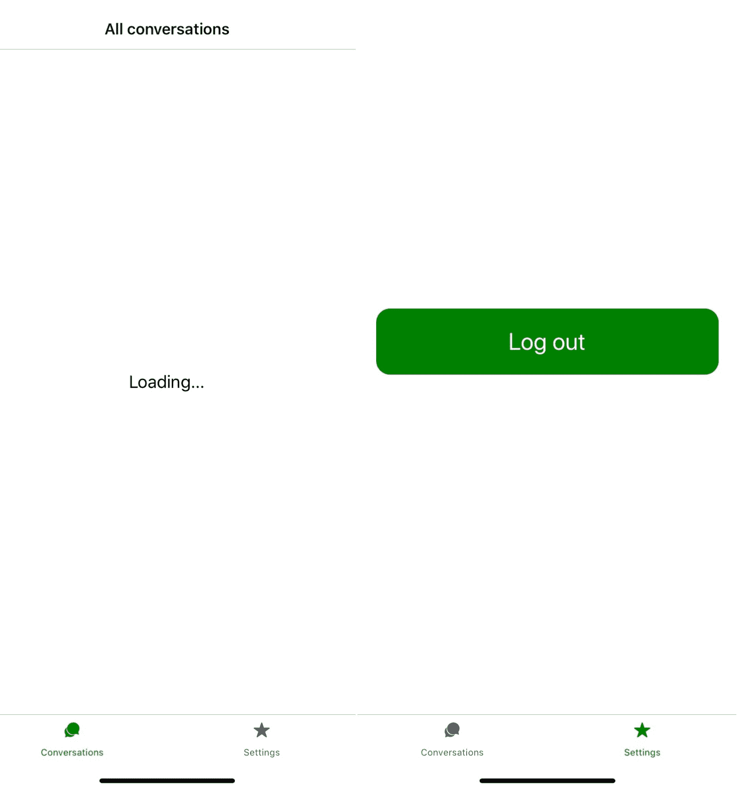
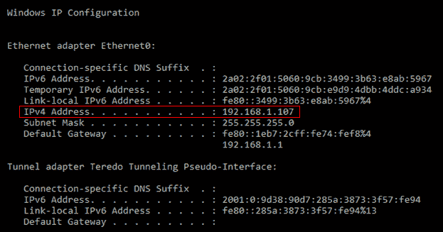
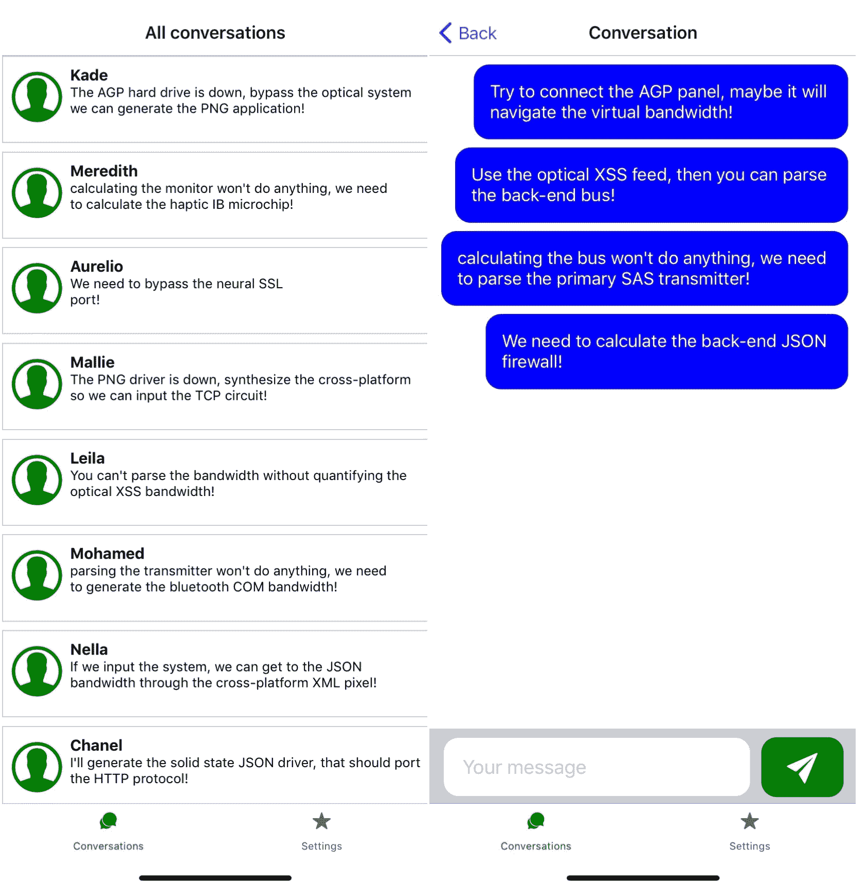

# 第十章：使用 React Native 和 Expo 创建实时消息应用程序

与服务器建立实时连接在开发实时消息应用程序时至关重要，因为您希望用户在发送消息后尽快收到消息。您可能在前两章中经历过的是，移动应用程序比 Web 应用程序更直观。当您希望用户来回发送消息时，最好的方法是构建一个移动应用程序，这就是本章将要做的事情。

在这一章中，您将使用 React Native 和 Expo 创建一个实时移动消息应用程序，该应用程序与 GraphQL 服务器连接。通过使用 WebSockets，您可以为 Web 和移动应用程序与服务器创建实时连接，并在应用程序和 GraphQL 服务器之间实现双向数据流。这种连接也可以用于身份验证，使用 OAuth 和 JWT 令牌，这就是您在第七章中所做的事情，*使用 React Native 和 GraphQL 构建全栈电子商务应用程序*。

本章将涵盖以下主题：

+   使用 Apollo 的 React Native 中的 GraphQL

+   React Native 中的身份验证流程

+   GraphQL 订阅

# 项目概述

在本章中，我们将使用 React Native 和 Expo 创建一个移动消息应用程序，该应用程序使用 GraphQL 服务器进行身份验证并发送和接收消息。通过使用 Apollo 创建的 WebSocket，可以实时接收消息，因为使用了 GraphQL 订阅。用户需要登录才能通过应用程序发送消息，为此使用了 React Navigation 和 AsyncStorage 构建了身份验证流程，以将身份验证详细信息存储在持久存储中。

构建时间为 2 小时。

# 入门

我们将在本章中创建的项目是在初始版本的基础上构建的，您可以在 GitHub 上找到：[`github.com/PacktPublishing/React-Projects/tree/ch10-initial`](https://github.com/PacktPublishing/React-Projects/tree/ch10-initial)。完整的源代码也可以在 GitHub 上找到：[`github.com/PacktPublishing/React-Projects/tree/ch10`](https://github.com/PacktPublishing/React-Projects/tree/ch10)。

您需要在移动 iOS 或 Android 设备上安装应用程序 Expo Client，以在物理设备上运行该项目。或者，您可以在计算机上安装 Xcode 或 Android Studio，以在虚拟设备上运行应用程序：

+   **对于 iOS**：有关如何设置本地机器以运行 iOS 模拟器的信息，请参见此处：[`docs.expo.io/versions/v36.0.0/workflow/ios-simulator/`](https://docs.expo.io/versions/v36.0.0/workflow/ios-simulator/)。

+   **对于 Android**：有关如何设置本地机器以从 Android Studio 运行模拟器的信息，请参见此处：[`docs.expo.io/versions/v36.0.0/workflow/android-studio-emulator/`](https://docs.expo.io/versions/v36.0.0/workflow/android-studio-emulator/)。在运行模拟器时存在已知问题，可以通过确保以下行存在于您的`~/.bash_profile`或`~/.bash_rc`文件中来防止该问题：

```jsx
export ANDROID_SDK=**ANDROID_SDK_LOCATION**export PATH=**ANDROID_SDK_LOCATION**/platform-tools:$PATH export PATH=**ANDROID_SDK_LOCATION**/tools:$PATH
```

`ANDROID_SDK_LOCATION`的值是您本地计算机上 Android SDK 的路径，可以通过打开 Android Studio 并转到**首选项**|**外观和行为**|**系统设置**|**Android SDK**来找到。路径在声明 Android SDK 位置的框中列出，看起来像这样：`/Users/myuser/Library/Android/sdk`。

该应用程序是使用 Expo SDK 版本 33.0.0 创建的，因此，您需要确保您在本地机器上使用的 Expo 版本是相似的。由于 React Native 和 Expo 经常更新，请确保您使用此版本，以便本章描述的模式表现如预期。如果您的应用程序无法启动或遇到错误，请参考 Expo 文档以了解有关更新 Expo SDK 的更多信息。

# 检查初始项目

该项目由两部分组成：一个样板 React Native 应用程序和一个 GraphQL 服务器。React Native 应用程序可以在`client`目录中找到，而 GraphQL 服务器可以在`server`目录中找到。对于本章，您需要始终同时运行应用程序和服务器，您只会对`client`目录中的应用程序进行代码更改。

要开始本章，您需要在`client`和`server`目录中运行以下命令，以安装所有依赖项并启动服务器和应用程序：

```jsx
npm install && npm start
```

对于移动应用程序，此命令将在安装依赖项后启动 Expo，并使您能够从终端或浏览器启动项目。在终端中，您可以使用 QR 码在移动设备上打开应用程序，也可以在虚拟设备上打开应用程序。

无论您是使用物理设备还是虚拟 iOS 或 Android 设备打开应用程序，应用程序应该看起来像这样：



初始应用程序包括五个屏幕：`AuthLoading`、`Conversations`、`Conversation`、`Login`和`Settings`。`Conversations`屏幕将是初始屏幕，并显示加载消息，而`Settings`屏幕包含一个不起作用的注销按钮。目前，`AuthLoading`、`Conversation`和`Login`屏幕尚不可见，因为您将在本章后面为这些屏幕添加路由。

在`client`目录中，此 React Native 应用程序的项目结构如下，结构类似于您在本书中之前创建的项目：

```jsx
messaging
|-- client
    |-- .expo
    |-- assets
        |-- icon.png
        |-- splash.png
    |-- Components
        |-- // ...
    |-- node_modules
    |-- Screens
        |-- AuthLoading.js
        |-- Conversation.js
        |-- Conversations.js
        |-- Login.js
        |-- Settings.js
    |-- .watchmanconfig
    |-- App.js
    |-- AppContainer.js
    |-- app.json
    |-- babel.config.js
    |-- package.json
```

在`assets`目录中，您可以找到用于主屏幕应用程序图标的图像。一旦您在移动设备上安装了此应用程序，启动应用程序时将显示用作启动画面的图像。有关应用程序的详细信息，如名称、描述和版本，都放在`app.json`中，而`babel.config.js`包含特定的 Babel 配置。

`App.js`文件是您的应用程序的实际入口点，其中导入并返回`AppContainer.js`文件。在`AppContainer`中，定义了此应用程序的所有路由，并且`AppContext`将包含应该在整个应用程序中可用的信息。

此应用程序的所有组件都位于`Screens`和`Components`目录中，其中第一个包含由屏幕呈现的组件。这些屏幕的子组件可以在`Components`目录中找到，其结构如下：

```jsx
|-- Components
    |-- Button
        |-- Button.js
    |-- Conversation
        |-- ConversationActions.js
        |-- ConversationItem.js
    |-- Message
        |-- Message.js
    |-- TextInput
        |-- TextInput.js
```

GraphQL 服务器位于：`http://localhost:4000/graphql`，GraphQL Playground 将在此处可见。通过这个 Playground，您可以查看 GraphQL 服务器的模式，并审查所有可用的查询、变异和订阅。虽然您不会对服务器进行任何代码更改，但了解模式及其工作原理是很重要的。

服务器有两个查询，一个是通过使用`userName`参数作为标识符来检索对话列表，另一个是检索单个对话。这些查询将返回`Conversation`类型，其中包括`id`、`userName`和`Message`类型的消息列表。

在这个 GraphQL 服务器上，可以找到两个变异，一个是登录用户，另一个是发送消息。用户可以通过以下方式登录：

+   **用户名**：`test`

+   **密码**：`test`

最后，有一个订阅将检索添加到对话中的消息。这个订阅将增强查询，并可以发送到一个文档中以检索单个对话。

# 使用 React Native 和 Expo 创建实时消息应用程序

移动应用程序受欢迎的原因之一是它们通常提供实时数据，例如更新和通知。使用 React Native 和 Expo，您可以创建能够使用 WebSockets 处理实时数据的移动应用程序，例如与 GraphQL 服务器同步。在本章中，您将向 React Native 应用程序添加 GraphQL，并为该应用程序添加额外功能，使其能够处理实时数据。

# 使用 Apollo 在 React Native 中使用 GraphQL

在[第七章](https://cdp.packtpub.com/react_projects_/wp-admin/post.php?post=33&action=edit#post_30)中，*使用 React Native 和 GraphQL 构建全栈电子商务应用程序*，您已经为 Web 应用程序建立了与 GraphQL 服务器的连接；同样，在本章中，您将为移动应用程序中的数据使用 GraphQL 服务器。要在 React Native 应用程序中使用 GraphQL，您可以使用 Apollo 来使开发人员的体验更加顺畅。

# 在 React Native 中设置 Apollo

`react-apollo`包，你已经在 React web 应用程序中使用过 Apollo，也可以在 React Native 移动应用程序中使用。这与 React 和 React Native 的标语“学一次，随处编写”完美契合。但在将 Apollo 添加到应用程序之前，重要的是要知道，当你在移动设备上使用 Expo 应用程序运行应用程序时，不支持本地主机请求。该项目的本地 GraphQL 服务器正在运行在`http://localhost:4000/graphql`，但为了能够在 React Native 应用程序中使用这个端点，你需要找到你的机器的本地 IP 地址。

要找到你的本地 IP 地址，你需要根据你的操作系统做以下操作：

+   **对于 Windows**：打开终端（或命令提示符）并运行这个命令：

```jsx
ipconfig
```

这将返回一个列表，如下所示，其中包含来自本地机器的数据。在这个列表中，你需要查找**IPv4 Address**字段：



+   **对于 macOS**：打开终端并运行这个命令：

```jsx
ipconfig getifaddr en0
```

运行这个命令后，你的机器的本地`Ipv4 Address`将被返回，看起来像这样：

```jsx
192.168.1.107
```

获取本地 IP 地址后，你可以使用这个地址来为 React Native 应用程序设置 Apollo 客户端。为了能够使用 Apollo 和 GraphQL，你需要使用以下命令从`npm`安装`npm`中的几个包。你需要在一个单独的终端标签中从`client`目录中执行这个命令：

```jsx
cd client && npm install graphql apollo-client apollo-link-http apollo-cache-inmemory react-apollo
```

在`App.js`文件中，你现在可以使用`apollo-client`来创建你的 GraphQL 客户端，使用`apollo-link-http`来设置与本地 GraphQL 服务器的连接，并使用`apollo-cache-inmemory`来缓存你的 GraphQL 请求。此外，`ApolloProvider`组件将使用你创建的客户端，使 GraphQL 服务器对所有嵌套在此提供程序中的组件可用。必须使用本地 IP 地址来创建`API_URL`的值，前缀为`http://`，后缀为`:4000/graphql`，指向正确的端口和端点，使其看起来像`http://192.168.1.107:4000/graphql`。

为了做到这一点，将以下行添加到`App.js`中：

```jsx
import React from 'react';
import AppContainer from './AppContainer';
+ import { ApolloClient } from 'apollo-client';
+ import { InMemoryCache } from 'apollo-cache-inmemory';
+ import { HttpLink } from 'apollo-link-http';
+ import { ApolloProvider } from 'react-apollo';

+ const API_URL = 'http://192.168.1.107:4000/graphql';

+ const cache = new InMemoryCache();
+ const client = new ApolloClient({
+   link: new HttpLink({
+     uri: API_URL,
+   }),
+   cache
+ });

- const App = () => <AppContainer />;

+ const App = () => (
+  <ApolloProvider client={client}>
+     <AppContainer />
+  </ApolloProvider>
+ );

export default App;
```

现在，您可以从`ApolloProvider`中的任何嵌套组件发送带有查询和变异的文档，但是您还不能在文档中发送订阅。订阅的支持并不是开箱即用的，需要为客户端 React Native 应用程序和 GraphQL 服务器之间的实时双向连接设置 WebSocket。这将在本章后面完成，之后您将为应用程序添加认证。

在本节的下一部分中，您将使用 Apollo 从 GraphQL 服务器获取数据，您刚刚在本节中将其链接到 Apollo Client。

# 在 React Native 中使用 Apollo

如果您查看应用程序，您会看到有两个选项卡；一个显示`Conversations`屏幕，另一个显示`Settings`屏幕。`Conversations`屏幕现在显示文本`Loading...`，应该显示从 GraphQL 服务器返回的对话。用于显示对话的组件已经创建，可以在`client/Components/Conversation`目录中找到，而请求对话的逻辑仍需要创建。

要添加 Apollo，请按照以下步骤：

1.  第一步是从`react-apollo`中导入`Query`组件到`client/Screens/Conversations.js`文件中，您将使用它向 GraphQL 服务器发送文档。这个`Query`组件将使用`GET_CONVERSATIONS`查询，`ConversationItem`组件也必须被导入：

```jsx
import  React  from 'react'; import { FlatList, Text, View } from 'react-native'; import  styled  from 'styled-components/native'; + import { Query } from 'react-apollo';  + import { GET_CONVERSATIONS } from '../constants'; + import  ConversationItem  from '../Components/Conversations/ConversationItem'; ... const  Conversations  = () => (
 ...
```

1.  `Conversations`屏幕现在应该使用`Query`组件请求`GET_CONVERSATIONS`查询。当请求未解决时，将显示加载消息。当向 GraphQL 服务器的请求解决时，样式化的`Flatlist`将返回导入的`ConversationItem`组件列表。样式化的`Flatlist`已经创建，可以在该文件底部的`ConversationsList`组件中找到：

```jsx
...

const  Conversations  = () => (  <ConversationsWrapper> - <ConversationsText>Loading...</ConversationsText> +   <Query query={GET_CONVERSATIONS}> +     {({ loading, data }) => { +       if (loading) { +         return <ConversationsText>Loading...</ConversationsText> +       } +       return ( +         <ConversationsList +           data={data.conversations} +           keyExtractor={item => item.userName} +           renderItem={({ item }) => <ConversationItem item={item} /> } +         /> +       ); +     }} +   </Query>  </ConversationsWrapper> ); export default Conversations;
```

`Conversations`屏幕最初显示加载消息，当发送带有查询的文档时；在查询返回数据后，将显示`ConversationsList`组件。该组件呈现显示查询数据的`ConversationItem`组件。

1.  当您尝试点击任何对话时，除了看到一个改变不透明度的小动画之外，什么也不会发生。这是因为`ConversationItem`组件是一个样式化的`TouchableOpacity`，当您点击它时可以作为一个被调用的函数传递。用于导航到对话的函数可以从`Conversations`屏幕中可用的`navigation`属性中创建。这个属性应该作为一个属性传递给`ConversationItem`。

```jsx
...

- const  Conversations  = () => ( + const  Conversations  = ({ navigation ) => **(** <ConversationsWrapper>
  <ConversationsText>Loading...</ConversationsText>
 <Query query={GET_CONVERSATIONS}> {({ loading, data }) => { if (loading) { return <ConversationsText>Loading...</ConversationsText> } return ( <ConversationsList data={data.conversations} keyExtractor={item => item.userName} -             renderItem={({ item }) => <ConversationItem item={item} /> }
+ renderItem={({ item }) => <ConversationItem item={item} navigation={navigation} />}  /> ); }} </Query>  </ConversationsWrapper> ); export default Conversations;
```

1.  `ConversationItem`组件现在可以在点击`TouchableOpacity`时导航到`Conversation`屏幕；这个组件可以在`client/Components/Conversation/ConversationItem.js`文件中找到，其中应该解构并使用`navigation`属性来调用`onPress`处理程序上的`navigate`函数。这个项目被传递给`navigate`函数，以便这些数据可以在`Conversation`屏幕中使用：

```jsx
import  React  from 'react'; import { Platform, Text, View, TouchableOpacity } from 'react-native'; import { Ionicons }  from '@expo/vector-icons'; import  styled  from 'styled-components/native';

... - const ConversationItem = ({ item }) => ( + const  ConversationItem  = ({ item, navigation }) => ( -   <ConversationItemWrapper> +   <ConversationItemWrapper +     onPress={() =>  navigation.navigate('Conversation', { item })} **+   >**
      <ThumbnailWrapper>
        ... 
```

1.  这将从`client/Screens/Conversation.js`文件中导航到`Conversation`屏幕，其中应该显示完整的对话。要显示对话，您可以使用刚刚传递到此屏幕的项目数据，或者发送另一个包含检索对话的查询的文档到 GraphQL 服务器。为了确保显示最新的数据，`Query`组件可以用来发送一个查询，使用从`navigation`属性中的`userName`字段来检索对话。为了做到这一点，您需要导入`Query`组件、`Query`使用的`GET_CONVERSATION`查询，以及用于显示对话中消息的`Message`组件：

```jsx
import  React  from 'react'; import { Dimensions, ScrollView, Text, FlatList, View } from 'react-native'; + import { Query } from 'react-apollo'; import  styled  from 'styled-components/native'; + import  Message  from '../Components/Message/Message'; + import { GET_CONVERSATION } from '../constants'**;**

... const  Conversation  = () => (  ...
```

1.  在此之后，您可以将`Query`组件添加到`Conversation`屏幕，并让它使用从`navigation`属性中检索到的`userName`与`GET_CONVERSATION`查询。一旦查询解析，`Query`组件将返回一个带有名为`messages`的字段的`data`对象。这个值可以传递给`FlatList`组件。在这个组件中，您可以遍历这个值并返回显示对话中所有消息的`Message`组件。`FlatList`已经被样式化，并且可以在文件底部找到，命名为`MessagesList`：

```jsx
... - const  Conversation  = () => { + const  Conversation  = ({ navigation }) => { +   const  userName  =  navigation.getParam('userName', '');  + return **(** <ConversationWrapper>  -       <ConversationBodyText>Loading...</ConversationBodyText> +       <Query query={GET_CONVERSATION} variables={{ userName }}>        <ConversationBody> +         {({ loading, data }) => { +           if (loading) { +             return <ConversationBodyText>Loading...</ConversationBodyText>; +           } +           const { messages } = data.conversation;
  +           <MessagesList
+ data={messages}
+ keyExtractor={item  =>  String(item.id)}
+ renderItem={({ item }) => (
+ <Message  align={item.userName === 'me' ? 'left' : 'right'}>
+ {item.text}
+ </Message>
+ )}
+ />  +         }}        </ConversationBody>**+     </Query>**  <ConversationActions userName={userName}  />
 </ConversationWrapper>
 ); + }; export default Conversation;
```

现在正在显示来自这次对话的所有接收到的消息，并且可以使用屏幕底部的表单向对话中添加新消息。

根据您运行应用程序的设备，运行 iOS 设备的`Conversation`和`Conversation`屏幕应该看起来像这样：



然而，要发送消息，必须向 GraphQL 服务器发送带有突变的文档，并且用户必须经过身份验证。如何处理此突变的身份验证将在下一节中讨论，身份验证流程将被添加。

# React Native 中的身份验证

通常，移动应用程序的身份验证类似于在 Web 应用程序中处理身份验证，尽管存在一些细微差异。在移动应用程序上对用户进行身份验证的流程如下：

1.  用户打开您的应用程序

1.  显示检查持久存储中的任何身份验证信息的加载屏幕

1.  如果经过身份验证，用户将被转发到应用程序的主屏幕；否则，他们将被转发到登录屏幕，用户可以在那里登录

1.  每当用户退出登录时，身份验证详细信息将从持久存储中删除

这种流程的最大缺点之一是移动设备不支持本地存储或会话存储，因为这些持久存储解决方案与浏览器绑定。相反，您需要使用 React Native 中的`AsyncStorage`库在 iOS 和 Android 上实现持久存储。在 iOS 上，它将使用本机代码块为您提供`AsyncStorage`提供的全局持久存储，而在运行 Android 的设备上，将使用基于 RockDB 或 SQLite 的存储。

对于更复杂的用法，建议在`AsyncStorage`的顶层使用抽象层，因为`AsyncStorage`不支持加密。此外，如果要使用`AsyncStorage`为应用程序存储大量信息，键值系统的使用可能会导致性能问题。iOS 和 Android 都会对每个应用程序可以使用的存储量设置限制。

# 使用 React Navigation 进行身份验证

要设置我们之前描述的身份验证流程，你将再次使用 React Navigation 包。之前，你使用了 React Navigation 中的不同类型的导航器，但没有使用`SwitchNavigator`。使用这种导航器类型，你只能一次显示一个屏幕，并且可以使用`navigation`属性导航到其他屏幕。`SwitchNavigator`应该是你的应用程序的主要导航器，其他导航器如`StackNavigator`可以嵌套在其中。

向 React Native 应用程序添加身份验证涉及执行以下步骤：

1.  使用这种导航器类型的第一步是从`react-navigation`导入`createSwitchNavigator`，就像你将其他导航器导入到`client/AppContainer.js`文件中一样。还要导入登录屏幕的屏幕组件，可以在`client/Screens/Login.js`中找到：

```jsx
import  React  from 'react'; import { Platform } from 'react-native'; import { Ionicons }  from '@expo/vector-icons'; import {  + createSwitchContainer,    createAppContainer  } from 'react-navigation'; import { createStackNavigator } from 'react-navigation-stack';
import { createBottomTabNavigator } from 'react-navigation-tabs';
import  Conversations  from './Screens/Conversations'; import  Conversation  from './Screens/Conversation'; import  Settings  from './Screens/Settings'; + import  Login  from './Screens/Login'**;** const  ConversationsStack  =  createStackNavigator({
  ... 
```

1.  不要在此文件底部用`createAppContainer`包装`TabNavigator`，而是需要返回`SwitchNavigator`。要创建这个，你需要使用在上一步中导入的`createSwitchNavigator`。这个导航器包含`Login`屏幕和`TabNavigator`，后者是这个应用程序的主屏幕。为了让用户只在经过身份验证时看到主屏幕，`Login`屏幕需要成为初始屏幕：

```jsx
...

+ const SwitchNavigator = createSwitchNavigator( +   { +     Main: TabNavigator, +     Auth: Login +   }, +   { +     initialRouteName: 'Auth', +   } + ); - export default createAppContainer(TabNavigator); + export default createAppContainer(SwitchNavigator);
```

现在在应用程序中显示的`Login`屏幕只有在填写正确的身份验证详细信息时才会切换到`TabNavigator`。

1.  但是，此表单首先需要连接到 GraphQL 服务器，以接收身份验证所需的 JWT 令牌。`Login`屏幕的组件已经有一个表单，但是提交此表单尚未调用任何函数来对用户进行身份验证。因此，你需要使用`react-apollo`中的`Mutation`组件，并让该组件向 GraphQL 服务器发送包含正确变异的文档。需要添加到此组件的变异可以在`constants.js`文件中找到，称为`LOGIN_USER`。要提交表单，应该在用户按下`Button`时调用`Mutation`组件返回的`loginUser`函数：

```jsx
import React from 'react';
import { View, TextInput } from 'react-native';
import styled from 'styled-components/native';
+ import { Mutation } from 'react-apollo';
import Button from '../Components/Button/Button';
+ import { LOGIN_USER } from '../constants';

... const Login = () => {
 const [userName, setUserName] = React.useState('');
 const [password, setPassword] = React.useState('');

 return (
+  <Mutation mutation={LOGIN_USER}>
+    {loginUser => (
       <LoginWrapper>
          <StyledTextInput
            onChangeText={setUserName}
            value={userName}
            placeholder='Your username'
            textContentType='username'
          />
          <StyledTextInput
            onChangeText={setPassword}
            value={password}
            placeholder='Your password'
            textContentType='password'
          />
          <Button
            title='Login'
+           onPress={() => loginUser({ variables: { userName, password } })}
          />
        </LoginWrapper>
+    )}
+  </Mutation>
 );
};

export default Login;
```

两个`TextInput`组件都是受控组件，并使用`useState`钩子来控制它们的值。用于此变异的`userName`和`password`常量都使用两个变量进行身份验证，这两个变量也是`userName`和`password`：

```jsx
... export  const  LOGIN_USER  =  gql`
 mutation loginUser($userName: String!, $password: String!) {
   loginUser(userName: $userName, password: $password) {
     userName
     token
   }
 }
`;
...
```

1.  除了`loginUser`函数之外，该函数发送了一个文档中的变化，`Mutation`组件还会返回由 GraphQL 服务器返回的`loading`、`error`和`data`变量。`loading`变量可用于向用户传达文档已发送到服务器，而当 GraphQL 服务器对此文档做出响应时，将返回`data`和`error`变量：

```jsx
import React from 'react';
import { View, TextInput } from 'react-native';
import styled from 'styled-components/native';
import { Mutation } from 'react-apollo';
import Button from '../Components/Button/Button';
import { LOGIN_USER } from '../constants'; ... const Login = () => {
 const [userName, setUserName] = React.useState('');
 const [password, setPassword] = React.useState('');

 return (
  <Mutation mutation={LOGIN_USER}>
-    {loginUser => (
+    {(loginUser, { loading }) => (  <LoginWrapper>
          <StyledTextInput
            onChangeText={setUserName}
            value={userName}
            placeholder='Your username'
            textContentType='username'
          />
          <StyledTextInput
            onChangeText={setPassword}
            value={password}
            placeholder='Your password'
            textContentType='password'
          />
          <Button
-           title='Login'
+           title={loading ? 'Loading...' : 'Login'}
            onPress={() => loginUser({ variables: { userName, password } })}
          />
       </LoginWrapper>
    }}
   </Mutation>
 );
};

export default Login;
```

当文档发送到 GraphQL 服务器并且尚未返回响应时，这将会改变表单底部按钮的文本为`Loading...`。

1.  要使用`error`变量在填写错误凭据时显示错误消息，您不会从`Mutation`组件的输出中解构该变量。相反，错误变量将从`loginUser`函数返回的`Promise`中检索。为了显示错误，您将使用`error`变量中可用的`graphQLErrors`方法，该方法返回一个数组（因为可能存在多个错误），并在 React Native 的`Alert`组件中呈现错误：

```jsx
import React from 'react';
- import { View, TextInput } from 'react-native';
+ import { Alert, View, TextInput } from 'react-native';
import styled from 'styled-components/native';
import { Mutation } from 'react-apollo';
import Button from '../Components/Button/Button';
import { LOGIN_USER } from '../constants';

...

 <Button
   title={loading ? 'Loading...' : 'Login'}
   onPress={() => {     loginUser({ variables: { userName, password } })
**+** .catch(error  => {
+ Alert.alert(
+         'Error',
+         error.graphQLErrors.map(({ message }) =>  message)[0] +        );
+    });
   }}
 />

...
```

1.  当使用正确的用户名和密码组合时，应使用`data`变量来存储由 GraphQL 服务器返回的 JWT 令牌。就像从`loginUser`函数中检索的`error`变量一样，`data`变量也可以从这个`Promise`中检索。这个令牌可用于`data`变量，并且应该被安全地存储，可以使用`AsyncStorage`库来实现：

```jsx
import  React  from 'react';  - import { Alert, View, TextInput } from 'react-native';
+ import { AsyncStorage, Alert, View, TextInput } from 'react-native';  import  styled  from 'styled-components/native';  import { Mutation } from 'react-apollo';  import  Button  from '../Components/Button/Button';  import { LOGIN_USER } from '../constants'; ... const  Login  = ({ navigation }) => {
  ... 
  <Button
    title={loading ? 'Loading...' : 'Login'}
    onPress={() => {      loginUser({ variables: { userName, password } }) +       .then(({data}) => { +         const { token } = data.loginUser; +         AsyncStorage.setItem('token', token);  +       })
        .catch(error  => {         if (error) {
            Alert.alert(
              'Error',
              error.graphQLErrors.map(({ message }) =>  message)[0], );
          }
        });
      }}
    /> 
    ...
```

1.  存储令牌后，用户应被重定向到主应用程序，该应用程序可以在`Main`路由中找到，并表示与`TabNavigator`相关联的屏幕。要重定向用户，您可以使用`SwitchNavigator`通过传递给`Login`组件的`navigation`属性。由于使用`AsyncStorage`存储东西应该是异步的，因此应该从`AsyncStorage`返回的`Promise`的回调中调用导航函数：

```jsx
import  React  from 'react';  import { AsyncStorage, Alert, View, TextInput } from 'react-native';  import  styled  from 'styled-components/native';  import { Mutation } from 'react-apollo';  import  Button  from '../Components/Button/Button';  import { LOGIN_USER } from '../constants'; ... - const  Login  = () => { + const  Login  = ({ navigation }) => { ... 
<Button
 title={loading ? 'Loading...' : 'Login'}
 onPress={() => { loginUser({ variables: { userName, password } })  .then(({data}) => {    const { token } = data.loginUser;
**-** AsyncStorage.setItem('token', token) +   AsyncStorage.setItem('token', token).then(value  => { +     navigation.navigate('Main'); +   });    })
  .catch(error  => { if (error) { Alert.alert( 'Error', error.graphQLErrors.map(({ message }) =>  message)[0], );
    }
  });
 }} />

...
```

然而，这只完成了认证流程的一部分，因为当应用程序首次渲染时，`Login`屏幕将始终显示。这样，用户始终必须使用他们的认证详细信息登录，即使他们的 JWT 令牌存储在持久存储中。

要检查用户以前是否已登录，必须向`SwitchNavigator`中添加第三个屏幕。这个屏幕将确定用户是否在持久存储中存储了令牌，如果有，用户将立即重定向到`Main`路由。如果用户以前没有登录，则会重定向到你刚刚创建的`Login`屏幕：

1.  确定是否在持久存储中存储了身份验证令牌的中间屏幕，即`AuthLoading`屏幕，应该在`App.js`中添加到`SwitchNavigator`中。这个屏幕也应该成为导航器提供的初始路由：

```jsx
import  React  from 'react';  import { Platform } from 'react-native';  import { Ionicons }  from '@expo/vector-icons';  import {   createSwitchNavigator,
  createAppContainer } from 'react-navigation';
import { createStackNavigator } from 'react-navigation-stack';
import { createBottomTabNavigator } from 'react-navigation-tabs';  import  Conversations  from './Screens/Conversations';  import  Conversation  from './Screens/Conversation';  import  Settings  from './Screens/Settings';  import  Login  from './Screens/Login';  + import  AuthLoading  from './Screens/AuthLoading'; const  ConversationsStack  =  createStackNavigator({

  ...   const  SwitchNavigator  =  createSwitchNavigator(
  {
    Main:  TabNavigator,    Login,
**+   AuthLoading,**
  },
  {
-   initialRouteName: 'Login',
+   initialRouteName: 'AuthLoading',
  }
);export default createAppContainer(SwitchNavigator);
```

1.  在这个`AuthLoading`屏幕中，应该从持久存储中检索身份验证令牌，然后处理导航到`Login`或`Main`屏幕。这个屏幕可以在`client/Screens/AuthLoading.js`文件中找到，那里只添加了一个简单的界面。可以使用`AsyncStorage`库中的`getItem`方法来检索令牌，并且应该从`useEffect` Hook 中调用，以便在首次加载`AuthLoading`屏幕时检索它。从`callback`和`Promise`返回的`getItem`中，使用`navigation`属性的`navigate`函数来实际导航到这些屏幕中的任何一个：

```jsx
import  React  from 'react';  - import { Text, View } from 'react-native'; + import { AsyncStorage, Text, View } from 'react-native'; import  styled  from 'styled-components/native'; ... - const AuthLoading = () => ( + const  AuthLoading  = ({ navigation }) => { + React.useEffect(() => { + AsyncStorage.getItem('token').then(value  => { +       navigation.navigate(value  ? 'Main'  : 'Auth'); +     }); +   }, [navigation]); +   return **(** <AuthLoadingWrapper> <AuthLoadingText>Loading...</AuthLoadingText> </AuthLoadingWrapper>
 ); **+ };**

export default AuthLoading;
```

1.  完成身份验证流程的最后一步是通过从持久存储中删除令牌来为用户添加注销应用的可能性。这是在`client/Screens/Settings.js`文件中完成的。这会呈现`TabNavigator`中的`Settings`屏幕。`Settings`屏幕上有一个绿色按钮，你可以在上面设置`onPress`事件。

`AsyncStorage`的`removeItem`方法可用于从持久存储中删除令牌，并返回`Promise`。在这个`Promise`的回调中，你可以再次处理导航，以返回到`Login`屏幕，因为你不希望未经身份验证的用户在你的应用中。

```jsx
import  React  from 'react';  - import { Text, View } from 'react-native'; + import { AsyncStorage, Text, View } from 'react-native';  import  styled  from 'styled-components/native';  import  Button  from '../Components/Button/Button'; ... - const Settings = () => ( + const  Settings  = ({ navigation }) => **(**
      <SettingsWrapper> - <Button title='Log out' /> +       <Button +         title='Log out' +         onPress={() => { +           AsyncStorage.removeItem('token').then(() =>  navigation.navigate('AuthLoading')); +         }} **+       />**
 </SettingsWrapper>
 );

export default Settings;
```

通过添加注销功能，您已经完成了使用 GraphQL 服务器返回的 JWT 令牌的身份验证流程。这可以通过在“登录”屏幕上填写表单来请求。如果身份验证成功，用户将被重定向到“主”屏幕，并且通过“设置”屏幕上的“注销”按钮，用户可以注销并将被重定向回“登录”屏幕。最终的身份验证流程现在看起来可能是这样的，具体取决于您在哪个操作系统上运行此应用程序。以下屏幕截图是从运行 iOS 的设备上获取的：

！[](assets/22c6656d-d2d5-4501-b80f-804de21ebd29.png)

然而，为了 GraphQL 服务器知道这个用户是否经过身份验证，您需要向其发送一个验证令牌。在本节的下一部分，您将学习如何通过使用 JSON Web Token（JWT）来实现这一点。

# 向 GraphQL 服务器发送身份验证详细信息

现在存储在持久存储中的身份验证详细信息也应该添加到 Apollo Client 中，以便在每个文档中与 GraphQL 服务器一起发送。这可以通过扩展 Apollo Client 的设置与令牌信息来完成。由于令牌是 JWT，因此应该以`Bearer`为前缀：

1.  您需要安装一个 Apollo 包来处理向“上下文”添加值。`setContext`方法来自`apollo-link-context`包，您可以从`npm`安装该包：

```jsx
npm install apollo-link-context
```

1.  应该将`apollo-link-context`包导入到`client/App.js`文件中，其中创建了 Apollo 客户端。您需要分开为客户端创建`HttpLink`对象的构造，因为这个对象需要与创建的上下文结合使用：

```jsx
import  React  from 'react';  import { ApolloClient } from 'apollo-client';  import { InMemoryCache } from 'apollo-cache-inmemory'; **+ import { setContext }  from 'apollo-link-context';** import { HttpLink } from 'apollo-link-http';  import { ApolloProvider } from 'react-apollo';  import  AppContainer  from './AppContainer'; const API_URL = '..'; + const  httpLink  =  new  HttpLink({ + uri: API_URL,**+ });** const  cache  =  new  InMemoryCache(); const  client  =  new  ApolloClient({ - link: new HttpLink({ -   uri: API_URL, - }), + link:  httpLink**,**
 cache, }); const  App  = () => (
 ...
```

1.  之后，您可以使用`setContext()`方法来扩展发送到 GraphQL 服务器的标头，以便还可以包括可以从持久存储中检索的令牌。由于从`AsyncStorage`获取项目也是异步的，因此应该异步使用此方法。将返回的令牌必须以`Bearer`为前缀，因为 GraphQL 服务器期望以该格式接收 JWT 令牌：

```jsx
import React from 'react';
+ import { AsyncStorage } from 'react-native';
import AppContainer from './AppContainer';
import { ApolloClient } from 'apollo-client';
import { InMemoryCache } from 'apollo-cache-inmemory';
import { setContext } from 'apollo-link-context';
import { HttpLink } from 'apollo-link-http';
import { ApolloProvider } from 'react-apollo';

const API_URL = '...';

const  httpLink  =  new  HttpLink({
  uri:  API_URL,  }); 
+ const  authLink  =  setContext(async (_, { headers }) => { +   const  token  =  await  AsyncStorage.getItem('token'); +   return { +     headers: { +       ...headers, +       authorization:  token  ?  `Bearer ${token}`  : '',  +     }
+   };
+ });  ...
```

1.  在创建 Apollo Client 时用于`link`字段的`httpLink`现在应该与`authLink`结合，以便从`AsyncStorage`检索到的令牌在发送请求到 GraphQL 服务器时被添加到标头中：

```jsx
...

const  cache  =  new  InMemoryCache(); const  client  =  new  ApolloClient({ - link: httpLink,
+ link:  authLink.concat(httpLink),  cache }); const  App  = () => (
  ...
```

现在，任何传递给 GraphQL 服务器的文档都可以使用通过应用程序登录表单检索到的令牌，这是在下一节中使用变异发送消息时所需的内容。

# 使用 Apollo 在 React Native 中处理订阅

在您可以继续并发送包含变异的文档到 GraphQL 服务器之前，我们需要设置 Apollo 以便处理订阅。为了处理订阅，需要为您的应用程序设置一个 WebSocket，这样可以在 GraphQL 服务器和您的应用程序之间建立实时的双向连接。这样，当您使用这个移动应用程序发送或接收消息时，您将收到即时反馈。

# 为 GraphQL 订阅设置 Apollo 客户端

要在您的 React Native 应用程序中使用订阅，您需要添加更多的软件包到项目中，例如，使其可能添加 WebSocket。这些软件包如下：

```jsx
npm install apollo-link-ws subscriptions-transport-ws apollo-utilities
```

`apollo-link-ws`软件包帮助您创建到运行订阅的 GraphQL 服务器的链接，就像`apollo-link-http`为查询和变异所做的那样。`subscriptions-transport-ws`是运行`apollo-link-ws`所需的软件包，而`apollo-utilities`被添加以使用这些软件包上可用的方法，以便您可以将有关订阅的请求与查询或变异的请求分开。

安装这些软件包后，您需要按照以下步骤在应用程序中使用订阅：

1.  您可以使用`apollo-link-ws`来添加链接到 GraphQL 服务器的创建。GraphQL 服务器的 URL 应该以`ws://`开头，而不是`http://`，因为它涉及与 WebSocket 的连接。在您的机器上运行的 GraphQL 服务器的 URL 看起来像`ws://192.168.1.107/graphql`，而不是`http://192.168.1.107/graphql`，必须添加到`SOCKET_URL`常量中：

```jsx
import  React  from 'react'; import { AsyncStorage } from 'react-native'; import { ApolloClient } from 'apollo-client';  import { InMemoryCache } from 'apollo-cache-inmemory'; import { setContext } from 'apollo-link-context'; import { HttpLink } from 'apollo-link-http';  + import { split } from 'apollo-link';  import { ApolloProvider } from 'react-apollo';  import  AppContainer  from './AppContainer'; const API_URL = '...';
**+ const SOCKET_URL = 'ws://192.168.1.107/graphql';** ...

+ const  wsLink  =  new  WebSocketLink({ +   uri: SOCKET_URL,  +   options: { +     reconnect:  true, +   },
+ });

...
```

1.  使用`split`和`getMainDefinition`方法，可以通过将查询和变异与订阅分开来区分对 GraphQL 服务器的不同请求。这样，只有包含订阅的文档才会使用 WebSocket 发送，而查询和变异将使用默认流程：

```jsx
import  React  from 'react'; import { AsyncStorage } from 'react-native'; import { ApolloClient } from 'apollo-client';  import { InMemoryCache } from 'apollo-cache-inmemory'; import { setContext } from 'apollo-link-context'; import { HttpLink } from 'apollo-link-http';  import { split } from 'apollo-link'; + import { WebSocketLink } from 'apollo-link-ws';  + import { getMainDefinition } from 'apollo-utilities';  import { ApolloProvider } from 'react-apollo';  import  AppContainer  from './AppContainer'; ... + const  link  =  split( +   ({ query }) => { +     const  definition  =  getMainDefinition(query);
+ +     return ( +       definition.kind  === 'OperationDefinition'  && definition.operation  === 'subscription' +     );
+   },
+   wsLink, +   httpLink,
+ );

const  cache  =  new  InMemoryCache(); const  client  =  new  ApolloClient({ - link: authLink.concat(httpLink),
+ link: authLink.concat(link),
 cache,
});

const  App  = () => (
 ...
```

现在 Apollo 的设置也支持订阅，您将在本节的下一部分中添加，其中`Conversations`屏幕将填充实时数据。

# 将订阅添加到 React Native

在您的本地 GraphQL 服务器上运行的服务器支持查询和订阅，以便您可以从特定用户返回对话。查询将返回完整的对话，而订阅将返回可能已发送或接收到的对话中的任何新消息。目前，`Conversation`屏幕只会发送一个带有查询的文档，如果您点击`Conversations`屏幕上显示的任何对话，它将返回与用户的对话。

订阅可以以多种方式添加到您的应用程序中；使用`react-apollo`中的`Subscription`组件是最简单的方法。但由于您已经使用`client/Screens/Conversation.js`中的`Query`组件检索对话，因此可以扩展`Query`组件以支持订阅：

1.  向`Conversation`屏幕添加订阅的第一步是将屏幕拆分为多个组件。您可以通过在`client/Components/Conversation`目录中创建一个名为`ConversationBody`的新组件来实现这一点。该文件应该被命名为`ConversationBody.js`，并包含以下代码：

```jsx
import  React  from 'react';  import  styled  from 'styled-components/native';  import { Dimensions, ScrollView, FlatList } from 'react-native';  import  Message  from '../Message/Message';  const  ConversationBodyWrapper  =  styled(ScrollView)`
 width: 100%; padding: 2%;
 display: flex; height: ${Dimensions.get('window').height * 0.6}; `; const  MessagesList  =  styled(FlatList)`
 width: 100%; `; const  ConversationBody  = ({  userName, messages }) => {  return ( <ConversationBodyWrapper> <MessagesList data={messages} keyExtractor={item  =>  String(item.id)} renderItem={({ item }) => ( <Message  align={item.userName === 'me' ? 'left' : 'right'}> {item.text} </Message> )} /> </ConversationBodyWrapper>
 ); };  export  default  ConversationBody;
```

1.  创建了这个新组件之后，应该将其导入到`client/Screens/Conversation.js`文件中的`Conversation`屏幕中，以取代该文件中已经存在的`ContainerBody`组件。这也意味着一些导入变得过时，`ContainerBody`样式组件也可以被删除：

```jsx
import  React  from 'react';  - import { Dimensions, ScrollView, Text, FlatList, View } from 'react-native';  + import { Text, View } from 'react-native';  import { Query } from 'react-apollo';  import  styled  from 'styled-components/native';  - import  Message  from '../Components/Message/Message'; + import ConversationBody from '../Components/Conversation/ConversationBody'; import { GET_CONVERSATION } from '../constants';   ... const  Conversation  = ({ navigation }) => { const  userName  =  navigation.getParam('userName', ''); return ( <ConversationWrapper> <Query query={GET_CONVERSATION} variables={{ userName }}> -       <ConversationBody>   {({ loading, data }) => { if (loading) { return <ConversationBodyText>Loading...</ConversationBodyText>; } const { messages } = data.conversation;  -           return ( -             <MessagesList
- data={messages}
- keyExtractor={item  =>  String(item.id)}
- renderItem={({ item }) => (
- <Message  align={item.userName === 'me' ? 'left' : 'right'}>
- {item.text}
- </Message>
- )}
- /> -           ); -         }} +         return <ConversationBody messages={messages} userName={userName} /> }} -     </ConversationBody>   </Query>  <ConversationActions userName={userName}  />
 </ConversationWrapper>
 ); };

export default Conversation;
```

1.  现在，可以将检索订阅的逻辑添加到`Query`组件中，通过从中获取`subscribeToMore`方法。这个方法应该传递给`ConversationBody`组件，在那里它将被调用，从而检索发送或接收到的任何新消息：

```jsx
 ...

  return ( <ConversationWrapper> <Query query={GET_CONVERSATION} variables={{ userName }}> -       {({ loading, data }) => {
+       {({ subscribeToMore, loading, data }) => {
 if (loading) { return <ConversationBodyText>Loading...</ConversationBodyText>; } const { messages } = data.conversation;  -         return <ConversationBody messages={messages} userName={userName} />
+         return (
+           <ConversationBody
+             messages={messages}
+             userName={userName}
+             subscribeToMore={subscribeToMore}
+           /> }} </Query>  <ConversationActions userName={userName}  />
 </ConversationWrapper>
 ); };
```

1.  在`ConversationBody`组件中，现在可以使用`subscribeToMore`方法通过订阅来检索添加到对话中的任何新消息。要使用的订阅称为`MESSAGES_ADDED`，可以在`client/constants.js`文件中找到。它以`userName`作为变量：

```jsx
import  React  from 'react';  import  styled  from 'styled-components/native';  import { Dimensions, ScrollView, FlatList } from 'react-native';  import  Message  from '../Message/Message';  + import { MESSAGE_ADDED } from '../../constants'; ... - const  ConversationBody  = ({  userName, messages }) => { + const  ConversationBody  = ({ subscribeToMore, userName, messages }) => **{**  return ( <ConversationBodyWrapper> <MessagesList data={messages} keyExtractor={item  =>  String(item.id)} renderItem={({ item }) => ( <Message  align={item.userName === 'me' ? 'left' : 'right'}> {item.text} </Message> )} /> </ConversationBodyWrapper>
 ); };

export default ConversationBody;
```

1.  在导入订阅并从 props 中解构`subscribeToMore`方法之后，可以添加检索订阅的逻辑。应该从`useEffect` Hook 中调用`subscribeToMore`，并且仅当`ConversationBody`组件首次挂载时。任何新添加的消息都将导致`Query`组件重新渲染，这将使`ConversationBody`组件重新渲染，因此在`useEffect` Hook 中不需要检查任何更新：

```jsx
... const  ConversationBody  = ({ subscribeToMore, userName, messages }) => { +  React.useEffect(() => { +    subscribeToMore({ +      document:  MESSAGE_ADDED, +      variables: { userName }, +      updateQuery: (previous, { subscriptionData }) => { +        if (!subscriptionData.data) { +          return  previous; +        }
+        const  messageAdded  =  subscriptionData.data.messageAdded;
+ +        return  Object.assign({}, previous, { +          conversation: { +            ...previous.conversation, +            messages: [...previous.conversation.messages, messageAdded] +          }
+        });
+     }
+   });
+ }, []);
   return ( <ConversationBodyWrapper>
 ...
```

`subscribeToMore`方法现在将使用`MESSAGES_ADDED`订阅来检查任何新消息，并将该订阅的结果添加到名为`previous`的对象上的`Query`组件中。本地 GraphQL 服务器将每隔几秒钟返回一条新消息，因此您可以通过打开对话并等待新消息出现在该对话中来查看订阅是否起作用。

除了查询，您还希望能够发送实时订阅。这将在本节的最后部分进行讨论。

# 使用订阅与突变

除了使用订阅来接收对话中的消息，它们还可以用于显示您自己发送的消息。以前，您可以在`Mutation`组件上使用`refetchQueries`属性来重新发送受到您执行的突变影响的任何查询的文档。通过使用订阅，您不再需要重新获取，例如，对话查询，因为订阅将获取您刚刚发送的新消息并将其添加到查询中。

在上一节中，您使用了来自`react-apollo`的`Query`组件向 GraphQL 服务器发送文档，而在本节中，将使用新的 React Apollo Hooks。

React Apollo Hooks 可以从`react-apollo`包中使用，但如果您只想使用 Hooks，可以通过执行`npm install @apollo/react-hooks`来安装`@apollo/react-hooks`。GraphQL 组件，如`Query`或`Mutation`，在`react-apollo`和`@apollo/react-components`包中都可用。使用这些包将减少捆绑包的大小，因为您只导入所需的功能。

这个包中的 Hooks 必须在`ConversationActions`组件中使用。这在`Conversation`屏幕组件中使用，该组件将包括输入消息的输入字段和发送消息的按钮。当您按下此按钮时，什么也不会发生，因为按钮未连接到变异。让我们连接这个按钮，看看订阅如何显示您发送的消息：

1.  `useMutation` Hook 应该被导入到`client/Components/Conversation/ConversationActions.js`文件中，该文件将用于将输入字段中的消息发送到 GraphQL 服务器。还必须导入将包含在您发送的文档中的变异，名为`SEND_MESSAGE`；这可以在`client/constants.js`文件中找到：

```jsx
import  React  from 'react';  import { Platform, Text, View } from 'react-native';  import  styled  from 'styled-components/native';  import { Ionicons }  from '@expo/vector-icons';  + import { useMutation } from 'react-apollo'; import  TextInput  from '../TextInput/TextInput';  import  Button  from '../Button/Button';  + import { SEND_MESSAGE } from '../../constants'; ... const  ConversationActions  = ({ userName }) => {
  ...
```

1.  这个`useMutation` Hook 现在可以用来包裹`TextInput`和`Button`组件，来自 Hook 的`sendMessage`属性可以用来向 GraphQL 服务器发送带有消息的文档。`TextInput`的值由`useState` Hook 创建的`setMessage`函数控制，这个函数可以在发送变异后用来清除`TextInput`：

```jsx
...
const  ConversationActions  = ({ userName }) => { + const [sendMessage] = useMutation(SEND_MESSAGE);   const [message, setMessage] =  React.useState('');
 return ( <ConversationActionsWrapper> + **<>** <TextInput width={75} marginBottom={0} onChangeText={setMessage} placeholder='Your message' value={message} /> <Button width={20} padding={10}
**+** onPress={() => {
+ sendMessage({ variables: { to:  userName, text:  message } });
+ setMessage(''); +         }**}**
 title={ <Ionicons name={`${Platform.OS === 'ios' ? 'ios' : 'md'}-send`} size={42} color='white' /> } /> +     </>  +   </ConversationActionsWrapper**>**
 ); };
```

通过在文本字段中输入值并在之后按下发送按钮来发送消息，现在会更新对话，显示您刚刚发送的消息。但是，您可能会注意到，这个组件会在移动设备屏幕的大小上被键盘遮挡。通过使用`react-native`中的`KeyboardAvoidingView`组件，可以轻松避免这种行为。这个组件将确保输入字段显示在键盘区域之外。

1.  `KeyboardAvoidingView`组件可以从`react-native`中导入，并用于替换当前正在样式化为`ConversationsActionsWrapper`组件的`View`组件：

```jsx
import  React  from 'react';  - import { Platform, Text, View } from 'react-native';  + import { Platform, Text, KeyboardAvoidingView } from 'react-native';  import  styled  from 'styled-components/native';  import { Ionicons }  from '@expo/vector-icons';  import { useMutation } from 'react-apollo';  import  TextInput  from '../TextInput/TextInput';  import  Button  from '../Button/Button';  import { SEND_MESSAGE } from '../../constants';  - const  ConversationActionsWrapper  =  styled(View)` + const  ConversationActionsWrapper  =  styled(KeyboardAvoidingView)**`**
    width: 100%;
    background-color: #ccc;
    padding: 2%;
    display: flex;
    flex-direction: row;
    align-items: center;
    justify-content: space-around;
`; const  ConversationActions  = ({ userName }) => {

 ... 
```

1.  根据您的移动设备运行的平台，`KeyboardAvoidingView`组件可能仍然无法在键盘区域之外显示输入字段。但是，`KeyboardAvoidingView`组件可以使用`keyboardVerticalOffset`和`behavior`属性进行自定义。对于 iOS 和 Android，这些属性的值应该不同；一般来说，Android 需要比 iOS 更小的偏移量。在这种情况下，`keyboardVerticalOffset`必须设置为`190`，`behavior`必须设置为`padding`：

```jsx
...

const  ConversationActions  = ({ userName }) => { const [sendMessage] = useMutation(SEND_MESSAGE);
  const [message, setMessage] =  React.useState('');
 return ( -   <ConversationActionsWrapper +   <ConversationActionsWrapper +     keyboardVerticalOffset={Platform.OS === 'ios' ? 190 : 140} +     behavior=;padding' **+   >**
 <Mutation  mutation={SEND_MESSAGE}> ... 
```

`KeyboardAvoidingView`在 Android Studio 模拟器或运行 Android 的设备上可能无法按预期工作，因为可以运行 Android 操作系统的设备有许多不同的可能屏幕尺寸。

当您按下输入字段时，键盘将不再隐藏在键盘后面，您应该能够输入并发送一条消息，该消息将发送一个包含对 GraphQL 服务器的突变的文档。您的消息还将出现在先前显示的对话中。

# 摘要

在本章中，您构建了一个移动消息应用程序，可以用于与 GraphQL 服务器发送和接收消息。通过使用 GraphQL 订阅，消息可以实时接收，通过 WebSocket 接收消息。此外，还添加了移动身份验证流程，这意味着用户必须登录才能发送和接收消息。为此，使用`AsyncStorage`将 GraphQL 服务器返回的 JWT 令牌存储在持久存储中。

您在本章中构建的项目非常具有挑战性，但您将在下一章中创建的项目将更加先进。到目前为止，您已经处理了大多数 React Native 移动应用程序的核心功能，但还有更多内容。下一章将探讨如何使用 React Native 和 GraphQL 构建全栈应用程序，您将向社交媒体应用程序添加通知等功能。

# 进一步阅读

有关本章涵盖的更多信息，请查看以下资源：

+   WebSockets: [`developer.mozilla.org/en-US/docs/Web/API/WebSocket`](https://developer.mozilla.org/en-US/docs/Web/API/WebSocket)

+   Apollo React Hooks: [`www.apollographql.com/docs/react/api/react-hooks/`](https://www.apollographql.com/docs/react/api/react-hooks/)
