# 第一章：购物清单

大多数现代语言和框架用于展示待办事项清单作为它们的示例应用程序。这是了解框架基础知识的绝佳方式，如用户交互、基本导航或代码结构。我们将以更加务实的方式开始：构建一个购物清单应用程序。

您将能够使用 React Native 代码开发此应用程序，为 iOS 和 Android 构建它，并最终安装在您的手机上。这样，您不仅可以向朋友展示您所构建的内容，还可以了解您可以自己构建的缺失功能，思考用户界面改进，最重要的是，激励自己继续学习 React Native，感受其真正的潜力。

在本章结束时，您将已经构建了一个完全功能的购物清单，可以在手机上使用，并且拥有创建和维护简单有状态应用程序所需的所有工具。

# 概述

React Native 的最强大功能之一是其跨平台能力；我们将为 iOS 和 Android 构建我们的购物清单应用程序，重用我们代码的 99%。让我们来看看这个应用在两个平台上的样子：

iOS：

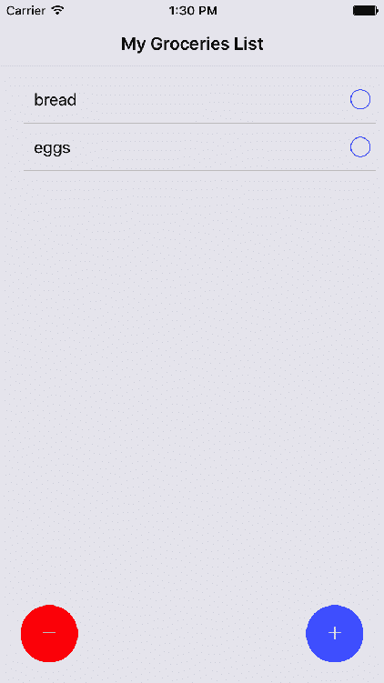

添加更多产品后，它将如下所示：

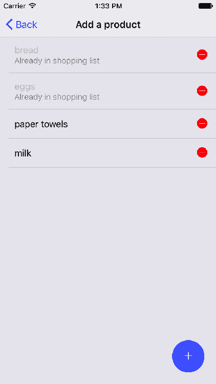

Android：

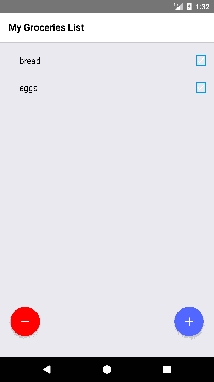

添加更多产品后，它将如下所示：

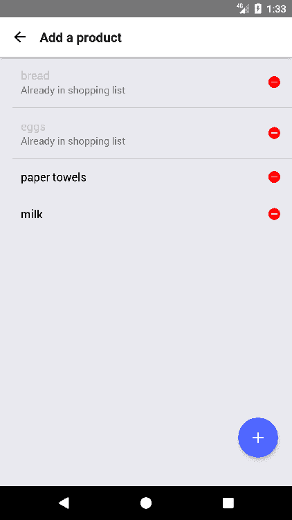

该应用程序在两个平台上的用户界面非常相似，但我们不需要过多关注差异（例如，“添加产品”屏幕上的返回按钮），因为它们将由 React Native 自动处理。

重要的是要理解每个平台都有自己的用户界面模式，并且遵循它们是一个好的做法。例如，iOS 通常通过选项卡来处理导航，而 Android 更喜欢抽屉菜单，因此如果我们希望在两个平台上都有满意的用户，我们应该构建这两种导航模式。无论如何，这只是一个建议，任何用户界面模式都可以在每个平台上构建。在后面的章节中，我们将看到如何在同一代码库中以最有效的方式处理两种不同的模式。

该应用包括两个屏幕：您的购物清单和可以添加到您的购物清单的产品列表。用户可以通过圆形蓝色按钮从购物清单屏幕导航到“添加产品”屏幕，然后通过<返回按钮返回。我们还将在购物清单屏幕上构建一个清除按钮（圆形红色按钮），以及在“添加产品”屏幕上添加和删除产品的功能。

在本章中，我们将涵盖以下主题：

+   基本 React Native 项目的文件夹结构

+   React Native 的基本 CLI 命令

+   基本导航

+   JS 调试

+   实时重新加载

+   使用 NativeBase 进行样式设置

+   列表

+   基本状态管理

+   处理事件

+   `AsyncStorage`

+   提示弹出

+   分发应用

# 设置我们的项目

React Native 具有非常强大的 CLI，我们需要安装它才能开始我们的项目。要安装，只需在命令行中运行以下命令（如果权限不够，可能需要使用`sudo`）：

```jsx
npm install -g react-native-cli
```

安装完成后，我们可以通过输入`react-native`来开始使用 React Native CLI。要启动我们的项目，我们将运行以下命令：

```jsx
react-native init --version="0.49.3" GroceriesList
```

此命令将创建一个名为`GroceriesList`的基本项目，其中包含构建 iOS 和 Android 应用所需的所有依赖项和库。一旦 CLI 完成安装所有软件包，您应该有一个类似于此的文件夹结构：

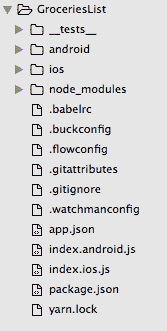

我们项目的入口文件是`index.js`。如果您想在模拟器上看到您的初始应用程序运行，可以再次使用 React Native 的 CLI：

```jsx
react-native run-ios
```

或者

```jsx
react-native run-android
```

假设您已经安装了 XCode 或 Android Studio 和 Android 模拟器，编译后您应该能够在模拟器上看到一个示例屏幕：

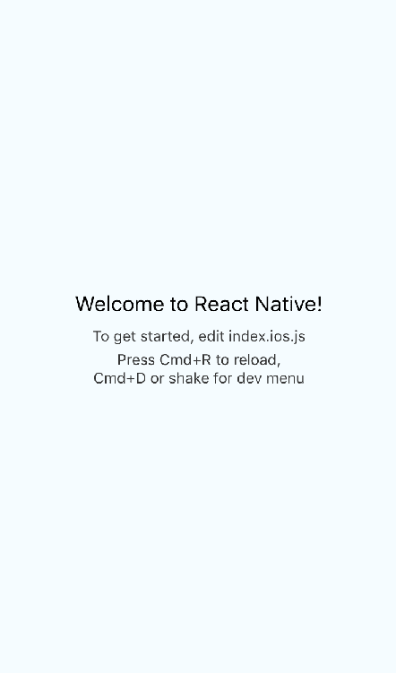

我们已经准备好设置开始实现我们的应用程序，但为了轻松调试并在模拟器中看到我们的更改，我们需要启用另外两个功能：远程 JS 调试和实时重新加载。

为了调试，我们将使用*React Native Debugger*，这是一个独立的应用程序，基于 React Native 的官方调试器，其中包括 React Inspector 和 Redux DevTools。它可以通过按照其 GitHub 存储库上的说明进行下载（[`github.com/jhen0409/react-native-debugger`](https://github.com/jhen0409/react-native-debugger)）。为了使这个调试器正常工作，我们需要在应用程序内部启用远程 JS 调试，方法是在模拟器中通过按下 iOS 上的*command* + *ctrl* + *Z*或 Android 上的*command* + *M*来打开 React Native 开发菜单。

如果一切顺利，我们应该看到以下菜单出现：

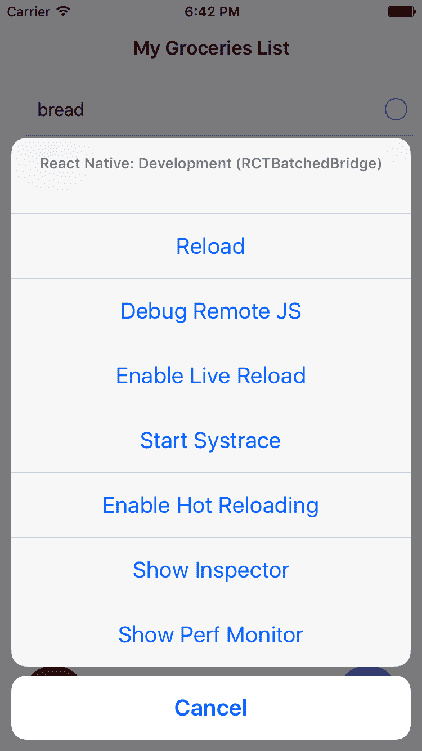

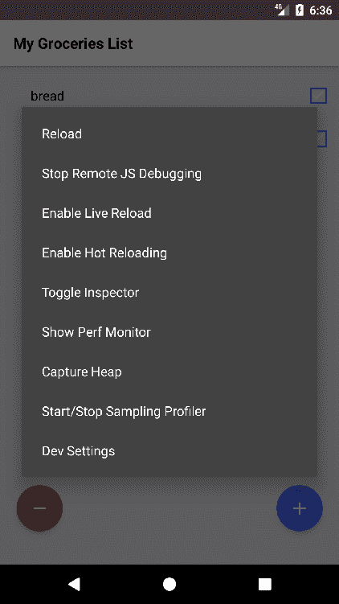

现在，我们将按下两个按钮：Debug Remote JS 和 Enable Live Reload。完成后，我们的开发环境已经准备好开始编写 React 代码。

# 设置文件夹结构

我们的应用程序只包括两个屏幕：购物清单和添加产品。由于这样一个简单应用的状态应该很容易管理，我们不会添加任何状态管理库（例如 Redux），因为我们将通过导航组件发送共享状态。这应该使我们的文件夹结构相当简单：

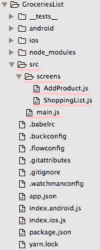

我们必须创建一个`src`文件夹，我们将在其中存储所有我们的 React 代码。自创建的文件`index.js`将包含以下代码：

```jsx
/*** index.js ***/

import { AppRegistry } from 'react-native';
import App from './src/main';
AppRegistry.registerComponent('GroceriesList', () => App);
```

简而言之，这些文件将导入我们应用程序的通用根代码，将其存储在名为`App`的变量中，然后通过`registerComponent`方法将这个变量传递给`AppRegistry`。`AppRegistry`是我们应该注册我们的根组件的组件。一旦我们这样做，React Native 将为我们的应用程序生成一个 JS 捆绑包，然后通过调用`AppRegistry.runApplication`在准备就绪时运行应用程序。

我们将写的大部分代码都将放在`src`文件夹中。对于这个应用程序，我们将在这个文件夹中创建我们的根组件（`main.js`），以及一个`screens`子文件夹，我们将在其中存储我们的两个屏幕（`ShoppingList`和`AddProduct`）。

现在让我们在继续编码之前安装应用程序的所有初始依赖项。在我们项目的根文件夹中，我们需要运行以下命令：

```jsx
npm install
```

运行该命令将为每个 React Native 项目安装所有基本依赖项。现在让我们安装这个特定应用程序将使用的三个软件包：

```jsx
npm install **native-base --save**
**npm install react-native-prompt-android --save**
**npm install react-navigation --save** 
```

在本章的后面，我们将解释每个包将被用于什么。

# 添加导航组件

大多数移动应用程序由多个屏幕组成，因此我们需要能够在这些屏幕之间“切换”。为了实现这一点，我们需要一个`Navigation`组件。React Native 自带了`Navigator`和`NavigatorIOS`组件，尽管 React 的维护者建议使用社区构建的外部导航解决方案`react-navigation`（[`github.com/react-community/react-navigation`](https://github.com/react-community/react-navigation)），这个解决方案非常高效，维护良好，并且功能丰富，所以我们将在我们的应用程序中使用它。

因为我们已经安装了导航模块（`react-navigation`），我们可以在`main.js`文件中设置和初始化我们的`Navigation`组件：

```jsx
/*** src/main.js ***/

import React from 'react';
import { StackNavigator } from 'react-navigation';
import ShoppingList from './screens/ShoppingList.js';
import AddProduct from './screens/AddProduct.js';

const Navigator = StackNavigator({
  ShoppingList: { screen: ShoppingList },
  AddProduct: { screen: AddProduct }
});

export default class App extends React.Component {
  constructor() {
    super();
  }

  render() {
    return <Navigator />;
  }
}
```

我们的根组件导入了应用程序中的两个屏幕（`ShoppingList`和`AddProduct`）并将它们传递给`StackNavigator`函数，该函数生成了`Navigator`组件。让我们深入了解一下`StackNavigator`的工作原理。

`StackNavigator`提供了一种让任何应用程序在屏幕之间进行过渡的方式，其中每个新屏幕都放置在堆栈的顶部。当我们请求导航到一个新屏幕时，`StackNavigator`将从右侧滑动新屏幕，并在 iOS 中的右上角放置一个`< Back`按钮，以返回到上一个屏幕，或者在 Android 中，新屏幕将从底部淡入，同时放置一个`<-`箭头以返回。使用相同的代码库，我们将在 iOS 和 Android 中触发熟悉的导航模式。`StackNavigator`也非常简单易用，因为我们只需要将我们应用程序中的屏幕作为哈希映射传递，其中键是我们想要为我们的屏幕设置的名称，值是导入的屏幕作为 React 组件。结果是一个`<Navigator/>`组件，我们可以渲染来初始化我们的应用程序。

# 使用 NativeBase 为我们的应用程序设置样式

React Native 包括一种强大的方式来使用 Flexbox 和类似 CSS 的 API 来为我们的组件和屏幕设置样式，但是对于这个应用程序，我们想要专注于功能方面，所以我们将使用一个包括基本样式组件的库，如按钮、列表、图标、菜单、表单等。它可以被视为 React Native 的 Twitter Bootstrap。

有几个流行的 UI 库，NativeBase 和 React Native 元素是最受欢迎和最受支持的两个。在这两者中，我们将选择 NativeBase，因为它对初学者来说稍微更清晰一些。

您可以在他们的网站上找到有关 NativeBase 如何工作的详细文档（[`docs.nativebase.io/`](https://docs.nativebase.io/)），但是在本章中，我们将介绍安装和使用其中一些组件的基础知识。我们之前通过`npm install`将`native-base`安装为项目的依赖项，但 NativeBase 包括一些对等依赖项，需要链接并包含在我们的 iOS 和 Android 本机文件夹中。幸运的是，React Native 已经有一个工具来查找这些依赖项并将它们链接起来；我们只需要运行：

```jsx
react-native link
```

在这一点上，我们的应用程序中已经完全可用来自 NativeBase 的所有 UI 组件。因此，我们可以开始构建我们的第一个屏幕。

# 构建 ShoppingList 屏幕

我们的第一个屏幕将包含我们需要购买的物品清单，因此它将包含每个我们需要购买的物品的一个列表项，包括一个按钮来标记该物品已购买。此外，我们需要一个按钮来导航到`AddProduct`屏幕，这将允许我们向我们的列表中添加产品。最后，我们将添加一个按钮来清除产品列表，以防我们想要开始一个新的购物清单：

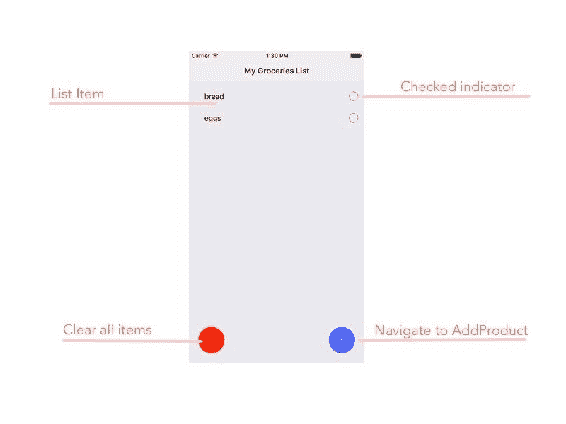

让我们从在`screens`文件夹内创建`ShoppingList.js`开始，并从`native-base`和`react-native`导入我们将需要的所有 UI 组件（我们将使用警告弹出窗口在清除所有项目之前警告用户）。我们将使用的主要 UI 组件是`Fab`（蓝色和红色的圆形按钮），`List`，`ListItem`，`CheckBox`，`Text`和`Icon`。为了支持我们的布局，我们将使用`Body`，`Container`，`Content`和`Right`，这些是我们其余组件的布局容器。

拥有所有这些组件，我们可以创建一个简单版本的`ShoppingList`组件：

```jsx
/*** ShoppingList.js ***/

import React from 'react';
import { Alert } from 'react-native';
import {
  Body,
  Container,
  Content,
  Right,
  Text,
  CheckBox,
  List,
  ListItem,
  Fab,
  Icon
} from 'native-base';

export default class ShoppingList extends React.Component {
  static navigationOptions = {
    title: 'My Groceries List'
  };
  /*** Render ***/
  render() {
    return (
      <Container>
        <Content>
          <List>
            <ListItem>
              <Body>
                <Text>'Name of the product'</Text>
              </Body>
              <Right>
                <CheckBox
                  checked={false}
                />
              </Right>
            </ListItem>
          </List>
        </Content>
        <Fab
          style={{ backgroundColor: '#5067FF' }}
          position="bottomRight"
        >
          <Icon name="add" />
        </Fab>
        <Fab
          style={{ backgroundColor: 'red' }}
          position="bottomLeft"
        >
          <Icon ios="ios-remove" android="md-remove" />
        </Fab>
      </Container>
    );
  }
}

```

这只是一个愚蠢的组件，静态显示我们将在此屏幕上使用的组件。需要注意的一些事情：

+   `navigationOptions`是一个静态属性，将被`<Navigator>`用来配置导航的行为。在我们的情况下，我们希望将“我的杂货清单”显示为此屏幕的标题。

+   为了使`native-base`发挥其作用，我们需要使用`<Container>`和`<Content>`来正确地形成布局。

+   `Fab`按钮放置在`<Content>`之外，因此它们可以浮动在左下角和右下角。

+   每个`ListItem`包含一个`<Body>`（主要文本）和一个`<Right>`（右对齐的图标）。

由于我们在最初的步骤中启用了实时重新加载，所以在保存新创建的文件后，我们应该看到应用程序重新加载。现在所有的 UI 元素都已经就位，但它们还没有功能，因为我们还没有添加任何状态。这应该是我们下一步要做的事情。

# 在我们的屏幕上添加状态

让我们在`ShoppingList`屏幕上添加一些初始状态，以用实际动态数据填充列表。我们将首先创建一个构造函数，并在那里设置初始状态：

```jsx
/*** ShoppingList.js ***/

...
constructor(props) {
  super(props);
  this.state = {
    products: [{ id: 1, name: 'bread' }, { id: 2, name: 'eggs' }]
  };
}
...
```

现在，我们可以在`<List>`（在`render`方法内部）中呈现该状态：

```jsx
/*** ShoppingList.js ***/

...
<List>
 {
   this.state.products.map(p => {
     return (
       <ListItem
         key={p.id}
       >
         <Body>
           <Text style={{ color: p.gotten ? '#bbb' : '#000' }}>
             {p.name}
           </Text>
         </Body>
         <Right>
           <CheckBox
             checked={p.gotten}
            />
         </Right>
       </ListItem>
     );
   }
  )}
</List>
...
```

我们现在依赖于组件状态中的产品列表，每个产品存储一个`id`、一个`name`和`gotten`属性。在修改此状态时，我们将自动重新呈现列表。

现在，是时候添加一些事件处理程序，这样我们就可以根据用户的命令修改状态或导航到`AddProduct`屏幕。

# 添加事件处理程序

所有与用户的交互都将通过 React Native 中的事件处理程序进行。根据控制器的不同，我们将有不同的可以触发的事件。最常见的事件是`onPress`，因为每次我们按下按钮、复选框或一般视图时都会触发它。让我们为屏幕中可以被按下的所有组件添加一些`onPress`处理程序：

```jsx
/*** ShoppingList.js ***/

...
render() {
 return (
   <Container>
     <Content>
       <List>
        {this.state.products.map(p => {
          return (
            <ListItem
              key={p.id}
              onPress={this._handleProductPress.bind(this, p)}
            >
              <Body>
                <Text style={{ color: p.gotten ? '#bbb' : '#000' }}>
                  {p.name}
                </Text>
              </Body>
              <Right>
                <CheckBox
                  checked={p.gotten}
                  onPress={this._handleProductPress.bind(this, p)}
                />
              </Right>
            </ListItem>
          );
       })}
       </List>
     </Content>
     <Fab
       style={{ backgroundColor: '#5067FF' }}
       position="bottomRight"
       onPress={this._handleAddProductPress.bind(this)}
     >
       <Icon name="add" />
     </Fab>
     <Fab
       style={{ backgroundColor: 'red' }}
       position="bottomLeft"
       onPress={this._handleClearPress.bind(this)}
     >
       <Icon ios="ios-remove" android="md-remove" />
     </Fab>
   </Container>
   );
 }
...
```

请注意，我们添加了三个`onPress`事件处理程序：

+   在`<ListItem>`上，当用户点击列表中的一个产品时做出反应

+   在`<CheckBox>`上，当用户点击列表中每个产品旁边的复选框图标时做出反应

+   在两个`<Fab>`按钮上

如果你了解 React，你可能明白为什么我们在所有的处理程序函数中使用`.bind`，但是，如果你有疑问，`.bind`将确保我们可以在处理程序的定义中使用`this`作为对组件本身的引用，而不是全局范围。这将允许我们在组件内调用方法，如`this.setState`或读取我们组件的属性，比如`this.props`和`this.state`。

对于用户点击特定产品的情况，我们还绑定产品本身，这样我们可以在事件处理程序中使用它们。

现在，让我们定义将作为事件处理程序的函数：

```jsx
/*** ShoppingList.js ***/

...
_handleProductPress(product) {
 this.state.products.forEach(p => {
   if (product.id === p.id) {
     p.gotten = !p.gotten;
   }
   return p;
 });

 this.setState({ products: this.state.products });
}
...
```

首先，让我们为用户点击购物清单中的产品或其复选框时创建一个处理程序。我们希望将产品标记为“已购得”（或者如果已经“已购得”，则取消标记），因此我们将使用正确地标记产品来更新状态。

接下来，我们将为蓝色的`<Fab>`按钮添加一个处理程序，以导航到`AddProduct`屏幕：

```jsx
/*** ShoppingList.js ***/

...
_handleAddProductPress() {
  this.props.navigation.navigate('AddProduct', {
    addProduct: product => {
      this.setState({
        products: this.state.products.concat(product)
      });
    },
    deleteProduct: product => {
      this.setState({
        products: this.state.products.filter(p => p.id !== product.id)
      });
    },
    productsInList: this.state.products
  });
}
...
```

这个处理程序使用了`this.props.navigation`，这是一个由`react-navigation`中的`Navigator`组件自动传递的属性。这个属性包含一个名为`navigate`的方法，接收应用程序应该导航到的屏幕的名称，以及一个可以作为全局状态使用的对象。在这个应用程序的情况下，我们将存储三个键：

+   `addProduct`：一个函数，允许`AddProduct`屏幕修改`ShoppingList`组件的状态，以反映向购物清单添加新产品的操作。

+   `deleteProduct`：一个函数，允许`AddProduct`屏幕修改`ShoppingList`组件的状态，以反映从购物清单中删除产品的操作。

+   `productsInList`：一个变量，保存着已经在购物清单上的产品列表，这样`AddProducts`屏幕就可以知道哪些产品已经添加到购物清单中，并将它们显示为“已添加”，防止重复添加物品。

在导航中处理状态应该被视为简单应用程序的一种解决方法，其中包含有限数量的屏幕。在更大的应用程序中（正如我们将在后面的章节中看到的），应该使用状态管理库，比如 Redux 或 MobX，来保持纯数据和用户界面处理之间的分离。

接下来，我们将为蓝色的`<Fab>`按钮添加最后一个处理程序，这样用户就可以清空购物清单中的所有项目，以便开始一个新的清单：

```jsx
/*** ShoppingList.js ***/

...
_handleClearPress() {
  Alert.alert('Clear all items?', null, [
    { text: 'Cancel' },
    { text: 'Ok', onPress: () => this.setState({ products: [] }) }
  ]);
}
...
```

我们正在使用`Alert`来在清空购物清单中的所有元素之前提示用户确认。一旦用户确认了这个操作，我们将清空组件状态中的`products`属性。

# 把所有东西放在一起

让我们看看当把所有方法放在一起时，整个组件的结构会是什么样子：

```jsx
/*** ShoppingList.js ***/

import React from 'react';
import { Alert } from 'react-native';
import { ... } from 'native-base';

export default class ShoppingList extends React.Component {
 static navigationOptions = {
   title: 'My Groceries List'
 };

 constructor(props) {
   ...
 }

 /*** User Actions Handlers ***/
 _handleProductPress(product) {
   ...
 }

 _handleAddProductPress() {
   ...
 }

 _handleClearPress() {
   ...
 }

 /*** Render ***/
 render() {
   ...
 }
}
```

React Native 组件的结构非常类似于普通的 React 组件。我们需要导入 React 本身，然后一些组件来构建我们的屏幕。我们还有几个事件处理程序（我们已经用下划线作为纯粹的约定），最后是一个`render`方法来使用标准的 JSX 显示我们的组件。

与 React web 应用程序唯一的区别是，我们使用 React Native UI 组件而不是 DOM 组件。

# 构建 AddProduct 屏幕

由于用户需要向购物清单中添加新产品，我们需要构建一个屏幕，可以提示用户输入要添加的产品的名称，并将其保存在手机的存储中以供以后使用。

# 使用 AsyncStorage

在构建 React Native 应用程序时，了解移动设备如何处理每个应用程序使用的内存是很重要的。我们的应用程序将与设备中的其他应用程序共享内存，因此，最终，我们的应用程序使用的内存将被另一个应用程序占用。因此，我们不能依赖将数据放在内存中以供以后使用。如果我们想确保数据在我们的应用程序的用户之间可用，我们需要将数据存储在设备的持久存储中。

React Native 提供了一个 API 来处理与移动设备中的持久存储的通信，这个 API 在 iOS 和 Android 上是相同的，因此我们可以舒适地编写跨平台代码。

API 的名称是`AsyncStorage`，我们可以在从 React Native 导入后使用它：

```jsx
import { AsyncStorage } from 'react-native';
```

我们只会使用`AsyncStorage`的两个方法：`getItem`和`setItem`。例如，我们将在我们的屏幕内创建一个本地函数来处理将产品添加到产品列表中的操作。

```jsx
/*** AddProduct ***/

...
async addNewProduct(name) {
  const newProductsList = this.state.allProducts.concat({
    name: name,
    id: Math.floor(Math.random() * 100000)
  });

  await AsyncStorage.setItem(
    '@allProducts',
    JSON.stringify(newProductsList)
  );

  this.setState({
    allProducts: newProductsList
  });
 }
...
```

这里有一些有趣的事情需要注意：

+   我们正在使用 ES7 的特性，比如`async`和`await`来处理异步调用，而不是使用 promises 或回调函数。理解 ES7 不在本书的范围之内，但建议学习和了解`async`和`await`的使用，因为这是一个非常强大的特性，在本书中我们将广泛使用它。

+   每当我们向`allProducts`添加一个产品时，我们还会调用`AsyncStorage.setItem`来永久存储产品在设备的存储中。这个操作确保用户添加的产品即使在操作系统清除我们的应用程序使用的内存时也是可用的。

+   我们需要向`setItem`（以及`getItem`）传递两个参数：一个键和一个值。它们都必须是字符串，所以如果我们想存储 JSON 格式的数据，我们需要使用`JSON.stringify`。

# 向我们的屏幕添加状态

正如我们刚刚看到的，我们将在组件状态中使用一个名为`allProducts`的属性，其中将包含用户可以添加到购物清单中的完整产品列表。

我们可以在组件的构造函数中初始化这个状态，以便在应用程序的第一次运行期间给用户一个概述，让他/她看到这个屏幕上的内容（这是许多现代应用程序用来引导用户的技巧，通过伪造一个“已使用”状态）：

```jsx
/*** AddProduct.js ***/

...
constructor(props) {
  super(props);
  this.state = {
    allProducts: [
      { id: 1, name: 'bread' },
      { id: 2, name: 'eggs' },
      { id: 3, name: 'paper towels' },
      { id: 4, name: 'milk' }
    ],
    productsInList: []
  };
}
...
```

除了`allProducts`，我们还将有一个`productsInList`数组，其中包含已经添加到当前购物清单中的所有产品。这将允许我们将产品标记为“已经在购物清单中”，防止用户尝试在列表中两次添加相同的产品。

这个构造函数对我们应用程序的第一次运行非常有用，但一旦用户添加了产品（因此将它们保存在持久存储中），我们希望这些产品显示出来，而不是这些测试数据。为了实现这个功能，我们应该从`AsyncStorage`中读取保存的产品，并将其设置为我们状态中的初始`allProducts`值。我们将在`componentWillMount`上执行这个操作。

```jsx
/*** AddProduct.js ***/

...
async componentWillMount() {
  const savedProducts = await AsyncStorage.getItem('@allProducts');
  if(savedProducts) {
    this.setState({
      allProducts: JSON.parse(savedProducts)
    }); 
  }

  this.setState({
    productsInList: this.props.navigation.state.params.productsInList
  });
}
...
```

一旦屏幕准备好被挂载，我们就会更新状态。首先，我们将通过从持久存储中读取它来更新`allProducts`值。然后，我们将根据“购物清单”屏幕在“导航”属性中设置的状态更新产品列表`productsInList`。

有了这个状态，我们可以构建我们的产品列表，这些产品可以添加到购物清单中：

```jsx
/*** AddProduct ***/

...
render(){
  <List>
    {this.state.allProducts.map(product => {
       const productIsInList = this.state.productsInList.find(
         p => p.id === product.id
       );
       return (
         <ListItem key={product.id}>
           <Body>
             <Text
               style={{
                color: productIsInList ? '#bbb' : '#000'
               }}
             >
               {product.name}
             </Text>
             {
               productIsInList &&
               <Text note>
                 {'Already in shopping list'}
               </Text>
             }
          </Body>
        </ListItem>
      );
    }
 )}
 </List>
}
...
```

在我们的`render`方法中，我们将使用`Array.map`函数来迭代和打印每个可能的产品，检查产品是否已经添加到当前购物清单中以显示一个提示，警告用户：“已经在购物清单中”。

当然，我们仍然需要为所有可能的用户操作添加更好的布局、按钮和事件处理程序。让我们开始改进我们的`render`方法，将所有功能放在适当的位置。

# 添加事件监听器

就像“购物清单”屏幕一样，我们希望用户能够与我们的`AddProduct`组件进行交互，因此我们将添加一些事件处理程序来响应一些用户操作。

我们的`render`方法应该看起来像这样：

```jsx
/*** AddProduct.js ***/

...
render() {
  return (
    <Container>
      <Content>
        <List>
          {this.state.allProducts.map(product => {
            const productIsInList = this.state.productsInList.
            find(p => p.id === product.id);
            return (
              <ListItem
                key={product.id}
                onPress={this._handleProductPress.bind
                (this, product)}
              >
                <Body>
                  <Text
                    style={{ color: productIsInList? '#bbb' : '#000' }}
                  >
                    {product.name}
                  </Text>
                 {
                   productIsInList &&
                   <Text note>
                     {'Already in shopping list'}
                   </Text>
                 }
                 </Body>
                 <Right>
                   <Icon
                     ios="ios-remove-circle"
                     android="md-remove-circle"
                     style={{ color: 'red' }}
                     onPress={this._handleRemovePress.bind(this, 
                     product )}
                   />
                 </Right>
               </ListItem>
             );
           })}
         </List>
       </Content>
     <Fab
       style={{ backgroundColor: '#5067FF' }}
       position="bottomRight"
       onPress={this._handleAddProductPress.bind(this)}
     >
       <Icon name="add" />
     </Fab>
   </Container>
   );
 }
...
```

在这个组件中，有三个事件处理程序响应三个按压事件：

+   在蓝色的`<Fab>`按钮上，负责向产品列表中添加新产品

+   在每个`<ListItem>`上，这将把产品添加到购物清单中

+   在每个`<ListItem>`内的删除图标上，以将此产品从可以添加到购物清单中的产品列表中移除

让我们在用户按下`<Fab>`按钮时开始向可用产品列表中添加新产品：

```jsx
/*** AddProduct.js ***/

...
_handleAddProductPress() {
  prompt(
    'Enter product name',
    '',
    [
      { text: 'Cancel', style: 'cancel' },
      { text: 'OK', onPress: this.addNewProduct.bind(this) }
    ],
    {
      type: 'plain-text'
    }
  );
}
...
```

我们在这里使用了`react-native-prompt-android`模块的`prompt`函数。尽管它的名称是这样，但它是一个跨平台的弹出式提示库，我们将使用它通过我们之前创建的`addNewProduct`函数来添加产品。在使用之前，我们需要导入`prompt`函数，如下所示：

```jsx
import prompt from 'react-native-prompt-android';
```

以下是输出：

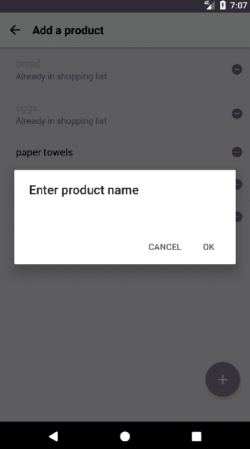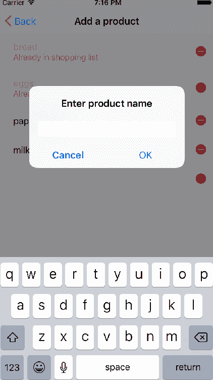

一旦用户输入产品名称并按下确定，产品将被添加到列表中，这样我们就可以转到下一个事件处理程序，当用户点击产品名称时将产品添加到购物清单中：

```jsx
/*** AddProduct.js ***/

...
_handleProductPress(product) {
  const productIndex = this.state.productsInList.findIndex(
    p => p.id === product.id
  );
  if (productIndex > -1) {
    this.setState({
      productsInList: this.state.productsInList.filter(
        p => p.id !== product.id
      )
    });
    this.props.navigation.state.params.deleteProduct(product);
  } else {
    this.setState({
      productsInList: this.state.productsInList.concat(product)
    });
    this.props.navigation.state.params.addProduct(product);
 }
}
...
```

此处理程序检查所选产品是否已在购物清单上。如果是，它将通过调用导航状态中的`deleteProduct`和通过调用`setState`从组件状态中删除它。否则，它将通过调用导航状态中的`addProduct`将产品添加到购物清单，并通过调用`setState`刷新本地状态。

最后，我们将为每个`<ListItems>`上的删除图标添加事件处理程序，以便用户可以从可用产品列表中删除产品：

```jsx
/*** AddProduct.js ***/

...
async _handleRemovePress(product) {
  this.setState({
    allProducts: this.state.allProducts.filter(p => p.id !== product.id)
  });
  await AsyncStorage.setItem(
    '@allProducts',
    JSON.stringify(
      this.state.allProducts.filter(p => p.id !== product.id)
    )
  );
}
...
```

我们需要从组件的本地状态和`AsyncStorage`中删除产品，这样在应用程序的后续运行中就不会显示。

# 将所有内容整合在一起

我们已经拥有构建`AddProduct`屏幕的所有组件，所以让我们来看一下这个组件的一般结构：

```jsx
import React from 'react';
import prompt from 'react-native-prompt-android';
import { AsyncStorage } from 'react-native';
import {
 ...
} from 'native-base';

export default class AddProduct extends React.Component {
  static navigationOptions = {
    title: 'Add a product'
  };

  constructor(props) {
   ...
  }

  async componentWillMount() {
    ...
  }

  async addNewProduct(name) {
    ...
  }

  /*** User Actions Handlers ***/
  _handleProductPress(product) {
   ...
  }

  _handleAddProductPress() {
    ...
  }

  async _handleRemovePress(product) {
    ...
  }

  /*** Render ***/
  render() {
    ....
  }
}
```

我们的结构与我们为`ShoppingList`构建的结构非常相似：构建初始状态的`navigatorOptions`构造函数，用户操作处理程序和`render`方法。在这种情况下，我们添加了一对异步方法，作为处理`AsyncStorage`的便捷方式。

# 安装和分发应用程序

在模拟器/仿真器上运行我们的应用程序是感受应用程序在移动设备上行为的非常可靠的方法。当在模拟器/仿真器中工作时，我们可以模拟触摸手势、网络连接不佳的环境，甚至内存问题。但最终，我们希望将应用程序部署到物理设备上，这样我们就可以进行更深入的测试。

有几种选项可以安装或分发使用 React Native 构建的应用程序，直接连接电缆是最简单的方法。Facebook 在 React Native 的网站上保持了一份更新的指南，介绍了如何实现在设备上的直接安装（[`facebook.github.io/react-native/docs/running-on-device.html`](https://facebook.github.io/react-native/docs/running-on-device.html)），但是当分发应用程序给其他开发人员、测试人员或指定用户时，还有其他选择。

# Testflight

Testflight（[`developer.apple.com/testflight/`](https://developer.apple.com/testflight/)）是一个很棒的工具，用于将应用程序分发给测试人员和开发人员，但它有一个很大的缺点——它只适用于 iOS。它非常容易设置和使用，因为它集成在 iTunes Connect 中，苹果认为它是在开发团队内分发应用程序的官方工具。此外，它是完全免费的，使用限制相当大：

+   最多 25 名团队成员进行测试

+   每个测试人员团队最多 30 台设备

+   最多 2,000 名团队外的外部测试人员（具有分组功能）

简而言之，Testflight 是在只针对 iOS 设备时选择的平台。

由于在本书中，我们希望专注于跨平台开发，我们将介绍其他分发我们的应用程序到 iOS 和 Android 设备的替代方案。

# Diawi

Diawi（[`diawi.com`](http://diawi.com)）是一个网站，开发人员可以在上面上传他们的`.ipa`和`.apk`文件（已编译的应用程序），并与任何人分享链接，因此该应用程序可以在连接到互联网的任何 iOS 或 Android 设备上下载和安装。这个过程很简单：

1.  在 XCode/Android studio 中构建`.ipa`（iOS）/`.apk`（Android）。

1.  将生成的`.ipa`/`.apk`文件拖放到 Diawi 的网站上。

1.  通过电子邮件或其他方式与测试人员列表共享 Diawi 创建的链接。

链接是私有的，可以为那些需要更高安全性的应用程序设置密码保护。主要缺点是测试设备的管理，因为一旦链接分发，Diawi 就失去了对它们的控制，因此开发人员无法知道哪些版本被下载和测试。如果手动管理测试人员列表是一个选择，Diawi 是 Testflight 的一个很好的替代方案。

# Installr

如果我们需要管理分发给哪些测试人员的版本以及他们是否已经开始测试应用程序，我们应该尝试使用 Installr（[`www.installrapp.com`](https://www.installrapp.com)），因为在功能上它与 Diawi 相当类似，但它还包括一个仪表板，用于控制用户是谁，哪些应用程序已经单独发送给他们，以及测试设备上应用程序的状态（未安装、已安装或已打开）。这个仪表板非常强大，当我们的要求之一是对测试人员、设备和构建有良好的可见性时，它绝对是一个重要的优势。

Installr 的缺点是其免费计划仅覆盖每次构建的三个测试设备，尽管他们提供了一个廉价的一次性付费方案，以防我们真的想增加那个数字。当我们需要可见性和跨平台分发时，这是一个非常合理的选择。

# 总结

在本章的过程中，我们学会了如何启动 React Native 项目，构建一个包括基本导航和处理多个用户交互的应用程序。我们看到了如何使用导航模块处理持久数据和基本状态，以便我们可以在项目中的屏幕之间进行过渡。

所有这些模式都可以用来构建许多简单的应用程序，但在下一章中，我们将深入探讨更复杂的导航模式以及如何通信和处理从互联网获取的外部数据，这将使我们能够为应用程序的增长进行结构化和准备。除此之外，我们将使用 JavaScript 库 MobX 进行状态管理，这将以一种非常简单和有效的方式使我们的领域数据可用于应用程序中的所有屏幕。
