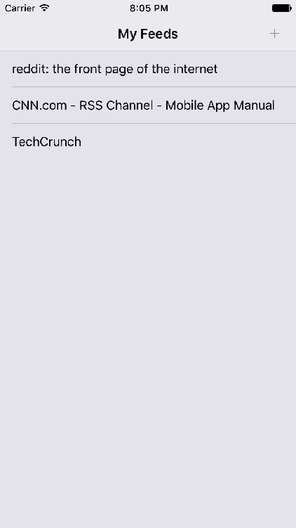
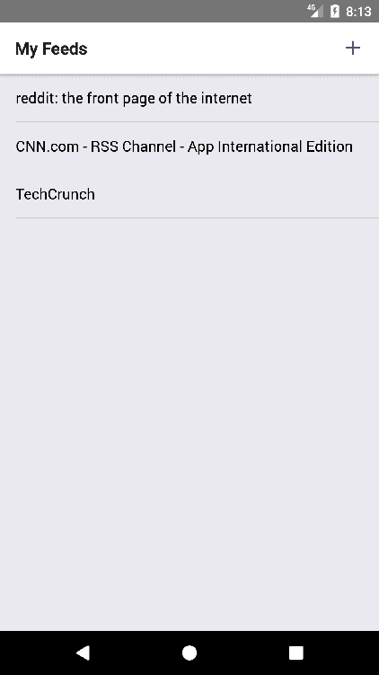
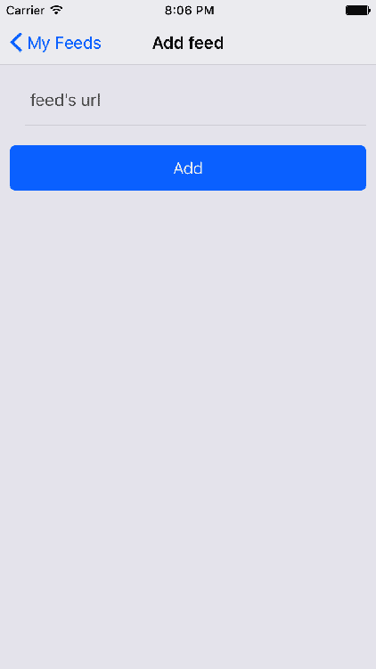
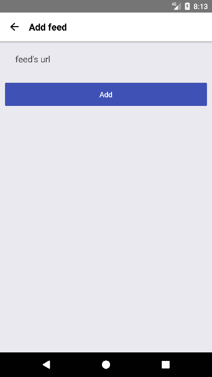
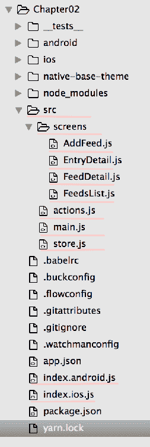

# 第二章：RSS 阅读器

在本章中，我们将创建一个应用程序，能够获取、处理和显示用户多个 RSS 订阅。RSS 是一种 Web 订阅，允许用户以标准化和计算机可读的格式访问在线内容的更新。它们通常用于新闻网站、新闻聚合器、论坛和博客，以表示更新的内容，并且非常适合移动世界，因为我们可以通过在一个应用程序中输入订阅的 URL 来获取来自不同博客或报纸的所有内容。

一个 RSS 订阅阅读器将作为一个示例，演示如何获取外部数据，存储它，并向用户显示它，但同时，它将给我们的状态树增加一些复杂性；我们需要存储和管理订阅、条目和帖子的列表。除此之外，我们将引入 MobX 作为一个库来管理所有这些状态模型，并根据用户的操作更新我们的视图。因此，我们将介绍行为和存储的概念，这在一些最流行的状态管理库中被广泛使用，比如 Redux 或 MobX。

与上一章一样，因为我们将在这个应用程序中需要的 UI 模式在两个平台上非常相似，我们将致力于在 iOS 和 Android 上共享 100%的代码。

# 概述

为了更好地理解我们的 RSS 阅读器，让我们看看完成后应用程序将会是什么样子。

iOS：



Android：



主屏幕将显示用户已添加的订阅列表。导航标题还会显示一个(+)按钮，用于向列表中添加新的订阅。当按下该按钮时，应用程序将导航到添加订阅屏幕。

iOS：



Android：



一旦添加了新的订阅，它将显示在主屏幕上，用户只需点击即可打开它。

iOS：


Android：


在这个阶段，应用程序将检索所选订阅的更新条目列表，并在列表上显示它。在导航标题中，一个垃圾桶图标将允许用户从应用程序中删除该订阅。如果用户对任何条目感兴趣，她可以点击它以显示该条目的完整内容。

iOS：


Android：


这个最后的屏幕基本上是一个 WebView，默认情况下在 URL 中打开的轻量级浏览器，其中包含所选条目的内容。用户将能够浏览子部分并完全与此屏幕中打开的网站进行交互，还可以通过在导航标题中点击返回箭头来返回到源的详细信息。

在本章中，我们将涵盖以下主题：

+   使用 MobX 进行状态管理

+   从 URL 获取外部数据

+   WebView

+   将基本链接模块与本地资源链接起来

+   添加图标

+   ActivityIndicator

# 设置文件夹结构

就像我们在第一章中所做的那样，我们需要通过 React Native 的 CLI 初始化一个新的 React Native 项目。这次，我们将把我们的项目命名为`RSSReader`：

```jsx
react-native init --version="0.49.3" RSSReader
```

对于这个应用程序，我们将需要总共四个屏幕：

+   `FeedList`：这是一个包含已添加到应用程序中的源标题的列表，按它们被添加的时间排序。

+   `AddFeed`：这是一个简单的表单，允许用户通过发送其 URL 来添加源。我们将在这里检索源的详细信息，最终将它们添加并保存在我们的应用程序中以供以后使用。

+   `FeedDetail`：这是一个包含所选源的最新条目（在挂载屏幕之前检索）的列表。

+   `EntryDetail`：这是一个 WebView，显示所选条目的内容。

除了屏幕之外，我们还将包括一个`actions.js`文件，其中包含修改应用程序状态的所有用户操作。虽然我们将在后面的部分中审查状态的管理，但重要的是要注意，除了这个`actions.js`文件之外，我们还需要一个`store.js`文件来包含状态结构和修改它的方法。

最后，正如在大多数 React Native 项目中一样，我们将需要一个`index.js`文件（已经由 React Native 的 CLI 创建）和一个`main.js`文件作为我们应用程序组件树的入口点。

所有这些文件将被组织在`src/`和`src/screens/`文件夹中，如下所示：



# 添加依赖项

对于这个项目，我们将使用几个 npm 模块来节省开发时间，并将重点放在 RSS 阅读器本身的功能方面，而不是处理自定义状态管理框架、自定义 UI 或数据处理。对于这些问题，我们将使用以下`package.json`文件：

```jsx
{ 
  "name":"rssReader",
  "version":"0.0.1",
  "private":true,
  "scripts":{ 
  "start":"node node_modules/react-native/local-cli/cli.js start",
  "test":"jest"
  },
  "dependencies":{ 
  "mobx":"³.1.9",
  "mobx-react":"⁴.1.8",
  "native-base":"².1.3",
  "react":"16.0.0-beta.5",
    "react-native": "0.49.3",
  "react-native-vector-icons":"⁴.1.1",
  "react-navigation":"¹.0.0-beta.9",
  "simple-xml2json":"¹.2.3"
  },
  "devDependencies":{ 
  "babel-jest":"20.0.0",
  "babel-plugin-transform-decorators-legacy":"¹.3.4",
  "babel-preset-react-native":"1.9.1",
  "babel-preset-react-native-stage-0":"¹.0.1",
  "jest":"20.0.0",
  "react-test-renderer":"16.0.0-alpha.6"
  },
  "jest":{ 
  "preset":"react-native"
  }
}
```

正如在这个文件中所看到的，我们将与标准的 React Native 模块一起使用以下 npm 模块：

+   `mobx`：这是我们将使用的状态管理库

+   `mobx-react`：这是 MobX 的官方 React 绑定

+   `native-base`：与上一章一样，我们将使用 NativeBase 的 UI 库

+   `react-native-vector-icons`：NativeBase 需要这个模块来显示图形图标

+   `react-navigation`：我们将再次使用 React Native 的社区导航库

+   `simple-xml2json`：一个轻量级库，用于将 XML（RSS 订阅的标准格式）转换为 JSON，以便在我们的代码中轻松管理 RSS 数据

有了这个`package.json`文件，我们可以在项目的根文件夹中运行以下命令来完成安装：

```jsx
npm install
```

一旦 npm 完成安装所有依赖项，我们就可以在 iOS 模拟器中启动我们的应用程序：

```jsx
react-native run-ios
```

或者在 Android 模拟器中：

```jsx
react-native run-android
```

# 使用矢量图标

对于这个应用程序，我们将使用两个图标：一个加号用于添加订阅，一个垃圾桶用于删除它们。React Native 默认不包括要使用的图标列表，因此我们需要添加一个。在我们的情况下，由于我们正在使用`native-base`作为我们的 UI 库，使用`react-native-vector-icons`非常方便，因为它在`native-base`中受到原生支持，但需要一个额外的配置步骤：

```jsx
react-native link
```

一些库使用额外的原生功能，这些功能在 React Native 中不存在。在`react-native-vector-icons`的情况下，我们需要包含存储在库中的一些矢量图标，可以在原生中访问。对于这些类型的任务，React Native 包括`react-native link`，这是一个脚本，可以自动链接提供的库，准备所有原生代码和资源，这些资源在我们的应用程序中需要访问此库。许多库将需要这一额外步骤，但由于 React Native 的 CLI，这是一个非常简单的步骤，过去需要在项目之间移动文件并处理配置选项。

# 使用 MobX 管理我们的状态

MobX 是一个库，通过透明地应用函数式响应式编程，使状态管理变得简单和可扩展。MobX 背后的哲学非常简单：*任何可以从应用程序状态派生出来的东西，都应该自动派生。*这个哲学适用于 UI、数据序列化和服务器通信。

在其网站[`mobx.js.org/,`](https://mobx.js.org/)上可以找到大量关于使用 MobX 的文档和示例，尽管在本节中我们将对其进行简要介绍，以便在本章中充分理解我们应用的代码。

# 商店

MobX 使用“observable”属性的概念。我们应该声明一个包含我们一般应用状态的对象，它将保存和声明这些 observable 属性。当我们修改其中一个属性时，MobX 会自动更新所有订阅的观察者。这是 MobX 背后的基本原则，让我们看一个示例代码：

```jsx
/*** src/store.js ***/

import {observable} from 'mobx';

class Store {
 @observable feeds;

 ...

 constructor() {
   this.feeds = [];
 }

 addFeed(url, feed) {
   this.feeds.push({ 
     url, 
     entry: feed.entry,
     title: feed.title,
     updated: feed.updated
   });
   this._persistFeeds();
 }

 ...

}

const store = new Store()
export default store
```

我们有一个被标记为`@observable`的属性`feeds`，这意味着任何组件都可以订阅它，并在值发生变化时得到通知。这个属性在类构造函数中被初始化为空数组。

最后，我们还创建了`addFeed`方法，它将新的订阅推送到`feeds`属性中，因此将自动触发所有观察者的更新。为了更好地理解 MobX 观察者，让我们看一个观察订阅列表的示例组件：

```jsx
import React from 'react';
import { Container, Content, List, ListItem, Text } from 'native-base';
import { observer } from 'mobx-react/native';

@observer
export default class FeedsList extends React.Component {

 render() {
  const { feeds } = this.props.screenProps.store;
  return (
    <Container>
      <Content>
        <List>
          {feeds &&
            feeds.map((f, i) => (
              <ListItem key={i}>
                <Text>{f.title}</Text>
              </ListItem>
            ))}
        </List>
      </Content>
    </Container>
  );
 }
}

```

我们注意到的第一件事是需要使用`@observer`装饰器标记我们的组件，以确保当我们商店中的任何`@observable`属性发生变化时它会被更新。

默认情况下，React Native 的 Babel 配置不支持`@<decorator>`语法。为了使其工作，我们需要修改我们项目根目录中的`.babelrc`文件，并将`transform-decorator-legacy`添加为插件。

另一个需要注意的事情是需要将存储作为属性传递给组件。在这种情况下，由于我们使用`react-navigation`，我们将在`screenProps`中传递它，这是在`react-navigation`中在`<Navigator>`和其子屏幕之间共享属性的标准方式。

MobX 还有许多其他功能，但我们将把这些留给更复杂的应用程序，因为本章的一个目标是展示在构建小型应用程序时简单状态管理可以是多么简单。

# 设置商店

在了解了 MobX 的工作原理之后，我们准备创建我们的商店：

```jsx
/*** src/store.js ** */

import { observable } from 'mobx';
import { AsyncStorage } from 'react-native';

class Store {
  @observable feeds;
  @observable selectedFeed;
  @observable selectedEntry;

  constructor() {
    AsyncStorage.getItem('@feeds').then(sFeeds => {
      this.feeds = JSON.parse(sFeeds) || [];
    });
  }

  _persistFeeds() {
    AsyncStorage.setItem('@feeds', JSON.stringify(this.feeds));
  }

  addFeed(url, feed) {
    this.feeds.push({
      url,
      entry: feed.entry,
      title: feed.title,
      updated: feed.updated,
    });
    this._persistFeeds();
  }

  removeFeed(url) {
    this.feeds = this.feeds.filter(f => f.url !== url);
    this._persistFeeds();
  }

  selectFeed(feed) {
    this.selectedFeed = feed;
  }

  selectEntry(entry) {
    this.selectedEntry = entry;
  }
}

const store = new Store();
export default store;
```

我们已经在本章的 MobX 部分看到了该文件的基本结构。现在，我们将添加一些方法来修改订阅列表，并在用户在我们应用的订阅/条目列表中点击它们时选择特定的订阅/条目。

我们还利用`AsyncStorage`来在`addFeed`或`removeFeed`修改时持久化订阅列表。

# 定义动作

在我们的应用程序中将有两种类型的动作：影响特定组件状态的动作和影响一般应用程序状态的动作。我们希望将后者存储在组件代码之外的某个地方，这样我们可以重用并轻松维护它们。在 MobX（以及 Redux 或 Flux）应用程序中的一种常见做法是创建一个名为`actions.js`的文件，我们将在其中存储修改应用程序业务逻辑的所有动作。

在我们的 RSS 阅读器中，业务逻辑围绕订阅源和条目展开，因此我们将在此文件中捕获处理这些模型的所有逻辑。

```jsx
/*** actions.js ** */

import store from './store';
import xml2json from 'simple-xml2json';

export async function fetchFeed(url) {
  const response = await fetch(url);
  const xml = await response.text();
  const json = xml2json.parser(xml);
  return {
    entry:
      (json.feed && json.feed.entry) || (json.rss && 
      json.rss.channel.item),
    title:
      (json.feed && json.feed.title) || (json.rss && 
      json.rss.channel.title),
    updated: (json.feed && json.feed.updated) || null,
  };
}

export function selectFeed(feed) {
  store.selectFeed(feed);
}

export function selectEntry(entry) {
  store.selectEntry(entry);
}

export function addFeed(url, feed) {
  store.addFeed(url, feed);
}

export function removeFeed(url) {
  store.removeFeed(url);
}
```

由于操作修改了应用程序的一般状态，它们将需要访问存储。让我们分别看看每个动作：

+   `fetchFeed`：当用户想要将订阅源添加到 RSS 阅读器时，他将需要传递 URL，以便应用程序可以下载该订阅源的详细信息（订阅源标题、最新条目列表以及上次更新时间）。此动作负责从提供的 URL 检索此数据（格式化为 XML 文档），并将该数据转换为应用程序的标准格式的 JSON 对象。从提供的 URL 获取数据将由 React Native 中的内置库`fetch`执行，该库用于向任何 URL 发出 HTTP 请求。由于`fetch`支持 promises，我们将使用 async/await 来处理异步行为并简化我们的代码。一旦检索到包含订阅源数据的 XML 文档，我们将使用`simple-xml2json`将该数据转换为 JSON 对象，这是一种非常轻量级的库，用于这种需求。最后，该动作返回一个仅包含我们在应用程序中真正需要的数据（标题、条目和最后更新时间）的 JSON 对象。

+   `selectFeed`：一旦用户向阅读器添加了一个或多个订阅源，她应该能够选择其中一个以获取该订阅源的最新条目列表。此动作只是将特定订阅源的详细信息保存在存储中，以便任何对显示与该订阅源相关的数据感兴趣的屏幕（即`FeedDetail`屏幕）可以使用它。

+   `selectEntry`：类似于`selectFeed`，用户应该能够选择订阅源中的条目之一，以获取该特定条目的详细信息。在这种情况下，显示该数据的屏幕将是`EntryDetail`，我们将在后面的部分中看到。

+   `addFeed`：这个动作需要两个参数：订阅的 URL 和订阅的详细信息。这些参数将用于将订阅存储在保存的订阅列表中，以便在我们的应用中全局可用。在这个应用的情况下，我们决定使用 URL 作为存储订阅详细信息的键，因为它是任何 RSS 订阅的唯一属性。

+   `removeFeed`：用户还可以决定他们不再想在 RSS 阅读器中看到特定的订阅，因此我们需要一个动作来从订阅列表中移除该订阅。这个动作只需要传递订阅的 URL 作为参数，因为我们使用 URL 作为 ID 来唯一标识订阅。

# React Native 中的网络操作

大多数移动应用需要从外部 URL 获取和更新数据。在 React Native 中可以使用几个 npm 模块来通信和下载远程资源，比如 Axios 或 SuperAgent。如果你熟悉特定的 HTTP 库，你可以在 React Native 项目中使用它（只要不依赖于任何特定于浏览器的 API），尽管一个安全和熟练的选择是使用`Fetch`，这是 React Native 中内置的网络库。

`Fetch`非常类似于`XMLHttpRequest`，因此对于任何需要从浏览器执行 AJAX 请求的 web 开发人员来说都会感到熟悉。除此之外，`Fetch`支持 promises 和 ES2017 的 async/await 语法。

`Fetch` API 的完整文档可以在 Mozilla 开发者网络网站上找到[`developer.mozilla.org/en-US/docs/Web/API/Fetch_API`](https://developer.mozilla.org/en-US/docs/Web/API/Fetch_API)。

默认情况下，iOS 将阻止任何未使用 SSL 加密的请求。如果您需要从明文 URL（以`http`开头而不是`https`）获取数据，您首先需要添加一个**App Transport Security**（**ATS**）异常。如果您事先知道需要访问哪些域名，为这些域名添加异常更安全；如果域名直到运行时才知道，您可以完全禁用 ATS。然而，请注意，从 2017 年 1 月起，苹果的 App Store 审核将要求合理的理由来禁用 ATS。更多信息请参阅苹果的文档。

# 创建我们应用的入口点

所有的 React Native 应用都有一个入口文件：`index.js`，我们将把组件树的根委托给我们的`src/main.js`文件：

```jsx
/*** index.js ***/

import { AppRegistry } from 'react-native';
import App from './src/main';
AppRegistry.registerComponent('rssReader', () => App);
```

我们还将在操作系统中注册我们的应用。

现在，让我们看一下 `src/main.js` 文件，了解我们将如何设置导航并启动我们的组件树：

```jsx
/** * src/main.js ***/

import React from 'react';
import { StackNavigator } from 'react-navigation';

import FeedsList from './screens/FeedsList.js';
import FeedDetail from './screens/FeedDetail.js';
import EntryDetail from './screens/EntryDetail.js';
import AddFeed from './screens/AddFeed.js';

import store from './store';

const Navigator = StackNavigator({
  FeedsList: { screen: FeedsList },
  FeedDetail: { screen: FeedDetail },
  EntryDetail: { screen: EntryDetail },
  AddFeed: { screen: AddFeed },
});

export default class App extends React.Component {
  constructor() {
    super();
  }

  render() {
    return <Navigator screenProps={{ store }} />;
  }
}
```

我们将使用 `react-navigation` 作为我们的导航库，`StackNavigator` 作为我们的导航模式。将每个屏幕添加到 `StackNavigator` 函数中以生成我们的 `<Navigator>`。所有这些都与我们在第一章中使用的导航模式非常相似，但我们对其进行了改进：我们将 `store` 作为 `<Navigator>` 的 `screenProps` 属性传递，而不是直接传递属性和方法来修改我们应用程序的状态。这简化和清理了代码库，并且正如我们将在后面的部分中看到的那样，它将使我们摆脱每次状态更改时通知导航的负担。所有这些改进都是由于 MobX 而免费获得的。

# 构建 FeedsList 屏幕

feeds 列表将作为此应用的主屏幕使用，因此让我们专注于构建 feeds 标题列表：

```jsx
/** * src/screens/FeedsList.js ***/

import React from 'react';
import { Container, Content, List, ListItem, Text } from 'native-base';

export default class FeedsList extends React.Component {
  render() {
    const { feeds } = this.props.screenProps.store;
    return (
      <Container>
        <Content>
          <List>
            {feeds &&
              feeds.map((f, i) => (
              <ListItem key={i}>
              <Text>{f.title}</Text>
              </ListItem>
             ))
          </List>
        </Content>
      </Container>
    );
  }
}
```

该组件期望从 `this.props.screenProps.store` 接收 feeds 列表，然后遍历该列表构建一个 NativeBase `<List>`，显示存储中每个 feed 的标题。

让我们现在介绍一些 MobX 的魔法。由于我们希望当 feeds 列表发生变化时（添加或删除 feed 时）我们的组件能够重新渲染，因此我们必须使用 `@observer` 装饰器标记我们的组件。MobX 将自动在任何更新时强制组件重新渲染。现在让我们看看如何将装饰器添加到我们的组件中：

```jsx
...

@observer
export default class FeedsList extends React.Component {

...
```

就是这样。现在，我们的组件将在存储更改时收到通知，并将触发重新渲染。

# 添加事件处理程序

让我们添加一个事件处理程序，当用户点击 feed 标题时，将在新屏幕（`FeedDetail`）上显示该 feed 的条目列表：

```jsx
/** * src/screens/FeedsList.js ***/

...

@observer
export default class FeedsList extends React.Component {
  _handleFeedPress(feed) {
    selectFeed(feed);
    this.props.navigation.navigate('FeedDetail', { feedUrl: feed.url });
  }

  render() {
    const { feeds } = this.props.screenProps.store;
    return (
      <Container>
        <Content>
          <List>
            {feeds &&
              feeds.map((f, i) => (
              <ListItem key={i} onPress=
              {this._handleFeedPress.bind(this, f)}>
              <Text>{f.title}</Text>
              </ListItem>
             ))
            }
          </List>
        </Content>
      </Container>
    );
  }
}

...
```

为此，我们在组件中添加了一个名为 `_handleFeedPress` 的方法，该方法将接收 feed 的详细信息作为参数。当调用此方法时，它将运行 `selectFeed` 动作，并将传递 feed 的 URL 作为属性触发导航事件，以便下一个屏幕（`FeedDetail`）可以根据该 URL 包含一个删除 feed 的按钮。

最后，我们将添加 `navigationOptions`，包括导航标题和添加 feed 的按钮：

```jsx
/** * src/screens/FeedsList.js ***/

...

@observer
export default class FeedsList extends React.Component {
  static navigationOptions = props => ({
    title: 'My Feeds',
    headerRight: (
      <Button transparent onPress={() => 
      props.navigation.navigate('AddFeed')}>
        <Icon name="add" />
      </Button>
    ),
  });

...

}
```

按下`AddFeed`按钮将导航到`AddFeed`屏幕。通过将它作为名为`headerRight`的属性传递给`navigationOptions`，该按钮将显示在导航标题的右侧。

让我们看看这个组件是如何一起的：

```jsx
/*** src/screens/FeedsList.js ** */

import React from 'react';
import {
  Container,
  Content,
  List,
  ListItem,
  Text,
  Icon,
  Button,
} from 'native-base';
import { observer } from 'mobx-react/native';
import { selectFeed, removeFeed } from '../actions';

@observer
export default class FeedsList extends React.Component {
  static navigationOptions = props => ({
    title: 'My Feeds',
    headerRight: (
      <Button transparent onPress={() => 
       props.navigation.navigate('AddFeed')}>
        <Icon name="add" />
      </Button>
    ),
  });

  _handleFeedPress(feed) {
    selectFeed(feed);
    this.props.navigation.navigate('FeedDetail', { feedUrl: feed.url });
  }

  render() {
    const { feeds } = this.props.screenProps.store;
    return (
      <Container>
        <Content>
          <List>
            {feeds &&
              feeds.map((f, i) => (
              <ListItem key={i} onPress=
              {this._handleFeedPress.bind(this, f)}>
              <Text>{f.title}</Text>
              </ListItem>
             ))
          </List>
        </Content>
      </Container>
    );
  }
}
```

现在我们的 feeds 列表功能完全可用，让我们允许用户通过`AddFeed`屏幕添加一些 feeds。

# 构建 AddFeed 屏幕

该屏幕包括一个基本表单，包括一个用于从 feed 获取 URL 的`<Input>`和一个用于从提供的 URL 检索 feed 信息以后将 feed 的详细信息存储在我们的存储中的`<Button>`。

我们需要导入两个操作（`addFeed`和`fetchFeed`），这两个操作将在按下`Add`按钮时被调用：

```jsx
/*** src/screens/AddFeed.js ** */

import React from 'react';
import {
  Container,
  Content,
  Form,
  Item,
  Input,
  Button,
  Text,
} from 'native-base';
import { addFeed, fetchFeed } from '../actions';
import { Alert, ActivityIndicator } from 'react-native';

export default class AddFeed extends React.Component {
  static navigationOptions = {
    title: 'Add feed',
  };

  constructor(props) {
    super(props);
    this.state = {
      url: '',
      loading: false,
    };
  }

  _handleAddPress() {
    if (this.state.url.length > 0) {
      this.setState({ loading: true });
      fetchFeed(this.state.url)
        .then(feed => {
          addFeed(this.state.url, feed);
          this.setState({ loading: false });
          this.props.navigation.goBack();
        })
        .catch(() => {
          Alert.alert("Couldn't find any rss feed on that url");
          this.setState({ loading: false });
        });
    }
  }

  render() {
    return (
      <Container style={{ padding: 10 }}>
        <Content>
          <Form>
            <Item>
              <Input
                autoCapitalize="none"
                autoCorrect={false}
                placeholder="feed's url"
                onChangeText={url => this.setState({ url })}
              />
            </Item>
            <Button
              block
              style={{ marginTop: 20 }}
              onPress={this._handleAddPress.bind(this)}
            >
              {this.state.loading && (
                <ActivityIndicator color="white" style={{ margin: 10 }}  
                />
              )}
              <Text>Add</Text>
            </Button>
          </Form>
        </Content>
      </Container>
    );
  }
}
```

这个组件中大部分功能都在`_handleAddPress`中，因为它是处理程序，一旦按下`Add`按钮就会被触发。这个处理程序负责四个任务：

+   检查是否存在 URL 以检索数据

+   从提供的 URL 检索 feed 数据（通过`fetchFeed`操作）

+   将数据保存到应用程序状态中（通过`addFeed`操作）

+   在获取或保存数据时，向用户发出警告。

需要注意的一件重要的事情是`fetchFeed`操作的使用方式。由于它是用`async`语法声明的，我们可以将它用作一个 promise，并将它附加到其监听器的结果上，用于`then`和`catch`。

# ActivityIndicator

在每次应用程序需要等待 HTTP 请求的响应时显示一个旋转器是一个很好的做法。iOS 和 Android 都有标准的活动指示器来显示这种行为，两者都可以通过 React Native 模块中的`<ActivityIndicator>`组件获得。

显示这个指示器的最简单方法是在组件状态中保持一个`loading`标志。由于这个标志只被我们的组件用来显示这个`<ActivityIndicator>`，所以把它放在组件的状态中而不是移动到通用的应用程序状态中是有意义的。然后，它可以在`render`函数中使用：

```jsx
{ this.state.loading && <ActivityIndicator color='white' style={{margin: 10}}/>}
```

这种语法在 React 应用程序中非常常见，用于根据标志或简单条件显示或隐藏组件。它利用了 JavaScript 评估`&&`操作的方式：检查第一个操作数的真实性，如果为真，则返回第二个操作数；否则，返回第一个操作数。这种语法在一种非常常见的指令上节省了代码行数，因此它将在本书中广泛使用。

# 构建`FeedDetail`屏幕

让我们回顾一下当用户在`FeedsList`屏幕上点击一个 feed 时发生了什么：

```jsx
_handleFeedPress(feed) {
  selectFeed(feed);
  this.props.navigation.navigate('FeedDetail', { feedUrl: feed.url });
}
```

在`navigation`属性上调用了`navigate`方法，以打开`FeedDetail`屏幕。作为参数，`_handleFeedPress`函数传递了`feedUrl`，这样它就可以检索 feed 数据并显示给用户。这是一个必要的步骤，因为我们在存储中为所选的 feed 拥有的数据可能已经过时。因此，在向用户显示之前，最好重新获取数据，以确保它是 100%更新的。我们也可以进行更复杂的检查，而不是每次用户选择 feed 时都检索整个 feed，但为了保持这个应用程序的简单性，我们将坚持采用给定的方法。

让我们从`componentWillMount`方法中检索更新后的条目列表开始：

```jsx
/*** src/screens/FeedDetail.js ***/

import React from 'react';
import { observer } from 'mobx-react/native';
import { fetchFeed} from '../actions';

@observer
export default class FeedDetail extends React.Component {
 ... 

 constructor (props) {
  super(props);
  this.state = {
    loading: false,
    entry: null
  }
 }

 componentWillMount() {
  this.setState({ loading: true });
  fetchFeed(this.props.screenProps.store.selectedFeed.url)
   .then((feed) => {
    this.setState({ loading: false });
    this.setState({ entry: feed.entry});
  });
 }

 ...

}
```

我们将把我们的组件标记为`@observer`，这样它就会在所选的 feed 改变时得到更新。然后，我们需要一个具有两个属性的状态：

+   `loading`：这是一个标志，用来向用户表示我们正在获取更新的数据

+   `entry`：这是要显示给用户的条目列表

然后，在组件挂载之前，我们想要开始检索更新后的条目。为此，我们可以重用在`AddFeed`屏幕中使用的`fetchFeed`操作。当接收到 feed 数据时，组件状态中的`loading`标志被设置为`false`，这将隐藏`<ActivityIndicator>`，并且条目列表将被设置在组件状态中。现在我们有了一个条目列表，让我们看看我们将如何向用户显示它：

```jsx
/** * src/screens/FeedDetail.js ** */

import React from 'react';
import {
  Container,
  Content,
  List,
  ListItem,
  Text,
  Button,
  Icon,
  Spinner,
} from 'native-base';
import { observer } from 'mobx-react/native';
import { fetchFeed } from '../actions';
import { ActivityIndicator } from 'react-native';

@observer
export default class FeedDetail extends React.Component {

  ...

  render() {
    const { entry } = this.state;

    return (
      <Container>
        <Content>
          {this.state.loading && <ActivityIndicator style=
          {{ margin: 20 }} />}
          <List>
            {entry &&
              entry.map((e, i) => (
                <ListItem key={i}>
                  <Text>{e.title}</Text>
                </ListItem>
              ))}
          </List>
        </Content>
      </Container>
    );
  }
}
```

`&&` 语法再次被用来显示`<ActivityIndicator>`，直到数据被检索出来。一旦数据可用并且正确存储在组件状态的`entry`属性中，我们将渲染包含所选字段条目标题的列表项。

现在，我们将添加一个事件处理程序，当用户点击条目标题时将被触发：

```jsx
/** * src/screens/FeedDetail.js ** */

import React from 'react';
import {
  Container,
  Content,
  List,
  ListItem,
  Text,
  Button,
  Icon,
  Spinner,
} from 'native-base';
import { observer } from 'mobx-react/native';
import { selectEntry, fetchFeed } from '../actions';
import { ActivityIndicator } from 'react-native';

@observer
export default class FeedDetail extends React.Component {

  ...

  _handleEntryPress(entry) {
    selectEntry(entry);
    this.props.navigation.navigate('EntryDetail');
  }

  render() {
    const { entry } = this.state;

    return (
      <Container>
        <Content>
          {this.state.loading && <ActivityIndicator style=
          {{ margin: 20 }} />}
          <List>
            {entry &&
              entry.map((e, i) => (
                <ListItem
                  key={i}
                  onPress={this._handleEntryPress.bind(this, e)}
                >
                  <Text>{e.title}</Text>
                </ListItem>
              ))}
          </List>
        </Content>
      </Container>
    );
  }
}
```

这个处理程序被命名为`_handleEntryPress`，负责两个任务：

+   将点击的条目标记为已选

+   导航到`EntryDetail`

最后，让我们通过`navigationOptions`方法添加导航标题：

```jsx
/** * src/screens/FeedDetail.js ** */

...

@observer
export default class FeedDetail extends React.Component {
  static navigationOptions = props => ({
    title: props.screenProps.store.selectedFeed.title,
    headerRight: (
      <Button
        transparent
        onPress={() => {
          removeFeed(props.navigation.state.params.feedUrl);
          props.navigation.goBack();
        }}
      >
        <Icon name="trash" />
      </Button>
    ),
  });

  ...

}
```

除了为这个屏幕添加标题（feed 的标题）之外，我们还希望为用户的导航栏添加一个图标，以便用户能够从应用程序中存储的 feed 列表中删除该 feed。我们将使用`native-base`的`trash`图标来实现这个目的。当按下时，将调用`removeFeed`动作，传递当前 feed URL，以便可以从存储中删除，然后将强制导航返回到`FeedList`屏幕。

让我们来看看完成的组件：

```jsx
/*** src/screens/FeedDetail.js ** */

import React from 'react';
import {
  Container,
  Content,
  List,
  ListItem,
  Text,
  Button,
  Icon,
  Spinner,
} from 'native-base';
import { observer } from 'mobx-react/native';
import { selectEntry, fetchFeed, removeFeed } from '../actions';
import { ActivityIndicator } from 'react-native';

@observer
export default class FeedDetail extends React.Component {
  static navigationOptions = props => ({
    title: props.screenProps.store.selectedFeed.title,
    headerRight: (
      <Button
        transparent
        onPress={() => {
          removeFeed(props.navigation.state.params.feedUrl);
          props.navigation.goBack();
        }}
      >
        <Icon name="trash" />
      </Button>
    ),
  });

  constructor(props) {
    super(props);
    this.state = {
      loading: false,
      entry: null,
    };
  }

  componentWillMount() {
    this.setState({ loading: true });
    fetchFeed(this.props.screenProps.store.selectedFeed.url).
    then(feed => {
      this.setState({ loading: false });
      this.setState({ entry: feed.entry });
    });
  }

  _handleEntryPress(entry) {
    selectEntry(entry);
    this.props.navigation.navigate('EntryDetail');
  }

  render() {
    const { entry } = this.state;

    return (
      <Container>
        <Content>
          {this.state.loading && <ActivityIndicator style=
          {{ margin: 20 }} />}
          <List>
            {entry &&
              entry.map((e, i) => (
              <ListItem key={i} onPress=
              {this._handleEntryPress.bind(this, e)}>
              <Text>{e.title}</Text>
          </ListItem>
          ))
          </List>
        </Content>
      </Container>
    );
  }
}
```

现在，让我们继续到最后一个屏幕：`EntryDetail`。

# 构建 EntryDetail 屏幕

`EntryDetail`屏幕只是一个 WebView：一个能够在原生视图中呈现 web 内容的组件。您可以将 WebView 视为一个轻量级的 web 浏览器，显示提供的 URL 的网站内容：

```jsx
import React from 'react';
import { Container, Content } from 'native-base';
import { WebView } from 'react-native';

export default class EntryDetail extends React.Component {
  render() {
    const entry = this.props.screenProps.store.selectedEntry;
    return <WebView source={{ uri: entry.link.href || entry.link }} />;
  }
}
```

这个组件中的`render`方法只是返回一个新的`WebView`组件，加载存储中所选条目的 URL。就像我们在前面的部分中对 feed 的数据所做的那样，我们需要从`this.props.screenProps.store`中检索`selectedEntry`数据。URL 可以以两种不同的方式存储，这取决于 feed 的 RSS 版本：在链接属性中或者在`link.href`中再深一层。

# 总结

当应用程序的复杂性开始增长时，每个应用程序都需要一个状态管理库。作为一个经验法则，当应用程序由四个以上的屏幕组成并且它们之间共享信息时，添加状态管理库是一个好主意。对于这个应用程序，我们使用了 MobX，它简单但足够强大，可以处理所有的订阅和条目数据。在本章中，您学习了 MobX 的基础知识以及如何与`react-navigation`一起使用它。重要的是要理解动作和存储的概念，因为我们将在未来的应用程序中使用它们，不仅建立在 MobX 周围，还建立在 Redux 周围。

您还学会了如何从远程 URL 获取数据。这是大多数移动应用程序中非常常见的操作，尽管我们只涵盖了它的基本用法。在接下来的章节中，我们将深入研究`Fetch` API。此外，我们还看到了如何处理和格式化获取的数据，以便在我们的应用程序中加以规范化。

最后，我们回顾了什么是 WebView 以及如何将 web 内容插入到我们的原生应用程序中。这可以通过本地 HTML 字符串或通过 URL 远程完成，因此这是移动开发人员用来重用或访问仅限于 web 的内容的一个非常强大的技巧。
