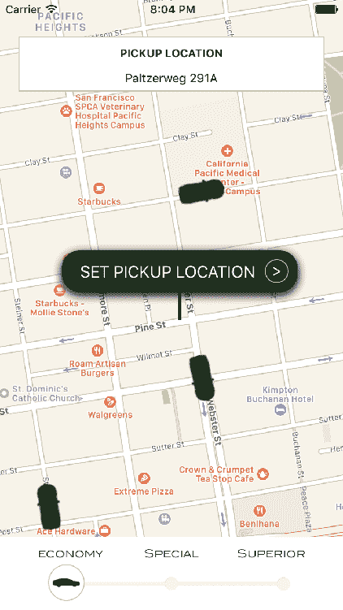
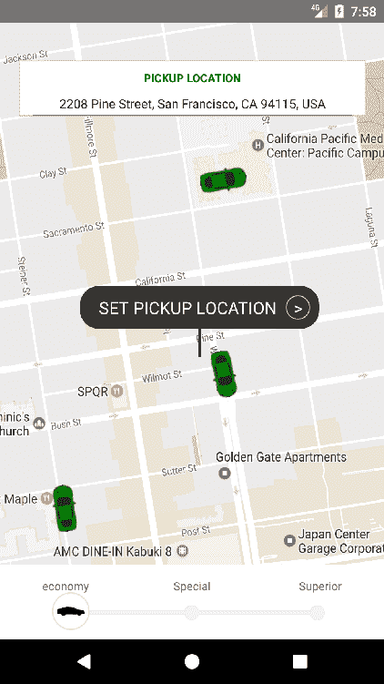
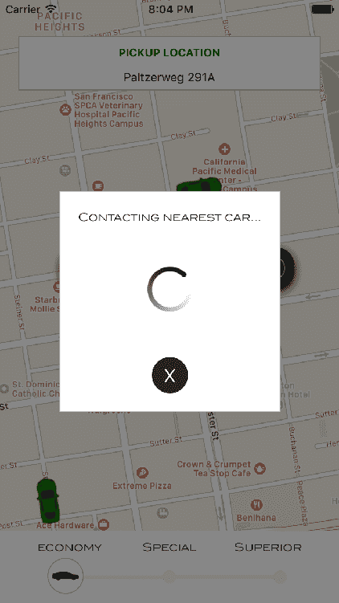
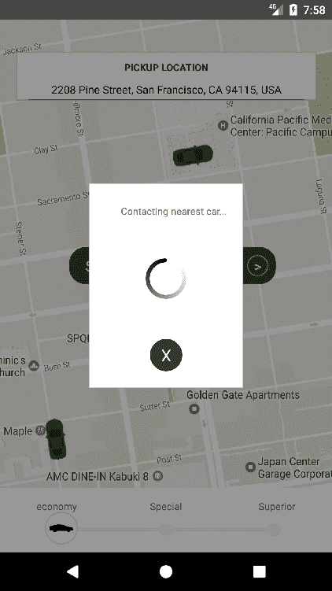
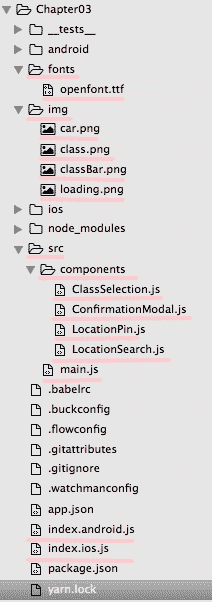
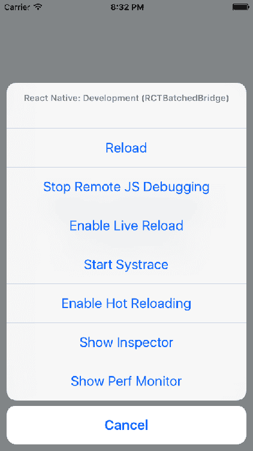
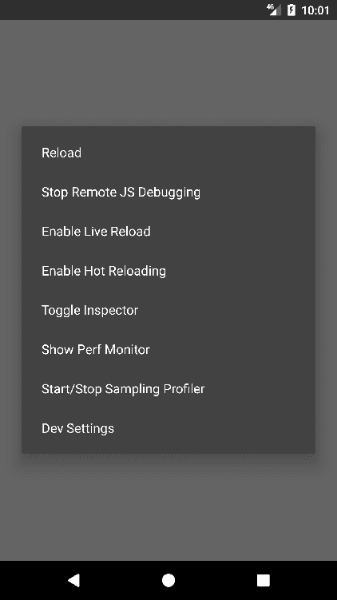
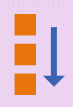
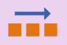

# 第三章：汽车预订应用

在之前的章节中，我们将重点放在功能开发上，而不是在构建用户界面上，将我们应用的样式委托给 UI 库，如`native-base`。在本章中，我们将做相反的事情，花更多的时间来构建自定义 UI 组件和屏幕。

我们要构建的应用是一个汽车预订应用，用户可以选择想要被接送的位置以及想要预订的车辆类型。由于我们想要专注于用户界面，我们的应用只会有两个屏幕，并且需要一些状态管理。相反，我们将更深入地研究诸如动画、组件布局、使用自定义字体或显示外部图像等方面。

该应用将适用于 iOS 和 Android 设备，由于所有用户界面都将是定制的，因此代码的 100%将在两个平台之间重复使用。我们只会使用两个外部库：

+   - `React-native-geocoder`：这将把坐标转换为人类可读的位置

+   - `React-native-maps`：这将轻松显示地图和显示可预订汽车位置的标记

由于其性质，大多数汽车预订应用将其复杂性放在后端代码中，以有效地连接司机和乘客。我们将跳过这种复杂性，并在应用程序本身中模拟所有这些功能，以便专注于构建美观和可用的界面。

# 概述

在构建移动应用程序时，我们需要确保将界面复杂性降至最低，因为一旦应用程序打开，向用户呈现侵入式手册或工具提示通常是有害的。让我们的应用自解释是一个好习惯，这样用户就可以通过浏览应用屏幕来理解使用方法。这就是为什么使用标准组件，如抽屉菜单或标准列表，总是一个好主意，但并非总是可能的（就像我们当前的应用中发生的情况），因为我们想要向用户呈现的数据类型。

在我们的情况下，我们将所有功能放在主屏幕和一个模态框中。让我们来看看这款应用在 iOS 设备上的样子：



我们主屏幕的背景是地图组件本身，我们将在地图中显示所有可用的汽车作为标记。在地图上，我们将显示三个组件：

+   - 选择位置框，显示所选的接送位置

+   - 位置图钉，可以在地图上拖动以选择新位置

+   用户想要预订的汽车类型的选择器。我们将显示三个选项：经济型，特别型和高级型

由于大多数组件都是自定义构建的，因此此屏幕在任何 Android 设备上看起来都非常相似：



iOS 和 Android 版本之间的主要区别将是地图组件。虽然 iOS 将默认使用 Apple 地图，但 Android 使用 Google 地图。我们将保留此设置，因为每个平台都有其自己优化的地图组件，但值得知道的是，我们可以通过配置我们的组件将 iOS 版本切换到使用 Google 地图。

一旦用户选择了取货地点，我们将显示一个模态框来确认预订并联系最近的司机接送。



与主屏幕一样，此屏幕使用自定义组件：我们甚至决定创建自己的动画活动指示器。因此，Android 版本将看起来非常相似：



由于我们的应用程序不会连接到任何外部 API，它应该被视为 React Native 的视觉能力的纯粹展示，尽管可以通过添加状态管理库和匹配的 API 轻松扩展。

在本章中，我们将涵盖以下主题：

+   在我们的应用程序中使用地图

+   React Native 中的样式表

+   React Native 中的 Flexbox

+   在 React Native 应用程序中使用外部图像

+   添加自定义字体

+   React Native 中的动画

+   使用模态框

+   处理阴影和不透明度

# 设置文件夹结构

让我们使用 React Native 的 CLI 初始化一个 React Native 项目。 该项目将被命名为`carBooking`，并将适用于 iOS 和 Android 设备：

```jsx
react-native init --version="0.49.3" carBooking
```

在此应用程序中，只有一个屏幕，因此代码的文件夹结构应该非常简单。由于我们将使用外部图像和字体，我们将这些资源组织在两个单独的文件夹中：`img`和`fonts`，都在根文件夹下：



用于构建此应用程序的图像和字体可以从一些图像和字体库网站免费下载。我们将使用的字体名称是*Blair ITC*。

我们还将以下图像存储在`img`文件夹中：

+   `car.png`：一辆汽车的简单图画，用于表示地图上可预订的汽车。

+   `class.png`：一辆汽车的轮廓，显示在类别选择按钮内部。

+   `classBar.png`：用于滑动更改班级选择按钮的栏。

+   `loading.png`：我们自定义的旋转器。它将被存储为静态图像，并通过代码进行动画处理。

最后，让我们来看看我们的`package.json`文件：

```jsx
{
    "name": "carBooking",
    "version": "0.0.1",
    "private": true,
    "scripts": {
        "start": "node node_modules/react-native/local-cli/cli.js start",
        "test": "jest"
    },
    "dependencies": {
        "react": "16.0.0-beta.5",
        "react-native": "0.49.3",
        "react-native-geocoder": "⁰.4.8",
 "react-native-maps": "⁰.15.2"
    },
    "devDependencies": {
        "babel-jest": "20.0.3",
        "babel-preset-react-native": "1.9.2",
        "jest": "20.0.4",
        "react-test-renderer": "16.0.0-alpha.6"
    },
    "jest": {
        "preset": "react-native"
    },
    "rnpm": {
 "assets": ["./fonts"]
 }
}
```

我们只使用两个 npm 模块：

+   `react-native-geocoder`：这将坐标转换为可读的位置

+   `react-native-maps`：这可以轻松显示地图和显示可预订汽车位置的标记

为了允许应用程序使用自定义字体，我们需要确保它们可以从本机端访问。为此，我们需要在`package.json`中添加一个名为`rnpm`的新键。这个键将存储一个`assets`数组，在其中我们将定义我们的`fonts`文件夹。在构建时，React Native 将把字体复制到一个位置，从那里它们将在本机端可用，因此可以在我们的代码中使用。这仅对字体和一些特殊资源是必需的，但不适用于图像。

# 由 React Native 的 CLI 创建的文件和文件夹

让我们利用这个应用程序中的简单文件夹结构来展示通过`react-native init <projectName>`初始化项目时 React Native 的 CLI 创建的其他文件和文件夹。

# __ 测试 __/

React Native 的 CLI 包括 Jest 作为开发人员依赖项，并且为了开始测试，它包括一个名为`__tests__`的文件夹，其中可以存储所有测试。默认情况下，React Native 的 CLI 添加一个测试文件：`index.js`，代表初始一组测试。开发人员可以为应用程序中的任何组件添加后续测试。React Native 还在我们的`package.json`中添加了一个`test`脚本，因此我们可以从一开始就运行`npm run test`。

Jest 已准备好与通过 CLI 初始化的每个项目一起使用，当涉及到测试 React 组件时，它绝对是最简单的选择，尽管也可以使用其他库，如 Jasmine 或 Mocha。

# android/和 ios/

这两个文件夹分别保存了两个平台的原生构建应用程序。这意味着我们可以在这里找到我们的`.xcodeproj`和`.java`文件。每当我们需要对应用程序的本机代码进行更改时，我们都需要修改这两个目录中的一些文件。

在这些文件夹中查找和修改文件的最常见原因是：

+   通过更改`Info.plist`（iOS）或`AndroidManifest.xml`（Android）来修改权限（推送通知，访问位置服务，访问指南针等）

+   更改任何平台的构建设置

+   为原生库添加 API 密钥

+   添加或修改原生库，以便从我们的 React Native 代码中使用

# node_modules/

这个文件夹对大多数使用 npm 的 JavaScript 开发人员来说应该很熟悉，因为 npm 将所有标记为项目依赖项的模块存储在这里。在这个文件夹内修改任何内容的必要性并不常见，因为一切都应该通过 npm 的 CLI 和我们的`package.json`文件来处理。

# 根文件夹中的文件

React Native 的 CLI 在项目的根目录中创建了许多文件；让我们来看看最重要的文件：

+   `.babelrc`：Babel 是 React Native 中用于编译包含 JSX 和 ES6（例如，语法的 JavaScript 文件的默认库，可以转换为大多数 JavaScript 引擎能够理解的普通 JavaScript）。在这里，我们可以修改这个编译器的配置，例如，我们可以使用`@`语法作为装饰器，就像在 React 的最初版本中所做的那样。

+   `.buckconfig`：Buck 是 Facebook 使用的构建系统。这个文件用于配置使用 Buck 时的构建过程。

+   `.watchmanconfig`：Watchman 是一个监视项目中文件的服务，以便在文件发生变化时触发重新构建。在这个文件中，我们可以添加一些配置选项，比如应该被忽略的目录。

+   `app.json`：这个文件被`react-native eject`命令用来配置原生应用程序。它存储了在每个平台上标识应用程序的名称，以及在设备的主屏幕上安装应用程序时将显示的名称。

+   `yarn.lock`：`package.json`文件描述了原始作者期望的版本，而`yarn.lock`描述了给定应用程序的最后已知的良好配置。

# react-native link

一些应用程序依赖具有原生能力的库，在 React Native CLI 之前，开发人员需要将原生库文件复制到原生项目中。这是一个繁琐和重复的工作，直到`react-native link`出现才得以解救。在本章中，我们将使用它来从`react-native-maps`复制库文件，并将自定义字体从我们的`/fonts`文件夹链接到编译后的应用程序。

通过在项目的根文件夹中运行`react-native link`，我们将触发链接步骤，这将使那些原生能力和资源可以从我们的 React Native 代码中访问。

# 在模拟器中运行应用程序

在`package.json`文件中具有依赖项并且所有初始文件就位后，我们可以运行以下命令（在项目的根文件夹中）来完成安装：

```jsx
npm install
```

然后，所有依赖项都应该安装在我们的项目中。一旦 npm 完成安装所有依赖项，我们就可以在 iOS 模拟器中启动我们的应用程序：

```jsx
react-native run-ios
```

或者在 Android 模拟器中使用以下命令：

```jsx
react-native run-android
```

当 React Native 检测到应用程序在模拟器中运行时，它会通过一个隐藏菜单启用开发人员工具集，可以通过快捷键*command* + *D*（在 iOS 上）或*command* + *M*（在 Android 上，Windows 上应使用*Crtl*而不是*command*）访问。这是 iOS 中开发人员菜单的样子：



这是在 Android 模拟器中的样子：



# 开发人员菜单

在构建 React Native 应用程序的过程中，开发人员将需要调试。React Native 通过能够在 Chrome 开发者工具或外部应用程序（如 React Native Debugger）中远程调试我们的应用程序来满足这些需求。错误、日志甚至 React 组件都可以像在普通的 Web 环境中一样轻松地进行调试。

此外，React Native 提供了一种自动重新加载应用程序的方式，每次进行更改时都会重新加载应用程序，从而节省了开发人员手动重新加载应用程序的任务（可以通过按*command* + *R*或*Ctrl* + *R*来实现）。当我们为自动重新加载设置应用程序时，有两个选项：

+   实时重新加载检测到我们在应用程序代码中进行的任何更改，并在重新加载后将应用程序重置为其初始状态。

+   热重载还可以检测更改并重新加载应用程序，但保持应用程序的当前状态。当我们正在实现用户流程以节省开发人员重复每个步骤时（例如，登录或注册测试用户）时，这非常有用。

最后，我们可以启动性能监视器来检测执行复杂操作（如动画或数学计算）时可能出现的性能问题。

# 创建我们应用程序的入口点

让我们通过创建我们应用程序的入口点`index.js`来开始我们的应用程序代码。我们在这个文件中导入`src/main.js`，以便为我们的代码库使用一个公共根组件。此外，我们将使用名称`carBooking`注册应用程序：

```jsx
/*** index.js ***/

import { AppRegistry } from 'react-native';
import App from './src/main';
AppRegistry.registerComponent('carBooking', () => App);
```

让我们通过添加地图组件来开始构建我们的`src/main.js`：

```jsx
/*** src/main.js ** */

import React from 'react';
import { View, StyleSheet } from 'react-native';
import MapView from 'react-native-maps';

export default class Main extends React.Component {
  constructor(props) {
    super(props);
    this.initialRegion = {
      latitude: 37.78825,
      longitude: -122.4324,
      latitudeDelta: 0.00922,
      longitudeDelta: 0.00421,
    };
  }

  render() {
    return (
      <View style={{ flex: 1 }}>
        <MapView
          style={styles.fullScreenMap}
          initialRegion={this.initialRegion}
        />
      </View>
    );
  }
}

const styles = StyleSheet.create({
  fullScreenMap: {
    position: 'absolute',
    top: 0,
    bottom: 0,
    left: 0,
    right: 0,
  },
});

```

我们将使用`StyleSheet`来创建自己的样式，而不是使用样式库，`StyleSheet`是一个类似于 CSS 样式表的抽象的 React Native API。使用`StyleSheet`，我们可以从对象中创建样式表（通过`create`方法），然后通过引用每个样式的 ID 在我们的组件中使用它们。

这样，我们可以重用样式代码，并使代码更易读，因为我们将使用有意义的名称来引用每个样式（例如，`<Text style={styles.title}>Title 1</Text>`）。

在这一点上，我们只会创建一个由键`fullScreenMap`引用的样式，并通过将`top`、`bottom`、`left`和`right`坐标添加到零来将其设置为绝对位置，覆盖全屏大小。除此之外，我们需要为我们的容器视图添加一些样式，以确保它填满整个屏幕：`{flex: 1}`。将`flex`设置为`1`，我们希望我们的视图填满其父级占用的所有空间。由于这是主视图，`{flex: 1}`将占据整个屏幕。

对于我们的地图组件，我们将使用`react-native-maps`，这是由 Airbnb 创建的一个开放模块，利用了 Google 和 Apple 地图的本地地图功能。`react-native-maps`是一个非常灵活的模块，得到了很好的维护，并且功能齐全，因此它已经成为 React Native 的*事实标准*地图模块。正如我们将在本章后面看到的，`react-native-maps`要求开发人员运行`react-native link`才能正常工作。

除了样式，`<MapView/>`组件将以`initialRegion`作为属性，将地图居中在特定的坐标上，这应该是用户当前位置。出于一致性原因，我们将把地图的中心定位在旧金山，在那里我们还将放置一些可预订的汽车：

```jsx
/** * src/main.js ** */

import React from 'react';
import { View, Animated, Image, StyleSheet } from 'react-native';
import MapView from 'react-native-maps';

export default class Main extends React.Component {
  constructor(props) {
    super(props);
    this.state = {
      carLocations: [
 {
 rotation: 78,
 latitude: 37.78725,
 longitude: -122.4318,
 },
 {
 rotation: -10,
 latitude: 37.79015,
 longitude: -122.4318,
 },
 {
 rotation: 262,
 latitude: 37.78525,
 longitude: -122.4348,
 },
 ],
    };
    this.initialRegion = {
      latitude: 37.78825,
      longitude: -122.4324,
      latitudeDelta: 0.00922,
      longitudeDelta: 0.00421,
    };
  }

  render() {
    return (
      <View style={{ flex: 1 }}>
        <MapView
          style={styles.fullScreenMap}
          initialRegion={this.initialRegion}
        >
          {this.state.carLocations.map((carLocation, i) => (
 <MapView.Marker key={i} coordinate={carLocation}>
 <Animated.Image
 style={{
 transform: [{ rotate: `${carLocation.rotation}deg` }],
 }}
 source={require('../img/car.png')}
 />
 </MapView.Marker>
 ))}
        </MapView>
      </View>
    );
  }
}

...
```

我们已经添加了一个`carLocations`数组，以便在地图上显示为标记。在我们的`render`函数中，我们将遍历这个数组，并在提供的坐标中放置相应的`<MapView.Marker/>`。在每个标记内，我们将添加汽车的图像，并将其旋转特定角度，以使其与街道方向匹配。旋转图像必须使用`Animated`API 完成，这将在本章后面更好地解释。

让我们在我们的状态中添加一个新属性，用于存储地图所居中的位置的可读位置：

```jsx
/** * src/main.js ** */

import GeoCoder from 'react-native-geocoder';

export default class Main extends React.Component {
  constructor(props) {
    super(props);
    this.state = {
 position: null,

      ...

    };

    ...

  }

  _onRegionChange(region) {
 this.setState({ position: null });
 const self = this;
 if (this.timeoutId) clearTimeout(this.timeoutId);
 this.timeoutId = setTimeout(async () => {
 try {
 const res = await GeoCoder.geocodePosition({
 lat: region.latitude,
 lng: region.longitude,
 });
 self.setState({ position: res[0] });
 } catch (err) {
 console.log(err);
 }
 }, 2000);
  }
  componentDidMount() {
 this._onRegionChange.call(this, this.initialRegion);
 }

  render() {
    <View style={{ flex: 1 }}>
      <MapView
        style={styles.fullScreenMap}
        initialRegion={this.initialRegion}
        onRegionChange={this._onRegionChange.bind(this)}
      >

      ...

      </MapView>
    </View>;
  }
}

...
```

为了填充这个状态变量，我们还创建了一个名为`_onRegionChange`的函数，它使用`react-native-geocoder`模块。该模块使用 Google Maps 的逆地理编码服务将一些坐标转换为可读的位置。因为这是一个 Google 服务，我们可能需要添加一个 API 密钥来验证我们的应用程序与该服务的身份。可以在其存储库 URL 中找到完全安装此模块的所有说明[`github.com/airbnb/react-native-maps/blob/master/docs/installation.md`](https://github.com/airbnb/react-native-maps/blob/master/docs/installation.md)。

我们希望这个状态变量从主组件的第一个挂载就可用，所以我们将在`componentDidMount`中调用`_onRegionChange`，以便初始位置的名称也存储在状态中。此外，我们将在我们的`<MapView/>`上添加`onRegionChange`属性，以确保位置的名称在地图移动到显示不同区域时重新计算，这样我们总是可以在我们的`position`状态变量中拥有地图中心的位置名称。

作为屏幕的最后一步，我们将添加所有子视图和另一个函数来确认预订请求：

```jsx
/** * src/main.js ** */

...

import LocationPin from './components/LocationPin';
import LocationSearch from './components/LocationSearch';
import ClassSelection from './components/ClassSelection';
import ConfirmationModal from './components/ConfirmationModal';

export default class Main extends React.Component {
  ...

  _onBookingRequest() {
 this.setState({
 confirmationModalVisible: true,
 });
 }

  render() {
    return (
      <View style={{ flex: 1 }}>
        ...

        <LocationSearch
 value={
 this.state.position &&
 (this.state.position.feature ||
 this.state.position.formattedAddress)
 }
 />
        <LocationPin onPress={this._onBookingRequest.bind(this)} />
        <ClassSelection />
        <ConfirmationModal
          visible={this.state.confirmationModalVisible}
          onClose={() => {
            this.setState({ confirmationModalVisible: false });
          }}
        />
      </View>
    );
  }
}

...
```

我们添加了四个子视图：

+   `LocationSearch`：在这个组件中，我们将向用户显示地图中心的位置，以便她可以知道她确切请求接送的位置的名称。

+   `LocationPin`：一个指向地图中心的图钉，这样用户可以在地图上看到她将要请求接送的位置。它还将显示一个确认接送的按钮。

+   `ClassSelection`：用户可以在其中选择接送车辆类型（经济、特殊或高级）的条形图。

+   `ConfirmationModal`：显示请求确认的模态框。

`_onBookingRequest`方法将负责在请求预订时弹出确认模态框。

# 向我们的应用程序添加图像

React Native 处理图像的方式与网站类似：图像应放在项目文件夹结构内的一个文件夹中，然后可以通过`<Image/>`（或`<Animated.Image/>`）的`source`属性引用它们。让我们看一个来自我们应用程序的例子：

+   `car.png`：这个文件放在我们项目根目录的`img/`文件夹中

+   然后，通过使用`source`属性创建一个`<Image/>`组件来显示图像：

```jsx
       <Image source={require('../img/car.png')} />
```

请注意`source`属性不接受字符串，而是`require('../img/car.png')`。这在 React Native 中是一个特殊情况，可能会在将来的版本中更改。

# LocationSearch

这应该是一个简单的文本框，显示地图中心的可读名称。让我们看一下代码：

```jsx
/*** src/components/LocationSearch.js ** */

import React from 'react';
import {
  View,
  Text,
  TextInput,
  ActivityIndicator,
  StyleSheet,
} from 'react-native';

export default class LocationSearch extends React.Component {
  render() {
    return (
      <View style={styles.container}>
        <Text style={styles.title}>PICKUP LOCATION</Text>
        {this.props.value && (
          <TextInput style={styles.location} value={this.props.value} />
        )}
        {!this.props.value && <ActivityIndicator style={styles.spinner} />}
      </View>
    );
  }
}

const styles = StyleSheet.create({
  container: {
    backgroundColor: 'white',
    margin: 20,
    marginTop: 40,
    height: 60,
    padding: 10,
    borderColor: '#ccc',
    borderWidth: 1,
  },
  title: {
    alignSelf: 'center',
    fontSize: 12,
    color: 'green',
    fontWeight: 'bold',
  },
  location: {
    height: 40,
    textAlign: 'center',
    fontSize: 13,
  },
  spinner: {
    margin: 10,
  },
});
```

它只接收一个属性：`value`（要显示的位置名称）。如果未设置，它将显示一个旋转器以显示活动。

由于在此组件中需要应用许多不同的样式，因此最好使用`StyleSheet` API 将样式组织在键/值对象中，并从我们的`render`方法中引用它。逻辑和样式之间的分离有助于代码的可读性，还可以使代码重用，因为样式可以级联到子组件。

# 对齐元素

React Native 使用 Flexbox 来设置应用程序中元素的布局。这通常很简单，但有时在对齐元素时可能会令人困惑，因为有四个属性可用于此目的：

+   `justifyContent`：它定义了子元素沿着主轴的对齐方式

+   `alignItems`：它定义了子元素沿着交叉轴的对齐方式

+   `alignContent`：当交叉轴上有额外空间时，它会对齐 flex 容器的行

+   `alignSelf`：它允许覆盖单个 flex 项的默认对齐方式（或由`alignItems`指定的对齐方式）

前三个属性应分配给容器元素，而第四个属性将应用于子元素，以便在需要覆盖默认对齐方式时使用。

在我们的情况下，我们只希望一个元素（标题）居中对齐，因此我们可以使用`alignSelf: 'center'`。在本章的后面，我们将看到不同的`align`属性的其他用途。

# LocationPin

在本节中，我们将专注于构建指向地图中心的标记，以直观确认取货位置。此标记还包含一个按钮，可用于触发取货请求：

```jsx
/** * src/components/LocationPin.js ** */

import React from 'react';
import {
  View,
  Text,
  Dimensions,
  TouchableOpacity,
  StyleSheet,
} from 'react-native';

const { height, width } = Dimensions.get('window');

export default class LocationPin extends React.Component {
  render() {
    return (
      <View style={styles.container}>
        <View style={styles.banner}>
          <Text style={styles.bannerText}>SET PICKUP LOCATION</Text>
          <TouchableOpacity
 style={styles.bannerButton}
 onPress={this.props.onPress}
 >
            <Text style={styles.bannerButtonText}>{'>'}</Text>
          </TouchableOpacity>
        </View>
        <View style={styles.bannerPole} />
      </View>
    );
  }
}

const styles = StyleSheet.create({
  container: {
    position: 'absolute',
    top: height / 2 - 60,
 left: width / 2 - 120,
  },
  banner: {
    flexDirection: 'row',
 alignSelf: 'center',
 justifyContent: 'center',
    borderRadius: 20,
    backgroundColor: '#333',
    padding: 10,
    paddingBottom: 10,
    shadowColor: '#000000',
 shadowOffset: {
 width: 0,
 height: 3,
 },
 shadowRadius: 5,
 shadowOpacity: 1.0,
  },
  bannerText: {
    alignSelf: 'center',
    color: 'white',
    marginRight: 10,
    marginLeft: 10,
    fontSize: 18,
  },
  bannerButton: {
    borderWidth: 1,
    borderColor: '#ccc',
    width: 26,
    height: 26,
    borderRadius: 13,
  },
  bannerButtonText: {
    color: 'white',
    textAlign: 'center',
    backgroundColor: 'transparent',
    fontSize: 18,
  },
  bannerPole: {
    backgroundColor: '#333',
    width: 3,
    height: 30,
    alignSelf: 'center',
  },
});

```

就功能而言，这个组件再次非常轻量级，但具有许多自定义样式。让我们深入了解一些样式细节。

# flexDirection

默认情况下，React Native 和 Flexbox 会垂直堆叠元素：



对于我们的标记中的横幅，我们希望将每个元素水平堆叠在一起，如下所示：



这可以通过向包含元素添加以下样式来实现`flexDirection: 'row'`。`flexDirection`的其他有效选项是：

+   row-reverse

+   `column`（默认）

+   `column-reverse`

# 尺寸

在这个组件中的代码的第一行从设备中提取高度和宽度到两个变量中：

```jsx
const {height, width} = Dimensions.get('window');
```

获取设备的高度和宽度使我们开发人员能够绝对定位一些元素，确信它们将正确对齐显示。例如，我们希望我们的图钉的横幅对齐在屏幕中央，所以它指向地图的中心。我们可以在样式表中的`banner`样式中添加`{top: (height/2), left: (width/2)}`来实现这一点。当然，这会将其对齐到左上角，所以我们需要从每个属性中减去横幅大小的一半，以确保它在元素的中间得到居中。每当我们需要对齐一个与组件树中的任何其他元素无关的元素时，都可以使用这个技巧，尽管在可能的情况下建议使用相对定位。

# 阴影

让我们专注于我们横幅的样式，特别是`shadows`属性：

```jsx
banner: {
  ...
 shadowColor: '#000000',
 shadowOffset: {
 width: 0,
 height: 3
 },
 shadowRadius: 5,
 shadowOpacity: 1.0 }
```

为了给组件添加阴影，我们需要添加四个属性：

+   `shadowColor`：这添加了我们组件所需的颜色的十六进制或 RGBA 值

+   `shadowOffset`：这显示了我们希望阴影投射多远

+   `shadowRadius`：这显示了阴影在角落的半径值

+   `shadowOpacity`：这显示了我们希望阴影有多深

这就是我们的`LocationPin`组件的全部内容。

# 类选择

在这个组件中，我们将探索 React Native 中的`Animated` API，以开始使用动画。此外，我们将使用自定义字体来改善用户体验，并增加我们应用程序中的定制感：

```jsx
/*** src/components/ClassSelection.js ** */

import React from 'react';
import {
  View,
  Image,
  Dimensions,
  Text,
  TouchableOpacity,
  Animated,
  StyleSheet,
} from 'react-native';

const { height, width } = Dimensions.get('window');

export default class ClassSelection extends React.Component {
  constructor(props) {
    super(props);
    this.state = {
      classButtonPosition: new Animated.Value(15 + width * 0.1),
    };
  }

  _onClassChange(className) {
    if (className === 'superior') {
      Animated.timing(this.state.classButtonPosition, {
 toValue: width * 0.77,
 duration: 500,
 }).start();
    }

    if (className === 'special') {
      Animated.timing(this.state.classButtonPosition, {
 toValue: width * 0.5 - 20,
 duration: 500,
 }).start();
    }

    if (className === 'economy') {
      Animated.timing(this.state.classButtonPosition, {
 toValue: 15 + width * 0.1,
 duration: 500,
 }).start();
    }
  }

  render() {
    return (
      <View style={styles.container}>
        <Image
          style={styles.classBar}
          source={require('../../img/classBar.png')}
        />
        <Animated.View
 style={[styles.classButton, { left: this.state.classButtonPosition }]}
 >
          <Image
            style={styles.classButtonImage}
            source={require('../../img/class.png')}
          />
        </Animated.View>
        <TouchableOpacity
          style={[
            styles.classButtonContainer,
            {
              width: width / 3 - 10,
              left: width * 0.11,
            },
          ]}
          onPress={this._onClassChange.bind(this, 'economy')}
        >
          <Text style={styles.classLabel}>economy</Text>
        </TouchableOpacity>
        <TouchableOpacity
          style={[
            styles.classButtonContainer,
            { width: width / 3, left: width / 3 },
          ]}
          onPress={this._onClassChange.bind(this, 'special')}
        >
          <Text style={[styles.classLabel, { textAlign: 'center' }]}>
            Special
          </Text>
        </TouchableOpacity>
        <TouchableOpacity
          style={[
            styles.classButtonContainer,
            { width: width / 3, right: width * 0.11 },
          ]}
          onPress={this._onClassChange.bind(this, 'superior')}
        >
          <Text style={[styles.classLabel, { textAlign: 'right' }]}>
            Superior
          </Text>
        </TouchableOpacity>
      </View>
    );
  }
}

const styles = StyleSheet.create({
  container: {
    height: 80,
    backgroundColor: 'white',
    position: 'absolute',
    bottom: 0,
    left: 0,
    right: 0,
    paddingBottom: 10,
  },
  classBar: {
    width: width * 0.7,
 left: width * 0.15,
 resizeMode: 'contain',
    height: 30,
    top: 35,
  },
  classButton: {
    top: 30,
    justifyContent: 'center',
    borderRadius: 20,
    borderColor: '#ccc',
    borderWidth: 1,
    position: 'absolute',
    backgroundColor: 'white',
    height: 40,
    width: 40,
  },
  classButtonImage: {
    alignSelf: 'center',
 resizeMode: 'contain',
    width: 30,
  },
  classButtonContainer: {
    backgroundColor: 'transparent',
    position: 'absolute',
    height: 70,
    top: 10,
  },
  classLabel: {
    paddingTop: 5,
    fontSize: 12,
  },
});

```

这个简单的组件由五个子组件组成：

+   `classBar`：这是显示条和每个类的停靠点的图像

+   `classButton`：这是圆形按钮，一旦用户按下特定的类，它将移动到所选的类

+   `classButtonContainer`：这是可触摸组件，用于检测用户想要选择的类

+   `classLabel`：这些是每个类的标题，将显示在条的顶部

让我们从样式开始，因为我们可以在图像组件中找到一个新的属性：`resizeMode`，它确定当框架与原始图像尺寸不匹配时如何调整图像大小。从五种可能的值（`cover`，`contain`，`stretch`，`repeat`和`center`）中，我们选择了`contain`，因为我们希望均匀缩放图像（保持图像的纵横比），以便图像的两个尺寸都等于或小于视图的相应尺寸。我们在`classBar`和`classButtonImage`中都使用了这些属性，这是我们在这个视图中需要调整大小的两个图像。

# 添加自定义字体

React Native 默认包含一长串跨平台字体。字体列表可以在[`github.com/react-native-training/react-native-fonts`](https://github.com/react-native-training/react-native-fonts)上查看。

然而，添加自定义字体是开发应用程序时的常见需求，特别是涉及到设计师时，因此我们将使用我们的汽车预订应用程序作为测试这一功能的场所。

添加自定义字体到我们的应用程序是一个三步任务：

1.  将字体文件（.ttf）添加到项目内的一个文件夹中。我们在这个应用程序中使用了`fonts/`。

1.  将以下行添加到我们的`package.json`：

```jsx
      “rnpm”: {
          “assets”: [“./fonts”]
      }
```

1.  在终端中运行以下命令：

```jsx
 react-native link
```

就是这样，React Native 的 CLI 将一次性处理`fonts`文件夹及其文件的插入到 iOS 和 Android 项目中。我们的字体将通过它们的字体名称（可能与文件名不同）可用。在我们的情况下，我们在样式表中有`fontFamily: 'Blair ITC'`。

现在我们可以修改`ClassSelection`组件中的`classLabel`样式，以包含新的字体：

```jsx
...

classLabel: {
    fontFamily: 'Blair ITC',
    paddingTop: 5,
    fontSize: 12,
},

...
```

# 动画

React Native 的`Animated` API 旨在以高性能的方式，简洁地表达各种有趣的动画和交互模式。动画侧重于输入和输出之间的声明关系，中间有可配置的转换，并且有简单的`start`/`stop`方法来控制基于时间的动画执行。

我们在应用程序中要做的是，当用户按下她想要预订的班级时，将`classButton`移动到特定位置。让我们更仔细地看看我们在应用程序中如何使用这个 API：

```jsx
/** * src/components/ClassSelection ***/

...

export default class ClassSelection extends React.Component {
  constructor(props) {
    super(props);
    this.state = {
      classButtonPosition: new Animated.Value(15 + width * 0.1),
    };
  }

  _onClassChange(className) {
    if (className === 'superior') {
      Animated.timing(this.state.classButtonPosition, {
        toValue: width * 0.77,
        duration: 500,
      }).start();
    }

    ...

  }

  render() {
    return (
      ...

      <Animated.View style={{ left: this.state.classButtonPosition }}>
        <Image
          style={styles.classButtonImage}
          source={require('../../img/class.png')}
        />
      </Animated.View>

      ...

      <TouchableOpacity
        onPress={this._onClassChange.bind(this, 'superior')}
      >
        <Text>Superior</Text>
      </TouchableOpacity>

      ...
    );
  }
}

...
```

为了使这种移动正确发生，我们需要将`classButtonImage`包装在`Animated.View`中，并为其提供一个初始的`Animated.Value`作为左坐标。我们将使用`this.state.classButtonPosition`来做到这一点，这样当用户选择特定的类别时我们可以改变它。

我们准备开始我们的动画。它将由`_onClassChange`方法触发，因为当用户按下`classButtonContainer`（`<TouchableOpacity/>`）时，它被调用。这个方法调用`Animated.timing`函数传递两个参数：

+   驱动动画的动画值（`this.state.classButtonPosition`）

+   包含动画的结束值和持续时间的对象

调用`Animated.timing`将导致一个包含`start()`方法的对象，我们立即调用它来启动动画。然后 React Native 将知道`Animated.View`的`left`坐标需要根据提供的参数慢慢改变。

由于这可能对于简单的移动动画来说有点复杂，但它允许广泛的定制，如链接动画或修改缓动函数。我们将在本章后面看到旋转动画。

# ConfirmationModal

我们的最后一个组件是一个模态视图，当用户按下“设置取货位置”按钮时，它将被打开。我们将显示模态和自定义活动指示器，它将使用复杂的动画设置来持续在其位置旋转：

```jsx
/** * src/components/ConfirmationModal.js ***/

import React from 'react';
import {
  Modal,
  View,
  Text,
  Animated,
  Easing,
  TouchableOpacity,
  StyleSheet,
} from 'react-native';

export default class ConfirmationModal extends React.Component {
  componentWillMount() {
 this._animatedValue = new Animated.Value(0);
  }

  cycleAnimation() {
 Animated.sequence([
 Animated.timing(this._animatedValue, {
 toValue: 100,
 duration: 1000,
 easing: Easing.linear,
 }),
 Animated.timing(this._animatedValue, {
 toValue: 0,
 duration: 0,
 }),
 ]).start(() => {
 this.cycleAnimation();
 });
 }

  componentDidMount() {
 this.cycleAnimation();
 }

  render() {
    const interpolatedRotateAnimation = this._animatedValue.interpolate({
 inputRange: [0, 100],
 outputRange: ['0deg', '360deg'],
 });

    return (
      <Modal
 animationType={'fade'}
 visible={this.props.visible}
 transparent={true}
 >
        <View style={styles.overlay}>
          <View style={styles.container}>
            <Text style={styles.title}>Contacting nearest car...</Text>
            <Animated.Image
 style={[
 styles.spinner,
 { transform: [{ rotate: interpolatedRotateAnimation }] },
 ]}
 source={require('../../img/loading.png')}
 />
            <TouchableOpacity
              style={styles.closeButton}
              onPress={this.props.onClose}
            >
              <Text style={styles.closeButtonText}>X</Text>
            </TouchableOpacity>
          </View>
        </View>
      </Modal>
    );
  }
}

const styles = StyleSheet.create({
  overlay: {
    flex: 1,
    backgroundColor: '#0006',
    justifyContent: 'center',
  },
  container: {
    backgroundColor: 'white',
    alignSelf: 'center',
    padding: 20,
    borderColor: '#ccc',
    borderWidth: 1,
  },
  title: {
    textAlign: 'right',
    fontFamily: 'Blair ITC',
    paddingTop: 5,
    fontSize: 12,
  },
  spinner: {
    resizeMode: 'contain',
    height: 50,
    width: 50,
    margin: 50,
    alignSelf: 'center',
  },
  closeButton: {
    backgroundColor: '#333',
    width: 40,
    height: 40,
    borderRadius: 20,
    justifyContent: 'center',
    alignSelf: 'center',
  },
  closeButtonText: {
    color: 'white',
    alignSelf: 'center',
    fontSize: 20,
  },
});

```

对于这个组件，我们使用 React Native 中可用的`<Modal />`组件来利用其淡入淡出动画和可见性功能。属性`this.props.visible`将驱动此组件的可见性，因为它是知道用户的取货请求的父组件。

让我们再次专注于动画，因为我们想为显示活动的旋转器做一个更复杂的设置。我们想要显示一个无休止的旋转动画，所以我们需要系统地调用我们的`start()`动画方法。为了实现这一点，我们创建了一个`cycleAnimation()`方法，它在组件挂载时被调用（以启动动画），并且从返回的`Animated.timing`对象中调用，因为它作为回调传递以在每次动画结束时被调用。

我们还使用`Animated.sequence`来连接两个动画：

+   从 0 度移动到 360 度（在一秒钟内使用线性缓动）

+   从 360 度移动到 0 度（在 0 秒内）

这是为了在每个周期结束时重复第一个动画。

最后，我们定义了一个名为`interpolatedRotateAnimation`的变量，用于存储从 0 度到 360 度的插值，因此可以将其传递给`transform`/`rotate`样式，定义了在动画我们的`Animated.Image`时可用的旋转值。

作为一个实验，我们可以尝试用替代图像更改 loading.png，并看看它如何被动画化。这可以通过替换我们的<Animated.Image />组件中的源属性轻松实现。

```jsx
...            

            <Animated.Image
              style={[
                styles.spinner,
                { transform: [{ rotate: interpolatedRotateAnimation }] },
              ]}
              source={require('../../img/spinner.png')}
            />

...
```

# 总结

使用诸如`native-base`或`react-native-elements`之类的 UI 库在构建应用程序时节省了大量时间和维护麻烦，但结果最终呈现出一种标准风格，这在用户体验方面并不总是理想的。这就是为什么学习如何操纵我们应用程序的样式总是一个好主意，特别是在由 UX 专家或应用程序设计师提供设计的团队中。

在本章中，我们深入研究了使用 React Native 的 CLI 初始化项目时创建的文件夹和文件。此外，我们熟悉了开发人员菜单及其调试功能。

在构建我们的应用程序时，我们专注于布局和组件样式，还学习了如何添加和操纵动画，使我们的界面对用户更具吸引力。我们研究了 Flexbox 布局系统以及如何在组件中堆叠和居中元素。诸如尺寸之类的 API 被用来检索设备的宽度和高度，以在某些组件上执行定位技巧。

您学会了如何将字体和图像添加到我们的应用程序中，并如何显示它们以改善用户体验。

既然我们知道如何构建更多定制的界面，让我们在下一章中构建一个图像分享应用程序，其中设计起着关键作用。
