# 第五章：吉他调音器

React Native 涵盖了 iOS 和 Android 中大部分可用的组件和 API。诸如 UI 组件、导航或网络等点可以完全在我们的 JavaScript 代码中使用 React Native 组件进行设置，但并非所有平台的功能都已从本地世界映射到 JavaScript 世界。尽管如此，React Native 提供了一种编写真正的本地代码并访问平台全部功能的方法。如果 React Native 不支持您需要的本地功能，您应该能够自己构建它。

在本章中，我们将利用 React Native 的能力，使我们的 JavaScript 代码能够与自定义的本地代码进行通信；具体来说，我们将编写一个本地模块来检测来自设备麦克风的频率。这些能力不应该是 React Native 开发人员日常任务的一部分，但最终，我们可能需要使用仅在 Objective-C、Swift 或 Java 上可用的模块或 SDK。

在本章中，我们将专注于 iOS，因为我们需要编写超出本书范围的本地代码。将此应用程序移植到 Android 应该相当简单，因为我们可以完全重用 UI，但我们将在本章中将其排除在外，以减少编写的本地代码量。由于我们只关注 iOS，我们将涵盖构建应用程序的所有方面，添加启动画面和图标，使其准备好提交到 App Store。

我们将需要一台 Mac 和 XCode 来为这个项目添加和编译本地代码。

# 概述

理解吉他的调音概念应该很简单：吉他的六根弦在开放状态下（即没有按下任何品）发出特定频率的声音。调音意味着拉紧弦直到发出特定频率的声音。以下是每根弦应该发出的标准频率列表：

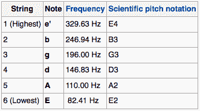

吉他调音的数字过程将遵循以下步骤：

1.  记录通过设备麦克风捕获的频率的实时样本。

1.  找到该样本中最突出的频率。

1.  计算出前表中最接近的频率，以检测正在演奏的是哪根弦。

1.  计算发出的频率与该弦的标准调音频率之间的差异，以便让用户纠正弦的张力。

我们还需要克服一些障碍，比如忽略低音量，这样我们就不会因为检测到不是来自琴弦的声音的频率而混淆用户。

在这个过程中，我们将使用原生代码，不仅因为我们需要处理 React Native API 中不可用的功能（例如，通过麦克风录音），而且因为我们可以以更有效的方式进行复杂的计算。我们将在这里使用的算法来检测从麦克风获取的样本中的主频率被称为**快速傅里叶变换**（**FFT**）。我们不会在这里详细介绍，但我们将使用一个原生库来执行这些计算。

这个应用程序的用户界面应该非常简单，因为我们只有一个屏幕来展示给用户。复杂性将存在于逻辑中，而不是展示一个漂亮的界面，尽管我们将使用一些图像和动画使其更具吸引力。重要的是要记住，界面是使应用程序在应用商店中吸引人的因素，所以我们不会忽视这一方面。

这就是我们的应用程序完成后的样子：

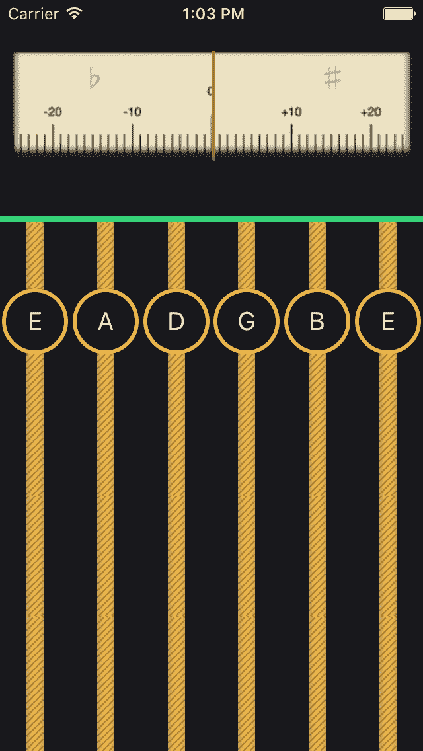

在屏幕顶部，我们的应用程序显示一个“模拟”调谐器，显示吉他弦发出的频率。一个红色指示器将在调谐器内移动，以显示吉他弦是否接近调谐频率。如果指示器在左侧，意味着吉他弦的频率较低，需要调紧。因此，用户应该尝试使指示器移动到调谐器的中间，以确保琴弦调谐。这是一种非常直观的方式来显示琴弦的调谐情况。

然而，我们需要让用户知道她试图调谐的是哪根琴弦。我们可以通过检测最接近的调谐频率来猜测这一点。一旦我们知道是哪根琴弦被按下，我们将在屏幕底部向用户显示它，那里有每根琴弦的表示，以及调谐后应该演奏的音符。我们将改变相应音符的边框颜色为绿色，以通知用户应用程序检测到了特定音符。

让我们回顾一下本章将涵盖的主题列表：

+   从 JavaScript 运行原生代码

+   动画图像

+   `<StatusBar />`

+   `propTypes`

+   添加启动画面

+   添加图标

# 设置文件夹结构

让我们使用 React Native 的 CLI 初始化一个 React Native 项目。该项目将命名为`guitarTuner`，并且将专门用于 iOS：

```jsx
react-native init --version="0.45.1" guitarTuner
```

由于这是一个单屏应用程序，我们不需要像 Redux 或 MobX 这样的状态管理库，因此，我们将使用一个简单的文件夹结构：

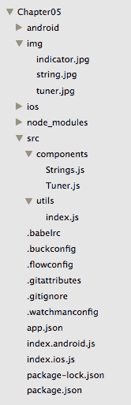

我们有三张图片来支持我们的自定义界面：

+   `indicator.jpg`：指示弦音调的红色条

+   `tuner.jpg`：指示器将移动的背景

+   `string.jpg`：吉他弦的表示

我们的`src/`文件夹包含两个子文件夹：

+   `components/`：这里存储了`<Strings/>`组件和`<Tuner/>`组件

+   `utils/`：这里保存了将在我们应用的几个部分中使用的函数和常量列表

最后，我们应用程序的入口点将是`index.ios.js`，因为我们将专门为 iOS 平台构建我们的应用程序。

让我们看看我们的`package.json`，以确定我们将有哪些依赖项：

```jsx
/*** package.json ***/

{
        "name": "guitarTuner",
        "version": "0.0.1",
        "private": true,
        "scripts": {
                "start": "node node_modules/react-native/
                local-cli/cli.js start",
                "test": "jest"
        },
        "dependencies": {
                "react": "16.0.0-alpha.12",
                "react-native": "0.45.1"
        },
        "devDependencies": {
                "babel-jest": "20.0.3",
                "babel-preset-react-native": "2.0.0",
                "jest": "20.0.4",
                "react-test-renderer": "16.0.0-alpha.12"
        },
        "jest": {
                "preset": "react-native"
        }
}
```

可以看到，除了由 React Native 的 CLI 在运行`init`脚本时创建的`react`和`react-native`之外，没有其他依赖项。

为了获得从麦克风录制的权限，我们还需要修改我们的`ios/guitarTuner/Info.plist`，添加一个*Microphone Usage Description*，这是一个要显示给用户的消息，请求在她的设备上访问麦克风。我们需要在最后的`</dict></plist>`之前添加这些行：

```jsx
<key>NSMicrophoneUsageDescription</key><key>NSMicrophoneUsageDescription</key> 
<string>This app uses the microphone to detect what guitar 
         string is being pressed.
</string>
```

通过这最后一步，我们应该已经准备好开始编写应用程序的 JavaScript 部分。但是，我们仍然需要设置我们将用于录制和频率检测的原生模块。

# 编写原生模块

我们需要 XCode 来编写原生模块，该模块将使用麦克风录制样本，并分析这些样本以计算主频率。由于我们对这些计算方式不感兴趣，我们将使用一个开源库来委托大部分录制和 FFT 计算。该库名为`SCListener`，其分支可以在[`github.com/emilioicai/sc_listener`](https://github.com/emilioicai/sc_listener)找到。

我们需要下载该库，并按照以下步骤将其文件添加到项目中：

1.  导航到我们的 iOS 项目所在的文件夹：`<project_folder>/ios/`。

1.  双击`guitarTuner.xcodeproj`，这将打开 XCode。

1.  右键单击`guitarTuner`文件夹，然后单击“添加文件到"guitarTuner"...”：

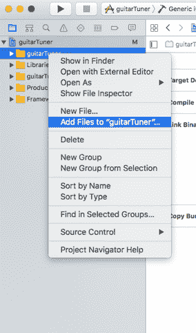

1.  选择从下载的`SCListener`库中选择所有文件：

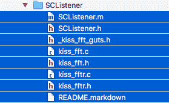

1.  单击 Accept。您应该在 XCode 中得到一个类似于这样的文件结构：

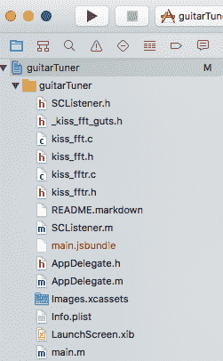

1.  `SCListener`需要安装 AudioToolbox 框架。我们可以通过在 XCode 中点击项目的根目录来实现这一点。

1.  选择 Build Phases 选项卡。

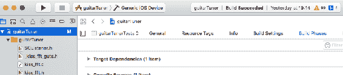

1.  转到 Link Binary with Libraries。

1.  单击+图标。

1.  选择 AudioToolbox.framework。

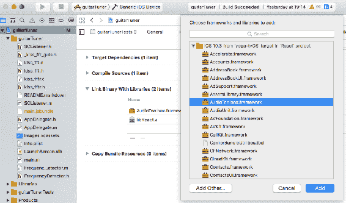

1.  现在，让我们添加一个将使用`SCListener`并将数据发送到 React Native 的模块。右键单击`guitarTuner`文件夹，然后单击 New File。

1.  添加一个名为`FrequencyDetector.h`的头文件：

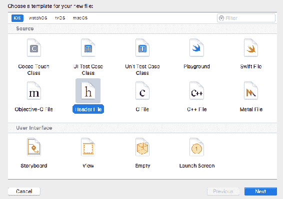

1.  让我们重复这个过程，为我们的模块添加一个实现文件：右键单击`guitarTuner`文件夹，然后单击 New File。

1.  添加一个名为`FrequencyDetector.m`的 Objective-C 文件：

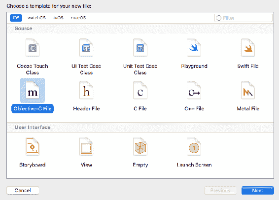

我们的模块`FrequencyDetector`现在已经准备好实现了。让我们看看`FrequencyDetector.h`应该是什么样子：

```jsx
/*** FrequencyDetector.h ***/

#import <React/RCTBridgeModule.h>
#import <Accelerate/Accelerate.h>

@interface FrequencyDetector : NSObject 
@end
```

它只导入了两个模块：`Accelerate`用于进行傅立叶变换计算，`RCTBridgeModule`用于使我们的本地模块与应用的 JavaScript 代码进行交互。现在，让我们来实现这个模块：

```jsx
/*** FrequencyDetector.m ***/

#import "FrequencyDetector.h"
#import "SCListener.h"

NSString *freq = @"";

@implementation FrequencyDetector

RCT_EXPORT_MODULE();

RCT_EXPORT_METHOD(getFrequency:(RCTResponseSenderBlock)callback)
{
  double power = [[SCListener sharedListener] averagePower];
  if(power < 0.03) { //ignore low volumes
    freq = @"0";
  } else {
    freq = [NSString stringWithFormat:@"%0.3f",
           [[SCListener sharedListener] frequency]];
  }
  callback(@[[NSNull null], freq]);
}

RCT_EXPORT_METHOD(initialise)
{
  [[SCListener sharedListener] listen];
}

@end
```

即使对于非 Objective-C 开发人员，这段代码也应该很容易理解：

1.  首先，我们导入`SCListener`，这个模块暴露了从设备麦克风录制和计算录制样本的 FFT 的方法

1.  然后，我们公开了两种方法：`getFrequency`和`initialise`

`getFrequency`的实现也非常简单。我们只需要通过调用我们的 SCListener 共享实例上的`averagePower`来读取麦克风上检测到的音量。如果音量足够强，我们就认为弹了一根吉他弦，所以我们更新一个名为`freq`的变量，它将被传递到我们 JavaScript 代码提供的回调中。请注意，由于本地代码和 JavaScript 代码之间的桥接的性质，只能通过回调（或承诺）将数据发送回 JavaScript。

我们将本地世界中的方法暴露到 JavaScript 世界的方式是使用`RCTBridgeModule`提供的宏`RCT_EXPORT_METHOD`。我们还需要让 React Native 知道这个模块可以从我们的 JavaScript 代码中使用。我们通过调用另一个宏来做到这一点：`RCT_EXPORT_MODULE`。这就是我们需要的全部；从这一刻起，我们可以使用这个模块的方法：

```jsx
import { NativeModules } from 'react-native';
var FrequencyDetector = NativeModules.FrequencyDetector;

FrequencyDetector.initialise();
FrequencyDetector.getFrequency((res, freq) => {});
```

正如我们所看到的，我们将一个回调传递给`getFrequency`，其中将接收当前记录的频率。我们现在可以使用这个值来计算按下了哪根弦以及它的调谐情况。让我们看看我们将如何在我们应用程序的 JavaScript 组件中使用这个模块。

# index.ios.js

我们已经看到了我们如何访问我们从本地模块`FrequencyDetector`中暴露的方法。现在让我们看看如何在我们的组件树中使用它来更新我们应用程序的状态：

```jsx
/*** index.ios.js ***/

...

var FrequencyDetector = NativeModules.FrequencyDetector;

export default class guitarTuner extends Component {

  ...

  componentWillMount() {
 FrequencyDetector.initialise();
    setInterval(() => {
      FrequencyDetector.getFrequency((res, freq) => {
        let stringData = getClosestString(parseInt(freq));
        if(!stringData) {
          this.setState({
            delta: null,
            activeString: null
          });
        } else {
          this.setState({
            delta: stringData.delta,
            activeString: stringData.number
          });
        }
      });
    }, 500);
  }

 ...

});

AppRegistry.registerComponent('guitarTuner', () => guitarTuner);
```

大部分逻辑将放在我们的入口文件的`componentWillMount`方法中。我们需要初始化`FrequencyDetector`模块，从设备的麦克风开始监听，然后我们调用`setInterval`来重复（每 0.5 秒）调用`FrequencyDetector`的`getFrequency`方法来获取更新的显著频率。每次我们获得一个新的频率，我们将通过调用一个名为`getClosestString`的支持函数来检查最可能被按下的吉他弦，并将返回的数据保存在我们的组件状态中。我们将把这个函数存储在我们的`utils`文件中。

# utils

在继续`index.ios.js`之前，让我们看看我们位于`src/utils/index.js`中的`utils`文件：

```jsx
/*** src/utils/index.js ***/

const stringFrequencies = [
  { min: 287, max: 371, tuned: 329 },
  { min: 221, max: 287, tuned: 246 },
  { min: 171, max: 221, tuned: 196 },
  { min: 128, max: 171, tuned: 146 },
  { min: 96, max: 128, tuned: 110 },
  { min: 36, max: 96, tuned: 82}
];

export function getClosestString(freq) {
  let stringData = null;
  for(var i = 0; i < stringFrequencies.length; i++) {
    if(stringFrequencies[i].min < freq && stringFrequencies[i].max 
       >= freq){
      let delta = freq - stringFrequencies[i].tuned; //absolute delta
      if(delta > 0){
        delta = Math.floor(delta * 100 / (stringFrequencies[i].max - 
                           stringFrequencies[i].tuned));
      } else {
        delta = Math.floor(delta * 100 / (stringFrequencies[i].tuned - 
                           stringFrequencies[i].min));
      }
      if(delta > 75) delta = 75; //limit deltas
      if(delta < -75) delta = -75;
      stringData = { number: 6 - i, delta } //relative delta
      break;
    }
  }
  return stringData;
}

export const colors = {
  black: '#1f2025',
  yellow: '#f3c556',
  green: '#3bd78b'
}

```

`getClosestString`是一个函数，根据提供的频率，将返回一个包含两个值的 JavaScript 对象：

+   `number`：这是最可能被按下的吉他弦的数字

+   `delta`：这是提供的频率与最可能被按下的吉他弦的调谐频率之间的差异

我们还将导出一组颜色及其十六进制表示，这将被一些用户界面组件使用，以保持整个应用程序的一致性。

在调用`getClosestString`之后，我们有足够的信息来构建我们应用程序的状态。当然，我们需要将这些数据提供给调谐器（显示吉他弦的调谐情况）和弦的表示（显示哪根吉他弦被按下）。让我们看看整个根组件，看看这些数据是如何在组件之间传播的：

```jsx
/*** index.ios.js ***/

import React, { Component } from 'react';
import {
  AppRegistry,
  StyleSheet,
  Image,
  View,
  NativeModules,
  Animated,
  Easing,
  StatusBar,
  Text
} from 'react-native';
import Tuner from './src/components/Tuner';
import Strings from './src/components/Strings';
import { getClosestString, colors } from './src/utils/';

var FrequencyDetector = NativeModules.FrequencyDetector;

export default class guitarTuner extends Component {
  state = {
 delta: null,
    activeString: null
  }

  componentWillMount() {
    FrequencyDetector.initialise();
    setInterval(() => {
      FrequencyDetector.getFrequency((res, freq) => {
        let stringData = getClosestString(parseInt(freq));
        if(!stringData) {
          this.setState({
            delta: null,
            activeString: null
          });
        } else {
          this.setState({
            delta: stringData.delta,
            activeString: stringData.number
          });
        }
      });
    }, 500);
  }

  render() {
    return (
      <View style={styles.container}>
 <StatusBar barStyle="light-content"/>
        <Tuner delta={this.state.delta} />
        <Strings activeString={this.state.activeString}/>
      </View>
    );
  }
}

const styles = StyleSheet.create({
  container: {
    backgroundColor: colors.black,
    flex: 1
  }
});

AppRegistry.registerComponent('guitarTuner', () => guitarTuner);
```

我们将使用两个组件来渲染当前按下的弦（`<Strings/>`）以及按下的弦的调谐程度（`<Tuner/>`）。

除此之外，我们还使用了一个名为`<StatusBar/>`的 React Native 组件。`<StatusBar/>`允许开发人员选择应用程序在顶部栏中显示的颜色，其中显示运营商、时间、电池电量等：

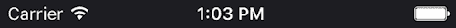

因为我们希望我们的应用有一个黑色的背景，我们决定使用`light-content`的 bar 样式。这个组件允许我们完全隐藏 bar，改变其背景颜色（仅限 Android），或隐藏网络活动，等等。

现在让我们转向显示所有视觉组件的组件。我们将从`<Tuner/>`开始。

# 调谐器

我们的`<Tuner/>`组件包括两个元素：一个背景图像将屏幕分成几个部分，以及一个指示器，它将根据弹奏的吉他弦的音调移动。为了使其用户友好，我们将使用动画来移动指示器，类似于模拟调谐器的行为：

```jsx
/*** src/components/Tuner/index ***/

import React, { Component } from 'react';
import {
  StyleSheet,
  Image,
  View,
  Animated,
  Easing,
  Dimensions
} from 'react-native';

import { colors } from '../utils/';

var {height, width} = Dimensions.get('window');

export default class Tuner extends Component {
  state = {
 xIndicator:  new Animated.Value(width/2)
  }

  static propTypes = {
    delta: React.PropTypes.number
  }

  componentWillReceiveProps(newProps) {
    if(this.props.delta !== newProps.delta) {
      Animated.timing(
        this.state.xIndicator,
        {
          toValue: (width/2) + (newProps.delta*width/2)/100,
          duration: 500,
          easing: Easing.elastic(2)
        }
      ).start();
    }
  }

  render() {
    let { xIndicator } = this.state;

    return (
      <View style={styles.tunerContainer}>
        <Image source={require('../../img/tuner.jpg')} 
         style={styles.tuner}/>
 <Animated.Image source={require('../../img/indicator.jpg')} 
         style={[styles.indicator, {left: xIndicator}]}/>
      </View>
    )
  }
}

const styles = StyleSheet.create({
  tunerContainer: {
    flex: 1,
    backgroundColor: colors.black,
    marginTop: height * 0.05
  },
  tuner: {
    width,
    resizeMode: 'contain'
  },
  indicator: {
    position: 'absolute',
    top: 10
  }
});
```

我们将使用组件的`state`变量来进行动画命名为`xIndicator`，它将以动画方式存储指示器应该在的位置的值。记住，越接近中心，弦的音调就会调得越好。我们将使用`componentWillReceiveProps`方法和`Animated.timing`函数每次从父组件接收到新的`delta`属性时更新这个值，以确保图像是动画的。为了使其更加逼真，我们还添加了一个缓动函数，这将使指示器像真正的模拟指示器一样弹跳。

我们还为我们的类添加了一个`propTypes`静态属性进行类型检查。这样我们就可以确保我们的组件以正确的格式接收到一个 delta。

最后，还记得我们在`utils`文件中导出了颜色列表及其十六进制值吗？我们在这里使用它来显示这个组件的背景颜色是什么。

# 弦

最后一个组件是吉他的六根弦的表示。当我们的`FrequencyDetector`原生模块检测到弹奏的频率时，我们将通过将音符容器的边框更改为绿色来显示具有发射最接近频率的弦：

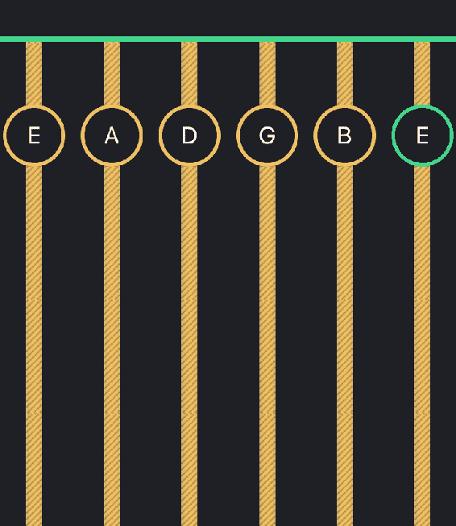

因此，我们需要从其父组件接受一个属性：活动吉他弦的编号。让我们来看一下这个简单组件的代码：

```jsx
/*** src/components/Strings ***/

import React, { Component } from 'react';
import {
  StyleSheet,
  Image,
  View,
  Text
} from 'react-native';

import { colors } from '../utils/';

const stringNotes = ['E','A','D','G','B','E'];

export default class Strings extends Component {
 static propTypes = {
    activeString: React.PropTypes.number
  }

  render() {
    return (
      <View style={styles.stringsContainer}>
        {
          stringNotes.map((note, i) => {
            return (
              <View key={i} style={styles.stringContainer}>
                <Image source={require('../../img/string.jpg')} 
                 style={styles.string}/>
                <View style={[styles.noteContainer, 
                 {borderColor: (this.props.activeString === (i+1))
                  ? '#3bd78b' : '#f3c556'}]}>
                  <Text style={styles.note}>
                    {note}
                  </Text>
                </View>
              </View>
            )
          })
        }
      </View>
    );
  }
}

const styles = StyleSheet.create({
  stringsContainer: {
    borderTopColor: colors.green,
    borderTopWidth: 5,
 justifyContent: 'space-around',
    flexDirection: 'row'
  },
  stringContainer: {
    alignItems: 'center'
  },
  note: {
    color: 'white',
    fontSize: 19,
    textAlign: 'center'
  },
  noteContainer: {
    top: 50,
    height: 50,
    width: 50,
    position: 'absolute',
    padding: 10,
    borderColor: colors.yellow,
    borderWidth: 3,
    borderRadius: 25,
    backgroundColor: colors.black
  }
});
```

我们正在渲染六个图像，每个代表一根吉他弦，并使用`space-around`来使它们在整个设备屏幕上分布，留下两个小空间。我们使用一个包含吉他每根弦音符的常量数组将它们映射到字符串表示中。我们还将使用从其父级接收到的`activeString`属性来决定是否应该为每个音符显示黄色边框还是绿色边框。

我们再次使用`propTypes`来检查所提供的属性的类型（在这种情况下是一个数字）。

这就是我们构建吉他调音器所需的所有代码。现在让我们添加一个图标和一个启动画面，使应用程序准备好提交到 App Store。

# 添加图标

一旦我们设计好图标并将其保存为大图像，我们需要将其调整为苹果要求的所有格式。一般来说，这些是所需的尺寸：

+   20 x 20 px（iPhone Notification 2x）

+   60 x 60 px（iPhone Notification 3x）

+   58 x 58 px（iPhone Spotlight - iOS 5,6 2x）

+   67 x 67 px（iPhone Spotlight - iOS 5,6 3x）

+   80 x 80 px（iPhone Spotlight - iOS 7-10 2x）

+   120 x 120 px（iPhone Spotlight - iOS 7-10 3x && iPhone App ios 7-10 2x）

+   180 x 180 px（iPhone App ios 7-10 3x）

由于这是一个非常繁琐的过程，我们可以使用在线工具之一，通过提供足够大的图像来自动完成所有调整大小的任务。最受欢迎的工具之一可以在[`resizeappicon.com/`](https://resizeappicon.com/)找到。

一旦我们有了适当尺寸的图标，我们需要将它们添加到我们的 XCode 项目中。我们可以通过在 XCode 中点击`Images.xcassets`，并将每个图像与其相应的尺寸添加到此窗口中的每个资产来实现这一点：

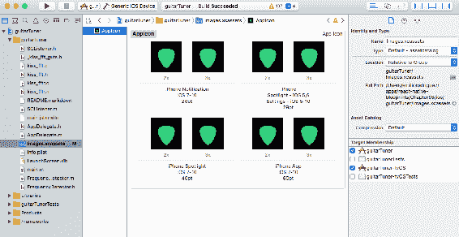

下次编译我们的应用程序时，我们将在模拟器中看到我们的新图标（使用*command* + *Shift* + *H*来显示主屏幕）。

# 添加启动画面

启动画面是 iOS 在应用程序加载时显示的图像。有几种技术可以使这个介绍对用户愉快，比如显示用户界面的预览，用户一旦加载应用程序就会看到。然而，我们将采用更简单的方法：我们将显示带有标题的应用程序标志。

最简单和更灵活的方法是使用 XCode 中的界面构建器，通过点击`LaunchScreen.xib`来实现：

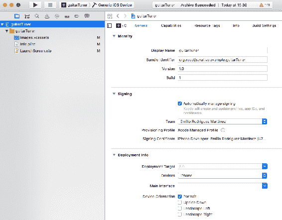

我们需要取消勾选左横向和右横向选项，以便在所有情况下只允许纵向模式。

# 总结

这个应用程序的主要挑战是从我们的 JavaScript 代码访问用 Objective-C 编写的本地模块。幸运的是，React Native 有手段可以用相对较少的代码轻松实现这两个世界之间的通信。

我们只专注于 iOS 应用程序，但现实情况是，在 Android 中构建相同的应用程序应该遵循非常相似的过程，考虑到我们应该用 Java 而不是 Objective-C 构建我们的本地模块。此外，我们学会了在应用程序中包含图标和启动屏幕的过程，以完成发布前的开发周期。

由于我们的应用程序只有一个屏幕，我们选择不使用任何路由或状态管理库，这使我们能够将重点放在我们的 JavaScript 代码和我们实现的本地模块之间的通信上。

我们还创建了一些动画来模拟模拟调谐器，为这个应用程序增添了吸引人和有趣的外观。

除了图标和启动屏幕外，我们还注意到了另一个在许多应用程序中很重要的视觉元素：状态栏。我们看到了根据我们的应用程序外观轻松更改其内容颜色有多容易。在这种情况下，我们选择了深色背景，因此我们需要在状态栏中使用浅色内容，尽管一些应用程序（如游戏）可能在没有状态栏的情况下看起来更好。

在下一章中，我们将转向一种不同类型的应用程序：即消息应用程序。
