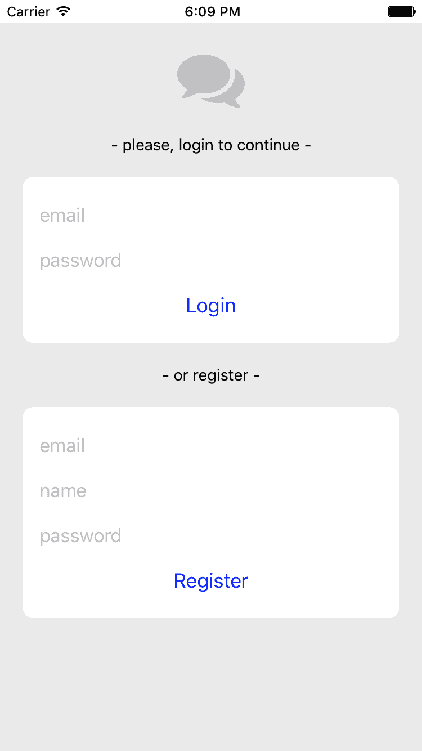
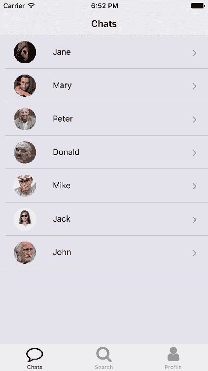
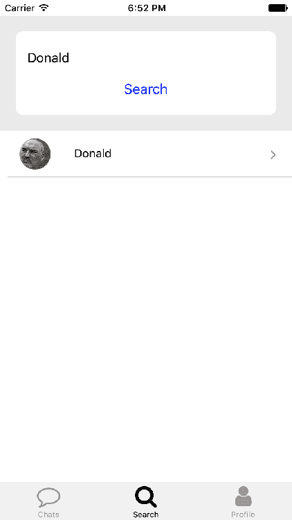
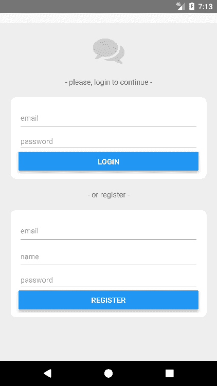
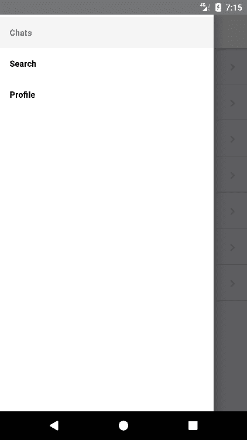
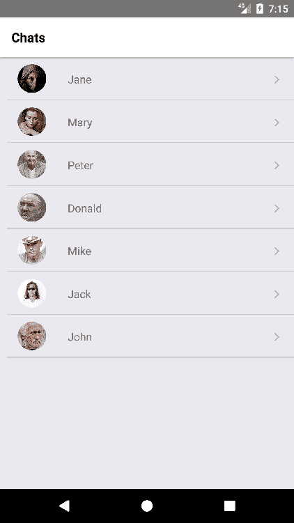
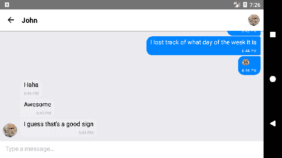
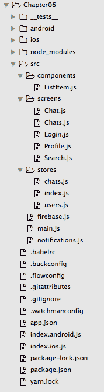

# 第六章：消息应用

一对一通信是手机的主要用途，尽管短信已经很快被直接消息应用所取代。在本章中，我们将使用 React Native 和 Firebase 构建一个消息应用，Firebase 是一个移动后端服务，可以使我们摆脱为应用构建整个后端的工作。相反，我们将专注于完全从前端处理应用的状态。当然，这可能会有安全方面的影响，需要最终解决，但为了保持本书对 React Native 功能的关注，我们将坚持在应用内部保留所有逻辑的方法。

Firebase 是一个建立在自同步数据集合上的实时数据库，它与 MobX 非常搭配，所以我们将再次使用它来控制应用的状态。但在本章中，我们将更深入地挖掘，因为我们将构建更大的数据存储，这些数据将通过`mobx-react`连接器注入到我们的组件树中。

我们将构建该应用，使其可以在 iOS 和 Android 上使用，为导航编写一些特定于平台的代码（我们将在 iOS 上使用选项卡导航，在 Android 上使用抽屉导航）。

为了减少代码的大小，在本章中，我们将专注于功能而不是设计。大部分用户界面将是简单明了的，但我们会尽量考虑可用性。此外，我们将在我们的聊天屏幕上使用`react-native-gifted` chat--一个预先构建的 React Native 组件，用于根据消息列表渲染聊天室。

# 概述

消息应用需要比我们在前几章中审查的应用更多的工作，因为它需要一个用户管理系统，包括登录、注册和退出登录。我们将使用 Firebase 作为后端来减少构建此系统的复杂性。除了用户管理系统，我们还将使用他们的推送通知系统，在新消息发送给用户时通知用户。Firebase 还提供了分析平台、lambda 函数服务和免费的存储系统，但我们将从中获益最多的功能是他们的实时数据库。我们将在那里存储用户的个人资料、消息和聊天数据。

让我们看看我们的应用将会是什么样子，以便心中有个印象，我们将要构建的屏幕：



第一个屏幕将是登录/注册屏幕，因为我们需要用户提供姓名和一些凭据，以将他们的设备连接到特定帐户，这样他们就可以接收每条消息的推送通知。这两种身份验证方法都使用 Firebase 的 API 进行验证，成功后将显示聊天屏幕：



在联系人列表中按下一个联系人时，应用程序将在聊天屏幕中显示与所选联系人的对话：


聊天屏幕将显示所有为登录用户启动的聊天。最初，这个屏幕将是空的，因为用户还没有开始任何聊天。要开始对话，用户应该去搜索屏幕以找到一些联系人：



这是一个简单的屏幕，用户可以在其中输入联系人姓名以在数据库中搜索。如果联系人的姓名匹配，用户将能够点击它开始对话。从那时起，对话将显示在聊天屏幕中。

最后一个屏幕是个人资料屏幕：


这个屏幕只是用来注销当前用户的。在扩展应用程序时，我们可以添加更多功能，比如更改头像或用户名。

虽然安卓上的应用程序看起来非常相似，但导航将被抽屉取代，从抽屉中可以访问所有屏幕。让我们来看看安卓版本：



登录/注册屏幕具有标准的文本输入和按钮组件用于安卓：



用户登录后，可以通过滑动手指手势打开抽屉来浏览所有屏幕。默认登录后打开的屏幕是聊天屏幕，我们将列出用户拥有的所有打开对话的列表：



从这个屏幕上，用户可以按下特定的对话来列出其中的消息：


接下来的屏幕是搜索屏幕，用于搜索其他用户并与他们开始对话：


最后一个屏幕是个人资料屏幕，可以在其中找到 LOGOUT 按钮：


该应用程序将在横向和纵向模式下在两个平台上运行：



正如我们可以想象的那样，这个应用程序将需要一个强大的后端环境来存储我们的用户、消息和状态。此外，我们将需要一个推送通知平台，在用户收到任何消息时通知他们。由于本书专注于 React Native，我们将把所有这些后端工作委托给移动世界中最流行的移动后端服务之一：Firebase。

在开始编码之前，我们将花一些时间设置我们的 Firebase 推送通知服务和实时数据库，以更好地了解我们的应用程序将要处理的数据类型。

总之，本章我们将涉及以下主题：

+   React Native 中的复杂 Redux

+   Firebase 实时数据库

+   Firebase 推送通知

+   Firebase 用户管理

+   表单

让我们首先回顾一下我们将使用的数据模型以及我们的应用程序如何与 Firebase 连接以同步其数据。

# Firebase

Firebase 是一种**移动后端服务**（**MBaaS**），这意味着它为移动开发人员提供了所有后端必需品，如用户管理、无 SQL 数据库和推送通知服务器。它通过官方的 node 包轻松集成到 React Native 中，这为数据库连接提供了免费的服务。不幸的是，Firebase 并没有为他们的推送通知服务提供 JavaScript SDK，但有几个 React Native 库通过将 Firebase 的 iOS 和 Java SDK 与 JavaScript 接口进行桥接来填补这一空白。我们将使用`react-native-fcm`，因为它在这一领域最成熟。

在 Firebase MBaaS 上构建应用程序之前，您需要为其创建一个项目。这是一个免费的过程，可以在 Firebase 的网站[`firebase.google.com/`](https://firebase.google.com/)上找到解释。虽然这个过程与 React Native 没有直接相关，但这是一个很好的起点，可以帮助我们了解如何为我们的应用程序设置和使用 MBaaS。通过遵循 Firebase 文档网站上提供的教程，大部分配置可以在几分钟内完成。设置这个 MBaaS 的好处使得这几分钟的时间和初始麻烦都是值得的。

要设置 Firebase 并将我们的应用连接到正确的项目，我们需要使用在 Firebase 项目仪表板内的设置屏幕中找到的`web 配置`片段。我们将此初始化片段添加到`src/firebase.js`中：

```jsx
import firebase from 'firebase';

var firebaseConfig = {
  apiKey: "<Your Firebase API key>",
  authDomain: "<Your Firebase Auth domain>",
  databaseURL: "<Your Firebase database URL>",
  projectId: "<Your Firebase projectId>",
  storageBucket: "<Your Firebase storageBucket>",
  messagingSenderId: "<Your messaging SenderId>"
};

export const firebaseApp = firebase.initializeApp(firebaseConfig);
```

项目设置完成后，我们可以开始查看我们的数据库将如何被构建。

# 实时数据库

Firebase 允许移动开发人员使用云托管的 noSQL 数据库在用户和设备之间存储和同步数据。更新后的数据在毫秒内同步到连接的设备上，如果应用程序离线，数据仍然可用，无论网络连接如何，都提供了良好的用户体验。

在考虑一对一通信应用程序应处理的基本数据时，涉及三个数据模型：

+   `users`：这将存储头像、名称和推送通知令牌。这里不需要存储身份验证数据，因为它是通过不同的 Firebase API（身份验证 API）处理的。

+   `messages`：我们将在每个聊天室中单独保存每条消息，以便使用聊天室 ID 作为键进行轻松检索。

+   `chats`：所有有关已打开聊天的信息都将存储在这里。

为了了解我们将如何请求和使用我们应用程序中的数据，让我们看一下我们实际可以用于测试的示例数据的要点：

```jsx
{
  "chats" : {
    "--userId1--" : {
      "--userId2----userId1--" : {
        "contactId" : "--userId2--",
        "image" : "https://images.com/person2.jpg",
        "name" : "Jason"
      }
    },
    "--userId2--" : {
      "--userId2----userId1--" : {
        "contactId" : "--userId1--",
        "image" : "https://images.com/person1.jpg",
        "name" : "John"
      }
    }
  },
  "messages" : {
    "--userId2----userId1--" : {
      "-KpEwU8sr01vHSy3qvRY" : {
        "_id" : "2367ad00-301d-46b5-a7b5-97cb88781489",
        "createdAt" : 1500284842672,
        "text" : "Hey man!",
        "user" : {
          "_id" : "--userId2--",
          "name" : "Jason"
        }
      }
    }
  },
  "users" : {
    "--userId1--" : {
      "name" : "John",
      "notificationsToken" : ""
    },
    "--userId2--" : {
      "name" : "Jason",
      "notificationsToken" : "--notificationsId1--"
    }
  }
}
```

我们以一种易于消息应用程序检索和同步的方式组织我们的数据。我们没有对数据结构进行规范化，而是引入了一些数据重复，以增加数据检索速度，并将前端代码简化到最大程度。

`users`集合使用用户 ID 作为键（`--user1--`和`--user2--`）保存用户数据。这些用户 ID 在注册/登录期间由 Firebase 自动检索。每个用户都有一个通知令牌，这是用户登录的设备的标识符，用于推送通知服务。当用户注销时，通知令牌将被删除，因此发送给该用户的消息将被存储，但不会通知到任何设备。

`chats`集合通过用户 ID 存储每个用户的聊天列表。每个聊天都有自己的 ID（两个用户 ID 的连接），并且将被复制，因为该聊天中的每个用户都应该有聊天数据的副本。在每个副本中，有足够的信息供另一个用户构建他们的聊天屏幕。

`messages`集合存储在一个单独的集合中，可以通过该 ID 引用。每个聊天 ID 指向一个消息列表（在本例中只有一个），其中存储了聊天屏幕所需的所有数据。在这个集合中也存在一些重复，因为一些用户数据与每条消息一起存储，以减少构建聊天屏幕时所需的请求数量。

在他们的网站上可以找到有关如何在 Firebase 的实时数据库中读写数据的完整教程（[`firebase.google.com/docs/database/`](https://firebase.google.com/docs/database/)），但是我们将快速浏览一下我们在本章中将使用的方法。

# 从 Firebase 的数据库中读取数据

有两种从 Firebase 的数据库中检索数据的方法。第一种设置一个监听器，每当数据更改时都会被调用，因此我们只需要为我们应用程序的整个生命周期设置一次：

```jsx
firebaseApp.database().ref('/users/' + userId).on('value', (snapshot) => {
  const userObj = snapshot.val();
  this.name = userObj.name;
  this.avatar = userObj.avatar;
});

```

正如我们所看到的，为了检索数据的快照，我们需要在我们的`src/firebase.js`文件中创建的`firebaseApp`对象中调用`database()`方法。然后，我们将拥有一个`database`对象，我们可以在其上调用`ref('<uri>')`，传递数据存储的 URI。这将返回一个由该 URI 指向的数据片段的引用。我们可以使用`on('value', callback)`方法，它将附加一个回调，传递数据的快照。Firebase 总是将对象返回为快照，因此我们需要自己将它们转换为普通数据。在这个例子中，我们想要检索一个具有两个键（`name`和`avatar`）的对象，所以我们只需要在快照上调用`val()`方法来检索包含数据的普通对象。

如果我们不需要检索的数据在每次更新时自动同步，我们可以使用`once()`方法代替`on()`：

```jsx
import firebase from 'firebase';
import { firebaseApp } from '../firebase';

firebaseApp.database().ref('/users/' + userId).once('value')
.then((snapshot) => {
  const userObj = snapshot.val();
  this.name = userObj.name;
  this.avatar = userObj.avatar;
});
```

接收快照的回调只会被调用一次。

# 更新 Firebase 数据库中的数据

在 Firebase 数据库中写入数据也可以通过两种不同的方式完成：

```jsx
firebaseApp.database().ref('/users/' + userId).update({
  name: userName
});
```

`update()`根据作为参数传递的键和值更改由提供的 URI 引用的对象。对象的其余部分保持不变。

另一方面，`set()`将用我们提供的参数替换数据库中的对象：

```jsx
firebaseApp.database().ref('/users/' + userId).set({
  name: userName,
  avatar: avatarURL
});
```

最后，如果我们想要添加一个新的数据快照，但是我们希望 Firebase 为其生成一个 ID，我们可以使用`push`方法：

```jsx
firebaseApp.database().ref('/messages/' + chatId).push().set(message);
```

# 身份验证

我们将使用 Firebase 身份验证服务，因此我们不需要担心存储登录凭据、处理忘记的密码或验证电子邮件。 这些以及其他相关任务都可以通过 Firebase 身份验证服务免费完成。

为了通过电子邮件和密码激活登录和注册，我们需要在 Firebase 仪表板中将此方法作为会话登录方法启用。 有关如何执行此操作的更多信息，请访问 Firebase 网站上的[`firebase.google.com/docs/auth/web/password-auth`](https://firebase.google.com/docs/auth/web/password-auth)。

在我们的应用中，我们只需要使用提供的 Firebase SDK 进行登录：

```jsx
firebase.auth().signInWithEmailAndPassword(username, password)
  .then(() => {
        //user is logged in
  })
  .catch(() => {
        //error logging in
  })
})

```

对于注册，我们可以使用以下代码：

```jsx
firebase.auth().createUserWithEmailAndPassword(email, password)
.then((user) => {
   //user is registered
})
.catch((error) => {
   //error registering
})
```

所有令牌处理将由 Firebase 处理，我们只需要添加一个监听器来确保我们的应用在身份验证状态更改时得到更新：

```jsx
firebase.auth().onAuthStateChanged((user) => {
  //user has logged in or out
}
```

# 设置文件夹结构

让我们使用 React Native 的 CLI 初始化一个 React Native 项目。 该项目将被命名为`messagingApp`，并将可用于 iOS 和 Android 设备：

```jsx
react-native init --version="0.45.1" messagingApp
```

我们将使用 MobX 来管理我们应用的状态，因此我们将需要一个用于我们存储的文件夹。 其余的文件夹结构对大多数 React 应用程序来说是标准的：



我们需要五个屏幕（`Chats`，`Chat`，`Login`，`Profile`和`Search`），一个组件（`ListItem`）和两个存储（`chats`和`users`），这些将通过`stores/index.js`文件可用。 我们还将使用两个辅助程序来支持我们的应用：

+   `notifications.js`：与推送通知相关的所有逻辑将存储在此文件中

+   `firebase.js`：这包括 Firebase SDK 的配置和初始化

由于我们将使用 MobX 和其他几个依赖项，让我们查看一下我们的`package.json`文件，以了解我们将使用哪些包：

```jsx
/*** package.json ***/

{
        "name": "messagingApp",
        "version": "0.0.1",
        "private": true,
        "scripts": {
                "start": "node node_modules/react-native/local-cli
                         /cli.js start",
                "test": "jest"
        },
        "dependencies": {
                "firebase": "⁴.1.3",
                "mobx": "³.2.0",
                "mobx-react": "⁴.2.2",
                "react": "16.0.0-alpha.12",
                "react-native": "0.45.1",
                "react-native-fcm": "⁷.1.0",
                "react-native-gifted-chat": "⁰.2.0",
                "react-native-keyboard-aware-scroll-view": "⁰.2.9",
                "react-native-vector-icons": "⁴.2.0",
                "react-navigation": "¹.0.0-beta.11"
        },
        "devDependencies": {
                "babel-jest": "20.0.3",
                "babel-plugin-transform-decorators-legacy": "¹.3.4",
                "babel-preset-react-native": "2.1.0",
                "jest": "20.0.4",
                "react-test-renderer": "16.0.0-alpha.12"
        },
        "jest": {
                "preset": "react-native"
        }
}
```

我们将使用的一些 npm 包是：

+   `firebase`：Firebase 的身份验证和数据库连接的 SDK

+   `mobx`：MobX 将处理我们的应用状态

+   `react-native-fcm`：Firebase 的推送消息 SDK

+   `react-native-gifted-chat`：用于渲染聊天室的库，包括日期分隔、头像和许多其他功能

+   `react-native-keyboard-aware-scroll-view`：一个库，确保在处理表单时屏幕键盘不会隐藏任何焦点文本输入

+   `react-native-vector-icons`：我们将在此应用中使用 Font Awesome 图标

+   `react-navigation`：我们将有一个抽屉，一个选项卡和一个堆栈导航器来处理我们应用程序中的屏幕

+   `babel-plugin-transform-decorators-legacy`：这个库允许我们使用装饰器（使用传统的@语法），在使用 MobX 时非常有用

运行`npm install`后，我们的应用程序将准备好开始编码。与以前的应用程序一样，我们的消息应用程序的入口点将在`index.ios.js`（iOS）和`index.android.js`（Android）中是相同的代码：

```jsx
/*** index.ios.js and index.android.js ***/ 

import React from 'react'
import { AppRegistry } from 'react-native';
import App from './src/main';

import { Provider } from 'mobx-react/native';
import { chats, users } from './src/stores';

class MessagingApp extends React.Component {
  render() {
    return (
      <Provider users={users} chats={chats}>
        <App/>
      </Provider>
    )
  }
}

AppRegistry.registerComponent('messagingApp', () => MessagingApp);
```

这是一种使用 MobX 启动 React Native 应用程序的标准方式--`<Provider />`作为根元素提供，以将两个商店（`users`和`chats`）注入到我们应用程序的屏幕中。所有初始化和导航逻辑都已延迟到`src/main.js`文件中：

```jsx
/*** src/main.js ***/

import React from 'react'
import { DrawerNavigator,TabNavigator } from 'react-navigation'
import { Platform, View } from 'react-native'
import { observer, inject } from 'mobx-react/native'

import Login from './screens/Login'
import Chats from './screens/Chats'
import Profile from './screens/Profile'
import Search from './screens/Search'
import { users, chats } from './stores'

let Navigator;
if(Platform.OS === 'ios'){
  Navigator = TabNavigator({
    Chats: { screen: Chats },
    Search: { screen: Search },
    Profile: { screen: Profile }
  }, {
    tabBarOptions: {
      inactiveTintColor: '#aaa',
      activeTintColor: '#000',
      showLabel: true
    }
  });
} else {
  Navigator = DrawerNavigator({
    Chats: { screen: Chats },
    Search: { screen: Search },
    Profile: { screen: Profile }
  });
}

@inject('users') @observer
export default class App extends React.Component {
  constructor() {
    super();
  }

  render() {
 if(this.props.users.isLoggedIn){
      return <Navigator/>
    } else {
      return <Login/>
    }
  }
}
```

在`src/main.js`文件中我们可以看到的第一件事是，我们将使用不同的导航器，取决于我们运行应用程序的平台：iOS 将打开一个选项卡导航器，而 Android 将打开一个基于抽屉的导航器。

然后，我们看到我们将在应用程序中的许多组件中重复的一行：

```jsx
@inject('users') @observer
```

这是告诉 MobX 这个组件需要接收`users`商店的方式。然后 MobX 将其作为属性传递给这个组件，因此我们可以使用它所持有的所有方法和属性。在这种情况下，我们对`isLoggedIn`属性感兴趣，以便在用户尚未登录时向用户呈现`<Login />`屏幕。由于 MobX 将这个属性注入为我们组件的属性，访问它的正确方式将是`this.props.users.isLoggedIn`。

在继续构建组件之前，让我们看一下我们将在本章中使用的商店，以更好地了解可用的数据和操作。

# 用户商店

这个商店负责保存所有围绕用户的数据和逻辑，但也帮助`chats`商店在用户登录时初始化：

```jsx
/*** src/stores/users.js ***/

import {observable, computed, map, toJS, action} from 'mobx';
import chats from './chats'
import firebase from 'firebase';
import { firebaseApp } from '../firebase';
import notifications from '../notifications'

class Users {
        @observable id = null;
        @observable isLoggedIn = false;
        @observable name = null;
        @observable avatar = null;
        @observable notificationsToken = null;
        @observable loggingIn = false;
        @observable registering = false;
        @observable loggingError = null;
        @observable registeringError = null;

        @action login = function(username, password) {
                //login with Firebase email/password method
        }

        @action logout = function() {
                //logout from Firebase authentication service
        }

        @action register = function(email, password, name) {
                //register through firebase authentication service
        }

        @action setNotificationsToken(token) {
                //store the notifications token for this device
        }

        searchUsers(name) {
                //helper for searching users by name in the database
        }

        constructor() {
                this.bindToFirebase();
        }

        bindToFirebase() {
                //Initialise connection to Firebase user 
                //authentication status and data
        }
}

const users = new Users();

export default users;
```

这些都是我们在这个商店中需要的所有属性和方法。有几个标志（那些包含动词-ing 形式的属性）需要注意网络活动。现在让我们实现每个方法：

```jsx
@action login = function(username, password) {
        this.loggingIn = true;
        this.loggingError = null;
        firebase.auth().signInWithEmailAndPassword(username, password)
        .then(() => {
                this.loggingIn = false;
                notifications.init((notificationsToken) => {
                        this.setNotificationsToken(notificationsToken);
                });
        })
        .catch((error) => {
                this.loggingIn = false;
                this.loggingError = error.message;
        });
}
```

使用 Firebase 登录就像在他们的身份验证 SDK 上调用`signInWithEmailAndPassword`一样简单。如果登录成功，我们将初始化通知模块以使设备能够接收推送通知。在注销时，我们将遵循相反的路径：

```jsx
@action logout = function() {
        notifications.unbind();
        this.setNotificationsToken('');
        firebase.auth().signOut();
}
```

在注册操作中，除了设置网络活动的适当标志之外，我们还需要验证用户输入了名称，初始化通知，并将名称存储在数据库中：

```jsx
@action register = function(email, password, name) {
        if(!name || name == '') {
                this.registering = false;
                this.registeringError = 'Name was not entered';
                return;
        }
        this.registering = true;
        this.registeringError = null;
        firebase.auth().createUserWithEmailAndPassword(email, password)
        .then((user) => {
                this.registering = false;
                notifications.init((notificationsToken) => {
                        this.setNotificationsToken(notificationsToken);
                });
                firebaseApp.database().ref('/users/' + user.uid).set({
                        name: name
                });
        })
        .catch((error) => {
                this.registering = false;
                this.registeringError = error.message;
        })
}
```

设置通知令牌只是数据库中的简单更新：

```jsx
@action setNotificationsToken(token) {
        if(!this.id) return;
        this.notificationsToken = token;
        firebaseApp.database().ref('/users/' + this.id).update({
                notificationsToken: token
        });
}
```

`searchUsers()`没有标记为`@action`，因为它不会修改我们应用程序的状态，而只是在数据库中搜索并返回具有提供的名称的用户列表：

```jsx
searchUsers(name) {
        return new Promise(function(resolve) {
                firebaseApp.database().ref('/users/').once('value')
                .then(function(snapshot) {
                        let foundUsers = [];
                        const users = snapshot.val();
                        for(var id in users) {
                                if(users[id].name === name) {
                                        foundUsers.push({
                                                name: users[id].name,
                                                avatar: 
                                                users[id].avatar,
                                                notificationsToken:  
                                                users[id].
                                                notificationsToken,
                                                id
                                        });
                                }
                        }
                        resolve(foundUsers);
                });
        });
}
```

由于我们正在进行的请求的异步性质，我们将结果作为一个 promise 返回。

最后，`bindToFirebase()`将把此存储中的属性附加到 Firebase 数据库中的数据快照上。此方法由构造函数调用，因此它用作用户数据的初始化。重要的是要注意，当身份验证状态更改时，此数据将被更新，以始终反映用户的最新数据：

```jsx
bindToFirebase() {
  return firebase.auth().onAuthStateChanged((user) => {
    if(this.chatsBind && typeof this.chatsBind.off === 'function')  
      this.chatsBind.off();
    if(this.userBind && typeof this.userBind.off === 'function') 
      this.userBind.off();

    if (user) {
      this.id = user.uid;
      this.isLoggedIn = true;
      this.chatsBind = chats.bindToFirebase(user.uid);
      this.userBind = firebaseApp.database().ref('/users/' + this.id).
                                             on('value', (snapshot) =>  
    {
        const userObj = snapshot.val();
        if(!userObj) return;
        this.name = userObj.name;
        this.avatar = userObj.avatar;
      });
    } else {
      this.id = null;
      this.isLoggedIn = false;
      this.userBind = null;
      this.name = null;
      this.avatar = null;
    }
  });
}
```

我们将存储聊天数据的监听器（作为`this.chatsBind`）和用户数据的监听器（作为`this.userBind`），这样我们就可以在每次`auth`状态更改之前删除它们（通过调用`off()`方法），然后附加新的监听器。

# 聊天存储

这个存储负责保存所有与聊天和消息相关的数据和逻辑，但它还有助于在用户登录时初始化`chats`存储：

```jsx
/*** src/stores/chats.js ***/

import { observable, computed, map, toJS, action } from 'mobx';
import { AsyncStorage } from 'react-native'

import { firebaseApp } from '../firebase'
import notifications from '../notifications'

class Chats {
  @observable list;
  @observable selectedChatMessages;
  @observable downloadingChats = false;
  @observable downloadingChat = false;

  @action addMessages = function(chatId, contactId, messages) {
    //add a list of messages to a chat
  }

  @action selectChat = function(id) {
    //set a chat as selected and retrieve all the messages for it
  }

  @action add(user1, user2) {
    //add a new chat to the list of chats for the users in it
  }

  bindToFirebase(userId) {
    //listen for the list of chats in Firebase to update the 
    @observable list
  }
}

const chats = new Chats()
export default chats;
```

我们将在`@observable list`中存储用户拥有的所有打开聊天的列表。当用户选择一个聊天时，我们将下载并同步该聊天上的消息列表到`@observable selectedChatMessages`。然后，我们将有一些标志，让用户知道我们正在从 Firebase 数据库下载数据。

让我们逐个查看每个方法。我们将从`addMessages`开始：

```jsx
@action addMessages = function(chatId, contactId, messages) {
  if(!messages || messages.length < 1) return;

  messages.forEach((message) => {
    let formattedMessage = {
      _id: message._id,
      user: {
        _id: message.user._id,
      }
    };
    if(message.text) formattedMessage.text = message.text;
    if(message.createdAt) formattedMessage.createdAt = 
      message.createdAt/1;
    if(message.user.name) formattedMessage.user.name = 
      message.user.name;
    if(message.user.avatar) formattedMessage.user.avatar = 
      message.user.avatar;
    if(message.image) formattedMessage.image = message.image;

    //add the message to the chat
    firebaseApp.database().ref('/messages/' + 
      chatId).push().set(formattedMessage);

    //notify person on the chat room
    firebaseApp.database().ref('/users/' + contactId).once('value')
    .then(function(snapshot) {
      var notificationsToken = snapshot.val().notificationsToken;
      notifications.sendNotification(notificationsToken, {
        sender: message.user.name,
        text: message.text,
        image: message.user.image,
        chatId
      });
    });
  });
}
```

此方法接收三个参数：

+   `chatId`：要添加消息的聊天的 ID。

+   `contactId`：我们要发送消息的用户的 ID。这将用于向用户的联系人发送通知。

+   `messages`：这是我们想要添加到聊天中的所有消息的数组。

我们将循环遍历消息列表，按照我们想要存储的方式格式化消息。然后，我们将在数据库引用上调用`set()`方法，将新消息保存在 Firebase 的数据库中。最后，我们需要向我们的联系人发送通知，所以我们通过查询`users`集合的`contactId`来检索他们的通知令牌。

通常由后端处理发送通知，但由于我们正在将所有逻辑设置在应用程序本身上，因此我们需要构建一个发送通知的函数。我们已经在我们的通知`module: notifications.sendNotification(notificationsToken, data);`中完成了这个。

让我们看看当我们选择一个聊天来显示它的消息时会发生什么：

```jsx
@action selectChat = function(id) {
  this.downloadingChat = true;
  if(this.chatBind && typeof this.chatBind.off === 'function') 
  this.chatBind.off();
  this.chatBind = firebaseApp.database().ref('/messages/' + id)
  .on('value', (snapshot) => {
    this.selectedChatMessages = [];
    this.downloadingChat = false;
    const messagesObj = snapshot.val();
    for(var id in messagesObj) {
      this.selectedChatMessages.push({
        _id: id,
        text: messagesObj[id].text,
        createdAt: messagesObj[id].createdAt,
        user: {
          _id: messagesObj[id].user._id,
          name: messagesObj[id].user.name,
          avatar: messagesObj[id].user.avatar
        },
        image: messagesObj[id].image
      });
    }
  });
}
```

这里的主要功能是将监听器附加到消息/聊天 ID 集合，它将使用数据库中所选聊天的消息列表与`this.selectedChatMessages` observable 同步。这意味着每当新消息存储在 Firebase 中时，`this.selectedChatMessages`将同步反映出来。这就是 Firebase SDK 中`on()`方法的工作原理：我们传递一个回调，我们可以使用它来将实时数据库与我们应用程序的状态同步。

使用`add()`方法将添加新的聊天：

```jsx
@action add(user1, user2) {
  return new Promise(function(resolve, reject) {
    firebaseApp.database().ref('/chats/' + user1.id + '/' + user1.id + 
    user2.id).set({
      name: user2.name,
      image: user2.avatar,
      contactId: user2.id
    }).then(() => {
      firebaseApp.database().ref('/chats/' + user2.id + '/'
                                 + user1.id + 
      user2.id).set({
        name: user1.name,
        image: user1.avatar,
        contactId: user1.id
      }).then(() => {
        resolve();
      })
    })
  });
}
```

在这里，我们正在构建并返回一个承诺，当两个聊天（每个用户参与聊天一个）更新时将解决。这两个数据库更新可以看作是数据的复制，但它也将减少数据结构的复杂性，因此减少我们代码库的可读性。

这个存储中的最后一个方法是`bindToFirebase()`：

```jsx
bindToFirebase(userId) {
  this.downloadingChats = true;
  return firebaseApp.database().ref('/chats/' + userId).
                                on('value', (snapshot) => {
    this.downloadingChats = false;
    const chatsObj = snapshot.val();
    this.list = [];
    for(var id in chatsObj) {
      this.list.push({
        id,
        name: chatsObj[id].name,
        image: chatsObj[id].image,
        contactId: chatsObj[id].contactId
      });
    }
  });
}
```

正如我们在`users`存储中看到的，当用户登录并将监听器附加到`chats/<userId>`数据快照时，将调用此方法，以便将所有聊天数据与`this.list`属性上的数据库同步。

为了方便起见，我们将两个存储都分组在`src/stores/index.js`中，这样我们可以在一行代码中导入它们。

```jsx
/*** src/stores/index.js ***/

import users from './users';
import chats from './chats';

export {
  users,
  chats
};
```

这就是我们将要使用的存储。正如我们所看到的，大部分业务逻辑都在这里处理，因此可以进行彻底的测试。现在让我们转到我们将用于通知的辅助程序。

# 使用 Firebase 进行推送通知

Firebase 集成了 iOS 和 Android 的推送通知服务，但不幸的是，它没有提供任何 JavaScript SDK 来使用它。为此，创建了一个开源库，将 Objective-C 和 Java SDK 桥接到 React Native 模块中：`react-native-fcm`。

我们不会在本书中涵盖此模块的安装，因为这是一个不断变化的过程，最好在其存储库上进行跟踪[`github.com/evollu/react-native-fcm.`](https://github.com/evollu/react-native-fcm)

我们决定将此模块的逻辑抽象到我们的`src/notifications.js`文件中，以便在保持可维护性的同时为每个组件提供可用性。让我们来看一下这个文件：

```jsx
/*** src/notifications.js ***/

import {Platform} from 'react-native';
import FCM, {FCMEvent, RemoteNotificationResult, WillPresentNotificationResult, NotificationType} from 'react-native-fcm';

let notificationListener = null;
let refreshTokenListener = null;
const API_URL = 'https://fcm.googleapis.com/fcm/send';
const FirebaseServerKey = '<Your Firebase Server Key>';

const init = (cb) => {
  FCM.requestPermissions();
  FCM.getFCMToken().then(token => {
    cb(token)
  });
  refreshTokenListener = FCM.on(FCMEvent.RefreshToken, (token) => {
    cb(token);
  });
}

const onNotification = (cb) => {
  notificationListener = FCM.on(FCMEvent.Notification, (notif) => {
      cb(notif);

      if(Platform.OS ==='ios'){
        switch(notif._notificationType){
          case NotificationType.Remote:
            notif.finish(RemoteNotificationResult.NewData)
            break;
          case NotificationType.NotificationResponse:
            notif.finish();
            break;
          case NotificationType.WillPresent:
            notif.finish(WillPresentNotificationResult.All)
            break;
        }
      }
  })
}

const unbind = () => {
  if(notificationListener) notificationListener.remove();
  if(refreshTokenListener) refreshTokenListener.remove();
}

const sendNotification = (token, data) => {
  let body = JSON.stringify({
    "to": token,
    "notification": {
                "title": data.sender || '',
                "body": data. text || '',
                "sound": "default"
        },
    "data": {
      "name": data.sender,
      "chatId": data.chatId,
      "image": data.image
    },
        "priority": 10
  });

  let headers = new Headers({
                "Content-Type": "application/json",
                "Content-Length": parseInt(body.length),
                "Authorization": "key=" + FirebaseServerKey
  });

  fetch(API_URL, { method: "POST", headers, body })
        .then(response => console.log("Send response", response))
        .catch(error => console.log("Error sending ", error));
}

export default { init, onNotification, sendNotification, unbind }
```

此模块中公开了四个函数：

+   `init`: 请求接收推送通知的权限（如果尚未授予），并请求设备令牌或在更改时刷新它。

+   `onNotification`: 当收到通知时，调用提供的回调函数。在 iOS 中，它还调用通知上的适当方法来关闭循环。

+   `unbind`: 停止监听推送通知。

+   `sendNotification`: 这将格式化并发送推送通知到特定设备，使用提供的通知令牌。

在 Firebase 中发送通知可以使用他们的 HTTP API，所以我们将使用`fetch`来发送带有适当标头和主体数据的`POST`请求。

现在，我们拥有了构建屏幕和组件所需的所有逻辑。

# 登录

`<Login />`组件在逻辑上严重依赖于`users`存储，因为它主要用于呈现登录和注册两个表单。所有表单的验证都由 Firebase 完成，所以我们只需要专注于呈现 UI 元素和调用适当的存储方法。

在这个屏幕中，我们将使用`react-native-keyboard-aware-scroll`视图，这是一个提供自动滚动`<Scrollview />`的模块，它会对任何聚焦的`<TextInput />`做出反应，以便在键盘弹出时它们不会被隐藏。

让我们来看一下代码：

```jsx
/*** src/screens/Login.js ***/

import React, { PropTypes } from 'react'
import {
  ScrollView,
  TextInput,
  Button,
  Text,
  View,
  Image,
  ActivityIndicator
} from 'react-native';
import { observer, inject } from 'mobx-react/native'
import Icon from 'react-native-vector-icons/FontAwesome'
import { KeyboardAwareScrollView } from 'react-native-keyboard-aware-scroll-view'

import LoginForm from '../components/LoginForm'
import RegistrationForm from '../components/RegistrationForm'

@inject('users') @observer
class Login extends React.Component {
  onLogin(email, password) {
    this.props.users.login(email, password);
  }

  onPressRegister(email, password, name) {
    this.props.users.register(email, password, name);
  }

  render() {
    return (
      <KeyboardAwareScrollView style={{padding: 20, marginTop: 20, 
        backgroundColor: '#eee'}}>
        <Icon name="comments" size={60} color='#ccc' 
          style={{alignSelf: 'center', paddingBottom: 20}}/>
        <View style={{alignItems: 'center', marginBottom: 20}}>
          <Text>- please, login to continue -</Text>
        </View>
        <LoginForm
          onPress={this.onLogin.bind(this)}
          busy={this.props.users.loggingIn}
          loggingError={this.props.users.loggingError}
        />
        <View style={{alignItems: 'center', marginTop: 20, 
                      marginBottom: 20}}>
          <Text>- or register -</Text>
        </View>
        <RegistrationForm
          onPress={this.onPressRegister.bind(this)}
          busy={this.props.users.registering}
          registeringError={this.props.users.registeringError}
        />
      </KeyboardAwareScrollView>
    )
  }
}

export default Login;
```

我们将登录屏幕分为两个表单：`<LoginForm />`和`<RegistrationForm />`。这两个组件都需要传递三个 props：

+   `onPress`: 当按下“发送”按钮时组件需要执行的操作。

+   `busy`: 我们是否在等待远程数据？

+   `loginError`/`registrationError`: 登录/注册时发生的错误的描述（如果发生了）。

我们将整个屏幕包裹在`<KeyboardAwareScrollView />`中，以确保焦点时没有`<TextInput />`被键盘隐藏。现在让我们来看一下`LoginForm`：

```jsx
/*** src/components/LoginForm.js ***/

import React, { PropTypes } from 'react'
import {
  TextInput,
  Button,
  Text,
  View,
  Image,
  ActivityIndicator
} from 'react-native';

class LoginForm extends React.Component {
  state= {
    loginEmail: '',
    loginPassword: ''
  }

  onPressLogin() {
    this.props.onPress(this.state.loginEmail, 
    this.state.loginPassword);
  }

  render() {
    return (
        <View style={{backgroundColor: 'white', padding: 15, 
                      borderRadius: 10}}>
          {
            this.props.loggingError &&
            <View style={{backgroundColor: '#fcc', borderRadius: 5, 
              alignItems: 'center', marginBottom: 10}}>
              <Text>{this.props.loggingError}</Text>
            </View>
          }
          <TextInput
            autoCapitalize='none'
            autoCorrect={false}
            keyboardType='email-address'
            returnKeyType='next'
            style={{height: 40}}
            onChangeText={(loginEmail) => this.setState({loginEmail})}
            value={this.state.loginEmail}
            placeholder='email'
            onSubmitEditing={(event) => {
              this.refs.loginPassword.focus();
            }}
          />
          <TextInput
            ref='loginPassword'
            style={{height: 40}}
            onChangeText={(loginPassword) => 
            this.setState({loginPassword})}
            value={this.state.loginPassword}
            secureTextEntry={true}
            placeholder='password'
          />
          {
            this.props.busy ?
            <ActivityIndicator/>
            :
            <Button
              onPress={this.onPressLogin.bind(this)}
              title='Login'
            />
          }
        </View>
      )
  }
}

export default LoginForm;
```

对于包含电子邮件的`<TextInput />`元素，我们设置了`keyboardType='email-address'`属性，以便`@`符号在软键盘上易于访问。还有其他选项，比如数字键盘，但我们只会在这个应用中使用`'email-address'`。

`<TextInput />`的另一个有用的属性是`returnKeyType`。我们为那些不是最后一个的表单输入设置`returnKeyType='next'`，以便在键盘中显示`Next`按钮，这样用户就知道他们可以通过点击该按钮进入下一个输入。这个属性与以下属性一起使用：

```jsx
onSubmitEditing={(event) => {
  this.refs.loginPassword.focus();
}}
```

`onSubmitEditing`是一个`<TextInput />`属性，当用户在键盘上按下`Return`或`Next`按钮时将被调用。我们使用它来聚焦到下一个`<TextInput />`，在处理表单时非常用户友好。为了获取下一个`<TextInput />`的引用，我们使用`ref`，这并不是最安全的方式，但对于简单的表单来说已经足够好了。为了使其工作，我们需要将相应的`ref`分配给下一个`<TextInput />`：`ref='loginPassword'`。

`RegistrationForm`是一个非常类似的表单：

```jsx
/*** src/components/RegistrationForm ***/

import React, { PropTypes } from 'react'
import {
  ScrollView,
  TextInput,
  Button,
  Text,
  View,
  Image,
  ActivityIndicator
} from 'react-native';

class RegisterForm extends React.Component {
  state= {
    registerEmail: '',
    registerPassword: '',
    registerName: ''
  }

  onPressRegister() {
    this.props.onPress(this.state.registerEmail, 
    this.state.registerPassword, this.state.registerName);
  }

  render() {
    return (
      <View style={{backgroundColor: 'white', padding: 15, 
                    borderRadius: 10}}>
        {
          this.props.registeringError &&
          <View style={{backgroundColor: '#fcc', borderRadius: 5, 
            alignItems: 'center', marginBottom: 10}}>
            <Text>{this.props.registeringError}</Text>
          </View>
        }
        <TextInput
          autoCapitalize='none'
          autoCorrect={false}
          keyboardType='email-address'
          returnKeyType='next'
          style={{height: 40}}
          onChangeText={(registerEmail) => 
          this.setState({registerEmail})}
          value={this.state.registerEmail}
          placeholder='email'
          onSubmitEditing={(event) => {
            this.refs.registerName.focus();
          }}
        />
        <TextInput
          ref='registerName'
          style={{height: 40}}
          onChangeText={(registerName) => 
          this.setState({registerName})}
          returnKeyType='next'
          value={this.state.registerName}
          placeholder='name'
          onSubmitEditing={(event) => {
            this.refs.registerPassword.focus();
          }}
        />
        <TextInput
          ref='registerPassword'
          style={{height: 40}}
          onChangeText={(registerPassword) => 
          this.setState({registerPassword})}
          value={this.state.registerPassword}
          secureTextEntry={true}
          placeholder='password'
        />
        {
          this.props.busy ?
          <ActivityIndicator/>
          :
          <Button
            onPress={this.onPressRegister.bind(this)}
            title='Register'
          />
        }
      </View>
    )
  }
}

export default RegisterForm;
```

# 聊天

这是显示打开聊天列表的屏幕。这里需要注意的特殊之处是，我们使用第二个导航器在聊天列表的顶部显示选定的聊天。这意味着我们的`Chats`组件中需要一个`StackNavigator`，其中包含两个屏幕：`ChatList`和`Chat`。当用户从`ChatList`中点击一个聊天时，`StackNavigator`将在`ChatList`的顶部显示选定的聊天，通过标题栏中的标准`< back`按钮使聊天列表可用。

为了列出聊天，我们将使用`<FlatList />`，这是一个用于呈现简单、平面列表的高性能界面，支持大多数`<ListView />`的功能：

```jsx
/*** src/screens/Chats.js ***/

import React, { PropTypes } from 'react'
import { View, Text, FlatList, ActivityIndicator } from 'react-native'
import { observer, inject } from 'mobx-react/native'
import { StackNavigator } from 'react-navigation'
import Icon from 'react-native-vector-icons/FontAwesome'
import notifications from '../notifications'

import ListItem from '../components/ListItem'
import Chat from './Chat'

@inject('chats') @observer
class ChatList extends React.Component {
  imgPlaceholder = 
  'https://cdn.pixabay.com/photo/2017/03/21/02/00/user-
                    2160923_960_720.png'

  componentWillMount() {
    notifications.onNotification((notif)=>{
      this.props.navigation.goBack();
      this.props.navigation.navigate('Chat', {
        id: notif.chatId,
        name: notif.name || '',
        image: notif.image || this.imgPlaceholder
      })
    });
  }

  render () {
    return (
      <View>
        {
          this.props.chats.list &&
          <FlatList
            data={this.props.chats.list.toJS()}
            keyExtractor={(item, index) => item.id}
            renderItem={({item}) => {
              return (
                <ListItem
                  text={item.name}
                  image={item.image || this.imgPlaceholder}
                  onPress={() => this.props.navigation.navigate('Chat', 
                  {
                    id: item.id,
                    name: item.name,
                    image: item.image || this.imgPlaceholder,
                    contactId: item.contactId
                  })}
                />
              )
            }}
          />
        }
        {
          this.props.chats.downloadingChats &&
          <ActivityIndicator style={{marginTop: 20}}/>
        }
      </View>
    )
  }
}

const Navigator = StackNavigator({
  Chats: {
    screen: ChatList,
    navigationOptions: ({navigation}) => ({
      title: 'Chats',
    }),
  },
  Chat: {
    screen: Chat
  }
});

export default class Chats extends React.Component {
  static navigationOptions = {
    tabBarLabel: 'Chats',
    tabBarIcon: ({ tintColor }) => (
      <Icon name="comment-o" size={30} color={tintColor}/>
    )
  };

  render() {
      return <Navigator />
  }
}
```

我们注意到的第一件事是，我们正在注入`chats`存储，其中保存了聊天列表：`@inject('chats') @observer`。我们需要这样做来构建我们的`<FlatList />`，基于`this.props.chats.list`，但由于聊天列表是一个可观察的 MobX 对象，我们需要使用它的`toJS()`方法来将其转换为 JavaScript 数组。

在`componentWillMount()`函数中，我们将在通知模块上调用`onNotification`，以便在用户每次按下设备上的推送通知时打开相应的聊天。因此，我们将在导航器上使用`navigate()`方法来打开适当的聊天屏幕，包括联系人的姓名和头像。

# ListItem

聊天列表依赖于`<ListItem />`来呈现列表中的每个特定聊天。这个组件是我们创建的一个自定义 UI 类，用于减少`ChatList`组件的复杂性：

```jsx
/*** src/components/ListItem.js ***/

import React, { PropTypes } from 'react'
import { View, Image, Text, TouchableOpacity } from 'react-native'
import Icon from 'react-native-vector-icons/FontAwesome'

const ListItem = (props) => {
  return (
    <TouchableOpacity onPress={props.onPress}>
      <View style={{height: 60, borderColor: '#ccc', 
                    borderBottomWidth: 1, 
        marginLeft: 10, flexDirection: 'row'}}>
        <View style={{padding: 15, paddingTop: 10}}>
          <Image source={{uri: props.image}} style={{width: 40, 
                                                     height: 40, 
            borderRadius: 20, resizeMode: 'cover'}}/>
        </View>
        <View style={{padding: 15, paddingTop: 20}}>
          <Text style={{fontSize: 15}}>{ props.text }</Text>
        </View>
        <Icon name="angle-right" size={20} color="#aaa" 
          style={{position: 'absolute', right: 20, top: 20}}/>
      </View>
    </TouchableOpacity>
  )
}

export default ListItem
```

这个组件上有很少的逻辑，它只接收一个名为`onPress()`的 prop，当`<ListItem />`被按下时将被调用，正如我们在这个组件的父组件中看到的，它将打开聊天屏幕，显示特定聊天中的消息列表。让我们来看看`chat`屏幕，那里渲染了特定聊天的所有消息。

# Chat

为了保持我们的代码简洁和可维护，我们将使用`GiftedChat`来渲染聊天中的所有消息，但是我们仍然需要做一些工作来正确渲染这个屏幕：

```jsx
/*** src/screens/Chat.js ***/

import React, { PropTypes } from 'react'
import { View, Image, ActivityIndicator } from 'react-native';
import { observer, inject } from 'mobx-react/native'
import { GiftedChat } from 'react-native-gifted-chat'

@inject('chats', 'users') @observer
class Chat extends React.Component {
  static navigationOptions = ({ navigation, screenProps }) => ({
    title: navigation.state.params.name,
    headerRight: <Image source={{uri: navigation.state.params.image}} 
    style={{
      width: 30,
      height: 30,
      borderRadius: 15,
      marginRight: 10,
      resizeMode: 'cover'
    }}/>
  })

  onSend(messages) {
    this.props.chats.addMessages(this.chatId, this.contactId, 
    messages);
  }

  componentWillMount() {
 this.contactId = this.props.navigation.state.params.contactId;
    this.chatId = this.props.navigation.state.params.id;
    this.props.chats.selectChat(this.chatId);
  }

  render () {
    var messages = this.props.chats.selectedChatMessages;
    if(this.props.chats.downloadingChat) {
      return <View><ActivityIndicator style={{marginTop: 20}}/></View>
    }

    return (
      <GiftedChat
        onSend={(messages) => this.onSend(messages)}
        messages={messages ? messages.toJS().reverse() : []}
        user={{
          _id: this.props.users.id,
          name: this.props.users.name,
          avatar: this.props.users.avatar
        }}
      />
    )
  }
}

export default Chat;
```

我们还需要为我们的`<Chat />`组件注入一些存储。这一次，我们需要`users`和`chats`存储，它们将作为组件内的 props 可用。该组件还期望从导航器接收两个参数：`chatId`（聊天的 ID）和`contactId`（用户正在聊天的人的 ID）。

当组件准备挂载（`onComponentWillMount()`）时，我们在组件内部保存`chatId`和`contactId`到更方便的变量中，并在`chats`存储上调用`selectChat()`方法。这将触发一个请求到 Firebase 数据库，以获取所选聊天的消息，这些消息将通过`chats`存储进行同步，并通过`this.props.chats.selectedChatMessages`在组件中访问。MobX 还将更新一个`downloadingChat`属性，以确保我们让用户知道数据正在从 Firebase 中检索。

最后，我们需要为`GiftedChat`添加一个`onSend()`函数，它将在每次按下`发送`按钮时调用`chats`存储上的`addMessages()`方法，以将消息发布到 Firebase。

`GiftedChat`在很大程度上帮助我们减少了为了渲染聊天消息列表而需要做的工作。另一方面，我们需要按照`GiftedChat`的要求格式化消息，并提供一个`onSend()`函数，以便在需要将消息发布到我们的后端时执行。

# 搜索

搜索屏幕分为两部分：一个`<TextInput />`用于用户搜索姓名，一个`<FlatList />`用于显示输入姓名找到的联系人列表。

```jsx
import React, { PropTypes } from 'react'
import { View, TextInput, Button, FlatList } from 'react-native'
import Icon from 'react-native-vector-icons/FontAwesome'
import { observer, inject } from 'mobx-react/native'

import ListItem from '../components/ListItem'

@inject('users', 'chats') @observer
class Search extends React.Component {
  imgPlaceholder = 'https://cdn.pixabay.com/photo/2017/03/21/02/00/user-
                   2160923_960_720.png'

  state = {
    name: '',
    foundUsers: null
  }

  static navigationOptions = {
    tabBarLabel: 'Search',
    tabBarIcon: ({ tintColor }) => (
      <Icon name="search" size={30} color={tintColor}/>
    )
  };

  onPressSearch() {
    this.props.users.searchUsers(this.state.name)
    .then((foundUsers) => {
      this.setState({ foundUsers });
    });
  }

  onPressUser(user) {
    //open a chat with the selected user
  }

  render () {
    return (
      <View>
        <View style={{padding: 20, marginTop: 20, 
                      backgroundColor: '#eee'}}>
          <View style={{backgroundColor: 'white', padding: 15, 
                        borderRadius: 10}}>
            <TextInput
              style={{borderColor: 'gray', borderBottomWidth: 1, 
                      height: 40}}
              onChangeText={(name) => this.setState({name})}
              value={this.state.name}
              placeholder='Name of user'
            />
            <Button
              onPress={this.onPressSearch.bind(this)}
              title='Search'
            />
          </View>
        </View>
        {
          this.state.foundUsers &&
          <FlatList
            data={this.state.foundUsers}
            keyExtractor={(item, index) => index}
            renderItem={({item}) => {
              return (
                <ListItem
                  text={item.name}
                  image={item.avatar || this.imgPlaceholder}
                  onPress={this.onPressUser.bind(this, item)}
                />
              )
            }}
          />
        }
      </View>
    )
  }
}

export default Search;
```

这个组件需要注入两个存储（`users`和`chats`）。`users`存储用于在用户点击`搜索`按钮时调用`searchUsers()`方法。这个方法不会修改状态，因此我们需要提供一个回调来接收找到的用户列表，最终将该列表设置为组件的状态。

第二个存储`chats`将用于通过从`onPressUser()`函数调用`add()`在 Firebase 中存储打开的聊天：

```jsx
onPressUser(user) {
  this.props.chats.add({
    id: this.props.users.id,
    name: this.props.users.name,
    avatar: this.props.users.avatar || this.imgPlaceholder,
    notificationsToken: this.props.users.notificationsToken || ''
  }, {
    id: user.id,
    name: user.name,
    avatar: user.avatar || this.imgPlaceholder,
    notificationsToken: user.notificationsToken || ''
  });

  this.props.navigation.navigate('Chats', {});
}
```

`chats`存储中的`add()`方法需要传递两个参数：每个用户在新打开的聊天中。这些数据将被正确存储在 Firebase 中，因此两个用户将在应用程序的聊天列表中看到聊天。添加新聊天后，我们将导航应用程序到聊天屏幕，以便用户可以看到添加是否成功。

# 个人资料

个人资料屏幕显示用户的头像、姓名和“注销”按钮以退出登录：

```jsx
import React, { PropTypes } from 'react'
import { View, Image, Button, Text } from 'react-native'
import { observer, inject } from 'mobx-react/native'
import Icon from 'react-native-vector-icons/FontAwesome'

import notifications from '../notifications'

@inject('users') @observer
class Profile extends React.Component {
  static navigationOptions = {
    tabBarLabel: 'Profile',
    tabBarIcon: ({ tintColor }) => (
      <Icon name="user" size={30} color={tintColor}/>
    ),
  };

  imgPlaceholder = 
  'https://cdn.pixabay.com/photo/2017/03/21/02/00/user-
                    2160923_960_720.png'

  onPressLogout() {
 this.props.users.logout();
  }

  render () {
    return (
        <View style={{ padding: 20 }}>
          {
              this.props.users.name &&
              <View style={{ flexDirection: 'row', alignItems: 'center' 
          }}>
                <Image
                  source={{uri: this.props.users.avatar || 
                  this.imgPlaceholder}}
                  style={{width: 100, height: 100, borderRadius: 50, 
                          margin: 20, resizeMode: 'cover'}}
                />
                <Text style={{fontSize: 25}}>{this.props.users.name}
               </Text>
              </View>
          }
          <Button
            onPress={this.onPressLogout.bind(this)}
            title="Logout"
          />
        </View>
    )
  }
}

export default Profile;
```

注销过程是通过在`users`存储上调用`logout()`方法来触发的。由于我们在`src/main.js`文件中控制了身份验证状态，当注销成功时，应用程序将自动返回到登录或注册屏幕。

# 摘要

我们涵盖了大多数现代企业应用程序的几个重要主题：用户管理、数据同步、复杂的应用程序状态和处理表单。这是一个完整的应用程序，我们设法用一个小的代码库和 MobX 和 Firebase 的帮助来修复它。

Firebase 非常有能力在生产中处理这个应用程序，拥有大量用户，但构建我们自己的后端系统不应该是一个复杂的任务，特别是如果我们有使用`socket.io`和实时数据库的经验。

这一章节中有一些方面是缺失的，比如处理安全性（可以完全在 Firebase 内完成），或者为超过两个用户创建聊天室。无论如何，这些方面都超出了 React Native 的环境，所以它们被有意地省略了。

完成本章后，我们应该能够在 Firebase 和 MobX 之上构建任何应用程序，因为我们涵盖了这两种技术的最常用的用户案例。当然，还有一些更复杂的情况被省略了，但通过对本章中解释的基础知识有很好的理解，它们可以很容易地学会。

在下一章中，我们将构建一种非常不同的应用程序：一个用 React Native 编写的游戏。
