# 第八章：电子商务应用

在线购物是大多数零售商采用的一种方式，但用户正在从网站慢慢迁移到移动应用。这就是为什么电子商务对响应式网站进行了强调，这些网站可以从台式电脑或移动浏览器无缝访问。除此之外，用户还要求更高的质量标准，这些标准甚至响应最高的网站也不能总是满足。加载时间长、动画卡顿、非本地组件或缺乏本地功能可能会影响用户体验，导致低转化率。

在 React Native 中构建我们的电子商务应用可以减少开发工作量，因为可以重用一些已经为 Web 设计的 Web 组件（使用 React.js）。除此之外，我们可以减少上市时间和开发成本，使 React Native 成为中小型企业愿意在线销售其产品或服务的非常有吸引力的工具。

在本章中，我们将重点关注构建一个书店，用于 iOS 和 Android，重复使用我们 100%的代码。尽管专注于书店，但同一代码库可以通过替换产品列表来重复使用以销售任何类型的产品。

为了使我们摆脱为此应用程序构建 API 的负担，我们将模拟所有数据在一个虚假的 API 服务后面。我们将为此应用程序使用 Redux 及其中间件`redux-thunk`来处理异步调用的状态管理库。

异步调用和 redux-thunk 已经在第四章 *图像分享应用*中进行了解释。在进入本章的操作部分之前，回顾一下在该章节中的使用可能是有用的，以加强主要概念。

导航将由`react-navigation`处理，因为它是迄今为止在 React Native 中开发的最完整和性能最佳的导航库。最后，我们将使用一些非常有用的库，特别是对于电子商务应用，比如`react-native-credit-card-input`，它处理信用卡输入。

在构建此应用程序时，我们将强调几个质量方面，以确保应用程序在本章结束时已经准备投入生产。例如，我们将广泛使用类型验证来验证属性和代码清理。

# 概述

与之前的章节不同，我们不会花太多精力在应用程序的外观和感觉上，而是专注于功能和代码质量。尽管如此，我们将以一种方式构建它，以便任何开发人员都可以在以后轻松地为其添加样式。有了这个想法，让我们来看看完成后应用程序的样子。

让我们从主屏幕开始，显示所有的书籍：


在 Android 中，我们将添加一个抽屉导航模式，而不是选项卡模式，因为 Android 用户更习惯于它：

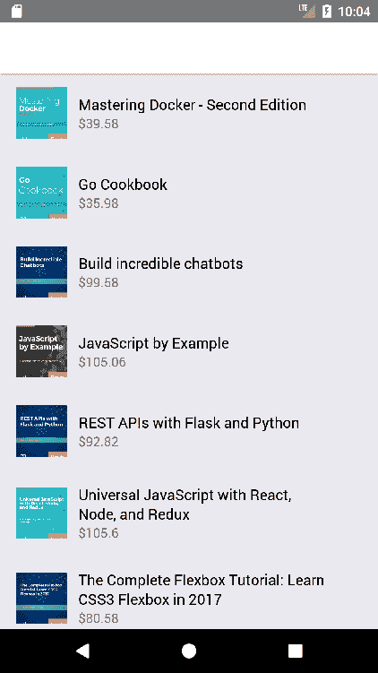

抽屉可以通过从左边缘向右滑动屏幕来打开：

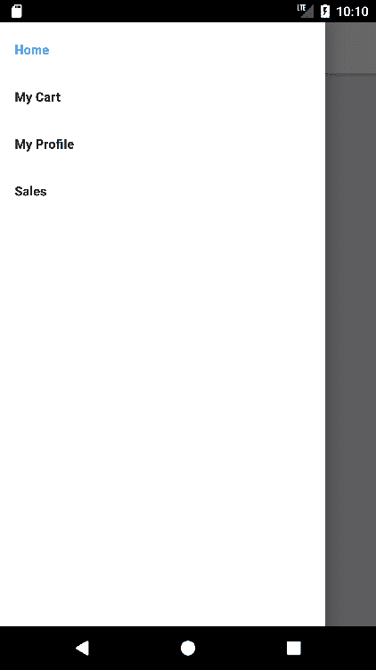

现在，让我们看看当用户点击主屏幕上的一本书时会发生什么（可用书籍列表）：

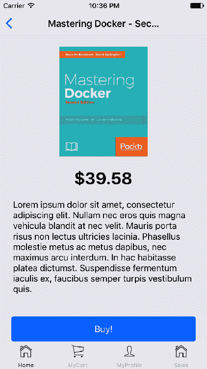

这个屏幕的 Android 版本将是类似的，因为只有一些本地组件会根据应用程序执行的平台不同而采用不同的样式：

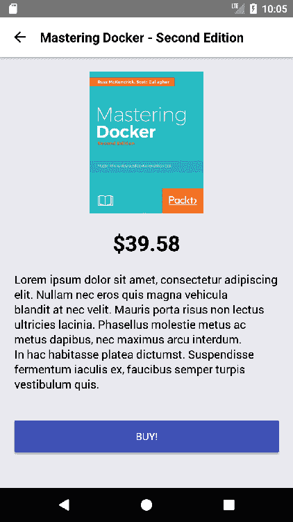

只有登录用户才能从我们的应用程序购买书籍。这意味着我们需要在某个时候弹出登录/注册屏幕，点击“购买！”按钮似乎是一个合适的时机：

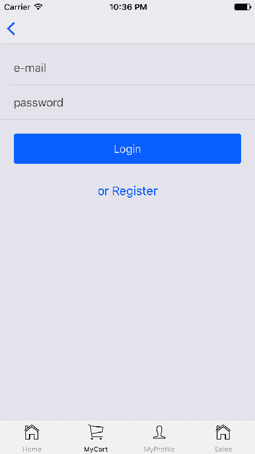

在这种情况下，Android 版本将与 iOS 版本看起来不同，因为每个平台上本机按钮的样式不同：


为了测试目的，在这个应用程序中我们创建了一个测试帐户，具有以下凭据：

+   电子邮件：`test@test.com`

+   密码：`test`

如果用户还没有帐户，她将能够点击“或注册”按钮来创建一个：

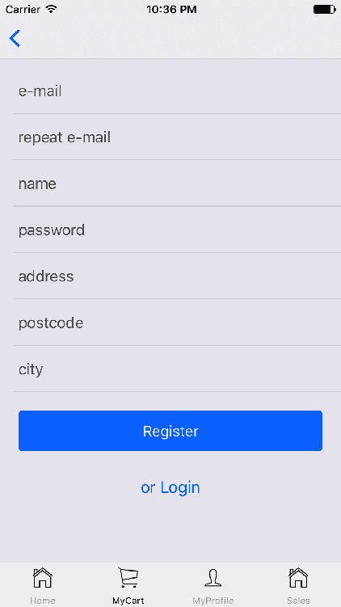

此表单将包括以下验证：

+   电子邮件和重复电子邮件字段的值匹配

+   所有字段都已输入

如果这些验证中有任何失败，我们将在此屏幕底部显示错误消息：

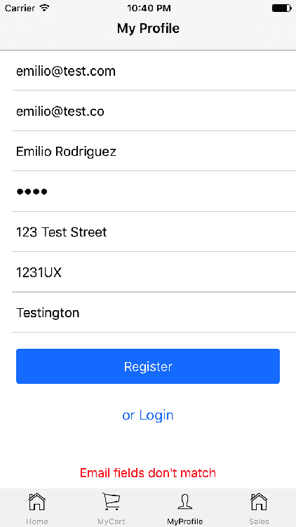

注册后，用户将自动登录，并可以通过查看购物车来继续购买旅程：

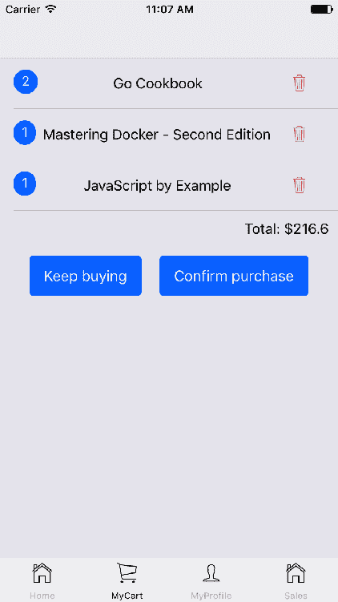

同样，Android 版本将在此屏幕的外观上显示细微差异：

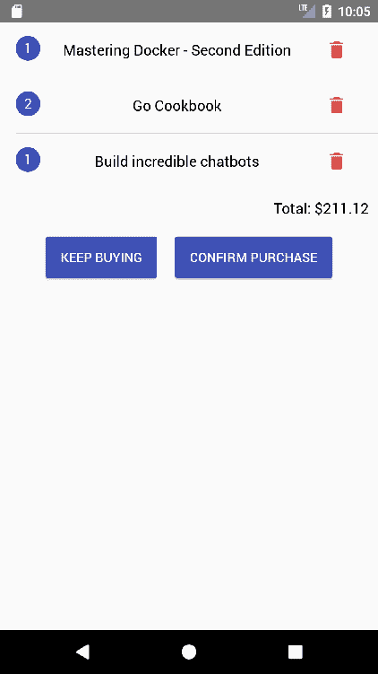

通过点击此屏幕上的“继续购买”按钮，用户将被发送回主屏幕，所有可用的书籍都会显示出来，供她继续添加到购物车中。

如果她决定确认购买，应用程序将显示一个付款屏幕，用户可以在其中输入信用卡详细信息：

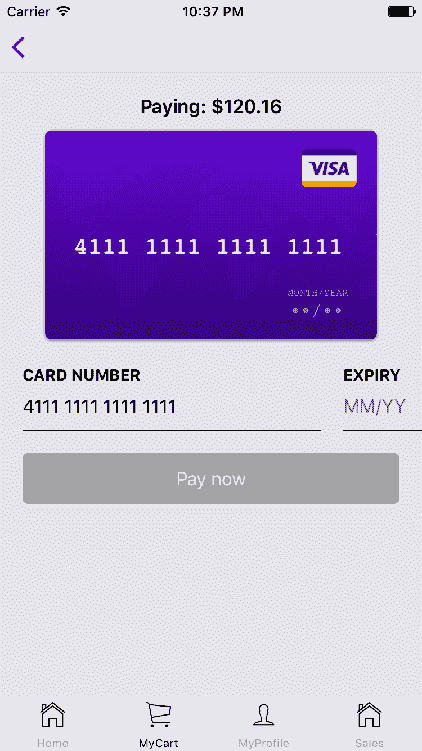

只有当所有数据都输入正确时，“立即付款”按钮才会激活：

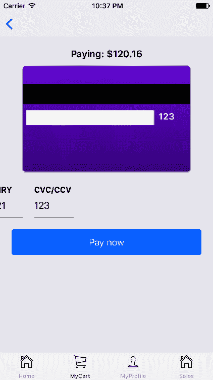

为了测试目的，开发人员可以使用以下信用卡数据：

+   卡号：`4111 1111 1111 1111`

+   到期日期：未来的任何日期

+   CVC/CVV：`123`

一旦付款完成，用户将收到一份确认购买的确认，详细列出将发送到她地址的所有物品：

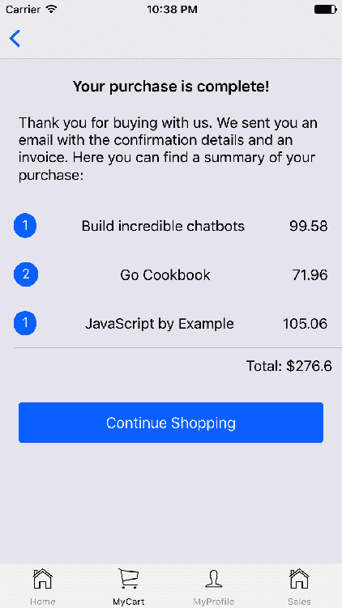

这个屏幕将完成购买旅程。在这个阶段，用户可以点击“继续购物”按钮，返回到可用产品列表。

通过选项卡/抽屉导航还有两个可用的旅程。第一个是到“我的个人资料”部分，以查看她的账户详细信息或注销：

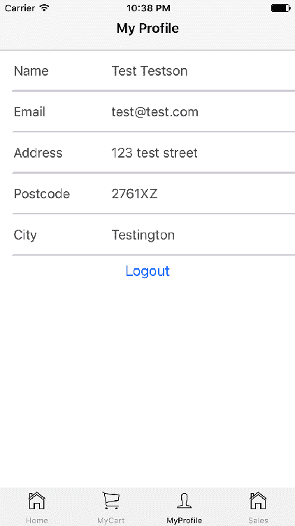

如果用户还没有登录，应用程序将在此屏幕上显示登录/注册表单。

最后一个旅程是通过销售选项卡/菜单项访问的：


通过点击“添加到购物车”按钮，用户将直接进入购买旅程，在那里她可以添加更多的物品到购物车，或者直接确认购买，输入她的登录（如果不存在）和付款详细信息。

最后，每当我们需要从后端 API 接收数据时，我们将显示一个旋转器，让用户知道后台有一些活动正在进行：


由于我们将模拟所有的 API 调用，我们需要在它们的响应中添加一些小的延迟，以便看到旋转器，这样开发人员就可以像用户一样拥有类似的体验，当我们用真实的 API 请求替换模拟的调用时。

# 设置文件夹结构

这个应用将使用 Redux 作为其状态管理库，这将定义我们在本章中将使用的文件夹结构。让我们通过 React Native 的 CLI 来初始化项目：

```jsx
react-native init --version="0.48.3" ecommerce 
```

正如我们在之前的章节中看到的，我们使用 Redux，我们需要我们的文件夹结构来容纳不同的模块类型：`reducers`、`actions`、`components`、`screens`和`api`调用。我们将在以下文件夹结构中完成这一点：

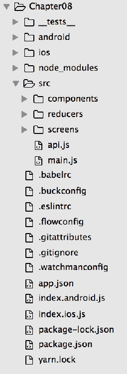

除了 React Native 的 CLI 创建的文件夹结构外，我们还添加了以下文件夹和文件：

+   `src/components`：这将保存可重用的视觉组件。

+   `src/reducers`：这将存储修改应用程序状态的 reducers，通过检测触发了哪些操作。

+   `src/screens`：这将存储所有不同的视觉容器，通过 Redux 将它们连接到应用程序状态。

+   `src/api.js`：在本章结束时，我们将在此文件中模拟所有所需的 API 调用。如果我们想要连接到真实的 API，我们只需要更改此文件以向正确的端点发出 HTTP 请求。

+   `src/main.js`：这是应用程序的入口点，将设置导航组件并初始化存储应用程序状态的存储。

`src/components`文件夹将包含以下文件：

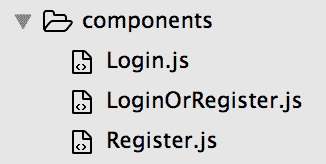

`src/reducers`将保存我们应用程序中的三个不同数据领域：用户、支付和产品：

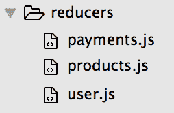

最后，`screens`文件夹将存储用户在应用程序中能够看到的每个屏幕的文件：

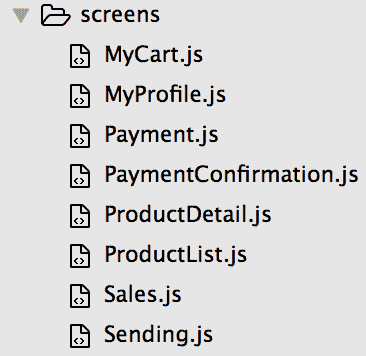

现在让我们来看看我们将用于安装此应用程序的所有必需库的`package.json`文件：

```jsx
/*** package.json ***/

{
  "name": "ecommerce",
  "version": "0.0.1",
  "private": true,
  "scripts": {
    "start": "node node_modules/react-native/local-cli/cli.js start",
    "test": "jest",
    "ios": "react-native run-ios",
    "android": "react-native run-android"
  },
  "dependencies": {
 "native-base": "².3.1",
 "prop-types": "¹⁵.5.10",
    "react": "16.0.0-alpha.12",
    "react-native": "0.48.3",
 "react-native-credit-card-input": "⁰.3.3",
 "react-navigation": "¹.0.0-beta.11",
 "react-redux": "⁵.0.6",
 "redux": "³.7.2",
 "redux-thunk": "².2.0"
  },
  "devDependencies": {
 "babel-eslint": "⁷.2.3",
    "babel-jest": "20.0.3",
    "babel-plugin-lodash": "³.2.11",
    "babel-plugin-module-resolver": "².7.1",
    "babel-plugin-transform-builtin-extend": "¹.1.2",
    "babel-plugin-transform-react-jsx-source": "⁶.22.0",
    "babel-plugin-transform-runtime": "⁶.23.0",
    "babel-preset-env": "¹.6.0",
    "babel-preset-es2015": "⁶.24.1",
    "babel-preset-react-native": "2.0.0",
    "babel-preset-stage-0": "⁶.24.1",
 "eslint-config-airbnb": "¹⁵.1.0",
    "eslint-config-prettier": "².3.0",
    "eslint-config-rallycoding": "³.2.0",
    "eslint-import-resolver-babel-module": "³.0.0",
    "eslint-import-resolver-webpack": "⁰.8.3",
    "eslint-plugin-flowtype": "².35.0",
    "eslint-plugin-import": "².7.0",
    "eslint-plugin-jsx-a11y": "⁵.1.1",
    "eslint-plugin-prettier": "².1.2",
    "eslint-plugin-react": "⁷.2.0",
    "eslint-plugin-react-native": "³.0.1",
    "jest": "20.0.4",
 "prettier": "¹.5.3",
    "prettier-package-json": "¹.4.0",
    "react-test-renderer": "16.0.0-alpha.12"
  },
  "jest": {
    "preset": "react-native"
  }
}
```

我们将为我们的应用程序使用以下额外的库：

+   `native-base`：这是用于样式化组件。

+   `prop-types`：这是用于组件内属性验证。

+   `react-native-credit-card-input`：这是供用户输入信用卡详细信息的工具。

+   `react-redux`：这个和 Redux 一起用于状态管理。

+   `redux-thunk`：这是用于将 Redux 连接到异步调用的工具。

除了所有这些依赖项，我们还将添加一些其他`dev`依赖项，这将帮助我们的开发人员以非常舒适和自信的方式编写代码：

+   `babel-eslint`：这是用于 linting 我们的 ES6 代码。

+   `eslint-config-airbnb`：这是我们将使用的一组编码样式。

+   `prettier`：这是我们将使用的代码格式化程序，以支持 ES6 和 JSX。

有了这个`package.json`，我们准备通过运行来安装所有这些依赖项：

```jsx
npm install
```

在开始编写代码之前，让我们配置我们的代码检查规则和文本编辑器，充分利用本章中将使用的代码格式化工具。

# 代码检查和格式化

编写干净，无错误的代码是具有挑战性的。我们可能会面临许多陷阱，例如缩进，导入/导出错误，标签未关闭等。手动克服所有这些问题是一项艰巨的工作，这可能会让我们分心，远离我们的主要目的：编写功能性代码。幸运的是，有一些非常有用的工具可以帮助我们完成这项任务。

本章中我们将使用的工具来确保我们的代码干净将是 ESLint（[`eslint.org/`](https://eslint.org/)）和 Prettier（[`github.com/prettier/prettier`](https://github.com/prettier/prettier)）。

ESLint 将负责识别和报告 ES6 / JavaScript 代码中发现的模式，其目标是使代码更一致，避免错误。例如，ESLint 将标记任何使用未声明变量的情况，暴露错误，而不是等到编译时才发现。

另一方面，Prettier 通过解析原始样式并重新打印具有自己规则的代码来强制执行整个代码库的一致代码样式，考虑到最大行长度，在必要时换行。

我们还可以使用 ESLint 直接在浏览器中强制执行 Prettier 代码样式。我们的第一步将是配置 ESLint 以适应我们在项目中要强制执行的格式化和代码检查规则。在这个应用程序的情况下，我们将遵循 Airbnb 和 Prettier 的规则，因为我们已经将它们作为开发人员的依赖项安装在这个项目中。

为了确保 ESLint 将使用这些规则，我们将创建一个`.eslintrc`文件，其中包含我们在检查时要设置的所有选项：

```jsx
/*** .eslintrc ***/

{
  "extends": ["airbnb", "prettier", "prettier/react", "prettier/flowtype"],
  "globals": {
    "queryTree": false
  },
 "plugins": ["react", "react-native", "flowtype", "prettier"],
  "env": { "es6": true, "jest": true },
  "parser": "babel-eslint",
  "rules": {
    "prettier/prettier": [
 "error",
 {
 "trailingComma": "all",
 "singleQuote": true,
 "bracketSpacing": true,
 "tabWidth": 2
 }
 ],

    ...

}
```

我们不会在本书中深入探讨如何配置 ESLint，因为它们的文档非常广泛且解释得很好。对于这个项目，我们只需要在配置文件中设置相应的插件（`react`，`react-native`，`flowtype`和`prettier`）来扩展 Airbnb 和 Prettier 的规则。

设置检查器的规则是一种品味问题，如果没有太多经验，最好从一套预先构建的规则（例如 Airbnb 规则）开始，并逐个修改它们。

最后，我们需要配置我们的代码编辑器来显示这些规则，标记它们，并在保存时理想地修复它们。Visual Studio Code 在集成这些 linting/code 格式化规则方面做得非常好，因为它的 ESLint 插件（[`github.com/Microsoft/vscode-eslint`](https://github.com/Microsoft/vscode-eslint)）为我们做了所有的工作。强烈建议启用`eslint.autoFixOnSave`选项，以确保编辑器在保存我们正在工作的文件后修复所有的代码格式问题。

现在我们已经有了我们的 linting 工具，让我们开始编写我们应用程序的代码库。

# 索引和主文件

iOS 和 Android 平台将使用`src/main.js`作为入口点共享相同的代码库。因此，我们将更改`index.ios.js`和`index.android.js`来导入`main.js`并使用该组件作为根来初始化应用程序：

```jsx
/*** index.ios.js and index.android.js ***/ 

import { AppRegistry } from 'react-native';
import App from './src/main';

AppRegistry.registerComponent('ecommerce', () => App);

```

这是我们在整本书中共享代码库的所有应用程序所使用的相同结构。我们的`main.js`文件现在应该初始化导航组件并设置我们将用来保存应用状态的存储：

```jsx
/*** src/main.js ***/

import React from 'react';
import {
  DrawerNavigator,
  TabNavigator,
  StackNavigator,
} from 'react-navigation';
import { Platform } from 'react-native';

import { Provider } from 'react-redux';
import { createStore, combineReducers, applyMiddleware } from 'redux';
import thunk from 'redux-thunk';
import paymentsReducer from './reducers/payments';
import productsReducer from './reducers/products';
import userReducer from './reducers/user';

import ProductList from './screens/ProductList';
import ProductDetail from './screens/ProductDetail';
import MyCart from './screens/MyCart';
import MyProfile from './screens/MyProfile';
import Payment from './screens/Payment';
import PaymentConfirmation from './screens/PaymentConfirmation';
import Sales from './screens/Sales';

const ProductsNavigator = StackNavigator({
 ProductList: { screen: ProductList },
 ProductDetail: { screen: ProductDetail },
});

const PurchaseNavigator = StackNavigator({
 MyCart: { screen: MyCart },
 Payment: { screen: Payment },
 PaymentConfirmation: { screen: PaymentConfirmation },
});

let Navigator;
if (Platform.OS === 'ios') {
 Navigator = TabNavigator(
 {
 Home: { screen: ProductsNavigator },
 MyCart: { screen: PurchaseNavigator },
 MyProfile: { screen: MyProfile },
 Sales: { screen: Sales },
 },
 {
 tabBarOptions: {
 inactiveTintColor: '#aaa',
 activeTintColor: '#000',
 showLabel: true,
 },
 },
 );
} else {
 Navigator = DrawerNavigator({
 Home: { screen: ProductsNavigator },
 MyCart: { screen: MyCart },
 MyProfile: { screen: MyProfile },
 Sales: { screen: Sales },
 });
}

const store = createStore(
 combineReducers({ paymentsReducer, productsReducer, userReducer }),
 applyMiddleware(thunk),
);

export default () => (
  <Provider store={store}>
 <Navigator />
  </Provider>
);
```

我们的主导航器（`Navigator`）将在 iOS 上是一个选项卡导航，在 Android 上是一个抽屉导航。这个导航器将是应用程序的根，并将使用两个嵌套的堆叠导航器（`ProductsNavigator`和`PurchaseNavigator`），它们将涵盖以下旅程：

+   `ProductsNavigator`：ProductList | ProductDetail

+   `PurchaseNavigator`：MyCart | Payment | PaymentConfirmation

每个旅程中的每一步都是应用程序中的特定屏幕。

登录和注册不是这些旅程中的步骤，因为它们将被视为弹出屏幕，只在需要时显示。

这个文件的最后一步是设置 Redux，应用所有的 reducers 和中间件（在我们的情况下只有`redux-thunk`），这将为这个项目做好准备：

```jsx
const store = createStore(
  combineReducers({ paymentsReducer, productsReducer, userReducer }),
  applyMiddleware(thunk),
);
```

一旦`store`被创建，我们将它传递给应用程序的根提供程序，以确保状态将在所有屏幕之间共享。在进入每个单独的屏幕之前，让我们创建我们的 reducers 和 actions，以便在构建屏幕时可以使用它们。

# Reducers

在之前的章节中，我们按照 Redux 文档中记录的标准方式拆分了我们的 Redux 特定代码（reducers、actions 和 action creators）。为了便于将来的维护，我们将为这个应用使用不同的方法：Redux Ducks（[`github.com/erikras/ducks-modular-redux`](https://github.com/erikras/ducks-modular-redux)）。

Redux Ducks 是在使用 Redux 时捆绑在一起的减速器、操作类型和操作的提案。它们不是创建减速器和操作的单独文件夹，而是根据它们处理的功能类型将它们放在一起的文件中，从而减少了在实现新功能时需要处理的文件数量。

让我们从`products`减速器开始。

```jsx
/*** src/reducers/products.js ***/

import { get } from '../api';

// Actions
const FETCH = 'products/FETCH';
const FETCH_SUCCESS = 'products/FETCH_SUCCESS';
const FETCH_ERROR = 'products/FETCH_ERROR';
const ADD_TO_CART = 'products/ADD_TO_CART';
const REMOVE_FROM_CART = 'products/REMOVE_FROM_CART';
const RESET_CART = 'products/RESET_CART';

// Reducer
const initialState = {
  loading: false,
  cart: [],
  products: [],
};
export default function reducer(state = initialState, action = {}) {
  let product;
  let i;
  switch (action.type) {
 case FETCH:
      return { ...state, loading: true };
 case FETCH_SUCCESS:
      return {
        ...state,
        products: action.payload.products,
        loading: false,
        error: null,
      };
 case FETCH_ERROR:
      return { ...state, error: action.payload.error, loading: false };
 case ADD_TO_CART:
      product = state.cart.find(p => p.id === 
                action.payload.product.id);
      if (product) {
        product.quantity += 1;
        return {
          ...state,
          cart: state.cart.slice(),
        };
      }
      product = action.payload.product;
      product.quantity = 1;
      return {
        ...state,
        cart: state.cart.slice().concat([action.payload.product]),
      };
 case REMOVE_FROM_CART:
      i = state.cart.findIndex(p => p.id === 
          action.payload.product.id);
      if (state.cart[i].quantity === 1) {
        state.cart.splice(i, 1);
      } else {
        state.cart[i].quantity -= 1;
      }
      return {
        ...state,
        cart: state.cart.slice(),
      };
 case RESET_CART:
      return {
        ...state,
        cart: [],
      };
 default:
      return state;
  }
}

// Action Creators
export function addProductToCart(product) {
  return { type: ADD_TO_CART, payload: { product } };
}

export function removeProductFromCart(product) {
  return { type: REMOVE_FROM_CART, payload: { product } };
}

export function fetchProducts() {
  return dispatch => {
    dispatch({ type: FETCH });
    get('/products')
      .then(products =>
        dispatch({ type: FETCH_SUCCESS, payload: { products } }),
      )
      .catch(error => dispatch({ type: FETCH_ERROR, payload: { error } }));
  };
}

export function resetCart() {
  return { type: RESET_CART };
}
```

这个文件处理了我们应用程序中与产品相关的所有业务逻辑。让我们审查每个操作创建者以及它们在被减速器处理时如何修改状态：

+   `addProductToCart()`: 这将分派`ADD_TO_CART`操作，减速器将捕获该操作。如果提供的产品已经存在于状态中的购物车中，它将增加一个项目的数量。否则，它将把产品插入购物车并将其数量设置为一。

+   `removeProductFromCart()`: 这个操作与上一个操作相反。如果购物车中已经存在该产品，则减少该产品的数量。如果该产品的数量为一，减速器将从购物车中删除该产品。

+   `fetchProducts()`: 这是一个异步操作，因此将返回一个函数供`redux-thunk`使用。它将向 API 的`/products`端点发出`GET`请求（由`api.json`文件中的`get()`函数实现）。它还将处理来自该端点的响应，在请求成功完成时分派一个`FETCH_SUCCESS`操作，或者在请求出错时分派一个`FETCH_ERROR`操作。

+   `resetCart()`: 这将分派一个`RESET_CART`操作，减速器将使用它来从状态中清除所有购物车详细信息。

由于我们遵循 Redux Ducks 的建议，所有这些操作都放在同一个文件中，这样很容易确定操作的作用以及它们对应用状态造成的影响。

现在让我们转到下一个减速器：`user`减速器：

```jsx
/*** src/reducers/user.js ***/

import { post } from '../api';

// Actions
const LOGIN = 'user/LOGIN';
const LOGIN_SUCCESS = 'user/LOGIN_SUCCESS';
const LOGIN_ERROR = 'user/LOGIN_ERROR';
const REGISTER = 'user/REGISTER';
const REGISTER_SUCCESS = 'user/REGISTER_SUCCESS';
const REGISTER_ERROR = 'user/REGISTER_ERROR';
const LOGOUT = 'user/LOGOUT';

// Reducer
export default function reducer(state = {}, action = {}) {
  switch (action.type) {
 case LOGIN:
 case REGISTER:
      return { ...state, user: null, loading: true, error: null };
 case LOGIN_SUCCESS:
 case REGISTER_SUCCESS:
      return {
        ...state,
        user: action.payload.user,
        loading: false,
        error: null,
      };
 case LOGIN_ERROR:
 case REGISTER_ERROR:
      return {
        ...state,
        user: null,
        loading: false,
        error: action.payload.error,
      };
 case LOGOUT:
      return {
        ...state,
        user: null,
      };
    default:
      return state;
  }
}

// Action Creators
export function login({ email, password }) {
  return dispatch => {
    dispatch({ type: LOGIN });
    post('/login', { email, password })
      .then(user => dispatch({ type: LOGIN_SUCCESS, 
       payload: { user } }))
      .catch(error => dispatch({ type: LOGIN_ERROR,
       payload: { error } }));
  };
}

export function register({
  email,
  repeatEmail,
  name,
  password,
  address,
  postcode,
  city,
}) {
  if (
    !email ||
    !repeatEmail ||
    !name ||
    !password ||
    !name ||
    !address ||
    !postcode ||
    !city
  ) {
    return {
      type: REGISTER_ERROR,
      payload: { error: 'All fields are mandatory' },
    };
  }
  if (email !== repeatEmail) {
    return {
      type: REGISTER_ERROR,
      payload: { error: "Email fields don't match" },
    };
  }
  return dispatch => {
    dispatch({ type: REGISTER });
    post('/register', {
      email,
      name,
      password,
      address,
      postcode,
      city,
    })
      .then(user => dispatch({ type: REGISTER_SUCCESS, payload: 
                    { user } }))
      .catch(error => dispatch({ type: REGISTER_ERROR, payload: 
                    { error } }));
  };
}

export function logout() {
  return { type: LOGOUT };
}
```

这个减速器中的操作创建者非常直接：

+   `login()`: 这需要一个`email`和`password`来分派`LOGIN`操作，然后向`/login`端点发出`POST`请求以验证凭据。如果 API 调用成功，操作创建者将分派`LOGIN_SUCCESS`操作以登录用户。如果请求失败，它将分派一个`LOGIN_ERROR`操作，以便用户知道发生了什么。

+   `register()`: 这类似于`login()`操作创建者；它将分派一个`REGISTER`动作，然后根据 API 调用的返回方式分派一个`REGISTER_SUCCESS`或`REGISTER_ERROR`。如果注册成功，用户数据将存储在应用程序状态中，标记用户已登录。

+   `logout()`: 这将分派一个`LOGOUT`动作，这将使减速器清除应用程序状态中的`user`对象。

最后一个减速器处理支付数据：

```jsx
/*** src/reducers/payments.js ***/

import { post } from '../api';

// Actions
const PAY = 'products/PAY';
const PAY_SUCCESS = 'products/PAY_SUCCESS';
const PAY_ERROR = 'products/PAY_ERROR';
const RESET_PAYMENT = 'products/RESET_PAYMENT';

// Reducer
export default function reducer(state = {}, action = {}) {
  switch (action.type) {
    case PAY:
      return { ...state, loading: true, paymentConfirmed: false, 
               error: null };
    case PAY_SUCCESS:
      return {
        ...state,
        paymentConfirmed: true,
        loading: false,
        error: null,
      };
    case PAY_ERROR:
      return {
        ...state,
        loading: false,
        paymentConfirmed: false,
        error: action.payload.error,
      };
    case RESET_PAYMENT:
      return { loading: false, paymentConfirmed: false, error: null };
    default:
      return state;
  }
}

// Action Creators
export function pay(user, cart, card) {
  return dispatch => {
    dispatch({ type: PAY });
    post('/pay', { user, cart, card })
      .then(() => dispatch({ type: PAY_SUCCESS }))
      .catch(error => dispatch({ type: PAY_ERROR, 
             payload: { error } }));
  };
}

export function resetPayment() {
  return { type: RESET_PAYMENT };
}
```

在这个减速器中只有两个操作创建者：

+   `pay()`: 这需要一个用户、一个购物车和一个信用卡，并调用 API 中的`/pay`端点来进行付款。如果付款成功，它会触发一个`PAY_SUCCESS`动作，否则，它会触发一个`PAY_ERROR`动作来通知用户。

+   `resetPayment()`: 通过触发`RESET_PAYMENT`动作来清除任何支付数据。

我们已经看到这些操作创建者以几种方式联系 API。现在让我们创建一些 API 方法，这样操作创建者就可以与应用程序的后端进行交互。

# API

我们将使用的 API 服务将使用两种 HTTP 方法（`GET`和`POST`）和四个端点（`/products`，`/login`，`/register`和`/pay`）。出于测试和开发原因，我们将模拟此服务，但将在以后的阶段留下实现插入外部端点的可能性：

```jsx
/*** src/api.js ***/

export const get = uri =>
  new Promise(resolve => {
    let response;

    switch (uri) {
      case '/products':
        response = [
          {
            id: 1,
            name: 'Mastering Docker - Second Edition',
            author: 'James Cameron',
            img:
              'https://d1ldz4te4covpm.cloudfront.net/sites/default
              /files/imagecache/ppv4_main_book_cover
              /B06565_MockupCover_0.png',
            price: 39.58,
          },

         ...

        ];
        break;
      default:
        return null;
    }

    setTimeout(() => resolve(response), 1000);
    return null;
  });

export const post = (uri, data) =>
  new Promise((resolve, reject) => {
    let response;

    switch (uri) {
      case '/login':
        if (data.email === 'test@test.com' && data.password === 'test')  
        {
          response = {
            email: 'test@test.com',
            name: 'Test Testson',
            address: '123 test street',
            postcode: '2761XZ',
            city: 'Testington',
          };
        } else {
          setTimeout(() => reject('Unauthorised'), 1000);
          return null;
        }
        break;
      case '/pay':
        if (data.card.cvc === '123') {
          response = true;
        } else {
          setTimeout(() => reject('Payment not authorised'), 1000);
          return null;
        }
        break;
      case '/register':
        response = data;
        break;
      default:
        return null;
    }

    setTimeout(() => resolve(response), 1000);
    return null;
  });

export const put = () => {};
```

所有调用都包装在一个`setTimeout()`函数中，间隔 1 秒，以模拟网络活动，以便进行测试。只有当凭据为`test@test.com/test`时，服务才会成功回复。另一方面，`pay()`服务只有在 CVC/CVV 代码为`123`时才会返回成功的响应。注册调用只是将提供的数据作为成功注册的用户数据返回。

这种 setTimeout()技巧用于模拟异步调用，就像在真实后端发生的情况一样。这是在后端或测试环境准备好之前开发前端解决方案的有用方式。

现在让我们继续应用程序中的屏幕。

# 产品列表

我们的主屏幕显示了可供购买的产品列表：

```jsx
/*** src/screens/ProductList.js ***/

import React from 'react';
import { ScrollView, TouchableOpacity } from 'react-native';
import PropTypes from 'prop-types';

import { bindActionCreators } from 'redux';
import { connect } from 'react-redux';
import {
  Spinner,
  Icon,
  List,
  ListItem,
  Thumbnail,
  Body,
  Text,
} from 'native-base';
import * as ProductActions from '../reducers/products';

class ProductList extends React.Component {
  static navigationOptions = {
    drawerLabel: 'Home',
    tabBarIcon: () => <Icon name="home" />,
  };

  componentWillMount() {
 this.props.fetchProducts();
  }

 onProductPress(product) {
 this.props.navigation.navigate('ProductDetail', { product });
 }

  render() {
    return (
      <ScrollView>
 {this.props.loading && <Spinner />}
        <List>
          {this.props.products.map(p => (
            <ListItem key={p.id}>
              <Thumbnail square height={80} source={{ uri: p.img }} />
              <Body>
                <TouchableOpacity onPress={() => 
                 this.onProductPress(p)}>
                  <Text>{p.name}</Text>
                  <Text note>${p.price}</Text>
                </TouchableOpacity>
              </Body>
            </ListItem>
          ))}
        </List>
      </ScrollView>
    );
  }
}

ProductList.propTypes = {
 fetchProducts: PropTypes.func.isRequired,
 products: PropTypes.array.isRequired,
 loading: PropTypes.bool.isRequired,
 navigation: PropTypes.any.isRequired,
};

function mapStateToProps(state) {
 return {
 products: state.productsReducer.products || [],
 loading: state.productsReducer.loading,
 };
}

function mapStateActionsToProps(dispatch) {
 return bindActionCreators(ProductActions, dispatch);
}

export default connect(mapStateToProps, mapStateActionsToProps)(ProductList);
```

在此屏幕挂载后，它将通过调用`this.props.fetchProducts();`来检索最新的可用产品列表。这将触发屏幕重新渲染，因此所有可用的书籍都会显示在屏幕上。为了实现这一点，我们依赖于 Redux 更新状态（通过产品 reducer）并通过调用`connect`方法将新状态注入到此屏幕中，我们需要传递`mapStateToProps`和`mapStateActionsToProps`函数。

`mapStateToProps`将负责从`state`中提取产品列表，而`mapStateActionsToProps`将把每个操作与`dispatch()`函数连接起来，该函数将这些操作与 Redux 状态连接起来，将每个触发的操作应用于所有 reducer。在此屏幕上，我们只对与产品相关的操作感兴趣，因此我们将只通过`bindActionCreators` Redux 函数将`ProductActions`和`dispatch`函数绑定在一起。

在`render`方法中，我们使用`map`函数将检索到的产品列表转换为多个`<ListItem/>`组件，这些组件将显示在`<List/>`内。在此列表上方，我们将显示`<Spinner/>`，同时等待网络请求的完成：`{this.props.loading && <Spinner />}`。

我们还通过`prop-types`库添加了属性验证。

```jsx
ProductList.propTypes = {
  fetchProducts: PropTypes.func.isRequired,
  products: PropTypes.array.isRequired,
  loading: PropTypes.bool.isRequired,
  navigation: PropTypes.any.isRequired,
};
```

这意味着每当此组件接收到错误类型的 prop 时，或者实际上未能接收到所需的 prop 时，我们将收到警告。在这种情况下，我们期望接收到：

+   一个名为`fetchProducts`的函数，它将通过 API 请求可用产品的列表。它将由 Redux 通过`mapStateActionsToProps`在此屏幕上定义的方式提供。

+   一个包含可用产品列表的`products`数组。这将通过先前提到的`mapStateToProps`函数由 Redux 注入。

+   一个用于标记网络活动的加载布尔值（也通过`mapStateToProps`由 Redux 提供）。

+   一个由`react-navigation`自动提供的导航对象。我们将其标记为`any`类型，因为它是一个外部对象，可能会在我们的控制之外改变其类型。

所有这些都将可用于在我们组件的 props（`this.props`）中使用。

关于此容器的最后一件事是我们将如何处理用户操作。在此屏幕上，只有一个操作：用户点击产品项以查看其详细信息：

```jsx
onProductPress(product) {
    this.props.navigation.navigate('ProductDetail', { product });
}
```

当用户点击特定产品时，这个屏幕将调用`navigation`属性中的`navigate`函数，移动到我们的下一个屏幕`ProductDetail`。我们将直接使用`navigation`选项传递所选产品，而不是通过动作将其保存在状态中，以简化我们的存储。

# ProductDetail

这个屏幕将向用户显示有关所选产品的所有详细信息，并允许她将所选产品添加到她的购物车中。

```jsx
/*** src/screens/ProductDetail.js ***/

import React from 'react';
import { Image, ScrollView } from 'react-native';

import { bindActionCreators } from 'redux';
import { connect } from 'react-redux';
import PropTypes from 'prop-types';
import { Icon, Button, Text } from 'native-base';
import * as ProductsActions from '../reducers/products';

class ProductDetail extends React.Component {
  static navigationOptions = {
    drawerLabel: 'Home',
    tabBarIcon: () => <Icon name="home" />,
  };

  onBuyPress(product) {
 this.props.addProductToCart(product);
 this.props.navigation.goBack();
 setTimeout(() => this.props.navigation.navigate('MyCart',
                     { product }), 0);
 }

  render() {
    const { navigation } = this.props;
    const { state } = navigation;
    const { params } = state;
    const { product } = params;
    return (
      <ScrollView>
        <Image
 style={{
 height: 200,
 width: 160,
 alignSelf: 'center',
 marginTop: 20,
 }}
 source={{ uri: product.img }}
 />
 <Text
 style={{
 alignSelf: 'center',
 marginTop: 20,
 fontSize: 30,
 fontWeight: 'bold',
 }}
 >
 ${product.price}
        </Text>
        <Text
          style={{
            alignSelf: 'center',
            margin: 20,
          }}
        >
          Lorem ipsum dolor sit amet, consectetur 
          adipiscing elit. Nullam nec
          eros quis magna vehicula blandit at nec velit. 
          Mauris porta risus non
          lectus ultricies lacinia. Phasellus molestie metus ac 
          metus dapibus,
          nec maximus arcu interdum. In hac habitasse platea dictumst.
          Suspendisse fermentum iaculis ex, faucibus semper turpis 
          vestibulum quis.
        </Text>
        <Button
 block
 style={{ margin: 20 }}
 onPress={() => this.onBuyPress(product)}
 >
 <Text>Buy!</Text>
 </Button>
      </ScrollView>
    );
  }
}

ProductDetail.propTypes = {
  navigation: PropTypes.any.isRequired,
  addProductToCart: PropTypes.func.isRequired,
};

ProductDetail.navigationOptions = props => {
  const { navigation } = props;
  const { state } = navigation;
  const { params } = state;
  return {
    tabBarIcon: () => <Icon name="home" />,
    headerTitle: params.product.name,
  };
};

function mapStateToProps(state) {
 return {
 user: state.userReducer.user,
 };
}
function mapStateActionsToProps(dispatch) {
 return bindActionCreators(ProductsActions, dispatch);
}

export default connect(mapStateToProps, mapStateActionsToProps)(ProductDetail);
```

`ProductDetail`需要 Redux 提供存储在`state`中的用户详细信息。这是通过调用`connect`方法实现的，传递一个`mapStateToProps`函数，该函数将从指定的`state`中提取用户并将其返回为屏幕中的`prop`注入。它还需要来自 Redux 的动作：`addProductToCart`。当用户表示希望购买时，此动作只是将所选产品存储在存储中。

在这个屏幕中，`render()` 方法显示了`<ScrollView />`包裹着书籍图片、价格、描述（我们现在将显示一个虚假的`lorem ipsum`描述），以及一个`Buy!`按钮，它将连接到 Redux 提供的`addProductToCart`动作。

```jsx
onBuyPress(product) {
    this.props.addProductToCart(product);
    this.props.navigation.goBack();
    setTimeout(() => this.props.navigation.navigate('MyCart', 
                     { product }), 0);
}
```

`onBuyPress()`方法调用了上述动作，并在之后进行了一个小的导航技巧。它通过在`navigation`对象上调用`goBack()`方法来返回，从导航堆栈中移除`ProductDetail`屏幕，因为用户在将产品添加到购物车后不再需要它。在这之后，`onBuyPress()`方法将在`navigation`对象上调用`navigate`方法，以移动并在`MyCart`屏幕中显示用户购物车的状态。我们在这里使用`setTimeout`来确保我们等待前一个调用（`this.props.navigation.goBack();`）完成所有导航任务，并且对象再次准备好供我们使用。等待`0`秒应该足够，因为我们只是想等待调用堆栈被清除。

让我们看看`MyCart`屏幕现在是什么样子的。

# MyCart

这个屏幕期望 Redux 注入存储在状态中的购物车，以便它可以渲染用户在确认购买之前审查的所有购物车中的物品：

```jsx
/*** src/screens/MyCart.js ***/

import React from 'react';
import { ScrollView, View } from 'react-native';

import { bindActionCreators } from 'redux';
import { connect } from 'react-redux';
import PropTypes from 'prop-types';
import {
  ListItem,
  Text,
  Icon,
  Button,
  Badge,
  Header,
  Title,
} from 'native-base';

import * as ProductActions from '../reducers/products';

class MyCart extends React.Component {
  static navigationOptions = {
    drawerLabel: 'My Cart',
    tabBarIcon: () => <Icon name="cart" />,
  };

  onTrashPress(product) {
 this.props.removeProductFromCart(product);
 }

  render() {
    return (
      <View>
        <ScrollView>
          {this.props.cart.map((p, i) => (
            <ListItem key={i} style={{ justifyContent: 
                              'space-between' }}>
              <Badge primary>
                <Text>{p.quantity}</Text>
              </Badge>
              <Text> {p.name}</Text>
              <Button
 icon
 danger
 small
 transparent
 onPress={() => this.onTrashPress(p)}
 >
 <Icon name="trash" />
 </Button>
            </ListItem>
          ))}
          {this.props.cart.length > 0 && (
            <View>
              <Text style={{ alignSelf: 'flex-end', margin: 10 }}>
                Total: ${this.props.cart.reduce(
                  (sum, p) => sum + p.price * p.quantity,
                  0,
                )}
              </Text>
              <View style={{ flexDirection: 'row', 
               justifyContent: 'center' }}>
 <Button
 style={{ margin: 10 }}
 onPress={() =>  
                  this.props.navigation.navigate('Home')}
 >
 <Text>Keep buying</Text>
 </Button>
 <Button
 style={{ margin: 10 }}
 onPress={() => 
                  this.props.navigation.navigate('Payment')}
 >
 <Text>Confirm purchase</Text>
 </Button>
              </View>
            </View>
          )}
          {this.props.cart.length == 0 && (
            <Text style={{ alignSelf: 'center', margin: 30 }}>
              There are no products in the cart
            </Text>
          )}
        </ScrollView>
      </View>
    );
  }
}

MyCart.propTypes = {
  cart: PropTypes.array.isRequired,
  navigation: PropTypes.object.isRequired,
  removeProductFromCart: PropTypes.func.isRequired,
};

function mapStateToProps(state) {
  return {
    user: state.userReducer.user,
    cart: state.productsReducer.cart || [],
    loading: state.userReducer.loading,
    error: state.userReducer.error,
    paying: state.paymentsReducer.loading,
  };
}
function mapStateActionsToProps(dispatch) {
  return bindActionCreators(ProductActions, dispatch);
}

export default connect(mapStateToProps, mapStateActionsToProps)(MyCart);

```

除了购物车本身，正如我们在`propTypes`定义中所看到的，这个屏幕需要来自`ProductActions`的`removeProductFromCart`动作，以及提供给`navigation`对象的`navigation`对象，以便在用户准备确认购买时导航到`Payment`屏幕。

总之，用户可以从这里执行三个操作：

+   通过点击每个产品行上的垃圾桶图标从购物车中移除商品（调用`this.onTrashPress()`）

+   导航到“支付”屏幕以完成她的购买（调用`this.props.navigation.navigate('Payment')`）

+   导航到主屏幕以继续购买产品（调用`this.props.navigation.navigate('Home')`）

让我们继续购买之旅，查看“支付”屏幕。

# 支付

我们将使用`react-native-credit-card-input`库来捕获用户的信用卡详细信息。为了使此屏幕正常工作，我们将从 Redux 请求购物车、用户和几个重要操作：

```jsx
/*** src/screens/Payment.js ***/

import React from 'react';
import { View } from 'react-native';

import { CreditCardInput } from 'react-native-credit-card-input';
import { bindActionCreators } from 'redux';
import { connect } from 'react-redux';
import { Icon, Button, Text, Spinner, Title } from 'native-base';
import PropTypes from 'prop-types';
import * as PaymentsActions from '../reducers/payments';
import * as UserActions from '../reducers/user';
import LoginOrRegister from '../components/LoginOrRegister';

class Payment extends React.Component {
  static navigationOptions = {
    drawerLabel: 'MyCart',
    tabBarIcon: () => <Icon name="cart" />,
  };
  state = {
 validCardDetails: false,
 cardDetails: null,
 };
  onCardInputChange(creditCardForm) {
 this.setState({
 validCardDetails: creditCardForm.valid,
 cardDetails: creditCardForm.values,
 });
 }

  componentWillReceiveProps(newProps) {
 if (this.props.paying && newProps.paymentConfirmed) {
 this.props.navigation.navigate('PaymentConfirmation');
 }
 }

  render() {
    return (
      <View
        style={{
          flex: 1,
          alignSelf: 'stretch',
          paddingTop: 10,
        }}
      >
        {this.props.cart.length > 0 &&
 !this.props.user && (
 <LoginOrRegister
 login={this.props.login}
 register={this.props.register}
 logout={this.props.logout}
 loading={this.props.loading}
 error={this.props.error}
 />
 )}
        {this.props.cart.length > 0 &&
 this.props.user && (
          <View>
            <Title style={{ margin: 10 }}>
              Paying: $
              {this.props.cart.reduce(
                (sum, p) => sum + p.price * p.quantity,
                0,
              )}
            </Title>
            <CreditCardInput onChange=
            {this.onCardInputChange.bind(this)} />
            <Button
 block
 style={{ margin: 20 }}
 onPress={() =>
 this.props.pay(
 this.props.user,
 this.props.cart,
 this.state.cardDetails,
 )}
 disabled={!this.state.validCardDetails}
 >
 <Text>Pay now</Text>
 </Button>
            {this.props.paying && <Spinner />}
          </View>
        )}
        {this.props.cart.length > 0 &&
        this.props.error && (
          <Text
 style={{
 alignSelf: 'center',
 color: 'red',
 position: 'absolute',
 bottom: 10,
 }}
 >
 {this.props.error}
 </Text>
        )}
        {this.props.cart.length === 0 && (
 <Text style={{ alignSelf: 'center', margin: 30 }}>
 There are no products in the cart
 </Text>
 )}
      </View>
    );
  }
}

Payment.propTypes = {
 user: PropTypes.object,
 cart: PropTypes.array,
 login: PropTypes.func.isRequired,
 register: PropTypes.func.isRequired,
 logout: PropTypes.func.isRequired,
 pay: PropTypes.func.isRequired,
 loading: PropTypes.bool,
 paying: PropTypes.bool,
 error: PropTypes.string,
 paymentConfirmed: PropTypes.bool,
 navigation: PropTypes.object.isRequired,
};

function mapStateToProps(state) {
  return {
    user: state.userReducer.user,
    cart: state.productsReducer.cart,
    loading: state.userReducer.loading,
    paying: state.paymentsReducer.loading,
    paymentConfirmed: state.paymentsReducer.paymentConfirmed,
    error: state.paymentsReducer.error || state.userReducer.error,
  };
}
function mapStateActionsToProps(dispatch) {
  return bindActionCreators(
    Object.assign({}, PaymentsActions, UserActions),
    dispatch,
  );
}

export default connect(mapStateToProps, mapStateActionsToProps)(Payment);
```

这是一个复杂的组件。让我们看一下 props 验证，以了解其签名：

```jsx
Payment.propTypes = {
  user: PropTypes.object,
  cart: PropTypes.array,
  login: PropTypes.func.isRequired,
  register: PropTypes.func.isRequired,
  logout: PropTypes.func.isRequired,
  pay: PropTypes.func.isRequired,
  loading: PropTypes.bool,
  paying: PropTypes.bool,
  error: PropTypes.string,
  paymentConfirmed: PropTypes.bool,
  navigation: PropTypes.object.isRequired,
};
```

需要传递以下 props 才能使组件正常工作：

+   `user`: 我们需要用户来检查她是否已登录。如果她没有登录，我们将显示登录/注册组件，而不是信用卡输入。

+   `cart`: 我们需要它来计算并显示要向信用卡收取的总费用。

+   `login`: 如果用户决定从此屏幕登录，将调用此操作。

+   `register`: 如果用户决定从此屏幕注册，将调用此操作。

+   `logout`: 此操作对于`<LoginOrRegister />`组件的工作是必需的，因此需要从 Redux 提供，以便可以将其注入到子`<LoginOrRegister />`组件中。

+   `pay`: 当用户输入有效的信用卡详细信息并按下“立即支付”按钮时，将触发此操作。

+   `loading`: 这是用于使子`<LoginOrRegister />`组件正常工作的标志。

+   `paying`: 此标志将用于在确认付款时显示旋转器。

+   `error`: 这是在尝试支付或登录/注册时发生的最后一个错误的描述。

+   `paymentConfirmed`: 当/如果支付正确通过时，此标志将通知组件。

+   `navigation`: 用于导航到其他屏幕的`navigation`对象。

此组件还有其自己的状态：

```jsx
state = {
    validCardDetails: false,
    cardDetails: null,
};
```

此状态中的两个属性将由`<CreditCardInput />`（`react-native-credit-card-input`主要组件表单）提供，并将保存用户的信用卡详细信息及其有效性。

为了检测支付是否已确认，我们将使用 React 方法`componentWillReceiveProps`：

```jsx
componentWillReceiveProps(newProps) {
    if (this.props.paying && newProps.paymentConfirmed) {
      this.props.navigation.navigate('PaymentConfirmation');
    }
}
```

这个方法只是检测当`paymentConfirmed`属性从`false`变为`true`时，以便导航到`PaymentConfirmation`屏幕。

# 支付确认

一个简单的屏幕显示了刚确认的购买的摘要：

```jsx
/*** src/screens/PaymentConfirmation ***/

import React from 'react';
import { View } from 'react-native';
import PropTypes from 'prop-types';

import { bindActionCreators } from 'redux';
import { connect } from 'react-redux';
import { NavigationActions } from 'react-navigation';
import { Icon, Title, Text, ListItem, Badge, Button } from 'native-base';

import * as UserActions from '../reducers/user';
import * as ProductActions from '../reducers/products';
import * as PaymentsActions from '../reducers/payments';

class PaymentConfirmation extends React.Component {
  static navigationOptions = {
    drawerLabel: 'MyCart',
    tabBarIcon: () => <Icon name="cart" />,
  };

  componentWillMount() {
 this.setState({ cart: this.props.cart }, () => {
 this.props.resetCart();
 this.props.resetPayment();
 });
 }

 continueShopping() {
 const resetAction = NavigationActions.reset({
 index: 0,
 actions: [NavigationActions.navigate({ routeName: 'MyCart' })],
 });
 this.props.navigation.dispatch(resetAction);
 }

  render() {
    return (
      <View>
        <Title style={{ marginTop: 20 }}>Your purchase is complete!
        </Title>
        <Text style={{ margin: 20 }}>
          Thank you for buying with us. We sent you an email with the
          confirmation details and an invoice. 
          Here you can find a summary of
          your purchase:{' '}
        </Text>
        {this.state.cart.map((p, i) => (
          <ListItem key={i} style={{ justifyContent: 
          'space-between' }}>
            <Badge primary>
              <Text>{p.quantity}</Text>
            </Badge>
            <Text> {p.name}</Text>
            <Text> {p.price * p.quantity}</Text>
          </ListItem>
        ))}
        <Text style={{ alignSelf: 'flex-end', margin: 10 }}>
          Total: ${this.state.cart.reduce(
            (sum, p) => sum + p.price * p.quantity,
            0,
          )}
        </Text>
        <Button
          block
          style={{ margin: 20 }}
          onPress={this.continueShopping.bind(this)}
        >
          <Text>Continue Shopping</Text>
        </Button>
      </View>
    );
  }
}

PaymentConfirmation.propTypes = {
  cart: PropTypes.array.isRequired,
  resetCart: PropTypes.func.isRequired,
  resetPayment: PropTypes.func.isRequired,
};

function mapStateToProps(state) {
  return {
    cart: state.productsReducer.cart || [],
  };
}
function mapStateActionsToProps(dispatch) {
  return bindActionCreators(
    Object.assign({}, PaymentsActions, ProductActions, UserActions),
    dispatch,
  );
}

export default connect(mapStateToProps, mapStateActionsToProps)(
  PaymentConfirmation,
);

```

这个屏幕的第一件事是保存与购物车相关的应用程序状态在自己的组件状态中：

```jsx
componentWillMount() {
    this.setState({ cart: this.props.cart }, () => {
      this.props.resetCart();
      this.props.resetPayment();
    });
}
```

这是必要的，因为我们希望在显示此屏幕后立即重置购物车和付款详情，因为在以后的任何场合都不需要它。这是通过调用 Redux 提供的`resetCart()`和`resetPayment()`操作来完成的。

`render`方法只是将购物车中的项目（现在保存在组件状态中）映射到视图列表中，以便用户可以查看她的订单。在这些视图的底部，我们将显示一个名为“继续购物”的按钮，通过调用`continueShopping`方法，它将返回用户到`ProductList`屏幕。除了导航到`ProductList`屏幕，我们还需要重置导航，以便下次用户想购买一些物品时可以从头开始购买旅程。这是通过创建重置导航操作并调用`this.props.navigation.dispatch(resetAction);`来实现的。

`continueShopping`方法调用`NavigationActions.reset`来清除导航堆栈并返回到主屏幕。这个方法通常在用户旅程结束时调用。

这个屏幕完成了购买过程，所以现在让我们专注于应用程序的另一个部分：用户个人资料。

# MyProfile

正如我们之前所看到的，只有登录用户才能完成购买，所以我们需要一种让用户登录、注销、注册和查看其帐户详细信息的方式。这将通过`MyProfile`屏幕和`<LonginOrRegister />`组件实现：

```jsx
/*** src/screens/MyProfile.js ***/

import React from 'react';
import { View, Button as LinkButton } from 'react-native';
import PropTypes from 'prop-types';

import { bindActionCreators } from 'redux';
import { connect } from 'react-redux';
import {
  Icon,
  Header,
  Title,
  Label,
  Input,
  Item,
  Form,
  Content,
} from 'native-base';

import * as UserActions from '../reducers/user';
import LoginOrRegister from '../components/LoginOrRegister';

class MyProfile extends React.Component {
  static navigationOptions = {
    drawerLabel: 'My Profile',
    tabBarIcon: () => <Icon name="person" />,
  };

  render() {
    return (
      <View
        style={{
          flex: 1,
          alignSelf: 'stretch',
        }}
      >
        <Header>
          <Title style={{ paddingTop: 10 }}>My Profile</Title>
        </Header>
        {!this.props.user && (
 <LoginOrRegister
 login={this.props.login}
 register={this.props.register}
 logout={this.props.logout}
 loading={this.props.loading}
 error={this.props.error}
 />
 )}
        {this.props.user && (
          <Content>
            <Form>
              <Item>
                <Item fixedLabel>
                  <Label>Name</Label>
                  <Input disabled placeholder={this.props.user.name} />
                </Item>
              </Item>
              <Item disabled>
                <Item fixedLabel>
                  <Label>Email</Label>
                  <Input disabled placeholder={this.props.user.email} 
                  />
                </Item>
              </Item>
              <Item disabled>
                <Item fixedLabel>
                  <Label>Address</Label>
                  <Input disabled placeholder={this.props.user.address} 
                  />
                </Item>
              </Item>
              <Item disabled>
                <Item fixedLabel&gt;
                  <Label>Postcode</Label>
                  <Input disabled placeholder=
                    {this.props.user.postcode} />
                </Item>
              </Item>
              <Item disabled>
                <Item fixedLabel>
                  <Label>City</Label>
                  <Input disabled placeholder={this.props.user.city} />
                </Item>
              </Item>
            </Form>
            <LinkButton title={'Logout'} onPress={() => 
              this.props.logout()} />
          </Content>
        )}
      </View>
    );
  }
}

MyProfile.propTypes = {
 user: PropTypes.any,
 login: PropTypes.func.isRequired,
 register: PropTypes.func.isRequired,
 logout: PropTypes.func.isRequired,
 loading: PropTypes.bool,
 error: PropTypes.string,
};

function mapStateToProps(state) {
  return {
    user: state.userReducer.user || null,
    loading: state.userReducer.loading,
    error: state.userReducer.error,
  };
}
function mapStateActionsToProps(dispatch) {
  return bindActionCreators(UserActions, dispatch);
}

export default connect(mapStateToProps, mapStateActionsToProps)(MyProfile);
```

这个屏幕从应用程序状态中接收用户和一些操作（`登录`，`注册`和`注销`），这些操作将被传递到`<LoginOrRegister />`组件中以启用登录和注册。因此，大部分逻辑将被推迟到`<LoginOrRegister />`组件，留下`MyProfile`屏幕来列出用户的帐户详细信息并显示一个注销按钮。

让我们回顾一下`<LoginOrRegister />`组件的功能和工作原理。

# LoginOrRegister

实际上，这个组件由两个子组件组成：`<Login />`和`<Register />`。`<LoginOrRegister />`的唯一任务是保存应该显示哪个组件（`<Login />`或`<Register />`）的状态，并相应地显示它。

```jsx
/*** src/components/LoginOrRegister.js ***/

import React from 'react';
import { View } from 'react-native';
import PropTypes from 'prop-types';

import Login from './Login';
import Register from './Register';

export default class LoginOrRegister extends React.Component {
  state = {
 display: 'login',
 };

  render() {
    return (
      <View
        style={{
          flex: 1,
          justifyContent: 'center',
          alignSelf: 'stretch',
        }}
      >
        {this.state.display === 'login' && (
 <Login
 login={this.props.login}
 changeToRegister={() => this.setState({ display: 
            'register' })}
 loading={this.props.loading}
 error={this.props.error}
 />
 )}
 {this.state.display === 'register' && (
 <Register
 register={this.props.register}
 changeToLogin={() => this.setState({ display: 'login' })}
 loading={this.props.loading}
 error={this.props.error}
 />
 )}
      </View>
    );
  }
}

LoginOrRegister.propTypes = {
  error: PropTypes.string,
  login: PropTypes.func.isRequired,
  register: PropTypes.func.isRequired,
  loading: PropTypes.bool,
};
```

这个组件中的状态可以被它们的子组件改变，因为它向每个子组件传递了一个函数来做到这一点：

```jsx
changeToRegister={() => this.setState({ display: 'register' })}

...

changeToLogin={() => this.setState({ display: 'login' })}
```

现在让我们看看`<Login />`和`<Register />`组件将如何使用这些 props 来更新它们父组件的状态，从一个视图切换到另一个视图。

# 登录

登录视图将默认显示在父组件上。它的任务是捕获登录信息，并在用户按下`登录`按钮时调用`登录`操作：

```jsx
/*** src/components/Login.js ***/

import React from 'react';
import { View, Button as LinkButton } from 'react-native';
import { Form, Item, Input, Content, Button, Text, Spinner } from 'native-base';
import PropTypes from 'prop-types';

class Login extends React.Component {
  state = { email: null, password: null };

  render() {
    return (
      <View style={{ flex: 1 }}>
        <Content>
          <Form>
            <Item>
              <Input
 placeholder="e-mail"
 keyboardType={'email-address'}
 autoCapitalize={'none'}
 onChangeText={email => this.setState({ email })}
 />
            </Item>
            <Item last>
              <Input
 placeholder="password"
 secureTextEntry
 onChangeText={password => this.setState({ password })}
 />
            </Item>
            <Button
 block
 disabled={this.props.loading}
 style={{ margin: 20 }}
 onPress={() =>
 this.props.login({
 email: this.state.email,
 password: this.state.password,
 })}
 >
 <Text>Login</Text>
 </Button>
          </Form>

          <LinkButton
 title={'or Register'}
 onPress={() => this.props.changeToRegister()}
 />
 {this.props.loading && <Spinner />}
        </Content>
        {this.props.error && (
          <Text
            style={{
              alignSelf: 'center',
              color: 'red',
              position: 'absolute',
              bottom: 10,
            }}
          >
            {this.props.error}
          </Text>
        )}
      </View>
    );
  }
}

Login.propTypes = {
  error: PropTypes.string,
  loading: PropTypes.bool,
  login: PropTypes.func.isRequired,
  changeToRegister: PropTypes.func.isRequired,
};

export default Login;
```

两个输入框捕获电子邮件和密码，并在输入更改时将它们保存到组件状态中。一旦用户完成输入她的凭据，她将按下`登录`按钮并触发登录操作，从组件状态传递电子邮件和密码。

还有一个标有`或注册`的`<LinkButton />`，当按下时将调用其父组件`<LoginOrRegister />`传递的`this.props.changeToRegister()`函数。

# 注册

与登录表单类似，`<Register />`组件也是一个保存其更改到组件状态的输入字段列表，直到用户有足够的信心按下`注册`按钮：

```jsx
import React from 'react';
import { View, Button as LinkButton } from 'react-native';
import { Form, Item, Input, Content, Button, Text, Spinner } from 'native-base';
import PropTypes from 'prop-types';

class Register extends React.Component {
  state = {
 email: null,
 repeatEmail: null,
 name: null,
 password: null,
 address: null,
 postcode: null,
 city: null,
 };

  render() {
    return (
      <View style={{ flex: 1 }}>
        <Content>
          <Form>
            <Item>
              <Input
                placeholder="e-mail"
                keyboardType={'email-address'}
                autoCapitalize={'none'}
                onChangeText={email => this.setState({ email })}
              />
            </Item>
            <Item>
              <Input
                placeholder="repeat e-mail"
                autoCapitalize={'none'}
                keyboardType={'email-address'}
                onChangeText={repeatEmail => this.setState({ 
                                             repeatEmail })}
              />
            </Item>
            <Item>
              <Input
                placeholder="name"
                onChangeText={name => this.setState({ name })}
              />
            </Item>
            <Item>
              <Input
                placeholder="password"
                secureTextEntry
                onChangeText={password => this.setState({ password })}
              />
            </Item>
            <Item>
              <Input
                placeholder="address"
                onChangeText={address => this.setState({ address })}
              />
            </Item>
            <Item>
              <Input
                placeholder="postcode"
                onChangeText={postcode => this.setState({ postcode })}
              />
            </Item>
            <Item>
              <Input
                placeholder="city"
                onChangeText={city => this.setState({ city })}
              />
            </Item>
            <Button
 block
 style={{ margin: 20 }}
 onPress={() =>
 this.props.register({
 email: this.state.email,
 repeatEmail: this.state.repeatEmail,
 name: this.state.name,
 password: this.state.password,
 address: this.state.address,
 postcode: this.state.postcode,
 city: this.state.city,
 })}
 >
 <Text>Register</Text>
 </Button>
          </Form>
          <LinkButton
 title={'or Login'}
 onPress={() => this.props.changeToLogin()}
 />
 {this.props.loading && <Spinner />}
        </Content>
        {this.props.error && (
          <Text
            style={{
              alignSelf: 'center',
              color: 'red',
              position: 'absolute',
              bottom: 10,
            }}
          >
            {this.props.error}
          </Text>
        )}
      </View>
    );
  }
}

Register.propTypes = {
  register: PropTypes.func.isRequired,
  changeToLogin: PropTypes.func.isRequired,
  error: PropTypes.string,
  loading: PropTypes.bool,
};

export default Register;
```

在这种情况下，视图底部的`<LinkButton />`在按下时将调用`this.props.changeToLogin()`以切换到登录视图。

# 销售

我们添加了最后一个屏幕来演示如何将不同的旅程链接在一起，重用屏幕和组件。在这种情况下，我们将创建一个产品列表，其价格已经降低，可以直接添加到购物车进行快速购买：

```jsx
/*** src/screens/Sales.js ***/

import React from 'react';
import { ScrollView, Image } from 'react-native';

import { bindActionCreators } from 'redux';
import { connect } from 'react-redux';
import PropTypes from 'prop-types';

import {
  Icon,
  Card,
  CardItem,
  Left,
  Body,
  Text,
  Button,
  Right,
  Title,
} from 'native-base';
import * as ProductActions from '../reducers/products';

class Sales extends React.Component {
  static navigationOptions = {
    drawerLabel: 'Sales',
    tabBarIcon: () => <Icon name="home" />,
  };

  onBuyPress(product) {
 this.props.addProductToCart(product);
 setTimeout(() => this.props.navigation.navigate
    ('MyCart', { product }), 0);
 }

  render() {
    return (
      <ScrollView style={{ padding: 20 }}>
        {this.props.products.filter(p => p.discount).map(product => (
          <Card key={product.id}>
            <CardItem>
              <Left>
                <Body>
                  <Text>{product.name}</Text>
                  <Text note>{product.author}</Text>
                </Body>
              </Left>
            </CardItem>
            <CardItem cardBody>
              <Image
                source={{ uri: product.img }}
                style={{ height: 200, width: null, flex: 1 }}
              />
            </CardItem>
            <CardItem>
              <Left>
                <Title>${product.price}</Title>
              </Left>
              <Body>
                <Button transparent onPress={() => 
                 this.onBuyPress(product)}>
 <Text>Add to cart</Text>
 </Button>
              </Body>
              <Right>
                <Text style={{ color: 'red' }}>
                 {product.discount} off!</Text>
              </Right>
            </CardItem>
          </Card>
        ))}
      </ScrollView>
    );
  }
}

Sales.propTypes = {
 products: PropTypes.array.isRequired,
 addProductToCart: PropTypes.func.isRequired,
 navigation: PropTypes.any.isRequired,
};

function mapStateToProps(state) {
  return {
    products: state.productsReducer.products || [],
  };
}
function mapStateActionsToProps(dispatch) {
  return bindActionCreators(ProductActions, dispatch);
}

export default connect(mapStateToProps, mapStateActionsToProps)(Sales);
```

我们将使用 Redux 状态中已经存储的可用产品的完整列表，通过降价来筛选并映射成一个吸引人的列表项，通过触发`onBuyPress()`方法将其添加到购物车，这将触发`addProductToCart()`：

```jsx
onBuyPress(product) {
    this.props.addProductToCart(product);
    setTimeout(() => this.props.navigation.navigate('MyCart',
                                                    { product }), 0);
}
```

除了触发这个 Redux 动作，`onBuyPress()`还导航到`MyCart`屏幕，但是在清除调用堆栈后才这样做，以确保产品已正确添加到购物车中。

在这个阶段，购买旅程将再次开始，允许用户登录（如果尚未登录），支付商品，并确认购买。

# 总结

在本章中，我们开发了大多数电子商务应用程序中常见的几个功能，例如用户登录和注册、从 API 检索数据、购买流程和支付。

我们通过 Redux 将所有屏幕与一个共同的应用程序状态绑定在一起，这使得该应用程序具有可扩展性和易于维护性。

考虑到可维护性，我们为所有组件和屏幕添加了属性验证。此外，我们使用 ESLint 强制执行标准代码格式和代码检查，以便应用程序可以轻松地为各种团队成员对齐和开发新功能或维护当前功能。

最后，我们还为开发人员添加了 API 模拟，以便他们在构建移动应用程序时可以在本地工作，而无需后端支持。
