# 第一章：使用 Firebase 和 React 入门

实时 Web 应用程序被认为包括对用户的超快速响应的好处，并且具有高度的互动性，这增加了用户的参与度。在现代 Web 中，有许多可用于开发实时应用程序的框架和工具。JavaScript 是用于构建 Web 应用程序的最流行的脚本语言之一。本书向您介绍了 ReactJS 和 Firebase，这两者在您学习现代 Web 应用程序开发时可能会遇到。它们都用于构建快速、可扩展和实时的用户界面，这些界面使用数据，并且可以随时间变化而无需重新加载页面。

React 以**模型**-**视图**-**控制器**（**MVC**）模式中的视图而闻名，并且可以与其他 JavaScript 库或框架一起在 MVC 中使用。为了管理 React 应用程序中的数据流，我们可以使用 Flux 或 Redux。在本书中，我们还将介绍如何将 redux 与 React 和 firebase 应用程序实现。

Redux 是 Flux 的替代品。它具有相同的关键优势。Redux 与 React 配合特别好，用于管理 UI 的状态。如果你曾经使用过 flux，那么使用 Redux 也很容易。

在开始编码之前，让我们复习一下 ReactJS 的知识，并了解我们可以如何使用 Firebase 及其功能，以了解 Firebase 的强大功能。

以下是本节中我们将涵盖的主题列表：

+   React 简介

+   React 组件生命周期

这将让您更好地理解处理 React 组件。

# React

React 是一个开源的 JavaScript 库，提供了一个视图层，用于将数据呈现为 HTML，以创建交互式 UI 组件。组件通常用于呈现包含自定义 HTML 标记的其他组件的 React 视图。当数据发生变化时，React 视图会高效地更新和重新呈现组件，而无需重新加载页面。它为您提供了一个虚拟 DOM，强大的视图而无需模板，单向数据流和显式突变。这是一种非常系统化的方式，在数据发生变化时更新 HTML 文档，并在现代单页面应用程序中提供了组件的清晰分离。

React 组件完全由 Javascript 构建，因此很容易通过应用程序传递丰富的数据。在 React 中创建组件可以将 UI 分割为可重用和独立的部分，这使得您的应用程序组件可重用、可测试，并且易于关注点分离。

React 只关注 MVC 中的视图，但它也有有状态的组件，它记住了`this.state`中的所有内容。它处理从输入到状态更改的映射，并渲染组件。让我们来看看 React 的组件生命周期及其不同的级别。

# 组件生命周期

在 React 中，每个组件都有自己的生命周期方法。每个方法都可以根据您的要求进行重写。

当数据发生变化时，React 会自动检测变化并重新渲染组件。此外，我们可以在错误处理阶段捕获错误。

以下图片显示了 React 组件的各个阶段：

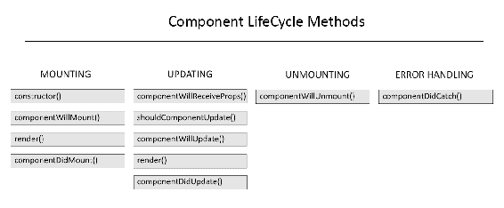

# 方法信息

让我们快速看一下前面的方法。

# constructor()方法

当组件挂载时，React 组件的构造函数首先被调用。在这里，我们可以设置组件的状态。

这是一个在`React.Component`中的构造函数示例：

```jsx
constructor(props) {
 super(props);
 this.state = {
 value: props.initialValue
 };
 }
```

在构造函数中使用`this.props`，我们需要调用`super(props)`来访问和调用父级的函数；否则，你会在构造函数中得到`this.props`未定义，因为 React 在调用构造函数后立即从外部设置实例上的`.props`，但当你在 render 方法中使用`this.props`时，它不会受到影响。

# render()方法

`render()`方法是必需的，用于渲染 UI 组件并检查`this.props`和`this.state`，并返回以下类型之一：

+   **React 元素**

+   **字符串和数字**

+   **门户**

+   **null**

+   **布尔值**

# componentWillMount()方法

此方法在`componentDidMount`之前立即调用。它在`render()`方法之前触发。

# componentDidMount()方法

此方法在组件挂载后立即调用。我们可以使用此方法从远程端点加载数据以实例化网络请求。

# componentWillReceiveProps()方法

当挂载的组件接收到新的 props 时，将调用此方法。此方法还允许比较当前值和下一个值，以确保 props 的更改。

# shouldComponentUpdate()方法

`shouldComponentUpdate()`方法在组件接收到新的 props 和 state 时被调用。默认值是`true`；如果返回`false`，React 会跳过组件的更新。

# componentWillUpdate()方法

`componentWillUpdate()`方法在渲染之前立即被调用，当接收到新的 prop 或 state 时。我们可以使用这个方法在组件更新之前执行操作。

如果`shouldComponentUpdate()`返回`false`，这个方法将不会被调用。

# componentDidUpdate()方法

`componentDidUpdate()`方法在组件更新后立即被调用。这个方法不会在初始渲染时被调用。

类似于`componentWillUpdate()`，如果`shouldComponentUpdate()`返回 false，这个方法也不会被调用。

# componentWillUnmount()方法

这个方法在 React 组件被卸载和销毁之前立即被调用。在这里，我们可以执行任何必要的清理，比如取消网络请求或清理在`componentDidMount`中创建的任何订阅。

# componentDidCatch()方法

这个方法允许我们在 React 组件中捕获 JavaScript 错误。我们可以记录这些错误，并显示另一个备用 UI，而不是崩溃的组件树。

现在我们对 React 组件中可用的组件方法有了清晰的了解。

观察以下 JavaScript 代码片段：

```jsx
<section>
<h2>My First Example</h2>
</section>
<script>
 var root = document.querySelector('section').createShadowRoot();
 root.innerHTML = '<style>h2{ color: red; }</style>' +'<h2>Hello World!</h2>';
</script>
```

现在，观察以下 ReactJS 代码片段：

```jsx
var sectionStyle = {
 color: 'red'
};
var MyFirstExample = React.createClass({
render: function() {
 return (<section><h2 style={sectionStyle}>
 Hello World!</h2></section>
 )}
})
ReactDOM.render(<MyFirstExample />, renderedNode);
```

现在，在观察了前面的 React 和 JavaScript 示例之后，我们将对普通 HTML 封装和 ReactJS 自定义 HTML 标签有一个清晰的了解。

React 不是一个 MVC 框架；它是一个用于构建可组合用户界面和可重用组件的库。React 在 Facebook 的生产阶段使用，并且[instagram.com](https://www.instagram.com/)完全基于 React 构建。

# Firebase

Firebase 平台帮助您开发高质量的应用程序并专注于用户。

Firebase 是由 Google 支持的移动和 Web 应用程序开发平台。它是开发高质量移动和 Web 应用程序的一站式解决方案。它包括各种产品，如实时数据库、崩溃报告、云 Firestore、云存储、云功能、身份验证、托管、Android 测试实验室和 iOS 性能监控，可以用来开发和测试实时应用程序，专注于用户需求，而不是技术复杂性。

它还包括产品，如云消息传递、Google 分析、动态链接、远程配置、邀请、应用索引、AdMob 和 AdWords，这些产品可以帮助您扩大用户群体，同时增加受众的参与度。

Firebase 提供多个 Firebase 服务。我们可以使用 Firebase 命名空间访问每个服务：

+   `firebase.auth()` - 认证

+   `firebase.storage()` - 云存储

+   `firebase.database()` - 实时数据库

+   `firebase.firestore()` - 云 Firestore

我们将在接下来的章节中涵盖所有前述的服务。在本章中，我们将简要地介绍前述产品/服务，以便对 Firebase 平台的所有功能有一个基本的了解。在接下来的章节中，我们将更详细地探索可以与 React 平台集成的与 web 相关的产品。

以下是我们将在本节中涵盖的主题列表：

+   Firebase 及其功能简介

+   Firebase 功能列表以及如何使用它

+   云 Firestore

+   使用 JavaScript 设置 Firebase 项目

+   使用 Firebase 和 JavaScript 创建“Hello World”示例应用程序

正如您所看到的，Firebase 提供了两种类型的云数据库和实时数据库，两者都支持实时数据同步。我们可以在同一个应用程序或项目中同时使用它们。好的，让我们深入了解并了解更多。

# 实时数据库

对于任何实时应用程序，我们都需要一个实时数据库。Firebase 实时数据库是一个云托管的 NoSQL 数据库，可以将数据实时同步到每个连接的客户端。Firebase 数据库使用同步机制，而不是典型的请求-响应模型，它可以在毫秒内将数据同步到所有连接的设备上。另一个关键功能是它的离线功能。Firebase SDK 将数据持久保存在磁盘上；因此，即使用户失去互联网连接，应用程序仍然可以响应。一旦重新建立连接，它会自动同步数据。它支持 iOS、Android、Web、C++和 Unity 平台。我们将在接下来的章节中详细介绍这一点。

Firebase 实时数据库可以在单个数据库中支持约 100,000 个并发连接和每秒 1,000 次写入。

以下屏幕截图显示了左侧 Firebase 中可用的功能列表，我们已经在数据库部分选择了实时数据库。在该部分，我们有四个选项卡可用：

+   数据

+   规则

+   备份

+   用法

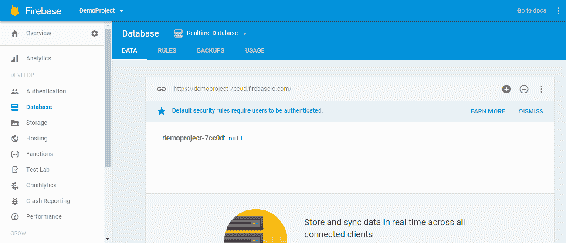

# 数据库规则

Firebase 数据库规则是保护数据的唯一方法。Firebase 为开发人员提供了灵活性和基于表达式的规则语言，具有类似 JavaScript 的语法，用于定义数据的结构、索引方式以及用户何时可以读取和写入数据。您还可以将身份验证服务与此结合，以定义谁可以访问哪些数据，并保护用户免受未经授权的访问。为了验证数据，我们需要在规则中使用`.validate`来单独添加规则。

考虑以下示例：

```jsx
{
"rules": {
".write": true,
"ticket": {
// a valid ticket must have attributes "email" and "status"
".validate": "newData.hasChildren(['email', 'status'])",
"status": {
// the value of "status" must be a string and length greater then 0 and less then 10
".validate": "newData.isString() && newData.val().length > 0 && newData.val().length < 10"
},
"email": {
// the value of "email" must valid with "@"
".validate": "newData.val().contains('@')"
}
}
}
}
```

以下是在“规则”选项卡中应用规则的其他示例代码块：

**默认**：身份验证的规则配置：

```jsx
{
 "rules": {
 ".read": "auth != null",
 ".write": "auth != null"
 }}
```

**公共**：这些规则允许每个人完全访问，即使是您应用的非用户。它们允许读取和写入数据库：

```jsx
{
 "rules": {
 ".read": true,
 ".write": true
 }}
```

**用户**：这些规则授权访问与 Firebase 身份验证令牌中用户 ID 匹配的节点：

```jsx
{
 "rules": {
   "users": {
       "$uid": {
             ".read": "$uid === auth.uid",
             ".write": "$uid === auth.uid"
         }
       }
    }
}
```

**私有**：这些规则配置不允许任何人读取和写入数据库：

```jsx
{
 "rules": {
    ".read": false,
    ".write": false
  }
}
```

我们还可以使用 Firebase 秘钥代码的 REST API 来通过向`/.settings/rules.json`路径发出`PUT`请求来编写和更新 Firebase 应用的规则，并且它将覆盖现有规则。

例如，`curl -X PUT -d '{ "rules": { ".read": true } }'` `'https://docs-examples.firebaseio.com/.settings/rules.json?auth=FIREBASE_SECRET'`。

# 备份

Firebase 允许我们保存数据库的每日备份，但这仅在 Blaze 计划中可用。它还会自动应用安全规则以保护您的数据。

# 用法

Firebase 允许通过分析图表查看数据库的使用情况。它实时显示了我们的 Firebase 数据库中的连接、存储、下载和负载：

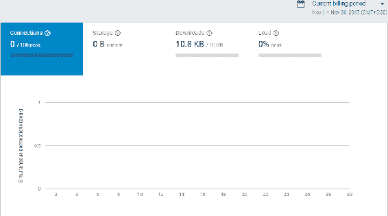

# Cloud Firestore

Cloud Firestore 也是一种云托管的 NoSQL 数据库。您可能会认为我们已经有了实时数据库，它也是一种 NoSQL 数据库，那么为什么我们需要 Firestore 呢？对这个问题的答案是，Firestore 可以被视为提供实时同步和离线支持以及高效数据查询的实时数据库的高级版本。它可以全球扩展，并让您专注于开发应用，而不必担心服务器管理。它可以与 Android、iOS 和 Web 平台一起使用。

我们可以在同一个 Firebase 应用程序或项目中使用这两个数据库。两者都是 NoSQL 数据库，可以存储相同类型的数据，并且具有类似方式工作的客户端库。

如果您想在云 Firestore 处于测试版时尝试它，请使用我们的指南开始使用：

+   转到[`console.firebase.google.com/`](https://console.firebase.google.com/)

+   选择您的项目，`DemoProject`

+   单击左侧导航栏中的数据库，然后选择 Cloud Firestore 数据库：

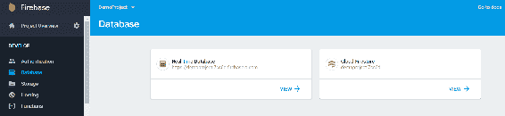

一旦我们选择数据库，它会提示您在创建数据库之前应用安全规则。

# 安全规则

在 Cloud Firestore 中创建数据库和集合之前，它会提示您为我们的数据库应用安全规则。

看一下以下的截图：

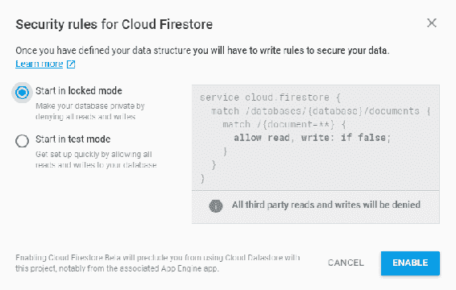

以下是 Firestore 规则的一些代码示例：

**公共**：

```jsx
service cloud.firestore {
    match /databases/{database}/documents {
           match /{document=**} {
           allow read, write;
        }
    }
}
```

**用户**：

```jsx
service cloud.firestore {
    match /databases/{database}/documents {
        match /users/{userId} {
           allow read, write: if request.auth.uid == userId;
        }
    }
}
```

**私有**：

```jsx
service cloud.firestore {
    match /databases/{database}/documents {
       match /{document=**} {
          allow read, write: if false;
       }
    }
}
```

# 实时数据库和云 Firestore 之间的区别

我们已经看到实时数据库和云 Firestore 都是具有实时数据同步功能的 NoSQL 数据库。因此，让我们根据功能来看看它们之间的区别。

# 数据模型

这两个数据库都是云托管的 NoSQL 数据库，但两个数据库的数据模型是不同的：

| **实时数据库** | **云 Firestore** |
| --- | --- |

|

+   简单的数据非常容易存储。

+   复杂的分层数据在规模上更难组织。

|

+   简单的数据很容易存储在类似 JSON 的文档中。

+   使用子集合在文档中更容易地组织复杂和分层数据。

+   需要较少的去规范化和数据扁平化。

|

# 实时和离线支持

两者都具有面向移动端的实时 SDK，并且都支持本地数据存储，以便离线就绪的应用程序：

| **实时数据库** | **云 Firestore** |
| --- | --- |
| 仅 iOS 和 Android 移动客户端的离线支持。 | iOS、Android 和 Web 客户端的离线支持。 |

# 查询

通过查询从任一数据库中检索、排序和过滤数据：

| **实时数据库** | **云 Firestore** |
| --- | --- |

| **具有有限排序和过滤功能的深度查询：**

+   您只能在一个属性上进行排序或过滤，而不能在一个属性上进行排序和过滤。

+   查询默认是深度的。它们总是返回整个子树。

| **具有复合排序和过滤的索引查询：**

+   您可以在单个查询中链接过滤器并结合过滤和对属性进行排序。

+   为子集合编写浅层查询；您可以查询文档内的子集合，而不是整个集合，甚至是整个文档。

+   查询默认进行索引。查询性能与结果集的大小成正比，而不是数据集的大小。

|

# 可靠性和性能

当我们为项目选择数据库时，可靠性和性能是我们首先考虑的最重要部分：

| **Realtime Database** | **Cloud Firestore** |
| --- | --- |

| **Realtime Database 是一个成熟的产品：**

+   您可以期望从经过严格测试和验证的产品中获得的稳定性。

+   延迟非常低，因此非常适合频繁的状态同步。

+   数据库仅限于单个区域的区域可用性。

| **Cloud Firestore 目前处于 beta 版：**

+   在 beta 产品中的稳定性并不总是与完全推出的产品相同。

+   将您的数据存储在不同地区的多个数据中心，确保全球可扩展性和强大的可靠性。

+   当 Cloud Firestore 从 beta 版毕业时，它的可靠性将比 Realtime Database 更强。

|

# 可扩展性

当我们开发大规模应用程序时，我们必须知道我们的数据库可以扩展到多大程度：

| **Realtime Database** | **Cloud Firestore** |
| --- | --- |
| **扩展需要分片：**在单个数据库中扩展到大约 100,000 个并发连接和每秒 1,000 次写入。超出这一范围需要在多个数据库之间共享数据。 | **扩展将是自动的：**完全自动扩展（在 beta 版之后），这意味着您不需要在多个实例之间共享数据。 |

# 安全性

就安全性而言，每个数据库都有不同的方式来保护数据免受未经授权的用户访问：

**来源**：[`firebase.google.com/docs/firestore/rtdb-vs-firestore?authuser=0`](https://firebase.google.com/docs/firestore/rtdb-vs-firestore?authuser=0)。

| **Realtime Database** | **Cloud Firestore** |
| --- | --- |

| **需要单独验证的级联规则。**

+   Firebase 数据库规则是唯一的安全选项。

+   读写规则会级联。

+   您需要使用`.validate`在规则中单独验证数据。

| **更简单，更强大的移动端、Web 端和服务器端 SDK 安全性。**

+   移动端和 Web 端 SDK 使用 Cloud Firestore 安全规则，服务器端 SDK 使用**身份和访问管理**（**IAM**）。

+   除非使用通配符，否则规则不会级联。

+   数据验证会自动进行。

+   规则可以限制查询；如果查询结果可能包含用户无权访问的数据，则整个查询将失败。

|

截至目前，Cloud Firestore 仅提供测试版；因此，在本书中，我们只关注实时数据库。

# 崩溃报告

崩溃报告服务可帮助您诊断 Android 和 iOS 移动应用中的问题。它会生成详细的错误和崩溃报告，并将其发送到配置的电子邮件地址，以便快速通知问题。它还提供了一个丰富的仪表板，您可以在其中监视应用的整体健康状况。

# 身份验证

Firebase 身份验证提供了一个简单而安全的解决方案，用于管理移动和 Web 应用的用户身份验证。它提供多种身份验证方法，包括使用电子邮件和密码进行传统的基于表单的身份验证，使用 Facebook 或 Twitter 等第三方提供商，以及直接使用现有的帐户系统。

# 用于 Web 的 FirebaseUI 身份验证

Firebase UI 是完全开源的，并且可以轻松定制以适应您的应用程序，其中包括一些库。它允许您快速将 UI 元素连接到 Firebase 数据库以进行数据存储，允许视图实时更新，并且还提供了用于常见任务的简单接口，例如显示项目列表或集合。

FirebaseUI Auth 是在 Firebase 应用程序中添加身份验证的推荐方法，或者我们可以使用 Firebase 身份验证 SDK 手动执行。它允许用户为使用电子邮件和密码、电话号码以及包括 Google 和 Facebook 登录在内的最流行的身份提供者添加完整的 UI 流程。

FirebaseUI 可在[`opensource.google.com/projects/firebaseui`](https://opensource.google.com/projects/firebaseui)上找到。

我们将在接下来的章节中详细探讨身份验证。

# 云函数

云函数允许您拥有无服务器应用程序；您可以在没有服务器的情况下运行自定义应用程序后端逻辑。您的自定义函数可以在特定事件上执行，这些事件可以通过集成以下 Firebase 产品来触发：

+   Cloud Firestore 触发器

+   实时数据库触发器

+   Firebase 身份验证触发器

+   Firebase 的 Google Analytics 触发器

+   云存储触发器

+   云 Pub/Sub 触发器

+   HTTP 触发器

# 它是如何工作的？

一旦编写并部署函数，Google 的服务器立即开始监听这些函数，即监听事件并在触发时运行函数。随着应用程序的负载增加或减少，它会通过快速扩展所需的虚拟服务器实例数量来响应。如果函数被删除、空闲或由您更新，那么实例将被清理并替换为新实例。在删除的情况下，它还会删除函数与事件提供者之间的连接。

这里列出了云函数支持的事件：

+   `onWrite()`: 当实时数据库中的数据被创建、销毁或更改时触发

+   `onCreate()`: 当实时数据库中创建新数据时触发

+   `onUpdate()`: 当实时数据库中的数据更新时触发

+   `onDelete()`: 当实时数据库中的数据被删除时触发

这是一个云函数`makeUppercase`的代码示例：

```jsx
exports.makeUppercase = functions.database.ref('/messages/{pushId}/original')
 .onWrite(event => {
 // Grab the current value of what was written to the Realtime Database.
 const original = event.data.val();
 console.log('Uppercasing', event.params.pushId, original);
 const uppercase = original.toUpperCase();
 // You must return a Promise when performing asynchronous tasks inside a Functions such as
 // writing to the Firebase Realtime Database.
 // Setting an "uppercase" sibling in the Realtime Database returns a Promise.
 return event.data.ref.parent.child('uppercase').set(uppercase);
 });
```

编写云函数后，我们还可以测试和监视我们的函数。

# 云存储

任何移动应用或 Web 应用都需要一个存储空间，以安全且可扩展的方式存储用户生成的内容，如文档、照片或视频。云存储是根据相同的要求设计的，并帮助您轻松存储和提供用户生成的内容。它提供了一个强大的流媒体机制，以获得最佳的最终用户体验。

以下是我们如何配置 Firebase 云存储：

```jsx
// Configuration for your app
 // TODO: Replace with your project's config object
 var config = {
 apiKey: '<your-api-key>',
 authDomain: '<your-auth-domain>',
 databaseURL: '<your-database-url>',
 storageBucket: '<your-storage-bucket>'
 };
 firebase.initializeApp(config);
  // Get a reference to the storage service
 var storage = firebase.storage();
```

```jsx
// Points to the root reference  var storageRef = storage.ref(); // Points to 'images'  var imagesRef = storageRef.child('images');  // Points to 'images/sprite.jpg'  // Note that you can use variables to create child values  var fileName =  'sprite.jpg';  var spaceRef = imagesRef.child(fileName);  // File path is 'images/sprite.jpg'  var path = spaceRef.fullPath // File name is 'sprite.jpg'  var name = spaceRef.name // Points to 'images'  var imagesRef = spaceRef.parent; 
```

`reference.fullPath`的总长度必须在 1 到 1,024 字节之间，不能包含回车或换行字符。

避免使用#、[、]、*或?，因为这些在其他工具（如 Firebase 实时数据库）中效果不佳。

# 托管

Firebase 提供了一个托管服务，您可以通过简单的命令轻松部署您的 Web 应用和静态内容。您的 Web 内容将部署在**全球交付网络**（**GDN**）上，因此无论最终用户的位置如何，都可以快速交付。它为您的域名提供免费的 SSL，以通过安全连接提供内容。它还提供完整的版本控制和一键回滚的发布管理。

# Android 的测试实验室

我们使用不同的 Android API 版本在各种设备上测试我们的 Android 应用程序，以确保最终用户可以在任何 Android 设备上使用我们的应用程序而不会出现任何问题。但是，很难让所有不同的设备都可供测试团队使用。为了克服这些问题，我们可以使用 Test Lab，它提供了云托管基础设施，以便使用各种设备测试应用程序。它还可以轻松收集带有日志、视频和截图的测试结果。它还会自动测试您的应用程序，以识别可能的崩溃。

# 性能监控

Firebase 性能监控专门为 iOS 应用程序的性能测试而设计。您可以使用性能跟踪轻松识别应用程序的性能瓶颈。它还提供了一个自动化环境来监视 HTTP 请求，有助于识别网络问题。性能跟踪和网络数据可以更好地了解您的应用程序的性能。

以下产品类别用于增加用户群体并更好地吸引他们。

# Google Analytics

Google Analytics 是一个非常知名的产品，我认为没有开发人员需要介绍它。Firebase 的 Google Analytics 是一个免费的分析解决方案，用于衡量用户对您的应用的参与度。它还提供有关应用使用情况的见解。分析报告可以帮助您了解用户行为，因此可以更好地做出关于应用营销和性能优化的决策。您可以根据不同的参数生成报告，例如设备类型、自定义事件、用户位置和其他属性。分析可以配置为 Android、iOS 和 C++和 Unity 应用程序。

# 云消息传递

任何实时应用程序都需要发送实时通知。Firebase Cloud Messaging（FCM）提供了一个平台，帮助您实时向应用用户发送消息和通知。您可以免费在不同平台上发送数百亿条消息：Android、iOS 和 Web。我们还可以安排消息的交付 - 立即或在将来。通知消息与 Firebase Analytics 集成，因此无需编码即可监控用户参与度。

以下浏览器支持服务工作者：

+   Chrome：50+

+   Firefox：44+

+   Opera Mobile：37+

```jsx
// Retrieve Firebase Messaging object.
const messaging = firebase.messaging();
messaging.requestPermission()
.then(function() {
 console.log('Notification permission granted.');
 // Retrieve the Instance ID token for use with FCM.
 // ...
})
.catch(function(err) {
 console.log('Unable to get permission to notify.', err);
});
```

FCM SDK 仅在 HTTPS 页面上受支持，因为服务工作者仅在 HTTPS 站点上可用。

# 动态链接

动态链接是帮助您将用户重定向到移动应用程序或 Web 应用程序中特定内容位置的 URL。如果用户在桌面浏览器中打开动态链接，将打开相应的网页，但如果用户在 Android 或 iOS 中打开它，用户将被重定向到 Android 或 iOS 中的相应位置。此外，动态链接在应用之间起作用；如果应用尚未安装，用户将被提示安装应用。动态链接增加了将移动 Web 用户转化为原生应用用户的机会。动态链接作为在线社交网络活动的一部分也增加了应用的安装，并且永久免费。

# 远程配置

在不重新部署应用程序到应用商店的情况下更改应用程序的颜色主题有多酷？是的，通过 Firebase 远程配置，可以对应用程序进行即时更改。您可以通过服务器端参数管理应用程序的行为和外观。例如，您可以根据地区为特定的受众提供一定的折扣，而无需重新部署应用程序。

# 邀请

一般来说，每个人都会向朋友和同事推荐好的应用程序。我们通过复制和粘贴应用链接来做到这一点。然而，由于许多原因，它并不总是有效，例如，链接是针对安卓的，所以 iOS 用户无法打开它。Firebase 邀请使通过电子邮件或短信分享内容或应用推荐变得非常简单。它与 Firebase 动态链接一起工作，为用户提供最佳的平台体验。您可以将动态链接与要分享的内容相关联，Firebase SDK 将为您处理，为您的应用用户提供最佳的用户体验。

# 应用索引

对于任何应用程序，让应用程序安装以及保留这些用户并进行一些参与同样重要。重新吸引已安装您的应用程序的用户，应用索引是一种方法。通过 Google 搜索集成，您的应用链接将在用户搜索您的应用提供的内容时显示。此外，应用索引还可以帮助您改善 Google 搜索排名，以便在顶部搜索结果和自动完成中显示应用链接。

# AdMob

应用开发者的最终目标大多是将其货币化。AdMob 通过应用内广告帮助您实现应用的货币化。您可以有不同类型的广告，比如横幅广告、视频广告，甚至原生广告。它允许您展示来自 AdMob 调解平台或谷歌广告商的广告。AdMob 调解平台具有广告优化策略，旨在最大化您的收入。您还可以查看 AdMob 生成的货币化报告，以制定产品策略。

# AdWords

在当今世界，最好的营销策略之一是在线广告。Google AdWords 帮助您通过广告活动吸引潜在客户或应用用户。您可以将您的 Google AdWords 帐户链接到您的 Firebase 项目，以定义特定的目标受众来运行您的广告活动。

现在我们已经了解了 Firebase 平台的所有产品，我们可以混合匹配这些产品来解决常见的开发问题，并在市场上推出最佳产品。

# 开始使用 Firebase

在我们实际在示例应用程序中使用 Firebase 之前，我们必须通过 Firebase 控制台在[`console.firebase.google.com/`](https://console.firebase.google.com/)上创建我们的 Firebase 项目。打开此链接将重定向您到 Google 登录页面，您将需要登录到您现有的 Google 帐户或创建一个新的帐户。

一旦您成功登录到 Firebase 控制台，您将看到以下截图所示的仪表板：

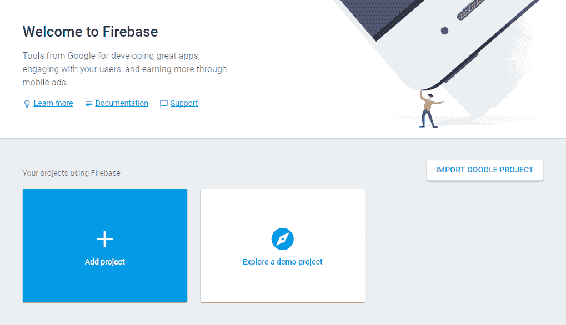

我们将通过单击“添加项目”按钮来创建我们的第一个项目。一旦您单击“添加项目”按钮，它将显示一个弹出窗口，询问您的项目名称和组织所在国家。我将其称为`DemoProject`，将国家设置为美国，然后单击“创建项目”按钮：

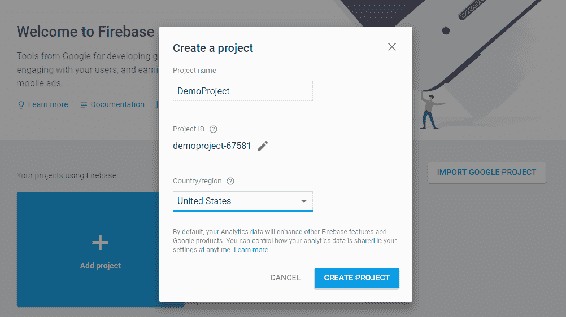

项目创建后，您就可以开始了。您将被重定向到项目仪表板，您可以在其中配置您想要在项目中使用的产品/服务：

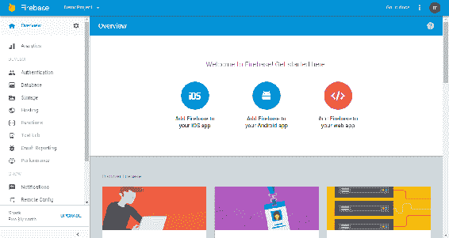

接下来，我们将看看如何将这个 Firebase 项目集成到 Web 应用程序中。您的 Web 应用程序可以是任何 JavaScript 或 NodeJS 项目。

首先，我们将使用纯 JavaScript 创建一个示例，然后我们将进一步包含 React。

现在，您需要在系统中创建一个名为`DemoProject`的目录，并在其中创建几个名为`images`、`css`和`js`（JavaScript）的文件夹，以使您的应用程序易于管理。完成文件夹结构后，它将如下所示：

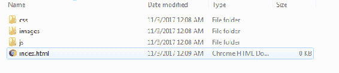

要将我们的 Firebase 项目集成到 JavaScript 应用程序中，我们需要一个代码片段，必须添加到我们的 JavaScript 代码中。要获取它，请单击“将 Firebase 添加到您的 Web 应用程序”，并注意它生成的初始化代码，它应该看起来像以下代码：

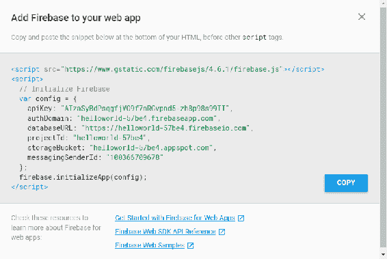

当我们开始使用 ReactJS 或纯 JavaScript 制作应用程序时，我们需要进行一些设置，这仅涉及 HTML 页面并包括一些文件。首先，我们创建一个名为`chapter1`的目录（文件夹）。在任何代码编辑器中打开它。直接在其中创建一个名为`index.html`的新文件，并添加以下 HTML5 Boilerplate 代码：

+   例如，我创建了一个名为`DemoProject`的文件夹

+   在文件夹中创建一个名为`index.html`的文件

+   在你的 HTML 中，添加我们从 Firebase 控制台复制的代码片段：

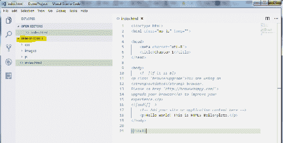我更喜欢并建议您在任何类型的 JavaScript 应用程序开发中使用 Visual Studio 代码编辑器，而不是列出的文本编辑器，因为它具有广泛的功能。

现在，我们需要将 Firebase 代码片段复制到 HTML 中：

```jsx
<!doctype html>
<html class="no-js" lang="">
<head>
 <meta charset="utf-8">
 <title>Chapter 1</title>
</head>
<body>
 <!--[if lt IE 8]>
<p class="browserupgrade">You are using an
<strong>outdated</strong> browser.
Please <a href="http://browsehappy.com/">
upgrade your browser</a> to improve your
experience.</p>
<![endif]-->
 <!-- Add your site or application content here -->
 <p>Hello world! This is HTML5 Boilerplate.</p>
 <script src="https://www.gstatic.com/firebasejs/4.6.1/firebase.js"></script>
 <script>
 // Initialize Firebase
 var config = {
 apiKey: "<PROJECT API KEY>",
 authDomain: "<PROJECT AUTH DOMAIN>",
 databaseURL: "<PROJECT DATABASE AUTH URL>",
 projectId: "<PROJECT ID>",
 storageBucket: "",
 messagingSenderId: "<MESSANGING ID>"
 };
 firebase.initializeApp(config);
 </script>
</body>
</html>
```

以下显示了我们数据库中的数据，我们将使用 JavaScript 获取并在 UI 上显示：

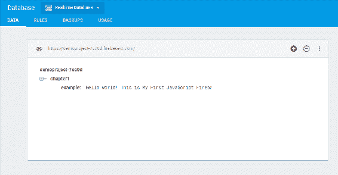

```jsx
//HTML Code to show the message
<p id="message">Hello world! This is HTML5 Boilerplate.</p>
<script>
//Firebase script to get the value from database and replace the "message".
var messageLabel = document.getElementById('message');
 var db = firebase.database();
 db.ref().on("value", function(snapshot) {
 console.log(snapshot.val());
 var object = snapshot.val();
 messageLabel.innerHTML = object.chapter1.example;
 });
</script>

```

在上述代码中，我们使用`on()`方法来检索数据。它以`value`作为事件类型，然后检索数据的快照。当我们向快照添加`val()`方法时，我们将获得要显示在`messageField`中的数据。

让我简要介绍一下 Firebase 中可用的事件，我们可以用它来读取数据。

就目前而言，在数据库规则中，我们允许任何人读取和写入数据库中的数据；否则，它会显示权限被拒绝的错误。将其视为一个例子：

`{`

`   "rules": {`

`      ".read": true,`

`     ".write": true`

`    }`

`}`

# Firebase 事件

如果您可以看到前面的代码，我们已经使用了接收 DataSnapshot 的回调函数，该 DataSnapshot 保存了快照的数据。快照是数据库引用位置在某个特定时间点的数据的图片，如果在引用位置不存在数据，则快照的值返回 null。

# value

最近，我们已经使用了这个宝贵的事件来读取实时数据库中的数据。每当数据发生变化时，都会触发此事件类型，并且回调函数将检索所有数据，包括子数据。

# child_added

每当我们需要检索项目对象列表时，此事件类型将被触发一次，并且每当新对象被添加到我们的数据给定路径时都会触发。与`value`不同，它返回该位置的整个对象，此事件回调作为包含两个参数的快照传递，其中包括新子项和先前子项数据。

例如，如果您想在博客应用程序中的每次添加新评论时检索数据，可以使用`child_added`。

# child_changed

当任何子对象更改时，将触发`child_changed`事件。

# child_removed

当立即子项被移除时，将触发`child_removed`事件。它通常与`child_added`和`child_changed`结合使用。此事件回调包含已移除子项的数据。

# child_moved

当您使用有序数据（如列表项的拖放）时，将触发`child_moved`事件。

现在，让我们快速查看一下我们的完整代码：

```jsx
<!doctype html> <html  class="no-js"  lang=""> <head> <meta  charset="utf-8"> <title>Chapter 1</title><script  src="</span>https://www.gstatic.com/firebasejs/4.6.1/firebase.js"></script> </head> <body><!--[if lt IE 8]> <p class="browserupgrade">You are using an<strong>outdated</strong> browser.Please <a href="http://browsehappy.com/">upgrade your browser</a> to improve yourexperience.
</p> <![endif]--> <!-- Add your site or application content here -->
<p  id="message">Hello world! This is HTML5 Boilerplate.</p> <script> // Initialize Firebase var  config  =  {
 apiKey: "<PROJECT API KEY>",
 authDomain: "<PROJECT AUTH DOMAIN>",
 databaseURL: "<PROJECT DATABASE AUTH URL>",
 projectId: "<PROJECT ID>",
 storageBucket: "",
 messagingSenderId: "<MESSANGING ID>"  }; firebase.initializeApp(config); var  messageLabel  =  document.getElementById('message'); var  db  =  firebase.database(); db.ref().on("value",  function(snapshot)  {
 console.log(snapshot.val());
 var object  =  snapshot.val();
 messageLabel.innerHTML  =  object.chapter1.example; });</script> </body> </html>
```

现在，在浏览器中打开`index.html`，让我们看一下结果：

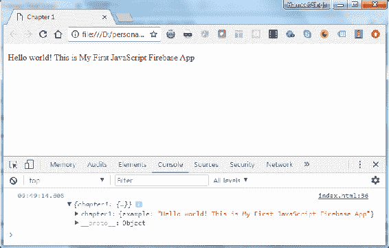

在上面的屏幕摘录中，我们可以看到`MessageLabel`上的数据库值和浏览器控制台中的 JavaScript 数据表示。

让我们通过从用户那里获取输入值并将这些值保存在数据库中来进一步扩展此示例。然后，使用事件，我们将在实时中在浏览器中显示这些消息：

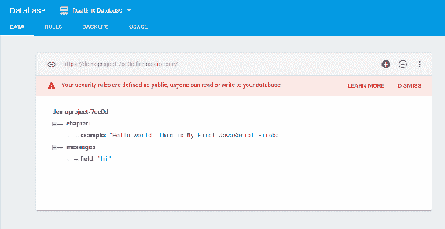

如图所示，我在数据库中添加了一个子节点`messages`。现在，我们将在我们的 HTML 中添加表单输入和保存按钮，并在底部在实时中显示用户提交的消息列表。

这是 HTML 代码：

```jsx
<input type="text" id="messageInput" />
 <button type="button" onclick="addData()">Send message</button>
<h2>Messages</h2>
 <p id="list">sdfdf</p>
```

现在，我们将创建`addData()`函数来获取并保存数据到 Firebase：

```jsx
 // Save data to firebase
 function addData() {
 var message = messageInput.value;
   db.ref().child('users').push({
    field: message
  });
  messageInput.value = '';
 }
```

在下一个屏幕截图中，我已经向输入文本添加了一些消息：

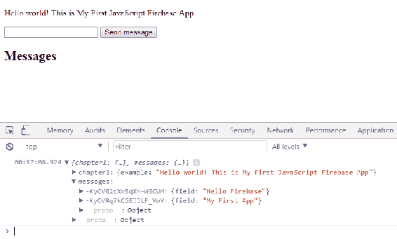

现在，我们需要将这些消息显示在 HTML 的消息标题底部：

```jsx
// Update list of messages when data is added
db.ref().on('child_added', function(snapshot) {
var data = snapshot.val();
console.log("New Message Added", data);
  snapshot.forEach(function(childSnap) {
    console.log(childSnap.val());
    var message = childSnap.val();
    messages.innerHTML = '\n' + message.field;
  });
});
```

我们已经使用了`child_added`事件，这意味着每当在节点上添加任何子项时，我们都需要获取该值并更新消息列表。

现在，打开你的浏览器并注意输出：

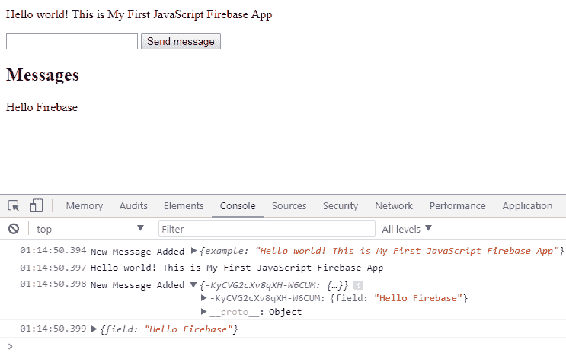

看起来很棒。我们现在能够看到用户提交的消息，并且我们的数据也在实时中得到更新。

现在，让我们快速看一下我们的代码是什么样子的：

```jsx
<!doctype html>
<html class="no-js" lang="">
<head>
 <meta charset="utf-8">
 <title>Chapter 1</title>
 <script src="https://www.gstatic.com/firebasejs/4.6.1/firebase.js"></script>
</head>
<body>
 <!-- Add your site or application content here -->
 <p id="message">Hello world! This is HTML5 Boilerplate.</p>
 <input type="text" id="messageInput" />
 <button type="button" onclick="addData()">Send message</button> 
 <h2>Messages</h2>
 <p id="list"></p>
<script>
 // Initialize Firebase
 var config = {
   apiKey: "<PROJECT API KEY>",
   authDomain: "<PROJECT AUTH DOMAIN>",
   databaseURL: "<PROJECT DATABASE AUTH URL>",
   projectId: "<PROJECT ID>",
   storageBucket: "",
   messagingSenderId: "<MESSANGING ID>"
 };
 firebase.initializeApp(config);

 var messageLabel = document.getElementById('message');
 var messageInput = document.getElementById('messageInput');
 var messages = document.getElementById('list'); 
 var db = firebase.database();
 db.ref().on("value", function(snapshot) {
     var object = snapshot.val();
     messageLabel.innerHTML = object.chapter1.example;
    //console.log(object);
 });
// Save data to firebase
 function addData() {
   var message = messageInput.value;
   db.ref().child('messages').push({
   field: message
 });
   messageInput.value = '';
 }
// Update results when data is added
 db.ref().on('child_added', function(snapshot) {
   var data = snapshot.val();
   console.log("New Message Added", data);
   snapshot.forEach(function(childSnap) {
   console.log(childSnap.val());
   var message = childSnap.val();
   messages.innerHTML = '\n' + message.field;
  });
 });
 </script>
</body>
</html>
```

# 总结

我们简单的 Hello World 应用程序和示例看起来很棒，并且正如他们应该的那样工作；所以，让我们回顾一下我们在本章学到的内容。

首先，我们介绍了 React 和 Firebase，以及设置 Firebase 帐户和配置有多么容易。我们还了解了实时数据库和 Firestore 之间的区别。除此之外，我们还学习了如何使用 JavaScript 初始化实时 Firebase 数据库，并开始构建我们的第一个 Hello World 应用程序。我们创建的 Hello World 应用程序演示了 Firebase 的一些基本功能，例如：

+   关于实时数据库和 Firestore

+   实时数据库和 Firestore 之间的区别

+   使用 JavaScript 应用程序创建 Firebase 帐户和配置

+   Firebase 事件（值和`child_data`）

+   将值保存到数据库中

+   从数据库中读取值

在第二章中，*将 React 应用程序与 Firebase 集成*，让我们使用 Firebase 构建一个 React 应用程序。我们将探索更多 React 和 Firebase 的基础知识，并介绍我们将在本书中构建的项目。
