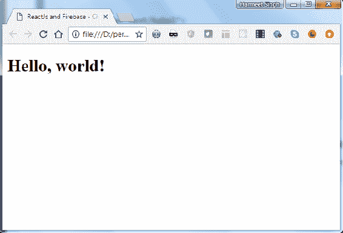
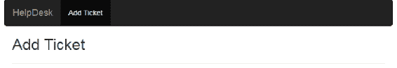
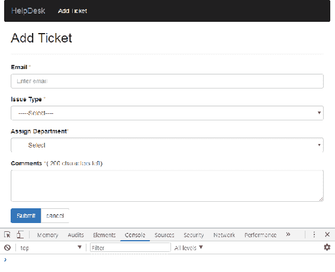
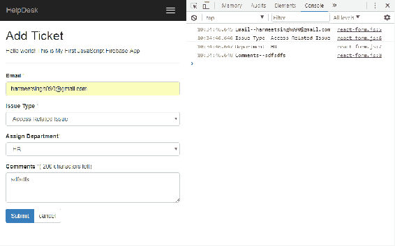
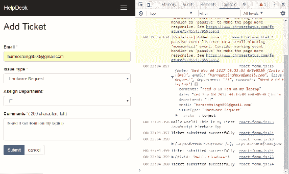
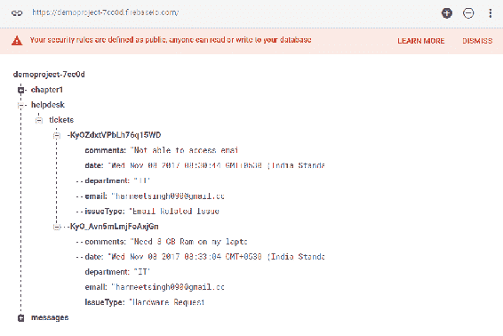
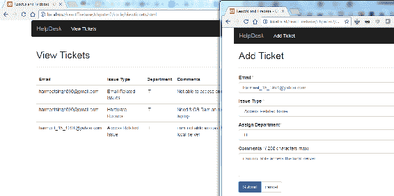
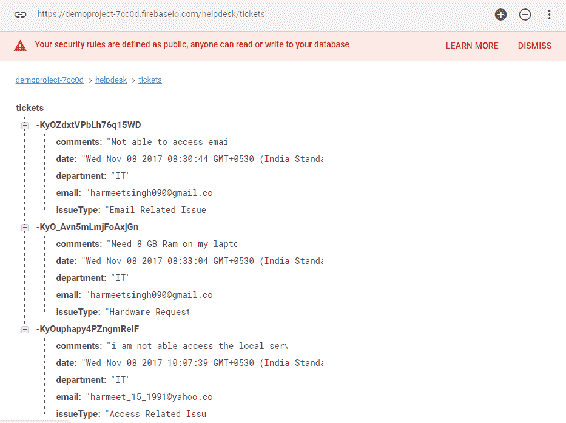

# 第二章：将 React 应用程序与 Firebase 集成

在第一章中，*使用 Firebase 和 React 入门*，我们看到了如何将 Firebase 与 JavaScript 集成，并创建了我们的第一个示例应用程序，这给了我们一个关于 Firebase 如何工作的简要概念。现在您已经完成了使用 JavaScript 和 Firebase 创建您的第一个 Web 应用程序，我们将使用 React 和 Firebase 构建帮助台应用程序。

我们将首先设置 React 环境，然后快速查看 JSX 和 React 组件方法。我们还将看到如何在 React 中使用 JSX 创建表单组件，并将这些表单值提交到 Firebase 实时数据库中。

以下是本章我们将关注的要点列表：

+   React 环境设置

+   JSX 和 React Bootstrap 的介绍

+   使用 JSX 创建表单

+   与 React 集成的 Firebase

+   保存和读取实时数据库中的数据

# 设置环境

首先，我们需要创建一个类似于我们在第一章中制作的 Hello World 应用程序的文件夹结构。以下屏幕截图描述了文件夹结构：

！[](Images/07f1cb0e-4dc0-4051-9e18-ee0d5db18194.png)

当我们开始使用 ReactJS 制作应用程序时，我们需要进行一些设置，这仅涉及 HTML 页面和`reactjs`库。一旦我们完成了文件夹结构的创建，我们需要安装我们的两个框架：ReactJS 和 Firebase。只需在页面中包含 JavaScript 和 CSS 文件即可。我们可以通过**内容交付网络**（**CDN**）（例如 Google 或 Microsoft）来实现这一点，但我们将在我们的应用程序中手动获取文件，这样我们就不必依赖于互联网，可以脱机工作。

# 安装 React

首先，我们必须转到[`reactjs.org/`](https://reactjs.org/)，查看我们将在应用程序中使用的最新可用版本：

！[](Images/05b3a56e-23a1-4afb-baef-4d6cb7ee64d4.png)

在撰写本书时，最新可用版本是 v16.0.0。我们将在本章中使用 CDN React 包来构建我们的应用程序：

```jsx
<script crossorigin src="https://unpkg.com/react@16/umd/react.development.js"></script>
<script crossorigin src="https://unpkg.com/react-dom@16/umd/react-dom.development.js"></script>
```

前述版本仅用于开发，不适合生产。要使用经过缩小和优化的生产版本，我们需要使用这些生产包：

```jsx
<script crossorigin src="https://unpkg.com/react@16/umd/react.production.min.js"></script>
<script crossorigin src="https://unpkg.com/react-dom@16/umd/react-dom.production.min.js"></script>
```

如果您想使用不同的版本，请将数字`16`替换为您在应用程序中要使用的版本。让我们在您的 HTML 中包含开发版本 CDN：

```jsx
<!doctype html>
<html class="no-js" lang="">
<head>
    <meta charset="utf-8">
    <title>ReactJs and Firebase - Chapter 2</title>
    <script crossorigin  
     src="https://unpkg.com/react@16/umd/react.development.js">
    </script>
    <script crossorigin src="https://unpkg.com/react-dom@16/umd/react-
     dom.development.js"></script>
</head>
<body>
    <!-- Add your site or application content here -->
    <p>Hello world! This is Our First React App with Firebase.</p>
</body>
</html>
```

# 使用 React

现在我们已经从 ReactJS 中初始化了我们的应用程序，让我们开始编写我们的第一个 Hello World 应用程序，使用`ReactDOM.render()`。`ReactDOM.render`方法的第一个参数是我们要渲染的组件，第二个参数是它应该挂载（附加）到的 DOM 节点。请观察以下代码：

```jsx
ReactDOM.render( ReactElement element, DOMElement container,[function callback] )
```

我们需要将它转换为原始 JavaScript，因为并非所有浏览器都支持 JSX 和 ES6 功能。为此，我们需要使用转译器 Babel，它将在 React 代码运行之前将 JSX 编译为原始 JavaScript。在 head 部分与 React 库一起添加以下库：

```jsx
<script src="https://unpkg.com/babel-standalone@6.15.0/babel.min.js"></script>
```

现在，添加带有 React 代码的脚本标签：

```jsx
<script type="text/babel">
ReactDOM.render(
<h1>Hello, world!</h1>,
document.getElementById('hello')
);
</script>
```

`<script type="text/babel">`标签实际上是在浏览器中执行转换的标签。

JavaScript 的 XML 语法称为**JSX**。我们将更详细地探讨这一点。让我们在浏览器中打开 HTML 页面。如果你在浏览器中看到 Hello, world!，那么我们就在正确的轨道上。请观察以下截图：



在上面的截图中，你可以看到它在你的浏览器中显示了 Hello, world!。看起来不错。我们已经成功完成了我们的设置，并用 ReactJS 构建了我们的第一个 Hello World 应用程序。

# React 组件

React 基于模块化构建，具有封装的组件，这些组件管理自己的状态，因此当数据发生变化时，它将高效地更新和渲染您的组件。在 React 中，组件的逻辑是用 JavaScript 编写的，而不是模板，因此您可以轻松地通过应用程序传递丰富的数据并在 DOM 之外管理状态。使用`render()`方法，我们在 React 中渲染一个组件，该组件接受输入数据并返回您想要显示的内容。它可以接受 HTML 标签（字符串）或 React 组件（类）。

让我们快速看一下这两种例子：

```jsx
var myReactElement = <div className="hello" />;
ReactDOM.render(myReactElement, document.getElementById('example'));
```

在这个例子中，我们将 HTML 作为字符串传递给`render`方法，之前我们创建了`<Navbar>`：

```jsx
var ReactComponent = React.createClass({/*...*/});
var myReactElement = <ReactComponent someProperty={true} />;
ReactDOM.render(myReactElement, document.getElementById('example'));
```

在上面的例子中，我们渲染组件只是为了创建一个以大写约定开头的局部变量。在 JSX 中使用大写约定，以避免区分本地组件类和 HTML 标签，因为 JSX 是 JavaScript 的扩展。在 React 中，我们可以以两种方式创建我们的 React 元素或组件：要么使用`React.createElement`的纯 JavaScript，要么使用 React 的 JSX。因此，让我们用 JSX 创建我们的第一个表单组件。

# 在 React 中 JSX 是什么？

JSX 是 JavaScript 语法的扩展，如果你观察 JSX 的语法或结构，你会发现它类似于 XML 编码。使用 JSX，你可以执行预处理步骤，将 XML 语法添加到 JavaScript 中。虽然你当然可以在不使用 JSX 的情况下使用 React，但 JSX 使 React 变得非常干净和可管理。与 XML 类似，JSX 标签具有标签名称、属性和子元素，如果属性值被引号括起来，那个值就成为一个字符串。XML 使用平衡的开放和关闭标签。JSX 类似地工作，它还有助于阅读和理解大量的结构，比 JavaScript 函数和对象更容易。

# 在 React 中使用 JSX 的优势

以下是一些优势的列表：

+   与 JavaScript 函数相比，JSX 非常简单易懂

+   JSX 代码语法对非程序员更加熟悉

+   通过使用 JSX，你的标记变得更有语义、有组织和有意义

# 如何使你的代码整洁清晰

正如我之前所说，这种结构/语法非常容易可视化/注意到，旨在使 JSX 格式的代码更加清晰和易懂，与 JavaScript 语法相比。

以下是一些代码片段的示例，它们将让你清楚地了解 React JavaScript 语法和 JSX：

```jsx
render: function () {
return React.DOM.div({className:"title"},
"Page Title",
React.DOM.hr()
);
}
```

现在，观察以下的 JSX 语法：

```jsx
render: function () {
return <div className="title">
Page Title<hr />
</div>;
}
```

所以现在我们清楚了，对于通常不习惯处理编码的程序员来说，JSX 真的很容易理解，他们可以学习、执行和编写它，就像 HTML 语言一样。

# 使用 JSX 的 React 表单

在开始使用 JSX 创建表单之前，我们必须了解 JSX 表单库。通常，HTML 表单元素输入将它们的值作为显示文本/值，但在 React JSX 中，它们取相应元素的属性值并显示它们。由于我们已经直观地感知到我们不能直接改变 props 的值，所以输入值不会有转变后的值作为展示值。

让我们详细讨论一下。要改变表单输入的值，你将使用 value 属性，然后你会看到没有变化。这并不意味着我们不能改变表单输入的值，但为此，我们需要监听输入事件，然后你会看到值的变化。

以下的例外是不言自明的，但非常重要：

在 React 中，标签内容将被视为值属性。由于 **for** 是 JavaScript 的保留关键字；HTML for 属性应该像 prop 一样被绑定。当您查看下一个示例时，您会更好地理解。现在，是时候学习了，为了在输出中有表单元素，我们需要使用以下脚本，并且还需要用先前编写的代码替换它。

现在，让我们开始为我们的应用程序构建一个 `Add Ticket form`。在根目录中创建一个 `reactForm.html` 文件和一个 <strong>js 文件夹中的 `react-form.js` 文件。以下代码片段只是一个包含 Bootstrap CSS 和 React 的基本 HTML 页面。

以下是我们的 HTML 页面的标记：

```jsx
<!doctype html>
<html lang="en">
<head>
    <meta charset="utf-8">
    <title>Add ticket form with JSX</title>
    <link rel="stylesheet" href="css/bootstrap.min.css">
</head>
<body>
    <script crossorigin 
    src="https://unpkg.com/react@16/umd/react.development.js"></script>
    <script crossorigin src="https://unpkg.com/react-dom@16/umd/react-
    dom.development.js"></script>
    <script src="https://unpkg.com/babel-
    standalone@6.15.0/babel.min.js"></script>
</body>
</html>
```

在页面底部加载所有脚本是一个很好的做法，在 `<body>` 标签关闭之前，这样可以成功在 DOM 中加载组件，因为当脚本在 `<head>` 部分执行时，文档元素不可用，因为脚本本身在 `<head>` 部分。解决这个问题的最佳方法是在页面底部保留脚本，在 `<body>` 标签关闭之前执行，这样在加载所有 DOM 元素后执行，不会抛出任何 JavaScript 错误。

由于 JSX 类似于 JavaScript，我们不能在 JSX 中使用 `class` 属性，因为它是 JavaScript 中的保留关键字。我们应该在 ReactDOM 组件中使用 `className` 和 `htmlFor` 作为属性名称。

现在，让我们在这个文件中使用 bootstrap 创建一些 HTML 布局

```jsx
 <div class="container">
   <div class="row">
     <nav class="navbar navbar-inverse navbar-static-top" role="navigation">
   <div class="container">
    <div class="navbar-header">
     <button type="button" class="navbar-toggle" data-toggle="collapse" data-target=".navbar-collapse">
     <span class="sr-only">Toggle navigation</span>
     <span class="icon-bar"></span>
     <span class="icon-bar"></span>
     <span class="icon-bar"></span>
 </button>
 <a class="navbar-brand" href="#">HelpDesk</a>
 </div>
 <div class="navbar-collapse collapse">
 <ul class="nav navbar-nav">
    <li class="active"><a href="#">Add Ticket</a></li>
 </ul>
 </div>
 </div>
 </nav>
 <div class="col-lg-12">
 <h2>Add Ticket</h2>
 <hr/> 
 <div id="form">
    <!-- Here we'll load load our AddTicketForm component with help of "form" id -->
 </div>
 </div>
 </div>
 </div>
```

在上面的代码中，我们创建了导航并将其包装到 bootstrap 网格类中，以实现组件的响应行为。

这是我们在浏览器中的 HTML 外观。

对于我们的 `Add Ticket form` 组件，我们需要以下表单字段以及标签：

+   邮箱：`<input>`

+   问题类型：`<select>`

+   分配部门：`<select>`

+   注释：`<textarea>`

+   按钮：`<button>`

此外，以下是支持的事件列表：

+   `onChange`, `onInput`, 和 `onSubmit`

+   `onClick`, `onContextMenu`, `onDoubleClick`, `onDrag`, 和 `onDragEnd`

+   `onDragEnter` 和 `onDragExit`

+   `onDragLeave`, `onDragOver`, `onDragStart`, `onDrop`, 和 `onMouseDown`

+   `onMouseEnter` 和 `onMouseLeave`

+   `onMouseMove`, `onMouseOut`, `onMouseOver`, 和 `onMouseUp`

让我们快速查看一下我们表单组件的代码在 `react-form.js` 中：

```jsx
class AddTicketForm extends React.Component {
    constructor() {
        super();
        this.handleSubmitEvent = this.handleSubmitEvent.bind(this);
    }
    handleSubmitEvent(event) {
        event.preventDefault();
    }
    render() {
        var style = {color: "#ffaaaa"};
        return ( <form onSubmit = {this.handleSubmitEvent}>
   <div className = "form-group">
      <label htmlFor = "email"> Email <span style = {style}> * </span></label>
      <input type = "text" id = "email" className = "form-control" placeholder = "Enter your email address" required />
   </div>
   <div className = "form-group">
      <label htmlFor = "issueType"> Issue Type <span style = {style}> * </span></label>
      <select className = "form-control" id = "issueType" required>
         <option value = ""> -- -- - Select-- -- < /option> 
         <option value = "Access Related Issue"> Access Related Issue </option>
         <option value = "Email Related Issues"> Email Related Issues </option>
         <option value = "Hardware Request"> Hardware Request</option>
         <option value = "Health & Safety"> Health & Safety </option>
         <option value = "Network"> Network </option> 
         <option value = "Intranet"> Intranet </option> 
         <option value = "Other"> Other </option> 
      </select>
   </div>
   <div className = "form-group">
      <label htmlFor = "department"> Assign Department 
      <span style = {style} > * </span>
      </label>
      <select className="form-control" id="department" required>
         <option value = ""> -- -- - Select-- -- </option> 
         <option value = "Admin" > Admin </option>
         <option value = "HR"> HR </option>
         <option value = "IT"> IT </option> 
         <option value = "Development"> Development </option>
      </select>
   </div>
   <div className = "form-group">
      <label htmlFor = "comments"> Comments 
      <span style = {style}> * </span>
      </label>
      ( <span id = "maxlength"> 200 </span> characters max)
      <textarea className = "form-control" rows = "3" id = "comments" required> </textarea> 
   </div>
   <div className = "btn-group">
      <button type = "submit" className = "btn btn-primary"> Submit </button> 
      <button type = "reset" className = "btn btn-default"> cancel </button> 
   </div>
</form>
            );
        }
    });
ReactDOM.render( <AddTicketForm /> ,
    document.getElementById('form')
);
```

要应用样式或调用`onSubmit()`函数的属性值，而不是使用引号（`""`），我们必须在 JavaScript 表达式中使用一对花括号（`{}`）。这意味着你可以通过用花括号包裹任何 JavaScript 表达式在 JSX 中嵌入它，甚至是一个函数。

在 react 库之后，在 HTML 页面底部添加这个脚本标签

```jsx
<script src="js/react-form.js" type="text/babel"></script>
```

现在，打开你的浏览器，让我们看看我们的 JSX 代码的输出：



看起来很棒。我们可以看到我们的表单如预期的那样。

在 React 中创建组件时，第一个字符应该始终大写。例如，我们的`Add Ticket form`组件是`<AddTicketForm></AddTicketForm>`。

对于大型应用程序，这种方法并不推荐；我们不能每次创建表单元素时都把整个 JSX 代码放在一个地方。为了使我们的代码清晰和易于管理，我们应该创建一个可重用的组件，只需在需要使用它的地方给出该组件的引用。

那么让我们看看如何在我们现有的代码中实现这一点，我们将创建一个可重用的文本输入组件：

```jsx
const TextInput = ({
    type,
    name,
    label,
    onChange,
    placeholder,
    value,
    required
}) => {
    return ( <div className = "form-group">
        <label htmlFor = {name} > {label} </label> 
        <div className = "field">
        <input type = {type}  name = {name} className ="form-control" placeholder = {         placeholder} value = {value} onChange = {onChange} required = {required}/> 
</div> 
</div>
    )
}
```

在上面的代码片段中，我们创建了一个对象，它接受与输入属性相关的一些参数，并将这些参数的值分配给属性的值：

```jsx
<TextInput
 type="email"
 name="email"
 label="Email"
 placeholder="Enter your email address"
 required={true}/>
```

现在我们只需要在我们的`render`方法中像这样添加前面的`TextInput`组件，正如你在前面的代码中所看到的，而不是在我们的应用程序中每次都添加标签和输入；这展示了 ReactJS 的强大之处。

# 使用 React-Bootstrap

React-Bootstrap 是一个为 React 重建的开源 JavaScript 框架。它类似于 Bootstrap，我们有现成的组件可以与 React 集成。这是 Bootstrap 框架组件在 React 中的纯重新实现。React-Bootstrap 不依赖于任何其他框架，因为 Bootstrap JS 依赖于 jQuery。通过使用 React-Bootstrap，我们可以确保不会有外部 JavaScript 调用来渲染组件，这可能与`ReactDOM.render`不兼容或需要额外的工作。然而，我们仍然可以实现相同的功能和外观

Twitter Bootstrap，但代码更清晰，更少。

让我们看看如何使用 React-Bootstrap 创建我们的`Add Ticket Form`组件。

首先，按照这里提到的步骤在你的项目中配置 React-Bootstrap：

1.  通过运行以下命令安装 React bootstrap npm 包

+   npm install --save react-bootstrap

1.  如果您正在使用 create-react-app CLI，我们不需要担心 bootstrap CSS；它已经存在，我们不需要包含。

1.  现在，通过使用 import 关键字，我们需要在 React 应用程序中添加对 react-bootstrap 组件的引用。

例如：

+   import Button from 'react-bootstrap/lib/Button';

// 或者

import { Button } from 'react-bootstrap';

# 使用 React-Bootstrap 添加工单表单

现在，您可能会想知道，既然我们已经安装了 React-Bootstrap，并且已经通过使用`import`语句在我们的项目中添加了 React-Bootstrap 的引用，它们不会互相冲突吗？不，它们不会。React-Bootstrap 与现有的 Bootstrap 样式兼容，因此我们不需要担心任何冲突。

查看`Add Ticket`组件渲染方法的代码：

```jsx
<form>
    <FieldGroup id="formControlsEmail" type="email" label="Email 
    address" placeholder="Enter email" />
    <FormGroup controlId="formControlsSelect">
        <ControlLabel>Issue Type</ControlLabel>
        <FormControl componentClass="select" placeholder="select">
            <option value="select">select</option>
            <option value="other">...</option>
        </FormControl>
    </FormGroup>
    <FormGroup controlId="formControlsSelect">
        <ControlLabel>Assign Department</ControlLabel>
        <FormControl componentClass="select" placeholder="select">
            <option value="select">select</option>
            <option value="other">...</option>
        </FormControl>
    </FormGroup>
    <FormGroup controlId="formControlsTextarea">
        <ControlLabel>Textarea</ControlLabel>
        <FormControl componentClass="textarea" placeholder="textarea" 
        />
    </FormGroup>
</form>
```

如您在上述代码中所见，它看起来比 Twitter Bootstrap 组件更清晰，因为我们可以从 React-Bootstrap 中导入单个组件，而不是包含整个库，例如`import { Button } from 'react-bootstrap';`。

以下是支持的表单控件列表：

+   `<FieldGroup>`用于自定义组件

+   `<FormControl>`用于`<input>`，`<textarea>`和`<select>`

+   `<Checkbox>`用于复选框

+   `<Radio>`用于单选按钮

+   `FormControl.Static`（用于静态文本）

+   `HelpBlock`

现在由您决定是使用 React-Bootstrap 还是带有 Bootstrap 样式的普通 JSX 组件。

更多细节，请查看[`react-bootstrap.github.io/components/forms/`](https://react-bootstrap.github.io/components/forms/)。

# 使用 React 的 Firebase

我们已经创建了一个 React 表单，您可以在其中提出 Helpdesk 的工单并保存到 Firebase。为此，现在我们需要在现有应用程序中集成和初始化 Firebase。

它的样子是这样的：

在我们的 HTML 底部添加了脚本标签：

```jsx
<!--Firebase Config -->
<script src="js/firebase-config.js"></script>
<!--ReactJS Form -->
<script type="text/babel" src="js/react-form.js"></script>
```

将现有的 Firebase 配置代码从上一章复制到`firebase-config.js`中：

```jsx
 // Initialize Firebase
 var config = {
 apiKey: "<PROJECT API KEY>",
 authDomain: "<PROJECT AUTH DOMAIN>",
 databaseURL: "<PROJECT DATABASE AUTH URL>",
 projectId: "<PROJECT ID>",
 storageBucket: "",
 messagingSenderId: "<MESSANGING ID>"
 };
 firebase.initializeApp(config);
 var firebaseDb = firebase.database();
```

还要将`Reactjs Form`添加到`react-form.js`中，以使我们的代码看起来干净和可管理：

```jsx
class AddTicketForm extends React.Component {
    constructor() {
        super();
        this.handleSubmitEvent = this.handleSubmitEvent.bind(this);
    }
    handleSubmitEvent(event) {
            event.preventDefault();
            console.log("Email--" + this.refs.email.value.trim());
            console.log("Issue Type--" + 
            this.refs.issueType.value.trim());
            console.log("Department--" + 
            this.refs.department.value.trim());
            console.log("Comments--" + this.refs.comment.value.trim());
        },
        render() {
            return ();
        }
};
```

# 属性和状态

在我们进行实际操作之前，我们应该知道在 React 中状态和属性是什么。在 ReactJs 中，组件使用 JSX 将您的原始数据转换为丰富的 HTML，属性和状态一起构建这些原始数据，以保持您的 UI 一致。好的，让我们确定它到底是什么：

+   属性和状态都是普通的 JS 对象。

+   它们由渲染更新触发。

+   React 通过调用 `setState`（数据，回调）来管理组件状态。这种方法将数据合并到此状态中，并重新渲染组件，以保持我们的 UI 最新。例如，下拉菜单的状态（可见或隐藏）。

+   React 组件属性（属性）随时间不会改变，例如下拉菜单项。有时组件只使用此属性方法获取一些数据并呈现它，这使得您的组件无状态。

+   使用属性和状态一起可以帮助您创建一个交互式应用程序。

将表单数据读取和写入 Firebase 实时数据库。

正如我们所知，ReactJS 组件有自己的属性和类似状态的表单，支持

一些受用户交互影响的属性：

`<input>` 和 `<textarea>`：

| **组件** | **支持的属性** |
| --- | --- |
| `<input>` 和 `<textarea>` | Value, defaultValue |
| `<input>` 复选框或单选框类型 | checked, defaultChecked |
| `<select>` | selected, defaultValue |

在 HTML `<textarea>` 组件中，值是通过 children 设置的，但在 React 中也可以通过 value 设置。`onChange` 属性被所有原生组件支持，例如其他 DOM 事件，并且可以监听所有冒泡变化事件。

正如我们所见，状态和属性将使您能够改变组件的值并处理该组件的状态。

现在，让我们在我们的“添加工单表单”中添加一些高级功能，这些功能可以帮助您获取用户输入的值，并借助 Firebase，我们将这些值保存在数据库中。

# Ref 属性

React 提供了 `ref` 非 DOM 属性来访问组件。ref 属性可以是回调函数，并且它将在组件挂载后立即执行。因此，我们将在我们的表单元素中附加 ref 属性以获取这些值。

在添加 ref 属性后，让我们快速查看一下我们的组件：

```jsx
<div>
   <form ref = "form" onSubmit = {this.handleSubmitEvent}>
      <div className = "form-group">
         <label htmlFor= "email"> Email <span style = {style} > * </span></label>
         <input type = "text" id = "email" className = "form-control" placeholder = "Enter your email address" required ref = "email" />
      </div>
      <div className = "form-group">
         <label htmlFor = "issueType"> Issue Type <span style = {style}> * </span></label>
         <select className = "form-control" id = "issueType" required ref = "issueType">
            <option value = "" > -- -- - Select-- -- </option>
            <option value = "Access Related Issue"> Access Related 
               Issue 
            </option>
            <option value = "Email Related Issues"> Email Related 
               Issues 
            </option>
            <option value = "Hardware Request"> Hardware Request </option>
            <option value = "Health & Safety"> Health & Safety </option>
            <option value = "Network" > Network < /option> 
            <option value = "Intranet"> Intranet </option>
            <option value = "Other"> Other </option>
         </select>
      </div>
      <div className = "form-group">
         <label htmlFor = "department"> Assign Department <span style = {style} > * </span></label>
         <select className = "form-control" id = "department" required ref = "department">
            <option value = ""> -- -- - Select-- -- </option>
            <option value = "Admin"> Admin </option> 
            <option value = "HR"> HR </option>
            <option value = "IT"> IT </option>
            <option value = "Development"> Development </option>
         </select>
      </div>
      <div className = "form-group">
         <label htmlFor = "comments"> Comments <span style = {style
            } > * </span></label>
         ( <span id = "maxlength"> 200 </span> characters max) <textarea className = "form-control" rows = "3" id = "comments" required ref = "comment"> </textarea> 
      </div>
      <div className = "btn-group"><button type = "submit" className = "btn btn-primary"> Submit </button> <button type = "reset" className = "btn btn-default"> cancel </button> </div>
   </form>
</div>
```

现在，让我们打开浏览器，看看我们的组件是什么样子的：



Firebase 在我们的应用程序中完美运行，因为您可以看到标题底部显示的消息“Hello world! This is My First JavaScript Firebase App”; 这是来自 Firebase 实时数据库

此外，在控制台中，您可以在提交表单时看到这些值。

现在我们需要将这些值保存到数据库中：

```jsx
//React form data object
var data = {
   date: Date(),
   email:this.refs.email.value.trim(),
   issueType:this.refs.issueType.value.trim(),
   department:this.refs.department.value.trim(),
   comments:this.refs.comment.value.trim()
 }
```

我们这样做是为了将“表单”数据对象写入 Firebase 实时数据库；`firebase.database.Reference`是一个异步监听器，用于从 Firebase 检索数据。一旦触发此监听器，它将在初始状态和数据发生更改时触发。

如果我们有权限，我们可以从 Firebase 数据库中读取和写入数据，因为默认情况下，数据库是受限制的，没有人可以在没有设置身份验证的情况下访问它。

`firebaseDb.ref().child('helpdesk').child('tickets').push(data);`

在上述代码中，我们使用`push()`方法将数据保存到 Firebase 数据库中。每当向指定的 Firebase 引用添加新子项时，它都会生成一个唯一键。我们还可以使用`set()`方法将数据保存到指定引用的数据；它将替换该节点路径上的现有数据：

`firebaseDb.ref().child('helpdesk').child('tickets').set(data);`

要在添加数据时检索更新结果，我们需要使用`on()`方法附加监听器，或者在任何情况下，如果我们想要在特定节点上分离监听器，那么我们可以通过调用`off()`方法来实现：

```jsx
 firebaseDb.ref().on('child_added', function(snapshot) {
 var data = snapshot.val();
  snapshot.forEach(function(childSnap) {
    console.log(childSnap.val());
     this.refs.form.reset();
    console.log("Ticket submitted successfully");
  });
 });
```

但是，如果我们想要一次读取它们而不监听更改，我们可以使用`once()`方法：

```jsx
 firebaseDb.ref().once('value').then(function(snapshot){
 });
```

这在我们不期望数据发生任何变化或任何主动监听时非常有用。例如，在我们的应用程序中成功验证用户配置文件数据时，加载用户配置文件数据时。

要更新数据，我们有`update()`方法，要删除数据，我们只需要调用该数据位置的`delete()`方法。

`update()`和`set()`方法都返回一个 Promise，因此我们可以使用它来知道写入是否提交到数据库。

现在，让我们提交表单并在浏览器控制台中查看输出：



看起来很棒；现在，让我们来看看我们的 Firebase 数据库：



我们能够看到我们从 ReactJS 表单提交的数据。

现在我们将以表格格式显示这些数据；为此，我们需要创建另一个 React 组件并设置组件的初始状态：

```jsx
constructor(){
    super();
    this.state = {
      tickets:[]
    }
  }
```

现在，使用`componentDidMount()`方法，我们将通过`ref()`调用数据库，迭代对象，并使用`this.setState()`设置组件的状态：

```jsx
componentDidMount()  {
  var  itemsRef  =  firebaseDb.ref('/helpdesk/tickets');
  console.log(itemsRef);
  itemsRef.on('value',  (snapshot)  =>  {
  let  tickets  =  snapshot.val();
  console.log(tickets);
  let  newState  = [];
  for (let  ticket  in  tickets) {
  newState.push({
 id:tickets[ticket],
 email:tickets[ticket].email,
 issueType:tickets[ticket].issueType,
 department:tickets[ticket].department,
 comments:tickets[ticket].comments,
 date:tickets[ticket].date
  });
  }
  this.setState({
 tickets:  newState
  });
  }); },
```

现在我们将在渲染方法内部迭代票务状态并在表格中显示：

```jsx
render() {
  return (<table className="table">
<thead>
<tr> 
    <th>Email</th>
    <th>Issue Type</th> 
    <th>Department</th> 
    <th>Comments</th> 
    <th>Date</th> 
</tr>
</thead>
<tbody>
 {
   this.state.tickets.map((ticket) => 
    { return ( 
    <tr key={ticket.id}> 
        <td>{ticket.email}</td> 
        <td>{ticket.issueType}</td> 
        <td>{ticket.department}</td> 
        <td>{ticket.comments}</td> 
        <td>{ticket.date}</td> 
</tr> )})
 } 
</tbody>
</table>
)}
```

现在，用户可以在实时上查看票据列表，每当数据库中添加新的票据时：



这是我们 HTML 页面的标记：`viewTickets.html`：

```jsx
 <div class="col-lg-10">
 <h2>View Tickets</h2>
 <hr>
    <div id="table" class="table-responsive">
      <!-- React Component will render here -->
    </div>
 </div>
 </div>
 </div>
```

这是在 Firebase 实时数据库中添加的票据列表：



# 总结

在本章中，我们看到了 JSX 在 React 中制作自定义组件以及使它们非常简单可视化、理解和编写方面起着重要作用。我们还看到了 props 和 state 在使组件交互以及在 DOM 交互中获取表单字段的值方面起着重要作用。借助`refs`，我们可以调用任何公共方法并向特定的子实例发送消息。

此外，我们通过创建一个`Add Ticket form`来探索了 React-Bootstrap 组件，该表单在所有预期的设备上以及桌面浏览器上都能很好地工作。

此外，我们还看到了在 ReactJS 应用程序中使用 Firebase 实时数据库有多么容易。只需几行代码，我们就可以将数据保存到实时数据库，并实时从数据库中检索票据列表，使我们的应用程序实时化。

在下一章中，我们将在 node.js 环境中进行 React 和 Firebase 设置，以及如何使用 Firebase OAuth 提供程序在我们的应用程序中添加身份验证。我们还将探索用于导航的 React 路由
