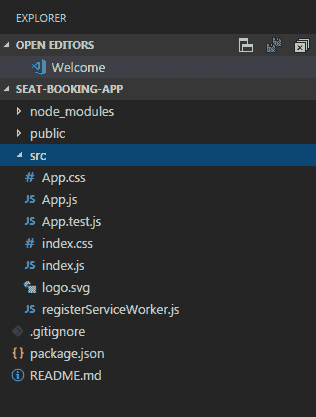
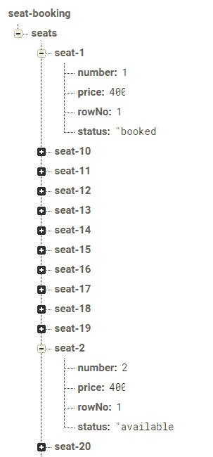
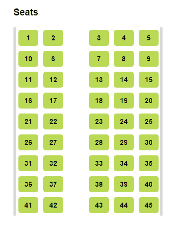
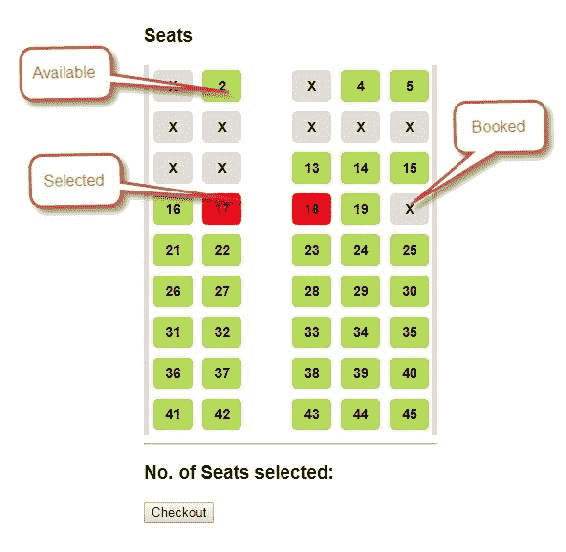
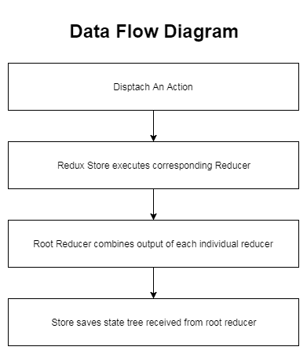

# 第四章：将 React 连接到 Redux 和 Firebase

在第三章中，*使用 Firebase 进行身份验证*，我们看到了 React 组件如何构建以及它们如何管理自己的状态。在本章中，我们将看看如何高效地管理应用程序状态。我们将详细探讨 Redux，并了解何时以及何时需要在我们的 React 应用程序中使用 Redux。我们还将看到如何将 React，Redux 和 Firebase 集成到一个示例座位预订应用程序中。这将是一个通用的座位预订应用程序，并且可以用作任何座位预订，例如公交车座位预订，体育场座位预订或剧院座位预订，在数据结构中进行一些小的更改。

以下是本章将涵盖的主题列表：

+   使用 React Starter Kit 设置 React

+   Firebase 实时数据库和 React 的集成

+   Redux

+   React，Redux 和 Firebase 实时数据库的集成

+   涵盖上述所有概念的座位预订应用程序

让我们设置开发环境。

要设置 React 开发环境，您需要使用 6.0 或更高版本的 node。

# React 设置

为了设置我们的开发环境，第一步将是 React 设置。有不同的选项可用于安装 React。如果您已经有现有的应用程序并希望添加 React，可以使用包管理器（如`npm`）使用以下命令进行安装：

```jsx
npm init
npm install --save react react-dom
```

但是，如果您要启动一个新项目，最简单的方法是使用 React Starter Kit 开始。只需转到命令提示符并执行以下命令以安装 React Starter kit：

```jsx
npm install -g create-react-app
```

此命令将通过下载所有必需的依赖项来安装和设置本地开发环境。使用 node 拥有开发环境的许多好处，例如优化的生产构建，使用简单的`npm`或`yarn`命令安装库等。

安装后，您可以使用给定的命令创建您的第一个应用程序：

```jsx
create-react-app seat-booking
```

它将创建一个前端应用程序，并不包括任何后端逻辑或集成。它只是前端，因此您可以将其与任何后端技术集成或集成到现有项目中。

上述命令将花费一些时间来下载所有依赖项并创建项目，所以请耐心等待。

项目创建后，只需进入该文件夹并运行服务器：

```jsx
cd seat-booking
npm start
```

一旦服务器启动，您可以在`http://localhost:3000`访问应用程序。

起始套件是开始使用 React 的最佳方式。但是，如果您是高级用户，可以通过使用以下命令手动配置项目来添加 React 依赖项：

```jsx
npm init
npm install --save react react-dom
```

对于这个示例座位预订应用程序，我们将使用`create-react-app`命令。

项目结构将如下所示，如果您在 Visual Code 编辑器中查看：



创建的应用程序结构已经足够好了，但是对于我们的座位预订应用程序，我们需要以更好的包结构组织我们的源代码。

因此，我们将为操作、组件、容器和减速器创建不同的文件夹，如下面的屏幕截图所示。现在，只关注`components`文件夹，因为在其中，我们将放置我们的 React 组件。其余的文件夹与 Redux 有关，我们将在 Redux 部分中看到：


在应用程序开发的开始阶段识别组件非常重要，这样您就可以拥有更好的代码结构。

为了开始，我们的座位预订应用程序中将有以下 React 组件：

+   `Seat`：`Seat`对象和应用程序的基本构建块

+   `SeatRow`：它表示一排座位

+   `SeatList`：它表示所有座位的列表

+   `Cart`：它表示将包含所选座位信息的购物车

请注意，组件的设计取决于应用程序的复杂性和应用程序的数据结构。

让我们从我们的第一个组件开始，称为 Seat。这将在`components`文件夹下。

`components/Seat.js`：

```jsx
import React from 'react'
import PropTypes from 'prop-types'

const Seat = ({ number, price, status }) => (
  <li className={'seatobj ' + status} key={number.toString()}>
   <input type="checkbox" disabled={status === "booked" ? true : false} id={number.toString()} onClick={handleClick}/>
   <label htmlFor={number.toString()}>{number}</label>
  </li>
)
const handleClick = (event) => {
  console.log("seat selected " + event.target.checked);
}

Seat.propTypes = {
   number:PropTypes.number,
   price:PropTypes.number,
   status:PropTypes.string
}

export default Seat;
```

在这里，需要注意的一件重要的事情是，我们正在使用 JSX 语法，这是我们在第二章中已经看到的，*将 React 应用程序与 Firebase 集成*。

在这里，我们已经定义了具有三个属性的`Seat`组件：

+   `number`：指的是给该座位的编号或 ID

+   `price`：指的是预订此座位需要收取的金额

+   `status`：指的是座位状态，即已预订或可用

在 React 中，`PropTypes`用于验证组件接收的输入；例如，价格应该是一个数字而不是一个字符串。如果为属性提供了无效值，JavaScript 控制台将显示警告。出于性能原因，`PropTypes`检查只会在开发模式下进行。

在我们的座位预订应用程序中，当用户选择座位时，我们需要将其添加到购物车中，以便用户可以结账/预订票。为此，我们需要处理座位的`onClick()`。目前，我们只是在点击处理程序函数中打印一个控制台语句，但是我们需要编写一个逻辑将所选座位推送到购物车中。当我们在应用程序中集成 Redux 时，我们将在后面的部分中进行研究。

如果任何座位已经预订，显然我们不会允许用户选择它，因此基于状态，如果座位已预订，我们将禁用座位。

座位是我们的基本构建块，它将从父组件`SeatRow`接收数据。

`components/SeatRow.js`：

```jsx
import React from 'react'
import PropTypes from 'prop-types'
import Seat from './Seat';
const SeatRow = ({ seats, rowNumber }) => (
   <div>
      <li className="row">
        <ol className="seatrow">
           {seats.map(seat =>
             <Seat key={seat.number} number={seat.number}
                   price={seat.price}
                   status={seat.status}
             />
           )}
        </ol>
      </li>
    </div>
)
SeatRow.propTypes = {
   seats: PropTypes.arrayOf(PropTypes.shape({
      number: PropTypes.number,
      price: PropTypes.number,
      status: PropTypes.string
   }))
}
export default SeatRow;
```

`SeatRow`代表一排座位。我们正在创建松散耦合的组件，可以轻松维护并在需要时重用。在这里，我们正在迭代座位 JSON 数据数组，以渲染相应的`Seat`对象。

您可以在前面的代码块中看到，我们正在使用`PropTypes`验证我们的值。`PropTypes.arrayOf`表示座位的数组，`PropTypes.shape`表示`Seat`对象的 props。

我们的下一个组件是`SeatList`组件。

`components/SeatList.js`：

```jsx
import React from 'react'
import PropTypes from 'prop-types'
const SeatList = ({ title, children }) => (

  <div>
    <h3>{title}</h3>
    <ol className="list">
         {children}
    </ol>
  </div>

)
SeatList.propTypes = {
children: PropTypes.node,
title: PropTypes.string.isRequired
}
export default SeatList;
```

在这里，我们定义了一个`SeatList`组件，具有两个属性：

+   `title`: 用于座位预订的标题

+   `children`：它代表座位列表

与 proptypes 相关的两个重要事项：

+   `Proptypes.string.isRequired`：`isRequired`可以链接以确保如果接收到的数据无效，则在控制台中看到警告。

+   `Proptypes.node`：Node 表示可以呈现任何内容：数字、字符串、元素或包含这些类型的数组（或片段）。

我们应用程序中的下一个和最终组件是`Cart`。

`components/Cart.js`：

```jsx
const Cart = () => {
 return (
    <div>
       <h3>No. of Seats selected: </h3>
       <button>
         Checkout
       </button>
    </div>
 )
}
export default Cart;
```

我们的购物车组件将有一个名为`Checkout`的按钮来预订票。它还将显示所选座位的摘要和需要支付的总费用。目前，我们只是放置了一个按钮和一个标签。一旦我们在应用程序中集成 Firebase 和 Redux，我们将对其进行修改。

因此，我们的展示组件已准备就绪。现在，让我们将 Firebase 与我们的应用程序集成。

# 集成 Firebase 实时数据库

现在是时候在我们的应用程序中集成 Firebase 了。虽然我们已经在第二章中看到了 Firebase 实时数据库的详细描述和特性，*连接 React 到 Redux 和 Firebase*，我们将看到 JSON 数据架构的关键概念和最佳实践。Firebase 数据库将数据存储为 JSON 树。

考虑以下示例：

```jsx
{
  "seats" : {
    "seat-1" : {
      "number" : 1,
      "price" : 400,
      "rowNo" : 1,
      "status" : "booked"
    },
    "seat-2" : {
      "number" : 2,
      "price" : 400,
      "rowNo" : 1,
      "status" : "booked"
    },
    "seat-3" : {
      "number" : 3,
      "price" : 400,
      "rowNo" : 1,
      "status" : "booked"
    },
   "seat-4" : {
      "number" : 4,
      "price" : 400,
      "rowNo" : 1,
      "status" : "available"
    },
    ...
  }
}
```

数据库使用 JSON 树，但存储在数据库中的数据可以表示为某些原生类型，以帮助您编写更易维护的代码。如前面的例子所示，我们创建了一个类似`seats > seat-#`的树形结构。我们正在定义我们自己的键，比如`seat-1`，`seat-2`，等等，但如果您使用`push`方法，它将被自动生成。

值得注意的是，Firebase 实时数据库数据嵌套可以达到 32 级深。然而，建议您尽量避免嵌套，并使用扁平化的数据结构。如果您有一个扁平化的数据结构，它将为您提供两个主要的好处：

+   加载/获取所需的数据：您将只获取所需的数据，而不是完整的树，因为在嵌套树的情况下，如果您加载一个节点，您将同时加载该节点的所有子节点。

+   安全性：您可以限制对数据的访问，因为在嵌套树的情况下，如果您给予对父节点的访问权限，这实际上意味着您也授予对该节点下数据的访问权限。

这里的最佳实践如下：

+   避免嵌套数据

+   使用扁平化的数据结构

+   创建可扩展的数据

让我们首先创建我们的实时 Firebase 数据库：



我们可以直接在 Firebase 控制台上创建这个结构，或者创建这个 JSON 并将其导入 Firebase。我们的数据结构如下：

+   座位：座位是我们的主节点，包含一个座位列表

+   座位：座位是一个表示具有唯一编号、价格和状态的座位的单独对象

我们可以为我们的示例应用程序设计一个三级深度嵌套的数据结构，比如`seats > row > seat`，但正如前面的最佳实践中所述，我们应该设计一个扁平化的数据结构。

现在我们设计好了我们的数据，让我们在应用程序中集成 Firebase。在这个应用程序中，我们将使用`npm`添加它的模块，而不是通过 URL 添加 Fireabase 依赖项：

```jsx
npm install firebase
```

这个命令将在我们的应用程序中安装 Firebase 模块，我们可以使用以下语句导入它：

```jsx
import firebase from 'firebase';
```

导入语句是 ES6 的特性，所以如果你不了解它，请参考 ES6 文档[`es6-features.org/`](http://es6-features.org/)。

我们将把与数据库相关的文件放在一个名为 API 的文件夹中。

`api/firebase.js`：

```jsx
import firebase from 'firebase'
var config = { /* COPY THE ACTUAL CONFIG FROM FIREBASE CONSOLE */
apiKey:"AIzaSyBkdkAcHdNpOEP_W9NnOxpQy4m1deMbG5Vooo",
authDomain:"seat-booking.firebaseapp.com",
databaseURL:"https://seat-booking.firebaseio.com",
projectId:"seat-booking",
storageBucket:"seat-booking.appspot.com",
messagingSenderId:"248063178000"
};
var fire = firebase.initializeApp(config);
export default fire;
```

上述代码将初始化 Firebase 实例，该实例可用于连接 Firebase。为了更好地关注点分离，我们还将创建一个名为`service.js`的文件，该文件将与我们的数据库交互。

`api/service.js`：

```jsx

import fire from './firebase.js';

export function getSeats() {
    let seatArr = [];
    let rowArray = [];
    const noOfSeatsInARow = 5;

    return new Promise((resolve, reject) => {
        //iterate through seat array and create row wise groups/array
        const seatsRef = fire.database().ref('seats/').orderByChild("number");
        seatsRef.once('value', function (snapshot) {
            snapshot.forEach(function (childSnapshot) {
                var childData = childSnapshot.val();
                seatArr.push({
                    number: childData.number,
                    price: childData.price,
                    status: childData.status,
                    rowNo: childData.rowNo
                });
            });

            var groups = [], i;
            for (i = 0; i < seatArr.length; i += noOfSeatsInARow) {
                groups = seatArr.slice(i, i + noOfSeatsInARow);
                console.log(groups);
                rowArray.push({
                    id: i,
                    seats: groups
                })
            }
            console.log(rowArray);
            resolve(rowArray);
        }).catch(error => { reject(error) });
    })

}

export function bookSelSeats(seats) {
    console.log("book seats", seats);
    return new Promise((resolve, reject) => {
        //write logic for payment 
        seats.forEach(obj => {
            fire.database().ref('seats/').child("seat-" + obj.number)
                .update({ status: "booked" }).then(resolve(true)).catch(error => { reject(error) });
        })
    });

}
```

在这个文件中，我们主要定义了两个函数——`getSeats()`和`bookSelSeats()`——用于从数据库中读取座位列表和在用户从购物车中选中座位时更新座位。

Firebase 提供了两种方法——`on()`和`once()`——用于在路径上读取数据并监听更改。`on`和`once`方法之间有区别：

1.  on 方法：它将监听数据更改，并在事件发生时接收数据库中指定位置的数据。此外，它不会返回`Promise`对象。

1.  once 方法：它将仅被调用一次，并且不会监听更改。它将返回一个`Promise`对象。

由于我们使用了 once 方法，所以我们得到一个返回到我们组件对象的`Promise`对象，因为从我们组件到服务的调用将是异步的。您将在接下来的`App.js`文件中更好地理解它。

要读取给定路径上内容的静态快照，我们可以使用`value`事件。当侦听器附加时，此方法仅执行一次，并且每次数据更改（包括子级）时都会执行。事件回调传递一个包含该位置的所有数据的快照，包括子数据。如果没有数据，则返回的快照为 null。

重要的是要注意，`value`事件将在给定路径上的数据每次更改时触发，包括子级的数据更改。因此，建议我们仅在需要限制快照大小的最低级别处附加侦听器。

在这里，我们正在从 Firebase 实时数据库中获取数据并获取所有座位。一旦我们获取数据，我们根据需要的格式创建一个 JSON 对象并返回它。

`App.js`将是我们的容器组件，并且将如下所示：

`App.js`

```jsx
import React, { Component } from 'react';
import './App.css';
import SeatList from './components/SeatList';
import Cart from './components/Cart';
import { getSeats } from './api/service.js';
import SeatRow from './components/SeatRow';

class App extends Component {
  constructor() {
    super();
    this.state = {
      seatrows: [],
    }
  }

  componentDidMount() {
    let _this = this;
    getSeats().then(function (list) {
      console.log(list);
      _this.setState({
        seatrows: list,
      });
    });

  }

  render() {
    return (
      <div className="layout">
        <SeatList title="Seats">
          {this.state.seatrows.map((row, index) =>
            <SeatRow
              seats={row.seats}
              key={index}
            />
          )}

        </SeatList>
        <hr />
        <Cart />
      </div>
    )

  }
}

export default App;
```

在这里，我们可以看到`App`组件维护着状态。然而，我们的目标是将状态管理与我们的展示组件分离，并使用 Redux 来管理状态。

所以，现在我们已经准备好了所有的功能模块，但如果没有适当的设计和 CSS，它会是什么样子呢？我们必须设计一个用户友好的座位布局，所以让我们应用 CSS。我们有一个名为`App.css`的整个应用程序文件。如果需要，我们可以将它们分开放在不同的文件中。

`App.css`：

```jsx
.layout {
  margin: 19px auto;
  max-width: 350px;
}
*, *:before, *:after {
  box-sizing: border-box;
}
.list {
  border-right: 4px solid grey;
  border-left: 4px solid grey;
}

html {
  font-size: 15px;
}

ol {
  list-style: none;
  padding: 0;
  margin: 0;
}

.seatrow {
  display: flex;
  flex-direction: row;
  flex-wrap: nowrap;
  justify-content: flex-start;
}
.seatobj {
  display: flex;
  flex: 0 0 17.28571%;
  padding: 5px;
  position: relative;
}

.seatobj label {
  display: block;
  position: relative;
  width: 100%;
  text-align: center;
  font-size: 13px;
  font-weight: bold;
  line-height: 1.4rem;
  padding: 4px 0;
  background:#bada60;
  border-radius: 4px;
  animation-duration: 350ms;
  animation-fill-mode: both;
}

.seatobj:nth-child(2) {
  margin-right: 14.28571%;
}
.seatobj input[type=checkbox] {
  position: absolute;
  opacity: 0;
}
.seatobj input[type=checkbox]:checked + label {
  background: #f42530;
}

.seatobj input[type=checkbox]:disabled + label:after {
  content: "X";
  text-indent: 0;
  position: absolute;
  top: 4px;
  left: 49%;
  transform: translate(-49%, 0%);
}
.seatobj input[type=checkbox]:disabled + label:hover {
  box-shadow: none;
  cursor: not-allowed;
}

.seatobj label:before {
  content: "";
  position: absolute;
  width: 74%;
  height: 74%;
  top: 1px;
  left: 49%;
  transform: translate(-49%, 0%);
  border-radius: 2px;
}
.seatobj label:hover {
  cursor: pointer;
  box-shadow: 0 0 0px 3px yellowgreen;
}
.seatobj input[type=checkbox]:disabled + label {
  background: #dde;
  text-indent: -9999px;
  overflow: hidden;
}
```

我们已经完成了我们的最小座位预订应用程序。耶！以下是应用程序的截图。

下一张截图显示了默认布局，所有座位都可以预订：



下面的截图显示了已预订的票被标记为 X，所以用户无法选择它们。它还显示了当用户选择一个座位时，它会变成红色，这样他们就知道他们选择了哪些座位：



最后，我们的座位预订应用程序已经准备就绪，我们正在从 Firebase 数据库加载数据，并使用 React 显示它们。然而，看完前面的截图后，你一定会想，虽然我们已经选择了两个座位，但购物车是空的，没有显示任何座位的数据。如果你记得的话，我们还没有在`seat click handler`函数中编写任何逻辑来将选定的座位添加到购物车中，因此我们的购物车仍然是空的。

所以，现在的问题是，由于`Seat`和`Cart`组件之间没有直接关联，`Seat`组件如何与`Cart`组件进行通信？让我们找到这个问题的答案。

当组件之间没有关联或者关联但在层次结构中太远时，我们可以使用外部事件系统来通知任何想要监听的人。

Redux 是处理 React 应用程序中的数据和事件的流行选择。它是 Flux 模式的简化版本。让我们详细探讨一下 Redux。

# Redux 是什么？

在这个技术时代，由于 Web 应用程序的要求变得越来越复杂，应用程序的状态管理在代码层面上面临许多挑战。例如，在实时应用程序中，除了持久化在数据库中的数据外，还有很多数据存储在缓存中以加快检索速度。同样，在 UI 方面，由于复杂的用户界面，如多个选项卡、多个路由、分页、过滤器和面包屑等，应用程序状态管理变得非常困难。

在任何应用程序中，存在不同的组件，它们相互交互以产生特定的输出或状态。也会有可能这种交互是如此复杂，以至于您失去了对应用程序状态的控制。例如，一个组件或模型更新另一个组件或模型，进而导致另一个视图的更新。这种类型的代码很难管理。添加新功能或修复错误变得具有挑战性，因为您不知道一个小改变何时会影响另一个正在工作的功能。

为了减少这种问题，像 React 这样的库移除了直接的 DOM 操作和异步性。然而，这仅适用于视图或表示层。数据的状态管理取决于应用程序开发人员。这就是 Redux 出现的原因。

Redux 是一个管理 JavaScript 应用程序状态的框架。这是官方网站上说的：

Redux 是 JavaScript 应用程序的可预测状态容器。

Redux 试图通过对状态变化施加一定的限制来使状态变化可预测。我们将很快看到这些限制是什么，以及它们是如何工作的，但在此之前，让我们先了解 Redux 的核心概念。

Redux 非常简单。当我们谈论 Redux 时，我们需要记住三个核心术语：存储器、动作和 Reducer。以下是它们：

1.  **存储器**：应用程序的状态将由存储器管理，它是一个维护应用程序状态树的对象。请记住，在 Redux 应用程序中应该只有一个存储器。此外，由于施加了限制，您不能直接操作或改变应用程序存储器。

1.  **动作**：要更改存储器中的内容，您需要分派一个动作。动作只是一个描述发生了什么的普通 JavaScript 对象。动作使我们能够理解应用程序中正在发生的事情以及为什么，因此使状态可预测。

1.  **Reducer**：最后，为了将动作和状态联系在一起，我们编写一个 Reducer，它是一个简单的 JavaScript 函数，接受状态和动作作为参数，并返回应用程序的新状态。

既然我们现在对 Redux 有了基本的了解，让我们来看看 Redux 的三个基本原则，如下所列：

1.  **单一真相来源**：存储器只是一个状态容器。如前所述，在您的 React 应用程序中，应该只有一个存储器，因此它被视为真相的来源。单一对象树也使得调试应用程序变得容易。

1.  **状态是只读的**：要更改状态，应用程序必须发出描述发生了什么的操作。没有视图或其他函数可以直接写入状态。这种限制可以防止任何不需要的状态更改。每个操作都将在一个集中的对象上执行，并且按顺序执行，以便我们可以在任何时间点获得最新的状态。由于操作只是普通对象，我们可以对它们进行调试和序列化以进行测试。

1.  **纯函数进行更改**：要描述通过分派操作来转换状态树，编写纯函数/减速器。纯函数是什么意思？如果一个函数在传递给它的一组参数时每次返回相同的值，那么它就是纯的。纯函数不会修改它们的输入参数。相反，它们使用输入来计算一个值，然后返回该计算出的值。我们的减速器是纯函数，它们将状态和操作作为输入，并返回新状态而不是变异状态。您可以拥有尽可能多的减速器，并且建议将大的减速器拆分为可以管理应用程序树特定部分的小的减速器。减速器是 JavaScript 函数，因此您可以向它们传递附加数据。它们可以像普通函数一样构建，可以在展示和容器组件的整个应用程序中使用。

# 展示和容器组件

在我们的应用程序中，座位列表负责获取数据并呈现它。这对于小型或示例应用程序来说是可以的，并且效果很好，但是这样做，我们失去了 React 的一些好处，其中之一是可重用性。`SeatList`除非在完全相同的情况下，否则无法轻松重用，那么解决方案是什么？

我们知道这种问题在不同的编程语言中很常见，并且我们在设计模式方面有解决方案。同样，我们问题的解决方案是一种称为**容器组件模式**的模式。

因此，我们的容器组件将负责获取数据并将其传递给相应的子组件，而不是我们的 React 组件。简单来说，容器获取数据，然后呈现其子组件。

React 与 Redux 的绑定也接受了**展示组件和容器组件的分离**的想法。**展示组件**关注的是如何呈现给用户的外观，而不是关注事物如何运作。同样，容器组件关注的是事物如何运作，而不是外观。

让我们来看一下这个表格中的比较：

| **展示组件** | **容器组件** |
| --- | --- |
| 关注用户视图或事物外观的人 | 关注数据和事物如何运作的人 |
| 从父组件中获取/读取数据作为 props | 与 Redux 状态连接 |
| 有自己的 DOM 标记和样式 | 很少或没有自己的 DOM 标记和样式 |
| 很少有状态 | 经常有状态 |
| 手写 | 可以手写或由 React Redux 生成 |

现在我们知道了展示组件和容器组件之间的区别，我们应该知道这种关注点分离的好处：

+   组件的可重用性

+   可以减少重复的代码，使应用程序更易管理

+   不同的团队，比如设计师和 JS/应用程序开发人员可以并行工作

在我们开始将 Redux 集成到我们的应用程序之前，让我们先了解 Redux 的基本构建模块和 API。

# Redux 的基础知识

Redux 相当简单，所以不要被 Reducers、Actions 等花哨的术语吓到。我们将介绍 Redux 应用程序的基本构建模块，你也会感到同样简单。

# 操作

正如我们在本章开头所看到的，一个操作只不过是一个描述发生了什么的普通 JavaScript 对象。改变状态就是发出描述发生了什么的操作。此外，对于存储，操作只是真相或信息的来源。

这里有一个示例操作创建者。

每种操作类型都应该被定义为一个常量：

```jsx
const fetchSeats = rows => ({
    type: GET_SEATS,
    rows
})
```

操作的“类型”描述了已发生的操作的种类。如果你的应用程序足够大，你可以将操作类型分离为字符串常量，放到一个单独的模块/文件中，并在操作中使用它。

现在，你可能会有一个问题——我的操作应该是什么结构？我们

在这里有类型，然后直接添加了行。对于你的问题的答案是，除了类型，你可以有任何结构的操作。然而，有一个标准来定义一个操作。

动作必须是 JavaScript 对象，并且必须具有类型属性。此外，动作可能具有错误或有效负载属性。有效负载属性可以是任何类型的值。在前面的示例中，`rows`代表有效负载。

# 操作创建者

操作创建者是创建动作的函数；例如，`function fetchSeats(){return{type:FETCH_SEATS,rows}}`。

操作通常在调用时触发分派，例如，`dispatch(fetchSeats(seats))`。

请注意，操作创建者也可以是异步的，因此我们需要在逻辑中处理异步流。这是一个高级主题，可以在 Redux 网站上查阅。

# 减速器

动作只指定发生了什么，但不指定该动作对应用程序状态的影响是什么。减速器函数指定了应用程序状态如何更改。它是一个纯函数，接受两个参数——先前的状态和一个动作——并返回下一个更新的状态。

```jsx
(previousState, action) =>newState
```

您在减速器内部**绝对不要**做的事情：

+   修改其参数

+   API 调用和路由

+   调用其他非纯函数，例如，`Date.now()`

在 Redux 中，一个对象代表应用程序状态。因此，在编写任何代码之前，非常重要的是考虑和决定应用程序状态对象的结构。

建议我们尽可能使我们的状态对象规范化，并避免对象的嵌套。

# 商店

正如最初所述，商店是保存应用程序状态树的主要对象。重要的是要注意，在 Redux 应用程序中将只有一个商店。当需要拆分数据处理逻辑时，您将使用 Reducer Composition 模式，而不是创建许多商店。

商店有以下方法可用：

+   `getState()`: 给出应用程序的当前状态树

+   `dispatch(action)`: 用于分派动作

+   `subscribe(listener)`: 订阅商店更改

+   `replaceReducer(nextReducer)`: 这是一个高级 API，用于替换商店当前使用的 Reducer

# 数据流

我们已经看到了 Redux 架构的核心组件。现在，让我们了解所有这些组件实际上是如何一起工作的。Redux 架构仅支持单向数据流，如下图所示。这意味着应用程序中的所有数据都通过单向定义的工作流程，使您的应用程序逻辑更加简单。



# Redux 中的高级主题

一旦您掌握了基础知识，还有一些高级主题需要学习，例如**React Router**、**Ajax 和异步动作**和**中间件**。我们不会在这里涵盖它们，因为它们超出了本书的范围。但是，我们将简要讨论中间件这个重要主题。

默认情况下，Redux 仅支持同步数据流。要实现异步数据流，您需要使用中间件。中间件只是一个为您的调度方法提供包装器并允许传递函数和承诺而不仅仅是动作的框架或库。中间件主要用于支持异步动作。有许多中间件，例如用于异步动作的 redux-thunk。中间件还可用于日志记录或崩溃报告。我们还将在我们的应用程序中使用 redux-thunk。要增强`createStore()`，我们需要使用`applyMiddleware(...middleware)`函数。

# 使用 Redux 进行座位预订

通过集成 Redux 来增强我们的座位预订应用程序。

我们可以显式安装 React 绑定，使用以下命令，因为它们不是默认包含在 Redux 中的：

```jsx
npm install --save react-redux
```

现在，我们将通过集成 Redux 来扩展我们的座位预订应用程序。这将会对我们所有的组件产生很多变化。在这里，我们将从我们的入口点开始。

`src/index.js`：

```jsx
import React from 'react'
import { render } from 'react-dom'
import { createStore, applyMiddleware } from 'redux'
import SeatBookingApp from './containers/SeatBookingApp'
import { Provider } from 'react-redux'
import { createLogger } from 'redux-logger'
import thunk from 'redux-thunk'
import reducer from './reducers'
import { getAllSeats } from './actions'

const middleware = [thunk];
//middleware will print the logs for state changes
if (process.env.NODE_ENV !== 'production') {
    middleware.push(createLogger());
}

const store = createStore(
    reducer,
    applyMiddleware(...middleware)
)

store.dispatch(getAllSeats())

render(
    <Provider store={store}>
        <SeatBookingApp />
    </Provider>,
    document.getElementById('root')
)
```

让我们了解我们的代码：

+   `<Provide store>`：使 Redux Store 可用于组件层次结构。请注意，您不能在没有包装父组件的情况下使用`connect()`。

+   `<SeatBookingApp>`：这是我们的父组件，并将在容器组件包中定义。它将具有类似于我们之前在`App.js`中看到的代码。

+   中间件：它类似于其他语言中的拦截器，提供了在派发动作和达到减速器之间的第三方扩展点，例如日志记录或记录器。如果不应用中间件，您将需要在所有动作和减速器中手动添加记录器。

+   `applyMiddleware`：它告诉 Redux 存储如何处理和设置中间件。请注意 rest 参数（...middleware）的使用；它表示`applyMiddleware`函数接受多个参数（任意数量）并可以将它们作为数组获取。中间件的一个关键特性是可以将多个中间件组合在一起。

根据 Redux 状态管理，我们还需要稍微更改我们的展示组件。

让我们从购物车组件开始。

`components/Cart.js`:

```jsx
import React from 'react'
import PropTypes from 'prop-types'
const Cart = ({seats,total, onCheckoutClicked}) => {

  const hasSeats = seats.length > 0
  const nodes = hasSeats ? (

    seats.map(seat =>
      <div>
        Seat Number: {seat.number} - Price: {seat.price}
      </div>
    )

  ) : (
    <em>No seats selected</em>
  )

  return (
    <div>
    <b>Selected Seats</b> <br/>
      {nodes} <br/>
    <b>Total</b> <br/>
      {total}
      <br/>
      <button onClick={onCheckoutClicked}>
        Checkout
      </button>
    </div>
  )
}

Cart.propTypes = {
  seats: PropTypes.array,
  total: PropTypes.string,
  onCheckoutClicked: PropTypes.func
}
export default Cart;
```

我们的购物车组件从父组件接收一个结账函数，该函数将分发结账操作以及添加到购物车中的座位。

`components/Seat.js`:

```jsx
import React from 'react'
import PropTypes from 'prop-types'

const Seat = ({ number, price, status, rowNo, handleClick }) => {
  return (

    <li className={'seatobj ' + status} key={number.toString()}>
      <input type="checkbox" disabled={status === "booked" ? true : false} id={number.toString()} onClick={handleClick} />
      <label htmlFor={number.toString()}>{number}</label>
    </li>

  )
}

Seat.propTypes = {
  number: PropTypes.number,
  price: PropTypes.number,
  status: PropTypes.string,
  rowNo: PropTypes.number,
  handleClick: PropTypes.func
}

export default Seat;
```

我们的座位组件从父组件接收其状态，以及分发`ADD_TO_CART`操作的`handleClick`函数。

`components/SeatList.js`:

```jsx
import React from 'react'
import PropTypes from 'prop-types'

const SeatList = ({ title, children }) => (

  <div>
    <h3>{title}</h3>
    <ol className="list">
      {children}
    </ol>
  </div>
)

SeatList.propTypes = {
  children: PropTypes.node,
  title: PropTypes.string.isRequired
}

export default SeatList;
```

`SeatList`从容器组件接收座位数据。

`components/SeatRow.js`:

```jsx
import React from 'react'
import PropTypes from 'prop-types'
import Seat from './Seat';

const SeatRow = ({ seats, rowNumber, onAddToCartClicked }) => {
  return (
  <div>
    <li className="row row--1" key="1">
      <ol className="seatrow">
        {seats.map(seat =>
          <Seat key={seat.number} number={seat.number}
            price={seat.price}
            status={seat.status}
            rowNo={seat.rowNo} 
            handleClick={() => onAddToCartClicked(seat)}
          />
        )}

      </ol>
    </li>
  </div>
)
}
SeatRow.propTypes = {
  seats: PropTypes.arrayOf(PropTypes.shape({
    number: PropTypes.number,
    price: PropTypes.number,
    status: PropTypes.string,
    rowNo: PropTypes.number
  })),
  rowNumber: PropTypes.number,
  onAddToCartClicked: PropTypes.func.isRequired
}

export default SeatRow;
```

`SeatRow`接收该特定行的所有座位。

让我们检查我们的容器组件。

`containers/SeatBookingApp.js`:

```jsx
import React from 'react'
import SeatContainer from './SeatContainer'
import CartContainer from './SeatCartContainer'
import '../App.css';

const SeatBookingApp = () => (
    <div className="layout">
        <h2>Ticket Booking App</h2>
        <hr />
        <SeatContainer />
        <hr />
        <CartContainer />
    </div>
)
export default SeatBookingApp; 
```

它是我们的父组件，并包括其他子容器组件：`SeatContainer`和`CartContainer`。

`container/SeatCartContainer.js`:

```jsx
import React from 'react'
import PropTypes from 'prop-types'
import { connect } from 'react-redux'
import { bookSeats } from '../actions'
import { getTotal, getCartSeats } from '../reducers'
import Cart from '../components/Cart'

const CartContainer = ({ seats, total, bookSeats }) => {

    return (

    <Cart
        seats={seats}
        total={total}
        onCheckoutClicked={() => bookSeats(seats)}
    />
)
}
CartContainer.propTypes = {
    seats: PropTypes.arrayOf(PropTypes.shape({
        number: PropTypes.number.isRequired,
        rowNo: PropTypes.number.isRequired,
        price: PropTypes.number.isRequired,
        status: PropTypes.string.isRequired
    })).isRequired,
    total: PropTypes.string,
    bookSeats: PropTypes.func.isRequired
}
const mapStateToProps = (state) => ({
    seats: getCartSeats(state),
    total: getTotal(state)
})

export default connect(mapStateToProps, {bookSeats})(CartContainer)
```

这个容器组件将与存储交互，并将数据传递给子组件 - 购物车。

让我们理解代码：

1.  `mapStateToProps`: 这是一个函数，每次存储更新时都会调用它，这意味着组件订阅了存储更新。

1.  `{bookSeats}`: 它可以是 Redux 提供的一个函数或对象，以便容器可以轻松地将该函数传递给其子组件的 props。我们传递`bookSeats`函数，以便购物车组件中的“结账”按钮可以调用它。

1.  `connect()`: 将 React 组件连接到 Redux 存储。

让我们看看下一个容器 - `SeatContainer`。

`containers/SeatContainer.js`:

```jsx
import React from 'react'
import PropTypes from 'prop-types'
import { connect } from 'react-redux'
import { addSeatToCart } from '../actions'
import SeatRow from '../components/SeatRow'
import SeatList from '../components/SeatList'
import { getAllSeats } from '../reducers/seats';

const SeatContainer = ({ seatrows, addSeatToCart }) => {
    return (

    <SeatList title="Seats">
        {seatrows.map((row, index) =>
            <SeatRow key={index}
                seats={row.seats}
                rowNumber={index}
                onAddToCartClicked={addSeatToCart} />

        )}

    </SeatList>

)
}
SeatContainer.propTypes = {
    seatrows: PropTypes.arrayOf(PropTypes.shape({
        number: PropTypes.number,
        price: PropTypes.number,
        status: PropTypes.string,
        rowNo: PropTypes.number
    })).isRequired,
    addSeatToCart: PropTypes.func.isRequired
}

const mapStateToProps = state => ({
    seatrows: getAllSeats(state.seats)
})

export default connect(mapStateToProps,  { addSeatToCart })(SeatContainer)
```

如前所述，对于`CartContainer`，我们将为`SeatContainer`有类似的代码结构。

现在，我们将创建一个`constants`文件，定义我们的`Actions`的常量。虽然您可以直接在操作文件中定义常量，但将常量定义在单独的文件中是一个很好的做法，因为这样更容易维护清晰的代码。

`constants/ActionTypeConstants.js`:

```jsx
//get the list of seats
export const GET_SEATS = 'GET_SEATS'
//add seats to cart on selection
export const ADD_TO_CART = 'ADD_TO_CART'
//book seats
export const CHECKOUT = 'CHECKOUT'
```

我们将有三个操作：

+   获取座位：从 Firebase 获取座位数据并在 UI 上填充

+   `ADD_TO_CART`: 将选定的座位添加到用户购物车中

+   `CHECKOUT`: 预订座位

让我们在一个名为`index.js`的文件中定义操作。

`actions/index.js`:

```jsx
import { getSeats,bookSelSeats } from '../api/service';
import { GET_SEATS, ADD_TO_CART, CHECKOUT } from '../constants/ActionTypeConstants';

//action creator for getting seats
const fetchSeats = rows => ({
    type: GET_SEATS,
    rows
})

//action getAllSeats
export const getAllSeats = () => dispatch => {
    getSeats().then(function (rows) {
        dispatch(fetchSeats(rows));
    });
}

//action creator for add seat to cart
const addToCart = seat => ({
    type: ADD_TO_CART,
    seat
})

export const addSeatToCart = seat => (dispatch, getState) => {
    dispatch(addToCart(seat))

}

export const bookSeats = seats => (dispatch, getState) => {
    const { cart } = getState()
    bookSelSeats(seats).then(function() {
        dispatch({
            type: CHECKOUT,
            cart
        })
    });

}
```

**操作**使用`dispatcher()`方法将数据从应用程序发送到存储。在这里，我们有两个函数：

+   `fetchSeats()`: 它是一个操作创建者，用于创建`GET_SEATS`操作

+   `getAllSeats()`: 这是一个实际的操作，通过调用我们的服务的`getSeats()`方法获取数据并将其分发到存储中

同样，我们可以为另外两个操作定义我们的操作：`ADD_TO_CART`和`CHECKOUT`。

现在，让我们来看看 reducers。我们将从座位 reducer 开始。

`reducers/seats.js`：

```jsx
import { GET_SEATS } from "../constants/ActionTypeConstants";
import { combineReducers } from 'redux'

const seatRow = (state = {}, action) => {
    switch (action.type) {
        case GET_SEATS:
            return {
                ...state,
                ...action.rows.reduce((obj, row) => {
                    obj[row.id] = row
                    return obj
                }, {})
            }
        default:
            return state
    }
}

const rowIds = (state = [], action) => {
    switch (action.type) {
        case GET_SEATS:
            return action.rows.map(row => row.id)
        default:
            return state
    }
}

export default combineReducers({
    seatRow,
    rowIds
})

export const getRow = (state, number) =>
    state.seatRow[number]

export const getAllSeats = state =>
    state.rowIds.map(number => getRow(state, number))
```

让我们理解这段代码：

+   `combineReducers`：我们将 Reducer 拆分为不同的函数——`rowIds`和`seatRow`——并将根 reducer 定义为调用管理状态不同部分的 reducer 的函数，并将它们合并为一个单一对象

同样，我们将有购物车 reducer。

`reducers/cart.js`：

```jsx
import {
    ADD_TO_CART,
    CHECKOUT
} from '../constants/ActionTypeConstants'

const initialState = {
    addedSeats: []
}

const addedSeats = (state = initialState.addedSeats, action) => {
    switch (action.type) {
        case ADD_TO_CART:
        //if it is already there, remove it from cart
        if (state.indexOf(action.seat) !== -1) {
            return state.filter(seatobj=>seatobj!=action.seat);
          }
        return [...state, action.seat]
        default:
            return state
    }
}

export const getAddedSeats = state => state.addedSeats

const cart = (state = initialState, action) => {
    switch (action.type) {
        case CHECKOUT:
            return initialState
        default:
            return {
                addedSeats: addedSeats(state.addedSeats, action)
            }
    }
}

export default cart
```

它公开了与购物车操作相关的 reducer 函数。

现在，我们将有一个最终的 combine reducer。

`reducers/index.js`：

```jsx
import { combineReducers } from 'redux'
import seats from './seats'
import cart, * as cartFunc from './cart'

export default combineReducers({
    cart,
    seats
})

const getAddedSeats = state => cartFunc.getAddedSeats(state.cart)

export const getTotal = state =>
    getAddedSeats(state)
        .reduce((total, seat) =>
            total + seat.price,
        0
        )
        .toFixed(2)

export const getCartSeats = state =>
    getAddedSeats(state).map(seat => ({
        ...seat
    }))
```

它是座位和购物车的`combineReducers`。它还公开了一些常用函数来计算购物车中的总数，以及获取购物车中添加的座位。就是这样。我们最终引入了 Redux 来管理我们应用程序的状态，并且使用 React、Redux 和 Firebase 准备好了我们的座位预订应用程序。

# 总结

在本章中，我们深入探讨了 React 和 Firebase。我们谈到了 Firebase 数据库中的数据结构，并且看到我们应该尽可能避免数据嵌套。我们还看到了关于数据读取的`on`和`once`方法以及在数据库中数据发生变化时触发的“value”事件。我们还学习了 Redux 的核心概念，并看到了使用 Redux 来管理应用程序状态有多么容易。我们还讨论了展示组件和容器组件之间的区别以及它们应该如何设计。然后，我们讨论了 Redux 的基础知识，也简要讨论了 Redux 的高级主题。

此外，我们使用了 React、Redux 和 Firebase 创建了一个座位预订应用程序，并看到了它们顺利集成的实际实例。

在下一章中，我们将探索 Firebase Admin SDK，并看看如何实现用户和访问管理。
