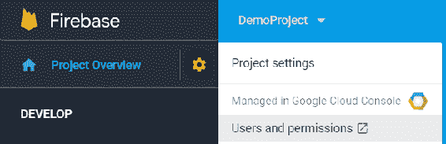
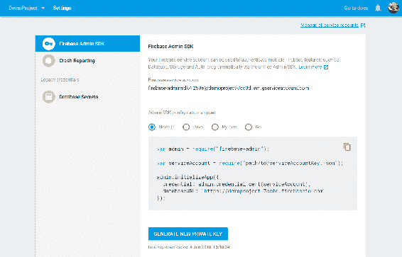
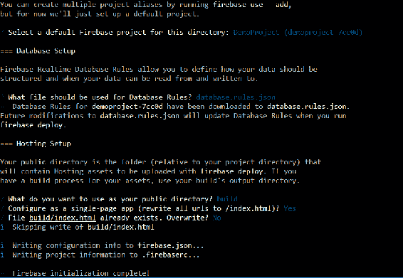
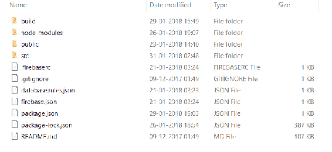
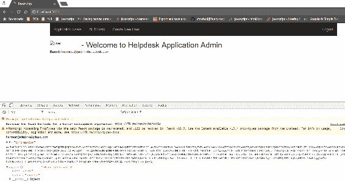
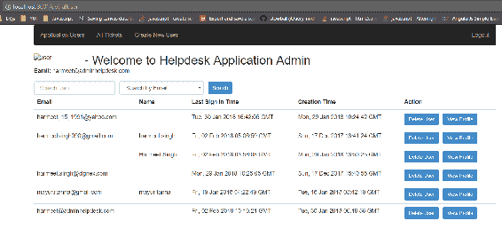

# 第五章：用户个人资料和访问管理

在上一章中，我们看到了如何在 react-redux 应用程序中使用 Firebase。我们还详细探讨了 Redux，并了解了在我们的 React 应用程序中何时以及为何需要使用 Redux，以及 Firebase 实时数据库将在我们的应用程序中提供实时的座位预订状态。在本章中，我们将介绍 Firebase Admin SDK，它提供了一个用户管理 API，以完全的管理员权限读取和写入实时数据库数据。因此，我们将为我们的应用程序创建一个管理员页面，在这个页面上我们有能力执行以下操作：

+   创建新用户

+   用户搜索引擎，我们可以按不同的标准搜索用户

+   所有用户的列表

+   访问用户元数据，其中包括特定用户的帐户创建日期和最后登录日期

+   删除用户

+   更新用户信息，而无需以用户身份登录

+   验证电子邮件

+   更改用户的电子邮件地址，而不发送电子邮件通知以撤销这些更改

+   创建一个带有电话号码的新用户，并更改用户的电话号码而不发送短信验证

首先，我们需要在 Node.js 环境中设置 Firebase Admin SDK 以作为管理员执行上述操作。

# 设置 Firebase Admin SDK

要使用 Firebase Admin SDK，我们需要一个 Firebase 项目，其中有服务账户与 Firebase 服务通信，并包含服务账户凭据的配置文件。

要配置 Firebase Admin SDK，请按照以下步骤进行：

1.  登录到[Firebase 控制台](https://console.firebase.google.com)，选择`<project_name>`项目，并点击项目概述中的设置图标：

概述选项卡

1.  转到项目设置中的服务帐户选项卡。

1.  点击 Firebase 管理部分底部的 GENERATE PRIVATE KEY 按钮；它将生成包含服务账户凭据的 JSON 文件：

这个 JSON 文件包含了关于您的服务账户和私人加密密钥的非常敏感的信息。因此，永远不要分享和存储在公共存储库中；保持它的机密性。如果因为任何原因我们丢失了这个文件，那么我们可以再次生成它，并且我们将不再使用旧文件访问 Firebase Admin SDK。

# Firebase CLI

Firebase 提供了一个命令行界面，提供了各种工具来创建、管理、查看和部署 Firebase 项目。使用 Firebase CLI，我们可以轻松地在生产级静态托管上部署和托管我们的应用程序，并且它会自动通过全球 CDN 提供 HTTPS 服务。

# 安装

在安装之前，请确保我们在计算机上安装了 Node.js 4.0+。如果尚未安装，请从[`nodejs.org`](https://nodejs.org)下载 Node.js 8 的最新版本“LTS” 安装完成后，我们可以从`npm`（node 包管理器）下载 Firebase CLI。

运行以下命令在您的系统上全局安装 Firebase CLI：

```jsx
npm install -g firebase-tools
```

要验证安装，请运行以下命令；如果在您的系统上正确安装了 Firebase CLI，它将打印 Firebase CLI 版本：

```jsx
firebase --version
```

# Firebase Admin 集成

现在我们已经成功安装了 Firebase CLI，让我们将现有应用程序代码从第三章*，使用 Firebase 进行身份验证*复制到第五章*，用户配置文件和访问管理*的新目录中。在这里，我们将初始化 Firebase 应用程序，并运行以下命令在初始化应用程序之前登录到 Firebase 控制台：

```jsx
firebase login
```

一旦您成功登录到 Firebase 控制台，请运行以下命令初始化项目：

```jsx
firebase init
```

运行此命令后，它将提示您选择 Firebase 功能、项目和目录文件夹（相对于您的项目目录），该文件夹将包含要与`firebase deploy`命令一起上传的`hosting`资产（默认情况下为 public）。



我们也可以在项目中随后添加功能，并且也可以将多个项目与同一目录关联。

一旦 Firebase 初始化完成，请运行以下命令安装项目依赖项，然后构建项目：

```jsx
//run this command to install the project dependencies
npm install

//run this command to build the project
npm run build
```

为了在部署到生产环境之前在本地验证我们的应用程序，请运行以下命令：

```jsx
firebase serve
```

它将从构建目录或您在`firebase.json`文件中定义的名称启动本地服务器：



这是我们的文件夹结构在使用 Firebase CLI 初始化后的样子。

# 使用 Firebase Admin Auth API 与 React

Firebase Admin SDK 将使我们能够使用 Firebase Auth API 集成自己的服务器。使用 Firebase Admin SDK，我们可以管理我们的应用程序用户，如`查看`，`创建`，`更新`和`删除`，而无需用户的凭据或管理身份验证令牌而无需转到 Firebase Admin 控制台。

为了实现这一点，我们将在现有的 React 应用程序中创建管理面板。

以下是我们将使用 Firebase Admin SDK 集成到我们的管理面板中的功能列表：

+   创建和验证自定义令牌

+   具有自定义用户声明的用户级访问角色

+   查看应用用户列表

+   获取用户个人资料

+   `创建`，`删除`和`更新`用户信息

+   解决工单状态

# 初始化 Admin SDK

正如我们所看到的，Firebase admin SDK 仅在 Node.Js 中受支持，因此我们将使用 npm init 创建一个新项目，并从`npm`包中安装 firebase admin。

运行以下命令安装 firebase admin 并将其保存在您的`package.json`中：

```jsx
npm install firebase-admin --save
```

将以下代码片段复制到您的 JS 文件中并初始化 SDK；我们已经添加了从 Firebase Admin 服务帐户下载的 JSON 文件的引用：

```jsx
const admin = require('firebase-admin');
const serviceAccount = require('./firebase/serviceAccountKey.json');

admin.initializeApp({
    credential: admin.credential.cert(serviceAccount),
    databaseURL: "https://demoproject-7cc0d.firebaseio.com"
});
```

现在我们将只需创建 Restful API 与客户端应用程序交互以访问 Admin SDK 功能。

运行此命令启动节点管理员服务器：

```jsx
node <fileName>
```

它将在不同端口上启动本地服务器，例如`http://localhost:3001`。

# 创建和验证自定义令牌

Firebase Admin SDK 为我们提供了使用外部机制（如 LDAP 服务器或第三方 OAuth 提供程序）对用户进行身份验证的能力，Firebase 不支持这些机制，如 Instagram 或 LinkedIn。我们可以使用 Firebase 内置的 Admin SDK 中的自定义令牌方法来执行所有这些操作，或者我们可以使用任何第三方 JWT 库。

让我们看看如何使用 Admin SDK 创建和验证令牌。

要创建自定义令牌，我们必须有一个有效的`uid`，我们需要在`createCustomToken()`方法中传递它：

```jsx
function createCustomToken(req,res){
 const userId = req.body.uid "guest_user"
 admin.auth().createCustomToken(userId)
 .then(function(customToken) {
 res.send(customToken.toJSON());
 })
 .catch(function(error) {
 console.log("Error creating custom token:", error);
 });
}
```

在前面的函数中，当用户使用用户名和密码登录时，我们从客户端获取`uid`，如果凭据有效，我们将从服务器返回自定义 JWT（JSON Web Token），客户端设备可以使用它来与 Firebase 进行身份验证：

```jsx
app.get('/login', function (req, res) {
 if(validCredentials(req.body.username,req.body.password)){
    createCustomToken(req,res);
 }
})
```

一旦经过身份验证，此身份将用于访问 Firebase 服务，如 Firebase 实时数据库和云存储。

如果需要，我们还可以添加一些附加字段以包含在自定义令牌中。考虑这段代码：

```jsx
function createCustomToken(req,res){
 const userId = req.body.uid
 const subscription = {
   paid:true
 }
 admin.auth().createCustomToken(userId)
 .then(function(customToken) {
   res.send(customToken.toJSON());
 })
 .catch(function(error) {
 console.log("Error creating custom token:", error);
 });
}
```

这些附加字段将在安全规则中的`auth/request.auth`对象中可用。

一旦令牌生成并被 React 方法接收，我们将通过将自定义令牌传递给 Firebase 的`signInWithCustomToken()`方法来对用户进行应用程序身份验证：

```jsx
const uid = this.state.userId
fetch('http://localhost:3000/login', {
   method: 'POST', // or 'PUT'
   body: JSON.stringify({idToken:idToken}), 
   headers: new Headers({
     'Content-Type': 'application/json'
  })
 }).then(res => res.json())
 .catch(error => console.error('Error:', error))
 .then(res => {
  console.log(res,"after token valid");
  firebase.auth().signInWithCustomToken(res.customToken).catch(function(error) {
    var errorCode = error.code;
    var errorMessage = error.message;
 });
})

```

成功验证后，用户使用我们在创建自定义令牌方法中包含的`uid`指定的帐户登录到我们的应用程序。

同样，其他 Firebase 身份验证方法的工作方式类似于`signInWithEmailAndPassword()`和`signInWithCredential()`，并且`auth/request.auth`对象将在 Firebase 实时数据库安全规则中与用户`uid`一起可用。在前面的示例中，我们指定了为什么生成自定义令牌。

```jsx
//Firebase Realtime Database Rules
{
 "rules": {
 "admin": {
 ".read": "auth.uid === 'guest_user'"
 }
 }
}
```

```jsx
//Google Cloud Storage Rules
service firebase.storage {
 match /b/<firebase-storage-bucket-name>/o {
 match /admin/{filename} {
 allow read, write: if request.auth.uid == "guest_user";
 }
 }
}
```

同样，我们还可以访问其他传递的附加对象，这些对象在`auth.token`和`request.auth.token`中可用：

```jsx
//Firebase Realtime Database Rules
{
 "rules": {
 "subscribeServices": {
 ".read": "auth.token.paid === true"
 }
 }
}
```

```jsx
service firebase.storage {
 match /b/<firebase-storage-bucket-name>/o {
 match /subscribeServices/{filename} {
 allow read, write: if request.auth.token.paid === true;
 }
 }
}
```

Firebase 还可以为我们提供一种获取`uid`的方法，一旦用户登录到应用程序中，它会创建一个唯一标识他们的相应 ID 令牌，我们可以将此令牌发送到服务器进行验证，并允许他们访问应用程序的多个资源。例如，当我们创建一个自定义后端服务器与应用程序通信时，我们可能需要使用 HTTPS 安全地识别当前登录的用户。

要从 Firebase 中检索 ID 令牌，请确保用户已登录到应用程序，并且我们可以使用以下方法在您的 React 应用程序中检索 ID 令牌：

```jsx
firebase.auth().currentUser.getIdToken(/* forceRefresh */ true).then(function(idToken) {
 // Send this token to custom backend server via HTTPS
}).catch(function(error) {
 // Handle error
});
```

一旦我们有了这个 ID 令牌，我们可以将这个 JWT（JSON Web Token）发送到后端服务器的 Firebase Admin SDK 或任何第三方库进行验证。

为了验证和解码 ID 令牌，Firebase Admin SDK 具有内置的`verifyIdToken(idToken)`方法；如果提供的令牌未过期、有效且经过正确签名，该方法将返回解码的 ID 令牌：

```jsx
function validateToken(req,res){
  const idToken= req.body.idToken;
  admin.auth().verifyIdToken(idToken)
   .then(function(decodedToken) {
   var uid = decodedToken.uid;
  //...
  }).catch(function(error) {
 // Handle error
 });
}
```

现在，让我们扩展我们现有的应用程序，用户只能看到他们提交的那些票证，并且我们还将给用户更新现有个人资料的能力。我们还将在 React 中创建一个管理员面板，并根据角色向用户显示管理员 UI。

# 用于管理员访问和安全规则的自定义声明

正如我们之前看到的，Firebase Admin SDK 支持在令牌中定义自定义属性。这些自定义属性使我们能够定义不同级别的访问权限，包括基于角色的应用程序安全规则中强制执行的访问控制。

我们需要在以下常见情况下定义用户角色：

+   为用户分配管理员角色以访问资源

+   为用户分配不同的组

+   为用户提供多级访问权限，例如付费用户、普通用户、经理、支持团队等

我们还可以根据数据库定义规则，限制访问，例如我们有数据库节点`helpdesk/tickets/all`，所有数据票务数据都可以被访问。但是，我们只希望管理员用户能够查看所有票务。为了更有效地实现这一目标，验证电子邮件 ID 并添加名为 admin 的自定义用户声明到以下实时数据库规则中：

```jsx
{
 "rules": {
  "helpdesk":{
   "tickets":{
       "all": {
         ".read": "auth.token.admin === true",
         ".write": "auth.token.admin === true",
         }
        }
      }
   }
}
```

不要将自定义声明与自定义身份验证和 Firebase 身份验证混淆。它适用于已使用受支持提供程序（电子邮件/密码、Github、Google、Facebook、电话等）登录的用户，但当我们使用 Firebase 不支持的不同身份验证时，将使用自定义身份验证。例如，使用 Firebase Auth 的电子邮件/密码提供程序登录的用户可以使用自定义声明定义访问控制。

# 使用 Admin SDK 添加自定义声明

在 Firebase Admin SDK 中，我们可以使用`setCustomUserClaims()`方法应用自定义声明，该方法内置于 Firebase 中：

```jsx
admin.auth().setCustomUserClaims(uid, {admin: true}).then(() => {
});
```

# 使用 Admin SDK 发送应用程序验证自定义声明

Firebase Admin SDK 还为我们提供了使用`verifyIdToken()`方法验证令牌的方法：

```jsx
 admin.auth().verifyIdToken(idToken).then((claims) => {
  if (claims.admin === true) {
    // Allow access to admin resource.
   }
 });
```

我们还可以检查用户对象中是否有自定义声明可用：

```jsx
admin.auth().getUser(uid).then((userRecord) => {
   console.log(userRecord.customClaims.admin);
});
```

现在，让我们看看如何在我们现有的应用程序中实现这一点。

首先，在 Node Admin SDK 后端服务器中创建一个 restful API：

```jsx
app.post('/setCustomClaims', (req, res) => {
 // Get the ID token passed by the client app.
 const idToken = req.body.idToken;
 console.log("accepted",idToken,req.body);
 // Verify the ID token
 admin.auth().verifyIdToken(idToken).then((claims) => {
 // Verify user is eligible for admin access or not
 if (typeof claims.email !== 'undefined' &&
 claims.email.indexOf('@adminhelpdesk.com') != -1) {
 // Add custom claims for admin access.
 admin.auth().setCustomUserClaims(claims.sub, {
 admin: true,
 }).then(function() {
 // send back to the app to refresh token and shows the admin UI.
 res.send(JSON.stringify({
 status: 'success',
 role:'admin'
 }));
 });
 } else if (typeof claims.email !== 'undefined'){
 // Add custom claims for admin access.
 admin.auth().setCustomUserClaims(claims.sub, {
 admin: false,
 }).then(function() {
 // Tell client to refresh token on user.
 res.send(JSON.stringify({
 status: 'success',
 role:'employee'
 }));
 });
 }
 else{
 // return nothing
 res.send(JSON.stringify({status: 'ineligible'}));
 }
 })
 });
```

我已经使用管理 SDK 在 Firebase 控制台中手动创建了一个名为`harmeet@adminhelpdesk.com`的管理员用户；我们需要验证并为管理员添加自定义声明。

现在，打开`App.JSX`并添加以下代码片段；根据角色设置应用程序的初始状态：

```jsx
  constructor() {
  super();
  this.state  = {  authenticated :  false,
  data:'',
  userUid:'',
  role:{
  admin:false,
 type:''
 } } }
```

现在，在`componentWillMount()`组件生命周期方法中调用上述 API，我们需要从`firebase.auth().onAuthStateChanged((user))`中获取用户对象的`idToken`并将其发送到服务器进行验证：

```jsx
this.getIdToken(user).then((idToken)=>{
 console.log(idToken);
 fetch('http://localhost:3000/setCustomClaims', {
   method: 'POST', // or 'PUT'
   body: JSON.stringify({idToken:idToken}), 
   headers: new Headers({
     'Content-Type': 'application/json'
   })
 }).then(res => res.json())
  .catch(error => console.error('Error:', error))
  .then(res => {
   console.log(res,"after token valid");
   if(res.status === 'success' && res.role === 'admin'){
      firebase.auth().currentUser.getIdToken(true);
       this.setState({
         authenticated:true,
         data:user.providerData,
         userUid:user.uid,
             role:{
                 admin:true,
                 type:'admin'
             }
     })
 }
 else if (res.status === 'success' && res.role === 'employee'){
 this.setState({
     authenticated:true,
     data:user.providerData,
     userUid:user.uid,
     role:{
         admin:false,
         type:'employee'
         }
     })
 }
 else{
     ToastDanger('Invalid Token !!')
 }
```

在上述代码中，我们使用`fetch` API 发送 HTTP 请求。它类似于 XMLHttpRequest，但具有新功能并且更强大。根据响应，我们设置组件的状态并将组件注册到路由器中。

这是我们的路由组件的样子：

```jsx
{
 this.state.authenticated && !this.state.role.admin
 ?
 (
 <React.Fragment>
 <Route path="/view-ticket" render={() => (
 <ViewTicketTable userId = {this.state.userUid} />
 )}/>
 <Route path="/add-ticket" render={() => (
 <AddTicketForm userId = {this.state.userUid} userInfo = {this.state.data} />
 )}/>
 <Route path="/user-profile" render={() => (
 <ProfileUpdateForm userId = {this.state.userUid} userInfo = {this.state.data} />
 )}/>
 </React.Fragment>
 )
 :
 (
 <React.Fragment>
   <Route path="/get-alluser" component = { AppUsers }/>
   <Route path="/tickets" component = { GetAllTickets }/>
   <Route path="/add-new-user" component = { NewUserForm }/>
 </React.Fragment>
 )
 }
```

以下是我们正在注册和渲染管理员组件的组件列表，如果用户是管理员：

+   `AppUser`：获取应用程序用户列表，还负责删除用户和按不同标准搜索用户。

+   `Tickets`：查看所有票证列表并更改票证状态

+   新用户表单：将新用户添加到应用程序

我们正在使用 Node.js Firebase Admin SDK 服务器执行上述操作。

创建一个名为`admin`的文件夹，并在其中创建一个名为`getAllUser.jsx`的文件。在其中，我们将创建一个 React 组件，负责获取并显示用户列表到 UI；我们还将添加按不同标准搜索用户的功能，例如电子邮件 ID，电话号码等。

在`getAllUser.jsx`文件中，我们的渲染方法如下：

```jsx
<form className="form-inline">
//Search Input
     <div className="form-group" style={marginRight}>
         <input type="text" id="search" className="form-control"
         placeholder="Search user" value={this.state.search} required  
         />
     </div>
//Search by options
     <select className="form-control" style={marginRight}>
         <option value="email">Search by Email</option>
         <option value="phone">Search by Phone Number</option>
     </select>
     <button className="btn btn-primary btn-sm">Search</button>
 </form>
```

我们还在`render`方法中添加了表格来显示用户列表：

```jsx
 <tbody>
 {
 this.state.users.length > 0 ?
 this.state.users.map((list,index) => {
 return (
 <tr key={list.uid}>
 <td>{list.email}</td>
 <td>{list.displayName}</td> 
 <td>{list.metadata.lastSignInTime}</td> 
 <td>{list.metadata.creationTime}</td> 
 <td>
     <button className="btn btn-sm btn-primary" type="button" style={marginRight} onClick={()=>            {this.deleteUser(list.uid)}}>Delete User</button>
       <button className="btn btn-sm btn-primary" type="button" onClick={()=>                        {this.viewProfile(list.uid)}}>View Profile</button>
 </td> 
 </tr>
 )
 }) :
 <tr>
     <td colSpan="5" className="text-center">No users found.</td>
 </tr>
 }
 </tbody>
```

这是显示用户列表的表格主体，并且现在我们需要在`componentDidMount()`方法中调用用户 API：

```jsx
fetch('http://localhost:3000/users', {
 method: 'GET', // or 'PUT'
 headers: new Headers({
 'Content-Type': 'application/json'
 })
 }).then(res => res.json())
 .catch(error => console.error('Error:', error))
 .then(response => {
 console.log(response,"after token valid");
 this.setState({
   users:response
 })
 console.log(this.state.users,'All Users');
 })
```

同样，我们需要调用其他 API 来删除、查看用户资料和搜索：

```jsx
deleteUser(uid){
 fetch('http://localhost:3000/deleteUser', {
     method: 'POST', // or 'PUT'
     body:JSON.stringify({uid:uid}),
     headers: new Headers({
         'Content-Type': 'application/json'
     })
 }).then(res => res.json())
     .catch(error => console.error('Error:', error))
 }
//Fetch User Profile
 viewProfile(uid){
 fetch('http://localhost:3000/getUserProfile', {
     method: 'POST', // or 'PUT'
     body:JSON.stringify({uid:uid}),
     headers: new Headers({
         'Content-Type': 'application/json'
     })
 }).then(res => res.json())
     .catch(error => console.error('Error:', error))
     .then(response => {
         console.log(response.data,"User Profile");
     })
 }
```

对于搜索，Firebase Admin SDK 具有内置方法：`getUserByEmail()`和`getUserByPhoneNumber()`。我们可以以与我们在 Firebase Admin API 中创建`delete()`和`fetch()`相同的方式实现这些方法：

```jsx
//Search User by Email
searchByEmail(emailId){
 fetch('http://localhost:3000/searchByEmail', {
 method: 'POST', // or 'PUT'
 body:JSON.stringify({email:emailId}),
 headers: new Headers({
 'Content-Type': 'application/json'
 })
 }).then(res => res.json())
 .catch(error => console.error('Error:', error))
 .then(response => {
 console.log(response.data,"User Profile");
 this.setState({
    users:response
 })
 })
 }
```

查看以下`node.js` API 代码片段：

```jsx
function listAllUsers(req,res) {
 var nextPageToken;
 // List batch of users, 1000 at a time.
 admin.auth().listUsers(1000,nextPageToken)
 .then(function(data) {
 data = data.users.map((el) => {
 return el.toJSON();
 })
 res.send(data);
 })
 .catch(function(error) {
 console.log("Error fetching the users from firebase:", error);
 });
}
function deleteUser(req, res){
  const userId = req.body.uid;
  admin.auth().deleteUser(userId)
  .then(function() {
    console.log("Successfully deleted user"+userId);
    res.send({status:"success", msg:"Successfully deleted user"})
  })
  .catch(function(error) {
    console.log("Error deleting user:", error);
  res.send({status:"error", msg:"Error deleting user:"})
  });
}
function searchByEmail(req, res){
  const searchType = req.body.email;
  admin.auth().getUserByEmail(userId)
  .then(function(userInfo) {
    console.log("Successfully fetched user information associated with this email"+userId);
    res.send({status:"success", data:userInfo})
  })
  .catch(function(error) {
    console.log("Error fetching user info:", error);
  res.send({status:"error", msg:"Error fetching user informaition"})
  });
}
```

现在，我们将创建一个 API 来根据用户的请求调用上述功能：

```jsx
app.get('/users', function (req, res) {
 listAllUsers(req,res);
})
app.get('/deleteUser', function (req, res) {
 deleteUser(req,res);
})
app.post('/searchByEmail', function (req, res){
 searchByEmail(req, res)
})
```

现在，让我们快速查看一下我们在浏览器中的应用程序，看看它的外观，并尝试使用管理员用户登录：

使用管理员凭据登录时我们应用程序的屏幕截图；目的是展示我们作为管理员登录时的 UI 和控制台

看起来很棒！只需看一下上述屏幕截图；它显示了管理员的不同导航，如果您可以在控制台中看到，它显示了带有自定义声明对象的令牌，我们将其添加到此用户以获得管理员访问权限：



看起来很棒！我们可以看到应用程序的用户列表和搜索 UI。

现在，考虑到我们从列表中删除了用户，并且与此同时用户会话仍处于活动状态并正在使用应用程序。在这种情况下，我们需要管理用户的会话，并提示其重新进行身份验证，因为每次用户登录时，用户凭据都会被发送到 Firebase 身份验证后端，并交换为 Firebase ID 令牌（JWT）和刷新令牌。

以下是我们需要管理用户会话的常见情况：

+   用户被删除

+   用户已禁用

+   电子邮件地址和密码已更改

Firebase Admin SDK 还提供了使用`revokeRefreshToken()`方法吊销特定用户会话的能力。它吊销给定用户的活动刷新令牌。如果我们重置密码，Firebase 身份验证后端会自动吊销用户令牌。

请参考以下 Firebase Cloud Function 代码片段，根据特定的`uid`来吊销用户：

```jsx
const admin = require('firebase-admin');
admin.initializeApp(functions.config().firebase);
// Revoke all refresh tokens for a specified user for whatever reason.
function revokeUserTokens(uid){
return admin.auth().revokeRefreshTokens(uid)
.then(() => {
    // Get user's tokensValidAfterTime.
    return admin.auth().getUser(uid);
})
.then((userRecord) => {
    // Convert to seconds as the auth_time in the token claims is in seconds too.
    const utcRevocationTimeSecs = new Date(userRecord.tokensValidAfterTime).getTime() / 1000;
    // Save the refresh token revocation timestamp. This is needed to track ID token
    // revocation via Firebase rules.
    const metadataRef = admin.database().ref("metadata/" + userRecord.uid);
    return metadataRef.set({revokeTime: utcRevocationTimeSecs});
  });
}
```

正如我们所知，Firebase ID 令牌是无状态的 JWT，只能通过向 Firebase 身份验证后端服务器发送请求来验证令牌的状态是否被吊销。因此，在服务器上执行此检查非常昂贵，并增加了额外的工作量，需要额外的网络请求负载。我们可以通过设置 Firebase 规则来检查吊销而不是发送请求到 Firebase Admin SDK 来避免这种网络请求。

这是声明规则的正常方式，没有客户端访问来写入存储每个用户的吊销时间：

```jsx
{
"rules": {
    "metadata": {
        "$user_id": {
            ".read": "$user_id === auth.uid",
            ".write": "false",
            }
        }
    }
}
```

然而，如果我们只想允许未被吊销和经过身份验证的用户访问受保护的数据，我们必须配置以下规则：

```jsx
{
 "rules": {
     "users": {
         "$user_id": {
         ".read": "$user_id === auth.uid && auth.token.auth_time >     (root.child('metadata').child(auth.uid).child('revokeTime').val() || 0)",
         ".write": "$user_id === auth.uid && auth.token.auth_time > (root.child('metadata').child(auth.uid).child('revokeTime').val() || 0)"
             }
         }
     }
}
```

用户的浏览器刷新令牌被吊销时，`tokensValidAfterTime` UTC 时间戳将保存在数据库节点中。

当要验证用户的 ID 令牌时，必须传递附加检查布尔标志到`verifyIdToken()`方法。如果用户的令牌被吊销，用户应该从应用程序中注销或要求使用 Firebase 身份验证客户端 SDK 提供的重新验证 API 重新进行身份验证。

例如，我们在上面创建了一个名为`setCustomClaims`的方法；只需在`catch`方法中添加以下代码：

```jsx
 .catch(error => {
     // Invalid token or token was revoked:
     if (error.code == 'auth/id-token-revoked') {
     //Shows the alert to user to reauthenticate
     // Firebase Authentication API gives the API to reauthenticateWithCredential /reauthenticateWithPopup /reauthenticateWithRedirect
 }
 });
```

此外，如果令牌被吊销，发送通知给客户端应用程序重新进行身份验证。

考虑此示例用于电子邮件/密码 Firebase 身份验证提供程序：

```jsx
let password = prompt('Please provide your password for reauthentication');
let credential = firebase.auth.EmailAuthProvider.credential(
firebase.auth().currentUser.email, password);
firebase.auth().currentUser.reauthenticateWithCredential(credential)
.then(result => {
// User successfully reauthenticated.
})
.catch(error => {
// An error occurred.
});
```

现在，让我们点击“所有工单”链接，查看所有用户提交的工单列表：

！[](Images/ce3522d9-11bf-4664-b1c6-938d6382eda0.png)

作为管理员用户，我们可以更改在 Firebase 实时数据库中更新的票的状态。现在，如果您单击“创建新用户”，它将显示表单以添加用户信息。

让我们创建一个新组件，并将以下代码添加到渲染方法中：

```jsx
<form className="form" onSubmit={this.handleSubmitEvent}>
 <div className="form-group">
 <input type="text" id="name" className="form-control"
 placeholder="Enter Employee Name" value={this.state.name} required onChange={this.handleChange} />
 </div>
 <div className="form-group">
 <input type="text" id="email" className="form-control"
 placeholder="Employee Email ID" value={this.state.email} required onChange={this.handleChange} />
 </div>
 <div className="form-group">
 <input type="password" id="password" className="form-control"
 placeholder="Application Password" value={this.state.password} required onChange={this.handleChange} />
 </div>
 <div className="form-group">
 <input type="text" id="phoneNumber" className="form-control"
 placeholder="Employee Phone Number" value={this.state.phoneNumber} required onChange={this.handleChange} />
 </div>
 <div className="form-group">
 <input
 type="file"
 ref={input => {
 this.fileInput = input;
 }}
 />
 </div>
 <button className="btn btn-primary btn-sm">Submit</button>
 </form>
```

在`handleSubmitEvent(e)`中，我们需要调用`createNewUser()` Firebase 管理员 SDK 方法，并将表单数据传递给它：

```jsx
e.preventDefault();
 //React form data object
 var data = {
 email:this.state.email,
 emailVerified: false,
 password:this.state.password,
 displayName:this.state.name,
 phoneNumber:this.state.phoneNumber,
 profilePhoto:this.fileInput.files[0],
 disabled: false
 }
 fetch('http://localhost:3000/createNewUser', {
   method: 'POST', // or 'PUT'
   body:JSON.stringify({data:data}),
   headers: new Headers({
   'Content-Type': 'application/json'
 })
 }).then(res => res.json())
 .catch(error => { 
 ToastDanger(error)
 })
 .then(response => {
 ToastSuccess(response.msg)
 });
```

重新启动服务器并在浏览器中打开应用程序。让我们尝试使用管理员凭据在我们的应用程序中创建新用户：

！[](Images/2297a1c2-7209-403c-98a4-4c4e70cafc82.png)创建新用户组件；图像的目的是在我们填写表单并提交到 Firebase 以创建新用户时显示警报消息

看起来很棒；我们已成功在我们的应用程序中创建了新用户，并返回了 Firebase 为新用户生成的自动生成的`uid`。

现在，让我们继续并用普通用户登录：

！[](Images/4291694b-264e-4053-bb7a-089264cf20f7.png)

如果您看一下前面的屏幕截图，一旦我们使用任何 Firebase Auth 提供程序登录到应用程序中，在仪表板上，它会显示用户的所有票，但它应该只显示与此电子邮件 ID 相关联的票。为此，我们需要更改数据结构和 Firebase 节点引用。

这是应用程序最重要的部分，我们需要计划如何保存和检索数据，以使过程尽可能简单。

# JSON 树中的数据结构

在 Firebase 实时数据库中，所有数据都存储为 JSON 对象，这是一个托管在云中的 JSON 树。当我们向数据库添加数据时，它将成为现有 JSON 结构中的一个节点，并带有一个关联的键，该键由 Firebase 自动生成。我们还可以提供自定义键，例如用户 ID 或任何语义名称，或者可以使用`push()`方法提供它们。

例如，在我们的 Helpdesk 应用程序中，我们将票存储在路径上，例如`/helpdesk/tickets`；现在我们将其替换为`/helpdesk/tickets/$uid/$ticketKey`。看一下以下代码：

```jsx
var newTicketKey = firebase.database().ref('/helpdesk').child('tickets').push().key;
 // Write the new ticket data simultaneously in the tickets list and the user's ticket list.
 var updates = {};
 updates['/helpdesk/tickets/' + userId + '/' + newTicketKey] = data;
 updates['/helpdesk/tickets/all/'+ newTicketKey] = data;
```

这是从数据库创建和检索票的数据结构：

！[](Images/a27fade9-e4cf-496d-a8f7-da4de1b74766.png)

在上图中，突出显示的节点是`$uid`，它属于提交了票的用户。

这是我们完整代码的样子：

```jsx
var newTicketKey = firebase.database().ref('/helpdesk').child('tickets').push().key;
 // Write the new ticket data simultaneously in the tickets list and the user's ticket list.
 var updates = {};
 updates['/helpdesk/tickets/' + userId + '/' + newTicketKey] = data;
 updates['/helpdesk/tickets/all/'+ newTicketKey] = data;

 return firebase.database().ref().update(updates).then(()=>{
 ToastSuccess("Saved Successfully!!");
 this.setState({
    issueType:"",
    department:"",
    comment:""
 });
 }).catch((error)=>{
    ToastDanger(error.message);
 });
```

打开浏览器并重新提交票证；现在查看票证仪表板：

！[](Images/e3732548-510b-4d4e-809f-2f9522eed0f0.png)

看起来不错！现在用户只能看到他们提交的票证。在下一章中，我们将看到如何在数据库中应用安全规则和常见安全威胁。

# 总结

本章解释了如何配置和初始化 Firebase Admin SDK 来在 NodeJS 中创建我们的应用后端。它还解释了如何使用 Firebase Admin 的用户管理 API 来管理我们的应用用户，而无需转到 Firebase 控制台，例如以下内容：

+   创建

+   删除

+   更新

+   删除

Firebase Admin SDK 赋予我们创建和验证自定义 JWT 令牌的能力，这允许用户使用任何提供者进行身份验证，即使它不在 Firebase 身份验证提供者列表中。它还赋予您在用户信息发生任何更改时管理用户会话的能力，例如用户被删除、禁用、电子邮件地址或密码发生更改等。

我们还学习了如何控制对自定义声明的访问。这有助于我们实现基于角色的访问控制，以在 Firebase 应用中为用户提供不同级别的访问权限（角色）。

在下一章中，我们将学习数据库安全风险以及预防此类威胁的检查表。我们还将看到 Firebase 实时数据库的安全部分和 Firebase 实时数据库规则语言。
