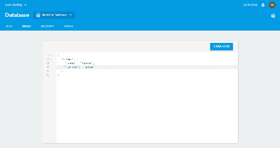

# 第六章：Firebase 安全和规则

在上一章中，我们看到了如何在应用程序中整合访问管理以保护它免受未经授权的访问，这实质上是应用程序级别的安全性。然而，如果我们的数据库没有得到保护呢？嗯，在这种情况下，数据可能会被未经授权的用户或甚至经过授权的用户（如数据库管理员）滥用，这会导致业务损失，有时甚至会引发法律诉讼。

数据安全始终是一个主要关注点，特别是当它托管在云服务器上时。我们必须保护我们的数据免受完整性、可用性和机密性的妥协。无论您使用的是关系型数据库管理系统，如 MySQL 或 MSSQL，还是 NoSQL，如 MongoDB 或 Firebase 实时数据库；所有这些数据库都必须通过限制对数据的访问来进行保护。在本章中，我们将简要介绍常见的数据库安全风险以及预防此类威胁的清单。我们还将看到 Firebase 实时数据库的安全部分和 Firebase 实时数据库规则语言。

以下是本章将讨论的主题列表：

+   常见数据库安全风险和预防措施概述

+   Firebase 安全概述

+   Firebase 实时数据库规则概述

+   Firebase 实时数据库规则的结构和定义

+   数据索引简介

+   数据库备份和恢复

让我们从威胁的安全风险和预防开始。

# 安全风险和预防

数据库是任何组织的核心，因为它们包含客户数据和机密业务数据，因此它们经常成为黑客的目标。在过去几年中已经确定了一些常见的威胁，包括以下内容：

+   未经授权或意外活动

+   恶意软件感染

+   数据库服务器的物理损坏

+   由于无效数据而导致数据损坏

+   性能下降

为了防止这些风险，需要遵循许多协议或安全标准：

1.  访问控制：包括身份验证和授权。所有数据库系统都提供访问控制机制，例如使用用户名和密码进行身份验证。同时，在某些数据库中，设置它并不是强制性的，因此有时人们不启用它，使数据库不安全。同样，在所有数据库中，提供了基于角色的安全授权机制，以限制用户对某些数据或数据库的访问。然而，有时人们会给予所有用户根或管理员访问权限，使数据对所有用户开放。

1.  审计：审计涉及监控所有用户执行的数据库活动，以增强安全性并保护数据。许多数据库平台包括内置的审计功能，允许您跟踪数据创建、删除或修改活动以及数据库使用情况，以便在早期检测到任何可疑活动。

1.  备份：备份旨在从较早的时间恢复数据，并在数据删除或数据损坏的情况下恢复数据。根据要求，备份过程可以是自动化的或手动的。理想情况下，应该是自动化的，以便可以定期进行备份。虽然至少应该有一些备份，但数据存储空间可能很大，这取决于数据/备份的大小。为了减小备份的大小，应在持久化之前对备份文件进行压缩。

1.  数据完整性控制：数据完整性是指数据库中存储的数据的一致性和准确性。数据验证是数据完整性的先决条件。许多关系数据库（RDBMS）通过约束（如主键和外键约束）强制数据完整性。在 NoSQL 的情况下，需要在数据库级别和应用程序级别进行数据验证，以确保数据完整性。

1.  应用程序级安全性：还需要应用程序级安全性，以防止任何不当的数据保存在数据库中。通常，开发人员在表单级别和业务级别进行验证，以确保他们在数据库中保存有效的数据。

1.  加密：加密个人数据（如社会安全号码）或金融数据（如信用卡信息）非常重要，以防止其被滥用。通常，使用 SSL 加密来加密客户端和服务器之间的连接，这实质上是网络级别的安全，以防止任何恶意攻击者阅读这些信息。

现在，让我们来检查 Firebase 中我们的数据有多安全。

# 您的 Firebase 有多安全？

Firebase 位于云存储上，因此人们很自然地会考虑它是否足够安全。然而，不用担心，因为 Firebase 提供了一个安全的架构和一套工具来管理应用程序的安全性。Firebase 托管在 SSL（安全套接字层）上，通常加密客户端和服务器之间的连接，从而防止在网络层发生任何数据窃取或篡改。Firebase 配备了基于表达式的规则语言，允许您通过配置来管理数据安全性。

Firebase 安全性主要是关于配置而不是约定，这样您的应用程序的安全相关逻辑就与业务逻辑分离开来。这样一来，您的应用程序就变得松散耦合。

在本章中，我们将学习有关 Firebase 实时数据库安全性和规则的内容。

# 实时数据库规则概述

Firebase 数据库规则允许您管理对数据库的读取和写入访问权限。它们还帮助您定义数据的验证方式，例如它是否具有有效的数据类型和格式。只有在您的规则允许的情况下，读取和写入请求才会被完成。默认情况下，您的规则被设置为只允许经过身份验证的用户完全读取和写入数据库。

Firebase 数据库规则具有类似 JavaScript 的语法，并分为四种类型：

| `.read` | 它确定用户何时允许读取数据。 |
| --- | --- |
| `.write` | 它确定用户何时允许写入数据。 |
| `.validate` | 它验证值是否格式正确，是否具有子属性以及其数据类型。 |
| `.indexOn` | 它确定子级是否存在索引以支持更快的查询和排序。 |

您可以从 Firebase 控制台的 Database || Rulestab 中访问和设置您的规则：



Firebase 实时数据库安全性有三个步骤：

1.  用户认证

1.  用户授权-控制对数据的访问

1.  用户输入验证

# 认证

用户身份验证是保护应用程序免受未经授权访问的第一步。在第一步中识别用户自动意味着对他们可以访问和操作的数据的限制。在我们使用 Java、Microsoft.Net 或任何其他平台的后端技术的应用程序中，我们编写身份验证逻辑来限制对我们应用程序的访问。然而，由于 Firebase 广泛用于仅客户端应用程序，我们将没有后端工具的奢侈。幸运的是，Firebase 平台提供了一种身份验证机制—Firebase 身份验证—它内置了对常见身份验证机制的支持，如基于表单的身份验证、使用用户名和密码的 Google 和 Facebook 登录等。在第三章中，*使用 Firebase 进行身份验证*，以及第五章中，*用户配置文件和访问管理*，我们已经看到了如何实现 Firebase 身份验证。以下规则指定要访问数据库，用户必须经过身份验证。它还指定一旦用户经过身份验证，就可以访问数据库中的所有可用数据：

```jsx
{
  "rules": {
    ".read": "auth != null",
    ".write": "auth != null"
  }
}
```

# 授权

一旦用户经过身份验证，他们就可以访问数据库。但是，您需要对谁可以访问什么进行一些控制。不应该允许每个人读取/写入数据库中的所有数据。这就是授权出现的地方。Firebase 数据库规则允许您控制每个用户的访问权限。Firebase 安全规则是基于节点的，并由一个 JSON 对象管理，您可以在实时数据库控制台上编辑它，也可以使用 Firebase CLI：

```jsx
{
  "rules": {
        "users": { 
           ".read": "true",
           ".write": "false"
        }
  }
}
```

前面的规则确定所有用户都能够读取用户数据，但没有人能够对其进行写入。另外，请注意，必须将`rules`作为安全 JSON 对象中的第一个节点。

以下是指定用户私有数据的规则示例：

```jsx
{
  "rules": {
    "users": {
      "$uid": {
        ".read": "$uid === auth.uid",
        ".write": "$uid === auth.uid"
      }
    }
  }
}
```

现在，您可能会有一个问题，比如我们有嵌套的数据结构，规则将如何应用到该数据。为了回答这个问题，这里要记住的一点是，`.read`和`.write`规则**级联**，即授予对*父节点*的读取或写入访问权限总是授予对*所有子节点*的读取/写入访问权限。

父节点上的规则具有更高的优先级，因此它们将覆盖其子级别定义的规则。

Firebase 规则还提供了一些内置变量和函数，允许您访问 Firebase 身份验证信息，引用其他路径等。我们将在本章的后续部分详细检查这一点。

# 数据验证

如在介绍部分中所示，我们需要在将数据保存到数据库之前验证数据，以保持数据的完整性和正确性。Firebase 规则提供`.validate`表达式，如`.read`和`.write`来实现验证逻辑，例如字段的长度应该只有这么多个字符，或者它必须是字符串数据类型。

考虑这个例子：

```jsx
{
  "rules": {
        "users": { 
             "email": {
                    ".validate":  "newData.isString() && newData.val().length < 50"
              }
        }
  }
}
```

上述电子邮件字段的验证规则确定了电子邮件字段的值必须是字符串，其长度应小于 30 个字符。

重要的是要注意**验证规则不会级联**，因此为了允许写入，所有相关的验证规则必须评估为 true。

现在，我们已经对 Firebase 规则有了基本的了解，让我们深入了解规则配置。

# 规则定义和结构

Firebase 规则提供了可以在规则定义中使用的预定义变量：

| 名称 | 定义/用法 |
| --- | --- |
| `auth` | 它表示经过身份验证的用户的信息。对于未经身份验证的用户，它将为 null。它是一个包含 uid、token 和 provider 字段及相应值的对象。 |
| `$ variables` | 它表示通配符路径，用于引用动态生成的键和表示 ID。 |
| `root` | 它表示在应用给定数据库操作之前 Firebase 数据库中根路径的数据快照。 |
| `data` | 它表示给定数据库操作之前的数据快照。例如，在更新或写入的情况下，根代表原始数据快照，不包括更新或写入中的更改。 |
| `newData` | 它表示给定数据库操作之前的数据快照。然而，它包括现有数据以及新数据，其中包括给定数据操作操纵的数据。 |
| `now` | 它表示当前时间（以毫秒为单位）-自 1970 年 1 月 1 日（协调世界时午夜）以来经过的*秒数*。 |

在下一节中，我们将看看如何在我们的规则中使用这些预定义变量。

正如我们在授权部分看到的，我们需要看看规则如何适用于嵌套数据。一个经验法则是，我们需要根据数据库中数据的结构来构建规则。

我们将扩展我们在本书的第五章中开发的 HelpDesk 应用程序，*用户配置文件和访问管理*。

我们有以下的数据结构：

```jsx
"helpdesk" : {
    "tickets" : {
      "FlQefqueU2USLElL4vc5MoNUnu03" : {
        "-L4L1BLYiU-UQdE6lKA_" : {
          "comments" : "Need extra 4GB RAM in my system",
          "date" : "Fri Feb 02 2018 15:51:10 GMT+0530 (India Standard 
           Time)",
          "department" : "IT",
          "email" : "harmeet_15_1991@yahoo.com",
          "issueType" : "Hardware Request",
          "status" : "progress"
        }
      },
      "KEEyErkmP3YE1BagxSci0hF0g8H2" : {
        "-L4K01hUSDzPXTIXY9oU" : {
          "comments" : "Not able to access my email",
          "date" : "Fri Feb 02 2018 11:06:32 GMT+0530 (India Standard 
           Time)",
          "department" : "IT",
          "email" : "harmeetsingh090@gmail.com",
          "issueType" : "Email Related Issues",
          "status" : "progress"
        }
      },
      "all" : {
        "-L4K01hUSDzPXTIXY9oU" : {
          "comments" : "Not able to access my email",
          "date" : "Fri Feb 02 2018 11:06:32 GMT+0530 (India Standard 
           Time)",
          "department" : "IT",
          "email" : "harmeetsingh090@gmail.com",
          "issueType" : "Email Related Issues",
          "status" : "progress"
        },
        "-L4L1BLYiU-UQdE6lKA_" : {
          "comments" : "Need extra 4GB RAM in my system",
          "date" : "Fri Feb 02 2018 15:51:10 GMT+0530 (India Standard 
           Time)",
          "department" : "IT",
          "email" : "harmeet_15_1991@yahoo.com",
          "issueType" : "Hardware Request",
          "status" : "progress"
        }
      }
    }
  }
```

在这里，我们可以看到要使数据在用户级别上得到保护，只显示与已登录用户相关的工单，我们将它们存储在 userId 下，比如`FlQefqueU2USLElL4vc5MoNUnu03`和`KEEyErkmP3YE1BagxSci0hF0g8H2`，并且要向管理员显示所有工单，我们将它们存储在`all`下。然而，这并不是理想的解决方案，因为它有两个问题：数据是冗余的，并且要更新任何数据，我们将不得不在两个地方进行更新。幸运的是，我们可以直接在数据库中使用规则处理这种安全性。

我们将改变我们的数据，从数据中删除`all`节点。我们还将在`$userId`下添加一个变量来标识用户是否是管理员。所以它将看起来像这样：

```jsx
"helpdesk" : {
    "tickets" : {
      "FlQefqueU2USLElL4vc5MoNUnu03" : {
        "-L4L1BLYiU-UQdE6lKA_" : {
          "comments" : "Need extra 4GB RAM in my system",
          "date" : "Fri Feb 02 2018 15:51:10 GMT+0530 (India Standard 
           Time)",
          "department" : "IT",
          "email" : "harmeet_15_1991@yahoo.com",
          "issueType" : "Hardware Request",
          "status" : "progress"
        },
         "isAdmin": true
      },
      "KEEyErkmP3YE1BagxSci0hF0g8H2" : {
        "-L4K01hUSDzPXTIXY9oU" : {
          "comments" : "Not able to access my email",
          "date" : "Fri Feb 02 2018 11:06:32 GMT+0530 (India Standard 
           Time)",
          "department" : "IT",
          "email" : "harmeetsingh090@gmail.com",
          "issueType" : "Email Related Issues",
          "status" : "progress"
        },
        "isAdmin": false
      }
    }
  }
}
```

我们的规则将如下所示：

```jsx
{
  "rules": {
     "helpdesk": {
      "tickets": {
        ".read": "data.child(auth.uid).child('isAdmin').val()==true",
        ".write": "data.child(auth.uid).child('isAdmin').val()==true",
        "$uid": {
          ".read": "auth.uid == $uid",
          ".write": "auth.uid == $uid"
        }
      }
     }

  }
}
```

这些规则实质上施加了限制，如果用户是管理员，也就是`isAdmin`为 true，那么他们可以读取和写入所有数据。然而，其他用户只能读/写自己的数据。

在这里，我们还使用了预定义的变量 data，它代表了`write`操作之前的`DataSnapshot`。同样，我们可以使用`root`变量来引用根路径，`newData`来引用写操作后将存在的数据快照。

现在，如果你已经注意到，我们使用了`.child`，这实质上是用来引用任何子路径/属性的。在我们的规则中，我们正在检查在`$uid`下，`isAdmin`的值是否为 true，因为我们希望给管理员访问所有数据的权限。同样，我们可以在我们的规则中使用任何数据作为条件。

另一个重要的事情要注意的是，一旦我们在父级`tickets`上定义了`.read`和`.write`规则，我们就不再在`$uid`下检查`isAdmin`条件，因为**规则会级联**，所以一旦你授予管理员读/写权限，你就不需要在`$uid`级别重复这些条件。同时，重要的是要注意，在父位置定义规则是强制性的。如果我们不在父位置定义规则，即使子路径是可访问的，你的数据操作也会完全失败。

例如，在以下规则中，我们可以看到，尽管我们在票证级别拥有访问权限，但由于我们在`$uid`级别未定义规则，我们将无法访问数据：

```jsx
{
  "rules": {
     "helpdesk": {
      "tickets": {
        "$ticketId": {
          ".read": true,
          ".write": true
        }
      }
     }

  }
}
```

# 基于查询的规则

如前面的示例所示，规则不能用作过滤器。但是，有时我们需要根据某些条件或查询参数仅访问数据的子集。例如，假设我们需要仅从查询结果集中返回 1000 条记录中的前 100 条记录。我们可以通过使用**query.**表达式根据查询参数为您的结果集提供读取和写入访问权限：

```jsx
tickets: {
  ".read": "query.limitToFirst <= 100"
}
```

前面的代码将默认访问前 100 条按键排序的记录。如果要指定`orderByChild`，也可以这样做，如下所示：

```jsx
tickets: {
  ".read": "query.orderByChild == 'department' && query.limitToFirst <= 100"
}
```

确保在读取数据时，指定`orderByChild`，否则读取将失败。

# 数据索引

Firebase 允许您使用子键编写查询。为了提高查询性能，您可以使用`.indexOn`规则在这些键上定义索引。我们假设您已经知道索引的工作原理，因为几乎所有数据库系统都支持索引。

让我们举个例子来更好地理解这一点。假设在我们的 HelpDesk 系统中，我们经常按部门键订购票，并且我们正在使用`orderbyChild()`：

```jsx
{  "rules":  {
 "helpdesk": { "tickets":  {  ".indexOn":  ["department"]  }
      }  }  }
```

类似地，如果我们使用`orderByValue()`，我们可以有以下规则：

```jsx
".indexOn":  ".value"
```

# 备份

在本章的第一部分中，我们看到了管理数据备份的重要性。虽然您可以手动进行数据备份，但有可能会错过一些内容并丢失备份。幸运的是，Firebase 提供了自动备份服务，可以设置为每天自动备份数据和规则。请注意，此服务仅适用于 Blaze 计划用户，并且将按照标准费率收费。您可以查看[`firebase.google.com/pricing/`](https://firebase.google.com/pricing/)上提供的各种订阅计划。

# 设置

您可以从 Firebase 部分的实时数据库的备份选项卡设置数据库备份。设置向导将指导您完成配置自动备份的步骤。您的数据库备份活动将在每天的特定时间进行，而不会影响负载，并确保所有备份客户的最高可用性。

此外，您还可以在需要获取数据和规则的时间点快照时随时进行手动备份。

您的备份将存储在 Google Cloud Storage 中，这是 Google Cloud Platform 提供的对象存储服务。基本上，Google Cloud Storage 提供了类似计算机文件系统上的目录的存储桶，您的备份将存储在其中。因此，一旦设置完成，将创建一个具有权限的存储桶，您的 Firebase 可以在其中写入数据。我们将在第八章*Firebase 云存储*中详细了解 Google Cloud Storage 和 Firebase 云存储。

备份服务会自动使用 Gzip 压缩备份文件，从而减小整体备份大小，最终降低成本，同时最小化数据传输时间。压缩文件大小根据数据库中的数据而变化，但通常情况下，它会将整体文件大小减小到原始解压文件大小的 1/3。您可以根据需求启用或禁用 Gzip 压缩。

为了进一步节省成本，您还可以在存储桶上启用 30 天的生命周期策略来删除旧的备份；例如，30 天前的备份会自动被删除。

您可以通过执行以下命令行命令来解压缩您的 Gzipped JSON 文件，该命令使用默认情况下在 OS-X 和大多数 Linux 发行版上都可用的`gunzip`二进制文件：

```jsx
gunzip <DATABASE_NAME>.json.gz
```

文件名将根据以下命名约定生成。它将具有时间戳（ISO 8601 标准）：

```jsx
Database data: YYYY-MM-DDTHH:MM:SSZ_<DATABASE_NAME>_data.json
Database rules: YYYY-MM-DDTHH:MM:SSZ_<DATABASE_NAME>_rules.json
```

如果启用了 Gzip 压缩，文件名将附加一个`.gz`后缀。

考虑这个例子：

```jsx
 Database data: YYYY-MM-DDTHH:MM:SSZ_<DATABASE_NAME>_data.json.gz
Database rules: YYYY-MM-DDTHH:MM:SSZ_<DATABASE_NAME>_rules.json.gz
```

一旦您进行了备份，您可能会希望在某个时间点进行恢复。让我们看看如何从备份中恢复数据。

# 从备份中恢复

要从备份中恢复数据，首先从 Google Cloud Storage 下载备份文件，并根据前面的命令进行解压缩。一旦您有了 JSON 文件，您可以通过以下两种方式之一导入数据：

+   在 Firebase 控制台的数据库部分，您将找到一个导入 JSON 按钮，它将允许您上传文件。

+   您可以使用 CURL 命令：`curl 'https://<DATABASE_NAME>.firebaseio.com/.json?auth=<SECRET>&print=silent' -x PUT -d @<DATABASE_NAME>.json`。请注意，您需要分别用自己的值替换`DATABASE_NAME`和`SECRET`。您可以从数据库设置页面获取密钥。

# 总结

本章解释了数据面临的常见安全威胁，特别是当数据存储在云上时，以及我们如何保护我们的数据。它还解释了 Firebase 是安全的，只要我们通过在数据库中定义适当的规则并控制对数据的访问来正确管理安全性，我们就不必过多担心数据的安全性。

Firebase 托管在安全服务器层上，该层管理传输层的安全性。它还为您提供了一个强大而简单的规则引擎，可以配置以保护您的数据，并同时获得关注分离的好处——将安全逻辑与应用逻辑分离。

我们还详细学习了安全规则，以及如何使用类似于简单的 JavaScript 语法来定义它们。

在下一章中，我们将探讨 Firebase 云消息传递和云函数。
