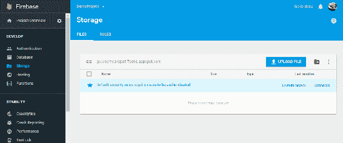
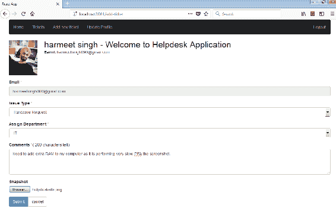
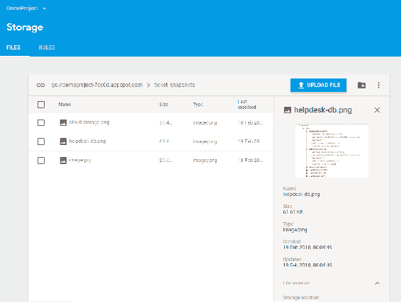
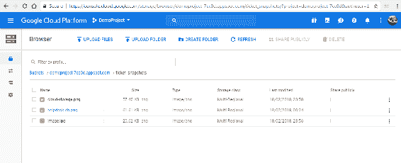
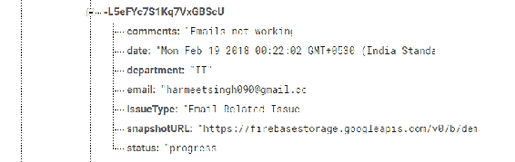
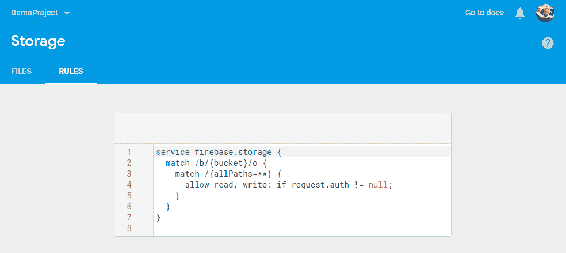
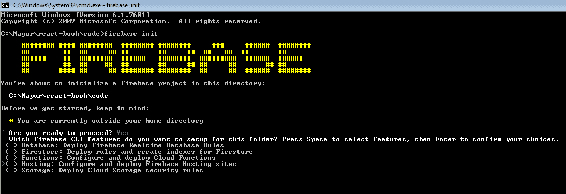
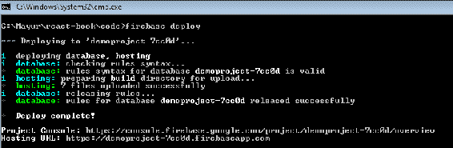
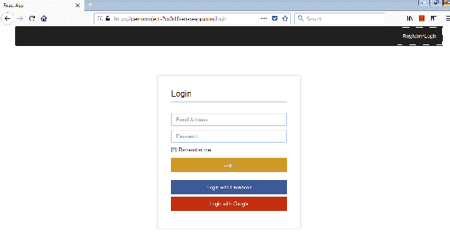
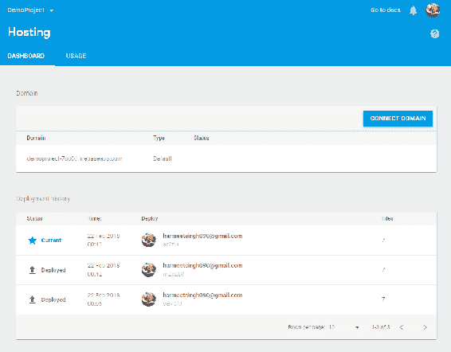

# 第八章：Firebase Cloud Storage

在本章中，我们将讨论 Firebase 的 Cloud Storage 以及它与 Google Cloud 平台的集成。我们还将探讨 Firebase 托管，它允许您在生产级环境上托管您的 Web 应用程序和静态内容（CDN）。

Cloud Storage 提供可扩展和安全的对象存储空间，因为今天大多数企业都需要可扩展的文件存储，考虑到他们通过移动应用程序、Web 应用程序或企业网站收集的大量数据。甚至部署在云上的应用程序也需要存储空间，无论是用于它们自己的资产，如图像、JavaScript、CSS、音频、视频文件，还是用户生成的内容，如文档、视频或音频。

Firebase Cloud Storage 的 SDK 使用 Google Cloud Storage 存储上传的文件。Google Cloud 平台需要一个计费账户来使用其产品，尽管他们提供了一些试用。Firebase Cloud Storage 的 SDK 使用 Google App Engine 免费层中的默认存储桶，因此您不需要计费账户。一旦您的应用程序开始增长，您还可以集成其他产品和服务，如托管计算、App Engine 或 Cloud Functions。

以下是本章将涵盖的主题列表：

+   Google Cloud Storage 概述

+   Google Cloud Storage 的关键特性

+   Google Cloud Storage 支持的存储类别

+   Google Cloud Storage 中安全性和访问控制列表（ACL）的概述

+   Firebase 的 Cloud Storage 的关键特性

+   Cloud Storage 的设置

+   将 Firebase Cloud Storage 与 HelpDesk 应用程序集成，以上传和下载文件

+   Google App Engine 概述

+   Firebase 托管概述

+   在 Firebase 托管上部署 HelpDesk 应用程序的前端

在深入讨论 Firebase 的 Cloud Storage 之前，让我们先讨论 Google Cloud Storage 及其特性。

# Google Cloud Storage

Google Cloud 平台提供了一个安全、可扩展、具有成本效益和高性能的基础设施，包括各种服务，用于开发、管理和运行应用程序所需的一切。Google Cloud Storage 是 Google Cloud 平台的一部分，它是满足您所有对象存储需求的一站式解决方案，从存储到实时流媒体到分析到归档，应有尽有。对象存储是一种高度可扩展和具有成本效益的存储服务，可存储任何类型的数据以其原生格式。

对于您不同的存储需求，Google Cloud Storage 提供不同类别的存储，即多区域存储、区域存储、Nearline 存储和 Coldline 存储。

# Google Cloud Storage 的关键特性

Google Cloud Storage 在以下关键领域提供优势：

+   **耐用性：** Google Cloud Storage 旨在提供 99.999999999%的年度耐用性。数据被冗余存储。当您上传数据时，它会在后台进行复制，并使用自动校验和来确保数据完整性。

+   **可用性：** Google Cloud Storage 提供高可用性，并在您需要时随时提供数据。根据 Google Cloud Storage 文档，多区域存储提供 99.95%的月度可用性，区域存储提供 99.9%的月度可用性。Nearline 和 Coldline 存储提供 99%的月度可用性。

+   **可扩展性：** Google Cloud Storage 具有无限可扩展性，因此可以支持从小型到百亿字节规模的系统。

+   **一致性：** Google Cloud Storage 确保读写一致性，这意味着如果写入成功，对于任何 GET 请求，全球范围内始终返回文档的最新副本。这适用于新建或覆盖对象的`DELETE`或`PUT`。

+   **安全性：** Google Cloud Storage 具有高度安全性，并具有谷歌级别的安全性，以保护您最关键的文档、媒体和资产。它还提供不同的访问控制选项，以便您可以控制谁可以访问存储对象以及在什么级别。

+   **易于使用：** Google Cloud Storage 提供简单易用的 API 和实用工具，用于处理对象存储。

我们需要了解一些 Google Cloud Storage 的基本概念，以便有效地使用它。所以，让我们在这里看看它们：

# 关键概念

Cloud Storage 中的所有数据都属于一个项目。一个项目包括 API、一组用户以及安全和监控设置。您可以创建任意多个项目。在项目内，我们有称为存储桶的数据容器，它们保存我们上传的数据作为对象。对象只是一个文件，还可以选择性地包含描述该文件的一些元数据。

# 存储桶

存储桶是容纳数据的容器。它们就像计算机文件系统中的目录，是您放置数据的基本容器。唯一的区别是，与目录不同，您不能嵌套存储桶。您在云存储中放置的所有内容都必须在存储桶内。存储桶允许您组织数据，并且还允许您控制对数据的访问权限。在设计应用程序时，由于一些强加的存储桶创建和删除速率限制，您应该计划更少的存储桶和大多数情况下更多的对象。每个项目大约每 2 秒可以进行 1 次操作。

创建存储桶时，您需要指定三件事：一个全局唯一的名称，一个默认存储类，以及存储桶及其内容存储的地理位置。如果您在存储对象时没有明确指定对象类别，则您选择的默认存储类将适用于该存储桶内的对象。

一旦创建了存储桶，除非删除并重新创建，否则无法更改存储桶的名称和位置。但是，您可以将其默认存储类更改为存储桶位置中提供的任何其他类。

存储桶名称应该是全局唯一的，并且可以与 CNAME 重定向一起使用。

您的存储桶名称必须满足以下要求：

+   它只能包含小写字母，数字和特殊字符：破折号（-），下划线（_）和点（.）。包含点的名称需要验证。

+   它必须以数字或字母开头和结尾。

+   它必须是 3 到 63 个字符长。包含点的名称可以长达 222 个字符，但是每个以点分隔的组件的长度不能超过 63 个字符。

+   它不能表示 IP 地址，例如`192.168.1.1`。

+   它不能以“goog”前缀开头，也不能包含 google 或 google 的拼写错误。

除了名称，您还可以将称为存储桶标签的键值元数据对与您的存储桶关联起来。存储桶标签允许您将存储桶与其他 Google Cloud Platform 服务（例如虚拟机实例和持久磁盘）分组。每个存储桶最多可以有 64 个存储桶标签。

# 对象

对象是您存储在云存储中的基本实体。您可以在一个存储桶中存储无限数量的对象，因此基本上没有限制。

对象由*对象数据*和对象元数据组成。对象数据通常是一个文件，并且对于云存储来说是不透明的（一块数据）。对象元数据是一组描述对象的键值对。

一个对象名称在存储桶中应该是唯一的；然而，不同的存储桶可以有相同名称的对象。对象名称是 Cloud Storage 中的对象元数据。对象名称可以包含任何组合的 Unicode 字符（UTF-8 编码），并且长度必须小于 1024 字节。

您的对象名称必须满足以下要求：

+   对象名称不得包含回车或换行字符。

+   对象名称不得以 well-known/acme-challenge 开头

您可以在对象名称中包含常见字符斜杠(/)，如果您希望使其看起来好像它们存储在分层结构中，例如/team。

对象名称中常见的字符包括斜杠(/)。通过使用斜杠，您可以使对象看起来好像它们存储在分层结构中。例如，您可以将一个对象命名为`/team/alpha/report1.jpg`，另一个命名为`object/team/alpha/report2.jpg`。当您列出这些对象时，它们看起来好像是基于团队的分层目录结构；然而，对于 Cloud Storage 来说，对象是独立的数据片段，而不是分层结构。

除了名称之外，每个对象都有一个关联的数字，称为**生成编号**。每当您的对象被覆盖时，它的生成编号就会改变。Cloud Storage 还支持一个名为对象版本控制的功能，允许您引用被覆盖或删除的对象。一旦您为一个存储桶启用了对象版本控制，它就会创建一个存档版本的对象，该对象被覆盖或删除，并关联一个唯一的生成编号来唯一标识一个对象。

# 资源

Google Cloud Platform 中的任何实体都是一个资源。无论是项目、存储桶还是对象，在 Google Cloud Platform 中，它都是一个资源。

每个资源都有一个关联的唯一名称来标识它。每个存储桶都有一个资源名称，格式为`projects/_/buckets/`[BUCKET_NAME]，其中[BUCKET_NAME]是存储桶的 ID。每个对象都有一个资源名称，格式为`projects/_/buckets/`[BUCKET_NAME]`/objects/`[OBJECT_NAME]，其中[OBJECT_NAME]是对象的 ID。

还可以在资源名称的末尾附加一个`#[NUMBER]`，表示对象的特定生成版本；`#0`是一个特殊标识符，表示对象的最新版本。当对象的名称以本应被解释为生成编号的字符串结尾时，`#0`会很有用。

# 对象的不可变性

在云存储中，当一个对象被上传后，在其生命周期内无法更改。成功上传对象和成功删除对象之间的时间就是对象的生命周期。这基本上意味着你无法通过追加一些数据或截断一些数据来修改现有对象。但是，你可以覆盖云存储中的对象。请注意，旧版本的文档将在成功上传新版本的文档之前对用户可用。

单个特定对象每秒只能更新或覆盖一次。

现在我们已经了解了云存储的基础知识，让我们来探索云存储中可用的存储类。

# 存储类

Google 云存储支持一系列基于不同用例的存储类。这些包括多区域和区域存储用于频繁访问的数据，近线存储用于较少访问的数据，如您每月不超过一次使用的数据，以及冷线存储用于极少访问的数据，如您每年只使用一次的数据。

让我们逐一了解它们。

# 多区域存储

多区域存储是地理冗余存储；它将您的数据存储在全球各地的多个地理位置或数据中心。它至少在存储桶的多区域位置内以至少 100 英里的距离分隔的两个地理位置存储您的数据。它非常适合低延迟高可用性应用程序，其中您的应用程序为全球用户提供内容，如视频、音频或游戏内容的实时流。由于数据冗余，它提供了高可用性。与其他存储类相比，它的成本略高。

它确保 99.95%的可用性 SLA。由于您的数据保存在多个地方，即使在自然灾害或其他干扰的情况下，它也提供高可用性。

作为多区域存储的数据只能放置在多区域位置，如美国、欧盟或亚洲，而不能放置在特定的区域位置，如 us-central1 或 asia-east1。

# 区域存储

区域存储将数据存储在特定的区域位置，而不是在不同地理位置分布的冗余数据。与多区域存储相比，它更便宜，并确保 99.9%的可用性 SLA。

区域存储更适合存储与使用数据的服务器实例位于同一区域位置的数据。它可以提供更好的性能，并且可以减少网络费用。

# 近线存储

有可能在某个时间点，应用程序或企业只频繁使用所有收集的数据中的一部分。在这种情况下，多区域或区域存储将不是理想的选择，也将是一种昂贵的选择。云存储提供了另一种存储类别，称为近线存储，可以解决之前的问题。这是一种用于存储访问频率较低的数据的低成本存储服务。在需要稍低可用性的情况下，近线存储是比多区域存储或区域存储更好的选择。例如，您每月对整个月份收集的数据进行一次分析。它确保**99.0%的可用性 SLA**。

近线存储也更适合数据备份、灾难恢复和归档存储。然而，需要注意的是，对于一年内访问频率较低的数据，Coldline 存储是最具成本效益的选择，因为它提供了最低的存储成本。

# Coldline 存储

Coldline 存储是一种用于数据归档和灾难恢复的成本非常低、高度耐用的存储服务。虽然它类似于“冷存储”，但它可以低延迟访问您的数据。这是您需要一年一两次的数据的最佳选择。您还可以将每日备份和归档文件存储到 Coldline 中，因为您不需要它们，并且只在灾难恢复时需要它们。它确保**99.0%的可用性 SLA**。

# 标准存储

当用户在创建存储桶时没有指定默认存储类时，它将被视为标准存储对象。在这样的存储桶中创建的没有存储类的对象也被列为标准存储。如果存储桶位于多区域位置，则标准存储等同于多区域存储，当存储桶位于区域存储时，它被视为区域存储。

需要注意的是，定价也会相应发生变化。如果等同于多区域存储，将适用多区域存储的费用。

现在我们了解了不同的存储类别，让我们来了解一下云存储中对象的生命周期管理。

# 生命周期管理

许多应用程序需要在一定时间后删除或归档旧资源的功能。以下是一些示例用例：

1.  将超过 1 年的文件从多区域存储移动到 Coldline 存储。

1.  从 Coldline 存储中删除超过 5 年的文件。

1.  如果启用了对象版本控制，只保留少量最近的对象版本。

幸运的是，Google Cloud Storage 提供了一个名为对象生命周期管理的功能，根据配置自动处理这种类型的操作。配置是一组适用于启用了此功能的存储桶的规则。

例如，以下规则指定删除超过 365 天的文件：

```jsx
// lifecycle.json
{
  "lifecycle": {
    "rule":
    [
      {
        "action": {"type": "Delete"},
        "condition": {"age": 365}  
      }
    ]
  }
}
```

# API 和工具

Google Cloud Platform 为云存储提供 SDK，还为不同平台的其他产品提供了一些 SDK，如 Node.js、Java、Python、Ruby、PHP 和 go。如果您不使用任何客户端库，它还提供 REST API。它还提供一个名为**gsutil**的命令行工具，允许您执行对象管理任务，包括以下内容：

+   上传、下载和删除对象

+   列出存储桶和对象

+   移动、复制和重命名对象

+   编辑对象和存储桶的 ACL

# 访问控制

有许多选项可用于管理存储桶和对象的访问权限。让我们看一下总结：

1.  **身份和访问管理**（**IAM**）权限：为您的项目和存储桶提供广泛的控制。它对于授予对存储桶的访问权限并允许对存储桶内的对象进行批量操作非常有用。

1.  **访问控制列表**（**ACL**）：为用户授予对单个存储桶或对象的读取或写入访问权限提供了细粒度的控制。

1.  签名 URL（查询字符串认证）：通过签名 URL 在有限的时间内为对象授予读取或写入访问权限。

1.  **签名策略文档**：允许您定义规则并对可以上传到存储桶的对象执行验证，例如，基于文件大小或内容类型进行限制。

1.  **Firebase 安全规则**：提供了细粒度和基于属性的规则语言，以使用 Firebase SDK 为云存储提供移动应用和 Web 应用的访问权限。

现在我们熟悉了 Google Cloud Storage 的关键概念，让我们回到 Firebase 的云存储。

# Firebase 云存储的关键特性

Firebase 云存储继承了 Google 云存储的优势或特性。然而，它还具有一些额外的特性，比如声明性安全规则语言，用于指定安全规则。

云存储的关键特点如下：

1.  **易用性和健壮性：**Firebase 云存储是一种简单而强大的解决方案，用于存储和检索用户生成的内容，如文档、照片、音频或视频。它提供了强大的上传和下载功能，使得文件传输在互联网连接中断时暂停，并在重新连接时从中断处恢复。这既节省时间又节省了互联网带宽。云存储的 API 也很简单，可以通过 Firebase SDK 来使用。

1.  **强大的安全性：**当涉及到云存储时，我们首先想到的是安全性。它足够安全吗？我的文件会发生什么？这些问题显而易见，也很重要。答案是肯定的，Firebase 云存储非常安全。它拥有 Google 安全性的力量。它与 Firebase 身份验证集成，为开发人员提供直观的身份验证。您还可以使用声明性安全规则来限制对文件的访问，根据内容类型、名称或其他属性。

1.  **高可扩展性：**Firebase 云存储由 Google 基础设施支持，提供了一个高度可扩展的存储环境，使您可以轻松地将应用程序从原型扩展到生产环境。这个基础设施已经支持了最流行和高流量的应用程序，如 Youtube、Google 照片和 Spotify。

1.  **成本效益：**云存储是一种成本效益的解决方案，您只需为所使用的内容付费。您无需购买和维护用于托管文件的服务器。

1.  **与其他 Firebase 产品良好集成：**云存储与其他 Firebase 产品良好集成，例如，在我们的上一章中，我们已经看到云存储触发器可以触发云函数，根据云存储上的文件操作执行一些逻辑。

我们已经了解了 Firebase 云存储的关键特点和优势。让我们看看它是如何实际运作的。

# 它是如何工作的？

Firebase SDK 用于云存储可以直接从客户端上传和下载文件。客户端能够重试或恢复操作，节省用户的时间和带宽。

在幕后，Cloud Storage 将您的文件存储在 Google Cloud Storage 存储桶中，因此可以通过 Firebase 和 Google Cloud 两者访问。这使您可以通过 Firebase SDK 从移动客户端上传和下载文件，并使用 Google Cloud 平台进行服务器端处理，例如生成图像缩略图或视频转码。由于 Cloud Storage 可以自动扩展，因此可以处理各种类型的应用程序数据，从小型到中型到大型应用程序。

在安全方面，Firebase Cloud Storage 的 SDK 与 Firebase 身份验证无缝集成，以识别用户。正如我们在第六章中所看到的，*Firebase 安全性和规则*，Firebase 还提供了声明性规则语言，让您控制对单个文件或文件组的访问。

让我们增强我们的 Helpdesk 应用程序，用户可以上传其个人资料图片。

# 设置 Cloud Storage

使用 Firebase SDK，我们可以轻松地在我们的应用程序中集成和设置 Firebase 的 Cloud Storage。

要设置 Cloud Storage，您将需要存储桶的 URL，您可以从我们的 Firebase 控制台获取。您可以从`Storage`菜单的`Files`选项卡中获取，如下所示：



一旦获得了引用，就可以将其添加到 Firebase 配置中。

考虑这个例子：

```jsx

import firebase from 'firebase';

const config = {
    apiKey: "AIzaSyDO1VEnd5VmWd2OWQ9NQkkkkh-ehNXcoPTy-w",
    authDomain: "demoproject-7cc0d.firebaseapp.com",
    databaseURL: "https://demoproject-7cc0d.firebaseio.com",
    projectId: "demoproject-7cc0d",
    storageBucket: "gs://demoproject-7cc0d.appspot.com",
    messagingSenderId: "41428255555"
};

export const firebaseApp = firebase.initializeApp(config);

// Get a reference to the storage service,
var storage = firebase.storage();
```

现在我们准备使用 Cloud Storage。现在我们需要创建一个引用，用于在文件层次结构中导航。

我们可以通过调用`ref()`方法来获取引用，就像这样：

```jsx
var storage = firebase.storage();
```

您还可以创建对树中特定下级节点的引用。例如，要获取对`images/homepage.png`的引用，我们可以这样写：

```jsx
var homepageRef = storageRef.child('images/homepage.jpg');
```

您还可以在文件层次结构中导航到上层或下层：

```jsx
// move to the parent of a reference - refers to images  var imagesRef = homepageRef.parent;

//move to highest parent or top of the bucket
var rootRef = homepageRef.root;

//chaining can be done for root, parent and child for multiple times
homepageRef.parent.child('test.jpg'); 
```

三个属性——**fullPath**、**name**和**bucket**——可用于引用以更好地理解引用的文件：

```jsx
// File path is 'images/homepage.jpg'
var path = homepageRef.fullPath

// File name is 'homepage.jpg'
var name = homepageRef.name

// Points to 'images'
var imagesRef = homepageRef.parent;
```

现在我们准备好进行上传功能。我们将扩展我们的 HelpDesk 应用程序，并为用户提供上传截图以及票务的其他细节的功能。我们将把上传的图片存储在 Cloud Storage for Firebase 中，并仅从那里检索。

# 上传文件

您可以上传文件或 Blob 类型、Uint8Array 或 base64 编码的字符串来上传文件到 Cloud Storage。对于我们的示例，我们将使用文件类型。如前所述，首先我们需要获取文件的完整路径的引用，包括文件名。

我们将修改`AddTicketForm.jsx`文件，以允许用户上传与票务相关的截图或图像。

现在，`src/add-ticket/'AddTicketForm.jsx'`文件看起来像下面这样。更改部分已用粗体标出并附有注释：

```jsx
import React, { Component } from 'react';
import firebase from '../firebase/firebase-config';
import { ToastSuccess, ToastDanger } from 'react-toastr-basic';

class AddTicketForm extends Component {

  constructor(props) {
    super(props);
    this.handleSubmitEvent = this.handleSubmitEvent.bind(this);
    this.handleChange = this.handleChange.bind(this);
    this.onChange = this.onChange.bind(this);
    console.log(props.userInfo);

    this.state = {
      uId: props.userId,
      email: props.userInfo[0].email,
      issueType: "",
      department: "",
      comment: "",
      snapshot: null
    }
  }

  handleChange(event) {
    console.log(event.target.value);
    this.setState({
      [event.target.id]: event.target.value
    });
  }

  //handle onchange - set the snapshot value to the file selected
  onChange(e) {
 console.log("ff ",e.target.files[0] );
 this.setState({snapshot:e.target.files[0]})
 }

  handleSubmitEvent(e) {
    e.preventDefault();
    var storageRef = firebase.storage().ref();

 // Create a reference to 'image'
 var snapshotRef = storageRef.child('ticket_snapshots/'+this.state.snapshot.name);

 //get a reference to 'this' in a variable since in callback this will point to different object
 var _this = this;
 snapshotRef.put(this.state.snapshot).then(function(res) {
 console.log('Uploaded a blob or file!');
 console.log(res.metadata);

 const userId = _this.state.uId;
 var data = {
 date: Date(),
 email: _this.state.email,
 issueType: _this.state.issueType,
 department: _this.state.department,
 comments: _this.state.comment,
 status: "progress",
 snapshotURL: res.metadata.downloadURLs[0]  //save url in db to use it for download
 }

 console.log(data);

 var newTicketKey = firebase.database().ref('/helpdesk').child('tickets').push().key;
 // Write the new ticket data simultaneously in the tickets list and the user's ticket list.
 var updates = {};
 updates['/helpdesk/tickets/' + userId + '/' + newTicketKey] = data;
 updates['/helpdesk/tickets/all/' + newTicketKey] = data;

 return firebase.database().ref().update(updates).then(() => {
 ToastSuccess("Saved Successfully!!");
 this.setState({
 issueType: "",
 department: "",
 comment: "",
 snapshot: _this.state.snapshot
 });
 }).catch((error) => {
 ToastDanger(error.message);
 });

 });

    //React form data object

  }
 //render() method - snippet given below
}
export default AddTicketForm;
```

让我们理解上述代码：

1.  在状态中添加一个 snapshot 属性。

1.  `OnChange()` - 注册`onChange()`事件，将文件设置在状态中的快照字段中。

1.  `onHandleSubmit()` - 我们已经创建了一个文件的引用，将其存储在名为`'ticket_snapshots'`的文件夹中，存储在 Firebase Cloud 存储中。一旦文件成功上传，我们将从响应元数据中获取一个下载 URL，并将其与其他票务详情一起存储在我们的实时数据库中。

您还需要在`render()`方法中进行一些 HTML 更改，以添加用于文件选择的输入字段：

```jsx
 render() {
    var style = { color: "#ffaaaa" };
    return (
      <form onSubmit={this.handleSubmitEvent} >
        <div className="form-group">
          <label htmlFor="email">Email <span style={style}>*</span></label>
          <input type="text" id="email" className="form-control"
            placeholder="Enter email" value={this.state.email} disabled  
            required onChange={this.handleChange} />
        </div>
        <div className="form-group">
          <label htmlFor="issueType">Issue Type <span style={style}> *</span></label>
          <select className="form-control" value={this.state.issueType} 
          id="issueType" required onChange={this.handleChange}>
            <option value="">Select</option>
            <option value="Access Related Issue">Access Related 
            Issue</option>
            <option value="Email Related Issues">Email Related 
             Issues</option>
            <option value="Hardware Request">Hardware Request</option>
            <option value="Health & Safety">Health & Safety</option>
            <option value="Network">Network</option>
            <option value="Intranet">Intranet</option>
            <option value="Other">Other</option>
          </select>
        </div>
        <div className="form-group">
          <label htmlFor="department">Assign Department
        <span style={style}> *</span></label>
          <select className="form-control" value={this.state.department} id="department" required onChange={this.handleChange}>
            <option value="">Select</option>
            <option value="Admin">Admin</option>
            <option value="HR">HR</option>
            <option value="IT">IT</option>
            <option value="Development">Development</option>
          </select>
        </div>
        <div className="form-group">
          <label htmlFor="comments">Comments <span style={style}> *</span></label>
          (<span id="maxlength"> 200 </span> characters left)
            <textarea className="form-control" rows="3" id="comment" value={this.state.comment} onChange={this.handleChange} required></textarea>
        </div>
        <div className="form-group">
 <label htmlFor="fileUpload">Snapshot</label>
 <input id="snapshot" type="file" onChange={this.onChange} />
 </div>
        <div className="btn-group">
          <button type="submit" className="btn btn-
          primary">Submit</button>
          <button type="reset" className="btn btn-
          default">cancel</button>
        </div>
      </form>
    );
  }
```

我们的 add-ticket 表单看起来像这样：



然后，您可以检查您的 Firebase 控制台，看看文件上传是否正常工作。以下屏幕截图显示，我们上传的文件（`helpdesk-db.png`）已成功保存在 Firebase 的 Cloud Storage 中：



如前所述，Firebase 的 Cloud 存储与 Google Cloud 存储高度集成，并使用 Google Cloud 存储的存储桶来存储文件。您可以登录到 Google Cloud 平台的控制台[`console.cloud.google.com/storage`](https://console.cloud.google.com/storage)并在存储部分进行检查。您还应该在那里看到您上传的所有文件。

下一个屏幕截图显示，文件可以从 Google Cloud 平台控制台中查看：



现在，您还可以检查您的数据库，看看已创建的票务是否具有快照 URL 属性和相应的值-文件的 downloadURL。

数据库的以下屏幕截图显示，快照 URL 已正确存储：



耶！云存储已与我们的应用集成。但是，我们还没有完成。我们需要允许用户查看已上传的图像，因此我们还将实现下载文件功能。但是，在我们转到下载文件功能之前，我想提到您应更新云存储的安全规则以控制对文件的访问。根据默认规则，要执行所有文件的`.read`和`.write`操作，需要 Firebase 身份验证。

默认规则如下图所示：



但是，您应根据自己的需求进行更新。

# 添加文件元数据

当您上传文件时，还可以为该文件存储一些元数据，例如 Content-Type 或名称。

您可以创建一个带有键值对的 JSON 对象，并在上传文件时传递该对象。对于自定义元数据，您可以在元数据对象内创建一个对象，如下所示：

```jsx
// Create file metadata including the content type  var metadata =  { contentType:  'image/jpeg',
 customMetadata: {
      'ticketNo':'12345'
  } };  // Upload the file and metadata  var uploadTask = storageRef.child('folder/file.jpg').put(file, metadata);
```

# 管理上传和错误处理

云存储允许您管理文件上传；您可以恢复、暂停或取消上传。相应的方法可在`UploadTask`上使用，该方法由`put()`或`putString()`返回，可用作承诺或用于管理和监视上传的状态：

```jsx
// Upload the file and metadata  var uploadTask = storageRef.child('folder/file.jpg').put(file);  // Pause the upload - state changes to pause uploadTask.pause();  // Resume the upload - state changes to running uploadTask.resume();  // Cancel the upload - returns an error indicating file upload is cancelled uploadTask.cancel();
```

您可以使用'state_change'观察者来监听进度事件。如果您想要为文件上传显示实时进度条，这非常有用：

| **事件类型** | **用途** |
| --- | --- |
| 运行中 | 当任务开始或恢复上传时，会触发此事件。 |
| 进度 | 当任何数据上传到云存储时，会触发此事件。用于显示上传进度条。 |
| 暂停 | 当上传暂停时，会触发此事件。 |

当事件发生时，将传回一个**TaskSnapshot**对象，可用于查看事件发生时的任务。

对象被传回。它包含以下属性：

| 属性 | 类型 | 描述 |
| --- | --- | --- |
| 传输的字节数 | `数字` | 在拍摄快照时已传输的总字节数。 |
| 总字节数 | `数字` | 要上传的总字节数。 |
| 状态 | `firebase.storage.TaskState` | 当前上传状态 |
| 元数据 | `firebaseStorage.Metadata` | 包含服务器在上传完成时发送的元数据；在那之前，包含发送到服务器的元数据。 |
| 任务 | `firebaseStorage.UploadTask` | 可用于暂停、取消或恢复任务。 |
| ref | `firebaseStorage.Reference` | 该任务来源的引用。 |

当您上传文件时，可能会发生一些错误。您可以使用回调中获得的错误对象来处理错误。

以下代码片段显示了管理文件上传和错误处理的示例代码：

```jsx
// File
var file = this.state.snapshot;

// Create the file metadata
var metadata = {
  contentType: 'image/jpeg'
};

// Upload file and metadata to the object 'images/mountains.jpg'
var uploadTask = storageRef.child('ticket_snapshots/' + file.name).put(file, metadata);

// Listen for state changes, errors, and completion of the upload.
uploadTask.on(firebase.storage.TaskEvent.STATE_CHANGED, // or 'state_changed'
  function(snapshot) {
    // Get task progress, including the number of bytes uploaded and the total number of bytes to be uploaded
    var progress = (snapshot.bytesTransferred / snapshot.totalBytes) * 100;
    console.log('Upload is ' + progress + '% done');
    switch (snapshot.state) {
      case firebase.storage.TaskState.PAUSED: // or 'paused'
        console.log('Upload is paused');
        break;
      case firebase.storage.TaskState.RUNNING: // or 'running'
        console.log('Upload is running');
        break;
    }
  }, function(error) {

  // A full list of error codes is available at
  // https://firebase.google.com/docs/storage/web/handle-errors
  switch (error.code) {
    case 'storage/unauthorized':
      // User doesn't have permission to access the object
      break;

    case 'storage/canceled':
      // User canceled the upload
      break;

    case 'storage/unknown':
      // Unknown error occurred, inspect error.serverResponse
      break;
  }
}, function() {
  // Upload completed successfully, now we can get the download URL
  var downloadURL = uploadTask.snapshot.downloadURL;
});
```

现在，让我们转到下载文件部分。

# 下载文件

要下载文件，您需要使用文件的`https://或 gs://` URL 获取对该文件的引用，或者您可以通过将子路径附加到存储根来构造它。

下一个代码片段显示了这些方法：

```jsx
var storage = firebase.storage();  var pathReference = storage.ref('images/stars.jpg');  // Create a reference from a Google Cloud Storage URI  var gsReference = storage.refFromURL('gs://bucket/folder/file.jpg')  // Create a reference from an HTTPS URL  // Note that in the URL, characters are URL escaped!  var httpsReference = storage.refFromURL('https://firebasestorage..../file.jpg')
```

我们将扩展我们的 HelpDesk 应用程序，以允许用户查看已上传的票据的快照。您需要更新`ticket-listing`文件夹下的`ViewTickets.jsx`文件中的代码。我们已经从数据库中获取了一个 URL，因此我们不需要获取下载 URL 的引用：

```jsx
 componentDidMount() {
    const itemsRef = firebase.database().ref('/helpdesk/tickets/'+this.props.userId);

    itemsRef.on('value', (snapshot) => {
      let tickets = snapshot.val();
      if(tickets != null){
        let ticketKeys = Object.keys(tickets);
        let newState = [];
        for (let ticket in tickets) {
          newState.push({
            id:ticketKeys,
            email:tickets[ticket].email,
            issueType:tickets[ticket].issueType,
            department:tickets[ticket].department,
            comments:tickets[ticket].comments,
            status:tickets[ticket].status,
            date:tickets[ticket].date,
            snapshotURL: tickets[ticket].snapshotURL
        });
      }
        this.setState({
          tickets: newState
        });
      }
    });
}

render() {
    return (
        <table className="table">
        <thead>
        <tr> 
            <th>Email</th>
            <th>Issue Type</th> 
            <th>Department</th> 
            <th>Comments</th>
            <th>Status</th> 
            <th>Date</th> 
            <th>Snapshot</th> 
        </tr>
        </thead>
        <tbody>
              {

                this.state.tickets.length > 0 ?
                this.state.tickets.map((item,index) => {
                return (

                  <tr key={item.id[index]}>
                    <td>{item.email}</td>
                    <td>{item.issueType}</td> 
                    <td>{item.department}</td> 
                    <td>{item.comments}</td>
                    <td>{item.status === 'progress'?'In Progress':''}</td> 
                    <td>{item.date}</td> 
                    <th><a target="_blank" href={item.snapshotURL}>View</a></th> 
                  </tr>
                )
              }) :
              <tr>
                <td colSpan="5" className="text-center">No tickets found.</td>
              </tr>
            }
        </tbody>
        </table>
    );
```

就像上传文件一样，您也需要以类似的方式处理下载的错误。

现在，让我们看看如何从云存储中删除文件。

# 删除文件

要删除文件，您首先需要获取对文件的引用，就像我们在上传和下载中看到的那样。一旦您获得了引用，就可以调用`delete()`方法来删除文件。它返回一个承诺，如果成功则解决，如果出现错误则拒绝。

考虑这个例子：

```jsx
// Create a reference to the file to delete  var fileRef = storageRef.child('folder/file.jpg');  // Delete the file desertRef.delete().then(function()  {  // File deleted successfully  }).catch(function(error)  {  // an error occurred!  });
```

现在，让我们看看什么是 Google App Engine。

# Google App Engine

Google App Engine 是一个“平台即服务”，它抽象了基础设施的担忧，让您只关注代码。它提供了一个根据接收的流量量自动扩展的平台。您只需要上传您的代码，它就会自动管理您的应用程序的可用性。Google App Engine 是向 Firebase 应用程序添加额外处理能力或受信任执行的简单快速的方法。

如果您有一个 App Engine 应用程序，您可以使用内置的 App Engine API 在 Firebase 和 App Engine 之间共享数据，因为 Firebase 云存储的 SDK 使用 Google App Engine 默认存储桶。这对于执行计算密集型的后台处理或图像操作非常有用，例如创建上传图像的缩略图。

Google App Engine 标准环境提供了一个环境，您的应用在其中以受支持的语言的运行时环境运行，即 Python 2.7、Java 8、Java 7、PHP 5.5 和 Go 1.8、1.6。如果您的应用代码需要这些语言的其他版本或需要其他语言，您可以使用 Google App Engine 灵活环境，在该环境中，您的应用在运行在 Google Cloud 虚拟机上的 docker 容器上。

这两个环境之间有许多不同之处，可以在 Google Cloud 文档中进行探索[`cloud.google.com/appengine/docs/the-appengine-environments`](https://cloud.google.com/appengine/docs/the-appengine-environments)。

如果您想将现有的 Google Cloud Platform 项目导入 Firebase，并希望使任何现有的 App Engine 对象可用，您需要通过运行以下命令使用`gsutil`设置对象的默认访问控制，以允许 Firebase 访问它们。

```jsx
gsutil -m acl ch -r -u firebase-storage@system.gserviceaccount.com:O gs://<your-cloud-storage-bucket>
```

# Firebase 托管

Firebase Hosting 提供了一种安全且简单的方式来在 CDN 上托管您的静态网站和资源。Hosting 的主要特点如下：

1.  通过安全连接提供：内容始终通过 SSL 安全地传输

1.  更快的内容传递：文件在全球的 CDN 边缘被缓存，因此内容传递更快。

1.  更快的部署：您可以在几秒钟内使用 Firebase CLI 部署您的应用

1.  轻松快速的回滚：如果出现任何错误，只需一个命令即可回滚

Hosting 提供了部署和管理静态网站所需的所有基础设施、功能和工具，无论是单页面应用还是复杂的渐进式应用。

默认情况下，您的网站将托管在[firebaseapp.com](http://firebaseapp.com)域的子域上。使用 Firebase CLI，您可以将计算机上的本地目录中的文件部署到您的托管服务器上。

当您将您的网站移至生产环境时，您可以将您自己的域名连接到 Firebase Hosting。

# 部署您的网站

您需要安装 Firebase CLI 来部署您的静态网页应用。

Firebase CLI 可以通过一个命令进行安装：

```jsx
npm install -g firebase-tools
```

现在，让我们在云上部署我们的 HelpDesk 应用程序。我们有两个 HelpDesk 项目：react 应用（一个名为 code 的项目）和服务器应用（一个名为 node 的项目）。让我们首先在 Firebase Hosting 上托管或部署我们的客户端 react 应用。

进入您的项目目录（代码）并运行以下命令来初始化配置：

```jsx
firebase init
```

如下截图所示，它会问您“您想为此文件夹设置哪个 Firebase 功能？”，您需要选择“Hosting”：



它将在项目的根目录中创建一个 `firebase.json` 文件。`firebase.json` 的结构将如下所示：

```jsx
{
  "database": {
    "rules": "database.rules.json"
  },
  "hosting": {
    "public": "build",
    "ignore": [
      "firebase.json",
      "**/.*",
      "**/node_modules/**"
    ],
    "rewrites": [
      {
        "source": "**",
        "destination": "/index.html"
      }
    ]
  }
}
```

public 属性告诉 Firebase 要上传到托管的目录。该目录必须存在于您的项目目录中。

您现在可以使用以下命令部署您的站点：

```jsx
firebase deploy
```

它会要求您进行 Firebase CLI 登录。您可以使用以下命令来执行：

```jsx
firebase login --reauth
```

成功登录后，您可以再次运行 `firebase deploy` 命令来部署您的应用程序：



成功部署后，您将获得项目的 Hosting URL，类似于 `https://YOUR-FIREBASE-APP>.firebaseapp.com`。在我们的案例中，它是 *[`demoproject-7cc0d.firebaseapp.com/`](https://demoproject-7cc0d.firebaseapp.com/)。*现在您可以转到生成的 URL 并确认它是可访问的：



耶！我们已经在 Firebase Hosting 上部署了我们的第一个应用程序。您还可以在 Firebase 控制台的 Hosting 部分检查 URL：



您还可以通过单击**连接域**按钮来配置您的自定义域。它将引导您通过向导来配置您自己的域名。

# 摘要

本章介绍了 Google 云平台。它为您提供了对 Google 云存储和 Google 应用引擎的基本理解，以及我们如何将 Firebase 的云存储与 Google 云存储集成。我们探索了 Firebase 的云存储，并看到了如何将文件上传、下载和删除到云存储。我们还扩展了 HelpDesk 应用程序，允许用户上传屏幕截图以及工单详细信息，并查看/下载已上传的图像。此外，我们还探讨了如何在 Firebase Hosting 上部署我们的应用程序。

在下一章中，我们将讨论开发人员在使用 React 和 Firebase 时应遵循的编码标准和最佳实践，以获得更好的应用程序性能、减少错误数量，以及更易于管理的应用程序代码。
