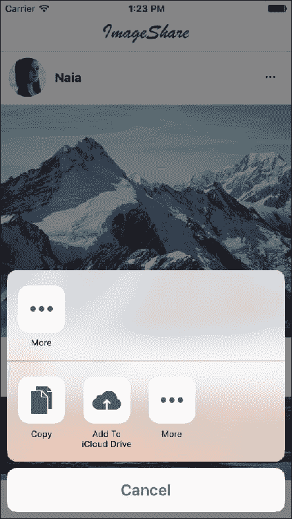
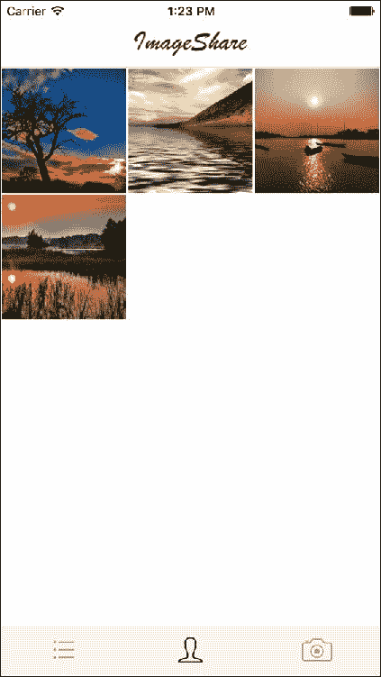
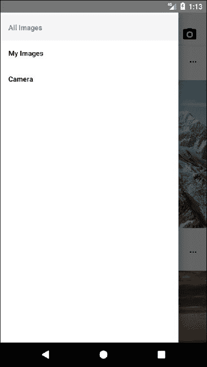
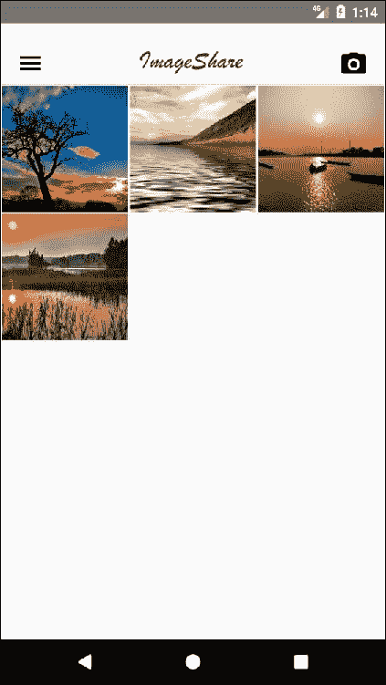
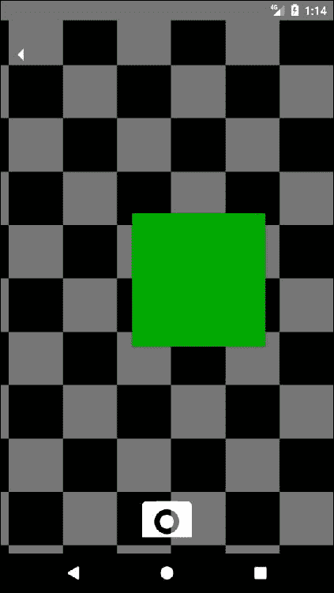
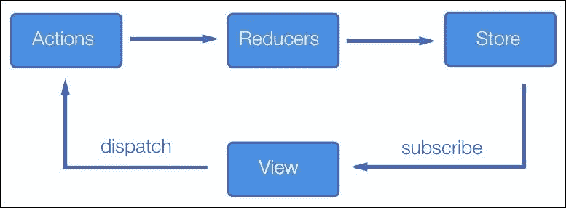

# 第二章：项目 2 - 图像分享应用程序

到目前为止，我们知道如何创建一个具有自定义界面的功能齐全的应用程序。您甚至学会了如何添加一个状态管理库来控制我们应用程序中的共享数据，以便代码库保持可维护和可扩展。

在本课程中，我们将专注于使用不同的状态管理库（Redux）构建应用程序，利用相机功能，编写特定于平台的代码，并深入构建自定义用户界面，既吸引人又可用。图像分享应用程序将作为这些功能的一个很好的示例，并且还将为理解如何在 React Native 上构建大型应用程序奠定基础。

我们将重用我们的大部分代码，这个应用程序将可用于两个平台：iOS 和 Android。尽管我们的大部分用户界面将是自定义的，但我们将使用`native-base`来简化 UI 元素，如图标。对于导航，我们将再次使用`react-navigation`，因为它为每个平台提供了最常用的导航：iOS 的选项卡导航和 Android 的抽屉菜单导航。最后，我们将使用`react-native-camera`来处理与设备相机的交互。这不仅会减少实现复杂性，还会为我们提供一大堆免费的功能，我们可以在将来扩展我们的应用程序时使用。

对于这个应用程序，我们将模拟一些 API 调用，这样我们就不需要构建后端。当构建连接的应用程序时，这些调用应该很容易被真实的 API 替换。

# 概览

构建图像分享应用程序的主要要求之一是具有吸引人的设计。我们将遵循一些最流行的图像分享应用程序的设计模式，为每个平台调整这些模式，同时尽量重用尽可能多的代码，利用 React Native 的跨平台能力。

让我们首先来看一下 iOS 中的用户界面：


主屏幕显示一个简单的标题和图像列表，包括用户图片、姓名和一个**更多**图标以分享图像。在底部，选项卡导航显示三个图标，代表三个主要屏幕：**所有图像**、**我的图像**和**相机**。

### 注意

此示例应用程序中使用的所有图像都可以以任何形式使用。

当用户按下特定图像的**更多**图标时，将显示**分享**菜单：



这是一个标准的 iOS 组件。在模拟器上使用它并没有太多意义，最好在实际设备上进行测试。

让我们来看看第二个屏幕，**我的图片**：



这是当前用户上传的所有图片的网格表示，可以通过下一个屏幕**相机**进行更新：


iOS 模拟器不包括对任何相机的支持，因此这个功能最好在实际设备上进行测试，尽管`react-native-camera`是完全可用的，并且在访问时将返回虚假数据。我们将使用静态图像进行测试。

这就是 iOS 的全部内容；现在让我们转向 Android 版本：


由于 Android 鼓励使用抽屉式导航而不是选项卡，我们将在页眉中包括一个抽屉菜单图标，并且还将通过不同的图标使相机可用。


与 iOS 的**分享**菜单一样，Android 有自己的控制器，因此我们将利用这一功能，并在用户点击特定图像上的**更多**图标时包含它：



当用户点击抽屉菜单图标时，菜单将显示出来，显示三个可用屏幕。从这里，用户可以导航到**我的图片**屏幕：



最后，相机屏幕也可以通过抽屉菜单访问：



Android 模拟器包括一个由彩色移动方块组成的相机模拟，可以用于测试。但出于一致性原因，我们将继续使用 iOS 版本中使用的固定图像。

本课程将涵盖以下主题：

+   React Native 中的 Redux

+   使用相机

+   特定平台的代码

+   抽屉和选项卡导航

+   与其他应用程序共享数据

# 设置文件夹结构

让我们使用 React Native 的 CLI 初始化一个 React Native 项目。该项目将命名为`imageShare`，并将适用于 iOS 和 Android 设备：

```jsx
**react-native init --version="0.44.0" imageShare**

```

为了在此应用程序中使用一些包，我们将使用特定版本的 React Native（`0.44.0`）。

我们将为我们的应用程序使用 Redux，因此我们将创建一个文件夹结构，其中可以容纳我们的`reducers`、`actions`、`components`、`screens`和`api`调用：

此外，我们已经在`img`文件夹中添加了`logo.png`。至于其余部分，我们有一个非常标准的 React Native 项目。入口点将是`index.ios.js`用于 iOS 和`index.android.js`用于 Android：

```jsx
/*** index.ios.js and index.android.js ***/ 

import { AppRegistry } from 'react-native';
import App from './src/main';

AppRegistry.registerComponent('imageShare', () => App);
```

我们对两个文件的实现是相同的，因为我们希望使用`src/main.js`作为两个平台的通用入口点。

让我们跳转到我们的`package.json`文件，了解我们的应用程序将有哪些依赖项：

```jsx
/*** package.json ***/

{
        "name": "imageShare",
        "version": "0.0.1",
        "private": true,
        "scripts": {
                "start": "node node_modules/react-native/
                local-cli/cli.js start",
                "test": "jest"
        },
        "dependencies": {
                "native-base": "².1.5",
                "react": "16.0.0-alpha.6",
                "react-native": "0.44.0",
                "react-native-camera": "⁰.8.0",
                "react-navigation": "¹.0.0-beta.9",
                "react-redux": "⁵.0.5",
                "redux": "³.6.0",
                "redux-thunk": "².2.0"
        },
        "devDependencies": {
                "babel-jest": "20.0.3",
                "babel-preset-react-native": "1.9.2",
                "jest": "20.0.3",
                "react-test-renderer": "16.0.0-alpha.6"
        },
        "jest": {
                "preset": "react-native"
        }
}
```

一些依赖项，如`react-navigation`或`native-base`，是以前课程中的老朋友。其他一些，如`react-native-camera`，将在本课程中首次介绍。其中一些与我们将在此应用程序中使用的状态管理库 Redux 密切相关：

+   `redux`：这就是状态管理库本身

+   `react-redux`：这些是 Redux 的 React 处理程序

+   `redux-thunk`：这是处理异步操作执行的 Redux 中间件

为了完成安装，我们需要链接`react-native-camera`，因为它需要对我们应用程序的本地部分进行一些更改：

```jsx
react-native link react-native-camera
```

在 iOS 10 及更高版本中，我们还需要修改我们的`ios/imageShare/Info.plist`以添加一个**相机使用说明**，这应该显示以请求权限在应用程序内启用相机。我们需要在最后的`</dict></plist>`之前添加这些行：

```jsx
<key>NSCameraUsageDescription</key>
<string>imageShare requires access to the camera on this device to perform this action</string>
<key>NSPhotoLibraryUsageDescription</key>
<string>imageShare requires access to the image library on this device to perform this action</string>
```

# Redux

Redux 是一个基于简单原则的 JavaScript 应用程序的可预测状态容器：

+   您应用程序的整个状态存储在一个**store**内的对象树中

+   改变状态树的唯一方法是发出一个**action**，一个描述发生了什么的对象

+   为了指定操作如何转换状态树，您需要编写纯**reducers**

它的流行程度来自于在任何类型的代码库（前端或后端）中使用它所能产生的一致性、可测试性和开发人员体验。由于其严格的单向数据流，它也很容易理解和掌握：



用户触发和由**Reducers**处理的**Actions**，这些**Reducers**只是应用基于该**Action**的状态变化的纯函数。生成的状态保存在一个**Store**中，该**Store**由我们应用程序中的**View**使用，以显示应用程序的当前状态。

Redux 是一个复杂的主题，超出了本书的范围，但它将在本书的一些课程中广泛使用，因此可能有益于查看它们的官方文档([`redux.js.org/`](http://redux.js.org/))，以熟悉这个状态管理库的基本概念。

Redux 的一些基本概念将在我们的`src/main.js`文件中使用：

```jsx
/*** src/main.js ***/

import React from 'react';
import { DrawerNavigator,TabNavigator } from 'react-navigation';
import { Platform } from 'react-native';

import { Provider } from 'react-redux';
import { createStore, combineReducers, applyMiddleware } from 'redux';
import thunk from 'redux-thunk';
import imagesReducer from './reducers/images';

import ImagesList from './screens/ImagesList.js';
import MyImages from './screens/MyImages.js';
import Camera from './screens/Camera.js';

let Navigator;
if(Platform.OS === 'ios'){
  Navigator = TabNavigator({
    ImagesList: { screen: ImagesList },
    MyImages: { screen: MyImages },
    Camera: { screen: Camera }
  }, {
    tabBarOptions: {
      inactiveTintColor: '#aaa',
      activeTintColor: '#000',
      showLabel: false
    }
  });
} else {
  Navigator = DrawerNavigator({
    ImagesList: { screen: ImagesList },
    MyImages: { screen: MyImages },
    Camera: { screen: Camera }
  });
}let store = createStore(combineReducers({ imagesReducer }), applyMiddleware(thunk));

export default class App extends React.Component {
  render() {
    return (
      <Provider store={store}>
        <Navigator/>
      </Provider>
    )
  }
}
```

让我们首先关注 Redux 的仪式。`let store = createStore(combineReducers({ imagesReducer }), applyMiddleware(thunk));`通过组合导入的 reducer（我们这个应用程序只有一个 reducer，所以这只是信息性的）并应用**Thunk**中间件来设置存储，这将使我们的应用程序能够使用异步操作。我们将模拟几个 API 调用，这些调用将返回异步承诺，因此需要这个中间件来正确处理这些承诺的解析。

然后，我们有我们的`render`方法：

```jsx
<Provider store={store}>
   <Navigator/>
</Provider>
```

这在大多数使用 React 的 Redux 应用程序中都是标准的。我们用一个`<Provider />`组件包装根组件`(<Navigator />`在我们的例子中)来确保我们将从我们应用程序的根部分获得`store`。Redux 的`connect`方法将在我们继续本课程时在我们的容器或屏幕中可用。

我们将使用一个`<Navigator />`组件作为我们应用程序的根，但它将根据运行的平台的不同而具有不同的性质：

```jsx
let Navigator;
if(Platform.OS === 'ios'){
  Navigator = TabNavigator({

    ...

  });
} else {
  Navigator = DrawerNavigator({

    ...

  });
}
```

`Platform`是一个 React Native API，主要用于识别我们的应用程序正在运行的平台。我们可以通过用`if(Platform.OS === 'ios'){ ... }`括起来的代码来编写特定于 iOS 的代码，对于 Android 也是一样：`if(Platform.OS === 'android'){ ... }`。

在这种情况下，我们将在 iOS 上使用它来构建一个选项卡导航器，在 Android 上使用它来构建一个抽屉导航器，这些都是这些平台上的**事实**导航模式。在这两个导航器上，我们将把`ImagesList`、`MyImages`和`Camera`设置为我们应用程序中的三个主要屏幕。

# ImagesList

我们应用程序中的主屏幕是从后端检索的图像列表。我们将显示这些图像以及它们对应的上传者个人资料图片和名称。对于每个图像，我们将显示`更多`，可以用于与用户设备上的其他应用程序共享图像，例如消息应用程序或社交网络。这个屏幕的大部分 UI 将从`<Gallery />`组件派生，因此我们将专注于将屏幕与 Redux 存储连接起来，添加自定义标题，并添加一个滚动视图使画廊可滚动，并添加一个活动指示器来警告用户有网络活动：

```jsx
/*** src/components/ImagesList ***/

import React from 'react';
import { View, ScrollView } from 'react-native';

import { bindActionCreators } from 'redux';
import { connect } from 'react-redux';
import * as Actions from '../actions';
import { Icon } from 'native-base';

import Header from '../components/Header';
import Gallery from '../components/Gallery';
import ActivityIndicator from '../components/ActivityIndicator';

class ImagesList extends React.Component {
  static navigationOptions = {
    tabBarIcon: ({ tintColor }) => (
      <Icon name='list' style={{fontSize: 40, color: tintColor}}/>
    ),
    drawerLabel: 'All Images'
  };

  componentWillMount() {
    this.props.fetchImages();
  }

  componentWillReceiveProps(nextProps) {
    if(!this.props.addingImage && nextProps.addingImage) {
      this.scrollable.scrollTo({y: 0});
    }
  }

  render() {
    return (
      <View style={{flex: 1}}>
        <Header onMenuButtonPress={() => 
        this.props.navigation.navigate('DrawerOpen')}
        onCameraButtonPress={() => 
        this.props.navigation.navigate('Camera')}/>
<ScrollView ref={(scrollable) => {
            this.scrollable = scrollable;
          }}>
          { this.props.addingImage && <ActivityIndicator 
            message='Adding image' /> }
          <Gallery imageList={this.props.images} loading=
          {this.props.fetchingImages}/>
        </ScrollView>
      </View>
    );
  }
}

function mapStateToProps(state) { return { images: state.imagesReducer.images, addingImage: state.imagesReducer.addingImage, fetchingImages: state.imagesReducer.fetchingImages } }
function mapStateActionsToProps(dispatch) { return bindActionCreators(Actions, dispatch) }

export default connect(mapStateToProps, mapStateActionsToProps)(ImagesList);
```

由于大多数 React 应用程序使用 Redux，我们需要将我们的组件与状态和操作连接起来。我们将创建两个函数（`mapStateToProps`和`mapStateActionsToProps`）来装饰我们的`<ImageList />`组件，以映射组件感兴趣的操作和状态的部分：

+   `images`：这是我们将在`<Gallery />`中用于呈现的图像列表

+   `addingImage`：这是一个标志，当上传图像时我们将设置为`true`

+   `fetchingImages`：当应用程序请求从后端获取图像列表以更新存储时，此标志将设置为`true`

在这个屏幕上，我们唯一需要的操作是`fetchImages`，它可以通过`propscomponent`访问，因为我们将`Actions`中的操作列表连接到我们的`<ImagesList />`组件。同样，我们通过`props`还可以访问三个状态变量（`images`，`addingImage`和`fetchingImages`）,这要归功于相同的`connect`调用：

```jsx
function mapStateToProps(state) {
  return {
    images: state.imagesReducer.images,
    addingImage: state.imagesReducer.addingImage,
    fetchingImages: state.imagesReducer.fetchingImages
  };
}
function mapStateActionsToProps(dispatch) {
  return bindActionCreators(Actions, dispatch);
}

export default connect(mapStateToProps, mapStateActionsToProps)(ImagesList);
```

这就是我们从 Redux 需要的全部。我们将在其他屏幕中看到这种模式，因为它是连接 React 组件与存储部分和操作列表的常见解决方案。

`fetchImages`动作在`componentWillMount`上调用，作为要呈现的图像列表的初始检索：

```jsx
componentWillMount() { 
   this.props.fetchImages(); 
}
```

我们还添加了一种方法来检测`addingImage`标志何时设置为`true`以显示活动指示器：

```jsx
componentWillReceiveProps(nextProps) {
  if(!this.props.addingImage && nextProps.addingImage) {
    this.scrollable.scrollTo({y: 0});
  }
}
```

这个方法将在`<Scrollview />`中调用`scrollTo`，以确保它显示顶部部分，因此`<ActivityIndicator />`对用户可见。这次我们使用了自定义的`<ActivityIndicator />`（从`src/components/ActivityIndicator`导入），因为我们不仅想显示旋转器，还想显示消息。

最后，我们将添加两个组件：

+   `<Header />`：显示标志和（在 Android 版本中）两个图标，用于导航到抽屉菜单和相机屏幕

+   `<Gallery />`：这显示了格式化的图片列表和上传者

在转移到另一个屏幕之前，让我们看一下我们在这个屏幕中包含的三个自定义组件：`<ActivityIndicator />`、`<Header />` 和 `<Gallery />`。

# Gallery

Gallery 包含了所有图片列表的渲染逻辑。它依赖于 `native-base`，更具体地说，依赖于它的两个组件，`<List />` 和 `<ListItem />`：

```jsx
/*** src/components/Gallery ***/

import React from 'react';
import { List, ListItem, Text, Icon, Button, Container, Content }
 from 'native-base';
import { Image, Dimensions, View, Share, ActivityIndicator, StyleSheet } from 'react-native';

var {height, width} = Dimensions.get('window');

export default class Gallery extends React.Component {
  _share(image) {
   Share.share({message: image.src, title: 'Image from: ' + 
                image.user.name}) 
  }

  render() {
    return (
      <View>
        <List style={{margin: -15}}>
          {
            this.props.imageList && this.props.imageList.map((image) =>  
            {
              return (
                <ListItem 
                    key={image.id} 
                    style={{borderBottomWidth: 0, 
                    flexDirection: 'column', marginBottom: -20}}>
                  <View style={styles.user}>
                    <Image source={{uri: image.user.pic}} 
                     style={styles.userPic}/>
                    <Text style={{fontWeight: 'bold'}}>
                    {image.user.name}</Text>
                  </View>
                  <Image source={{uri: image.src}} 
                  style={styles.image}/>
                  <Button style={{position: 'absolute', right: 15, 
                  top: 25}} transparent 
                  onPress={this._share.bind(this, image)}>
                    <Icon name='ios-more' style={{fontSize: 20, 
                    color: 'black'}}/>
                  </Button>
                </ListItem>
              );
            })
          }
        </List>
        {
          this.props.loading &&
          <View style={styles.spinnerContainer}>
            <ActivityIndicator/>
          </View>
        }
      </View>
    );
  }
}

const styles = StyleSheet.create({
  user: {
    flexDirection: 'row',
    alignSelf: 'flex-start',
    padding: 10
  },
  userPic: {
    width: 50,
    height: 50,
    resizeMode: 'cover',
    marginRight: 10,
    borderRadius: 25
  },
  image: {
    width: width,
    height: 300,
    resizeMode: 'cover'
  },
  spinnerContainer: {
    justifyContent: 'center',
    height: (height - 50)
  }
});
```

这个组件从它的父组件中获取两个 props：`loading` 和 `imageList`。

`loading` 用于显示标准的 `<ActivityIndicator />`，显示用户的网络活动。这次我们使用标准的指示器，而不是自定义指示器，因为应该很清楚网络活动表示的是什么。

`imageList` 是存储图片列表的数组，它将在我们的 `<Gallery />` 中一次渲染一个 `<ListItem />`。每个 `<ListItem />` 都包含一个带有 `onPress={this._share.bind(this, image)` 的 `<Button />`，用于与其他应用程序共享图片。让我们看一下 `_share` 函数：

```jsx
_share(image) {
  Share.share({message: image.src, title: 'Image from: ' 
               + image.user.name}) 
}
```

`Share` 是一个用于分享文本内容的 React Native API。在我们的情况下，我们将分享图片的 URL（`img.src`）以及一个简单的标题。分享文本是在应用程序之间共享内容的最简单方式，因为许多应用程序都会接受文本作为共享格式。

值得注意的是我们对图片应用的样式，使其占据整个宽度并具有固定高度（`300`），这样即使显示的图片大小不同，我们也能获得稳定的布局。为了实现这一设置，我们使用了 `resizeMode: 'cover'`，这样图片在任何维度上都不会被拉伸。这意味着我们可能会裁剪图片，但这样可以保持统一性。另一个选项是使用 `resizeMode: contain`，如果我们不想裁剪任何内容，而是想要将图片适应这些边界并可能缩小它们。

# Header

我们想要在多个屏幕之间重用一个自定义的标题。这就是为什么最好为它创建一个单独的组件，并在这些屏幕中导入它的原因：

```jsx
/*** src/components/Header ***/

import React from 'react';
import { View, Image, StyleSheet } from 'react-native';
import { Icon, Button } from 'native-base';
import { Platform } from 'react-native';

export default class Header extends React.Component {
  render() {
    return (
      <View style={styles.container}>
        {
          Platform.OS === 'android' &&
          <Button transparent onPress={this.props.onMenuButtonPress}>
            <Icon android='md-menu' style={styles.menuIcon}/>
          </Button>
        }
        <Image source={require('../../img/logo.png')} 
          style={styles.logo} />
        {
          Platform.OS === 'android' &&
          <Button onPress={this.props.onCameraButtonPress} transparent>
            <Icon name='camera' style={styles.cameraIcon}/>
          </Button>
        }
      </View>
    );
  }
}

const styles = StyleSheet.create({
  container: {
    paddingTop: 20,
    flexDirection: 'row',
    alignItems: 'center',
    justifyContent: 'space-around',
    borderBottomWidth: 1,
    borderBottomColor: '#ccc'
  },
  menuIcon: {
    fontSize: 30,
    color: 'black'
  },
  logo: {
    height: 25,
    resizeMode: 'contain',
    margin: 10
  },
  cameraIcon: {
    fontSize: 30,
    color: 'black'
  }
});
```

我们再次使用 `Platform` API 来检测安卓设备，并且只在该平台上显示抽屉菜单按钮和相机按钮。我们决定这样做是为了使这些功能更加突出，从而减少需要按下的按钮数量，以便安卓用户更容易地使用这些功能。按下按钮时要执行的操作是通过父组件通过两个 props 传递的：

+   `onMenuButtonPress`

+   `onCameraButtonPress`

这两个属性调用两个单独的函数，调用导航器的`navigate`方法：

+   `this.props.navigation.navigate('DrawerOpen')`

+   `this.props.navigation.navigate('Camera')`

最后要注意的是我们如何设置这个组件中容器的布局。我们使用`justifyContent: 'space-around'`，这是告诉 Flexbox 均匀分布项目在行中，并在它们周围有相等的空间。请注意，从视觉上看，这些空间并不相等，因为所有项目在两侧都有相等的空间。第一个项目将在容器边缘有一个单位的空间，但下一个项目之间将有两个单位的空间，因为下一个项目有自己的间距。


# ActivityIndicator

我们的自定义`ActivityIndicator`是一个非常简单的组件：

```jsx
/*** src/components/ActivityIndicator ***/

import React from 'react';
import { ActivityIndicator, View, Text, StyleSheet } 
from 'react-native';

export default class CustomActivityIndicator extends React.Component {
  render() {
    return (
      <View style={styles.container}>
        <ActivityIndicator style={{marginRight: 10}}/>
        <Text>{this.props.message}</Text>
      </View>
    );
  }
}

const styles = StyleSheet.create({
  container: {
    flexDirection: 'row',
    justifyContent: 'center',
    padding: 10,
    backgroundColor: '#f0f0f0'
  }
});
```

它接收一个消息作为属性，并将其显示在标准旋转器旁边。我们还添加了自定义背景颜色（`#f0f0f0`）以使其在白色背景上更加可见。

现在让我们转移到相机屏幕，将我们的图像添加到列表中。

# 相机

在使用`react-native-camera`时，大部分拍照逻辑可以被抽象出来，因此我们将专注于在我们的组件中使用这个模块，并确保通过 Redux 操作将其连接到我们应用程序的状态：

```jsx
/*** src/screens/Camera ***/

import React, { Component } from 'react';
import {
  Dimensions,
  StyleSheet,
  Text,
  TouchableHighlight,
  View
} from 'react-native';
import { Button, Icon } from 'native-base';
import Camera from 'react-native-camera';
import { bindActionCreators } from 'redux';
import { connect } from 'react-redux';
import * as Actions from '../actions';

class CameraScreen extends Component {
  static navigationOptions = {
    tabBarIcon: ({ tintColor }) => (
      <Icon name='camera' style={{fontSize: 40, color: tintColor}}/>
    ),
  };

  render() {
    return (
      <View style={styles.container}>
        <Camera
          ref={(cam) => {
            this.camera = cam;
          }}
          style={styles.preview}
          aspect={Camera.constants.Aspect.fill}>
          <Button onPress={this.takePicture.bind(this)} 
          style={styles.cameraButton} transparent>
            <Icon name='camera' style={{fontSize: 70,
            color: 'white'}}/>
          </Button>
        </Camera>
        <Button onPress={() => 
         this.props.navigation.navigate('ImagesList')} 
         style={styles.backButton} transparent>
          <Icon ios='ios-arrow-dropleft' android='md-arrow-dropleft' 
           style={{fontSize: 30, color: 'white'}}/>
        </Button>
      </View>
    );
  }

  takePicture() {
    const options = {};
    this.camera.capture({metadata: options})
      .then((data) => {
        this.props.addImage(data);
        this.props.navigation.navigate('ImagesList');
      })
      .catch(err => console.error(err));
  }
}

const styles = StyleSheet.create({
  container: {
    flex: 1,
    flexDirection: 'row',
  },
  preview: {
    flex: 1,
    justifyContent: 'flex-end',
    padding: 20
  },
  capture: {
    flex: 0,
    backgroundColor: '#fff',
    borderRadius: 5,
    color: '#000',
    padding: 10,
    margin: 40
  },
  cameraButton: {
    flex: 0, 
    alignSelf: 'center'
  },
  backButton: {
    position: 'absolute',
    top:20
  }
});

function mapStateToProps(state) { return {} }
function mapStateActionsToProps(dispatch) { return bindActionCreators(Actions, dispatch) }

export default connect(mapStateToProps, mapStateActionsToProps)(CameraScreen);
```

`react-native-camera`的工作方式是通过提供一个我们可以包含在屏幕中的组件，并通过引用，我们可以调用它的`capture`方法，该方法返回一个我们可以使用的承诺，以调用`addImage`将我们的图像上传到应用程序的后端。

让我们更仔细地看一下`<Camera />`组件：

```jsx
<Camera
   ref={(cam) => {
     this.camera = cam;
   }}
   style={styles.preview}
   aspect={Camera.constants.Aspect.fill}>

...

</Camera>
```

`<Camera />`组件有三个属性：

+   `ref`：这在父组件中为`<Camera />`组件设置一个引用，以便调用捕获方法。

+   `样式`：这允许开发人员指定应用程序中组件的外观。

+   `aspect`：这允许您定义视图渲染器在显示相机视图时的行为。有三个选项：`fill`，`fit`和`stretch`。

当用户按下相机按钮时，`takePicture`函数将被调用：

```jsx
takePicture() {
    const options = {};
    this.camera.capture({metadata: options})
    .then((data) => {
      this.props.addImage(data);
      this.props.navigation.navigate('ImagesList');
    })
    .catch(err => console.error(err));
}
```

我们将使用保存的相机引用来调用其`capture`方法，我们可以传递一些元数据（例如，拍摄照片的位置）。这个方法返回一个 promise，将使用这个数据调用`addImage`动作将这个数据发送到后端，这样图片就可以添加到`imagesList`中。在将图像发送到后端后，我们将使应用程序导航回`ImagesList`屏幕。`addImage`方法将设置`addingImages`标志，因此`ImageList`屏幕可以显示相应消息的活动指示器。

让我们继续看看我们应用程序中的最后一个屏幕：`MyImages`。

# MyImages

这个屏幕显示了已登录用户上传的所有图像。我们在这个屏幕上使用虚假图像来预先填充这个屏幕，但更多的图像可以通过相机屏幕添加。

大部分渲染逻辑将被移动到一个名为`<ImagesGrid />`的单独组件中：

```jsx
/*** src/screens/MyImages ***/

import React from 'react';
import { 
  Image,
  TouchableOpacity,
  Text,
  View,
  ActivityIndicator,
  Dimensions 
} from 'react-native';

import { bindActionCreators } from 'redux';
import { connect } from 'react-redux';
import * as Actions from '../actions';
import { Icon } from 'native-base';

import Header from '../components/Header';
import ImagesGrid from '../components/ImagesGrid';

var {height, width} = Dimensions.get('window');

class MyImages extends React.Component {
  static navigationOptions = {
    drawerLabel: 'My Images',
    tabBarIcon: ({ tintColor }) => (
      <Icon name='person' style={{fontSize: 40, color: tintColor}}/>
    )
  };

  componentWillMount() {
    this.props.fetchImages(this.props.user.name);
  }

  render() {
    return (
      <View>
        <Header onMenuButtonPress={() => 
        this.props.navigation.navigate('DrawerOpen')} 
        onCameraButtonPress={() => 
        this.props.navigation.navigate('Camera')}/>
        {
          this.props.fetchingImages &&
          <View style={{justifyContent: 'center', 
           height: (height - 50)}}>
            <ActivityIndicator/>
          </View>
        }
        <ImagesGrid images={this.props.images}/>
      </View>
    );
  }
}

function mapStateToProps(state) { return { images: state.imagesReducer.userImages, user: state.imagesReducer.user, fetchingImages: state.imagesReducer.fetchingUserImages } }
function mapStateActionsToProps(dispatch) { return bindActionCreators(Actions, dispatch) }

export default connect(mapStateToProps, mapStateActionsToProps)(MyImages);
```

这个组件的第一件事是调用`fetchImages`动作，但与`<ImagesList />`组件不同的是，它只传递用户名来仅检索已登录用户的图片。当我们创建这个动作时，我们需要考虑到这一点，并接收一个可选的`userName`参数来过滤我们将检索的图像列表。

除此之外，这个组件将大部分行为委托给`<ImageGrid />`，这样我们可以重用渲染能力给其他用户。让我们继续看看`<ImageGrid />`。

# ImageGrid

一个简单的滚动视图和图像列表。这个组件就是这么简单，但它配置成可以让图像以网格的方式轻松流动：

```jsx
/*** src/components/ImageGrid ***/

import React from 'react';
import { 
  Image,
  TouchableOpacity, 
  ScrollView, 
  Dimensions, 
  View,
  StyleSheet
} from 'react-native';

var {height, width} = Dimensions.get('window');

export default class ImagesGrid extends React.Component {
  render() {
    return (
      <ScrollView>
        <View style={styles.imageContainer}>
          {
            this.props.images && 
            this.props.images.map(img => {
              return (<Image style={styles.image} 
              key={img.id} source={{uri: img.src}}/>);
            })
          }
        </View>
      </ScrollView>
    );
  }
}

const styles = StyleSheet.create({
  imageContainer: {
    flexDirection: 'row',
    alignItems: 'flex-start',
    flexWrap: 'wrap'
  },
  image: {
    width: (width/3 - 2),
    margin: 1,
    height: (width/3 - 2),
    resizeMode: 'cover'
  }
});
```

在设置容器样式时，我们使用`flexWrap`：'wrap'来确保图像不仅在`row`方向上流动，而且当设备宽度覆盖一行图像时也会扩展到新行。通过为每个图像设置`width`和`height`为`width/3 - 2`，我们确保容器可以每行容纳三个图像，包括两个像素的小间距。

还有一些通过`npm`可用的网格模块，但我们决定为此构建我们自己的组件，因为我们不需要网格中的额外功能，并且以这种方式可以获得灵活性。

这些就是我们在图像分享应用中需要的所有屏幕和视觉组件。现在让我们来看看让它们一起工作的粘合剂，即动作和减速器。

# 动作

正如我们在屏幕上看到的，这个应用只需要两个操作，`fetchImages`（对所有用户或特定用户）和`addImage`：

```jsx
/*** src/actions/index ***/

import api from '../api';

export function fetchImages(userId = null) {
  let actionName, actionNameSuccess, actionNameError;
  if(userId) {
    actionName = 'FETCH_USER_IMAGES';
    actionNameSuccess = 'FETCH_USER_IMAGES_SUCCESS';
    actionNameError = 'FETCH_USER_IMAGES_ERROR';
  } else {
    actionName = 'FETCH_IMAGES';
    actionNameSuccess = 'FETCH_IMAGES_SUCCESS';
    actionNameError = 'ADD_IMAGE_ERROR';
  }

  return dispatch => {
    dispatch({ type: actionName });
    api
      .fetchImages(userId)
      .then(images => {
        dispatch({ 
          type: actionNameSuccess,
          images
        })  
      })
      .catch(error => {
        dispatch({ 
          type: actionNameError,
          error
        });  
      });
  };
}

export function addImage(data = null) {
  return dispatch => {
    dispatch({ type: 'ADD_IMAGE' });
    api
      .addImage()
      .then(imageSrc => {
        dispatch({ 
          type: 'ADD_IMAGE_SUCCESS',
          imageSrc
        });  
      })
      .catch(error => {
        dispatch({ 
          type: 'ADD_IMAGE_ERROR',
          error
        });  
      });
  };
}
```

Redux 操作只是描述事件的简单对象，包括其有效负载。由于我们使用了`redux-thunk`，我们的**action creators**将返回一个函数，在这个函数中将调用 Redux 的`dispatch`函数，传递操作。让我们更仔细地看看我们的`addImage`操作：

```jsx
export function addImage(data = null) {
  return dispatch => {
    dispatch({ type: 'ADD_IMAGE' });
    api
      .addImage()
      .then(imageSrc => {
        dispatch({ 
          type: 'ADD_IMAGE_SUCCESS',
          imageSrc
        }); 
      })
      .catch(error => {
        dispatch({ 
          type: 'ADD_IMAGE_ERROR',
          error
        }); 
      });
  };
}
```

我们返回的函数首先通过不带有效负载的操作`ADD_IMAGE`来调度一个操作，因为我们只是想让 Redux 知道我们准备好发起网络请求将图像上传到我们的后端。然后，我们使用我们的`api`进行该请求（稍后我们将模拟这个调用）。这个请求将返回一个 promise，所以我们可以附加`.then`和`.catch`回调来处理响应。如果响应是积极的（图像被正确上传），我们将调度一个`ADD_IMAGE_SUCCESS`操作，传递上传图像的 URL。如果出现错误，我们将调度一个`ADD_IMAGE_ERROR`操作，涵盖所有可能的状态。

大多数 action creators 在**Redux**和**Thunk**中进行网络请求时都是以类似的方式工作。事实上，我们的 action `fetchImages`与`addImage`非常相似，只有一个例外：它需要检查是否传递了`userId`，并发出一组不同的操作，以便 reducers 可以相应地修改状态。让我们来看一下将处理所有这些操作的 reducers。

# Reducers

在 Redux 中，reducers 是负责在发生新操作时更新状态的函数。它们接收当前的`state`和操作（包括任何有效负载），并返回一个新的状态对象。我们不会深入研究 reducers 的工作原理，我们只需要了解它们的基本结构：

```jsx
/*** src/reducers/index ***/

const initialState = {
  images: null,
  userImages: null,
  error: null,
  user: {
    id: 78261,
    name: 'Sharer1',
    pic: 'https://cdn.pixabay.com/photo/2015/07/20/12/53/
          man-852762_960_720.jpg'
  }
}

export default function (state = initialState, action) {
  switch(action.type){
    case 'FETCH_IMAGES': 
      return Object.assign({}, state, {
        images: [],
        fetchingImages: true,
        error: null
      });
    case 'FETCH_IMAGES_SUCCESS': 
      return Object.assign({}, state, {
        fetchingImages: false,
        images: action.images,
        error: null
      });
    case 'FETCH_IMAGES_ERROR': 
      return Object.assign({}, state, {
        fetchingImages: false,
        images: null,
        error: action.error
      });
    case 'FETCH_USER_IMAGES': 
      return Object.assign({}, state, {
        userImages: [],
        fetchingUserImages: true,
        error: null
      });
    case 'FETCH_USER_IMAGES_SUCCESS': 
      return Object.assign({}, state, {
        fetchingUserImages: false,
        userImages: action.images,
        error: null
      });
    case 'FETCH_USER_IMAGES_ERROR': 
      return Object.assign({}, state, {
        fetchingUserImages: false,
        userImages: null,
        error: action.error
      });
    case 'ADD_IMAGE': 
      return Object.assign({}, state, {
        addingImage: true,
        error: null
      });
    case 'ADD_IMAGE_SUCCESS': 
      let image = {
        id: Math.floor(Math.random() * 99999999),
        src: action.imageSrc, 
        user: state.user
      }
      return Object.assign({}, state, {
        addingImage: false,
        images: [image].concat(state.images),
        userImages: [image].concat(state.images),
        error: null
      });
    case 'ADD_IMAGE_ERROR': 
      return Object.assign({}, state, {
        addingImage: false,
        error: action.error
      });
    default:
      return state;
  }
}
```

让我们来分解一下：

```jsx
const initialState = {
  images: null,
  userImages: null,
  error: null,
  user: {
    id: 78261,
    name: 'Sharer1',
    pic: 'https://cdn.pixabay.com/photo/2015/07/20/12/53/
          man-852762_960_720.jpg'
  }
}
```

我们从一个初始状态开始，其中所有属性都将设置为`null`，除了`user`，它将包含模拟用户数据。这个初始状态默认在启动时由 reducer 注入：

```jsx
export default function (state = initialState, action) {

  ...

}
```

在后续的调用中，Redux 将在应用任何操作后注入实际状态。在这个函数内部，我们有一个`switch`来评估每个触发的操作的类型，以根据该操作及其有效负载修改状态。例如，让我们来看一下`FETCH_IMAGES_SUCCESS`操作：

```jsx
case 'FETCH_IMAGES_SUCCESS': 
  return Object.assign({}, state, {
    fetchingImages: false,
    images: action.images,
    error: null
  });
```

Redux 中的一个规则是，减速器不应该改变状态，而是在触发动作后返回一个新对象。使用`Object.assign`，我们返回一个包含当前状态加上基于刚刚发生的动作的所需更改的新对象。在这种情况下，我们将`fetchingImages`标志设置为`false`，以便让我们的组件知道它们可以隐藏与获取图像动作相关的任何活动指示器。我们还将收到的图像列表（来自`actions.images`）设置在我们状态的`images`键中，以便它们可以被注入到需要它们的组件中。最后，我们将`error`标志设置为`null`，以隐藏由于先前状态而显示的任何错误。

正如我们之前提到的，每个异步操作都应该分成三个单独的动作来表示三种不同的状态：异步请求挂起，成功和出错。这样，我们将为我们的应用程序有三组动作：

+   `FETCH_IMAGES`，`FETCH_IMAGES_SUCCESS`和`FETCH_IMAGES_ERROR`

+   `FETCH_USER_IMAGES`，`FETCH_USER_IMAGES_SUCCESS`和`FETCH_USER_IMAGES_ERROR`

+   `ADD_IMAGE`，`ADD_IMAGE_SUCCESS`和`ADD_IMAGE_ERROR`

重要的是要注意，我们为`FETCH_IMAGES`和`FETCH_USER_IMAGES`有单独的情况，因为我们希望同时保留两个不同的图像列表：

+   包含用户正在关注的所有人的图像的通用列表

+   用户上传的图片列表

最后缺失的部分是从动作创建者调用的 API 调用。

# API

在现实世界的应用程序中，我们会将所有对后端的调用放在一个单独的`api`文件夹中。出于教育目的，我们只是模拟了对我们应用程序核心的两个 API 调用，`addImage`和`fetchImages`：

```jsx
/*** src/api/index ***/

export default {
  addImage: function(image) {
    return new Promise((resolve, reject) => {
      setTimeout(()=>{
        resolve( '<imgUrl>' );
      }, 3000)
    })
  },
  fetchImages: function(user = null){
    const images = [

      {id: 1, src: '<imgUrl>', user: {pic: '<imgUrl>', name: 'Naia'}},
      {id: 2, src: '<imgUrl>', user: {pic: '<imgUrl>', 
       name: 'Mike_1982'}},
      {id: 5, src: '<imgUrl>', user: {pic: '<imgUrl>', 
       name: 'Sharer1'}},
      {id: 3, src: '<imgUrl>', user: {pic: '<imgUrl>', name: 'Naia'}},
      {id: 6, src: '<imgUrl>', user: {pic: '<imgUrl>', 
       name: 'Sharer1'}},
      {id: 4, src: '<imgUrl>', user: {pic: '<imgUrl>', 
       name: 'Sharer1'}},
      {id: 7, src: '<imgUrl>', user: {pic: '<imgUrl>', 
       name: 'Sharer1'}}

    ]
    return new Promise((resolve, reject) => {
      setTimeout(()=>{
        resolve( images.filter(img => !user || user === img.user.name)   
      );
      }, 1500);
    })
  }
}
```

为了模拟网络延迟，我们添加了一些`setTimeouts`，这将有助于测试我们设置的用于显示用户网络活动的活动指示器。我们还使用了 promise 而不是普通的回调来使我们的代码更易于阅读。我们还在这些示例中跳过了图像 URL，以使其更简洁。

# 摘要

我们在这个应用程序中使用了 Redux，并且这塑造了我们使用的文件夹结构。虽然使用 Redux 需要一些样板代码，但它有助于以合理的方式拆分我们的代码库，并消除容器或屏幕之间的直接依赖关系。当我们需要在屏幕之间保持共享状态时，Redux 绝对是一个很好的补充，因此我们将在本书的其余部分继续使用它。在更复杂的应用程序中，我们需要构建更多的减速器，并可能按领域将它们分开并使用 Redux `combineReducers`。此外，我们需要添加更多的操作，并为每组操作创建单独的文件。例如，我们需要登录、注销和注册的操作，我们可以将它们放在名为`src/actions/user.js`的文件夹中。然后，我们应该将我们与图像相关的操作（目前在`index.js`中）移动到`src/actions/images.js`，这样我们就可以修改`src/actions/index.js`以将其用作用户和图像操作的组合器，以便在需要一次性导入所有操作时使用。

Redux 还有助于测试，因为它将应用程序的业务逻辑隔离到减速器中，因此我们可以专注于对其进行彻底测试。

模拟 API 调用使我们能够为我们的应用程序构建一个快速原型。当后端可用时，我们可以重用这些模型进行测试，并用真正的 HTTP 调用替换`src/api/index.js`。无论如何，最好为我们所有的 API 调用建立一个单独的文件夹，这样如果后端发生任何更改，我们就可以轻松地替换它们。

您还学会了如何构建特定平台的代码（在我们的案例中是特定于 Android），这对大多数应用程序来说是非常有用的功能。一些公司更喜欢为每个平台编写单独的应用程序，并且只重用它们的业务逻辑代码，在任何基于 Redux 的应用程序中都应该非常容易，因为它驻留在减速器中。

在 React Native 中没有特定的 API 来控制设备的相机，但我们可以使用`react-native-camera`模块来实现。这是一个访问 iOS 和 Android 本地 API 并在 React Native JavaScript 世界中公开它们的库的示例。

在我们的下一课中，我们将通过构建一个消息应用程序来探索和跨越 React Native 应用程序中本地和 JavaScript 世界之间的桥梁。

# 评估

1.  由 ______ 处理的操作只是纯函数，根据该操作对状态进行更改。

1.  查看器

1.  减速器

1.  导航器

1.  中间件

1.  Gallery 包含了所有图像列表的渲染逻辑。它依赖于 _____，更具体地说，依赖于它的两个组件，<List /> 和 <ListItem />。

1.  `native-base`

1.  `base-native`

1.  `resizeMode`

1.  `header`

1.  判断以下陈述是真还是假：每当在 Firebase 中存储新消息时，`this.selectedChatMessages` 将被同步以反映它。

1.  以下哪个是 `<TextInput/>` 的属性，当用户按下键盘上的 **Return** 或 **Next** 按钮时将被调用？

1.  `this.refs.loginPassword.focus()`

1.  `React.Component`

1.  `onSubmitEditing`

1.  `onChangeText`

1.  在将登录屏幕分成两个表单：<LoginForm /> 和 <RegistrationForm /> 时，需要传递哪三个属性组件？
